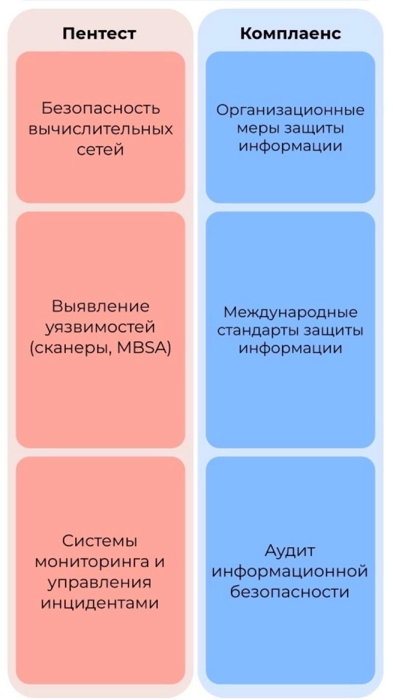

# Первый курс. Семестр 1.

## 1. Нормативно-правовое обеспечение информационной безопасности

Директория: [norm_obespechenie](./norm_obespechenie/)

Модули:
1. [Погружение в ИБ: термины, определения, комплаенс ](<./norm_obespechenie/01 Погружение в ИБ.md>)
1. [Построение СМИБ](<./norm_obespechenie/02 Построение СМИБ.md>)
1. [Нормативный комплаенс](<./norm_obespechenie/03 Комплаенс.md>)

## 2. Сети и системы передачи данных

Директория: [net_and_data_transfer](./net_and_data_transfer/)

Модули:
- [3-4 Теоретические основы построения локальных вычислительных сетей](<./net_and_data_transfer/03 CiscoPacketTracer.md>)

## 3. Защита в операционных системах

Директория: [os_sec](./os_sec/)

Модули:
1. [Введение в Linux](<./os_sec/01 Введение в Linux.md>)

## 4. Криптография

Директория: [cryptography](./cryptography/)

Модули:
1. [Криптографические системы и методы защиты информации](<./cryptography/01 Криптографические системы и методы защиты информации.md>)
1. [Асимметричные алгоритмы и хэш-функции](<./cryptography/02 Асимметричные алгоритмы и хэш-функции.md>)
1. [Введение в инфраструктуру открытых ключей](<./cryptography/03 Введение в инфраструктуру открытых ключей.md>)
1. [Применение криптографических средств](<./cryptography/04 Применение криптографических средств.md>)

## 5. Технические средства защиты информации

Директория: [tech_faci_in_infsec](./tech_faci_in_infsec/)

Модули:
1. [Введение в ИБ, цели и задачи](<./tech_faci_in_infsec/01_Введение в ИБ, цели и задачи.md>) 
1. [Шлюзы безопасности](<./tech_faci_in_infsec/02 Шлюзы безопасности.md>)
1. [Межсетевые экраны и IPS_IDS](<./tech_faci_in_infsec/03 Межсетевые экраны и IPS_IDS.md>) 
1. [Системы контроля привилегированных пользователей и доверенной загрузки и другие системы обеспечения ИБ](<./tech_faci_in_infsec/04 Системы контроля привилегированных пользователей и доверенной загрузки и другие системы обеспечения ИБ.md>)

## 6. Программная инженерия

Директория: [pi](./pi/)

[Модуль 5 UML](./pi/05_UML.md)

## 7. Теоретические основы ИБ

Директория: [theory_fun_is](./theory_fun_is/)

Моудли:
1. [Теоретические подходы и модели ИБ](<./theory_fun_is/01 Теоретические подходы и модели ИБ.md>)
1. [Теория применения требований ИБ](<./theory_fun_is/02 Теория применения требований ИБ.md>)
1. [Оценка защищенности](<./theory_fun_is/03 Оценка защищенности.md>)

Текст ИСО\ГОСТ 27001: [./theory_fun_is/текст_гост_исо_27001.pdf](./theory_fun_is/текст_гост_исо_27001.pdf)

Тесты:
- Исходник: [./theory_fun_is/questions.html](./theory_fun_is/questions.html)
- [Как web-страница: https://raw.githack.com/IKarasev/Study/main/theory_fun_is/questions.html](https://raw.githack.com/IKarasev/Study/main/theory_fun_is/questions.html)

## 8. Защищенные информационные системы

Директория: [secure_is](./secure_is/)

Модули:
1. [Проектирование информационных систем с учётом угроз](<./secure_is/01 Проектирование информационных систем с учётом угроз.md>)
1. [Разработка регламентов использования средств защиты информации](<./secure_is/02 Разработка регламентов использования средств защиты информации.md>)
1. [Требования к документации](<./secure_is/03 Требования к документации.md>)

Тесты:
- Исходник: [./secure_is/questions.html](./secure_is/questions.html)
- Как web: [https://raw.githack.com/IKarasev/Study/main/secure_is/questions.html](https://raw.githack.com/IKarasev/Study/main/secure_is/questions.html)

# Первый курс. Семестр 2.

## Выбор трека

 

## 9. Управление информационной безопасностью

Директория: [uib](./uib/)

Силлабус: [./uib/syllabus.md](./uib/syllabus.md)

Модули:
1. [Модуль 1. Архитектура организации и корпоративная архитектура безопасности](<./uib/01 Арх орг и корп арх безоп.md>)
1. [Модуль 2. Система управления ИБ](<./uib/02 Система управления ИБ.md>)
1. [Модуль 3. Фреймворки контролей и процессов ИТ/ИБ](<./uib/03 Фреймворки контролей и процессов ИТ_ИБ.md>)

Тесты:
- Исходник: [./uib/questions.html](./uib/questions.html)
- Как Web: [https://raw.githack.com/IKarasev/Study/main/uib/questions.html](https://raw.githack.com/IKarasev/Study/main/uib/questions.html)

## 12. Мониторинг, аналитика и оценка рисков ИБ

Директория: [risk_maa](./risk_maa/)

Силлабус: [./risk_maa/syllabus.md](./risk_maa/syllabus.md)

Модули:
1. [Основы информационной безопасности](./risk_maa/01_Основы_информационной_безопасности.md)
1. [Аналитика информационной безопасности](./risk_maa/02_Аналитика_информационной_безопасности.md)
1. [Мониторинг информационной безопасности и оценка рисков](./risk_maa/03_Мониторинг_информационной_безопасности_и_оценка_рисков.md)

Тесты:
- Исходник: [./risk_maa/questions.html](./risk_maa/questions.html)
- Как web: [https://raw.githack.com/IKarasev/Study/main/risk_maa/questions.html](https://raw.githack.com/IKarasev/Study/main/risk_maa/questions.html)

## 15. Разработка защищенных программных систем

Директория: [sec_sys_dev](./sec_sys_dev/)

Модули:
1. [Основные подходы к построению защищенных информационных систем. Введение в разработку защищенного программного обеспечения](./sec_sys_dev/1_Осн_подходы_постр_защ_инф_сис.md)

## 17. Технологии построения защищенных автоматизированных систем

Директория: [tech_build_sas](./tech_build_sas/)

Силлабус: [./tech_build_sas/syllabus.md](./tech_build_sas/syllabus.md)

Модули:
- [1. Понятия и сущность автоматизированных систем](./tech_build_sas/01_Понятия_сущность_автом_сис.md)
- [2. Общие принципы проектирования и разработки защищенных автоматизированных систем](./tech_build_sas/02_Общ_принципы_проек_разр_зас.md)
- [3. Техническое задание на АСЗИ. Аттестация, сертификация и оценка защищенности АС](./tech_build_sas/03_ТЗ_АСЗИ_Атт_серт_оценка_зас.md)

Тесты:
- [./tech_build_sas/questions.html](./tech_build_sas/questions.html)
- [Как html](https://htmlpreview.github.io/?https://github.com/IKarasev/Study/blob/main/tech_build_sas/questions.html)

## Пентест

### 10. Безопасность вычислительных сетей

Директория: [comp_net_sec](./comp_net_sec/)

Силлабус: [./comp_net_sec/sillabus.md](./comp_net_sec/sillabus.md)

Модули:
1. [Атаки на стек протоколов TCP/IP](./comp_net_sec/01_Атаки_на_стек_протоколов_TCP-IP.md)
1. [Сканирование сетей](./comp_net_sec/02_Сканирование_сетей.md)
1. [Защищенные виртуальные каналы связи](./comp_net_sec/03_Защищенные_виртуальные_каналы_связи.md)

Тесты:
- Исходник: [./comp_net_sec/questions.html](./comp_net_sec/questions.html)
- Как web: [https://raw.githack.com/IKarasev/Study/main/comp_net_sec/questions.html](https://raw.githack.com/IKarasev/Study/main/comp_net_sec/questions.html)

### 13. Выявление уязвимостей

Директория: [./vuln_det/](./vuln_det/)

Силлабус: [./vuln_det/sillabus.md](./vuln_det/sillabus.md)

Модули:
1. [Введение в уязвимости](./vuln_det/01_Введение_в_уязвимости.md)
1. [Введение в сканирование на уязвимости. Сетевые сканирования](./vuln_det/02_Введ_всканирование_на_уязвимости_Сетевые_сканирования.md)
1. [Сканирование приложений на уязвимости](./vuln_det/03_Сканирование_приложений_на_уязвимости.md)

Тесты:
- Исходник: [./vuln_det/questions.html](./vuln_det/questions.html)
- Как web: [https://raw.githack.com/IKarasev/Study/main/vuln_det/questions.html](https://raw.githack.com/IKarasev/Study/main/vuln_det/questions.html)

## Комплаенс

### 11. Организационные меры защиты информации

Директория: [info_sec_org_measures](./info_sec_org_measures/)

Модули:
1. [Элементы процесса менеджмента ИБ](./info_sec_org_measures/01_Элементы_процесса_менеджмента_ИБ.md)
2. [02_Методологические_подходы_к_защите_информации](./info_sec_org_measures/02_Методологические_подходы_к_защите_информации.md)
3. [Организационно-распорядительная защита информации](./info_sec_org_measures/03_Организационно-распорядительная_защита_информации.md)

### 14. Аудит информационной безопасности

Модули:

1. [Базовые сведения о проверке и оценке уровня ИБ организации](./is_audit/01_Базовые_сведения_проверке_оценке_уровня_ИБ_орг.md)
1. [Нормативно-правовая база проведения аудита ИБ](./is_audit/02_Нормативно_правовая_база_проведения_аудита_ИБ.md)
1. [Методика и порядок проведения аудита ИБ](./is_audit/03_Методика_порядок_проведения_аудита_ИБ.md)
1. [Инструментальные средства проведения аудита ИБ](./is_audit/04_Инструментальные_средства_проведения_аудита_ИБ.md)

# Второй курс. 1 Семестр

## Общее

### 1. Компьютерная криминалистика

Директория: [./computer_forensics/](./computer_forensics/)

Силлабус: [./computer_forensics/sillabus.md](./computer_forensics/sillabus.md)

Модули:
1. [Основы компьютерной криминалистики](./computer_forensics/01_Основы_кк.md)
1. [Windows форензика](./computer_forensics/02_Windows_форензика.md)
1. [Linux форензика и автоматизация](./computer_forensics/03_Linux_форензика_автоматизация.md)

[Семинары](./computer_forensics/lec1.md)

Тесты:
- [./computer_forensics/questions.html](./computer_forensics/questions.html)
- html: [https://htmlpreview.github.io/?https://github.com/IKarasev/Study/blob/main/computer_forensics/questions.html](https://htmlpreview.github.io/?https://github.com/IKarasev/Study/blob/main/computer_forensics/questions.html) 

### 2. Искусственный интеллект в ИБ

Директория: [./ai_is/](./ai_is/)

Модули:
1. [Основы машинного обучения в информационной безопасности](./ai_is/01_Основы_мо_иб.md)
1. [Анализ и оптимизация моделей машинного обучения в информационной безопасности](./ai_is/02_Ан_опт_мод_мо_иб.md)
1. [Основы глубокого машинного обучения в информационной безопасности](./ai_is/03_Основы_глубокого_мо_иб.md)
1. [Продвинутые методы глубокого машинного обучения и NLP в ИБ](./ai_is/04_Продв_методы_гмо_NLP_иб.md)

Тесты:
- [./ai_is/questions.html](./ai_is/questions.html)
- в html: [https://htmlpreview.github.io/?https://github.com/IKarasev/Study/blob/main/ai_is/questions.html](https://htmlpreview.github.io/?https://github.com/IKarasev/Study/blob/main/ai_is/questions.html)

### 3. Формализованные модели и методы решения аналитических задач

Директория: [./form_models_and_sol_methods](./form_models_and_sol_methods)

Модули:
1. [Построение моделей](./form_models_and_sol_methods/01_postroenie_modeley.md)
1. [Модели теории игр](./form_models_and_sol_methods/02_game_theory_mod.md)
1. [Модели линейного программирования](./form_models_and_sol_methods/03_linear_programming_mod.md)
1. [Кросс-идеи и универсальные методы](./form_models_and_sol_methods/04_cross_ideas_unif_methods.md)

## Пентест

### 1. Защита каналов связи

Директория: [./net_sec/](./net_sec)

Силлабус: [./net_sec/sillabus.md](./net_sec/sillabus.md)

Модули:

1. [Основы построения защищенных каналов передачи данных](./net_sec/01_Основы_постр_защ_кан_данных.md)
1. [Построение системы защиты сети](./net_sec/02_Постр_сис_защиты_сети.md)
1. [Шифрование каналов передачи данных](./net_sec/03_Шифрование_каналов_передачи_данных.md)
1. [Криптошлюзы и межсетевые экраны](./net_sec/04_Криптошлюзы_и_межсетевые_экраны.md)

Тесты:
- [./net_sec/questions.html](./net_sec/questions.html)
- html: [https://htmlpreview.github.io/?https://github.com/IKarasev/Study/blob/main/net_sec/questions.html](https://htmlpreview.github.io/?https://github.com/IKarasev/Study/blob/main/net_sec/questions.html)

### 2. Технологии противодействия компьютерным атакам

Директория: [./tech_counter_comp_attacks/](./tech_counter_comp_attacks/)

Силлабус: [./tech_counter_comp_attacks/sillabus.md](./tech_counter_comp_attacks/sillabus.md)

Модули:
1. [Основные принципы работы аналитика blue team](./tech_counter_comp_attacks/01_Осн_принципы_раб_аналитика_blue_team.md)
1. [Компетенции аналитиков второй и третьей линии SOC](./tech_counter_comp_attacks/02_Комп_аналитиков_2_3_линии_SOC.md)
1. [Основы мониторинга событий и построения SOC](./tech_counter_comp_attacks/03_Основы_мон_соб_постр_SOC.md)
1. [Практическое изучение платформы MXDR](./tech_counter_comp_attacks/04_Практическое_изучение_платформы_MXDR.md)

Тесты:
- [./tech_counter_comp_attacks/questions.html](./tech_counter_comp_attacks/questions.html)
- html: [https://htmlpreview.github.io/?https://github.com/IKarasev/Study/blob/main/tech_counter_comp_attacks/questions.html](https://htmlpreview.github.io/?https://github.com/IKarasev/Study/blob/main/tech_counter_comp_attacks/questions.html)

### 3. Радиотелекоммуникационные сети и защита информации

Директория: [./telecom_info_sec](./telecom_info_sec)

Силлабус: [./telecom_info_sec/syllabus.md](./telecom_info_sec/syllabus.md)

Модули:
1. [Введение в радиотелекоммуникационные системы](./telecom_info_sec/01_Введение_в_радиотелекоммуникационные_системы.md)
1. [Системы спутниковой и транкинговой радиосвязи](./telecom_info_sec/02_Сис_спут_и_транкинговой_р_связи.md)
1. [Современные технологии беспроводных сетей](./telecom_info_sec/03_Совр_тех_беспр_сетей.md)
1. [Технологию программно-определяемых радиосистем и ее применение в исследовании защищенности радиотелекоммуникационных систем](./telecom_info_sec/04_Тех_прог_опр_радсис_прим_в_иссл_защищенности_радкомм_систем.md)

Тесты:
- [./telecom_info_sec/questions.html](./telecom_info_sec/questions.html)
- [html preview](https://htmlpreview.github.io/?https://github.com/IKarasev/Study/blob/main/telecom_info_sec/questions.html)

### 4. Технологии пентестинга

Директория: [./pentest_tech/](./pentest_tech/)

Силлабус: [./pentest_tech/syllabus.md](./pentest_tech/syllabus.md)

Модули:
1. [Введение в тестирование на проникновение](./pentest_tech/01_Введение_тестирование_на_проникновение.md)
1. [Разведка](./pentest_tech/02_Разведка.md)
1. [Эксплуатация уязвимостей](./pentest_tech/03_Эксплуатация_уязвимостей.md)
1. [Постэксплуатация](./pentest_tech/04_Постэксплуатация.md)
