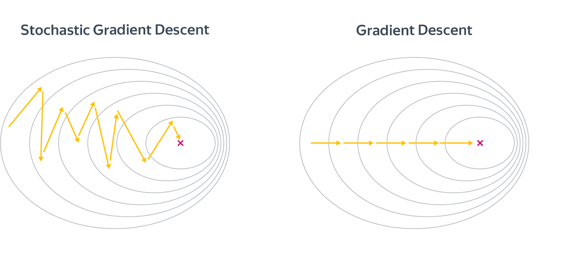
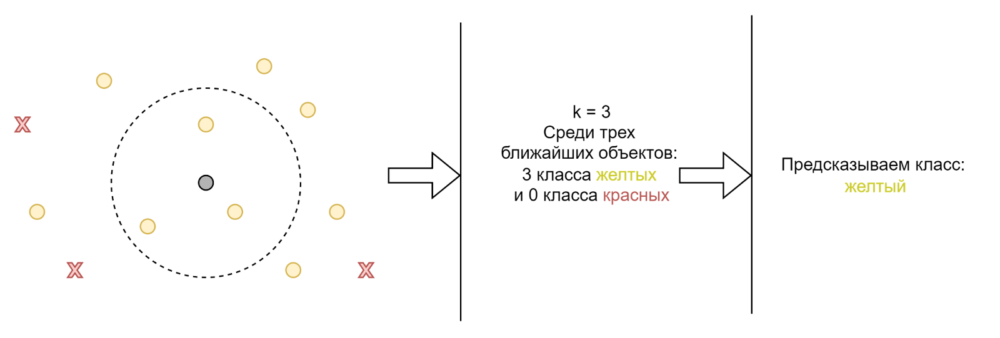
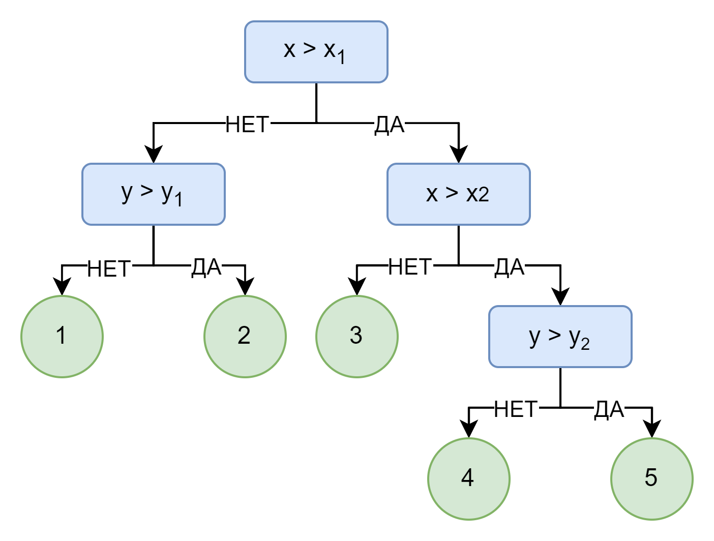
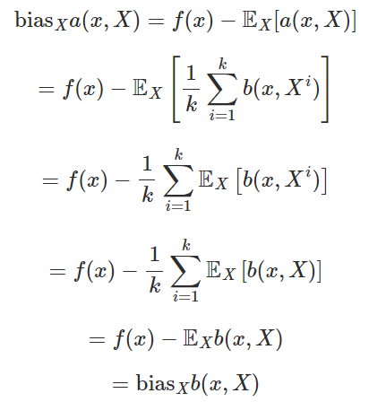
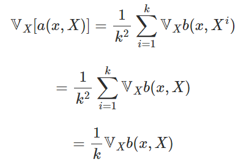
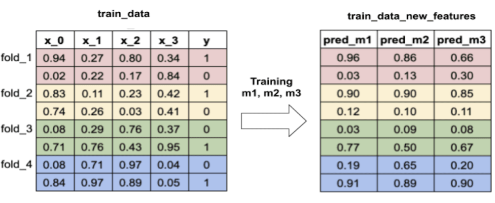
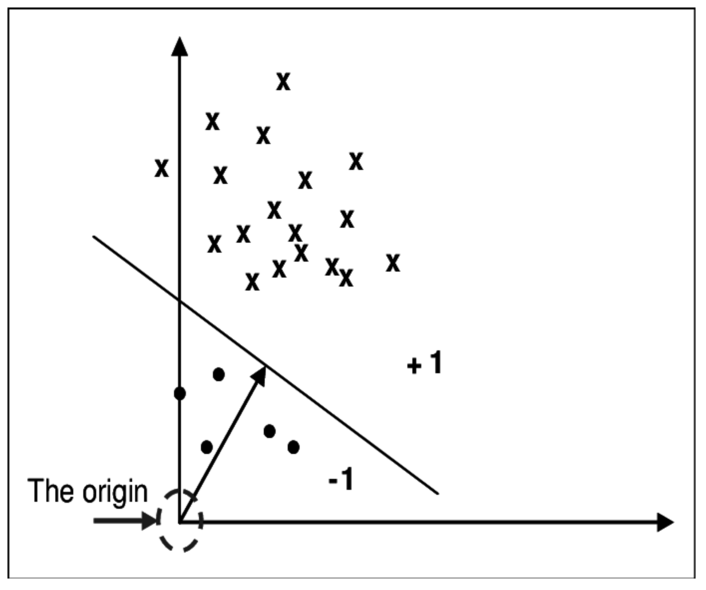
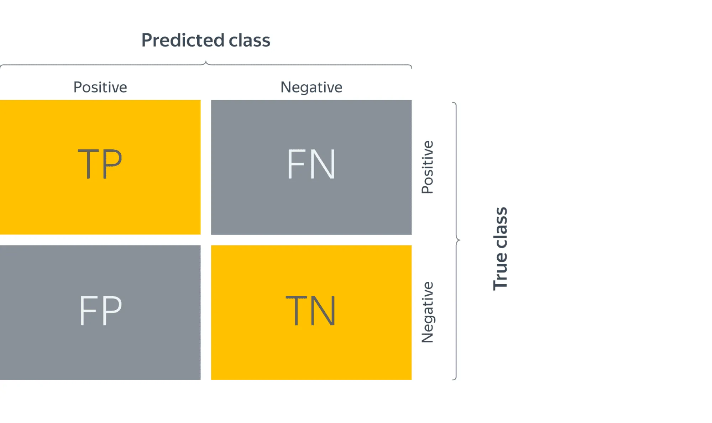
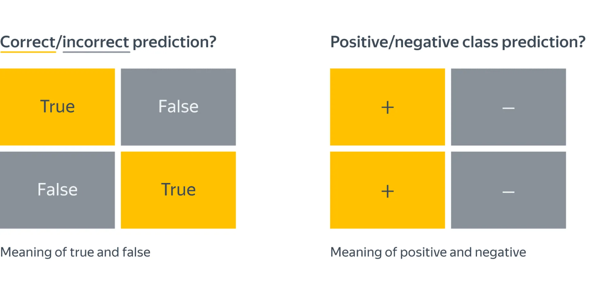
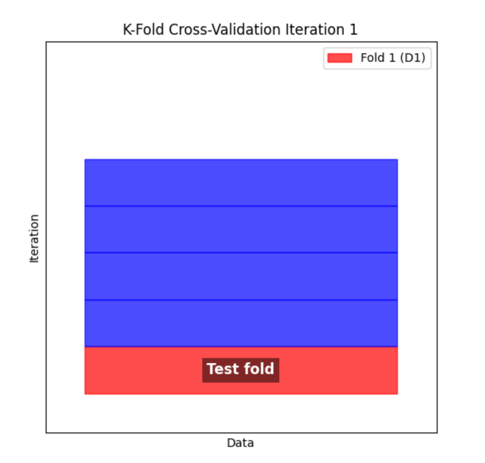

https://education.yandex.ru/handbook/ml

# 1. Введение в курс искусственного интеллекта в информационной безопасности

> **Машинное обучение (МО)**<br>это один из подходов для реализации методов искусственного интеллекта. МО играет центральную роль в современных подходах к информационной безопасности. Оно позволяет автоматизировать процесс анализа огромных объемов данных, находя закономерности, которые могут указывать на наличие угроз.

Модули:
1. Основы машинного обучения в информационной безопасности.
1. Анализ и оптимизацию моделей машинного обучения в информационной безопасности.
1. Основы глубокого машинного обучения в информационной безопасности.
1. Продвинутые методы глубокого машинного обучения и NLP в информационной безопасности.

Базовое понимание алгоритмов машинного обучения крайне важно для применения в профессиональной практике. Эти знания позволят вам:
- Оценивать эффективность различных решений, основанных на машинном обучении, которые используют для предотвращения угроз и анализа инцидентов безопасности.
- Более осознанно выбирать и настраивать готовые инструменты, такие как системы обнаружения вторжений (IDS), антиспам-фильтры или средства защиты от DDoS-атак.
- Понимать, как модели машинного обучения анализируют большие объемы данных и выявляют аномальное поведение, что может помочь в расследованиях инцидентов и предотвращении кибератак.
- Взаимодействовать с разработчиками и специалистами по данным на более глубоком уровне, имея базовое представление о том, как работают модели и как их можно адаптировать к задачам информационной безопасности.

# 2. Введение в машинное обучение

> **Машинное обучение**<br>это наука, занимающаяся изучением алгоритмов, автоматически обучающихся на данных.

> **Недетерминированная полиномиальная трудность по времени (NP)**<br>это класс задач, для которых существует недетерминированный алгоритм, способный решить задачу за полиномиальное время. Более формально, задача принадлежит классу NP, если:
> - Решение задачи можно угадать (недетерминированно выбрать) за полиномиальное время.
> - Если дано предполагаемое решение (называемое сертификатом), то можно проверить его корректность за полиномиальное время с помощью детерминированного алгоритма.

Таким образом, задачи класса NP — это те задачи, для которых проверка правильности решения не сложнее, чем полиномиальное время.

> **Полиномиальное время**<br>Говорят, что алгоритм работает за полиномиальное время, если время работы ограничено сверху многочленом от размера входа алгоритма, то есть $T(n)=O(n^k)$ для некоторой константы *k*. Задачи, для которых алгоритмы с детерминированным полиномиальным временем существуют, составляют класс сложности P, который является центральным в теории вычислительной сложности.

есть задачи, которые программе выполнить сложно, но человек справится с ними легко, например:
- распознать картинку;
- провести оценку квартиры;
- диагностировать болезнь по симптомам;

Эти задачи обладают несколькими общими чертами:
- **Их можно представить как функции, сопоставляющие объекты или примеры (samples) с предсказаниями (targets)**. Например, связывание пациентов с диагнозами или документов с их релевантностью.
- **Они редко имеют единственное правильное решение**. Даже профессиональные переводчики могут перевести один и тот же текст по-разному, и оба перевода будут правильными. Таким образом, стремление к совершенству может мешать достижению хорошего результата.
- **У нас есть множество примеров правильных ответов** (например, переводы предложений на другой язык или подписи к изображениям), а **создание ошибочных примеров, если это необходимо, не представляет особой трудности**.

<ins>Для этих задач не существует детерминированного программного решения</ins>

- **функция**, которая сопоставляет объекты с предсказаниями, будем называть **моделью**
- **набор примеров** — **обучающей выборкой или датасетом**
- Обучающая выборка обычно состоит из двух компонентов: <ins>объектов и ответов</ins>.

> **Онлайн-метрики**<br>это характеристики функционирующей системы, которые мы используем для оценки влияния на бизнес-метрики.

> **Оффлайн-метрики**<br>можно измерить до внедрения модели в эксплуатацию, например, используя исторические данные.

## Данные

их должно быть достаточно много, а их качество должно быть высоким

### проблема нехватки ресурсов в виде данных

> **Дополнительная разметка (также известная как data augmentation или аугментация данных) в машинном обучении**<br>это техника, которую используют для увеличения объема обучающих данных путем создания новых примеров на основе уже существующих данных. Это особенно полезно, когда у вас ограниченное количество исходных данных, и вы хотите улучшить производительность модели.

решается двумя способами:

1. Использование краудсорсинга, то есть привлечение большого числа людей для разметки данных. В некоторых случаях, например, при оценке поисковой выдачи, дополнительная разметка необходима.<br><br>Кроме того, в научных и социальных проектах часто используют подход citizen science, когда данные размечают волонтеры без какого-либо вознаграждения, ими движет желание внести вклад в благородное дело.
2. Использование неразмеченных данных.

### Обучение с учителем

> один из основных типов обучения в машинном обучении, где модель обучается на данных, которые уже имеют метки или правильные ответы

> **обучение представлений (representation learning)**<br>создание компактных векторов небольшой размерности (например, Word embedding) из сложных данных, таких как изображения, звук, текст или графы, чтобы данные, близкие по структуре или смыслу, имели близкие метрические представления.

### Признаки

> свойство объектов
>
> **Совокупность свойств** — признаковое описание

распространенные разновидности признаков:

- **численные**;
- **категориальные**: принимают значения из некоторого дискретного множества<br>(множество, элементы которого можно перечислить или пронумеровать, и они не являются непрерывными). Например, профессия человека или день недели.
    - **ординальные** - принимают значения из упорядоченного дискретного множества.
- **бинарные**: принимают два значения: 0 и 1 или «да» и «нет».<br>С ними можно работать и как с численными, и как с категориальными.

> **feature engineering**<br>это процесс подготовки данных человеком для того, чтобы модель лучше понимала их и работала эффективнее. Этим процессом занимается человек.

Проблемы подготовки данных:
- **пропуски**: заполненные признаки объекта;
- **выбросы (аномалии)**: сильно отличающиеся объекты от большинства в датасете;
- **ошибки разметки**: некоторые значения отмечены некорректно или ложно;
- **data drift**: изменчивость актуальности или распределения данных, в случае чего необходимо своевременно обновлять, актуализировать датасеты.

### Модель

> математическая или алгоритмическая структура, которую используют для выявления закономерностей в данных и выполнения задач, таких как, например, классификация, регрессия, кластеризация.

для решения большинства задач в реальной жизни на сегодня достаточно знать только два типа моделей — градиентный бустинг на решающих деревьях и нейросетевые модели

> **Алгоритм обучения**<br>это процедура, которая превращает обучающую выборку в обученную модель.

- Алгоритм — это метод или процесс обучения.
- Модель — это конечный результат обучения, который использует накопленный опыт для предсказаний или решений.

# 3. Методы классического обучения с учителем. Линейные модели

отличия линейных и нелинейных моделей:
- **Линейные модели** используют линейные функции для описания взаимосвязей в данных, что делает их проще и быстрее в обучении, но ограничивает их способность моделировать сложные зависимости.
- **Нелинейные модели** способны захватывать более сложные и непрямые зависимости благодаря использованию нелинейных функций, что позволяет им лучше справляться с трудными задачами, но требует больше данных и вычислительных ресурсов.

В качестве примеров линейных моделей можно выделить следующие:
- Линейная регрессия.
- Логистическая регрессия.
- Метод опорных векторов с линейным ядром.
- Линейный дискриминантный анализ.
- Ридж-регрессия.
- Лассо-регрессия.

Классификация и регрессия — это две основные задачи в машинном обучении и статистике.

> **Классификация**<br>это задача, в которой нужно назначить объекту один из заранее определенных классов. Например, где операции на банковской карте обозначаются как легитимные (0) или мошеннические (1), мы имеем дело с бинарной классификацией.

> **Регрессия**<br>это задача, в которой нужно предсказать непрерывное значение на основе входных данных. В регрессии целевое значение может быть любым числом на числовой оси.

> **Веса**<br>это параметры модели, которые определяют влияние каждого признака на предсказание. Они показывают, насколько сильно каждый признак влияет на результат.

как определяют <u>веса</u>:
- **Инициализация** - веса обычно инициализируются случайными значениями или нулями перед началом обучения модели.
- **Обучение — веса определяют в процессе обучения модели. Цель обучения** - найти такие значения весов, которые минимизируют ошибку предсказания. Для этого используют алгоритм оптимизации, такой как градиентный спуск. Этот алгоритм корректирует веса, чтобы уменьшить разницу между предсказанными значениями модели и истинными значениями.
- **Оптимизация** - во время обучения модель сравнивает предсказанные значения с фактическими значениями и вычисляет ошибку (например, среднеквадратичную ошибку или кросс-энтропию). Затем модель корректирует веса, чтобы минимизировать эту ошибку. Процесс повторяется до тех пор, пока ошибка не станет приемлемо малой или пока не будут достигнуты определенные критерии остановки.

### Задача регрессии

> есть множество объектов *X*, и вы хотели бы сопоставить каждому объекту значение. В пример приведем некий набор операций на банковской карте. Обозначая нулем легитимные операции, а единицами — мошеннические

Числа, которые вы стремитесь сопоставить объектам, иногда называют <ins>целевыми значениями или таргетами</ins>.

- классификация: $\mathbb{X} \rightarrow 0, 1, \ldots, K$ где $0,...,K$ — номера классов;
- регрессия: $\mathbb{X} \rightarrow \mathbb{R}$

Линейная функция имеет вид:
- $y = w_1 x_1 + \ldots + w_D x_D + w_0$
- Где
    - **$y$** - целевая переменная (таргет),
    - $x_1, \ldots, x_D$ - вектор, соответствующий объекту выборки,
    - $w_1, \ldots, w_D, w_0$ - параметры модели (ещё называют фичами).
    - вектор $w = (w_1,\ldots,w_D)$ - часто называют вектором весов, так как на предсказание модели можно смотреть как на взвешенную сумму признаков объекта
    - $w_0$ - свободный коэффициент

В компактном виде линейная модель выглядит следующим образом:

$$
y = \langle x, w\rangle + w_0
$$

После того, как вы выбрали семейство функций (в нашем случае это линейные функции, зависящие от нескольких переменных — признаков), в котором будете искать решение, задача стала существенно проще. Нужно искать не какое-то абстрактное отображение, а конкретный вектор $(w_0,w_1,\ldots,w_D)\in\mathbb{R}^{D+1}$,где *D*  — количество численных признаков.

Рассмотрим случай, когда у вас всего один численный признак (D=1), тогда модель будет выглядеть довольно просто: $y = w_1 x_1 + w_0$

В случае задачи регрессии мы стремимся приблизить значение 𝑦 с помощью линейной функции от переменной *x*

#### как интерпретировать линейность в контексте классификации?

В бинарной классификации - будете искать разделяющее правило: если значение функции положительное, то транзакция относится к одному классу, если отрицательное – к другому.

#### применение линейных моделей

##### Ограничения коэффициентов линейных моделей

- **Линейные модели достаточно ограниченные и хорошо подходят для небольших наборов данных и простых задач**<br>Однако, если перед вами стоит более сложная задача, использование линейной модели может потребовать создания дополнительных признаков, которые являются сложными функциями исходных данных. Этот процесс, известный как feature engineering, технически напоминает то, что вы изучали в контексте полиномиальных моделей. Однако чрезмерное увлечение поиском таких искусственных признаков может привести к потере смысловой интерпретации модели, и ее адекватность будет сильно зависеть от суждений эксперта, который ее создавал.
- **Если между признаками наблюдается приблизительно линейная зависимость**, коэффициенты линейной модели могут утратить физический смысл.
- **Утверждения типа «этот коэффициент мал, значит, этот признак незначителен» могут быть ошибочными**. Важно учитывать масштаб признака: возможно, коэффициент мал, чтобы компенсировать его. Кроме того, хотя зависимость может быть слабой, в определенных условиях она может сыграть важную роль.

##### Примеры линейных моделей**

- **метод наименьших квадратов (Ordinary least squares)**<br> заключается в минимизации суммы квадратов разностей между наблюдаемыми значениями и прогнозируемыми значениями. Таким образом, метод наименьших квадратов стремится минимизировать суммарные ошибки прогнозирования, чтобы получить наилучшую линейную модель.
- **Регрессия с Lasso (L1-регуляризация)**<br>штраф к функции потерь, чтобы отбирать наиболее значимые признаки (более подробно рассмотрим в следующем модуле).
- **Регрессия с Ридж-регуляризацией (L2-регуляризация)**<br>штраф к функции потерь, чтобы нивелировать шумовые признаки, а также линейные зависимости, решая задачу переобучения (более подробно рассмотрим в следующем модуле).
- **Эластичная сеть (Elastic Net)**<br>штраф к функции потерь, комбинирующий L1 и L2 регуляризацию (более подробно рассмотрим в следующем модуле).
- **Линейная регрессия с ядровыми методами (Kernel Ridge Regression)**<br>модель, работающая с признаками после применения ядерных методов, более подробный пример вы увидите в четвертом уроке в модели One-Class SVM.

##### метод наименьших квадратов (Ordinary Least Squares, OLS)

> применяют для нахождения параметров модели, которые минимизируют сумму квадратов отклонений предсказанных значений от фактических данных.

- Пусть дан датасет *(X,y)*, где $y=(y_i)_{i=1}^N \in \mathbb{R}^N$ — вектор значений целевой переменной
- $X=(x_i)_{i = 1}^N \in \mathbb{R}^{N \times D}, x_i \in \mathbb{R}^D$ - матрица объекты-признаки
    - *is* - вектор признаков i-ого объекта
- $f_w(x_i) = \langle w, x_i \rangle + w_0$ - линейная функция зависимости $y_i$ от $x_i$

**Цель этого метода** - найти прямую или кривую, которая наилучшим образом описывает зависимость между переменными в данных.
- Говоря простым языком, нужно научиться измерять качество модели и минимизировать ее ошибку, как-то меняя обучаемые параметры, адаптируясь под среду.
- обучаемые параметры — это веса *w*
- делается путем минимизации суммы квадратов отклонений (ошибок) между наблюдаемыми и предсказанными значениями

Смысл метода наименьших квадратов в том, чтобы найти такие параметры $w$, которые минимизируют выражение:

```math
L(f, X, y) = |y - f(X)|_2^2 = \|y - Xw\|_2^2 = \sum_{i=1}^N(y_i - \langle x_i, w \rangle)^2
```

Вывод этого значения при помощи геометрического подхода
- пусть $x^{(1)},\ldots,x^{(D)}$ - столбцы матрицы $X$
- $Xw = w_1x^{(1)}+\ldots+w_Dx^{(D)}$
- разложим $y = y_{\parallel} + y_{\perp}$, где
    - $y_{\parallel} = Xw$
    - $y_{\perp} = y - Xw\perp x^{(1)},\ldots,x^{(D)}$
- В матричном виде: $X^T(y - Xw) = 0$
- выведем отсюда $w$ и получим ответ:
    - $w = (X^TX)^{-1}X^Ty$

Из высшей математики известно, что <ins>градиент функции</ins> в определенной точке указывает направление ее наибольшего увеличения, а <ins>антиградиент</ins> — направление наибольшего уменьшения.

> Представьте себе холм. Если вы находитесь на холме и хотите подняться на его вершину, градиент указывает, в каком направлении вам нужно двигаться, чтобы подняться как можно быстрее. А антиградиент указал бы нам, как наиболее быстро спуститься с холма.

Это означает, что, имея начальное приближение оптимального значения параметра $w$, можно его улучшить, вычисляя градиент функции потерь в этой точке и немного изменяя вектор весов в направлении антиградиента:

$$
w_j \mapsto w_j - \alpha \frac{d}{d{w_j}} L(f_w, X, y)
$$

где $a$ - **коэффициентом обучения**

> **коэффициентом обучения** - определяет размер шага в направлении антиградиента

Этот алгоритм поиска оптимума параметров - **Метод градиентного спуска**

На каждом этапе градиентного спуска может потребоваться вычисление градиента по всей выборке, что является потенциально затратной операцией с временной сложностью $O(ND)$.

> **батч (batch или mini-batch)**<br> подвыборка данных для оценки (приближенное значение градиента, которое вычисляется на основе лишь части всей обучающей выборки) рассчитанную на данной подвыборке

функция потерь имеет вид:

$$
L(w, X, y) = \frac1N\sum_{i=1}^NL(w, x_i, y_i)
$$

в качестве суммы по отдельным парам объект-таргет, а градиент выглядит, как

$$
\nabla_wL(w, X, y) = \frac1N\sum_{i=1}^N\nabla_wL(w, x_i, y_i)
$$

**Тогда пусть оценка будет равна**

$$
\nabla_wL(w, X, y) \approx \frac1B\sum_{t=1}^B\nabla_wL(w, x_{i_t}, y_{i_t})
$$

для некоторого подмножества этих пар $(x_{i_t}, y_{i_t})_{t=1}^B$

Благодаря этому упрощению потребление памяти можно уменьшить до $O(BD)$
- размер батча $B$ лучше выбирать побольше, так как чтение данных с диска занимает значительно больше времени по сравнению с чтением из оперативной памяти.

> Алгоритм градиентного спуска основанный на оценке градиента на батчах часто называется **стохастическим градиентным спуском**.

Визуальная разница между алгоритмами стохастического и обыкновенного градиентного спуска выглядит следующим образом:



## Метрические методы

- У алгоритмов этого метода, по сути, нет фазы обучения, так как они просто сохраняют всю обучающую выборку и, основываясь на этих данных, выполняют поставленную перед ними задачу
- Такой процесс носит название lazy learning
- считаются непараметрическими, так как они не делают явных предположений о глобальных закономерностях, которым следуют данные
- свойства объекта можно определить, имея понимание о его соседях

### Метод ближайших соседей (k-nearest neighbors, KNN)

- прародитель других популярных способов, но сам он почти нигде уже не используется

Пример: провести классификацию объектов на два класса — красный или жёлтый в некоторой обучающей выборке, и у нас есть целевой объект (серый), который надо классифицировать<br> 

Очевидно, что серый объект должен стать желтым, так как ближайшие три соседа (k = 3) являются желтыми.

- Пусть дана обучающая выборка $X = (x_i, y_i)_{i=1}^N$
    - $x_i \in \mathbb{X}$, $y_i \in \mathbb{Y} = {1,\ldots, C}$
- задана функция ${\rho : \mathbb{X} \times \mathbb{X} \to [0, +\infty)}$
- Нужно классифицировать объект $u$
    - Для этого нужен параметр $k$ — наиболее близкие к $u$ объекты по расстоянию $rho$ объектов обучающей выборки $X_k({u}) = {{x^{(1)}_u},\ldots,{x^{(k)}_u}}$
    - $\forall x_{in} \in X_k(u) \forall x_{out} \in X \backslash X_k(u) \\ \rho(u,x_{in}) \leq \rho(u,x_{out})$
- Метку класса объекта $x^{(i)}_u$ будем обозначать $y^{(i)}_u$
- Класс нового объекта тогда естественным образом определим как наиболее часто встречающийся класс среди объектов из $X_k(u)$
    - $a(u) = \underset{y\in \mathbb{Y}}{argmax} \sum_{i=1}^k \mathbb{I}[y_u^{(i)} = y]$
    - количество соседей с меткой класса y можно определить, просто суммируя индикаторы для каждого соседа, показывающие, что его метка равна $y$.

### выбор метрик, а именно функции расстояний

Как вы могли заметить, в большинстве случаев нам будет подходить евклидово расстояние, однако существуют и другие.

- **Манхэттенская метрика**<br>также известная как <ins>расстояние по городским кварталам</ins>, измеряет расстояние между точками в пространстве. Главное ее отличие от евклидовой — это измерение расстояния вдоль осей координат и имеет формулу:<br>$\rho(x, y) = \sum_i \vert x_i - y_i \vert$
- **Метрика Минковского** — это обобщение евклидовой (p=2) и манхэттенской (p=1) метрик:<br>$\rho(x, y) = \left(\sum_i \vert x_i - y_i\vert^p\right)^{1/p}$
- **Косинусное расстояние** используют в задачах, где важно учитывать косинусное расстояние между векторами, игнорируя длину.<br>Такое поведение может быть полезным в ряде задач, например, при поиске схожих документов. В таких случаях в качестве признаков часто выступают частоты слов (то есть, как часто они встречаются в тексте). Интуитивно понятно, что если количество каждого слова в тексте увеличить в два раза, это не должно изменить его тему. Поэтому в этом случае норма вектора признаков не играет роли, и именно по этой причине в задачах, связанных с текстом, неочевидно можно сделать вывод, часто используют косинусное расстояние:<br>$\rho(x,y) = 1 - \cos \theta = 1 - \frac{x \cdot y}{|x| |y|}$

## Решающие деревья (decision trees)

- **Предикат**<br>это простые решающие правила, которые в совокупности организуются в последовательности для предсказания значения целевой переменной решающим деревом.

решающие деревья часто используют как строительные кирпичики для создания ансамблей — моделей, которые делают предсказания путем агрегирования результатов других моделей.

На картинке изображено дерево, которое построено для задачи классификации на пять классов:<br>
- Два призанака X и Y
- решение, к какому классу будет относиться объект, будет приниматься с помощью прохода от корня дерева, пока не дойдет до листа
- Каждый лист — это и есть предикат.

### Бинарное дерево

- каждой внутренней вершине $v$ приписан предикат $\mathbb{X} \to { 0, 1 }$
- каждой листовой вершине $v$  приписан прогноз $c_v \in \mathbb{Y}$ , где $\mathbb{Y}$ – область значений целевой переменной.

И в ходе предсказаний вы проходите по этому дереву от узла к узлу, пока не дойдете до листа. И будете продолжать проход вправо, если $B_v(x) = 1$, и влево, если $B_v(x) = 0$.

# 4. Ансамбли моделей

> метод машинного обучения с учителем, при котором несколько различных моделей объединяются в одну для улучшения точности предсказаний. То есть, это усовершенствованный метод, и это его ключевое отличие от методов, рассмотренных в предыдущем уроке.

> **декомпозиция смещения и разброса (bias-variance decomposition)**<br>одно из важных понятий в машинном обучении, которое помогает понять, как модель обучается и какие ошибки она совершает. Эта концепция позволяет разложить ошибку модели на три составляющие: шум, смещение и разброс.

> **Шум**<br>это та часть данных, которая является случайной и непредсказуемой. Это информация, которую невозможно объяснить или учесть моделью.

> **Смещение**<br>отражает, насколько модель систематически ошибается. Это отклонение предсказаний модели от истинных значений из-за упрощения, заложенного в модели

> **Разброс**<br>показывает, насколько сильно изменяются предсказания модели при обучении на разных наборах данных. Если модель слишком сложная (переобученная), она может чрезмерно точно подстраиваться под тренировочные данные, что делает ее чувствительной к небольшим изменениям в данных. Это приводит к высокой изменчивости (разбросу) в результатах.

## Квадратичная функция потерь

$`Q(a) = \mathbb{E}_x \mathbb{E}_{X, \epsilon}[y(x, \epsilon) - a(x, X)]^2`$

- $X$ - обучающая выборка
- $x$ - точка из тестового множества
- $y = f(x) + \epsilon$ - целевая зависимость, которую можно измерить с точностью до случайного шума $\epsilon$
- $a(X,x)$ значение алгоритма, обученного на выборке $X$, в точке $x$
- $\mathbb{E}_x$ - среднее по всем тестовым точкам
- $\mathbb{E}_{X, \epsilon}$ - среднее по всем обучающим выборкам $X$ и случайному шуму $\epsilon$

## Анализ работы ансамблей: декомпозиция смещения и разброса (bias-variance-decomposition)

представляет собой разложение на три компоненты: шум, смещение и разброс

$Q(a) = \mathbb{E}_x \text{bias}_X^2 a(x, X) + \mathbb{E}_x \mathbb{V}_X[a(x, X)] + \sigma^2$
- $\text{bias}_X a(x, X) = f(x) - \mathbb{E}_X[a(x, X)]$ - смещение среднего предсказания модели от истинного значения целевой переменной 
- $\mathbb{V}_X[a(x, X)] = \mathbb{E}_X \left[ a(x, X) - \mathbb{E}_X[a(x, X)] \right]^2$ - разброс. Это величина, характеризующая степень изменчивости предсказаний модели
- $`\sigma^2 = \mathbb{E}_x \mathbb{E}_\epsilon[y(x, \epsilon) - f(x)]^2`$ - неустранимый шум в данных

## Основные подходы к построению ансамблей из моделей

### Bagging

> метод ансамблирования, который заключается в создании нескольких независимых моделей на основе подвыборок из исходного набора данных с использованием метода случайных подвыборок с возвращением.

> **случайная выборка с возвращением** - после того, как элемент выбран из исходного набора данных, он возвращается обратно в этот набор, и может быть выбран снова при следующих выборках.

#### Этапы

1. Из исходного обучающего набора данных формируется несколько подмножеств путем случайной выборки с возвращением (bootstrap sampling). Размер каждого подмножества обычно равен размеру исходного набора данных, но его состав будет различаться из-за случайного характера выборки.
1. На каждом созданном подмножестве данных обучается одна и та же модель.
1. Для получения окончательного предсказания используют агрегирование результатов всех обученных моделей. В задачах регрессии предсказания базовых моделей усредняются, чтобы получить итоговый результат.

#### Изменение качества предсказания при переходе от одной модели к ансамблю

- убедимся, что смещение ансамбля остается таким же, как и среднее смещение отдельных моделей
- Предположим, что при вычислении математического ожидания (среднее значение, которое мы ожидаем получить, если будем многократно повторять случайный процесс) по всем обучающим выборкам также учитываются все подвыборки, полученные с помощью бутстрепа<br> 

**Таким образом, смещение ансамбля равно смещению одного алгоритма**

- проанализируем, что происходит с дисперсией<br> 
- Если предположить, что базовые алгоритмы некоррелированы, то:<br> 

**В результате дисперсия ансамбля оказывается в $k$ раз меньше дисперсии отдельного алгоритма.**

### Random Forest

> ансамбль деревьев решений, где в качестве основного алгоритма используют решающее дерево.

> **глубина дерева решений** - это количество уровней в дереве от корня до самого глубокого листа

- Глубина дерева влияет на
    - его способность моделировать данные
    - его характеристики в плане смещения и разброса
- глубина зависит от параметров модели и качества данных.

#### Этапы

1. Из исходного набора данных создается несколько подмножеств путем случайной выборки с возвращением. Размер каждого подмножества равен размеру исходного набора данных.
1. Для каждого подмножества данных строится отдельное дерево решений
    - На каждом этапе разделения узла дерева, вместо использования всех признаков, случайным образом выбирается $n < N$ признаков, где $N$  — полное число признаков
    - Затем из этого подмножества выбирается наилучший признак для разделения узла
    - Каждое дерево строится до определенной глубины или до тех пор, пока не будет достигнут терминальный узел, без необходимости в дополнительной обрезке дерева.
1. После того, как все деревья обучены, каждое из них делает предсказание на новых данных. В задаче регрессии предсказания всех деревьев усредняются для получения окончательного результата.

#### Стоит обратить внимание на

1. **Глубину деревьев**
    - <ins>Неглубокие деревья</ins> имеют мало параметров и могут запоминать только основные статистики обучающей подвыборки.<br>Предсказания таких деревьев стабильны, но не точны (<ins>низкая дисперсия, высокое смещение</ins>).
    - <ins>Глубокие деревья</ins> способны запоминать подвыборку детально, что делает их предсказания более точными, но менее стабильными (<ins>высокая дисперсия, низкое смещение</ins>).
    - **Вывод: лучше использовать глубокие деревья**.
1. **Число признаков для обучения деревьев**
    - Много признаков — выше корреляция между деревьями и меньше эффекта от ансамблирования.
    - Мало признаков — деревья становятся слабее, но корреляция между ними снижается.
    - **Вывод: для классификации использовать квадратный корень от числа всех признаков, для регрессии — треть признаков**
1. **Ограничение числа деревьев**
    - <ins>Увеличение числа деревьев</ins> в ансамбле <ins>не меняет смещение, но уменьшает разброс</ins>
    - Из-за ограничения на количество признаков и подвыборок <ins>уменьшать разброс до бесконечности невозможно</ins>.
    - **Вывод: нужно построить график ошибки в зависимости от числа деревьев и остановить увеличение леса, когда ошибка перестанет существенно снижаться**.
1. **Ограничение на время работы ансамбля**
    - на большом числе деревьев Random Forest может работать долго, поэтому иногда количество деревьев сокращают, немного снижая качество предсказания.

### Boosting

> ансамблевый метод машинного обучения, который последовательно обучает модели так, что каждая следующая модель исправляет ошибки предыдущих.

- Основная задача бустинга — это уменьшение смещения
- в качестве <ins>базовых моделей</ins> часто выбирают, которые <ins>обладают высоким смещением и низкой дисперсией</ins>
    - Например, при использовании деревьев решений в качестве базовых классификаторов их глубина обычно не превышает двух-трех уровней
- Модели с высоким смещением обучаются быстрее, что критично для последовательного обучения
- Использование сложных моделей на каждой итерации может быть очень времязатратным, поэтому на практике в основном применяют <ins>градиентный бустинг</ins>

### Stacking

> метод ансамблирования, который использует множество базовых моделей и обучает вторую модель (метамодель) на выходных данных этих базовых моделей для получения окончательного предсказания

#### Основные этапы стекинга

1. Разделение обучающей выборки на тренировочную и тестовую
1. Разделение тренировочной выборки на $n$ **фолдов** (небольшая часть тренировочных данных, с которыми в дальнейшем ведется работа).
    - Эти фолды перебираются тем же способом, что и при кросс-валидации:
        - на каждом шаге фиксируются $n-1$ фолдов фолдов для обучения базовых алгоритмов
        - один — для их предсказаний (часто называемых мета-факторами).



Полученные мета-факторы используются для обучения модели

Если объем данных большой, то можно разделить обучающий набор на две непересекающиеся части: одну для обучения базовых алгоритмов, а другую для их предсказаний и обучения метамодели. При еще большем объеме данных тестовый набор также можно разделить на тестовую и валидационную части, используя последнюю для подбора гиперпараметров моделей.

### Градиентный бустинг

> **бустинг** - воплощает идею последовательного построения линейной комбинации алгоритмов, гед каждый последующий алгоритм улучшает своего предшественника в текущем ансамбле

> **Градиентный бустинг над решающими деревьями (GBDT)**<br>это бустинг, который использует деревья решений в качестве базовых алгоритмов. Его плюс заключается в том, что он отлично работает на выборках с «табличными», неоднородными данными.

задача регрессии с квадратичной функцией потерь:

$$
\mathcal{L}(y, x) = \frac{1}{2}\sum^{N}_{i=1}\left(y_i - a(x_i)\right)^{2} \rightarrow \min
$$

Для ее решения предстоит строить композицию из базовых алгоритмов, которых будет $K$-штук:

$$
a(x) = a_K(x) = b_1(x) + b_2(x) + \dots +b_K(x)
$$

- Если обучать только одно решающее дерево, то получится очень низкое качество модели
- известно, на каких объектах построенное вами дерево давало точные предсказания, а на каких — ложное

Предположим, что ваша первая обученная модель будет выдавать результат на объекте $x_l$ на 10 больше: $b_1(x_l)=y_l+10$
- если вы обучите еще одну модель, которая будет выдавать ответ -10, то совокупность данных моделей на объекте $x_l$ в точности даст истинное значение: $b_1(x_l) + b_2(x_l) = (y_l + 10) + (-10) = y_l$
- сли вторая модель сможет предугадывать разницу между результатом предыдущей модели и истинным результатом, то это улучшит результат совокупности моделей

Если стекинг составлен верно, то функция потерь будет становиться меньше с каждым шагом:

$$\mathcal{L} \left( y, a_{k+1} (x) \right) < \mathcal{L} \left( y, a_k (x) \right)$$

бустинг с каждым новым базовым алгоритмом все точнее приближает предсказание к истинному значению метки объекта

# 5. Методы обнаружения аномалий

> **Аномалия**<br>это наблюдение, событие или паттерн данных, который значительно отклоняется от большинства других наблюдений в наборе данных. Такое отклонение может указывать на редкое или необычное явление, не соответствующее ожидаемому поведению системы. В информационной безопасности аномалия может сигнализировать о потенциальной угрозе, такой как попытка взлома, несанкционированный доступ или вредоносная активность.

- методы обнаружения аномалий обычно относят к методам обучения без учителя или статистическим методам, так как они не требуют предварительного обучения на размеченных данных для выявления выбросов

## Типы аномалий

- **Точечные аномалии (Point Anomalies)**<br>это отдельные данные, которые существенно отличаются от остальной части набора данных. Такие аномалии можно рассматривать как «выбросы», которые не соответствуют общему шаблону или распределению данных.
    - можно выявлять с помощью
        - статистических методов, таких как Z-оценка
        - алгоритмов машинного обучения, таких как One-Class SVM
- **Контекстные аномалии (Contextual Anomalies)**<br>это данные, которые считаются аномальными только в определенном контексте. Важно учитывать дополнительные параметры или окружение, чтобы определить, являются ли данные аномальными.
    - Для обнаружения часто используют алгоритмы, которые учитывают временные ряды или контекстные атрибуты.
        - сезонные модели (SARIMA)
        - рекуррентные нейронные сети (LSTM)
- **Коллективные аномалии (Collective Anomalies)**<br>группа данных, которые являются нормальными по отдельности, но аномальными, когда рассматриваются вместе. Такие аномалии обычно обнаруживают, когда анализируют последовательность или множество данных.
    - часто выявляют с помощью
        - методов кластеризации
        - анализа временных рядов
        - алгоритмов последовательного анализа
    - Например, использование кластеризации DBSCAN для выявления плотных групп данных или анализ последовательностей с помощью методов, таких как HMM (скрытые марковские модели).

## Статистические методы обнаружения аномалий

### Метод Z-оценок (Z-Score)

> измеряет, насколько далеко и в какую сторону отклоняется конкретное значение от среднего значения, выраженное в единицах стандартного отклонения. <ins>Значения с высоким абсолютным значением Z-оценки считаются аномалиями</ins>.

Z-оценку подсчитывают по формуле

$Z = \frac{X - \mu}{\sigma}$
- $X$ - наблюдаемое значение
- $\mu$ - среднее значение данных
- $\sigma$ - стандартное отклонение данных

**Аномалиями считаются наблюдаемые значения, у которых Z-оценка превышает определенный заранее порог.**

### Метод IQR (метод интерквартильного размаха)

> **Квартили в статистике**<br>это показатели, которые делят упорядоченные данные на четыре равные части. Каждый квартиль соответствует определенной точке в распределении данных и представляет собой значение, ниже которого находится определенный процент наблюдений.

Основные квартили включают:
- **Первый квартиль (Q1) или нижний квартиль**<br>*25й процентиль данных*<br>значение, ниже которого находится 25% наблюдений. Это медиана нижней половины данных.
- **Второй квартиль (Q2) или медиана**<br>значение, ниже которого находится 50% наблюдений. Это центральное значение набора данных.
- **Третий квартиль (Q3) или верхний квартиль**<br>*75й процентиль данных*<br>значение, ниже которого находится 75% наблюдений. Это медиана верхней половины данных.

> **Метод IQR (межквартильный размах)**<br>это способ определения выбросов, основанный на квартилях. Межквартильный размах определяется как разница между нижним (Q1) и верхним (Q3) квартилями. Выбросы определяются как значения, находящиеся за пределами 1,5 IQR от Q1 и Q3.

- **Межквартальный размах**<br>$\text{IQR} = Q3 - Q1$
- **Нижняя граница для аномалий**<br>$\text{Lower Bound} = Q1 - 1.5 \times \text{IQR}$
- **Верхняя граница для аномалий**<br>$\text{Upper Bound} = Q3 + 1.5 \times \text{IQR}$
- **Аномальные значения**<br>$x < \text{Lower Bound} \quad \text{или} \quad x> \text{Upper Bound}$

В случае метода IQR выбросы — это и есть искомые аномалии.

## One Class SVM

В соответствии с документацией scikit-learn задачи поиска аномалий делят на два типа
1. **Поиск выбросов (Outlier detection)**<br>В тренировочном наборе данных есть выбросы, которые представляют собой наблюдения, значительно отличающиеся от остальных. Алгоритмы для поиска выбросов ориентированы на выявление областей, где сосредоточена основная масса данных, игнорируя аномальные наблюдения внутри области сосредоточения данных.
    - Аномалии — это не только выбросы, они могут находится и внутри областей сосредоточения. Но методы, основанные на обнаружении выбросов, не смогут их найти.
2. **Поиск новизны (Novelty detection)**<br>Тренировочный набор данных не содержит выбросов, и цель состоит в том, чтобы определить, является ли новое наблюдение выбросом.

> **One-Class SVM**<br>это специализированная реализация метода опорных векторов (SVM), предназначенная для задач поиска аномалий, когда у нас есть только данные одного класса (Novelty detection), и мы хотим обнаружить отклонения от этого класса.



В методе опорных векторов (SVM) ядро используется для преобразования исходных данных в более высокоразмерное пространство, чтобы сделать их более линейно разделимыми.

> **Высокоразмерные пространства**<br>это пространства с большим числом измерений (или координат), обычно больше трех. В таких пространствах каждую точку определяет множество координат, и они используются для моделирования сложных данных в различных областях, таких как машинное обучение (в качестве координат выступают признаки), статистика и физика.

> **Распределение генеральной совокупности**<br>это описание того, как значения всех возможных наблюдений (или данных) распределены в большой группе или совокупности, из которой берется выборка. Это распределение показывает, как часто в этой совокупности встречаются различные значения.

#### Плюсы

- One-Class SVM может быть адаптирован к различным типам данных и различным распределениям благодаря настройкам ядра (например, линейное, полиномиальное, радиальное базисное и так далее).
- Модель обучается только на данных одного класса, что удобно, когда отрицательные примеры сложно собрать или они отсутствуют. Это упрощает подготовку данных.
- Метод хорошо работает в высокоразмерных пространствах, что делает его эффективным для задач с большим количеством признаков.

#### Минусы

- Модель может легко переобучиться и давать много ложноотрицательных результатов, если разделяющий зазор слишком узкий.
- Нужна абсолютная уверенность, что тренировочные данные не содержат выбросов, иначе алгоритм может принять их за нормальные наблюдения.
- В некоторых случаях результаты могут быть нестабильными или чувствительными к случайным вариациям в данных, что требует дополнительных проверок и валидации. Например, такое может произойти в случае, когда обучающая выборка не отражает распределение генеральной совокупности.

## Методы обнаружения аномалий на основе кластеризации данных

- используют идеи группировки данных в кластеры для выявления аномалий или выбросов
- аномалии — это объекты, которые не принадлежат ни к одному из основных кластеров или находятся в удалении от всех кластеров

### Метод k-Means

- Разделяет данные на KKK кластеров, минимизируя среднее расстояние между точками внутри одного кластера и центроидом кластера
- Устанавливает пороговое расстояние (threshold) между точкой и ближайшим к ней кластеру.

#### Выявление аномалий

точки, которые находятся далеко от ближайшего центроида (расстояние превышает threshold) или принадлежат кластерам с малым количеством точек, могут рассматриваться как аномалии.

#### Плюсы

- простота реализации
- быстрая работа на больших наборах данных.

#### Минусы

- неэффективен
    - для данных с сильно пересекающимися кластерами
    - когда количество кластеров неизвестно.

### Метод DBSCAN (Density-Based Spatial Clustering of Applications with Noise)

Кластеризует данные на основе плотности, обнаруживая кластеры как области с высокой плотностью точек, отделенные областями с низкой плотностью.

#### Выявление аномалий

точки, которые не принадлежат ни одному из кластеров (шумовые точки), считаются аномалиями.

#### Плюсы

- хорошо справляется с произвольными формами кластеров и может выявлять выбросы как шум.

#### Минусы

- зависим от выбора параметров, таких как радиус области и минимальное количество точек для формирования кластера.

## Сравнение

| статистические методы | One-Class SVM | методы на основе кластеризации |
| ---- | ----- | ---- |
| Z-оценка и IQR | One-Class SVM | K-means, DBSCAN |
| основаны на предположении, что нормальные данные следуют определенному статистическому распределению | обучается только на нормальных данных и пытается найти границу, отделяющую нормальные данные от аномалий | работают за счет группировки данных в кластеры и определения аномалий как данных, которые находятся далеко от центров кластеров или не принадлежат ни одному кластеру |
| - подходят для данных, которые можно аппроксимировать известным распределением | подходит<br> - когда есть достаточное количество нормальных данных<br> - очень мало или вообще нет данных об аномалиях | подходят<br> - когда данные образуют естественные группы<br> - аномалии можно определить как точки, которые не принадлежат ни одной из групп или лежат далеко от центров групп |
| Хорошо работают<br>- при небольших наборах данных<br>- когда аномалии сильно отклоняются от нормальных данных | Эффективен при высокоразмерных данных и не предполагает заранее известных распределений данных | Полезны для данных с четко выраженной кластерной структурой |

# 6. Метрики оценки качества моделей

## Accuracy и Error Rate

> **Accuracy (точность классификации)**<br>это метрика, которая определяет долю правильно классифицированных объектов из общего числа объектов. Формально это можно записать через индикаторную функцию $I(\cdot)$, которая принимает значение 1, если условие внутри нее выполняется, и 0, если не выполняется.

$\text{Accuracy} = \frac{1}{N} \sum_{i=1}^{N} I(y_i = \hat{y_i})$
- $N$ - общее количество объектов в выборке
- $y_i$ - истенный класс выборки $i$
- $\hat{y_i}$ - предсказанный моделью класс объекта $i$
- $I(y_i = \hat{y_i})$ - индикаторная функция, которая равна 1, если предсказание модели совпадает с истенным классом и 0, в ином случае

> **Error Rate (ошибки классификации)**<br>это метрика, которая показывает долю неправильно классифицированных объектов из общего числа объектов. Ее также можно записать через индикаторную функцию.

$\text{ErrorRate} = 1 - \text{Accuracy}$

### Плюсы метрики Accuracy

- Удобная и простая (в реализации и понимании) оценка модели в случае, когда в тестовой выборке есть баланс между классами.
- Удобно применять в задачах, где важно учитывать комплексную точность (ошибки первого и второго рода) модели классификации.

### Недостатки метрики Accuracy:

- Отсутствие весов для неправильной классификации определенного класса:<br>Accuracy не учитывает различия в значимости ошибок для разных классов
- Отсутствие учета баланса классов:<br>Accuracy может быть вводящей в заблуждение в случае несбалансированных данных, когда один из классов значительно преобладает.<br>В таких случаях модель может просто предсказывать преобладающий класс во всех случаях, достигая высокой Accuracy, но при этом не захватывая меньшинство классов, что делает её малоинформативной для оценки качества модели.

## Confusion Matrix

> то таблица, которая используется для оценки качества классификационной модели, особенно в задачах бинарной классификации. Она позволяет визуализировать, сколько раз модель правильно или ошибочно классифицировала объекты, и дает более полное представление о ее производительности.

- **True Positive (TP)**<br>количество объектов, которые модель правильно классифицировала как положительные (например, правильное определение спама как спам).
- **True Negative (TN)**<br>количество объектов, которые модель правильно классифицировала как отрицательные. Например, правильное определение важного письма как не спам.
- **False Positive (FP)**<br>количество объектов, которые модель ошибочно классифицировала как положительные. Например, важное письмо посчитала спамом. Это также называют ошибкой первого рода или ложной тревогой.
- **False Negative (FN)**<br>количество объектов, которые модель ошибочно классифицировала как отрицательные. Например, спам определила как важное письмо. Это также называют ошибкой второго рода или пропуском.

 

первая часть названия группы показывает угадали ли мы с классом, а вторая — какой класс мы предсказали.

 

$$
\text{ErrorRate} = \frac{FP+FN}{TP+TN+FP+FN}
$$

$$
\text{Accuracy} = \frac{TP+TN}{TP+TN+FP+FN}
$$

## Recall и Precision

> **Accuracy**<br>это метрика, отражающая общее качество модели, суммируя результаты по всем классам. Она полезна, когда все классы имеют равное значение. Однако в ситуациях, когда классы имеют разную значимость, Accuracy может вводить в заблуждение.

> **Precision (точность)**<br>это метрика, которая измеряет долю правильных предсказаний среди всех объектов, предсказанных моделью как положительные. Другими словами, Precision показывает, насколько точны предсказания модели в отношении положительного класса.

$$
\text{Precision} = \frac{TP}{TP + FP}
$$

> **Recall (полнота)**<br>это показатель, определяющий, какую часть истинно положительных объектов модель смогла правильно идентифицировать. Иными словами, он отражает способность модели обнаруживать все реальные положительные случаи в наборе данных.

$$
\text{Recall} = \frac{TP}{TP + FN}
$$

## F1-Score

> **F1-score (или F1-мера)**<br>это метрика, которая объединяет Precision (точность) и Recall (полноту) в одну цифру, предоставляя гармоническое среднее этих двух показателей. F1-score особенно полезна в задачах, где важно учитывать как точность, так и полноту предсказаний, особенно в случаях, когда классы несбалансированны.

$$
\text{F1-Score} = 2 \times \frac{\text{Precision} \times \text{Recall}}{\text{Precision} + \text{Recall}}
$$

Интерпретация:
- принимает значения от 0 до 1
    - 1 означает идеальное соответствие (высокий Precision и Recall)
    - 0 — полное отсутствие точности или полноты.
- Этот показатель полезен в случаях, когда важно сбалансированное внимание к обеим метрикам и помогает избежать ситуации, когда высокой точности можно достигнуть за счет значительного снижения полноты, или наоборот.

## Кросс-валидация

> метод оценки качества модели машинного обучения, который позволяет более точно измерить ее производительность, особенно на небольших датасетах. Вместо того чтобы оценивать модель на одной части данных, кросс-валидация <ins>разбивает данные на несколько подмножеств, обучает модель на части данных, а затем тестирует на другой части</ins>. Это помогает предотвратить переобучение и дает более надежную оценку производительности модели.

### K-блочная (K-Fold) кросс-валидация

- Данные делятся на *K* частей (фолдов)
- Модель обучается на *K-1* части и тестируется на оставшейся части
- процесс повторяется *K* раз
- результаты усредняются, чтобы получить итоговую оценку

если у нас есть выборка данных *D*, состоящая из *n* объектов ${x_1, x_2, \ldots, x_n}$, то кросс-валидация делится на следующие шаги:
1. Разбить выборку *D* на *K* подмножеств $D_1,D_2,\ldots,D_K$
1. Для каждого *k* из *K*
    1. Обучить модель на объединении *K* подмножеств, не включающих $D_k$
    1. Оценить модель на подмножестве $D_k$
1. Усреднить результаты по всем *K* итерациям

**Итоговая формула оценки**

$$
\text{CV}(K) = \frac{1}{K} \sum_{k=1}^{K} \text{Error}_k
$$



#### Stratified K-Fold

> модификация обычной K-блочной кросс-валидации, которую <ins>используют для классификационных задач</ins>, чтобы <ins>обеспечить равномерное распределение классов в каждом фолде</ins>.

- особенно важно, когда классы в выборке несбалансированны.
- Алгоритм работы аналогичен стандартному K-Fold, но с дополнительным условием: каждый фолд должен содержать примерно одинаковое соотношение классов.

#### Leave-One-Out кросс-валидация (LOO)

> частный случай K-блочной кросс-валидации, где *K=n*, то есть количество фолдов равно количеству объектов в выборке

- Модель обучается на всех объектах, кроме одного, и тестируется на оставшемся
- Этот процесс повторяется для каждого объекта в выборке
- полезна в задачах, где мало тренировочных объектов

$$
\text{LOO} = \frac{1}{n} \sum_{i=1}^{n} \text{Error}_i
$$

## Обобщение метрик

| Accuracy (точность) | Precision (прецизионность) | Recall (полнота) | F1-score | Confusion Matrix |
| --- | --- | ---- | ---- | ---- |
| измеряет долю правильно предсказанных наблюдений среди всех наблюдений | определяет долю правильно предсказанных положительных наблюдений среди всех предсказанных положительных | показывает долю правильно предсказанных положительных наблюдений среди всех фактических положительных |  гармоническое среднее Precision и Recall | дает визуальное представление распределения правильных и неправильных предсказаний |
| полезна для сбалансированных классов | важна, когда стоимость ложноположительных результатов высока, например, в спам-фильтрах | критичен в ситуациях, где важна минимизация ложноотрицательных результатов, как в диагностике заболеваний | используется, когда необходимо найти баланс между ними, особенно в случае несбалансированных классов | помогая понять специфику ошибок |


