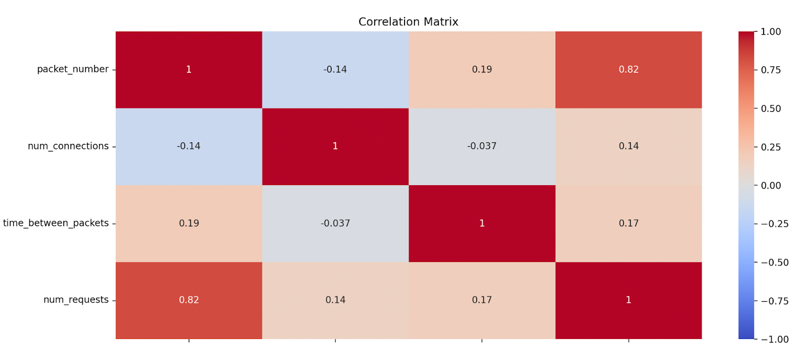
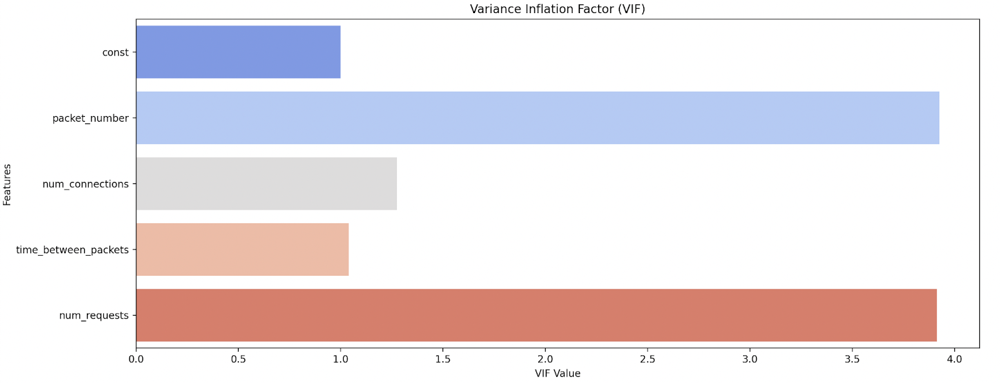

# 1. Введение в анализ текстовых данных

в ИБ искусственный интеллект используется повсюду. Например:
- для анализа событий системы и сетевой активности (обнаружения аномалий, классификация действий пользователя по событиям и типу контента);
- для кластеризации пользователей относительно совершаемых им действий;
- для распознавания лиц;
- для нейрокриптографии — обучения нейронной сети (автоэнкодера) и использования разных его частей в качестве публичного и закрытого ключа;
- для сохранения конфиденциальности данных, на которых модель обучается (есть даже термин «дифференциальная конфиденциальность»).

# 2. Основы работы с текстовыми данными

## Типы текстовых данных

несколько типов текстовых данных:
- непрерывный текст;
- короткие тексты;
- тематически связанные документы.

### Непрерывный текст

> это длинные статьи, отчеты, научные работы или подробные описания инцидентов. Такие тексты могут содержать огромный объем полезной информации, — например, описание конкретных атак, их последствия и методы защиты.

текст нужно «очистить»
- выделить ключевые фразы
- удалить неинформативные части
    - например:
        - вводные слова
        - ненужные технические подробности
- структурировать данные для дальнейшего машинного анализа.

### Короткие тексты

> это сообщения в мессенджерах, твиты, SMS и другие формы лаконичной коммуникации, где информация передается в краткой форме. Несмотря на их небольшой объем, такие тексты могут быть весьма информативными, особенно в контексте социальных сетей или быстрых сообщений в корпоративной среде.

- сотрудники могут обмениваться краткими сообщениями о подозрительных действиях или возможных инцидентах
- помогает оперативно выявлять возможные угрозы и реагировать на них

### Тематически связанные документы

> это коллекции текстов, объединенные общей темой или контекстом. Такие документы часто связаны между собой по содержанию и касаются одной и той же области знаний, проблемы или события.

- это могут быть
    - отчеты
    - исследования
    - инцидентные сводки или любые другие материалы которые рассматривают
        - определенные аспекты киберугроз
        - защитных мер или анализа инцидентов
- Это помогает глубже анализировать данные и принимать решения

## Задачи по обработке текстов

- **Классификация текстов**<br>Допустим, вы получили сотни электронных писем в корпоративную почту. Как автоматически определить, какие из них являются спамом, а какие содержат важную информацию? Здесь на помощь приходит задача классификации текстов
- **Анализ тональности**<br>Сообщения в социальных сетях, форумы и отзывы на продукцию компании могут содержать как положительные, так и отрицательные мнения. Анализ тональности помогает автоматически определять эмоциональную окраску текста, что может быть полезно для мониторинга репутации или выявления возможных угроз
- **Извлечение информации**<br>Допустим, в большом массиве данных вам нужно найти упоминания о конкретных уязвимостях или инцидентах. Используя методы извлечения информации, можно быстро и точно выделить нужные фрагменты текста
- **Поиск и извлечение данных**<br>Если вам нужно найти конкретный документ среди тысяч файлов, методы информационного поиска помогут быстро сузить круг поиска до нескольких релевантных вариантов

## Методы векторизации текстов

> Текстовые данные, будучи неструктурированными конкретно для машин, требуют специальной обработки, чтобы их можно было анализировать с помощью алгоритмов. Именно для этого существуют методы векторизации текстов

### Мешок слов (Bag-of-Words)

> один из самых простых и популярных способов преобразования текстовых данных в числовой формат.

- представлении текста буквально как «мешка слов»
- каждый уникальный термин из текста рассматривается как отдельный признак.
- порядок слов в документе игнорируется
    - важен лишь сам факт присутствия
    - частота

#### Этапы

1. **Токенизация**
    - удаления стоп-слов (часто встречающихся слов, не несущих значимой информации, например «и», «в»)
    - приведения всех слов к нижнему регистру
    - удаление пунктуации
    - Итоговое предложение/текст разбивается на токены (слова), из которых оно состоит
    - <ins>Примеры:</ins><br>`«Компьютер защищает сеть.» → [«компьютер», «защищает», «сеть»]`<br>`«Сеть атакует компьютер.» → [«сеть», «атакует», «компьютер»]`<br>`«Компьютер соединяется с сетью.» → [«компьютер», «соединяется», «с», «сетью»]`
1. **Составление словаря**
    - словарь всех уникальных слов в корпусе
    - часто сортирует слова в алфавитном порядке
    - <ins>Пример:</ins><br>`Итоговый словарь → [«компьютер», «защищает», «сеть», «атакует», «соединяется», «с», «сетью»]`
1. **Создание векторного представления**
    - каждый элемент вектора соответствует одному из слов в словаре
    - начение вектора отражает количество вхождений слова в документе (частоту)
    - <ins>Примеры:</ins><br>`«Компьютер защищает сеть.» → [1, 1, 1, 0, 0, 0, 0]`<br>`«Сеть атакует компьютер.» → [1, 0, 1, 1, 0, 0, 0]`<br>`«Компьютер соединяется с сетью.» → [1, 0, 0, 0, 1, 1, 1]`

Полученные вектора можно использовать как числовые данные, характеризующие объект, нашем случае — определенный документ.

### Метод TF-IDF

> представляет собой более сложный способ преобразования текста в числовой формат, который учитывает как частоту слов в конкретном документе, так и важность этих слов во всем корпусе документов.

> статистическая мера, используемая для оценки важности слова в документе относительно всего корпуса текстов.

- помогает выделить значимые термины, игнорируя часто встречающиеся и менее информативные слова
- позволяет более точно представлять текстовые данные для анализа и машинного обучения

#### Этапы

1. **Term Frequency (TF)** - подсчет частоты термина
    - Измеряет, как часто слово (термин) встречается в конкретном документе
    - Частота термина показывает важность слова в контексте данного документа.<br><br>$\text{TF}(t, d) = \frac{\text{Количество вхождений термина } t \text{ в документе } d}{\text{Общее количество слов в документе } d}$<br><br>
1. **Inverse Document Frequency (IDF)** - обратная документная частота.
    - Измеряет, насколько словое в корпусе документов редко встречается.
    - Помогает
        - уменьшить вес часто встречающихся слов, которые имеют меньшую информационную ценность
        - повысить вес слов, которые встречаются реже и, следовательно, более значимы
    - **показатель обратной документной частоты (IDF)** - Чтобы учитывать, что слово встречается очень часто во всех документах, а не только в одном<br><br>$\text{IDF}(t, D) = \log \frac{\text{Общее количество документов в корпусе } D}{\text{Количество документов,содержащих термин } t}$<br><br>
    - **Итоговая формула TF-IDF**<br><br>$\text{TF-IDF}(t, d, D) = \text{TF}(t, d) \times \text{IDF}(t, D)$<br><br>

## проблема переобучения (overfitting).

> происходит, когда модель слишком точно подстраивается под обучающие данные, включая шум и несущественные детали. Оно может привести к ухудшению работы модели на новых, ранее не видимых данных. Переобучение особенно критично в задачах ИБ, где точность предсказаний может быть решающим фактором.

- преобразуете текст в числовые векторы с помощью методов Bag-of-Words или TF-IDF, количество признаков (размерность) значительно возрастает

### Основные причины

1. **Высокая размерность признаков**
    -   Каждый уникальный термин в текстовом корпусе становится отдельным признаком в векторе
    - даже небольшой набор документов -> многие тысячипризнаков
    - Такая высокая размерность увеличивает вероятность того, что модель начнет запоминать детали обучающих данных
        - включая шум и редкие слова, вместо того чтобы выявлять общие закономерности

1. **Разреженность данных**
    - Векторы, полученные после векторизации, часто бывают разреженными (содержат много нулевых элементов)
        - слова, которые отсутствуют в данном документе
    - большое количество признаков, из которых мало действительно важных

1. **Избыточность признаков**
    - Текстовые данные могут содержать множество избыточных или малоинформативных признаков
    - Например предлогов, местоимений и союзов не несут особой смысловой нагрузки
    - могут существенно влиять на модель, если не будут правильно обработаны (например, не удалены или не учтены с помощью методов вродеIDF)

1. **Шум в данных**
    - Тексты могут содержать шум
        - опечатки, различные формы слов, синонимы и неструктурированную информацию
    - Модель может переобучиться на этих незначительных вариациях, что разучит ее обобщать и правильно классифицировать новые данные

1. **Малое количество обучающих данных**
    - Когда текстовых документов немного по сравнению с числом признаков, модель может легко переобучиться
    - недостаточно данных для выявления истинных закономерностей
    - начинает запоминать специфические особенности каждого документа, что приводит к плохой генерализации на новых данных

# 3. Переобучение моделей и методы борьбы с ним

> **Переобучение (overfitting)**<br>это явление в машинном обучении, при котором модель слишком точно подстраивается под обучающие данные, включая шум и незначительные особенности, что приводит к ухудшению ее способности обобщать и правильно предсказывать результаты на новых, ранее не видимых данных.

Как понять, что модель переобучена на обучающих и тестовых данных?
- Показывает высокую точность на обучающих данных и низкую — на тестовых.
- Есть разрыв между ошибками на обучающих и тестовых данных.
- Время обучения было слишком большим — модели, которые слишком долго обучаются, особенно если нет существенного улучшения в метриках на валидационном наборе данных, могут быть склонны к переобучению.

## Робастность модели (или устойчивость модели)

> способность модели машинного обучения сохранять свою производительность и давать стабильные результаты при изменении или появлении различных факторов.

Факторами в реальных условиях могут быть:

- **Шум в данных.**<br>Модель считается робастной, если она способна правильно обобщать и делать прогнозы, несмотря на наличие шумовых данных или выбросов.
- **Незначительные изменения в данных.**<br>Робастная модель не сильно меняет свои предсказания при небольших изменениях во входных данных.
- **Атаки и манипуляции с данными.**<br>В контексте ИБ робастность модели — это ее устойчивость к злонамеренным попыткам манипулировать входными данными для получения искаженных результатов.

Робастные модели обеспечивают более надежные и предсказуемые результаты в различных условиях, что хорошо в практических приложениях, где данные могут быть загрязнены шумом или встречаются случаи отклонений от ожидаемых параметров.

## Методы борьбы с переобучением

> **Регуляризация**<br>это техника, которая добавляет штраф за сложность модели в функцию потерь, чтобы предотвратить чрезмерное подстраивание модели под обучающие данные.

### L1-регуляризация (Lasso)

> Least Absolute Shrinkage and Selection Operator, или Lasso.

- Добавляет штраф, пропорциональный абсолютной величине коэффициентов модели
- некоторые коэффициенты обнуляются, что может способствовать отбору наиболее значимых признаков.

$$
\text{Loss Function} = \text{MSE} + \alpha \sum_{i=1}^{n} |w_i|
$$

```python
sklearn.linear_model.Lasso
```

https://scikit-learn.org/dev/modules/generated/sklearn.linear_model.Lasso.html

#### Плюсы

- **Снижает число признаков**
    - приводит к обнулению весов некоторых признаков
    - Модель выбирает только наиболее важные признаки, эффективно выполняя отбор признаков и упрощая модель.
- **Улучшает интерпретируемость за счет уменьшения числа признаков в модели**
    - Это особенно полезно в задачах, где важно понимать влияние конкретных переменных.
- **Улучшает обобщающую способность модели**
    - актуально в задачах 
        - с высоким уровнем шума (повысится робастность модели к шуму)
        - избыточным количеством признаков.

#### Минусы

- **Есть проблемы с мультиколлинеарностью**
    - признаки сильно коррелированы (высокая мультиколлинеарность), L1-регуляризация может выбрать один из них и проигнорировать остальные
    - может привести к неустойчивым и нестабильным решениям, где не всегда сохраняется наиболее важный признак.
- **Меньшая точность в задачах с малым числом важных признаков**
    - если небольшое количество важных признаков, L1-регуляризация может быть недостаточно гибкой для нахождения оптимальных весов, что повлияет на точность модели.
- **Есть риск чрезмерного отбора признаков**
    - L1-регуляризация может привести к излишне агрессивному отбору признаков, исключая даже те, которые могут быть полезными в модели
    - особенно актуально в задачах, где важна каждая деталь.

### L2-регуляризация (Ridge)

> L2-регуляризация, или ридж-регуляризация, или просто ридж — метод регуляризации, который <ins>применяется в линейных моделях</ins> для предотвращения переобучения.

- Идея L2-регуляризации — добавить штраф за величину коэффициентов модели, чтобы уменьшить их значения и предотвратить подгонку модели к обучающим данным.
- ограничивает величину коэффициентов, но не обнуляет их полность
- делает модель менее чувствительной к шуму в данных
- предотвращает слишком большие значения весов, которые могут привести к переобучению.

L2-регуляризация добавляет штраф, пропорциональный квадрату нормы весов модели (о них — далее), к функции потерь

В случае линейной регрессии функция потерь с L2-регуляризацией выглядит следующим образом:

'''math
\text{Loss}_{L2} = \text{MSE} + \alpha \sum_{j=1}^n w_j^2
'''

- $\text{MSE}$ — среднеквадратичная ошибка (Mean Squared Error).
- $\alpha$ — коэффициент регуляризации, контролирующий силу регуляризации.
- $w_j$ — коэффициенты модели.
- $n$ — количество коэффициентов.

```python
sklearn.linear_model.Ridge
```

https://scikit-learn.org/1.5/modules/generated/sklearn.linear_model.Ridge.html

#### преимущества

- Она стабильна и помогает избежать больших весов, которые могут приводить к переобучению.
- Она менее чувствительна к шуму.

#### недостаток

- не приводит к разреженности: в отличие от L1-регуляризации, L2-регуляризация не обнуляет коэффициенты полностью
- может быть минусом в задачах, где важно получить разреженные модели (модели с нулевыми весами)

### Elastic Net

> метод регуляризации, идея которого заключается в том, чтобы объединить способность L1-регуляризации полностью исключать незначимые признаки (что помогает в выборе признаков) и свойство L2-регуляризации равномерно распределять штрафы по всем коэффициентам, что предотвращает сильные выбросы в весах.

$$
\text{Elastic Net Loss} = \text{RSS} + \alpha \times \left( \lambda_1 \sum_{j=1}^{p} |w_j| + \lambda_2 \sum_{j=1}^{p} w_j^2 \right)
$$

- $\text{RSS}$ — это Residual Sum of Squares (остаточная сумма квадратов),
- $\alpha$ — общий коэффициент регуляризации, который контролирует силу штрафа,
- $\lambda_1$ и $\lambda_2$ — коэффициенты, управляющие вкладом L1- и L2-регуляризаций соответственно, в сумме они должны давать 1,
- $w_j$ — весовой коэффициент признака.

#### Преимущества

- **комбинирует L1- и L2-регуляризации**
    - позволяет эффективно справляться как с коррелированными признаками, так и с незначимыми признаками
    - L1- помогает в отборе признаков, а L2- — сглаживает веса, что делает модель более устойчивой
- **Устойчив к мультиколлинеарности**
    - хорошо работает в ситуациях, когда признаки сильно коррелированы между собой
    - учитывает вклад всех коррелированных признаков
- **Гибкий в настройке**
    - предоставляет возможность настройки соотношения между L1- и L2-регуляризациями с помощью параметров $lambda_1$ и $lambda_2$
- **Имеет лучшую обобщающую способность**
    - За счет комбинированного воздействия часто помогает избежать переобучения модели
    - особенно в задачах с большим количеством признаков.

#### минусы

- **сложно настраивать**
    - требует подбора двух параметров регуляризации $lambda_1$ и $lambda_2$, что увеличивает сложность настройки модели
    - может потребовать больше вычислительных ресурсов
- **Потенциально избыточен**
    - может привести к избыточной штрафованию модели, особенно если данные плохо поддаются регуляризации
- **Менее интерпретируемый**
    - модель может остаться менее интерпретируемой, чем при использовании чистой L1-регуляризации, так как L2-штраф сглаживает веса всех признаков
- **Зависим от параметров**
    - чувствителен к выбору параметров: неправильно настроенные коэффициенты
        - могут ухудшить производительность модели
        - не дать ожидаемого эффекта от регуляризации

### Dropout

> метод регуляризации, идея которого заключается в случайном «отключении» (буквально drop out) определенного процента нейронов во время обучения, что приводит к обучению более устойчивой и обобщающей модели.

был предложен в 2014 году как способ улучшения обобщающей способности глубоких моделей, которые склонны к переобучению, особенно на небольших наборах данных.

### кросс-валидаци

> позволяет перемешивать и использовать по частям обучающую выборку, как для обучения, что снижает риск переобучения на одном конкретном наборе данных

# 4. Коррелирование признаков

> Корреляция между признаками показывает, как изменение одного признака связано с изменением другого. Это может раскрыть скрытые зависимости и взаимосвязи, критичные для понимания поведения системы.

## Понятие и влияние коррелированных признаков

> **Корреляция**<br>это статистическая мера, показывающая степень зависимости между двумя или более переменными.

- В контексте машинного обучения и анализа данных под корреляцией обычно подразумевают линейную связь между признаками
- Если два признака имеют высокую корреляцию, это означает, что изменение одного признака будет сопровождаться предсказуемым изменением другого

Корреляция измеряется коэффициентом корреляции, который варьируется от -1 до 1:
- <ins>Коэффициент +1</ins> указывает на идеальную положительную корреляцию — если один признак увеличивается, другой также увеличивается.
- <ins>Коэффициент -1</ins> указывает на идеальную отрицательную корреляцию — если один признак увеличивается, другой уменьшается.
- <ins>Коэффициент 0</ins> означает отсутствие линейной зависимости между признаками.

Коррелированные признаки могут влиять на обучение модели и приводить к:
- **Проблемам с интерпретацией**
    - Высокая корреляция между признаками затрудняет понимание вклада каждого признака в предсказание
    - В линейной регрессии, например, это может приводить к неопределенности в оценке коэффициентов модели
- **Переобучению (overfitting)**
- **Численной нестабильности**
    - наличие коррелированных признаков может приводить к нестабильности расчетов и «раздутию» стандартных ошибок оценки.

Проблема переобучения, вызванная высокой корреляцией признаков, может быть смягчена с помощью L2- и L1-регуляризации.
- L2-регуляризация помогает уменьшить влияние избыточных признаков, плавно снижая их вес, что улучшает обобщающую способность модели.
- L1-регуляризация <ins>более эффективно справляется с задачей устранения сильной корреляции</ins>, ведь она склонна к радикальному отбору признаков и полностью обнуляет веса менее значимых признаков. Это позволяет модели сосредоточиться только на наиболее важных признаках, снижая риск переобучения.

## Методы обнаружения коррелированных признаков

> **Корреляционная матрица**<br>это таблица, в которой указаны коэффициенты корреляции между всеми парами признаков набора данных. Эта матрица позволяет быстро определить наличие высоких корреляций между признаками.

В качестве коэффициента корреляции часто берут **коэффициент корреляции Пирсона**, который измеряет степень линейной зависимости между двумя переменными.

$$
r_{xy} = \frac{\sum_{i=1}^{n}(x_i - \bar{x})(y_i - \bar{y})}{\sqrt{\sum_{i=1}^{n}(x_i - \bar{x})^2 \sum_{i=1}^{n}(y_i - \bar{y})^2}}
$$

- $r_xy$ — коэффициент корреляции между переменными $x$ и $y$.
- $x_i$ и $y_i$ — отдельные значения переменных $x$ и $y$ соответственно.
- $\bar{x}$ и $\bar{y}$ — средние значения переменных $x$ и $y$.
- $n$ — количество пар значений.

принимает значения от -1 до 1:
- $r_{xy} = 1$ указывает на идеальную положительную линейную зависимость.
- $r_{xy} = -1$ указывает на идеальную отрицательную линейную зависимость.
- $r_{xy} = 0$ указывает на отсутствие линейной зависимости между переменными.

### ограничения коэффициента корреляции Пирсона

- **Он линейно зависим.**
	- Измеряет только линейные зависимости между переменными
    - Если существует нелинейная зависимость, коэффициент может быть близким к нулю, даже если между переменными есть сильная нелинейная связь.
- **Он чувствителен к выбросам.**
	- Небольшое количество аномальных данных может значительно изменить значение коэффициента и исказить интерпретацию связи.
- **Он не учитывает распределение данных.**
	- В связи с чем может не отражать сложные зависимости, которые могут существовать между переменными, особенно если данные имеют несимметричное распределение.
- **Он требователен к нормальности.**
	- Хотя для вычисления коэффициента корреляции Пирсона не требуется, чтобы данные были строго нормально распределены, предположение нормальности помогает в интерпретации результатов, особенно при применении статистических тестов.
- **Он не указывает на причинно-следственные связи.**
	- Корреляционные матрицы отлично справляются с задачей выявления парных зависимостей между признаками
    - когда дело доходит до более сложных случаев типа мультиколлинеарности, когда несколько признаков взаимосвязаны в совокупности, корреляционные матрицы уже не работают так хорошо.

## Фактор инфляции дисперсии

> **Фактор инфляции дисперсии (Variance Inflation Factor, или VAF)**<br>это показатель, который оценивает степень мультиколлинеарности признака в наборе данных. VAF показывает, насколько дисперсия коэффициента регрессии увеличивается из-за зависимости этого признака от других.

> **Дисперсия коэффициента регрессии**<br>это мера вариации или изменчивости оценки коэффициента регрессии в модели линейной регрессии. В контексте линейной регрессии коэффициент регрессии отражает влияние одной независимой переменной на зависимую переменную при условии, что все остальные переменные остаются постоянными.

[интересная статья про коэффициент регрессии](https://habr.com/ru/articles/514818/) — что из себя представляет регрессия в рамках математики и статистики.

- высокий VIF признака → высокую степень мультиколлинеарности, и этот признак может ухудшать устойчивость модели
- VIF > 10 высокую → сигнал, что признак следует рассмотреть на предмет удаления или преобразования

Формула для расчета VIF для признака $X_i$

$$
\text{VIF}(X_i) = \frac{1}{1 - R_i^2}
$$

- $R_i^2$ - коэффициент детерминации ([статья](https://habr.com/ru/articles/350668/))
- $R$ - регрессия
- $X_i$ - зависимая переменная
- остальные признаки - независимые переменные

**Пример**

- packet_number — количество пакетов за определенное время;
- num_connections — количество активных соединений;
- time_between_packets — время между пакетами;
- num_requests — количество запросов за определенное время.

Пусть имеется регрессия:<br>
$num\_requests = packet\_number * 0.6 + num\_connections + e$

- $e$ - небольшой шум в зависимостях
- константа (иногда ее еще называют интерсептом) `add_constant(df_scaled)` добавляется к признакам для оценки VIF
- Добавление константы необязательно, но часто необходимо для корректного расчета модели регрессии
- Константа добавляется, чтобы модель могла учитывать смещение и правильно оценивать вклад каждого признака

Зачем добавлять константу при расчете VIF?
- *Чтобы модель учитывала смещение (интерсепт) и стала более гибкой*<br>это особенно важно в контексте линейной регрессии, где модель пытается найти не только наклон, но и точку пересечения с осью Y.
- *Чтобы корректно оценить VIF*<br>хотя VIF по своей сути оценивает мультиколлинеарность между признаками, добавление константы позволяет лучше учесть взаимодействие между признаками и общую зависимость в данных.
- *Чтобы расчеты были стабильными*<br>матрица признаков станет более устойчивой, особенно если впоследствии эта матрица будет использоваться в регрессионном анализе. Так менее вероятно, что расчет  даст неверные или странные результаты.

```python
import pandas as pd
import numpy as np
from statsmodels.stats.outliers_influence import variance_inflation_factor
from statsmodels.tools.tools import add_constant
from sklearn.preprocessing import StandardScaler
import seaborn as sns
import matplotlib.pyplot as plt

# Генерируем синтетические данные, имитирующие реальные признаки
np.random.seed(42)
n_samples = 100

data = {
    'packet_number': np.random.normal(500, 100, n_samples),
    'num_connections': np.random.normal(20, 5, n_samples),
    'time_between_packets': np.random.normal(50, 10, n_samples),
}

# Вводим корреляцию между признаками
data['num_requests'] = data['packet_number'] * 0.6 + data['num_connections'] + np.random.normal(0, 10, n_samples)

# Создаем DataFrame
df = pd.DataFrame(data)

# Рассчитываем корреляционную матрицу
corr_matrix = df.corr()

# Строим тепловую карту корреляционной матрицы
plt.figure(figsize=(8, 6))
sns.heatmap(corr_matrix, annot=True, cmap='coolwarm', vmin=-1, vmax=1)
plt.title("Correlation Matrix")
plt.show()

# Масштабируем данные перед расчетом VIF
scaler = StandardScaler()
df_scaled = pd.DataFrame(scaler.fit_transform(df), columns=df.columns)

# Добавляем константу для расчета VIF
X = add_constant(df_scaled)

# Рассчитываем VIF для каждого признака
vif_data = pd.DataFrame()
vif_data["Feature"] = X.columns
vif_data["VIF"] = [variance_inflation_factor(X.values, i) for i in range(X.shape[1])]

# Выводим результаты VIF
print(vif_data)

# Строим гистограмму VIF
plt.figure(figsize=(8, 6))
sns.barplot(x="VIF", y="Feature", data=vif_data, palette="coolwarm")
plt.title("Variance Inflation Factor (VIF)")
plt.xlabel("VIF Value")
plt.ylabel("Features")
plt.show()
```

<br>

`packet_number` сильно влияет на количество запросов `num_requests`
- сильная зависимость одной переменной может маскировать зависимости от других переменных и приводить к неправильным выводам о структуре данных.

# 5. Уменьшение размерности данных

> процесс трансформации данных с большим числом признаков (высокая размерность) в данные с меньшим числом признаков, при этом сохраняя как можно больше полезной информации. Это важно, поскольку в задачах машинного обучения и анализа данных часто возникают случаи, когда большое количество признаков усложняет модель, увеличивает вычислительные затраты и может приводить к переобучению, и это надо решать.

## Проклятие размерности (curse of dimensionality)

> различные явления, возникающие при работе с данными в многомерных пространствах (с высокой размерностью).

- Это явление связано с экспоненциальным ростом сложности и объема пространства признаков по мере увеличения числа признаков
- традиционные методы анализа данных часто сталкиваются с трудностями
    - разреженностью данных
    - ухудшением качества моделей
    - высокой вычислительной сложностью

Вот чем отличается проклятие размерности.

1. **Данные в нем разрежены**
    - Объем данных, необходимый для заполнения пространства, экспоненциально растет с увеличением числа признаков
    - если данные находятся в высокоразмерном пространстве, они часто располагаются на низкоразмерных подмногообразиях
    - Это приводит к недообучению моделей

> **Подмногообразия**
> - это низкоразмерные структуры, которые можно обнаружить в высокоразмерных данных.
> - В математике — это множество, которое само является многообразием, но имеет меньшую размерность, чем исходное пространство.
> - Применительно к задачам машинного обучения и анализа данных:<br> подмногообразия представляют собой участки данных, которые сосредоточены в областях меньшей размерности внутри более высокоразмерного пространства.

2. **Объем пространства увеличен**
    - Если размерность пространства растет, объем пространства расположения данных тоже увеличивается, причем экспоненциально
    - плотность данных снижается, и требуется значительно больше данных для эффективного обучения моделей.
3. **Расстояния схожи между собой**
    - В высокоразмерных пространствах различия между евклидовыми расстояниями между точками могут становиться все менее значимыми
4. **Могут переобучаться**
    - модель подгоняется под шум в данных, а не выявляет общие закономерности
    - > Чтобы избежать переобучения, требуются большие объемы данных, что не всегда возможно на практике

Наиболее чувствительные алгоритмы к проклятию размерности — алгоритмы кластеризации

## Методы уменьшения размерности (PCA, ICA, LDA)

### PCA (Principal Component Analysis, или метод главных компонент)

> метод линейного уменьшения размерности, который находит новые ортогональные оси (компоненты), вдоль которых данные имеют наибольшую дисперсию. Специалист выбирает компоненты, по которым данные сильнее изменяются и вносят существенный вклад в общее представление изменения данных. Эти компоненты сортируются по убыванию дисперсии, и первые несколько из них выбираются для уменьшения размерности.

- PCA отбирает наиболее значимые компоненты на основе того, насколько сильно данные варьируются по данной компоненте
- Если компонента постоянная (признак константный), то он никак не описывает данные и может быть удален.

#### ограничения

- **Его компоненты линейны**
    - Данные могут быть аппроксимированы линейной комбинацией признаков
    - метод хорошо работает, если взаимосвязи между признаками и целевой переменной линейны
    - PCA не может адекватно уловить нелинейные зависимости
- **Чувствителен к масштабированию данных**
    - Если признаки имеют разные единицы измерения, PCA может ошибиться при выявлении главных компонентов, потому что признаки с большим диапазоном значений могут доминировать в результатах
    - перед применением PCA важно <ins>обязательно нормализовывать или стандартизировать данные</ins>
- **Может потерять интерпретируемость**
    - После преобразования данных с помощью PCA новые переменные (главные компоненты) часто теряют физический смысл
    - атрудняет интерпретацию полученных результатов (трудно понять, какие исходные признаки вносят наибольший вклад в главные компоненты)
- **Учитывает только ковариации**
    - PCA максимизирует дисперсию данных, и это не всегда совпадает с максимизацией информации, полезной для конкретной задачи
    - шум и выбросы могут сильно влиять на результат, поскольку PCA старается объяснить максимальную дисперсию, включая шум
- **Чувствителен к выбросам**
    - выбросы могут исказить результат, особенно если они влияют на расчет дисперсии
    - В результате главные компоненты будут определяться этими выбросами, а не основными закономерностями в данных
- **Сложно определить количество главных компонентов**
    - Часто это делается на основе объясненной дисперсии (например, выбор компонента с накопленной долей дисперсии выше определенного порога)
    - такой подход субъективен и может привести к потере важной информации, если вы выбрали неправильное количество
- **Есть свои требования к вычислительным ресурсам**
    - требует значительных вычислительных ресурсов, особенно для больших наборов данных с большим количеством признаков

### ICA (Independent Component Analysis, или независимый компонентный анализ)

Чтобы выявить скрытые угрозы, требуется метод разделения смешанных данных (относящихся и не относящихся к задаче) на независимые компоненты

> метод снижения размерности и разложения многомерных сигналов, который используется для выделения скрытых факторов (независимых компонентов) из данных. Этот метод может помочь выявить скрытые угрозы и аномальные поведения, которые сложно обнаружить с помощью традиционных методов анализа данных.

- часто применяется в задачах, где данные представляют собой смесь независимых источников вроде анализа изображений, обработки сигналов и распознавания речи
- пытается найти статистически не зависимые друг от друга компоненты
- особенно полезен в ситуациях, когда данные представляют собой смесь сигналов<br>(например, при анализе аномалий в сетевом трафике)

Основное уравнение для ICA выглядит так:

$$
\mathbf{S} = \mathbf{WX}
$$

- $\mathbf{X} = [x_1, x_2, \ldots, x_n]^T$ - Вектор наблюдаемых сигналов
- $\mathbf{W}$ - Матрица разделения (помогает разделить сигналы)
- $\mathbf{S} = [s_1, s_2, \ldots, s_n]^T$ - Вектор независимых компонентов

Задача ICA — подобрать матрицу $\mathbf{W}$ так, чтобы компоненты $\mathbf{X}$ стали как можно более независимыми друг от друга.

#### Преимущества

- **Выделяет независимые источники**
    - хорошо справляется с задачами, где важна независимость данных — например, в задачах обработки сигналов
- **Анализирует скрытые структуры**
    - ICA может обнаруживать скрытые закономерности в данных, что как раз актуально в ИБ.

#### Недостатки

- **Необходима независимость данных**
    - ICA предполагает, что исходные компоненты независимы. Если это условие не выполняется, результаты могут быть неточными.
- **Чувствителен к шуму**
    - может усложнить извлечение независимых компонентов
- **Имеет неоднозначный порядок и масштаб**
    - компоненты могут быть извлечены в произвольном порядке и масштабе

### LDA (Linear Discriminant Analysis или Линейный дискриминантный анализ)

> метод уменьшения размерности, который часто используется в задачах классификации и распознавания образов

- Основная цель — найти проекции данных, которые максимально разделяют классы
- помогает анализировать и классифицировать данные, особенно в условиях, когда необходимо учитывать принадлежность данных к определенным классам
- ищет линейные комбинации признаков, которые обеспечивают наилучшее разделение между различными классами
- достигается за счет максимизации расстояния между средними значениями классов (межклассовая дисперсия) при одновременной минимизации разброса внутри классов (внутриклассовая дисперсия)
- **максимизация межклассовой дисперсии** при **минимизации внутриклассовой дисперсии**

#### Преимущества

- **Эффективен в задачах классификации**
    - Отлично справляется с задачами классификации, так как проецирует данные на новое пространство, где классы лучше разделяются
- **Интерпретируемый**
    - Предоставляет интерпретируемые компоненты, которые можно использовать для анализа важности признаков.
- **Устойчив к многомерности**
    - может помочь в борьбе с проблемами многомерности, уменьшая размерность данных

#### Недостатки

- **линейный**
    - предполагает линейное разделение классов, что может быть недостаточно для сложных данных с нелинейными зависимостями
- **чувствителен к наличию шумов и выбросов**
    - Они могут искажать оценки средних и ковариационных матриц
- **Для него необходимы метки классов**
    - Поэтому LDA <ins>нельзя применять для задач без учителя</ins>

#### Различия методов

- В отличие от PCA, который ориентирован на максимизацию дисперсии данных
    - LDA фокусируется на максимизации разделения классов, что хорошо подходит для задач классификации.
- В отличие от ICA, который не учитывает метки классов
    - LDA направлен на оптимизацию разделения данных между различными классами, что удобно при построении моделей классификации в системах анализа угроз и выявления аномалий.

## Современные методы визуализации многомерных данных

- позволяют эффективно отображать высокоразмерные данные в низкоразмерных пространствах, сохраняя их структуру и взаимосвязи
- особенно полезны для анализа и интерпретации сложных наборов данных, где традиционных методов типа PCA недостаточно

### t-SNE (t-Distributed Stochastic Neighbor Embedding)

> метод нелинейного уменьшения размерности, который хорошо сохраняет локальную структуру данных.

#### этапы работы

1. **Преобразуем расстояния**
    - В высокоразмерном пространстве рассчитываются вероятности близости точек
    - Для каждой точки вычисляется вероятность того, что любая другая точка является ее соседом на основе гауссовского распределения
1. **Оптимизируем расстояния**
    - пытается создать низкоразмерное представление данных, где расстояния между точками также являются вероятностями
    - с использованием <ins>распределения t-Стьюдента</ins> с первой степенью свободы
    - Это распределение позволяет уменьшить влияние выбросов и лучше сохранять глобальную структуру данных.
1. **Минимизируем расхождения**
    - используется <ins>метод градиентного спуска</ins> для минимизации разницы между распределениями в высокоразмерном и низкоразмерном пространствах

#### Плюсы-минусы

<strong style="color:green">Плюсы</strong>:
- хорошо сохраняет локальные структуры данных
- позволяет эффективно визуализировать кластеры и структуры в данных

<strong style="color:red">Минусы</strong>:
- может быть медленным при работе с большими наборами данных
- параметры вроде перплексности могут сильно влиять на результаты

### UMAP (Uniform Manifold Approximation and Projection)

> современный метод нелинейного уменьшения размерности, который сохраняет как локальные, так и глобальные структуры данных.

#### этапы

1. **Создаем граф ближайших соседей**
    - В высокоразмерном пространстве строится граф ближайших соседей для каждой точки, чтобы учитывать структуру данных и локальные взаимосвязи.
1. **Проецируем на низкоразмерное пространство**
    - Построенный граф используется для создания низкоразмерного представления данных, где структура графа сохраняется.
1. **Оптимизируем результат**
    - Используется метод градиентного спуска для минимизации расхождений между высокоразмерным и низкоразмерным графами, чтобы сохранить как локальные, так и глобальные структуры данных.

#### Плюсы-минусы

<strong style="color:green">Плюсы</strong>:
- хорошо сохраняет как локальные, так и глобальные структуры данных
- более эффективен по времени по сравнению с t-SNE
- подходит для работы с большими наборами данных

<strong style="color:red">Минусы</strong>:
- результаты могут зависеть от выбора гиперпараметров
- менее интуитивно понятен по сравнению с t-SNE

## шпаргалка по методам уменьшения размерности и их применение в задачах ИБ

| № | Метод | Использование |
| -- | -- | -- |
| 1 | Метод главных компонент (PCA) | для предварительной обработки данных, когда необходимо уменьшить размерность данных с минимальной потерей информации и выделить основные компоненты, влияющие на вариативность данных. |
| 2 | Независимый компонентный анализ (ICA) | если надо разделить многомерные сигналы на статистически независимые компоненты, что полезно для обнаружения скрытых факторов или источников аномалий в данных. |
| 3 | Анализ линейных дискриминантов (LDA) | для классификации, где необходимо максимизировать разделение между различными классами и минимизировать внутриклассовую дисперсию для улучшения точности модели. |
| 4 | t-SNE (t-distributed Stochastic Neighbor Embedding) | для визуализации многомерных данных, когда необходимо выявить кластеры и структуру данных. Это особенно полезно для анализа сложных данных и обнаружения аномалий. |
| 5 | UMAP (Uniform Manifold Approximation and Projection) | для кластеризации и визуализации данных с сохранением глобальной структуры. UMAP эффективен для обнаружения сложных паттернов и аномалий в данных большого объема. |

# Источники

- https://habr.com/ru/articles/514818/
- https://habr.com/ru/articles/350668/

