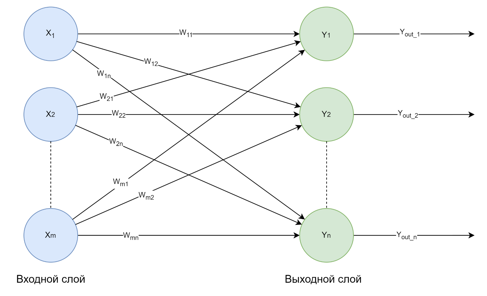
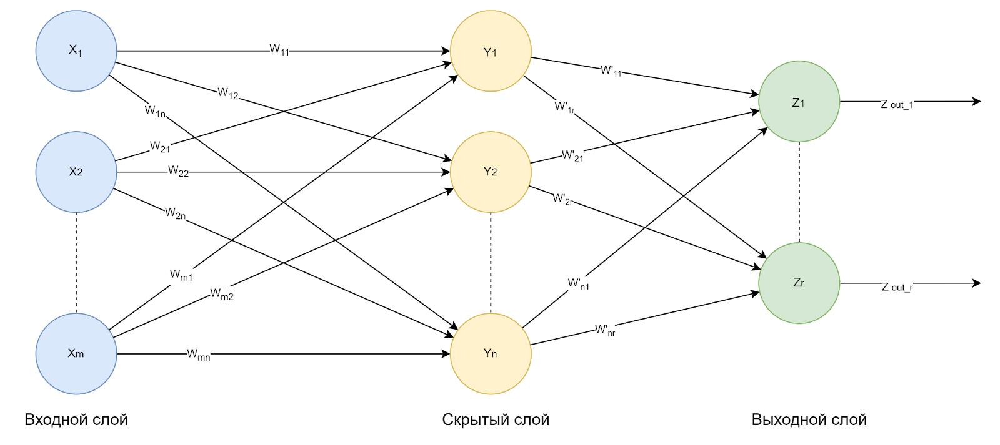
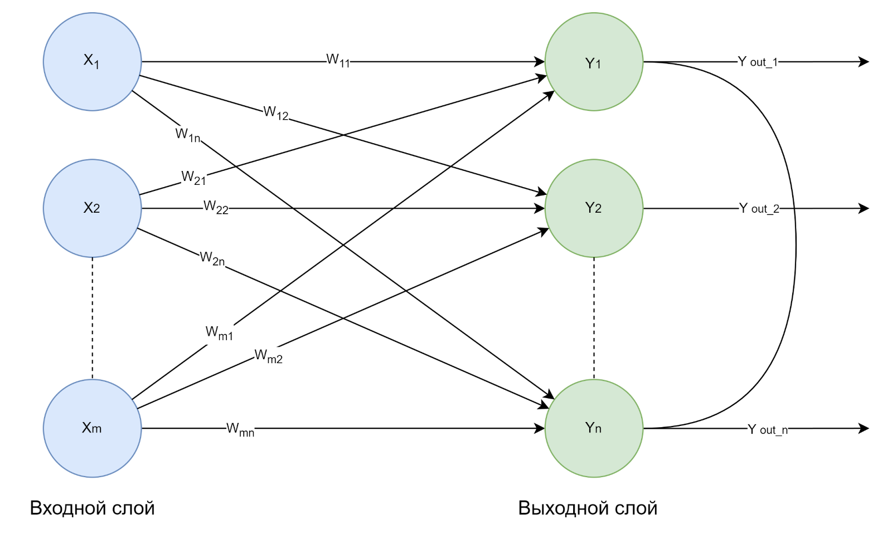
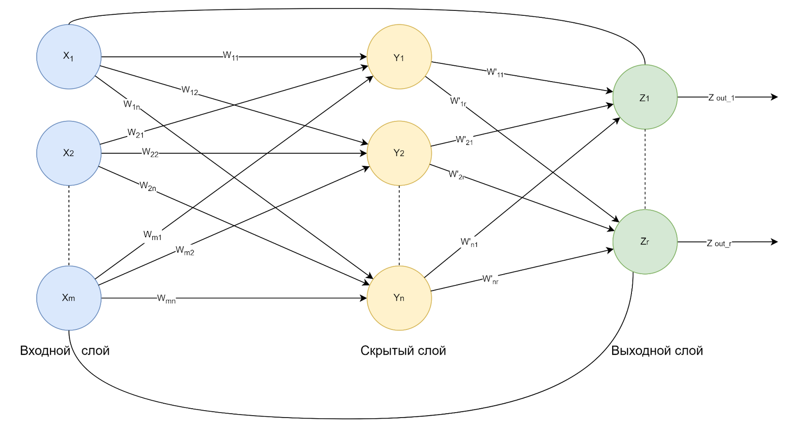
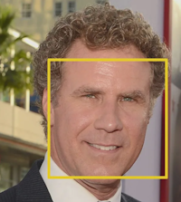
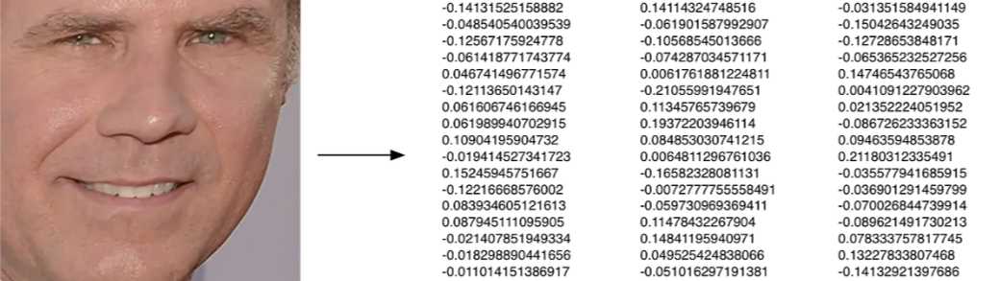
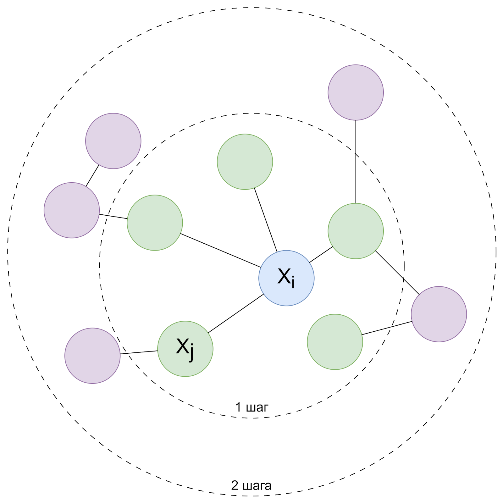

# 2. Основы нейронных сетей и их архитектуры

> **искусственная нейронная сеть (Artificial Neural Network, или ANN)** это математическая модель, вдохновленная биологическим мозгом, которая обучается решать задачи на основе данных.

## Основные характеристики нейронных сетей

Нейронные сети состоят из:
- **нейронов (или узлы)** - это основные элементы сети, которые обрабатывают входные данные;
- **слоев** - месторасположений набора нейронов.
- **весовой коэффициент,** - вес соединения между нейронами, определяет степень влияния одного нейрона на другой.
- **активационная функция** - определяет, будет ли передана информация на следующий уровень, и помогает модели захватывать нелинейные зависимости.

> **Основная цель нейронной сети** найти скрытые зависимости в данных и научиться делать прогнозы или классификации.

## Виды архитектур нейронной сети

### Одноуровневая сеть прямой связи

Входной уровень состоит из *m* входных нейронов, подключенных к каждому из *n* выходных нейронов. Соединения имеют веса $w_{11}, w_{12}$ и так далее.

- Входной уровень нейронов не выполняет никакой обработки — они передают сигналы ввода-вывода нейронам
    - единственный видимый слой во всей архитектуре нейронной сети, который передает полную информацию из внешнего мира без каких-либо вычислений
- Вычисления выполняются на выходном уровне
    - ринимает входные данные от предыдущих слоев и приходит к окончательному прогнозированию на основе полученных данных модели
    - уровень, на котором мы получаем конечный результат

### Многослойная сеть прямой связи

> **Скрытые слои** промежуточные уровни, которые выполняют все вычисления и извлекают функции из данных

- Может существовать несколько взаимосвязанных скрытых слоев, которые отвечают за поиск различных скрытых объектов в данных
- Каждый из слоев может иметь различное количество нейронов

### Конкурентная сеть

> По структуре эта сеть такая же, как и однослойная сеть прямого распространения. Единственное отличие в том, что выходные нейроны связаны друг с другом (частично или полностью)

- Для заданного входа выходные нейроны конкурируют друг с другом, чтобы представить вход
- представляет собой форму алгоритма неконтролируемого обучения в ANN, который подходит для поиска кластеров в наборе данных

### Рекуррентная сеть

- существуют петли обратной связи (то есть от нейронов выходного слоя к нейронам входного слоя), а также самопетли

### Другие виды

- [генеративно-состязательная сеть](https://education.yandex.ru/handbook/ml/article/generativno-sostyazatelnye-seti-(gan))
- [резидуальная нейронная сеть](https://neurohive.io/ru/vidy-nejrosetej/resnet-34-50-101/)
- [сверточная нейронная сеть](https://habr.com/ru/articles/348000/)

## Применение глубокого обучения для обнаружения и предотвращения кибератак

- помогают кибербезопасности предотвращать атаки и снижать риски

### IDS / IPS

автоматически обнаруживают вредоносные действия в сети и предотвращают получение злоумышленниками доступа к системе

сверточные нейронные сети (CNN) и рекуррентные нейронные сети (RNN)
- создать более интеллектуальную систему обнаружения
- более точно анализировать трафик
- сокращают количество ложно-положительных срабатываний
- помогают SOC-отделу выявлять подозрительные сетевые действия

### Обнаружение вредоносных программ

1. Обнаруживает новые вредоносные программы и вирусы с помощью технологии распознавания аномальных образов в приложениях.
1. Изолирует системы перед заражением.
1. Автоматически обнаруживает вредоносные программы и блокирует мошеннические действия в виде фишинга, рассылки спама.

### Обнаружение спама и блокировка

- может помочь специалистам легко выявлять и обрабатывать спам и другие подозрительные действия с помощью «обработки естественного языка» (NLP)

>**NLP** это метод глубокого обучения, предназначенный для изучения форм общения и языковых шаблонов, а также для обнаружения и блокировки спама с помощью многочисленных статистических моделей и обработки данных

### Анализ сетевого трафика

- Глубокое обучение с использованием РНК
- полезно для борьбы со многими киберугрозами, такими как внедрение SQL-кода и DOS-атаки
- могут выявлять вредоносные действия в протоколе и блокировать доступ злоумышленников к веб-сайту

### Мониторинг поведения пользователей

> **UEBA (User and Entity Behavior Analytics)** инструмент, основанный на глубоком обучении, а именно на анализе поведения пользователей, а также устройств, приложений и иных объектов в информационной системе.

- После определенного периода обучения система может обнаруживать обычные модели деятельности сотрудников, а также подозрительное поведение

# 3. Применение глубокого обучения для аутентификации по лицу в информационной безопасности

> **CNN** это алгоритм, используемый для распознавания закономерностей в данных.

> **Сверточная нейронная сеть (CNN)** тип классификатора, который отлично справляется с задачей присваиваивания точке данных метку класса

из чего состоит CNN.
- **Тензор** - своеобразная n-мерная матрица.
- **Нейрон** - функция, которая принимает несколько входных данных и выдает один выходной.
- **Слой** - просто набор нейронов с одинаковой операцией, включая одинаковые гиперпараметры.
- **Веса и смещения ядра** - уникальные для каждого нейрона, которые настраиваются на этапе обучения и позволяют классификатору адаптироваться к задаче и предоставленному набору данных.
- **Дифференцируемая функция оценки** - которая представлена в виде оценок класса в визуализации на выходном слое и которую передает CNN.

> CNN используют особый тип слоя, удачно названный сверточным слоем, что делает их удобными для обучения на основе изображений и подобным им

## Работа слоев

### Сверточные слои

- содержат **обученные ядра (веса)**, которые извлекают функции, отличающие разные изображения друг от друга — это то, что нужно для классификации
- **Сверточный нейрон** выполняет поэлементное скалярное произведение с уникальным ядром и выходом соответствующего нейрона предыдущего слоя
    - дает столько промежуточных результатов, сколько существует уникальных ядер
    - это результат суммирования всех промежуточных результатов с учетом обученного смещения
- **Размер ядер** — это гиперпараметр, задаваемый разработчиками архитектуры ANN
    - Для получения **выходные данные сверточного нейрона (карту активации)**, вы должны выполнить поэлементное скалярное произведение выходных данных предыдущего слоя и уникального ядра, обученного сетью
- выполняется поэлементное суммирование, содержащее все три промежуточных результата вместе со смещением, полученным сетью
    - После этого результирующий двумерный тензор будет картой активации
    - Эта же операция должна быть применена для создания карты активации каждого нейрона

### Понимание гиперпараметров

#### Размер ядра (или размер фильтра)

> относится к размерам скользящего окна над входными данными.

- сильно влияет на классификацию изображений
- ядра небольшого размера
    - способны извлекать из входных данных гораздо больший объем информации, содержащий сугубо локальные объекты
    - приводит к меньшему уменьшению размеров слоев, что обеспечивает более глубокую архитектуру
- ядро большого размера извлекает меньше информации

#### Шаг

> указывает, на сколько пикселей ядро должно сдвигаться за один раз

- Влияние шага на CNN аналогично влиянию размера ядра
- При уменьшении шага
    - извлекается больше признаков, так как извлекается больше данных
    - приводит к увеличению размеров выходных слоев
- Одна из задач разработчика сети — обеспечить симметричное перемещение ядра по входным данным при реализации CNN.

### Функции активации

> математические функции, которые определяют, каким образом выходные данные нейрона будут передаваться на следующий слой. Они помогают сети решать, какие признаки полезны для последующей обработки, и вносят нелинейность в модель.

#### 1. ReLU

- Сверточные НС нелинейны
- ReLU привносит в модель необходимую нелинейность
- CNN с функцией ReLU обучаются быстрее, чем ее аналоги

> Нелинейность необходима для создания нелинейных границ принятия решений, чтобы результат нельзя было представить в виде линейной комбинации входных данных

$$
ReLU(x) = \max (0, x)
$$

#### 2. Softmax

- ключевая цель — убедиться, что выходные данные CNN равны 1
- полезны для масштабирования выходных данных модели в вероятности

$$
Softmax \left(x_i\right)=\frac{\exp \left(x_i\right)}{\sum_j \exp \left(x_j\right)}
$$

### Объединение слоев

- существует множество типов слоев объединения
- они предназначены для постепенного уменьшения пространственного охвата сети, что сокращает количество параметров и объем вычислений в сети
- В архитектуре Tiny VGG используется объединение по максимуму
    1. необходимо выбрать размер ядра и длину шага при проектировании архитектуры
    1. операция перемещает ядро с заданным шагом по входным данным, выбирая только наибольшее значение на каждом срезе ядра из входных данных для получения выходного значения

### Выравнивание слоев

- преобразует трехмерный слой в сети в одномерный вектор
    - чтобы он соответствовал входным данным полносвязного слоя для классификации
- классификации этих признаков мы используем функцию softmax, которая требует одномерного входного сигнала

## Принципы работы систем аутентификации по лицу

- сверточные нейронные сети (CNN), которые обучаются распознавать лица по изображениям
- модели CNN обучаются на размеченных наборах данных — коллекциях изображений, где каждому изображению уже присвоен уникальный идентификатор лица
    - выделяет ключевые признаки (feature extraction) и учится отличать их от признаков других лиц, минимизируя ошибки при классификации

### Работа системы аутентификации по лицу

1. **Захват изображения** камера фиксирует изображение лица человека   
1. **Предварительная обработка** изображение лица обрабатывается для устранения фонового шума, улучшения качества или приведения к стандартному формату 
1. **Извлечение признаков (feature extraction)** 
    - ключевые признаки лица
        - форму глаз, линии щек, структуру кожи
    - могут учитываться такие параметры, как освещение или угол обзора, чтобы улучшить точность 
1. **Сравнение с базой данных** Извлеченные признаки сравниваются с признаками лиц, хранящихся в базе данных
1. **Решение** если найдено соответствие с базой данных, система подтверждает личность (верификация) или идентифицирует человека иначе отклоняется

### Применение

- смартфоны используют аутентификацию по лицу для разблокировки устройств
- В корпоративной среде аутентификация по лицу может сочетаться с пропусками или PIN-кодами для доступа в защищенные зоны
- В банковских приложениях крайне необходима интеграция распознавания лица с другими биометрическими методами, например, отпечатком пальца, значительно усиливает безопасность транзакций

# 4. Работа с графовыми данными в информационной безопасности

> Граф зачастую обозначается, как $G = (V, E)$, где $V$ — множество вершин, а $E$ — множество ребер между вершинами. Графы бывают ориентированными (то есть с определенной направленностью ребер) и неориентированными (в них ребра не имеют направлений).

Мы будем считать, что все графы — ориентированные.

Отличия графовых данных
1. По размеру, то есть количеству вершин и/или ребер.
1. По наличию признаковых описаний вершин и ребер.
1. По классификации вершин. Для простоты понимания на схеме ниже они будут окрашены в разные цвета.

- Графовая нейронная сеть (GNN) получает на вход граф
    - ей не требуется, чтобы все объекты в батче были одного размера
- в графах данные могут располагаться как в вершинах, так и в ребрах
- данные могут иметь разную природу: это могут быть как числовые значения, так и дискретные, что зависит от структуры графа и решаемой задачи

На первом этапе графовых нейронных сетей часто используются слои эмбеддингов, которые преобразуют дискретные значения в числовые векторы:

$$
h_0^n=E m b(V), h_0^e=E m b(E)
$$

В GNN по порядку применяются слои, которые в свою очередь берут информацию с соседей и обновляют информацию в вершинах. Такие слои называются **графовыми свертками** из-за схожести с принципом обычных сверток.

Затем после нескольких сверток данные с вершин и ребер обрабатываются при помощи полносвязных сетей, чтобы выдать конечный ответ.

> **Receptive field (применимо к GNN)** это та область графа, которая влияет на скрытое состояние вершин после N сверток. В терминах GNN это все вершины и ребра графа, путь до которых занимает не более N переходов от фиксированной вершины.

- важно понимать, какая именно окрестность имеет значимость в решении поставленной задачи.

## Представление сетевых данных в виде графов

Вот как могут выглядеть вершины и ребра графа в вопросе анализа сетевых данных:

- узлы с характеристиками и хранящейся в них информацией (\[user_id#1, user_id#2, user_id#3, …, user_id#n\], \[meta_data_user#1, meta_data_user#2, meta_data_user#3, …, meta_data_user#n\]);
- ребра со своими характеристиками: («есть в телефонных контактах?», «дата последнего звонка» и пр.).

Графы полезны при моделировании многомерных данных и временных рядов
- можно использовать GNN в сетевых анализах для более эффективного обнаружения аномальных событий
    - системные сбои
    - атаки
    - прогнозирования трафика
    - анализа сети и пр.

## Применение графовых алгоритмов для анализа сетевой структуры и выявления аномалий

> **Графовые алгоритмы** это подход, который основывается на представлении сетевой структуры в виде графов и анализе ее свойств. Благодаря нему специалисты могут выявлять аномалии, которые указывают на атаки, неполадки или нежелательные действия в сетях.

### Виды аномалий

- **Аномалии узлов**
    - Момент времени, когда отдельные элементы сети начинают вести себя подозрительно
    - Например активно устанавливать соединения с внешними узлами, когда этого не ожидается
- **Аномалии ребер**
    - Подозрительное поведение в соединениях между узлами
    - Если сервер внезапно начинает получать большое количество запросов от множества узлов, это может указывать на DDoS-атаку
- **Структурные аномалии**
    - Изменение топологии сети
    - если в сети появляется новый «подкластер» узлов

### Основные алгоритмы обнаружения аномалий

- **Алгоритмы центральности**
    - анализ «важности» узлов
    - центральность по степени показывает, сколько других узлов связано с данным узлом
    - В случае аномалий узел может резко увеличить количество связей
- **Кластеризация**
    - помогает находить группы узлов, которые взаимодействуют друг с другом плотнее, чем с остальными
    - Если узел внезапно начинает взаимодействовать с кластером - это потенциальное зарождение ботнет-сети
- **Случайные блуждания**
    - анализируют, насколько часто определенные узлы и ребра встречаются на пути передачи данных
    - Если какой-то узел начинает проявлять себя на таких путях слишком часто, это может сигнализировать о проблеме
- **Алгоритмы поиска аномальных путей**
    - алгоритмы поиска кратчайших путей могут помочь обнаружить неожиданные маршруты данных в сети
    - Если маршруты данных неожиданно удлиняются или проходят через необычные узлы, это может указывать на атаку MITM
- **Аномальные подграфы**
    - позволяют искать небольшие группы узлов, структура взаимодействий между которыми резко отличается от остальной сети

## Инструменты для работы с графами

- **NetworkX** - библиотека на Python, которая предоставляет готовые алгоритмы для анализа аномалий;
- **Neo4j** - графовая база данных, которая позволяет хранить и анализировать много данных;
- **Graph-tool** - высокопроизводительная библиотека для анализа больших графов.

## Итоги

- Графовые представления сетевых данных
    - позволяют эффективно моделировать и анализировать сложные структуры взаимодействий в компьютерных сетях
    - можно отслеживать связи между устройствами (узлами) и анализировать их поведение
    - помогает выявлять аномалии

- Основные техники
- построение графа сети, где узлы представляют устройства, а ребра — их взаимодействия.
- применение графовых алгоритмов типа кластеризации, алгоритмов центральности и случайных блужданий для анализа трафика и выявления отклонений;
- графовые нейронные сети (GNN), которые способны обучаться на графовых данных и прогнозировать аномалии, обрабатывая контекст взаимодействий между устройствами.

# 5. Применение методов обучения без учителя в глубоком обучении

> **Автоэнкодер (autoencoder)** это искусственная нейронная сеть для задач обучения без учителя (то есть без меток классов или размеченных данных), таких как уменьшение размерности, извлечение признаков и сжатие данных

Автоэнкодер имеет следующие шаги:
1. Получение на вход набор данных (входные данные).
1. Внутреннее сжатие данные в черном ящике.
1. Восстановление исходных данных на основе предыдущего этапа (выходные данные).

## Компоненты автоэнкодера

1. **Кодировщик**
    - сжимает данные, выделяя наиболее важные признаки.
    - В контексте кибербезопасности это может быть сетевая активность, передаваемые данные или взаимодействие узлов в сети.
1. **Латентное пространство** это более компактное представление исходных данных.
    - позволяет находить скрытые закономерности, которые трудно заметить при анализе исходных данных напрямую.
1. **Декодер**
    - восстанавливает исходные данные из латентного представления

> Если автоэнкодер не может восстановить данные с высокой точностью, это сигнализирует о наличии аномалии

## использование ватоэнкодеров в КБ

1. **Обнаруживать аномалии в сетевом трафике**
    - В больших сетях всегда существует большой объем нормального трафика
1. **Выявлять вредоносные программы**
    - можно обучить на нормальных образцах файлов или процессов, что позволяет им затем выявлять файлы или процессы, которые не соответствуют нормальному паттерну
1. **Проводить антифрод в финансовых транзакциях**
    - для анализа транзакций
    - Модель обучается на данных о нормальных транзакциях и выявляет подозрительные платежи, которые выходят за пределы привычных паттернов

## Применение автоэнкодеров и других методов обучения без учителя для выявления скрытых паттернов в данных безопасности

### Этапы работы автоэнкодера

1. **Сбор данных**
    - системы, которые собирают логи
    - содержат события:
        - входы пользователей в систему
        - изменения настроек
        - доступ к определенным файлам
        - запросы к базам данных и другие действия
    - Логи представляют собой длинные последовательности строк с разными параметрами
    - Основная задача состоит в том, чтобы среди этих данных найти признаки аномалий или подозрительных действий
1. **Обучение на нормальных логах**
    - большое количество нормальных логов, которые отражают стандартную повседневную работу пользователей и систем
    - Модель автоэнкодера на вход получает логи, которые предварительно трансформированы в набор признаков
    - автоэнкодер обучается
        - кодировщик преобразует логи в более компактное представление;
        - декодировщик пытается восстановить исходные логи на основе этого сжатого представления.
        - > Задача автоэнкодера — научиться точно восстанавливать нормальные логи с минимальной ошибкой восстановления
1. **Анализ новых логов**
    - Когда поступают новые логи, они проходят через модель
    - Если данные похожи на те, что использовались для обучения, автоэнкодер легко их восстанавливает
    - Если же логи содержат подозрительные или аномальные события автоэнкодер не сможет их точно восстановить, и ошибка восстановления будет высокой
1. **Анализ аномального поведения**

