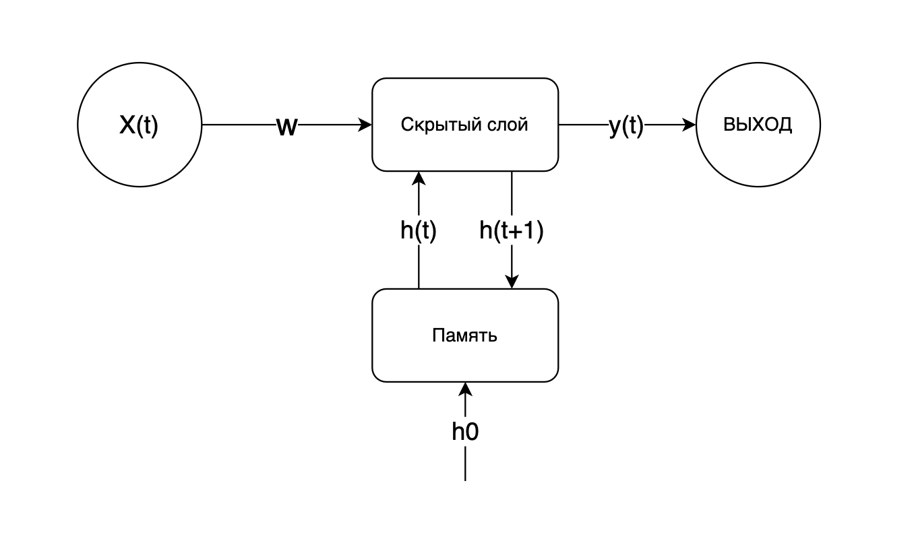
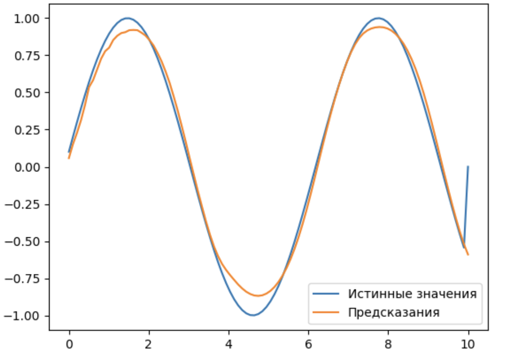
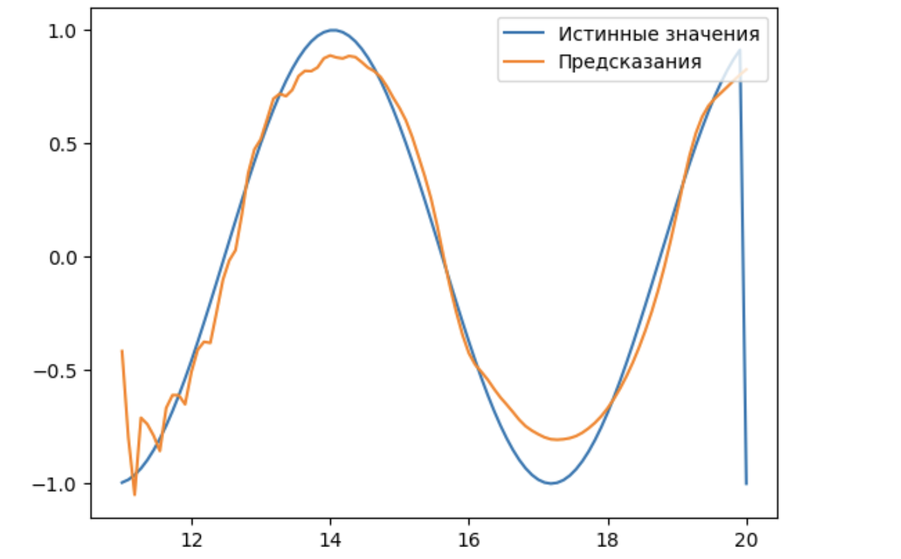
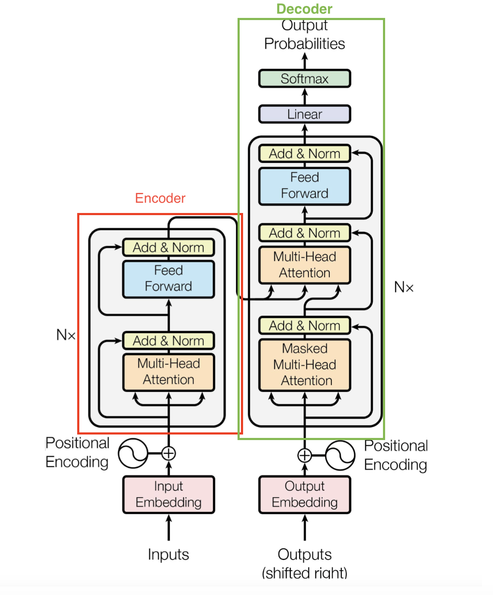

# 1. Рекуррентные нейронные сети в задаче обработки временных рядов и текстовых данных (NLP)

стандартные методы векторизации очень плохо улавливают контекстную информацию слов

## Рекуррентные нейронные сети (RNN)

> класс нейронных сетей, предназначенных для обработки последовательных данных.
> - обладают свойством «памяти», позволяющим учитывать информацию о предыдущих элементах последовательности при обработке текущего элемента.
> - делает их особенно полезными для задач обработки текста, временных рядов, речевого сигнала и других типов данных, где порядок элементов имеет значение.

отлично подходят к задачам классификации сетевых потоков

В каждом временном шаге $t$ RNN обновляет своё скрытое состояние $h_t$ на основе текущего входного вектора $x_t$ и предыдущего скрытого состояния $h_{t-1}$:

$$
h_t = \tanh(W_{hx} x_t + W_{hh} h_{t-1} + b_h)
$$

- $h_t$ — скрытое состояние в момент времени $t$,
- $x_t$ — входной вектор в момент времени $t$,
- $W_{hx}$ — весовая матрица для входного вектора,
- $W_{hh}$ — весовая матрица для скрытого состояния,
- $b_h$ — вектор смещений.

Выход RNN в момент времени $t$ может быть вычислен как:

$$
y_t = \sigma(W_{hy} h_t + b_y)
$$

- $y_t$ — выходной вектор в момент времени $t$,
- $W_{hy}$ — весовая матрица для связи скрытого состояния с выходом,
- $b_y$ — вектор смещений для выхода,
- $\sigma$ — функция активации, например, softmax для задачи классификации.

Схематичное представление рекуррентной нейронной сети вы можете увидеть на рисунке<br>

### RNN в задаче восстановления синусоидного сигнала

Пример применения:
- определение цены волатильного актива
- в ИБ: выявление вредоносной аномальной активности, когда предсказание модели значительно отличается от наблюдаемого результата в системе

Возьмём синусоидальный сигнал длиной *100* временных шагов
- Целевую переменную (ответ *y*) сдвинем на один шаг вперёд
- необходимо определить следующее значение *y* относительно предыдущих наблюдений *x*

Реализуем эту задачу в рамках фреймворка Keras и обучим нашу рекуррентную модель:

```python
import numpy as np
import matplotlib.pyplot as plt
from keras.models import Sequential
from keras.layers import SimpleRNN, Dense

# Генерация синтетических данных
timesteps = 100
input_dim = 1
output_dim = 1

# Пример синусоидального сигнала
t = np.linspace(0, 10, timesteps)
x = np.sin(t)
y = np.roll(x, shift=-1)  # Целевые значения смещены на один шаг

x = x.reshape((1, timesteps, input_dim))
y = y.reshape((1, timesteps, output_dim))

# Создание модели RNN
model = Sequential()
model.add(SimpleRNN(10, input_shape=(timesteps, input_dim), return_sequences=True))
model.add(Dense(output_dim))

model.compile(optimizer='adam', loss='mse')

# Обучение модели
model.fit(x, y, epochs=100, verbose=0)

# Прогнозирование
predicted = model.predict(x)

# Визуализация результатов
plt.plot(t, y.flatten(), label='Истинные значения')
plt.plot(t, predicted.flatten(), label='Предсказания')
plt.legend()
plt.show()
```

Результат предсказания модели RNN в задаче восстановления синусоидального сигнала на обучаемых данных<br>
- обученная модель RNN довольно точно восстанавливает синусоидальный сигнал
- становится особенно заметно по мере увеличения объёма данных, которые модель использует для запоминания

Результат предсказания модели RNN в задаче восстановления синусоидального сигнала на тестовых данных со сдвигом<br>
- модель хорошо подстраивается под сдвиги временного ряда: по мере изучения всё больше и больше данных после сдвига

### Типы RNN

- **Simple RNN**<br>Базовая форма RNN, которая имеет ограничения в способности захватывать долгосрочные зависимости.
- **LSTM (Long Short-Term Memory)**<br>Усовершенствованная версия RNN, способная лучше сохранять долгосрочные зависимости благодаря ячейкам памяти и механизмам контроля потока информации (воротам).
- **GRU (Gated Recurrent Unit)**<br>Упрощённая версия LSTM, которая также эффективно обрабатывает долгосрочные зависимости, но с меньшим количеством параметров.

LSTM и GRU слои зачастую демонстрируют лучшие результаты по сравнению с базовыми слоями RNN (Simple RNN)

## Рекуррентные нейронные сети в задачах ИБ

Эти сети хорошо справляются с задачами, где необходимо учитывать временные зависимости и последовательность событий

### Применение RNN в ИБ:

1. **Анализ логов и обнаружение аномалий
    - **Обработка лог-файлов**<br>Модель может быть обучена на исторических данных для определения нормального поведения системы и обнаружения отклонений. Эти отклонения могут указывать на потенциальные угрозы.
    - **Раннее обнаружение атак**<br>RNN могут анализировать последовательности событий в реальном времени. Так атаки обнаруживаются на ранних стадиях. Например, последовательность попыток входа в систему может сигнализировать о brute-force атаке.
1. **Предсказание инцидентов**
    - **Анализ временных рядов**
        - межпакетные интервалы и длины пакетов в сетевом трафике и т.п.
        - RNN могут анализировать эти данные для предсказания будущих инцидентов или аномалий
        - позволяет проактивно реагировать на потенциальные угрозы и предотвращать инциденты до их эскалации
    - **Прогнозирование сбоев и уязвимостей**
        - для прогнозирования сбоев в системе и выявления уязвимостей на основе анализа исторических данных
        - RNN хорошо подходят для предсказания выхода из строя определённого оборудования на основе показателей, собираемых в реальном времени с данного оборудования
1. **Мониторинг сетевого трафика**
    - **Анализ пакетов**
        - могут анализировать последовательности сетевых пакетов для выявления подозрительного поведения, такого как DDoS-атаки или попытки несанкционированного доступа
        - могут выявлять сложные паттерны, которые трудно обнаружить с помощью традиционных методов
    - **Выявление аномалий в трафике**<br>RNN способны обнаруживать аномалии в сетевом трафике, которые могут указывать на заражение системы вредоносным ПО
1. **Обнаружение фишинга и мошенничества**
    - **Анализ поведения пользователей**
        - могут отслеживать последовательности действий пользователей и системы
        - Выявленные отклонения от нормального поведения могут указывать на фишинговые атаки или мошенничество
    - **Анализ транзакций**
        - В финансовых приложениях RNN анализируют последовательности транзакций для выявления мошенничества
        - Они могут учитывать временные зависимости между транзакциями и выявлять подозрительные паттерны.
1. **Предотвращение утечек данных**
    - **Анализ использования данных**
        - могут анализировать последовательности действий пользователей с конфиденциальными данными
        - выявляют потенциальные угрозы утечки информации
    - **Мониторинг доступа к данным**
        - могут отслеживать доступ к конфиденциальным данным и выявлять аномалии, такие как необычно частый доступ к чувствительной информации

RNN в ИБ
- способны учитывать временные зависимости и моделировать сложные последовательности событий<br>делает их незаменимыми для задач, связанных с
    - обнаружением аномалий
    - предсказанием инцидентов
    - проактивным реагированием на потенциальные угрозы
- позволяют значительно повысить эффективность и точность систем мониторинга и защиты
- обеспечивают более высокий уровень безопасности информационных систем

# 2. Трансформеры и их применение в кибербезопасности

## Основные недостатки RNN

- **Краткосрочная память**
	- Базовые RNN имеют ограниченную способность запоминать информацию на длинных временных интервалах
    - они <ins>менее эффективны для задач, требующих учёта долгосрочных зависимостей</ins>.
- **Низкая параллелизация**
	- RNN обрабатывают данные последовательно, они <ins>плохо поддаются параллелизации</ins>
    - менее эффективны для обучения и инференса по сравнению с моделями, способными к параллельной обработке, например, трансформерами.
- **Медленная скорость обучения**
	- Из-за последовательной природы RNN медленно обучаются, особенно на больших наборах данных.
- **Затухание градиентов**
	- При обучении RNN градиенты могут становиться очень маленькими, что затрудняет обновление весов и обучение сети
    - Это <ins>мешает модели запоминать долгосрочные зависимости</ins>.

## Основы моделей трансформеров

> архитектура нейронных сетей, предназначенная для обработки последовательных данных. К таким данным относятся текст, аудио или временные ряды.

Трансформеры были впервые предложены в статье [Attention is All You Need](https://arxiv.org/pdf/1706.03762) Васвани и др. в 2017 году



- В отличие от RNN, <ins>трансформеры основаны на механизме внимания (attention)</ins>
- позволяет моделям эффективно
    - обрабатывать длинные последовательности
    - учитывать долгосрочные зависимости
    - без проблем, связанных с затуханием градиентов

трансформер состоит из двух главных частей
- `Encoder`
- `Decoder`

### Основные компоненты трансформеров

#### 1. Self-Attention (внимание к себе)

> механизм, который позволяет модели учитывать все элементы входной последовательности при генерации каждого элемента выходной последовательности

- вычисляет важность каждого элемента последовательности относительно других элементов, взвешивая их вклад в результирующий вектор представления
- используются три матрицы (помогают определить, насколько важен каждый элемент входной последовательности относительно текущего элемента):
    - запросы (queries)
    - ключи (keys)
    - значения (values)

#### 2. Многоголовое внимание (Multi-Head Attention)

> позволяет модели вычислять внимание несколько раз параллельно, используя разные представления запросов, ключей и значений

- позволяет модели улавливать различные аспекты зависимости в данных
- Результаты разных голов объединяются и проецируются обратно в исходное пространство, обеспечивая более богатое и разнообразное представление

#### 3. Позиционные энкодинги (Positional Encoding)

> добавляются к входным векторам, чтобы модель могла различать позиции элементов

- для учёта порядка элементов в последовательности
- Эти энкодинги могут быть <ins>синусоидальными</ins> или <ins>обучаемыми векторами</ins>

#### 4. Обратная связь и нормализация

Каждое внимание и полносвязный слой в трансформере сопровождается операцией нормализации и обратной связи
- *Нормализация* стабилизирует обучение
- *обратная связь* (residual connection) помогает передавать информацию через слои

улучшает обучение глубоких моделей

#### 5. Feed-Forward Layers

После каждого слоя self-attention следует объёмный слой, состоящий из двух полносвязных слоёв с нелинейной активацией между ними
- помогают модели улавливать нелинейные зависимости в данных

### Преимущества трансформеров

- **Параллельная обработка**
	- трансформеры обрабатывают элементы последовательности параллельно
    - значительно ускоряет обучение и инференс.
- **Эффективность в работе с длинными зависимостями**
	- Благодаря механизму self-attention
    - эффективно учитывают долгосрочные зависимости в данных
    - особенно полезны для задач, требующих анализа длинных последовательностей.
- **Гибкость и масштабируемость**
	- могут быть легко масштабированы для работы с большими наборами данных и длинными последовательностями
    - подходят для различных задач, от машинного перевода до анализа временных рядов.

## Применение трансформеров в задачах информационной безопасности

рансформеры являются основой многих современных моделей обработки естественного языка (NLP)

1. **Обнаружение вредоносного ПО и фишинговых атак**
    - могут анализировать текстовые описания и заголовки электронной почты для выявления подозрительных сообщений
    - могут идентифицировать вредоносное ПО по анализу кода, описаний и метаданных
1. **Анализ сетевых логов и выявление аномалий**
    - анализируют огромные объёмы сетевых логов и выявляют аномалии, которые могут указывать на возможные атаки
    - способны выявлять сложные паттерны поведения, которые традиционные методы могут пропустить
1. **Управление уязвимостями и анализ угроз**
    - могут анализировать отчёты об уязвимостях и автоматизировать процесс классификации и приоритизации угроз
    - могут использоваться для прогнозирования новых уязвимостей на основе исторических данных и текущих тенденций
1. **Распознавание и предотвращение утечек данных**
    - могут анализировать контент на предмет конфиденциальной информации и предотвращать её несанкционированное распространение
    - могут мониторить внутренние и внешние коммуникации, чтобы предотвратить утечку данных

## Модели трансформеров

большую популярность приобрели две архитектуры моделей, производных от трансформеров: `BERT` и `GPT`

### BERT (Bidirectional Encoder Representations from Transformers)

> модель трансформера, разработанная Google, которая <ins>использует двунаправленные энкодеры для обработки текста</ins>. BERT показал отличные результаты в задачах классификации текста, анализа тональности и извлечения информации.

Применение BERT в информационной безопасности
- **Анализ фишинговых атак**
	- анализировать текстовые содержания сообщений электронной почты и классифицировать их как легитимные или фишинговые с высокой точностью.
- **Обнаружение вредоносного ПО**
	- использоваться для анализа документации и описаний программ, чтобы выявлять потенциально вредоносное ПО.
- **Анализ уязвимостей**
	- анализировать отчёты об уязвимостях и помогать в их классификации и приоритизации.

### GPT (Generative Pre-trained Transformer)

> модель, <ins>основанная на декодерах трансформера, разработанная OpenAI</ins>. Она фокусируется на генерации текста и завершении предложений. GPT может генерировать связные и осмысленные тексты на основе заданного контекста, что делает её полезной для различных задач в информационной безопасности.

Применение GPT в информационной безопасности
- **Создание отчётов и документации**
	- автоматически генерировать отчёты об инцидентах безопасности, что ускоряет процесс документирования и анализа.
- **Анализ сетевых угроз**
	- для создания предсказательных моделей, которые помогают в обнаружении и предотвращении сетевых атак.
- **Обучение и симуляции**
	- создания симуляций фишинговых атак и других угроз. Это используется для обучения сотрудников и тестирования систем безопасности.

## Примеры существующих приложений и систем использующие трансформеры

### Darktrace

> система для кибербезопасности, использующая искусственный интеллект и машинное обучение для <ins>обнаружения и реагирования на угрозы в режиме реального времени</ins>.

- применяет модели трансформеров для анализа сетевых логов и выявления аномалий
- обнаруживать новые и неизвестные угрозы, которые традиционные методы могут пропустить
- Модели помогают в классификации событий и выявлении подозрительных активностей в сети

### Vectra AI

> предлагает платформу для <ins>обнаружения и реагирования на угрозы</ins> (NDR, Network Detection and Response), которая использует искусственный интеллект для мониторинга сетевой активности и выявления атак.

- применяет трансформеры для анализа огромных объёмов сетевого трафика
- позволяет выявлять сложные и многоступенчатые атаки
- помогают в автоматизации процесса обнаружения угроз и снижении числа ложных срабатываний

### Microsoft 365 Defender

> комплексное решение для <ins>защиты конечных точек</ins>, которое объединяет несколько инструментов безопасности.

- используются модели архитектуры BERT для анализа электронной почты и выявления фишинговых атак
- помогают в анализе логов и выявлении подозрительных активностей, связанных с учётными записями пользователей

### Cisco SecureX

> облачная платформа, которая объединяет различные продукты Cisco для управления безопасностью.

- применяет трансформеры для анализа телеметрии и логов с различных устройств и приложений
- обнаруживать корреляции и паттерны, указывающие на потенциальные угрозы
- автоматизировать реагирование на инциденты

# 3. Применение техник усиления данных в задачах ИБ

- есть недостаток данных для обучения моделей -> требуется увеличение датасетов различными способами
- ключевой задачей становится поиск подходящих методов обработки данных

> **аугментация данных**<br>процесс искусственного увеличения объёма данных с помощью различных трансформаций

В задачах ИБ
- помогает улучшить производительность моделей машинного обучения
- специалисты могут создавать модели, которые
    - более эффективно выявляют угрозы
    - обнаруживают аномалии
    - обеспечивают надёжную защиту от кибератак

## Генерация синтетических данных с использованием GAN

### Как это работает

- *Генератор* создаёт синтетические образцы данных, стремясь сделать их как можно более похожими на реальные
- *дискриминатор* пытается отличить реальные данные от поддельных
- Процесс повторяется, пока генератор не начнёт создавать данные, которые дискриминатор уже не сможет отличить от реальных

### Применение в информационной безопасности

- могут генерировать синтетические данные для редких, но значимых событий
    - DDoS-атаки
    - попытки взлома системы
- когда есть только несколько образцов определённой атаки
    - можно использовать для создания множества дополнительных вариантов этой атаки

### Преимущества

- позволяет моделировать более широкий спектр атак, расширяя возможности системы безопасности
- важно, когда атаки редкие или новые, и реальных данных для их изучения недостаточно
- Модель становится более гибкой и способной обнаруживать новые типы угроз

## Аугментация изображений для биометрической аутентификации

- В задачах биометрической безопасности
    - распознавание лиц
    - отпечатков пальцев
    - радужной оболочки глаза
- модели машинного обучения должны работать устойчиво при изменении условий
    - помогает моделям эффективнее справляться с этими изменениями

### Как это работает

- заключается в применении трансформаций, таких как
    - вращение
	- масштабирование
	- сдвиг
	- зеркальное отражение
	- изменение яркости
	- контраста
    - добавление шума
- помогают создать большее количество вариаций для одного и того же биометрического изображения
- увеличивает количество экземпляров в датасете на несколько порядков

### Применение

- важно, чтобы модель могла правильно идентифицировать лицо пользователя при разных условиях
- аугментации изображений модель обучается различать лица, несмотря на изменения в изображениях
- можно использовать изображения с добавлением случайного шума
    - система лучше различала подлинные биометрические данные от подделок

### Преимущества

- делает модель более устойчивой к вариациям биометрических данных
- усложняет попытки подделки и повышает надёжность аутентификации
- снижает риски ложных срабатываний

## SMOTE для дисбалансированных данных

> **SMOTE (Synthetic Minority Over-sampling Technique)** — алгоритм, который генерирует синтетические образцы для меньшего класса, например, класса атак

- Дисбаланс классов — частая проблема в задачах классификации данных безопасности
    - когда нормальная активность значительно преобладает над аномальной или атакующей
- модели могут плохо распознавать атаки, так как они значительно реже встречаются в обучающих данных

### Как это работает

- выбирает случайные экземпляры из меньшего класса и создаёт новые точки
    - добавляя данные между ними
- помогает выровнять соотношение классов и облегчить модели процесс обучения

### Применение в информационной безопасности

- в задаче обнаружения атак
    - создать синтетические данные для редких типов атак
    - улучшить способность модели распознавать такие угрозы
- особенно полезен для систем обнаружения вторжений

### Преимущества

- помогает сбалансировать набор данных
    - больше примеров для редких событий
- снижает вероятность ложноположительных и ложноотрицательных срабатываний
- делая модель более надёжной и эффективной в обнаружении малозаметных угроз

# 4. Применение методов глубокого обучения к анализу аудио- и видеоданных

Самой актуальной проблемой - <ins>выявление синтетического голоса</ins>

## Изучение методов анализа и обработки аудио- и видеоданных с использованием глубоких нейронных сетей

опирается на современные глубокие нейронные сети
- свёрточные нейронные сети
- рекуррентные нейронные сети

Для обработки видео активно используются трёхмерные [CNN (3D-CNN)](https://www.geeksforgeeks.org/video-classification-with-a-3d-convolutional-neural-network/)
- способные учитывать временную информацию для создания более полного понимания событий на видео

### Анализ аудио

- выделяют различные спектральные характеристики
    - передаются в CNN
- выявления подозрительных звуков
    - звуки взлома
    - посторонние голоса
    - естандартные шумы

### Обработка видеоданных

- 3D-CNN позволяют моделям улавливать временные изменения
- помогает в обнаружении необычных действий
    - попытки несанкционированного доступа
    - кражи или разрушения

## Применение алгоритмов глубокого обучения для выявления угроз и аномалий в аудио- и видеоисточниках

### Выявление подозрительных звуков в аудиозаписях

- Аудиоданные могут содержать индикаторы угрозы, такие как звуки вторжения
- можно использовать RNN, чтобы выделять последовательности, которые соответствуют шаблонам тревожных звуков
- Звуки распознаются в реальном времени
    - Подозрительные шумы классифицируются, например, как кража или другие незаконные действия

### Анализ поведенческих паттернов для выявления аномалий

- аномальных действий в потоковом видео
- анализируют поведение людей и выявляют отклонения от нормальных сценариев, что может сигнализировать о возможной угрозе или опасной ситуации
- Модели глубокого обучения `RNN` и `LSTM`
    - обучаются на больших наборах данных, представляющих обычные действия и поведения
    - Когда модель встречает нестандартные действия - может быть зарегистрировано как аномалия

### Распознавание вербальных угроз в аудиопотоке

- Для выявления слов или фраз, которые могут указывать на потенциальные угрозы
- используются `NLP` вместе с `CNN`
- Обработка включает преобразование аудио в текст и анализ содержания


