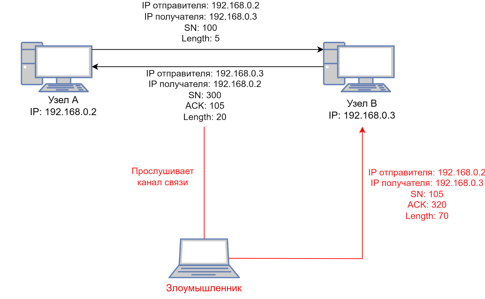

# 1. Сниффинг: перехват и анализ сетевого трафика

Анализ трафика используется для:
- выявления проблем в сети
- отладки приложений
- мониторинга производительности
- обеспечения безопасности
- тестирования на проникновение
- тестирование на взлом
- мониторинга сетевой активности

При анализе трафика можно собрать такую информацию, как:
- пароли для доступа к разным ресурсам;
- токены для авторизации в различных сервисах;
- куки, сохраняемые на компьютере пользователя веб-сайтом.

## Определения

> **Сниффинг (от англ. sniff — нюхать)**
>
> процесс перехвата и записи сетевого трафика между двумя узлами в компьютерной сети.

> **Снифферы**
>
> программы или устройства, используемые для анализа сетевого трафика. Могут быть как легитимными инструментами для анализа и диагностики сетей, так и средствами злоумышленников для несанкционированного доступа к чувствительной информации.

## Типы сниффинга

### Активный сниффинг

> злоумышленник напрямую взаимодействует с целевой машиной, отправляя пакеты и получая ответы.

Важно отметить, что это прослушивание осуществляется через коммутатор, и злоумышленник пытается произвести атаку через коммутатор, отправляя поддельный MAC-адрес.

### Пассивный сниффинг

> прослушивание трафика без какого-либо взаимодействия с жертвой атаки.

Обычно такие атаки происходят через коммутатор, злоумышленник подключается к этому узлу сегмента сети. Однако для такого анализа трафика необходимо быть авторизованным в этой локальной сети.

# 2. Спуфинг: маскировка и фальсификация

> **Спуфинг (англ. spoofing — подмена)**
>
> это атаки, использующие механизм подмены источника, получателя или арбитра. А также любые ситуации, когда злоумышленник может подменять сущности, условия, значения и прочее.

- похож на один из способов социальной инженерии: злоумышленник представляется жертве атаки тем, кем не является

## Основные виды спуфинга:

Основные виды спуфинга:

1. IP Spoofing 
1. ARP Spoofing 
1. Email Spoofing 
1. Website Spoofing Attack 
1. DNS Spoofing 

### 1. IP Spoofing

> создание сетевых пакетов с поддельным исходным IP-адресом с целью скрыть истинное местоположение отправителя и обмануть сетевые устройства.

#### Типы

##### Атаки MITM

1. связь между первоначальным отправителем сообщения и предполагаемым получателем перехватывается, как следует из термина
1. содержимое сообщения изменяется без ведома какой-либо из сторон
1. Злоумышленник вставляет в пакет свое собственное сообщение.

##### Атаки типа DoS

1. пакеты сообщений отправителя и получателя перехватываются
1. подделывается адрес источника -> Соединение перехвачено.

Таким образом, получатель оказывается завален пакетами, превышающими его пропускную способность или ресурсы. Это перегружает систему жертвы, фактически отключая ее.

#### Процесс атаки

при подмене IP злоумышленник отправляет компьютерной системе сообщение с IP-адресом, указывающим, что сообщение поступает с другого IP-адреса

Если целью является получение несанкционированного доступа, то поддельным IP-адресом будет система, которую цель считает надежным хостом.

Хакеры могут использовать различные методы, чтобы найти IP-адрес надежного хоста. После того как они получили доверенный IP-адрес, они могут изменить заголовки пакетов своей передачи, чтобы казалось, что пакет поступает от хоста.

#### Защита

1. Мониторинг сетей на предмет нетипичной активности.
1. Развертывание фильтрации пакетов для обнаружения несоответствий. Например, исходящих пакетов с IP-адресами источника, не совпадающими с IP-адресами, принадлежащими сети организации.
1. Проверка подлинности всех IP-адресов и использование инструмента блокировки сетевых атак.


### 2. ARP spoofing

> отправка ложных ARP-пакетов в сеть с целью связать свой собственный MAC-адрес с IP-адресом легитимного устройства в сети.

Идея этой атаки заключается в заполнении DNS-кеша поддельными данными, в которых содержится вредоносный сайт злоумышленника.

### 3. Email Spoofing 

> электронное письмо, в котором злоумышленник может подделать адрес отправителя, чтобы сделать сообщение более убедительным или обмануть получателя относительно истинного отправителя.

### 4. Website Spoofing Attack 

> создание фальшивого веб-сайта, который похож на оригинал.

### 5. DNS Spoofing 

> в атаках на системы DNS (Domain Name System) злоумышленники могут использовать поддельные DNS-ответы, чтобы перенаправить пользователя на фальшивые веб-ресурсы.

#### Атака

1. Злоумышленник настраивает поддельный DNS-сервер или компрометирует существующий DNS-сервер, если такой есть.
1. Затем он определяет целевой домен, DNS-записи которого хочет изменить.
1. Когда жертва пытается получить доступ к веб-сайту, связанному с целевым доменом, его компьютер отправляет DNS-запрос на DNS-сервер для преобразования доменного имени в IP-адрес.
1. Злоумышленник перехватывает DNS-запрос и отвечает ложным IP-адресом, соответствующим его поддельному серверу, вместо легитимного IP-адреса.
1. Компьютер жертвы получает ложный IP-адрес и подключается к серверу злоумышленника вместо намеченного сервера.
1. Сервер злоумышленника может выполнять различные вредоносные действия, такие как
    - перехват чувствительной информации
    - внедрение вредоносного контента
    - перенаправление пользователя на фальшивые веб-сайты.


#### Защита

1. **Использование DNSSEC (Domain Name System Security Extensions)**<br>Добавляет дополнительный уровень безопасности путем цифровой подписи записей DNS, обеспечивая их целостность и подлинность.
1. **Внедрение защиты от отравления кеша DNS (англ. DNS cache poisoning)**<br>Настройка DNS-сервера таким образом, чтобы он отвергал ответы, которые не соответствуют ожидаемому идентификатору запроса или происходят из неавторизованных источников.
1. **Использование сервисов фильтрации DNS**<br>Они могут блокировать доступ к известным вредоносным доменам и предоставлять дополнительный уровень защиты от DNS-спуфинга.
1. **Обеспечение настройки DNS-сервера для ответа только информацией, относящейся к запрошенному домену**
1. **Принудительное использование сети IP для всего трафика**
1. **Отключение функции рекурсивных запросов DNS**

# 3. Вспомогательные инструменты для анализа и создания трафика

## Wireshark

- сайт: [https://www.wireshark.org/](https://www.wireshark.org/)
- офф доки: [https://www.wireshark.org/docs/](https://www.wireshark.org/docs/)

### Цветовая маркировка (default) трафика

 

## Протокол HTTP

Он определяет множество методов запроса, которые указывают, какое желаемое действие выполнится для данного ресурса.

часто встречающиеся:

- **GET** — используется только для извлечения данных;
- **POST** — используется для отправки данных на сервер, что приводит к какому-то изменению состояния;
- **PUT** — используется для создания новых ресурсов на сервере;
- **DELETE** — позволяет удалить ресурсы с сервера.

## Tcpdump

большая часть сетевого оборудования не предусматривает наличие графического интерфейса, а также обладает низкими вычислительными ресурсами. Для такого оборудования подойдет инструмент tcpdump.

- man [https://www.tcpdump.org/manpages/tcpdump.1.html](https://www.tcpdump.org/manpages/tcpdump.1.html)
- turotial with examples [https://danielmiessler.com/p/tcpdump/](https://danielmiessler.com/p/tcpdump/)
- tcpdump for Dummies [http://www.alexonlinux.com/tcpdump-for-dummies](http://www.alexonlinux.com/tcpdump-for-dummies)

### Cheat Sheet

[https://packetlife.net/media/library/12/tcpdump.pdf](https://packetlife.net/media/library/12/tcpdump.pdf)


 

### Основные команды

| Команды   | Описание    |
|--------------- | --------------- |
| tcpdump   | захват всех пакетов (запуск команды без параметров)   |
| tcpdump -D   | просмотр доступных сетевых интерфейсов   |
| tcpdump -c 10 | захват определенного количества пакетов, например, 10; |
| port, src, dst, host, udp, tcp, icmp | различные фильтры, например, tcpdump port 80; |
| tcpdump port 80 and host 192.168.10.2 | перехват пакетов с хоста 192.168.10.2 с 80 порта, как вы видите, фильтры можно комбинировать с помощью логических операторов (and, or, not); |
| tcpdump -i <сетевой интерфейс> not icmp | все пакеты, кроме ICMP; |
| tcpdump -c 100 -w traffic.pcap | сохранение перехваченных пакетов в файл. |

## Scapy

Библиотека Python

содержит множество инструментов, начиная от захвата трафика и анализа пакетов, заканчивая возможностью создания собственных обработчиков и отправкой сконфигурированных определенном образом пакетов.

- сайт: [https://scapy.net/](https://scapy.net/)
- docs: [https://scapy.readthedocs.io/en/latest/](https://scapy.readthedocs.io/en/latest/)
- гайды:
    - [https://www.freecodecamp.org/news/how-to-use-scapy-python-networking/](https://www.freecodecamp.org/news/how-to-use-scapy-python-networking/)
    - [https://habr.com/ru/articles/249563/](https://habr.com/ru/articles/249563/)
    - [https://xakep.ru/2015/03/01/scapy/](https://xakep.ru/2015/03/01/scapy/)

### Полезные комманды

| Команды   | Описание    |
|--------------- | --------------- |
| `> ls()`  | Посмотреть полный список поддерживаемых протоколов |
| `> ls(proto_name)` | Подробное описание протокола proto_name<br>Например: `> ls(ARP)` |

#### sniff()

```python
sniff(
    iface=<сетевой интерфейс>
    count=<число пакетов>
    filter=<строка, как в tcpdump>
    prn=<функция, применяемая к каждому пакет>
    offline=<имя файла для сохранения дампа трафика>
)
```

Каждый из параметров является опциональным.

## Доп ссылки

- различные дампы трафика: [https://wiki.wireshark.org/SampleCaptures](https://wiki.wireshark.org/SampleCaptures)

# 4. Протокол ARP

> **Address Resolution Protocol** протокол определения адреса, играет важную роль в процессах адресации в стеке TCP/IP

ARP дает узлам возможность определять MAC-адреса устройств по их IP-адресам, позволяя продвигать кадры на канальном уровне.

Протокол ARP ввиду особенностей реализации является уязвимым к спуфинг-атакам, в ходе которых могут быть подменены ARP-ответы.

## Пример работы протокола


1. Выполняется отправка широковещательного ARP-запроса по сети.<br>Запрос содержит IP- и MAC-адреса источника, а также IP-адрес назначения.
1. Для каждого интерфейса в сети выполняется сравнение IP-адреса этого интерфейса и полученного в ARP-запросе IP-адреса назначения.
1. На интерфейсе, где было обнаружено совпадение IP-адресов, формируется ARP-ответ, в котором указывается его MAC-адрес.
1. Исходный узел, который отправлял ARP-запрос, вносит в собственную ARP-таблицу выявленное соответствие IP- и MAC-адресов.

В дальнейшем, если потребуется направить пакет по тому же IP-адресу, сначала будет выполнена проверка наличия записи с таким адресом в ARP-таблице интерфейса.

> при отсутствии в сети узла с IP-адресом получателя, указанном в ARP-запросе, формирование ARP-ответа не выполняется, а пакеты, передаваемые по этому адресу, уничтожаются

## ARP таблицы

Расширение ARP-таблиц может выполняться и за счет извлечения данных из широковещательных ARP-запросов.

Непосредственно сами записи в ARP-таблицах могут быть двух видов:

- статические, хранящиеся бессрочно;
- динамические, требующие периодического обновления, как правило, раз в несколько минут.

## RARP

**Reverse Address Resolution Protocol**, реализующий обратное отображение адресов, то есть преобразующий MAC-адрес в IP-адрес. RARP применяется во время загрузки узла, когда он посылает групповое сообщение-запрос со своим MAC-адресом.

# 5. Атаки на протокол сетевого уровня ARP

> **ARP-кэш**
>
> это коллекция записей протокола ARP (в основном динамических), которые создаются, когда IP-адрес преобразуется в MAC-адрес (чтобы компьютер мог эффективно взаимодействовать с IP-адресом). Устройства используют ARP-кэш, чтобы избежать избыточных запросов на разрешение адреса.

этот кэш может быть изменен внутри при помощи поддельных MAC-адресов, связанных с IP-адресами других конечных или промежуточных точек. Это приводит к **атаке MITM**, при которой данные могут быть перехвачены, изменены, удалены или остановлены.

> **ARP Spoofing**
>
> это тип вредоносной атаки, при которой злоумышленник отправляет поддельное ARP-сообщение по локальной сети, чтобы связать MAC-адрес злоумышленника с IP-адресом другого устройства в локальной сети для атаки. Данная атака основана на недостатке протокола ARP. Этот протокол не проверяет подлинность ARP-запросов и ARP-ответов, что позволяет «встать посередине» в атакуемой сети.

> **ARP Cache Poisoning**
>
> эта атака нацелена на повреждение ARP-таблиц на машинах жертв.

## DoS (Denial of Service)

При DoS-атаке злоумышленник производит отказ в сетевом обслуживании для группы жертв. Например, атакующий отправляет ответ ARP, с помощью которого он ложно назначает одному MAC-адресу несколько IP-адресов. Тем самым он выводит из строя устройство, например, конечный узел или коммутатор. Такая атака имеет другое название в рамках ARP — **ARP-flood**.

## MITM

> атака «человек посередине», при этом злоумышленник тайно ретранслирует и при необходимости изменяет связь между двумя сторонами, которые считают, что они общаются непосредственно друг с другом.

Недостатком протокола является отсутствие аутентификации. Не проверяется, получен ли ответ из действительного источника или нет. Этой уязвимостью и пользуются злоумышленники для воспроизведения ARP Cache Poisoning.

### Атака


1. Представим, что Узел А хочет связаться с Узлом В, но у него нет MAC-адреса Узла В. Таким образом, Узел А отправит широковещательный ARP-запрос.
1. Таким образом, вместе с Узлом В злоумышленник получит и это сообщение, поскольку он также присутствует в локальной сети. Злоумышленник отправляет Узлу А поддельный ARP-ответ с IP-адресом Узла В и его MAC-адресом.
1. Узел А обновляет свою таблицу ARP, где он сопоставляет IP-адрес Узла В с MAC-адресом злоумышленника (поскольку аутентификация отсутствует). И Узел А отправляет все пакеты злоумышленнику вместо Узла В.
1. Тот же процесс повторяется с Узлом В, где он сопоставляет IP-адрес Узла А с MAC-адресом злоумышленника.

Злоумышленник становится связующим звеном между двумя жертвами и может получать все пакеты от Узлов A и В. Так выполняется атака «человек посередине» с использованием ARP-спуфинга.

## Защита

### 1. Статические ARP-таблицы

Статическое присвоение MAC-адресов соответствующим IP-адресам в сети может быть эффективным способом предотвращения атаки ARP-отравления.

Этот подход требует значительных усилий. Любое изменение в сети потребует ручного обновления ARP-таблиц на всех устройствах, что делает использование статических ARP-таблиц нецелесообразным для большинства крупных организаций.

Однако в случаях, когда безопасность является первоочередным требованием, можно выделить отдельный сегмент сети для использования статических ARP-таблиц, чтобы защитить критически важную информацию.

### 2. Защита коммутатора

Бо́льшая часть коммутаторов L2+ оснащена защитой от атак на протокол ARP. Функция DAI (Dynamic ARP Inspection) умеет оценивать достоверность каждого ARP-сообщения и отфильтровывать пакеты, которые выглядят нелегитимными или содержат потенциально вредоносную информацию.

Кроме того, DAI позволяет ограничить скорость прохождения ARP-сообщений через коммутатор, что эффективно предотвращает атаки типа DoS.

### 3. Разграничение VLAN

Позволяет минимизировать число подверженных атаке устройств, так как для успешного проведения ARP-спуфинга злоумышленнику требуется находиться с устройствами в одной локальной сети.

# 6. Протокол TCP

> **Протокол управления передачей TCP**
>
> это транспортный протокол передачи данных между прикладным процессами. TCP использует логическое соединение, благодаря чему обеспечивается гарантированная доставка сообщений по адресу назначения.

- выполняет буферизацию входящего потока данных, поступающих от прикладных процессов
- После этого осуществляется их разделение на некие сегменты, снабжаемые заголовком

<br>

- Сегмент не является логически самостоятельной единицей данных
    - TCP не учитывает внутреннее содержимое данных при разделении входящего потока на сегменты
- Сегменты могут доставляться непоследовательно
    - при их отправке указывается номер последовательности, или порядковый номер, в поле Sequence Number (SN)

## Флаги TCP

Всего фалгов **9**

Более подробно в:
- [RFC 793: TRANSMISSION CONTROL PROTOCOL](https://datatracker.ietf.org/doc/html/rfc793)
- [RFC 3540: Robust Explicit Congestion Notification (ECN). Signaling with Nonces](https://datatracker.ietf.org/doc/html/rfc3540)
- [ RFC 3168: The Addition of Explicit Congestion Notification (ECN) to IP ](https://datatracker.ietf.org/doc/html/rfc3168)

1. **SYN**<br>этот флаг инициирует соединение, а также выполняет синхронизацию счетчиков переданных данных.
1. **ACK**<br>служит для подтверждения принятия сегмента.
1. **RST**<br>предназначен для принудительного разрыва соединения.
1. **FIN**<br>сигнализирует, что все пакеты были переданы и соединение следует закрыть.
1. **PSH**<br>позволяет выполнять немедленную отправку пакета, не дожидаясь заполнения буфера с полученными в ходе предыдущих передач пакетами.

## Установление TCP-соединения и обмен сегментами информационного потока

 

1. Клиент выполняет отправку на сервер сегмента, в котором указывается номер последовательности, а также взводится флаг `SYN`.<br>При получении этого сегмента на стороне сервера фиксируется его порядковый номер.
    - Далее выполняется создание сокета для обслуживания нового клиента.<br>При этом, если сокет был создан успешно, сервер выполняет передачу клиенту сегмента с указанным порядковым номером и взведенными флагами `SYN`, `ACK`.<br>После чего переходит в состояние SYN-RECEIVED.
    - В противном случае сервер передает клиенту сегмент с установленным флагом `RST` для разрыва соединения.
2. В том случае, если клиент получил сегмент с установленным флагом SYN, на его стороне фиксируется порядковый номер сегмента.<br>После чего отправляется сегмент с установленным флагом ACK.
    - В случае, если вместе с `SYN` в полученном от сервера сегменте был также взведен флаг `ACK`, соединение переходит в состояние `ESTABLISHED`.<br>При получении клиентом сегмента с установленным флагом `RST` попытки установить соединение с сервером прекращаются.
    - При отсутствии ответа от сервера в течение 10 секунд выполняется повтор установления соединения.
3. При получении сервером сегмента с установленным флагом `ACK` в состоянии `SYN-RECEIVED` выполняется его переход в состояние `ESTABLISHED`.
    - Иначе он дожидается истечения тайм-аута, выполняет закрытие сокета и переходит в состояние `CLOSED`.

## Режим скользящего окна

1. Узел А и Б договариваются о количестве передаваемых пакетов и времени ожидания.

Например, количество пакетов установлено в размере десяти, а время ожидания составляет 900 мс. Пакеты доходят узлу Б в стохастической (случайном) порядке, он начинает выстраивать их по порядку. Допустим, пришли все пакеты, кроме шестого. Узел Б после истечения времени ожидания отбрасывает все пакеты, начиная с седьмого, и просит продублировать пакеты, начиная с шестого.

## Выводы

- автоматически разделяет входящий поток данных на сегменты без учета его содержимого, для определения порядка обработки сегмента устанавливает порядковые номера;
- обеспечивает гарантированную доставку передаваемых сегментов благодаря использованию принципа установки соединений;
- реализует функцию контроля потока данных.

# 7. Атаки на протокол транспортного уровня TCP

Будут рассмотрены атаки <ins>транспортного уровня</ins>

## TCP SYN flooding

Эта атака использует недостаток при установлении TCP-соединения, поскольку серверу необходимо хранить данные о полуоткрытых соединениях.

> **Полуоткрытое соединение** — соединение, при котором сервер находится в состоянии SYN-RECEIVED.

- является атакой типа «отказ в обслуживании»

### Атака


1. Злоумышленник отправляет много `SYN`-сегментов жертве, тем самым начиная процесс установления соединения
2. на что жертва отвечает сегментами с флагом `SYN-ACK`.
3. Злоумышленник не отправляет заключительный сегмент `ACK`, что заставляет жертву запоминать все полуоткрытые соединения.

Это вызывает отказ в обслуживании.

### Защита

#### 1. Увеличение очереди полуоткрытых соединений

При данном способе резервируются дополнительные ресурсы памяти системы для обработки новых запросов. Это сказывается на производительности, но в любом случае лучше, чем полный отказ системы.

#### 2. Перезапись старых полуоткрытых соединений

Этот способ не будет работать при увеличении объема атак, а также при слишком малом размере очереди.

#### 3. SYN cookies

Эта стратегия предполагает создание сервером файла cookie. Чтобы избежать риска обрыва соединения при заполнении очереди, сервер отвечает на каждый запрос соединения пакетом SYN-ACK.

Но затем исключает SYN-запрос, удаляя его из памяти и оставляя порт открытым и готовым к новому соединению. Если с клиентской машины на сервер отправляется финальный пакет ACK, сервер восстанавливает запись в очереди SYN.

Несмотря на то, что при таком способе защиты теряется часть информации о TCP-соединении, это лучше, чем допустить отказ в обслуживании легитимных пользователей в результате атаки.

## TCP RST Attack

- основана на принудительном разрыве соединения
- Атакующий формирует один сегмент данных с флагом RST и отправляет его жертве, что позволяет прекратить TCP-сессию
- Так как нужно сформировать сегмент данных определенным образом, то данные атаки возможны для долгосрочных соединений

### Атака

4 этапа:
1. Узел A отправляет сегмент с флагом `FIN`.
1. Узел B получает сегмент от узла A и в ответ отправляет сегмент `ACK` (на этом моменте соединение закрыто для узла A).
1. Если узел B хочет также закрыть соединение, то отправляет сегмент `FIN`.
1. Узел A получает сегмент от узла B и отправляет сегмент `ACK`.


- В отличие от корректного завершения соединения при принудительном отправляется только один сегмент RST, который моментально заканчивает соединение.
- При создании ложного сегмента необходимо дать ему правильный порядковый номер. TCP работает таким образом, что порядковый номер RST-сегмента должен быть равен следующему ожидаемому порядковому номеру.

#### Условия осуществления атаки

Злоумышленик должен:
1. «Просниффить» трафик между двумя узлами.
1. Проанализировать сниффуемый трафик для вычисления порядкового номера сегмента TCP.
1. Сформировать сегмент RST (для повышения шанса успешной атаки можно несколько).
1. Отправить сформированный сегмент жертве.

### Защита

#### 1. Проверять источник сегмента RST

Использовать правила межсетевых экранов, пакетных фильтров или систем обнаружения вторжений (IDS).

#### 2. Использовать шифрование трафика

С помощью таких протоколов, как TLS/SSL и других.

#### 3. Обновлять устройства и приложения

Например, в некоторых версиях Windows есть функция под названием TCP Window Scaling, которая может использоваться злоумышленниками для отправки RST-сегментов с маленьким номером последовательности и разрыва соединения.

#### 4. Мониторить сетевую активность

Это позволяет, например, обнаружить большое количество сегментов RST, необычные адреса источника/назначения или неожиданное завершение соединения.

## TCP Session Hijacking

основана на режиме работы скользящего окна

- Есть два узла, между которыми уже установлено TCP-соединение, например, Telnet-сессия.
- Злоумышленник, прослушивая трафик, может (как и в предыдущей атаке) смотреть за порядковыми номерами отправляемых сегментов.
- Зная нужный порядковый номер, можно сформировать сегмент, который вклинится в текущую сессию и выполнит необходимую для злоумышленника команду.

Такая атака может привести к **Reverse Shell** на узле жертвы, что открывает большой спектр возможностей для атакующего:

> **Reverse Shell** использует уязвимости целевой системы для инициирования сеанса shell и последующего доступа к компьютеру жертвы

Цель состоит в том, чтобы подключиться к удаленному компьютеру и перенаправить входные и выходные соединения оболочки целевой системы, чтобы злоумышленник мог получить удаленный доступ к ней.

### Атака



В отличие от TCP RST атаки здесь не нужно знать точный номер последовательности, поскольку можно отправить сегмент, номер последовательности которого находится в пределах размера скользящего окна. Таким образом, жертва не отбросит вредоносный сегмент, если придут все сегменты до сформированного.

### Защита

Способы предотвращения такого вида атак схожи с ранее упомянутой атакой [TCP RST Attack](#tcp-rst-attack).


