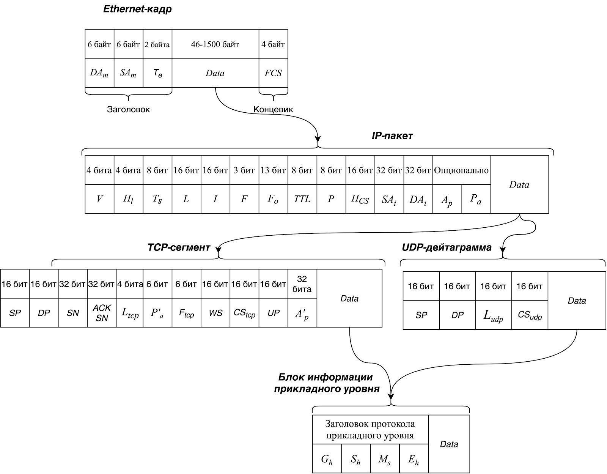
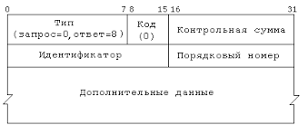

# 1. Адресация в стеке протоколов TCP/IP

Формализация информационных потоков и трафика в целом может быть построена с использованием RFC 791, RFC 2474, RFC 3168, RFC 793 / STD 7, RFC 768 / STD 6 и ряда других руководящих документов, спецификаций и стандартов.

 

## Типы TCP/IP адресов

### 1.Локальные или физические адреса

В рамках вычилительных сетей на основе Ethernet - это **MAC** адрес

- являются уникальными
- не имеют иерархической структуры

> **задача** — участвовать в процессе коммутации среды передачи данных

- по трём старшим байтам MAC-адреса можно определить производителя оборудования
    - Каждый вендор получает в координирующем комитете IEEE Registration Authority диапазон из 16 777 216 (224) адресов
    - Вендор вправе запрашивать новый по мере исчерпания текущего
- в некоторых случаях возможно определение по MAC-адресу модельного ряда и конкретной модели электронно-вычислительного устройства

### 2. Сетевые адреса, или IP-адреса

Задача объединения сетей и обеспечения межсетевой коммуникации в стеке TCP/IP подразумевает наличие собственной глобальной независимой системы адресации

Для этого используется **IP-адрес** — пара, состоящая из номера сети и номера узла.

В заголовке IP-пакета предусмотрено два поля фиксированной длины для записи адресов отправителя и получателя
- в 4 байта в версии протокола IPv4
- 16 байт в версии протокола IPv6

#### Определение частей IP-адреса к номеру узла и номеру сети

##### Первый подход: разбиение

использование фиксированной границы, когда адрес делится на две части определенной длины. Такой подход не обладает нужной гибкостью и <ins>на сегодняшний день не используется</ins>.

##### Второй подход: маска сети

Широко применяется

Основан на использовании маски, которая по своей границе между последовательностями единиц и нулей определяет границу между номером сети и номером узла.

Чтобы, зная IP-адрес и маску сети, получить адрес сети, нужно перевести их в двоичную систему счисления и далее применить к ним операцию поразрядной конъюнкции (логическое И)

##### Третий подход: классы адресов

- <ins>устаревший подход</ins>, на смену которому пришла технология бесклассовой междоменной маршрутизации (CIDR)
- подразумевает деление IP-адреса на номера сети и узла на основе маски переменной длины, назначаемой поставщиком услуг
- Главным органом регистрации и одновременно регулятором в этой области является международная некоммерческая организация по управлению доменными именами и IP-адресами: ICANN

### 3. Доменные имена (DNS)

> представляют собой символьные имена узлов, призванные повысить удобство работы пользователей в корпоративной вычислительной сети.

- Чтобы установить соответствия доменных имен IP-адресам применяется распределенная система доменных имен DNS
    - имеет иерархическую структуру
    - допускает наличие произвольного количества составных частей в доменном имени
- Существует прямая и обратная зона просмотра имен, а также различные типы записей.
- Работа DNS основана на взаимодействии DNS-клиентов и DNS-серверов.

Цикл разрешения адресов:

1. клиент в браузере вводит запоминающиеся для человека DNS-имя, но для отправки по сети данных требуется узнать IP-адрес адресата. Клиентская машина может посмотреть записи в кеше браузера или файле hosts;
1. если на предшествующем шаге информация не была найдена, то DNS-клиент направляет запрос первичному DNS-серверу, а если он недоступен — к альтернативному (вторичному);
1. в случае если локальному серверу известно запрашиваемое отображение символьного имени в IP-адрес, он моментально сообщает его в ответе клиенту;
1. в случае, если у локального сервера нет информации об искомом отображении, отправляются запросы к вышестоящим DNS-серверам до тех пор, пока не будет обнаружен DNS-сервер, хранящий информацию о соответствии требуемых адресов. Далее локальный сервер передает полученный ответ клиенту.

### 4. NetBIOS-имена

> Протокол для работы в локальных сетях на персональных электронно-вычислительных машинах NetBIOS (англ. Network Basic Input/Output System) разработан в виде интерфейса сеансового уровня, который не зависит от вендора и использует TCP и UDP в качестве транспортных протоколов


- Имена имеют ограничение в 15 символов
- Определением IP-адреса по имени занимается сервер WINS

# 2. Протокол ICMP

> предназначен для отправки диагностических сообщений о неполадках, возникших в процессе передачи пакета. Сообщений выполняется их инкапсуляция в поле данных IP-пакета.

Заполнение и интерпретация заголовка и поля данных ICMP-сообщения зависит от его типа и кода.

## Заголовок ICMP

содержит в себе следующие поля:
- тип — служит для идентификации типа ICMP-сообщения, задается в числовом формате;
- код — используется для идентификации конкретных ошибок, описываемых ICMP-сообщением, задается также в числовом формате;
- контрольная сумма — ее расчет выполняется для всего ICMP-сообщения.



## Типы сообщений ICMP

Две группы:
- **сообщения об ошибках**<br>В сообщении указывается код, позволяющий конкретизировать сбой
- **сообщения «запрос-ответ»**

Подробнее о типах и кодах: 
- [https://www.iana.org/assignments/icmp-parameters/icmp-parameters.xhtml](https://www.iana.org/assignments/icmp-parameters/icmp-parameters.xhtml)
- [https://www.ibm.com/docs/en/qsip/7.4?topic=applications-icmp-type-code-ids](https://www.ibm.com/docs/en/qsip/7.4?topic=applications-icmp-type-code-ids)

### Коды типов ICMP

| Код  | Тип |
| :--: | :-- |
| 0 | Echo Reply |
| 1 | Unassigned |
| 2 | Unassigned |
| 3 | Destination Unreachable |
| 4 | Source Quench (Deprecated) |
| 5 | Redirect |
| 6 | Alternate Host Address (Deprecated) |
| 7 | Unassigned |
| 8 | Echo |
| 9 | Router Advertisement |
| 10 | Router Solicitation |
| 11 | Time Exceeded |
| 12 | Parameter Problem |
| 13 | Timestamp |
| 14 | Timestamp Reply |
| 15 | Information Request (Deprecated) |
| 16 | Information Reply (Deprecated) |
| 17 | Address Mask Request (Deprecated) |
| 18 | Address Mask Reply (Deprecated) |
| 19 | Reserved (for Security) |
| 20-29 | Reserved (for Robustness Experiment) |
| 30 | Traceroute (Deprecated) |
| 31 | Datagram Conversion Error (Deprecated) |
| 32 | Mobile Host Redirect (Deprecated) |
| 33 | IPv6 Where-Are-You (Deprecated) |
| 34 | IPv6 I-Am-Here (Deprecated) |
| 35 | Mobile Registration Request (Deprecated) |
| 36 | Mobile Registration Reply (Deprecated) |
| 37 | Domain Name Request (Deprecated) |
| 38 | Domain Name Reply (Deprecated) |
| 39 | SKIP (Deprecated) |
| 40 | Photuris |
| 41 | ICMP messages utilized by experimental mobility protocols such as Seamoby |
| 42 | Extended Echo Request |
| 43 | Extended Echo Reply |
| 44-252 | Unassigned |
| 253 | RFC3692-style Experiment 1 |
| 254 | RFC3692-style Experiment 2 |
| 255 | Reserved |

## Использование

Наиболее популярными утилитами на основе протокола ICMP являются:
- ping
- pathping
- tracert/traceroute
- mtr/winmtr

Идентифицируемая утилитами потеря пакетов не всегда является корректной идентификацией проблем в канале связи!

Потери могут быть связаны с ограничением на межсетевом экране или брандмауэре, а частичные потери могут быть обусловлены механизмами противодействия распределенным атакам на отказ в обслуживании

# 3. Протокол FTP

> Протокол передачи файлов

- использует клиент-серверную модель. Это означает, что по одному каналу общения между клиентом и сервером передаются команды, а по другому — данные.
- используются два TCP-порта — 20 и 21

FTP не предлагает встроенных механизмов шифрования, что создает риск перехвата данных. По этой причине разработаны более безопасные варианты FTP, такие как
- **SFTP (SSH FTP)**<br>шифрует как команды, так и данные, предотвращая перехват пароля и сниффинг данных
- **FTPS (FTP/SSL)**<br>добавляет слой шифрования SSL к обычному FTP, обеспечивая более безопасную передачу данных

## Основные команды

| Команда | Описание |
| :-- | :-- |
| USER username | Идентификация пользователя |
| PASS password | Аутентификация пользователя |
| PORT a1,a2,a3,a4,p1,p2 | Войти в активный режим |
| PASV | Войти в пассивный режим |
| RETR pathname | Загрузка файла с сервера |
| STOR pathname | Передача файла на сервер |
| LIST [pathname] | Получение списка файлов на сервере |
| CWD pathname | Смена каталога на сервере |
| PWD | Получение имени текущего каталога на сервере |
| TYPE, MODE, STRU | Параметры канала передачи данных |
| SYST | Информация о системе |
| HELP | Помощь (список команд сервера) |
| QUIT | Завершение сеанса |

## Режимы работы

### 1. Активный

1. Клиент инициирует установку управляющего соединения на порту 21
1. Когда клиент готов к передаче файла, он инициирует установку данных соединения (соединение для передачи файла) на случайно выбранном порту
1. Клиент передает серверу номер порта данных через управляющее соединение
1. Сервер открывает соединение на указанном порту и начинает передачу данных

Активный режим обеспечивает хорошую поддержку брандмауэров, но может столкнуться с проблемами, связанными с блокировкой и адресацией NAT.

#### Пример

1. Инициализация соединения:
    1. Клиент отправляет команду USER username для аутентификации.
    1. Сервер отвечает 331 User name okay, need password.
1. Аутентификация:
    1. Клиент отправляет PASS password для завершения аутентификации.
    1. Сервер отвечает 230 User logged in, proceed.
1. Инициация активного режима:
    - Клиент отправляет команду PORT 192,168,1,2,4,8, где первые четыре числа — IP-адрес клиента, а последние два — порт для данных.
1. Установка данных:
    - Сервер инициирует соединение с клиентом на порт 4*256+8=1032 и начинает передачу данных.

### 2. Пассивынй

1. Клиент инициирует установку управляющего соединения на порту 21
1. Когда клиент готов к передаче файла, он отправляет команду `PASV` серверу через управляющее соединение
1. Сервер открывает случайный порт для данных и передает клиенту информацию о порте через управляющее соединение
1. Клиент инициирует соединение на указанном порту, и начинается передача данных.

Пассивный режим обеспечивает лучшую совместимость с ограничениями брандмауэров и NAT, так как клиент инициирует все соединения.

предпочтителен в случаях, когда клиент находится за брандмауэром или NAT, что делает его более гибким и менее подверженным блокировкам.

#### Пример

1. Инициализация соединения:
    1. Клиент отправляет команду USER username.
    1. Сервер отвечает 331 User name okay, need password.
1. Аутентификация:
    1. Клиент отправляет PASS password.
    1. Сервер отвечает 230 User logged in, proceed.
1. Инициация пассивного режима:
    1. Клиент отправляет команду PASV.
1. Ответ сервера:
    1. Сервер отвечает, например, 227 Entering Passive Mode (192,168,1,2,4,8), где первые четыре числа — IP-адрес сервера, а последние два — порт для данных.
1. Установка данных:
    1. Клиент инициирует соединение с сервером на порт 4*256+8=1032 и начинает передачу данных.

# 4. Обнаружение хостов и сканирование портов

## Обнаружение хостов

Для решения этой задачи используется утилита Nmap:
- проверять доступность хоста
- получать дополнительную информацию о сканируемых объектах

<span style="color:red">При сканировании с помощью Nmap можно случайно провести DoS-атаку на объект!</span>

Прежде чем проводить тестирование какой-нибудь подсети, можно собрать список хостов, которые в ней есть. При этом будет происходить обратное разрешение (оно же «обратный поиск») DNS без отправки каких-либо пакетов на целевые хосты.

Проверить список хостов в подсети:

```
nmap -sL [ip|host]/mask
```

Отменить сканирование по портам:

```
nmap -sn [ip|host]/mask
```

### Методы обнаружения хостов

#### 1. TCP SYN Ping

```
nmap -PS<список портов>
```

- При TCP SYN Ping происходит отправка пустого сегмента `TCP` с установленным флагом `SYN`
- не сообщает нам, открыт или закрыт порт. Он демонстрирует только доступность сканируемого узла.


| Команда | Описание |
| :-- | :-- |
| `namp -PS [ip\host]` | проверяет адрес через порт 80 |
| `nmap -PS22 [ip\host]` | проверяет адрес через порт 22 |
| `nmap -PS80,443 [ip\host]` | проверяет адрес через порты 80 и 443 |
| `nmap -PS20-80 [ip\host]` | проверяет адрес через порты с 20 по 80 |

#### 2.  TCP ACK Ping

```
nmap -PA<список портов> [ip\host]
```

- Принцип работы такой же, как у предыдущего метода, за исключением установленного флага (вместо флага SYN — флаг `ACK`)
- Поскольку пакет ACK подтверждает передачу данных по установленному соединению, но этого соединения нет, то сканируемый хост будет отвечать пакетом с флагом RST. Тем самым удаленный узел будет выдавать свое существование.

<span style="color: green">Такой подход позволяет обойти правила брандмауэра о блокировке входящих SYN-пакетов для не общедоступных служб</span>.


#### 3. UDP Ping

```
nmap -PU<список портов> [ip\host]
```

- По умолчанию используется порт `40125`
- При попадании в закрытый порт на целевой машине мы должны получить в ответ пакет <ins>ICMP port unreachable</ins>
- Для Nmap это означает, что машина работает и доступна
- Многие другие типы ошибок ICMP, такие как host/network unreachables или TTL exceeded, указывают на то, что хост не работает или недоступен
- открытый порт, большинство служб просто игнорируют пустой пакет и не возвращают никакого ответа

<span style="color: green">Преимуществом этого метода является возможность обхода правил фильтрации, которые разрешают только TCP</span>

#### 4. ICMP Ping Types

| Команда | Описание |
| :-- | :-- |
| `nmap -PE [ip\host]` | echo запрос ICMP |
| `nmap -PP [ip\host]` | ICMP с кодом 13 (запрос метки времени) |
| `nmap -PM [ip\host]` | ICMP с кодом 17 (запрос адресной маски) |

#### 5. IP Protocol Ping

```
nmap -PO<список протоколов> [ip\host]
```

- отправляет IP-пакет с указанным номером протокола в IP-заголовке
- При ответе на любой из отправленных пакетов подразумевается, что хост активный
- Номера протоколов: [https://www.iana.org/assignments/protocol-numbers/protocol-numbers.xhtml](https://www.iana.org/assignments/protocol-numbers/protocol-numbers.xhtml)


#### 6. ARP Scan

```
nmap -PR [ip\host]
```

- позволяет быстрее принимать решение о доступности/недоступности сканируемого узла
- При отсутствии узла ОС отправляет три ARP-запроса с разницей около секунды

## Сканирование портов

> Сканирование портов — метод, при котором определяются состояния портов в сети, способных принимать и/или отправлять данные.

### Состояния портов

1. **Open**
    - сервис/приложение, работающее на этом порту, принимает TCP- и UDP-соединения
    - Каждый открытый порт — это возможность для атаки
1. **Closed**
	- принимает пакеты Nmap и отвечает на них, но его не прослушивает ни одно приложение
    - он может быть полезен для определения доступности хоста, а также ОС
    - Для защиты следует блокировать такие порты, переводя их состояние filtered, о котором расскажем дальше.
1. **Filtered**
	- не может определить, открыт или закрыт такой порт, потому что фильтрация не дает пакетам утилиты добраться до порта
    - Nmap повторяет отправку пакета несколько раз, чтобы исключить его отбрасывание из-за перегрузки сети.
1. **Unfiltered**
	- порт доступен, но Nmap не может определить открыт или закрыт он
    - Состояние unfiltered возникает только при `ACK` сканировании
    - состояние такого порта возможно определить с помощью других методов сканирования.
1. **Open|filtered**
	- Nmap не может определить, порт открыт или фильтруется
    - Утилита определяет его при сканированиях, когда открытые порты не дают ответов
    - К сканированиям такого рода относятся `UDP, IP, FIN, NULL и Xmas`
1. **Closed|filtered**
	- нельзя понять, закрыт порт или фильтруется — обычно при IP ID Idle сканировании

- По умолчанию Nmap использует SYN-сканирование
- Одновременно можно использовать только один тип сканирования (кроме случая UDP-сканирования, которое можно комбинировать с любым из TCP-сканирований)

### Комманды сканирования портов

#### 1. TCP SYN (Stealth) Scan (-sS)

```
nmap -sS [ip|host|net]
```

- использует запросы SYN для определения состояния портов;
- открытые порты обнаруживаются, не устанавливая полного соединения;
- это сканирование считается более скрытым, так как оно не завершает установку соединения.

#### 2. TCP Connect Scan (-sT):

```
nmap -sT [ip|host|net]
```

- полное установление TCP-соединения с каждым сканируемым портом;
- может легко обнаруживаться, так как оставляет следы в логах;
- обычно более медленное сканирование по сравнению с другими типами.

#### 3. UDP Scan (-sU):

```
nmap -sU [ip|host|net]
```

- сканирует UDP-порты, которые обычно сложны для сканирования из-за отсутствия соединения;
- результаты менее надежны из-за особенностей протокола UDP.

#### 4. TCP FIN Scan (-sF):

```
nmap -sF [ip|host|net]
```

- в TCP FIN Scan отправляется пакет с установленным флагом FIN;
- если порт открыт и активен, он должен проигнорировать пакет с установленным FIN-флагом;
- если порт закрыт, система обычно отправляет RST в ответ на такой пакет.

#### 5. TCP NULL Scan (-sN):

```
nmap -sN [ip|host|net]
```

- в TCP NULL Scan отправляется пакет без установленных флагов (NULL packet);
- аналогично предыдущему типу, если порт открыт и активен, он должен игнорировать такой NULL-пакет;
- если порт закрыт, система обычно отправляет RST (Reset) в ответ.

#### 6. TCP Xmas Scan (-sX):

```
nmap -sX [ip|host|net]
```


- в TCP Xmas Tree (Xmas) Scan устанавливаются флаги FIN, PSH и URG, создавая «рождественскую елку» из битов;
- пакет аналогичен NULL Scan в том смысле, что он отправляет пустой запрос без установленных стандартных флагов;
- ответы на открытые порты и закрытые порты аналогичны другим типам сканирования: открытые порты часто игнорируют, а закрытые могут отправить RST.

#### 7. TCP ACK Scan (-sA):

```
nmap -sA [ip|host|net]
```

- использует пакеты ACK для определения состояния портов;
- этот тип сканирования обычно используется для обнаружения наличия фильтрации пакетов на целевой системе.

#### 8. TCP Window Scan (-sW):

```
nmap -sW [ip|host|net]
```

- анализирует размеры окон в ответах на запросы;
- помогает определить состояние портов, обходя брандмауэры, реагирующие на SYN пакеты.
- Помимо этих типов сканирования есть также TCP Maimon Scan (-sM), TCP Idle Scan (-sI), IP Protocol Scan (-sO) и TCP FTP Bounce Scan (-b).

## Кейсы использования

### Обнаружение нежелательных устройств

Представьте, что у вас есть закрытая корпоративная сеть, и вам важно знать, какие устройства к ней подключаются — ведь среди них могут быть нежелательные. Администраторы в таких сетях регулярно используют Nmap для определения активных устройств и сравнения их с уже известными. Если обнаруживается устройство, которого не должно быть в сети, это может свидетельствовать о потенциальной угрозе.

### Аудит безопасности

Команды безопасности могут использовать Nmap для проверки того, не открыты ли ненужные или потенциально опасные порты на устройствах в сети. Это может быть частью регулярного аудита безопасности или процесса после установки нового программного обеспечения. Эти сканирования могут обнаружить открытые порты, которые потенциально могут быть использованы злоумышленниками для доступа к сети или устройствам, что позволяет оперативно устранить такие уязвимости.

# 5. Обнаружение служб и их версий

База данных nmap-services содержит более 2200 известных сервисов и служб. Используя эту БД, Nmap может сопоставить найденные открытые порты и сделать вывод, что, скорее всего, на целевой машине есть открытый доступ на подключение по определенному протоколу

Nmap предлагает следующие расширенные функции:

1. Определение имени приложения и номера версии, если они доступны, а не только протокол службы.
1. Поддержка как TCP, так и UDP-протоколов.
1. Поддержка нескольких платформ, включая Linux, Windows, Mac OS X, FreeBSD / NetBSD / OpenBSD, Solaris и других, на которых работает Nmap.
1. При обнаружении SSL Nmap подключается с использованием OpenSSL (если доступно) и пытается определить, какая служба прослушивает за этим уровнем шифрования, а также предоставлять подробную информацию о версии службы.
1. Поддержка IPv6, включая TCP, UDP и SSL по протоколу TCP.
1. Обширная база данных: Nmap распознает более тысячи сигнатур сервисов, охватывающих более 180 уникальных протоколов сервисов.

> **Probe**
>
> системный компонент, который отслеживает и анализирует сетевую активность, а также может выполнять профилактические действия.

## Метод работы сетевого сканера

Первым делом Nmap сканирует порты в соответствии с подготовленными инструкциями, затем передает все open или open|filtered порты протоколов TCP и/или UDP на следующий этап, в служебный модуль сканирования. После все эти порты опрашиваются параллельно.

1. Nmap проверяет, является ли порт одним из подлежащих исключению согласно Exclude директиве в nmap-service-probes. Если да, Nmap не будет сканировать этот порт
1. Если выбран порт TCP, Nmap запускается с подключения к нему
    - Если подключение выполнено успешно и порт находился в `open|filtered` состоянии, оно изменяется на `open`
1. После установки TCP-соединения Nmap прослушивает его примерно пять секунд.
    - Многие распространенные службы идентифицируют себя в первоначальном приветственном баннере (`NULL probe`)
    - Полученные данные Nmap сравнивает примерно с 3000 NULL probe сигнатурами в своем nmap-service-probes файле
        - Если служба полностью идентифицирована, с этим портом покончено
        - Регулярное выражение в signatures может включать совпадения подстрок, чтобы выбрать номера версий из ответа
1. На этом этапе работа с UDP probe`ами и TCP идет так же, если NULL probe не выполняется в полном объеме
    - Каждый probe включает в себя строку, которая отправляется на порт
    - Возвращаемые ответы сравниваются со списком сигнатурных регулярных выражений
        - полноме совпадению -> завершает обработку для удаленной службы
        - к слабому совпадению
        - нет совпадения
1. В большинстве случаев сканирование не продвигается дальше 4-го пункта
    - При использовании UDP обычно требуется только один пакет
    - В случае TCP Nmap должна устанавливать новое соединение для каждого probe
1. отвечает на вопрос «Работает ли на целевом порту протокол SSL?»
    - Если да, Nmap подключается через SSL и перезапускает сканирование
1. тестирование идентификации сервиса или службы на основе RPC
1. если хотя бы один из probe'ов выдает какой-либо ответ, но Nmap не может распознать сервис, содержимое ответа выводится пользователю в виде fingerprint'а или статуса unknown.

## Проведение сканирования

### Уровни интенсивности

Уровень интенсивности Nmap по умолчанию равен 7

#### 1. --version-intensity <[0;9]>

```
nmap [OPTIONS] --version-intensity [0;9] [ip|host|net]
```

Устанавливает уровень интенсивности проверки версии на указанное значение. Если указано 0, пробуются только нулевой запрос (для TCP) и запросы, которые указывают порт в качестве вероятного.

#### 2. --version-light

```
nmap [OPTIONS] --version-light [ip|host|net]
```

Устанавливает уровень интенсивности равным 2.

#### 3. --version-all

```
nmap [OPTIONS] --version-all [ip|host|net]
```

Устанавливает уровень интенсивности равным 9.

### Файл nmap-service-probes

> Это файл, который использует утилита Nmap для определения сервисов и их версий, которые работают на удаленных хостах

содержит набор probe`ов, которые Nmap отправляет на удаленный хост для идентификации сервисов и приложений, работающих на открытых портах.

#### Директивы

##### 1. Probe

- Синтаксис: `Probe <protocol> <probename> <probestring> [no-payload]`
- Определяет probe, которую Nmap отправляет на удаленный хост для идентификации сервиса. Включает информацию о протоколе, порте и паттернах байтов, которые Nmap ищет в ответе от хоста.

##### 2. Match

- Синтаксис: `match <service> <pattern> [<versioninfo>]`
- Определяет шаблон, который Nmap ищет в ответе от хоста для подтверждения наличия конкретного сервиса и его версии.

##### 3. Softmatch

- Синтаксис: `softmatch <service> <pattern>`
- Аналогично директиве Match, но используется для случаев, когда ответ хоста может варьироваться и не всегда точно соответствовать определенному шаблону.

##### 4. Exclude

- Синтаксис: `Exclude <port specification>`
- Определяет условия, при которых Nmap не должен считать определенный порт или сервис активным или валидным.

##### 5. TotalWaitMs

- Синтаксис: `totalwaitms <milliseconds>`
- Определяет общее время ожидания (в миллисекундах), которое Nmap будет ждать ответа от хоста на пробу.

##### 6. Ports

- Синтаксис: `ports <portlist>`
- Определяет порты, на которых Nmap будет выполнять пробы для идентификации сервисов. Ее следует использовать только один раз в каждом разделе Probe.

# 6. Защита от Nmap

Возможные средства защиты включают
- блокировку probe`ов
- ограничение возвращаемой информации
- замедление сканирования Nmap
- возврат вводящей в заблуждение информации.

стоит начать использовать утилиту ndiff — она сравнивает результаты скана утилитой Nmap.

следует закрывать порты на уровне межсетевого экрана тех служб, которые не предназначены для использования с глобальной сетью

> **проактивное сканирование**
>
> Процесс активного поиска и проверки уязвимостей в системе, сети или приложении с целью выявления потенциальных угроз и предотвращения возможных атак

После запуска проактивного сканирования
- устранить всех известные уязвимости
- выполнить аудит каждого открытого порта
- Если сотрудникам необходимо связаться с ними, нужно использовать частные виртуальные защищенные сети.

Использование Firewall
- использовать DROP и REJECT для закрытия соединений

Специализированные утилиты: PortSentry и Scanlogd

другие методы для обмана Nmap и затруднения сканирования хостов через него:

1. **Смена на нестандартный порт**<br>может немного запутать Nmap, но не всегда помогает в полной мере. Если злоумышленники запустят сканирование всех 65 536 портов, они всё равно обнаружат службы.
1. **Port knocking**<br>помогает открывать порты, которые могут быть чувствительны к уязвимостям или желанны для сокрытия от сканирования. Но не всегда удобно производить некоторую последовательность действий для открытия, а затем для закрытия порта.
1. **Honeypot**<br>Все более популярным методом сбивания с толку злоумышленников является размещение систем-приманок в сети и мониторинг их на предмет атак. В любом случае, honeypot`ы предназначены для обнаружения более агрессивных атак, чем простое сканирование Nmap.


