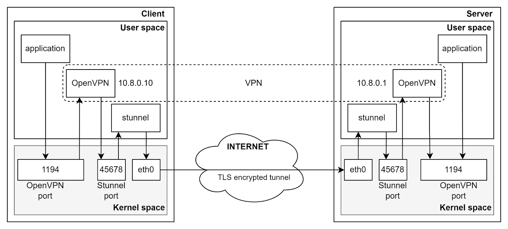
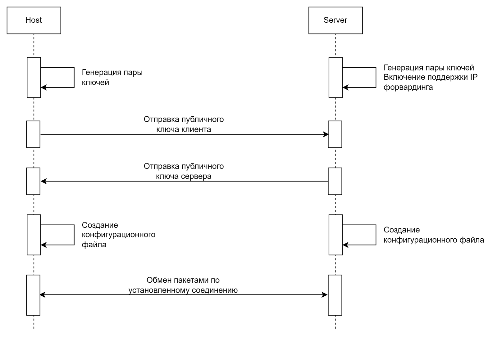
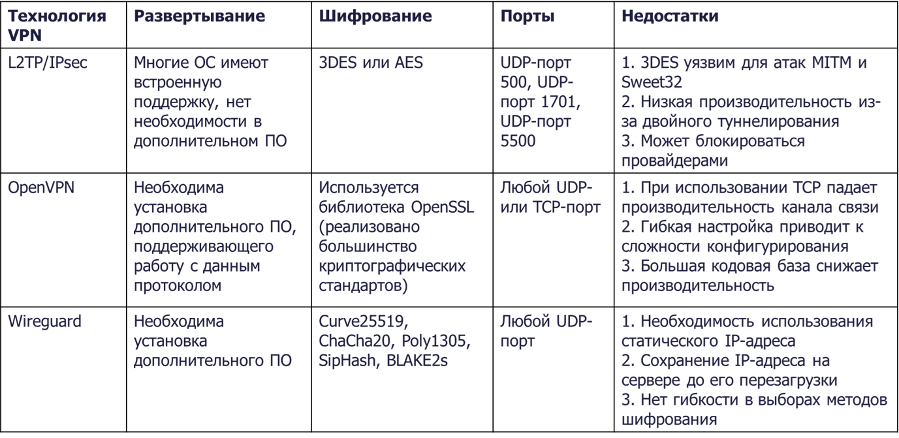
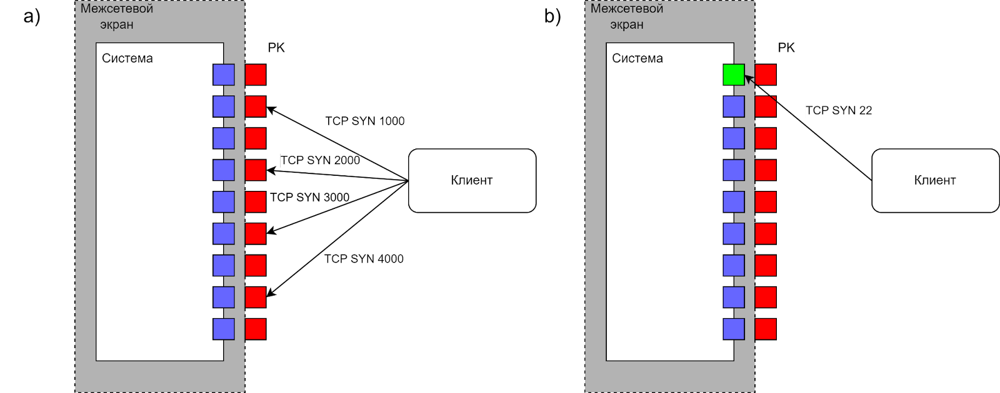
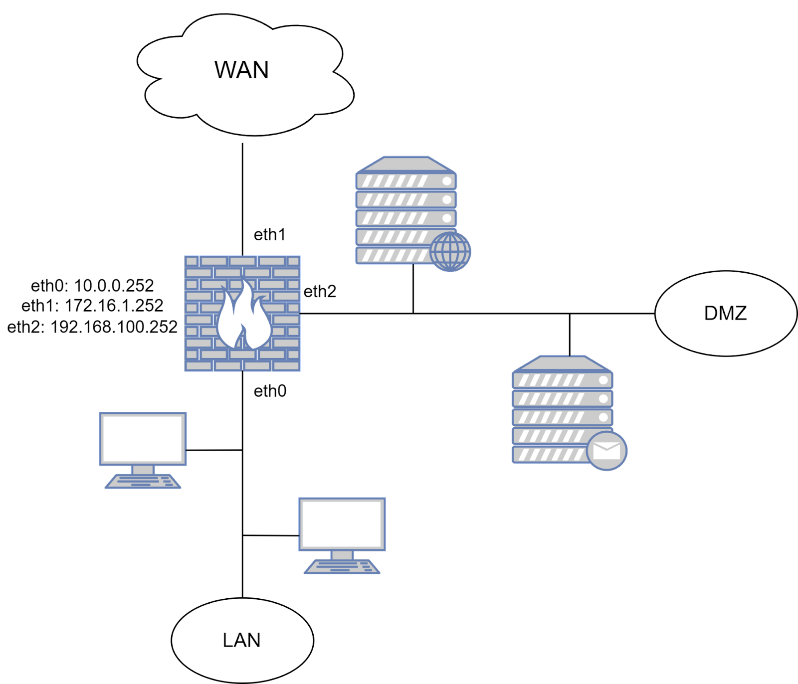
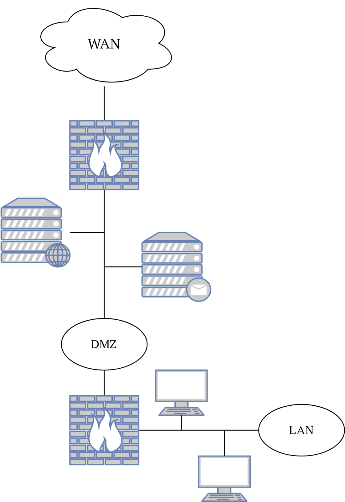

# 1. Виртуальные защищенные каналы связи

> **VPN (англ. Virtual Private Network**
>
> виртуальный защищенный канал связи для устанавления логические соединения удаленных сетевых сегментов в единую инфраструктуру

Технология виртуальных частных сетей VPN — один из рациональных инструментов организации защищенных сетевых соединений видов точка-точка, узел-сеть и сеть-сеть.

## OpenVPN

- один из наиболее распространенных и эффективных механизмов создания виртуальных частных сетей
- открытый исходный код
- использует библиотеку OpenSSL для обеспечения шифрования данных во время передачи
- поддерживает множество криптографических алгоритмов
- аутентификацией хоста по сертификату
    - опционально дополнительно по логину\паролю


### Настройка сервера

#### 1. Установкка

```
sudo apt install openvpn easy-rsa
```

#### 2. Центр сертификации

1. создать папку

```
sudo mkdir /[some_path]/easy-rsa
```

2. Копировать или создать сим-линки на пакет easy-rsa

```
sudo cp -R /usr/share/easy-rsa/* /[some_path]/easy-rsa
```
или

```
sudo ln -s /usr/share/easy-rsa/* /[some_path]/easy-rsa
```

3. Настройка центра сертификации

создать или отредактировать файл настроек `/[some_path]/easy-rsa/vars`

```
# Алгоритм шифрования
# по умолчанию - rsa
# в данном случае - на элептических кривых
set_var EASYRSA_ALGO "ec"

# Алгоритм хэширования
set_var EASYRSA_DIGEST "sha512"
```

Официальный пример файла vars: [https://github.com/OpenVPN/easy-rsa/blob/master/easyrsa3/vars.example](https://github.com/OpenVPN/easy-rsa/blob/master/easyrsa3/vars.example)

4. Инициализировать центр сертификации (в директории `/[some_path]/easy-rsa/

```
./easyrsa init-pki
./easyrsa build-ca nopass
```

#### 3. Создание сертификата и закрытого ключа сервера OpenVPN

1. Создать запрос на сертификат сервера

```
./easyrsa gen-req [server_name] nopass
```

В результате будет создан закрытый ключ `server.key` и запрос сертификата `server.req`, который должен подписать центр сертификации.

Ключ сервера нужно скопировать в директории конфигурации сервера OpenVPN

```
sudo cp /[some_path]/easy-rsa/pki/private/server.key /etc/openvpn/server
```

2. Подписать запрос центром сертификации

```
./easyrsa sign-req server server_name
```

Результатом выполнения является подписанный сертификат сервера `server.crt`

вместе с сертификатом центра сертификации необходимо скопировать в директорию конфигурации OpenVPN

```
sudo cp /[some_path]/easy-rsa/pki/issued/server.crt /etc/openvpn/server
sudo cp /[some_path]/easy-rsa/pki/ca.crt /etc/openvpn/server
```

3. Опционально, создать tls ключ для tls футентификации

```
openvpn --genkey --secret ta.key
```

Копируем ta.key в директорию openvpn

```
sudo cp ta.key /etc/openvpn/server/
```

#### 4. Сертификат клиента

1. Создать директорию для сертификатов и ключей клиента

```
mkdir -p ~/client-configs/keys
```

2. Запрос сертификата клиента

```
cd /[some_path]/easy-rsa
./easyrsa gen-req client_name nopass
```

Закрытый ключ client_name.key необходимо скопировать в ранее созданную директорию для конфигураций клиентов:

```
cp /[some_path]/easy-rsa/pki/private/client_name.key ~/client-configs/keys
```

3. подписать сертификат

```
./easyrsa sign-req client client_name
```

Подписанный сертификат и файлы `ca.crt` и `ta.key` также копируются в директорию ~/client-configs/keys:

```
cp /[some_path]/easy-rsa/pki/issued/client1.crt ~/client-configs/keys
sudo cp /etc/openvpn/server/ca.crt ~/client-configs/keys
sudo cp ta.key ~/client-configs/keys
```

#### 5. Кофигурация сервера

Конфигурация в файле `/etc/openvpn/server/server.conf`

Пример конфига: [https://github.com/OpenVPN/openvpn/blob/master/sample/sample-config-files/server.conf](https://github.com/OpenVPN/openvpn/blob/master/sample/sample-config-files/server.conf)

В `server.conf` нужно найти и изменить или добавить следующие строки:

```
port 1194
proto tcp
;tls-auth ta.key 0
tls-crypt ta.key
;cipher AES-256-CBC
cipher AES-256-GCM
auth SHA256
;dh dh2048.pem
dh none
;explicit-exit-notify 1
```

### Настройка сети

#### 1. IP Forwarding

1. Включить IP forwarding

```
sudo nano /etc/sysctl.conf
```

2. Изменить\добавить строку на:

```
net.ipv4.ip_forward = 1
```

3. Применить изменения

```
sudo sysctl -p
```

#### 2. Firewall (iptables)

```
sudo iptables -I INPUT -i <сетевой интерфейс> -m state --state NEW -p tcp --dport 1194 -j ACCEPT
sudo iptables -I FORWARD -i tun+ -j ACCEPT
sudo iptables -I FORWARD -i tun+ -o <сетевой интерфейс> -m state --state ESTABLISHED,RELATED -j ACCEPT
sudo iptables -I FORWARD -i <сетевой интерфейс> -o tun+ -m state --state ESTABLISHED,RELATED -j ACCEPT
sudo iptables -t nat -A POSTROUTING -s 10.8.0.0/24 -o lo -j MASQUERADE
sudo iptables -A OUTPUT -o tun+ -j ACCEPT
```

Сохранить настройки:

```
sudo iptables-save -c > /etc/iptables/rules.v4
```

### Запуск OpenVPN server

активировать службу OpenVPN, чтобы при каждой загрузке сервера она запускалась автоматически:

```
sudo systemctl -f enable openvpn-server@server.service
```

Запуск службы OpenVPN:

```
sudo systemctl start openvpn-server@server.service
```

Проверить статус можно с помощью команды:

```
sudo systemctl status openvpn-server@server.service
```

### Конфигурация клиента

Пример клиентского конфига: [https://github.com/OpenVPN/openvpn/blob/master/sample/sample-config-files/client.conf](https://github.com/OpenVPN/openvpn/blob/master/sample/sample-config-files/client.conf)

создать новую директорию для хранения файлов конфигурации клиентов в ранее созданной директории client-configs:

```
mkdir -p ~/client-configs/files
```

можно воспользоваться примером конфигурации из документации:

```
sudo cp /usr/share/doc/openvpn/examples/sample-config-files/client.conf ~/client-configs/base.conf
```

Откройте скопированный файл:

```
sudo nano ~/client-configs/base.conf
```

В скопированном файле найдите и измените или добавьте следующие строки:

```
remote <ip_сервера> 1194
proto tcp
;ca ca.crt
  
;cert client.crt
;key client.key
;tls-auth ta.key 1
cipher AES-256-GCM
auth SHA256
key-direction 1
script-security 2

# для обработки различных методов, используемых клиентом для разрешения DNS, а именно systemd-resolved

up /etc/openvpn/update-systemd-resolved
down /etc/openvpn/update-systemd-resolved
down-pre
dhcp-option DOMAIN-ROUTE
```

Скрипт для авто генерации конфига клиента


```
#!/bin/bash
    
KEY_DIR=keys
OUTPUT_DIR=files
BASE_CONFIG=base.conf
  
cat ${BASE_CONFIG} \
<(echo -e '<ca>') \
${KEY_DIR}/ca.crt \
<(echo -e '</ca>\n<cert>') \
${KEY_DIR}/${0}.crt \
<(echo -e '</cert>\n<key>') \
${KEY_DIR}/${0}.key \
<(echo -e '</key>\n<tls-crypt>') \
${KEY_DIR}/ta.key \
<(echo -e '</tls-crypt>') \
> ${OUTPUT_DIR}/${0}.ovpn
```

## Stunnel

Для маскировки информационных потоков под трафик TLS можно применить утилиту Stunnel. Это механизм проксирования, который дополнительно шифрует передаваемый между локальными сетевыми портами и удаленными сервисами сетевой трафик. Шифрование данных производится путем инкапсуляции передаваемых пакетов в TLS-соединения, обеспечивая дополнительную конфиденциальность и целостность данных.

Для создания такого соединения программа Stunnel также использует библиотеку OpenSSL, благодаря чему работает с протоколами SSL/TLS для создания шифрованного туннеля.

Stunnel используют для защиты различных сетевых протоколов, таких как HTTP, FTP, POP3, SMTP и др.

Диаграмма взаимодействия клиента и сервера представлена на рисунке ниже.



### Stunnel и OpenVPN

Потредуется настройка сервера выше

#### 1. Установка

```
sudo apt update
sudo apt install stunnel4
```

#### 2. настройка аутентификации с помощью X.509:

```
cd /etc/stunnel
sudo openssl genrsa -out key.pem 2048
sudo openssl req -new -x509 -key key.pem -out cert.pem -days 3650
```

```
sudo cat key.pem cert.pem >> stunnel.pem
```

Так же файл `stunnel.pem` необходимо передать на клиент

#### 3. Конфигурация

```
sudo nano /etc/stunnel/stunnel.conf
```

И заполнить его данными, описанными ниже:

```
chroot = /var/lib/stunnel4
pid = /stunnel.pid
output = /stunnel.log
setuid = stunnel4
setgid = stunnel4
socket = l:TCP_NODELAY=1
  
[openvpn]
accept = <ip-адрес сервера>:45678
connect = 127.0.0.1:1194
cert=/etc/stunnel/cert.pem
key=/etc/stunnel/key.pem
```

в файле `/etc/default/stunnel4`

```
ENABLED=1
```

#### 4. Firewall (iptables)

```
sudo iptables -I INPUT -i lo -m state --state NEW -p tcp --dport 1194 -j ACCEPT
sudo iptables -I FORWARD -i tun+ -j ACCEPT
sudo iptables -I FORWARD -i tun+ -o lo -m state --state ESTABLISHED,RELATED -j ACCEPT
sudo iptables -I FORWARD -i lo -o tun+ -m state --state ESTABLISHED,RELATED -j ACCEPT
sudo iptables -t nat -A POSTROUTING -s 10.8.0.0/24 -o lo -j MASQUERADE
sudo iptables -A OUTPUT -o tun+ -j ACCEPT
sudo iptables -I INPUT -p tcp --dport 45678 -j ACCEPT
sudo iptables -I OUTPUT -p tcp --sport 45678 -j ACCEPT
sudo iptables -A INPUT -i lo -j ACCEPT
sudo iptables -A OUTPUT -o lo -j ACCEPT
```

#### 5. OpenVPN server.conf

```
local 127.0.0.1
```

#### 6. Запуск

```
sudo systemctl restart openvpn-server@server.service
sudo systemctl start stunnel4.service
```

### Stunnel и OpenVPN клиент

Установка

```
sudo apt update
sudo apt install stunnel4
```

Настройка

```
cd /etc/stunnel
sudo nano stunnel.conf
```

Конфиг

```
output = /var/log/stunnel4/stunnel.log
client = yes
  
[openvpn]
cert = stunnel.pem
accept = 127.0.0.1:1194
connect = <ip-адрес сервера>:45678
```

запустить stunnel:

```
sudo stunnel ./stunnel.conf
```

файла клиента OpenVPN. В нём необходимо проверить следующие строки:

```
proto tcp
remote 127.0.0.1 1194
```

## WireGuard

- VPN-сервер с открытым исходным кодом
- защищенное соединение точка-точка между двумя участниками в сети
- использует различные криптографические протоколы
    - ChaCha20 используется для шифрования
    - Poly1305 — для аутентификации
    - Curve25519 — для обмена ключами
    - BLAKE2 — для хэширования

Основное отличие Wireguard от других решений — концепция маршрутизации Cryptokey Routing. В основе этого механизма лежит создание отдельного тоннеля для каждого клиента и создание списка публичных ключей всех клиентов. Далее при получении пакета происходит сопоставление публичного ключа и IP-адреса, откуда пришло сообщение. Если сопоставление прошло успешно, происходит дальнейшая маршрутизация пакета.

<span style="color:red">К минусам Wireguard VPN следует отнести невозможность использовать «из коробки» протокол TCP на транспортном уровне стека протоколов TCP/IP</span>. Весь трафик идет в UDP, из-за чего нельзя использовать Wireguard VPN в сетях, блокирующих трафик UDP.

на обоих устройствах генерируются пары ключей, после чего между клиентом и сервером происходит обмен публичными ключами шифрования, которыми в дальнейшем будут шифроваться передаваемые сообщения.

После этого создается конфигурационный файл для каждого соединения.



### Настройка

#### 1. Установка

```
student@wireguard:~$ sudo apt update
student@wireguard:~$ sudo apt install wireguard
```

#### 2. Ключи

Для создания закрытого ключа следует воспользоваться следующими командами:

```
wg genkey | sudo tee /etc/wireguard/private.key

# убрать все доступы для любых пользователей и групп, кроме пользователя root
sudo chmod go= /etc/wireguard/private.key
```

Для генерации публичного ключа воспользуемся командой:

```
sudo cat /etc/wireguard/private.key | wg pubkey | sudo tee /etc/wireguard/public.key
```

#### 3. конфигурации сервера Wireguard

Создать файл `/etc/wireguard/wg0.conf`

Содержимое:

```
[Interface]
  PrivateKey = <Ваш приватный ключ в base64>
  Address = <Ваш диапазон IP-адресов>
  ListenPort = 51820
  SaveConfig = true
```

#### 4. Настройка сети

необходимо установить в файле `/etc/sysctl.conf` следующий параметр - `net.ipv4.ip_forward=1`.

iptables:

```
sudo iptables -A INPUT -i <сетевой интерфейс> -p udp -m udp --dport 51820 -j ACCEPT
sudo iptables -t nat -I POSTROUTING 1 -s 10.8.1.0/24 -o <сетевой интерфейс> -j MASQUERADE
sudo iptables -I INPUT 1 -i wg0 -j ACCEPT
sudo iptables -I FORWARD 1 -i <сетевой интерфейс> -o wg0 -j ACCEPT
sudo iptables -I FORWARD 1 -i wg0 -o <сетевой интерфейс> -j ACCEPT
sudo iptables -I INPUT 1 -i <сетевой интерфейс> -p udp --dport 51194 -j ACCEPT
```

#### 5. Автозапуск

```
sudo systemctl enable wg-quick@wg0.service
sudo systemctl start wg-quick@wg0.service
```

### Настройка клиента

#### 1. Установка

```
sudo apt update
sudo apt install wireguard
```

#### 2. Ключи

После этого следует создать приватный ключ клиента и публичный ключ клиента:

```
wg genkey | sudo tee /etc/wireguard/private.key
sudo chmod go= /etc/wireguard/private.key
sudo cat /etc/wireguard/private.key | wg pubkey | sudo tee /etc/wireguard/public.key
```

#### 3. Конфиг

```
[Interface]
  PrivateKey = <Приватный ключ клиента>
  Address = 10.8.0.2/24
  [Peer]
  PublicKey = <Публичный ключ сервера Wireguard>
  AllowedIPs = 10.8.0.0/24
  Endpoint = <IP сервера Wireguard>:51820
```

#### 4. Добавить пбличный ключ клиента к серверу

На сервере

```
sudo wg set wg0 peer <Публичный ключ клиента> allowed-ips 10.8.0.2
```

## Сравнение



### уязвимости в протоколах OpenVPN и WireGuard.

#### WireGuard CVE-2021-46873

Относится к WireGuard 0.5.3 в Windows

н не полностью учитывает возможность того, что злоумышленник сможет установить системное время жертвы на будущее значение, например, из-за использования не прошедшего проверку подлинности NTP. Это может привести к тому, что один статический закрытый ключ станет навсегда бесполезным.

Простыми словами, WireGuard не учитывает возможность использования не аутентифицированного NTP-сервера.

#### OpenVPN CVE-2022-33738

Сервер доступа OpenVPN до версии 2.11 использует слабый генератор случайных чисел, нужный для создания токена сеанса пользователя для веб-портала.

## Port Knocking

Работа Port Knocking в классической реализации происходит следующим образом: на сервере задается конечная последовательность портов, на которые клиент должен отправить пакеты, чтобы в дальнейшем получить доступ к закрытому порту сервера.



при статичной последовательности рассматриваемая технология уязвима перед средствами сканирования и зондирования сети, что позволяет злоумышленнику воспроизвести заданную последовательность и получить доступ к закрытому порту.

### Настройка технологии простукивания портов

с помощью утилиты knockd

#### 1. Установка

```
sudo apt install knockd
```

#### 2. Firewall (iptables)

нужно первоначально разрешить все входящие и связанные соединения, а затем при конфигурировании запретить доступ по защищаемому порту и все соединения извне. Настройка пакетного фильтра может выглядеть так:

```
sudo iptables -A INPUT -i <сетевой_интерфейс> -m state --state ESTABLISHED,RELATED -j ACCEPT
sudo iptables -I INPUT -p tcp -i <сетевой_интерфейс> --dport <номер_порта> -j DROP
sudo iptables -A INPUT -i <сетевой_интерфейс> -j DROP
```

#### 3. инициализировать службу knockd

Для этого в файле `/etc/default/knockd` изменить следующую опцию и присвоить ей значение “1”:

```
START_KNOCKD=1
```

#### 4. Конфигурация

файл конфигурации `/etc/knockd.conf`

```
[options]
  UseSyslog
  Interface = <сетевой_интерфейс>
  [openclosePort]
  sequence = 7000,8000,9000
  seq_timeout = 5
    
  start_command = /sbin/iptables -I INPUT -s %IP% -p tcp --dport
  <номер_порта> -j ACCEPT
  cmd_timeout = 60
  stop_command = /sbin/iptables -D INPUT -s %IP% -p tcp --dport
  <номер_порта> -j ACCEPT
  tcpflags = syn
```

#### 5. Активация службы и запуск

```
systemctl enable knockd.service
systemctl start knockd
```

### С клиента

```
knock <ip_серверва> <последовательность_портов>
```

# 2. DMZ

> физический или логический сегмент сети, содержащий и предоставляющий организации общедоступные сервисы, а также отделяющий их от остальных участков локальной сети, что позволяет обеспечить внутреннему информационному пространству дополнительную защиту от внешних атак.

Цель DMZ — добавить дополнительный слой безопасности. Это усиливает защиту внутренней сети, сокращая потенциальные угрозы и попытки вторжения.

По умолчанию DMZ считается потенциально скомпрометированной. Но выйти из нее и добраться до внутренних ресурсов — дополнительная нагрузка на злоумышленника и дополнительная возможность его обнаружения для системы защиты.

Принципы построения DMZ:
1. Из внутренней сети можно инициировать соединения в DMZ и в WAN (Wide Area Network).
1. Из DMZ можно инициировать соединения в WAN.
1. Из WAN можно инициировать соединения в DMZ.
1. Инициация соединений из WAN и DMZ ко внутренней сети запрещена.


## DMZ с одним межсетевым экраном

использует один межсетевой экран с тремя сетевыми интерфейсами.
- Один интерфейс подключен к внешней сети
- второй — к DMZ
- третий — к внутренней сети

Она обеспечивает уровень безопасности, поскольку весь трафик проходит через межсетевой экран и фильтруется.



На межсетевом экране задаются правила фильтрации трафика и по ним во внутреннюю сеть попадают только запросы определенного вида.

Внутренняя и внешняя сети подключаются к разным портам межсетевого экрана, контролирующего соединения между сетями.

Подобная схема проста в реализации и требует всего лишь одного дополнительного порта. Однако в случае взлома (или ошибки конфигурирования) межсетевого экрана сеть оказывается уязвима напрямую из внешней сети.

## DMZ с двумя межсетевыми экранами

Конфигурация с двумя межсетевыми экранами представляет собой более безопасную альтернативу.
- Один межсетевой экран расположен между DMZ и интернетом
- второй между DMZ и защищенной внутренней сетью.

Это позволяет контролировать и протоколировать все входящий и исходящий трафик на обоих концах DMZ, обеспечивая более высокий уровень безопасности.

DMZ подключается к двум межсетевым экранам:
1. Ограничивает соединение из внешней сети в DMZ
1. Контролирует соединения из DMZ во внутреннюю сеть



Правильно выбирать межсетевые экраны различных производителей.

Подобная схема позволяет минимизировать последствия взлома любого из межсетевых экранов или серверов, взаимодействующих с внешней сетью — до тех пор, пока не будет взломан внутренний межсетевой экран, злоумышленник не будет иметь произвольного доступа к внутренней сети.

# 3. Безопасность Wi-Fi

Термин Wi-Fi не является техническим, но активно применяется современными пользователями. Он происходит от английского Wireless Fidelity, что в переводе означает «высокая точность беспроводной передачи данных». В настоящее время под этим термином понимают целое семейство стандартов для передачи цифровых данных через радиоканалы.


## Стандарты WiFi

Стандарты 802.11n, 802.11ac и 802.11ax являются эволюцией беспроводных технологий Wi-Fi и предназначены для обеспечения более высокой производительности, улучшенной эффективности и поддержки растущего количества устройств в сетях Wi-Fi

### 802.11n

[О стандарте ссылка](https://help.keenetic.com/hc/ru/articles/213968809-%D0%91%D0%B0%D0%B7%D0%BE%D0%B2%D1%8B%D0%B5-%D0%BF%D0%BE%D0%BB%D0%BE%D0%B6%D0%B5%D0%BD%D0%B8%D1%8F-%D1%81%D1%82%D0%B0%D0%BD%D0%B4%D0%B0%D1%80%D1%82%D0%B0-Wi-Fi-4-IEEE-802-11n)

#### Скорость передачи данных.

802.11n, также известный как Wi-Fi 4, представляет собой значительное улучшение по сравнению со своим предшественником 802.11g. Он может работать как в диапазоне 2,4 ГГц, так и в диапазоне 5 ГГц и позволяет достигать скоростей до 300 Мбит/с при ширине канала 40 МГц на каждую независимую антенну

#### Множественный вход множественный выход (Multiple Input Multiple Output, MIMO)

802.11n внедряет технологию MIMO, позволяющую использовать несколько антенн для передачи и приема данных. Это существенно повышает пропускную способность и устойчивость сигнала.

#### Каналы и пространственная многозадачность (Spatial Multiplexing)

Стандарт поддерживает более широкие каналы (40 МГц) и пространственную многозадачность, что улучшает производительность в условиях сильных помех.

#### Совместимость

802.11n совместим с более старыми стандартами Wi-Fi, что позволяет устройствам с различными версиями Wi-Fi работать в одной сети.

### 802.11ac

[О стандарте ссылка](https://help.keenetic.com/hc/ru/articles/213968949-%D0%91%D0%B0%D0%B7%D0%BE%D0%B2%D1%8B%D0%B5-%D0%BF%D0%BE%D0%BB%D0%BE%D0%B6%D0%B5%D0%BD%D0%B8%D1%8F-%D1%81%D1%82%D0%B0%D0%BD%D0%B4%D0%B0%D1%80%D1%82%D0%B0-Wi-Fi-5-IEEE-802-11ac)

#### Скорость передачи данных

802.11ac, также известный как Wi-Fi 5, предоставляет от 433 Мбит/с и до 6,77 Гбит/с при 8 антеннах. Он работает в диапазоне 5 ГГц и поддерживает такие технологии, как Multiple Input Multiple Output (MIMO) и более широкие каналы (80 или 160 МГц).

В настоящее время ведутся разработки стандарта 802.11be (Wi-Fi 7), который будет нацелен на работу в частотных диапазонах 2,4; 5 и 6 ГГц.

#### Спектральная эффективность

802.11ac обеспечивает лучшую спектральную эффективность, что позволяет улучшить производительность в условиях загруженных сетей и обеспечивает более стабильное соединение.

#### Beamforming

Этот стандарт внедряет технологию Beamforming, которая позволяет точечно направлять сигнал Wi-Fi к конкретным устройствам, повышая качество связи.

### 802.11ax

[О стандарте ссылка](https://help.keenetic.com/hc/ru/articles/360010536300-%D0%A7%D1%82%D0%BE-%D0%BD%D1%83%D0%B6%D0%BD%D0%BE-%D0%B7%D0%BD%D0%B0%D1%82%D1%8C-%D0%BE-%D1%81%D1%82%D0%B0%D0%BD%D0%B4%D0%B0%D1%80%D1%82%D0%B5-Wi-Fi-6-IEEE-802-11ax)

#### Скорость передачи данных

802.11ax, известный как Wi-Fi 6, увеличивает скорость передачи данных на 37% по сравнению с Wi-Fi 5 и обеспечивает более эффективное использование сетевого ресурса.

#### Управление ресурсами

Одной из ключевых особенностей 802.11ax является технология Orthogonal Frequency Division Multiple Access (OFDMA), которая улучшает эффективность передачи данных в условиях плотного населения устройств в сети.

#### MU-MIMO улучшенного типа

Стандарт расширяет технологию MU-MIMO (Multi-User Multiple Input Multiple Output) для более эффективной обработки множества одновременных подключений, что особенно важно в условиях сетей большой плотности устройств.

#### Более широкие каналы

802.11ax также поддерживает более широкие каналы (80 и 160 МГц), что способствует увеличению пропускной способности сети.

## Защита в wifi

### WPA

#### Защита ключа

WPA внедрил протокол Temporal Key Integrity Protocol (TKIP) для временного шифрования ключей, улучшая безопасность по сравнению с WEP.

#### Поддержка аутентификации

WPA предоставляет поддержку протоколов аутентификации, таких как Extensible Authentication Protocol (EAP), что повышает безопасность процесса аутентификации.

### WPA2

#### AES-шифрование

WPA2 (Wi-Fi Protected Access 2) существенно усилил безопасность, заменив устаревший протокол TKIP на Advanced Encryption Standard (AES). AES считается более надежным и безопасным шифрованием.

#### Поддержка аутентификации

Как и WPA, WPA2 поддерживает протоколы аутентификации, обеспечивая более сильные механизмы проверки подлинности.

### WPA3

#### Индивидуальное шифрование данных

WPA3 внедрил индивидуальное шифрование данных (Individualized Data Encryption). Это означает, что каждое устройство в сети использует свой уникальный ключ шифрования. Такой подход повышает уровень безопасности и затрудняет возможность атак на одно устройство для раскрытия ключей других.

#### Защита от атак перебора пароля

WPA3 включает защиту от атак перебора пароля. Даже при неудачных попытках ввода пароля злоумышленнику будет затруднительно осуществить успешную атаку, так как WPA3 вводит блокировку после нескольких неудачных попыток.

#### Согласование паролей (Simultaneous Authentication of Equals, SAE)

WPA3 использует протокол SAE для обеспечения безопасного согласования паролей при аутентификации устройств в беспроводной сети. Этот метод предоставляет дополнительный уровень защиты от атак, направленных на пароли.
