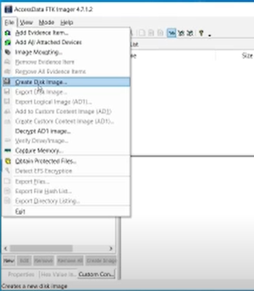
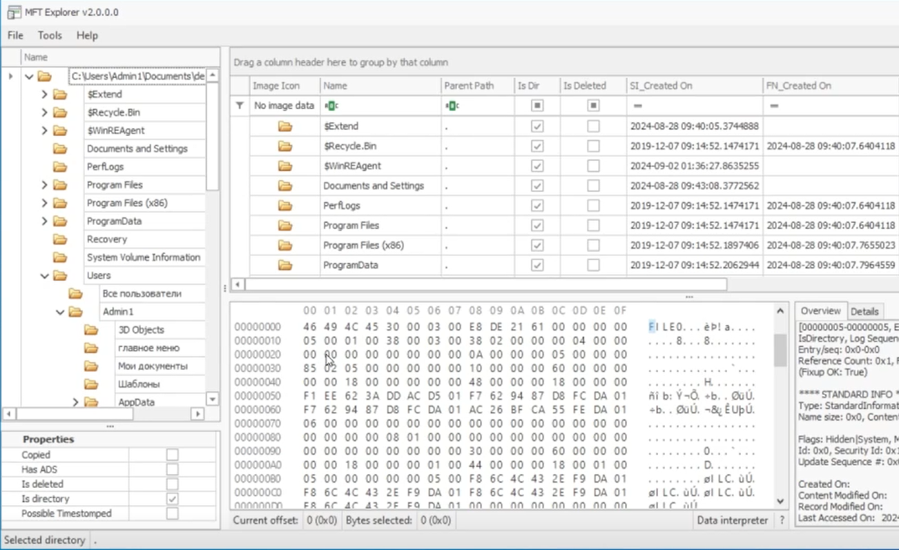
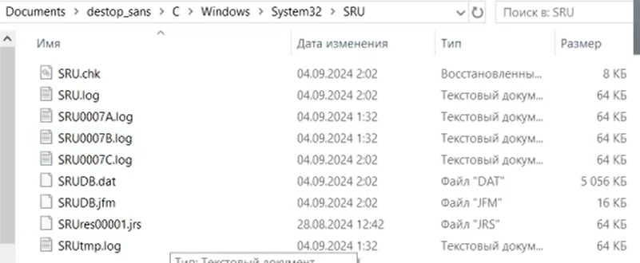

# 1. Введение в модуль

Основные этапы при анализе систем следующие:

1. **Извлечение данных**: сбор файлов, журналов событий, полного набора артефактов, образов оперативной памяти и создание образов дисков.
1. **Анализ системных артефактов**: реестра Windows, временных файлов, точек восстановления системы, файлов браузеров и пр.
1. **Восстановление удаленных или измененных данных**: анализ временных файлов, теневых копий и пр.
1. **Построение таймлайна**: выстраивание действий злоумышленника в единую цепочку событий.

# 2. Обзор архитектуры операционной системы Windows

основы строения операционной системы — процессы, службы, учетные записи в Active Directory.

Слои OS

kernel mode - Все что работает в пространстве ядра

user mode - Все остальное 

## Процессы Windows

### PowerShell

#### Get-Process

> Список процессов

| Ключ | Описание |
| :------------- | :--------------- |
| `-IncludeUserName` | пользователь от которого запущен процесс |
| `-id [process_id]` | информация по процессу с указанным id |

- Просмотр всех данных по процессу: `Get-Process -id [id] -IncludeUserName | Select-Object *`
- Просмотр отдельных полей по процессу: `Get-Process -id [id] -IncludeUserName | Select-Object [list,of,fields]` список полей разделяется запятой
- Сортировка: `Get-Process -id [id] -IncludeUserName | Select-Object [list,of,fields] | Sort-Object [field,list]`

### Мониторинг софт

- [System Informer](https://systeminformer.sourceforge.io/)
- [Process Hacker](https://processhacker.sourceforge.io/)
- [Process Explorer](https://learn.microsoft.com/en-us/sysinternals/downloads/process-explorer)

## Службы Windows

Вредоностное ПО использует службы для закрепления в ОС (например автозапуск)

### CMD

| Комманда | Описание |
| :------- | :------- |
| `sc query` | выводит список служб |
| `sc qc [service_name]` | информация по службе (тип, тип запуска, путь исп файла) |

### Реестр

- Запуск просмотра реестра: `regedit`
- Директория реестра:
    - `HKEY_LOCAL_MACHINE\SYSTEM\ControlSet001\Services` - все установленные службы
    - `HKEY_LOCAL_MACHINE\SYSTEM\CurrentControlSet\Services` - доп ветки

Запись ключа `Start`
- 0: Loaded (but not started) by the boot loader. Then started during kernel initialization.
- 1: Started during kernel initialization after services whose start parameter is 0.
- 2: Automatically. Started by smss.exe (session manager) or services.exe (services controller).
- 3: Manually. Started by the Service Control Manager (SCM).
- 4: Disabled
- 5: Delayed start.

### PowerShell

| Комманда | Описание |
| :------- | :------- |
| `reg query [registry-path]` | вывести список вложений в пути реестра |
| `reg query [reg-path-to-service]` | вывести информацию по службе |
| `reg query [path-to-service] /v [field]` | вывести значения *field* записи реестра *path-to-service* |

## Учетные записи (Домен)

> **DN (DistinguishedName)** - уникальный индефикатор сущности домена (пользователь, группа и т.д.)

Поля DN:
- CN - Common Name (имя пользователя)
- OU - organization unit
- DC - domain name

> **ObjectGUID** - уникальный не изменяемый ID пользователя

> **UID** - уникальный индентификатор пользователя (может менятся)

### PowerShell

| Комманда | Описание |
| :------- | :------- |
| `net user [username] /domain` | информация по пользователю в домене |
| `get-aduser [username]` | общая информация о пользователе |
| `get-aduser [username] -properties *` | вывод всех данных о пользователе |
| `get-aduser [username] -properties * \| select-object [field,1field2]` | вывод указанных полей данных пользователя |
| `get-aduser [username] -properties * \| select-object [field,1field2] \| format-table` | вывод указанных полей данных пользователя в табличном формате |
| `get-aduser -filter *` | Все пользователи |
| `get-date [timestamp]` | Вычисление даты по timestamp |

## Файлы и папки

| Комманда | Описание |
| :------- | :------- |
| `get-acl [path]` | Владелец(ы) к файлу(ам)\папке(ам) |
| `get-acl [path] \| select-object *` | все ACL правила |
| `get-acl [path] \| select-object AccessToString` | список всех прав |
| `get-childitem -Recurse [dirpath] \| get-acl ` | просмотр всех подпапок и файлов |

# 3. Создание образа диска и сбор артефактов

## Базовый сбор артефактов

Софт:
- [Kape](https://www.kroll.com/en/services/cyber-risk/incident-response-litigation-support/kroll-artifact-parser-extractor-kape)

### Kape

В архиве две проги:
- gkape.exe - GUI
- kape.exe - CLI

1. Указать откуда собирать и куда ложить 
1. Что собирать (Targets)
    1. `$J` и `$log` - сначала сбор логов
    1. `!SANS_Triage` - потом атоматический сбор

### Плюсы - минусы

- Минусы
    - Только коммерческая сфера, на данный момент в прав охр органах не пройдет, т.к. происходит вмешательство в атакованную машину
    - не подойдет как свидетельство в судебном процессе
- Плюсы
    - Быстро и просто
    - Можно допиливать и дорабатывать

## Копирование диска

### Полезные команды PowerShell

| Комманда | Описание |
| :------- | :------- |
| `get-disk` | выводит список дисков (физических) |
| `get-partition [?disk-number]` | список разделов диска |
| `get-partition [?disk-number] -PartitionNumber [pn]` | информация по разделу диска |
| `get-partition [?disk-number] -PartitionNumber [pn] \| select-object *` | вся информация по разделу диска |

### FTK Imager

https://www.exterro.com/digital-forensics-software/ftk-imager

#### Создание образа:

1. Открыть меню копирования 
1. Выбрать что копировать 
1. Выбрать формат и место для копирования 
    1. Формат 
        - Raw(dd) - побайтовое копирование
        - E01 - формат с сжатием
    1. Ввести доп инфо 
    1. Расположение и место копии 
1. 

Результат копирования: 

#### Просмотр копии

1. Меню: 
1. Выбрать, что смотреть 
1. Указать расположение 1го куска копии  
1. Результат 

# 4. Извлечение артефактов из файловой системы

## Анализ сбора Kape

Файлы сбора:  

| Место | Описание |
| :----- | :----- |
| **Файл $MFT** | БД метаданных всех файлов и папок в системе |
| **Папка $Extend** | журнал операций с файлами <ins>\$UsnJournal</ins> |
| **$Boot** | Загрузочный сектор диска |
| **$LogFile** | Журнал транзакций |
| **$Secure_$SDS** | Информация о дескрипторах безопасности (используется редко) |
| **$Recycle.Bin** | Инфомрация об удаленных файлах |

### $MFT

https://learn.microsoft.com/ru-ru/windows/win32/fileio/master-file-table

#### Просмотр MFT на живой системе

[DiskExplorer](https://www.runtime.org/diskexplorer.htm)

1. 
1.  
1. 

 

Пример MFT записи файла:

 

Атрибуты файла:

- **Резидентные (resident)** - полностью попадает в MFT запись
- **Не резидентные (non-resident)** - записывается только header, но не значение

##### $STANDARD_INFORMATION

Временные метки:  

##### $FILENAME

- С данными временными метками работает файловая система
- Используется, когда злоумышленник применяет изменение временных меток

 

##### Значения и операции временных меток

 

#### Парсинг MFT

Инструменты парсинга и другое: https://ericzimmerman.github.io/#!index.md

##### MFTExplorer

##### MFTEcmde.exe

- `\path\to\MFTECmd.exe -f [path-tom-mft-file]` - распарсить файл
- Timeline Explorer - для просмотра результата парсинга

### $UsnJournal

- https://learn.microsoft.com/ru-ru/windows-server/administration/windows-commands/fsutil-usn
- https://pyatilistnik.org/chto-takoe-usn-zhurnal-windows/

- `\path\to\MFTECmd.exe -f [path-to\$Explorer\$j]` - распарсить файл
- Так же Timeline Explorer

# 5. Анализ артефактов исполнения

## Артефакты исполняемых файлов

### Amcache.hve

Лежит в `C:\Windows\appcompat\Programs\Amcache.hve`

#### Парсинг через AmcacheParser from Zimerman: `\path\to\AmcacheParser.exe -f [path\to\Amcache.hve]`

- **UnassociatedFileEntries.csv**
    - Имеется путь к файлу
    - Есть SHA1 файла
    - <ins>File Key Last Wite Timestamp</ins> - важно: время, когда последний раз вносились изменения в реестр

#### Парсинг через Registry Explorer

https://ericzimmerman.github.io/#!index.md

1. Открыть файл Amcache из сбора Kape: `путь-к-сбору\C\Windows\AppCompat\Programs\Amcache.hve`
1. При неободимости добавить tansition log: `...\Programs\Amcache.hve.LOG1`
1. Выбрать место для сохранения результатов парсинга

**На что обратить внимание**
- `InventoryAppFile` 
    - Текущее имя файла (Name)
    - Исходное имя файла (OriginalFileName)
    - расположение исполняемого файла
    - FileId (0000+SHA1) *может отличаться от SHA1 посчитанного от самого файла, так как данных hash отсчитывается от не более <ins>31457280 байт</ins> файла*
    - Метаданные исполняемого файла
    
#### Парсинг в Linux

**regripper**
- `regripper -r [Amcache file] -a` - парсинг Amcache (-a для автоопределение плагинов)
- На ввод подавать файл с примененым transition log!
- `regripper -l` - просмотр доступных плагинов
- `regripper -r [Amcache file] -p amcache` - парсинг с указанием плагина

### AppCompatCache

- в отличии от Amcache не может использоваться как доказательство в суде
- Находится в регистре: `HKEY_LOCAL_MACHINE\SYSTEM\ControlSet001\Control\Session Manager\AppCompatCache` ключ `CasheMainSdb`
- В сборке Kape на ходится в `путь-к-сборке\C\Windows\System32\config\System`

#### AppCompatCacheParser от Zimerman

`...\AppCompatCacheParser -f [path-to-file] -csv [path-to-save]` - парсинг в CSV формате

Просмотр в Timeline Explorer

Содержит:
- метка последнего изменения
- путь к исполняемому файлу

#### Registry Explorer

1. Подгрузить `путь-к-сборке\C\Windows\System32\config\System` 
1. Подгрузить transition log
1. Пройти до ветки `ROOT\ControlSet001\Control\Session Manager\AppCompatCache`  

### UserAssist 

Записи в регистре Windows

https://windowsexplored.com/2012/02/06/a-quick-glance-at-the-userassist-key-in-windows/

Ключи:
| Ключ | Описание |
| :-- | :--- |
| {5E6AB780-7743-11CF-A12B-00AA004AE837} | IE Favorites and other IE toolbar objects |
| {75048700-EF1F-11D0-9888-006097DEACF9} | A list of applications, files, links, and other objects that have been accessed. |
| **{CEBFF5CD-ACE2-4F4F-9178-9926F41749EA}** | A list of applications, files, links, and other objects that have been accessed. |
| {F4E57C4B-2036-45F0-A9AB-443BCFE33D9F} | Lists the shortcut links used to start progams |

#### Реестр

- находится в ветке `HKEY_USERS\S-1-5-21-416057392-1039290769-2309968801-1001\SOFTWARE\Microsoft\Windows\CurrentVersion\Explorer\UserAssist` 4й снизу (`{CEBFF5CD-ACE2-4F4F-9178-9926F41749EA}`) -> `\count` 
- просмотр значений через сдвиг на https://rot13.com/

#### FTK Imager

1. Подгрузить бэкап
1. Пройти по пути `SystemPartition\Root\Users\[Пользователь]` 
1. Файл `NTUSER.DAT`

#### Парсинг Registry Explorer

В сборе Kape: `путь-к-сборке\C\Users\[Пользователь]\NTUSER.DAT`

1. Загружаем NTUSER.DAT
1. Загрузить transaction log `[Пользователь]\NTUSER.DAT.LOG1,2,3...`
1. Идем по пудереву `ROOT\Software\Microsoft\Windows\CurrentVersion\Explorer\UserAssist` -> 4я директория снизу (`{CEBFF5CD-ACE2-4F4F-9178-9926F41749EA}`) -> `Count`

### System Resource Utilization Monitore (SRUM)

Содрежит информацию о приложениях 
- Сколько ресурсов потребляла
- Сколько по времени были запущены файлы

А артефактах Kape: `...\C\Windows\System32\SRU` 

Самое важное - `SRUDB.dat`

#### SrumECmd from Zimerman

- `...\SrumECmd.exe -f [path-to-SRUDB.dat] -r [path-to-REGISTRY-SOFTWARE-from-kape]` - парсинг
- `...\SrumECmd.exe -f .\SRUDB.dat -r ...\C\Windows\System32\config\SOFTWARE -csv .` 
- `SrumECmd_AppResourceUseInfo_Output.csv`
    - сколько исп. файл бы запущен по времени
    - кем был запущен
    - Система записывает данные окнами в 5ть минут (в логе)

### Prefetch

https://habr.com/ru/companies/f_a_c_c_t/articles/487516/

*Может не быть!* если в регистре внесены изменения в `HKEY_LOCAL_MACHINE\SYSTEM\ControlSet001\Control\Session Manager\Memory Management\PrefetchParameters` значение `EnablePrefetcher`

- расположение: `C:\Windows\Prefetch` В Keep: `...\C\Windows\prefetch`
- в файлах директории содержится
    - временные метки исполняемых файлов
        - создания
        - модификации
        - последенего запуска
    - имя
    - hash
    - в win10 и сташе:
        - количество запусков
        - временные метки n-последних запусков
    - список каталогов и файлов, с которыми взаимодействовал исполняемый файл

#### PECmd from Zimerman

- `...\PECmd.exe -f [file-to-prefetch-file]`
- `...\PECmd.exe -d [path-ti-prefetch-dir]`
- `...\PECmd.exe -f ...\C\Windows\prefetch --html [out-dir]` - парсинг prefetch с выводом в html
- пример записи в json 

# 6. Анализ активности пользователя

## Артефакты пользовательской директории

- PowerShell log `...\C\Users\[user]\AppData\Roaming\Microsoft\PowerShell\PSReadline\ConsoleHost_history.txt`
- Недавние документы `...\C\Users\[user]\AppData\Roaming\Microsoft\Recent`
    - Jump листы (подсказки, что пользователь часто открывает)
        - AutomaticDestinations
        - CustomDestinations

### AutomaticDestinations и CustomDestinations

#### JLECmd from Zimerman

- `...\JLECmd.exe -d C:\Users\[USER]\AppData\Roaming\Microsoft\Windows\Recent\AutomaticDestinations --csv [out-path]`
- `...\JLECmd.exe -d C:\Users\[USER]\AppData\Roaming\Microsoft\Windows\Recent\CustomDestinations --csv [out-path]`

Содержит:
- метки времени изменения записи jump листа
- AppId - хэш исполняемого файла, обращавшегося к целевому файлу
- App Id Description - описание исполняемого файла (имя программы)
- Target временные метки - относятся к целевому файлу

### Link-файлы (Ярлыки)

#### LECmd from Zimerman

`...\LECmd.exe -d C:\Users\[USER]\AppData\Roaming\Microsoft\Windows\Recent --csv [out-path]`

Содержит:
- Временные метки link-файла
- Временные метки файла
- Relative Path - путь к самому файлу относительно расположения линка
- Working Directory - путь к директории, в которой находится файл

## Реестр пользователя

Из артефактов Kape: `...\C\Users\[user]\ntuser.dat`

1. Загрузим в Registry Explorer
1. Закладка Available bookmarks 
    - `.\Run` - что должно быть запущено после входа
    - `.\RunOnce` - запущено единожды после входа
    - `.\RunMRU` - запущено с помощью "Выполнить" (Win+R)
    - `.\RecendDocs` - недавние документы (разбито по расширениям файлов)
    - `.\MountPoints` - инфо по подключенным разделам
    - `.\FileExtentions` - какие файлы чем открывать
    - `.\Shell\Bags` - https://www.hackingarticles.in/forensic-investigation-shellbags/   
    - `.\ComDlg32` - диалоги системы и подсказки, аля "Сохранить как"

### RDP

В реестре: `HKEY_USERS\[UID]\SOFTWARE\Microsoft\Terminal Server Client`
- `.\Servers` - информация куда подключался пользователь
    - временная метка
    - имя пользователя, под которым подключался

## Браузер

**NirLauncher**
- https://launcher.nirsoft.net/
- Web Browser Tools - просмотр логов и истории браузеров

### BrowserHistoryView

