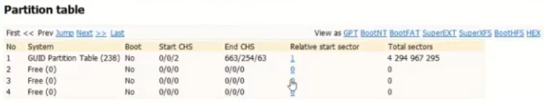
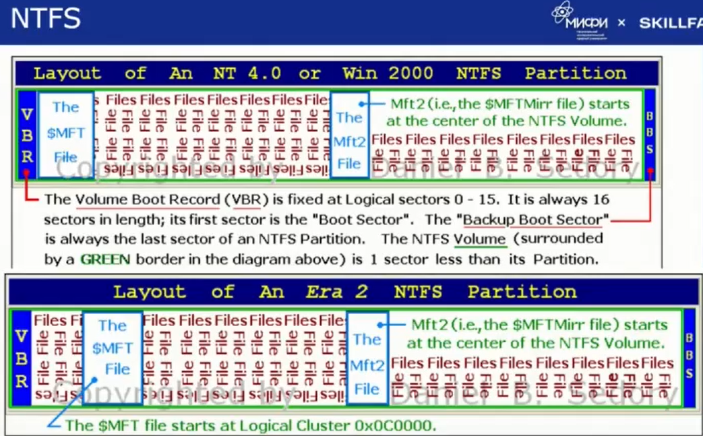

# 1. Windows forensics

## 1. Сбор данных

- Kape - сбор артефактов
- FTK Imager - образ дисков

### Разбиение дисков

#### MBR

 

- может быть не более 4х основных разделов
- 1 extended раздел, разбиваемый на большое количество разделов

**Главня проблема: MBR Parition Entry**

- StartingLBA - начало первого раздела
- SizneINLba - размер раздела
- Максимальный рамер раздела: 2.1ТБ

#### GUID Parition Table (GPT)

- PT header (записывается в начала и в конце диска)  
- 0й разде - MBR для обратной совместимости
- аттрибуты раздела: 

#### Системный раздел GPT

#### NTFS

### Монитрование image дисков

[Arsenal Image Mounter](https://arsenalrecon.com/downloads)

### X-Ways Forensics

https://www.x-ways.net/forensics/index-m.html

- просмотр содержания и аттрибутов дисков и образов

## Артефакты

### Софт

- для анализа:
    - [Autopsy](https://www.autopsy.com/): free
    - [X-Ways Forensics](https://www.x-ways.net/forensics/index-m.html): paied
- восстановление диска
    - [R-Studio](https://www.r-studio.com/ru/): paied

### Журналы

`C\Windows\System32\winevt\logs`

####  `Security.evtx`
- информация о входах в систему
- События входа в систему: 4624 (https://learn.microsoft.com/ru-ru/previous-versions/windows/it-pro/windows-10/security/threat-protection/auditing/basic-audit-logon-events)
- event id 7045 - создание нового сервиса

logon_type:

<table>
<thead>
<tr>
<th>Logon type</th>
<th>Logon title</th>
<th>Description</th>
</tr>
</thead>
<tbody>
<tr>
<td>2</td>
<td>Interactive</td>
<td>A user logged on to this computer.</td>
</tr>
<tr>
<td>3</td>
<td>Network</td>
<td>A user or computer logged on to this computer from the network.</td>
</tr>
<tr>
<td>4</td>
<td>Batch</td>
<td>Batch logon type is used by batch servers, where processes may be executing on behalf of a user without their direct intervention.</td>
</tr>
<tr>
<td>5</td>
<td>Service</td>
<td>A service was started by the Service Control Manager.</td>
</tr>
<tr>
<td>7</td>
<td>Unlock</td>
<td>This workstation was unlocked.</td>
</tr>
<tr>
<td>8</td>
<td>NetworkCleartext</td>
<td>A user logged on to this computer from the network. The user's password was passed to the authentication package in its unhashed form. The built-in authentication packages all hash credentials before sending them across the network. The credentials do not traverse the network in plaintext (also called cleartext).</td>
</tr>
<tr>
<td>9</td>
<td>NewCredentials</td>
<td>A caller cloned its current token and specified new credentials for outbound connections. The new logon session has the same local identity, but uses different credentials for other network connections.</td>
</tr>
<tr>
<td>10</td>
<td>RemoteInteractive</td>
<td>A user logged on to this computer remotely using Terminal Services or Remote Desktop.</td>
</tr>
<tr>
<td>11</td>
<td>CachedInteractive</td>
<td>A user logged on to this computer with network credentials that were stored locally on the computer. The domain controller was not contacted to verify the credentials.</td>
</tr>
</tbody>
</table>
        
####  RDP логи

- `Microsoft-Windows-TerminalServices-RemoteConnectionManager%4Operational.evtx` - события RDP соединений 
- `Microsoft-Windows-TerminalServices-LocalSessionManager%4Operational.evtx` - имеет информацию о входящих RDP соединениях
- смотрят в первую очередь

#### Windows PowerShell

- cобытия PS
- [evtx_dump.py](https://github.com/williballenthin/python-evtx/blob/master/scripts/evtx_dump.py)
    - `evtx_dump.py './Windows PowerShell.evtx' | grep HostApplication | sort | uniq` - все уникальные запуски PS
- Лог комманд пользователя
    - `C:\Users\[User]\AppData\Roaming\Microsoft\Windows\PowerShell\PSReadLine\ConsoleHost_history.txt`
    - может попасть в MFT

#### Для анализа:

- [Timesketch](https://timesketch.org/) ➞ plaso
- используются Sigma Rules: [chainsaw](https://github.com/WithSecureLabs/chainsaw)
    - `chainsaw hunt [jrnl-path] -s [sigma-rules-dir] --mapping [mapping-file.yaml] --json`

#### Event Log Sec Search Interests

https://www.youtube.com/13cubed

##### Security

| Event ID | Description |
| ----- | :--- |
| 4624 | An account was successfully logged on. (See Logon Type Codes |
| 4625 | An account failed to log on. |
| 4634 | An account was logged off. |
| 4647 | User initiated logoff. (In place of 4634 for Interactive and RemoteInteractive logons) |
| 4648 | A logon was attempted using explicit credentials. (RunAs) |
| 4672 | Special privileges assigned to new logon. (Admin login) |
| 4776 | The domain controller attempted to validate the credentials for an account. (DC) |
| 4768 | A Kerberos authentication ticket (TGT) was requested. |
| 4769 | A Kerberos service ticket was requested. |
| 4771 | Kerberos pre authentication failed. |
| 4720 | A user account was created. |
| 4722 | A user account was enabled. |
| 4688 | A new process has been created. (If audited; some Windows processes logged by default) |
| 4698 | A scheduled task was created. (If audited) |
| 4798 | A user's local group membership was enumerated. |
| 4799 | A security enabled local group membership was enumerated. |
| 5140 | A network share object was accessed. |
| 5145 | A network share object was checked to see whether client can be granted desired access. |
| 1102 | The audit log was cleared. (Security) |

##### Logon Type Codes

| Type | Description |
| ----- | :--- |
| 2 | Console |
| 3 | Network |
| 4 | Batch (Scheduled Tasks) |
| 5 | Windows Services |
| 7 | Screen Lock/Unlock |
| 8 | Network (Cleartext Logon) |
| 9 | Alternate Credentials Specified (RunAs) |
| 10 | Remote Interactive (RDP) |
| 11 | Cached Credentials (e.g., Offline DC) |
| 12 | Cached Remote Interactive (RDP, similar to Type 10) |
| 13 | Cached Unlock (Similar to Type 7) |

##### System

| EventID | Description |
| ----- | :--- |
| 7045 | A new service was installed in the system. (4697 in Security) |
| 7034 | The x service terminated unexpectedly. It has done this y time(s). |
| 7009 | A timeout was reached (x milliseconds) while waiting for the y service to connect. |
| 104 | The x log file was cleared. ( Will show System, Application, and other logs cleared |

##### Application

*Remember, third party software (like Antivirus) can also write to this log!*

| EventID | Description |
| ----- | :--- |
| 1000 | Application Error |
| 1002 | Application Hang |

##### Application (ESENT Provider)

| EventID | Description |
| ----- | :--- |
| 216 | A database location change was detected. |
| 325 | The database engine created a new database. |
| 326 | The database engine attached a database. |
| 327 | The database engine detached a database. |

##### Windows PowerShell

| EventID | Description |
| ----- | :--- |
| 400 | Engine state is changed from None to Available. |
| 600 | Provider "x" is Started |

##### Microsoft Windows PowerShell/Operational

*Enabled by default in PowerShell v5 and later for scripts identified as potentially malicious, logged as warnings*

| EventID | Description |
| ----- | :--- |
| 4104 | Creating Scriptblock text (1 of 1): (Scriptblock Logging) |

##### Microsoft Windows TaskScheduler/Operational

| EventID | Description |
| ----- | :--- |
| 106 | The user x registered the Task Scheduler task y . (New Scheduled |
| 141 | User x deleted Task Scheduler task y |
| 100 | Task Scheduler started the x instance of the y task for user z |
| 102 | Task Scheduler successfully finished the x instance of the y task for user z |

##### Microsoft Windows Windows Defender/Operational

| EventID | Description |
| ----- | :--- |
| 1116 | The antimalware platform detected malware or other potentially unwanted software. |
| 1117 | The antimalware platform performed an action to protect your system from malware or other potentially unwanted software. |

##### Microsoft Windows TerminalServices LocalSessionManager /Operational

| EventID | Description |
| ----- | :--- |
| 21 | Remote Desktop Services: Session logon succeeded: |
| 22 | Remote Desktop Services: Shell start notification received: |
| 23 | Remote Desktop Services: Session logoff succeeded: |
| 24 | Remote Desktop Services: Session has been disconnected: |
| 25 | Remote Desktop Services: Session reconnection succeeded: |

##### Microsoft Windows TerminalServices RemoteConnectionManager /Operational

| EventID | Description |
| ----- | :--- |
| 1149 | Remote Desktop Services: User authentication succeeded: *Event ID 1149 indicates successful network authentication, which occurs prior to user authentication, but in newer versionsof Windows it has been observedthat this event is only logged when the subsequent user authentication is successful* |
| 261 | Listener RDP Tcp received a connection |

##### Microsoft Windows TerminalServices RDPClient/Operational

*Created on the computer INITIATING the connection (i.e., the SOURCE); contains a HASH of the username used*

| EventID | Description |
| ----- | :--- |
| 1029 | Base64(SHA256(UserName)) is = HASH |

### Cashe

#### RDP User Cashe

`C:\Users\[User]\AppData\Local\Microsoft\Terminal Server Client\Cache`

На Linux:
1. bmc-tools https://github.com/ANSSI-FR/bmc-tools
    - `python bmc-tools/bmc-tools.py -s [cashe-dir] -d [out-dir]`
1. RdpCacheStitcher: https://github.com/BSI-Bund/RdpCacheStitcher
    - Загрузить результаты bmc-tools 
    - Пазл по сбору снимков экрана rdp сессии

