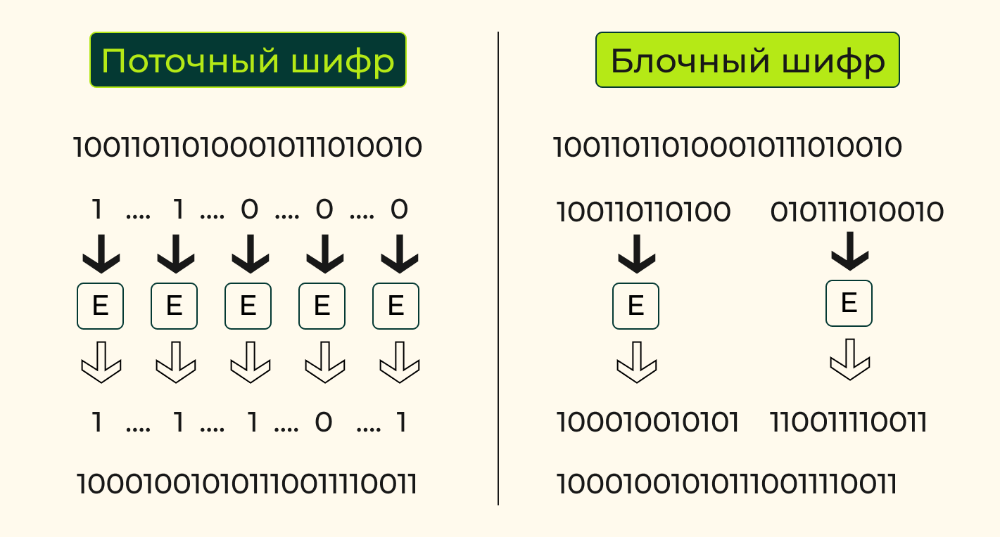
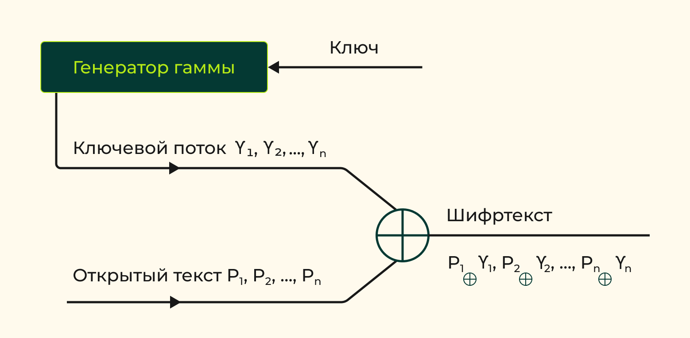
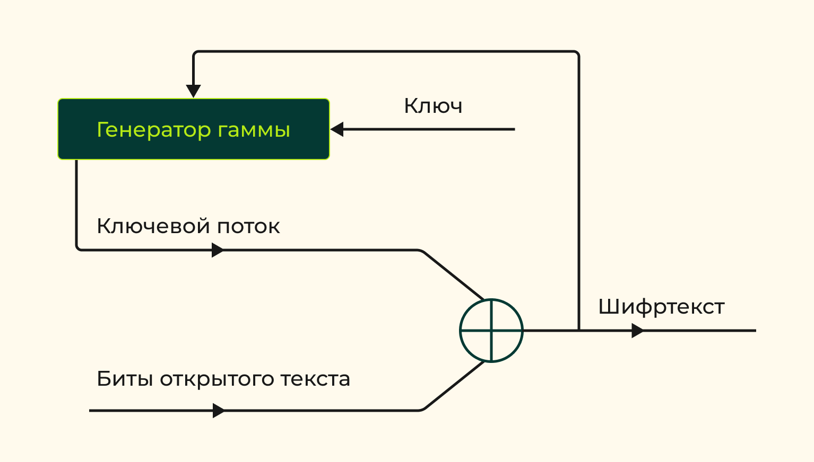
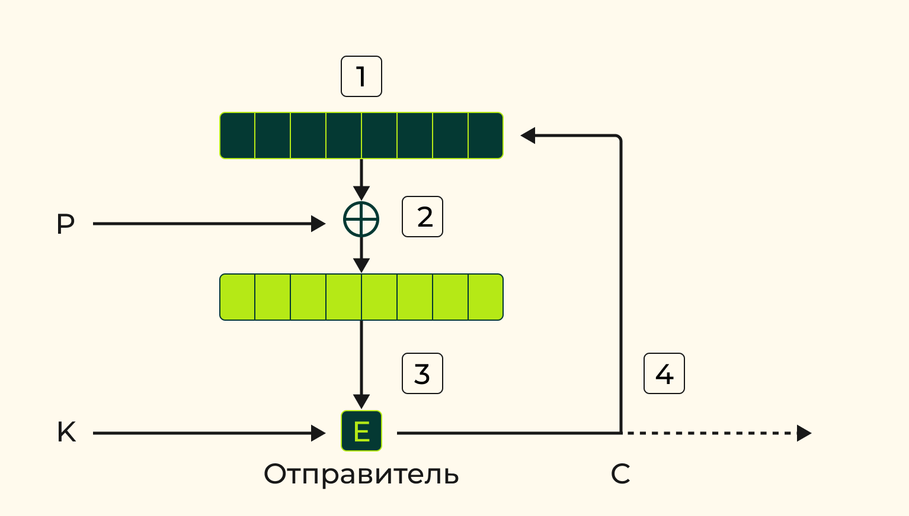
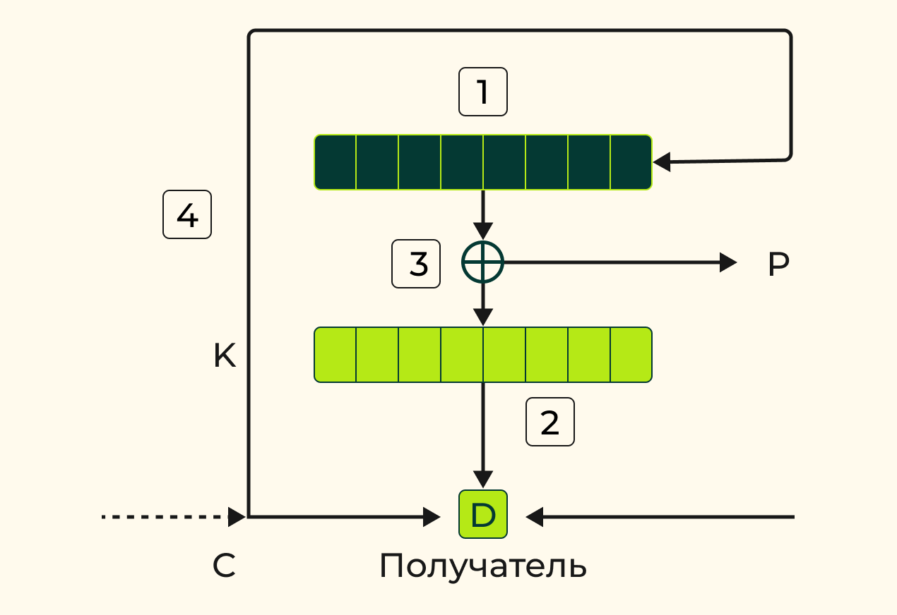
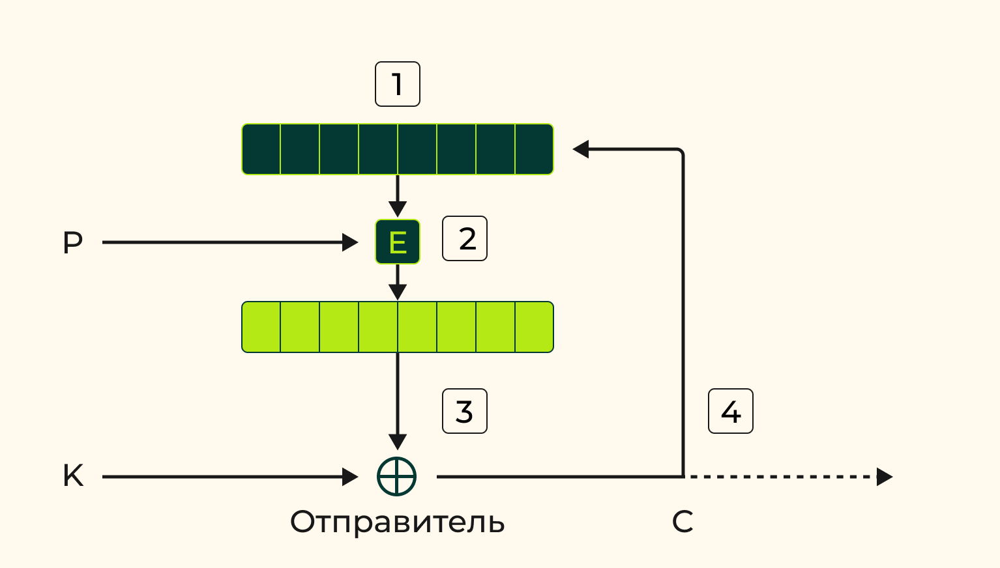
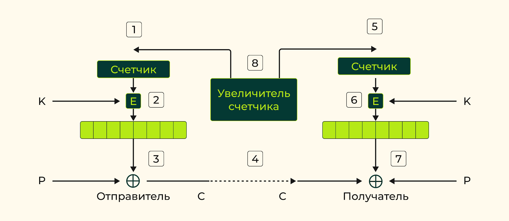

# 1. Общая характеристика

## Основные задачи защиты информации и классификация методов защиты информации

1. Обеспечение надежного хранения сообщений и управление доступом к информации со стороны различных категорий пользователей, в том числе защита от несанкционированного доступа.
1. Обеспечение защиты от искажения сообщений и от ознакомления с ними посторонних лиц или нарушителя при передаче информации между законными пользователями.
> **Законный пользователь** – пользователь, имеющий право выполнять заранее определенные действия с информацией в соответствии с правилами разграничения доступа.
1. Регулирование правовых отношений, связанных с обладанием и использованием информации.

## Классификация методов защиты по решаемым задачам

### 1. Организационно-административные методы

Связаны с обеспечением режима секретности на предприятиях, располагающих ценной информацией, с защитой выделенных зон и помещений от проникновения нарушителя.

### 2. Правовые методы

Предназначены для юридической защиты информации, регулирующей права на собственность, на использование информации и т.д.

### 3. Инженерно-физические методы

Обеспечивают защиту на определенной территориальной зоне или в рабочем помещении от утечки по акустическим и электромагнитным каналам.

Также инженерные методы направлены на разработку:
- устройств-контейнеров для хранения информации, защищенных от несанкционированного проникновения
- технических средств передачи информации, затрудняющих нарушителю схем данных с линии связи.

### 4. Криптографические методы

Основаны на применении математических обратимых функций к хранимой или передаваемой информации с целью существенного изменения исходной формы представления информации.

Многообразие возможных изменений сообщения обеспечивается возможностью выбора функции из большой системы функций, заданных на элементах информации и образующих криптографическую систему. Функции криптосистемы называются криптографическими. Выбор функции криптосистемы для использования при защите конкретных сообщений реализуется как выбор из многих вариантов секретного ключа, параметра криптографической функции. Измененная форма сообщения может быть восстановлена в исходную форму с помощью обратной функции с использованием соответствующего ключа. Защита информации криптографическими методами обеспечивается секретностью ключа.

### 5. Стеганографические методы

Предназначены для сокрытия секретного сообщения, которое может быть зашифровано, внутри несекретного сообщения. При этом за счет избыточности несекретного сообщения его форма не претерпевает явных изменений, что позволяет скрывать факт вложения в него секретного сообщения.

## Современные задачи криптографии

### 1. Обеспечение конфиденциальности информации

защита от несанкционированного ознакомления с содержанием

### 2. Обеспечение целостности информации

защита от несанкционированного изменения информации нарушителем (вставка, удаление, замена фрагментов исходного сообщения)

### 3. Аутентификация информации

подтверждение подлинности участников информационного обмена, содержания сообщения, времени генерации сообщения и т.д.

### 4. Удостоверение авторства

по отношению к сообщению или документу (обеспечение невозможности отказа от авторства или присвоения его)

### 5. Обеспечение неотслеживаемости информации

невозможности получения нарушителем содержательной информации на основе наблюдения за действиями законных пользователей

## Разделы и научные источники криптологии

Криптографические методы защиты информации изучает наука криптология. В современном понимании предметом криптологии являются методы построения и анализа криптографических систем.

> **Криптография** – наука о построении криптографических систем, используемых с целью защиты информации

> **Криптоанализ** – наука о методах анализа криптографических систем, цель анализа – разработка методов раскрытия информации, защищаемой криптосистемой, а также усовершенствование разработанных криптографических систем.

> **Криптология** – самостоятельная наука с особым предметом и методами его исследования. Наука, занимающаяся методами шифрования и дешифровки.

### Математические дисциплины в криптологии

- линейная алгебра
- теория групп и полугрупп
- теория автоматов
- математический анализ
- теория дискретных функций
- теория чисел
- комбинаторный анализ
- теория вероятностей и математическая статистика
- теория кодирования
- теория информации
- теория сложности вычислений
- теория алгоритмов
- др.

### Физические и инженерные науки в криптологии

- теория связи
- теория электромагнитного поля
- квантовая физика
- компьютерные науки
- др.

## Основные понятия криптологии

> **Криптографическая система** применяется для решения задач защиты информации соответствующими участниками информационного обмена или сторонами, при этом устанавливается определенный порядок взаимодействия сторон, называемый криптографическим протоколом.

Семейство криптографических функций в совокупности с используемыми криптографическими протоколами образуют криптографическую систему (криптосистему).

Функции криптосистемы зависят от параметра $k \in K$, называемого **ключом криптосистемы**, где 
```К``` – конечное множество допустимых значений ключа, называемое ключевым множеством криптосистемы.

> **Жизненный цикла ключа** - практиеское применение *криптографического ключа*. Выполнение таких действий с ключом, как генерация, распределение (рассылка) между пользователями, хранение, установка, смена и уничтожение ключей.

> **Ключевые протоколы** - протоколы, управляющие *жизненным циклом ключей*

> **Ключевая подсистема криптосистемы** - совокупность *ключевого множества* и *ключевых протоколов*

### Криптосистемы в зависимости от задач защиты информации

- **cистема шифрования**<br>
Исользуется для обеспечения конфиденциальности информации. Реализует семейство $E$ биективных функций $E_k$, называемое шифром: $E=\{E_k\}, k \in K$
- **система идентификации**<br>
используется для аутентификации сторон протокола
- **система имитозащиты**<br>
используется для аутентификации сообщений
- **система электронной подписи**<br>
для обеспечения неотказуемости от авторства

### Шифры и шифрование

> **Открытый текст** - сообщение, к которому применяется криптографическая функция шифра

> **Шифрование** или **зашифрование** - применение функции шифра к открытому тексту

> **Шированный текст**, **шифртекст** или **криптограмма** - результат зашифрования открытого текста

> **Шифр** $E$ можно рассматривать как семейство отображений $X^{*} \times K \to Y^{*}$, биективных по первой переменной, где $X^{*}$ и $Y^{*}$ – соответственно *множества открытых и шифрованных текстов*.

> **Биективная функция шифра** - обеспечивает возможность восстановления открытого текста по шифрованному тексту

> **Расшифрованием** - применение к криптограмме обратного отображения с использованием известного ключа. При расшифровании реализуется отображением множества $Y^{*} \times K$ в множество $X^{*}$

### Дешифровка и риски

> **Дешифрование** - раскрытие криптоаналитиком информации, защищаемой шифром, ключ расшифрования криптоаналитику неизвестен, т.е. неизвестно, каком именно отображение из семейства $E$ использовано для зашифрования

> **Криптоаналитической атака** - разработанный криптоаналитиком метод раскрытия шифра или информации, защищаемой шифром

> **Криптографическая стойкость** - способность криптосистемы противостоять атакам криптоаналитика. Криптографическая стойкость системы *измеряется вычислительными или временными затратами*, достаточными для ее вскрытия, иногда – *объемом материальных затрат*.

#### Классификация по криптографической стойкости

##### Cистемы временной стойкости

- обеспечивает защиту в рамках заданных временных, вычислительных, материальных и др. затрат на дешифрование

##### Cистемы гарантированной стойкости

- обеспечивают защиту информации в течение длительного времени
- способна реализовать большое количество различных функций
- связывает любую попытку ее взлома с неизбежным решением трудоемкой задачи, не решаемой с использованием самых передовых технологий в течение практически приемлемого временного периода

## Симметричные и асимметричные шифрсистемы

По принципам использования ключей криптосистемы разделяются на:
- системы с секретным ключом (симетричные системы)
- системы с открытым ключом (ассиметричные системы)

> **Симметричные шифрсистемы** - для реализации зашифрования и расшифрования используются одни и те же ключи. Используются в *системах с секретным ключем*.

> **Асимметричные шифрсистемы** - в них ключи зашифрования и расшифрования различны. *Ключ зашифрования* может быть открытым, т.е. известным для всех, но расшифровать сообщение может только обладатель соответствующего *секретного ключа*, который во избежание путаницы с симметричными криптосистемами называется *закрытым*.

| Симметричные | Асимметричные |
| :-- | :-- |
| + более высокая скорость шифрования<br>+ меньшая длина используемого ключа с заданной стойкость<br> + более высокая степень научной обоснованности криптографической стойкости | + заметно расширяющие область применения криптографических методов |

Нередко используются **гибридные криптосистемы**, сочетающие принципиальные преимущества как симметричных, так и асимметричных систем.

## Понятие о криптографических протоколах

> **Криптографический протокол** реализует установленный порядок взаимодействия сторон при выполнении какой-либо криптографической задачи

Протокол реализуется в ходе взаимодействия нескольких субъектов.

Возможны ситуации, когда решение задачи защиты информации ослаблено свойствами протокола, несмотря на применение подходящих криптографических функций.

Каждое **действие криптографического протокола** по содержанию представляет собой либо вычисления, выполняемые пользователями, либо рассылку сообщений между ними.

> **Двусторонние протоколы** - рещение криптографической задачи взаимодействующими пользователи без посредников

> **Трехсторонние протоколы** - рещение криптографической задачи взаимодействующими пользователи с участием посредников

> **Посредник криптографического протокола** - незаинтересованная доверенная стретья сторона в решении криптографической задачи. *Задача* посредника заключается в том, чтобы обеспечить исполнение всех этапов протокола.

> **Арбитр** - посредник особого типа: он не обязательно участвует в исполнении протокола, но может привлекаться для проверки корректности выполнения протокола

> **Cамодостаточные протоколы** - конструкция которых обеспечивает контроль над верным исполнением протокола. Однако такие протоколы имеются далеко не для каждой задачи.

### Типы атак на криптографические протоколы

#### Пассивные атаки

Противник
- ограничивается наблюдением за действиями сторон протокола
- пытается извлечь из наблюдений полезную для себя информацию
- не вмешиваяется в реализацию протокола.

Пример: перехват нарушителем криптограммы на линии связи с целью дешифрования

#### Актиные атаки

- нарушитель допускает видоизменение протокола в своих интересах
    - им вводятся в протокол новые сообщения
    - удаляются из протокола легитимные сообщения
    - производится подмена одних сообщений другими
    - выводится из строя канал связи или память, в которой хранится информация.

## Организация секретной связи

### Секретная связь на основе симметричной шифрсистемы

Легальными действующими лицами таких протоколов секретной связи являются:
- отправитель
- адресат или адресаты
- посредник, обеспечивающий пользователей ключами

**Задача протокола**: передать секретное сообщение x от отправителя адресату

#### Последовательность действий

1. Отправитель и адресат договариваются об используемой симметричной шифрсистеме, т.е. о семействе отображений $E = \{ E_k\}, k \in K$.
1. Отправитель и адресат договариваются о секретном ключе $k$ , т.е. об используемом отображении $E_k \in E$.
1. Отправитель зашифровывает открытый текст $x$  с помощью отображения $\{E_k\}$, т.е. создает криптограмму $y = E_{k} (x)$.
1. Криптограмма у передается по линии связи адресату.
1. Адресат расшифровывает криптограмму $у$ , используя тот же ключ $k$ и отображение $ E^{-1}_{k} $, обратное отображению $E_k$ и читает сообщение $x : x = E^{-1}_{k} (y)$.

#### Схема секретной связи двух абонентов с использованием симметричной криптосистемы


Шаг 2 протокола выполняется с помощью посредника, третьей стороны, называемой центром генерации и распределения ключей (ЦГРК).

Cекретность ключа $k$, который <ins>передается</ins> отправителю и адресату либо <ins>в открытом виде по каналу связи, защищенному от действий криптоаналитика, либо в шифрованном виде по линии связи</ins>.

Ключ $k$ должен оставаться в секрете до, во время и после реализации протокола

Рассмотренный протокол подразумевает взаимное доверие отправителя, адресата и третьей стороны в лице центра генерации и распределения ключей.

### Выводы

1. Протокол должен защищать открытый текст и ключ от несанкционированного доступа постороннего лица на всех этапах передачи информации от отправителя к адресату. Секретность ключа более важна, чем секретность нескольких сообщений, шифруемых на этом ключе. Если ключ скомпрометирован, т.к. его узнал нарушитель, то последний, имея ключ, может расшифровать все зашифрованные на этом ключе сообщения. Кроме того, нарушитель сможет имитировать одну из участвующих в протоколе сторон и генерировать фальшивые сообщения с целью введения в заблуждения другую сторону. При частой смене ключей эта проблема практически решается.
1. Протокол не должен допускать выхода в линию связи лишней информации, предоставляющей криптоаналитику противника дополнительные возможности дешифрования криптограмм. Протокол ложен защищать информацию не только от посторонних лиц, но и от взаимного обмана действующих лиц протокола.
1. Если допустить, что каждая пара пользователей сети связи использует отдельный ключ, то количество необходимых ключей равно $n(n-1)/2$ для $n$ пользователей. Это означает, что при большом  генерация, хранение и распределение ключей становится трудоемкой проблемой.

### Секретная связь на основе асимметричной шифрсистемы

#### Последовательность действий протокола секретной связи

1. Отправитель и адресат договариваются об используемой асимметричной криптосистеме.
1. Адресат высылает отправителю открытый ключ $k$.
1. Отправитель шифрует открытый текст $x$ с помощью открытого ключа $k$ , т.е. создает криптограмму $y = E_{k} (x)$.
1. Криптограмма у передается по линии связи адресату.
1. Адресат расшифровывает криптограмму $у$, используя закрытый ключ $z$, и читает сообщение $x: x= E_{z} (y)$.

Протокол защищает сообщение $х$ от несанкционированного прочтения
- пассивный нарушитель может перехватить открытый ключ $k$ и криптограмму $y$
- но не может расшифровать сообщение, т.к. не имеет закрытого ключа $z$

#### + и - протокола

<span style="color: green">Достоинством протокола является то, что распределение открытых ключей не требует секретности.</span>

<span style="color: red">Ничто не помешает нарушителю в рамках данного протокола использовать доступный открытый ключ ```k``` для генерации ложного сообщения с целью навязывания его адресату.</span>

Как правило, они используются для шифрования не самих сообщений, а ключей или вспомогательных информационных блоков относительно небольшой длины. Это вызвано следующими обстоятельствами
1. Скорость шифрования асимметричных алгоритмов примерно в тысячу раз уступает скорости симметричных алгоритмов, что ставит их в невыгодное положение при использовании для шифрования больших объемов данных.
1. Криптосистемы с открытым ключом уязвимы к атакам на основе подобранного открытого текста, особенно когда число вариантов блока открытого текста ограничено и допустим перебор этих вариантов.

## Обеспечение целостности сообщений

Одним из центральных понятий криптографии с открытым ключом является однонаправленная функция, т.е. функция $f$ , значение $f(x)$ которой легко вычисляется для любого аргумента $x$ из области определения, а вычисление по значению $f(x)$ его прообраза $x$ трудоемко.

Однонаправленная функция с ключом зависит не только от $х$, но и от некоторого параметра $k$. Вычисление прообраза по значению такой функции может быть реализовано легко лишь при известном параметре $k$.

> **Хэш-функция** - отображение последовательностей различной длины в последовательности фиксированной длины.

Хэш-функции используются в криптографии для проверки идентичности двух последовательностей путем сравнения их значений

Если требуется проверить наличие какого-либо файла, имеющегося у определенного пользователя, то достаточно получить его хэш-значение и сравнить его с хэш-значением, вычисленным пользователем. Если нужно, чтобы проверка была доступна только определенному лицу, можно использовать хэш-функцию с ключом.

# 2. Криптографические ключи

## Строение и порядок ключевого множества

В качестве ключа могут использоваться:
- часть входных данных отображений шифра
- либо функциональные элементы, использованные при построении отображений шифра
- сочетание множеств указанных типов

> **Ключевое множество** - всевозможные допустимые значения ключа

Некоторые ключевые множества неоднородны, обладают определенными структурным свойствами. Например, ключевое множество может состоять из комбинаций двух множеств: множество сеансовых или разовых ключей, т.е. ключей, действующих в течение одного сеанса связи, и множеств долговременных ключей, т.е. ключей, действующих в течение длительного периода времени.

### Разделение множества ключей по функциональному назначению

- сеансовые ключи (для шифрования сообщений)
- ключи пересылки (для шифрования сеансовых ключей)
- главные ключи (для хранения в зашифрованном виде ключей пересылки)
- и т.д.

### Характеристики

- **порядок ключевого множества** - количество различных ключей, образующих ключевое множество
- **размер ключа** - длина слова в некотором алфавите, кодирующего значение ключа

Порядок ключевого множества непосредственно связан с размером образующих его ключей

Размер ключа должен быть достаточно велик, чтобы вскрытие шифра в приемлемое время с помощью перебора всех ключей было для противника непосильно, например

С другой стороны, завышенный размер ключа может негативно сказаться на удобстве, надежности и стоимости работы с ключами шифра.

## Вероятностная модель ключевого множества

- используется криптоаналитиком для анализа статистических свойств криптосистемы
- определяется, в частности, заданием вероятностного распределения на ключевом множестве, которое рассматривается как пространство элементарных событий
- Каждому ключу $k \in K$, ставится в соответствие вероятность $p_k$ использования соответствующей криптографической функции для зашифрования какого-то конкретного, либо случайного открытого текста. При этом $\sum_{k \in K} p_{k} = 1$.

### Статистические свойства ключей для шифрования

- обычно ключи для шифрования выбираются независимо от открытых текстов

1. Для очередного периода эксплуатации (сеанса, суток и т.д.) каждый ключ выбирается случайно равновероятно из ключевого множества $К$, т.е. $p_{k}= 1/ | K |$ для любого $k \in K$.
1. При смене ключей новый ключ выбирается независимо от предыдущих.

## Генерация ключей

Важнейшей характеристикой ключа является его случайность
- наличие закономерностей как в отдельном ключе, так и в ключевом массиве приводит к неявному уменьшению порядка ключевого множества
- использование в качестве ключей осмысленных слов и выражений также приводит к сокращению порядка ключевого множества

Хорошие ключи симметричных криптосистем можно получить
- последовательностей физических генераторов идеальных случайных последовательностей
- последовательностей программных генераторов псевдослучайных последовательностей

На практике исследование свойств псевдослучайной последовательности выполняется с помощью статистического тестирования ее отрезков различной длины

Идеальная случайная последовательность является реализацией последовательности независимых случайных величин, имеющих равномерное распределение вероятностей на заданном конечном алфавите.

Генерация ключей для асимметричных криптосистем является более сложной процедурой, так как ключи должны иметь определенные теоретико-числовые свойства.

## Обеспечение секретности ключей

Для обеспечения секретности ключей на различных этапах жизненного цикла применяются следующие организационные и технические меры:

- Ограничение круга пользователей, допущенных к работе с ключами.
- Регламентация распределения, хранения и уничтожения ключей.
- Регламентация порядка смены ключей.
- Применение технических средств защиты ключевой информации от несанкционированного доступа.

## Схемы разделения секрета

> это способ распределения долей секретной информации между несколькими пользователями, при котором знание каким-либо лицом любой из долей секрета не позволяет ему восстановить секрет проще, чем перебором всевозможных значений секрета, а совокупность всех долей позволяет однозначно вычислить секрет.

- используется в криптографических приложениях, в частности, для распределения ключей

Пусть секретом является $n$-битовый ключ $x$. Простейшая схема разделения такого секрета между $m$ пользователями заключается в распределении между ними таких двоичных $n$-мерных векторов $x_{1}...x_{m}$, при которых $x_{1}\oplus...\oplus x_{m}$.

**Недостаток** простейшей схемы разделения секрета заключается в ее **невысокой надежности**. Если доля одного из пользователей утрачена, то секрет невозможно восстановить.

> **Пороговая схема разделения секрета $( n,t )$**:  $1 < t \leq n$, по определению обладает свойством: $\forall$ группа из $t$ пользователей может однозначно восстановить секрет, а всякая группа из меньшего числа пользователей восстановить секрет не может.

### Пример: схема Шамира

Секретом является свободный член $a_0$ заранее выбранного многочлена $f (x)$ степени $t-1$ над конечным полем $P$ большого порядка: $f(x) = \sum_{i=0}^{t-1} a_{i}x^{i}$

Выберем для $n$ пользователей соответственно $n$ различных несекретных элементов $r_{1}+...+r_{n}$ поля $Р$, отличных от нуля

Вычислим для выбранного многочлена $f(x)$ значения $f(r_i)$ и распределим их между пользователями в качестве долей секрета наборы вида
$\big( r_{i}, f(r_{i}) \big) , i = 1,...,n$.

#### Восстановления секрета: интерполяционной формулой Лагранжа

Согласно формуле многочлен $f(x)$ степени $t-1$ при любых $t$ парах вида $\big( s_{i},f(s_{i}) \big), i=1,...,t$, где $s_{i},...,s_{t}$ – попарно различные элементы поля $Р$, удовлетворяют соотношению

$f(x) = \sum_{i=1}^{t} f(s_{i}) \bullet \prod_{i \neq j} \frac{x-s_{j}}{s_{i}-s_{j}}$

Т.к. $a_{0} = f(0) \implies$

$a_{0} = \sum_{i=1}^{t} f(s_{i}) \bullet \prod_{i \neq j} \frac{s_{j}}{s_{i}-s_{j}}$

Числа $\prod_{i \neq j} \frac{s_{j}}{s_{i}-s_{j}}$ известны и не зависят от характеристик многочлена $f(x)$

С помощью последней формулы любая группа из ```t``` пользователей может восстановить секрет.

#### Изменение числа пользователей

Легко: добавить к элементам $r_{1}+...+r_{n}$ поля $Р$ новые элементы.

#### Компрометация долей секрета

При компрометации ```m``` долей секрета:
 $1\leqslant m<t-1$-пороговая схема Шамира преобразуется в $(n-m,t-m)$-пороговую схему.

## Протоколы обмена ключами

Традиционный способ рассылки ключей симметричной криптосистемы состоит в использовании курьерской службы - <span style="color:red">трудоемок и дорогостоящ</span>.

Альтернативные варианты:
- надежный защищенный канал связи
- несколько параллельных каналов связи и схему разделения секрета
- <span style="color:green">передача ключа в зашифрованном виде при условии, что обеспечена секретность ключа пересылки</span>
- др.

**При передаче в электронном виде ключи иногда искажаются**, что приводит к невозможности их использования. Для обнаружения искажения передаваемого ключа можно *применить предварительное шифрование этим ключом некоторой константы и передачу вместе с ключом нескольких байтов полученной криптограммы*.

## Хранение ключей

Обеспечение секретности ключа при хранении

1. Ключ хранится **вне компьютера и шифратора** и каждый раз вводится пользователем через клавиатуру, при этом ответственность за обеспечение секретности ключа и точность его ввода возлагается на пользователя.
1. Ключ, **записанный на съемном носителе**, передается в компьютер или шифратор через считывающее устройство, при этом ограничен доступ пользователя к ключу и, следовательно, возможность компрометации ключа.
1. Секретный ключ **разделяется на две части, одна - в компьютере, другая на съемном носителе**, что исключает компрометацию ключа при компрометации одной из его частей.
1. Ключ ```k```  **хранится в памяти компьютера в зашифрованном виде** и непосредственно перед использованием расшифровывается, при этом секретность ключа, с помощью которого зашифрован ключ ```k```, обеспечивается одним из трех описанных выше способов.

Отметим удобство **сеансового ключа**, состоящее в отсутствии необходимости его хранить после использования. Если сеансовый ключ генерируется непосредственно перед сеансом, то проблема хранения отсутствует полностью.

## Смена ключей

**Обновление ключа** - новый ключ $k_{i+1}$ генерируют из предыдущего ключа $k_{i}$, выполняя вычисления с помощью однонаправленной функции $f:k_{i+1}=f(k_{i}),\:i=1,2,...$

Секретность обновленного ключа зависит от секретности предыдущих ключей.

- В случае компрометации ключа необходимо незамедлительно провести его смену и перейти к использованию нового ключа
- Компрометация закрытого ключа асимметричной криптосистемы ставит под сомнение законность всех договоров и сделок, заключенных с использованием этого ключа
- Время жизни ключа должно быть ограничено
- Уничтожение ключей должно носить необратимый характер, чтобы полностью исключить возможность восстановления ключей

## Предварительное распределение ключей

- сеть с ```n``` пользователями
- каждая пара пользователей использует независимые 

### Матрица ключей

Ключевую систему такой сети характеризует матрица ключей

$K_{n}=(k_{is});i,s\in \left\{1,...,n \right\}$

$k_{ij}$ – ключ для связи i-го и j-го пользователя

$i \neq j, k_{ii} = 0$

Пользователю ```i``` для связи с остальными пользователями нужно хранить ```n-1``` ключей (из i-го столбца матрицы)

Всего используется ```n(n-1)/2``` ключей.

Для уменьшения объема хранимой информации применяются **схемы предварительного распределения секретных ключей** в сети связи.

> Распределяются не сами ключи, а некоторая информация, с использованием которой пользователи могут самостоятельно вычислить необходимый ключ по заранее оговоренной процедуре.

### Пример: схема Блома предварительного распределения ключей

- ```Р``` – конечное поле большого порядка
- Зафиксируем ```n``` элементов $r_{1},...,r_{n}$ поля ```Р```, соответствующих ```n``` пользователям сети
- *Эти числа не являются секретными* и хранятся на общедоступном сервере
- *Секретным является симметричный многочлен f(x,y)* над полем ```Р```  степени $1\leqslant m<n$, (т.е. $a_{ij}=a_{ji}$ при $i \neq j$): $f(x,y)=\sum_{i=0}^{m}\sum_{j=0}^{m}a_{ij}x_{i}y_{j}$
- Коэффициенты многочлена ```f(x,y)``` хранятся в центре распределения ключей

Каждый пользователь ```А``` получает в качестве ключевых материалов набор коэффициентов $(a_{0}^{A},a_{1}^{A},...,a_{m}^{A})$ для многочлена $f(x,r_{A})=a_{0}^{A}+a_{1}^{A}x+...a_{m}^{A}x^{m}$

Для связи пользователей ```A``` и ```B``` используется ключ $f(r_{A},r_{B})$
- вычисляется по известным $r_{1},...,r_{n}$

#### Вывод

- позволяет каждому пользователю хранить ```m+1``` секретных значений вместо ```n-1```
- общее число секретных коэффициентов многочлена ```f(x)``` равно ```m(m+1)/2```
- выдерживает компрометацию всех ключей любых ```m``` пользователей.

## Стойкость к компрометации и архитектура ключевых систем

> **Cистема активных ключей криптосистемы (Q)** - выборка из ключевого множества ```К``` обеспечивающая функционирование криптосистемы в полном объеме <ins>в данный момент или период времени</ins>

> **Порядок ключевой подсистемы криптосистемы** - размер выборки ```Q```, для всех моментов времени порядок ключевой системы одинаков.

Хар-ка ключевой системы: поддерживать криптографическую защиту информации при компрометации подсистемы $Q'\subset Q$ активных ключей

> **Ключевая система** порядка ```n``` называется **стойкой к r-компрометациям**, где ```r < n```, если компрометация любого подмножества порядка ```r``` в ```n```-множестве активных ключей не упрощает задачу криптоаналитика определения остальных ```n-r``` активных ключей

Всякая ключевая система предназначена для поддержания криптографической защиты информации в некоторой сети связи

### Пример: ключевая система 1 порядка

*Дано*:
- Сеть связи от руководителя ```A``` пользователям ```B,C...```
- ```n = 1``` - порядок клбчевой системы
- Используется для передачи казаний и распоряжений
- $k$ - общий ключ
- ```Криптоаналитик``` - имеет доступ в сеть

*Ход работы*

1. Руководитель ```A``` зашифровывает сообщение ```x``` на ключе ```k```
1. Отправляет каждому подчиненному по одному экземпляру шифрованного сообщения $E_{k}(x)$
1. ```Криптоаналитик``` перехватывает *криптограммы*
    - информации столько же, сколько при контроле линии связи $A \to B$

*Выводы*

- <span style="color:red">В такой сети ключевая **система любого порядка не стойка** к единственной компрометации</span>
- <span style="color:red">самый слабый способ с точки зрения стойкости к компрометациям, скомпроментирован один ключ - скомпроментированны все</span>
- Если ```A``` использует различные ключи (```n > 1```), то материал перехваченный на всех линиях криптоаналитиком, *содержит больше ценной для дешифрования информации*.
- ```n=1``` - самый дешевый и простой способ с точки зрения изготовления, распределения и смены ключей

### Общепринятый подход к порядку ключевых систем

- ```n``` - количество пользователей
- общающихся по принципу «каждый с каждым»

Используется ключевая система порядка $n(n-1)/2$

Различные пары пользователей используются независимые ключи

**Представление множества симметричных ключей**:

- матрица: $Q=(q_{ij})$
- $q_{ij}=q_{ji}$ - ключ для связи i-го и j-го пользователей, $1\leqslant i<j\leqslant n$
- элементы главной диагонали – нули

<span style="color:green">Имеет наилучшую стойкость к компрометациям</span>

Допускается компроментация ключей ```n-2``` пользователей

### Минимизация порядка ключевой системы: иеархия пользователей

- ```n``` пользователей разделены на ```m``` зон
- каждая зона имеет руководителя
- внутри зоны связь «каждый с каждым»
- руководители в отдельной сети, связь «каждый с каждым»
- пользователи разных зон общаются через руководителей
- руководители - выполняют функции *центра генерации и распределения ключей*
- каждый пользователь хранит ключи только своей зоны: ```n\m```ключей
- руководители дополнительно хранят ```m``` ключей руководящей сети

Самый эффективный, но и самый дорогостоящий способ защиты данных при передаче в сетях заключается в сочетании методов канального и абонентского шифрования.

## Особенности ключевых систем

- Не так важна передача сообщения, как его хранение -> необходимо предусмотреть механизмы защиты хранимых шифрованных сообщений от внесения неустранимых искажений
- После передачи криптограммы ключ не требуется хранить долго
- Если часть сообщения хранится в незашифрованном виде, то у криптоаналитика имеется возможность решать задачу определения ключа по открытому и шифрованному тексту
- Управление ключами в базе сложнее, чем в сетях связи
- При хранении данных на жестком диске использовать единственный ключ для зашифрования - плохо
    - невозможно обеспечить разграничение доступа
    - большой объем данных, зашифрованных на единственном ключе для анализа

### Решение проблемы защиты данных на диске: иерархическая ключевая система

- ```n``` пользователей диска
- зашифрованны ```m``` файлов
- независимые файловые ключи: $q_{1},…,q_{m}$

$Q=\left\{ q_{1},…,q_{m} \right\}$

$Q_{i}\subseteq Q , i=1,…,n$ - подмножество файловых ключей, известное -му пользователю в соответствии с его полномочиями

Защита и разграничение доступа множества ключей $Q_{i}$ обеспечивается с помощью секретного ключа i-го пользователя

# 3. Симметричное шифрование

## Классификация симметричных алгоритмов шифрования

будем считать, что симметричный алгоритм шифрования преобразует двоичные строки

> **Поточное шифрование**
>
> Алгоритм обрабатывает один бит открытого текста и на выходе выдаёт один бит зашифрованного текста.

> **Блочное шифрование**
>
> На вход принимается блок битов открытого текста, а выходом становится блок битов зашифрованного текста. Количество битов в обработке обычно является фиксированным числом и называется размером блока шифра.



Однако такое деление весьма условно по нескольким причинам:

1. Поточные шифры можно рассматривать как блочные шифры с размером блока, равным единице.
1. Некоторые симметричные алгоритмы шифрования, которые обычно считаются поточными шифрами, фактически обрабатывают данные в байтах. Следовательно, они могут рассматриваться как блочные шифры с размером, равным 8 битам.
1. Блочные шифры часто используют в режимах работы, которые эффективно преобразуют их в поточные шифры. Например, блочный шифр может применяться для генерации управляющей гаммы: её используют для шифрования данных с помощью простого поточного шифрования.

## Поточные шифры



Шифрование и расшифрование выполняются с помощью операции **«исключающее ИЛИ»**

Похож на шифр Вернама или схему одноразового блокнота, в котором для получения шифртекста открытый текст складывается с ключом по модулю два.

### Важные свойства ключа
1. Быть истинно случайным.
1. Совпадать по размеру с заданным открытым текстом.
1. Применяться только один раз.

В поточном шифре обычно использует ключ, который намного короче длины открытого текста

> **Гамма** - поток битов, который получается преобразованием короткого ключа, и накладывается на исходную последовательность при помощи определённой функции, например, «исключающего ИЛИ».

### Для расшифрования зашифрованного текста

Необходимо иметь:
- тем же коротким ключом
- тем же генератором гаммы

Шифр Вернама можно рассматривать как поточный шифр, в котором ключ генерируется истинно случайным образом.

### Особенности ключей поточных шифров

1. **Длина ключа**. Хотя в поточных шифрах используются ключи намного короче открытого текста, ключевой поток, полученный из этих ключей, должен быть такой же длины, что и открытый текст.
1. **Псевдослучайный характер ключей**. С одной стороны, это удешевляет и упрощает процесс генерации ключей, с другой**
>
> влияет на стойкость криптографической системы.
1. **Одноразовое использование ключей**. Гамма генерируется при помощи детерминированного процесса, то есть при подаче на вход генератора гаммы одного и того же ключа, на выходе получают точно такой же ключевой поток.

### Повторное использование ключа поточного шифра

<span style="color:red">различия между двумя зашифрованными текстами покажут различия между двумя соответствующими открытыми текстами</span>

Этого можно избежать с помощью одного из следующих действий или их комбинаций
1. Использовать ключ поточного шифрования только один раз.
1. Никогда повторно не использовать одну и ту же часть управляющей гаммы.
1. Вместо того, чтобы использовать начальный ключ, можно получать уникальный ключ из начального ключа каждый раз, когда используется поточный шифр. Например, использовать временные данные при получении уникального ключа.
1. Использовать более сложную функцию для выработки шифртекста.

Управление ключами для поточных шифров**
>
> как и в любых симметричных криптографических примитивах**
>
> происходит с помощью относительно коротких симметричных ключей

### Ошибки

> **Ошибки передачи**
>
> это ошибки, которые происходят в канале связи. Однобитная ошибка передачи возникает, если в канале связи при передаче данных *0 становится 1 или 1 становится 0*.

> **Ошибки потери передачи**
>
> возникают, когда *бит теряется в канале связи*. Однобитная потеря передачи происходит, если один бит данных теряется в канале связи, но предыдущие и последующие биты принимаются правильно.

> **Вычислительные ошибки**
>
> это ошибки, которые происходят во время криптографического вычисления. Одноразрядная вычислительная ошибка возникает, если результат вычисления приводит к некорректному выходному биту.

Чаще всего встречаются ошибки передачи и потери.

### Примечательные свойства, позволяеющие использовать их во многих важных приложениях

#### 1. Отсутствие распространения ошибок

Поскольку поточные шифры оперируют с открытым текстом побитово

однобитовая ошибка передачи приведёт только к однобитовой ошибке в шифрованном тексте.

-> часто применяют в случаях, когда канал связи имеет низкое качество и ошибки неизбежны, например в системах мобильной связи.

#### 2. Скорость и простота реализации

Простой процесс шифрования позволяет
- легко реализовать поточные шифры
- высокая скорость обработки данных.

-> пригодны для применения в приложениях, например в сфере мобильной связи.

#### 3. Шифрование «на лету»

Побитовое шифрование означает, что большие фрагменты открытого текста не ожидают обработки долго. Следовательно, поточные шифры могут быть использованы в таких приложениях, как доверенные терминалы, где требуется немедленная защита отдельных нажатий клавиш.

#### 4. Эффективность реализации

Некоторые поточные шифры имеют чрезвычайно простую аппаратную реализацию, что позволяет достигать высоких скоростей шифрования.

### Недостатки

- Необходимо синхронизировать данные отправителя и получателя из-за побитовой обработки информации
- Результат однобитовой потери данных при передаче критичен
- Необходимо периодически пересинхронизировать ключевой поток

#### Синхронизация

1. **Повторный пересчёт ключевого потока с использованием нового ключа**.<br>Можно выполнять либо через фиксированные периоды времени, либо после отправки специальной последовательности, указывающей на повторную синхронизацию.
1. **Повторная непрерывная синхронизация**.<br>В этом случае ключевой поток зависит не только от ключа, но и от нескольких последних битов зашифрованного текста (рис. 3). Предположим, что обратная связь включает в себя m битов шифрованного текста. Если получатель временно потеряет синхронизацию, восстановление возможно при условии, что он затем получит m последовательных правильных битов зашифрованного текста. Такой тип поточных шифров называется **самосинхронизирующимся**. Отметим, что, обратная связь может привести к небольшой степени распространения ошибок.



## Блочные шифры


*Рис. 4. Модель блочного шифра*

Если размер блока слишком мал, злоумышленник может обнаружить блоки открытого текста, соответствующие некоторым зашифрованного текста.

Тогда можно провести атаку по словарю, сгенерировать пары открытого текста и шифрованного текста, полученные на одном и том же ключе.

Чем больше размер блока, тем сложнее осуществить подобную атаку.

Размер блока слишком велик -> блочный шифр перестаёт быть эффективным

Рекомендуют выбирать размер блока кратный ```8, 16, 32 или 64```

### Часто встречающиеся свойства блочных шифров

#### 1. Многофункциональность

Блочные шифры используются не только для шифрования, но и в качестве составляющих других криптографических примитивов. Например, кодов аутентификации или хэш-функций.

#### 2. Совместимость

Стойкие блочные шифры — наиболее широко используемые алгоритмы шифрования. Их применяют во многих приложениях, что позволяет говорить об их совместимости.

#### 3. Адаптивность

Блочные шифры могут быть реализованы в разных режимах работы, о них мы поговорим далее. Благодаря адаптивности их используют для достижения различных целей защиты информации.

### Недостатки

#### 1. Распространение ошибок

Если блочный шифр построен по схеме, приведённой на рис. 4:
- ошибка передачи в один бит изменяет только один бит блока шифрованного текста.
- результат расшифрования этого ошибочного блока будет содержать примерно половину ошибочных битов.

#### 2. Необходимость дополнения

Блочные шифры оперируют фиксированными размерами блоков, но длина открытого текста может быть не кратна размеру блока.

-> последняя группа битов должна быть дополнена избыточной информацией до длины, кратной длине блока

В некоторых случаях есть вероятность, что это повлияет на безопасность схемы.

## Режимы работы блочных шифров

### Режим простой замены (электронной кодовой книги)

1. Последовательно беруться блоки текста
1. Каждый блок шифруется своим ключем
1. Получаем блоки шифрованного текста

После определения ключа шифрование проводится с помощью огромной кодовой книги. Сверяясь с ней, устанавливают соответствие между блоками открытого и зашифрованного текстов.

- редко используется для шифрования длинных открытых текстов, состоящих из большого количества блоков.
- Подвержен статистическим атакам
    - эффективны, если шифр регулярно используется для шифрования небольшого набора открытых текстов
    - большие размеры блоков желательны для защиты от атак по словарю
- использования одного и того же ключа -> одинаковые блоки открытого текста всегда преобразуются в одинаковые блоки шифрованного текста

### Режим сцепления блоков

-  каждый блок зашифрованного текста отправляется получателю
- одновременно подаётся на вход операции шифрования для последующего блока открытого текста
- блоки зашифрованного текста вычислительно «соединены» вместе

#### Зашифрование



- ```E``` -  представляет алгоритм блочного шифрования
- два ряда ячеек — временные регистры длины блока
- регистры содержат промежуточные значения, необходимые для выполнения шифрования


1. Сначала заполняют верхний регистр<br>его содержимое называют **вектором инициализации**. Он должен быть известен отправителю и получателю, согласовать его они могут и по открытому каналу связи. Как правило, вектор инициализации выбирается случайным образом и используется однократно.
1. Берут первый блок открытого текста $P_1$ и содержимое верхнего регистра. К ним применяют операцию «исключающее ИЛИ» и результат помещают в нижний регистр.
1. Содержимое нижнего регистра и ключ подают на вход алгоритму шифрования, в результате чего получается первый блок шифрованного текста $C_1$. Он отправляется получателю и помещается в верхний регистр.
1. Вышеописанные операции повторяют до тех пор, пока не будет обработан последний блок открытого текста.

- использование одного и того же ключа в режиме сцепления блоков не приводит к появлению одинаковых блоков шифрованного текста

#### Расшифрование



1. Согласованный вектор инициализации помещают в верхний регистр.
1. Первый блок зашифрованного текста $C_1$ расшифровывают на соответствующем ключе и помещают в нижний регистр.
1. Содержимое обоих регистров подвергают операции «исключающее ИЛИ». Результат —  $P_1$, первый блок открытого текста.
1. Содержимое верхнего регистра заменяют на $C_1$ и повторяют операцию.

### Режим обратной связи

> альтернативный способ обеспечения зависимости от сообщений

#### Зашифрование



1. Вектор инициализации помещают в верхний регистр. Как и в режиме сцепления блоков, он должен быть известен отправителю и получателю.
1. Содержимое верхнего регистра зашифровывают на соответствующем ключе и помещают в нижний регистр.
1. Первый блок открытого текста $P_1$ и содержимое нижнего регистра подвергают операции «исключающее ИЛИ». Результат — $C_1$, первый блок шифрованного текста.
1. $C_1$ отправляют получателю и помещают в верхний регистр. Указанные операции повторяются.

#### Расшифрования

> для расшифрования используется операция зашифрования

### Режим счётчика

> модификацию режима обратной связи

- отправитель и получатель должны иметь доступ к надёжному **счётчику**
    - вычисляет новое общее значение каждый раз при обмене блоком зашифрованного текста
    - не обязательно является секретным значением
    - должен быть 
    
#### Зашифрование



1. Начальным значением в верхнем регистре является начальное значение счётчика. Это значение одинаково для отправителя и получателя и играет ту же роль, что и вектор инициализации.
1. Значение счётчика зашифровывают с помощью ключа и помещают в нижний регистр.
1. Операцию «исключающее ИЛИ» применяют к первому блоку открытого текста $P_1$ и к содержимому нижнего регистра. Результат — $C_1$, первый блок шифрованного текста.
1. $C_1$ отправляют получателю и обновляют счётчик. Далее операции повторяются.

#### Расшифрования

> Расшифрование выполняется аналогично зашифрованию.

## Блочный шифр: Алгоритм Кузнечика

[ГОСТ Р 34.12-2015](https://protect.gost.ru/document.aspx?control=7&id=200990)

Подробнее:
- [https://habr.com/ru/articles/459004/](https://habr.com/ru/articles/459004/)
- [https://xakep.ru/2017/02/02/working-with-grasshopper/](https://xakep.ru/2017/02/02/working-with-grasshopper/)

Основу алгоритма составляет SP — **Substitution-Permutation network** (подстановочно-перестановочная сеть). Шифр на основе SP-сети получает на вход блок и ключ и совершает несколько чередующихся раундов, состоящих из стадий подстановки и стадий перестановки.

В «Кузнечике» каждый раунд включает в себя линейное и нелинейное преобразование плюс операцию наложения так называемого итерационного ключа.

9 полных раундов и 10й раунд только налодение последнего (итерационного) ключа

## Блочный шифр: Алгоритм Магма

[ГОСТ Р 34.12-2015](https://protect.gost.ru/document.aspx?control=7&id=200990)

Подробнее:
- [Слайды MathNet](https://www.mathnet.ru/php/getFT.phtml?jrnid=izkab&paperid=76&what=fullt#:~:text=%D0%9C%D0%B0%D0%B3%D0%BC%D0%B0%20%D0%BF%D1%80%D0%B5%D0%B4%D1%81%D1%82%D0%B0%D0%B2%D0%BB%D1%8F%D0%B5%D1%82%20%D1%81%D0%BE%D0%B1%D0%BE%D0%B9%20%D0%B0%D0%BB%D0%B3%D0%BE%D1%80%D0%B8%D1%82%D0%BC%20%D1%88%D0%B8%D1%84%D1%80%D0%BE%D0%B2%D0%B0%D0%BD%D0%B8%D1%8F,%D1%88%D0%B8%D1%84%D1%80%D0%BE%D0%B2%D0%B0%D0%BD%D0%B8%D1%8F%20%D0%9C%D0%B0%D0%B3%D0%BC%D0%B0%20%D1%8F%D0%B2%D0%BB%D1%8F%D0%B5%D1%82%D1%81%D1%8F%20%D1%81%D0%B5%D1%82%D1%8C%20%D0%A4%D0%B5%D0%B9%D1%81%D1%82%D0%B5%D0%BB%D1%8F.)
- [https://spy-soft.net/magma-encryption/](https://spy-soft.net/magma-encryption/)

Симметричный блочный шифр с блоком 64 бита

В описываемом алгоритме блок, подлежащий зашифровыванию (64 бита), разделяется на две равные по длине (32 бита) части — правую и левую. Далее выполняется 32 итерации с использованием итерационных ключей, получаемых из исходного 256-битного ключа шифрования.

# Список литературы

1. Погорелов, Б.А. Словарь криптографических терминов [Текст] / Под ред. Б.А. Погорелова, В.Н. Сачкова. — М.: МЦНМО, 2006. — 94 с.
1. Шнайер, Б. Прикладная криптография. Протоколы, алгоритмы, исходные тексты на языке Си [Текст] / Пер. с англ. — М.: ТРИУМФ, 2012. — 610 с.
1. Чмора, А.Л. Современная криптография [Текст]: учеб. пособие / А.Л. Чмора. — М.: Гелиос АРВ, 2001. — 266 с.
1. Алферов, А.П. Основы криптография [Текст]: учеб. пособие для вузов / А.П. Алферов, А.Ю. Зубов, А.С. Кузьмин, А.В. Черемушкин. — М.: Гелиос АРВ, 2001. — 480 с.
1. Брассар, Ж. Современная криптология [Текст] / Пер. с англ. — М.: Издательско-полиграфическая фирма ПОЛИМЕД, 1999. — 176 с.
1. Мао, В. Современная криптография: теория и практика [Текст] / Пер. с англ. — М.: Издательский дом «Вильямс», 2005. — 768 с.
1. Баричев, С.Г. Основы современной криптографии [Текст] / С.Г. Баричев, Р.Е. Серов, В.В. Гончаров. — М.: «Горячая линия — Телеком», 2001. — 120 с.
1. Смарт, Н. Криптография [Текст] / Пер. с англ. — М.: Техносфера, 2005. — 529 с.
1. Масленников, М.Е. Практическая криптография [Текст] / М.Е. Масленников. — СПб.: БВХ — Петербург, 2003. — 464 с.
1. Фомичев, В. М. Методы дискретной математики в криптологии [Текст] / В.М. Фомичев. — М.: Диалог-МИФИ, 2010. — 425 с.
1. Молдовян, А.А. Криптография [Текст]: учеб. пособие для вузов / А.А. Молдовян, Н.А. Молдовян, Б.Я. Советов. — СПб.: Издательство «Лань», 2000. — 235 с.
1. Тилборг, ван Х.К.А. Основы криптологии. Профессиональное руководство и интерактивный учебник [Текст] / Пер. с англ. — М.: Мир, 2006. — 471 с.
1. Молдовян, А.А. Криптография: скоростные шифры [Текст] / А.А. Молдовян и др. — СПб.: БХВ-Петербург, 2002. — 496 с.
1. Молдовян, А.А. Введение в криптосистемы с открытым ключом [Текст] / А.А. Молдовян, Н.А. Молдовян. — СПб.: БХВ-Петербург, 2005. — 298 с.
1. Рябко, Б.Я. Криптографические методы защиты информации [Текст]: учеб. Пособие для вузов / Б.Я. Рябко, А.Н. Фионов. 2-е издание. — М.: «Горячая линия — Телеком», 2012. — 240 с.
1. Саломаа, А. Криптография с открытым ключом [Текст] / Пер. с англ. — М.: Мир, 1997. — 329 с.
1. Ященко, В.В. Введение в криптографию [Текст]: учеб. пособие / Под общ. Ред. В.В. Ященко. 4-е издание — М.: МЦНМО, 2012. — 348 с.
1. Иванов, М.А. Криптографические методы защиты информации в компьютерных системах и сетях [Текст]: учеб. пособие / М.А. Иванов, И.В. Чугунков. — М.: НИЯУ МИФИ, 2012. — 400 с.
1. Запечников, С.В. Криптографические протоколы и их применение в финансовой коммерческой деятельности [Текст]: учеб. пособие для вузов / С.В. Запечников. — М.: «Горячая линия — Телеком», 2007. — 331 с.
1. Аграновский, А.В. Практическая криптография: алгоритмы и их программирование [Текст] / А.В. Аграновский, Р.А. Хади. — М.: Солон Пресс, 2009. — 256 с.
1. Нестеров, С.А. Информационная безопасность и защита информации [Текст]: учеб. пособие / С.А. Нестеров. — СПб.: Издательство политехнического университета, 2009. — 127 с.
1. Черёмушкиин, А.В. Криптографические протоколы. Основные свойства и уязвимости [Текст]: учеб. пособие /А.В. Черёмушкин. — М.: Издательский центр «Академия», 2009. — 282 с.
1. Keith, M.M. Everyday Cryptography: fundamental principles and Applications [Text] / M.M. Keith. 2nd edition. — USA.: Oxford Press, 2017. — 674 с.
1. Aumasson, J. Serious Cryptography: a practical introduction to Modern Encryption [Text] / J. Aumasson. 1st edition. — USA(CA): No Starch Press, 2018. — 292 с.
1. Blahut, R.E. Cryptography and Secure Communication [Text] / R.E. Blahut. 1st edition. — USA.: Cambridge University Press, 2014. — 608 с.
1. Menezes, A., Oorshot, P., Vanstone, S. Handbook of Applied Cryptography [Text] / A.J. Menezes, P.C. Oorshot. 5th edition. — USA.: CRC Press, 2001. — 816 с.
1. Абрамов, Е.С. Кибербезопасность. Учебное пособие [Текст] / Е.С. Абрамов, Е.С. Басан, О.Ю. Пескова, О.П. Харабов, А.В. Епишкина К.Г. Когос. — СПб.: ГУАП, 2021. — 169 с.