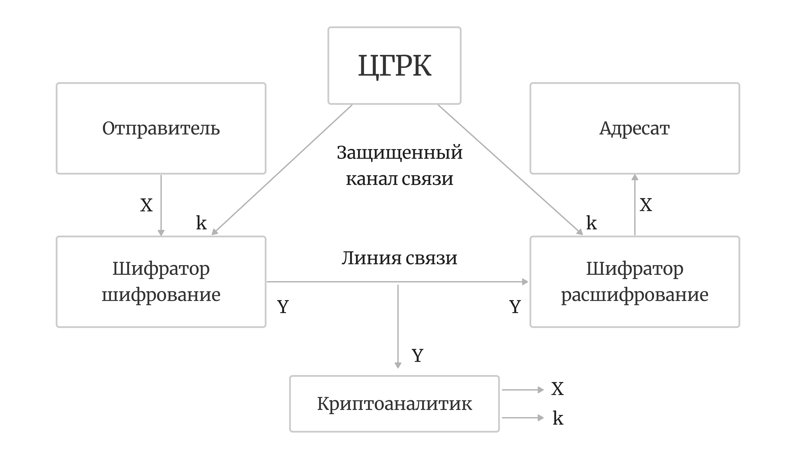

# 1. Общая характеристика

## Основные задачи защиты информации и классификация методов защиты информации

1. Обеспечение надежного хранения сообщений и управление доступом к информации со стороны различных категорий пользователей, в том числе защита от несанкционированного доступа.
1. Обеспечение защиты от искажения сообщений и от ознакомления с ними посторонних лиц или нарушителя при передаче информации между законными пользователями.
> **Законный пользователь** – пользователь, имеющий право выполнять заранее определенные действия с информацией в соответствии с правилами разграничения доступа.
1. Регулирование правовых отношений, связанных с обладанием и использованием информации.

## Классификация методов защиты по решаемым задачам

### 1. Организационно-административные методы

Связаны с обеспечением режима секретности на предприятиях, располагающих ценной информацией, с защитой выделенных зон и помещений от проникновения нарушителя.

### 2. Правовые методы

Предназначены для юридической защиты информации, регулирующей права на собственность, на использование информации и т.д.

### 3. Инженерно-физические методы

Обеспечивают защиту на определенной территориальной зоне или в рабочем помещении от утечки по акустическим и электромагнитным каналам.

Также инженерные методы направлены на разработку:
- устройств-контейнеров для хранения информации, защищенных от несанкционированного проникновения
- технических средств передачи информации, затрудняющих нарушителю схем данных с линии связи.

### 4. Криптографические методы

Основаны на применении математических обратимых функций к хранимой или передаваемой информации с целью существенного изменения исходной формы представления информации.

Многообразие возможных изменений сообщения обеспечивается возможностью выбора функции из большой системы функций, заданных на элементах информации и образующих криптографическую систему. Функции криптосистемы называются криптографическими. Выбор функции криптосистемы для использования при защите конкретных сообщений реализуется как выбор из многих вариантов секретного ключа, параметра криптографической функции. Измененная форма сообщения может быть восстановлена в исходную форму с помощью обратной функции с использованием соответствующего ключа. Защита информации криптографическими методами обеспечивается секретностью ключа.

### 5. Стеганографические методы

Предназначены для сокрытия секретного сообщения, которое может быть зашифровано, внутри несекретного сообщения. При этом за счет избыточности несекретного сообщения его форма не претерпевает явных изменений, что позволяет скрывать факт вложения в него секретного сообщения.

## Современные задачи криптографии

### 1. Обеспечение конфиденциальности информации

защита от несанкционированного ознакомления с содержанием

### 2. Обеспечение целостности информации

защита от несанкционированного изменения информации нарушителем (вставка, удаление, замена фрагментов исходного сообщения)

### 3. Аутентификация информации

подтверждение подлинности участников информационного обмена, содержания сообщения, времени генерации сообщения и т.д.

### 4. Удостоверение авторства

по отношению к сообщению или документу (обеспечение невозможности отказа от авторства или присвоения его)

### 5. Обеспечение неотслеживаемости информации

невозможности получения нарушителем содержательной информации на основе наблюдения за действиями законных пользователей

## Разделы и научные источники криптологии

Криптографические методы защиты информации изучает наука криптология. В современном понимании предметом криптологии являются методы построения и анализа криптографических систем.

> **Криптография** – наука о построении криптографических систем, используемых с целью защиты информации

> **Криптоанализ** – наука о методах анализа криптографических систем, цель анализа – разработка методов раскрытия информации, защищаемой криптосистемой, а также усовершенствование разработанных криптографических систем.

> **Криптология** – самостоятельная наука с особым предметом и методами его исследования. Наука, занимающаяся методами шифрования и дешифровки.

### Математические дисциплины в криптологии

- линейная алгебра
- теория групп и полугрупп
- теория автоматов
- математический анализ
- теория дискретных функций
- теория чисел
- комбинаторный анализ
- теория вероятностей и математическая статистика
- теория кодирования
- теория информации
- теория сложности вычислений
- теория алгоритмов
- др.

### Физические и инженерные науки в криптологии

- теория связи
- теория электромагнитного поля
- квантовая физика
- компьютерные науки
- др.

## Основные понятия криптологии

> **Криптографическая система** применяется для решения задач защиты информации соответствующими участниками информационного обмена или сторонами, при этом устанавливается определенный порядок взаимодействия сторон, называемый криптографическим протоколом.

Семейство криптографических функций в совокупности с используемыми криптографическими протоколами образуют криптографическую систему (криптосистему).

Функции криптосистемы зависят от параметра $k \in K$, называемого **ключом криптосистемы**, где 
```К``` – конечное множество допустимых значений ключа, называемое ключевым множеством криптосистемы.

> **Жизненный цикла ключа** - практиеское применение *криптографического ключа*. Выполнение таких действий с ключом, как генерация, распределение (рассылка) между пользователями, хранение, установка, смена и уничтожение ключей.

> **Ключевые протоколы** - протоколы, управляющие *жизненным циклом ключей*

> **Ключевая подсистема криптосистемы** - совокупность *ключевого множества* и *ключевых протоколов*

### Криптосистемы в зависимости от задач защиты информации

- **cистема шифрования**<br>
Исользуется для обеспечения конфиденциальности информации. Реализует семейство $E$ биективных функций $E_k$, называемое шифром: $E=\{E_k\}, k \in K$
- **система идентификации**<br>
используется для аутентификации сторон протокола
- **система имитозащиты**<br>
используется для аутентификации сообщений
- **система электронной подписи**<br>
для обеспечения неотказуемости от авторства

### Шифры и шифрование

> **Открытый текст** - сообщение, к которому применяется криптографическая функция шифра

> **Шифрование** или **зашифрование** - применение функции шифра к открытому тексту

> **Шированный текст**, **шифртекст** или **криптограмма** - результат зашифрования открытого текста

> **Шифр** $E$ можно рассматривать как семейство отображений $X^{*} \times K \to Y^{*}$, биективных по первой переменной, где $X^{*}$ и $Y^{*}$ – соответственно *множества открытых и шифрованных текстов*.

> **Биективная функция шифра** - обеспечивает возможность восстановления открытого текста по шифрованному тексту

> **Расшифрованием** - применение к криптограмме обратного отображения с использованием известного ключа. При расшифровании реализуется отображением множества $Y^{*} \times K$ в множество $X^{*}$

### Дешифровка и риски

> **Дешифрование** - раскрытие криптоаналитиком информации, защищаемой шифром, ключ расшифрования криптоаналитику неизвестен, т.е. неизвестно, каком именно отображение из семейства $E$ использовано для зашифрования

> **Криптоаналитической атака** - разработанный криптоаналитиком метод раскрытия шифра или информации, защищаемой шифром

> **Криптографическая стойкость** - способность криптосистемы противостоять атакам криптоаналитика. Криптографическая стойкость системы *измеряется вычислительными или временными затратами*, достаточными для ее вскрытия, иногда – *объемом материальных затрат*.

#### Классификация по криптографической стойкости

##### Cистемы временной стойкости

- обеспечивает защиту в рамках заданных временных, вычислительных, материальных и др. затрат на дешифрование

##### Cистемы гарантированной стойкости

- обеспечивают защиту информации в течение длительного времени
- способна реализовать большое количество различных функций
- связывает любую попытку ее взлома с неизбежным решением трудоемкой задачи, не решаемой с использованием самых передовых технологий в течение практически приемлемого временного периода

## Симметричные и асимметричные шифрсистемы

По принципам использования ключей криптосистемы разделяются на:
- системы с секретным ключом (симетричные системы)
- системы с открытым ключом (ассиметричные системы)

> **Симметричные шифрсистемы** - для реализации зашифрования и расшифрования используются одни и те же ключи. Используются в *системах с секретным ключем*.

> **Асимметричные шифрсистемы** - в них ключи зашифрования и расшифрования различны. *Ключ зашифрования* может быть открытым, т.е. известным для всех, но расшифровать сообщение может только обладатель соответствующего *секретного ключа*, который во избежание путаницы с симметричными криптосистемами называется *закрытым*.

| Симметричные | Асимметричные |
| :-- | :-- |
| + более высокая скорость шифрования<br>+ меньшая длина используемого ключа с заданной стойкость<br> + более высокая степень научной обоснованности криптографической стойкости | + заметно расширяющие область применения криптографических методов |

Нередко используются **гибридные криптосистемы**, сочетающие принципиальные преимущества как симметричных, так и асимметричных систем.

## Понятие о криптографических протоколах

> **Криптографический протокол** реализует установленный порядок взаимодействия сторон при выполнении какой-либо криптографической задачи

Протокол реализуется в ходе взаимодействия нескольких субъектов.

Возможны ситуации, когда решение задачи защиты информации ослаблено свойствами протокола, несмотря на применение подходящих криптографических функций.

Каждое **действие криптографического протокола** по содержанию представляет собой либо вычисления, выполняемые пользователями, либо рассылку сообщений между ними.

> **Двусторонние протоколы** - рещение криптографической задачи взаимодействующими пользователи без посредников

> **Трехсторонние протоколы** - рещение криптографической задачи взаимодействующими пользователи с участием посредников

> **Посредник криптографического протокола** - незаинтересованная доверенная стретья сторона в решении криптографической задачи. *Задача* посредника заключается в том, чтобы обеспечить исполнение всех этапов протокола.

> **Арбитр** - посредник особого типа: он не обязательно участвует в исполнении протокола, но может привлекаться для проверки корректности выполнения протокола

> **Cамодостаточные протоколы** - конструкция которых обеспечивает контроль над верным исполнением протокола. Однако такие протоколы имеются далеко не для каждой задачи.

### Типы атак на криптографические протоколы

#### Пассивные атаки

Противник
- ограничивается наблюдением за действиями сторон протокола
- пытается извлечь из наблюдений полезную для себя информацию
- не вмешиваяется в реализацию протокола.

Пример: перехват нарушителем криптограммы на линии связи с целью дешифрования

#### Актиные атаки

- нарушитель допускает видоизменение протокола в своих интересах
    - им вводятся в протокол новые сообщения
    - удаляются из протокола легитимные сообщения
    - производится подмена одних сообщений другими
    - выводится из строя канал связи или память, в которой хранится информация.

## Организация секретной связи

### Секретная связь на основе симметричной шифрсистемы

Легальными действующими лицами таких протоколов секретной связи являются:
- отправитель
- адресат или адресаты
- посредник, обеспечивающий пользователей ключами

**Задача протокола**: передать секретное сообщение x от отправителя адресату

#### Последовательность действий

1. Отправитель и адресат договариваются об используемой симметричной шифрсистеме, т.е. о семействе отображений $E = \{ E_k\}, k \in K$.
1. Отправитель и адресат договариваются о секретном ключе $k$ , т.е. об используемом отображении $E_k \in E$.
1. Отправитель зашифровывает открытый текст $x$  с помощью отображения $\{E_k\}$, т.е. создает криптограмму $y = E_{k} (x)$.
1. Криптограмма у передается по линии связи адресату.
1. Адресат расшифровывает криптограмму $у$ , используя тот же ключ $k$ и отображение $ E^{-1}_{k} $, обратное отображению $E_k$ и читает сообщение $x : x = E^{-1}_{k} (y)$.

#### Схема секретной связи двух абонентов с использованием симметричной криптосистемы



Шаг 2 протокола выполняется с помощью посредника, третьей стороны, называемой центром генерации и распределения ключей (ЦГРК).

Cекретность ключа $k$, который <ins>передается</ins> отправителю и адресату либо <ins>в открытом виде по каналу связи, защищенному от действий криптоаналитика, либо в шифрованном виде по линии связи</ins>.

Ключ $k$ должен оставаться в секрете до, во время и после реализации протокола

Рассмотренный протокол подразумевает взаимное доверие отправителя, адресата и третьей стороны в лице центра генерации и распределения ключей.

### Выводы

1. Протокол должен защищать открытый текст и ключ от несанкционированного доступа постороннего лица на всех этапах передачи информации от отправителя к адресату. Секретность ключа более важна, чем секретность нескольких сообщений, шифруемых на этом ключе. Если ключ скомпрометирован, т.к. его узнал нарушитель, то последний, имея ключ, может расшифровать все зашифрованные на этом ключе сообщения. Кроме того, нарушитель сможет имитировать одну из участвующих в протоколе сторон и генерировать фальшивые сообщения с целью введения в заблуждения другую сторону. При частой смене ключей эта проблема практически решается.
1. Протокол не должен допускать выхода в линию связи лишней информации, предоставляющей криптоаналитику противника дополнительные возможности дешифрования криптограмм. Протокол ложен защищать информацию не только от посторонних лиц, но и от взаимного обмана действующих лиц протокола.
1. Если допустить, что каждая пара пользователей сети связи использует отдельный ключ, то количество необходимых ключей равно $n(n-1)/2$ для $n$ пользователей. Это означает, что при большом  генерация, хранение и распределение ключей становится трудоемкой проблемой.

### Секретная связь на основе асимметричной шифрсистемы

#### Последовательность действий протокола секретной связи

1. Отправитель и адресат договариваются об используемой асимметричной криптосистеме.
1. Адресат высылает отправителю открытый ключ $k$.
1. Отправитель шифрует открытый текст $x$ с помощью открытого ключа $k$ , т.е. создает криптограмму $y = E_{k} (x)$.
1. Криптограмма у передается по линии связи адресату.
1. Адресат расшифровывает криптограмму $у$, используя закрытый ключ $z$, и читает сообщение $x: x= E_{z} (y)$.

Протокол защищает сообщение $х$ от несанкционированного прочтения
- пассивный нарушитель может перехватить открытый ключ $k$ и криптограмму $y$
- но не может расшифровать сообщение, т.к. не имеет закрытого ключа $z$

#### + и - протокола

<span style="color: green">Достоинством протокола является то, что распределение открытых ключей не требует секретности.</span>

<span style="color: red">Ничто не помешает нарушителю в рамках данного протокола использовать доступный открытый ключ ```k``` для генерации ложного сообщения с целью навязывания его адресату.</span>

Как правило, они используются для шифрования не самих сообщений, а ключей или вспомогательных информационных блоков относительно небольшой длины. Это вызвано следующими обстоятельствами
1. Скорость шифрования асимметричных алгоритмов примерно в тысячу раз уступает скорости симметричных алгоритмов, что ставит их в невыгодное положение при использовании для шифрования больших объемов данных.
1. Криптосистемы с открытым ключом уязвимы к атакам на основе подобранного открытого текста, особенно когда число вариантов блока открытого текста ограничено и допустим перебор этих вариантов.

## Обеспечение целостности сообщений

Одним из центральных понятий криптографии с открытым ключом является однонаправленная функция, т.е. функция $f$ , значение $f(x)$ которой легко вычисляется для любого аргумента $x$ из области определения, а вычисление по значению $f(x)$ его прообраза $x$ трудоемко.

Однонаправленная функция с ключом зависит не только от $х$, но и от некоторого параметра $k$. Вычисление прообраза по значению такой функции может быть реализовано легко лишь при известном параметре $k$.

> **Хэш-функция** - отображение последовательностей различной длины в последовательности фиксированной длины.

Хэш-функции используются в криптографии для проверки идентичности двух последовательностей путем сравнения их значений

Если требуется проверить наличие какого-либо файла, имеющегося у определенного пользователя, то достаточно получить его хэш-значение и сравнить его с хэш-значением, вычисленным пользователем. Если нужно, чтобы проверка была доступна только определенному лицу, можно использовать хэш-функцию с ключом.

# 2. Криптографические ключи


