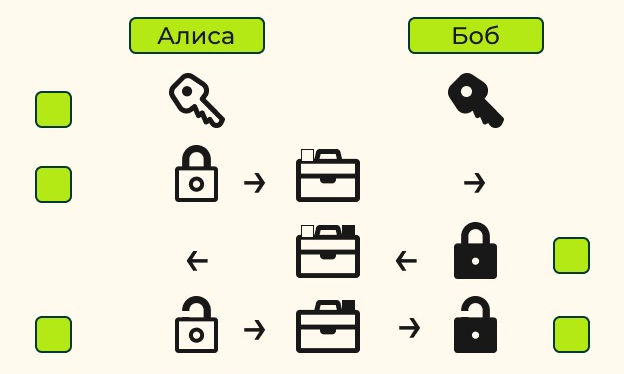
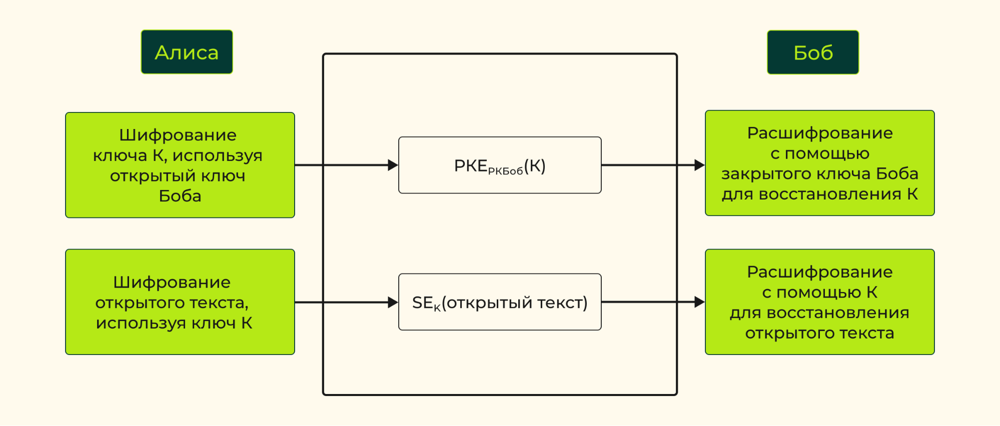
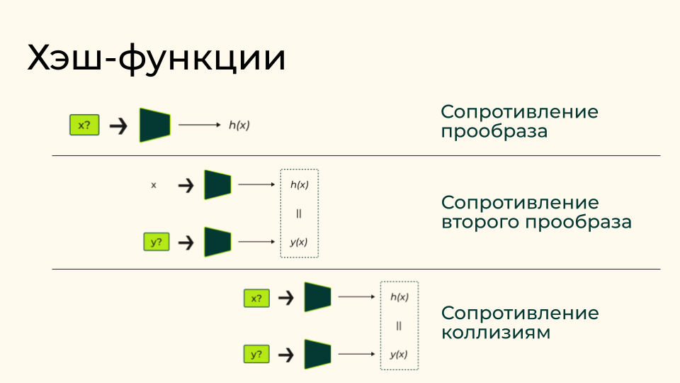
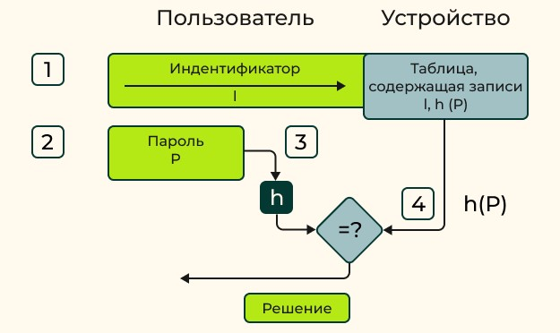
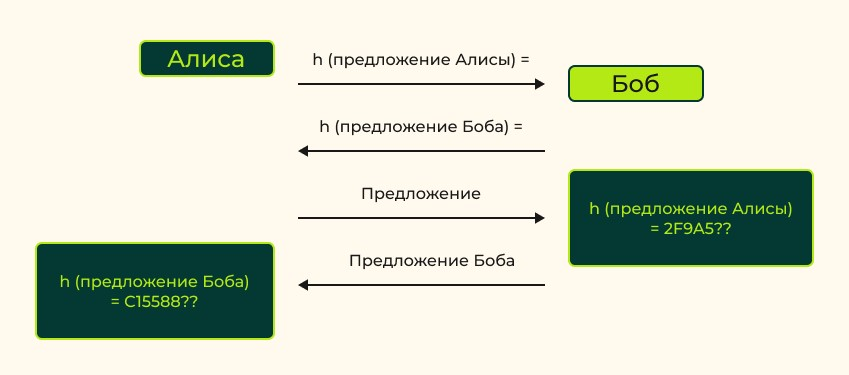
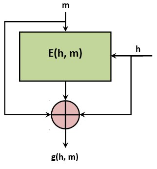
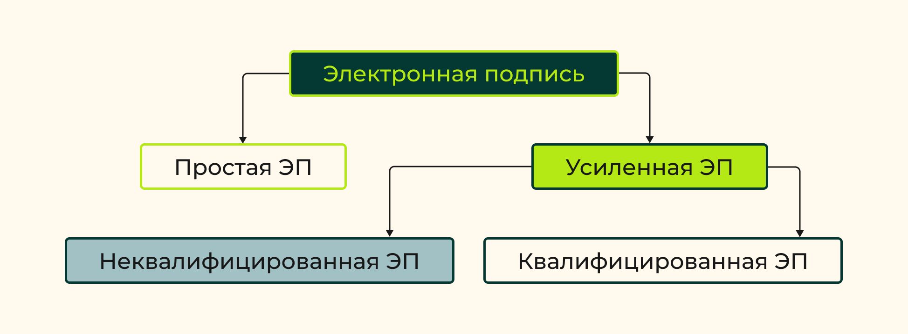

# 1. Асимметричное шифрование. Криптосистема на основе эллиптических кривых

> **Эллиптическая кривая**
>
> это множество точек, удовлетворяющих уравнению
>
> $y^2 + a_1xy + a_3y = x^3 + a_2x^2 + a_4x + a_6$

Математический аппарат эллиптических кривых был использован в криптосистемах с открытым ключом.

## Определение эллиптических кривых над простыми конечными полями

Дано:
- $p>3$ — простое число
- ```a``` и ```b``` — элементы конечного поля порядка ```p```
- $4a^2 + 27b^2 ≠ 0$

**Эллиптическая кривая над конечным полем порядка ``p``**
- множество решений ```(x,y)``` уравнения вида $y^2 = x^3 + ax + b$ над указанным полем с дополнительной точкой в бесконечности.

В криптографических приложениях, как правило, рассматриваются эллиптические кривые над конечным полем $GF(2^n), n \in \mathbb {N}$

> **Коммутативная группа по операции сложения** - множество точек эллиптической кривой

Пользуясь операцией сложения точек на кривой, можно определить операцию умножения точки ```P``` на произвольное целое число ```n``` : $nP = P + … + P$, где операция сложения выполняется ```n``` раз.

### Однонаправленную функция, на основе которой можно создать криптосистему

- ```P``` — точка эллиптической кривой
- $n \in \mathbb{Z}$, ```n``` > количества точек на эллиптической кривой

$\implies$

```nP``` - прямоя функция, для вычисления потребуется не больше $2\log_{2}n$ операций сложения

Обратную функция: по заданной эллиптической кривой, точке на этой кривой и произведению ```nP``` найти число ```n```

все известные алгоритмы решения этой задачи требуют <ins>экспоненциального времени</ins>

### Криптографический протокол

1. Для установления защищённой связи для пользователя Алиса и Боб совместно выбирают эллиптическую кривую и точку ```P``` на ней.
1. Затем каждый выбирает своё секретное целое число, соответственно ```a``` и ```b```.
1. Алиса вычисляет произведение ```aP```, Боб — ```bP```.
1. Далее они обмениваются полученными значениями. При этом параметры самой кривой, координаты точки на ней и значения произведений являются открытыми и могут передаваться по незащищённым каналам связи.
1. Затем Алиса умножает полученное значение на ```a``` ($a*bP$), а Боб — полученное им значение на ```b``` ($b*aP$).
1. В силу свойств операции умножения на число $abP = baP$. Таким образом, оба пользователя получают общее секретное значение – координаты точки ```abP```, которое они могут использовать для получения ключа шифрования.

Отметим, что злоумышленнику для восстановления ключа потребуется решить сложную вычислительную задачу определения чисел ```a``` и ```b``` по известным эллиптической кривой, точке ```P``` и произведениям ```aP``` и ```bP```.

## Свойства криптосистем с открытым ключом

Протокол портфеля



- Алиса хочет отправить защищённое сообщение Бобу
- нет доверительных отношений
- сообщение на физическом носителе, Алиса обезопасит его, заперев в портфеле
- Боб ещё не делился ключом с Алисой

### Протокол действий

1. Алиса начинает с получения замка, ключ от которого есть только у Алисы.
1. Алиса помещает сообщение в портфель и закрывает его с помощью своего замка. Запертый портфель она передаёт курьеру, который доставляет его Бобу.
1. Боб получает собственный замок. Как только Боб получает портфель, он добавляет второй замок на портфель и возвращает портфель курьеру, который передаёт его Алисе.
1. Алиса снимает свой замок и вручает портфель курьеру, который снова передаёт его Бобу.
1. Боб снимает свой замок и открывает портфель, чтобы получить сообщение.

Протокол портфеля достигает заявленной цели, потому что сообщение остаётся конфиденциальным в течение трёх своих путешествий между Алисой и Бобом

#### Недостатки

**Аутентификация**
- отсутствие доверительных отношений, таит в себе значительную уязвимость
- нет уверенности в общении с тем, с кем планировалось
- нет аутентификации какого-либо типа

**Эффективность**
- три передачи между Алисой и Бобом (обычно для безопасной передачи сообщения, используют только одну транспортировку)

#### Плюсы

- можно безопасно передать сообщение между двумя сторонами без созданного заранее общего ключа

### Свойства криптосистем из протокла портфеля

- Ключи, используемые для шифрования и расшифрования, должны быть разными
- Любой, кто хочет быть получателем, должен иметь уникальный ключ расшифрования (закрытый ключ)
- Любой, кто хочет быть получателем, должен опубликовать ключ шифрования (открытый ключ)
- Должна быть определённая гарантия подлинности открытого ключа (необходимо быть уверенным в правильном владельце открытого ключа. Сегодня используют сертификаты открытых ключей)
- Не следует допускать получения открытого текста из знания зашифрованного текста и открытого ключа
- Нельзя получить секретный ключ из открытого ключа

## Сравнение криптосистем на эллиптических кривых и криптосистем на основе алгоритма RSA

Криптосистема на основе алгоритма **RSA** и криптосистемы на вариантах **алгоритма Эль-Гамаля**, базирующихся на эллиптических кривых, — наиболее распространённые криптосистемы с открытым ключом.

> **RSA** — криптографический алгоритм с открытым ключом, основывающийся на вычислительной сложности задачи факторизации больших целых чисел

> **Алгоритм Эль-Гамаля** — криптосистема с открытым ключом, основанная на задаче вычисления дискретных логарифмов в конечном поле

| RSA | Алгоритм Эль-Гамаля |
| :--- | :--- |
| предполагает расширение сообщений по умолчанию, что усложняет её использование<br>не являются особенно эффективными | более эффективен для шифрования |
| нужно два возведения в степень | требуется одно возведение в степень |
| расшифрование немного эффективнее<br>выполнение расширенного алгоритма Евклида вычислительно более эффективно | расшифрование менее эффективно, использует возведение в степень|
| медленнее вычислений в симметричных алгоритмах | медленнее вычислений в симметричных алгоритмах |

## Использование криптосистем с открытым ключом

### Ограничения

1. **Вычислительные затраты**<br>
Шифрование и расшифрование с открытым ключом — дорогостоящие для выполнения вычисления. Поэтому в приложениях, где важна скорость обработки данных, часто ограничивают количество выполняемых операций шифрования и расшифрования с открытым ключом. <ins>Cамое важное ограничение</ins>
1. **Проблемы с длинным открытым текстом**
    - Предпологают - открытый текст представляет собой один блок данных
    - более длинный открытый текст, делят на разные блоки, затем зашифровывают их отдельно
    - отдельные блоки зашифровываются с помощью эквивалента открытого ключа в режиме простой замены блочного шифра
    - приводит к возникновению нескольких проблем безопасности
    - ограничить использование шифрования с открытым ключом в одном открытом тексте

## Гибридное шифрование

Алиса хочет зашифровать (длинный) открытый текст и отправить его Бобу
1. Она генерирует симметричный ключ K и открытым ключом Боба шифрует симметричный ключ K.
1. Алиса параллельно шифрует открытый текст, используя симметричный ключ K.
1. Затем Алиса отправляет оба этих зашифрованных послания Бобу.

Получив два зашифрованных текста

4. Боб восстанавливает симметричный ключ K, расшифровав первый зашифрованный текст с использованием своего закрытого ключа.
5. Боб восстанавливает исходный открытый текст, расшифровав второй зашифрованный текст с использованием симметричного ключа K.



### Плюсы

- удобное управления ключами
- надёжное общение между недоверенными сторонами.

## Другие виды криптосистем с открытым ключом

### Шифрование на основе идентификаторов

отправитель может указать произвольную строку, например имя пользователя или адрес электронной почты, в качестве открытого ключа получателя

### Шифрование на основе атрибутов

- Пример: можно зашифровать медицинскую запись таким образом, чтобы любой квалифицированный специалист мог её расшифровать
- использует набор атрибутов и политик, чтобы определить, кто может расшифровать зашифрованный текст

### Гомоморфное шифрование

- возможность выполнять вычисления уже на зашифрованных данных, особенно когда данные представляют числовые значения.
- крайне неэффективны
- Частично гомоморфные схемы шифрования позволяют выполнять опредёленные специфические вычисления

# 2. Хэш-функции. Механизмы аутентификации

> **Хэш-функция** - функция, осуществляющую преобразование массива входных данных произвольной длины в выходную битовую строку фиксированной длины

## Различные уровни целостности данных

### 1. Случайная ошибка

- Защита только от случайных ошибок, например что возникают из-за шума в канале связи
- Механизмы защиты
    - исправления ошибок
    - простые контрольные суммы
    - вычисление хэш-значений
- эти механизмы не защитят от активного злоумышленника
- если данные изменяются определённым образом, то новое хэш-значение можно спрогнозировать без необходимости его формального пересчёта
    - Пример: хэш-значение для «исключающего ИЛИ» двух сообщений может быть «исключающее ИЛИ» от двух хэш-значений аргументов

### 2. Простые манипуляции

- активный злоумышленник не может сократить вычисление нового хэш-значения, манипулируя старыми

### 3. Активные атаки

- механизмы защиты должны предотвратить создание злоумышленником достоверного хэш-значения для некоторых данных
- используют аутентификацию источника данных
- Механизмы защиты:
    - коды аутентификации сообщений

### 4. Атака отречения

- Защита от *злоумышленного участника информационного обмена*, который <ins>пытается доказать, что не создавал хэш-значение в то время, когда сгенерировал его</ins>
- необходим в приложениях, где требуется доказательство целостности данных
- при определённых обстоятельствах коды аутентификации сообщений могут обеспечить такой уровень целостности данных

## Хэш-функции

### Типы хэш-функций

#### Стойкие однонаправленные функции

Используются для <ins>шифрования строго конфиденциальных данных</ins>, которые не требуют расшифрования, например паролей.

#### Функции, обеспечивающие слабое представление целостности данных

Использоватся для
- проверки данных на случайное их изменение
- для выявления преднамеренного манипулирования данными

По существу, они иногда <ins>называются кодами обнаружения модификации или кодами обнаружения манипуляции</ins>.

#### Функции-компоненты для создания других криптографических примитивов

Использоватся для построения различных криптографических примитивов, таких как коды аутентификации сообщений и схемы электронной подписи.

#### Функции, использующиеся в качестве привязки данных

Использоватся в криптографических протоколах <ins>для связывания данных в одном криптографическом обязательстве</ins>.

> **Криптографическое обязательство** — это схема, позволяющая зафиксировать выбранное значение (например утверждение или бит информации), сохраняя его скрытым для других, с возможностью позже раскрыть его значение.

#### Функции-источники псевдослучайности

Используются для <ins>псевдослучайной генерации чисел</ins>, причём важным примером является генерация криптографических ключей.

### Особенности хэш-функций

#### Хэш-функции не имеют ключа

Свойства безопасности, обеспеченные хэш-функцией, предоставляются без ключа. В этом отношении это необычные криптографические примитивы, так как обычно свойства криптографических схем базируются на знании секретного параметра — ключа.

#### Функции хэширования являются общедоступными

Всегда предполагается, что злоумышленник знает устройство хэш-функции. Поскольку хэш-функции не используют секретный ключ, это означает, <ins>что любой злоумышленник, может вычислить действительное хэш-значение для любого аргумента</ins>.

### Cвойствам хэш-функций

#### 1. Хэш-функция сжимает входные данные произвольной длины в выходные данные фиксированной длины

Это означает, что независимо от того, какой длины вводятся данные, хэш-функция генерирует вывод или хэш-значение фиксированной длины.

> **Хэширование данных** - Процесс применения хэш-функции к входным данным

В общем случае хэш-значение намного короче исходных данных.

В криптографии:
- преобразуют двоичные входные значения в двоичные на выходе
- Если двоичный выход определённой хэш-функции имеет длину ```n``` бит — будем ссылаться на хэш-функцию как на ```n-битовую хэш-функцию```

#### 2. Простота вычисления

- Вычисление хэш-функции должно быть «лёгким» с точки зрения эффективности и скорости
- хэш-функция должна быть вычислима за полиномиальное время

> **Полиномиальное время** - время работы ограничено сверху многочленом от размера входа алгоритма, то есть $T(n) = O(n^{k}), k=const$

- практическая хэш-функция будет намного быстрее вычисляться, чем операция симметричного шифрования

### Cвойства хэш-функций, имеющих отношение к безопасности схем


#### 1. Стойкость к поиску первого прообраза

- Хэш-функция должна быть устойчивой к поиску первого прообраза
- должно быть вычислительно сложно обратить хэш-функцию
- хэш-функция была вычислима за экспоненциальное время
- защищает от атакующего, который имеет *только хэш-значение и пытается обратить хэш-функцию*

> **Экспоненциальное время** - время решения задачи, ограниченное экспонентой от размерности задачи.

#### 2. Стойкость к поиску второго прообраза

- должна быть стойкой к поиску второго прообраза: для входных данных и их хэш-значения должно быть сложно найти другие входные данные с тем же хэш-значением.
- защищает от атакующего, *знает входные данные и их хэш-значение* -> хочет найти другое входное значение, имеющее такое же хэш-значение.

#### 3. Стойкость к коллизиям

- Трудно найти <ins>два разных входа</ins> (любой длины), которые при подаче в хэш-функцию <ins>дают одинаковые хэш-значения</ins>
- хэш-функция должна быть без коллизий. Заметим, что хэш-функция не может не иметь коллизий
- злоумышленнику очень <ins>трудно найти два входных значения с одинаковым хэш-значением</ins>

#### Схема свойств



> Между свойствами безопасности существует только одна чёткая связь: **если функция устойчива к коллизиям, то она устойчива к поиску второго прообраза**. То есть если функция ```h``` устойчива к коллизиям, то трудно найти любую пару аргументов, для которых значения хэш-функции совпадают.

## Примеры применения хэш-функций

### 1. Применение, требующее <ins>стойкости к поиску первого прообраза</ins>

Хэш-функции предлагают простой и широко распространённый способ защиты паролей

- хранить пароли в файле паролей в замаскированной форме
- любой, кто получает доступ к файлу паролей, не может восстановить сами пароли

Перед попыткой входа в систему идентификатор пользователя ```I``` сохраняется в файле пароля, рядом с результатом передачи пароля ```P``` пользователя ```I``` через хэш-функцию ```h```.

- файл паролей состоит из таблицы пар вида $(I, h (P))$
- сами пароли не хранятся в базе

#### Процесс входа в систему на основе пароля



1. Пользователь вводит свою идентификационную информацию на экране входа в систему
1. Пользователь вводит свой пароль ```P```
1. Приложение аутентификации вводит пароль ```P``` в хэш-функцию и вычисляет ```h(P)```
1. Приложение проверки подлинности:
    1. Находит запись в файле паролей, соответствующую идентификатору ```I```
    1. сравнивает сохранённое значение хэшированного пароля со значением ```h(P)```
    1. Если записи совпадают, то пользователь проходит аутентификацию. В противном случае приложение отклоняет вход в систему

#### Проверка выполнения других свойств хэш-функции

##### Стойкость к поиску второго прообраза

- Если злоумышленник не знает действительного пароля для системы, то стойкость к поиску второго прообраза не выполняется
- Если злоумышленник знает действительный пароль ```P``` для системы, то вторые прообразы хэш-значения этого пароля безполезны

##### Стойкость к коллизиям

- не приносит пользу злоумышленнику
- целесообразно искать коллизии в случае, если он обладает одним из паролей

для защиты файлов паролей в первую очередь нужна защита от поиска прообразов

- Решается скрытием хранилища паролей

### 2. Применение, требующее <ins>стойкости второго прообраза</ins>

создание контрольных сумм, которые обеспечивают упрощённую проверку целостности данных

обеспечить определённую степень уверенности пользователя в том, что он правильно загрузил файл

**Ход работы**
- На сайте загрузки файлов отображается хэш-значение MD5, которое идентифицирует имя хэш-функции (MD5) и предоставляет хэш-значение исполняемого кода
- Пользователь, который загружает исполняемый код, может повторно вычислить хэш-значение, пропустив код через хэш-функцию MD5.
- сравнивает полученное хэш-значение с тем, которое отображается на 
- Есл они совпадают, пользователь уверен, что загруженный им код соответствует коду, который предназначался для загрузки

злоумышленник всегда может изменить файл, а затем повторно вычислить новое хэш-значение, которое соответствует модифицированному файлу

злоумышленнику потребуется убедить сайт загрузки файла отобразить этот модифицированный код с его новым хэш-значением

Хэш-функция может использоваться для обеспечения целостности данных в сочетании с другими механизмами безопасности

#### Проверка других свойств

**Стойкость первого прообраза**. Поскольку исполняемый код не является секретом, то нет смысла заботиться о стойкости к поиску первого прообраза. На самом деле прообраз хэш-значения должен быть известен, поскольку применение требует этого.

**Стойкость к коллизиям**. Коллизии не имеют смысла в этом применении, если нельзя найти два фрагмента кода с одним и тем же хэш-значением. Причём один из них потенциально полезный, а другой вредоносный, что достаточно маловероятно. Эта ситуация кажется сомнительной.

### 3. Применения, требующие <ins>устойчивости к коллизиям</ins>

использованием хэш-функций для генерации криптографических обязательств

#### Пример сценария с использованием хэш-функций для генерации криптографических обязательств



Дано:

- Два участника обмена сообщениями: Алиса и Боб
- Обмен без посредников
- Каждая сторона обменивается обязательством
- После открываются сообщения

Описание процесса:

1. Алиса
    1. составляет сообщение и хэширует - хэш является обязательством
    1. Отправляет хэш бобу, который его сохраняет
1. Боб повторяет те же действия со своим сообщением, Алиса сохраняет у себя хэш Боба
1. Подтверждение сообщения Алисы
    1. Алиса отправляет исходное сообщение Бобу
    2. Боб хэширует его и сравнивает с ранее полученным хэшем, если совпадает - ОК
1. Подтверждение сообщения Боба
    1. Боб отпарвялет исходное сообщения Алисе
    2. Алиса хэширует его и сравнивает хэш

Проблема безопасности

- Может ли какая-либо из сторон «отказаться» от своих обязательств каким-либо образом. Способ отказаться от обязательства — найти альтернативное сообщение, имеющее такое же хэш-значение.
- высокая чувствительность к колизиям

**Требуются все три свойства безопасности**

## Алгоритм Стрибог

Стандарт [ГОСТ Р 34.11. Информационная технология. Криптографическая защита информации. Функция хэширования](https://docs.cntd.ru/document/1200095035)

Подробнее
- [https://habr.com/ru/articles/188152/](https://habr.com/ru/articles/188152/)
- [https://xakep.ru/2016/07/20/hash-gost-34-11-2012/](https://xakep.ru/2016/07/20/hash-gost-34-11-2012/)

Пример реализации (C): [https://github.com/okazymyrov/stribog](https://github.com/okazymyrov/stribog)

Включающее две функции
- Функцию с длиной выходного значения в 256 бит
- функцию с длиной выходного значения в 512 бит.

### Преобразования

#### 1. X-преобразование

На вход функции ```X``` подаются две последовательности длиной 512 бит каждая, выходом функции является XOR этих последовательностей

$$
X[k]: V_{512} \to V_{512}\\
X[k](a) = k \oplus a, k,a \in V_512
$$

#### 2. S-преобразование

Функция ```S``` является обычной функцией подстановки. Каждый байт из 512-битной входной последовательности заменяется соответствующим байтом из таблицы подстановок $\pi$

$$
S: V_{512} \to V_{512}\\
S(a) = S(a_{63}||...||a_{0}) = \pi(a_{63})||...||\pi(a_{0})
$$

Таблица $\pi$ является константой

#### 3. P-преобразование

Функция перестановки. Для каждой пары байт из входной последовательности происходит замена одного байта другим.

$$
P: V_{512} \to V_{512}\\
P(a) = P(a_{63}||...||a_{0}) = a_{\tau(63)}||...||a_{\tau(0)}
$$

Таблица перестановок $\tau$ также является константой

#### 4. L-преобразование

Представляет собой умножение 64-битного входного вектора на бинарную матрицу **A** размерами 64x64.

$$
L: V_{512} \to V_{512}\\
L(a) = L(a_{7}||...||a_{0}) = l(a_{7})||...||l(a_{0})
$$

Матрицу **A** можно представить как массив 64-битных слов


### Функция сжатия

<br>
**m** — очередной блок исходного сообщения, **h** — значение предыдущей функции сжатия

#### Функция $g_n$

Пусть h, N и m — 512-битные последовательности

Алгоритм вычисления $g(N,h,m):

1. Вычислить значение $K = h \oplus N$
1. Присвоить значение $K = S(K)$
1. Присвоить значение $K = P(K)$
1. Присвоить значение $K = L(K)$
1. Вычислить $t = E(K, m)$
1. Присвоить значение $t = h ⊕ t$
1. Вычислить значение $G = t ⊕ m$
1. $g(N, m, h) = G$

#### Функция $E(h,m)$

1. Вычислить значение **state** = $h \oplus m$
1. Для ```i= 0 по 11``` выполнить:
    - Присвоить значение $state = S(state)$
    - Присвоить значение $state = P(state)$
    - Присвоить значение $state = L(state)$
    - Вычислить $K=KeySchedule(h, i)$
    - Присвоить значение $state = state \oplus h$
1. Вернуть **state** в качестве результата.

#### KeySchedule(K, i)

Отвечает за формирование временного ключа ```K``` на каждом раунде функции $E(K, m)$

1. Присвоить значение $K = K \oplus C[i]$
1. Присвоить значение $K = S(K)$
1. Присвоить значение $K = P(K)$
1. Присвоить значение $K = L(K)$
1. Вернуть **K** в качестве результата функции.

С — это набор 512-битных значений

### Хэш-функция


1. **Первый этап**<br>инициализация всех нужных параметров
1. **Второй этап**<br> представляет собой так называемую итерационную конструкцию Меркла — Дамгорда с процедурой МД-усиления
1. **Третий этап**<br>завершающее преобразование: функция сжатия применяется к сумме всех блоков сообщения и дополнительно хешируется длина сообщения и его контрольная сумма

Общий алгоритм хэширования (любого сообщения ```M```):

1. Присвоить начальные значения внутренних переменных
    - Для хеш-функции с длиной выхода 512 бит: $h=iv=0x0064$. Для хеш-функции с длиной выхода 256 бит: $h=iv=0x0164$
    - $N = 0512$
    - $\Sigma = 0512$
1. Пока $\text{length}(M) \geq 512$
    - ```m``` — последние 512 бит сообщения ```M```
    - $h = g(N, m, h)$
    - $N = (N + 512) \text{mod} 2512$
    - $\Sigma = (\Sigma + m) \text{mod} 2512$
    - Обрезать M, убрав последние 512 бит
1. Произвести дополнение сообщения ```M``` до длины в 512 бит по следующему правилу: $m = 0511-|M|||1||M$, где |M| — длина сообщения M в битах
1. Вычислить $h = g(N, m, h)$
1. Вычислить $N = (N + |M|) \text{mod} 2512$
1. Вычислить $\Sigma = (\Sigma + m) \text{mod} 2512$
1. Вычислить $h = g(0, h, N)$
1. Вычислить $h = g(0, h, \Sigma)$
1. Возвращаем результат
    - Для хеш-функции с длиной выхода в 512 бит: ```h```
    - Для функции с длиной выхода 256 бит: ```MSB256(h)```

# 3. Электронные подписи

## Свойства реальных подписей

- **Подпись достоверна**. Она убеждает получателя в том, что человек, подписавший документ, сделал это сознательно
- **Подпись неподдельна**. Она доказывает, что именно подписавший — и никто иной — сознательно подписал документ
- **Подпись невозможно использовать повторно**. Она является частью документа, и злоумышленник не может перенести её в другой документ
- **Подписанный документ невозможно изменить**
- **От подписи нельзя отречься**
- **Подпись и документ материальны**. Подписавший не сможет впоследствии утверждать, что он не подписывал документ

В действительности ни одно из этих утверждений не является бесспорным

## Подписание документов с помощью симметричных криптосистем и посредника

Предположим, что абонент ```А``` хочет подписать цифровое сообщение и отправить его абоненту ```В```, он может это сделать с помощью посредника ```Т``` и симметричной криптосистемы.

Посредник ```Т```
- доверенный всеми сторонами
- может связаться со всеми абонентами
- выдает ```A``` ключ $K_A$
- выдает ```B``` ключ $K_B$

### Последовательность действий абонентов при формировании и проверке электронной подписи с помощью симметричной криптосистемы

1. Абонент ```А``` зашифровывает своё сообщение абоненту В ключом $K_A$ и посылает его посреднику ```Т```.
1. Посредник ```T``` расшифровывает сообщение с использованием ключа $K_A$.
1. Посредник ```T``` включает к расшифрованному сообщению утверждение, что он получил это сообщение от абонента ```А```, и зашифровывает это новое сообщение ключом $K_B$.
1. Посредник ```T``` отправляет новое сообщение абоненту ```В```.
1. Абонент ```В``` расшифровывает сообщение с помощью ключа $K_B$. Теперь он может прочитать и сообщение абонента ```А```, и подтверждение посредника ```Т```, что сообщение отправлено именно абонентом ```А```.

### Характеристики такой подписи

1. **Подпись достоверна**<br>
Так как ```T``` – доверенный посредник, и знает, что сообщение получено именно от абонента А. Подтверждение посредника ```T``` служит доказательством для абонента В.
1. **Подпись неподдельна**<br>
Только абонент ```A``` (и доверенный посредник Т) знает $K_A$, поэтому только абонент ```А```, и никто другой, мог послать посреднику ```T``` сообщение, зашифрованное ключом $K_A$. Если кто-нибудь другой попытается выдать себя за абонента ```А```, посредник ```T``` сразу обнаружит это на этапе 2 и не заверит подлинность.
1. **Подпись невозможно использовать повторно**<br>
- Если абонент ```B``` попытается присоединить подтверждение посредника ```T``` к другому сообщению, абонент ```A``` поднимет скандал.
- Посредник попросит абонента ```B``` предъявить его сообщение и зашифрованное сообщение абонента ```А```.
- Затем посредник зашифрует сообщение ключом $K_A$ и увидит, что оно не совпадает с зашифрованным сообщением, переданным абонентом ```В```. 
- Абонент ```В```, очевидно, не сможет создать правильное зашифрованное сообщение, поскольку он не знает ключ $K_A$.
1. **Подписанный документ невозможно изменить**<br>
Если абонент ```B``` попытается, получив документ, изменить его, посредник ```T``` обнаружит мошенничество описанным выше способом.
1. **От подписи невозможно отказаться**<br>
Если впоследствии абонент ```A``` заявит, что он никогда не отправлял сообщение, подтверждение посредника ```T``` докажет обратное, а посреднику ```T``` доверяют все участники взаимодействия.

### Передача подписанного документа третьему лицу

Если абоненту ```B``` необходимо показать документ, подписанный абонентом ```А```, абоненту ```С```, он не сможет раскрыть ему свой секретный ключ, и ему придётся снова обратиться к посреднику ```Т```

1. Абонент ```В``` берёт сообщение и подтверждение посредника Т, что сообщение получено от абонента ```А```, зашифровывает их ключом $K_B$ и посылает посреднику ```Т```.
1. Посредник ```T``` расшифровывает полученное сообщение с помощью ключа $K_B$.
1. Посредник ```T``` проверяет свою базу данных и подтверждает, что исходное сообщение отправлено абонентом ```А```.
1. Посредник ```T``` зашифровывает полученное от абонента В ключом $K_C$, который он распределил для абонента ```С```, и отправляет абоненту ```С``` зашифрованное сообщение.
1. Абонент ```С``` расшифровывает полученное сообщение с помощью ключа $K_C$. Теперь он может прочитать и сообщение, и подтверждение посредника ```Т```, что сообщение отправлено абонентом ```А```.

Посредник — «узкое место» любой системы связи

## Подписание документов с помощью криптографии с открытым ключом

### Основной протокол

1. Абонент ```А``` зашифровывает документ своим закрытым ключом, тем самым подписывая его.
1. Абонент ```А``` отправляет подписанный документ абоненту ```В```.
1. Абонент ```В``` расшифровывает документ с помощью открытого ключа абонента ```А```, проверяя тем самым достоверность подписи.

### Отвечает всем требованиям к подписи

1.  **Подпись достоверна**<br>
Когда абонент ```B``` проверит подлинность сообщения с помощью открытого ключа абонента ```A```, он узнает, что это сообщение подписал именно абонент ```А```.
1.  **Подпись неподдельна**<br>
Только абонент ```А``` знает свой закрытый ключ.
1.  **Подпись невозможно использовать повторно**<br>
Подпись является встроенной функцией документа и не может быть перенесена в другой документ.
1.  **Подписанный документ нельзя изменить**<br>
После любого изменения документа подпись невозможно больше подтвердить открытым ключом абонента ```А```.
1.  **От подписи невозможно отказаться**<br>
Абоненту ```В``` не требуется помощь абонента ```А``` при проверке его подписи.

## Подписание документа с метками времени

В определённых обстоятельствах абонент В может смошенничать. Например, он может повторно использовать подписанный документ. Если абонент А подписал контракт, это не проблема — не имеет значения, сколько копий контракта существует. Однако если абонент А подписал электронный чек, мошенничество абонента В повлечёт финансовые потери абонента А.

Поэтому в электронные подписи часто вставляют метки времени. В документ включают дату и время подписания, после чего подписывают вместе со всем содержимым сообщения

## Подписание документа с помощью криптографии с открытым ключом и однонаправленных хэш-функций

- В практических реализациях алгоритмы с открытым ключом нередко малоэффективны для подписания больших документов
- для подтверждения целостности сообщения требуется много памяти

> вместо подписания самого документа подписывается хэш-значение этого документа

однонаправленная хэш-функция и алгоритм электронной подписи должны быть согласованы заранее

1.  Абонент ```A``` создает необратимое хэш-значение документа.
1.  Абонент ```A``` зашифровывает это значение своим закрытым ключом, тем самым подписывая документ.
1.  Абонент ```A``` отправляет абоненту ```B``` документ и подписанное хэш-значение.
1.  Абонент ```B``` генерирует необратимое хэш-значение документа, присланного абонентом ```А```.
    - Затем, используя алгоритм электронной подписи, абонент ```B``` расшифровывает подписанное хэш-значение документа с помощью открытого ключа абонента ```А```.
    - Если подписанное хэш-значение совпадает со сгенерированным — подпись достоверна

> должна использоваться только однонаправленная хэш-функция

### Преимущества

- Более быстрые и затратные операции
- подпись можно хранить отдельно от документа
- значительно снижаются требования к объёму памяти на стороне получателя, необходимой для хранения документов и подписей
- Система архивирования может использовать этот протокол для подтверждения существования документов без сохранения их содержимого
- высокая конфиденциальность

## Многократные подписи

решается с помощью однонаправленных хэш‑функций:

1. Абонент А подписывает значение хэш‑функции документа.
1. Абонент В подписывает значение хэш‑функции документа.
1. Абонент В отправляет свою подпись абоненту А.
1. Абонент А отправляет абоненту С сам документ, свою подпись и подпись абонента В.
1. Абонент С проверяет подписи абонентов А и В.

Абоненты А и В могут выполнить шаги 1 и 2 как параллельно, так и последовательно. На шаге 5 абонент С может проверить любую подпись независимо от другой.

## Неотказуемость от авторства и электронные подписи

Абонент А может смошенничать с электронными подписями, и с этим ничего нельзя поделать. Так, он может подписать документ и затем утверждать, что он этого не делал.

Это называется отказ от подписи или отрицание авторства.

Метки времени могут снизить эффективность такого мошенничества. Однако абонент А всегда может заявить, что его ключ был скомпрометирован раньше

### Общая схема протокола

1. Абонент ```А``` подписывает сообщение.
1. Абонент генерирует заголовок, содержащий некоторую идентификационную информацию. Затем он присоединяет заголовок к подписанному сообщению, подписывает всё вместе и отправляет посреднику ```Т```.
1. Посредник ```Т``` проверяет подлинность внешней подписи и подтверждает идентификационную информацию. Далее он проставляет метку времени на сообщении, подписанном абонентом ```А```, и на идентификационной информации. Затем он подписывает всё сообщение и отправляет его абонентам ```А``` и ```В```.
1. Абонент ```В``` проверяет подлинность подписи посредника ```Т```, идентификационную информацию и подпись абонента ```A```.
1. Абонент ```А``` проверяет подлинность сообщения, которое посредник Т отправлял абоненту В. Если абонент ```А``` не признаёт свое авторство, он немедленно заявляет об этом.

Существует и другая схема, в которой посредник Т вступает в протокол после факта подписания:
- Получив подписанное сообщение, абонент В отправляет копию посреднику для проверки
- Посредник может засвидетельствовать подлинность подписи абонента А.

# 4. Нормативные аспекты применения электронной подписи

## Основные документы, регламентирующие использование электронной подписи

> **Удостоверяющий центр (УЦ)**
>
> юридическое лицо, индивидуальный предприниматель либо государственный орган или орган местного самоуправления, создающие и выдающие сертификаты ключей проверки электронных подписей, а также выполняющие иные функции, предусмотренные Федеральным законом «Об электронной подписи».

1. Федеральный закон № [63-ФЗ «Об электронной подписи»](https://www.consultant.ru/document/cons_doc_LAW_112701/).
1. Требования к средствам электронной подписи ([приложение № 1 к приказу ФСБ РФ от 27 декабря 2011 г. № 796 «Об утверждении Требований к средствам электронной подписи и Требований к средствам удостоверяющего центра»](https://base.garant.ru/70139150/ad65a43c549a45d32360a363f5d4fa2c/#block_66)).
1. Требования к средствам удостоверяющего центра ([приложение № 2 к приказу ФСБ РФ от 27 декабря 2011 г. № 796 «Об утверждении Требований к средствам электронной подписи и Требований к средствам удостоверяющего центра»](https://base.garant.ru/70139150/563198f2b81e68dd907ddc26c916e9b0/#block_222)).

## Федеральный закон «Об электронной подписи»

Регулирует отношения области использования ЭП при совершении
- гражданско-правовых сделок
- оказании государственных и муниципальных услуг
- исполнении государственных и муниципальных функций
- при совершении иных юридически значимых действий.

Порядок использования ЭП в корпоративной информационной системе может устанавливаться оператором этой системы или соглашением между участниками электронного взаимодействия в ней, если иное не установлено федеральными законами, принимаемыми в соответствии с ними нормативными правовыми актами или решением о создании корпоративной информационной системы.

Правительство Российской Федерации устанавливает:
- Виды ЭП, используемых органами исполнительной власти и органами местного самоуправления
- порядок их использования
- требования об обеспечении совместимости средств ЭП при организации электронного взаимодействия органов между собой

## Требования к средствам ЭП

Предназначены для
- заказчиков и разработчиков разрабатываемых (модернизируемых) средств ЭП при их взаимодействии между собой;
- с организациями, проводящими криптографические, инженерно-криптографические и специальные исследования средств ЭП;
- ФСБ России, подтверждающей соответствия средств ЭП требованиям

Требования распространяются на средства ЭП
- предназначенные для использования на территории Российской Федерации
- в учреждениях Российской Федерации за рубежом и в находящихся за рубежом обособленных подразделениях юридических лиц, образованных в соответствии с законодательством Российской Федерации.

Требования, предъявляемые к средствам ЭП в части их разработки, производства, реализации и эксплуатации должны соответствовать [Положению ПКЗ-2005](https://base.garant.ru/187947/53f89421bbdaf741eb2d1ecc4ddb4c33/#block_1000).

## Требования к средствам УЦ

Предназначены для
- заказчиков и разработчиков разрабатываемых (модернизируемых) средств УЦ при их взаимодействии между собой
- с организациями, проводящими криптографические, инженерно-криптографические и специальные исследования средств УЦ;
- ФСБ России, подтверждающей соответствия средств УЦ указанным требованиям.

Требования к средствам УЦ распространяются на средства УЦ, предназначенные для использования на территории Российской Федерации.

Требования к средствам УЦ, касающиеся их разработки, производства, реализации и эксплуатации должны соответствовать Положению ПКЗ-2005.

## Общие вопросы использования электронной подписи

Федеральный закон «Об электронной подписи» устанавливает следующие принципы использования ЭП:

1. Право участников электронного взаимодействия использовать ЭП любого вида по своему усмотрению. При условии, что требование об использовании конкретного вида ЭП в соответствии с целями её использования не предусмотрено федеральными законами или принимаемыми в соответствии с ними нормативными правовыми актами либо соглашением между участниками электронного взаимодействия.
1. Возможность использования участниками электронного взаимодействия по своему усмотрению любой информационной технологии и (или) технических средств, позволяющих выполнить требования указанного закона.
1. Недопустимость признания ЭП и (или) подписанного ей электронного документа не имеющими юридической силы только на основании того, что такая ЭП создана не собственноручно, а с использованием средств ЭП для автоматического создания и (или) автоматической проверки ЭП в информационной системе.



### Простая ЭП

ЭП, которая посредством использования кодов, паролей или иных средств подтверждает факт формирования ЭП определенным лицом.

### Неквалифицированная ЭП

ЭП, обладающая следующими свойствами:
1. получена в результате криптографического преобразования информации с использованием ключа ЭП;
1. позволяет определить лицо, подписавшее электронный документ;
1. позволяет обнаружить факт внесения изменений в электронный документ после момента его подписания;
1. создаётся с использованием средств ЭП.

При использовании неквалифицированной ЭП допускается не создавать сертификат ключа проверки ЭП, если выполняются все необходимые свойства.

### Квалифицированная ЭП

ЭП, обладающая всеми свойствами неквалифицированной ЭП и следующими свойствами:
1. ключ проверки ЭП указан в квалифицированном сертификате;
1. для создания и проверки ЭП используются средства ЭП, получившие подтверждение соответствия требованиям, установленным в соответствии с законом «Об электронной подписи».

информация в электронной форме, подписанная квалифицированной ЭП, признаётся электронным документом, равнозначным документу на бумажном носителе, подписанному собственноручной подписью.

#### признаётся действительной при одновременном соблюдении следующих условий

1. Квалифицированный сертификат создан и выдан аккредитованным УЦ; его аккредитация должна быть действительна на день выдачи указанного сертификата.
1. Квалифицированный сертификат действителен на момент подписания электронного документа или на день проверки действительности указанного сертификата, если момент подписания электронного документа не определён.
1. Подтверждена принадлежность владельцу квалифицированного сертификата квалифицированной ЭП, с помощью которой подписан электронный документ; подтверждено отсутствие изменений, внесённых в этот документ после его подписания;
1. Квалифицированная ЭП используется с учётом ограничений, содержащихся в квалифицированном сертификате лица, подписывающего электронный документ, если такие ограничения установлены.

### Усиленная ЭП

Если документ должен быть заверен печатью, электронный документ, подписанный усиленной ЭП и признаваемый равнозначным документу на бумажном носителе, подписанному собственноручно, признаётся равнозначным документу на бумажном носителе, подписанному собственноручно и заверенному печатью.

#### обязанности участников электронного взаимодействия

1. обеспечивать конфиденциальность ключей ЭП;
1. уведомлять УЦ, выдавший сертификат ключа проверки ЭП, и иных участников электронного взаимодействия о нарушении конфиденциальности ключа ЭП;
1. прекратить использование ключа при наличии оснований полагать, что конфиденциальность этого ключа нарушена;
1. использовать для создания и проверки квалифицированных ЭП, создания ключей квалифицированных ЭП и ключей их проверки средства ЭП, соответствующие требованиям закона «Об электронной подписи».

## Общие вопросы функционирования удостоверяющего центра

### основные функции УЦ:

1. создание сертификатов ключей проверки ЭП и выдача их заявителям;
1. установка сроков действия сертификатов ключей проверки ЭП;
1. аннулирование выданных этим УЦ сертификатов ключей проверки ЭП;
1. выдача заявителю средств ЭП, содержащих ключ ЭП и ключ проверки ЭП;
1. ведение реестра выданных и аннулированных этим УЦ сертификатов;
1. создание ключей ЭП и ключей проверки ЭП;
1. проверка уникальности ключей проверки ЭП;
1. проверка ЭП по обращениям участников электронного взаимодействия.

### обязанности УЦ (Закон «Об электронной подписи»)

1. Информировать в письменной форме заявителей об условиях и о порядке использования ЭП и средств ЭП, о рисках, связанных с использованием ЭП, и о мерах, необходимых для обеспечения безопасности ЭП и их проверки;
1. обеспечивать актуальность информации, содержащейся в реестре сертификатов, и ее защиту от неправомерного доступа, уничтожения, модификации, блокирования, иных неправомерных действий;
1. предоставлять безвозмездно любому лицу по его обращению в соответствии с установленным порядком доступа к реестру сертификатов информацию, содержащуюся в реестре сертификатов;
1. обеспечивать конфиденциальность созданных УЦ ключей ЭП.

УЦ создаёт и выдаёт сертификат ключа проверки ЭП на основании соглашения между удостоверяющим центром и заявителем.

### Аккредитованный УЦ

#### обязан хранить следующие данные:

1. Для физического лица — реквизиты основного документа, удостоверяющего личность владельца квалифицированного сертификата.
1. Для юридического лица — сведения о наименовании, номере и дате выдачи документа, подтверждающего право лица, выступающего от имени заявителя, обращаться за получением квалифицированного сертификата.
1. Сведения о наименованиях, номерах и датах выдачи документов, подтверждающих полномочия владельца квалифицированного сертификата действовать по поручению третьих лиц, если информация о таких полномочиях владельца включена в квалифицированный сертификат.

Аккредитованный УЦ обязан обеспечить любому лицу безвозмездный доступ к выданным этим УЦ квалифицированным сертификатам и к актуальному списку аннулированных квалифицированных сертификатов в любое время в течение срока деятельности этого удостоверяющего центра.

#### В случае принятия решения о прекращении своей деятельности аккредитованный УЦ обязан:

1. Сообщить об этом в уполномоченный федеральный орган не позднее чем за один месяц до даты прекращения своей деятельности.
1. Передать в уполномоченный федеральный орган в установленном порядке реестр квалифицированных сертификатов.
1. Передать на хранение в уполномоченный федеральный орган в установленном порядке информацию, подлежащую хранению в аккредитованном УЦ.

#### При выдаче квалифицированного сертификата аккредитованный УЦ обязан:

- Для физического лица, обратившегося к нему за получением квалифицированного сертификата, — установить его личность.
- Для юридического лица — получить от лица, выступающего от имени заявителя, подтверждение правомочия обращаться за получением квалифицированного сертификата.

## Придание юридической значимости электронному документу

Понятие юридической силы документа определено стандартом ГОСТ Р 51141-98 «Делопроизводство и архивное дело. Термины и определения»

Взамен настоящего ГОСТа приказом Росстандарта от 17 октября 2013 г. N 1185-ст с 1 марта 2014 г. введен в действие [ГОСТ Р 7.0.8-2013](https://base.garant.ru/70650732/)

Таким образом, юридическая значимость электронного документа является необходимым, но недостаточным условием приобретения им юридической силы.

# Список литературы

1. Погорелов, Б.А. Словарь криптографических терминов [Текст] / Под ред. Б.А. Погорелова, В.Н. Сачкова. — М.: МЦНМО, 2006. — 94 с.
1. Шнайер, Б. Прикладная криптография. Протоколы, алгоритмы, исходные тексты на языке Си [Текст] / Пер. с англ. — М.: ТРИУМФ, 2012. — 610 с.
1. Чмора, А.Л. Современная криптография [Текст]: учеб. пособие / А.Л. Чмора. — М.: Гелиос АРВ, 2001. — 266 с.
1. Алферов, А.П. Основы криптография [Текст]: учеб. пособие для вузов / А.П. Алферов, А.Ю. Зубов, А.С. Кузьмин, А.В. Черемушкин. — М.: Гелиос АРВ, 2001. — 480 с.
1. Брассар, Ж. Современная криптология [Текст] / Пер. с англ. — М.: Издательско-полиграфическая фирма ПОЛИМЕД, 1999. — 176 с.
1. Мао, В. Современная криптография: теория и практика [Текст] / Пер. с англ. — М.: Издательский дом «Вильямс», 2005. — 768 с.
1. Баричев, С.Г. Основы современной криптографии [Текст] / С.Г. Баричев, Р.Е. Серов, В.В. Гончаров. — М.: «Горячая линия — Телеком», 2001. — 120 с.
1. Смарт, Н. Криптография [Текст] / Пер. с англ. — М.: Техносфера, 2005. — 529 с.
1. Масленников, М.Е. Практическая криптография [Текст] / М.Е. Масленников. — СПб.: БВХ — Петербург, 2003. — 464 с.
1. Фомичев, В. М. Методы дискретной математики в криптологии [Текст] / В.М. Фомичев. — М.: Диалог-МИФИ, 2010. — 425 с.
1. Молдовян, А.А. Криптография [Текст]: учеб. пособие для вузов / А.А. Молдовян, Н.А. Молдовян, Б.Я. Советов. — СПб.: Издательство «Лань», 2000. — 235 с.
1. Тилборг, ван Х.К.А. Основы криптологии. Профессиональное руководство и интерактивный учебник [Текст] / Пер. с англ. — М.: Мир, 2006. — 471 с.
1. Молдовян, А.А. Криптография: скоростные шифры [Текст] / А.А. Молдовян и др. — СПб.: БХВ-Петербург, 2002. — 496 с.
1. Молдовян, А.А. Введение в криптосистемы с открытым ключом [Текст] / А.А. Молдовян, Н.А. Молдовян. — СПб.: БХВ-Петербург, 2005. — 298 с.
1. Рябко, Б.Я. Криптографические методы защиты информации [Текст]: учеб. Пособие для вузов / Б.Я. Рябко, А.Н. Фионов. 2-е издание. — М.: «Горячая линия — Телеком», 2012. — 240 с.
1. Саломаа, А. Криптография с открытым ключом [Текст] / Пер. с англ. — М.: Мир, 1997. — 329 с.
1. Ященко, В.В. Введение в криптографию [Текст]: учеб. пособие / Под общ. Ред. В.В. Ященко. 4-е издание — М.: МЦНМО, 2012. — 348 с.
1. Иванов, М.А. Криптографические методы защиты информации в компьютерных системах и сетях [Текст]: учеб. пособие / М.А. Иванов, И.В. Чугунков. — М.: НИЯУ МИФИ, 2012. — 400 с.
1. Запечников, С.В. Криптографические протоколы и их применение в финансовой коммерческой деятельности [Текст]: учеб. пособие для вузов / С.В. Запечников. — М.: «Горячая линия — Телеком», 2007. — 331 с.
1. Аграновский, А.В. Практическая криптография: алгоритмы и их программирование [Текст] / А.В. Аграновский, Р.А. Хади. — М.: Солон Пресс, 2009. — 256 с.
1. Нестеров, С.А. Информационная безопасность и защита информации [Текст]: учеб. пособие / С.А. Нестеров. — СПб.: Издательство политехнического университета, 2009. — 127 с.
1. Черёмушкиин, А.В. Криптографические протоколы. Основные свойства и уязвимости [Текст]: учеб. пособие /А.В. Черёмушкин. — М.: Издательский центр «Академия», 2009. — 282 с.
1. Keith, M.M. Everyday Cryptography: fundamental principles and Applications [Text] / M.M. Keith. 2nd edition. — USA.: Oxford Press, 2017. — 674 с.
1. Aumasson, J. Serious Cryptography: a practical introduction to Modern Encryption [Text] / J. Aumasson. 1st edition. — USA(CA): No Starch Press, 2018. — 292 с.
1. Blahut, R.E. Cryptography and Secure Communication [Text] / R.E. Blahut. 1st edition. — USA.: Cambridge University Press, 2014. — 608 с.
1. Menezes, A., Oorshot, P., Vanstone, S. Handbook of Applied Cryptography [Text] / A.J. Menezes, P.C. Oorshot. 5th edition. — USA.: CRC Press, 2001. — 816 с.
1. Абрамов, Е.С. Кибербезопасность. Учебное пособие [Текст] / Е.С. Абрамов, Е.С. Басан, О.Ю. Пескова, О.П. Харабов, А.В. Епишкина К.Г. Когос. — СПб.: ГУАП, 2021. — 169 с.
1. Епишкина, А.В. Нормативное регулирование в области защиты информации Учебное пособие [Текст] / А.В. Епишкина, С.В. Запечников. – М.: НИЯУ МИФИ, 2021.
1. Положение о разработке, производстве, реализации и эксплуатации шифровальных (криптографических) средств защиты информации (Положение ПКЗ-2005): утв. ФСБ 09.02.05 – Введ. 2005-02-09. - В ред. Приказа ФСБ РФ от 12.04.2010 № 173.
1. Федеральный закон Российской Федерации «Об электронной подписи» от 6 апреля 2011 г. № 63-ФЗ.
1. Типовые требования по организации и обеспечению функционирования шифровальных (криптографических) средств, предназначенных для защиты информации, не содержащей сведений, составляющих государственную тайну в случае их использования для обеспечения безопасности персональных данных при их обработке в информационных системах персональных данных: утв. руководством 8 Центра ФСБ России 21.02.08.