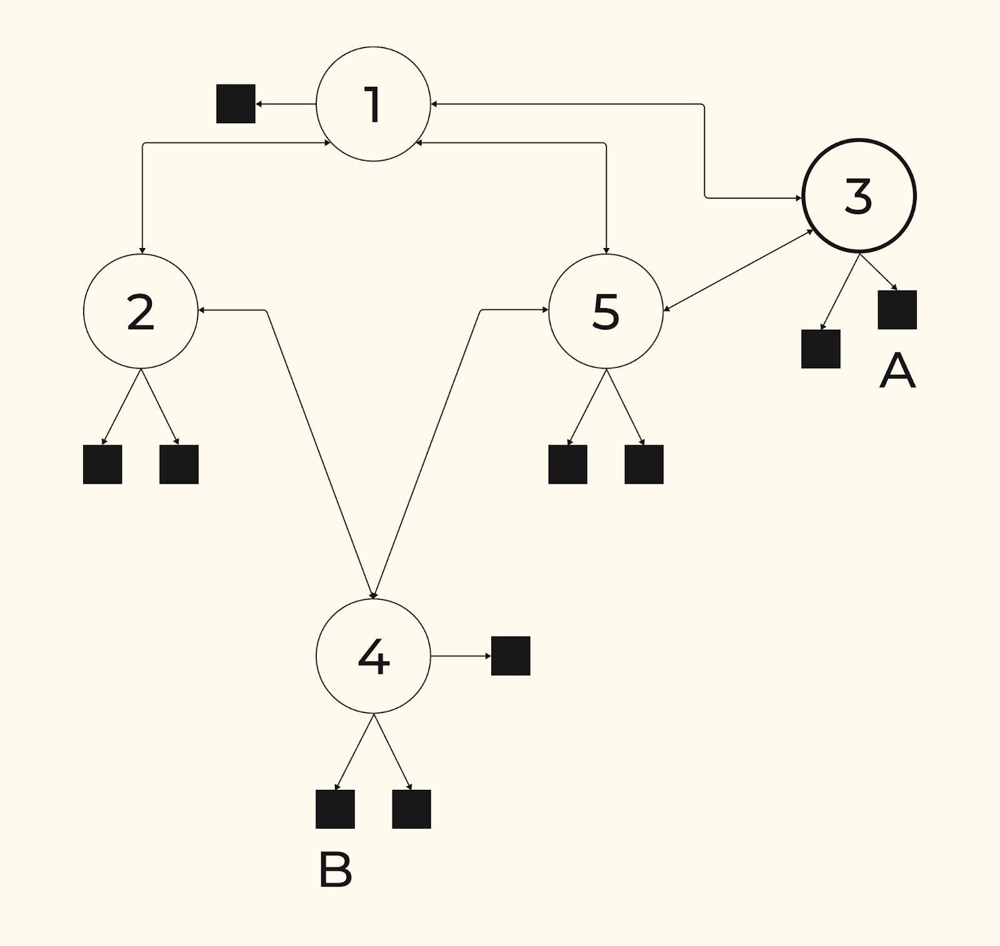
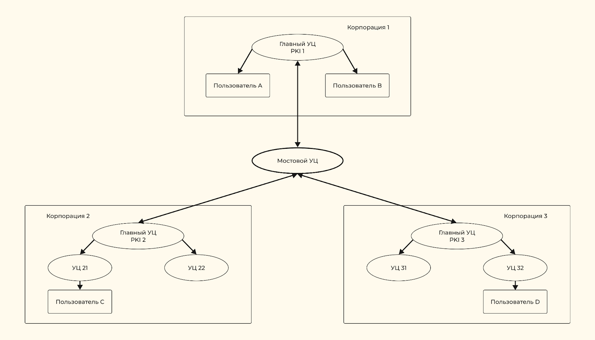
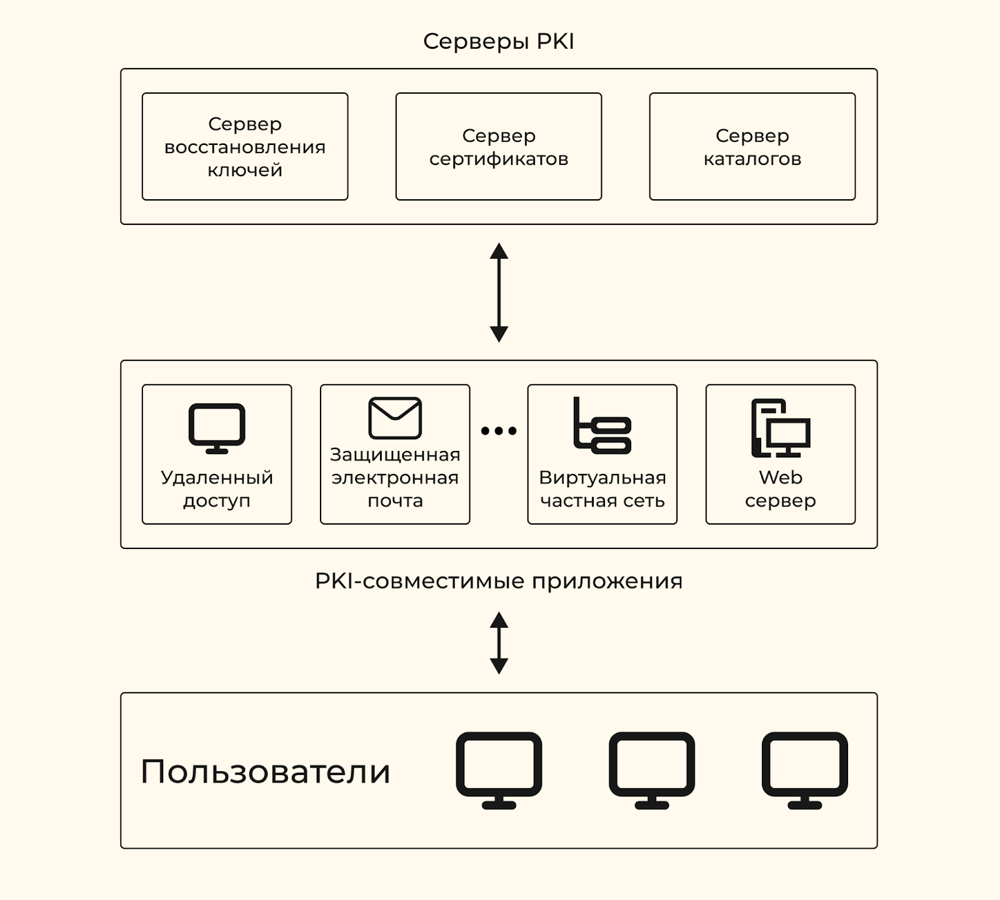
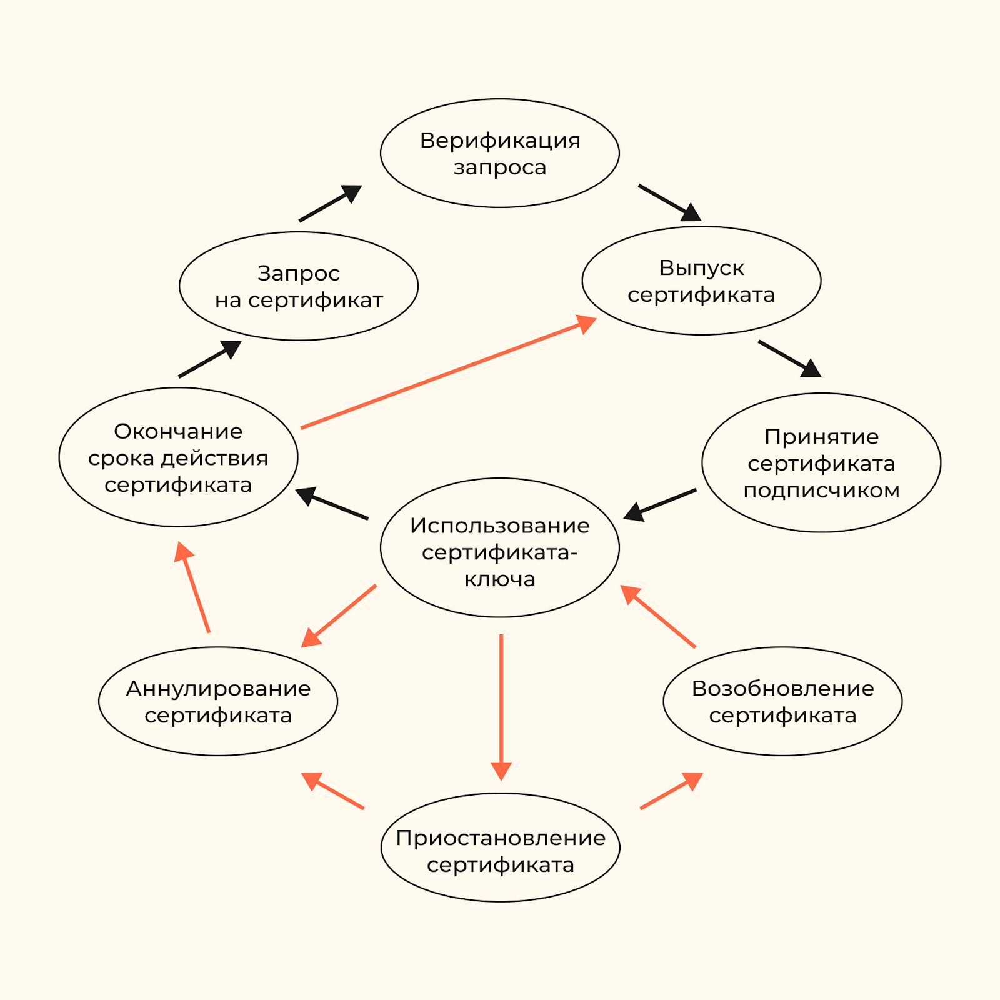
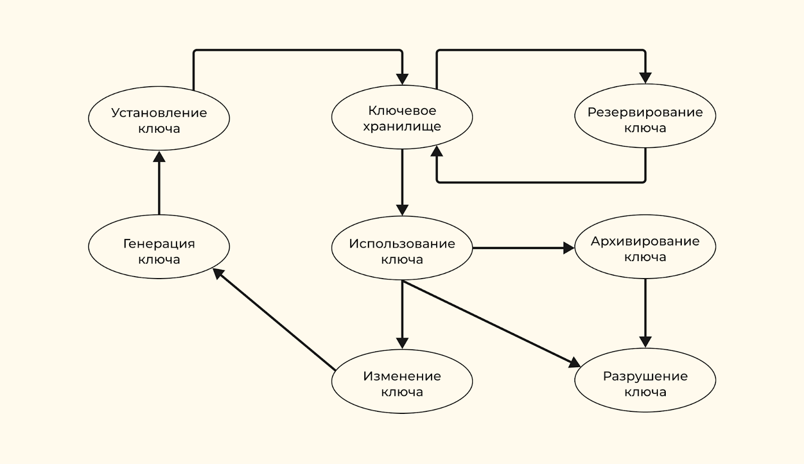

# 1. Цифровые сертификаты и защищенный обмен сообщениями

Инфраструктура открытых ключей позволят развертывать и управлять шифрованием с открытым ключом.

Применение асимметричных криптографических алгоритмов требует
- цифровые сертификаты
- соответствующиие секретные ключи

$\Uparrow$ Позволяют идентифицировать их владельца всем, кому это необходимо

> **Х.509** - стандарт Международного Союза по телекоммуникациям, обеспечивает универсальное применение сертификатов
>
> Примеры протоколов:
> - **PKCS** - шифрования с открытыми ключами
> - **SSL** - протокол связи
> - **HTTP** - безопасный протокол передачи гипертекстовых сообщений

### Основные атрибуты сертификата являются в X.509

- имя и идентификатор субъекта
- информация об открытом ключе субъекта
- имя и идентификатор удостоверяющего центра
- идентификатор и электронная подпись удостоверяющего центра
- серийный номер, версия и срок действия сертификата
- информация об алгоритме подписи и др.

> Цифровой сертификат содержит электронную подпись на основе секретного ключа удостоверяющего центра. Подлинность сертификата можно проверить с помощью открытого ключа удостоверяющего центра

### Цифровые сертификаты используются для

- идентификация и регистрация пользователей без передачи их имен и паролей в открытом виде (контроля доступа)
- защищита конфиденциальных документов от несанкционированного доступа
- защита от использования фальшивого ключа и выдачи себя за другое лицо злодеем

### Инфраструктура открытых ключей — Public Key Infrastructure (PKI)

PKI является комплексом аппаратных и программных средств, политик и процедур.

PKI служит для:
- создания цифровых сертификатов
- обеспечения хранения огромного количества сертификатов и ключей
- резервного копирования ключей
- восстановления ключей
- депонирования ключей
- взаимной сертификации
- ведения списков аннулированных сертификатов
- автоматического обновления ключей и сертификатов после истечения срока их действия

Необходима организациям и компаниям для:
- безопасного обмена электронными документами
- гарантированной защиты электронных транзакций
- безопасного удаленного доступа к данным и инф. ресурсам
- удостовериться в подлинности стороны, участвующих в деятельности орг.
- обеспечить целостность и конфиденциальность отправляемой через интернет информации
- подтверждение успешного выполнение транзакций

## Сервисы безопасности

Унифицированный подход к обеспечению безопасности распределенных систем изложен в известном международном документе **Рекомендации Х.800** ([Recommendation X.800: Security Architecture for Open Systems Interconnection for CCITT Applications](https://www.uio.no/studier/emner/matnat/ifi/IN2120/h18/docs/x800.pdf))

описаны основные сервисы или функции безопасности:
- аутентификация
- управление доступом
- конфиденциальность
- целостность иформации
- предотвращение отказа от участия в обмене информацией

> **Сервис безопасности** представляет собой совокупность механизмов, процедур и других средств управления для снижения рисков, связанных с угрозой утраты или раскрытия данных.

### Сервис идентификации и аутентификации

обеспечивает аутентификацию партнеров по коммуникации и аутентификацию источника данных.

> **Идентификацией субъекта** называется процесс сопоставления введенной им своей характеристики с некоторым хранимым системой идентификатором. Используется для предоставления субъекту определенного уровня прав и полномочий.
>
> Пример: ввод имени пользователя

> **Аутентификацией субъекта** называется процедура проверки принадлежности идентификатора субъекту. Осуществляется на основании того или иного секретного элемента (аутентификатора), которым располагают как субъект, так и информационная система.
>
> При аутентификации источника данных подтверждается подлинность источника отдельной порции данных
>
> Пример: пароль пользователя

<ins>не обеспечивает защиты против повторной передачи данных</ins>

### Сервис управления доступом

обеспечивает защиту от несанкционированного использования доступных сетевых ресурсов

### Сервис конфиденциальности

обеспечивает защиту от несанкционированного получения информации:
- разграничение прав доступа
- предотвращает несанкционированное раскрытие информации не имеющим полномочий пользователям или процессам

### Сервис целостности

предотвращает преднамеренное или случайное несанкционированное изменение данных
- ввод
- уничтожение
- модификацию (изменение, сокращение или дополнение)

в процессе передачи по сети.

Цель получателя информации — убедиться в том, что данные при передаче не были изменены.

### Сервис предотвращения отказа от участия в обмене информацией

гарантирует, что стороны, отправляющие и принимающие электронные сообщения или документы, не смогут отрицать свое участие в информационном обмене в целом или на отдельных его этапах.

часто называют **сервисом «неотказуемости»**

Побочным продуктом является **аутентификация источника данных**

## Некриптографические механизмы безопасности

- контроль циклическим избыточным кодом и битами четности
- использование
    - оцифрованных подписей
    - PIN-кодов
    - паролей
- биометрические средства аутентификации

### Биты контроля четности и циклический избыточный код

- <span style="color:green">защищают данные от случайной модификации при передаче по каналу с помехами</span>
- <span style="color:red">*не позволяют обнаружить подмену или модификацию* сообщения опытным злоумышленником</span>

#### Биты контроля четности

разрабатывались для гарантирования целостности данных, передаваемых между устройствами

При проверке на четность бит контроля четности выбирается так, чтобы число единиц в байте, включая бит контроля четности, было четно

Проверка на нечетность работает аналогичным способом, создавая нечетное число единиц в байте

Биты контроля четности — **дорогостоящий способ защиты целостности**, они увеличивают размер сообщения, по крайней мере, на 12,5%

#### Контроль циклическим избыточным кодом

выполняет ту же самую функцию для больших потоков данных **с меньшими затратами**

1. Вычисленное отправителем с помощью разновидности полиномиального кода число присоединяется к передаваемому по каналам связи сообщению
1. Получатель сообщения заново вычисляет циклический избыточный код и сравнивает результат с принятым значением
1. Сравниваем - совпали -> все ОК

### Оцифрованные подписи

Используется в качестве заменителя собственноручной подписи

Оцифрованная подпись легко узнается получателем электронного документа или сообщения при просмотре

- <span style="color:green">просто</span>
- <span style="color:red">не надежно</span>

в основном используются вместе с дополнительными, более надежными механизмами безопасности

### PIN-коды и пароли

Традиционный и наиболее простой методом аутентификации пользователей

- эффективны только при четком управлении
- часто не обеспечивает требуемой защиты компьютерных систем
- не позволяют обеспечить неотказуемость, конфиденциальность или целостность данных

### Биометрия

Основным биометрическим идентификаторам относятся:
- отпечатки пальцев
    - емкостное сопротивление кожи для формирования изображения по различным характеристикам
- собственноручные подписи
- образцы голоса
    - высота, модуляция и частота звука
- результаты сканирования сетчатки и радужной оболочки глаза
- формы ладони
    - объемное изображение ладони, измеряя длину пальцев, толщину и площадь поверхности ладони
- черты лица
    - используются особенности глаз, носа и губ

Минусы:
- высокая цена аппаратного обеспечения
- необходимость размещения громоздкого аппаратного обеспечения
- сложность инсталляции специального программного обеспечения
- низкая скоростью работы.

Плюсы:
- обеспечивают более высокий уровень безопасности
- не требует от пользователя доп. средств и данных

### Сравнение

|     | Целостность данных | Конфиденциальность | Идентификация и<br>аутентификация | Неотказуемость |
| :-- | :----------------: | :----------------: | :-------------------------------: | :------------: |
| Биты контроля целостности<br> и циклические избыточные коды | <span style="color:green">+</span> |  <span style="color:red">-</span> | <span style="color:red">-</span> | <span style="color:red">-</span> |
| Оцифрованные подписи | <span style="color:red">-</span> | <span style="color:red">-</span> | <span style="color:red">-</span> | <span style="color:red">-</span> |
| PIN-коды и пароли | <span style="color:red">-</span> | <span style="color:red">-</span> | <span style="color:green">+</span> | <span style="color:red">-</span> |
| Биометрия | <span style="color:red">-</span> | <span style="color:red">-</span> | <span style="color:green">+</span> | <span style="color:red">-</span> |

## Криптографические механизмы безопасности

### Сравнение криптографических механизмов безопасности

|     | Целостность данных | Конфиденциальность | Идентификация и<br>аутентификация | Неотказуемость |
| :-- | :----------------: | :----------------: | :-------------------------------: | :------------: |
| Шифрование | <span style="color:red">-</span> | <span style="color:green">+</span> | <span style="color:red">-</span> | <span style="color:red">-</span> |
| Коды аутентификации сообщений | <span style="color:green">+</span> | <span style="color:red">-</span> | <span style="color:red">-</span> | <span style="color:red">-</span> |
| Электронные подписи | <span style="color:green">+</span> | <span style="color:red">-</span> | <span style="color:green">+</span> | <span style="color:green">+</span> |

### Подробнее

**Алгоритмы хэширования и коды аутентификации сообщения** - основа обеспечения целостности данных в электронных коммуникациях

не позволяют обеспечитьЖ
- конфиденциальность
- аутентификацию
- неотказуемость

Алгоритмы электронной подписи эффективнее алгоритмов хэширования

Для обеспечения конфиденциальности должны использоваться **симметричные криптографические алгоритмы**.
- не позволяют предотвратить отказ от участия в информационном обмене

### Способы распределения ключей

#### прямой обмен между сторонами при помощи симметричного шифрования

- подходит для небольших закрытых сообществ с числом пользователей не более 4-5 человек
- плохо масштабируется
- 10-12 человек, возникает необходимость в доверенной третьей стороне

#### симметричное шифрование и привлечение доверенной третьей стороны

- больше участвников общения
- не обеспечивает в должной мере аутентификацию партнеров и неотказуемость

#### управление открытыми ключами доверенной третьей стороной

- решает проблему комплексно
- поддерживаются все сервисы безопасности

## Основные подходы к реализации PKI

### PKI гарантирует
- лицо или процесс, идентифицируемый как отправитель электронного сообщения или документа, действительно является инициатором отправления;
- лицо или процесс, выступающий получателем электронного сообщения или документа, действительно является тем получателем, которого имел в виду отправитель;
- целостность передаваемой информации не нарушена

### Пять основных подходов к реализации PKI в следующих системах

- инфраструктура открытых ключей, основанная на сертификатах Х.509 — PKIX;
- простая инфраструктура открытых ключей SPKI/SDSI;
- защищенная система доменных имен DNS;
- система защищенной почты PGP;
- система защищенных электронных транзакций SET

#### Простая инфраструктура открытых ключей SPKI

**Задача:** распространение сертификатов для авторизации, а не для аутентификации владельцев открытых ключей

Базой для SPKI стали основные идеи простой распределенной структуры безопасности — Simple Distributed Security Infrastructure (SDSI), поэтому можно говорить о единой концепции, кратко обозначаемой SPKI/SDSI

Центральными объектами SDSI являются сами ключи

**Цель сертификата SPKI** — это авторизация некоторых действий, выдача разрешений, предоставление возможностей и т.п. владельцу ключа.
- должны генерироваться любым владельцем ключа, которому разрешено предоставлять или делегировать полномочия
- владелец ключа непосредственно идентифицируется своим открытым ключом
- допускается, чтобы сертификаты распространялись самим владельцем
- Владелец ключа может использовать глобальное хранилище (срв. ключей GPG, DNS)

Сертификаты SPKI содержат информацию, извлечение которой из всех сертификатов представляет угрозу безопасности и приватности
- Сертификат должен быть подобен одному ключу, а не связке ключей
- Владелец ключа должен выпускать минимум информации, подтверждающей его полномочия
- сертификаты SPKI должны уметь присваивать атрибут ключу обезличенной подписи

Сертификат SPKI, как и всякий другой, имеет период действия
- осуществляется при помощи списка аннулированных сертификатов (САС)

CAC содержит:
- перечень уникально идентифицированных аннулированных сертификатов
- номер данного списка в последовательности публикуемых САС
- подпись

#### Защищенная система доменных имен DNS (DNSSEC)

> представляет собой распределенную базу данных с децентрализованным управлением, хранящую обобщенные записи о ресурсах сети, и задает схему именования, основанную на иерархически структурированных доменных именах.

- Структура базы данных DNS — инвертированное дерево с корнем вверху
- узел дерева - раздел общей базы данных или домен
- Информация о пространстве доменных имен хранится серверами имен

##### DNSSEC

- Основная идея DNSSEC состоит в использовании криптографии с открытыми ключами для присоединения электронной подписи к передаваемым данным
- Секретный ключ известен только администратору первичного сервера зоны

Формирование электронной подписи
1. Записи из базы данных зоны обрабатываются алгоритмом хэширования
1. получившееся хэш-значение зашифровывается с помощью секретного ключа

Она заносится в базу данных зоны и присоединяется к передаваемым данным при ответе на запрос

Открытый ключ доступен по запросу всем потенциальным получателям - хранится в базе данных зоны в записи специального типа

- <span style="color:green">не требует от получателя знания секретного ключа</span>
- <span style="color:red">увеличение базы данных каждой зоны и повышенные требования к процессорной мощности DNS-серверов</span>

#### Система защищенных электронных транзакций SET 

- обеспечивает безопасность электронных расчетов по пластиковым картам через интернет
- гарантирует конфиденциальность и целостность информации о платежах
- аутентификацию счета владельца карты
- дает возможность подтвердить право коммерсанта (продавца) проводить финансовые операции с финансовым учреждением

<br>

- предоставляет сервис аутентификации (X.509)
- имеет средства аннулирования (спискок аннулированных сертификатов)


##### Цифровые сертификаты (электронные мандаты/цифровыми удостоверениями личности)

- используются для связывания открытых ключей и субъектов
- выпускаются доверенной третьей стороной или компанией (удостоверяющим центром)

##### Сертификаты владельцев карт

- выдаются только с разрешения финансового учреждения — **эмитента** этих карт
- снабжаются его электронной подписью
- не могут быть изменены третьей стороной
- содержат данные (шифруются с использованием алгоритма шифрования с секретным ключом):
    - номере счета
    - периоде действия
- передаются продавцам вместе с запросами о покупке и платежными инструкциями

##### Сертификаты продавцов

- снабжаются электронными подписями их финансовых учреждений
    - открывающих счета продавцов
    - обрабатывающих авторизации
    - обрабатывающих платежи по картам

Чтобы участвовать в системе SET и получатели платежей, и эмитенты карт также должны иметь сертификаты от каждой ассоциации платежных карт

##### Проверка сертификатов SET

проверяются в иерархии доверия

Каждый сертификат связан с сертификатом подписи того субъекта, который снабдил его электронной подписью

Следуя по цепочке доверия до известной доверенной стороны, так называемого **корневого удостоверяющего центра**, находящегося на верхнем уровне иерархии, можно убедиться в подлинности сертификата.

##### Механизмом двойных подписей

Обеспечивает Конфиденциальность и Целостность сообщений

1. Содержание каждого сообщения шифруется при помощи <ins>случайно сгенерированного симметричного ключа шифрования</ins>
1. Этот ключ шифруется с использованием <ins>открытого ключа получателя сообщения</ins> - **цифровой конверт**
1. Цифровой конверт и зашифрованное сообщением отправляется получателю
1. Получатель расшифровывает Цифровой конверт используя <ins>свой секретный ключ</ins>
1. Получатель получает случайно сгенерированный симметричный ключ для расшифровки исходного сообщения отправителя

## Основные компоненты PKI

- удостоверяющий центр
- регистрационный центр
- реестр сертификатов
- архив сертификатов
- пользователи

### Обязательные подсистемы

- аннулирования сертификатов
- создания резервных копий и восстановления ключей
- поддержки невозможности отказа от электронных подписей
- автоматической корректировки пар ключей и сертификатов
- управления «историей» ключей и поддержки взаимной сертификации

Прикладное программное обеспечение пользователей должно взаимодействовать с подсистемами **безопасным, согласованным и надежным способом**.

### Дополнительная защита и идентификация открытых ключей для определения связи с секретным ключом

- Все пользователи PKI должны иметь зарегистрированное удостоверение, признаваемое сообществом пользователей законным и надежным
- удостоверения хранятся в цифровом формате, известном как сертификат с открытым ключом
- **Электронный сертификат** - представляет собой цифровой документ, который связывает открытый ключ с его владельцем
- Для заверения электронного сертификата используется электронная подпись удостоверяющего центра

### Удостоверяющий центр

известен пользователям по двум атрибутам
- названию
- открытому ключу

включает свое имя в каждый выпущенный им сертификат и САС и подписывает их при помощи собственного секретного ключа

#### Основные функции:

- формирует собственный секретный ключ и самоподписанный сертификат
- выпускает, то есть создает и подписывает сертификаты подчиненных удостоверяющих центров и сертификаты открытых ключей пользователей
- ведет базу всех изданных сертификатов и формирует САС с регулярностью, определенной регламентом
- публикует информацию о статусе сертификатов и САС

может делегировать некоторые функции другим компонентам PKI

**Выпуская сертификат открытого ключа** - УЦ подтверждает, что лицо, поименованное в сертификате, владеет секретным ключом, который соответствует этому открытому ключу

Действия УЦ ограничены политикой применения сертификатов, которая диктует ему, какую информацию должен содержать сертификат

публикует свою политику, чтобы пользователи могли убедиться в соответствии ей сертификатов

### Регистрационный центр

получает полномочия от УЦ:
- регистрировать пользователей
- обеспечивать их взаимодействие с УЦ
- проверять информацию, которая заносится в сертификат

агрегирует информацию и предоставляет ее УЦ

Может быть несколько регистрационных центров у одного УЦ

#### Возможные функции

- генерация и архивирование ключей
- уведомление об аннулировании сертификатов
- публикация сертификатов и САС в сетевом справочнике LDAP и др.

**не может выпускать сертификаты и списки аннулированных сертификатов**

### Реестр сертификатов

база данных, где хранятся действующие сертификаты и списки аннулированных сертификатов

обычно размещается на сервере каталогов, соответствующем международному стандарту **Х.500** и его подмножеству

#### Функции

- предоставляет информацию о статусе сертификатов
- обеспечивает хранение и распространение сертификатов
- хранение и распространение списков аннулированных сертификатов
- управляет внесениями изменений в сертификаты

#### Требования

- простота и стандартность доступа
- регулярность обновления информации
- встроенная защищенность
- простота управления
- совместимость с другими хранилищами (необязательное требование).

### Архив сертификатов

- долговременное хранения (от имени удостоверяющего центра) и защиты информации обо всех изданных сертификатах
- поддерживает базу данных, используемую при регулировании споров по поводу надежности электронных подписей, которыми в прошлом заверялись документы
- подтверждает качество информации в момент ее получения и обеспечивает целостность данных во время хранения

### Конечные субъекты или пользователи PKI

две категории:
- владельцы сертификатов
    - физ или юр лица
- доверяющие стороны
    - запрашивают и полагаются на информацию о статусе сертификатов и открытых ключах электронной подписи своих партнеров по деловому общению

получают сертификаты или проверяют сертификаты других субъектов

## Сервисы PKI

### Типы:

- криптографические сервисы
    - генерация пар ключей
    - выработка электронной подписи
    - проверка электронной подписи
- сервисы управления сертификатами
    - выпуск сертификата
	- управление жизненным циклом сертификатов и ключей
	- поддержка реестра
	- хранение сертификатов и САС в архиве
- дополнительные сервисы
    - регистрация
	- хранение информации в архиве
	- нотариальная аутентификация
	- создание резервных копий и восстановление ключей
	- неотказуемость
	- авторизация

### Криптографические сервисы

#### Сервис генерации пар ключей

- создается пара открытый ключ/секретный ключ
- секретный ключ хранится в файле, защищенном паролем или иными средствами

две пары ключей для каждого пользователя:
- пара ключей для шифрования и расшифрования сообщения

#### Сервис выработки электронной подписи

генерации хэш-значения от сообщения и подписи его цифровым образом

#### Сервис проверки электронной подписи

устанавливается подлинность сообщения и соответствующей ему электронной подписи

### Сервисы управления сертификатами

**Выпуск сертификата** происходит для
- пользователей
- удостоверяющих центров (на более низких уровнях иерархии доверия)
- для других удостоверяющих центров в случае взаимной сертификации

**Аннулировании сертификата**
- совершается после получения подтверждения запроса пользователя
- уведомляет об аннулировании все заинтересованные стороны (список аннулированных сертификатов)

Аналогично осуществляется **приостановление действия сертификата**

Выпущенный сертификат или САС включается в реестр

Обычно реестр контролируется удостоверяющим центром, в некоторых случаях — третьей стороной. Доступ к реестру может быть ограничен.

Выпускаемые сертификаты и списки аннулированных сертификатов хранятся в архиве длительное время, определяемое правилами хранения заверенных электронной подписью документов.

### Вспомогательные сервисы

#### Регистрационные сервисы

обеспечивают
- регистрацию и контроль информации о субъектах
- аутентификацию, необходимую для выпуска или аннулирования сертификатов

#### Сервисы хранения информации в архиве

- долговременное хранения и управлене электронными документами и другой информацией
- создание резервных копий
- восстановление информации

#### Нотариальная аутентификация

включает аутентификацию отправителя сообщения, подтверждение целостности и юридической силы электронных документов.

#### Создание резервных копий и восстановление ключей

коммерческое создание резервных копий и восстановление ключей, и он отличается от принудительного депонирования ключей третьей стороной

обеспечивают заблаговременное засекречивание копии ключа на случай утери ключа пользователем др. случаях утери доступа к ключу

## Архитектуры PKI

PKI состоит из многих удостоверяющих центров и пользователей, связанных между собой разными способами, позволяющими выстроить пути доверия

Для развертывания PKI традиционно используют иерархическую или сетевую архитектуру или гибридная архитектура

### Иерархическая архитектура PKI

Главный - **корневой удостоверяющий центр**
- выпускает самоподписанный сертификат
- сертификаты для подчиненных удостоверяющих центров

Подчиненные удостоверяющие центры могут выпускать сертификаты для
- УЦ ниже в иеархии
- Пользователей

каждая доверяющая сторона знает открытый ключ подписи корневого удостоверяющего центра

Удостоверение сертификата сторонами:
- каждый сертификат в цепочке подписан при помощи открытого ключа следующего сертификата в цепочке
- срок действия сертификата не истек и сертификат не аннулирован
- каждый сертификат удовлетворяет ряду критериев, задаваемых сертификатами, расположенными выше в цепочке

#### Получения доверяющей стороной сертификатов для проверки цепочки

##### Модель с проталкиванием

отправитель передает получателю вместе со своим сертификатом все сертификаты цепочки и получатель может немедленно их проверить

##### Модель с извлечением

посылается только сертификат отправителя, а получатель сам должен извлечь сертификат удостоверяющего центра

каждый сертификат содержит имя издателя, получателю известно, где проверить сертификат

#### Преимущество

не все стороны должны автоматически доверять всем удостоверяющим центрам

доверять только корневому удостоверяющему центру

### Сетевая архитектура PKI



- Независимые удостоверяющие центры взаимно сертифицируют друг друга (выпускают сертификаты друг для друга)
- объединяются в пары взаимной сертификации

Доверяющая сторона знает открытый ключ ближайшего к ней удостоверяющего центра

Доверяющая сторона проверяет сертификат -> выстраивает цепочку доверия от известного ей удостоверяющего центра, которому она доверяет

#### Преимущество

компрометация одного центра в сети удостоверяющих центров не обязательно ведет к утрате доверия ко всей PKI

### Гибридная архитектура PKI

Она же «мостовая» архитектура

Введется новый удостоверяющий центр, названного **мостовым**, единственным назначением которого является **установление связей** между корпоративными PKI независимо от их архитектуры.

мостовой центр
- не выпускает сертификаты для пользователей
- не выступает в качестве узла доверия
- устанавливает отношения «равный с равным» между различными корпоративными PKI



Использование взаимной сертификации вместо или вместе с иерархиями сертификатов представляется более защищенным решением, чем чисто иерархическая модель

## Физическая топология

Системы PKI должна обеспечивать интеграцию с внешними системами



В целях безопасности обычно рекомендуется, чтобы основные компоненты PKI были реализованы в виде отдельных систем

### Cерверные компоненты PKI

- сервер Сертификатов
- сервер каталогов
- сервер восстановления ключей

#### Cервер cертификатов

Функции:
- выпуска и управления сертификатами
- защищенного хранения секретного ключа удостоверяющего центра
- поддержки жизненного цикла сертификатов и ключей
- восстановления данных
- ведения контрольного журнала и регистрации всех операций удостоверяющего центра

#### Сервер каталогов

содержит информацию о сертификатах и атрибутах субъектов сертификатов открытых ключей

должен обеспечивать:

- сетевую аутентификацию через IP-адреса или DNS-имена и аутентификацию конечных субъектов по именам и паролям или по сертификатам открытых ключей;
- управление доступом субъектов к информации в зависимости от их прав на выполнение операций чтения, записи, уничтожения, поиска или сравнения;
- конфиденциальность (посредством протокола SSL) и целостность сообщений для всех видов связи.

#### Сервер восстановления ключей

создание резервных копий и восстановление ключей шифрования конечных субъектов

Требования:
- должен быть наиболее защищен
- обеспечивать строгую аутентификацию администратора и пользователей
- обеспечить поддержку конфиденциальности и целостности сообщений
- обеспечить безопасное хранение всех компонентов ключей

### общим требованиям безопасности корпоративной PKI

- продуманная политика безопасности;
- надежное программное обеспечение компонентов PKI;
- безопасная / надежная связь между компонентами.

## Политика PKI

В закрытой системе PKI не всегда нужен регламент, но требуется сформировать политику применения сертификатов

### Документы, регулирующие политику PKI

- описывающие политику применения сертификатов
- регламент и операционные процедуры
- юридические контракты
- заявления о приватности
- соглашения об обслуживании и др.

### Основные требования к политике PKI

- соответствие общей корпоративной политике безопасности
- четкость и однозначность формулировок
- доступность изложения
- разграничение ответственности между субъектами PKI
- адекватность ограничений и пределов ответственности требованиям сферы приложения сертификатов.

### Политика должна

- давать ясное и четкое представление о функционировании PKI
- устанавливать ответственность субъектов PKI в случае любой проблемной ситуации
- защищть не только систему, но и пользователей
- распределять ответственность между субъектами системы
- ограничивать ответственность в зависимости от роли и функций каждого субьекта

### Жизненный цикл сертификатов и ключей

- в какой момент времени сертификаты и ключи становятся действительными
- как долго сохраняют свой статус
- когда необходимо их заменять или восстанавливать
- когда сертификат становится действительным

сертификат **становится действительным** только после его открытой публикации в реестре удостоверяющего центра

сертификат **теряет статус действительного** после его включения в список аннулированных сертификатов и публикации последнего

Политикой PKI должны быть определены типы выпускаемых сертификатов и их сроки действия



вмешательство удостоверяющего центра в нормальный жизненный цикл сертификата требуется в случаях:
- аннулирования сертификата при увольнении служащего, владеющего этим сертификатом
- аннулирования сертификата при утере служащим своего секретного ключа или пароля доступа к секретному ключу
- приостановления действия сертификата, выпущенного для служащего, который в данный момент времени увольняется или находится под следствием
- возобновления сертификата служащего при отказе от увольнения или после прояснения обстоятельств судебного дела и т.п.

## Проблемы и риски технологии PKI

### Типы системы PKI

#### Открытые

- отсутствие формальных договоров, регулирующих отношения субъектов

#### Закрытые

наличием договоров, определяющих права и обязанности всех участников в отношении аутентификации сообщений или транзакций

### Риски

Идентифицировать заявителя и определить назначение необходимого тому сертификата

Риск ложной идентификации подписчика существенно ниже в той системе PKI, где ответственность распределяется между некоторыми или даже всеми ее субъектами посредством договоров

#### Снижение рисков выпускающего УЦ

- кратковременность срока действия сертификатов;
- ограниченность периода использования программных средств генерации электронной подписи;
- точное указание в дополнениях сертификата его назначения.

# 2. Криптографические атаки

## Криптографическая стойкость

> характеристика, которая определяет, насколько сложно взломать криптографическую систему. Она измеряется в количестве ресурсов, которые уходят на такое вскрытие. 

Что бы вскрыть крипто защиты: определить секретный ключ или открытое сообщение

Стойкость разделяется:
- теоретическая (совершенная)
- практическая

**Совершенная стойкость шифрсистемы** - не возмоность взлома крипто системы при наличии не ограниченных ресурсов. Обеспечивается статистической независимостью открытого и шифрованного текстов

## Совершенно стойкие шифры

> шифр является **совершенно стойким**, если открытый и шифрованный тексты статистически независимы

шифр является совершенно стойким, если открытый и шифрованный тексты статистически независимы после перехвата криптограммы, не отличается от распределения вероятностей на множестве открытых текстов до получения перехваченной криптограммы

> Шифр называется **идеально стойким**, если невозможно определить однозначно открытый текст при известном шифрованном тексте сколь угодно большой длины

Такие шифры в основном требуют больших вычислительных ресурсов

## Оценка практической стойкости криптосистем

Практически стойкая криптосистема по своим свойствам должна быть близка к идеальным системам (характеристики отображений шифра должны быть близки аналогичным характеристикам случайных отображений)

### Системный подход к оценке практической стойкости шифров

Основная количественная мера криптографической стойкости шифра — **вычислительная сложность решения задач дешифрования**

Дано
- Шифр ```E``` 
- $A_E$ - класс применимых к шифру ```E``` алгоритмов дешифрования, которыми располагает криптоаналитик
- ```W``` - вероятностное пространство элементарных событий
    - множества пар ключей и открытых текстов, если открытые тексты неизвестны
    - множества ключей, если открытые тексты известны

$T(ψ)$ - среднюю трудоёмкость реализации алгоритма $ψ \in A_E$<br>измеряется в некоторых условных вычислительных операциях

Величина трудоёмкости обычно усредняется по множеству ```W```

$T_E$ - **средняя трудоёмкость шифра** ```E```

$\nu(ψ)$ - **надежность алгоритма дешифрования**, средняя доля информации, дешифруемой с использованием алгоритма $ψ$<br>
Если $\nu(ψ)$ мала, то для криптографа это неопасно, а криптоаналитика - неэфективно

$T_E$ Не вполне отражает сложность вскрытия системы:
1. Существуют алгоритмы дешифрования, определённые не на всём вероятностном пространстве ```W```, а лишь на некотором его подмножестве.<br>
Некоторые алгоритмы дешифрования приводят к успеху не на всей области определения, а лишь на некотором её подмножестве.<br><br>
Gри получении оценки величины $T_E$  целесообразно рассматривать лишь те алгоритмы дешифрования $ψ$, у которых $\nu(ψ) \geq c$, где ```c``` — некоторая **критическая граница допустимой надёжности алгоритма**
2. Для определения наилучшего алгоритма дешифрования можно использовать различные критерии в зависимости от конкретных условий задачи.<br><br>
наилучшим тот алгоритм дешифрования $ψ$, с минимальным $Q(\psi)=T(\psi)/\nu(\psi)$<br><br>
$Q(\psi)$ - **средние трудозатраты**, необходимые для успешного дешифрования шифрсистемы
3. Сложность дешифрования зависит от количественных и качественных характеристик криптограмм, которыми располагает криптоаналитик.<br><br>
каждый шифр имеет объективную характеристику $T_E(n)$ - **средняя вычислительная сложность дешифрованя по всем криптограммам длинны ```n```**<br><br>
$\lim_{n\to\infty}T_E(n)$ - **предельные возможности дешифрования** системы  при неограниченном количестве шифрматериала и абсолютной квалификации криптоаналитика<br><br>
криптоаналитик получает, как правило, верхние оценки предельной стойкости
4. Временная сложность её дешифрования
    - учётом характеристик вычислительного устройства, используемого для дешифрования
        - архитектура
        - быстродействие
        - объём и структура памяти
        - быстрота доступа к памяти и другие

различным вычислительным системам могут соответствовать различные «наилучшие» алгоритмы дешифрования этой системы шифрования.

#### криптографическая стойкости шифрсистемы для криптоаналитика и криптографа

| Криптоаналитик | Криптограф |
| :------------- | :--------- |
| атакует шифрсистему, располагая конкретными интеллектуальными и материальными | имитирует атаку на шифр со стороны криптоаналитика |
| цель – дешифрование системы | цель — гарантировать высокую криптографическую стойкость |

#### Классификация системы шифрования по величине практической стойкости

- системы гарантированной стойкости
- системы временной стойкости

### Асимптотический анализ стойкости 

- развивается теорией сложности вычислений при исследовании класса аналогичных шифров
- увязывается с некоторым параметром криптографической системы (длиной ключа)
- проводится асимптотический анализ оценок стойкости при длине ключа $\to\infty$

Если стойкость выражается <ins>через длину ключа экспоненциально</ins>, то считается, что в исследуемом классе можно указать такую критическую длину ключа $n_0$, при которой при всех $n\geq n_0$ шифрсистемы **имеют высокую криптографическую стойкость**.

Если стойкость выражается <ins>в виде многочлена от длины ключа</ins>, то считается, что **система шифрования имеет низкую криптографическую стойкость**

Для <ins>симметричных итеративных блочных шифров</ins> можно рассматривать исследование зависимости их **стойкости от числа раундов шифрования** — в том числе исследование стойкости усечённых алгоритмов блочного шифрования

### Анализ на основе оценки количества необходимого материала

> Основан на оценке среднего количества материала, который необходимо проанализировать криптоаналитику для вскрытия шифра

является нижней оценкой стойкости шифра в смысле вычислительной сложности дешифрования

применяется в основном для оценки стойкости поточных рандомизированных шифров, для которых трудоёмкость просмотра материала составляет существенную часть общей трудоёмкости дешифрования

Особенности поточных рандомизированных шифров
- секретный ключ небольшого размера
- большой общедоступный массив случайных чисел, называемый рандомизатором
- Ключ определяет, какие части рандомизатора используются для шифрования

Стойкость рандомизированных шифров основана на том, что криптоаналитику, **не знающему секретного ключа, для вскрытия системы необходимо проанализировать весь рандомизатор**.

### Стоимостной подход

> оценка денежной стоимости дешифрования криптографической системы

## Криптографический анализ и криптоаналитические атаки

### Цели, содержание и условия криптографического анализа

> **Криптографический анализ** — это всестороннее исследование криптосистемы, в ходе которого оцениваются ее криптографические характеристики

#### Составляющие криптографического анализа

1. Исследование свойств криптографических функций системы
1. Разработка и моделирование методов вскрытия криптосистемы при различных исходных данных и оценка ресурсов, необходимых для реализации разработанных методов
1. Разработка обоснованных рекомендаций по применению криптосистемы (при разработке системы криптографической защиты) или по реализации дешифрования (при вскрытии системы криптографической защиты)

#### Признаки классификации криптографических систем

- по назначению<br>то есть по задачам защиты информации, для решения которых они предназначены
- по видам защищаемой информации<br>(текст, речь, видеоинформация и т. п.)
- по криптографической стойкости
- по принципам обеспечения защиты информации
    - симметричные
    - асимметричные
    - гибридные
- по конструктивным особенностям
    - блочные
    - поточные

Особенности криптографических систем определяют содержание их криптографического анализа

#### Общие предположения об исходных условиях

1. <ins>Криптоаналитику известна вся выходная информация криптосистемы</ins><br>то есть значения всех криптографических функций, используемых непосредственно для решения задач защиты информации.
1. <ins>Криптоаналитику известна математическая модель семейства криптографических функций криптосистемы</ins><br>то есть он может моделировать для любого открытого сообщения вычисление значений криптографической функции при любом ключе.
1. <ins>Криптоаналитик располагает как криптограммами, так и открытыми сообщениями, которые соответствуют криптограммам</ins><br>При этом криптоаналитику неизвестен ключ, то есть неизвестна функция, использованная для вычисления криптограмм.

### Классификация методов криптографического анализа

Классификация методов криптоанализа по математическим методам 

1. Методы опробования или алгоритмические методы.
1. Алгебраические или аналитические методы.
1. Статистические методы или частотный анализ.

#### Методы опробования

заключаются в переборе значений ключа (или части ключа) или значений некоторых функций, зависящих от ключа

Метод должен быть построен так, чтобы был определён ключ или задача определения ключа была сведена к нескольким более простым задачам (реализуется математический принцип декомпозиции сложной задачи на ряд задач меньшей сложности)

#### Алгебраические методы

заключаются в составлении и решении систем уравнений над определёнными алгебраическими структурами

Эти системы уравнений должны связывать неизвестные элементы ключа (возможно, и открытого сообщения) с известными данными

#### Статистические методы

состоят в разделении истинного и ложных значений ключа с помощью статистического анализа известных данных

Задача: построение эффективных статистик, зависящих от шифрматериала (известных данных), для различения статистических гипотез от истинности и ложности определенных элементов ключа

Требует большего количества шифрматериала относительно алгебраических методов

### Методы криптоанализа по области их применения

- методы криптоанализа поточных шифрсистем
- методы анализа хэш-функций
- методы анализа криптосистем
- построенных на основе эллиптических кривых

### Инные классификации

#### Универсальные методы

принципиально применимые к любой криптосистеме или к относительно широкому классу криптосистем

на практике нередко ограничивается такими условиями, как чересчур низкая надёжность, необходимость для реализации нереально большой памяти и т. п.

#### Cпециальные методы

Методы криптоанализа конкретной системы или частного класса криптосистем

#### По характеристикам методов

- по криптографической стойкости
- трудоёмкости реализации
- надёжности
- характеристикам вычислительных систем, которые требуются для реализации методов

#### По конструктивным особенностям

- предварительный
    - вычисляются некоторые характеристики криптосистемы, не зависящие от шифрматериала
    - результаты вычислений представляются в заранее определённом виде (матриц или диаграмм)
    - хранятся в памяти вычислительной системы
- оперативный
    - используются данные из предварительного этапа
    - вычисляются ключевые элементы криптосистемы
    

Цель двухэтапной конструкции — распределить трудоёмкость вычисления ключа, таким образом, чтобы её меньшая часть пришлась на оперативный этап

## Основные типы криптоаналитических атак

В порядке усложнения качества информации, доступной криптоаналитику, или в порядке уменьшения сложности криптоанализа

1. **Атака только по зашифрованному тексту (ciphertext only)**
    - Криптоаналитик имеет образец зашифрованного текста
    - не обладает соответствующим ему открытым текстом.
    - Эти данные относительно легко получить, но атака только по зашифрованному тексту трудна, и для неё необходим очень большой образец зашифрованного текста.
1. **Атака по известному открытому тексту (known plaintext)**
    - Криптоаналитик получает образец зашифрованного текста
    - соответствующего ему открытого текста.
1. **Атака по выбранному открытому тексту (chosen plaintext)**
    - Криптоаналитик может выбрать некоторое количество открытых сообщений
    - затем получить соответствующий зашифрованный текст.
1. **Атака по динамически выбираемому тексту (adaptive chosen plaintext)**
    - Специальный случай атаки по выбранному открытому тексту
    - криптоаналитик может динамически выбирать образцы открытого текста и изменять свой выбор по своим предыдущим результатам.
1. **Атака по выбранному зашифрованному тексту (chosen ciphertext)**
    - Криптоаналитик может выбирать часть зашифрованного текста
    - пытается получить соответствующий расшифрованный открытый текст
    - Этот тип атаки чаще всего применяется к *асимметричным криптосистемам*.
1. **Атака по динамически выбираемому шифру (adaptive chosen ciphertext)**
    - Отдельная версия атаки по зашифрованному тексту
    - в распоряжении имеется часть шифровального аппарата, из которого, однако, нельзя извлечь ключ расшифрования или зашифрования.

# 3. Системы управления криптографическими ключами

## Управление криптографическими ключами

- это, по существу, интерфейс между криптографическими механизмами и безопасностью реальной системы
- управление ключами должно быть тесно связано с потребностями конкретного приложения или организации

Механизмы, использующихся на протяжении жизненного цикла ключа

- **специальные аппаратные средства**<br>могут потребоваться для хранения криптографических ключей
- **специальные криптографические протоколы**<br>могут применяться для установления ключей

## Жизненный цикл криптографического ключа



- Генерация ключей связана с созданием ключей
- Установление ключей — это процесс доставки ключей до конечных пользователей
- В ключевом хранилище осуществляется хранение ключей, резервное копирование выполняется для обеспечения возможности восстановления ключа в случае его потери.

## Основные требования к управлению ключами

1. **Обеспечение секретности ключей**<br>явно влияет на все фазы жизненного цикла ключа так, например
    - если используется слабый механизм генерации ключей --> злоумышленник получит информацию о секретном ключе
    - секретные ключи уязвимы, когда они «перемещаются», поэтому необходимо использовать безопасные механизмы распределения ключей
    - если секретные ключи не будут уничтожены должным образом, они могут быть восстановлены после предполагаемого времени уничтожения
2. **Обеспечение назначения ключей**<br>стороны, обладающие ключом, должны быть уверены в том, что он используется только для той цели, для которой был сгенерирован

**Топология сети**

Управление ключами намного проще, если оно требуется только для обеспечения конфиденциальной связи между двумя абонентами, а не внутри распределенной организации, которая хочет создать возможность для безопасного общения между любыми двумя сотрудниками.

**Криптографические механизмы**

Ряд требований к системе управления ключами зависит от используемых криптографических примитивов и алгоритмов.

**Совместимость**

Крупные организации, безопасность которых частично зависит от безопасности других связанных организаций, могут обнаружить, что их выбор системы управления ключами ограничен требованиями совместимости с деловыми партнерами.

## Длина ключа и время жизни ключа

более длинные ключи лучше с точки зрения безопасности
- -> сложнее ломать
- -> сами криптографические вычисления обычно занимают больше времени
- -> большими накладными расходами на хранение и распределение ключей

### Причины ограниченного срока службы криптоключей

1. **Предотвращение компрометации ключа**<br>Наличие конечного срока службы предотвращает использование ключей по истечении времени, в течение которого они могут быть скомпрометированы.
1. **Смягчение последствий компрометации**<br>Конечные сроки жизни ключа помогают уменьшить ошибки при управлении ключами
1. **Обеспечение циклов управления**<br>Конечные сроки службы обеспечивают процесс изменения ключа, что может быть удобно для циклов управления как криптосистемой, как и всей организацией.

### Рекомендации по длине ключа для симметричной криптографии

не зависят от алгоритма, так как безопасность большинства симметричных алгоритмов шифрования зависит от сложности решения задачи полного перебора ключевого множества

### Рекомендации по длине ключа для криптографии с открытым ключом

зависят от алгоритма, так как безопасность криптосистемы с открытым ключом зависит от сложности вычислительной задачи, лежащей в основе криптографического алгоритма

## Первый этап: Генерация криптографических ключей

### Для симметричных ключей

Ключи - это случайно сгенерированные числа, обычно битовые строки

методом генерации криптографического ключа
- случайная генерация числа
- псевдослучайного числа

### Для асимметричных криптографических алгоритмов

Зависит от конкретного алгоритма

Общие аспекты
1. Генерация ключевых пар часто требует генерации случайных чисел и соответствия определенным стандартам.
1. Не каждое число из пространства ключей криптосистемы с открытым ключом является допустимым ключом, на ключ, как правило, накладываются дополнительные свойства.
1. Некоторые ключи в криптосистемах с открытым ключом выбираются в определенном формате, что может быть связано, например, с ускорением выполнения операций, применяющихся в криптографическом алгоритме

## Второй этап: Установление криптографических ключей

> процесс получения криптографических ключей субъектами, которые будут их использовать

### Иерархия ключей

- ключи высокого уровня являются более значимыми
- ключи на одном уровне используются для шифрования ключей на уровне ниже

Преимущества:
- безопасное распространение и хранение ключей
- упрощение масштабируемого изменения ключей
- легко изменять низкоуровневые ключи

Минусы:
- дорогостоящее создание\изменение высокоуровневых ключей

### Квантовое распределения ключей

- Создание квантового ключа происходит по квантовому каналу
- устройства, способные отправлять и получать информацию, которая закодирована в виде квантовых состояний – кубитов, представленных фотонами
- злоумышленник не может слушать канал, не изменяя информацию в нем

<br>

- ограничения на скорость обмена ключевыми материалами по квантовому каналу
- квантовый ключ требует дорогих аппаратных устройств и подходящих квантовых каналов
- требует использования традиционных средств аутентификации

## Хранение криптографических ключей

- Поскольку один и тот же ключ должен генерироваться на лету каждый раз, когда нужно его использовать, требуется детерминированный генератор ключей для генерации ключа
- Требуется использовать одно и тоже начальное число каждый раз, когда мы создаем ключ
- необходимо обеспечить безопасное хранение начального числа

Пример: пароль или парольная фраза пользователя ключа

Многие криптографические методы требуют долгосрочного доступа к определенным ключам

Самым безопасным средством хранения криптографического ключа является аппаратное обеспечение

Аппаратные модули безопасности часто используются для реализации других этапов жизненного цикла ключа.

## Резервное копирование, архивация и восстановление ключей

**Резервное копирование** - применяется на случай утери ключа или данных для получения ключа

**Архивация ключей** – это особый тип резервного копирования, который необходим в ситуациях, когда криптографические ключи все еще могут потребоваться в период между истечением их срока действия и уничтожением.

**Восстановление ключа** — это процесс управления ключами, в котором ключ восстанавливается из резервной копии или архива.

## Использование криптографических ключей

**Разделение ключей**

криптографические ключи должны использоваться только по назначению

**Изменения ключей**

происходить запланировано или незапланированно

требует формирование и создание нового ключа, извлечение старого ключа и, возможно, его уничтожение или архивирование

## Уничтожение криптографических ключей

Когда ключ больше не требуется для какой-либо цели, он должен быть уничтожен безопасным способом, как правило, это происходит, когда истекает срок действия ключа, при изъятии ключа, в конце необходимого периода архивирования ключей.

## Специальные вопросы управления открытыми ключами

- происходит с использованием сертификатов открытых ключей
- должен быть реализован механизм, обеспечивающий доверие к системе управления ключами
    - *использование доверенного справочника*, в котором перечислены все открытые ключи со связанными с ними данными, включая имя владельца
    - *Сертификат открытого ключа* содержит имя владельца открытого ключа, сам открытый ключ, срок его действия и электронную подпись

# Список литературы

1. Aumasson, J. Serious Cryptography: a practical introduction to Modern Encryption [Text] / J. Aumasson. 1st edition. — USA(CA): No Starch Press, 2018. — 292 с.
1. Blahut, R.E. Cryptography and Secure Communication [Text] / R.E. Blahut. 1st edition. — USA.: Cambridge University Press, 2014. — 608 с.
1. Keith, M.M. Everyday Cryptography: fundamental principles and Applications [Text] / M.M. Keith. 2nd edition. — USA.: Oxford Press, 2017. — 674 с.
1. Menezes, A., Oorshot, P., Vanstone, S. Handbook of Applied Cryptography [Text] / A.J. Menezes, P.C. Oorshot. 5th edition. — USA.: CRC Press, 2001. — 816 с.
1. Абрамов, Е.С. Кибербезопасность. Учебное пособие [Текст] / Е.С. Абрамов, Е.С. Басан, О.Ю. Пескова, О.П. Харабов, А.В. Епишкина К.Г. Когос. — СПб.: ГУАП, 2021. — 169 с.
1. Аграновский, А.В. Практическая криптография: алгоритмы и их программирование / А.В. Аграновский, Р.А. Хади. — М.: Солон Пресс, 2009. — 256 с.
1. Алферов, А.П. Основы криптография [Текст]: учеб. пособие для вузов / А.П. Алферов, А.Ю. Зубов, А.С. Кузьмин, А.В. Черемушкин. — М.: Гелиос АРВ, 2001. — 480 с.
1. Баричев, С.Г. Основы современной криптографии [Текст] / С.Г. Баричев, Р.Е. Серов, В.В. Гончаров. — М.: «Горячая линия — Телеком», 2001. — 120 с.
1. Брассар, Ж. Современная криптология [Текст] / Пер. с англ. — М.: Издательско-полиграфическая фирма ПОЛИМЕД, 1999. — 176 с.
1. Горбатов, В.С. Основы технологии PKI [Текст] / В.С. Горбатов, О.Ю. Полянская. — М.: Горячая линии – Телеком, 2004. — 248 с.
1. Запечников, С.В. Криптографические протоколы и их применение в финансовой коммерческой деятельности [Текст]: учеб. пособие для вузов / С.В. Запечников. — М.: «Горячая линия — Телеком», 2007. — 331 с.
1. Иванов, М.А. Криптографические методы защиты информации в компьютерных системах и сетях [Текст]: учеб. пособие / М.А. Иванов, И.В. Чугунков. — М.: НИЯУ МИФИ, 2012. — 400 с.
1. Исагулиев, К.П. Справочник по криптологии [Текст] / К.П. Исагулиев. — Мн.: Новое знание, 2004. — 237 с.
1. Мао, В. Современная криптография: теория и практика [Текст] / Пер. с англ. — М.: Издательский дом «Вильямс», 2005. — 768 с.
1. Масленников, М.Е. Практическая криптография [Текст] / М.Е. Масленников. — СПб.: БВХ — Петербург, 2003. — 464 с.
1. Молдовян, А.А. Введение в криптосистемы с открытым ключом [Текст] / А.А. Молдовян, Н.А. Молдовян. — СПб.: БХВ-Петербург, 2005. — 298 с.
1. Молдовян, А.А. Криптография [Текст]: учеб. пособие для вузов / А.А. Молдовян, Н.А. Молдовян, Б.Я. Советов. — СПб.: Издательство «Лань», 2000. — 235 с.
1. Молдовян, А.А. Криптография: скоростные шифры [Текст] / А.А. Молдовян и др. — СПб.: БХВ-Петербург, 2002. — 496 с.
1. Нестеров, С.А. Информационная безопасность и защита информации [Текст]: учеб. пособие / С.А. Нестеров. — СПб.: Издательство политехнического университета, 2009. — 127 с.
1. Погорелов, Б.А. Словарь криптографических терминов [Текст] / Под ред. Б.А. Погорелова, В.Н. Сачкова. — М.: МЦНМО, 2006. — 94 с.
1. Рябко, Б.Я. Криптографические методы защиты информации [Текст]: учеб. Пособие для вузов / Б.Я. Рябко, А.Н. Фионов. 2-е издание. — М.: «Горячая линия — Телеком», 2012. — 240 с.
1. Саломаа, А. Криптография с открытым ключом [Текст] / Пер. с англ. — М.: Мир, 1997. — 329 с.
1. Смарт, Н. Криптография [Текст] / Пер. с англ. — М.: Техносфера, 2005. — 529 с.
1. Тилборг, ван Х.К.А. Основы криптологии. Профессиональное руководство и интерактивный учебник [Текст] / Пер. с англ. — М.: Мир, 2006. — 471 с.
1. Фомичев, В. М. Методы дискретной математики в криптологии [Текст] / В.М. Фомичев. — М.: Диалог-МИФИ, 2010. — 425 с.
1. Черёмушкиин, А.В. Криптографические протоколы. Основные свойства и уязвимости [Текст]: учеб. пособие /А.В. Черёмушкин. — М.: Издательский центр «Академия», 2009. — 282 с.
1. Чмора, А.Л. Современная криптография [Текст]: учеб. пособие / А.Л. Чмора. — М.: Гелиос АРВ, 2001. — 266 с.
1. Шнайер, Б. Прикладная криптография. Протоколы, алгоритмы, исходные тексты на языке Си [Текст] / Пер. с англ. — М.: ТРИУМФ, 2012. — 610 с.
1. Ященко, В.В. Введение в криптографию [Текст]: учеб. пособие / Под общ. Ред. В.В. Ященко. 4-е издание — М.: МЦНМО, 2012. — 348 с.

