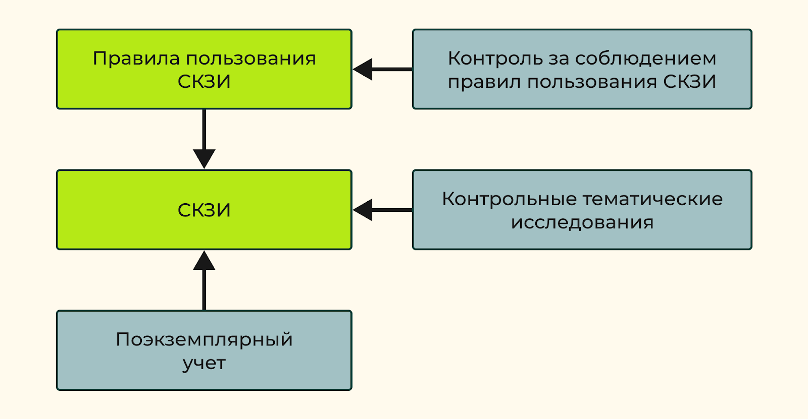

# 1. Системы полнодискового шифрования

## Предпосылки применения полнодискового шифрования

Классы средств защиты информации:
- КС1
- КС2
- КС3
- КВ
- КА

В зависимости от класса к средствам криптографической защиты информации предъявляют разные требования, соответствие которым проверяет государственный регулятор — ФСБ России.

## Задача полнодискового шифрования

KC2 и выше:
- защиту от действий нарушителя, который может осуществлять атаки, находясь внутри контролируемой зоны
- злоумышленник может иметь доступ к атакуемой системе, выдавая себя за легального пользователя

-> Злоумышленник может иметь доступ к носителю информации

Злоумышленник, как часть персонала может:
- Попробовать скопировать данные с компьютера на свой USB-накопитель
- может войти в систему, выдавая себя за легального пользователя, и получить доступ к защищенной информации
- может попробовать вынести физический жесткий диск или другой носитель данных из компьютера

используется криптографическая подсистема с функцией полнодискового шифрования - полного шифрования всех данных, расположенных на носителе информации.

чаще всего применяются симметричные блочные шифры, функционирующие в определенных режимах

целевые оценки стойкости достигаются за счёт использования дополнительных данных:
- векторов инициализации (или синхропосылок)
- счётчиковвыработки имитовставок

-> требуют дополнительных затрат памяти

> **Disk Encryption with Counter (DEC)** - режим работы блочных шифров для защиты носителей информации с блочно-ориентированной структурой. Требует хранения значительных объёмов дополнительных данных

> **Полнодисковое шифроване** - процесс, который реализуется модулями защиты, функционирующими между драйвером диска и файловой системой

## Хранение и защита данных в операционной системе

### Уровни операций сопутсвующих сохранению данных

- уровень прикладных программных компонентов
- уровень файловой системы
- уровень драйвера диска
- уровень контроллера жесткого диска

### Взаимодействие между прикладными программными компонентами и контроллером 

1. Прикладная компонента при работе с диском оперирует интерфейсом, предоставляемым файловой системой. При этом информация имеет древовидную структуру, которая описывается в терминах директорий и файлов.
1. Файловая система посылает запрос на чтение или запись данных диска с помощью интерфейса, предоставляемого драйвером диска. При этом единицей чтения и записи данных является логический сектор.
1. Драйвер диска обращается для записи или чтения данных к контроллеру жёсткого диска. На этом этапе взаимодействие осуществляется в терминах, максимально приближенных к физической структуре диска, например, дорожек и физических секторов.

**Универсальность подхода защиты** тем выше, чем больше число компонент, для которых модуль защиты может обеспечить свойства безопасности, и чем меньше дополнительных действий, например, изменений в программном коде, которые для этого необходимо осуществить.

**Прозрачность** — это когда модуль полностью повторяет интерфейс компоненты, находящейся непосредственно под ним. модулю удаётся обеспечить защиту для всех вышестоящих компонент без необходимости внесения в них каких-либо изменений.

Для реализации защиты ниже уровня драйвера диска используют аппаратные решения.

Примеры осуществления защиты хранимых данных на разных уровнях взаимодействия
- Функция шифрования документов, встроенная в текстовый редактор Microsoft Word внутрепрограммный модуль защиты
- Модуль защиты файлов AxCrypt компонента прикладного уровня и может обеспечить защиту любого файла, вне зависимости от того, какой прикладной компонентой он был создан
- Защита данных в NTFS (EFS - Encrypting File System) модуль защиты, который реализован внутри файловой системы. Предназначен только для NTFS
- Программный модуль VeraCrypt обеспечивает защиту всех секторов жесткого диска. Он функционирует между файловой системой и драйвером жесткого диска

Драйвер диска, если и порождает в процессе работы служебные данные, то они имеют крайне незначительный объём, а необходимость в их защите минимальна.

## Применение полнодискового шифрования

Модуль полнодискового шифрования перехватывает запрос от файловой системы, преобразует переданные в его составе данные и осуществляет взаимодействие с драйвером диска для реализации функций безопасности и записи данных на диск.

- должен полностью совпадать с интерфейсом драйвера жёсткого диска той операционной системы, в которой он функционирует
- файловая система «не знает» о том, что данные на используемом ею жёстком диске защищены

При обработке запроса от файловой системы модуль полнодискового шифрования может посылать к драйверу диска уже несколько запросов на чтение и запись

> **Токен** - защещенный носитель для хранения данных

## Этапы работы

### 1. Этап инициализации

- Модулю полнодискового шифрования на вход подаётся диск в исходном незащищённом виде
- Модуль осуществляет все действия, необходимые для его последующей защиты
    -  разметку с выделением, возможно, области для своих служебных данных
    - генерацию ключей
    - начальное шифрование данных
    - сохранение необходимой информации на токене
    -  и так далее.

### 2. Этап начала сеанса

- Предоставление модулю полнодискового шифрования возможности взаимодействия с токеном, содержащим ключевой материал, с помощью которого защищён диск.
- Разворачивание в оперативной памяти операционной системы ключевой системы, необходимой для работы с модулем полнодискового шифрования
- чтение с токена дополнительных данных и осуществление других операций, необходимых для обеспечения целевых свойств безопасности и перехода к следующему этапу

### 3. Основной этап.

Взаимодействие файловой системы с драйвером жесткого диска (чтение и запись данных) через модуль полнодискового шифрования

### 4. Этап завершения сеанса

- Осуществление операций, необходимых для обеспечения целевых свойств безопасности и завершения работы с модулем полнодискового шифрования.
- Завершение работы с токеном, например, загрузка модифицированных за время сеанса дополнительных данных и отсоединение токена от рабочей машины.

## Эксплуатационные свойства систем полнодискового шифрования

### Используемая память

- необходимые для работы размер защищённой памяти
- размер оперативной памяти
- относительный размер её служебных данных
- отношение размера служебных данных к размеру защищаемого полезного пространства диска
- отношение размера используемой оперативной памяти к размеру защещенной области диска

### Операционная трудоёмкость

- количество операций чтения и записи секторов, осуществляемых драйвером диска на разных этапах работы
- часто ощутимо влияют на износ диска, а их допустимое количество заметно ограничено

### Вычислительная трудоёмкость

- объём вычислений, производимых модулем полнодискового шифрования для осуществления операций на разных этапах работы.

### Устойчивость к сбоям

- аварийные ситуации различного характера должны минимально влиять на хранимые данные
- необходимо учитывать не только получение самих данных, но и сохранение доверия к ним в случае обеспечения целостности

## Криптографические свойства систем полнодискового шифрования

Будем иметь ввиду конфиденциальность или целостность одного потока сообщений, каждое из которых является либо совокупностью всех данных диска, либо данными конкретного сектора.

свойство обеспечивается на уровне 
- диска, если сообщением является совокупность всех прикладных данных
- сектора, если сообщением являются прикладные данные конкретного сектора

### Конфиденциальность

В одном и том же секторе диска в разные моменты времени, а также одновременно в разных секторах диска может быть записана информация, к которой предъявляются различные требования по обеспечению конфиденциальности.

> **конфиденциальность хранимых на диске прикладных данных** - невозможность раскрытия противником какой-либо информации о сообщениях

Необходимым условием обеспечения полноценной конфиденциальности является увеличение размера шифртекста по сравнению с размером открытого текста $\implies$ больше места на носителе

#### Конфиденциальность на уровне диска

- противник не получает никакой информации о хранимых на диске прикладных данных
- противник также не должен узнавать номер изменяемого сектора - трудозатратно

#### Конфиденциальность на уровне сектора

- противник не получает никакой информации о прикладных данных, хранимых в конкретном секторе
- обеспечение конфиденциальности на уровне сектора для всех прикладных секторов диска $\neq$ обеспечению конфиденциальности на уровне диска
- у противника появляется информация о том, в какие именно секторы осуществляется обращение
- более эффективно
- такой конфиденциальности не всегда достаточно

### Целостность

> невозможность внесения противником недетектируемых изменений в данные, записанные на диск

- «отправляющая» (записывающая) и «принимающая» (считывающая) стороны являются одним и тем же объектом
- обеспечение «актуальности» данных - пользователь должен быть уверен, что при чтении он получит те же данные, которые были сохранены на диск в результате предыдущей операции записи

Обеспечение целостности невозможно без увеличения длины шифртекста относительно длины открытого текста $\implies$ больше места на носителе

Дополнительные служебные данные $\implies$
- больше места на носителе
- усложнение модклей полн.диск. шифр.
- замедлению скорости обработки данных

> **Псевдоцелостность** - невозможность внесения контролируемых изменений в сообщение, то есть любые изменения шифртекста приведут к тому, что расшифрованный текст будет выглядеть, как случайное сообщение

#### Целостность на уровне диска

- невозможность внесения каких-либо изменений в данные диска как упорядоченного набора, в том числе — перемещение данных из одного сектора в другой
- Псевдоцелостность: изменение шифртекста любого сектора должно приводить к непредсказуемым изменениям всех прикладных данных

#### Целостность на уровне сектора

- невозможность внесения каких-либо изменений в данные конкретного сектора, в том числе невозможность замены данных этого сектора на данные других секторов
- обеспечение целостности на уровне сектора для каждого сектора эквивалентно обеспечению целостности на уровне диска
- Псевдоцелостность: непредсказуемым изменениям только прикладных данных, хранящихся в соответствующем измененном секторе

## Сценарии использования систем полнодискового шифрования

несколько схем полнодискового шифрования, каждая из которых оптимизирована для конкретных более узких условий эксплуатации.

### Персональный съемный диск

Пример: USB-флэшка, используемый для хранения конфиденциальной информации личного и/или рабочего характера.

Особенности:
- относительно небольшой объём защищаемых данных (до 256 Гбайт)
- небольшой объём оперативной памяти машин, на которых осуществляется работа с диском
- относительно непродолжительные сеансы работы и большое количество операций начала и завершения сессии
- небольшой совокупный размер данных, с которыми производятся операции в течение сеанса или, по крайней мере, продолжительного промежутка времени в рамках сеанса
- ненулевая вероятность сбоев всех типов, так, в случае частого использования возможно отключение пользователем диска от рабочей машины без процедуры завершения сеанса

### Хранилища центров обработки данных

Защищённое хранение огромного объёма данных, доступ к которым серверная операционная система одновременно предоставляет большому числу клиентов.

Особенности:
- большой объём защищаемых данных (от 2 Тбайт)
- большой объём оперативной памяти сервера, осуществляющего работу с диском
- малое число операций начала и завершения сеанса работы и крайне продолжительные сессии
- большой объём данных, с которыми производятся операции в течение даже не самого продолжительного периода времени, при этом расположение запрашиваемых секторов имеет преимущественно случайный характер
- минимальная вероятность сбоев, дублирование хранения обеспечивает защиту от ошибок на физическом уровне и от внезапных потерь доступа к диску. Использование систем бесперебойного питания минимизирует риск внезапного отключения питания машины.

## 2. Программа PGP

> **PGP** - ПО обеспечивающее секретность передаваемой информации

Использует:
- шифрование с открытым ключом
- симметричное шифрование
- электронные подписи
- сеть доверия

С помощью PGP пользователи могут
- отправлять зашифрованные сообщения
- проверять их подлинность
- фиксировать факт изменения, если таковое было

Причины актуальности PGP
- **Защита конфиденциальности данных** PGP шифрует данные, которые вы отправляете или получаете, защищая их от несанкционированного доступа.
- **Обеспечение подлинности сообщений** PGP создаёт цифровую подпись, которая доказывает, что сообщение действительно отправлено автором и не было изменено в процессе передачи. Это помогает бороться с подделками и гарнтирует подлинность данных.
- **Защита от прослушивания** PGP использует шифрование, которое защищает данные от прослушивания и перехвата злоумышленниками.
- **Сохранение данных в цифровую эпоху**  больше информации хранится и передаётся в цифровой форме. PGP помогает сохранять данные в безопасной и надёжной форме.

### Криптографические примитивы в основе PGP

- Для шифрования данных использует криптоалгоритм IDEA
- Для управления ключами и цифровой подписи — RSA (длина ключа — до 2047 битов)
- Для однонаправленного хэширования — хэш-функцию MD5  
- Для генерирации случайных открытых ключей применяется вероятностная проверка чисел на простоту
- Для получения начальных значений используются временные интервалы между нажатиями пользователем клавиш на клавиатуре
- Генерация случайных ключей для IDEA происходит с помощью метода в стандарте [ANSI X9.17](https://studfile.net/preview/6311379/page:56/)
- Шифрует закрытый ключ пользователя с помощью хэшированной парольной фразы

### Принцип работы

- Зашифрованные сообщения имеют несколько уровней безопасности
- Единственное, что известно криптоаналитику о зашифрованном сообщении — это получатель сообщения
- Распределённый подход к управлению ключами, построенный на схеме с поручителями

> **Поручители** — это пользователи системы, которые подписывают открытые ключи своих друзей

отсутствии удостоверяющего центра 
отсутствии гарантий того, что обе стороны обмена доверяют поручителям

- Нет удостоверяющих центров, вместо этого — сеть доверия
- Программа PGP не определяет стратегию установки доверительных связей — пользователи сами решают, кому верить, а кому нет

***

- Каждый пользователь хранит набор подписанных открытых ключей в виде файла, называемого **кольцом открытых ключей**
- Каждый ключ кольца обладает **полем законности**, определяющим уровень доверия к ключу конкретного пользователя
    - измеряет, насколько пользователь верит тому, кто подписал открытые ключи других пользователей
    - задаёт уровень, определяющий, насколько конкретный пользователь верит владельцу ключа, подписавшему другие открытые ключи
    - поле вручную устанавливается пользователем
- По мере появления новой информации PGP непрерывно обновляет эти поля

## Настройка и безопасность

### Инструкция по настройке

1. Загрузите программу [Gpg4win](https://www.gpg4win.org/), и настройте её с помощью электронной почты, совместимой с OpenPGP.
1. Найдите открытый ключ абонента, с которым вам нужно связаться, и импортируйте его.
1. Затем используйте электронную почту, совместимую с OpenPGP, и напечатайте сообщение. Можно добавить к сообщению электронную подпись, если есть опасения, что оно может быть подделано. В результате применения хэш-функции необходимо получить хэш-значение открытого текста (сообщения), который затем зашифровывается закрытым ключом. Электронная подпись будет отправлена вместе с сообщением.

### Механизм работы

1. PGP сжимает открытый текст, что делает процесс более эффективным и устойчивым к криптоанализу
1. Создаёт одноразовый сеансовый ключ
    - сеансовый ключ используется для эффективного шифрования открытого текста с помощью криптографии с симметричным ключом
1. Сеансовый ключ зашифровывается с использованием открытого ключа получателя
    - Шифрование с открытым ключом требует больше ресурсов, но оно позволяет безопасно отправить сеансовый ключ получателю
1. Затем зашифрованный текст, зашифрованный сеансовый ключ и электронная подпись отправляются получателю
1. Получатель использует свой закрытый ключ для расшифрования сеансового ключа
1. При помощи сеансового ключа расшифровывается исходное сообщение

Если получатель не уверен в целостности сообщения или считает, что оно, было отправлено злоумышленником
- он может проверить электронную подпись
- Необходимо посчитать хэш-значение от полученного сообщения
- с использованием открытого ключа отправителя и электронной подписи получают изначальное хэш-значение сообщения

### Безопасность

Вероятность того, что у кого-то есть секретные средства взлома программы ничтожно мала, поэтому PGP довольно безопасна, если работать с ней в соответствии с руководством пользователя.

По мере развития в PGP было добавлено больше алгоритмов шифрования для повышения безопасности. 
Безопасность PGP основана на секретности закрытого ключа

### Ограничения использования

- программа не совсем удобна
- много различных версий PGP, каждая с новыми алгоритмами и функциями
- PGP по умолчанию не является анонимной

# 3. Технологии распределенного реестра

## Технологии распределенного реестра и блокчейн-технологии

> **Распределенный реестр** – это база данных, распределенная между разными сетевыми узлами

Каждый узел распр. реестра принимает и обрабатывает информацию независимо от других узлов

Узлы голосуют за обновления и принимают их большинством голосов в соответствии с определенным правилом (**консенсусом**) 
Как только консенсус достигнут, распределенный реестр обновляется и последняя согласованная версия реестра сохраняется в каждом узле

> **Блокчейн** - разновидность распределенного реестра. Блок = Узел. Блок не может быть удален ули изменен.

Блокчейн может быть использован для:
- совершения сделок с недвижимостью
- работы платежных сервисов
- идентификации и подтверждения прав доступа
- анонимных онлайн-голосований
- создания децентрализованных бирж

## Базовые механизмы блокчейн-систем

> **Транзакция** – это единичная запись в базе данных блокчейна

Транзакция состоит из нескольких **полей**. Поля могут включать различную информацию, например:
- имя пользователя
- адрес пользователя в блокчейн-сети
- идентификатор транзакции
- метка времени
- инструкции, по каким правилам обрабатывать транзакцию
- и т.д.

- **Данные отправителя** – параметры, позволяющие идентифицировать пользователя в блокчейн-системе (например открытый ключ пользователя или его хэш-код)
- **Электронная подпись**
    1. данные транзакции хэшируются
    2. хэши подписываются электронной подписью

У каждого пользователя есть пара ключей
- **Открытый ключ** - является идентификатором пользователя или применяется для формирования адреса пользователя
- **Закрытый ключ** генерируется пользователем при регистрации в системе, хранение полностью возлагается пользователя

### Формирование и проверка подписи

У создателя транзакции есть пара ключей:
- $K_{pub}$ - открытый ключ
- $K_{priv}$ - закрытый ключ

Пользователь, должен иметь возможность предоставить свой открытый ключ тем пользователям или узлам, которые будут выполнять проверку подписи

**Формирование подписи**
1. Из всех полей транзакции формируется хэш-код $H(m)$
2. Пименяется алгоритм электронной подписи 
хэш-код подписывается с использованием закрытого ключа $Sig = Signing(H(m), K_{priv})$
3. Получаем подпись $Sig$

**Проверка подписи**
1. Из всех полей транзакции без «Подпись», вычисляется хэш-код $H(m)$
2. Верификация подписи (Verification) 
на основе $H(m)$, значения подписи $Sig$ и открытого ключа отправителя $K_{pub}$

Если подпись транзакции оказалась верной, это значит, что транзакция прошла проверку:
- все данные, содержащиеся в транзакции, не изменились с момента ее подписания
- транзакция действительно сформирована указанным пользователем

### Транзакции пул памяти

> **Пул памяти** - очередь транзакций для помещения в блок. Разворачивается на узлах, занимающихся созданием блоков.

Все созданные и подписанные транзакции распространяются по блокчейн-сети и попадают в пул памяти

#### Проверки транзакций для помещения в пул памяти (совершаются на узлах создания блоков)

- транзакция
    - составлена правильно
    - соответствует синтаксису построения транзакций
    - содержит все обязательные поля
    - корректность заполнения обязательных полей
- размер транзакции в байтах меньше, чем максимально допустимый размер блока
- транзакция ранее не была уже добавлена в пул или в ранее сгенерированный блок, и отклонить транзакцию, если она уже есть в пуле или в системе
- если комиссия за транзакцию слишком мала для включения ее в блок, узел может отклонить транзакцию
- если это финансовая транзакция
    - списки входов и выходов транзакции существуют
    - списки входов и выходов не являются пустыми
    - сумма входов и выходов совпадает
    - ни один из ее входов не ссылался на выход другой транзакции в пуле, в противном случае отклонить транзакцию

#### Проблема накопления транзакций в пуле

Транзакции, не попадающие в блок, накапливаются в пуле

Возможные решения
- если для общего объема транзакций, общая сумма комиссий за все эти транзакции не превышает некоторого минимального установленного порога, то эти транзакции удаляются из пула
- если пул заполнен полностью, то также происходит автоматическое удаление транзакций, которые имеют малую комиссию
- в пул памяти добавляются только те транзакции, у которых размер комиссии не меньше определенного порогового значения

## Применение деревьев Меркля при формировании блоков

Принцип построения дерева
- **Листьями дерева** являются хэш-коды всех транзакций, которые требуется собрать в единый блок
- Хэш-коды транзакций группируются попарно
- Из каждой пары вырабатывается новый хэш-код
- Если количество транзакций в блоке нечетное, то последняя транзакция дублируется
- алгоритм повторяется, пока не останется один хэш-код - он становится **корнем**

Корень помещяется в блок для проверки его целостности

Дерево Меркля для шести транзакций в блоке  

Дерево Меркля для пяти транзакций в блоке  

**Преимущества алгоритма**

- При нахождении транзакции, котороя уже была выделенна в другой блок нет необходимости пересчитывать весь текущий блок
    - необходимо пересчитать только хэш-коды тех ветвей дерева, в которых использовалась удаленная транзакция
- Клиентам могут самостоятельно проверять, была ли транзакция включена в блок
    - на основе значения корня Меркля из заголовка блока и списка промежуточных хэш-кодов дерева

## Механизмы консенсуса

> **Консенсус** - некоторое общее правило, установленное для конкретной блокчейн-системы, в соответствии с которым происходит подтверждение записей в цепочке блокчейна для всех узлов сети

В настоящий момент насчитывается более десятка различных консенсусов. Самым распространенным и самым известным является консенсус доказательства работы, который называется **Proof of Work (PoW)**

### Консенсус доказательства работы Proof of Work

Цепочка блоков совместно поддерживается анонимными одноранговыми узлами в сети $\implies$ каждый блок должен иметь доказательство, что в его создание был вложен значительный объем работы

- никто не может изменить (быстро пересчитать и переписать) исходную цепочку блоков
- изменение транзакций, включенных в любой блок $\implies$ изменения всех последующих блоков

сложность модификации конкретного блока увеличивается с каждым новым блоком, добавленным в цепочку, что усиливает эффект доказательства работы

#### Недостатки

- Требует больших вычислительных ресурсов и, как следствие, большого потребления электроэнергии
- Зная, какой алгоритм хэширования используют наиболее популярные криптовалютные блокчейны $\implies$ появление специализированных устройства, (быстрее, чем это может сделать процессор обычного персонального компьютера)
- Атака 51 %: если в руках у злоумышленника сосредоточится больше вычислительных ресурсов, чем у всей остальной сети, тогда злоумышленник может построить новую цепочку блоков в соответствии со всеми правилами блокчейн-системы

#### Алгоритм GHOST (Greedy Heaviest Observed Subtree – «самое тяжелое наблюдаемое поддерево»)

алгоритм ориентируется на количество блоков в дереве, образуемом текущей цепочкой.

Учитывается не только длина самой цепочки, но и блоки на разных ее высотах, т. е. в расчете показателей каждой цепочки фактически участвует дерево и количество блоков, которое в нем находится

### Консенсус доказательства владения долей Proof of Stake

нет майнеров, но есть валидаторы

> **Валидаторы** – это пользователи блокчейн-системы, обладающие определенным ресурсом (валютой)

Чем больше у пользователя ресурсов, тем больше к нему доверия и тем больше шансов, что он сможет создать новый блок

Валидатор
- должен заблокировать на время часть своих ресурсов (ставка) 
- принесет вознаграждение в том случае, если блок, созданный валидатором, будет добавлен в блокчейн-сеть
- вознаграждение пропорционально ставке. чем выше заблокированная ставка, тем больше полученная валидатором комиссия

Плюсы
- экономия вычислительного ресурса и электроэнергии
- Для атаки 51 % пользователю придется скупить 51 % всех существующих монет (не выгодно нарушать работу системы)

Минусы
- требует наличия у валидатора больших средств
- уменьшение количества участвников в валидации

### Консенсус на основе решения задачи византийских генералов

Основная задача: система продолжит устойчивую работу даже в случае, когда один или несколько узлов будут принимать решения, не совпадающие с решением большинства узлов.

- В системе существует ряд валидаторов, которые принимают решение о подтверждении транзакции
- Каждый валидатор должен выполнить ряд проверок и опросить по очереди все другие узлы, чтобы принять решение, действительна транзакция или нет
- Для подтверждения, необходим положительный ответ от 2/3 общего пула участников
- Принятое решение пересылается в сеть, с тем чтобы другие валидаторы получили к нему доступ
- Консенсус достигается на основании ответов всех валидаторов

Плюсы:
- эффективен при низких задержках сети

Минусы:
- усложняется при росте количества участников сети
- каждое сообщение влечет за собой множество других запросов и проверок

## Выстраивание цепочки блоков

> **Блок** - основной элементом структуры блокчейн-системы

В крипте: Для облегчения работы с блоком для всех транзакций вычисляется корень дерева Меркля, который и помещается в блок

Блоки должны быть связаны в единую цепь, которую незаметно нарушить злоумышленнику будет очень проблематично (механизмов консенсуса)

Пример построения цепочки блоков 

Для связи блоков друг с другом в данном случае используется хэш-код, полученный от полного содержания блока 
У первого блока - обычно 0

При поиске хэш-кода вычисляющий узел (майнер) должен подобрать такое значение поля **nonce**, чтобы в вычисленном хэш-коде было сформировано заданное системой количество нулей.

## Смарт-контракты

Идея: некий программный код будет отвечать за соблюдение условий сделки разными сторонами договора

смарт-контракт должен выполняться программно и автоматически проверять заданные для него условия

Отличительной особенностью смарт-контрактов является автоматическая проверка условий и уход от посредников

в случае возникновения спорных ситуаций могут требоваться услуги арбитра –третьей независимой стороны, которая призвана решить возникший конфликт

## Основные виды блокчейн-систем

- публичные
- приватные
- гибридные

### Публичный блокчейн

находятся в открытом доступе, то есть представляют собой открытую сеть

является полностью децентрализованным

Отличительные черты
- **функционирование по принципу распределенного реестра** все узлы в цепочке блоков имеют право участвовать в проверке транзакций
- **открытое чтение и запись данных** любая участвующая сторона может читать, писать и просматривать данные в цепочке блоков
- **неизменность** после проверки записи ее нельзя изменить или удалить

Минусы:
- значительная вычислительная мощность, необходимая для поддержки крупномасштабного распределенного реестра

### Приватный блокчейн

определение круга лиц, которому разрешено
- участвовать в работе сети
- формировать новые блоки, то есть фактически выполнять протокол консенсуса и обеспечивать общую работу реестра

для приватного блокчейна требуется приглашение, которое должно быть подтверждено либо самим владельцем (инициатором) сети, либо набором правил, установленных инициатором сети

обеспечивают бóльшую масштабируемость с точки зрения пропускной способности транзакций

# 4. Разработка, производство и эксплуатация систем криптографической защиты информации

## Положение ПКЗ-2005

[Положение о разработке, производстве, реализации и эксплуатации шифровальных (криптографических) средств защиты информации (Положение ПКЗ-2005)](https://docs.cntd.ru/document/901925185?marker=6540IN) регулирует отношения, возникающие при разработке, производстве, реализации и эксплуатации средств криптографической защиты информации (СКЗИ) с ограниченным доступом, не содержащей сведений, составляющих государственную тайну, то есть информация конфиденциального характера.

**ПКЗ-2005 необходим если:**
1. информация конфиденциального характера подлежит защите в соответствии с законодательством Российской Федерации
1. криптографическая защита информации конфиденциального характера реализуется в федеральных органах исполнительной власти, органах исполнительной власти субъектов Российской Федерации, то есть в государственных органах
1. криптографическая защита информации конфиденциального характера реализуется в организациях независимо от их организационно-правовой формы и формы собственности при выполнении ими работ для государственных нужд, то есть в организациях, выполняющих государственные заказы
1. обязательность защиты информации конфиденциального характера возлагается законодательством Российской Федерации на лиц, имеющих доступ к этой информации или наделенных полномочиями по распоряжению сведениями, содержащимися в данной информации
1. обрабатывается информация конфиденциального характера, обладателем которой являются государственные органы или организации, выполняющие государственные заказы, в случае принятия ими мер по охране ее конфиденциальности путем использования СКЗИ
1. при обработке информации конфиденциального характера в государственных органах и в организациях, выполняющих государственные заказы, обладатель которой принимает меры к охране ее конфиденциальности путем установления необходимости криптографической защиты данной информации.

**Требования Положения ПКЗ-2005 носят рекомендательный характер при разработке, производстве, реализации и эксплуатации:**
1. СКЗИ, доступ к которой ограничивается по решению обладателя или пользователя данной информации, собственника информационных ресурсов (информационных систем) или уполномоченных ими лицами, не являющихся государственными органами или организациями, выполняющими государственные заказы
1. СКЗИ открытых и общедоступных государственных информационных ресурсов Российской Федерации
1. средств ЭП, предназначенных для использования в электронном документообороте, информация которого не относится к информации конфиденциального характера
1. информационно-телекоммуникационных систем, реализующих функции криптографической защиты информации, не относящейся к информации конфиденциального характера.

## Порядок разработки средств криптографической защиты информации

- если разработка СКЗИ проводится для федеральных государственных нужд, то она осуществляется государственным заказчиком по согласованию с ФСБ.
- если же СКЗИ разрабатывается в интересах негосударственных организаций, то она может осуществляться по заказу конкретного потребителя информации конфиденциального характера или по инициативе разработчика СКЗИ, причем заказчиком СКЗИ может являться любое лицо.

Разработка СКЗИ осуществляется либо путем постановки и проведения НИР по исследованию возможности создания нового образца СКЗИ или ОКР по созданию нового образца СКЗИ или модернизации действующего образца СКЗИ.

Заказчик СКЗИ направляет ТТЗ или ТЗ на рассмотрение в ФСБ, которая согласует его или дает мотивированный отказ.

Результатом НИР являются:
- проект ТТЗ или ТЗ на проведение ОКР по созданию нового образца СКЗИ или модернизации действующего образца СКЗИ;
- технико-экономическое обоснование данной ОКР.

При разработке СКЗИ рекомендуется использовать криптографические алгоритмы, утвержденные в качестве национальных стандартов или определенные перечнями, утверждаемыми в порядке, установленном [постановлением Правительства Российской Федерации от 23 сентября 2002 года № 691](https://base.garant.ru/185065/).

Выбор носителя ключевой информации должен осуществляться с учетом возможности его приобретения в течение всего предполагаемого срока эксплуатации СКЗИ, оценку его эксплуатационных характеристик проводит разработчик СКЗИ.

Правила пользования СКЗИ составляются разработчиком и согласовываются с ФСБ.

При разработке СКЗИ создается рабочая конструкторская документация (РКД) на СКЗИ и опытный образец, разработанный в соответствии с РКД на него.

необходимо проводить тематические исследования СКЗИ (криптографические, инженерно-криптографические и специальные исследования СКЗИ) 
Тематические исследования СКЗИ выполняются в процессе всего жизненного цикла СКЗИ специализированными организациями

РКД на СКЗИ передается в производство при наличии:

1. положительных результатов испытаний функционирования СКЗИ в штатных режимах;
1. положительных результатов экспертизы тематических исследований СКЗИ;
1. правил пользования СКЗИ, согласованных с ФСБ.

## Порядок производства средств криптографической защиты информации

**До того, как будет принято решение о производстве СКЗИ, необходимо следующее:**

1. утвердить акт о завершении корректировки РКД на СКЗИ;
1. доработать опытные образцы СКЗИ по результатам испытаний штатного функционирования СКЗИ;
1. оценить соответствие опытных образцов СКЗИ требованиям по безопасности информации.

**Производство СКЗИ осуществляется в соответствии с:**

1. техническими условиями, согласованными с ФСБ и специализированной организацией, которая проводила тематические исследования СКЗИ;
1. конструкцией и технологией изготовления опытных образцов СКЗИ, прошедших испытания на функционирование опытного образца СКЗИ в штатных режимах и имеющих положительное заключение экспертизы тематических исследований СКЗИ.

**Производство ключевых документов с использованием внешней системы изготовления осуществляется:**

1. с использованием программно-аппаратных средств, созданных разработчиком ключевых документов;
1. в соответствии с технической, конструкторско-технологической и эксплуатационной документацией при наличии положительного заключения ФСБ о соответствии изготавливаемых ключевых документов заданным требованиям по безопасности информации.

## Порядок распространения средств криптографической защиты информации

Реализовывать или распространять СКЗИ и (или) РКД на них может только юридическое лицом или индивидуальный предприниматель, имеющим право на осуществление данного вида деятельности, связанного с СКЗИ. Распространение СКЗИ возможно только с правилами пользования ими, согласованными с ФСБ.

Приобретение РКД на СКЗИ, в том числе тиражирование программных СКЗИ осуществляется юридическими лицами - разработчиками и (или) изготовителями СКЗИ.

## Порядок эксплуатации средств криптографической защиты информации

Эксплуатация СКЗИ осуществляется в соответствии с правилами пользования ими. Если в правила пользования СКЗИ вносятся изменения, должны согласовываться с ФСБ и специализированной организацией, проводившей тематические исследования СКЗИ.

Эксплуатируемые СКЗИ должны подвергаться контрольным тематическим исследованиям, сроки проведения которых определяет заказчик СКЗИ по согласованию с разработчиком СКЗИ, специализированной организацией и ФСБ.

Необходимо осуществлять поэкземплярный учет как СКЗИ, так и их опытных образцов. Организацию поэкземплярного учета опытных образцов СКЗИ обеспечивает разработчик СКЗИ, изготовленных СКЗИ — изготовитель СКЗИ, используемых СКЗИ — заказчик СКЗИ. Централизованный поэкземплярный учет опытных образцов СКЗИ, а также изготовленных и используемых СКЗИ осуществляется ФСБ.

Контроль за соблюдением правил пользования СКЗИ, а также условий производства ключевых документов, осуществляется в соответствии с требованиями Федерального закона от [26.12.2008 N 294-ФЗ О ЗАЩИТЕ ПРАВ ЮРИДИЧЕСКИХ ЛИЦ И ИНДИВИДУАЛЬНЫХ ПРЕДПРИНИМАТЕЛЕЙ ПРИ ОСУЩЕСТВЛЕНИИ ГОСУДАРСТВЕННОГО КОНТРОЛЯ (НАДЗОРА) И МУНИЦИПАЛЬНОГО КОНТРОЛЯ](https://normativ.kontur.ru/document?moduleId=1&documentId=452948)

**Контроль за соблюдением правил пользования СКЗИ осуществляется:**

1. пользователем защищаемой информации, установившим режим защиты информации с применением СКЗИ;
1. собственником информационных ресурсов, в составе которых применяются СКЗИ;
1. ФСБ в рамках контроля за организацией и функционированием криптографической и инженерно-технической безопасности информационно-телекоммуникационных систем, систем шифрованной, засекреченной и иных видов специальной связи.

**Контроль за соблюдением условий производства ключевых документов, указанных в технической, конструкторско-технологической и эксплуатационной документации к внешней системе изготовления ключей, осуществляется:**

1. изготовителем ключевых документов;
1. ФСБ в рамках контроля за организацией и функционированием криптографической и инженерно-технической безопасности информационно-телекоммуникационных систем, систем шифрованной, засекреченной и иных видов специальной связи.

**При эксплуатации СКЗИ их пользователи должны выполнять следующие обязанности, предписанные Инструкцией:**

1. не разглашать конфиденциальную информацию, к которой они допущены, рубежи ее защиты, в том числе сведения о криптографических ключах
1. соблюдать требования по обеспечению безопасности конфиденциальной информации с использованием СКЗИ
1. сообщать в орган криптографической защиты об известных им попытках посторонних лиц получить сведения об используемых СКЗИ или ключевых документах
1. сдать СКЗИ, эксплуатационную и техническую документацию к ним, ключевые документы при увольнении или отстранении от исполнения обязанностей, связанных с использованием СКЗИ
1. немедленно уведомлять орган криптографической защиты о фактах утраты или недостачи СКЗИ, ключевых документов к ним и о других фактах, которые могут привести к разглашению защищаемой информации, а также о причинах и условиях возможной утечки таких сведений.

Общая схема процесса использования криптографических ключей 

## Особенности обеспечения безопасности хранения, обработки и передачи информации с использованием средств криптографической защиты информации

### Функциями органа криптографической защиты являются:

1. проверка готовности обладателей конфиденциальной информации к самостоятельному использованию СКЗИ и составление заключений о возможности эксплуатации СКЗИ
1. разработка мероприятий по обеспечению функционирования и безопасности применяемых СКЗИ в соответствии с условиями выданных на них сертификатов, а также в соответствии с эксплуатационной и технической документацией к ним
1. обучение лиц, использующих СКЗИ, правилам работы с ними
1. поэкземплярный учет используемых СКЗИ, эксплуатационной и технической документации к ним
1. учет обслуживаемых обладателей конфиденциальной информации, а также пользователей СКЗИ
1. подача заявок в ФСБ или лицензиату, имеющему лицензию ФСБ на деятельность по изготовлению ключевых документов для СКЗИ, на изготовление ключевых документов или исходной ключевой информации
1. контроль за соблюдением условий использования СКЗИ, установленных эксплуатационной и технической документацией к ним, сертификатом ФСБ и Инструкцией
1. расследование и составление заключений по фактам нарушения условий использования СКЗИ, которые могут привести к снижению уровня защиты конфиденциальной информации
1. разработка и принятие мер по предотвращению возможных опасных последствий нарушений условий использования СКЗИ
1. разработка схемы организации криптографической защиты конфиденциальной информации.

**При определении обязанностей сотрудников органов криптографической защиты лицензиаты ФСБ должны принимать во внимание, что безопасность хранения, обработки и передачи по каналам связи конфиденциальной информации с использованием СКЗИ обеспечивается:**

1. соблюдением сотрудниками органов криптографической защиты режима конфиденциальности защищаемой информации, в том числе со сведениями о функционировании и порядке обеспечения безопасности применяемых СКЗИ и ключевых документах к ним
1. точным выполнением сотрудниками органов криптографической защиты требований по обеспечению безопасности конфиденциальной информации
1. надежным хранением сотрудниками органов криптографической защиты СКЗИ, эксплуатационной и технической документации к ним, ключевых документов и носителей конфиденциальной информации
1. своевременным выявлением сотрудниками органов криптографической защиты попыток посторонних лиц получить сведения о защищаемой конфиденциальной информации, об используемых СКЗИ или ключевых документах к ним
1. немедленным принятием сотрудниками органов криптографической защиты мер по предупреждению разглашения защищаемой конфиденциальной информации, а также возможной ее утечки при выявлении фактов утраты или недостачи СКЗИ, ключевых документов к ним, удостоверений, пропусков, ключей от помещений, хранилищ, сейфов, личных печатей и т.п.

# Список литературы

1. Aumasson, J. Serious Cryptography: a practical introduction to Modern Encryption [Text] / J. Aumasson. 1st edition. — USA(CA): No Starch Press, 2018. — 292 с.
1. Blahut, R.E. Cryptography and Secure Communication [Text] / R.E. Blahut. 1st edition. — USA: Cambridge University Press, 2014. — 608 с.
1. Keith, M.M. Everyday Cryptography: fundamental principles and Applications [Text] / M.M. Keith. 2nd edition. — USA.: Oxford Press, 2017. — 674 с.
1. Menezes, A., Oorshot, P., Vanstone, S. Handbook of Applied Cryptography [Text] / A.J. Menezes, P.C. Oorshot. 5th edition. — USA.: CRC Press, 2001. — 816 с.
1. Zimmerman, P.R. The Official PGP User’s Guide [Text] / P.R. Zimmerman. — Boston: MIT Press, 1995. — 127 с.
1. Абрамов, Е.С. Кибербезопасность. Учебное пособие [Текст] / Е.С. Абрамов, Е.С. Басан, О.Ю. Пескова, О.П. Харабов, А.В. Епишкина К.Г. Когос. — СПб.: ГУАП, 2021. — 169 с.
1. Аграновский, А.В. Практическая криптография: алгоритмы и их программирование [Текст] / А.В. Аграновский, Р.А. Хади. — М.: Солон Пресс, 2009. — 256 с.
1. Алферов, А.П. Основы криптография [Текст]: учеб. пособие для вузов / А.П. Алферов, А.Ю. Зубов, А.С. Кузьмин, А.В. Черемушкин. — М.: Гелиос АРВ, 2001. — 480 с.
1. Баричев, С.Г. Основы современной криптографии [Текст] / С.Г. Баричев, Р.Е. Серов, В.В. Гончаров. — М.: «Горячая линия — Телеком», 2001. — 120 с.
1. Брассар, Ж. Современная криптология [Текст] / Пер. с англ. — М.: Издательско-полиграфическая фирма ПОЛИМЕД, 1999. — 176 с.
1. Епишкина, А.В. Нормативное регулирование в области защиты информации. Курс лекций [Текст] / А.В. Епишкина, С.В. Запечников. — М.: НИЯУ МИФИ, 2021. — 116 с.
1. Запечников, С.В. Криптографические протоколы и их применение в финансовой коммерческой деятельности [Текст]: учеб. пособие для вузов / С.В. Запечников. — М.: «Горячая линия — Телеком», 2007. — 331 с.
1. Иванов, М.А. Криптографические методы защиты информации в компьютерных системах и сетях [Текст]: учеб. пособие / М.А. Иванов, И.В. Чугунков. — М.: НИЯУ МИФИ, 2012. — 400 с.
1. Исагулиев, К.П. Справочник по криптологии [Текст] / К.П. Исагулиев. — Мн.: Новое знание, 2004. — 237 с.
1. Ищукова, Е.А. Криптографические основы блокчейн-технологий [Текст] / Е.А. Ищукова, С.П. Панасенко, К.С. Романенко, В.Д. Салманов. — М.: Издательство ДМК, 2022. — 302 с.
1. Мао, В. Современная криптография: теория и практика [Текст] / Пер. с англ. — М.: Издательский дом «Вильямс», 2005. — 768 с.
1. Масленников, М.Е. Практическая криптография [Текст] / М.Е. Масленников. — СПб.: БВХ — Петербург, 2003. — 464 с.
1. Молдовян, А.А. Введение в криптосистемы с открытым ключом [Текст] / А.А. Молдовян, Н.А. Молдовян. — СПб.: БХВ-Петербург, 2005. — 298 с.
1. Молдовян, А.А. Криптография [Текст]: учеб. пособие для вузов / А.А. Молдовян, Н.А. Молдовян, Б.Я. Советов. — СПб.: Издательство «Лань», 2000. — 235 с.
1. Молдовян, А.А. Криптография: скоростные шифры [Текст] / А.А. Молдовян и др. — СПб.: БХВ-Петербург, 2002. — 496 с.
1. Нестеров, С.А. Информационная безопасность и защита информации [Текст]: учеб. пособие / С.А. Нестеров. — СПб.: Издательство политехнического университета, 2009. — 127 с.
1. Погорелов, Б.А. Словарь криптографических терминов [Текст] / Под ред. Б.А. Погорелова, В.Н. Сачкова. — М.: МЦНМО, 2006. — 94 с.
1. Рябко, Б.Я. Криптографические методы защиты информации [Текст]: учеб. Пособие для вузов / Б.Я. Рябко, А.Н. Фионов. 2-е издание. — М.: «Горячая линия — Телеком», 2012. — 240 с.
1. Саломаа, А. Криптография с открытым ключом [Текст] / Пер. с англ. — М.: Мир, 1997. — 329 с.
1. Смарт, Н. Криптография [Текст] / Пер. с англ. — М.: Техносфера, 2005. — 529 с.
1. Тилборг, ван Х.К.А. Основы криптологии. Профессиональное руководство и интерактивный учебник [Текст] / Пер. с англ. — М.: Мир, 2006. — 471 с.
1. Фомичев, В. М. Методы дискретной математики в криптологии [Текст] / В.М. Фомичев. — М.: Диалог-МИФИ, 2010. — 425 с.
1. Черёмушкиин, А.В. Криптографические протоколы. Основные свойства и уязвимости [Текст]: учеб. пособие /А.В. Черёмушкин. — М.: Издательский центр «Академия», 2009. — 282 с.
1. Чмора, А.Л. Современная криптография [Текст]: учеб. пособие / А.Л. Чмора. — М.: Гелиос АРВ, 2001. — 266 с.
1. Шнайер, Б. Прикладная криптография. Протоколы, алгоритмы, исходные тексты на языке Си [Текст] / Пер. с англ. — М.: ТРИУМФ, 2012. — 610 с.
1. Ященко, В.В. Введение в криптографию [Текст]: учеб. пособие / Под общ. Ред. В.В. Ященко. 4-е издание — М.: МЦНМО, 2012. — 348 с.