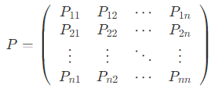
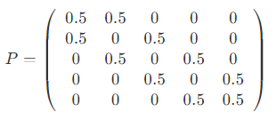
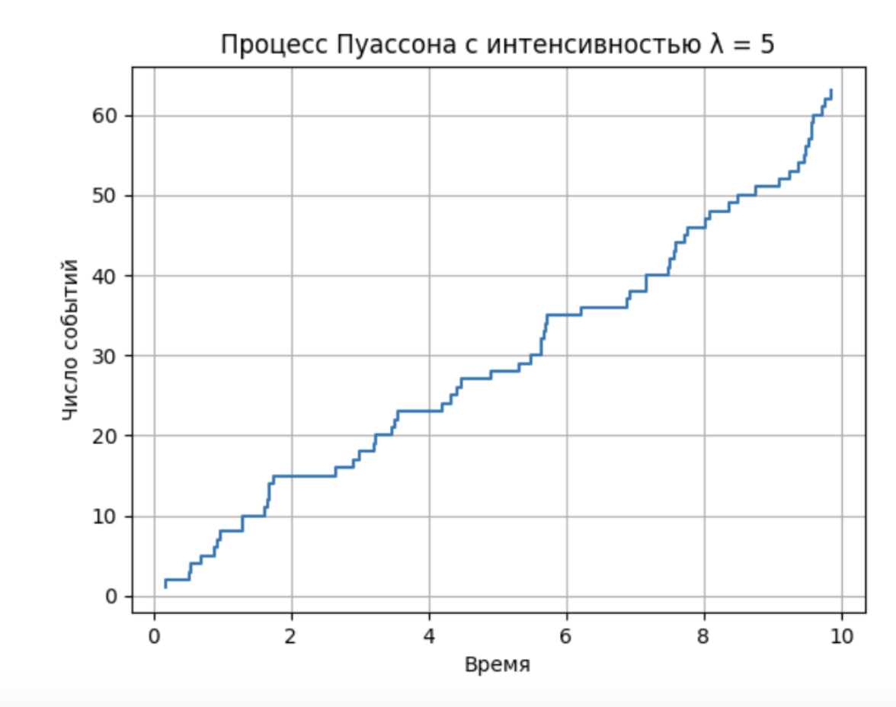
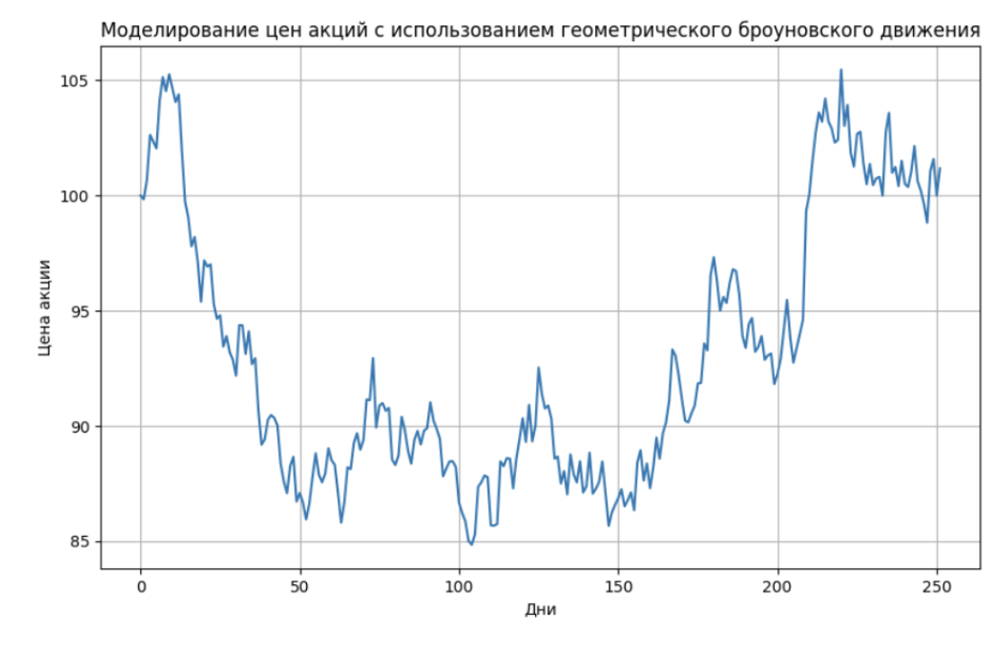

# 1. Введение в модуль

> **формализованные модели**<br>это абстракции реальных систем, которые позволяют описывать и анализировать сложные явления с помощью математических и логических подходов


## Преимущества формализованных моделей в ИБ

1. **систематизировать знания о системах безопасности**
    - Модели разбивают сложные системы на части
    - легче анализировать в дальнейшем
1. **более оперативно реагировать на инциденты**
    - Через структурирование подходов к анализу данных
        - выявлять аномалии
        - предсказывать потенциальные угрозы
    - предотвращать инциденты даже до их возникновения
1. **становится легче оценивать риски и управлять ими**
    - применять количественные методы для анализа рисков
    - принимать обоснованные решения о расходовании ресурсов
    - приоритизировать риски
    - определять самые уязвимые места в системах
1. **интегрировать в свою модель различные области знаний**
    - легче взаимодействовать со специалистами в области ПО, сетевых технологий и управления бизнес-процессами
    - создавать более устойчивые системы безопасности с широким спектром угроз и уязвимостей
1. **масштабировать и адаптировать системы безопасности к новым вводным**
    - помогают быстро перестраиваться и реагировать на новые виды угроз и технологий по-новому

## Приминение формализованных моделей и методах решения аналитических задач в ИБ

- **моделирования угроз (Threat Modeling)**, воздействующих на информационные системы, чтобы идентифицировать и оценить риски;
- **анализа рисков** 
    - с помощью количественных методов для оценки вероятности и тяжести инцидентов, чтобы принимать обоснованные решения для снижения рисков
    - например, метод анализа дерева отказов — Fault Tree Analysis
- **инцидентного реагирования**
    - быстрее обнаружить аномалии, попытки несанкционированного доступа и инциденты
- **оптимизации средств защиты**
    - эффективно использовать имеющиеся средства для противодействия самым критическим угрозам
    - например, теория игр и математические модели распределяют ресурсы в условиях ограниченных бюджетов на безопасность
- **симуляции атак**
    - насколько хорошо работают существующие меры безопасности
    - например, моделирование поведения злоумышленников и возможных атак на систему

## Формальная и формализованная модели

> это упрощенное представление реальной системы или процесса с помощью математических, логических, статистических или других аналитических методов. Такая модель позволяет анализировать сложные явления, прогнозировать их поведение и принимать на основе полученных данных обоснованные решения.

формализованная модель получается в результате преобразования неформальной
- задача и соответствующая ей модель изначально были нам даны или приведены к формальному «языку»: математическому, логическому, формульному, диаграммовому и пр.

| Формальная доель | Формализованная модель |
| -- | -- |
| обычно более абстрактна | более конкретна и привязана к контексту |
| изначально строго определена | может содержать элементы, не поддающиеся полной формализации |

# 2. Этапы построения модели

Шаги построения модели
- описать контекст;
- собрать данные;
- проанализировать требования;
- провести итоговую формализацию.

## Контекст задачи формализации модели

> совокупность условий и факторов, определяющих требования, ограничения и особенности процесса создания модели для решения конкретной задачи.

*На примере магазина*. владельцы супермаркета хотят предсказать спрос на продукты. 
- задача: предсказать спрос
- Контекст будет собираться из всевозможных условий вокруг предсказания спроса
    - нужно ли предсказать спрос на различные группы продуктов или на какие-то отдельные конкретные товары?
    - нужно предсказать спрос, чтобы оптимизировать запасы на складе, или же минимизировать потери от нереализованных товаров и дефицита?
    - хотим ли мы предсказать спрос для увелечения дальнейшего анализа и, возможно, увеличения прибыли, или же мы просто хотим проверить, насколько наши теоретические расчеты совпадут в итоге с реальностью?

### Контекст включает в себя

- **Определение проблемы**
    - четкое описание, какую проблему нужно решить
    - > проблема в супермаркете может быть связана с тем, что запасы реализуются неэффективно
- **Среда и ограничения**
    - условия, в которых будет работать модель
    - стоп-факторы, которые могут помешать процессу идти так быстро, как вы бы хотели
        - входят физические, экономические, временные и другие ограничения
    - > могут быть ограничения на закупку и хранение товаров, маленькая площадь склада, возможность поставок от различных поставщиков, а также рабочее время сотрудников
- **Цели и критерии успеха**
    - пункты, по которым будет понятно, что проблема решена успешно
        - количественные показатели
        - качественные показатели

### Сбор данных

> процесс поиска, получения и подготовки необходимых данных, обеспечивающий основу для дальнейшего построения и обучения модели.

Шаги:
1. **определить источники данных**
    - это могут быть внутренние базы данных, внешние источники (публичные базы данных) или данные, полученные в результате экспериментов и опросов;
1. **подготовить данные для анализа**
    - включает обработку пропущенных значений, устранение дубликатов и приведение данных к нужному формату;
1. **оценить качество данных**
    - поэтому важно проверить их на наличие ошибок, выбросов и других аномалий.

[Чтиво по выбросам данных](https://neerc.ifmo.ru/wiki/index.php?title=%D0%92%D1%8B%D0%B1%D1%80%D0%BE%D1%81)

### Анализ требований

> процесс выявления, документирования и согласования всех функциональных и нефункциональных требований, которые модель должна удовлетворять.

Шаги:
1. **Сбор требований**
    - общение с заинтересованными сторонами для понимания их ожиданий и нужд
1. **Документирование требований** в понятной и структурированной форме
    - чтобы их можно было использовать на последующих этапах.
1. **Приоритизация требований**
    - сосредоточить усилия на наиболее значимых.

### Формализация задачи

> процесс перевода собранных требований и данных в формальные модели и математические выражения. Здесь абстрактные понятия преобразуются в конкретные измеримые и проверяемые модели.

Во время формализации нужно:
1. **определить ключевые переменные и параметры**
    - будут использоваться в модели и которые нужно будет оценить;
1. **построить математическую модель**
    - уравнение или логическое правило
    - будут описывать поведение системы
1. **валидировать модель**
    - проверить модель на корректность и адекватность через тестирование на исторических данных и анализ поведения в различных сценариях.

# 3. Модели из теории вероятности

> **Случайная величина**<br>это функция, которая ставит в соответствие каждому элементу из пространства элементарных событий некоторое числовое значение. Случайная величина позволяет количественно описать исходы случайного эксперимента.

два типа:
- > **дискретные случайные величины**<br>принимают конечное или счетное множество значений;
- > **непрерывные случайные величины**<br>могут принимать любое значение в некотором интервале.

## Распределение Пуассона

> описывает вероятность того, что в фиксированный интервал времени или на фиксированной площади произойдет определенное число событий при условии, что эти события происходят с фиксированной средней скоростью и независимо друг от друга.

$$
P(X=k)=\frac{\lambda^k e^{-\lambda}}{k!}
$$

- $X$ — случайная величина, равная числу событий за фиксированный интервал времени,
- $k$ — количество событий,
- $\lambda$ — среднее число событий за этот интервал,
- $e$ — основание натурального логарифма (приблизительно равно 2,71828).

> Пример:<br>В коллцентр поступает 5 звонков в час, <ins>звонки происходят независимо друг от друга и с постоянной средней скоростью</ins><br>*Необходимо посчитать вероятность получить 10 звонков в час*
>
> $P(X=10)=\frac{5^{10} e^{-5}}{10!} \approx \frac{9765625 \cdot 0,006737947}{3628800} \approx 0,0181$
>
> Вероятность составляет около 0,0181 (или 1,81%)

Примеры задач:
 - Число клиентов, обслуженных в банке за день
 - Число дефектов на единицу продукции

## Случайный процесс

> совокупность случайных величин, определенных на одном и том же вероятностном пространстве, где каждая случайная величина индексируется некоторым параметром (обычно временем). Случайный процесс описывает эволюцию случайной величины во времени или в пространстве.

Формально случайный процесс можно представить как множество случайных величин:

$$
\{X(t)\}_{t \in T}
$$

- $T$ - набор индексов, отвечающих за время

Классификация случайных процессов аналогична классификации случайных величин, они бывают
- **дискретными** - если индексный набор $T$ ограничен;
- **непрерывными** - если индексный набор $T$ непрерывен.

### В контексте распределения Пуассона

В случайном процессе Пуассона - главным параметром начинает выступает значение (непрерывное) времени

$$
P(N(t)=k)=\frac{(\lambda t)^k e^{-\lambda t}}{k!}
$$

- $N(t)$ обозначает число событий, происходящих за время $t$
- $\lambda t$ - параметр распределения Пуассона
- $\lambda$ - интенсивность процесса
- $k$ - количество событий за интервал времени $[0,t]$

> Предположим, что в среднем колл-центр получает 12 звонков в час. Это означает, что интенсивность $\lambda$ равна 12 звонков/час
>
> Используя формулу выше, рассчитаем вероятности получения  звонков за время $t$ (в часах) для различных интервалов времени ($N(t)$ — количество звонков за время $t$):
>
> За 15 минут ($t$ = 0,25 часа)<br>$\lambda t=12 \times 0,25=3$
> - Вероятность отсутствия звонков<br>$P(N(0,25)=0)=\frac{3^0 \times e^{-3}}{0!} \approx 0,0498$
> - Вероятность ровно одного звонка<br>$P(N(0,25)=1)=\frac{3^1 \times e^{-3}}{1!} \approx 0,1494$
> - Вероятность ровно двух звонков<br>$P(N(0,25)=2)=\frac{3^2 \times e^{-3}}{2!} \approx 0,2240$

## Методы моделирования случайных процессов

- помогают понять и изучить, как системы изменяются со временем случайным образом

### Имитационное моделирование (метод Монте-Карло)

> создается виртуальную модель этой системы и проигрываете ее множество раз, каждый раз немного меняя условия

метод будет полезен:
- В финансах — для оценки рисков и доходности портфелей и моделирования цен на опционы и другие финансовые инструменты.
- В инженерии — для анализа надежности и отказоустойчивости систем и оптимизации производственных процессов.
- В медицине — для моделирования распространения заболеваний или оценки эффективности медицинских вмешательств.
- В логистике и управлении цепочками поставок — для оптимизации складских запасов и моделирования транспортных потоков.

#### Применение метода Монте-Карло

##### Ситуация 1: оценка интеграла

часто используется для численного интегрирования, особенно в многомерных случаях, где аналитическое решение невозможно

1. Определим интеграл $I=\int_a^b f(x) d x$
1. Сгенерируем $N$ случайных точек $x_i$ равномерно распределенных в интервале $[a,b]$
1. Вычислим значение функции в этих точках $f\left(x_i\right)$
1. Оценим интеграл как среднее значение функции, умноженное на длину интервала<br>$I \approx \frac{b-a}{N} \sum_{i=1}^N f\left(x_i\right)$

##### Ситуация 2: вычисление числа $\pi$

геометрический метод (визуализировать фигуры)
- Представим себе единичный квадрат с вписанной в него четвертью круга радиуса 1.
- Площадь четверти круга равна $\frac{\pi}{4}$
- площадь квадрата равна 1
- сли мы случайным образом рассеем точки внутри квадрата, то отношение числа точек, попавших в четверть круга, к общему числу точек должно приближаться к отношению площадей, то есть к $\frac{\pi}{4}$

Шаги:
1. Генерируем множество случайных точек в квадрате с координатами $(x,y)$, где $0 \leq x \leq 1$ и $0 \leq y \leq 1$.
1. Определяем, попадает ли каждая точка в четверть круга<br>Для этого проверяем, выполняется ли условие $x^2+y^2 \leq 1$.
1. Считаем количество точек, попавших в четверть круга, и делим его на общее число точек, чтобы получить приближенное значение $\frac{\pi}{4}$
1. Умножаем результат на 4, чтобы получить приближенное значение $\pi$.

### Марковские цепи

> математические модели, которые описывают системы, переходящие из одного состояния в другое, где вероятность каждого перехода зависит только от текущего состояния и не зависит от предыдущих состояний. <ins>Этот принцип называется свойством Маркова</ins>.

#### Характеристики марковских цепей

1. **Состояния** — множество всех возможных состояний системы<br>$`S=\{s_1, s_2, \ldots, s_n\}`$
1. **Переходные вероятности** — вероятность перехода из состояния  в состояние  за один шаг времени<br>$P_{i j}=P\left(X_{t+1}=s_j \mid X_t=s_i\right)$
1. **Матрица переходных вероятностей** — квадратная матрица $P$, элементы которой $P_{i j}$ представляют собой вероятности перехода<br> 
1. **Начальное распределение**<br>вектор вероятностей начальных состояний системы, обозначаемый как $\pi(0)$
    - Элементы этого вектора $\pi(0)$ — это вероятности того, что система находится в состоянии $s_i$ в начальный момент времени

#### Примеры марковских цепей

##### Пример 1: случайные блуждания

> это ключевая идея в статистике и теории вероятностей, а также важный пример марковских цепей. Это понятие легко визуализировать, поэтому его часто показывают с помощью иллюстраций и видео

Допустим, есть частица, которая движется по оси с координатами {1,2,3,4}. В каждый момент времени она перемещается на одну позицию вправо или влево с вероятностью 0,5.

Матрица переходных вероятностей для этой марковской цепи будет выглядеть так<br> 

Чтиво по случайным блужданиям:
- [Статья с объяснением этой концепции](https://book.etudes.ru/articles/randomwalk/)
- [Научно-популярное видео о случайных блужданиях с отличной инфографикой](https://www.youtube.com/watch?v=stgYW6M5o4k)
- [Видео про тонкости разных типов случайных блужданий](https://www.youtube.com/watch?v=021Ol_Ym5Xg)
- [Визуализация случайных блужданий в трехмерном пространстве](https://www.youtube.com/watch?v=7A83lXbs6Ik)
- [Видео о различиях случайных блужданий в двухмерном и трехмерном пространстве](https://www.youtube.com/watch?v=iH2kATv49rc)

#### Свойства марковских цепей

1. **Стационарное распределение** - распределение вероятностей, которое не изменяется при применении матрицы переходных вероятностей<br>если $\pi$ — стационарное распределение, то $\pi P=\pi$
    - > Представьте супермаркет с тремя кассами. Клиенты выбирают кассу случайным образом, но со временем распределение людей между кассами становится стабильным. Например, 40% — у первой кассы, 35% — у второй, 25% — у третьей. Это распределение не меняется, даже когда новые клиенты приходят и уходят, то есть оно стационарно.
1. **Эргодичность** - неразложимость и апериодичность<br>существует вероятность попасть из любого состояния в любое другое состояние за конечное число шагов, при этом циклов с фиксированной длиной нет
    - > Представьте настольную игру, где игрок бросает кубик и перемещается по полю. Если по правилам с каждой клетки можно попасть на любую другую (то есть нет изолированных участков или обязательных циклов и нет клеток, на которые можно попасть только через определенное количество ходов), то такая игра будет примером эргодической системы.
1. **Периодичность**<br>Период состояния $s_i$ — это наибольший общий делитель всех возможных длин путей, ведущих из $s_i$ обратно в $s_i$<br>Если период равен 1, состояние называется апериодическим
    - > В трехэтажном здании есть лифт. Запрограммировано лишь два варианта его движения, которые как раз визуализируют свойство периодичности
      >
      > - **Апериодический случай** — лифт может остановиться на любом этаже в любое время
      > - **Периодический случай** — лифт запрограммирован двигаться по циклу: 1 этаж → 2 этаж → 3 этаж → 1 этаж и так далее

#### Применение марковских цепей

1. В финансовом анализе для моделирования цен акций и других финансовых временных рядов.
1. В информатике в алгоритмах поиска, сжатия данных, обработке естественного языка и машинном обучении.
1. В биологии и химии для моделирования генетических последовательностей и эволюционных процессов.
1. В логистике и теории массового обслуживания для оптимизации управления запасами и моделирования очередей.
1. В социологии для моделирования поведения людей и распространения информации
1. [В гейм-дизайне](https://habr.com/ru/companies/mygames/articles/664392/)

# 4. Стохастические процессы

> **Стохастический процесс **<br> это математическая модель, описывающая эволюцию некоторой системы во времени (и/или в пространстве). В ней будущие состояния системы определяются как вероятностными законами, так и ее текущим состоянием, но не могут быть предсказаны с абсолютной точностью. В такой модели каждое состояние системы в любой момент времени является случайной величиной.

> **Стохастический процесс**<br>это семейство случайных величин $\{X(t), t \in T\}$, где $X(t): \Omega \rightarrow S$ — случайная величина для каждого $t$ из индексного множества $T$, а $S$ — пространство состояний
>
> Где
> - $(\Omega, \mathcal{F}, P)$ - вероятностное пространство
> - $\Omega$ - пространство элементарных исходов,
> - $\mathcal{F}$ - $\sigma$-алгебра событий,
> - $P$ - вероятность

## Понятия стохастических процессов

> **Пространство состояний **<br> множество всех возможных значений, которые могут принимать случайные величины в процессе. Это может быть конечное, счетное или непрерывное множество.

> **Индексное множество — по нему индексируются случайные величины. Обычно это время (дискретное или непрерывное **<br> с этими понятиями вы уже знакомы), но могут быть и другие параметры.

> **Функция распределения **<br> показатель вероятности того, что процесс принимает определенные значения в определенные моменты времени.

Марковская цепь из прошлого урока является классическим примером стохастического процесса, так как полностью соответствует его определению

## Классификация стохастических процессов

- <ins>По типу пространства состояний</ins>
    - **дискретные ** - принимают значения из конечного или счетного множества;
    - **непрерывные ** - принимают значения из непрерывного множества (например, вещественные числа).
- <ins>По типу индексного множества</ins>
    - дискретное время: $T=\{0,1,2, \ldots\}$
    - непрерывное время: $T=[0, \infty)$

## Характеристики стохастических процессов

1. **Матожидание $\mathbb{M}[X(t)]$ ** - среднее значение случайной величины $X(t)$ в момент времени $t$.
1. **Дисперсия $\mathbb{D}[X(t)]$ ** - мера разброса значений $X(t)$ вокруг его математического ожидания.
1. **Автокорреляционная функция $R_X\left(t_1, t_2\right)$ ** - мера зависимости между значениями процесса в моменты времени $t_1$ и $t_2$:<br>$R_X\left(t_1, t_2\right)=\mathbb{M}\left[X\left(t_1\right) X\left(t_2\right)\right]$
1. **Стационарность** - Процесс называется стационарным, если его статистические характеристики не изменяются во времени.

Автокорреляционная функция (чтиво):
- [Лекция](https://www.youtube.com/watch?v=m2uK2kc5LSA&list=PLu5flfwrnSD6wzkzgs4TocGL5GOXmEjZE)
- [Справка](https://lms.skillfactory.ru/xblock/www.machinelearning.ru/wiki/index.php?title=%D0%90%D0%B2%D1%82%D0%BE%D0%BA%D0%BE%D1%80%D1%80%D0%B5%D0%BB%D1%8F%D1%86%D0%B8%D0%BE%D0%BD%D0%BD%D0%B0%D1%8F_%D1%84%D1%83%D0%BD%D0%BA%D1%86%D0%B8%D1%8F)

Стохастический процесс — это важная математическая модель для описания систем, эволюционирующих случайным образом во времени или в пространстве. Он применяется в физике, биологии, экономике и финансах для анализа и прогнозирования поведения сложных систем.

## Процесс Пуассона

> способ моделирования редких случайных событий, которые происходят во времени. Этот метод используется в таких областях, как обслуживание клиентов, страхование, телекоммуникации и других.

### Характеристики процесса Пуассона

Процесс Пуассона с интенсивностью $\lambda>0$ — это счетный процесс $\{N(t), t \geq 0\}$, удовлетворяющий следующим свойствам
1. $N(0)=0$ — в начальный момент времени нет событий.
1. **Независимость приращений** — число событий, происходящих в непересекающихся интервалах времени, которые являются независимыми случайными величинами.
    - означает, что то, что происходит в один промежуток времени, никак не влияет на то, что будет происходить в другой, не пересекающийся с ним промежуток времени
1. **Стационарность приращений** — число событий, происходящих за интервал времени $[t, t+\tau]\tau$ и не зависит от $t$. Это число имеет распределение Пуассона с параметром $\lambda \tau$:<br>$P(N(t+\tau)-N(t)=k)=\frac{(\lambda \tau)^k e^{-\lambda \tau}}{k!}, \quad k=0,1,2, \ldots$

### Свойства процесса Пуассона

1. **Интервалы между событиями**<br>Временные интервалы между последовательными событиями в процессе Пуассона (так называемые времена ожидания) представляют собой независимые случайные величины и распределены по экспоненциальному закону с параметром $\lambda$ <br> $P(T>t)=e^{-\lambda t}, \quad t \geq 0$
1. **Количество событий в интервале времени**<br>Если $N(t)$ — число событий, произошедших к моменту времени $t$, то $N(t)$ распределено по закону Пуассона с параметром $\lambda t$:<br>$P(N(t)=k)=\frac{(\lambda t)^k e^{-\lambda t}}{k!}, \quad k=0,1,2, \ldots$
1. **Математическое ожидание и дисперсия**<br>$\mathbb{M}[N(t)]=\lambda t \quad \mathbb{D}(N(t))=\lambda t$

### Применение процесса Пуассона

- **В телекоммуникации**
    - для моделирования
        - поступления звонков в колл-центры
        - сообщений в сети передачи данных
        - пакетов в компьютерных сетях
    - интенсивность представляет среднее число событий (звонков, сообщений, пакетов) в единицу времени.
- **В теории массового обслуживания**
    - для описания потока клиентов в системах обслуживания, таких как очереди в банках, кассах, транспортных узлах
    - сколько времени в среднем люди ждут и сколько людей обычно находится в очереди.
- **В страховании**
    - для моделирования числа заявленных убытков за определенный период
    - Интенсивность представляет среднее число заявлений о страховых выплатах в единицу времени.

### Моделирование процесса Пуассона

можно смоделировать с помощью генерации экспоненциально распределенных интервалов времени между событиями

```python
import numpy as np
import matplotlib.pyplot as plt

def simulate_poisson_process(lambda_rate, time_horizon):
	# Временные интервалы между событиями
	inter_event_times = np.random.exponential(1/lambda_rate, size=int(lambda_rate*time_horizon*1.5))
	# Времена событий (накопление интервалов)
	event_times = np.cumsum(inter_event_times)
	# Отбрасываем события за пределами заданного горизонта времени
	event_times = event_times[event_times < time_horizon]
    
	return event_times

# Параметры моделирования
lambda_rate = 5  # интенсивность процесса Пуассона
time_horizon = 10  # горизонт времени

# Моделирование процесса Пуассона
event_times = simulate_poisson_process(lambda_rate, time_horizon)

# Построение графика процесса Пуассона
plt.step(event_times, np.arange(1, len(event_times)+1), where='post')
plt.xlabel('Время')
plt.ylabel('Число событий')
plt.title('Процесс Пуассона с интенсивностью λ = {}'.format(lambda_rate))
plt.grid(True)
plt.show()
```



## Броуновское движение (винеровский процесс)

> процесс, который используется для моделирования случайных изменений, которые происходят непрерывно во времени, например, колебания цен на акции или изменения температуры. Он используется в разных областях, но особенно полезен в математике и финансах.

### Характеристики винеровского процесса $W (t)$

1. **Начальное значение**
    - $W(0)=0$.
1. **Независимые приращения**
    - приращения $W(t+\Delta t)-W(t)$ независимы от предыдущих значений, то есть изменение положения частицы за один промежуток времени не зависит от ее движения в другие промежутки.
1. **Гауссовские приращения**
    - приращения $W(t+\Delta t)-W(t)$ распределены нормально с математическим ожиданием 0 и дисперсией $\Delta t$, то есть $W(t+\Delta t)-W(t) \sim \mathcal{N}(0, \Delta t)$
    - если смотреть на длительные промежутки времени, перемещения частицы следуют нормальному (колоколообразному) распределению.
1. **Непрерывность траекторий**
    - траектории $W(t)$ непрерывны, хотя и не дифференцируемы
    - Движение происходит постоянно и без резких скачков

Формально винеровский процесс можно записать как

$$
W(t) \sim \mathcal{N}(0, t)
$$

- $\mathcal{N}(0, t)$ - нормальное распределение с математическим ожиданием 0 и дисперсией $\Delta t$.

Чтиво:
1. [Научно-популярное видео о броуновском движением с разносторонними иллюстрациями](https://www.youtube.com/watch?v=ZNzoTGv_XiQ)
1. [Авторский рассказ о более глубоком понимании броуновского движения](https://www.youtube.com/watch?v=UDj7BXA1CHU)

часто используется для описания случайного движения частиц или молекул в жидкости или газе

можете использовать модель обычного броуновского движения для разных целей:
- **Прогнозирование будущего положения**
	- на основе известного положения частицы в текущий момент времени вы можете предсказать ее положение через некоторое время, используя параметры модели (например, через численное решение стохастического дифференциального уравнения).
- **Анализ статистических свойств**
	- вы можете оценить вероятность того, что частица или объект достигнет определенной точки в пространстве за определенный интервал времени, или проанализировать их среднее положение и дисперсию.
- **Моделирование физических процессов**
	- например, для изучения диффузии молекул в клетках организма или распределения частиц в сложных химических реакциях

## Геометрическое броуновское движение (ГБС)

> процесс, который помогает моделировать ситуации, где изменения зависят от текущего значения, например, цены акций.
> - улучшает обычное броуновское движение, добавляя экспоненциальный рост
> - полезна для анализа финансовых данных, которые не могут быть отрицательными и обычно растут со временем.

ГБД можно определить следующим стохастическим дифференциальным уравнением (СДУ):

$$
d S(t)=\mu S(t) d t+\sigma S(t) d W(t)
$$

- $S(t)$ — цена актива в момент времени $t$,
- $\mu$ — дрейф, или средний ожидаемый логарифмический доход
    - Если $\mu>0$, то ожидается, что <ins>цена актива будет расти со временем</ins>
- $\sigma$ — волатильность, или стандартное отклонение логарифмического дохода, показатель силы колебания цены актива
    - <ins>Высокая волатильность указывает на значительные колебания цен</ins>
- $W(t)$ — винеровский процесс или стандартное броуновское движение.

Решение этого уравнения имеет вид:

$$
S(t)=S(0) \exp \left(\left(\mu-\frac{\sigma^2}{2}\right) t+\sigma W(t)\right)
$$

- $S(0)$ - начальная цена актива

### Свойства геометрического броуновского движения

| Свойство | Винеровский процесс | ГБД |
| -- | -- | -- |
| **по типу процесса** | $W(t)$ изменения независимы и гауссовы с математическим ожиданием 0 и дисперсией $t$ | $S(t)$ логарифм изменения $\ln (S(t))$ является винеровским процессом с дрейфом и волатильностью. |
| **по изменениям** | процесс $W(t)$ может принимать любые значения (положительные и отрицательные). | $S(t)$  всегда положительно, так как экспонента всегда положительна |
| **по сферам использования** | часто используется в физических моделях для описания случайных блужданий | используется в финансовой математике для моделирования цен активов. |

### Пример

Предположим, вы хотите смоделировать цену акции с использованием ГБД.
- Начальная цена акции $S(0)=100$ долларов
- средний ожидаемый доход $\mu=0,05$ (5% в год)
- волатильность $\sigma=0,2$ (20% в год).

Вы можете сгенерировать траекторию цены акции на один год, разбив его на 252 торговых дня (обычно предполагается, что в году 252 торговых дня).

Алгоритм:
1. Установить параметры:
    - $S(0)=100$
    - $\mu=0,05$
    - $\sigma=0,2$
    - Количество дней $T = 252$ 
    - Шаг времени $\Delta t=\frac{1}{252}$
1. Инициализировать массив для хранения цен:
    - $S = [100]$
1. Генерировать случайные числа $Z_i$ из нормального распределения с параметрами (0,1) для каждого дня $i$.
1. Для каждого дня $i$ от 1 до $T$ вычислить:
    - $S(i)=S(i-1) \cdot \exp \left(\left(\mu-\frac{\sigma^2}{2}\right) \Delta t+\sigma \sqrt{\Delta t} Z_i\right)$

Код python:

```python
import numpy as np
import matplotlib.pyplot as plt

# Установить параметры
S0 = 100  # Начальная цена акции
mu = 0.05  # Ожидаемая доходность
sigma = 0.2  # Волатильность
T = 252  # Количество дней
dt = 1 / T  # Шаг времени

# Сгенерировать случайные приращения
np.random.seed(42)  # Для воспроизводимости результатов
Z = np.random.normal(0, 1, T)  # Случайные приращения

# Моделирование цен акций
S = np.zeros(T)
S[0] = S0

for t in range(1, T):
	S[t] = S[t-1] * np.exp((mu - 0.5 * sigma**2) * dt + sigma * np.sqrt(dt) * Z[t])

# Визуализация
plt.figure(figsize=(10, 6))
plt.plot(S)
plt.title('Моделирование цен акций с использованием геометрического броуновского движения')
plt.xlabel('Дни')
plt.ylabel('Цена акции')
plt.grid(True)
plt.show()
```

- это один из вариантов использования метода Монте-Карло
- но он также применяет конструкцию геометрического броуновского движения



## Случайные леса и симуляции на графах

> метод моделирования систем, где элементы связаны друг с другом сложными структурами. Он используется во многих областях, среди которых даже эпидемиология и машинное обучение.

- связан с понятиями бэггинга и бутстрэпа
- использует множество деревьев решений для классификации, регрессии и других задач
- Во время обучения создаются несколько деревьев решений, и при прогнозировании результат определяется на основе
    - большинства голосов (для классификации)
    - среднего значения прогнозов деревьев (для регрессии)

Чтиво:
- https://developers.google.com/machine-learning/decision-forests/random-forests?hl=ru
- https://neerc.ifmo.ru/wiki/index.php?title=%D0%94%D0%B5%D1%80%D0%B5%D0%B2%D0%BE_%D1%80%D0%B5%D1%88%D0%B5%D0%BD%D0%B8%D0%B9_%D0%B8_%D1%81%D0%BB%D1%83%D1%87%D0%B0%D0%B9%D0%BD%D1%8B%D0%B9_%D0%BB%D0%B5%D1%81
- https://habr.com/ru/articles/801161/
- https://habr.com/ru/articles/320726/
- https://www.youtube.com/watch?v=lasGpJHXVLY
- https://link.springer.com/article/10.1007/s11749-016-0481-7
- https://link.springer.com/article/10.1023/A:1010933404324
- https://link.springer.com/chapter/10.1007/978-1-4419-9326-7_5

## Итог

- **Процесс Пуассона**
	- это дискретное пространство состояний и непрерывное время
    - моделирует число событий, происходящих за фиксированные интервалы времени, при условии, что события происходят с постоянной средней скоростью и независимо друг от друга.
- **Броуновское движение (винеровский процесс)**
	- это непрерывное пространство состояний и непрерывное время
    - описывает случайное блуждание частицы в жидкости или газе.
- **Геометрическое броуновское движение**
	- это непрерывное пространство состояний в непрерывном времени
    - Модель используется для описания динамики цен финансовых активов, где логарифм цены следует броуновскому движению с дрейфом и волатильностью.

# 5. Функция полезности

> математическая функция, которая присваивает числовое значение (полезность) каждому возможному исходу решения.

## Свойства функции полезности

1. **Она ординальна**<br>более предпочтительные исходы имеют более высокие значения полезности.
1. **Она субъективна**<br>то есть уникальна для каждого человека/объекта и отражает его личные предпочтения/специфику.
1. **Ее можно измерить**<br>это позволяет количественно сравнивать различные исходы.

## Применение функции полезности

Задача:

```
Представьте, что вы собираетесь на важное собеседование, но уже немного опаздываете.
И, как это часто бывает в жизни, перед вами возникает дилемма: добираться на автобусе или быстро вызвать такси.
Автобус существенно дешевле, но расписание может подвести — есть риск, что уже на остановке выяснится,
что ближайший автобус будет только через 20 минут. Такси дороже, но почти всегда быстрее.
Вам нужно принять решение, какой транспорт выбрать, чтобы максимизировать шансы прибыть вовремя,
учитывая ваш бюджет и важность встречи.

Поставим задачу более точно. Определим конкретные вводные. Пусть:
- текущее время — 9:00;
- время начала собеседования — 10:00;
- расстояние до места собеседования — 15 км;
- стоимость проезда на автобусе — 50 рублей;
- стоимость такси — 500 рублей.

Получается, у вас есть один час, чтобы добраться до места. Определим следующим образом условные вероятности прибытия вовремя:
- Автобус: P(вовремя | автобус) = 0,7
- Такси: P(вовремя | такси) = 0,9

Теперь добавим в задачу еще и учет дополнительных факторов.
Предположим, что прогноз погоды указывает на 30%-ную вероятность дождя, который может повлиять
на дорожную ситуацию и замедлит вам дорогу как на автобусе, так и на такси.
```

Определим функцию полезности $U(x)$, где $x$ — результат (вовремя или опоздание):
- $U(вовремя) = 1000 (успешное собеседование)$
- $U(опоздание) = –500 (потерянная возможность)$

Это определение отражает только ожидания от собеседования, но не учитывает соотношение цен. Исправляем:
- $U(вовремя, автобус) = 1000 – 50 = 950 (успех минус стоимость)$
- $U(опоздание, автобус) = –500 – 50 = –550 (неудача плюс потеря стоимости)$
- $U(вовремя, такси) = 1000 – 500 = 500 (успех минус стоимость)$
- $U(опоздание, такси) = –500 – 500 = –1000 (неудача плюс потеря стоимости)$

Чтобы произвести вычисления, необходимо посчитать некоторую «усредненную» полезность, или так называемую **ожидаемую полезность (EU)**, используя полученные выше вероятности как веса.

$$
EU = \sum_i [P(исход_i) * U(исход_i)]
$$

Тогда ожидаемая полезность для автобуса рассчитывается так:

$EU(автобус) = P(вовремя) * U(вовремя, автобус) + P(опоздание) * U(опоздание, автобус)$<br>$= 950 * 0,71 + (–550) * 0,29 = 674,5 – 159,5 = 515$

Аналогично рассчитываем ожидаемую полезность для такси:

$EU(такси) = P(вовремя) * U(вовремя, такси) + P(опоздание) * U(опоздание, такси)$<br>$= 500 * 0,905 + (-1000) * 0,095 = 357,5$

*получили ожидаемую полезность поездки на автобусе выше, чем на такси*

Дополнение к задаче

```
Предположим, вы получили новую информацию: на пути следования автобуса начались дорожные работы.
Это снижает вероятность прибытия вовремя на автобусе до 0,6.
```

Используем формулу Байеса для обновления оценки:

$P(вовремя | автобус, дорожные работы) = (P(дорожные работы | вовремя, автобус) * P(вовремя | автобус)) / P(дорожные работы)$

Пусть:
- $P(дорожные работы | вовремя, автобус) = 0,8$
- $P(дорожные работы) = 0,5$

Тогда:

$P(вовремя | автобус, дорожные работы) = (0,8 * 0,71) / 0,5 = 0,568$

И вот уже обновленная ожидаемая полезность для автобуса:

$EU(автобус) = 950 * 0,568 + (–550) * 0,432 = 302$

*После учета всех факторов и обновления информации оказывается, что лучше всего выбрать такси, даже если оно дороже. Ожидаемая полезность поездки на такси (357,5) выше, чем на автобусе (302).*

# 6. Регрессия

> математическая модель, которая используется для анализа и моделирования зависимости между переменными. В простейшем случае регрессия помогает определить, как изменение одной переменной (независимой) связано с изменением другой переменной (уже зависимой).

[Матеиралы по тестам регрессивных моделей](https://lms.skillfactory.ru/xblock/www.machinelearning.ru/wiki/images/a/a2/Voron-ML-regression-slides.pdf
)

## Простая линейная регрессии

> Простая линейная регрессия изучает зависимость между двумя переменными — зависимой и независимой.

Уравнение регрессии имеет вид:

$$
Y=\beta_0+\beta_1 \cdot X+\varepsilon
$$

где:
- $Y$ — зависимая переменная (например, продажи футболок),
- $X$ — независимая переменная (например, температура),
- $\beta_0$ — свободный член, показывающий значение $Y$, когда $X$,
- $\beta_1$ — коэффициент, который показывает, насколько изменяется $Y$, когда $X$ изменяется на одну единицу,
- $\varepsilon$ — ошибка или остаток, который моделирует случайные факторы, влияющие на зависимую переменную.

Множественная линейная регрессия расширяет простую регрессию, включая в анализ несколько независимых переменных:

$$
Y=\beta_0+\beta_1 \cdot X_1+\beta_2 \cdot X_2+\cdots+\beta_n \cdot X_n+\varepsilon
$$

- $X_1, X_2, \ldots, X_n$ - это разные факторы, которые могут влиять на $Y$

## Оценка параметров линейной регрессии: Метод наименьших квадратов

> способ оценки параметров модели регрессии, при котором минимизируется сумма квадратов отклонений предсказанных значений от фактических наблюдаемых данных.

Допустим, у вас есть набор наблюдений $\left(X_i, Y_i\right)$
- $Y_i$ — наблюдаемая зависимая переменная (например, продажи),
- $X_i$ — независимая переменная (например, температура).

Имеется регрессивная модель (напр. линейная):

$\hat{Y} \bar{i}=\beta_0+\beta_1 \cdot X i \alpha_0+\beta_1 \cdot X_{i \beta_1} \cdot X_i$

- $\hat{Y}_i$ — это предсказанное значение $Y_i$ для каждого наблюдения $X_i$.

**Ошибка (остаток)** для каждого наблюдения $i$ — это разница между фактическим значением $Y_i$ и предсказанным значением $\hat{Y}_i$:

$e_i=Y_i-\hat{Y}_i$

Метод наименьших квадратов минимизирует сумму квадратов ошибок:

$S=\sum_{i=1}^n e_i^2=\sum_{i=1}^n\left(Y_i-\left(\beta_0+\beta_1 \cdot X_i\right)\right)^2$<br><br>$S \longrightarrow min$

Использовать квадраты отклонений удобно, потому что:
- квадрат ошибки всегда неотрицателен
- суммирование квадратов позволяет избежать взаимного уничтожения положительных и отрицательных ошибок
- большие ошибки получают большее влияние на сумму квадратов, что способствует более точной подгонке модели — этот эффект называется **пенализацией больших ошибок**

**Цель метода наименьших квадратов** - найти такие коэффициенты $\beta_i$, которые минимизируют сумму квадратов ошибок $S$. В случае простой линейной регрессии формулы для оценки коэффициентов $\beta_0$ и $\beta_1$ выглядят так:

$$
\beta_1=\frac{\sum_{i=1}^n\left(X_i-\bar{X}\right)\left(Y_i-\bar{Y}\right)}{\sum_{i=1}^n\left(X_i-\bar{X}\right)^2}
$$

$$
\beta_0=\bar{Y}-\beta_1 \cdot \bar{X}
$$

- $\bar{X}$ и $\bar{Y}$ — это средние значения по переменным $X$ и $Y$.

Для большего количества коэффициентов расчет уже действительно сложный. Для оценки коэффициентов $\beta_0, \beta_1, \beta_2, \beta_3$ применяется решение системы нормальных уравнений, которые получаются из условия минимума функции отклонений.

### Пример python

```python
import numpy as np
import statsmodels.api as sm

# Данные
Y = np.array([120, 135, 150, 140, 155, 160, 170, 165, 180, 175, 185, 190])
X1 = np.array([0, 0, 0, 0, 0, 1, 1, 1, 0, 0, 0, 0])  # Сезонность
X2 = np.array([0, 0, 0, 1, 0, 1, 1, 1, 0, 1, 0, 1])  # Акции
X3 = np.array([15, 7, 10, 15, 18, 22, 25, 24, 19, 14, 10, 5])  # Температура

# Создаем матрицу с независимыми переменными (добавляем столбец единиц для свободного члена)
X = np.column_stack((X1, X2, X3))
X = sm.add_constant(X)

# Применение метода наименьших квадратов
model = sm.OLS(Y, X).fit()

# Вывод результатов
print(model.summary())
```

Вывод:

```
                            OLS Regression Results                            
==============================================================================
Dep. Variable:                      y   R-squared:                       0.104
Model:                            OLS   Adj. R-squared:                 -0.232
Method:                 Least Squares   F-statistic:                    0.3095
Date:                Tue, 22 Oct 2024   Prob (F-statistic):              0.818
Time:                        23:39:57   Log-Likelihood:                -52.590
No. Observations:                  12   AIC:                             113.2
Df Residuals:                       8   BIC:                             115.1
Df Model:                           3                                         
Covariance Type:            nonrobust                                         
==============================================================================
                 coef    std err          t      P>|t|      [0.025      0.975]
------------------------------------------------------------------------------
const        160.0649     24.966      6.411      0.000     102.492     217.638
x1             2.1916     28.977      0.076      0.942     -64.631      69.014
x2            13.3454     17.075      0.782      0.457     -26.029      52.720
x3            -0.4480      1.748     -0.256      0.804      -4.478       3.582
==============================================================================
Omnibus:                        0.330   Durbin-Watson:                   0.836
Prob(Omnibus):                  0.848   Jarque-Bera (JB):                0.456
Skew:                          -0.128   Prob(JB):                        0.796
Kurtosis:                       2.080   Cond. No.                         88.4
==============================================================================
```

# Источники

- Гнеденко Б. В. Курс теории вероятностей. 8-е изд. — Μ.: Едиториал УРСС, 2005. — 448 с.
- Лагутин М. Б. Наглядная математическая статистика: учебное пособие. — 7-е издание - Москва : Лаборатория знаний, 2019. — 475 с.
- https://book.etudes.ru/articles/randomwalk/
- https://www.youtube.com/watch?v=stgYW6M5o4k
- https://www.youtube.com/watch?v=021Ol_Ym5Xg
- https://www.youtube.com/watch?v=7A83lXbs6Ik
- https://www.youtube.com/watch?v=iH2kATv49rc
- https://cyberleninka.ru/article/n/markovskie-tsepi-v-inversii-valyutnogo-kursa-i-fondovogo-indeksa
- https://cyberleninka.ru/article/n/prognozirovanie-finansovyh-vremennyh-ryadov-metodom-skrytyh-markovskih-modeley
- https://thecode.media/markov-chain/
- https://habr.com/ru/articles/455762/
- https://cyberleninka.ru/article/n/primenenie-diskretnyh-tsepey-markova-dlya-modelirovaniya-himicheskoy-kinetiki
- https://www.mathnet.ru/links/23ceba45f1b5eb76b893905bf08700c9/mm98.pdf
- https://www.elibrary.ru/item.asp?id=42631361
- www.logistika-prim.ru/sites/default/files/46-49_1.pdf
- https://fundamental-research.ru/ru/article/view?id=1686
- https://www.math.chalmers.se/~wermuth/pdfs/96-05/Wer03_Analysing_social_science.pdf
- https://academic.oup.com/logcom/article/32/6/1195/6546696
- https://www.cambridge.org/core/books/abs/essential-mathematics-for-political-and-social-research/markov-chains/560929BDD809B1244A1642289AA94F78
- https://academiccommons.columbia.edu/doi/10.7916/D8X06J43/download
- https://habr.com/ru/companies/mygames/articles/664392/
- https://www.youtube.com/watch?v=ZNzoTGv_XiQ
- https://www.youtube.com/watch?v=UDj7BXA1CHU
- https://developers.google.com/machine-learning/decision-forests/random-forests?hl=ru
- https://neerc.ifmo.ru/wiki/index.php?title=%D0%94%D0%B5%D1%80%D0%B5%D0%B2%D0%BE_%D1%80%D0%B5%D1%88%D0%B5%D0%BD%D0%B8%D0%B9_%D0%B8_%D1%81%D0%BB%D1%83%D1%87%D0%B0%D0%B9%D0%BD%D1%8B%D0%B9_%D0%BB%D0%B5%D1%81
- https://habr.com/ru/articles/801161/
- https://habr.com/ru/articles/320726/
- https://www.youtube.com/watch?v=lasGpJHXVLY
- https://link.springer.com/article/10.1007/s11749-016-0481-7
- https://link.springer.com/article/10.1023/A:1010933404324
- https://link.springer.com/chapter/10.1007/978-1-4419-9326-7_5
- https://www.nature.com/articles/s41598-022-14632-w
- https://www.jstor.org/stable/48615393
- https://www.itmportal.ru/resources/presentations/primenenie-metoda-sluchaynykh-lesov-v-zadache-prognozirovaniya-techeniya-novoy-koronavirusnoy-infekts/
- https://itmportal.ru/resources/video/primenenie-metoda-sluchaynykh-lesov-v-zadache-prognozirovaniya-techeniya-novoy-koronavirusnoy-infekts_video/
- https://habr.com/ru/companies/serverspace/articles/742646/
- https://cyberleninka.ru/article/n/rol-iskusstvennogo-intellekta-v-prognozirovanii-problem-covid-19-analiticheskiy-obzor
- https://pro.arcgis.com/ru/pro-app/latest/tool-reference/space-time-pattern-mining/learnmoreforestbasedforecast.htm
- https://www.kaggle.com/code/sulianova/covid-19-forecasting-with-random-forest
- https://www.researchgate.net/publication/342410608_COVID-19_Patient_Health_Prediction_Using_Boosted_Random_Forest_Algorithm
- https://www.sciencedirect.com/science/article/pii/S0960077921011334
- https://pubmed.ncbi.nlm.nih.gov/38128054/
- https://www.ncbi.nlm.nih.gov/pmc/articles/PMC8731233/
- https://books.econ.msu.ru/Institutional-economics/chap02/2.2/
- https://www.youtube.com/watch?v=m2uK2kc5LSA&list=PLu5flfwrnSD6wzkzgs4TocGL5GOXmEjZE
- http://www.machinelearning.ru/wiki/index.php?title=%D0%90%D0%B2%D1%82%D0%BE%D0%BA%D0%BE%D1%80%D1%80%D0%B5%D0%BB%D1%8F%D1%86%D0%B8%D0%BE%D0%BD%D0%BD%D0%B0%D1%8F_%D1%84%D1%83%D0%BD%D0%BA%D1%86%D0%B8%D1%8F


