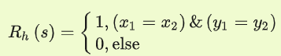
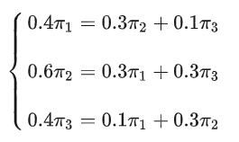
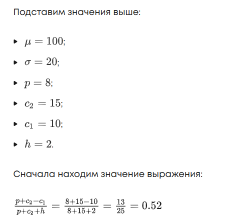
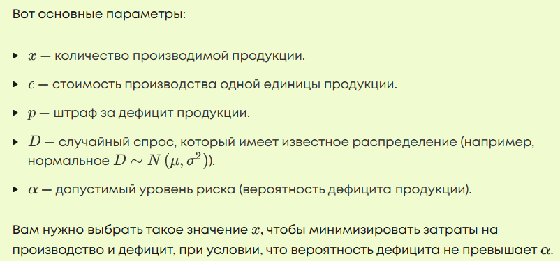
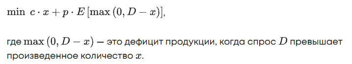

# 1. Введение в модуль

## Применение вероятностных моделей

- стохастические модели
- улучшают возможности систем обнаружения вторжений (IDS)
- используют статистические структуры для отражения неопределенности в поведении кибератак

Вот несколько статей про стохастические модели в ИБ:
- https://bit.spels.ru/index.php/bit/article/view/1681
- https://www.hse.ru/edu/vkr/206736466
- https://elibrary.ru/item.asp?id=44472755
- https://internationalpubls.com/index.php/cana/article/view/803

## цепи Маркова

- используются в моделировании поведения сетевого трафика и потенциальных паттернов кибератак
- могут представлять переходы состояний в сети, чтобы предсказывать будущие состояния на основе текущих и прошлых данных.

Вот статьи про цепи Маркова в ИБ:
- https://conf-ntores.etu.ru/assets/files/2020/cp/papers/131.pdf
- https://www.elibrary.ru/item.asp?id=41361451

## стохастические модели, использующие цепи Маркова

- применяются для количественной оценки общего риска безопасности сетей
- помогают выявить критические узлы в сети, на которых, вероятнее всего, сосредоточатся атакующие
- позволят администраторам сетей приоритизировать патчи системы и меры безопасности

Каждая статья ниже предлагает свой подход для этого вопроса — часто он уникален
- https://cyberleninka.ru/article/n/teoretiko-veroyatnostnaya-model-otsenki-riskov-informatsionnoy-bezopasnosti-predpriyatiya
- https://bit.mephi.ru/index.php/bit/article/view/1273
- https://www.scirp.org/journal/paperinformation?paperid=75785

## Применение моделей теории игр

- фактически не уступает вероятностным моделям и реализуется в разных областях

Вы можете самостоятельно изучить дополнительные материалы по этой теме. Например, о том, как [модели теории игр используются в системах обнаружения вторжений (IDS)](https://cyberleninka.ru/article/n/primenenie-metodov-teorii-igr-v-sistemah-obnaruzheniya-vtorzheniy) и [активно используются в вопросах оценки рисков](https://moitvivt.ru/ru/journal/pdf?id=711). Отдельного упоминания заслуживает [использование теории игр в вопросах оптимизации](https://cyberleninka.ru/article/n/primenenie-metodov-teorii-igr-dlya-optimizatsii-vybora-sredstv-zaschity-informatsii) применимо к ИБ.

В [этих двух статьях](http://injoit.ru/index.php/j1/article/viewFile/1743/1599) по ИБ можно встретить уже хорошо знакомые вам концепции — равновесие Нэша, игры с неполной информацией и системы агрессивной (атакующей) внешней среды. Привет, эволюционные игры!

Тем же, кто особенно заинтересовался применимостью теории игр в вопросах информационной безопасности, рекомендуем этот [учебник для студентов и магистрантов МГТУ им. Н.Э. Баумана](https://press.bmstu.ru/catalog/item/6137/).

## моделей линейного программирования

[Эта статья](https://www.researchgate.net/publication/348974081_Modeling_Economy_of_Information_Security_of_Business_Entity_Based_on_Simplex-Method/fulltext/6402675f5749505945602618/Modeling-Economy-of-Information-Security-of-Business-Entity-Based-on-Simplex-Method.pdf) уже с заголовка подтверждает, что можно моделировать субъект экономической деятельности с помощью симплекс-метода. А если взять [учебник 2020 года «Математические основы управления информационной безопасностью» издания ВлГУ](https://dspace.www1.vlsu.ru/bitstream/123456789/8425/1/01996.pdf), то видно, что самая большая из трех глав называется «Задачи линейного программирования в информационной безопасности», а следующая — «Задачи целочисленного линейного программирования в информационной безопасности».

Следующие два учебника целиком посвящены вопросам оптимизации.
- [Первый](https://books.ifmo.ru/file/pdf/2681.pdf) написан для студентов ИТМО направления «Информационная безопасность», большую часть материалов иллюстрирует на примерах информационной безопасности, а иногда и полностью говорит только о ней (например, глава «Интерпретация модели линейного программирования в информационной безопасности»).
- [Второй](https://press.bmstu.ru/catalog/item/2861) написан для студентов МГТУ им. Н.Э. Баумана по направлению «Компьютерная безопасность». Он целиком посвящен вопросам оптимизации именно в ИБ.

Кстати, у МГТУ им. Н.Э. Баумана есть еще и [отдельный учебник «Исследование операций в информационной безопасности»](https://press.bmstu.ru/catalog/item/6107/) для студентов и магистрантов, обучающихся по специальности «Информационная безопасность», большая часть которого посвящена применению линейного программирования для задач ИБ.

И напоследок взгляните на [данную статью](https://www.mathnet.ru/links/22bf2be7d6e70bd4318e610b30e837a1/trspy779.pdf). В ней упоминается использование стохастического подхода и стохастических структур для задания количественной меры неопределенности, возникающей при построении модели нарушителей и угроз. В конце статья предлагает классификацию угроз по трем типам, и второй сводится… к моделям теории игр!

# 2. Стохастические игры

> **Стохастические игры**<br>это обобщение стандартных игр теории игр, в которых исходы зависят не только от действий игроков, но и от случайных факторов. В отличие от классических игр, где состояние системы остается неизменным в процессе игры, в стохастических играх существует множество состояний. Игра перемещается от одного состояния к другому в зависимости от действий игроков и случайных событий.

- Стохастические игры объединяют элементы как динамических игр, так и вероятностных процессов

**основные составляющие таких игр**
1. **Набор игроков**<br>здесь все аналогично играм, рассмотренным во втором модуле.
1. **Множество состояний**<br>стохастическая игра происходит на множестве состояний $S$, где каждое состояние представляет текущее положение игры.
1. **Наборы действий**<br>для каждого игрока в каждом состоянии есть набор возможных действий $A_1(s), A_2(s), \dots, A_n(s)$ , которые могут изменяться в зависимости от состояния $s$.
1. **Функция перехода состояний**<br>выбор действий игроками приводит к вероятностному переходу между состояниями. Если игроки выбирают определенные действия в состоянии $s$, игра переходит в следующее состояние $s'$ с определенной вероятностью.
    - Эта вероятность определяется функцией перехода состояний<br>$P(s' \mid s, a_1, a_2, \dots, a_n)$
    - $a_1, a_2, \dots, a_n$ - это действия игроков в состоянии $s$
    - $P(s' \mid s, a_1, a_2, \dots, a_n)$ - вероятность перехода в состояние $s'$
1. **Выплаты (прибыль)**<br>каждый игрок получает вознаграждение (выплату) в зависимости от текущего состояния и выбранных действий.
    - Функция выигрыша может быть записана как<br>$R_i(s, a_1, a_2, \dots, a_n)$
    - $i$ - игрок
    - $s$ - текущее состояние
    - $a_1, a_2, \dots, a_n$ - действия игроков
1. **Правило завершения игры**<br>игра может продолжаться бесконечно или завершаться через конечное число ходов. Выплаты игроков могут зависеть как от краткосрочных (немедленных) выигрышей, так и от ожидаемой награды в будущем.

**типы в зависимости от условий и целей**
- игры с полной и неполной информацией;
- игры с дискретными и непрерывными состояниями;
- кооперативные и некооперативные игры и пр.

**деление на игры с конечным и бесконечным горизонтом**
- **в играх с конечным горизонтом**<br>игра завершается через определенное количество шагов, после чего игроки получают итоговые выплаты;
- **в играх с бесконечным горизонтом**<br>игроки играют на протяжение неопределенного времени — в этом случае долгосрочные выводы делаются на любом этапе игры, ждать конца не нужно (его может вообще не быть). Тогда выгоды игроков могут определяться через дисконтирование будущих выплат.

> **Дисконтирование будущих выплат**<br>это метод, который используется для оценки текущей стоимости (настоящей ценности) денежных средств или выплат, которые будут получены в будущем. Этот подход важен, потому что деньги или выплаты, которые поступят позже, имеют меньшую ценность сегодня из-за фактора времени, инфляции, рисков и альтернативных возможностей вложения капитала.

Обычно для дисконтирования используют следующую формулу:

$$
PV = \frac{FV}{(1 + r)^n}
$$

- $PV$ - приведенная стоимость (present value), то есть текущая стоимость будущих выплат
- $FV$ - будущая стоимость (future value), то есть сумма денег, которую вы получите в будущем,
- $r$ - дисконтная ставка (discount rate), которая отражает уровень инфляции, процент по инвестициям или другие факторы,
- $n$ - это период времени до момента получения будущей выплаты (лет или месяцев).

## Задача охотника и кролика

- два игрока — охотник и кролик
- движутся по сетке клеток
- Цель охотника — поймать кролика
- цель кролика — убегать как можно дольше

основные моменты:
- Поле игры — это двумерная сетка, состоящая из $N \times N$ клеток.<br>Игроки могут перемещаться по ней.
- Каждый игрок в каждом ходу выбирает направление движения: вверх, вниз, влево или вправо
    - Если игрок выбирает направление, но клетка находится за пределами сетки, то он остается на месте.
- Позиция игроков меняется в зависимости от выбранных действий, но переходы при этом не всегда детерминированы и зависят от вероятности.
    - Например, охотник может хотеть переместиться на одну клетку вправо, но из-за любого случайного фактора он переместится на одну клетку вверх с некоторой вероятностью.
    - > Вероятности неправильного хода могут задаваться заранее — например, можно заранее проговорить, что определенный процент ходов будет ошибочным.
- Охотник и кролик начинают либо в случайных, либо в заданных начальных позициях.
- Охотник выигрывает, если он оказывается на той же клетке, что и кролик — грубо говоря, ловит его.
- Кролик выигрывает, если избегает охотника на протяжении определенного времени или бесконечно.

> Это стохастическая игра, в которой результат каждого хода зависит от случайных факторов (например, отклонений в движении), и стратегические решения игроков строятся с учетом возможных состояний системы.

**несколько основных методов решения таких игр**
- **Метод Беллмана**<br>это способ решения игр, где нужно разбить задачу на маленькие части и искать лучшие стратегии для каждой из них. 
    - часто используется в играх, где <ins>количество возможных состояний и шагов ограничено</ins>
    - работает с помощью <ins>уравнения Беллмана</ins> и использует подход, называемый <ins>динамическим программированием</ins>, для нахождения решения.
- **Метод Монте-Карло**<br>уже знакомый вам метод моделирования и апроксимации вероятностных процессов активно используется и в случае со стохастическими играми.
    - эффективен для игр с большим числом состояний и сложными функциями перехода.
- **Обучение с подкреплением**<br>в нем игроки могут обучаться оптимальной стратегии на основе опыта
    - Один из популярных методов: <ins>алгоритм Q-learning</ins>, который применяется для стохастических игр с <ins>большим числом состояний</ins>.
    - уходит корнями в техники машинного обучения и в особенно популярный сегодня RL.
- **Нахождение равновесий**<br>в стохастических играх могут существовать равновесия Нэша, когда ни один игрок не может улучшить свою стратегию, если остальные игроки придерживаются своих.
    - Вычисление таких равновесий в стохастических играх требует учета всех возможных состояний и вероятностей.

### математическая формализация задачи об охотнике и кролике

#### 1. Множество состояний

Каждое состояние можно представить как пару координат:

$S = \{ (x_h, y_h), (x_r, y_r) \}$

- $(x_h, y_h)$ - координаты охотника
- $(x_r, y_r)$ - координаты кролика

Всего возможно $N^2 \times N^2$ состояний.

#### 2. Набор действий

Пусть у охотника и кролика будет одинаковый набор действий:

$\mathcal{A}_h = \mathcal{A}_r =$ {вверх, вниз, влево, вправо}.

Каждый ход — это пара действий: $(a_h, a_r)$

- $a_h \in \mathcal{A}_h$ - действие охотника
- $a_r \in \mathcal{A}_r$ - действие кролика
- Функция переходов: переход между состояниями происходит с определенными вероятностями

Например, пусть вероятность того, что охотник пойдет вправо, равна $p$, а с вероятностью $1-p$ он случайно пойдет в другое направление.

Для каждого состояния и набора действий игроков можно описать вероятностное изменение координат:

$P(s' \mid s, a_h, a_r)$

- $s' = (x_h', y_h', x_r', y_r')$ - новое состояние

#### 3. Функция выигрыша

выигрыш охотника равен 1, если охотник поймал кролика (находится на той же клетке), и 0 — в остальных случаях.

 

Выигрыш кролика может определяться по времени, которое кролик не был пойман.

### Решение

- будем использовать метод, основанный на уравнении Беллмана для нахождения оптимальной стратегии
- и алгоритм, реализованный с помощью динамического программирования, — он позволяет построить стратегию охотника (или кролика), которая максимизирует его ожидаемый выигрыш в будущем, причем начать можно с любого состояния.

Общее уравнение Беллмана для нашей задачи можно записать так

$$
V_h(s) = \max_{a_h} \sum_{a_r} P(a_r) \sum_{s'} P(s' \mid s, a_h, a_r) \left( R_h(s') + \gamma V_h(s') \right)
$$

- $V_h(s)$ - ценность состояния $s$ для охотника
- $a_h$ - действие охотника (например, движение вверх, вниз, влево или вправо)
- $a_r$ - действие кролика, которое случайно выбирается из набора возможных действий
- $P(a_r)$ - вероятность того, что кролик выполнит действие $a_r$
- $P(s' \mid s, a_h, a_r)$ - вероятность перехода в состояние $s'$ из состояния $s$, если охотник выбрал действие $a_h$, а кролик — действие $a_r$,
- $R_h(s')$ - вознаграждение охотника за нахождение в состоянии $s'$ (например, если охотник поймал кролика),
- $\gamma$ - коэффициент дисконтирования, который учитывает уменьшение значимости будущих вознаграждений.

Решение заключается
- шаг за шагом обновлять функцию $V_h(s)$
- начиная с последних состояний
- двигаться назад через все возможные состояния, чтобы найти лучший путь

Мы не сможем сделать эту задачу в общем случае, поэтому будем рассматривать ее при следующих допущениях:
- Кролик двигается случайным образом
    - выборы между направлениями равновероятны — то есть вероятность перехода кролика по одному из возможных направлений равна 0.25.
- Действия охотника детерминированы
    - всякий раз охотник двигается четко в соответствии со своей стратегией.

Исходя из этих пунктов можно считать, что весь переход от одного состоянию к другому детерминирован
- $P(s' \mid s, a_h, a_r)=1$ - одного состояния
- 0 — для остальных

вычислять следующее состояние без явного суммирования по всем возможным состояниям и рассмотреть упрощенную версию написанной выше формулы, учитывающую указанные пункты

$$
V(s) = \max_a \left[ R(s) + \gamma \sum_{s'} P(s' | s, a) V(s') \right]
$$

#### Решение на Python

```python
import numpy as np

# Размер поля 5x5
N = 5

# Возможные действия: вверх, вниз, влево, вправо
actions = [(-1, 0), (1, 0), (0, -1), (0, 1)]  # (dx, dy)

# Инициализация значений состояний V
# V[x_h][y_h][x_r][y_r] - это значение для состояния (x_h, y_h, x_r, y_r)
V = np.zeros((N, N, N, N))

# Коэффициент дисконтирования
gamma = 1

# Количество итераций для динамического программирования
iterations = 100

def is_caught(x_h, y_h, x_r, y_r):
    """Проверяет, поймал ли охотник кролика."""
    return x_h == x_r and y_h == y_r

def next_position(x, y, action):
    """Вычисляет новую позицию с учетом границ поля."""
    x_new = min(max(x + action[0], 0), N - 1)
    y_new = min(max(y + action[1], 0), N - 1)
    return x_new, y_new

# Алгоритм динамического программирования
for _ in range(iterations):
    # Создаем копию для обновления значений
    V_new = np.copy(V)
    
    # Перебираем все возможные состояния
    for x_h in range(N):
        for y_h in range(N):
            for x_r in range(N):
                for y_r in range(N):
                    if is_caught(x_h, y_h, x_r, y_r):
                        # Если охотник поймал кролика, значение равно 1
                        V_new[x_h][y_h][x_r][y_r] = 1
                    else:
                        # Рассчитываем новое значение на основе уравнения Беллмана
                        max_value = -np.inf
                        for a_h in actions:
                            # Новая позиция охотника
                            x_h_new, y_h_new = next_position(x_h, y_h, a_h)
                            expected_value = 0
                            for a_r in actions:
                                # Новая позиция кролика
                                x_r_new, y_r_new = next_position(x_r, y_r, a_r)
                                # Вычисляем ожидаемую ценность для нового состояния
                                expected_value += 0.25 * V[x_h_new][y_h_new][x_r_new][y_r_new]
                            max_value = max(max_value, expected_value)
                        
                        # Обновляем ценность состояния
                        V_new[x_h][y_h][x_r][y_r] = gamma * max_value
    
    # Обновляем значения
    V = V_new

x_h = 0
y_h = 0
x_r = 4
y_r = 4

# Вывод финальных значений для охотника в позиции (0, 0) и кролика в позиции (4, 4)
print(f"Ценность состояния для охотника в позиции ({x_h}, {y_h}) и кролика в позиции ({x_r}, {y_r}):")
print(V[x_h][y_h][x_r][y_r])
```

- Код вычисляет функцию ценности $V$ для всех возможных состояний игры
- На основе этих значений <ins>охотник</ins> должен в каждый момент выбирать то действие, которое ведет к состоянию с <ins>максимальным значением</ins> $V$.
- Сначала все значения инициализируются нулями
- для каждого состояния вычисляется новое значение на основе возможных действий и значений в соседних состояниях
- Функция `next_position` проверяет границы поля и вычисляет новую позицию после совершения хода
- Функция `is_caught` проверяет, находятся ли охотник и кролик на одной клетке
    - значение состояния $V$ устанавливается в 1
- Для всех возможных пар состояний охотника и кролика вычисляются новые значения с помощью уравнения Беллмана.

Процесс обновления продолжается в течение заданного числа итераций, пока не будет достигнуто устойчивое значение $V$ для каждого состояния.

### Решение через значение расстояния между охотником и кроликом

> **Жадная стратегия (или жадный алгоритм)**<br>это метод принятия решений, при котором на каждом шаге выбирается наилучшее локальное действие с точки зрения краткосрочной выгоды, не учитывая, как это действие повлияет на будущее.

Такой подход не обязательно приводит к глобально оптимальному решению, но зачастую эффективен, прост в реализации и может быть достаточным в некоторых задачах — например, этой.

Эта стратегия проще для понимания, но она может быть менее эффективной, чем предыдущая версия с динамическим программированием, так как:
- Не учитывает будущие ходы кролика.
- Может привести к ситуациям, когда охотник «застрянет» в локально оптимальном, но глобально неоптимальном пути.
- Не учитывает возможность «перехвата» кролика.


#### Алгоритм

1. Охотник оценивает расстояние до кролика по [манхэттенской метрике](https://book.etudes.ru/articles/nearfar/)<br>$d = |x_1 - x_2| + |y_1 - y_2|$
1. На каждом шаге охотник выбирает действие, которое минимизирует это расстояние.
1. Кролик же может следовать случайной стратегии, выбирая любое направление с равной вероятностью.

#### Код Python

```python
import random

def manhattan_distance(x1, y1, x2, y2):
    """Вычисляет Манхэттенское расстояние между двумя точками."""
    return abs(x1 - x2) + abs(y1 - y2)

def get_greedy_action(x_h, y_h, x_r, y_r, actions):
    """Определяет действие охотника, минимизирующее расстояние до кролика."""
    best_action = None
    min_distance = float('inf')
    
    for action in actions:
        # Вычисляем новую позицию охотника после действия
        x_new = min(max(x_h + action[0], 0), N - 1)
        y_new = min(max(y_h + action[1], 0), N - 1)
        
        # Вычисляем расстояние от новой позиции до кролика
        distance = manhattan_distance(x_new, y_new, x_r, y_r)
        
        # Если нашли действие, ведущее к меньшему расстоянию
        if distance < min_distance:
            min_distance = distance
            best_action = action
            
    return best_action

# Размер поля 5x5
N = 5
# Возможные действия: вверх, вниз, влево, вправо
actions = [(-1, 0), (1, 0), (0, -1), (0, 1)]  # (dx, dy)

def next_position(x, y, action):
    """Вычисляет новую позицию с учетом границ поля."""
    x_new = min(max(x + action[0], 0), N - 1)
    y_new = min(max(y + action[1], 0), N - 1)
    return x_new, y_new

def is_caught(x_h, y_h, x_r, y_r):
    """Проверяет, поймал ли охотник кролика."""
    return x_h == x_r and y_h == y_r

# Начальные позиции
x_h, y_h = 0, 0  # позиция охотника
x_r, y_r = 4, 4  # позиция кролика

print(f"Начальная позиция:")
print(f"  Охотник: ({x_h},{y_h})")
print(f"  Кролик:  ({x_r},{y_r})")
print(f"  Расстояние: {manhattan_distance(x_h, y_h, x_r, y_r)}")

# Симуляция игры до поимки кролика
steps = 0
while not is_caught(x_h, y_h, x_r, y_r) and steps < 20:  # максимум 20 ходов
    steps += 1
    
    # Ход охотника
    action_h = get_greedy_action(x_h, y_h, x_r, y_r, actions)
    if action_h is None:
        break
        
    x_h_new, y_h_new = next_position(x_h, y_h, action_h)
    
    # Ход кролика (случайный)
    action_r = random.choice(actions)
    x_r_new, y_r_new = next_position(x_r, y_r, action_r)
    
    print(f"\nХод {steps}:")
    print(f"  Охотник: ({x_h},{y_h}) -> ({x_h_new},{y_h_new})")
    print(f"  Кролик:  ({x_r},{y_r}) -> ({x_r_new},{y_r_new})")
    print(f"  Новое расстояние: {manhattan_distance(x_h_new, y_h_new, x_r_new, y_r_new)}")
    
    x_h, y_h = x_h_new, y_h_new
    x_r, y_r = x_r_new, y_r_new

if is_caught(x_h, y_h, x_r, y_r):
    print(f"\nКролик пойман на шаге {steps}!")
else:
    print("\nКролик не был пойман за 20 ходов.")
```

## Конкуренция между компаниями

Есть две компании: A и B. Они конкурируют на рынке, и каждая компания должна выбрать одну из двух стратегий:
- установить высокую цену (H);
- установить низкую цену (L).

Рынок может находиться в одном из трех состояний:
- s1 — высокий спрос;
- s2 — средний спрос;
- s3 — низкий спрос.

Выигрыши компаний зависят от комбинаций стратегий и состояния рынка. Для каждого состояния есть своя матрица выигрышей.

Матрица выигрышей для состояния s1 (высокий спрос) согласно условиям выглядит так (цифры даны изначально):

<table>
<tbody>
<tr>
<td></td>
<td>B(H)</td>
<td>B(L)</td>
</tr>
<tr>
<td>A(H)</td>
<td>(10,10)</td>
<td>(4,12)</td>
</tr>
<tr>
<td>A(L)</td>
<td>(12,4)</td>
<td>(6,6)</td>
</tr>
</tbody>
</table>

Матрица выигрышей для состояния s2 (средний спрос):

<table>
<tbody>
<tr>
<td></td>
<td>B(H)</td>
<td>B(L)</td>
</tr>
<tr>
<td>A(H)</td>
<td>(8,8)</td>
<td>(3,9)</td>
</tr>
<tr>
<td>A(L)</td>
<td>(9,3)</td>
<td>(5,5)</td>
</tr>
</tbody>
</table>

Матрица выигрышей для состояния s3 (низкий спрос):

<table>
<tbody>
<tr>
<td></td>
<td>B(H)</td>
<td>B(L)</td>
</tr>
<tr>
<td>A(H)</td>
<td>(6,6)</td>
<td>(2,7)</td>
</tr>
<tr>
<td>A(L)</td>
<td>(7,2)</td>
<td>(4,4)</td>
</tr>
</tbody>
</table>

Каждая ячейка матрицы содержит пару значений: первое число — выигрыш компании A, второе — компании B в зависимости от выбранных стратегий.

**матрица переходов между состояниями**

Рынок меняет свое состояние с вероятностями, описанными этой матрицей переходов (значения также даны заранее):

<table>
<tbody>
<tr>
<td>Из/В</td>
<td>s1</td>
<td>s2</td>
<td>s3</td>
</tr>
<tr>
<td>s1</td>
<td>0.6</td>
<td>0.3</td>
<td>0.1</td>
</tr>
<tr>
<td>s2</td>
<td>0.3</td>
<td>0.4</td>
<td>0.3</td>
</tr>
<tr>
<td>s3</td>
<td>0.1</td>
<td>0.3</td>
<td>0.6</td>
</tr>
</tbody>
</table>

Как правильно читать матрицу переходов? Например, вероятность того, что рынок переходит из состояния  в состояние , равна 0.3, а вероятность оставаться в  — 0.6 и пр.

Задача заключается в нахождении оптимальных стратегий для каждой компании, учитывая возможные переходы между состояниями рынка и соответствующие выигрыши.

### Решение основанное на поисках равновесий Нэша

1. Сперва рассмотрим матрицу для s1 (высокий спрос)
    - Для A:
        - На B(H): лучший ответ L (12 > 10).
        - На B(L): лучший ответ L (6 > 4).
    - Для B:
        - На A(H): лучший ответ L (12 > 10).
        - На A(L): лучший ответ L (6 > 4).
    - Таким образом, для этого состояния равновесие в чистых стратегиях — (L,L) с выигрышем (6,6).
1. Теперь рассмотрим матрицу для s2 (средний спрос):
    - Для A:
        - На B(H): лучший ответ L (9 > 8).
        - На B(L): лучший ответ L (5 > 3).
    - Для B:
        - На A(H): лучший ответ L (9 > 8).
        - На A(L): лучший ответ L (5 > 3).
    - В этом случае также есть равновесие в чистых стратегиях и, аналогично предыдущему случаю, это (L,L) с выигрышем (5,5).
1. И наконец рассмотрим матрицу s3 (низкий спрос):
    - Для A:
        - На B(H): лучший ответ L (7 > 6).
        - На B(L): лучший ответ L (4 > 2).
    - Для B:
        - На A(H): лучший ответ L (7 > 6).
        - На A(L): лучший ответ L (4 > 2).
    - Также получаем равновесие в чистых стратегиях на (L,L) с выигрышем (4,4).

Как вы видите, в каждом из состояний игроки выбирают стратегию, которая максимизирует их собственные выигрыши, учитывая выбор соперника.

Следующий шаг решения — находим стационарное распределение.

> **Стационарное распределение**<br>это распределение вероятностей между состояниями, которое остается неизменным в долгосрочной перспективе, когда процесс стабилизируется. В контексте стохастической игры это означает, что вероятности нахождения рынка в каждом из состояний $s_1, s_2, s_3$ будут постоянными со временем, если динамика рынка останется стабильной.

Обозначим стационарные вероятности так:
- $\pi_1$ — вероятность того, что рынок находится в состоянии $s_1$.
- $\pi_2$ — вероятность того, что рынок находится в состоянии $s_2$.
- $\pi_3$ — вероятность того, что рынок находится в состоянии $s_3$.

Эти вероятности должны удовлетворять двум условиям:
1. Сумма всех вероятностей должна быть равна 1 (так как одно из состояний обязательно наступает):<br>$\pi_1 + \pi_2 + \pi_3 = 1$
1. Для каждого состояния вероятность его наступления в долгосрочной перспективе определяется как сумма вероятностей переходов в это состояние из всех остальных состояний.
    - записывается в виде системы уравнений<br>$\pi P = \pi$
        - $P$ - матрица переходов между состояниями
        - $\pi=(\pi_1, \pi_2, \pi_3)$ - вектор-строка

Более подробно распишем эту систему для конкретного случая выше.

- Для $\pi_1$ (вероятность состояния $s_1$):

$\pi_1 = 0.6\pi_1 + 0.3\pi_2 + 0.1\pi_3$

Левую часть можно переписать как $0.4\pi_1 = 0.3\pi_2 + 0.1\pi_3$, что является уравнением для $\pi_1$.

- Для $\pi_2$ (вероятность состояния $s_2$)

$\pi_2 = 0.3\pi_1 + 0.4\pi_2 + 0.3\pi_3$

Левую часть можно переписать как $0.6\pi_2 = 0.3\pi_1 + 0.3\pi_3$, что является уравнением для $\pi_2$.

- Для $\pi_3$ (вероятность состояния $s_3$)

$\pi_3 = 0.1\pi_1 + 0.3\pi_2 + 0.6\pi_3$

Левую часть можно переписать как $0.4\pi_3 = 0.1\pi_1 + 0.3\pi_2$, что является уравнением для $\pi_3$.

Итак, получается система из трех уравнений:



дополнительное условие: $\pi_1 + \pi_2 + \pi_3 = 1$

Решение уравнения: $\pi_1 = \pi_2 = \pi_3 = \frac13$

Теперь рассчитываем ожидаемый долгосрочный выигрыш. Воспользуемся равновесиями в чистых стратегиях для каждого состояния, которые вы уже нашли, и соответствующими значениями:
- Для состояния s1 (высокий спрос): выигрыш = 6.
- Для состояния s2 (средний спрос): выигрыш = 5.
- Для состояния s3 (низкий спрос): выигрыш = 4.

Ожидаемый выигрыш $E$ каждого игрока вычисляется как средневзвешенное значение этих выигрышей с учетом равновероятности состояний:

$E = 6 \times \frac{1}{3} + 5 \times \frac{1}{3} + 4 \times \frac{1}{3} = \frac{6 + 5 + 4}{3} = 5$

Таким образом, ожидаемый долгосрочный выигрыш для обоих игроков составляет пять единиц, если они следуют своей оптимальной стратегии, которая в данном случае — всегда выбирать низкую цену (L).

# 3. Стохастическое программирование

> **Вероятностное (стохастическое) программирование**<br>это подход, который учитывает неопределенность в задачах, характерных для программирования. В таких задачах одна или несколько величин (например, коэффициенты в ограничениях или в целевой функции) моделируются как случайные величины с известными распределениями.

Задачи такого типа часто встречаются в задачах управления запасами, инвестиций, логистики и планирования производства. Вот пример на основе одной из уже знакомых вам задач.

## Производственное планирование с неопределенностью

> Необходимо решить, какой объем продукции (обозначим его $x$) произвести на первом этапе, чтобы минимизировать общие затраты. Затем, когда спрос $D$ становится известен, можно откорректировать это решение через дополнительные закупки $y$.

Вот основные параметры задачи:
- $c_1 = 10$ — стоимость производства одной единицы продукции.
- $c_2 = 15$ — стоимость срочной закупки одной единицы продукции (при дефиците).
- $h = 2$ — стоимость хранения каждой единицы избытка.
- $p = 8$ — штраф за дефицит одной единицы.
- $D \sim N(100, 20^2)$ — спрос имеет нормальное распределение с математическим ожиданием $\mu = 100$ и дисперсией $\sigma^2 = 20^2$.

### математическая модель

1. **Первый этап**: решение о производстве.
    - Выбираем объем производства $x$ с учетом того, что реальный спрос $D$ станет известен только позднее.
    - Производство в первом этапе стоит $c_1 \times x$.
1. **Второй этап**: коррекция решения через срочные закупки $y$ при известном $D$.
    - Корректирующее действие $y = \max(0, D - x)$
    - если произведенного объема $x$ недостаточно для удовлетворения спроса, нужно закупить дополнительный объем $y$, который стоит $c_2 \times y$.
1. **Издержки от хранения или дефицита**: если произведенного объема оказалось больше, чем требуется ($x > D$), возникает избыток на складе.
    - За хранение избытка вы платите $h \times \max(0, x - D)$
    - Если спрос превышает объем производства ($D > x$), возникает дефицит, который штрафуется $p \times \max(0, D - x - y)$.

**Цель** — минимизировать общие затраты, которые включают:
- затраты на производство $c_1 \times x$,
- математическое ожидание затрат на срочные закупки $E[c_2 \times y]$,
- затраты на хранение избытка $E[h \times \max(0, x - D)]$,
- штраф за дефицит $E[p \times \max(0, D - x - y)]$.

Математически целевая функция в этом случае записывается как:

$$
\min \ c_1 x + E\left[ c_2 y + h \max(0, x - D) + p \max(0, D - x - y) \right]
$$

### Решение

Спрос $D$ распределен нормально $D \sim N(\mu = 100, \sigma^2 = 20^2)$

Для нахождения оптимального объема производства $x^*$ используется следующая формула:

$$
x^* = \mu + \sigma \Phi^{-1}\left( \frac{p + c_2 - c_1}{p + c_2 + h} \right)
$$

- $\Phi^{-1}$ - обратная функция стандартного нормального распределения.



Теперь нужно найти значение обратной функции нормального распределения $\Phi^{-1}(0.52)$. По таблице стандартного нормального распределения это значение примерно равно 0.05.

Тогда оптимальный объем производства:

$x^* = 100 + 20 \times 0.05 = 100 + 1 = 101$

Теперь перейдем к корректирующим действиям. Когда спрос $D$ становится известен, нужно произвести корректировку. Если спрос больше объема производства $x^*$:

$y^* = \max(0, D - x^*)$

То есть если спрос больше $x^* = 101$, нужно закупить $y^*$ единиц.

#### На Python

```python
import numpy as np
from scipy.optimize import minimize
from scipy.stats import norm

# Заданные параметры
c1 = 10  # стоимость производства
c2 = 15  # стоимость срочной закупки
h = 2    # стоимость хранения
p = 8    # штраф за дефицит
mu = 100  # средний спрос
sigma = 20  # стандартное отклонение спроса

# Генерация случайного спроса на основе нормального распределения
np.random.seed(42)  # Для воспроизводимости
demand_samples = np.random.normal(mu, sigma, 10000)

# Целевая функция для минимизации
def objective(x):
    expected_cost = 0
    for D in demand_samples:
        y = max(0, D - x)
        storage_cost = h * max(0, x - D)
        shortage_cost = p * max(0, D - x - y)
        expected_cost += c1 * x + c2 * y + storage_cost + shortage_cost
    return expected_cost / len(demand_samples)

# Начальное приближение для объема производства
x0 = mu  # Начнем с среднего спроса

# Минимизация целевой функции
result = minimize(objective, x0, method='Nelder-Mead')

# Оптимальное значение объема производства
x_star = result.x[0]

print(f"Оптимальный объем производства: {x_star:.2f} единиц")

# Проверка: если D = 110, найдем корректирующее действие y*
D_test = 110
y_star = max(0, D_test - x_star)
print(f"Корректирующее действие при спросе 110: закупить дополнительно {y_star:.2f} единиц")
```

## Управление запасами с неопределенностью

> Задача заключается в том, чтобы минимизировать затраты на производство и дефицит, при этом вероятность того, что запасы будут недостаточны для удовлетворения спроса, не должна превышать заданного уровня риска.



### математическая модель

1. **Целевая функция**, минимизирующая затраты на производство и дефицит<br>
1. **Ограничение на риск**: вероятность дефицита продукции не должна превышать $\alpha$<br>$P(D > x) \leq \alpha$
    - Это ограничение говорит о том, что важно, чтобы вероятность превышения спроса объемами производства была не более $\alpha$.

### Решение

Для нормального распределения $D \sim N(\mu, \sigma^2)$ вероятность дефицита может быть выражена через функцию стандартного нормального распределения $\Phi(\cdot)$:

$P(D > x) = 1 - \Phi\left(\frac{x - \mu}{\sigma}\right)$

Отсюда ограничение на риск переписывается как:

$1 - \Phi\left(\frac{x - \mu}{\sigma}\right) \leq \alpha$

или, эквивалентно:

$\Phi\left(\frac{x - \mu}{\sigma}\right) \geq 1 - \alpha$

Решение этого неравенства даст значение для $x$, при котором риск дефицита не превышает допустимый уровень $\alpha$.

#### Python

```python
import numpy as np
from scipy.optimize import minimize
from scipy.stats import norm

# Заданные параметры
c = 10  # стоимость производства
p = 8   # штраф за дефицит
mu = 100  # средний спрос
sigma = 20  # стандартное отклонение спроса
alpha = 0.05  # уровень риска (например, 5%)

# Ограничение на риск: найти минимальный объем производства x, при котором P(D > x) <= alpha
def risk_constraint(x):
    return norm.cdf((x - mu) / sigma) - (1 - alpha)

# Целевая функция: минимизация c * x + p * ожидаемый дефицит
def objective(x):
    expected_shortage = p * norm.expect(lambda d: max(0, d - x), loc=mu, scale=sigma)
    return c * x + expected_shortage

# Начальное приближение для объема производства
x0 = mu  # Начнем с среднего спроса

# Построение ограничений для задачи
constraints = {'type': 'ineq', 'fun': risk_constraint}

# Минимизация целевой функции с учетом ограничения на риск
result = minimize(objective, x0, constraints=constraints)

# Оптимальное значение объема производства
x_star = result.x[0]

print(f"Оптимальный объем производства с учетом риска: {x_star:.2f} единиц")
```

# 4. Игровые задачи линейного программирования

> **Игровые задачи линейного программирования**<br>это синтез теории игр и методов линейного программирования. Основная концепция заключается в том, что матричная игра может быть преобразована в задачу линейного программирования и наоборот.

В матричных играх два игрока принимают решения независимо друг от друга, и каждый игрок выбирает стратегию, чтобы максимизировать свой выигрыш (или минимизировать свои потери)
- может быть представлено в виде матрицы
    - строки соответствуют стратегиям одного игрока
    - столбцы — стратегиям другого

Для первого игрока (максимизирующего выигрыш) формулировка задачи линейного программирования будет следующей:
- Целевая функция: минимизировать максимальный возможный убыток (или максимизировать минимальную прибыль).
- Ограничения: сумма вероятностей выбора стратегий равна 1, и каждая стратегия должна давать не меньший выигрыш, чем максимальный убыток.

Для второго игрока (минимизирующего проигрыш) задача формулируется аналогично, но с противоположной целью.
