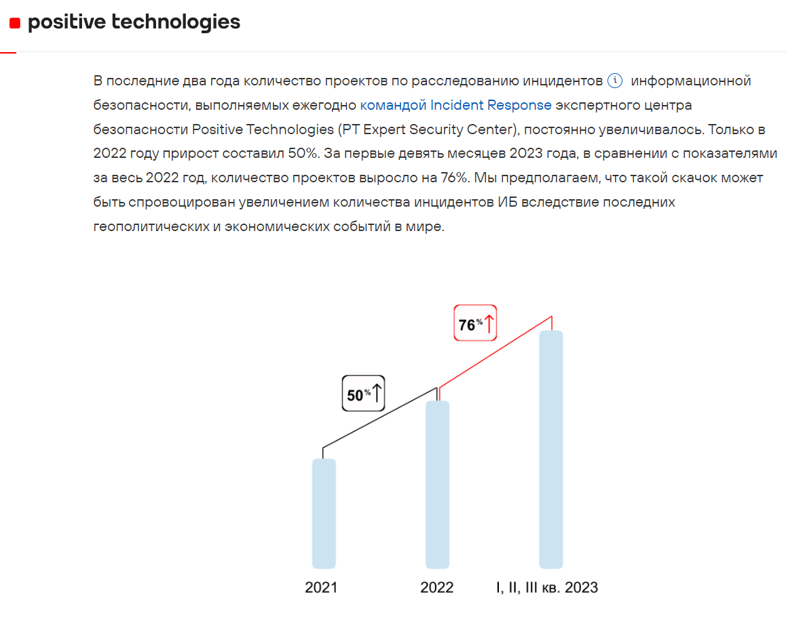
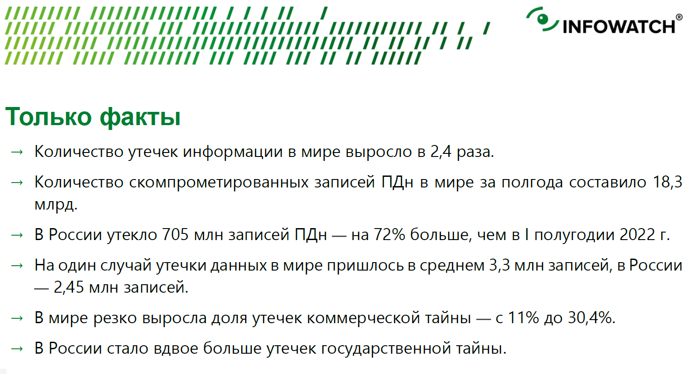

# 1. Требования законодательства по созданию отделов ИБ

## Статистика информационных атак

По данным статистики [Positive Technologies](https://www.ptsecurity.com/ru-ru/research/analytics/kiberbezopasnost-v-2023-2024-gg-trendy-i-prognozy-chast-pyataya/) государственные информационные системы не первый год становятся лидерами по количеству инцидентов. В 2023 году этот показатель составил 15% от всех успешно реализованных атак.

Positive Technologies. Кибербезопасность в 2023–2024 гг.: тренды и прогнозы  

Positive Technologies. Угрозы на 2024 год  

В [отчете Лаборатории Касперского](https://www.kaspersky.ru/about/press-releases/2023_laboratoriya-kasperskogo-obuyom-utekshih-dannyh-vyros-v-2023-godu-na-33) от 7 декабря 2023 года мы видим, что объем утекших данных вырос на 33%, и только лишь значимых утечек информации было 133. Это значит, что более мелких и не таких масштабных инцидентов было еще больше, но они не вошли в документ.

Отчет «Лаборатории Касперского» о количестве утечек информации в 2023 году  

В ретроспективной [статье Positive Technologies](https://www.ptsecurity.com/ru-ru/research/analytics/outcomes-of-IS-incident-investigations-in-2021-2023-years/) говорится об увеличении количества расследуемых инцидентов командой Incident Responce.

Positive Technologies. Расследования инцидентов в 2021–2023 гг. 

Positive Technologies. Расследования инцидентов 2021–2023 гг. по отраслям  

Также из [этого отчета](https://www.infowatch.ru/analytics/analitika/utechki-informatsii-ogranichennogo-dostupa-v-mire-i-rossii-za-pervoe-polugodie-2023-goda) становится понятно, что угрозы безопасности информации касаются даже закрытых систем, иногда не имеющих выходов в интернет. Увеличивается количество утечек всех видов информации, обладающих ценностью.

Infowatch. Сравнение 2023 и 2022 годов 

Как видите, все исследователи сходятся в одном: информационная безопасность организации подвергается все большим и большим нападениям ежегодно.

## Законодательство в области ИБ

в 2022 году был выпущен [Указ Президента Российской Федерации от 01.05.2022 г. № 250 «О дополнительных мерах по обеспечению информационной безопасности Российской Федерации»](http://www.kremlin.ru/acts/bank/47796). Он на законодательном уровне фиксирует обязанность руководителей организаций создавать в организации структурное подразделение по обеспечению информационной безопасности.

Четкого перечня организаций, которые должны выполнить это требование, нет. Однако есть критерии, по которым можно определить, необходимо ли компании следовать указаниям:
- стратегические предприятия
- стратегические акционерные общества
- утвержденные [Указом Президента Российской Федерации от 04.08.2004 г. №1009](http://pravo.gov.ru/proxy/ips/?docbody=&firstDoc=1&lastDoc=1&nd=102088162).

Перечень включает
- организации инфраструктуры городов
- организации оборонного комплекса
- заводы, научные и производственные объединения и другие важные для Российской Федерации организации.

В [статье 2022](https://bi.zone/expertise/insights/prosto-o-slozhnom-o-chem-ukaz-prezidenta-rf-250/) года дали примерную количественную оценку организаций, подпадающих под действие Указа Президента №250 2022 года — **500 тысяч организаций на территории в Российской Федерации**.

Опираясь на [Федеральный закон от 26.07.2017 г. №187-ФЗ «О безопасности критической информационной инфраструктуры Российской Федерации»](http://www.kremlin.ru/acts/bank/42128), исходя из определения **«субъекты КИИ»** можно выделить следующие сферы, деятельность которых является критически важной:
- здравоохранение;
- наука;
- транспорт;
- связь;
- энергетика;
- банковская сфера;
- сферы финансового рынка;
- атомная энергия;
- оборонная область;
- ракетно-космическая область;
- горнодобывающая область;
- металлургическая и химическая промышленность.

[Указ Президента №250 2022 года](http://publication.pravo.gov.ru/Document/View/0001202205010023) изменил направление развития многих компаний и расставил приоритеты совершенно иначе — он сфокусировал внимание государственного сектора на проблеме информационной безопасности. Этот же документ постановил Правительству РФ утвердить типовые Положения:
- о заместителе руководителя организации, ответственного за обеспечение ИБ организации;
- о структурном подразделении организации, обеспечивающем ИБ организации.

# 2. Требования к образованию и повышению квалификации сотрудников отделов ИБ

15 июля 2022 г. было опубликовано [Постановление Правительства РФ от 15 июля 2022 г. №1272](http://publication.pravo.gov.ru/Document/View/0001202207190035) «Об утверждении типового положения о заместителе руководителя органа (организации), ответственном за обеспечение информационной безопасности в органе (организации), и типового положения о структурном подразделении в органе (организации), обеспечивающем информационную безопасность органа (организации)». В нем описываются квалификационные требования к заместителю, ответственному за обеспечение ИБ:

Пункт 6 типового положения о заместителе руководителя органа (организации) 

Эти требования распространяются не только на заместителя, но также на всех сотрудников отдела ИБ пунктом 12 Приказа ФСТЭК от 21 декабря 2017 г. №235. Рассмотрим их далее.

## Образование для работы в ИБ

В требованиях к должности будет один из пунктов:
- высшее образование по направлению «Информационная безопасность»;
- профессиональная переподготовка по данному направлению в количестве не менее 512 часов (до 20 апреля 2023 г. было 360 часов, но ФСТЭК внесли изменения).
- для обеспечения безопасности объектов КИИ или деятельности в области технической защиты информации профессиональная переподготовка должна быть согласована с Федеральной службой по техническому и экспортному контролю (ФСТЭК)

Высшее образование в сфере обеспечения информационной безопасности в Российской Федерации делится на следующие направления:
- Бакалавр 10.03.01 Информационная безопасность
- Магистратура 10.04.01 Информационная безопасность
- Специалитет 10.05.01 Компьютерная безопасность
- Специалитет 10.05.02 Информационная безопасность телекоммуникационных систем
- Специалитет 10.05.03 Информационная безопасность автоматизированных систем
- Специалитет 10.05.04 Информационно-аналитические системы безопасности
- Специалитет 10.05.05 Безопасность информационных технологий в правоохранительной сфере
- Специалитет 10.05.06 Криптография
- Специалитет 10.05.07 Противодействие техническим разведкам
- Аспирантура 10.06.01 Информационная безопасность
- Адъюнктура 10.07.01 Информационная безопасность

Для назначения на должность ответственного лица не подходит только бакалавриат — необходимо образование не ниже уровня магистратуры или специалитета. Остальные уровни и направления для назначения на должность заместителя начальника организации по ИБ подходят.

## Должности в сфере ИБ

- инженер по ИБ, или администратор безопасности;
- инженер по сетевой безопасности;
- аналитик по ИБ;
- аудитор ИБ.

Профессиональные стандарты к конкретным должностям в области ИБ закреплены в следующих законодательных актах:
- [Приказ Минтруда России №525н от 14.09.2022](https://mintrud.gov.ru/docs/mintrud/orders/2446) «Об утверждении профессионального стандарта "Специалист по защите информации в автоматизированных системах”»;
- [Приказ Минтруда России №474н от 09.08.2022](https://mintrud.gov.ru/docs/mintrud/orders/2418) «Об утверждении профессионального стандарта “Специалист по технической защите информации”»;
- [Приказ Минтруда России №739н от 28 ноября 2022 г.](https://mintrud.gov.ru/docs/mintrud/orders/2550) «Об утверждении профессионального стандарта “Специалист по информационной безопасности в кредитно-финансовой сфере”»;
- [Приказ Минтруда России №536н от 14 сентября 2022 г.](https://mintrud.gov.ru/docs/mintrud/orders/2471) «Об утверждении профессионального стандарта “Специалист по защите информации в телекоммуникационных системах и сетях”».

данные профессиональные стандарты распространяются как на рядовых сотрудников, так и на руководителей. Причем стандарты рассматривают их отдельно, расписывая то, чем должны заниматься и те, и другие.

специалисты в области информационной безопасности субъектов КИИ обязаны <ins>проходить повышение квалификации не реже 1 раза в 3 года</ins> ([пункте 12 Приказа ФСТЭК России от 21.12.2017 №235](https://fstec.ru/dokumenty/vse-dokumenty/prikazy/prikaz-fstek-rossii-ot-20-aprelya-2023-g-n-69))

программы курсов повышения квалификации должны быть согласованы со ФСТЭК.

# 3. Требования к организации для получения лицензии на деятельность по ТЗКИ

ФСТЭК занимается лицензированием деятельности по технической защите конфиденциальной информации в соответствии с [Постановлением Правительства РФ от 3 февраля 2012 г. №79 «О лицензировании деятельности по технической защите конфиденциальной информации»](https://base.garant.ru/70136258/).

## Определение ТЗКИ. Получение лицензии на деятельность по ТЗКИ

> **техническая защита конфиденциальной информации**
>
> выполнение работ и (или) оказание услуг по ее защите от несанкционированного доступа, от утечки по техническим каналам, а также от специальных воздействий на такую информацию в целях ее уничтожения, искажения или блокирования доступа к ней.

Лицензирование деятельности по технической защите конфиденциальной информации осуществляет Федеральная служба по техническому и экспортному контролю.

При осуществлении лицензируемого вида деятельности лицензированию подлежат:

1. услуги по контролю защищенности конфиденциальной информации от утечки по техническим каналам:
    - в средствах и системах информатизации;
    - в технических средствах (системах), не обрабатывающих конфиденциальную информацию, но размещенных в помещениях, где она обрабатывается;
    - в помещениях со средствами (системами), подлежащими защите;
    - в помещениях, предназначенных для ведения конфиденциальных переговоров (далее - защищаемые помещения);
1. услуги по контролю защищенности конфиденциальной информации от несанкционированного доступа и ее модификации в средствах и системах информатизации;
1. услуги по мониторингу информационной безопасности средств и систем информатизации;
1. работы и услуги по аттестационным испытаниям и аттестации на соответствие требованиям по защите информации:
    - средств и систем информатизации;
    - помещений со средствами (системами) информатизации, подлежащими защите;
    - защищаемых помещений;
1. работы и услуги по проектированию в защищенном исполнении:
    - средств и систем информатизации;
    - помещений со средствами (системами) информатизации, подлежащими защите;
    - защищаемых помещений;
1. услуги по установке, монтажу, наладке, испытаниям, ремонту средств защиты информации (технических средств защиты информации, защищенных технических средств обработки информации, технических средств контроля эффективности мер защиты информации, программных (программно-технических) средств защиты информации, защищенных программных (программно-технических) средств обработки информации, программных (программно-технических) средств контроля эффективности защиты информации).

Такую лицензию необходимо получать только тем организациям, которые выполняют мероприятия по 4 пункту Постановления Правительства от 3 февраля 2012 г. №79.

Согласно ФСТЭК, **срок действия лицензии по технической защите конфиденциальной информации составляет 5 лет**. То есть каждые 5 лет организации требуется проходить перелицензирование.

## Требования для получения лицензии

Всего в пункте 6 Постановления Правительства РФ от 3 февраля 2012 г. №79 есть 6 требований.
1. Требования к штатному персоналу: образование в области ИБ (мы говорили об этом в прошлом юните) и стаж работы в области лицензируемого вида деятельности. Для тех, кто имеет образование в области ИБ, стаж должен составлять 3 года, а для тех, кто имеет иное техническое образование, — 5 лет.
1. Повышение квалификации по данному виду деятельности не реже одного раза в 5 лет.
1. Наличие помещений, не являющихся объектами жилого назначения, которые принадлежат лицензиату и в которых созданы условия для осуществления данной деятельности.
1. Наличие оборудования, необходимого для осуществления работ, в которое входят:
    - измерительные приборы;
    - программные средства.
1. Наличие автоматизированных систем, предназначенных для обработки конфиденциальной информации, прошедших оценку соответствия и аттестованных по требованиям безопасности информации.
1. Наличие технической документации, необходимой для проведения работ и услуг.

Получить лицензию могут юридические лица и индивидуальные предприниматели с целью получения прибыли за оказание услуг и работ.

Документы для получения лицензии на деятельность по ТЗКИ указаны на [сайте ФСТЭК](https://fstec.ru/dokumenty/vse-dokumenty/perechni/perechen-dokumentov-neobkhodimykh-dlya-polucheniya-litsenzii-na-deyatelnost-po-tekhnicheskoj-zashchite-konfidentsialnoj-informatsii) и доказывают выполнение требований Постановления.

# 4. Методология проведения инструктажей в организации и повышения грамотности сотрудников организации в сфере ИБ

## Проблемы деятельности отдела ИБ

1. Полное непонимание и отсутствие осведомленности об угрозах безопасности информации.
1. Отсутствие коммуникации между отделом ИБ и другими отделами организации.
1. Наличие «нарушителя» внутри организации.

[В статье](https://www.anti-malware.ru/news/2023-02-20-118537/40575) приведены результаты исследований 2022 года: оказывается, лишь 78% компаний обучают своих сотрудников основам ИБ.

Исследование SearchInform об обучении сотрудников правилам ИБ 

Исследование SearchInform о методах обучения сотрудников ИБ-грамотности 

Есть еще [одно исследование](https://www.anti-malware.ru/news/2024-02-06-114534/42750), где речь идет о деятельности ИТ-компаний и об осведомленности сотрудников в области правил ИБ.

Исследование SearchInform об уровне знаний основ ИБ сотрудниками частных и государственных компаний 

Ситуация та же — доведением бумажных регламентов многие закрывают вопрос обучения сотрудников. Вот к каким инцидентам это приводит:

Исследование SearchInform о количестве инцидентов по вине сотрудников 

Какими методами можно повысить грамотность в сфере ИБ сотрудников организации?

1. Проведением инструктажей по ИБ.
1. Проведением тренингов и занятий с сотрудниками.
1. Доведением требований ИБ и ответственности за их нарушение.

## Методы повышения грамотности сотрудников в ИБ

### Проведение инструктажей

- Все инструктажи лучше всего вести в журнале учета инструктажей по ИБ под личные подписи обеих сторон
- Инструктажи могут проводиться как в частном порядке, так и для групп и категорий сотрудников.

#### Вводный (первичный)

представляет собой беседу с новым сотрудником о том, как организуется система защиты информации в организации, какие действия он должен предпринимать и в каких случаях. В обязательном порядке необходимо довести до него Политику ИБ организации.

Чаще закрепляют документально: регистрируют документ с названием «Первичный инструктаж по ИБ».

В него включают
- выписки из Политики ИБ организации
- цели инструктажа
- должностные лица, которые могут проводить его.

Разбивают на основные темы, которые постепенно разъясняются новому сотруднику: они определяют действия должностного лица в различных ситуациях и правила, согласно которым ему необходимо взаимодействовать с информацией.

#### Целевой

Перед допуском сотрудника к другим типам данных (например, к конфиденциальной информации более высокого уровня, чем раньше) или к новой технологии, с которой этот сотрудник раньше не работал, введению нового программного обеспечения в организации, новой технике проводится целевой инструктаж.

#### Периодический

Периодические инструктажи проводятся в среднем раз в год для подтверждения знаний сотрудниками основ ИБ и напоминания им этих основ.

### Тренинги и занятия по ИБ

Занятия могут включать доведение новых угроз ИБ или демонстрацию реальных кейсов того, как удалось получить доступ к информации в вашей организации, печальный и, наоборот, удачный опыт встречи с угрозами.

### Доведение требований ИБ до сотрудников

обсуждение ответственности за нарушение требований организации. Будет актуальным не просто под подпись довести требования и наказания за нарушения, но также приводить примеры реальных ситуаций и реальных мер ответственности, которые применялись в отношении нарушителей (от взыскания и увольнения до уголовного наказания).

## Базовые советы по обеспечению ИБ

- никогда не работайте за компьютером с административной учетной записи;
- меняйте пароли не реже 1 раза в полгода;
- используйте антивирусные средства защиты с полным сканированием системы еженедельно.

