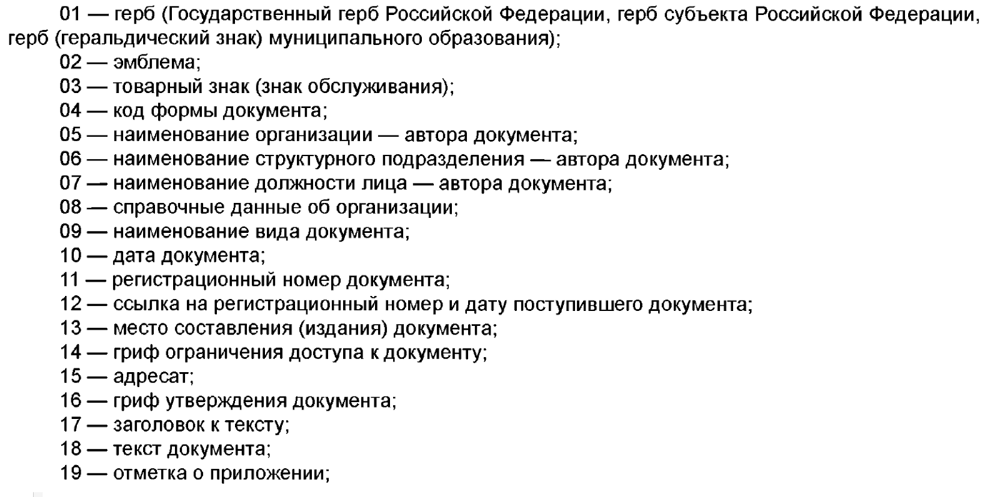
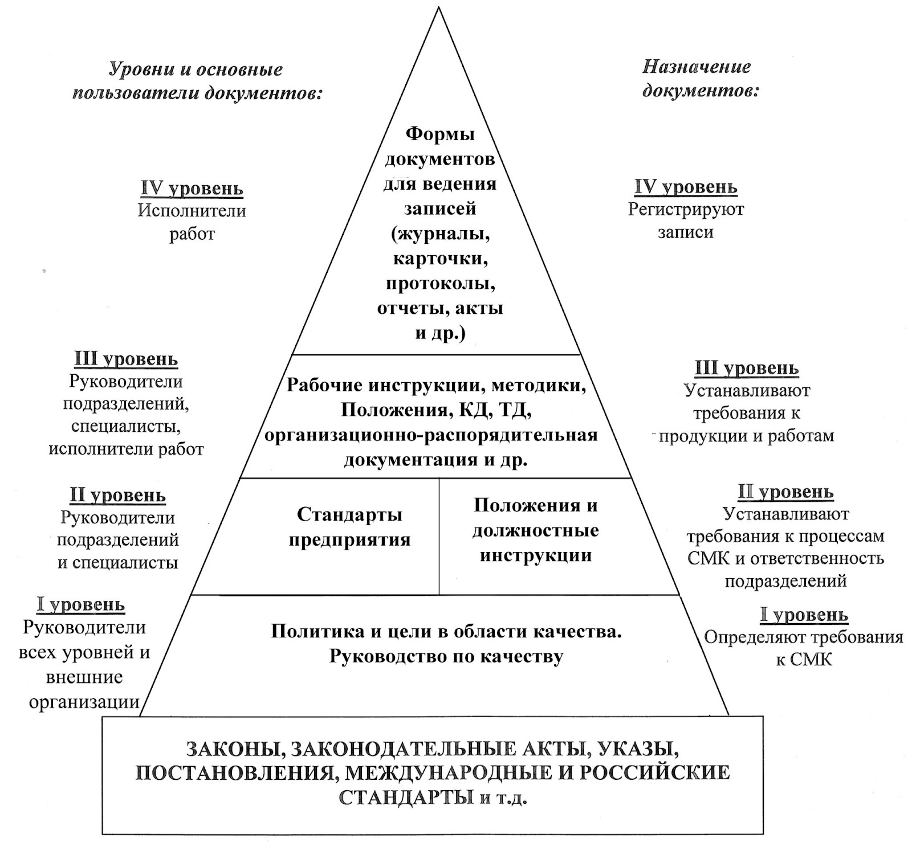

# 1. Требования законодательства к организационно-распорядительной документации в сфере ИБ

два основных руководящих документа, которые определяют требования к созданию и оформлению реквизитов, определяют организацию работы с документами и документирование в делопроизводствах.

1. **[ГОСТ Р 7.0.8-2013 «Система стандартов по информации, библиотечному и издательскому делу. ДЕЛОПРОИЗВОДСТВО И АРХИВНОЕ ДЕЛО»](https://gostassistent.ru/doc/bd23fd6a-6fae-4f3b-9f2b-79b6611c531b?utm_referrer=https%3A%2F%2Fyandex.ru%2F)** В этом стандарте представлены актуальные термины и определения, которые помогут разобраться в том, как организовываются делопроизводства в компаниях.
1. **[ГОСТ Р 7.0.97-2016 «Система стандартов по информации, библиотечному и издательскому делу. ОРГАНИЗАЦИОННО-РАСПОРЯДИТЕЛЬНАЯ ДОКУМЕНТАЦИЯ. Требования к оформлению документов»](https://www.consultant.ru/document/cons_doc_LAW_216461/)** Данный стандарт определяет, какие конкретные характеристики выставлять в текстовом редакторе при разработке и печати документа, какие используются реквизиты и как их оформлять.

## Терминология ОРД

### Служба делопроизводства

> структурное подразделение, на которое возложены функции по ведению делопроизводства, а также лица, ответственные за ведение делопроизводства в других подразделениях организации.

для ведения делопроизводства в любой организации в штате должен быть отдел или служба, которые выполняют эти функции. Такие отделы, естественно, есть — они проверяют правильность оформления документов, ставят на учет, а также в некоторых случаях занимаются отправлением документов.

### Официальный документ

> документ, созданный организацией, должностным лицом или гражданином, оформленный в установленном порядке.

не каждый документ можно назвать официальным, а только те, которые оформлены в установленном порядке. А вот установленный порядок — это как раз тот порядок, который определяется требованиями законодательства: например, ГОСТами, указанными выше, и Инструкцией по делопроизводству организации.

### Инструкция по делопроизводству

> это внутренний документ организации, который устанавливает конкретные правила разработки документов, их визирование, оформление реквизитов, определяет ответственных лиц, а также службу, которая занимается делопроизводством.

- Инструкция по делопроизводству в государственных организациях составляется с опорой на [Приказ Федерального архивного агентства (Росархив) от 11.04.2018 № 44](http://publication.pravo.gov.ru/Document/View/0001201808200001) «Об утверждении Примерной инструкции по делопроизводству в государственных организациях».
- Внутренняя инструкция по делопроизводству организации будет создаваться на основе Примерной инструкции, утвержденной [Приказом Росархива от 11.04.2018 № 44](http://publication.pravo.gov.ru/Document/View/0001201808200001).

Примерная инструкция говорит о делопроизводстве как о деятельности, в которую входит:

документирование деятельности;
- организация документооборота;
- организация доступа к документам и их использования;
- формирование документального фонда организации.

Говоря про формирование документального фонда, подразумевается несколько видов хранения:
- **текущее хранение** например, документы за этот год хранятся в службе делопроизводства, остальные — в архиве этой службы, а третья категория, не дойдя до архива, уничтожается
- **систематизация документов** относится к учету документов, для каждого типа заводится отдельная книга

[Раздел 9](http://publication.pravo.gov.ru/Document/View/0001201808200001?index=81) Примерной инструкции по делопроизводству говорит о нормах, регулирующих порядок доступа к документам в целях их использования
- порядок выдачи документов для использования работникам организации;
- предоставление документов по запросам органов власти и организаций (судебных, правоохранительных, органов государственного контроля и надзора);
- порядок изъятия (выемки) документов (на основании письменного распоряжения (постановления) соответствующего органа власти).

В Приложения Примерной инструкции по делопроизводству входят:
- образцы бланков документов;
- образцы оформления отдельных видов документов (приказ, распоряжение, протокол, докладная и служебная записки, деловое письмо и т. д.);
- примерные перечни утверждаемых документов;
- примерные перечни документов, заверяемых печатью организации;
- примерные перечни нерегистрируемых документов.

К инструкции по делопроизводству могут быть разработанные доп. доки для более подробного описания направлений делопроизводства:
- положения
- инструкции
- правила
- порядки
- и т.д.

### Документированная информация и Носитель информации

> **Документированная информация** — структурированная информация, зафиксированная на носителе.

> **Носитель (документированной) информации**
>
> материальный объект, предназначенный для закрепления, хранения и воспроизведения речевой, звуковой или изобразительной информации.

Со стороны защиты информации между бумажным и машинным носителями разницы нет: защита должна распространяться на все носители важной для организации информации.

Информация, содержащаяся в документах, должна быть:
- последовательной;
- краткой, емкой;
- однозначной, единообразной.

## Классификация ОРД

### 1. Организационные документы

> Регламенты, инструкции, правила — т. е. документы, которые организовывают то или иное действие и определяют требования к защите информации.

К ним относятся:
- должностные инструкции по защите информации;
- инструкции по пользованию средствами защиты информации;
- правила заполнения журналов.

### 2. Распорядительные документы

> Приказы, распоряжения — т. е. те документы, которые указывают на выполнение конкретных действий и решение конкретных задач (чаще всего они имеют сроки исполнения).

К ним относятся:
- Приказ о назначении ответственных лиц;
- Приказ о вводе объекта ВТ в эксплуатацию;
- Приказ о назначении экспертной комиссии по определению конфиденциальности информации.

### Справочно-информационные документы

> Справка, напоминание, сводка, служебная записка, заявление — т. е. те документы, которые информируют о событии или нужны для того, чтобы запустить процесс разработки организационного или распорядительного документа.

К ним относятся:
- оформленные инструктажи (программа первичного инструктажа, план периодического инструктажа);
- сводки по актуальным угрозам ИБ;
- акты выполненных работ.

## Требования к оформлению документов (ГОСТ Р 7.0.97-2016)

требования к оформлению документов на основании [ГОСТ Р 7.0.97-2016](https://www.consultant.ru/document/cons_doc_LAW_216461/). Они распространяются на все организационно-распорядительные документы организации, это прописано в разделе «Область применения».

### Область применения

- уставы
- положения
- правила
- инструкции
- регламенты
- постановления
- распоряжения
- приказы
- решения
- протоколы
- договоры
- акты
- письма
- справки и др. (далее — документы)
- в том числе включенные в ОК 011-93 «Общероссийский классификатор управленческой документации» (ОКУД), класс 0200000.

### Пункт 3. Общие требования к созданию документов

[пункт 3 Общие требования к созданию документов](https://www.consultant.ru/document/cons_doc_LAW_216461/8fd72e645fd845146802e356f7092e9e632ff3c3/)

> является основой для разработки любого документа — как в электронном, так и бумажном виде. Он касается в том числе документов, которые разрабатывает отдел ИБ.

#### Правила нумерации, эл. доки

1. Документы могут создаваться на бумажном носителе и в электронной форме с соблюдением установленных правил оформления документов.
2. При создании документа на двух и более страницах вторую и последующие страницы нумеруют.
    - Номера страниц проставляются посередине верхнего поля документа на расстоянии не менее 10 мм от верхнего края листа.
    - Допускается создание документов на лицевой и оборотной сторонах листа. При двустороннем создании документов ширина левого поля на лицевой стороне листа и правого поля на оборотной стороне листа должны быть равны.

#### Шрифты

типа Arial, Times New Roman, Calibri, Verdana.

3. Для создания документов необходимо использовать свободно распространяемые бесплатные шрифты.
    - Для оформления документов рекомендуется использовать размеры шрифтов № 12, 13, 14.
    - При составлении таблиц допускается использовать шрифты меньших размеров.

#### остальные требования к оформлению документов

4. Абзацный отступ текста документа — 1,25 см.
    - Заголовки разделов и подразделов печатаются с абзацным отступом или центрируются по ширине текста.
    - Многострочные реквизиты печатаются через один межстрочный интервал, составные части реквизитов отделяются дополнительным интервалом.
    - Текст документа печатается через 1 - 1,5 межстрочных интервала.
    - Если документ готовится для издания с уменьшением масштаба, текст печатается через два интервала.
    - Интервал между буквами в словах — обычный.
    - Интервал между словами — один пробел.
5. Текст документа выравнивается по ширине листа (по границам левого и правого полей документа).
    - Длина самой длинной строки реквизита при угловом расположении реквизитов не более 7,5 см.
    - Длина самой длинной строки реквизита при продольном расположении реквизитов не более 12 см.
6. Нормативными правовыми актами организации может быть предусмотрено выделение реквизитов «адресат», «заголовок к тексту» или «подпись», а также отдельных фрагментов текста полужирным шрифтом.
7. Нормативные правовые акты организации, а также иные многостраничные документы могут оформляться с титульным листом. Титульный лист документа оформляется в соответствии с приложением А.

### Реквизиты и правила их оформления

> **Реквизит документа**
>
> элемент оформления документа. Проще говоря, это небольшие шаблоны, каждый из которых несет свою цель и расставляется определенным образом.

Стандарт [ГОСТ Р 7.0.97-2016](https://www.consultant.ru/document/cons_doc_LAW_216461/) выделяет следующие реквизиты:

# 2. Иерархия внутренних документов по ИБ

Типовая структура выполняет следующие функции:
- говорит о менеджменте качества;
- показывает зависимость одних документов от других;
- определяет уровни исполнителей и пользователей;
- подсвечивает назначение каждого документа.

## 0 уровень

- Федеральные законы
- Указы президента
- Постановления правительства
- ГОСТы
- Профессиональные стандарты
- Приказы ФСТЭК и т. п.

Они запускают организацию работ в направлении ИБ организации, а также определяют требования к защите информации

## I уровень

- Устав организации
- штатное расписание организации
- Политику организации по ИБ
- Модель угроз безопасности информации.

пользуются руководители всех уровней и, при необходимости, внешние организации.

определяет глобальные цели и требования необходимые для работы всей системы защиты информации, в том числе
- необходимость создания отдела по ИБ
- количественную потребность в штатных должностях по защите информации.

## II уровень

- Положение об отделе ИБ
- Приказ начальника организации о назначении ответственных лиц
- должностные инструкции сотрудников организации
- различные приказы начальника организации по ИБ (в том числе о наказании за нарушения в области защиты информации).

Этим уровнем в своей работе руководствуется
- заместитель начальника
- ответственный за обеспечение ИБ
- начальник отдела ИБ
- специалисты отдела ИБ

## III уровень

- локальные инструкции (определяют порядок действий по ИБ в конкретной ситуации и с конкретными средствами)
- список лиц, имеющих доступ к конфиденциальной информации (либо другой важной информации в организации) и др.

необходим в работе
- начальнику отдела ИБ
- специалистам отдела ИБ и исполнителям работ отдела ИБ (инженеры, техники и т. п.)

## IV уровень

- Журнал учета машинных носителей информации
- Журнал учета инструктажей
- Список разрешенного программного обеспечения
- акты и протоколы по результатам выполненных работ

Основными пользователями и разработчиками документов будут
- непосредственные исполнители работ отдела ИБ
    - кто настраивают системы защиты
    - ведут журналы
    - производят мониторинги и т. п.

# 3. Ответственность за нарушение требований к защите информации

Согласно [Ст. 17 Федерального закона от 27 июля 2006 года N 149-ФЗ «Об информации, информационных технологиях и о защите информации»](https://www.consultant.ru/document/cons_doc_LAW_61798/ec553b250323ad210f4c9adc8c6b237b2c20f85a/) за правонарушения в сфере защиты информации нарушитель может быть привлечен к следующим видам ответственности:
- дисциплинарной;
- гражданско-правовой;
- административной;
- уголовной.

## Дисциплинарная ответственность

Рассмотрим дисциплинарную ответственность на примере государственных служащих

### За что

в [Статье 57 Федерального закона от 27.07.2004 №79-ФЗ «О государственной гражданской службе Российской Федерации»](http://www.kremlin.ru/acts/bank/21210/)
1. За совершение дисциплинарного проступка, то есть за неисполнение или ненадлежащее исполнение гражданским служащим по его вине возложенных на него служебных обязанностей, представитель нанимателя имеет право применить следующие дисциплинарные взыскания:
    1. замечание;
    1. выговор;
    1. предупреждение о неполном должностном соответствии;
    1. (Пункт утратил силу — Федеральный закон от 07.06.2013 № 116-ФЗ)
    1. увольнение с гражданской службы по основаниям, установленным пунктом 2, подпунктами "а" - "г" пункта 3, пунктами 5 и 6 части 1 статьи 37 настоящего Федерального закона.
1. За каждый дисциплинарный проступок может быть применено только одно дисциплинарное взыскание.

Обязанности по защите информации должны быть прописаны в должностной инструкции каждого сотрудника.

### Сроки

Дисциплинарное взыскание объявляется не позднее одного месяца со дня обнаружения проступка, но также не позднее шести месяцев со дня самого дисциплинарного проступка при учете всех мероприятий. Время проведения проверки при этом не учитывается.

### Служебная проверка

Для того чтобы объявить дисциплинарное взыскание, должна быть проведена служебная проверка (или расследование) с учетом:
- тяжести совершенного проступка;
- степени вины нарушителя;
- обстоятельств, при которых совершен дисциплинарный проступок;
- предшествующих результатов исполнения лицом своих должностных обязанностей.

В [Статье 59 Федерального закона от 27.07.2004 №79-ФЗ «О государственной гражданской службе Российской Федерации»](http://www.kremlin.ru/acts/bank/21210/) о служебной проверке сказано следующее:
1. Служебная проверка проводится по решению представителя нанимателя или по письменному заявлению гражданского служащего.
2. При проведении служебной проверки должны быть полностью, объективно и всесторонне установлены:
    1) факт совершения гражданским служащим дисциплинарного проступка;
    2) вина гражданского служащего;
    3) причины и условия, способствовавшие совершению гражданским служащим дисциплинарного проступка;
    4) характер и размер вреда, причиненного гражданским служащим в результате дисциплинарного проступка;
    5) обстоятельства, послужившие основанием для письменного заявления гражданского служащего о проведении служебной проверки.

## Гражданско-правовая ответственность

> подразумевает возмещение убытков, взыскание неустоек и компенсацией морального вреда, возмещение убытков деловой репутации организации.

[Пункт 2 Статьи 17 Федерального закона от 27.07.2006 N 149-ФЗ «Об информации, информационных технологиях и о защите информации»](https://www.consultant.ru/document/cons_doc_LAW_61798/ec553b250323ad210f4c9adc8c6b237b2c20f85a/) описывает также гражданско-правовую ответственность за правонарушения в сфере ЗИ.

Также в [Статье 1100 Гражданского Кодекса РФ](https://www.consultant.ru/document/cons_doc_LAW_9027/) отдельно выделен следующий момент:

> Компенсация морального вреда осуществляется независимо от вины причинителя вреда в случаях, когда вред причинен распространением сведений, порочащих честь, достоинство и деловую репутацию.

Следующая [Статья (1101) ГК РФ](https://www.consultant.ru/document/cons_doc_LAW_9027/) всегда работает в паре с предыдущей статьей. Но ст. 1101 ГК РФ рассматривает вопрос компенсации морального вреда в случае, если он уже установлен.

Нарушения подобного плана могут быть намеренно выполнены в обход системы защиты информации организации, поэтому грамотно настроенная система защиты должна не позволить допустить утечку данных, которые могут нанести ущерб организации в целом.

## Административная ответственность

[«Кодексом Российской Федерации об административных правонарушениях» от 30.12.2001 N 195-ФЗ](https://www.consultant.ru/document/cons_doc_LAW_34661/) подразумевает ряд статей, которые связаны со сферой защиты информации.

- Статья 13.11. Нарушение законодательства Российской Федерации в области персональных данных
- Статья 13.11.1. Распространение информации о свободных рабочих местах или вакантных должностях, содержащей ограничения дискриминационного характера
- Статья 13.11.2. Незаконное использование принадлежащих иностранным юридическим лицам и (или) иностранным гражданам информационных систем и (или) программ для электронных вычислительных машин
- Статья 13.11.3. Нарушение требований в области размещения биометрических персональных данных
- Статья 13.12. Нарушение правил защиты информации
- Статья 13.12.1. Нарушение требований в области обеспечения безопасности критической информационной инфраструктуры Российской Федерации
- Статья 13.13. Незаконная деятельность в области защиты информации
- Статья 13.14. Разглашение информации с ограниченным доступом
- Статья 13.14.1. Незаконное получение информации с ограниченным доступом

Основная статья, с которой вы можете столкнуться на практике, — это [статья 13.12 «Нарушение правил защиты информации»](https://www.consultant.ru/document/cons_doc_LAW_34661/721c5c0cd868c2438ea66f09091f3a352bd56365/).

Под грубым нарушением лицензионных требований понимается невыполнение требований:
- о наличии калиброванного, поверенного контрольно-измерительного оборудования;
- об использовании легитимных программных продуктов;
- о выполнении работ или оказании услуг штатным специалистом, имеющим профессиональное образование в области технической защиты информации;
- о наличии системы производственного контроля качества.

Подробная таблица со всеми видами нарушений, размерами штрафов и пунктами [«Кодекса Российской Федерации об административных правонарушениях» от 30.12.2001 N 195-ФЗ](https://www.consultant.ru/document/cons_doc_LAW_34661/) представлена по [ссылке](https://www.arbitr-praktika.ru/article/2742-shtrafy-za-personalnye-dannye).

Особенно актуальны для нас как специалистов ИБ нарушения в области персональных данных, штрафы за которые были повышены в декабре 2023 года.

### Штрафы

Таблицу со всеми возможными штрафами за нарушения обработки персональных данных можно еще раз изучить [https://www.arbitr-praktika.ru/article/2742-shtrafy-za-personalnye-dannye](https://www.arbitr-praktika.ru/article/2742-shtrafy-za-personalnye-dannye).

#### размеры штрафов за обработку персональных данных без согласия

|    | Было | Стало |
| -- | ---- | ----- |
| Граждане (физлица)	| от 6000 до 10 000 рублей	| от 10 000 до 15 000 рублей   |
| Должностные лица	| от 20 000 до 40 000 рублей	| от 100 000 до 300 000 рублей |
| Юридические лица	| от 30 000 до 150 000 рублей	| от 300 000 до 700 000 рублей |

#### Штрафы за повторное нарушение обработки без согласия

|    | Было | Стало |
| -- | ---- | ----- |
| Граждане (физлица)	| от 10 000 до 20 000 рублей	| от 15 000 до 30 000 рублей |
| Должностные лица	| от 40 000 до 100 000 рублей	| от 300 000 до 500 000 рублей |
| ИП	| от 100 000 до 300 000 рублей	| от 500 000 до 1 000 000 рублей |
| Юридические лица	| от 300 000 до 500 000 рублей	| от 1 000 000 до 1 500 000 рублей |

## Уголовная ответственность

[Глава 28 УК РФ](https://www.consultant.ru/document/cons_doc_LAW_10699/4398865e2a04f4d3cd99e389c6c5d62e684676f1/) определяет преступления в сфере компьютерной информации.
- Статья 272. Неправомерный доступ к компьютерной информации
- Статья 273. Создание, использование и распространение вредоносных компьютерных программ
- Статья 274. Нарушение правил эксплуатации средств хранения, обработки или передачи компьютерной информации и информационно-телекоммуникационных сетей
- Статья 274.1. Неправомерное воздействие на критическую информационную инфраструктуру Российской Федерации
- Статья 274.2. Нарушение правил централизованного управления техническими средствами противодействия угрозам устойчивости, безопасности и целостности функционирования на территории Российской Федерации информационно-телекоммуникационной сети «Интернет» и сети связи общего пользования

### сферы государственной тайны и госизмены

#### Шпионаж

[Статье 276 УК РФ](https://www.consultant.ru/document/cons_doc_LAW_10699/50da2baef6cf186bcafcd98a7bf0c750ba256acf/) меры наказания за шпионаж

> Передача, собирание, похищение или хранение в целях передачи иностранному государству, международной либо иностранной организации или их представителям сведений, составляющих государственную тайну, а также передача или собирание по заданию иностранной разведки или лица, действующего в ее интересах, иных сведений для использования их против безопасности Российской Федерации либо передача, собирание, похищение или хранение в целях передачи противнику сведений, которые могут быть использованы против Вооруженных Сил Российской Федерации, других войск, воинских формирований и органов Российской Федерации, совершенные в условиях вооруженного конфликта, военных действий или иных действий с применением вооружения и военной техники с участием Российской Федерации, то есть шпионаж, если эти деяния совершены иностранным гражданином или лицом без гражданства, наказываются лишением свободы на срок от десяти до двадцати лет.
>
> Примечание. Под противником в настоящей статье понимаются иностранное государство, международная либо иностранная организация, противостоящие Российской Федерации в вооруженном конфликте, военных действиях или иных действиях с применением вооружения и военной техники.

Шпионаж относится ко взаимодействию с иностранными государствами, если представитель иностранного государства вышел на связь с лицом, которое самостоятельно предоставило ему заранее запрошенную информацию. Также возможна ситуация, что представитель иностранного государства передал задание такому лицу на сбор конкретной информации.

#### Госизмена

[Статья 275 УК РФ](https://www.consultant.ru/document/cons_doc_LAW_10699/2ca391674eeaa02069722fa3f13cbb41cce0a95d/), регламентирующую наказание за государственную измену.

> Государственная измена, то есть совершенные гражданином Российской Федерации шпионаж, выдача иностранному государству, международной либо иностранной организации или их представителям сведений, составляющих государственную тайну, доверенную лицу или ставшую известной ему по службе, работе, учебе или в иных случаях, предусмотренных законодательством Российской Федерации, переход на сторону противника либо оказание финансовой, материально-технической, консультационной или иной помощи иностранному государству, международной либо иностранной организации или их представителям в деятельности, направленной против безопасности Российской Федерации, наказывается лишением свободы на срок от двенадцати до двадцати лет со штрафом в размере до пятисот тысяч рублей или в размере заработной платы или иного дохода осужденного за период до трех лет либо без такового и с ограничением свободы на срок до двух лет или пожизненным лишением свободы.

В случае с госизменой к уголовной ответственности привлекают не за степень секретности информации. Тут решающее значение имеют следующие факторы.
1. Факт передачи информации иностранному государству, международной либо иностранной организации.
1. Потенциальная возможность использования такой информации в деятельности, которая направлена против безопасности Российской Федерации.

Во [втором пункте Примечаний к статье о Государственной измене](https://www.consultant.ru/document/cons_doc_LAW_10699/2ca391674eeaa02069722fa3f13cbb41cce0a95d/) говорится об условиях полного освобождения от уголовной ответственности.

> 2. Лицо, совершившее преступления, предусмотренные настоящей статьей, а также статьями 276 и 278 настоящего Кодекса, освобождается от уголовной ответственности, если оно добровольным и своевременным сообщением органам власти или иным образом способствовало предотвращению дальнейшего ущерба интересам Российской Федерации и если в его действиях не содержится иного состава преступления.

Если добровольно сообщить органам власти о том, что человек совершил государственную измену, то он может быть освобожден от ответственности полностью, так как своими действиями он будет способствовать предотвращению нанесения ущерба Российской Федерации.

[Статья 284 УК РФ об утрате документов, содержащих государственную тайну](https://www.consultant.ru/document/cons_doc_LAW_10699/5ae157fa932f8c4cd4613acaf75ad84d4e26f281/).

[Статья 283 УК РФ. регламентирующая наказание за разглашение государственной тайны.](https://www.consultant.ru/document/cons_doc_LAW_10699/b4dacd3a0bcbd2f7a4aeacd096abda9322100f0d/)

Под разглашение государственной тайны также, как и с утратой, не подходит работа с иностранными государствами. Здесь разглашения составляют любые деяния, приводящие к преданию сведений, составляющих гостайну, и огласке их различными способами.

Есть целая серия статей, рассматривающих государственную тайну:

- [УК РФ Статья 283.1. Незаконное получение сведений, составляющих государственную тайну](https://www.consultant.ru/document/cons_doc_LAW_10699/259f155f53468a1ec71c86e4cd7df4c5599446a1/)
- [УК РФ Статья 283.2. Нарушение требований по защите государственной тайны](https://www.consultant.ru/document/cons_doc_LAW_10699/be5193187d6643c9e1b5e5370df85ecbf1e80ffe/)
- [УК РФ Статья 183. Незаконные получение и разглашение сведений, составляющих коммерческую, налоговую или банковскую тайну](https://www.consultant.ru/document/cons_doc_LAW_10699/696074503229a6bf1978651f48895bf3a8831bd8/)
