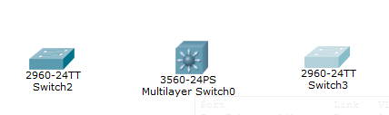

# 1. Ведение

> **Cisco Packet Tracer (далее — CPT)**
> 
> симулятор сети передачи данных, разработанный компанией Cisco как раз для учебного пользования

# 2. Коммутатор. Основы Cisco IOS

## Сетевой концентраторхаб (hub).

Первый уровень модели OSI. Отправляет трафик от источника ко всем остальным портам. Изжившее себя устройство — по крайней мере на корпоративном уровне.

## Коммутатор (switch)

Второй уровень модели OSI. В соответствии с таблицей MAC-адресов отправляет пакеты в сторону конкретного получателя (порта).

## Основы Cisco IOS

### Способы подключения:

- консольный кабель;
- Telnet/SSH;
- Web;
- специализированное ПО (SDM — Security Device Manager, CSM — Cisco Security Manager, IME — IPS Manager Express).

### Алгоритм действий для первоначальной настройки:

1. Подключитесь через консольный кабель.
1. Задайте пароль для привилегированного режима.
1. Создайте пользователя.
1. Установите авторизацию на подключение к консоли.
1. Задайте IP-адрес устройства.
1. Разрешите подключение по SSH/Telnet.
1. Включите авторизацию при удалённом подключении.

## Уровни привилегий

### Level 0

Доступны следующие комманды:

- logout
- enable
- disable
- help
- exit

### Level 1

Позволяет перейти в User Exec mode, лимитированный досутп только на чтение

### Levels 2-14

Настраиваемые уровни доступа

### Level 15

Privileged Exec mode, полный доступ

## Полезные комманды

### Прерывание текущей операции

```
Ctrl Shift 6
```

### enable

Вход в привилегированный режим

### enable [0-15]

Вход с указанным уровнем привелегий

### show running-config

Просмотр текущей конфигурации

### line console [0-15]

Настройка консольной линии

### configure terminal

Вход в режим конфигурации терминала

#### write mem

Сохранение конфигурации

#### enable secret [password]

Созданиие зашифрованного пароля

#### service password-encryption

Включение шифрования паролей

#### username [Username] privilege [n:0-15] password [password]

Создания пользователя ```Username``` с максимальным уровнем привилегий ```n``` и паролем ```password```

#### line vty [0-14] или line vty [n] [m]

Конфигурирование терминальных линий (виртуальной консоли)

n - номер линии от
m - номер линии до

##### transport input [none|all|telnet|ssh]

включение\отключение ```telent``` и ```ssh```

##### end

Выход из режима конфигурации терминальных линий

# 3. VLAN

> **VLAN (Virtual Local Area Network)**
> 
> коммутатор внутри коммутатора или сегментирование сети.

## Преимущества:

- сегментирует сеть;
- увеличивает уровень безопасности;
- улучшает работу сети;
- снижает широковещательный трафик.

## Типы портов:

- Access Port — для конечных устройств;
- Trunk Port — транзитный (между коммутаторами).

## VLAN Hopping

тип атак, при котором злоумышленник получает доступ к VLAN, например, при принудительном согласовании режима работы порта.


## Защита порта

### switchport port-security

- aging — задаётся временной интервал, после которого динамический MАС-адрес может быть переписан;
- mac-address — при помощи этой ветки можно:
    - задать разрешённый MAC-адрес;
    - задать запрещённый MAC-адрес;
    - включить порт в режиме обучения;
- maximum — указывает лимит разрешённых адресов.
- violation — задаёт действие из перечисленных ранее.

После настройки применить изменения с помощью комманды ```switchport port-security``` без параметров

## Полезные комманды

### vlan [n]

Создать VLAN под номером ```n```

#### name [name]

Присвоть VLAN имя ```name```

### interface [type] [number]

Перейти в режим конфигурации интерфейся типа ```tye``` под номером ```number```

Например: ```interface fastEthernet 0/1```

#### switchport mode [access|trunc|dynamic]

Установить режим работы интерфейса:

- ```access``` режим безусловного доступа
- ```trunc``` режим безусловного транка
- ```dynamic``` атоматически определять режим

#### switchport access vlan [n]

Установить доступ на порте для VLAN под номером ```n```

#### switchport trunk allowed vlan [n,m...]

Установить транк с доступом для VLAN с номерами ```n,m...```

# 4. Методы организации отказоустойчивых каналов связи. Spanning Tree Protocol (STP)

## Методы

- Резервирование каналов
- Агрегирование каналов связи

## Резервирование каналов

> это создание автоматической системы доступа между коммутационным оборудованием. При этом существуют два или более параллельных каналов связи, дублирующих друг друга, т. е. при выходе из строя основного канала автоматически включается резервный. Таким образом доступ не прекращается и не прерывается.

### Проблема: Петля

- широковещательные штормы;
- множественные копии кадров;
- общие сбои оборудования.

### Spanning Tree Protocol (STP)

> канальный протокол. Основная задача STP — устранение петель в топологии произвольной сети Ethernet, в которой есть один или более сетевых мостов, связанных избыточными соединениями. STP решает эту задачу, автоматически блокируя соединения, которые в данный момент для полной связности коммутаторов являются избыточными.

#### Алгоритм работы

1. Выбираем корневой коммутатор. Порты корневого коммутатора становятся назначенными и переходят в состояние передачи.
1. Выбираем корневой порт на некорневом коммутаторе; он выбирается из расчёта стоимости пути от некорневого коммутатора к корневому (по количеству прыжков и скорости канала связи).


3. Самым последним выбираем назначенный порт — это порт, который висит в режиме ожидания.

**Если «стоимость» канала на всех линиях связи одинаковая — система выбирает корневые коммутаторы и порты по наименьшему MAC-адресу устройств.**

#### Состояния портов:

- блокировка;
- прослушивание;
- обучение;
- передача.

*Протокол STP включён на всём оборудовании Cisco по умолчанию. Если смоделировать вышеуказанный пример, то настройка произойдёт автоматически.*

### Определение корневого коммутатора

1. ```enable```
1. ```show spanning-tree```

Елси вы на корневом коммутадоре то увидите строку ```This bridge is the root```

## Агрегирование каналов связи

> это объединение нескольких физических портов в одну логическую магистраль на канальном уровне модели OSI. Оно нужно для того, чтобы образовать высокоскоростной канал передачи данных и повысить отказоустойчивость. Все избыточные связи в одном агрегированном канале остаются в рабочем состоянии, а имеющийся трафик распределяется между ними , чтобы сбалансировать нагрузку.

### Два варината

- Динамическое агрегирование:
    - LACP (Link Aggregation Control Protocol) — стандартизированный протокол, используется многими производителями оборудования.
    - PAgP (Port Aggregation Protocol) — проприетарный протокол Cisco.
- Статическое агрегирование:
    - <span style="color:green">Преимущество:</span> отсутствие задержек при поднятии агрегированного канала или изменении его настроек
    - <span style="color:red">Недостаток:</span> отсутствие согласования с другой стороной, что может стать причиной образования петель.

### Учитывать при агрегировании каналов

- одинаковую скорость портов
- режимы дуплекса
- native VLAN
- диапазон разрешённых VLAN
- trunk-статус
- типы интерфейса

### Статическое агрегирование каналов


1. Перед соединением коммутаторов настроить порты учавствующие в аггрегации
    1. Войти в конфигурационный терминал<br>```conf terminal```
    1. Конфигурация портов (используется range для индентичной настройки сразу двух и более портов)<br>
    ```interface range GigabitEthernet 0/1-2```
    1. Задаем группу логических каналов<br>```channel-group 1 mode on```<br>
    Если успешно пример вывода:<br>
    > Creating a port-channel interface Port-channel 1
    >
    > %LINK-5-CHANGED: Interface Port-channel 1, changed state to up
    > LINEPROTO-5-UPDOWN: Line protocol on Interface Port-channel 1, changed state to up
1. Седините коммутаторы на портах ```GigabitEthernet 0/1``` и ```GigabitEthernet 0/2``` соответвенно


### Динамическое агрегирование каналов LACP



1. настройка L3 Cisco 3560
    1. ```conf terminal```
    1. Конфигурируем первую пару портов<br>
    ```int range fa0/1-2```<br>
    *скоращенная форма комманд: int - interface, fa - fastEthernet*
        1. Устанавливаем протокол LACP<br>
        ```channel-protocol lacp```
        1. Создаем группу 1 логического порта<br>
        ```channel-group 1 mode active``` 
    1. Повторяем аналогично для второй группы портов ```fa0/3-4``` с группой ```2```
    1. Созраняем ```wr mem```
1. Настраиваем L2 коммутаторы
    1. ```conf t```<br>
    *Тоже самое, что и configure terminal*
    1. Конфигурация потов fastEthernet0/1 и fastEthernet0/2<br>
    ```int range fa0/1-2```
        1. ```channel-protocol lacp```
        1. Создаем логическую группу интерфейсов 1 в пассивном режиме (в активном на L3; рекомендуется с одной стороны в активном, с другой в пассивном)<br>
        ```channel-group 1 mode passive```
    1. ```wr mem```
    1. Повторяем то же самое на 2м L2


#### Статус EtherChannel

```show etherchannel```

```show etherchannel summary```

# 5. L3-коммутаторы

- первичная IP-маршрутизация между сегментами сети;
- используются в качестве коммутаторов уровня распределения;
- агрегирование каналов связи между коммутаторами второго уровня;
- более высокая производительность;
- более высокая стоимость за порт на конечное устройство

## Комманды

### ip routing

включение пересылки пакетов между сегментами сети.


### switchport trunk encapsulation dot1q

инкапсуляция протокола VLAN.

# 6. Маршрутизаторы

- всё, что умеет коммутатор L3;
- NAT;
- VPN;
- межсетевой экран;
- E1;
- маршрутизация производится на программном уровне (на процессоре общего назначения).

### interface fa0/0.2

создание подинтерфейса для VLAN.

# 7. Статическая маршрутизация

> **Маршрутизация**
>
> процесс определения оптимального маршрута данных в сетях связи.

> **Маршрут по умолчанию**
>
> направление пакета через шлюз для отправки в другие сегменты сети или вне сети.

> **Таблица маршрутизации**
>
> список правил, основываясь на которых пакет будет отправлен по определённому пути.

# 8. DHCP

> **DHCP (Dynamic Host Configuration Protocol)**
>
> сетевой протокол, позволяющий сетевым устройствам автоматически получать IP-адрес и другие параметры, необходимые для работы в сети TCP/IP.

## DHCP snooping

> это технология, которая предотвращает использование неавторизированного DHCP сервера в сети, что позволяет, например, произвести атаку «человек посередине» (man-in-the-middle, MITM). Ещё технология защищает сеть от атак на истощение DHCP (DHCP starvation/exhaustion).

### DHCP пакеты

#### DHCP Discover

отправляет только клиент, запрос на получение IP по DHCP;

#### DHCP Offer

отправляет только сервер, предложение конфигурации от DHCP сервера;

#### DHCP Request

отправляет только клиент, выбор конкретной конфигурации и сервера;

#### DHCP ACK

отправляет только сервер, окончательное подтверждение.

## Комманды

### ip dhcp pool [name]

Создает DHCP пул для адресов под именем ```name```

#### network [net] [mask]

Создает сеть ```net``` для DHCP с количество адресов определнным ```mask```

#### default-router [ip]

Задает шлюз по умолчанию на адресе ```ip```

#### dns-server [ip]

Задает DNS сервер ```ip```

### ip dhcp excluded-address [ip]

Исключает ```ip``` из пула DHCP адресов

### interface [name]

#### ip helper-address [ip]

Устанавливает ```ip``` вспомогательного сервера (например DHCP)

#### ip dhcp snooping trust

устанавливает интерфейс как доверенный для DHCP пакетов

#### ip dhcp snooping limit rate 10

устанавливает частота получаемых клиентских запросов DHCP

### ip dhcp snooping vlan [id]

Устанавливает dhcp snooping на vlan ```id```

# 7. NAT

> **Публичный адрес (белый IP)**
>
> это все адреса, доступные в интернете.

> **Частный адрес (серый IP)**
>
> это адреса, которые используются для локальных сетей, а именно
> - Сеть 10.0.0.0/8 — сеть класса А, размер сети 16 777 214 адресов.
> - Сеть 172.16.0.0/16 или 192.168.0.0/16 — сеть класса B, размер сети 65 534 адреса.
> - Сеть 192.168.0.0/24 — сеть класса С, подсеть класса B, размер сети 254 адреса

## Три типа NAT

> **Динамический**
>
> это преобразование серого IP-адреса в один из группы белых IP-адресов. Используется очень редко.

> **Статический**
>
> преобразование белого адреса в серый. Предназначен для доступа через сеть интернет к локальному серверу.

> **Перегруженный**
>
> позволяет преобразовывать несколько серых IP-адресов в один белый, используя для этого разные порты. Более безопасный метод.

## Комманды

### int [interface]

#### ip nat outside

устанавливает на интерфейсе nat наружу

#### ip nat inside

устанавляивает на интерфейсе nat внутрь

### ip access-list [standard|extended] [name]

Добавляет access list под именем ```name```

#### permit [ip] [wildcard-mask]

Разрешающее правило для ip адреса или сети ```ip``` с ```wildcard-mask```

### ip nat inside source list [list name] interface [int] overload

добавляет перегруженный нат на интерфейс ```int``` для access-list ```list name```

# 8. Динамическая маршрутизация OSPF

## <span style="color:green">Плюсы</span>

- автоматическое добавление маршрутов,
- организация отказоустойчивости на 3 уровне модели OSI.

## <span style="color:red">Минусы</span>

- загрузка вычислительных ресурсов (необходимо более дорогостоящее оборудование),
- менее предсказуемая сеть в диагностике,
- необходима более высокая квалификация инженеров

## Основные группы

1. Внешние — такие протоколы как EGP и BGP.
1. Внутренние протоколы делятся на две категории:
    - дистанционно векторные протоколы RIP, IGRP, EIGRP;
    - протоколы состояния каналов OSPF, IS-IS.

## AS

группа маршрутизаторов под общим управлением. Все роутеры AS обмениваются маршрутами

## OSPF

- работает поверх протокола IP
- для IPv6 разработывается 3я версия протокола

### Условия построения OSPFv2

- Должны быть настроены одинаковые Hello interval на тех роутерах, которые подключены друг к другу. Каждые 10 секунд оборудование говорит «соседям»: «Я жив».
- Одинаковыми должны быть Dead interval. Обычно это четыре интервала Hello, т.е. 40 секунд.
- Интерфейсы маршрутизаторов должны быть в одной подсети.
- OSPF позволяет снизить нагрузку на процессор, разделив AS на зоны.
- У каждого роутера есть свой уникальный ID. Обычно прибегают к хитрости — настройке наивысшего IP на интерфейсе loopback.
- Должны совпадать размеры MTU.

### Настройки

На роутере применяются следующие настройки:

#### 1. interface loopback 0

Настройка ip на loopback интерфейсе

##### 1.1. ip address [ip] [mask]

Задаем ip адрес. Должна быть наибольшая подсеть!

##### 1.2. no shutdown

Не выключать

#### 2. router ospf 1

Настройка ospf

##### 2.2. network [net] [wildcard-mask] area [n]

Включение ospf для сети ```net``` поределяемый маской ```wildcard-mask``` в зоне под номером ```n```

Повторить для каждой сеседней сети

Пример: ```network 10.90.89.0 0.0.0.255 area 0```

#### show ip ospf neighbors

Показывает список "соседей" по ospf

# 9. Динамическая маршрутизация EIGRP

## Сравнение OSPF и EIGRP

| OSPF | EIGRP |
| :--- | :---- |
| Протокол состояния каналов | Дистанционно векторный протокол |
| <span style="color:green">+ Лучше масштабируется, подходит для крупных сетей</span> | <span style="color:red">- Применим в малых и средних сетях</span> |
| <span style="color:red">- Труднее в настройке</span> | <span style="color:green">+ Более легок в настройке</span> |
| <span style="color:green">+ Меньшее время в сходимости</span> | <span style="color:green">+ Менее нагружает ресурсы</span> |
| <span style="color:green">+ Работает практически на любом оборудовании</span> | <span style="color:red">- Проприетарный протокол Cisco</span> |
| <span style="color:green">+ Наиболее популярен</span> |  |

## Каждый процесс EIGRP обслуживает 3 таблицы

### Таблицу «соседей» (neighbor table)

в которой содержится информация о «соседях», т.е. других маршрутизаторах, подключенных к текущему и участвующих в обмене маршрутами. Их можно посмотреть с помощью команды show ```ip eigrp neighbors```.

### Таблицу топологии сети (topology table)

в которой содержится информация о маршрутах, полученная от соседей. Смотрим с помощью команды ```show ip eigrp topology```.

### Таблицу маршрутизации (routing table)

на основе которой роутер принимает решения о перенаправлении пакетов. Просмотр через ```show ip route```.

## Настройка

На роутере
### 1. interface loopback 0

Настройка ip на loopback интерфейсе

#### 1.1. ip address [ip] [mask]

Задаем ip адрес. Должна быть наибольшая подсеть!

#### 1.2. no shutdown

Не выключать

### 2. Настраиваем интерфейсы и сетя на роутере

#### 2.1. interface [int]

Настройка интерфейса ```int```

##### 2.1.1. ip address [ip] [mask]

Ставим ip

##### 2.1.2. duplex auto

##### 2.1.3. speed auto

### 3. route eigrp 1

Найстраиваем eigrp

#### 3.1. network [net] [wildcard-mask]

Добавляем сеть для автомаршрутизации

### 4. no auto-summary

Отключаем суммирование маршрутов, это зачастую помогает с решением проблем

# 10. Списки доступа Access List

## Access List используется для:

- доступа в интернет — NAT
- доступа в виртуальные сети — VPN
- приоритезации трафика — QoS
- пакетной фильтрации
- разграничения доступа к оборудованию
- маршрутизации на основании политик

## Access List бывает:

- стандартный
- расширенный
- динамический
- рефлексивный
- временный

## Стандартные и расширенные листы

### Направления трафика

- входящий
- исходящий

### Параметры фильтрации расширенных списков

- IP-источник
- порт источника
- протокол
- IP получателя
- порт получателя

### Комманды

#### show ip access-lists

Выводит список имеющихся списков доступа

#### ip access-list [type] [name]

Создать или настроить access-list типа ```type``` под именем ```name```

```type```:
- ```extended```
- ```standard```

##### no [n]

Удаляет правило под номером ```n```. Номер из списка с комманды ```show ip access-lists```

##### permit [ip] [mask]

Разрешить сеть\ip ```ip``` с маской ```mask```. Испольщуется wildcard mask.

##### deny [ip] [mask]

Запретить сеть\ip ```ip``` с масской ```mask```. Испольщуется wildcard mask.

#### deny ip any [ip_to] [mask]

Запретить с любого ip доступ на ```ip_to``` ```mask```

# 11. Межсетевой экран Cisco ASA

> **Cisco ASA**
>
> это не просто фаервол, а устройство обеспечения безопасности, устанавливающееся в сегменте серверов.

## Основные функции Cisco ASA

### Stateful packet inspection

(инспекция пакетов с хранением состояния) позволяет дополнительно защититься от атак, выполняя проверку проходящего трафика на корректность (работают на сетевом, сеансовом и прикладном уровнях модели OSI).

### IDFW (Identity Firewall)

это технология, которая является эволюцией технологии файрвола на сетевых экранах Cisco ASA. Главной особенностью технологии является возможность написания различных правил доступа (например, ACL) относительно не IP-адресов, а для определённого пользователя или же группы пользователей.

### TrustSec

это технология сегментации, разработанная компанией Cisco и позволяющая преодолеть рассмотренные выше трудности посредством автоматизации. Как и в случае с традиционными методами, отнесение пользователя к нужной группе (задача 1, классификация в терминологии TrustSec) осуществляется путём его аутентификации и авторизации по протоколу 802.1x с помощью сервера контроля доступа, в качестве которого выступает Cisco Identity Services Engine (ISE).

### Улучшенный VPN

скорость обработки пакетов улучшена благодаря использованию специализированных аппаратных микросхем.

### IPS (intrusion prevention system)

это программный инструмент, который предназначен для обнаружения и предотвращения вторжений в сетевые системы вашей компании. IPS работает на базе специальных алгоритмов, которые обнаруживают аномальные данные и действия на сети. Одна из главных причин, по которой компании используют IPS, — защита корпоративных ресурсов от атак по сети.

## Обязательное условие для настройки ASA

- задать имена
- IP-адреса
- security level

для интерфейсов

### Security Level

>  это число, принимаемое значение от 0 до 100. Соответственно чем выше уровень безопасности, присвоенный ему значение уровня из диапазона от 0 до 100, тем более доверительно относится к интерфейсу устройство и наоборот, чем меньше уровень безопасности, тем меньше доверят интерфейсу устройство.

#### Контролирует следующее поведение:

- Доступ к сетям - существуют не явные разрешения к хостам, подключенным к интерфейсу с более низким уровнем безопасности, с хостов подключенных к интерфейсу с более высоким уровнем безопасности (Исходящий трафик). Cisco ASA запомнит хосты инициализирующие сессию и разрешит хождение трафика в пределах этой сессии в обоих направлениях, если с помощью списков доступа (access list) не определены запреты.
- Внутреннее взаимодействие - так же не явным образом запрещено взаимодействовать с хостами подключенными к интерфейсам с одинаковым уровнем безопасности в обоих направлениях, в случае если с помощью списков доступа (access list) не определены запреты. Источник: Allowing Communication Between VLAN Interfaces on the Same Security Level (англ.)
- Инспектирование трафика - некоторые инструменты ряда приложений зависят от уровня безопасности. Для некоторых интерфейсов проводиться проверка трафика в обоих направлениях.
- Проверка NetBIOS имен - производиться только для исходящих соединений.
- Фильтрация - по умолчанию HTTP(S) и FTP фильтрация применяется только на исходящие соединения.
- NAT контроль - при использовании контроля NAT трафика, необходимо конфигурировать NAT для внутренних хостов, при получении доступа к внешним хостам.

#### Примеры получения доступа хостами подключенными к интерфейсам с разными уровнями безопасности

##### Две сети с разным sec lvl


##### Три сети с разным sec lvl


## Настройка

### Настройка интерфеса

#### int [interface]

Режим настройки интерфейса

##### nameif [name]

Задает имя ```name``` порту

##### security-level [0-100]

Задает security lvl

##### ip address [ip] [mask]

### route [int_name] 0.0.0.0 0.0.0.0 [ip]

Задаем маршрут по усолчанию на интерфейс ```int_name```

### Включение инспекции трафика

#### class-map inspection_default

Редактирование политики инспекции

##### match default-inspection-traffic

Инспектировать весь трафик

#### policy-map globalpolicy

Создаем новую политику

##### class inspection_default

Применяем политику к выбранному трафику

##### inspect [proto]

Указываем протокол ```proto``` для инспектирования (например ```icmp```, ```http``` и т.д.)

#### service-policy globalpolicy global

Определяем направление работы политики

## Настройка NAT

### object network [name]

Создаем объект безопасности сети ```name```

#### subnet [net] [mask]

Добавляем сеть

#### nat [name] dynamic interface

Задаем направление

# 12. Демилитаризованная зона DMZ

> **DMZ (англ. Demilitarized Zone — демилитаризованная зона, ДМЗ)**
>
> сегмент сети, содержащий общедоступные сервисы и отделяющий их от частных.

## Возможные реализации:

- С помощью межсетевого экрана с помощью security-level.
- На маршрутизаторе с использованием zone based firewall.
- На маршрутизаторе с использованием более старой технологии CBAC (Context Based Access Control).

## При таком проектировании сети сразу выделяют три основные сегмента:

- внешний сегмент,
- ДМЗ,
- внутренние сегменты.

## Им присваивают три политики:

- внутренняя (in) -> внешняя (out);
- внутренняя (in) -> ДМЗ (DMZ);
- внешняя (out) - > ДМЗ (DMZ).

# 13. Виртуальные частные сети VPN

## Основные принципы построения VPN

- Site-to-Site VPN — объединение сетей.
- Remote Access VPN — удалённое подключение пользователей.

# 14. Логирование Syslog и NTP-серверы

## Методы сбора данных:

### Console logging

просмотр логов в консоли маршрутизатора, для этого вы должны быть непосредственно подключены к консоли и наблюдать за происходящим. Это довольно неудобно, даже если в сети всего 3-4 устройства.

### Buffer logging

все сообщения хранятся в оперативной памяти маршрутизатора и будут удалены во время перезагрузки.

### Terminal logging

вывод сообщений в удалённую консоль.

### Syslog

протокол системного журнала, который применяется для передачи сообщений о событиях.

### SNMP Traps

передача сообщений посредством SNMP.

### AAA accounting

если у вас настроен AAA сервер управления пользователями, то можно заставить системный журнал передавать сообщения с оборудования на ААА сервер.

## Уровни сообщений

0 — Emergencies: система не работоспособна.

1 — Alerts: необходимо срочное вмешательство.

2 — Critical: критические события.

3 — Error: сообщения об ошибках.

4 — Warning: предупреждения.

5 — Notifications: важные уведомления.

6 — Information: информационные сообщения.

7 — Debug: отладочные сообщения.

## Настройка

- Для работы потребуется сервер времени — NTP (Network Time Protocol)
- Для сбора логов в сети нам потребуется сервер c включенным Syslog

### logging on

Включаем логирование

### logging console [0-7]

Устанавливает уровень логгирования

### logging buffered [n]

Задаём размер буфера ```n```

### logging monitor [0-7]

Уровень логирование при telnet и ssh

### logging trap [0-7]

Настроить уровень логирования в system log

### logging [ip]

Задаем ```ip``` сервера логгирования
### service timestamps log datetime msec

Задаем формат времени для логов в миллисекундах

### ntp server [ip]

Указываем NTP сервер

# 15. Сервер учетных записей ААА

> **AAA (от англ. Authentication, Authorization, Accounting)**
>
> общее название процессов, связанных с обеспечением защиты данных в информационных системах, включая обеспечение аутентификации, авторизации и аудита, но без обеспечения доступности данных (защиты от DOS-атак)

> Authentication (аутентификация)
> 
> сопоставление персоны (запроса) существующей учётной записи в системе безопасности. Осуществляется по логину, паролю, сертификату, смарт-карте и т. д.

> Authorization (авторизация, проверка полномочий, проверка уровня доступа)
> 
> сопоставление учётной записи в системе (и персоны, прошедшей аутентификацию) и определённых полномочий (или запрета на доступ). В общем случае авторизация может быть «негативной» (пользователю А запрещён доступ к серверам компании).

> Accounting (учёт)
> 
> слежение за потреблением ресурсов (преимущественно сетевых) пользователем. В accounting включается также и запись фактов получения доступа к системе (англ. access logs).

## Способы организации доступа к оборудованию

- Локальная база пользователей — Local database.
- ААА.

## Протоколы ААА:

- RADIUS,
- Tacacs (Tacacs+).

|  | RADIUS | TACACS+ |
| :-- | :-- | :-- |
| **Протокол** | UDP<br>1812/1645 authentication<br>1813/1646 accounting | TCP<br>49 - all |
| **Шифрование** | Шифруется только пароль | Шифруется всё |
| **Особенности** | Открытый стандарт | Проприетарный протокол Cisco |
| **Использование**| Для авторизации пользователей к VPN, Wi-Fi | Для авторизации административного персонала к оборудованию |

## Настройки

### enable secret cisco

### username admin privilege 15 secret cisco

### aaa new-model

Создаём модель взаимодействия

### aaa authentication login default group radius local

Авторизация через ААА-сервер осуществляется по умолчанию через протокол RADIUS, если сервер не доступен, используйте локальную базу

### radius-server host [ip] key [key]

Задаем наш радиус-сервер на маршрутизаторе

# 16. Удалённая загрузка файлов TFTP

> **TFTP**
>
> (англ. Trivial File Transfer Protocol — простой протокол передачи файлов) используется главным образом для первоначальной загрузки бездисковых рабочих станций. TFTP, в отличие от FTP, не содержит возможностей аутентификации (хотя возможна фильтрация по IP-адресу) и основан на транспортном протоколе UDP.

## Назначение

- загрузка тонких клиентов (бездисковых машин),
- загрузка обновлений.,
- загрузка конфигураций.

## Виды конфигурации Cisco

- running config — текущая конфигурация устройства;
- startup config — загрузочная конфигурация устройства.

## Использование

### copy tftp: flash

Скачиваем файл с сервера

#### Address or name of remote host []? [ip]

Указываем адрес сервера

#### Source filename []? [name.bin]

Указываем имя скачиваемого файла

#### Destination filename [name.bin]?

казываем имя сохраняемого файла

### boot system flash:/[name.bin]

Указываем, какой файл прошивки использовать

### reload

Перезагружаем для применения изменений