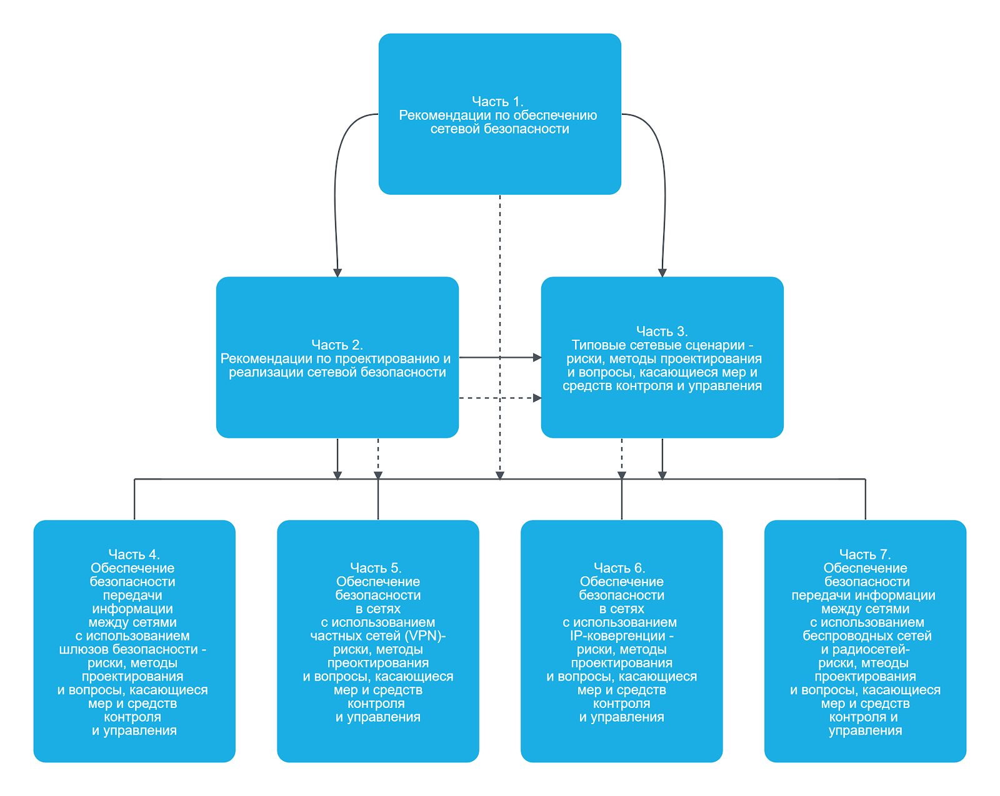
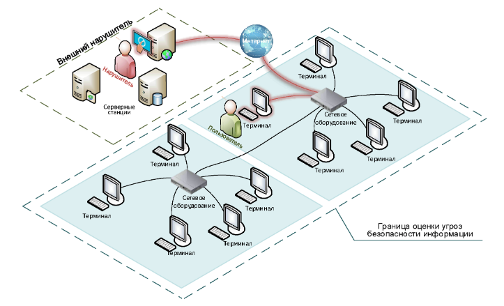
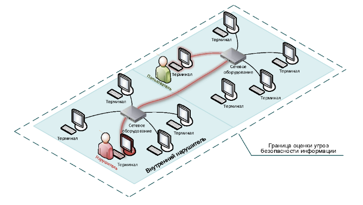
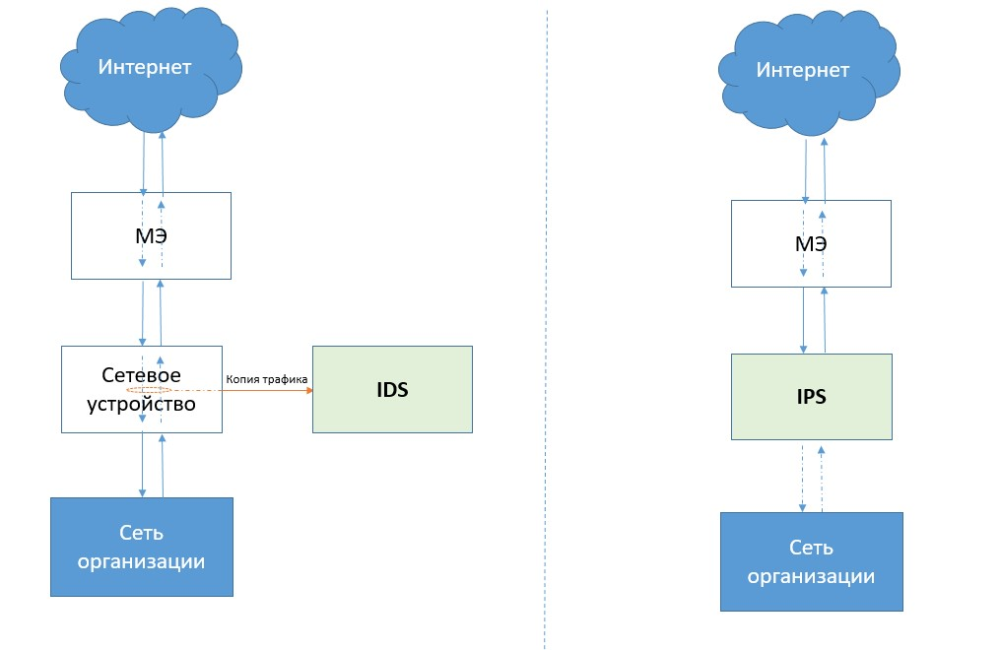
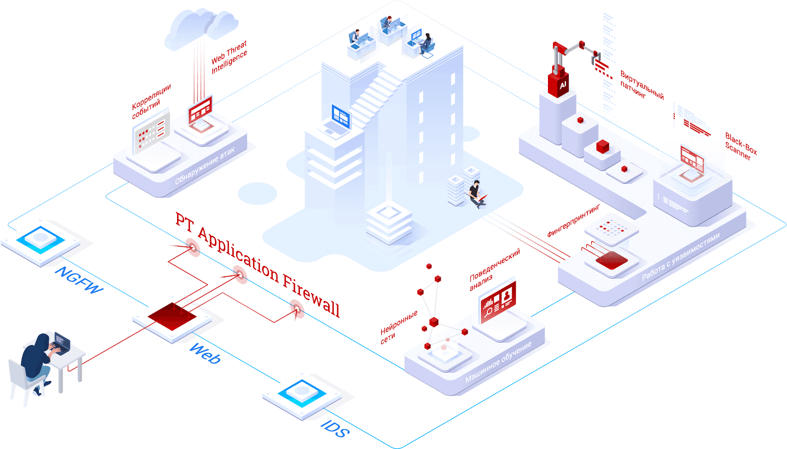

# 1. Введение

- Один из возможных способов получить несанкционированный доступ к информации и что-нибудь украсть, изменить или удалить — это попасть в сеть организации, домашнюю сеть или сеть вуза
- есть и другие варианты получить доступ: например, социальная инженерия, заражение устройств через съемные носители и так далее

В целом нарушитель может получить вашу информацию двумя способами:
- извне — например, через интернет;
- изнутри — например, подключиться к Wi-Fi из подъезда или подключиться к сетевым розеткам в офисе организации.

## Различные атаки

### man-in-the-middle (человек посередине) перехват информации

- можно забрать информацию об учетных данных и таким образом нарушить одно из свойств информации — целостность, доступность или конфиденциальность
- общественному Wi-Fi, злоумышленник в любой момент может перехватить ваш трафик с помощью сниффера — анализатора трафика, который будет содержать логин и пароль от онлайн-банка.

### Dos-атака (отказ в обслуживании)

Атака производится с одного устройства, и в этом случае клиенты теряют доступ к сайту компании. Помимо Dos-атаки есть еще Ddos-атака — ее отличие в том, что атака происходит с нескольких устройств одновременно.

### Внесение изменений в информацию, если злоумышленник уже проник в сеть

- будет нарушена целостность информации
- Например, злоумышленник может в разделе «Счет получателя» заменить информацию на свои данные и получать деньги вместо владельца сайта.

# 2. НПА в сфере защиты каналов передачи данных

В этом уроке вы коснетесь тех документов, которые относятся к обеспечению защиты сети. В них вы найдете основные термины, требования по защите информации, способы атак на сеть и способы им противодействовать.

Изучать документы и стандарты необходимо, чтобы:
- понимать, с чего начинать построение системы защиты информации;
- знать, какими будут требования регуляторов в каждом конкретном случае;
- иметь основания для разработки и утверждения локальных нормативных актов;
- понимать, какие меры защиты обязательны, а какие можно заменить компенсирующими мерами.

Ниже приведена часть нормативных правовых документов (НПА) в сфере информационной безопасности. С основными документами вы можете ознакомиться на официальном сайте [Федеральной службы по техническому и экспортному контролю России](https://fstec.ru/).

## Перечень НПА

### 1. Федеральные законы РФ

- [Федеральный закон от 27 июля 2006 г. № 149-ФЗ «Об информации, информационных технологиях и о защите информации»](https://www.consultant.ru/document/cons_doc_LAW_61798/)
- [Федеральный закон от 27 июля 2006 г. № 152-ФЗ «О персональных данных»](https://www.consultant.ru/document/cons_doc_LAW_61801/)
- [Федеральный закон от 26 июля 2017 г. № 187-ФЗ «О безопасности критической информационной инфраструктуры»](https://www.consultant.ru/document/cons_doc_LAW_220885/)

### 2. Указ Президента РФ

- [Указ Президента Российской Федерации от 22 мая 2015 г. №260 «О некоторых вопросах информационной безопасности Российской Федерации»](https://www.consultant.ru/document/cons_doc_LAW_179963/)
- [Указ Президента Российской Федерации от 22.12.2017 № 620 «О совершенствовании государственной системы обнаружения, предупреждения и ликвидации последствий компьютерных атак на информационные ресурсы Российской Федерации](http://www.kremlin.ru/acts/bank/42623)
- [Указ Президента Российской Федерации от 30.03.2022 № 166 «О мерах по обеспечению технологической независимости и безопасности критической информационной инфраструктуры Российской Федерации»](http://www.kremlin.ru/acts/bank/47688)
- [Указ Президента Российской Федерации от 01.05.2022 № 250 «О дополнительных мерах по обеспечению информационной безопасности Российской Федерации»](http://www.kremlin.ru/acts/bank/47796)

### 3. Постановление Правительства РФ

- [Постановление Правительства Российской Федерации от 01.11.2012 № 1119 «Об утверждении Требований к защите персональных данных при их обработке в информационных системах персональных данных»](https://base.garant.ru/70252506/)
- [Постановление Правительства Российской Федерации от 08.02.2018 № 127 «Об утверждении Правил категорирования объектов критической информационной инфраструктуры Российской Федерации, а также перечня показателей критериев значимости объектов критической информационной инфраструктуры Российской Федерации»](https://fstec.ru/dokumenty/vse-dokumenty/postanovleniya/postanovlenie-pravitelstva-rossijskoj-federatsii-ot-8-fevralya-2018-g-n-127)

### 4. Приказы ФСТЭК РФ

- [Приказ Федеральной службы по техническому и экспортному контролю от 11.02.2013 № 17 «Об утверждении Требований о защите информации, не составляющей государственную тайну, содержащейся в государственных информационных системах» (Приказ 17)](https://fstec.ru/dokumenty/vse-dokumenty/prikazy/prikaz-fstek-rossii-ot-11-fevralya-2013-g-n-17)
- [Приказ Федеральной службы по техническому и экспортному контролю от 18.02.2013 № 21 «Об утверждении Состава и содержания организационных и технических мер по обеспечению безопасности персональных данных при их обработке в информационных системах персональных данных» (Приказ 21)](https://fstec.ru/dokumenty/vse-dokumenty/prikazy/prikaz-fstek-rossii-ot-18-fevralya-2013-g-n-21)
- [Приказ Федеральной службы по техническому и экспортному контролю от 14.03.2014 № 31 «Об утверждении Требований к обеспечению защиты информации в автоматизированных системах управления производственными и технологическими процессами на критически важных объектах, потенциально опасных объектах, а также объектах, представляющих повышенную опасность для жизни и здоровья людей и для окружающей природной среды» (Приказ 31)](https://fstec.ru/dokumenty/vse-dokumenty/prikazy/prikaz-fstek-rossii-ot-14-marta-2014-g-n-31)
- [Приказ Федеральной службы по техническому и экспортному контролю от 21.12.2017 № 235 «Об утверждении Требований к созданию систем безопасности значимых объектов критической информационной инфраструктуры Российской Федерации и обеспечению их функционирования»](https://fstec.ru/dokumenty/vse-dokumenty/prikazy/prikaz-fstek-rossii-ot-21-dekabrya-2017-g-n-235)
- [Приказ Федеральной службы по техническому и экспортному контролю от 25.12.2017 № 239 «Об утверждении Требований по обеспечению безопасности значимых объектов критической информационной инфраструктуры Российской Федерации» (Приказ 239)](https://fstec.ru/dokumenty/vse-dokumenty/prikazy/prikaz-fstek-rossii-ot-25-dekabrya-2017-g-n-239)

### 5. Приказы ФСБ РФ

- [Приказ Федеральной службы безопасности Российской Федерации от 10.07.2014 № 378 «Об утверждении Состава и содержания организационных и технических мер по обеспечению безопасности персональных данных при их обработке в информационных системах персональных данных с использованием средств криптографической защиты информации, необходимых для выполнения установленных Правительством Российской Федерации требований к защите персональных данных для каждого из уровней защищенности»](https://base.garant.ru/70727118/)
- [Приказ Федеральной службы безопасности Российской Федерации от 24.07.2018 № 366 «О Национальном координационном центре по компьютерным инцидентам»](https://base.garant.ru/72041506/)
- [Приказ Федеральной службы безопасности Российской Федерации от 24.07.2018 № 368 «Об утверждении Порядка обмена информацией о компьютерных инцидентах между субъектами критической информационной инфраструктуры Российской Федерации, между субъектами критической информационной инфраструктуры Российской Федерации и уполномоченными органами иностранных государств, международными, международными неправительственными организациями и иностранными организациями, осуществляющими деятельность в области реагирования на компьютерные инциденты, и Порядка получения субъектами критической информационной инфраструктуры Российской Федерации информации о средствах и способах проведения компьютерных атак и о методах их предупреждения и обнаружения»](https://base.garant.ru/72041500/)
- [Приказ Федеральной службы безопасности Российской Федерации от 06.05.2019 № 196 «Об утверждении Требований к средствам, предназначенным для обнаружения, предупреждения и ликвидации последствий компьютерных атак и реагирования на компьютерные инциденты»](http://publication.pravo.gov.ru/Document/View/0001201905310017)
- [Приказ Федеральной службы безопасности Российской Федерации от 19.06.2019 № 281 «Об утверждении Порядка, технических условий установки и эксплуатации средств, предназначенных для обнаружения, предупреждения и ликвидации последствий компьютерных атак и реагирования на компьютерные инциденты, за исключением средств, предназначенных для поиска признаков компьютерных атак в сетях электросвязи, используемых для организации взаимодействия объектов критической информационной инфраструктуры Российской Федерации»](http://publication.pravo.gov.ru/Document/View/0001201907170027)
- [Приказ Федеральной службы безопасности Российской Федерации от 24.10.2022 № 524 «Об утверждении Требований о защите информации, содержащейся в государственных информационных системах, с использованием шифровальных (криптографических) средств»](http://publication.pravo.gov.ru/Document/View/0001202211230034)
- [Приказ Федеральной службы безопасности Российской Федерации от 9.02.2005 № 66 «Об утверждении Положения о разработке, производстве, реализации и эксплуатации шифровальных (криптографических) средств защиты информации (Положение ПКЗ 2005)»](https://normativ.kontur.ru/document?moduleId=1&documentId=156612)
- [Приказ ФАПСИ от 13.06.2001 № 152 «Об утверждении Инструкции об организации и обеспечении безопасности хранения, обработки и передачи по каналам связи с использованием средств криптографической защиты информации с ограниченным доступом, не содержащей сведений, составляющих государственную тайну»](https://normativ.kontur.ru/document?moduleId=1&documentId=45974)

### 6. Стандарты

- [ГОСТ Р ИСО/МЭК 27033-1-2011 Информационная технология. Методы и средства обеспечения безопасности. Безопасность сетей. Часть 1. Обзор и концепции](https://docs.cntd.ru/document/1200089172)
- [ГОСТ Р ИСО/МЭК 27033-2-2021 Информационные технологии. Методы и средства обеспечения безопасности. Безопасность сетей. Часть 2. Рекомендации по проектированию и реализации безопасности сетей](https://docs.cntd.ru/document/1200179559/titles)
- [ГОСТ Р ИСО/МЭК 27033-3-2014 Информационная технология. Методы и средства обеспечения безопасности. Безопасность сетей. Часть 3. Эталонные сетевые сценарии. Угрозы, методы проектирования и вопросы управления](https://docs.cntd.ru/document/1200113374)
- [ГОСТ Р ИСО/МЭК 27033-4-2021 Информационные технологии. Методы и средства обеспечения безопасности. Безопасность сетей. Часть 4. Обеспечение безопасности межсетевого взаимодействия с использованием шлюзов безопасности](https://docs.cntd.ru/document/1200179676)
- [ГОСТ Р ИСО/МЭК 27033-5-2021 Информационные технологии. Методы и средства обеспечения безопасности. Безопасность сетей. Часть 5. Обеспечение безопасности межсетевого взаимодействия с помощью виртуальных частных сетей (ВЧС)](https://docs.cntd.ru/document/1200179671)
- [ГОСТ Р ИСО/МЭК 27033-6-2016 Информационные технологии. Методы и средства обеспечения безопасности. Безопасность сетей. Часть 6. Обеспечение информационной безопасности при использовании беспроводных IP-сетей](https://docs.cntd.ru/document/573219431)
- [ГОСТ Р ИСО/МЭК 27033-7-2023 Информационные технологии. Методы и средства обеспечения безопасности. Безопасность сетей. Часть 7. Рекомендации по безопасности сетевой виртуализации](https://meganorm.ru/Data/751/75195.pdf)
- [ГОСТ Р ИСО/МЭК 13335-1-2006 Информационная технология. Методы и средства обеспечения безопасности. Часть 1. Концепция и модели менеджмента безопасности информационных и телекоммуникационных технологий](https://docs.cntd.ru/document/1200048398)
- [ГОСТ Р ИСО/МЭК ТО 13335-5-2006 Информационная технология. Методы и средства обеспечения безопасности. Часть 5. Руководство по менеджменту безопасности сети](https://docs.cntd.ru/document/1200048416)
- [ГОСТ Р ИСО/МЭК 18028-1-2008 Информационная технология. Методы и средства обеспечения безопасности. Сетевая безопасность информационных технологий. Часть 1. Менеджмент сетевой безопасности](https://docs.cntd.ru/document/1200081733)
- [ГОСТ Р 56205- 2014 IEC/TS 62443-1- 1:2009 Сети коммуникационные промышленные. Защищенность (кибербезопасность) сети и системы. Часть 1-1. Терминология, концептуальные положения и модели](https://docs.cntd.ru/document/1200114169)
- [ГОСТ Р МЭК 62443-2-1- 2015 Сети коммуникационные промышленные. Защищенность (кибербезопасность) сети и системы. Часть 2-1. Составление программы обеспечения защищенности (кибербезопасности) системы управления и промышленной автоматики](https://docs.cntd.ru/document/1200121982)
- [ГОСТ Р 56498- 2015 (IEC/PAS 62443-3:2008) Сети коммуникационные промышленные. Защищенность (кибербезопасность) сети и системы. Часть 3. Защищенность (кибербезопасность) промышленного процесса измерения и управления](https://docs.cntd.ru/document/1200121974)

# 3. Федеральные законы РФ

## ФЗ 149

[Федеральный закон от 27 июля 2006 г. № 149-ФЗ «Об информации, информационных технологиях и о защите информации»](https://base.garant.ru/12148555/7a58987b486424ad79b62aa427dab1df/)

регулирует отношения, возникающие при:
1. Поиске получении, передаче, производстве и распространении информации.
1. Применении информационных технологий.
1. Обеспечении защиты информации.

## ФЗ 156

[Федеральному закону от 27 июля 2006 г. № 152-ФЗ «О персональных данных»](https://base.garant.ru/12148567/5ac206a89ea76855804609cd950fcaf7/)

- посвящен обработке персональных данных и любым действиям с ними.
- определяет персональные данные и их оператора.

> **Персональные данные** это любая информация, которая прямо или косвенно относится к определенному или определяемому физическому лицу (субъекту персональных данных).

> **Оператор** это государственный орган, муниципальная структура, юридическое или физическое лицо, которое самостоятельно или совместно с другими организует и/или обрабатывает персональные данные. Оператор также определяет цели обработки, перечень обрабатываемых данных и действия (операции), которые выполняются с этими данными.

- Информационные системы персональных данных делятся на <ins>четыре уровня защищенности от первого</ins> (с самыми высокими требованиями по защите) до четвертого (с самыми низкими требованиями).
- Обеспечение безопасности персональных данных описывает 19 статья ФЗ 152.

Пункт 2 статьи 19 ФЗ 149 предписывает перечень действий в отношении персональных данных. Рассмотрим каждое из них отдельно.

## Обеспечение безопасности персональных данных достигается, в частности:

### 1. Определением угроз безопасности персональных данных при их обработке в информационных системах персональных данных.

Актуальные угрозы можно выявить с помощью методического документа «Методика оценки актуальных угроз информационной безопасности», утвержденного ФСТЭК РФ 05.02.2021 года.

Методика позволяет выявить:
- негативные последствия;
- реализацию угроз;
- способы реализации угроз;
- источники возникновения угроз;
- возможные объекты воздействия;
- оценка сценариев реализации угроз.

#### сформировать перечень актуальных угроз

На сайте Банка данных угроз безопасности [https://bdu.fstec.ru/threat-section/shaper-threats](https://bdu.fstec.ru/threat-section/shaper-threats)

Нужно последовательно отметить галочками:
1. Негативные последствия.
1. Угрозы.
1. Объекты воздействия.
1. Компоненты.
1. Нарушителя.

В результате вы получите перечень возможных угроз безопасности информации, который можно выгрузить в табличном виде.

### 2. Применением организационных и технических мер и уровни защищенности

[Уровни защищенности](https://base.garant.ru/70252506/f40a9f9fc2260e303cddfef5d7575dce/#block_10)

Уровень защищенности устанавливается в соответствии с [Постановлением Правительства Российской Федерации от 01.11.2012 № 1119 «Об утверждении требований к защите персональных данных при их обработке в информационных системах персональных данных»](https://base.garant.ru/70252506/).

Меры описаны в [Приказе Федеральной службы по техническому и экспортному контролю от 18.02.2013 № 21 «Об утверждении состава и содержания организационных и технических мер по обеспечению безопасности персональных данных при их обработке в информационных системах персональных данных»](https://base.garant.ru/70380924/).

### 3. Применением прошедших в установленном порядке процедур оценки соответствия средств защиты информации.

Процедура оценки соответствия средств защиты информации — это получение сертификата соответствия ФСБ и/или ФСТЭК, прохождение проверки на соответствие требования нормативных и методических документов в сфере защиты информации. Например, сертификат соответствия предлагает использовать вот эти:
- «Требования к межсетевым экранам» (ФСТЭК России, 2016);
- «Профиль защиты межсетевых экранов типа А четвертого класса защиты. ИТ.МЭ.А4.ПЗ» (ФСТЭК России, 2016);
- «Профиль защиты межсетевых экранов типа Б четвертого класса защиты. ИТ.МЭ.Б4.ПЗ» (ФСТЭК России, 2016).
 
- [Перечень средств защиты информации, сертифицированных ФСБ.](http://clsz.fsb.ru/clsz/certification.htm)
- [Перечень средств защиты информации, сертифицированных ФСТЭК.](https://reestr.fstec.ru/reg3)

#### Сертификаты

1. Сертификат соответствия ФСБ № СФ/124-4900 от 22.05.2024, что ПАК соответствует требованиям к средствам криптографической защиты информации класса КС3 и может использоваться для криптографической защиты (шифрование и имитозащита данных, передаваемых в IP-пакетах по общим сетям передачи данных) информации, не содержащей сведений, составляющих государственную тайну.
1. Сертификат соответствия ФСБ № СФ/124-4929 от 01.06.2024, что ПАК соответствует требованиям к средствам криптографической защиты информации класса КС3 и может использоваться для криптографической защиты (шифрование и имитозащита данных, передаваемых в IP-пакетах по общим сетям передачи данных) информации, не содержащей сведений, составляющих государственную тайну.
1. Сертификат соответствия ФСБ № СФ/525-4429, что ПАК соответствует требованиям ФСБ России к устройствам типа межсетевые экраны 4 класса защищенности и может использоваться для защиты информации от несанкционированного доступа в информационных и телекоммуникационных системах органов государственной власти Российской Федерации.
1. Сертификат соответствия ФСТЭК № 3692, что ПАК соответствует требованиям по безопасности информации, устанавливающим уровни доверия к средствам технической защиты информации и средствам обеспечения безопасности информационных технологий» (ФСТЭК России, 2020) по 4 уровню доверия, «Требования к межсетевым экранам» (ФСТЭК России, 2016), «Профиль защиты межсетевых экранов типа А четвертого класса защиты. ИТ.МЭ.А4.ПЗ» (ФСТЭК России, 2016) и «Профиль защиты межсетевых экранов типа Б четвертого класса защиты. ИТ.МЭ.Б4.ПЗ» (ФСТЭК России, 2016)).

Сертификаты ФСБ СФ/124-4900 и СФ/124-4929 отличаются формулярами и исполнением аппаратных платформ.

> **Формуляр**
> 
> это паспорт (учетный документ) средства защиты информации, в котором указаны, где указаны основная информация. Как и паспорт, формуляр должен храниться у владельца.

### 4. Оценкой эффективности принимаемых мер

Оценку эффективности проводит организация, имеющая лицензию ФСТЭК на проведение аттестации объектов информатизации.

### 5. Учетом машинных носителей персональных данных.

Здесь подразумевается ведение электронных или бумажных носителей — дисков, флешек и жестких дисков. Учет ведут, чтобы отслеживать цикл работы с персональными данными и понимать, где они хранятся и кто имеет к ним доступ.

### 6. Обнаружением фактов несанкционированного доступа к персональным данным

В отличие от ФЗ 149, меры дополняются средствами обнаружения вторжений (СОВА, IDM).

Также в [Приказе Роскомнадзора от 14.11.2022 № 187](https://www.garant.ru/products/ipo/prime/doc/405945757/) утвержден порядок информирования Роскомндзора о фактах неправомерной или случайной передачи (предоставления, распространения, доступа) персональных данных и о результатах внутреннего расследования.

### 7. Восстановлением персональных данных, модифицированных или уничтоженных вследствие несанкционированного доступа к ним.

В организации должен быть принят план создания и хранения резервных копий, а также план восстановления данных.

Резервные копии лучше хранить на разных носителях с источником. Нужно учесть, как часто создавать резервные копии и что именно вы будете хранить на них (резервные копии занимают немало места).

Кроме того, резервные копии нужно защитать так же, как основные данные. Не забывайте, что на резервных копиях тоже хранятся персональные данные.

### 8. Установлением правил доступа к персональным данным

обрабатываемым в информационной системе персональных данных, а также обеспечением регистрации и учета всех действий, совершаемых с персональными данными в информационной системе персональных данных.

Необходимо утвердить правила доступа к информационной системе персональных данных и включить журналирование действий работы с ними.

### 9. Контролем за принимаемыми мерами по обеспечению безопасности персональных данных и уровнем защищенности информационных систем персональных данных.

Отдел информационной безопасности должен проводить периодический контроль исполнения мер по обеспечению защиты персональных данных. Для этого сотрудники отдела ИБ готовят план работ на год, где указано, какие меры будут проверены в этом году. Кроме того, раз в два года нужно проходить внешний аудит системы защиты информации у организации, имеющей лицензию ФСТЭК на деятельность по технической защиты информации.

## ФЗ 187

[https://base.garant.ru/71730198/](https://base.garant.ru/71730198/)

вводит понятие «критическая информационная инфраструктура», или КИИ, и регламентирует требования к ее защите.

> **Критическая информационная инфраструктура (далее - КИИ)** это объекты критической информационной инфраструктуры, а также сети электросвязи, используемые для организации взаимодействия таких объектов.

> **Объекты критической информационной инфраструктуры** это информационные системы, информационно-телекоммуникационные сети, автоматизированные системы управления субъектов критической информационной инфраструктуры.

Проще говоря, объекты КИИ — это системы, нарушение работы которых значимо для страны.

> **Субъекты критической информационной инфраструктуры** это государственные органы, государственные учреждения, российские юридические лица и (или) индивидуальные предприниматели, которым на праве собственности, аренды или на ином законном основании принадлежат информационные системы, информационно-телекоммуникационные сети, автоматизированные системы управления, функционирующие в сфере здравоохранения, науки, транспорта, связи, энергетики, государственной регистрации прав на недвижимое имущество и сделок с ним, банковской сфере и иных сферах финансового рынка, топливно-энергетического комплекса, в области атомной энергии, оборонной, ракетно-космической, горнодобывающей, металлургической и химической промышленности, российские юридические лица и (или) индивидуальные предприниматели, которые обеспечивают взаимодействие указанных систем или сетей.

В ФЗ 187 выделено 14 сфер, к которым может относиться субъект КИИ:
1. Здравоохранение.
1. Наука.
1. Транспорт.
1. Связь.
1. Энергетика.
1. Государственная регистрация прав на недвижимое имущество и сделок с ним.
1. Банковская сфера и иные сферы финансового рынка.
1. Топливно-энергетический комплекс.
1. Область атомной энергии.
1. Оборонная промышленность
1. Ракетно-космическая промышленность.
1. Горнодобывающая промышленность.
1. Металлургическая промышленность.
1. Химическая промышленность.

### Категории КИИ

В соответствии с [Постановлением Правительства РФ от 8 февраля 2018 г. N 127 «Об утверждении Правил категорирования объектов критической информационной инфраструктуры Российской Федерации, а также перечня показателей критериев значимости объектов критической информационной инфраструктуры Российской Федерации и их значений»](https://base.garant.ru/71876120/), объекты КИИ разделены на четыре категории:

1. Первая.
1. Вторая.
1. Третья.
1. Незначимая.

### Отвественность 

Одно из основных отличий ФЗ 187 от ФЗ 149 и ФЗ 152 — уголовная ответственность за нарушение работы объекта КИИ несет не только злоумышленник, но и лицо, его допустившее

В соответствии со статьей [9 ФЗ 187](https://base.garant.ru/71730198/493aff9450b0b89b29b367693300b74a/) субъект КИИ обязан незамедлительно информировать ФСБ РФ или Центральный Банк России о компьютерных инцидентах, а также реагировать на них. Для этого субъект КИИ должен относиться к банковской или финансовой сферам и быть подключенным к Государственной системе обнаружения, предупреждения и ликвидации последствий компьютерных атак (ГосСОПКА).

## Статья 10 ФЗ 187

[https://base.garant.ru/71730198/3d3a9e2eb4f30c73ea6671464e2a54b5/](https://base.garant.ru/71730198/3d3a9e2eb4f30c73ea6671464e2a54b5/)

Вот как в статье описаны основные задачи системы безопасности значимого объекта критической информационной инфраструктуры.

1. Предотвращение неправомерного доступа к информации, обрабатываемой значимым объектом критической информационной инфраструктуры, уничтожения такой информации, ее модифицирования, блокирования, копирования, предоставления и распространения, а также иных неправомерных действий в отношении такой информации.
1. Недопущение воздействия на технические средства обработки информации, в результате которого может быть нарушено и (или) прекращено функционирование значимого объекта критической информационной инфраструктуры.
    - Кроме защиты информации ФЗ 187 предусматривает и защиту технических средств. Если внимательно посмотреть на определение КИИ, можно увидеть, что в него входят и линии электросвязи. Да, по ним может быть передана информация, но работа техники важнее.
    - Это относится и к системам управления на заводе: защитить технику не менее важно, чем информацию, которая может на ней храниться, чтобы работа завода не остановилась.
1. Восстановление функционирования значимого объекта критической информационной инфраструктуры, обеспечиваемого в том числе за счет создания и хранения резервных копий необходимой для этого информации.
    - хорошее правило создания резервных копий «3-2-1»:
        - создавайте минимум три резервные копии — одну основную и две резервные на случай, если с основной что-то произойдет;
        - храните копии минимум на двух разных носителях — например, две копии на жестком диске и одну на облачном носителе;
        - одна копия обязательно должна храниться в другом месте — например, на облаке или в другом здании.
1. Непрерывное взаимодействие с государственной системой обнаружения, предупреждения и ликвидации последствий компьютерных атак на информационные ресурсы Российской Федерации.
    - субъект КИИ должен быть подключен к ГосСОПКе. Это поможет вовремя находить и противодействовать атакам злоумышленников.
    - ГосСОПКу можно сравнить с государственным IDS (средством обнаружения вторжений), информация с которых поступает в единую систему. Вот как это работает.

## Статья 11 ФЗ 187

[https://base.garant.ru/71730198/9d78f2e21a0e8d6e5a75ac4e4a939832/](https://base.garant.ru/71730198/9d78f2e21a0e8d6e5a75ac4e4a939832/)

**Первая статья:**

[Требования](https://ivo.garant.ru/#/document/71901880/entry/170) по обеспечению безопасности значимых объектов критической информационной инфраструктуры, устанавливаемые федеральным органом исполнительной власти, уполномоченным в области обеспечения безопасности критической информационной инфраструктуры Российской Федерации, дифференцируются в зависимости от категории значимости объектов критической информационной инфраструктуры.

Этими требованиями предусматриваются:

1. Планирование, разработка, совершенствование и осуществление внедрения мероприятий по обеспечению безопасности значимых объектов критической информационной инфраструктуры.
1. Принятие организационных и технических мер для обеспечения безопасности значимых объектов критической информационной инфраструктуры.
    - Технические меры обеспечения безопасности значимых объектов КИИ предполагают создание систем защиты:
        - установку средств защиты информации;
        - ограничение доступа к сети КИИ;
        - создание матрицы доступа пользователей;
        - настройку работы технических средств;
        - ведение электронных журналов;
        - автоматическое обнаружение событий информационной безопасности.
    - Организационные меры отличаются от технических и предполагают:
        - разработку и утверждение документов, регламентирующих работу объекта КИИ;
        - проведение обучения сотрудников;
        - проведение киберучений;
        - реагирование на инциденты информационной безопасности;
        - ограничение доступа к средствам защиты и техническим средствам;
        - ведение учета средств защиты и технических средств;
        - разработку инструкций.
1. Установление параметров и характеристик программных и программно-аппаратных средств, применяемых для обеспечения безопасности значимых объектов критической информационной инфраструктуры.

# 4. Указы Президента РФ, Постановления Правительства и Приказы

## Указы Президента РФ

1. [Указ Президента Российской Федерации от 22 мая 2015 г. №260 «О некоторых вопросах информационной безопасности Российской Федерации». ](https://base.garant.ru/71035416/)
    - Цель указа — выделить российский сегмент интернета как часть глобальной сети. То есть если Россию отключат от общего интернета, российский сегмент станет самостоятельным и продолжит работу.
1. [Указ Президента Российской Федерации от 22.12.2017 № 620 «О совершенствовании государственной системы обнаружения, предупреждения и ликвидации последствий компьютерных атак на информационные ресурсы Российской Федерации».](https://www.garant.ru/products/ipo/prime/doc/71740924/)
    - Указ посвящен ГосСОПКе, и на ФСБ возложена роль уполномоченного за ее работу.
1. [Указ Президента Российской Федерации от 30.03.2022 № 166 «О мерах по обеспечению технологической независимости и безопасности критической информационной инфраструктуры Российской Федерации».](https://base.garant.ru/403784114/)
    - Указ посвящен импортозамещению и срокам перехода на отечественное ПО.
    - <ins>С 1 января 2025 г. органам государственной власти и заказчикам запрещается использовать иностранное программное обеспечение на принадлежащих им значимых объектах критической информационной инфраструктуры.</ins>
1. [Указ Президента Российской Федерации от 01.05.2022 № 250 «О дополнительных мерах по обеспечению информационной безопасности Российской Федерации».](https://base.garant.ru/404561984/)
    - Указ обязывает государственные компании, субъекты КИИ и системообразующие предприятия возложить полномочия по обеспечению ИБ на заместителя руководителя организации, а также создать структурное подразделение, отвечающее за информационную безопасность.

## Постановления Правительства РФ

- [Постановление Правительства Российской Федерации от 01.11.2012 № 1119 «Об утверждении Требований к защите персональных данных при их обработке в информационных системах персональных данных».]()
    - Постановление присваивает информационным системам персональных данных (далее — ИСПДн) один из четырех уровней защищенности.
- [Постановление Правительства Российской Федерации от 08.02.2018 № 127 «Об утверждении Правил категорирования объектов критической информационной инфраструктуры Российской Федерации, а также перечня показателей критериев значимости объектов критической информационной инфраструктуры Российской Федерации».](https://base.garant.ru/71876120/)
    - Постановление присваивает объекту КИИ одну из трех категорий значимости или устанавливаем, что объект КИИ является незначимым.

объект КИИ одновременно может быть ИСПДн. В этом случае меры защиты надо применять как для защиты объекта КИИ, так и для защиты персональных данных.

## Приказы ФСТЭК РФ

- В приказах ФСТЭК определены основные требования к созданию и функционированию системы защиты
- Полный перечень: [https://fstec.ru/dokumenty-filter](https://fstec.ru/dokumenty-filter)

ФСТЭК регулирует не только деятельность в сфере защиты сети, но и в других сферах ИБ:
- защиты государственной тайны;
- защиты от несанкционированного доступа;
- защиты от недекларируемых возможностей;
- антивирусной защиты;
- обнаружения и реагирования на события информационной безопасности.

Приказы ФСТЭК 17, 21, 31, 239 пересекаются между собой, но и имеют отличия. Полный перечень различий можно посмотреть дополнительно, например на [https://zlonov.ru/measures-table/](https://zlonov.ru/measures-table/)

### объекты или информационные системы, требования к которым они устанавливают

| Наименование приказа ФСТЭК | К ИС или объекту относится |
| -------------- | --------------- |
| [Приказ Федеральной службы по техническому и экспортному контролю от 11.02.2013 № 17 «Об утверждении Требований о защите информации, не составляющей государственную тайну, содержащейся в государственных информационных системах»](https://base.garant.ru/70391358/) | Государственные или муниципальные информационные системы |
| [Приказ Федеральной службы по техническому и экспортному контролю от 18.02.2013 № 21 «Об утверждении Состава и содержания организационных и технических мер по обеспечению безопасности персональных данных при их обработке в информационных системах персональных данных»](https://base.garant.ru/70380924/) | Информационные системы персональных данных |
| [Приказ Федеральной службы по техническому и экспортному контролю от 14.03.2014 № 31 «Об утверждении Требований к обеспечению защиты информации в автоматизированных системах управления производственными и технологическими процессами на критически важных объектах, потенциально опасных объектах, а также объектах, представляющих повышенную опасность для жизни и здоровья людей и для окружающей природной среды»](https://www.garant.ru/products/ipo/prime/doc/70590918/) | Автоматизированные системы управления производственными и технологическими процессам |
| [Приказ Федеральной службы по техническому и экспортному контролю от 25.12.2017 № 239 «Об утверждении Требований по обеспечению безопасности значимых объектов критической информационной инфраструктуры Российской Федерации»](https://base.garant.ru/71901880/) | Объекты КИИ |

### общие требований к защите сети

<table>
<tbody>
<tr>
<th>Приказ 17</th>
<th>Приказ 21</th>
<th>Приказ 31</th>
<th>Приказ 239</th>
</tr>
<tr>
<td>II. Управление доступом субъектов доступа к объектам доступа (УПД)</td>
<td>II. Управление доступом субъектов доступа к объектам доступа (УПД)</td>
<td>II. Управление доступом (УПД)</td>
<td>II. Управление доступом (УПД)</td>
</tr>
<tr>
<td>VII. Обнаружение вторжений (СОВ)</td>
<td>VII. Обнаружение вторжений (СОВ)</td>
<td>VII. Предотвращение вторжений (компьютерных атак) (СОВ)</td>
<td>VII. Предотвращение вторжений (компьютерных атак) (СОВ)</td>
</tr>
<tr>
<td>X. Обеспечение доступности информации (ОДТ)</td>
<td>X. Обеспечение доступности персональных данных (ОДТ)</td>
<td>IX. Обеспечение доступности (ОДТ)</td>
<td>IX. Обеспечение доступности (ОДТ)</td>
</tr>
<tr>
<td>XII. Защита технических средств (ЗТС)</td>
<td>XII. Защита технических средств (ЗТС)</td>
<td>X. Защита технических средств и систем (ЗТС)</td>
<td>X. Защита технических средств и систем (ЗТС)</td>
</tr>
<tr>
<td>XIII. Защита информационной системы, ее средств, систем связи и передачи данных (ЗИС)</td>
<td>XIII. Защита информационной системы, ее средств, систем связи и передачи данных (ЗИС)</td>
<td>XI. Защита информационной (автоматизированной) системы и ее компонентов (ЗИС)</td>
<td>XI. Защита информационной (автоматизированной) системы и ее компонентов (ЗИС)</td>
</tr>
<tr>
<td></td>
<td>XIV. Выявление инцидентов и реагирование на них (ИНЦ)</td>
<td>XII. Реагирование на компьютерные инциденты (ИНЦ)</td>
<td>XII. Реагирование на компьютерные инциденты (ИНЦ)</td>
</tr>
</tbody>
</table>

## Приказы ФСБ РФ

условно относятся к:
- Шифрованию данных и каналов связи.
- ГосСОПКЕ.

<table>
<tbody>
<tr>
<td>Шифрование</td>
<td>ГосСОПКА</td>
</tr>
<tr>
<td>Приказ ФАПСИ от 13.06.2001 № 152 «Об утверждении Инструкции об организации и обеспечении безопасности хранения, обработки и передачи по каналам связи с использованием средств криптографической защиты информации с ограниченным доступом, не содержащей сведений, составляющих государственную тайну»</td>
<td>Приказ Федеральной службы безопасности Российской Федерации от 24.07.2018 № 366 «О Национальном координационном центре по компьютерным инцидентам»</td>
</tr>
<tr>
<td>Приказ Федеральной службы безопасности Российской Федерации от 9.02.2005 № 66 «Об утверждении Положения о разработке, производстве, реализации и эксплуатации шифровальных (криптографических) средств защиты информации (Положение ПКЗ 2005)»</td>
<td>Приказ Федеральной службы безопасности Российской Федерации от 24.07.2018 № 368 «Об утверждении Порядка обмена информацией о компьютерных инцидентах между субъектами критической информационной инфраструктуры Российской Федерации, между субъектами критической информационной инфраструктуры Российской Федерации и уполномоченными органами иностранных государств, международными, международными неправительственными организациями и иностранными организациями, осуществляющими деятельность в области реагирования на компьютерные инциденты, и Порядка получения субъектами критической информационной инфраструктуры Российской Федерации информации о средствах и способах проведения компьютерных атак и о методах их предупреждения и обнаружения»</td>
</tr>
<tr>
<td>Приказ Федеральной службы безопасности Российской Федерации от 10.07.2014 № 378 «Об утверждении Состава и содержания организационных и технических мер по обеспечению безопасности персональных данных при их обработке в информационных системах персональных данных с использованием средств криптографической защиты информации, необходимых для выполнения установленных Правительством Российской Федерации требований к защите персональных данных для каждого из уровней защищенности»</td>
<td>Приказ Федеральной службы безопасности Российской Федерации от 06.05.2019 № 196 «Об утверждении Требований к средствам, предназначенным для обнаружения, предупреждения и ликвидации последствий компьютерных атак и реагирования на компьютерные инциденты»</td>
</tr>
<tr>
<td>Приказ Федеральной службы безопасности Российской Федерации от 24.10.2022 № 524 «Об утверждении Требований о защите информации, содержащейся в государственных информационных системах, с использованием шифровальных (криптографических) средств»</td>
<td>Приказ Федеральной службы безопасности Российской Федерации от 19.06.2019 № 281 «Об утверждении Порядка, технических условий установки и эксплуатации средств, предназначенных для обнаружения, предупреждения и ликвидации последствий компьютерных атак и реагирования на компьютерные инциденты, за исключением средств, предназначенных для поиска признаков компьютерных атак в сетях электросвязи, используемых для организации взаимодействия объектов критической информационной инфраструктуры Российской Федерации»</td>
</tr>
</tbody>
</table>

В приказах ФСБ, посвященных шифрованию, описаны требования к СКЗИ
- хранению
- эксплуатации
- учету средств СКЗИ
- выбору класса СКЗИ

В приказах ФСБ, посвященных ГосСОПКе
- регламентированы способы подключения
- информирования
- требования к средствам.

# 5. Стандарты

особое внимание стоит уделить серии стандартов ГОСТ Р ИСО/МЭК 27033-1-2011 Информационная технология. Методы и средства обеспечения безопасности. Безопасность сетей.

В стандартах ГОСТ Р ИСО/МЭК 2703 описаны меры защиты сети, ее проектированию и построению.

## схема, в которой рекомендовано читать стандарты

- Сплошная линия — это основная последовательность
- Пунктирная линия — альтернативная последовательность, можно придерживаться и ее

## ГОСТ Р ИСО/МЭК 27033 Информационная технология. Методы и средства обеспечения безопасности. Безопасность сетей.

### ГОСТ Р ИСО/МЭК 27033-1-2011  Часть 1. Обзор и концепции

- [https://base.garant.ru/70246078/](https://base.garant.ru/70246078/)
- приведены основные определения, связанные с безопасностью сети
- по порядку рассмотрено построение сети

#### Порядок построения сети

1. Сбор информации об исходном состоянии сети. Описание архитектуры планируемой защищенной сети.
1. Риски информационной безопасности для исходного состояния сети.
1. Меры противодействия рискам информационной безопасности.
1. Менеджмент непрерывной деятельности.
1. Рекомендации по проектированию и построению сетевой безопасности.
1. Типовые сценарии - атаки и меры им противодействия.
1. Разработка и тестирование программных и технических средств для обеспечения защиты сети.
1. Мониторинг и проверки работы системы защиты сети.

### ГОСТ Р ИСО/МЭК 27033-2-2021 Часть 2. Рекомендации по проектированию и реализации безопасности сетей

- [https://rosgosts.ru/file/gost/35/040/gost_r_iso!mek_27033-2-2021.pdf](https://rosgosts.ru/file/gost/35/040/gost_r_iso!mek_27033-2-2021.pdf)
- посвящена рекомендациям при проектировании и реализации безопасности сети
- подробнее раскрывает аспекты первой части.

#### 1. Три этапа подготовки к проектированию сети

1. Инвентаризацию активов.
1. Сбор и анализ требований. Здесь требования устанавливают законодательство, внутренние нормативные акты, бизнес-процессы.
1. Анализ реализованных проектов в компании или других компаний (так называемые best practices) (пример [YandexCloud](https://yandex.cloud/ru/docs/security/standard/network-security))

#### 2. Этап создания, согласования и утверждения проекта системы защиты сети

1. Выбор компонентов сети, на которых будет создана система защиты сети. Защитить сеть от всех угроз невозможно — для этого нужны финансовые и человеческие ресурсы.
1. Выбор средств защиты информации и поставщиков.
1. Настройку работы сети — подготовку к внедрению средств защиты информации.
1. Регистрацию, мониторинг и реагирование на события информационной безопасности.
1. Документирование реализации проекта.
1. Проведение испытаний и тестирование.
1. Перевод работы системы защиты сети в продуктивный контур.

### ГОСТ Р ИСО/МЭК 27033-3-2014 Часть 3. Эталонные сетевые сценарии. Угрозы, методы проектирования и вопросы управления

- [https://gostassistent.ru/doc/081f8a52-4e5b-4dce-8ebf-c0d3687b77cc](https://gostassistent.ru/doc/081f8a52-4e5b-4dce-8ebf-c0d3687b77cc)
- описаны
    - угрозы
    - сценарии, которые могут возникнут при реализации этих угроз
    - методы контроля и управления безопасности

Сценарии делятся в зависимости от:
- вида доступа пользователя — внешний или внутренний пользователь;
- вида доступности информации — открытые (доступные из интернета), ограниченные (не имеющие свободного доступа из интернета) и внешние (аутсорсинг).

> **Открытые** - это сайты или порталы, опубликованные в сети Интернет.

> **Ограниченные** - это внутренние информационные системы, например «1С Бухгалтерия».

> **Внешние** - это ситуации, когда подключается внешний подрядчик, например для оказания аутсорсинговых услуг.

### ГОСТ Р ИСО/МЭК 27033-4-2021 Часть 4. Обеспечение безопасности межсетевого взаимодействия с использованием шлюзов безопасности

- [https://protect.gost.ru/v.aspx?control=8&baseC=-1&page=0&month=-1&year=-1&search=&RegNum=1&DocOnPageCount=15&id=230308](https://protect.gost.ru/v.aspx?control=8&baseC=-1&page=0&month=-1&year=-1&search=&RegNum=1&DocOnPageCount=15&id=230308)
- посвящена обеспечению защиты сети при межсетевом взаимодействии
- выбору и настройке межсетевого экрана
- рассмотрена связь между угрозами и требования по обеспечению безопасности сети на каждом уровне модели OSI

межсетевой экран ставится на границе сети и помогает предотвратить следующие угрозы:
- отказ в обслуживании авторизованным пользователям;
- несанкционированное изменение данных;
- несанкционированное разглашение информации;
- несанкционированная реконфигурация системы;
- несанкционированное использование ресурсов и активов организации:
- искажение контента в результате воздействия вируса или вредоносного ПО;
- нарушение виртуализации;
- DoS- и DDoS-атаки, нацеленные на шлюз безопасности.

### ГОСТ Р ИСО/МЭК 27033-5-2021 Часть 5. Обеспечение безопасности межсетевого взаимодействия с помощью виртуальных частных сетей (ВЧС)

- [https://rosgosts.ru/file/gost/35/040/gost_r_iso!mek_27033-5-2021.pdf](https://rosgosts.ru/file/gost/35/040/gost_r_iso!mek_27033-5-2021.pdf)
- рассматриваются виртуальные частные сети (virtual private network) — VPN
    - рассмотрены угрозы безопасности VPN
    - проектирование VPN
    - меры противодействия угрозам

VPN бывает двух видов:
- точка-точка (соединение двух удаленных устройства);
- точка-облако (подключение компьютера к удаленной сети).

### ГОСТ Р ИСО/МЭК 27033-6-2016 Часть 6. Обеспечение информационной безопасности при использовании беспроводных IP-сетей

- [https://gostassistent.ru/doc/323f9de5-f3af-4131-a98e-5a27e7206c23](https://gostassistent.ru/doc/323f9de5-f3af-4131-a98e-5a27e7206c23)
- описаны угрозы, требования информационной безопасности и меры противодействия угрозам, связанные с <ins>беспроводными сетями</ins>

К беспроводным сетям относятся:
- Wi-Fi;
- HiperLAN — европейская альтернатива стандарта IEEE 802.11;
- WAPI — китайская альтернатива стандарта IEEE 802.11;
- Bluetooth;
- ZIgBee (например, используется для управления устройствами умного дома);
- Мобильная связь (3G–5G);
- WiMAX.

важно обеспечить безопасность трех компонентов:
- аутентификации и авторизации;
- противодействие атакам типа Отказ в обслуживании;
- конфиденциальности, целостности, доступностим и неотказуемости.

### ИСО/МЭК 27033-7-2023 Часть 7. Рекомендации по безопасности сетевой виртуализации

посвящен защите сети виртуализации:
- между гипервизором и хостом;
- между хостами.

# 6. Угрозы и нарушители безопасности каналов передачи данных

## Угрозы

В стандартах ИСО/МЭК 27033-7-2023 рассмотрены угрозы нарушения работы сети и меры противодействия им.

> **Угроза** это потенциально возможное событие, которое может нанести ущерб информационной безопасности и нарушить одной из свойств информации: конфиденциальность, целостность и доступность.

Основной документ в России, посвященный угрозам — [Методика оценки угроз безопасности информации](https://www.garant.ru/products/ipo/prime/doc/400325044/)

В Методике есть
- способы определения угроз, нарушителей
- их влияния на систему
- написание модели угроз

Примеры угроз можно найти на
- [Банк данных угрозы безопасности ФСТЭК РФ](https://bdu.fstec.ru/threat) — официальный банк угроз, который постоянно обновляется. ФСТЭК предлагает свой сканер уязвимостей ScanOVAL, но он не предусмотрен для сканирования всей сети.
- [MITRE ATT&CK](https://attack.mitre.org/) — в матрице указаны основные векторы атак, при этом можно построить цепочку от разведки до закрепления внутри сети и нанесения ущерба ([на русском](https://mitre.ptsecurity.com/ru-RU)).
- [Open Worldwide Application Security Project](https://owasp.org/) — открытый проект со списком уязвимостей веб-приложений.

## Нарушитель

> физическое лицо, случайно или преднамеренно совершающее действия, следствием которых является нарушение информационной безопасности (конфиденциальности, целостности или доступности информации).

два основных вида:
1. **Внешние нарушители** - это лица, которые не имеют права на доступ к охраняемой зоне (территории) или не обладают полномочиями для доступа к информационным ресурсам и компонентам систем и сетей, требующим авторизации.  
1. **Внутренние нарушители** - это лица, обладающие правами на доступ к охраняемой территории, контролируемой зоне или имеющие полномочия на автоматизированный доступ к информационным ресурсам и компонентам систем и сетей.  
    - могут иметь различные уровни доступа к информационным ресурсам и компонентам систем и сетей
        - вход в личный кабинет на сайте;
        - выполнение обязанностей на автоматизированном рабочем месте;
        - управление системами и сетями и пр.

## Виды сетевых атак

основные сетевые атаки:
- сетевая разведка;
- переполнение буфера;
- использование специализированных программ (вирусов, снифферов, троянских коней, почтовых червей, rootkit-ов и так далее);
- spoofing;
- man-in-the-middle;
- инъекция (SQL-инъекция, PHP-инъекция, межсайтовый скриптинг или XSS-атака, XPath-инъекция);
- отказ в обслуживании (DoS- и DDoS- атаки);
- phishing-атаки;
- Brute-force.

особенности:
<table>
<tbody>
<tr>
<th>Атака</th>
<th>Описание</th>
</tr>
<tr>
<td>Поиск хостов (разведка) или сетевая разведка</td>
<td>Сканирование доступных извне портов, анализ их наличие уязвимости — например, с помощью поисковика <a target="_blank" href="https://www.shodan.io/" rel="noopener">Shodan</a>.  Если нарушитель попал в сеть, то сканирование сети внутри с помощью сканеров узлов — например, с помощью<a target="_blank" href="https://nmap.org/" rel="noopener"> nmap</a>, <a target="_blank" href="https://habr.com/ru/companies/bizone/articles/656675/" rel="noopener">masscan</a>.  Может включать прочие методы OSINT: сбор любой информации об организации, о сотрудниках, об используемых порталах и пр.</td>
</tr>
<tr>
<td>Сниффинг</td>
<td>Прослушивание (перехват) трафика , проходящий внутри сети — например, с помощью программы <a target="_blank" href="https://www.wireshark.org/" rel="noopener">wireshark</a>.</td>
</tr>
<tr>
<td>Переполнение буфера</td>
<td>Атака, основанная на эксплуатации уязвимости переполнения буфера оперативной памяти, выхода из строя техники и получения возможности выполнения определенного кода вплоть до получения прав администратора.   Так нарушитель может получить доступ к сетевому оборудованию, доступному из интернета.</td>
</tr>
<tr>
<td>Использование специализированных программ — вирусов, троянских коней, почтовых червей, rootkit-ов и пр.</td>
<td>Специализированные программы для закрепления внутри сети, нарушения ее работы или попытки попасть внутрь сети — например, направление электронных писем с вирусом.</td>
</tr>
<tr>
<td>Спуфинг (spoofing)</td>
<td>Есть разные способы подмены адреса или имени хоста.   IP-spoofing — подмена адреса нарушителя адресом узла сети, чтобы нарушитель считался легитимным участником сети.   ARP-Spoofing — подмена mac-адреса.   <a target="_blank" href="https://ru.wikipedia.org/wiki/DNS" rel="noopener">DNS</a>-spoofing — подмена имени хоста на DNS.</td>
</tr>
<tr>
<td>Man-in-the-middle (человек посередине)</td>
<td>Атака, при которой нарушитель может установить в сеть свой узел или сервер, часто связана со spoofing. Нарушитель может читать проходящие через него пакеты и передавать их дальше.   Также может выполнять и другие атаки:
<ul>
<li>Подмену DHCP-сервера — нарушитель подменяет работу DHCP сервера и выдает адреса своим узлам.</li>
<li>Подмену DNS-сервера — нарушитель заменяет имена узлов или ip-адреса в сети на свои.</li>
<li>Подмену gateway — нарушитель подменяет путь по умолчанию на свой сервер для получения доступа к информации.</li>
<li>Подмену сервисов ОС — нарушитель подменяет другие адреса серверов, чтобы трафик шел через его сервера.</li>
</ul>
 Логика атаки всегда одна — пустить трафик через свой узел, чтобы иметь доступ к информации.</td>
</tr>
<tr>
<td>Инъекция (SQL-инъекция, PHP-инъекция, межсайтовый скриптинг или XSS-атака, XPath-инъекция)</td>
<td>Направление специально сконфигурированного кода к базе данных, сайту или серверу для изменения логики запроса, получения дополнительных прав или даже прав администратора</td>
</tr>
<tr>
<td>Отказ в обслуживании (DoS- и DDoS- атаки)</td>
<td>Направление множества запросов к серверу, в результате сервер становится недоступен для других пользователей. Одни из самых известных атак.   DoS и DDos можно использовать совместно с фишингом. Например, пока сайт Сбербанка недоступен, клиенты банка найдут в поисковике сайт злоумышленника <a target="_blank" href="http://www.сberbank.ru/" rel="noopener">http://www.сberbank.ru/</a> и попробуют зайти на него вместо основного сайта. Но если присмотреться, адрес не зашифрован: мы видим http вместо https, а также букву с вместо s в начале — это ненастоящий сайт.</td>
</tr>
<tr>
<td>Phishing-атаки</td>
<td>Фишинг — это попытка получения данных от физических лиц с помощью социальной инженерии. Например, злоумышленник может представиться генеральным директором и запросить у системного администратора логин и пароль от сервера.</td>
</tr>
<tr>
<td>Brute-force</td>
<td>Очень старый, но до сих пор эффективный метод, заключающийся в переборе паролей.   Сканирование в интернете на известные порты происходит постоянно. Подобрать пароль злоумышленник может и внутри сети.   Если вы выпустите порт 22 (для управления сетевым оборудованием) или 3389 (порт RDP), то злоумышленники тут же попробуют подобрать к ним пароли.</td>
</tr>
</tbody>
</table>

В [пункте 5.2.3 Методики оценки угроз безопасности информации](https://www.garant.ru/products/ipo/prime/doc/400325044/) описаны некоторые угрозы

### разница между угрозами и угрозами из Методики

1. **Использование уязвимостей**
    - > уязвимостей кода, программного обеспечения, архитектуры и конфигурации систем и сетей, а также организационных и многофакторных уязвимостей.
    - Атака здесь — внедрение инъекций. Это SQL-инъекция, PHP-инъекция, межсайтовый скриптинг или XSS-атака, XPath-инъекция, а также существующие phishing-атаки.
1. **Внедрение вредоносного программного обеспечения**
    - Тут злоумышленники используют специализированные программы (вирусы, снифферы, троянских коней, почтовых червей, rootkit-ов и пр.).
1. Использование недекларированных возможностей программного обеспечения или программно-аппаратных средств.
    - Здесь атакой послужит переполнение буфера.
1. **Установка программных или программно-аппаратных закладок** в программное обеспечение или программно-аппаратные средства;
1. **Формирование и использование скрытых каналов** — по времени, по памяти — для передачи конфиденциальных данных;
    - В обоих пунктах выше атаками будут сетевая разведка, IP-спуфинг и man-in-the-middle.
1. **Перехват (измерение) побочных электромагнитных излучений и наводок** (других физических полей) для доступа к конфиденциальной информации, содержащейся в аппаратных средствах аутентификации.
1. **Инвазивные способы доступа к конфиденциальной информации**, содержащейся в аппаратных средствах аутентификации.
1. **Нарушение безопасности при поставках** программных, программно-аппаратных средств или услуг по установке, настройке, испытаниям, пусконаладочным работам (в том числе администрированию, обслуживанию).
    - Здесь атака — отказ в обслуживании (DoS- и DDoS- атаки).
1. **Ошибочные действия в ходе создания и эксплуатации систем и сетей**, в том числе при установке, настройке программных и программно-аппаратных средств.
    - Здесь атаки будут такими: сетевая разведка, IP-спуфинг, man-in-the-middle.

### условия, которые пропускают нарушителей в сеть

В [пункте 5.2.4 Методики](https://www.garant.ru/products/ipo/prime/doc/400325044/) указаны следующие типы интерфейсов объектов воздействия
1. **Внешние сетевые интерфейсы**, обеспечивающие взаимодействие с сетью «Интернет», смежными (взаимодействующими) системами или сетями (проводные, беспроводные, веб-интерфейсы, интерфейсы удаленного доступа и др.).
1. **Внутренние сетевые интерфейсы**, обеспечивающие взаимодействие (в том числе через промежуточные компоненты) с компонентами систем и сетей, имеющими внешние сетевые интерфейсы (проводные, беспроводные).
1. **Интерфейсы для пользователей** (проводные, беспроводные, веб-интерфейсы, интерфейсы удаленного доступа и др.).
1. **Интерфейсы для использования съемных машинных носителей информации и периферийного оборудования**.
1. **Интерфейсы для установки, настройки, испытаний, пусконаладочных работ** (в том числе администрирования, управления, обслуживания) обеспечения функционирования компонентов систем и сетей.
1. **Возможность доступа к поставляемым или находящимся на обслуживании, ремонте в сторонних организациях компонентам систем и сетей**.

### алгоритм нарушителя

1. Сбор информации.
    - Для начала нарушителю нужна техническая информация, которая позволит ему проникнуть в сеть.
1. Получение первоначального доступа к компонентам систем и сетей.
    - Нарушитель находится за пределами инфраструктуры сети или системы, так что нужно проникнуть внутрь. Поэтому он попытается получить доступ к любому узлу в инфраструктуре и использовать его как базу для следующих этапов.
1. Внедрение и исполнение вредоносного программного обеспечения в системах и сетях.
    - Теперь нарушитель развернет программное обеспечение для атак.
1. Закрепление (сохранение доступа) в системе или сети.
    - Чем дольше у нарушителя будет доступ к взломанному узлу, а сотрудники отдела информационной безопасности не будут об этом знать, тем лучше для атакующего. Он постарается сделать все, чтобы остаться внутри системы. Вы удивитесь, но иногда доступ к сети может сохраняться годами!
1. Управление вредоносным программным обеспечением или компонентами, к которым есть доступ.
    - Установив программное обеспечение, нарушитель попытается подключить его к своим серверам, чтобы автоматизировать работу.
1. Повышение привилегий по доступу к компонентам систем и сетей.
    - Прав пользователя может быть недостаточно — в таком случае нарушитель просто попробует повысить их уровень.
1. Заметание следов.
    - Нарушитель скроет свои действия и инструменты от средств защиты информации.
1. Получение или распространение доступа к другим компонентам систем и сетей или к смежным системам и сетям.
    - Нарушитель постарается незаметно проникнуть и в другие узлы, узнать о топологии сети.
1. Сбор и вывод из системы или сети информации.
    - Информация, которую получил нарушитель, нужна ему для какой-то цели. Возможно, ему придется ее вывести.
1. Достижение цели.
    - Нарушитель добрался до финальной точки: получил доступ к целевой системе и начинает воздействовать на нее. Как вы поняли, это может быть воровство информации, ее изменение или удаление.

С помощью каких сетевых атак злоумышленник может пройти через все этапы, которые описаны выше?
- https://moluch.ru/conf/tech/archive/5/1115/
- https://www.internet-technologies.ru/articles/newbie/klassifikaciya-setevyh-atak.html
- https://habr.com/ru/companies/otus/articles/659181/

# 7. Технические меры и средства обеспечения безопасности каналов передачи данных

Для противодействия нарушителям и реализации угроз уже есть готовые сценарии (например, рассмотренные в стандартах [ГОСТ Р ИСО/МЭК 27033](https://base.garant.ru/70246078/)). Современные средства типа UTM или NGWF могут автоматически обнаруживать и противодействовать реализации угроз.

Обеспечение безопасности сети можно разделить на два основных направления:
- технические меры;
- организационные (нетехнические) меры.

## Меры противостояния угрозам

<table>
<tbody>
<tr>
<th>Угроза</th>
<th>Способы противодействия</th>
</tr>
<tr>
<td>Поиск хостов (разведка) или сетевая разведка</td>
<td>
<ul>
<li>Использование систем обнаружения (предупреждения) вторжений (IDS/IPS/UTM/NGWF) и закрытие всех неиспользуемых портов.   Если порт используется для удаленного доступа, надо создать список разрешенных адресов для подключения.</li>
<li>Контроль за информацией, распространяемой в интернете.</li>
<li>Отключение эха ICMP и эхо-ответа на периферийных маршрутизаторах. Однако стоит понимать, что это приведет к потере данных, необходимых для диагностики сетевых сбоев.</li>
<li>Контроль сетевых подключений — как физических, так и беспроводных.</li>
</ul>
</td>
</tr>
<tr>
<td>Сниффинг (прослушивание трафика)</td>
<td>
<ul>
<li>Аутентификация как пользователей, так и устройств. Например, с помощью протокола RADIUS (Remote Authentication Dial-In User Service) — расширенного протокола удаленной аутентификации пользователей.</li>
<li>Использование антиснифферов.</li>
<li>Шифрование критичной информации — например, передача учетных данных даже внутри сети.</li>
<li>Использование систем обнаружения (предупреждения) вторжений (IDS/IPS/UTM/NGWF).</li>
</ul>
</td>
</tr>
<tr>
<td>Переполнение буфера</td>
<td>
<ul>
<li>Проверка кода перед выведением программы в продуктивную среду. Использование автоматического сканирования кода.</li>
<li>Применение проверок выхода за границы: в этом случае при выполнении кода происходит проверка на переполнение буфера, однако значительно снижается скорость работы программы.</li>
<li>Применение проверок целостности.</li>
</ul>
</td>
</tr>
<tr>
<td>Использование специализированных программ (вирусов, троянских коней, почтовых червей, rootkit-ов и пр.)</td>
<td>
<ul>
<li>Использование антивирусных программ или программ типа EDR.</li>
<li>Использование антируткитов.</li>
<li>Использование SIEM-систем (в целом SIEM-системы подходят для всех видов атак).</li>
</ul>
</td>
</tr>
<tr>
<td>Cпуфинг</td>
<td>
<ul>
<li>Фильтрация RFC 2827. Проверка, что пакет действительно принадлежит тому узлу, которым представился.</li>
<li>Контроль доступа к сети, ограничение доступа неизвестных узлов.</li>
<li>Шифрование канала.</li>
<li>Использование систем обнаружения (предупреждения) вторжений (IDS/IPS/UTM/NGWF).</li>
</ul>
</td>
</tr>
<tr>
<td>Man-in-the-middle (человек посередине)</td>
<td>Самый эффективный способ борьбы — это шифрование канала связи.</td>
</tr>
<tr>
<td>Инъекция (SQL-инъекция, PHP-инъекция, межсайтовый скриптинг или XSS-атака, XPath-инъекция)</td>
<td>
<ul>
<li>Проверка вводимых данных как на стороне клиента, так и на стороне сервера.</li>
<li>Проверка данных на их формат, диапазон, символы.</li>
<li>Тестирование приложения.</li>
<li>Проверка приложения на уязвимости.</li>
<li>Использование WAF (web-application firewall).</li>
</ul>
</td>
</tr>
<tr>
<td>Отказ в обслуживании (DoS- и DDoS- атаки)</td>
<td>
<ul>
<li>Включение anti-Dos. Важно помнить, что оно ограничивает время и количество незакрытых соединений.</li>
<li>Включение анти-спуфинга.</li>
<li>Ограничение объема трафика и количества запросов от узла.</li>
<li>Резервирование канала и расширение его пропускной способности.</li>
<li>Использование систем обнаружения (предупреждения) вторжений (IDS/IPS/UTM/NGWF).</li>
</ul>
</td>
</tr>
<tr>
<td>Phishing-атаки</td>
<td>
<ul>
<li>Использование проверенных ресурсов.</li>
<li>Проведение обучения сотрудников.</li>
<li>Проведение киберучений.</li>
</ul>
</td>
</tr>
<tr>
<td>Brute-force</td>
<td>
<ul>
<li>Ограничение количества попыток перебора паролей.</li>
<li>Ограничение количества запросов для ввода учетных данных.</li>
<li>Блокировка при превышении количества попыток ввода паролей.</li>
</ul>
</td>
</tr>
</tbody>
</table>

многие атаки можно предотвратить:
- правильной настройкой сетевого и серверного оборудования;
- контролем подключений;
- созданием белых списков доступа;
- проверкой кода и тестированием программного обеспечения;
- использованием средств защиты информации.

## Средства защиты сети

### системы обнаружения вторжений

- **IDS (Intrusion Detection System):** система обнаружения вторжений.
- **IPS (Intrusion Prevention System):** система предотвращения вторжений.
- **NGFW (Next Generation Firewall):** межсетевой экран нового поколения.
- **UTM (Unified Threat Management):** универсальный шлюз безопасности.

#### IDS и IPS

по-разному реагируют на инциденты
- **Система IDS** действует как средство мониторинга, обнаруживая потенциально опасную активность и уведомляя об этом администратора безопасности.
- **Система IPS** может не только обнаружить угрозу, но и автоматически принять меры для нейтрализации — разорвать соединение или заблокировать IP-адрес, откуда исходят подозрительные действия.

разница в способе интеграции в инфраструктуру и во взаимодействии с сетевым трафиком:
- **Система IDS** размещается параллельно с сетевыми потоками и анализирует дубликаты проходящего трафика.
- **Система IPS** интегрируется непосредственно в сеть, позволяя трафику проходить через нее.

#### NGFW и UTM

это комплексные решения, включающие помимо IPS целый набор функций:
- межсетевой экран;
- антивирус;
- VPN;
- веб-фильтр;
- антиспам;
- DLP.

У NGFW эти процессы могут происходить параллельно в отличие от UTM, что значительно повышает работоспособность NGFW, но и, соответственно, цену.

### защита веб-приложений

> WAF (Web Application Firewall, средства фильтрации трафика прикладного уровня)

ставят на границе работы веб-приложений

WAF анализирует входящий и исходящий трафик и в режиме реального времени блокирует следующие потенциальные угрозы:
- SQL-инъекции;
- Dos-атаки;
- Brute-force;
- использование специализированных программ;
- сетевую разведку.

### подключение имеющихся средств защиты информации к системам

#### SIEM (Security information and event management)

https://habr.com/ru/articles/711364/

> система управления информацией о безопасности и событиями безопасности

- анализирует события безопасности
- уязвимости
- действия злоумышленников
- делает выводы о том, возможно ли реализовать уязвимость
- оповещает об этом сотрудников отдела ИБ

SIEM собирает информацию с источников данных (средства защиты информации, журналы событий серверов и рабочих станций, сетевые устройства).

#### SOAR (Security Orchestration, Automation and Response)

https://www.securitylab.ru/analytics/538804.php

> система анализа, обнаружения и противодействия атакам

- В отличие от SIEM, она может реагировать на атаки в автоматическом режиме

## Заметка о внедрении

Важно внедрять технические средства, ориентируясь не только на обеспечение безопасности, но и обращая внимание на условия достаточности.

Начинать удобно с простых мер:
- настройки технических средств (сложный пароль, ограничение доступа к сетевым устройствам, включение спам-фильтров);
- установки антивируса;
- включения журналов;
- включения шифрования на сетевых устройствах.

# 8. Нетехнические (компенсирующие) меры обеспечения безопасности каналов передачи данных

[раздел 8 стандарта ГОСТ Р ИСО/МЭК 27033-1-2011](https://base.garant.ru/70246078/)

Примером нетехнических мер будет назначение ответственного за обеспечение защиты сети

> Ответственный за информационную безопасность должен быть заинтересован в создании и работе качественной системе защиты информации.

Реагирования на события информационной безопасности также относятся к нетехническим мерам

К нетехническим (компенсирующим) мерам обеспечения защиты сети относятся те методы, которые нельзя автоматизировать.
- организационные;
- правовые.

## Организационные меры

К организационным мерам относятся:
1. Периодическое обучение сотрудников основам ИБ.
1. Периодическое проведение кибер-учений.
1. Применение мер воздействия на пользователей, нарушивших правила.
    - Стратегия исключительно штрафов нерезультативна — нужно и поощрять пользователей, которые сотрудничают с отделом ИБ (например, сообщают о подозрительных письмах или лицах).
1. Физическое ограничение доступа в серверные и коммутационные шкафы.
1. Проведение периодического аудита работы сети и системы защиты сети.
1. Проведение периодической инвентаризации устройств, пользователей, правил и так далее.
1. Ведение журналов доступа в помещениях.
1. Ведение журналов действия пользователей.
1. Создание плейбука (правил действий при наступлении инцидента безопасности).
1. Обеспечение выполнения плана бесперебойной деятельности системы защиты сети и ее развития.
1. Реагирование на события информационной безопасности.
1. Проведение оценки сетевой безопасности и выявление уязвимостей.
1. Создание резервных копий.

## Правовые меры

1. Разработка Политики информационной безопасности.
1. Назначение ответственного за информационную безопасность.
1. Разработка планов обеспечение бесперебойной деятельности системы защиты сети и ее развития.
1. Документирование действий, связанных с созданием, развитием и эксплуатацией системы защиты сети.
1. Моделирование угроз и нарушителей.
1. Создание правил доступа в сеть и к ресурсам, расположенным в сети.
1. Определение белых списков доступа.
1. Регламентирование обновлений и проверка работы устройств.

## Другие нетехнические методы

- проверка кода на наличие ошибок;
- проведение тестирования работы систем;
- анализ систем на наличие уязвимостей;
- ограничение количества попыток входа.

программы для автоматизации работы:
- [автоматическая проверка кода на безопасность](https://habr.com/ru/companies/otus/articles/790780/);
- [автоматический анализ системы на наличие уязвимостей](https://habr.com/ru/companies/cloud4y/articles/651831/)
- [системы автоматического ограничения доступа](https://www.securitycode.ru/products/secret-net-studio/) к операционной системе и к программному обеспечению, а также информирования сотрудников отдела ИБ в случае нарушения правил доступа .

Если нет автоматизации, можно проводить эти проверки вручную:
- проверять код и проводить тестирование;
- проверять систему с помощью системы [ФСТЭК OVAL](https://bdu.fstec.ru/scanoval) (отдельно каждое техническое средство);
- ограничивать доступ с помощью средств операционной системы.

# Источники

- https://rt-solar.ru/upload/iblock/b26/19a69b1ur99t3ouey0iak7cflzziw6d1/Otchet-ob-atakakh-na-onlayn_resursy-rossiyskikh-kompaniy-v-2023-godu_new_.pdf
- https://securitymedia.org/news/statistika-ddos-atak-za-1-kvartal-2024-goda.html
- https://fstec.ru/
- https://base.garant.ru/12148555/7a58987b486424ad79b62aa427dab1df/
- https://lenta.ru/news/2024/05/28/hakery-atakovali-sdek/
- https://www.rbc.ru/technology_and_media/15/07/2022/62d022d09a794711851de88d
- https://base.garant.ru/12148567/5ac206a89ea76855804609cd950fcaf7/
- https://bdu.fstec.ru/threat-section/shaper-threats
- https://base.garant.ru/70252506/
- https://base.garant.ru/70380924/
- http://clsz.fsb.ru/clsz/certification.htm
- https://reestr.fstec.ru/reg3
- https://infotecs.ru/products/vipnet-coordinator-hw-4/
- https://www.garant.ru/products/ipo/prime/doc/405945757/
- https://base.garant.ru/71730198/
- https://base.garant.ru/71876120/
- https://www.consultant.ru/document/cons_doc_LAW_10699/34672bc8c82c4b6f4b7c8cd4e77a9f414fed6cb1/
- https://base.garant.ru/71730198/493aff9450b0b89b29b367693300b74a/
- https://base.garant.ru/71730198/5633a92d35b966c2ba2f1e859e7bdd69/
- https://base.garant.ru/72041506/
- https://base.garant.ru/71730198/3d3a9e2eb4f30c73ea6671464e2a54b5/
- https://base.garant.ru/71730198/9d78f2e21a0e8d6e5a75ac4e4a939832/
- https://ivo.garant.ru/#/document/71901880/entry/170
- https://base.garant.ru/71035416/
- https://www.garant.ru/products/ipo/prime/doc/71740924/
- https://base.garant.ru/403784114/
- https://base.garant.ru/404561984/
- https://base.garant.ru/70252506/
- https://base.garant.ru/71876120/
- https://fstec.ru/dokumenty-filter
- https://base.garant.ru/70391358/
- https://base.garant.ru/70380924/
- https://www.garant.ru/products/ipo/prime/doc/70590918/
- https://base.garant.ru/71901880/
- https://base.garant.ru/70246078/
- https://rosgosts.ru/file/gost/35/040/gost_r_iso!mek_27033-2-2021.pdf
- https://yandex.cloud/ru/docs/security/standard/network-security
- https://gostassistent.ru/doc/081f8a52-4e5b-4dce-8ebf-c0d3687b77cc
- https://protect.gost.ru/v.aspx?control=8&baseC=-1&page=0&month=-1&year=-1&search=&RegNum=1&DocOnPageCount=15&id=230308
- https://rosgosts.ru/file/gost/35/040/gost_r_iso!mek_27033-5-2021.pdf
- https://gostassistent.ru/doc/323f9de5-f3af-4131-a98e-5a27e7206c23
- https://www.gostinfo.ru/catalog/Details/?id=7476712
- https://rg.ru/2024/06/13/na-set-shirokopolosnogo-internet-dostupa-mts-byla-sovershena-samaia-moshchnaia-ddos-ataka-v-2024-godu.html
- https://www.garant.ru/products/ipo/prime/doc/400325044/
- https://bdu.fstec.ru/threat
- https://attack.mitre.org/
- https://mitre.ptsecurity.com/ru-RU
- https://owasp.org/
- https://habr.com/ru/articles/160337/
- https://www.shodan.io/
- https://nmap.org/
- https://habr.com/ru/companies/bizone/articles/656675/
- https://www.wireshark.org/
- https://www.garant.ru/products/ipo/prime/doc/400325044/
- https://moluch.ru/conf/tech/archive/5/1115/
- https://www.internet-technologies.ru/articles/newbie/klassifikaciya-setevyh-atak.html
- https://habr.com/ru/companies/otus/articles/659181/
- https://base.garant.ru/70246078/
- https://habr.com/ru/companies/otus/articles/790780/
- https://habr.com/ru/companies/cloud4y/articles/651831/
- https://www.securitycode.ru/products/secret-net-studio/
- https://bdu.fstec.ru/scanoval

