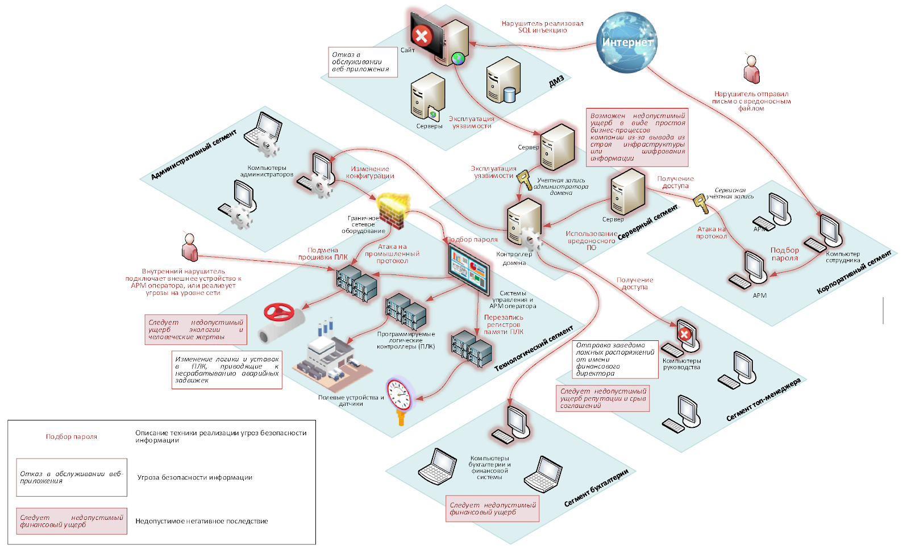

# 1. Введение в модуль

Чтобы построить систему защиты, надо поставить цель и определиться с задачами, которые должна решать система. Специалист по информационной безопасности должен ответить на вопросы:

1. Что он защищает (объект защиты)?
1. Зачем он защищает (цель защиты)?
1. Как он защищает (конкретные задачи защиты)?

При создании системы защиты необходимо оценить размер потенциального ущерба и выяснить, что защищаем, от кого и как.

В [ГОСТе Р ИСО/МЭК 27001 Методы и средства обеспечения информационной безопасности. Система менеджмента информационной безопасности. Требования (ГОСТ 27001)](https://altirixgroup.com/wp-content/uploads/2022/07/gost-r-iso-mek-27001-2021-sistemy-menedzhmenta-informaczionnoj-bezopasnosti.-trebovaniya.pdf) описан процесс построения системы защиты информации, основанный на <ins>Цикле Деминга</ins>

**Цикл Деминга** состоит из четырех этапов:
1. Планируй.
1. Выполняй.
1. Проверяй.
1. Управляй.

В ГОСТе 27001 рассмотрено пять этапов:
1. Планирование.
1. <ins>Выбор средств обеспечения</ins>.
1. Функционирование.
1. Мониторинг.
1. Улучшение.

Стандарт, посвященный проектированию и созданию системы защиты сети, — [ГОСТ Р ИСО/МЭК 27033-2-2021 Информационные технологии. Методы и средства обеспечения безопасности Безопасность сетей. Часть 2](https://rosgosts.ru/file/gost/35/040/gost_r_iso!mek_27033-2-2021.pdf).

## Рекомендации по проектированию и реализации безопасности сетей

ГОСТ 27033-2 является уточнением ГОСТ 27001, описанного выше, и дает рекомендации по проектированию и реализации безопасности сетей:

1. Подготовка к проектированию безопасности сетей.
    - рассмотрены:
        - Процесс идентификации (аудита) активов
        - Сбор и анализ различных требований
        - Анализ осуществленных в организации проектов и реализаций
        - Проектирование безопасности сетей.
    - процессы:
        - Анализ готовых проектов и решений у других компаний.
        - Принципы проектирования и общие рекомендации к проектированию.
        - Подписание и утверждение проекта заказчиком.
1. Реализация создания системы защиты сетей
    - рассмотрены:
        - Критерии выбора средств защиты информации. Требования могут быть установлены законодательством РФ в сфере ИБ, требованиями обеспечения непрерывности бизнеса, внутренними нормативными документами.
        - Критерии выбора поставщиков средств защиты информации
        - управление сетью
        - Регистрация, мониторинг и реагирование на инциденты Система защиты сети должна позволять выявлять события информационной безопасности и информировать о них сотрудников службы ИБ. Реагирование может происходить как в автоматизированном режиме, так и в непосредственно сотрудниками службы ИБ.
        - Создание документации с описанием системы защиты сети, регламентов работы с системой защиты, инструкций работы пользователей и администраторов.
        - Планы испытаний и проведение испытаний Здесь составляется программа и методика испытаний (далее — ПМИ). После создания СЗИ важно проверить, что все пункты ПМИ выполнены.
        - Утверждение создания системы защиты сети лицами на соответствующем уровне управления. Это может быть специально созданная комиссия или руководство организации 

# 2. Аудит сети

> **Аудит** это инвентаризация активов компании, нарушение работы которых приведет к остановке или к ухудшению деятельности организации.

Порядок и правила аудита информационной безопасности описаны в Национальном стандарте [РФ ГОСТ Р ИСО/МЭК 27007-2014 "Информационная технология. Методы и средства обеспечения безопасности. Руководства по аудиту систем менеджмента информационной безопасности"](https://rosgosts.ru/file/gost/35/040/gost_r_iso!mek_27007-2014.pdf) (далее - ГОСТ 27007)

ГОСТ 27007 уточняет правила проведения аудита, описанного в [ГОСТ Р ИСО 19011–2021 «Оценка соответствия. Руководящие указания по проведению аудита систем менеджмента»](https://urfu.ru/fileadmin/user_upload/common_files/standarts/GOST_R_ISO_19011-2021_Ocenka_sootvetstvija._Rukovodjashchie_ukazanija_po_provedeniju_audita_sistem..._Tekst.pdf).

В аудит сетевой инфраструктуры входят, но не ограничиваясь ими, 10 пунктов

1. Описание рисков.
1. Описание бизнес-процессов.
1. Категорирование информации.
1. Описание инфраструктуры.
1. Инвентаризация хостов.
1. Модель доступа.
1. Системное и прикладное программное обеспечение.
1. Инвентаризация СЗИ и требований нормативных правовых актов.
1. Определение актуальных угроз.
1. Изучение лучших практик.

Какие вообще активы бывают у компании (для ИБ)?

- **физические активы** сетевое и серверное оборудование, средства защиты информации и пр.);
- **логические активы** настройки сетевого и серверного оборудования, программный код, данные и пр.);
- **нематериальные активы** информация, трафик внутри сети и пр.).

## Описание рисков

- Цель деятельности коммерческой организации прописана в ее Уставе
- Цель деятельности организации и риски связаны

**два типа**
1. Исполнения требований законодательства
1. Риски, критичные для деятельности компании

Риски могут быть связаны с неисполнением законодательства в сферах защиты:

- персональных данных;
- коммерческой или иных тайн;
- конфиденциальной информации;
- критической информационной инфраструктуры;
- иной конфиденциальной информации и тайн, которые необходимо защищать в соответствии с требованиями законодательства.

<ins>К рискам, критичным для деятельности компании, чаще всего относят те риски, которые считают критичными руководство компании или владельцы бизнеса.</ins>

## Описание бизнес-процессов

Если процессы в организации не описаны и не формализованы, нужно самостоятельно выяснить, как они проходят:
- описать всех участников процесса;
- провести опрос сотрудников организации, которые работают с информационной системой;
- провести опрос администраторов системы;
- собрать схемы информационной системы;
- описать порты и сетевые связи;
- описать способы внесения, загрузки и выгрузки информации;
- описать типы информации, которые обрабатываются в информационной системе;
- провести аудит сети для понимания движения потоков трафика.

Он может быть описан:
- В виде таблицы.
- В текстовом виде.
- В виде схемы

## Категорирование информации

При описании бизнес-процессов можно получить частичное представление, какая информация обрабатывается в организации и где она хранится.

варианта два
- на материальных носителях;
- в электронном виде.

Можно провести анализ неструктурированной информации вручную или использовать автоматизированные системы типа DCAP.

> **DCAP (Data-Centric Audit and Protection)** это система автоматизации аудита неструктурированной информации в сети, классификации данных, мониторинга прав доступа к данным, реагирования и оповещения о событиях информационной безопасности. DCAP не работает с базами данных.

После описания информации необходимо провести ее категорирование
- персональные данные;
- коммерческая или иная тайны;
- информация для свободного доступа.

Категорирование информации позволяет понять, нужно ли защищать информацию и как ее защищать в соответствии с требованиями законодательства в сфере ИБ и требованиями внутренних нормативных документов.

## Анализ сетевой инфраструктуры

> **Сетевая инфраструктура** это совокупность сетевых и серверных устройств, конечных хостов, периферийного оборудования и программного обеспечения, объединенных между собой связью, правилами управления, безопасностью, доступом и маршрутизацией.

Где может храниться информация об инфраструктуре:
- в схемах сети;
- в текстовых и табличных файлах с описанием инфраструктуры;
- в специализированных программах для хранения информации о структуре сети (например, Netbox);
- в системах управления конфигурациями (Ansible, Puppet);
- как ни странно, в инвентаризационных ведомостях бухгалтерии. В них написано, какое оборудование хранится в каком помещении компании.

Инвентаризация сетевой инфраструктуры позволит понять состав сети, наглядно увидеть, через какие узлы ходит информация, где точки входа на границе периметра сети. Это позволит понять, где необходимо усилить защиту, какие средства защиты ставить и какие настройки необходимы.

## Инвентаризация хостов в сети

при анализе хостов уже изучаются конкретные компоненты:
- Модель, марка и производитель оборудования.
- Установленное прикладное и системное программное обеспечение.
- Версия прикладного и системного программного обеспечения.
- Открытые порты.
- Используемый ip-адрес.
- Открытые общие папки.
- Используемые сервисы.
- Местонахождение хоста.
- Пользователи и администраторы хоста.

Netbox позволяет вести учет:
- сетевого оборудования в стойке;
- серверного оборудования в стойке;
- информации об используемых ip-адресах;
- используемых портов;
- информации о патч-панелях с портами и их коммутации.

Дополнительную информацию о сети можно собрать с помощью:
- сканеров сети (например, Nmap);
- сканеров трафика (например, сниффера Wireshark);
- сбора информации снаружи сети (например, Shodan).

## Описание моделей управления доступом

> **Модель доступа** это правила предоставления доступа пользователям к информационным системам, ресурсам и активам организации для обеспечения безопасности.

четыре вида управления доступом:
1. Ролевая модель (RBAC, или Role Based Access Control).
1. Дискреционная модель (DAC, или Discretionary Access Control).
1. Мандатная модель (MAC, или Mandatory Access Control).
1. Разграничение доступа на основе атрибутов (ABAC, или Attribute-Based Access Control).

### ролевая моделбь доступа (RBAC)

https://rt-solar.ru/products/solar_inrights/blog/3380/

- пользователям присваивают роли с определенными правами доступа
- очень гибкая в использовании

### Дискреционная модель доступа (DAC)

https://rt-solar.ru/products/solar_inrights/blog/3742/

- матрицы доступа
- каждому пользователю приписаны определенные права
- простота использования
- большая ответственность администратора при назначении прав

### Мандатная модель доступа (MAC)

https://habr.com/ru/companies/avanpost/articles/482060/

- информации присваиваются метки (конфиденциального, секретного, общего доступа или пр.)
- пользователю даются права на работу только с информацией с определенной меткой
- используется при работе с информацией, содержащей государственную тайну

### разграничении доступа на основе атрибутов (ABAC)

- доступ предоставляется на основании атрибутов этого пользователя
- смесь ролевой и мандатной моделей

## Матрица доступа

> описание пользователей и их прав

На основе модели доступа строится матрица доступа

Специалист службы ИБ или службы ИТ оформляет в виде документа (бумажного или физического), а IT-служба настраивает модель доступа в информационной системе или ресурсе.

Пользователей также необходимо разделить по видам — на внешних и внутренних.
- **Внутренние пользователи** - это сотрудники организации и компании, оказывающие услуги внутри сети.
- **Внешние пользователи** - это пользователи, подключающиеся снаружи сети (сотрудники на удаленке, внешний аутсорс, клиенты и пр.).

<ins>Для внешних и внутренних пользователей строятся отдельные матрицы доступа.</ins>

## Инвентаризация системного и прикладного ПО

проводится инвентаризация:
- операционных систем компьютеров и серверов;
- систем управления базами данных;
- автоматизированных систем управления технологическим процессом;
- прикладного ПО на рабочих компьютерах (текстовых, табличных редакторов и т. д.)
- порталов;
- иного программного обеспечения.

Информацию можно получить централизованно — например, через выгрузку [WMI](https://fixmypc.ru/post/inventarizatsiia-programm-ispolzuia-powershell-vo-vsem-ad/) (по ссылке вы сможете найти пример выгрузки ПО с удаленных компьютеров), — или с помощью СЗИ типа Антивируса Касперского.

После получения списка системного и прикладного ПО проводится его анализ и утверждается перечень разрешенного к использованию.

> **Разрешенное программное обеспечение** это лицензионное программное обеспечение, необходимое для работы сотрудников.

## Инвентаризация средств защиты информации и внутренних нормативных документов в сфере ИБ

Список СЗИ и внутренние нормативные документы в сфере ИБ должны быть у службы ИБ

Помимо СЗИ необходимо проинвентаризировать документы в сфере ИБ. Общий перечень можно запросить у юридической и кадровой служб. Если документы по ИБ в организации отсутствуют, то необходимо разработать:
1. Политику информационной безопасности.
1. План реализации мер по защите информации.
1. Модель угроз и нарушителя.
1. Приказ о назначении ответственного за ИБ.
1. Перечень разрешенного ПО.
1. Матрицу доступа.
1. Технический паспорт информационной системы.
1. Акт категоризации информационной системы.
1. Правила и инструкции работы пользователей.
1. Форму журналов.
1. Технический проект и техническое задание на создание системы защиты.
1. Другие документы (правила доступа в помещения, регламенты по проведению резервного копирования и т. д.).

## Определение актуальных угроз

- **[Банк данных угрозы безопасности ФСТЭК РФ](https://bdu.fstec.ru/threat)** официальный банк угроз, который постоянно обновляется. ФСТЭК предлагает свой сканер уязвимостей ScanOVAL, но он не предусмотрен для сканирования всей сети.
- **[MITRE ATT&CK](https://attack.mitre.org/)** в матрице указаны основные векторы атак, при этом можно построить цепочку от разведки до закрепления внутри сети и нанесения ущерба.
- **[Open Worldwide Application Security Project](https://owasp.org/)** открытый проект со списком уязвимостей веб-приложений.

В результате проведенного аудита вы выясните следующую информацию:
- риски для деятельности компании;
- описание бизнес-процессов;
- описание инфраструктуры сети и информационных систем;
- перечень актуальных угроз;
- требования законодательства.

Благодаря определению актуальных угроз будут получены требования к СЗИ:
- обозначение на схеме сети мест, куда может напасть нарушитель и где необходимо разместить СЗИ:
    - граница периметра сети и каждого из сегментов сети;
    - порталы и сайты, к которым есть доступ из интернета;
    - хосты;
    - Wi-Fi;
    - локальная сеть внутри периметра сети.
- производительность СЗИ;
- пропускная способность СЗИ и СКЗИ;
- от каких угроз информационной безопасности они защищают;
- какие сетевые протоколы будут использоваться, какие порты необходимо закрыть;
- как проводить мониторинг трафика в сети;
- правила создания резервных копий для сетевого и серверного оборудования, а также для СЗИ;
- правила создания отказоустойчивых кластеров СЗИ;
- перечень угроз, которые можно закрыть нетехническими (компенсирующими) методами защиты информации.

# 3. Проектирование системы защиты сети с учетом актуальных угроз безопасности

как на основании полученных данных спроектировать систему защиты сети и сделать проект создания системы защиты сети — документ, где будут объединены все ваши наработки.

Проектировать систему защиты сети вы будете поэтапно:
1. начиная с границы периметра сети, переходя к ресурсам, имеющим доступ в интернет
1. защита подключения удаленных пользователей и сегментов
1. защита хостов и беспроводных сетей.

Рассмотрим пример инфраструктуры организации, приведенный в [Методике оценки угроз безопасности информации ФСТЭК](https://fstec.ru/files/495/---5--2021-/891/---5--2021-.pdf). В примере рассмотрены основные способы определения актуальных угроз и нарушителей.

 *приведены примеры реализации сценариев угроз ИБ.*

На рисунке выше видны два основных способа реализации угроз информационной безопасности — внешний и внутренний нарушители — и пути их проникновения в сеть. Как видно на рисунке, не используется ни одного СЗИ.

Одна из задач создания системы защиты сети — сделать максимально сложными следующие процессы:
- Проникновение в сеть внешнего нарушителя (и если даже он проник в сеть — максимально усложнить все дальнейшие действия).
- Распространение вредоносов внутри сети.
- Действия внутреннего нарушителя.
- Нарушение нормального хода деятельности сети (даже если это непреднамеренное нарушение легитимного пользователя).

## Требования стандартов ГОСТ

[Национальный стандарт РФ ГОСТ Р ИСО/МЭК 27033-2-2021 «Информационные технологии. Методы и средства обеспечения безопасности. Безопасность сетей. Часть 2. Рекомендации по проектированию и реализации безопасности сетей»](https://docviewer.yandex.ru/?tm=1724083299&tld=ru&lang=ru&name=gost_r_iso!mek_27033-2-2021.pdf&text=%D0%93%D0%9E%D0%A1%D0%A2+%D0%A0+%D0%98%D0%A1%D0%9E%D0%9C%D0%AD%D0%9A+27033-2-2021+%D0%98%D0%BD%D1%84%D0%BE%D1%80%D0%BC%D0%B0%D1%86%D0%B8%D0%BE%D0%BD%D0%BD%D1%8B%D0%B5+%D1%82%D0%B5%D1%85%D0%BD%D0%BE%D0%BB%D0%BE%D0%B3%D0%B8%D0%B8.+%D0%9C%D0%B5%D1%82%D0%BE%D0%B4%D1%8B+%D0%B8+%D1%81%D1%80%D0%B5%D0%B4%D1%81%D1%82%D0%B2%D0%B0+%D0%BE%D0%B1%D0%B5%D1%81%D0%BF%D0%B5%D1%87%D0%B5%D0%BD%D0%B8%D1%8F+%D0%B1%D0%B5%D0%B7%D0%BE%D0%BF%D0%B0%D1%81%D0%BD%D0%BE%D1%81%D1%82%D0%B8+%D0%91%D0%B5%D0%B7%D0%BE%D0%BF%D0%B0%D1%81%D0%BD%D0%BE%D1%81%D1%82%D1%8C+%D1%81%D0%B5%D1%82%D0%B5%D0%B9+%D0%A7%D0%B0%D1%81%D1%82%D1%8C+2&url=https%3A//rosgosts.ru/file/gost/35/040/gost_r_iso!mek_27033-2-2021.pdf&lr=63&mime=pdf&l10n=ru&sign=6fd4b20d9c35d619127d431da64b5730&keyno=0) описывает основные аспекты, которые нужно учитывать при проектировании системы защиты сети.

### 1. многоуровневый (эшелонированный) подход.

Защита должна быть на каждом уровне сети:
    - периметре;
    - инфраструктуре;
    - хосте;
    - приложении;
    - данных.

Многоуровневый (эшелонированной) подход подразумевает создание несколько барьеров защиты. Это делается, чтобы, преодолев один уровень защиты, злоумышленник тут же упирался в следующий.

#### подход Zero Trust (нулевое доверие)

https://habr.com/ru/companies/varonis/articles/472934/

Основные принципы Zero Trust:

1. Безопасный и подтвержденный доступ для любого пользователя. Проверка прав доступа осуществляется ко всем ресурсам — каждое обращение к ресурсу рассматривается как угроза.
1. Использование модели наименьших привилегий и контроля доступа. Права пользователя должны быть ограничены до того уровня, который необходим ему для исполнения служебных обязанностей.
1. Отслеживание всей активности пользователей с помощью аналитики данных. При подключении к любому ресурсу на всех этапах проверяется доступ каждого пользователя. Должен быть создан механизм проверки прав доступа и содержаться в актуальном состоянии. И каждое действие пользователя должно записываться в журнал действий пользователя.

### 2. Сегментирование сети

Выделяется один из них, работающий с внешней сетью, — так называемая ДМЗ (демилитаризованная зона)
- отделяется от интернета межсетевым экраном.
- Информация проверяется антивирусом и песочницей.

Важно соблюдение всех пунктов ниже:
- важные активы хранятся в отдельных сегментах сети;
- рабочие компьютеры и сервера располагаются в разных доменах безопасности;
- системы управления сетью и безопасности располагаются в разных сегментах;
- продуктивные и непродуктивные информационные системы разделены.

**Каждый сегмент должен быть защищен отдельно.**

При проектировании системы защиты сети предполагается постепенное создание системы защиты сети последовательно в каждом из пунктов:
1. Периметр всей сети.
1. Сегменты, неработоспособность которых приведет к нарушению деятельности организации.
1. Сегменты с остальными рисками и угрозами.
1. Остальные сегменты.

Каждый сегмент рассматривается как отдельная сетевая инфраструктура и защищается как полноценная сеть.

### 3. Проект должен включать отказоустойчивость сети

1. создание резервных копий;
1. выделение дополнительных каналов и портов;
1. использование кластеров для сетевого оборудования и СЗИ;
1. резервирование каналов интернета.

### 4. сценарии реализации угроз ИБ

защита должна начинаться с противодействия попыткам проникновения внешнего нарушителя в сеть.

### 5. Проект системы защиты связан и изменяется вместе с моделью (структурой) ИБ

> **Модель информационной безопасности** - это описание того, как и что должна защищать информационная безопасность, и направлена на обеспечение конфиденциальности, целостности и доступности информации

отвечает на вопросы:
- что защищать?
- от кого защищать?
- как защищать?

### рекомендации в других стандартах серии 27033

- **для проектирования межсетевых экранов]** [ГОСТ Р ИСО/МЭК 27033-4-2021. Информационные технологии. Методы и средства обеспечения безопасности. Безопасность сетей. Часть 4. Обеспечение безопасности межсетевого взаимодействия с использованием шлюзов безопасности
](https://docviewer.yandex.ru/?tm=1724086236&tld=ru&lang=ru&name=_270331.PDF&text=%D0%B3%D0%BE%D1%81%D1%82+27033+4&url=https%3A//www.ntc-zarya.ru/upload/iblock/1a8/_270331.PDF&lr=63&mime=pdf&l10n=ru&sign=69efc4178cb40eddfcde77b0415a2cb9&keyno=0)
- **для подключения удаленных сегментов или удаленных сотрудников с использованием VPN]** [ГОСТ Р ИСО/МЭК 27033-5-2021 «Информационные технологии. Методы и средства обеспечения безопасности. Безопасность сетей. Часть 5. Обеспечение безопасности межсетевого взаимодействия с помощью виртуальных частных сетей (ВЧС)»](https://rosgosts.ru/file/gost/35/040/gost_r_iso!mek_27033-5-2021.pdf);
- **при использовании беспроводных сетей]** [ГОСТ Р ИСО/МЭК 27033-6-2016 Информационные технологии. Методы и средства обеспечения безопасности. Безопасность сетей. Часть 6. Обеспечение информационной безопасности при использовании беспроводных IP-сетей.](https://docviewer.yandex.ru/?tm=1724086117&tld=ru&lang=ru&name=1699366818935&text=%D0%B3%D0%BE%D1%81%D1%82+27033+6&url=https%3A//rst.gov.ru%3A8443/file-service/file/load/1699366818935&lr=63&mime=pdf&l10n=ru&sign=50b7ac16932f0a3dfef8710a7e1e913e&keyno=0)

## Обеспечение защиты периметра сети

### Межсетевой экран 

На границы сети устанавливается СЗИ типа межсетевого экрана. Вспомним, что это.

> [Межсетевой экран (МЭ)](https://www.kaspersky.ru/resource-center/definitions/firewall) — это программный или программно-аппаратный элемент компьютерной сети, контролирующий и фильтрующий проходящий через него сетевой трафик в соответствии с заданными правилами.

МЭ записывает следующую информацию:
- IP-адрес источника и/или назначения;
- полезную нагрузку, которую несет пакет (например, TCP, UDP, ICMP);
- порт источника и/или назначения для полезной нагрузки TCP или UDP;
- время/дата получения/отправления пакета;
- карта сетевого интерфейса прибытия/отправления.

Расставим на предыдущем рисунке межсетевые экраны.

 

Межсетевые экраны установлены на границе сети, а также между основной сетью и ДМЗ.

Межсетевые экраны могут управлять доступом к сети (уровни 2–4 модели OSI) или приложению (уровни 5–7 модели OSI).

Межсетевой экран должен выполнять следующие требования:
- разделять сеть на сегменты;
- ограничивать проходящий через него трафик;
- анализировать проходящий через него трафик;
- контролировать доступ к сети из интернета и из сети в интернет;
- логировать проходящий через МЭ трафик;
- делать внутреннюю сеть недоступной для сканирования из интернета;
- противостоять угрозе «отказ в обслуживании».

Информация о настройках правил МЭ может храниться:
- в табличных и текстовых документах;
- как статья в вики-системе организации (например, Confluence);
- в виде комментария в самом межсетевом экране.

В описание входят:
1. Назначение правила.
1. Перечень ip-адресов и портов и действия с ними (пропустить, заблокировать и пр.).
1. Приложение, к которому относится правило.
1. Пользователи, которых касается правило.
1. Время и срок действия правила (например, открыть доступ только в выходные дни для сотрудника для удаленной работы).
1. Кто создал правило (ФИО, должность).
1. Дата создания.

### WAF

> межсетевой экран для ресурсов, опубликованных в интернете. WAF используется совместно с МЭ: МЭ закрывает сеть, WAF — сайт.

Основная задача WAF — глубоко проанализировать трафик, приходящий на сайт на седьмом уровне модели OSI. Это его основное отличие от классических МЭ. Если WAF обнаруживает подозрительные сигнатуры, он блокирует трафик.

### Как выбрать подходящий межсетевой экран?

1. Выбрать из аппаратноо и программной платформ.
    - бывают как в виртуальном исполнении, так и программно-аппаратные комплексы (ПАК)
1. Выбрать архитектуру МЭ и соответствующие компоненты.
    - зависит мощность и возможность масштабировать использование МЭ
1. Определиться, нужно ли вам централизованное управление или нет.
1. Понять, какие функции есть у МЭ.
    - может быть объединен с криптошлюзом, СОВ, антивирусом — например, UTM или NGWF
1. Понять желаемую глубину хранения журналов.
1. Проверить МЭ на наличие сертификатов ФСБ и ФСТЭК
    - Наличие сертификатов ФСТЭК или ФСБ зависит от категории обрабатываемой информации
1. Использование машинного обучения или другого способа автоматической настройки.

Примеры межсетевых экранов:
- NGWF Континент 4;
- NGWF ViPNet xFirewall 5;
- UserGate NGFW.

Примеры WAF:
- PT Application Firewall;
- Гарда WAF;
- Континент WAF.

## ДМЗ

> **ДМЗ (Demilitarized Zone, или демилитаризованная зона)** это сегмент сети, предназначенный для размещения сетевых устройств взаимодействующих с внешними сетями, в частности с интернетом.

В ДМЗ выносятся сервисы, которые с большой вероятностью будут атакованы из интернета или иной внешней сети
- порталы и сайты;
- почтовые сервера;
- песочница — средство для проверки и запуска файлов, направленных во внутренний контур;
    - Песочница совместно с антивирусом пытается определить является ли файл опасным для сети или нет.
- тестовые среды с доступом для подрядчиков;
- сервера для удаленного доступа.

Перед ДМЗ также должен стоять МЭ

## Подключение удаленных пользователей к сети

К инфраструктуре организации могут быть подключены различные удаленные сегменты:
- удаленные офисы;
- удаленные пользователи;
- подрядчики;
- клиенты и бизнес-партнеры.

могут быть подключены как с помощью VPN (virtual private network) — виртуальной частной сетью, — так и с помощью технологии удаленных рабочих столов (RDP).

> **VPN (Virtual Private Network, или виртуальная частная сеть)** это сетевое соединение двух и более удаленных сегментов сети поверх другой сети (например, интернета).

> **Удаленный офис** это сегмент сети, расположенный в другом здании, городе или стране, но соединенный с основной инфраструктурой. Удаленный офис может использовать для работы технологию удаленных рабочих столов (RDP).

VPN обычно строится на уровень не выше сетевого уровня модели OSI

Трафик должен иметь две точки соединения:
1. сервер шифрования и клиент в случае «точка-сеть»;
1. два клиента в случае «точка-точка»;
1. два сервера шифрования.

Для подключения удаленных пользователей на границе ставят криптошлюз.

Выбор криптошлюз зависит от уровня защищенности ИСПДн или категори ГИС.

## Защита хоста

Способов защиты несколько:
- антивирус;
- персональный межсетевой экран;
- EDR (Endpoint Threat Detection & Response) — система защиты конечных точек.
- средства защиты от несанкционированного доступа — класс решений, позволяющий разграничить доступ к информации на компьютере;
- запрет работы пользователя с правами администратора;
- установка только разрешенного ПО из доверенных источников.

Дополнительные меры:
1. У пользователя должны отсутствовать права на:
    - установку и запуск нового ПО;
    - использование PowerShell;
    - внесение изменений в настройки хоста;
    - внесение изменений и отключение СЗИ на хосте;
1. ПО на хосте должно быть обновлено, а также на нем должны быть устранены уязвимости, которыми может воспользоваться злоумышленник.
1. Должен быть ограничен доступ к другим хостам.

## Подключение беспроводных сетей

Беспроводные сети в компании должны быть разделены на две части:
1. гостевая сеть — для посетителей организации;
    - должна быть выделена в отдельную ДМЗ
    - Посетитель при подключении к гостевой беспроводной сети должен обязательно пройти процедуру идентификации
2. рабочая сеть — для сотрудников организации.
    - Может быть использовано несколько сценариев работы рабочей беспроводной сети, исходя из потребностей организации и сотрудников.

три варианта работы с беспроводной сетью в организации
1. Сеть используется для выхода сотрудников в интернет с мобильных устройств, но без подключения к внутренней сети организации.
1. Беспроводная сеть — полноценная часть внутренней сети.
    - должна быть:
        - скрыта;
        - иметь белый список подключаемых устройств.

Стандарт 802.11 определяет способы обеспечения безопасности беспроводных сетей:
- использование шифрования канала между устройством и роутером;
- аутентификацию;
- фильтрацию устройств.

## Проект создания системы защиты

Результатом проведенного аудита сети, определения угроз ИБ, способов и средств нейтрализации этих угроз станет проект создания системы защиты информации.

Проектная документация может быть оформлена в соответствии со [стандартами](https://habr.com/ru/articles/122700/):
- [ГОСТ 34.602-89 Техническое задание на создание автоматизированной системы](http://www.rugost.com/index.php?option=com_content&view=article&id=96:gost-34602-89&catid=22&Itemid=53)
- [ГОСТ 34.201-89 Виды, комплектность и обозначения документов при создании автоматизированных систем](http://www.rugost.com/index.php?option=com_content&view=article&id=91:34201-89&catid=22&Itemid=53)
- [РД 50-34.698-90 Автоматизированные системы. Требования к содержанию документов](http://www.rugost.com/index.php?option=com_content&view=article&id=98:50-34698-90&catid=22&Itemid=53)

Проект содержит:

1. Наименование ИС.
1. Наименование организации.
1. Перечень нормативных правовых актов, стандартов, иных документов, которым должна соответствовать система защиты информации.
1. Сроки начала и окончания работ.
1. Порядок оформления и предъявлению заказачику результатов работ по созданию системы защиты сети.
1. Цели и задачи создания системы защиты сети.
1. Описание и характеристики ИС.
1. Актуальные угрозы.
1. Требования к системе.
    - Требования к системе в целом.
    - Требования к сети.
    - Требования к техническим средствам, программному обеспечению и средствам защиты информации.
    - Соответствие угроз и мер по защиты сети.
1. Состав и содержание работ по созданию (развитию) системы защиты сети.
1. Порядок контроля и приемки системы защиты сети
1. Требования к составу и содержанию работ по подготовке к вводу в эксплуатацию системы защиты сети.
1. Требования к документации.
1. Источники разработки.
1. Приложения.

Проект на создание системы защиты — это полноценный документ, который должен быть утвержден руководителем организации и ответственным за информационную безопасность

# 4. Анализ трафика в сети

> **Мониторинг сетевого трафика** это процесс автоматизированного наблюдения за движением трафика внутри и на периметре сети, чтобы предотвратить негативные события ИБ.

Анализ трафика происходит на периметре сети с помощью:
- получения и анализа трафика на сетевых устройствах;
- IDS, IPS, UTM, NGFW;
- [NTA](https://rt-solar.ru/products/solar_webproxy/blog/3157/), [NDR](https://www.securitylab.ru/analytics/536754.php);
- снифферов;
- SIEM и систем [Threat Intelligence](https://habr.com/ru/companies/roi4cio/articles/528514/https://habr.com/ru/companies/roi4cio/articles/528514/)

## Трафик на сетевых и серверных устройствах

- должны быть включены как минимум журнал событий безопасности и системные журналы
- Журналы должны быть защищены, как и вся остальная информация в сети

На сетевом оборудовании нужно включить протокол мониторинга NetFlow и протокол передачи журналов syslog.

> **Syslog** это протокол передачи журналов от сервера или сетевого оборудования в централизованное хранилище или СЗИ.

> **NetFlow** это промышленный стандарт для мониторинга работы сетевого оборудования, разработанный компанией Cisco, но используемый и другими производителями оборудования.

NetFlow собирает следующую информацию:
- номер версии протокола;
- номер записи;
- входящий и исходящий сетевой интерфейс;
- время начала и конца потока;
- количество байт и пакетов в потоке;
- адрес источника и назначения;
- порт источника и назначения;
- номер протокола IP;
- значение Type of Service;
- для TCP-соединений — все наблюдаемые в течение соединения флаги;
- адрес шлюза;
- маски подсети источника и назначения.

С помощью NetFlow можно анализировать нагрузку на информационные системы и сетевое оборудование, в том числе пиковые значения. Это позволит выбрать подходящие сетевое оборудование и СЗИ.

В схему NetFlow входят:
- Источник трафика (сетевое устройство).
- Коллектор — собирает и хранит информацию о трафике.
- Анализатор — помогает обнаруживать угрозы ИБ.

Они подключаются следующим образом.

## Средства обнаружения вторжений

> **СОВ** это система обнаружения вторжений, предназначенная для регистрации подозрительных событий на основании предустановленных правил и оповещения ответственных сотрудников служб IT и ИБ.

специалист может провести:
- динамический анализ сетевого трафика
    - с канального до прикладнова
    - проводя анализ заголовков пакетов и выявляя подозрительные на основе баз правил;
- автоматическое обнаружение угроз безопасности информации и регистрация событий информационной безопасности;
- вывод информации о трафике в графическом интерфейсе;
- оповещение об угрозах службу ИБ;
- передачу информации в SIEM И TIAS.

Функциями СОВ обладают IDS, IPS, UTM, NGFW

- **Система IDS** действует как средство мониторинга, обнаруживая потенциально опасную активность и уведомляя об этом службу ИБ.
- **Система IPS** может не только обнаружить угрозу, но и автоматически принять меры для нейтрализации — разорвать соединение или заблокировать IP-адрес, откуда исходят подозрительные действия.
- **NGFW и UTM** — это комплексные решения, включающие помимо IPS целый набор функций. Их вы рассмотрели выше в этом модуле.

На IDS трафик зеркалируется — то есть IDS ставится «сбоку» от сетевого устройства или МЭ

IPS, UTM, NGFW ставятся в разрыв работы сети, чтобы иметь возможность реагировать на угрозы ИБ

 

В IDS, IPS, UTM, NGFW используются следующие методы анализа трафика:
- эвристический анализ;
    - Он работает следующим образом. Создается эталонная модель движения трафика внутри сети (обычно пользователи и системы выполняют одни и те же действия). Если трафик отличается от эталонного, то IDS оповещает об этом службу ИБ.
- сигнатурный анализ;
    - Производитель IDS на основе CVE создает правила, по которым идет поиск угроз.
- предварительный анализ сетевого трафика;
- Предполагает анализ аномалий в пакетах и анализ сканирования портов.
- поиск подмены IP- и MAC-адресов;
- поведенческий анализ;
- метод машинного обучения.

IPS, UTM, NGFW кроме функций IDS могут выявить и нейтрализовать:
- атаки на сетевые службы и серверы;
- атаки типа «отказ в обслуживании» (DoS-атаки);
- попытки эксплуатации уязвимостей в ПО атакуемых объектов защищаемой сети;
- аномальный IP-трафик;
- сетевую активность вирусов и вредоносного ПО.

### Примеры СЗИ разных видов

1. IDS:
    - Vipnet IDS
    - Vipnet TIAS
    - Континент IDS
1. NGWF
    - Vipnet xFirewall
    - Континент NGWF
    - UserGate NGWF
    - PT NGWF

## Система анализа трафика

К системам анализа трафика относятся решения типа [NTA](https://rt-solar.ru/products/solar_webproxy/blog/3157/) и [NDR](https://www.securitylab.ru/analytics/536754.php).

### NTA (Network Traffic Analysis)

> может собирать информацию не только с пограничных устройств, но с внутренних сетевых устройств, хостов и серверов.

Методы анализа трафика аналогичны методам, используемым СОВ. NTA может получать следующую информацию:
- Flow-сообщения (протоколы NetFlow v5/v9, IPFIX, sFlow, jFlow).
- Копию сетевого трафика (технологии SPAN / RSPAN / ERSPAN, подключения TAP).
- Информацию через протокол ICAP.

NTA помогает находить те угрозы, которые не были обнаружены другими СЗИ.

### NDR (Network Detection and Response)

> это система обнаружения и реагирования на сетевые события

NDR выполняет функции NTA, но при этом имеет возможность реагировать на события ИБ за счет работы с другими СЗИ

> **EDR (Endpoint Detection & Response)** это средство защиты для обнаружения и анализа угроз ИБ на конечных точках, подключенных к сети рабочих станциях, серверах, устройствах. EDR представляет собой логичное развитие антивируса.

Примеры решений NTA:
- Kaspersky Symphony
- PT NTA
- Гарда Монитор

## Снифферы

С их помощью можно:
- обнаружить опасный закольцованный трафик, которым нагружает сеть;
- обнаруживать другие сканеры, снифферы, вирусы, торренты;
- перехватывать любой незашифрованный трафик внутри сети для анализа, в том числе для поиска паролей;
- искать неисправности в сети или неправильную работу сетевых устройств.

## SIEM и системы Threat Intelligence

> **SIEM (Security information and event management)** это система управления информацией о безопасности и событиями безопасности. Она анализирует события безопасности, уязвимости, действия злоумышленников и делает выводы о том, возможно ли реализовать уязвимость. Затем система оповещает об этом сотрудников отдела ИБ.

> **TI (Threat Intelligence)** это система для обработки информации в режиме реального времени для поиска возможных атак. Она может собирать и хранить информацию об угрозах из различных источниках, классифицировать эти угрозы и передавать информацию в SIEM.

Система TI помогает в работе SIEM, потому что передает ей уже структурированную информацию. Это улучшает работу SIEM и уменьшает количество ложных срабатываний.

SIEM делает следующее:
- собирает, обрабатывает и анализирует события ИБ;
- обнаруживает атаки в режиме реального времени;
- оценивает защищенность сети;
- анализирует и управляет рисками безопасности;
- проводит расследования инцидентов;
- принимает решения по защите сети;
- формирует графики и отчеты.

SIEM может собирать информацию из:
- журналов (сетевых устройств, серверов, хостов);
- МЭ;
- СОВ;
- NTA;
- криптошлюзов;
- DLP;
- EDR;
- антивирусов;
- TI;
- сканеров уязвимостей;
- других источников информации.

На основе анализа полученных данных SIEM оповещает о событиях информационной безопасности. При этом события могут быть:

- **positive** произошла атака, необходимо ее остановить;
- **false** это ложные срабатывания двух видов:
    - **false positive** сигнал тревоги, что была атака, но на самом деле ее не было; Ложноположительные события занимают время сотрудников службы ИБ и уменьшают эффективность работы SIEM. Производители SIEM борются с этими срабатываниями, но все равно проверять все события нужно вручную сотруднику службы ИБ.
    - **false negative** атака была, но информация о ней не поступила в службу ИБ. То, что служба ИБ пропустила атаку, означает неправильную настройку СЗИ и работу SIEM;
- **negative** атаки нет.

Примеры SIEM:
- MaxPatrol SIEM
- RuSIEM
- СёрчИнформа SIEM

# 5.  Тестирование, повторный аудит, модернизация сети

необходимо провести тестирование работы:
- создать тестовый контур
- аналогичный промышленному (тестовый стенд)
- и развернуть на нем систему защиты сети.

## Тестирование системы защиты сети

Этапы проведения тестирования должны быть описаны в плане тестирования — это часть проекта на создание системы защиты.

План не регламентирован, но может включать:
1. Оценку проекта на создание системы защиты сети.
1. Создание плана проведения тестирования.
1. Сбор требований, которым должна отвечать система защиты сети.
1. Тестирование на каждом отдельном компоненте.
1. Выполнение теста работоспособности всей системы защиты сети.
1. Приемочное тестирование совместно с комиссией.
1. Результаты тестирования.
1. Устранение замечаний.
1. Повторное тестирование.
1. Оценку эффективности.
1. Внедрение на промышленный контур

Для проведения тестирования и приемки системы защиты сети создается комиссия по приемке системы защиты сети:
- служба ИБ
- служба IT
- ключевые сотрудники бизнес-подразделений.

Результаты проведения тестирования отражаются в [программе и методике испытания (ПМИ)](https://cyberleninka.ru/article/n/soderzhanie-programmy-i-metodik-provedeniya-attestatsionnyh-ispytaniy-informatsionnyh-sistem-na-sootvetstvie-trebovaniyam/viewer) — там нужно описать прохождение тестирование и полученные результаты.

## Проверка работы системы защиты сети

После внедрения системы защиты сети необходимо проверить ее эффективность. Проверять можно с помощью:
- тестирования на проникновение (пентест);
- сканирования сети на наличие уязвимостей;
- [Bug Bounty](https://habr.com/ru/companies/skillfactory/articles/832870/) — это разновидность пентеста и поиска уязвимостей, во время которого исследователю, нашедшему новую уязвимость сети информационной системы сайта, выплачивается вознаграждение.

> **Сканер уязвимости** это средство защиты информации для поиска известных уязвимостей на сетевом и серверном оборудовании, хосте, СЗИ и периферийных устройствах.

Сканер уязвимости сканирует все устройства, подключенные к сети, и получает информацию о:
- поиске известных уязвимостей (CVE), причем программа самостоятельно ранжирует их по критичности;
- предпринятых попытках подбора пароля;
- проверке доступности портов;
- особенностях установленного прикладного и системного ПО;
- инвентаризации устройств;
- эксплуатации уязвимостей.

В результате сканирования сканер выдает отчет, где приведены угрозы и их критичность. Особое внимание стоит уделить критическим уязвимостям.

Для устранения уязвимостей в организации должна быть разработана процедура проведения обновлений.

Примеры сканеров уязвимостей:
- OpenVas
- Maxpatrol
- RedCheck
- ScanOval

Изменения инфраструктуры должны происходить совместно с изменением системы защиты сети и учетом:
- изменений законодательства;
- устаревания СЗИ;
- появления новых информационных систем;
- изменений потока трафика.

После выявления изменений процесс начинается заново:
1. При необходимости корректируется модель угроз и модель нарушителя.
1. Актуализируется список актуальных угроз.
1. Готовится проект на изменение системы защиты сети.
1. Анализируются имеющиеся СЗИ и другие технические меры защиты, достаточно ли их для нейтрализации изменений.
1. Проводится тестирование новых СЗИ и других технических мер защиты.
1. Проводится внедрение новых СЗИ и других технических мер защиты в продуктивный контур.

# Источники

- https://altirixgroup.com/wp-content/uploads/2022/07/gost-r-iso-mek-27001-2021-sistemy-menedzhmenta-informaczionnoj-bezopasnosti.-trebovaniya.pdf
- https://rosgosts.ru/file/gost/35/040/gost_r_iso!mek_27033-2-2021.pdf
- https://smart-lab.ru/company/positive-technologies/blog/985023.php
- https://sozd.duma.gov.ru/bill/502104-8
- https://habr.com/ru/news/657237/
- https://www.consultant.ru/document/cons_doc_LAW_34661/1f421640c6775ff67079ebde06a7d2f6d17b96db/
- https://cyberleninka.ru/article/n/analiz-biznes-protsessov-obespecheniya-informatsionnoy-bezopasnosti-na-primere-promyshlennogo-predpriyatiya/viewer
- https://habr.com/ru/companies/bastion/articles/767052/
- https://its.1c.ru/db/comsecret/content/4/hdoc
- https://habr.com/ru/companies/rosbank/articles/654987/
- https://habr.com/ru/companies/selectel/articles/196620/
- https://www.puppet.com/
- https://www.microsoft.com/ru-ru/microsoft-365/visio/flowchart-software
- https://www.securitylab.ru/blog/company/PandaSecurityRus/342618.php
- https://habr.com/ru/companies/otus/articles/574278/
- https://nmap.org/man/ru/index.html
- http://Wireshark
- https://www.shodan.io/
- https://habr.com/ru/articles/735866/
- https://rt-solar.ru/products/solar_inrights/blog/3380/
- https://rt-solar.ru/products/solar_inrights/blog/3742/
- https://habr.com/ru/companies/avanpost/articles/482060/
- https://habr.com/ru/companies/pt/articles/791992/
- https://fixmypc.ru/post/inventarizatsiia-programm-ispolzuia-powershell-vo-vsem-ad/
- https://support.kaspersky.ru/KSC/CloudConsole/ru-RU/184063.htm
- https://bdu.fstec.ru/threat
- https://attack.mitre.org/
- https://mitre.ptsecurity.com/ru-RU
- https://owasp.org/
- https://www.securitylab.ru/analytics/551226.php
- https://www.securitylab.ru/analytics/508740.php
- https://habr.com/ru/articles/338532/
- https://habr.com/ru/articles/339206/
- https://fstec.ru/files/495/---5--2021-/891/---5--2021-.pdf
- https://habr.com/ru/articles/105964/
- https://docviewer.yandex.ru/?tm=1724083299&tld=ru&lang=ru&name=gost_r_iso!mek_
- https://habr.com/ru/companies/varonis/articles/472934/
- https://docviewer.yandex.ru/?tm=1724086236&tld=ru&lang=ru&name=_270331.PDF&text=%D0%B3%D0%BE%D1%81%D1%82+27033+4&url=https%3A//www.ntc-zarya.ru/upload/iblock/1a8/_270331.PDF&lr=63&mime=pdf&l10n=ru&sign=69efc4178cb40eddfcde77b0415a2cb9&keyno=0
- https://rosgosts.ru/file/gost/35/040/gost_r_iso!mek_27033-5-2021.pdf
- https://docviewer.yandex.ru/?tm=1724086117&tld=ru&lang
- https://www.kaspersky.ru/resource-center/definitions/firewall
- https://www.atlassian.com/ru/software/confluence
- https://habr.com/ru/companies/otus/articles/733142/
- https://www.securitycode.ru/products/kontinent-4/
- https://infotecs.ru/products/vipnet-xfirewall-5/
- https://www.usergate.com/ru/products/next-generation-firewall
- https://www.ptsecurity.com/ru-ru/products/af/
- https://garda.ai/products/network-security/waf
- https://www.securitycode.ru/products/kontinent-waf/
- https://habr.com/ru/companies/trendmicro/articles/558566/
- https://www.kaspersky.ru/resource-center/definitions/what-is-a-vpn
- https://www.securitylab.ru/analytics/367591.php
- https://www.securitycode.ru/products/kontinent-4/
- https://infotecs.ru/products/vipnet-xfirewall-5/
- https://www.usergate.com/ru/products/next-generation-firewall
- https://normativ.kontur.ru/document?moduleId=1&documentId=240493
- http://publication.pravo.gov.ru/Document/View/0001202211230034
- https://habr.com/ru/companies/ruvds/articles/533156/
- https://base.garant.ru/77323257/
- https://habr.com/ru/articles/122700/
- http://www.rugost.com/index.php?option=com_content&view=article&id=96:gost-34602-89&catid=22&Itemid=53
- http://www.rugost.com/index.php?option=com_content&view=article&id=91:34201-89&catid=22&Itemid=53
- http://www.rugost.com/index.php?option=com_content&view=article&id=98:50-34698-90&catid=22&Itemid=53
- https://rt-solar.ru/products/solar_webproxy/blog/3157/
- https://www.securitylab.ru/analytics/536754.php
- https://habr.com/ru/companies/roi4cio/articles/528514/https://habr.com/ru/companies/roi4cio/articles/528514/
- https://www.securitylab.ru/glossary/syslog/
- https://habr.com/ru/articles/175359/
- https://infotecs.ru/downloads/documents/vipnet-ids-ns/
- https://infotecs.ru/products/vipnet-tias/
- https://www.securitycode.net/products/sov-kontinent/
- https://infotecs.ru/products/vipnet-xfirewall-5/
- https://www.securitycode.ru/products/next_generation_firewall/
- https://www.usergate.com/ru/products/next-generation-firewall
- https://www.ptsecurity.com/upload/corporate/ru-ru/products/
- https://www.ptsecurity.com/ru-ru/products/network-attack-discovery/
- https://gardatech.ru/produkty/monitor/
- https://www.anti-malware.ru/threats/sniffers
- https://habr.com/ru/articles/711364/
- https://www.kaspersky.ru/blog/threat-intelligence-platform-siem/33901/
- https://www.ptsecurity.com/ru-ru/products/mpsiem/
- https://rusiem.com/ru/products/rusiem
- https://searchinform.ru/products/siem/
- https://cyberleninka.ru/article/n/soderzhanie-programmy-i-metodik-provedeniya-attestatsionnyh-ispytaniy-informatsionnyh-sistem-na-sootvetstvie-trebovaniyam/viewer
- https://habr.com/ru/companies/skillfactory/articles/832870/
- https://yandex.ru/bugbounty/i/browser
- https://habr.com/ru/companies/jetinfosystems/articles/523456/
- https://www.anti-malware.ru/analytics/Technology_Analysis/Continuous-automated-pentest-using-PenTera
- https://rt-solar.ru/promo/pentest-2-for-1/?utm_source=yandex&utm_medium=cpc
- https://rtmtech.ru/pentest-promo/?utm_source=yandex&utm_medium
- https://cve.mitre.org/cgi-bin/cvename.cgi?name=CVE-2023-40481
- https://openvas.org/
- https://www.ptsecurity.com/ru-ru/products/mp-vm/?utm_source
- https://www.redcheck.ru/
- https://bdu.fstec.ru/site/scanoval
