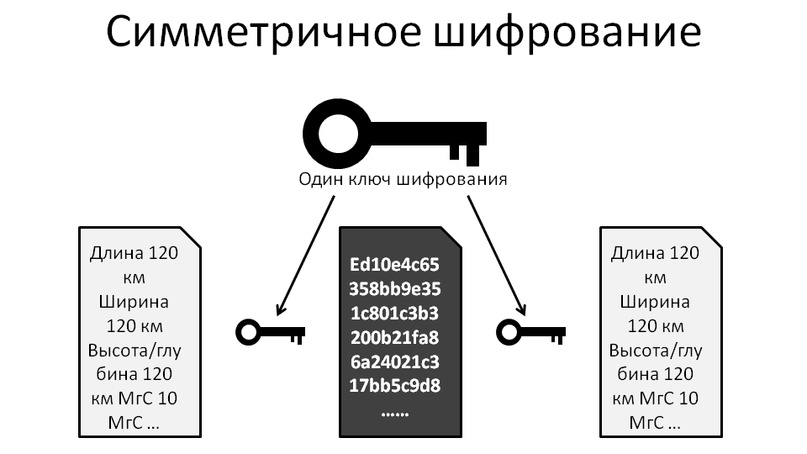
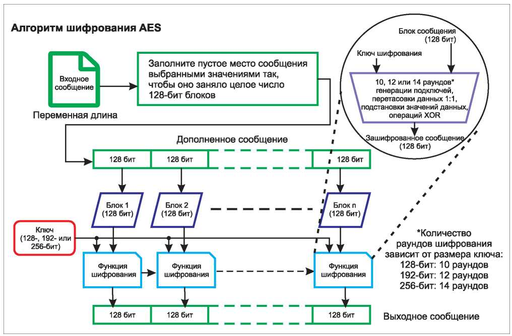
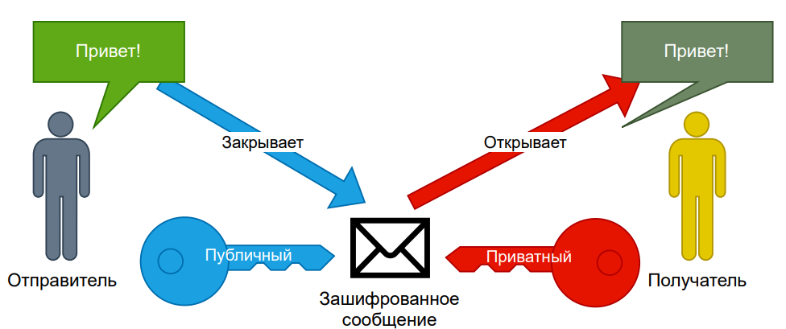
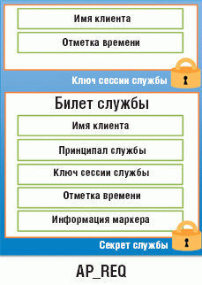
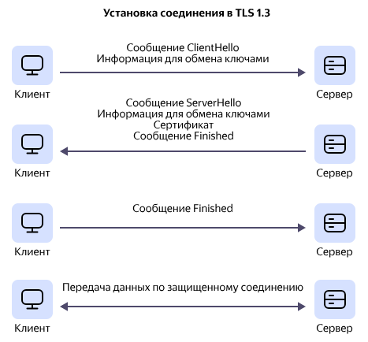
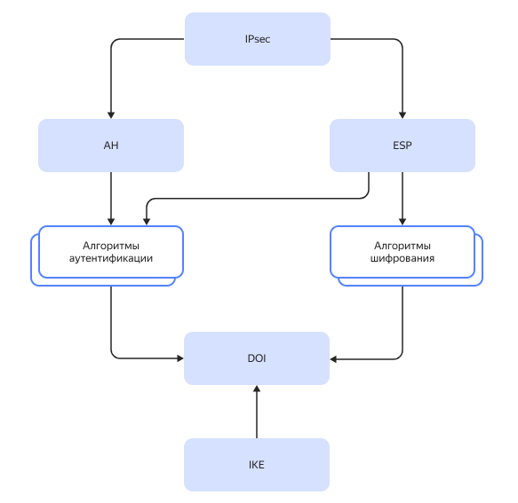
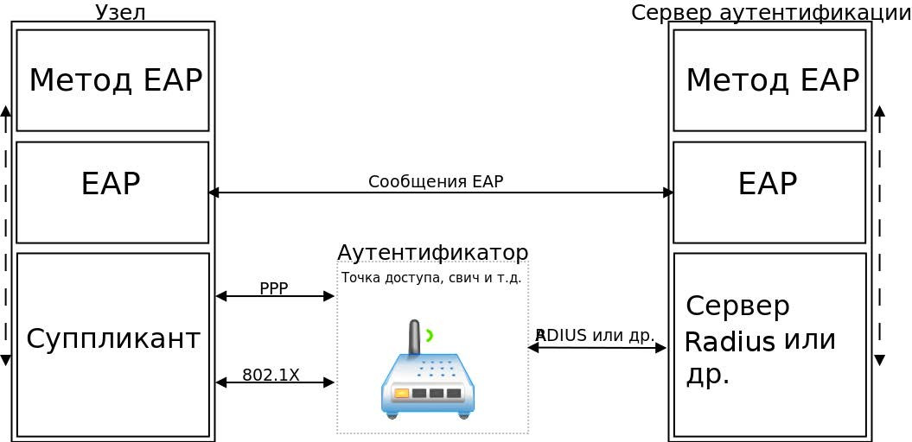

# 1. Введение

> **Криптография**<br>это наука, которая изучает способы шифрования и расшифрования данных

К современной криптографии относятся:
- симметричное и асимметричное шифрование;
- системы электронных подписей;
- хэш-функция;
- аутентификация (безопасный способ передачи секрета или ключа).

> **Хэш-функция**<br>это математический алгоритм преобразования массива данных любого размера (даже одного символа) в строку определенного размера (хэш).
Криптография позволяет:
- защитить важные свойства информации:
    - **конфиденциальность**
        - шифрованию данных в процессе передачи их по каналам связи
            - шифрованием самих данных<br>если данные попадут к злоумышленнику - ему придется их дешифровать
            - шифрованием канала связи<br>сделает задачу злоумышленника намного сложнее: даже перехватив шифрованные пакеты, ему потребуется много времени, чтобы их расшифровать, если у него это вообще получится
    - **целостность**
        - расчет хэша и сравнение его с исходным хэшем документа
        - С помощью хэш-функции можно узнать, внесены ли изменения в исходные данные
    - **неотказуемость** - это способность удостоверять имеющееся место действия или событие так, чтобы эти события или действия не могли быть позже отвергнуты. Также это возможность однозначно установить авторство информации и невозможность автора от него отказаться.
        - Один из способов установить автора информации — использовать системы с усиленной электронной подписью.
        - Электронная подпись состоит из следующих частей:
            - <ins>закрытого ключа ЭП</ins>, который хранится у владельца и известен только ему;
            - <ins>открытого ключа проверки ЭП</ins>, который формируется на основании закрытого ключа и легко передается по открытым каналам;
            - <ins>сертификата ЭП</ins> — бумажного или электронного документа с информацией о владельце сертификата и об открытом ключе.
        - Сертификат содержит:
            - <ins>Информацию об авторе</ins>, который владеет закрытым ключом — то есть мы знаем конкретного человека, кто его подписал.
            - <ins>Открытый ключ</ins>, который позволит проверить хэш, рассчитанный на основе документа, и убедиться, что данные не были изменены и именно их подписал автор.
- **аутентификация** - проверка подлинности учетных данных пользователя. Например, сравнение введенного пользователем пароля с паролем, хранящимся на сервере.
    - Криптография решает эту задачу несколькими способами:
        - шифрует канал для передачи пароля
            - с помощью TLS
            - благодаря шифрованию канала связи между сервером и пользователем
            - с помощью Kerberos и PKI, которые используют в своей работе алгоритмы шифрования
        - хранит на сервере хэш;
            - для безопасности используют <ins>соль</ins> — это результат математического вычисления, который добавляют к хэш, что усложняет злоумышленнику работу с ним.
        - использует систему взаимной аутентификации клиента и сервера;
            - Kerberos
            - необходима инфраструктура и наличие сервера распределения ключей
        - создает инфраструктуру открытых ключей (PKI).
            - использует асимметричную криптографию и сервер сертификации
            - При аутентификации через PKI пользователь генерирует закрытый ключ и запрашивает сертификат у центра сертификации.
                1. Пользователь обращается к информационной системе и предъявляет свой сертификат.
                1. Информационная система обращается к центру сертификации и проверяет действительность сертификата пользователя.
                1. Если сертификат недействителен или отсутствует в центре сертификации, ИС отклоняет запрос. Если сертификат действителен, ИС шифрует сеансовый ключ открытым ключом, который содержится в сертификате пользователя, и передает его обратно.
                1. Пользователь получает зашифрованный сеансовый ключ и расшифровывает его своим закрытым ключом.
                1. С помощью полученного сеансового ключа пользователь и информационная система создают новый шифрованный канал.

# 2. Основы криптографии

Условно ее делят на несколько периодов:
1. Первый период — с третьего тысячелетия до нашей эры до IX века нашей эры.
1. Второй период — с IX века до начала XX века.
1. Третий период — с начала до середины XX века.
1. Четвертый период — с середины XX века по 70-е годы.
1. Современный период — с 70-х годов XX века по настоящее время.

> **моноалфавитные шифры** — в них для создания шифра берется тот же алфавит, которым написан изначальный текст.

> **полиалфавитные шифры**<br>В них для создания шифра используется алфавит, отличный от того, на котором создана информация

> **Криптоанализ**<br>это наука о способах расшифровки зашифрованной информации.

В 1946 году американский математик Клод Шеннон пишет статью «Теория связи в секретных системах». Она разделена на три части:
1. **Математическая структура секретных систем**<br>дает определение криптосистемы (при использовании симметричного шифрования), источника сообщений, источника ключей, шифровальщиков, сообщения, ключа, криптограммы и шифровальщика противника.
1. **Теоретическая секретность**<br>дает понятие совершенной стойкой криптосистемы, взломать которую невозможно при генерировании абсолютно случайного ключа.
1. **Практическая секретность**<br>рассматривает зависимость стойкости криптосистемы и известных частей криптосистемы, а также количество времени, необходимого для ее взлома.

В статье [«Новые направления в криптографии»](https://www.cs.jhu.edu/~rubin/courses/sp03/papers/diffie.hellman.pdf) авторы Уитфилд Диффи и Мартин Хеллман описывают использования шифрования с помощью пары ключей:
- ключа шифрования;
- ключа расшифрования.

После этого появляются новые шифры: RSA, шифр Диффи-Хеллмана, AES и пр.

в пятый период криптография стала неотъемлемой частью нашей жизни
- На основе асимметричной криптографии появилась технология PKI
- Также развиваются квантовая криптография и технологии блокчейн

> **Блокчейн**<br>это распределенная система, содержащая и обрабатывающая все транзакции, происходящие в системе. Информация о транзакциях хранится в блоках.

## Симметричное и асимметричное шифрование

> **Симметричное шифрование**, когда обе стороны используют идентичный ключ для шифрования и расшифрования информации.

> **Асимметричное шифрование (шифрование с открытым ключом)**, когда стороны используют два ключа — открытый и закрытый. Закрытый ключ известен только владельцу; на его основании с помощью специальных криптографических средств владелец создает открытый ключ, который уже можно передавать по открытым каналам.

### Симметричное шифрование

> **Симметричное шифрование**<br>это способ шифрования, при котором используется один и тот же ключ для зашифрования данных и расшифрования.



Простые примеры симметричного шифрования — шифры Цезаря и Виженера — мы рассмотрели ранее.

В современной криптографии для повышения криптостойкости используются два алгоритма:
- Блочный.
- Потоковый.

#### Блочное шифрование

описано в [ГОСТе Р 34.12-2018 «Информационная технология. Криптографическая защита информации. Блочные шифры»](http://sewiki.ru/images/f/fd/GOST_34.12-2018.pdf)

- представляет из себя разделение изначального текста на блоки с последующей их перестановкой по определенному алгоритму.
- Длина блока фиксирована — 64 или 128 бит
- Если вдруг символов меньше, чем 128, блок дополняется специальными символами, и затем блоки переставляются местами.
<br><br>
- На каждой итерации шифрования генерируется раундовый ключ
- На каждом новом раунде блок шифруется новым раундовым ключом
- Чем длиннее ключ, тем больше раундов

Для взлома шифра AES нужно провести обратную операцию расшифрования: подобрать раундовые ключи на каждом раунде и расшифровать каждый блок.



Примеры блочных шифров:
- AES (размер блока — 128 бит);
- Кузнечик (размер блока — 128 бит);
- Магма (размер блока — 64 бита).

#### Потоковое шифрование

- представляет собой работу математического оператора «исключающие ИЛИ» (XOR)
- Исходный текст переводится в двоичную систему координат (в виде нулей и единиц)
- Ключ — это так же поток нулей и единиц.
- Символы шифруются не только в зависимости от ключа, но и от их места в тексте
- Биты исходных данных сравниваются с битами в ключе.

Потоковое шифрование хорошо использовать для потоков данных

Примеры потоковых шифров: шифр Вернама, шифры с автоключами, книжный шифр.

<span style="color: green">Плюсы</span>
- высокая скорости шифрования
- низкие требованиях к вычислительным ресурсам

<span style="color: red">Минусы</span>
- Сложно предавать ключи между сторонами
- Для симметричного шифрования используется один и тот же ключ для шифрования и расшифрования
- возникает проблема безопасной передачи ключа

### Асимметричное шифрование

> метод шифрования, при котором используются открытые и закрытые ключи

- Владелец генерирует закрытый ключ и хранит его у себя — только он имеет к нему доступ
- Каждый отдельный открытый ключ генерируется с помощью однонаправленной математической функции на основании закрытого ключа и может быть передан по открытому каналу
- Даже если злоумышленник получит открытый ключ, он не сможет на его основании восстановить закрытый ключ.



1. Получатель генерирует пару ключей: закрытый и открытый
1. Открытый ключ он передает отправителю любым удобным способом
1. Отправитель с помощью полученного открытого ключа шифрует сообщение и направляет его получателю
1. Получатель получает зашифрованное сообщение и расшифровывает его с помощью своего закрытого ключа
1. Если отправитель хочет получить сообщение от получателя, то он генерирует свою пару закрытого и открытого ключей, и процедура повторяется.

К асимметричному шифрованию относятся:
- Системы электронных подписей на основе архитектуры открытых ключей.
    - регулирует [Федеральный закон «Об электронной подписи» от 06.04.2011 № 63-ФЗ](https://www.consultant.ru/document/cons_doc_LAW_112701/)
        - *Электронную подпись используют для подписания электронных документов в электронном документообороте. Также электронную подписать используют для для безопасной аутентификации и передачи сеансового ключа.*
- SSL-шифрование и пришедшее ему на смену TLS-шифрование
    - описано в [Р-1323565.1.030-2020 Криптографическая защита информации. Использование российских криптографических алгоритмов в протоколе безопасности транспортного уровня TLS 1.3](https://rst.gov.ru:8443/file-service/file/load/1699602571401) и [Р-1323565.1.043-2022 Криптографическая защита информации. Контрольные примеры использования российских криптографических алгоритмов в протоколе безопасности транспортного уровня TLS1.3](https://rst.gov.ru:8443/file-service/file/load/1699603475581).

### Сквозное шифрование

> шифрование между двумя конечными точками (end-to-end), минуя передачу зашифрованной информации на сервер (то есть информация на сервере не хранится).

С помощью ассиметричного шифрования передать симметричный ключ и затем шифровать данные с помощью полученного симметричного ключа

# 3. Защита аутентификации

три этапа проверки:
- Идентификация.
- Аутентификация.
- Авторизация.

> **Идентификация**<br>это процесс определения пользователя по уникальному идентификатору (например, логину).

> **Аутентификация**<br>это процесс подтверждения пользователем, что это именно он (например, с помощью ввода пароля, который известен только ему и никому больше).

> **Авторизация**<br>это процесс определения прав, которые доступны пользователю.

## Kerberos

> сетевой протокол, который используется для взаимной аутентификации (подтверждения подлинности) сервера и клиента

Аутентификация происходит через доверенную третью сторону — KDC (центр распределения ключей)
- сервер ИС не хранит учетные данные пользователя, и они не передаются по сети

KDС включает:
- сервер аутентификации (AS);
- сервер выдачи билетов и разрешений (TGS) ;
- базу данных со списком пользователей и их правами (DataBase).

Kerberos работает так:
1. ользователь хочет подключиться к информационной системе и уже авторизован на ОС
1. обращается к центру распределения ключей
1. Центр распределения ключей (KDC) формирует сеансовые ключи для сервера ИС и пользователя<br>
1. Пользователь направляет по открытому каналу незашифрованное сообщение AS_REQ к серверу аутентификации
1. AS_REQ содержит информацию о пользователе, метку времени и данные сервера выдачи мандатов и разрешений.
1. Сервер аутентификации проверяет в базе, есть ли такой пользователь, а также проверяет метку времени в качестве защиты от повторов.
1. Когда метка времени проверена, сервер аутентификации (AS) формирует два одинаковых сеансовых ключа для обмена информацией между пользователем и сервером
    - также добавляет туда билет, удостоверяющий личность пользователя (TGT, или ticket granting ticket — буквально «билет для получения билета») и выданный TGS
1. Сеансовый ключ зашифрован открытым ключом сервера ИС. Эту информацию AS шифрует ключом пользователям и передает в зашифрованном виде AS_REP.
1. пользователь передает зашифрованный сеансовый ключ серверу
1. между пользователем и сервером ИС есть зашифрованный канал
    - может быть зашифрован как симметричным ключом шифрования, так и асимметричным
1. Для получения информации, необходимой для подключения, пользователь направляет запрос AP_REQ информационной системе.<br> 
    - AP_PEP — необязательный ответ на запрос AP_REQ, подтверждающий подлинность сервера ИС.
1. пользователь направляет запрос TGS_REQ к серверу TGS, который содержит
    - билет (TGT)
    - данные о сервере ИС
    - аутентификационные данные пользователя, зашифрованные ключом пользователя
1. Сервер TGS направляет пользователю ответ TGS_REP с данными для входа в сервер ИС.

### Преимущества 

- обеспечивает защищенный обмен данными для аутентификации между пользователем и сервером;
- делает возможным логирование аутентификации пользователей;
- предоставляет многофакторную аутентификацию;
- автоматизирует получение доступа.

### Недостатки:

- Единая точка доступа — это KDC. Если она недоступна, пользователи не могут войти в ИС. KDC должен быть хорошо защищен, потому что при компрометации KDC злоумышленник может попасть во все ИС.
- У KDC высокие требования ко времени на сервере и на компьютере пользователя. Если есть большое расхождение, то пользователь не сможет зайти на сервер ИС.
- При смене имени хоста нужно получать новый открытый ключ хоста и держать на контроле этот процесс.

### Инструкции по настройке

- [Инструкция для Windows](https://learn.microsoft.com/ru-ru/windows/security/identity-protection/hello-for-business/deploy/hybrid-cloud-kerberos-trust?tabs=intune)
- [Инструкция для Ubuntu](https://help.ubuntu.ru/wiki/%D1%80%D1%83%D0%BA%D0%BE%D0%B2%D0%BE%D0%B4%D1%81%D1%82%D0%B2%D0%BE_%D0%BF%D0%BE_ubuntu_server/%D0%B0%D0%B2%D1%82%D0%BE%D1%80%D0%B8%D0%B7%D0%B0%D1%86%D0%B8%D1%8F_%D0%BF%D0%BE_%D1%81%D0%B5%D1%82%D0%B8/kerberos)

# 4. Шифрование каналов связи

> **VPN (virtual private network, или «виртуальная частная сеть»)**<br>название технологии, которая позволяет создать виртуальную сеть поверх другой сети, например поверх интернета.

Протоколы:
- IPSec (IP security);
- OpenVPN SSL — VPN на основе SSL/TLS шифрования.
- PPTP (point-to-point tunneling protocol) — VPN-«точка-точка», встроенный в ОС WIndows;
- PPPoE (Point-to-Point Protocol over Ethernet) — VPN-канал, работающий на втором уровне модели OSI и встроенный в ОС WIndows;
- L2TP (Layer 2 Tunnelling Protocol) — используется в Microsoft и Cisco.

## Шифрование с помощью протокола TLS

> transport layer security, или протокол защиты транспортного уровня модели OSI — это шифрованный протокол, с помощью которого можно:
> - обеспечить безопасную передачу данных между сервером и клиентом в интернете;
> - создать VPN-сеть между сегментами сети организации;
> - подключить удаленного сотрудника к сети организации.

### Версии

<table>
      <tbody><tr>
        <td>
          <p style="margin-bottom: 0 !important;"><strong>
              <nobr>Версия TLS</nobr>
            </strong></p>
        </td>
        <td>
          <p style="margin-bottom: 0 !important;"><strong>Основные характеристики</strong></p>
        </td>
      </tr>
      <tr>
        <td>TLS 1.0
        </td>
        <td>
          <ul class="list" style="margin-bottom: 0 !important;">
            <li>Основан на SSL 3.0.</li>
            <li>Поддерживает устаревшие и небезопасные алгоритмы.
            </li>
          </ul>
        </td>
      </tr>
      <tr>
        <td>TLS 1.1
        </td>
        <td>
          <ul class="list" style="margin-bottom: 0 !important;">
            <li>Поддерживает аутентифицированное шифрование.</li>
            <li>Поддерживает устаревшие и небезопасные алгоритмы.
            </li>
          </ul>
        </td>
      </tr>
      <tr>
        <td>TLS 1.2
        </td>
        <td>
          <ul class="list" style="margin-bottom: 0 !important;">
            <li>Поддерживает более безопасные алгоритмы.</li>
            <li>Позволяет серверу выбирать шифр, который поддерживаются обеими сторонами.</li>
            <li>Поддерживает аутентифицированное шифрование с дополнительными режимами передачи данных.</li>
            <li>Позволяет использовать расширенные наборы шифров.</li>
            <li>Полное рукопожатие включает два цикла обмена данными.
            </li>
          </ul>
        </td>
      </tr>
      <tr>
        <td>TLS 1.3
        </td>
        <td>
          <ul class="list" style="margin-bottom: 0 !important;">
            <li>Применяет генерацию уникального ключа сеанса для каждого пользователя, чтобы не позволить расшифровывать
              данные прошлых или будущих сеансов этими ключами.</li>
            <li>Использует только простые и надежные наборы шифров без уязвимостей.</li>
            <li>Заменяет процесс обмена ключами RSA методом Диффи-Хеллмана.</li>
            <li>Шифрование и аутентификация реализованы в едином цикле.</li>
            <li>Использует меньший набор упрощенных шифров.</li>
            <li>Предполагает более быстрое рукопожатие.</li>
            <li>Всегда требует цифровые подписи.
            </li>
          </ul>
        </td>
      </tr>
</tbody></table>

**Актуальные версии протокола — TLS 1.3 и TLS 1.2.**

### Используется для 

Протоколы TLS можно использовать для шифрования:
- информации внутри сети — например, от СУБД до пользователя;
- работы почты — протоколы POP3, SMTP и IMAP используют шифрование TLS;
- мобильных приложений;
- работы умных вещей.

### Сертификат сайта

Получение сертификата для сайта:
1. Владелец сайта генерирует на своем сервере закрытый ключ
    - `openssl genrsa -out private.key 4096`
1. Владелец обращается к удостоверяющему центру (через формирование запроса CSR)
    - `openssl req -new -key private.key -out domain_name.csr -sha256`
1. УД выпускает сертификат и передает его владельцу сайта
1. Владелец размещает сертификат на своем сайте

Министерство цифрового развития запустило [Национальный удостоверяющий центр](https://www.gosuslugi.ru/tls), с помощью которого можно получить сертификат TLS с шифрование по ГОСТ через портал «Госуслуг».

Удостоверяющий центр может быть
- доверенным
- недоверенным

### Виды TSL сертификатов

<table>
      <tbody><tr>
        <td>
          <p style="margin-bottom: 0 !important;"><b>Тип TLS-сертификата</b></p>
        </td>
        <td>
          <p style="margin-bottom: 0 !important;"><b>Описание</b></p>
        </td>
        <td>
          <p style="margin-bottom: 0 !important;"><b>Пример</b></p>
        </td>
      </tr>
      <tr>
        <td>EV (Extended Validation)
        </td>
        <td>Самый дорогой сертификат.
          <br><br>
          Владелец сайта предоставляет все документы, подтверждающие физическое и юридическое существование
          организации.
          Раньше в браузерах при использовании такого сертификата адресная строка подсвечивалась зеленым; сейчас от
          этого отказались.
          <br><br>
          Сейчас сертификат используется редко.
        </td>
        <td>Сайт apple.com
          <br><br>
          Apple Public EV Server RSA CA 2 — G1
          <br><br>
          Сертификат, выданный Удостоверяющим центром. EV в имени УЦ указывает на тип сертификата.
        </td>
      </tr>
      <tr>
        <td>OV (Organization Validation)
        </td>
        <td>Владелец сайта предоставляет все документы, подтверждающие физическое и юридическое существование
          организации.
          <br><br>
          Этот тип сертификата использует большинство организаций.
        </td>
        <td>Сайт ya.ru
          <br><br>
          GlobalSign ECC OV SSL CA 2018
          <br><br>
          Сертификат, выданный Удостоверяющим центром. OV в имени УЦ указывает на тип сертификата.
        </td>
      </tr>
      <tr>
        <td>DV (Domain Validation)
        </td>
        <td>Самый простой тип сертификата.
          <br><br>
          Достаточно подтвердить владение доменом по электронной почте или телефону.
          <br><br>
          К таким сертификатам имеют доступ физические лица.
        </td>
        <td>Сайт rt.ru
          <br><br>
          GlobalSign GCC R3 DV TLS CA 2020
          <br><br>
          Сертификат, выданный Удостоверяющим центром. DV в имени УЦ указывает на тип сертификата.
        </td>
      </tr>
      <tr>
        <td colspan="3">
          <p style="margin-bottom: 0 !important;"><strong>Дополнение к TLS-сертификатам</strong></p>
        </td>
      </tr>
      <tr>
        <td><strong>Wildcard Certificate</strong>
        </td>
        <td>Сертификат можно использовать для поддоменов.
          <br><br>
          Указано имя со звездочкой.
        </td>
        <td>Сертификат *.rt.ru
          <br><br>
          Можно использовать, например, для irkutsk.rt.ru
        </td>
      </tr>
      <tr>
        <td><strong>SAN (Subject Alternative Name)</strong>
        </td>
        <td>Сертификаты для разных доменов.
          <br><br>
          В сертификате указан перечень доменов, у которых один владелец.
        </td>
        <td> —
        </td>
      </tr>
    </tbody></table>

### Рабата TLS сертификата

1. **приветствие**:
    1. клиент направляет запрос серверу
    1. выбирается и устанавливается способ шифрования сообщений — например, это могут быть симметричные шифры, AES или отечественный «Кузнечик».
1. **Проверка поддержки способа шифрования у клента**
    - Если выбранный способ шифрования поддерживается клиентом - ОК, иначе отказ сервера 
1. **Сертификат сервера**
    - Сервер направляет в ответ свой сертификат и информацию для обмена ключами
    - здесь есть данные об используемом протоколе и случайно сгенерированное число (которое используется в алгоритме Диффи-Хеллмана) для обмена сеансовым ключом.
1. С помощью алгоритма Диффи-Хеллмана сервер и клиент **создают безопасный канал** для передачи сеансового ключа.
1. По безопасному каналу **сервер отправляет сеансовый ключ клиенту**.
1. **рукопожатие** — клиент и сервер на основании сеансового ключа формируют защищенный канал между собой



### Плюсы-минусы

#### Преимущества

- может быть встроено непосредственно в приложение;
- представляет из себя сквозное шифрование — доступ к каналу имеют только стороны, участвующие в обмене информацией;
- поддерживает Nat (сетевую технологию подмены внутреннего ip-адреса компьютеров на один внешний ip-адрес маршрутизатора) — серверу будет известен внутренний ip-адрес компьютра, и если злоумышленник попадет на сервер, то он сможет получить информацию о внутренней инфраструктуре пользователя;
- нет постоянного соединения между сервером и клиентом — пока не идет обмен информацией, канал дополнительно не нагружен, так что злоумышленнику сложнее обнаружить его;
- поддерживает журналирование — то есть можно узнать, что случилось с каналом, если он оборвался.

#### Минусы

- не работает с протоколами UDP и ICMP;
- низкая скорость обмена данными между сервером и клиентом;
- клиенту могут потребоваться дополнительные средства — криптосредства или специальные средства, поддерживающие алгоритм шифрования сервера (например, для работы с отечественным алгоритмами шифрования — сервис «КриптоПро CSP» или «Континент TLS») для работы TLS-шифрования;
- сервер может использовать симметричное шифрование с низкой криптостойкостью.

## Шифрование с помощью протокола IPSec

> это набор протоколов для защиты и шифрования данных, передаваемых по протоколу IP. IPSec позволяет шифровать IP-пакеты, обеспечивая их целостность и конфиденциальность, и в основном используется для организации VPN-каналов.

- может использовать различные алгоритмы шифрования, в том числе отечественные «Магму» и «Кузнечика»
- IPSec обеспечивает безопасность данных во время их передачи по сетевому протоколу.

### Состав IPSec

1. **Протокол AH (Authentifitication Header)**<br>используется для создания основного безопасного канала и обеспечивает аутентификацию сторон, целостность информации и предотвращение повторной передачи пакета.
1. **Протокол ESP (Encapsulating Security Payload)**<br>используется для создания основного безопасного канала и обеспечивает шифрование, аутентификацию сторон и целостность информации.
1. **DOI (Domain of Interpretation)**<br>домен интерпретации, который хранит информацию об используемых алгоритмах.<br>
1. **Протокол IKE (Internet Key Exchange)**<br>используется для согласования работы между сторонами: какой алгоритм шифрования используется, как будут происходить проверка целостности и аутентификация.

#### Протокол IKE

две версии протокола IKE — IKEv1 и IKEv2.

| Параметр | IKEv1 | IKEv2 |
| --------------- | --------------- | --------------- |
| Пропусная способность | Больше | Меньше |
| EAP (протокол расширяемой аутентификации) | - | + |
| MOBIKE (протокол мобильности и многодомности) | - | + |
| NAT-T (обход NAT) | - | + |
| Выбор между агресивным и основным режимом<br>в агресинвом режиме стороны начинают обмениваться информацией до того, как установили защищенный канал | + | - |
| XAUTH (расширенная аутентификаци)<br>пример: подключение к серверам RADIUS и TACACS+ | + | - |
| автоматически восстанавливать связь после потери соединения в IPSec | - | + |

### Алгоритм работы

1. **Первая фаза протокола IKE**
    - первичная аутентификация для создания безопасного канала (ISAKMP Tunnel) с помощью алгоритма Диффи-Хеллмана
    - первоначальный обмен информацией для работы IPSec:
        - какой алгоритм шифрования будет использоваться
        - какие будут политики безопасности
        - ключ шифрования и пр.
1. **Вторая фаза протокола IKE**<br>Доверяющие стороны согласовывают алгоритм работы, поочередно предлагая свои настройки и протокол AH или ESP, которые будут использоваться
1. **Строительство основного канала передачи данных**
   - срок действия ключей основного канала ограничены по времени
   - ISAKMP Tunnel продолжает функционировать
1. **Обмен данными внутри построенного шифрованного канала IPsec**

### Типы шифрования

- **туннельное шифрование**
    - шифруется и полезная нагрузка пакета и заголовок
    - пакет как бы заворачивается в защищенную оболочку с новым заголовком
- **транспортное шифрование**
    - шифруется только полезная нагрузка
    - заголовок пакета остается без шифрования
    - используется, если уже существует связь между сторонами, и сетевое оборудование не поддерживает туннельное шифрование

### Плюсы-минусы

#### Плюсы

- Безопасность и надежность протокола IPSec.
- Универсальность (может быть использован для передачи видеосообщения, голосовых сообщений, данных и пр.).
- Работа на сетевом уровне модели OSI (шифрование происходит на самом устройстве, и сетевые устройства пересылают уже шифрованные данные без возможности получить доступ к ним).

#### Минусы

- Сложность в настройке — IPSec сложнее настроить, чем другие безопасные протоколы.
- Возможные проблемы совместимости разных реализаций протокола — это связано с тем, что каждый может выбирать свой алгоритм для создания сеансового ключа, а также правила и политики работы IPSec.

## Криптошлюзы и клиенты

> **Криптошлюз**<br>это программно-аппаратный или программное криптографическое средство для защиты данных, передаваемых по каналам связи, с помощью шифрования. Криптошлюз может выступать в качестве VPN-сервера.

Криптошлюзы используют различные безопасные протоколы: IPSec или проприетарные протоколы

Примеры криптошлюзов:
- S-Terra
- «Застава»
- ALTELL NEO
- КриптоПро NGate
- Vipnet Coordinator
- Континент 4

Выбор криптошлюза зависит от проведенного аудита, описанного в предыдущем модуле, и проекта системы защиты сети.

Он включает:
- особенности и размеры инфраструктуры;
- навыки и знания сотрудников службы ИБ и ИТ;
- стоимость криптошлюза;
- наличие сертификата соответствия ФСБ.

В случаях, если в организации обрабатывают персональные данные и/или работают с государственными информационными системами (ГИС), необходимо использовать криптошлюзы, имеющие сертификаты соответствия ФСБ.

Требования к классам СКЗИ (средствам криптографической защиты информации), к которым относятся криптошлюзы для ИСПДн и ГИС, описаны в двух приказах ФСБ:

- [Приказ ФСБ РФ от 10 июля 2014 г. N 378 «Об утверждении Состава и содержания организационных и технических мер по обеспечению безопасности персональных данных при их обработке в информационных системах персональных данных с использованием средств криптографической защиты информации, необходимых для выполнения установленных Правительством Российской Федерации требований к защите персональных данных для каждого из уровней защищенности»](https://base.garant.ru/70727118/)
- [Приказ ФСБ РФ от 24.10.2022 № 524 «Об утверждении Требований о защите информации, содержащейся в государственных информационных системах, с использованием шифровальных (криптографических) средств».](http://publication.pravo.gov.ru/Document/View/0001202211230034)

### Классы СКЗИ

1. **КС1**<br>это базовое программное обеспечение СКЗИ.
1. **КС2**<br>это СКЗИ, состоящий из базового СКЗИ класса КС1 совместно с сертифицированным аппаратно-программным модулем доверенной загрузки.
1. **КС3**<br>это СКЗИ, состоящий из СКЗИ класса КС2 совместно со специализированным ПО для создания и контроля замкнутой программной среды.
1. **КВ**<br>это СКЗИ, состоящий из СКЗИ класса КС3 совместно со специализированным ПО, способным противостоять злоумышленникам с исходным кодом СКЗИ.
1. **КА**<br>это СКЗИ, состоящий из СКЗИ класса КВ совместно со специализированным ПО, способным противостоять злоумышленникам с конструкторскими документами СКЗИ.

#### Соотсветсвие ИСПДн - определенному уровню защищенности и актуальным угрозам

<table>
      <tbody><tr>
        <td>
        </td>
        <td>
          Актуальные угрозы 3 типа
        </td>
        <td>
          Актуальные угрозы 2 типа
        </td>
        <td>
          Актуальные угрозы 1 типа
        </td>
      </tr>
      <tr>
        <td>Уровень защищенности 4
        </td>
        <td colspan="3">Требования к использованию СКЗИ отсутствуют
        </td>
      </tr>
      <tr>
        <td>Уровень защищенности 3
        </td>
        <td>КС1, КС2, КС3 и выше
        </td>
        <td>КВ и выше
        </td>
        <td>—
        </td>
      </tr>
      <tr>
        <td>Уровень защищенности 2
        </td>
        <td>КС1, КС2, КС3 и выше
        </td>
        <td>КВ и выше
        </td>
        <td>КА
        </td>
      </tr>
      <tr>
        <td>Уровень защищенности 1
        </td>
        <td>—
        </td>
        <td>КВ и выше
        </td>
        <td>КА
        </td>
      </tr>
    </tbody></table>

#### Соответсвие ГИС — определенному уровню значимости и масштабу ГИС

<table>
      <tbody><tr>
        <td>
        </td>
        <td>ГИС для решения задач на всей территории РФ, или двух и более субъектах РФ
        </td>
        <td>ГИС для решения задач в пределах одного субъекта РФ
        </td>
        <td>ГИС для решения задач в пределах одного госорагана муниципального образования/образований
        </td>
      </tr>
      <tr>
        <td>Высокий уровень значимости информации
        </td>
        <td>КВ
        </td>
        <td>КС3
        </td>
        <td>КС2
        </td>
      </tr>
      <tr>
        <td>Средний уровень значимости информации
        </td>
        <td>КС3
        </td>
        <td>КС3
        </td>
        <td>КС1
        </td>
      </tr>
      <tr>
        <td>Низкий уровень значимости информации
        </td>
        <td>КС2
        </td>
        <td>КС1
        </td>
        <td>КС1
        </td>
      </tr>
    </tbody></table>

### Сравнение отечественные криптошлюзы

<table>
      <tbody><tr>
        <td>
        </td>
        <td><a href="https://www.s-terra.ru/products/catalog/s-terra-shlyuz-4-3/?tab=1" target="_blank">S-Terra</a> Шлюз
        </td>
        <td><a href="https://www.cryptopro.ru/products/ngate" target="_blank">КриптоПро NGate</a>
        </td>
        <td><a href="https://www.securitycode.ru/products/kontinent-4/" target="_blank">Континент 4</a>
        </td>
        <td><a href="https://infotecs.ru/products/vipnet-coordinator-hw-5/" target="_blank">ViPNet Coordinator HW 5</a>
        </td>
        <td><a href="https://www.altell.ru/products/neo/models/" target="_blank">ALTELL NEO</a>
        </td>
        <td><a href="https://zastava.ru/zastava-8/zastava-6000/" target="_blank">Застава 8</a>
        </td>
      </tr>
      <tr>
        <td>Сертификаты соответствия ФСБ
        </td>
        <td>КС1, КС2, КС3
        </td>
        <td>КС1, КС2, КС3
        </td>
        <td>Сертификаты для «Континент 4» отсутствуют.
          <br><br>
          «Континент 3.9» сертифицирован КС1, КС2, КС3.
          <br><br>
          <a href="https://www.securitycode.ru/products/kontinent-3-kv/" target="_blank">«Континент КВ» </a>имеет класс
          КВ.
        </td>
        <td>КС1, КС2, КС3.
          <br><br>
          <a href="https://infotecs.ru/products/vipnet-coordinator-kb/" target="_blank">Vipnet Coordinator КВ</a> имеет
          класс КВ.
        </td>
        <td>Отсутствуют .
          <br><br>
          Сертифицирован как МЭ.
        </td>
        <td>КС1, КС2, КС3
        </td>
      </tr>
      <tr>
        <td>Протокол безопасности
        </td>
        <td>IPSec
        </td>
        <td>IPSec
        </td>
        <td>Собственный протокол
        </td>
        <td>Собственный протокол
        </td>
        <td>IPSec
        </td>
        <td>IPSec
        </td>
      </tr>
      <tr>
        <td>Межсетевой экран
        </td>
        <td>Да
        </td>
        <td>Нет
        </td>
        <td>Да
        </td>
        <td>Да
        </td>
        <td>Да
        </td>
        <td>Да
        </td>
      </tr>
      <tr>
        <td>Поддержка отечественных криптографических алгоритмов
        </td>
        <td>Да
        </td>
        <td>Да
        </td>
        <td>Да
        </td>
        <td>Да
        </td>
        <td>Да
        </td>
        <td>Да
        </td>
      </tr>
      <tr>
        <td>VPN-сервер
        </td>
        <td>Да
        </td>
        <td>Да
        </td>
        <td>Да
        </td>
        <td>Да
        </td>
        <td>Да
        </td>
        <td>Да
        </td>
      </tr>
      <tr>
        <td>СОВ
        </td>
        <td>Нет
        </td>
        <td>Нет
        </td>
        <td>Да
        </td>
        <td>Да
        </td>
        <td>Да
        </td>
        <td>Нет
        </td>
      </tr>
      <tr>
        <td>Nat-сервер
        </td>
        <td>Да
        </td>
        <td>Нет
        </td>
        <td>Да
        </td>
        <td>Да
        </td>
        <td>Да
        </td>
        <td>Да
        </td>
      </tr>
      <tr>
        <td>Сервер маршрутизации
        </td>
        <td>Да
        </td>
        <td>Нет
        </td>
        <td>Да
        </td>
        <td>Да
        </td>
        <td>Да
        </td>
        <td>Да
        </td>
      </tr>
      <tr>
        <td>Vlan
        </td>
        <td>Да
        </td>
        <td>Нет
        </td>
        <td>Да
        </td>
        <td>Да
        </td>
        <td>Да
        </td>
        <td>Да
        </td>
      </tr>
      <tr>
        <td>Сервер DHCP
        </td>
        <td>Да
        </td>
        <td>Нет
        </td>
        <td>Да
        </td>
        <td>Да
        </td>
        <td>Да
        </td>
        <td>Да
        </td>
      </tr>
      <tr>
        <td>TLS-сервер
        </td>
        <td>Нет
        </td>
        <td>Да
        </td>
        <td>Нет
        </td>
        <td>Нет
        </td>
        <td>Нет
        </td>
        <td>Нет
        </td>
      </tr>
      <tr>
        <td>Максимальная скорость шифрования
        </td>
        <td>до 8,8 Мбит/с
        </td>
        <td>до 8 Мбит/с
        </td>
        <td>до 9 Мбит/с
        </td>
        <td>до 10 Мбит/с
        </td>
        <td>до 3,5 Мбит/с
        </td>
        <td>до 10 Мбит/с
        </td>
      </tr>
      <tr>
        <td>Максимальное количество клиентов
        </td>
        <td>Без ограничений
        </td>
        <td>до 12 000 подключений
        </td>
        <td>до 3000 подключений
        </td>
        <td>до 15 000 связей с узлами
        </td>
        <td>до 3000
        </td>
        <td>не указано
        </td>
      </tr>
    </tbody></table>

- *Выделяется «КриптоПро NGate»: его задача состоит в том, чтобы создавать соединение на основе TLS, но при этом он может выступать и как VPN-сервер.*
- *ALTELL NEO — в первую очередь межсетевой экран, а потом уже криптошлюз, поэтому у него отсутствуют сертификаты соответствия ФСБ.*

> СКЗИ класса КВ и КА изготавливают только в аппаратном (физическом) исполнении. Программных СКЗИ класса КВ и КА не бывает. Открытый ключ шифрования для них генерирует ФСБ.
> - Vipnet КВ и «Континент КВ»

# 5. Пример использования криптографии для обеспечение защиты каналов передачи данных

## Создание сервера

Минимальные характеристики должны быть такими:
- процессор — 1 core;
- память — 1 Gb;
- хранилище — 10 Gb.

VPN-сервер на Ubuntu 24.04 для работы с клиентами:
- OpenConnect (открытое программное обеспечение);
- Cisco-AnyConnect (проприетарное программное обеспечение).

## Создание SSH-ключа

### Генерация ключа:

```bash
ssh-keygen -t ed25519 -C "comment"
```

Если не поддерживается ed25519, то RSA:

```bash
ssh-keygen -t rsa -b 4096 -C "comment"
```

через `-t` можно задать имя файла

### Передача ключа на сервер

**Вариант 1:**

На клиенте:

```bash
ssh-copy-id -i [путь_к_публичному_ключу] user@server_addr
```

**Вариант 2:**

На сервере создать файл authorized_keys:

```bash
mkdir $HOME/.ssh
touch $HOME/.ssh/authorized_keys
```

Скопировать в него публичный ключ

## Установка VPN-сервера

https://github.com/mogilevich/OpenConnect-Cisco-AnyConnect-VPN-Server-OneKey-ocserv

1. Устанавливаем Certbot — протокол для управления SSL-сертификатами от Let's Encrypt.

```bash
sudo apt-get install certbot
```

2. Создать сертификат<br>Временный домен можно на https://www.freenom.com/ или https://freemyip.com

```bash
sudo certbot certonly --standalone -d you.domain.net --email you@domain.net --agree-tos --non-interactive
```

3. Проверка работы certbot

```bash
sudo systemctl list-timers | grep certbot
```

4. Сборка образа

```bash
git clone https://github.com/mogilevich/OpenConnect-Cisco-AnyConnect-VPN-Server-OneKey-ocserv.git

cd OpenConnect-Cisco-AnyConnect-VPN-Server-OneKey-ocserv/

docker build . -t ocserv

#docker build -t ocserv https://github.com/mogilevich/OpenConnect-Cisco-AnyConnect-VPN-Server-OneKey-ocserv.git
```

5. Разворачиваем контейнер

```bash
docker run -d \

-v /etc/letsencrypt/live/you.domain.net/fullchain.pem:/etc/ocserv/certs/server-cert.pem:ro\

-v /etc/letsencrypt/live/you.domain.net/privkey.pem:/etc/ocserv/certs/server-key.pem:ro\

--name ocserv_container\

--restart=always\

--privileged -p 443:443 -p 443:443/udp ocserv
```

## Команды для работы с пользователями

Ниже перечислены команды для работы с пользователями:
- добавление нового пользователя;
- изменение пароля;
- удаление пользователя;
- блокировка и разблокировка пользователя;
- просмотр списка пользователей;
- импортирование списка пользователей.

| Операция   | cmd   |
|--------------- | --------------- |
| Добавление пользователя | ```docker exec -ti ocserv_container ocpasswd -c /etc/ocserv/ocpasswd testUserName```  |
| Изменение пароля пользователя | `docker exec -ti ocserv_container ocpasswd -c /etc/ocserv/ocpasswd testUserName` |
| Удаление пользователя | `docker exec -ti ocserv_container ocpasswd -c /etc/ocserv/ocpasswd -d testUserName` |
| Блокировка пользователя | `docker exec -ti ocserv_container ocpasswd -c /etc/ocserv/ocpasswd -l testUserName` |
| Разблокировка пользователя | `docker exec -ti ocserv_container ocpasswd -c /etc/ocserv/ocpasswd -u testUserName` |
| Просмотр списка пользователей | `docker exec -ti ocserv_container cat /etc/ocserv/ocpasswd` |

## Настройка клиента

Ставим AnyConnect -> дальше кликаем

# 6. Защита беспроводных сетей

В современном мире беспроводные сети всегда вокруг нас:
- беспроводная сеть Wi-Fi дома или в кафе;
- мобильная связь;
- Bluetooth для подключения часов или наушников;
- беспроводные сети для работы умных вещей;
- Wimax — беспроводная технология для подключения рабочих станций, планшетов, мобильных телефонов, работающая на больших расстояниях;
- радиосвязь.

## Методы защиты Wi-Fi

1. **Скрыть беспроводную сеть.**<br>Для этого выключите в настройках точки доступа вещание с SSID (имя точки доступа). Имя точки перестанет быть видимым, и для подключения к точке доступа нужно будет вводить имя вручную.
1. **Проводить аутентификацию пользователей.**<br>Установите сложный пароль (не менее 8 символов, специальные символы, цифры и буквы разного регистра). Способы аутентификации будут рассмотрены ниже — необходимо выбрать WPA2 или WPA3.
1. **Ограничивать подключение по mac-адресам.**<br>Mac-адрес есть у каждого устройства, которое работает с сетью. В настройках точки доступа можно прописать белый список устройств, которые имеют право доступа к беспроводной сети. Другое устройство, даже если владелец знает SSID и пароль, не сможет подключиться, если его нет в этом белом списке.
1. **Зашифровать беспроводную сеть.**<br>Способы шифрования связаны с аутентификацией будут рассмотрены ниже. Вы изучите методы защиты Wi-Fi, связанные с криптографией, — шифрование и аутентификацию.

### WEP-шифрование и WPA-шифрование

> **WEP (Wired Equivalent Privacy)**<br>это алгоритм обеспечения безопасности беспроводной сети Wi-Fi.

WEP создан на основе потокового алгоритма шифрования [RC4](https://moluch.ru/archive/468/103117/) и имеет две реализации в зависимости от длины ключа:
- WEP-40 с длиной ключа 64 бита;
- WEP-104 с длиной ключа 128 бит.

В WPA взамен RC4 стали использовать протокол целостности временного ключа (Temporal Key Integrity Protocol, или TKIP) c длиной ключа 128 бит.

> Основное отличие TKIP — динамически изменяемый ключ, используемый системами взамен одного ключа. Это усложняет анализ шифра злоумышленником.

Кроме того, для защиты в WPA используется протокол аутентификации EAP и протокол проверки целостности Mic. EAP использует TLS-шифрование для аутентификации пользователя.

> **MIC (Message Integrity Check)**<br>это механизм проверки целостности сообщений для защиты Wi-fi от перехвата трафика злоумышленником. Получатель и отправитель применяют алгоритм MIC и сравнивают результат. В случае, если результаты не совпадают, то пакет объявляется ложным и отбрасывается.

### WPA2-шифрование

Основное отличие нового алгоритма WPA2 от WPA — использование шифрования [CCMP](https://habr.com/ru/articles/594985/) и алгоритма шифрования AES взамен TKIP. Длина ключа может быть увеличена до 256 бит.

WPA2 описан в стандарте [IEEE 802.11i](https://ieee802.org/16/liaison/docs/80211-05_0123r1.pdf). Там же описано четырехстороннее «рукопожатие» для обмена ключами
1. Точка доступа отправляет пользователю собственное случайное число.
1. Пользователь отправляет точке доступа свое случайное число и созданный ключ (MIC) , созданный на этом числе точки доступа.
1. Точка доступа проверяет MIC, подтверждает его получение и отправляет свой MIC.
1. Пользователь подтверждает получение ключей. Готово — канал создан.

два способа аутентификации:
1. **Персональный режим, или общий ключ (WPA2-Personal, или PSK)**<br>использует один пароль для всех устройств, который хранится на точке доступа.
1. **Корпоративный режим (WPA2-Enterprise, или EAP)**<br>для авторизации используется Radius-сервер, который выдает индивидуальный пароль для каждого устройства.

### Radius auth

Процесс аутентификации с помощью Radius-сервера происходит в семь этапов.
1. Пользователь направляет EAP-запрос к точке доступа с указанием используемого метода EAP.
1. Он получает EAP-ответ от точки доступа пользователю.
1. Точка доступа направляет запрос к Radius-серверу с указанием используемого метода аутентификации.
1. Radius-сервер направляет запрос к пользователю через точку доступа.
1. Происходит ответ пользователя Radius-серверу.
1. Radius-сервер отправляет точке доступа пакет — в нем содержится информация об успехе или же о сбое аутентификации.
1. Точка доступа отправляет пользователю пакет с кодом, который соответствует ответу Radius-сервера (EAP-Failure или EAP-Success).



### WPA3

- для создания безопасного «рукопожатия» используется протокол standalone
- для каждого нового подключения пользователя к точке доступа создается новый сессионный ключ
- длина ключа увеличена до 192 бит

В WPA3 используется метод Easy Connect для более простого подключения умных вещей.

# Источники

- [https://www.kaspersky.ru/resource-center/definitions/what-is-cryptography](https://www.kaspersky.ru/resource-center/definitions/what-is-cryptography)
- [https://www.consultant.ru/document/cons_doc_LAW_112701/c2f6c7bf1de391ceeee0b5943db5f74e0f1bae37/](https://www.consultant.ru/document/cons_doc_LAW_112701/c2f6c7bf1de391ceeee0b5943db5f74e0f1bae37/)
- [https://www.7-zip.org/](https://www.7-zip.org/)
- [https://www.securitylab.ru/glossary/aes_256/](https://www.securitylab.ru/glossary/aes_256/)
- [https://www.kaspersky.ru/blog/the-wonders-of-hashing/3633/](https://www.kaspersky.ru/blog/the-wonders-of-hashing/3633/)
- [https://habr.com/ru/companies/bitfury/articles/326340/](https://habr.com/ru/companies/bitfury/articles/326340/)
- [https://snipp.ru/tools/hash](https://snipp.ru/tools/hash)
- [https://www.consultant.ru/document/cons_doc_LAW_112701/c5051782233acca771e9adb35b47d3fb82c9ff1c/](https://www.consultant.ru/document/cons_doc_LAW_112701/c5051782233acca771e9adb35b47d3fb82c9ff1c/)
- [https://trusted.ru/products/cryptoarm/](https://trusted.ru/products/cryptoarm/)
- [https://www.kaspersky.ru/blog/identification-authentication-authorization-difference/29123/](https://www.kaspersky.ru/blog/identification-authentication-authorization-difference/29123/)
- [https://habr.com/ru/articles/145648/](https://habr.com/ru/articles/145648/)
- [https://habr.com/ru/articles/655135/](https://habr.com/ru/articles/655135/)
- [https://yandex.cloud/ru/docs/glossary/tls](https://yandex.cloud/ru/docs/glossary/tls)
- [https://habr.com/ru/articles/321338/](https://habr.com/ru/articles/321338/)
- [https://habr.com/ru/articles/723392/](https://habr.com/ru/articles/723392/)
- [https://habr.com/ru/articles/723392/](https://habr.com/ru/articles/723392/)
- [https://planetcalc.ru/2468/](https://planetcalc.ru/2468/)
- [https://habr.com/ru/companies/ua-hosting/articles/450186/](https://habr.com/ru/companies/ua-hosting/articles/450186/)
- [https://www.kinopoisk.ru/film/635772/](https://www.kinopoisk.ru/film/635772/)
- [https://www.kinopoisk.ru/film/660/?utm_referrer=www.yandex.ru](https://www.kinopoisk.ru/film/660/?utm_referrer=www.yandex.ru)
- [https://thecode.media/vernam/](https://thecode.media/vernam/)
- [https://techlibrary.ru/b1/3g1f1o1o1p1o_2s._3a1f1p1r1j2g_1s1c2g1i1j_1c_1s1f1l1r1f1t1o2c1w_1s1j1s1t1f1n1a1w.pdf](https://techlibrary.ru/b1/3g1f1o1o1p1o_2s._3a1f1p1r1j2g_1s1c2g1i1j_1c_1s1f1l1r1f1t1o2c1w_1s1j1s1t1f1n1a1w.pdf)
- [https://www.cs.jhu.edu/~rubin/courses/sp03/papers/diffie.hellman.pdf](https://www.cs.jhu.edu/~rubin/courses/sp03/papers/diffie.hellman.pdf)
- [https://habr.com/ru/articles/745820/](https://habr.com/ru/articles/745820/)
- [https://www.securitylab.ru/analytics/478912.php](https://www.securitylab.ru/analytics/478912.php)
- [https://habr.com/ru/articles/534620/](https://habr.com/ru/articles/534620/)
- [https://habr.com/ru/articles/460165/](https://habr.com/ru/articles/460165/)
- [https://habr.com/ru/companies/iticapital/articles/340992/](https://habr.com/ru/companies/iticapital/articles/340992/)
- [https://habr.com/ru/companies/skillfactory/articles/690904/](https://habr.com/ru/companies/skillfactory/articles/690904/)
- [https://habr.com/ru/articles/340342/](https://habr.com/ru/articles/340342/)
- [http://sewiki.ru/images/f/fd/GOST_34.12-2018.pdf](http://sewiki.ru/images/f/fd/GOST_34.12-2018.pdf)
- [https://habr.com/ru/articles/443050/](https://habr.com/ru/articles/443050/)
- [https://poformule.ru/text/shifr-vernama](https://poformule.ru/text/shifr-vernama)
- [https://xn--h1ajim.xn--p1ai/%D0%A8%D0%B8%D1%84%D1%80_%D1%81_%D0%B0%D0%B2%D1%82%D0%BE%D0%BA%D0%BB%D1%8E%D1%87%D0%BE%D0%BC](https://xn--h1ajim.xn--p1ai/%D0%A8%D0%B8%D1%84%D1%80_%D1%81_%D0%B0%D0%B2%D1%82%D0%BE%D0%BA%D0%BB%D1%8E%D1%87%D0%BE%D0%BC)
- [https://www.kaspersky.ru/blog/ww2-zorge-book-cipher/7724/](https://www.kaspersky.ru/blog/ww2-zorge-book-cipher/7724/)
- [https://encyclopedia.kaspersky.ru/glossary/asymmetric-encryption/](https://encyclopedia.kaspersky.ru/glossary/asymmetric-encryption/)
- [https://www.consultant.ru/document/cons_doc_LAW_112701/](https://www.consultant.ru/document/cons_doc_LAW_112701/)
- [https://rst.gov.ru:8443/file-service/file/load/1699602571401](https://rst.gov.ru:8443/file-service/file/load/1699602571401)
- [https://rst.gov.ru:8443/file-service/file/load/1699603475581](https://rst.gov.ru:8443/file-service/file/load/1699603475581)
- [https://www.kaspersky.ru/blog/telegram-privacy-security/29960/](https://www.kaspersky.ru/blog/telegram-privacy-security/29960/)
- [https://core.telegram.org/mtproto](https://core.telegram.org/mtproto)
- [https://habr.com/ru/articles/726324/](https://habr.com/ru/articles/726324/)
- [https://mitre.ptsecurity.com/ru-RU](https://mitre.ptsecurity.com/ru-RU)
- [https://learn.microsoft.com/ru-ru/windows-server/security/tls/transport-layer-security-protocol](https://learn.microsoft.com/ru-ru/windows-server/security/tls/transport-layer-security-protocol)
- [https://yandex.cloud/ru/docs/glossary/tls](https://yandex.cloud/ru/docs/glossary/tls)
- [https://yandex.cloud/ru/docs/glossary/ssl-certificate](https://yandex.cloud/ru/docs/glossary/ssl-certificate)
- [https://support.kontur.ru/dostup/47180-sozdanie_samopodpisannogo_sslsertifikata](https://support.kontur.ru/dostup/47180-sozdanie_samopodpisannogo_sslsertifikata)
- [https://letsencrypt.org/ru/](https://letsencrypt.org/ru/)
- [https://www.gosuslugi.ru/tls](https://www.gosuslugi.ru/tls)
- [https://habr.com/ru/articles/583172/](https://habr.com/ru/articles/583172/)
- [https://yandex.cloud/ru/docs/glossary/ipsec](https://yandex.cloud/ru/docs/glossary/ipsec)
- [https://learn.microsoft.com/ru-ru/archive/msdn-magazine/2009/september/an-introduction-to-ipsec-vpns-on-mobile-phones](https://learn.microsoft.com/ru-ru/archive/msdn-magazine/2009/september/an-introduction-to-ipsec-vpns-on-mobile-phones)
- [https://www.s-terra.ru/products/catalog/s-terra-shlyuz-4-3/?tab=1](https://www.s-terra.ru/products/catalog/s-terra-shlyuz-4-3/?tab=1)
- [https://zastava.ru/zastava-8/zastava-6000/](https://zastava.ru/zastava-8/zastava-6000/)
- [https://www.altell.ru/products/neo/models/](https://www.altell.ru/products/neo/models/)
- [https://www.cryptopro.ru/products/ngate](https://www.cryptopro.ru/products/ngate)
- [https://infotecs.ru/products/vipnet-coordinator-hw-5/](https://infotecs.ru/products/vipnet-coordinator-hw-5/)
- [https://www.securitycode.ru/products/kontinent-4/](https://www.securitycode.ru/products/kontinent-4/)
- [https://base.garant.ru/70727118/](https://base.garant.ru/70727118/)
- [http://publication.pravo.gov.ru/Document/View/0001202211230034](http://publication.pravo.gov.ru/Document/View/0001202211230034)
- [https://skzi.ru/catalog/kvazar-ka/pak-zk/](https://skzi.ru/catalog/kvazar-ka/pak-zk/)
- [https://www.securitycode.ru/upload/iblock/565/6gsz9mdpte3yean02fl5h6mvo7604msv/%D0%9A%D0%BE%D0%BD%D1%82%D0%B8%D0%BD%D0%B5%D0%BD%D1%82%204%20IPC-R10_DataSheat.pdf](https://www.securitycode.ru/upload/iblock/565/6gsz9mdpte3yean02fl5h6mvo7604msv/%D0%9A%D0%BE%D0%BD%D1%82%D0%B8%D0%BD%D0%B5%D0%BD%D1%82%204%20IPC-R10_DataSheat.pdf)
- [https://infotecs.ru/products/vipnet-coordinator-hw-5/](https://infotecs.ru/products/vipnet-coordinator-hw-5/)
- [https://cp.vdsina.com/vds/create](https://cp.vdsina.com/vds/create)
- [https://www.putty.org/](https://www.putty.org/)
- [https://www.vdsina.com/ru/qa/q/autentifikatsiya-s-pomoshchyu-ssh-klyuchey-i-otklyuchenie-dostupa-po-parolyu](https://www.vdsina.com/ru/qa/q/autentifikatsiya-s-pomoshchyu-ssh-klyuchey-i-otklyuchenie-dostupa-po-parolyu)
- [https://habr.com/ru/articles/310460/](https://habr.com/ru/articles/310460/)
- [https://www.digitalocean.com/community/tutorials/how-to-install-and-use-docker-on-ubuntu-22-04](https://www.digitalocean.com/community/tutorials/how-to-install-and-use-docker-on-ubuntu-22-04)
- [https://github.com/mogilevich/OpenConnect-Cisco-AnyConnect-VPN-Server-OneKey-ocserv](https://github.com/mogilevich/OpenConnect-Cisco-AnyConnect-VPN-Server-OneKey-ocserv)
- [https://www.freenom.com/ru/index.html?lang=ru](https://www.freenom.com/ru/index.html?lang=ru)
- [https://www.kaspersky.ru/resource-center/definitions/wep-vs-wpa](https://www.kaspersky.ru/resource-center/definitions/wep-vs-wpa)
- [https://moluch.ru/archive/468/103117/](https://moluch.ru/archive/468/103117/)
- [https://protocols.ru/WP/rfc3748/](https://protocols.ru/WP/rfc3748/)
- [https://habr.com/ru/articles/594985/](https://habr.com/ru/articles/594985/)
- [https://ieee802.org/16/liaison/docs/80211-05_0123r1.pdf](https://ieee802.org/16/liaison/docs/80211-05_0123r1.pdf)
- [https://habr.com/ru/articles/536648/](https://habr.com/ru/articles/536648/)
- [https://habr.com/ru/articles/424925/](https://habr.com/ru/articles/424925/)
- [https://files.stroyinf.ru/Data2/1/4293732/4293732907.pdf](https://files.stroyinf.ru/Data2/1/4293732/4293732907.pdf)
- [https://files.stroyinf.ru/Data2/1/4293732/4293732907.pdf](https://files.stroyinf.ru/Data2/1/4293732/4293732907.pdf)
- [https://protocols.ru/WP/rfc3748/](https://protocols.ru/WP/rfc3748/)
- [https://www.wi-fi.org/discover-wi-fi/wi-fi-easy-connect](https://www.wi-fi.org/discover-wi-fi/wi-fi-easy-connect)
