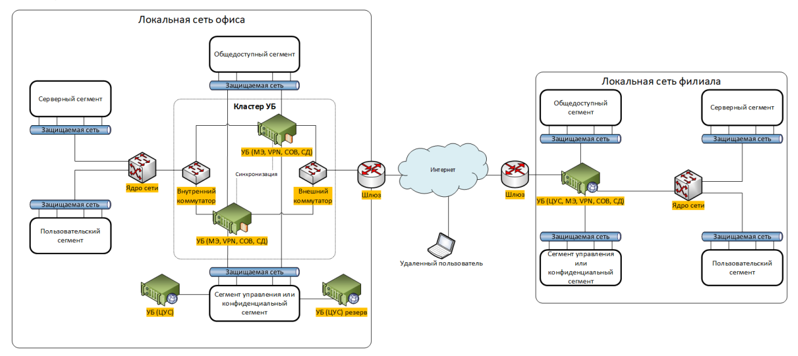
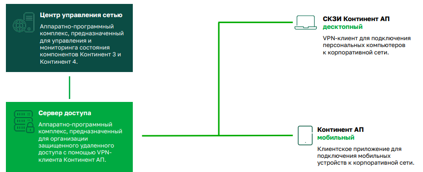

# 1. Введение

отечественные сертифицированные криптошлюзы:
 - [S-Terra](https://www.s-terra.ru/products/catalog/s-terra-shlyuz-4-3/?tab=1)
 - [«Застава»](https://zastava.ru/zastava-8/zastava-6000/)
 - [ALTELL NEO](https://www.altell.ru/products/neo/models/)
 - [КриптоПро NGate](https://www.cryptopro.ru/products/ngate)
 - [ViPNet Coordinator](https://infotecs.ru/products/vipnet-coordinator-hw-5/)
 - [«Континент 4»](https://www.securitycode.ru/products/kontinent-4/)

 Изучим Континент 4

Общие принципы настройки всех криптошлюзов похожи между собой:
- первоначальная настройка Центра управления сетью (ЦУС);
- настройка криптошлюза;
- настройка ключей шифрования;
- настройка межсетевого экрана, который присутствует в современных криптошлюзах;
- настройка VPN-сервера;
- настройка VPN-клиента;
- установка VPN-клиента и проверка связи между клиентом и сервером;
- контроль сетевого трафика с помощью анализа журналов.

Континент 4
- строить VPN-сети
- с использованием UTM-решений
- на основе протоколов семейства TCP/IP версии 4

может выполнять следующие функции:
- межсетевое экранирование;
- обнаружение и предотвращение вторжений;
- VPN-сервер;
- сетевые функции: NAT, VLAN, маршрутизация и другие;
- защита от вредоносных сайтов;
- журналирование сетевых событий.

состав «Континент» для создания VPN-канала:
- «Континент 4».
- Центр управления сетью и менеджер конфигурации.
- «Континент АП».
- Средство обнаружения вторжений.

как настроить «Континент 4» и создать защищенный VPN-канал:
1. Подключение к демо-стенду.
1. Первичная инициализация ЦУС.
1. Настройка менеджера конфигурации.
1. Настройка пользователей.
1. Настройка «Континент 4».
1. Настройка межсетевого экрана.
1. Настройка средства обнаружения вторжений.
1. Настройка L3VPN.
1. Настройка сервера доступа для подключения «Континент АП».
1. Настройка клиентов «Континент АП».
1. Настройка «Континент АП».
1. Работа с журналами «Континент 4»

# 2. Описание продуктов «Континент»

> **«Континент 4»** - это межсетевой экран нового поколения с поддержкой шифрования ГОСТ

## Функции

- **Центр управления сетью (ЦУС)**
	- можно управлять одним «Континент 4» или несколькими устройствами в сети.
    - «Континент 4» может выступать только в роли ЦУС или совмещать работу с другими компонентами.
- **Межсетевой экран**
	- настраивают разрешающие или запрещающие правила прохождения трафика в сети
    - Межсетевой экран функционирует на 3, 4 и 7 уровнях модели OSI.
- **L2VPN**
	- позволяет создать виртуальную сеть на 2 уровне модели OSI (на канальном уровне) и объединить различные сети в сеть с единым адресным пространством.
    - для обеспечения прозрачности сетевых операций и сохранения канальных протоколов
- **L3VPN**
	- позволяет создать виртуальную сеть на 3 уровне модели OSI (на сетевом уровне) и использовать в виртуальной сети IP-технологии:
        - NAT и маршрутизацию.
    - когда нужна сложная маршрутизация и гибкость в управлении сетевым трафиком
- **Средство обнаружения вторжений (СОВ)**
	- помогает обнаруживать и предотвращать атаки.
- **Сервер доступа**
	- создает защищённый канал между сервером и удаленным пользователем, на котором установлен «Континент АП».
- **Модуль идентификации пользователей**
	- позволяет проходить аутентификацию и идентификацию пользователей при попытке входа на определенные ресурсы как внутри сети, так и в сети Интернет.
- **Модуль поведенческого анализа**
	- позволяет «Континент 4» автоматически обучаться для обнаружения сетевых атак. Обучение происходит на основании встроенных сигнатур.

## Первоначальная настройка

1. **Узел безопасности (УБ)** — непосредственно сам «Континент 4». Может быть настроен в одном из режимов:
	- **UTM** - полноценная работа всех компонентов «Континент 4».
	- **Высокопроизводительный МЭ** - позволяет пропускать через «Континент 4» большой поток трафика, при этом большинство компонентов недоступны, кроме МЭ и приоритизации трафика.
	- **Детектор атак** - «Континент 4» работает только в режиме СОВ.
1. **Менеджер конфигурации** Специализированное программное обеспечение с графическим интерфейсом для управления «Континент 4».
1. Дополнительно на «Континент 4» может быть установлен ЦУС или резервный ЦУС. В сети должен быть минимум один экземпляр ЦУС.

## Описание «Континент АП»

https://www.securitycode.ru/products/skzi-kontinent-ap/

> программное обеспечение для подключения к VPN-серверу, созданному на «Континент 4». «Континент АП» позволяет подключаться сотрудникам, работающим удаленно, или обеспечивает защищённый канал для работы пользователей с информационной системой в сети Интернет.

Подключение происходит с помощью аутентификации с сертификатом, созданным на алгоритме ГОСТ

## Настройка «Континент 4»

Для подключения понадобится VPN-клиент [WireGuard](https://www.wireguard.com/install/)

Адрес подключения: https://172.18.100.5:8006/

понадобится конфигурационный файл для установки VPN-клиента и учетные данные для подключения.

Порядок действий:
1. Выбираете дистрибутив в зависимости от вашей операционной системы и скачиваете.
1. Устанавливаете VPN-клиент и соглашаетесь с запросом контроля учетных записей.
1. Импортируйте конфигурационный файл, для чего просто нажимаете «Подключиться». Подключение произошло, если вы видите информацию об IP-адресах и времени рукопожатия.
1. Переходите на удаленные виртуальные столы по адресу 172.18.100.5 порт 8006. При необходимости согласитесь с тем, что подключение не защищено и нажмите «перейти на сайт (небезопасно)».
1. Вводите имя пользователя и пароль.
1. Соглашаетесь, что отсутствует подписка, — нажимаете «ОК».

три виртуальные машины:
- UC — виртуальная машина с «Континент 4».
- RHCont4 — виртуальная машина для установки «Континент АП».
- ARMAdminCont4 — виртуальная машина для установки Менеджера конфигурации.

Для каждой виртуальной машины должны быть настроены следующие сетевые устройства:
- UC — vmbr 0, vmbr 11.
- RHCont4 — vmbr 11. В дальнейшем добавим vmbr 0.
- ARMAdminCont4 — vmbr 11.

IP-адреса:
- UC. vmbr 0 (в «Континент» будет назван eth0 или другим номером) — 10.10.10.201/24. vmbr11 (в «Континент 4ю — ge-0-0) — 10.0.20.1/24. DNS — 8.8.8.8, 8.8.8.4.
- Для первоначальной настройки Континент 4 ARMAdminCont4 — адрес 10.0.20.203/24. Шлюз по умолчанию — 10.0.20.1. В дальнейшем Континент будет выдавать адреса по DCHP. DNS — 10.0.20.1.
- RHCont4. vmbr 11 — адрес по DCHP (подсеть 10.0.20.1). vmbr 0 — адрес 10.10.10.202/24, шлюз по умолчанию — 10.10.10.201. DNS — 10.0.20.1.

лицензии https://www.securitycode.ru/upload/iblock/cf0/efc2ewew34qehz4kn9qs4f33emnym25c/%D0%9B%D0%B8%D1%86%D0%B5%D0%BD%D0%B7%D0%B8%D0%B8%20%D0%B4%D0%BB%D1%8F%20%D0%9A%D0%BE%D0%BD%D1%82%D0%B8%D0%BD%D0%B5%D0%BD%D1%82%204.zip

## Первоначальная настройка «Континент 4»

### Шаг 1. Настройка сети

- Во вкладке «оборудование» должны быть сетевые устройства VLAN 11 (vmbr11) и VLAN 0 (vmbr0)
- «Континент» будет раздавать интернет при помощи через VLAN 0 (vmbr0), поэтому для других виртуальных машин VLAN 0 (vmbr0) не нужен
  
- Для добавления нового интерфейса на «Континент 4» необходимо, чтобы он был остановлен (выключен). Выключаем «Континент 4» и после этого добавляем.

Переходим на ARMAdminCont4 (Менеджер конфигураций) и, вкладка «свойства». Устанавливаем сетевые настройки:
- IP-адрес 10.0.20.200. Это для первичной инициализации, в дальнейшем ip-адрес будет выдавать «Континент 4».
- Маска 255.255.255.0.
- Сетевой шлюз 10.0.20.1.

Проверяем аналогичные настройки для RHCont4

### Шаг 2. Установка менеджера консоли

Заходим в папку по пути Мой компьютер → локальный диск C → Distrib → MS → RUS → x64 → setup. Следуем инструкции установщика. После установки перезагружаем компьютер.

### Шаг 3. Вход в «Континент 4»

Заходим в инструменты. Выбираем повторные инициализации, чтобы появился новый интерфейс. Тип устройства — «Узел безопасности с ЦУС».

> Количество интерфейсов нужно задавать изначально, чтобы не проходить повторно инициализацию. После повторной инициализации все сертификаты, которые вы ранее выдали, и все настройки летят. Поэтому продумывайте архитектуру вашей системы заранее.

### Шаг 4. Настройка сертификатов

1. корневой сертификат ЦУС
2. сертификат управления для ЦУС
    - может быть выпущен сертификат управления для узла безопасности

### Шаг 5. Настройка ЦУС

Через главное меню выбираем настроить ЦУС. При этом предыдущие файлы конфигурации будут потеряны. Выбираем корневой сертификат, который только что создали.
1. Создаем новый пароль для администратора.
1. Выбираем первоначальный интерфейс для управления — ge-0-0:
    - IP-адрес 10.0.20.1.
    - Шлюз не устанавливаем.
    - Маска 10.0.20.1/24.
    - Соглашаемся с применением IP-адреса 10.0.20.1.

### Шаг 6. Установка системного времени

- Заходим в «Настройки» → «Установка времени» → «Ручная установка времени». Проверяем соответствие времени.
- Заходим в раздел «Часовой пояс». Часовой пояс должен быть `UTC`.

### Шаг 7. Проверка настройки сети

1. Заходим в сетевые интерфейсы
    - Для eth3 (или иной интерфейс отличный для ge-0-0) устанавливаем IP/Mask 10.10.10.201/24.Этот IP-адрес понадобится для выхода в интернет.
    - Проверяем настройки для ge-0-0.
1. Настройки нужно принять. Для этого выходим в меню настроек и нажимаем «Применение локальной политики».

### Шаг 8. Настройка менеджера конфигурации

-> ARMAdminCont4
- Запускаем менеджер конфигурации
- Указываем IP-адрес сервера 10.0.20.1, учетную запись admin, пароль. Нажимаем «Продолжить».

### Шаг 9. Обновляем лицензию

- подключились к «Континент 4». Система оповещает, что скоро истекает менеджер лицензии.
    - Администрирование → Лицензии
    - Нажимаем «Добавить лицензию в репозиторий»
    - Находим лицензию и добавляем её.
- Нажимаем на node-2710 (название нашего «Континент 4») и привязываем лицензию
    - Предыдущую лицензию можно отвязать.

### Шаг 10. Настройка топологии интерфейсов

-> Шаг 10. Настройка топологии интерфейсов
1. Два раза нажимаем на наш «Континент» (node-2710). Попадаем в свойства.
1. Переходим в интерфейсы Устанавливаем для наших интерфейсов топологию:
    - ge-0-0 — внутренний
    - eth3 (или иной интерфейс отличный для ge-0-0) — внешний
    - Вручную прописываем IP-адрес и маску для eth3.

### Шаг 11. Настройка NAT

в вкладку контроль доступа → трансляция сетевых адресов → Добавляем первое правило
- Правило создается автоматически, что для любого отправителя и получателя у нас происходит трансляция (скрывается адрес отправителя)

### Шаг 12. Настройка маршрута по умолчанию

1. Возвращаемся в структуру
1. Переходим в свойства континента и заходим в статическую маршрутизацию
1. Создаем новый маршрут:
    - Назначение 0.0.0.0/0.
    - Следующий узел 10.10.10.1.
    - Метрика 0.

### Шаг 13. Установка изменений на «Континент 4»

- Все изменения необходимо отправлять на «Континент»
    - нажимаем кнопку «Установить» и выбираем нужный «Континент» (node-2710)
    - ОК
- зайти на виртуальную машину «Континент»
    - проверить, есть ли доступ к интернету: Инструменты → диагностика → диагностика сети → ping

### Шаг 14. Установка сервера DHCP

-> ARMAdminCont4
- в свойствах node-2710 переходим во вкладку DHCP
    - галочку на сервер и добавляем новый DCHP-сервер
    - пул IP-адресов: от `10.0.20.2` до `10.0.20.250` маска `255.255.255.0`
    - Основной шлюз по умолчанию `10.0.20.1`
    - Указываем DNS
        - Предварительный 8.8.8.8.
        - Альтернативный 8.8.8.4. 
- Переходим во вкладку DNS. Дублируем информацию.
- заходим на МЭ и создаём первое правило, пока разрешающее для всех. Включаем для него лог. Отправляем изменения на континент.

## Установка сертификатов

понадобится создать сертификаты:
- Корневой сертификат RSA.
- Сертификат SSL/TLS-инспекции.
- Сертификат Web-мониторинга. Имя сертификата mon-aes.
- Сертификат Сервера Доступа. Имя сертификата ServerDostupa.local.

1. **корневой сертификат** с алгоритмом шифрования RSA
    - ARMAdminCont4
    - менеджер конфигурации → администрирование → сертификаты → корневые сертификаты → создать → корневой сертификат.
    - Заполняем все необходимые поля и указываем алгоритм подписи RSA
1. **сертификат TLS**
    - на вкладку промежуточный центр сертификации → промежуточный сертификат
    - тип сертификата SSL/TLS-инспекция
    - Заполняем необходимые поля
    - Корневой сертификат RSA
    - Создаём
1. **сертификат для «Континент»**
    - на вкладку персональные сертификаты → создать → сертификат
    - Тип сертификата: сервер доступа
    - название на английском языке, без пробелов
    - Выбираем корневой сертификат ЦУС
    - Создаем сертификат
1. **сертификат для Web-мониторинга**
    - Таким же образом
    - имя по умолчанию mon-aes
    - Вводим организацию
	- Выбираем корневой сертификат RSA
	- Создаем сертификат
1. Выгрузим сертификаты для установки на локальные машины
    - На рабочем столе создадим папку «Сертификаты»
    - В неё выгружаем сначала сертификаты:
        - контура безопасности,
        - корневой ЦУС,
        - корневой ЦУС RSA,
        - TLS,
        - ServerDostupa.local,
        - mon-aes.
1. Привяжем созданные сертификаты «Континент»
    - К каждому «Континенту» провязывается свой сертификат
    - на вкладку Структура → node 2710 → свойства → сертификаты
    - добавляем:
        - TLS,
        - ServerDostupa.local,
        - mon-aes,
        - корневой RSA.
    - Отправляем изменения на «Континент»
1. Установим созданные сертификаты
    - в папку «Сертификаты»
    - Доверенного издателя КБ
        - на него правой кнопкой мыши
        - установить → текущий пользователь → поместить все сертификаты в следующее хранилище → доверенные корневые центры сертификации
    - То же самое проделываем с корневым сертификатом ЦУС и корневым сертификатом RSA
    - Остальные сертификаты устанавливаем в хранилище по умолчанию
1. Проверим, загрузились ли сертификаты
    - на виртуальную машину Континент 4
    - Заходим в систему Континент. Проверяем наличие сертификатов во вкладке «Сертификаты».

## Настройка Центра мониторинга

- внести изменения в файл hosts на ARMAdminCont4 `C:\Windows\System32\drivers\etc`
    - `10.0.20.1 mon-aes`
- Переходим в центр мониторинга по адресу https://mon-aes/
- Слева выбираем вторую вкладку, открываем «сетевая безопасность». В запросе очищаем информацию, затем нажимаем на «действие», выбираем «блокировать».

## Настройка межсетевого экрана

- нужно перенести виртуальную машину RHCont4 («Континент АП») в другую сеть
    - Возвращаемся к перечню виртуальных машин
    - Нажимаем на виртуальную машину RHCont4 («Континент АП»)
    - Добавляем сетевое устройство из VLAN 0 (vmbr0)
    - VLAN 11 (vmbr11) можно удалить
    - в консоль «Континент АП»
        - настраиваем IP-адреса вручную
            - IP-адрес `10.10.10.202`.
            - Маска подсети `255 255.255.0`.
            - Основной шлюз `10.10.10.201`.
            - Предпочитаемый DNS-сервер `10.10.10.201`.
- на виртуальную машину с менеджером конфигурации
    - контроль доступа, заходим в межсетевой экран и добавляем первое правило для запрета подключения rdp
        - название RDP, сервис — протокол RDP, действие — отбрасывать, лог включён, место установки — наш «Континент» - node-2710.
    - Отправляем созданную политику запрета RDP на «Континент»
    - разрешим подключение по RDP к менеджеру конфигураций
        - Создаём первое правило, указываем:
        - Название rdp MC. Получатель — компьютер с менеджером конфигурации: добавляем новый сетевой объект MS с IP-адресом 10.0.20.203. Сервис RDP. Действие — разрешить. Лог включён. 
        - Отправляем политику на «Континент». Проверяем

## Настройка МЭ для приложений

- удалим правила rdp для портов
- Создаём новое правило
    - Название rdp. Указываем получателя — подсеть, к которой нельзя будет подключиться. Для этого создадим новый узел с подсетью 10.10.10.0/24. Это подсеть «Континент АП». Приложение RDP. Действие — отбросить. Лог включён. 
- После установки отправляем изменения на континент и проверяем

## Настройка МЭ для сайтов

- в менеджере конфигураций переходим на вкладку Web/FTP группы фильтров
- Создаём ограничение доступа к ya.ru:
    - адрес: .ya.ru;
    - схема HTTPS.
- создать профиль:
    - Адрес: ya.ru.
    - Схема: HTTPS.
    - В новой группе фильтров: действие — блокировать.
    - Фильтры от Каперского тоже не включаем, так как они не загружены в систему.
- На вкладке МЭ создаём новое правило
    - Название: ya.ru.
    - Сервис: SSL.
    - Действие: пропустить.
    - Профиль — ya.ru.
    - Лог включён.
- Отправляем на «Континент» и проверяем

## Проверка работы МЭ с помощью центра мониторинга

- Локальный DNS-сервер — это файл hosts, который находится на диске C → windows → system 32 → drivers → etc
- 10.0.20.1 mon-aes
- перейти на https://mon-aes/
    - Пользователи создаются в менеджере конфигурации → администрирование → администрация
    - В центре мониторинга можно посмотреть ошибки, предупреждения и события сетевой безопасности

## Установка TLS-сертификатов для проверки работы МЭ для сайтов

- в менеджер конфигурации
- Папку «Сертификаты» делаем доступный для обмена
- Устанавливаем:
    - сертификат доверенный издатель КБ,
    - корневой сертификат RSA,
    - корневой сертификат ЦУС,
    - сертификат TLS.

## Настройка Средства обнаружения вторжений

- откроем «Континент», перейдем в узел безопасности и проверим наличие галочки «Детектор атак»
- на вкладку в системы обнаружения вторжений → база решающих правил
    - видим три профиля средства обнаружения вторжений: оптимальные, полные и рекомендованные
- Импортируем более новые данные.
    - мой компьютер → локальный диск C → Distrib
    - есть правила. Нажимаем открыть.
- переходим в профиль
    - Создаём свой профиль
    - Включаем в нём контроль приложений, отмечаем Google и RDP
    - Оставляем пользовательские правила и правила для сетевого сканера, остальные отключаем
- в политику СОВ
    - Выбираем наш профиль
    - Переходим на вкладку контроль доступа → межсетевой экран
    -  Необходимо указать, по каким сервисам будет работать данное действие, например, SSL, rdp
- Включаем СОВ и лог
- Устанавливаем политику на «Континент».

установить nmap. Он находится в Мой компьютер → Диск C → Дистрибутив nmap

## Настройка «Континент АП»

- Адреса для сервера доступа — `10.0.22.0/24`.
- внести изменения в файл hosts RHCont4
    - `10.10.10.201 ServerDostupa.local`

Создадим VPN клиента
- включить сервер доступа
    - в Менеджере конфигураций на вкладку структура → наш «Континент» → узел безопасности
    - Ставим галочку «сервер доступа»
- будем подключать с помощью «Континента АП»
- На вкладке «сервер доступа» указываем, какие адреса будут прятаться за сервером доступа
    - создаём новый пул: `10.0.22.0/24`
- Ранее мы создавали сертификат для работы сервера доступа. Персональный сертификат называется ServerDostupa.local
- создадим ключи для подключения «Континент АП»
    - на вкладку виртуальной частной сети → удалённый доступ → создать → первое правило:
        - Название: Континент АП. Пользователи: создаём нового пользователя с аутентификацией по паролю или сертификату. Доступ: сеть 10.0.20.0. 
- сохранить ключевой носитель
    - снизу нажимаем пользователи в нижней части экарана
    - Нажимаем правой кнопкой на пользователя, выбираем экспортировать → профиль пользователя
    - Выбираем путь куда сохранить профиль.
- Подтверждаем «экспортировать закрытый ключ»
    - «Сертификат сервера доступа» делаем по умолчанию
    - Для сохранения выбираем папку «Сертификаты»
    - Отправляем изменения на континент

