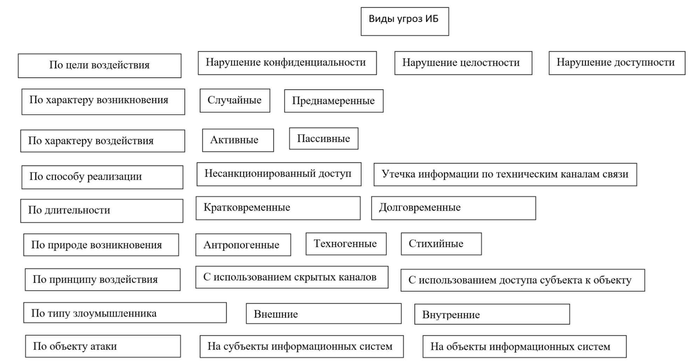
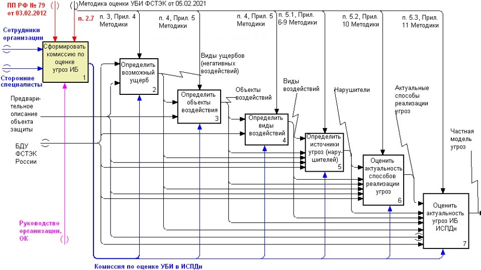
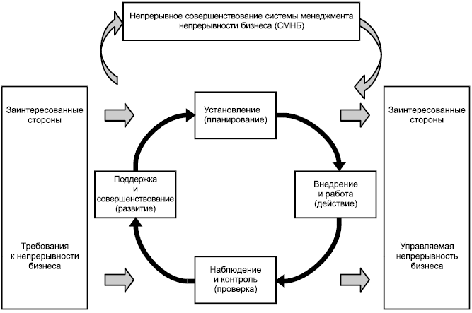
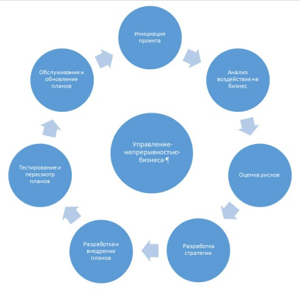
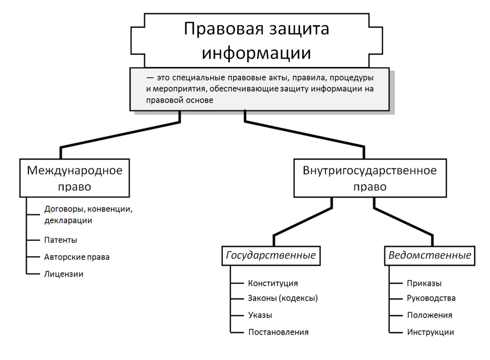
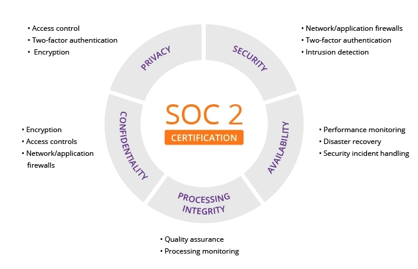

[[_TOC_]]

***
# Понимание роли информационной безопасности в жизни общества

- узнаете о том, как проводится оценка активов компании, что является первоочередным при принятии решений по внедрению организационных и технических мер информационной безопасности;
- ознакомитесь с основными организационно-распорядительными документами по ИБ в организациях;
- познакомитесь с основополагающим документом в числе локальных нормативных актов в любой компании — «Политика ИБ», а также понятием «Концепция ИБ»;
- получите знания о том, что такое нормативный и корпоративный комплаенс;
- рассмотрите организационную структуру российского законодательства по защите информации, а также основные виды информации ограниченного доступа, что даст вам представление о том, какая именно информация подлежит защите в соответствии с законодательством Российской Федерации;
- узнаете об ответственности, которая предусмотрена за нарушение тайн в Российской Федерации;
- изучите один из важнейших нормативных актов последнего времени — Указ Президента РФ №250 от 1 мая 2022 г., и узнаете о том, к каким организациям он относится, и какие требования предъявляет.

## Тенденции рынка ИБ в России

- Одни из основных тенденций рынка ИБ в России — импортозамещение и рост интереса бизнеса и госорганизаций к построению систем управления информационной безопасностью.
- ростом количества кибератак на 80%
- массовым уходом зарубежных вендоров с российского рынка.
- Указ Президента РФ «О дополнительных мерах по обеспечению информационной безопасности РФ», который существенно повысил роль службы информационной безопасности и её руководителя.
- с 31 марта 2022 г. была запрещена закупка зарубежного программного обеспечения для использования на значимых объектах критической информационной инфраструктуры (КИИ)

## Мировые тренды развития ИБ

- внедрение ориентированных на человека методов проектирования в программах кибербезопасности;
- усиление роли концепции Zero Trust («нулевого доверия»);
- конфиденциальность данных как конкурентное преимущество;
- увеличение использования «теневых» ИТ-сервисов;
- переосмысление количественной оценки рисков информационной безопасности;
- волатильность на рынке труда;
- повышение значимости информационной безопасности;
- использование TDIR (Threat Detection and Incident Response – детектирование угроз и реагирование на инциденты).

***
# Основные понятия ИБ

## Основные термины ИБ

> #### Информация
> 
> сведения (сообщения, данные) независимо от формы их представления

> #### Информационные технологии
> 
> процессы, методы поиска, сбора, хранения, обработки, предоставления, распространения информации и способы осуществления таких процессов и методов

> #### Информационная система
> 
> совокупность содержащейся в базах данных информации и обеспечивающих её обработку информационных технологий и технических средств

> #### Информационно-телекоммуникационная сеть
> 
> технологическая система, предназначенная для передачи по линиям связи информации, доступ к которой осуществляется с использованием средств вычислительной техники

> **Информационная безопасность** или InfoSec направлена на защиту всех данных организации независимо от их типа (цифровые или аналоговые) и места хранения. **Кибербезопасность** же направлена на защиту цифровых данных от компрометации или атак.

> #### Информационные технологии
> 
> это совокупность информационных систем и прочих элементов ИТ-инфраструктуры, взаимодействие которых обеспечивает осуществление бизнес-процессов

### Статья 5 ФЗ-149

> #### Общедоступная информация
> 
> относятся общеизвестные сведения и иная информация, доступ к которой не ограничен

> #### Информация ограниченного доступа
> 
> это персональные данные, коммерческая тайна, государственная тайна и другие виды тайн. В России насчитывается более 80 видов тайн, которые охраняются на уровне действующего законодательства.

## Информационная система

Это не обязательно приобретенное или «самописное» ПО с клиент-серверной архитектурой, многопользовательским режимом и т.д. Если вы, предположим, создали таблицу в MS Excel со списком сотрудников компании, то такая таблица с точки зрения регуляторов будет считаться базой данных, а MS Excel — информационной системой.

### Классификация по Статье 13 ФЗ-149

- государственные
- муниципальные
- иные

## Термины в области защиты информации

### Правовая основа для терминов
- [ГОСТ Р 53114-2008 ОБЕСПЕЧЕНИЕ ИНФОРМАЦИОННОЙ БЕЗОПАСНОСТИ В ОРГАНИЗАЦИИ](https://protect.gost.ru/document.aspx?control=7&id=174974)
- [ГОСТ Р 51275-2006 Защита информации. ОБЪЕКТ ИНФОРМАТИЗАЦИИ. ФАКТОРЫ, ВОЗДЕЙСТВУЮЩИЕ НА ИНФОРМАЦИЮ](https://docs.cntd.ru/document/1200057516)

### Основные термины

> #### Информационная инфраструктура
>
> совокупность объектов информатизации, обеспечивающая доступ потребителей к информационным ресурсам.

> #### Объект информатизации
>
> совокупность информационных ресурсов, средств и систем обработки информации, используемых в соответствии с заданной информационной технологией, а также средств их обеспечения, помещений или объектов (зданий, сооружений, технических средств), в которых эти средства и системы установлены, или помещений и объектов, предназначенных для ведения конфиденциальных переговоров.

> #### Активы организации
> 
> всё, что имеет ценность для организации в интересах достижения целей деятельности и находится в её распоряжении
> 
> К активам организации могут относиться:
> - информационные активы, в том числе различные виды информации, циркулирующие в информационной системе (служебная, управляющая, аналитическая, деловая и т.д.) на всех этапах жизненного цикла (генерация, хранение, обработка, передача, уничтожение)
> - ресурсы (финансовые, людские, вычислительные, информационные, телекоммуникационные и пр.)
> - процессы (технологические, информационные и пр.)

> #### Нарушение информационной безопасности организации
> 
> случайное или преднамеренное неправомерное действие физического лица (субъекта, объекта) в отношении активов организации, следствием которых является нарушение безопасности информации при её обработке техническими средствами в информационных системах, вызывающее негативные последствия (ущерб/вред) для организации.
>
> [ФСТЭК России 05.02.2021: Методики оценки угроз безопасности информации](https://fstec.ru/dokumenty/vse-dokumenty/spetsialnye-normativnye-dokumenty/metodicheskij-dokument-ot-5-fevralya-2021-g)

> #### Безопасность информации (данных)
> 
> состояние защищённости информации (данных), при котором обеспечены её (их) конфиденциальность, доступность и целостность.

> #### Инцидент информационной безопасности
> 
> любое непредвиденное или нежелательное событие, которое может нарушить деятельность или информационную безопасность.
>
> Примеры:
> - утрата услуг, оборудования или устройств
> - системные сбои или перегрузки
> - ошибки пользователей
> - несоблюдение политики или рекомендаций по ИБ
> - нарушение физических мер защиты
> - неконтролируемые изменения систем
> - сбои программного обеспечения и отказы технических средств
> - нарушение правил доступа

### ФЗ-149: право на доступ к информации и ограничение доступа к информации

> #### Статья 8. Право на доступ к информации.
>
> 1. Граждане (физические лица) и организации (юридические лица) (далее — организации) вправе осуществлять поиск и получение любой информации в любых формах и из любых источников при условии соблюдения требований, установленных настоящим Федеральным законом и другими федеральными законами.
> 1. Гражданин (физическое лицо) имеет право на получение от государственных органов, органов местного самоуправления, их должностных лиц в порядке, установленном законодательством Российской Федерации, информации, непосредственно затрагивающей его права и свободы.
> 1. Организация имеет право на получение от государственных органов, органов местного самоуправления информации, непосредственно касающейся прав и обязанностей этой организации, а также информации, необходимой в связи с взаимодействием с указанными органами при осуществлении этой организацией своей уставной деятельности.

> #### Статья 9. Ограничение доступа к информации.
>
> 1. Ограничение доступа к информации устанавливается федеральными законами в целях защиты основ конституционного строя, нравственности, здоровья, прав и законных интересов других лиц, обеспечения обороны страны и безопасности государства.
> 1. Обязательным является соблюдение конфиденциальности информации, доступ к которой ограничен федеральными [законами](https://www.consultant.ru/document/cons_doc_LAW_93980/).
> 1. Защита информации, составляющей государственную тайну, осуществляется в соответствии с законодательством Российской Федерации
> 1. Федеральными законами устанавливаются условия отнесения информации к сведениям, составляющим коммерческую тайну, служебную тайну и иную тайну, обязательность соблюдения конфиденциальности такой информации, а также ответственность за её разглашение
> 1. Информация, полученная гражданами (физическими лицами) при исполнении ими профессиональных обязанностей или организациями при осуществлении ими определенных видов деятельности (профессиональная тайна), подлежит защите в случаях, если на эти лица федеральными законами возложены обязанности по соблюдению конфиденциальности такой информации
> 1. Информация, составляющая профессиональную тайну, может быть предоставлена третьим лицам в соответствии с федеральными законами и (или) по решению суда
> 1. Срок исполнения обязанностей по соблюдению конфиденциальности информации, составляющей профессиональную тайну, может быть ограничен только с согласия гражданина (физического лица), предоставившего такую информацию о себе
> 1. Запрещается требовать от гражданина (физического лица) предоставления информации о его частной жизни, в том числе информации, составляющей личную или семейную тайну, и получать такую информацию помимо воли гражданина (физического лица), если иное не предусмотрено федеральными законами
> 1. Порядок доступа к персональным данным граждан (физических лиц) устанавливается федеральным законом о персональных данных

## Триада ИБ
> #### Конфиденциальность информации
> 
> свойство безопасности информации, при котором доступ к ней осуществляют только субъекты доступа, имеющие на него право.

> #### Целостность информации
> 
> состояние информации, при котором отсутствует любое её изменение, либо изменение осуществляется только преднамеренно субъектами, имеющими на него право.

> #### Доступность информации
> 
> состояние информации (ресурсов автоматизированной информационной системы), при котором субъекты, имеющие права доступа, могут реализовывать их беспрепятственно.

### Конституции Российской Федерации. Статья 24

[https://www.consultant.ru/document/cons_doc_LAW_28399/bcddbd9060e44ed6085b65a1af0fb90aa3ef0175/](https://www.consultant.ru/document/cons_doc_LAW_28399/bcddbd9060e44ed6085b65a1af0fb90aa3ef0175/)

Сбор, хранение, использование и распространение информации о частной жизни лица без его согласия не допускаются

## Ответственность за нарушения в сфере ИБ

### [Статья 17 ФЗ-149](https://www.consultant.ru/document/cons_doc_LAW_61798/ec553b250323ad210f4c9adc8c6b237b2c20f85a/#:~:text=%D0%A1%D1%82%D0%B0%D1%82%D1%8C%D1%8F%2017.-,%D0%9E%D1%82%D0%B2%D0%B5%D1%82%D1%81%D1%82%D0%B2%D0%B5%D0%BD%D0%BD%D0%BE%D1%81%D1%82%D1%8C%20%D0%B7%D0%B0%20%D0%BF%D1%80%D0%B0%D0%B2%D0%BE%D0%BD%D0%B0%D1%80%D1%83%D1%88%D0%B5%D0%BD%D0%B8%D1%8F%20%D0%B2%20%D1%81%D1%84%D0%B5%D1%80%D0%B5%20%D0%B8%D0%BD%D1%84%D0%BE%D1%80%D0%BC%D0%B0%D1%86%D0%B8%D0%B8%2C%20%D0%B8%D0%BD%D1%84%D0%BE%D1%80%D0%BC%D0%B0%D1%86%D0%B8%D0%BE%D0%BD%D0%BD%D1%8B%D1%85%20%D1%82%D0%B5%D1%85%D0%BD%D0%BE%D0%BB%D0%BE%D0%B3%D0%B8%D0%B9%20%D0%B8%20%D0%B7%D0%B0%D1%89%D0%B8%D1%82%D1%8B,%D1%81%D0%BE%D0%BE%D1%82%D0%B2%D0%B5%D1%82%D1%81%D1%82%D0%B2%D0%B8%D0%B8%20%D1%81%20%D0%B7%D0%B0%D0%BA%D0%BE%D0%BD%D0%BE%D0%B4%D0%B0%D1%82%D0%B5%D0%BB%D1%8C%D1%81%D1%82%D0%B2%D0%BE%D0%BC%20%D0%A0%D0%BE%D1%81%D1%81%D0%B8%D0%B9%D1%81%D0%BA%D0%BE%D0%B9%20%D0%A4%D0%B5%D0%B4%D0%B5%D1%80%D0%B0%D1%86%D0%B8%D0%B8.)

> 1. Нарушение требований настоящего Федерального закона влечет за собой дисциплинарную, гражданско-правовую, административную или уголовную ответственность в соответствии с законодательством Российской Федерации.
> 1. Лица, права и законные интересы которых были нарушены в связи с разглашением информации ограниченного доступа или иным неправомерным использованием такой информации, вправе обратиться в установленном порядке за судебной защитой своих прав, в том числе с исками о возмещении убытков, компенсации морального вреда, защите чести, достоинства и деловой репутации. Требование о возмещении убытков не может быть удовлетворено в случае предъявления его лицом, не принимавшим мер по соблюдению конфиденциальности информации или нарушившим установленные законодательством Российской Федерации требования о защите информации, если принятие этих мер и соблюдение таких требований являлись обязанностями данного лица.

### Статьи КОАП РФ и УК РФ

[КОАП РФ](https://www.consultant.ru/document/cons_doc_LAW_34661/)

- КоАП РФ. Статья 13.11. Нарушение законодательства Российской Федерации в области персональных данных
- КоАП РФ. Статья 19.4. Неповиновение законному распоряжению должностного лица
- КоАП РФ. Статья 19.4.1 КоАП РФ. Воспрепятствование законной деятельности должностного лица органа государственного контроля (надзора)
- КоАП РФ. Статья 19.5 КоАП РФ. Невыполнение в срок законного предписания (постановления, представления, решения)
- КоАП РФ. Статья 19.7. Непредставление сведений (информации)

[УК РФ](https://www.consultant.ru/document/cons_doc_LAW_10699/)

- [УК РФ. Глава 28. Преступления в сфере компьютерной информации](https://www.consultant.ru/document/cons_doc_LAW_10699/4398865e2a04f4d3cd99e389c6c5d62e684676f1/)
- [УК РФ Статья 137. Нарушение неприкосновенности частной жизни](https://www.consultant.ru/document/cons_doc_LAW_10699/4234a27af714cc608ea71b7bae9400f3613c8f60/)
- [УК РФ Статья 274.1. Неправомерное воздействие на критическую информационную инфраструктуру Российской Федерации](https://www.consultant.ru/document/cons_doc_LAW_10699/34672bc8c82c4b6f4b7c8cd4e77a9f414fed6cb1/)

***
# Основные виды угроз и нарушителей

## Виды угроз ИБ

## Построение модели угроз ИБ

Рассмотрим алгоритм построения модели угроз на примере защиты персональных данных с помощью Методики определения актуальных угроз безопасности информации ФСТЭК России от 2021 г. Модель угроз безопасности информации в ИСПДн (информационных системах персональных данных) разрабатывается с применением методического документа [«Методика оценки угроз безопасности информации», утвержденного ФСТЭК России 5 февраля 2021 года (Далее МОУБИ)](https://fstec.ru/dokumenty/vse-dokumenty/spetsialnye-normativnye-dokumenty/metodicheskij-dokument-ot-5-fevralya-2021-g).

Для построения модели угроз чаще всего используется банк данных угроз ФСТЭК России. [https://bdu.fstec.ru/threat](https://bdu.fstec.ru/threat)

Также в качестве угроз могут использоваться результаты предварительно проведённого анализа поиска уязвимостей защищаемой информационной системы с помощью специальных средств и методик.

Для оценки актуальности угроз используются эксперты. Их выбор производится в соответствии с п. 2.7 МОУБИ ФСТЭК.

Квалификационные требования к членам комиссии (по информационной безопасности) можно взять из Постановления Правительства № 79 от 3 февраля 2012г. «О лицензировании деятельности по технической защите конфиденциальной информации».

Алгоритм определения актуальных угроз безопасности информации на примере защиты персональных данных приведён на схеме:

## Первый этап
- Определяется возможный ущерб.
- Анализируется документация на объект исследования, полученная на этапе предпроектного обследования и инвентаризации
- Определяются негативные последствия, которые могут наступить от реализации угроз безопасности информации.

Определяется событие или группа событий, которые могут привести к
- нарушению прав граждан;
- возникновению ущерба в области обеспечения безопасности государства и правопорядка, а также в социальной, экономической, финансовой, политической сферах деятельности - государства (для государственных ИСПДн с большим числом записей о субъектах);
возникновению финансовых, производственных, репутационных или иных рисков (видов ущерба) для обладателя информации, оператора.

Виды ущербов и типовые негативные последствия, которые могут наступить от реализации угроз безопасности информации, приведены в [приложении 4 к Методике ФСТЭК России](https://www.consultant.ru/document/cons_doc_LAW_378330/2946b94c71ab9aa7c3a84414c80c3e6945402062/).

## Второй этап
- Определяются возможные объекты воздействия угроз безопасности информации
- Совокупность объектов воздействия и их интерфейсов определяет границы оценки угроз безопасности информации и разработки модели угроз безопасности информации

Исходные данные для определения возможных объектов воздействия это:
1. перечень угроз безопасности информации, содержащейся в банке данных угроз безопасности информации ФСТЭК России, за исключением угроз, заведомо нереализуемых для данного объекта;
1. документация на защищаемые сети и системы (составе и архитектура, о группы пользователей, их полномочий и тип доступа, внешних и внутренних интерфейсах). Для получения этих сведений проводились предварительные работы — инвентаризация;
1. договоры, соглашения или иные документы, содержащие условия использования информационно-телекоммуникационной инфраструктуры ЦОД или облачной инфраструктуры поставщика услуг (в случае функционирования систем и сетей на базе информационно-телекоммуникационной инфраструктуры ЦОД или облачной инфраструктуры);
1. негативные последствия (ущерб) от реализации (возникновения) угроз безопасности информации, определенные в соответствии с настоящей Методикой на предыдущем этапе.
1. И др.

## Третий этап
Основные виды воздействий на объекты защищаемой системы, приводящие к ущербу — это
1. утечка (перехват) конфиденциальной информации или отдельных данных (нарушение конфиденциальности);
1. несанкционированный доступ к компонентам, защищаемой информации, системным, конфигурационным, иным служебным данным;
1. отказ в обслуживании компонентов (нарушение доступности);
1. несанкционированная модификация, подмена, искажение защищаемой информации, системных, конфигурационных, иных служебных данных (нарушение целостности);
1. несанкционированное использование вычислительных ресурсов систем и сетей в интересах решения несвойственных им задач, изменение режима работы оборудования;
1. нарушение функционирования (работоспособности) программно-аппаратных средств обработки, передачи и хранения информации;
1. физическое уничтожение или , кража СВТ, носителей информации.

Примеры определения объектов воздействия и видов воздействия на них приведены в приложении [5 к Методике построения угроз безопасности информации ФСТЭК России](https://www.consultant.ru/document/cons_doc_LAW_378330/8dd63ccad41711f782231f2d1c7204984ee91794/).

## Четвертый этап
- Определение источников угроз безопасности информации.

Следует определить возможные источники угроз безопасности информации (актуальных нарушителей). К ним относятся отдельные физические лица, конкуренты, ОПГ и т.п., осуществляющие реализацию угроз безопасности информации путем НСД к ней и (или) воздействия на информационные ресурсы и (или) компоненты систем и сетей.

Исходными данные: собранные на этапах инвентаризации и анализа структуры защищаемого объекта, а также информация, полученная на предыдущих этапах во время оценки и определения:
- возможного ущерба от реализации угроз безопасности информации;
- негативных последствий от реализации угроз безопасности информации, определенные в соответствии с Методикой;
- потенциальных объектов воздействия угроз безопасности информации;
- видов воздействия на объекты, определенных в соответствии с Методикой.

На основе исходных данных определяются виды нарушителей, актуальных для систем и сетей

## Пятый этап
- Проводится оценка способов реализации (возникновения) угроз безопасности информации

## Шестой этап
- Определение актуальности угрозы

Угроза безопасности информации возможна, если имеются нарушитель или иной источник угрозы; объект, на который осуществляются воздействия (интерфейс, с помощью которого осуществляется взаимодействие); способы реализации угрозы безопасности информации; а реализация угрозы может привести к негативным последствиям.

***
# Активы и бизнес-процессы в контексте ИБ

## Оценка активов компании

### Основные показатели классификации активов
 по [ISO/IEС 27002](https://docs.cntd.ru/document/1200103619)
- Ценность
- Требования законодательства
- Критичность для организации
- Закрытость

### Владелец актива является ответственным за:
- определение классификации актива,
- периодический её пересмотр,
- обеспечение его актуальности и надлежащего уровня защиты.

### Классификация
включает в себя определение уровня ценности и важности информации. Критичность относится к степени, в которой информация влияет на эффективность бизнес-процессов компании. Различные варианты метода классификации приведены в международном стандарте ISO/IEC TR13335, а его отечественным аналогом является [ГОСТ Р ISO/IEC ТО 13335-х](https://docs.cntd.ru/document/1200048398).

Если рассматривать укрупненную классификацию, валидную для оценки ИТ/ИБ службой, то активами могут быть:
- финансовые средства (в том числе бюджет ИБ/ИТ подразделения);
- людские ресурсы;
- телекоммуникационные средства;
- информационные активы.

### Информационный актив
> информация с реквизитами, позволяющими её идентифицировать, и имеющая ценность для организации и представленная на любом материальном носителе в пригодной для её обработки, хранения или передачи форме.

#### Примеры информационных активов

- бизнес-процессы;
- информация различного вида (платежной, финансово-аналитической, служебной, управляющей), представленная в электронной и печатной форме;
- сотрудники;
- оборудование (сервера, рабочие станции, другое);
- программное обеспечение.

#### Действия для достижения необходимого уровня поддержки надлежащей защиты активов

- Следует установить владельцев для всех активов.
- Необходимо назначить ответственных за поддержку приемлемых средств управления.
- После определения владельцев активов при необходимости владелец может перепоручить внедрение конкретных средств управления, но он остается ответственным за надлежащую защиту активов.

#### Ответственность владельца актива

- обеспечение надлежащей классификации информации и активов, связанных со средствами обработки информации;
- разграничение и периодический пересмотр ограничений и классификации доступа, принимая во внимание соответствующие политики контроля доступа.

#### Владение может быть применено к

- бизнес-процессу,
- определенному набору действий,
- приложению,
- определенному набору данных.

#### Установление границ рассмотрения
Для конкретной ИТ-системы учитывают:
- активы информационных технологий (аппаратные средства, информационное обеспечение, информация);
- служащих сторонних организаций (персонал организации, субподрядчики);
- условия осуществления производственной деятельности (здания, оборудование);
- деловую деятельность (операции).

#### Действия для идентификации активов

- По форме «упрощённый реестр активов» ниже установить все активы.
- Составить и поддерживать перечень всех важных активов.
- Подготовить для каждого типа активов реестр документов

#### Общие тезисы по оценке активов

- Ценность актива определяется его важностью для деловой деятельности организации.
- Уровень оценки деловой деятельности может исходить из соображений обеспечения безопасности.
- Исходные данные для оценки должны быть получены от владельцев и пользователей активов.
- Метод оценки должен обеспечивать получение не только количественных, но и качественных оценок — там, где получение количественных оценок невозможно.

#### Коммерческая ценность информации в зависимости от величины ущерба
- **первая группа коммерческой ценности** — сведения, разглашение которых влечет за собой существенный экономический ущерб во всех сферах и направлениях деятельности организации;
- **вторая группа коммерческой ценности** — сведения, разглашение которых приводит к ущербу в отдельной сфере (нескольких сферах) и (или) направлении деятельности организации.

#### Действия для определения допустимого использования активов
- Необходимо установить, задокументировать и внедрить правила допустимого использования информации и активов, связанных со средствами обработки информации.
- Всем пользователям третьих сторон следует соблюдать правила допустимого использования информации и активов, связанных со средствами обработки информации. Для определения ценности информации можно использовать отраслевой дифференцированный метод: присвоить определенное значение веса параметру информационной ценности, чтобы определить важность ресурсов для участия в деятельности компании.

## Виды бизнес-процессов
Стандартная классификация подразумевают деление всех бизнес-процессов на четыре типа: 
- основные
- обеспечивающие
- процессы развития
- процессы управления

### 1. Основные процессы

> это процессы, которые образуют сквозную цепочку создания ценностей для клиентов, начиная с закупки материалов до конечного продукта.

Непрерывность таких бизнес-процессов, как правило, носит наиболее критичный характер, и именно сюда должны быть направлены основные усилия специалистов по информационной безопасности.

### 2. Обеспечивающие процессы

> Их клиентами являются внутренние подразделения компании. Примером обеспечивающего бизнес-процесса является ИТ-обслуживание пользователей

### 3. Процессы развития

> Они создают ценность в виде продукта для бизнеса, то есть речь идёт о появлении в результате их деятельности некого актива, который нужен бизнесу для того, чтобы улучшить конкурентоспособность товаров или услуг.

### 4. Процессы управления

> В рамках этих процессов не создаются какие-либо продукты: это процессы, связанные с управлением деятельностью организации, например, разработка и внедрение стратегии бизнеса.

## Обеспечение непрерывности бизнеса

> Предотвращении в первую очередь недопустимых, а также нежелательных последствий для бизнеса вследствие инцидентов информационной безопасности, возникающих, в том числе, в результате компьютерных атак.

[ГОСТ Р ИСО 22301 Национальный стандарт Российской Федерации. Системы менеджмента непрерывности бизнеса](https://docs.cntd.ru/document/1200181043)

### Система менеджмента непрерывности бизнеса (СМНБ)

#### СМНБ подчеркивает важность

- понимания потребностей организации и необходимости установления политики и целей в области непрерывности бизнеса,
- внедрения средств и показателей управления общей способностью организации - противостоять разрушительным инцидентам,
- анализа и мониторинга выполнения и результативности СМНБ,
- непрерывного совершенствования, основанного на объективных измерениях.

#### Ключевыме элементы СМНБ

1. политика;
1. люди с установленными обязанностями;
1. процессы управления, относящиеся к:
    1. политике;
    1. планированию;
    1. внедрению и функционированию;
    1. оценке выполнения;
    1. анализу со стороны руководства;
    1. совершенствованию;
1. документация, обеспечивающая доказательства соответствия;
1. все процессы управления непрерывностью бизнеса в организации.

#### Модель «Планирование — Выполнение — Проверка — Действие» (PDCA)

> PDCA используется для планирования, установления, внедрения, функционирования, мониторинга, поддержки и непрерывного совершенствования результативности СМНБ организации.

Стандарт обеспечивает определенную степень соответствия другим стандартам в области систем менеджмента:

- [ИСО 9001:2008 «Система менеджмента качества. Требования»](https://docs.cntd.ru/document/1200068732)
- [ИСО 14001:2004 «Системы экологического менеджмента. Требования и руководство по применению»](https://docs.cntd.ru/document/1200051440)
- [ИСО/МЭК 27001:2021 «Информационная технология. Методы обеспечения безопасности. Системы менеджмента информационной безопасности. Требования»](https://docs.cntd.ru/document/1200181890)
- [ИСО/МЭК 20000-1:2013 «Информационные технологии. Менеджмент услуг. Часть 1. Требования к системе менеджмента услуг»](https://docs.cntd.ru/document/1200109304)
- [ИСО 28000:2019 «Системы менеджмента безопасности цепи поставок. Технические условия»](https://docs.cntd.ru/document/1200171555)

#### Процесс получения результата СМНБ при мспользовании PDCA

#### Объяснение модели PDCA

> ##### Планирование (Установление)
>
> Установление политики в области непрерывности бизнеса, целей, задач, элементов управления, процессов и процедур, важных для совершенствования непрерывности бизнеса. Результаты должны поддерживать общую политику и задачи организации.

> ##### Выполнение (Внедрение и работа)
>
> Внедрение и работа политики непрерывности бизнеса, средств управления, процессов и процедур.

> ##### Проверка (Наблюдение и контроль)
>
> Отслеживание и анализ выполнения СМНБ с учётом политики и целей, сообщение результатов руководству, определение и санкционирование действий для исправления и совершенствования.

> ##### Действие (Поддержка и совершенствование)
>
> Поддержка и совершенствование СМНБ с помощью принятия корректирующих действий, основанных на результатах анализа менеджмента и пересмотре области применения СМНБ, а также политики и целей непрерывности бизнеса.

#### Термины и определения стандарта

> ##### Деятельность (activity)
>
> процесс или система процессов, осуществляемых организацией с целью производства одного или более видов продукции, оказания услуг или их поддержки.

> ##### Аудит (audit)
>
> систематический, независимый и документированный процесс получения свидетельств аудита и их объективной сравнительной оценки с целью установления степени выполнения согласованных критериев аудита.
>
> [ИСО 19011](https://docs.cntd.ru/document/1200179216)

> ##### Непрерывность бизнеса (business continuity)
>
> стратегическая и тактическая способность организации планировать свою работу в случае инцидента и нарушения её деятельности, направленная на обеспечение непрерывности деловых операций на установленном приемлемом уровне.
>
> [ИСО 22300](https://docs.cntd.ru/document/1200122718)

> ##### Менеджмент непрерывности бизнеса (business continuity management)
>
> полный процесс управления, предусматривающий идентификацию потенциальных угроз и их воздействия на деятельность организации, который создает основу для повышения устойчивости организации к инцидентам и направлен на реализацию эффективных ответных мер против, что обеспечивает защиту интересов ключевых причастных сторон, репутации организации, её бренда и деятельности, добавляющей ценность.

> ##### Система менеджмента непрерывности бизнеса (business continuity management system, BCMS) СМНБ
>
> часть общей системы менеджмента, которая направлена на установление, внедрение, осуществление, управление, мониторинг, анализ, поддержку и постоянное улучшение непрерывности бизнеса

> ##### План непрерывности бизнеса (business continuity plan) ПНБ
>
> набор документированных процедур и информации, которые разработаны, обобщены и актуализированы с целью их использования в случае возникновения инцидента, и направлены на обеспечение возможности продолжения выполнения организацией критически важных для нее видов деятельности на установленном приемлемом уровне.

> ##### Программа непрерывности бизнеса (business continuity programme)
>
> программа действий, направленных на осуществление и поддержку менеджмента непрерывности бизнеса, поддерживаемая и обеспечиваемая высшим руководством и необходимыми ресурсами.

> ##### Анализ воздействия на бизнес (business impact analysis)
>
> процесс исследования функционирования бизнеса и последствий воздействия на него разрушающих факторов.

> ##### Компетентность (competence)
>
> способность применять знания и навыки для достижения намеченных результатов.

> ##### Соответствие (conformity
>
> выполнение требований.

> ##### Постоянное улучшение (continual improvement)
>
> непрерывный процесс совершенствования системы менеджмента с целью повышения её общей эффективности в соответствии с политикой организации в области менеджмента.

> ##### Коррекция (correction)
>
> действие по устранению обнаруженного несоответствия.

> ##### Корректирующее действие (corrective action)
>
> действие по устранению причины обнаруженного несоответствия и предотвращения его повторного возникновения.

#### Жизненный цикл процесса управления непрерывностью бизнеса

После разработки планов непрерывности бизнеса можно планировать внедрение организационных и технических мер по защите информации с учётом актуальной модели угроз. Подробнее о термине BCMBoK, который описывает сумму знаний в рамках профессии управления непрерывностью бизнеса, вы можете прочитать в [этой статье](https://www.bcmpedia.org/wiki/BCM_Body_of_Knowledge_(BCMBoK)).

***
# Организация и структура информационного законодательства в системе обеспечения информационной безопасности Российской Федерации

## Состав структруты законодательства РФ в области информационной безопасности

- Конституция РФ
- федеральные законоы
- указы Президента РФ
- постановления Правительства РФ
- приказы ФСТЭК, ФСБ России и Роскомнадзора
- нормативные документы в отдельных отраслях

## Важные документы

- [ФЗ №149 от 27.07.2006 «Об информации, информационных технологиях и о защите информации»](https://www.consultant.ru/document/cons_doc_LAW_61798/)
- [152-ФЗ «О персональных данных» от 27.07.2006 г.](https://www.consultant.ru/document/cons_doc_LAW_61801/)
- [Постановление Правительства РФ от 1 ноября 2012 г. N 1119 «Об утверждении требований к защите персональных данных при их обработке в информационных системах персональных данных»](https://www.consultant.ru/document/cons_doc_LAW_137356/)
- [Приказ ФСТЭК России №21 от 18.02.2013 г.](https://fstec.ru/dokumenty/vse-dokumenty/prikazy/prikaz-fstek-rossii-ot-18-fevralya-2013-g-n-21)
- [Приказ ФСТЭК России №17 «Об утверждении Требований о защите информации, не составляющей государственную тайну, содержащейся в государственных информационных системах»](https://fstec.ru/dokumenty/vse-dokumenty/prikazy/prikaz-fstek-rossii-ot-11-fevralya-2013-g-n-17)

## Pащита критической информационной инфраструктуры (ККИ)

Основным нормативным актом, регламентирующим защиту объектов КИИ, является [ФЗ-187 от 26.07.2017 г. «О безопасности критической информационной инфраструктуры Российской Федерации»](https://www.consultant.ru/document/cons_doc_LAW_220885/)

Относится ли объект КИИ к значимым объектам и какую категорию значимости из трёх существующих ему присвоить. Ответ на этот вопрос даётся в [Постановлении Правительства РФ от 8 февраля 2018 г. N 127 «Об утверждении Правил категорирования объектов критической информационной инфраструктуры Российской Федерации, а также перечня показателей критериев значимости объектов критической информационной инфраструктуры Российской Федерации и их значений»](https://www.garant.ru/products/ipo/prime/doc/71776120/)

Существует три основных приказа, касающихся защиты КИИ:
- [Приказ ФСТЭК России от 21.12.2017 N 235 (ред. от 20.04.2023) «Об утверждении Требований к созданию систем безопасности значимых объектов критической информационной инфраструктуры Российской Федерации и обеспечению их функционирования»](https://fstec.ru/dokumenty/vse-dokumenty/prikazy/prikaz-fstek-rossii-ot-21-dekabrya-2017-g-n-235)
- [Приказ ФСТЭК от 22 декабря 2017 г. N 236 «Об утверждении формы направления сведений о результатах присвоения объекту критической информационной инфраструктуры одной из категорий значимости либо об отсутствии необходимости присвоения ему одной из таких категорий»](https://fstec.ru/dokumenty/vse-dokumenty/prikazy/prikaz-fstek-rossii-ot-22-dekabrya-2017-g-n-236)
- [Приказ ФСТЭК от 25.12.2017 г. № 239 «Об утверждении Требований по обеспечению безопасности значимых объектов критической информационной инфраструктуры Российской Федерации»](https://fstec.ru/dokumenty/vse-dokumenty/prikazy/prikaz-fstek-rossii-ot-25-dekabrya-2017-g-n-239)

## Защита коммерческой тайны

Основным законом здесь является [ФЗ от 29 июля 2004 г. N 98-ФЗ «О коммерческой тайне»](https://www.consultant.ru/document/cons_doc_LAW_48699/)

### Схема структуры правовой защиты КТ

[Справочнике законодательства РФ в области информационной безопасности](https://habr.com/ru/articles/432466/)

## Международные договора, участником которых является Российская Федерация
- [Конвенция о защите физических лиц в отношении автоматизированной обработки данных личного характера (ETS N 108) (Заключена в г. Страсбурге 28.01.1981)](https://www.consultant.ru/document/cons_doc_LAW_121499/)
- [Директива N 91/250/ЕЭС Совета Европейских Сообществ «О правовой охране компьютерных программ» (принята в г. Брюсселе 14.05.1991)](https://eulaw.edu.ru/spisok-dokumentov-po-pravu-evropejskogo-soyuza/direktiva-soveta-ot-14-maya-1991-g-o-pravovoj-ohrane-kompyuternyh-programm-91-250-ees-perevod-a-o-chetverikova/)
- [Директива N 95/46 ЕС Европейского парламента и Совета Европейского Союза «О защите личности в отношениях обработки персональных данных и свободном обращении этих данных (принята Европейским союзом 24.10.1995)](https://base.garant.ru/2569783/)
- [Европейская конвенция о правовой защите услуг, предполагающих ограниченный доступ (ETS N 178) (заключена в г. Страсбурге 24.01.2001)](https://docs.cntd.ru/document/901909721)
- [Соглашение о сотрудничестве государств - участников содружества независимых государств в борьбе с преступлениями в сфере компьютерной информации (заключено в г. Минске 01.06.2001)](https://docs.cntd.ru/document/902140948)
- [Обновленная концепция Конвенции ООН об обеспечении международной информационной безопасности](http://www.scrf.gov.ru/security/information/Inf_conc/)
- [Конвенция о преступности в сфере компьютерной информации (ETS N 185) (заключена в г. Будапеште 23.11.2001)](https://base.garant.ru/4089723/)
- [Директива N 2002/5 8/ЕС Европейского парламента и Совета Европейского Союза «О защите тайны и электронных коммуникациях» (принята Европейским союзом 12.07.2002)](https://base.garant.ru/2570354/)
- [Соглашение о сотрудничестве государств-членов Организации Договора о коллективной безопасности в области обеспечения информационной безопасности](https://docs.cntd.ru/document/542645728)

***
# Виды информации ограниченного доступа

Порядок ограничения доступа к информации указан в [Статье 9 ФЗ-149 «Об информации, информационных технологиях и защите информации»](https://www.consultant.ru/document/cons_doc_LAW_61798/35f4fb38534799919febebd589466c9838f571b2/)

## Положение об обработке персональных данных

> документ, раскрывающий основные положения работы с персональными данными работника, которые необходимы работодателю при трудовых отношениях. Документ разрабатывается на каждом предприятии и должен содержать ряд обязанностей по получению персональных данных, их хранению, передаче и защите полученных персональных данных работников.

Положение об обработке персональных данных должно быть составлено в строгом соответствии с [ФЗ № 152-ФЗ «О персональных данных»](https://www.consultant.ru/document/cons_doc_LAW_61801/)

Персональные данные включают в себя но не ограниченны:
- данные о работнике
- политические и религиозные убеждения
- информация об образовании
- полученной квалификации
- наличие детей
- состояние здоровья
- среднегодовой доход

### Пример структуры Положения об обработке данных

- Общие положения (цель принятия данного Положения, вопросы, которые оно регулирует).
- Основные понятия и состав персональных данных работников (перечень документов, которые необходимо соблюдать при обработке персональных данных работников).
- Обработка персональных данных (условия, которые должны быть соблюдены при обработке персональных данных).
- Передача персональных данных (порядок передачи данных работников внутри организации).
- Доступ к персональным данным (порядок доступа к данным работников).
- Ответственность за нарушение норм, которые регулируют обработку, а также защиту персональных данных.

## Положение о коммерческой тайне

> это внутренний локальный акт организации, который регламентирует деятельность в отношении сведений, являющихся конфиденциальными. Не обязательный но желательный документ.

### Стандартные положения Положения о коммерческой тайне

- данные об обладателе коммерческой тайны и о круге лиц, на которых распространяется положение;
- перечень конфиденциальных сведений;
- полномочия руководителя организации в области коммерческой тайны;
- обязанности работников, имеющих доступ к тайне;
- порядок получения и прекращения доступа сотрудников к коммерческой тайне;
- ответственность сотрудников за нарушение обязательств, предусмотренных положением.

***
# Ответственность за нарушение тайн в Российском законодательстве

## Ответственность за нарушение порядка обработки персональных данных

В 2023 году компании могут назначить штраф за:

- разглашение персональных данных;
- нарушение правил обработки, в том числе распространение персональных данных без согласия;
- незаконную обработку персональных данных;
- передачу персональных данных с нарушением правил;
- утечку персональных данных или иное невыполнение требований по их защите;
- неисполнение обязанностей при взаимодействии с Роскомнадзором.

Штраф за персональные данные могут одновременно получить и компания, и отдельный работник.

### Штраф за обработку персональных данных без согласия (разрешения) субъекта

По общему правилу, данные субьекта запрещено передавать третьим лицам. Исключения прописаны в пунктах 2–11 ч. 1 ст. 6, ч. 2 ст. 10 и ч. 2 ст. 11 закона № 152-ФЗ

Не получить штраф -> *запросите у владельца данных согласие*
- На обработку (ст. 9 закона № 152-ФЗ). Это обязательный первоочередный документ при обработке.
- На распространение данных, разрешенных к распространению (ч. 1 ст. 11 закона № 152-ФЗ). Такое согласие нужно получить у лиц, информацию о которых вы размещаете на интернет-ресурсах. Например, на корпоративном портале. Владелец данных вправе установить запрет или ограничение на их распространение (приказ Роскомнадзора от 202021 № 18)
- На обработку специальных категорий данных, если для этого есть необходимость. По общему правилу, такие данные запрашивать нельзя (ч. 1 ст. 10 закона 152-ФЗ).
- На трансграничную передачу (ст. 12 закона № 152-ФЗ).

Штраф за персональные данные могут получить граждане, должностные лица, ИП и компании. Полный перечень штрафов за нарушения при обработке персональных данных указан в
[КоАП статья 13.11](https://base.garant.ru/12125267/b369434ee740927935cc6f0a04242543/)

## Ответственность за нарушение неприкосновенности частной жизни

[УК РФ Статья 137. Нарушение неприкосновенности частной жизни](https://www.consultant.ru/document/cons_doc_LAW_10699/4234a27af714cc608ea71b7bae9400f3613c8f60/)

[https://www.consultant.ru/document/cons_doc_LAW_10699/4234a27af714cc608ea71b7bae9400f3613c8f60/](https://www.consultant.ru/document/cons_doc_LAW_10699/4234a27af714cc608ea71b7bae9400f3613c8f60/)

## Ответственность за разглашение информации с ограниченным доступом

[КоАП РФ Статья 13.14. Разглашение информации с ограниченным доступом](https://base.garant.ru/12125267/cc245b33a916a741455484ae2aad839d/)

[https://base.garant.ru/12125267/cc245b33a916a741455484ae2aad839d/](https://base.garant.ru/12125267/cc245b33a916a741455484ae2aad839d/)

### Ответственность за разглашение коммерческой, банковской или налоговой тайны

[УК РФ Статья 183. Незаконные получение и разглашение сведений, составляющих коммерческую, налоговую или банковскую тайну](https://www.consultant.ru/document/cons_doc_LAW_10699/696074503229a6bf1978651f48895bf3a8831bd8/)

[https://www.consultant.ru/document/cons_doc_LAW_10699/696074503229a6bf1978651f48895bf3a8831bd8/](https://www.consultant.ru/document/cons_doc_LAW_10699/696074503229a6bf1978651f48895bf3a8831bd8/)

***
# Комплаенс: нормативный и корпоративный

Стандарты делятся на обязательные к применению и рекомендуемые.

> **Комплаенс**
>
> это процесс обеспечения соответствия бизнес-процессов и процессов информационной безопасности требованиям законодательства и стандартов.

## Цели информационной безопасности

- снижать риски информационной безопасности
- выполнять требования регуляторов
- реализовывать потребности бизнеса

## Стандарт PCI DSS

[https://www.pcisecuritystandards.org/document_library/?category=pcidss&document=pci_dss](https://www.pcisecuritystandards.org/document_library/?category=pcidss&document=pci_dss)

> Это стандарт безопасности индустрии платежных карт: набор требований к организациям, которые принимают, обрабатывают, хранят или передают информацию о платежных картах. Часть стандартов является обязательной, а часть — нет.

**PCI DSS является обязательным для любых организаций, обрабатывающих информацию о платежных картах.**

В **PCI DSS есть 280 критериев оценки**, обязательных к выполнению организациями.

### Компоненты стандарта

- безопасная сеть и системы
- защита данных о владельцах карт
- управление уязвимостями
- внедрение мер контроля доступа, сканирование и мониторинг угроз информационной безопасности
- выполнение требований внутренних локальных нормативных актов (политик ИБ и регламентов ИБ более низкого уровня).

## Отчёты SOC 2 и SOC 3

[Различия SOC1 SOC2 SOC3](https://secureframe.com/hub/soc-2/soc-1-vs-soc-2-vs-soc-3)
[https://secureframe.com/hub/soc-2/soc-1-vs-soc-2-vs-soc-3](https://secureframe.com/hub/soc-2/soc-1-vs-soc-2-vs-soc-3)

### SOC 2

> это тип аудиторского отчёта, который обеспечивает уверенность в средствах контроля, применяемых сервисной организацией для защиты безопасности, доступности, целостности обработки, конфиденциальности и неприкосновенности частной жизни данных своих клиентов.

**SOC2 — непубличный вид отчёта**

[https://www.imperva.com/learn/data-security/soc-2-compliance/](https://www.imperva.com/learn/data-security/soc-2-compliance/)

#### Пять доменов проверки

- безопасность
- доступность
- целостность
- конфиденциальность
- неприкосновенность частной жизни

### SOC3

> тип аудиторского отчета, который обеспечивает уверенность в средствах контроля, используемых сервисной организацией для обеспечения безопасности, доступности, целостности обработки, конфиденциальности и неприкосновенности частной жизни данных своих клиентов

SOC3 — общедоступный отчёт, который может быть свободно распространён среди всех желающих. Не содержит деталей управления информационной безопасностью.

[https://www.intradyn.com/soc-3-compliance/](https://www.intradyn.com/soc-3-compliance/)

## Стандарт ISO 27001:2022

[https://pqm-online.com/assets/files/pubs/translations/std/iso-mek-27001-2022.pdf](https://pqm-online.com/assets/files/pubs/translations/std/iso-mek-27001-2022.pdf)

> Является общепринятым международным стандартом для систем менеджмента информационной безопасности (ISMS)

Стандарт обеспечивает основу для управления и защиты конфиденциальной информации и данных, включая личные данные, финансовую информацию и интеллектуальную собственность.

## ГОСТ 57580

> Определяющий требования по безопасности информации при проведении финансовых операций

### Четыре версии ГОСТ 57580:

- [ГОСТ 57582017]((https://docs.cntd.ru/document/1200146534)) — стандарт, определяющий уровни защиты информации и соответствующие им требования к содержанию базового набора мер защиты информации.
- [ГОСТ 57582018](https://docs.cntd.ru/document/1200158801) — это методика оценки соответствия организации по ГОСТ 5758201
- [ГОСТ 57582022](https://protect.gost.ru/document1.aspx?control=31&id=249146) — содействие соблюдению требований к системе управления операционными рисками в предприятиях финансового сектора.
- [ГОСТ 57582022](https://protect.gost.ru/document.aspx?control=7&id=249433) — стандарт, устанавливающий требования к составу содержанию мер обеспечения операционной надежности по уровню защиты, которые применяют финансовые организации при определении базового состава таких мер.

## Корпоративный комплаенс

Служба комплаенса строит процессы СУИБ, а также оценивает риски

При подготовке к аудиту ИБ можно пойти двумя путями: или провести внутренний аудит или провести предварительный аудит с помощью внешнего аудитора.

Важным здесь представляется взаимодействие со смежными и бизнес-подразделениями компании.

### Алгоритм построения системы комплаенс-контроля в области персональных данных и конфиденциальной информации

#### Процесс управления рисками в типовой компании состоит из следующих этапов

1. Идентификация рисков и их оценка для определения и назначения приоритетов в управлении рисками.
1. Отбор, планирование и внедрение вариантов обработки рисков для поддержания уровня достижения ожидаемых результатов и выведения рисков на допустимый уровень.
1. Планирование и проведение комплексного, глубокого и информативного мониторинга рисков.
1. Своевременное, точное и уместное уведомление о риске для повышения качества принятия решения и поддержания руководства и органов по надзору при выполнении их функциональных обязанностей.
1. Управление рисками должно непрерывно улучшаться посредством обучения и получения опыта.

#### Три блока процесса построения комплаенс-системы

1. **Принятие юридических мер** — разработка внутренних документов (политик, положений) в отношении персональных данных и конфиденциальной информации.
1. **Принятие организационно-технических мер** — технические мероприятия по защите информации (система управления информационной безопасностью (Security information and event management, SIEM)), шифрование данных.
1. **Принятие мер внутреннего контроля** — регулярное ознакомление сотрудников с внутренними документами, проведение тренингов, мониторинг комплаенс-системы.

#### Примеры публичных политик, регулирующих вопросы по защите персональных данных и конфиденциальной информации

- Кодекс корпоративной этики и комплаенс.
- Политика защиты данных.
- Политика защиты и надлежащего использования активов Компании.
- Политика информационной безопасности.
- Политика информирования о нарушениях.
- Политика обеспечения безопасности.
- Уведомление о конфиденциальности.

#### Политика защиты данных

В данном документе описаны принципы обработки персональных данных, права субъекта данных, правила раскрытия личных данных, трансграничной передачи данных

#### Кодекс корпоративной этики и комплаенс

также присутствуют разделы, посвященные конфиденциальности и защите персональных данных. В отношении конфиденциальной информации сотрудниками должны соблюдаться определенные правила, которые описываются в Кодексе: надлежащее хранение конфиденциальных материалов, политика «чистого стола», обязательная авторизация при входе в информационную систему и блокировка компьютеров при завершении работы

#### Уведомлении о конфиденциальности: меры безопасности для защиты персональных данных

1. Меры по обеспечению постоянной защиты конфиденциальной информации, целостности, доступности и отказоустойчивости систем обработки и сервисов обработки данных.
1. Меры по обеспечению возможности своевременного восстановления доступа к персональным данным в случае инцидентов с физической или технической инфраструктурой.
1. Процессы регулярного тестирования, оценки и измерения эффективности технических и организационных мер для обеспечения безопасности обработки данных.
1. Меры по идентификации и авторизации пользователей.
1. Меры по защите данных во время передачи и хранения.
1. Обезличивание и/или шифрование персональных данных.
1. Меры по обеспечению физической безопасности в местах обработки персональных данных.
1. Меры по обеспечению регистрации событий.
1. Меры по настройке системы, включая настройку по умолчанию.
1. Меры для внутреннего контроля и управления ИТ и информационной безопасностью и другие меры.

***
# Обзор основных организационно-распорядительных документов (ОРД) по ИБ на предприятии

> **Цель формирования ОРД**
>
> формальное закрепление принятой в организации политики обеспечения информационной безопасности и установление организационно-правового режима безопасности информации.

## Иеархическая структура системы ОРД

### 1. Общая политика информационной безопасности

Отражающей взгляды руководства на обеспечение информационной безопасности в организации, цели и задачи, общие принципы и подходы по защите информации.

### 2. Частные политики и Стандарты

**Частные политики** детализируют положения Общей политики информационной безопасности применительно к одной или нескольким областям информационной безопасности (политика аудита, парольная политика, политика работы с электронной почтой и т. п.).

**Стандарты** содержат обязательные действия или правила, принятые в организации, поддерживают и развивают политики в определенных направлениях (использование ПО, беспроводной сети и т.п.)

### 3. Регламенты и инструкции

**Регламенты** определяют порядок реализации процессов, относящихся к той или иной области информационной безопасности (регламент предоставления доступа к информационной системе, регламент резервного копирования и т.п.).

**Инструкции** содержат детальное описание выполнения той или иной задачи (регистрация новых пользователей, настройки средств защиты информации и т.п.).

### 4. Формы, журналы, протоколы и прочие документы

содержащие свидетельства выполнения той или иной деятельности в рамках выполнения процедур обеспечения информационной безопасности (регистрационные журналы, формы заявок на предоставление доступа к информационному ресурсу и т.п.).

## Работы по формированию ОРД

- обследование объекта информатизации,
- анализ полученных сведений по результатам обследования,
- формирование плана работ и перечня документов,
- разработка организационно-распорядительной документации,
- внедрение организационно-распорядительной документации.

По результатам проведенных работ подготавливается индивидуальный пакет организационно-распорядительных документов, учитывающий специфику деятельности организации, а также требования федерального законодательства, подзаконных нормативно-правовых актов, отраслевых и международных стандартов.

## Документы включенные в ОРД

### Приказ о назначении ответственных лиц и инструкции этим лицам

Этим приказом назначается ответственный за организацию обработки персональных данных и администратор безопасности.

Необходимость назначения первого обусловлена статьей [18.1 федерального закона](https://www.consultant.ru/document/cons_doc_LAW_61801/eeeebe22bf738fd65bb66b95cc278911ae2525ee/):

> 1. Оператор обязан принимать меры [...]. К таким мерам могут, в частности, относиться:
>
> назначение оператором, являющимся юридическим лицом, ответственного за организацию обработки персональных данных;

Необходимость администратора безопасности в организации обусловлена, в частности, пунктом 9 приказа ФСТЭК №17:

> Для обеспечения защиты информации, содержащейся в информационной системе, оператором назначается структурное подразделение или должностное лицо (работник), ответственные за защиту информации.

### Приказ о назначении группы реагирования на инциденты информационной безопасности (ГРИИБ) и инструкция по реагированию

Сокращение ГРИИБ введено ГОСТ Р ИСО/МЭК ТО 18044-2007 «Информационная технология. Методы и средства обеспечения безопасности. Менеджмент инцидентов информационной безопасности».

Необходимость назначения ГРИИБ регламентируется целым рядом нормативно-правовых документов. Например, той же статьёй 19 закона «О персональных данных». Но более подробно реагирование на инциденты раскрывается в приказах ФСТЭК.

### Инструкция пользователя

Основное правовое обоснование необходимости такой инструкцииэто места в законодательстве, в которых сказано про инструктаж пользователей по вопросам информационной безопасности. Например, часть 1 статьи 18.1 закона «О персональных данных»

> 6) ознакомление работников оператора, непосредственно осуществляющих обработку персональных данных, с положениями законодательства Российской Федерации о персональных данных, в том числе требованиями к защите персональных данных, документами, определяющими политику оператора в отношении обработки персональных данных, локальными актами по вопросам обработки персональных данных, и (или) обучение указанных работников.

### Приказ о контролируемой зоне и положение о контролируемой зоне

Необходимость этих документов обусловлена требованием [ФСТЭК: ЗТС.2 «Организация контролируемой зоны, в пределах которой постоянно размещаются стационарные технические средства, обрабатывающие информацию, и средства защиты информации, а также средства обеспечения функционирования»](https://bdu.fstec.ru/threat-section/defenses/%D0%97%D0%A2%D0%A1.2.1).

### Журналы учёта носителей информации

По ФСТЭК есть три вида таких носителей:
- жесткие диски в стационарных компьютерах, серверах, моноблоках и т. д.;
- носители информации в различных портативных устройствах (ноутбуки, нетбуки, планшеты, фотоаппараты и т. д.);
- съемные машинные носители (флешки, съемные HDD, карты памяти).

### Положение о защите и обработке ПДн

> Это основной документ по защите персональных данных, где мы стараемся прописать максимум аспектов обработки ПДн, предусмотренных законодательством. Здесь мы прописываем, чьи данные, какие данные и с какими целями мы обрабатываем, а также арава и обязанности субъектов ПДн, права и обязанности оператора ПДн и т.д.

## Примерный перечень организационно-распорядительных документов по ИБ

### 1. Раздел «Общее» — документы, утверждение которых, как правило необходимо для любой системы, независимо от её классификации

- Приказ о назначении ответственного за организацию обработки персональных данных и администратора безопасности информации;
- Инструкция администратора безопасности;
- Инструкция ответственного за организацию обработки персональных данных;
- Приказ о назначении группы реагирования на инциденты информационной безопасности и о правилах регистрации инцидентов информационной безопасности и реагирования на них;
- Инструкция по реагированию на инциденты информационной безопасности;
- Инструкция пользователя государственной информационной системы;
- Приказ об утверждении внутренних нормативных актов по защите информации;
- Политика информационной безопасности в составе:
    - Общие положения;
    - Технологические процессы обработки защищаемой информации в информационных системах;
    - Правила и процедуры идентификации и аутентификации пользователей, политика разграничения доступа к ресурсам информационной системы;
    - Правила и процедуры управления установкой (инсталляцией) компонентов программного обеспечения;
    - Правила и процедуры обеспечения доверенной загрузки средств вычислительной техники;
    - Правила и процедуры выявления, анализа и устранения уязвимостей;
    - Правила и процедуры контроля состава технических средств, программного обеспечения и средств защиты информации;
    - Правила и процедуры резервирования технических средств, программного обеспечения, баз данных, средств защиты информации и их восстановления при возникновении нештатных ситуаций
- Форма заявки на внесение изменений в списки пользователей и наделение пользователей полномочиями доступа к ресурсам информационной системы;
- Форма задания на внесение изменений в списки пользователей информационной системы;
- Форма положения о разграничении прав доступа (ролевая система допуска к ресурсам);
- Форма перечня лиц, должностей, служб и процессов, допущенных к работе с ресурсами информационной системы;
- Форма перечня помещений, в которых разрешена работа с ресурсами информационной системы, в которых размещены технические средства, а также перечень лиц, допущенных в эти помещения;
- Форма списка разрешающих правил взаимодействия с внешними телекоммуникационными сетями;
- Форма списка разрешенного программного обеспечения в информационной системе;
- Форма списка прикладного программного обеспечения информационной системы, доступного внешним пользователям;
- Форма списка пользователей, которым в соответствии с должностными обязанностями предоставлен удалённый доступ к информационной системе;
- Порядок резервирования информационных ресурсов;
- План обеспечения непрерывности функционирования информационной системы;
- Приказ об организации контролируемой зоны;
- Положение о контролируемой зоне;
- План мероприятий по обеспечению безопасности защищаемой информации, выполнению требований законодательства по защите информации, а также по контролю уровня защищённости и выполнения мер по защите информации в информационной системе;
- Форма журнала учёта машинных носителей информации, стационарно устанавливаемых в корпус средств вычислительной техники;
- Форма журнала учёта портативных вычислительных устройств, имеющих встроенные носители информации;
- Форма журнала учёта приема/выдачи съемных машинных носителей информации;
- Форма журнала учёта средств защиты информации;
- Форма журнала учёта периодического тестирования средств защиты информации;
- Форма журнала проведения инструктажей по информационной безопасности;
- Форма журнала учёта мероприятий по контролю обеспечения защиты информации.

### 2. Раздел «Только ГИС» — небольшая подборка документов, которые необходимы для государственных или муниципальных информационных систем

- Приказ о необходимости защиты информации, содержащейся в государственной информационной системе;
- Приказ о необходимости защиты информации, содержащейся в муниципальной информационной системе;
- Приказ о классификации государственной информационной системы;
- Форма акта классификации государственной информационной системы;
- Приказ о вводе в эксплуатация государственной информационной системы.

### 3. Раздел «ПДн» — документы по защите персональных данных, регламентированные 152-ФЗ и подзаконными актами

- Положение о защите и обработке персональных данных в составе:
    - Общие положения;
    - Основные понятия и состав персональных данных;
    - Общие принципы обработки персональных данных;
    - Порядок сбора и хранения персональных данных;
    - Процедура получения персональных данных;
    - Передача персональных данных третьим лицам;
    - Трансграничная передача персональных данных;
    - Порядок уничтожения и блокирования персональных данных;
    - Защита персональных данных;
    - Согласие на обработку персональных данных;
    - Организация доступа работников к персональным данным субъектов;
    - Организация доступа субъекту персональных данных к его персональным данным;
    - Права и обязанности оператора персональных данных;
    - Права и обязанности работников, допущенных к обработке персональных данных;
    - Права субъекта персональных данных;
    - Ответственность за нарушение норм, регулирующих обработку и защиту персональных данных;
- Правила рассмотрения запросов субъектов персональных данных или их представителей;
- Приказ об утверждении перечня лиц, допущенных к обработке персональных данных;
- Форма перечня лиц, допущенных к обработке персональных данных;
- Политика в отношении обработки персональных данных;
- Приказ об определении уровня защищённости персональных данных;
- Форма акта определения уровня защищённости персональных данных;
- Правила обработки персональных данных без использования средств автоматизации;
- Приказ о назначении комиссии по уничтожению документов, содержащих персональные данные;
- Форма акта уничтожения персональных данных;
- Приказ об утверждении мест хранения персональных данных и лицах, ответственных за соблюдение конфиденциальности персональных данных при их хранении;
- Форма согласия субъекта на обработку его персональных данных;
- Положение о системе видеонаблюдения;
- Форма соглашения о неразглашении персональных данных;
- Форма журнала учёта обращений граждан-субъектов персональных данных о выполнении их законных прав.

### 4. Раздел «СКЗИ» — документы, необходимые при использовании в системе защиты информации криптографических средств

- Приказ о порядке хранения и эксплуатации средств криптографической защиты информации;
- Форма перечень сотрудников, допущенных к работе с СКЗИ;
- Инструкция по обеспечению безопасности эксплуатации СКЗИ;
- Форма акта об уничтожении криптографических ключей и ключевых документов;
- Схема организации криптографической защиты информации.

### 5. Модель угроз безопасности информации.
Список не указан

***
# Обзор Указа Президента РФ №250 от 01.05.2022 г.

1 мая 2022 г. вышел Указ Президента РФ №250 «О дополнительных мерах по обеспечению информационной безопасности Российской Федерации». Цель Указа — заострить внимание на скорейшем решении задач по обеспечению защиты информации в ряде предприятий.

## Действия организаций для выполнения требований Указа

### 1. Установить определённую структуру ответственности за обеспечение ИБ

На должностное лицо уровня заместителя руководителя организации нужно возложить полномочия по обеспечению ИБ; на самого руководителя — персональную ответственность за обеспечение ИБ.

Необходимо создать структурное подразделение, ответственное за обеспечение ИБ, либо возложить такие функции на существующее подразделение.

Ключевым подразделением ИБ является SOC (Security Operations Center)

#### Подразделения SOC

- Отдел реагирования на компьютерные инциденты (Дежурная смена);
- Отдел расследования компьютерных инцидентов (РКИ);
- Отдел администрирования средств защиты информации (СЗИ);
- Отдел администрирования сетевой инфраструктуры;
- Отдел оценки защищённости инфраструктуры.

##### Отдел реагирования на компьютерные инциденты

Специалисты дежурной смены (или первой линии) отвечают за своевременное обнаружение компьютерных инцидентов и первичное реагирование на них. Основными задачами является:
- фильтрация инцидентов ИБ (ложное срабатывание, срабатывание на легитимные действия, истинный инцидент);
- проведение мероприятий реагирования на истинные инциденты ИБ и закрытие их, если инцидент не требует проведения расследования.

##### Отдел расследования компьютерных инцидентов (РКИ).

Специалистов отдела расследования КИ иногда называют второй линией SOC, но зачастую они являются отдельным подразделением. Их основной задачей является определение причины и ликвидация последствий КИ.

##### Отдел администрирования средств защиты информации (СЗИ)

Данное подразделение отвечает за развертывание, поддержание работоспособности средств ЗИ, совершенствование и масштабирование системы ЗИ. Администраторы средств ЗИ должны понимать принципы работы используемых ими средств, технологии на которых они построены. Обычно один-два специалиста отвечают за одну систему. Необходимыми знаниями являются:
- системное администрирование различных ОС;
- программирование хотя бы на основных скриптовых языках: многие вендоры предоставляют скрипты для выполнения различных задач по обслуживанию систем, а решения с открытым исходным кодом иногда приходится «докручивать» руками;
- умение работать с базами данных, системами виртуализации, виртуальной контейнеризацией.

##### Отдел администрирования сетевой инфраструктуры.

Специалисты данного отдела администрируют телекоммуникационное оборудование, контроллеры домена (если они есть), различные сервисы (серверы) мониторинга, организовывают сетевую доступность как во внутренней сети, так и извне (VPN), осуществляют межсетевое экранирование.

Необходимым знаниям специалистов данного отдела относятся:
- понимание сетевого взаимодействия на всех уровнях модели OSI;
- умение настраивать телекоммуникационное оборудование — маршрутизаторы, коммутаторы, концентраторы;
- понимание принципов работы сетевых протоколов — HTTP, HTTPS, DNS, SMB, DHCP, RIP, OSPF и т.д.

##### Отдел оценки защищённости инфраструктуры.

Данный отдел проводит мероприятия по выявлению угроз безопасности информации в организации: аудит информационной безопасности, тестирование на проникновение, имитация действий злоумышленников, редтиминг.

> **Аудит** — процесс получения объективных качественных и количественных оценок о текущем состоянии информационной безопасности в соответствии с определенными критериями и параметрами безопасности.

> **Тестирование на проникновение (Pentest)** — процесс активного анализа системы на наличие потенциальных уязвимостей.

> **Имитация действий злоумышленника (Adversary Simulation)** — процесс тестирования целевой системы защиты информации, посредством выполнения в инфраструктуре организации безопасных тестов.

> **Редтиминг (Red Team/Red Hat)** — «реальные» атаки на инфраструктуру.

#### Процессы специалистов разных линий SOC
- **Threat Intelligence** — процесс получения информации об актуальных угрозах и группировках киберпреступников;
- **Threat Hunting** — процесс проактивного поиска следов взлома или функционирования вредоносного программного обеспечения, которые не смогли обнаружить СЗИ;
- **Vulnerability Management** — непрерывный, циклический процесс выявления и устранения уязвимостей в инфраструктуре организации;
- **Incident Response** — процесс реагирования на инциденты информационной безопасности;
- **Forensic** — многоуровневый процесс выявления артефактов компрометации на локальной машине, дампе сетевого трафика, в аппаратном обеспечении и т.д. Выделяют следующие виды форензики: Computer Forensics, Network Forensics, Forensics Data Analysis, Mobile Device Forensics, Hardware Forensics;
- **Reverse Engineering** — процесс обратной разработки. То есть когда из скомпилированного файла необходимо получить исходный код программы.

### 2. Провести инвентаризацию договоров с подрядными организациями, оказывающими услуги по ИБ.

Для таких мероприятий нужно привлекать исключительно организации имеющие лицензии на осуществление деятельности по технической защите конфиденциальной информации, такие лицензии выдаёт ФСТЭК России.

Учитывать это требование нужно и при принятии дальнейших решений о привлечении подрядчиков. Реестр лицензиатов ФСТЭК России размещён на официальном сайте регулирующего органа в открытом доступе.

### 3. Привлекать только аккредитованные центры государственной системы обнаружения, предупреждения и ликвидации последствий компьютерных атак (ГосСОПКА).

К деятельности по обнаружению, предупреждению и ликвидации последствий компьютерных атак и реагированию на компьютерные инциденты теперь. Критериев пока нет.

### 4. Организациям из перечня ключевых необходимо провести оценку уровня защищённости своих информационных систем до 1 июля 2022 г. и представить её результаты в Правительство РФ.

Порядок, правила и критерии оценки уровня защищённости на текущий момент не определены.

### 5. Организациям необходимо обеспечить постоянный мониторинг рекомендаций по нейтрализации актуальных угроз ИБ

Рекомендации им направляют ФСБ России и ФСТЭК России

Незамедлительная реализациея предписанных организационных и технических мер.

Также организациям стоит быть готовыми к предоставлению доступа, в том числе удалённого, ФСБ России к информационным ресурсам в целях осуществления мониторинга защищённости.

***
# Перечень документов с ссылками

### Указа Президента РФ №250
[http://publication.pravo.gov.ru/Document/View/0001202205010023](http://publication.pravo.gov.ru/Document/View/0001202205010023)

## Постановление Правительства РФ
### ППРФ №1272.
[http://publication.pravo.gov.ru/Document/View/0001202207190035](http://publication.pravo.gov.ru/Document/View/0001202207190035)

### ППРФ от 8 февраля 2018 г. N 127 «Об утверждении Правил категорирования объектов критической информационной инфраструктуры Российской Федерации, а также перечня показателей критериев значимости объектов критической информационной инфраструктуры Российской Федерации и их значений»
[https://www.garant.ru/products/ipo/prime/doc/71776120/](https://www.garant.ru/products/ipo/prime/doc/71776120/)

### Постановление Правительства РФ от 1 ноября 2012 г. N 1119 «Об утверждении требований к защите персональных данных при их обработке в информационных системах персональных данных»
[https://www.consultant.ru/document/cons_doc_LAW_137356/](https://www.consultant.ru/document/cons_doc_LAW_137356/)

## Федеральные Законы

### ФЗ от 29 июля 2004 г. N 98-ФЗ «О коммерческой тайне»
[https://www.consultant.ru/document/cons_doc_LAW_48699/](https://www.consultant.ru/document/cons_doc_LAW_48699/)

### ФЗ-149 «Об информации, информационных технологиях и о защите информации»
[https://www.consultant.ru/document/cons_doc_LAW_61798/](https://www.consultant.ru/document/cons_doc_LAW_61798/)

### 152-ФЗ «О персональных данных» от 27.07.2006 г.
[https://www.consultant.ru/document/cons_doc_LAW_61801/](https://www.consultant.ru/document/cons_doc_LAW_61801/)

## ФЗ-187 от 26.07.2017 г. «О безопасности критической информационной инфраструктуры Российской Федерации»
[https://www.consultant.ru/document/cons_doc_LAW_220885/](https://www.consultant.ru/document/cons_doc_LAW_220885/)

## ФСТЭК

### Приказ ФСТЭК России №17 «Об утверждении Требований о защите информации, не составляющей государственную тайну, содержащейся в государственных информационных системах»
[https://fstec.ru/dokumenty/vse-dokumenty/prikazy/prikaz-fstek-rossii-ot-11-fevralya-2013-g-n-17](https://fstec.ru/dokumenty/vse-dokumenty/prikazy/prikaz-fstek-rossii-ot-11-fevralya-2013-g-n-17)

### Приказ ФСТЭК России №21 от 18.02.2013 г.
[https://fstec.ru/dokumenty/vse-dokumenty/prikazy/prikaz-fstek-rossii-ot-18-fevralya-2013-g-n-21](https://fstec.ru/dokumenty/vse-dokumenty/prikazy/prikaz-fstek-rossii-ot-18-fevralya-2013-g-n-21)

### Приказ ФСТЭК России от 21.12.2017 N 235 (ред. от 20.04.2023) «Об утверждении Требований к созданию систем безопасности значимых объектов критической информационной инфраструктуры Российской Федерации и обеспечению их функционирования»
[https://fstec.ru/dokumenty/vse-dokumenty/prikazy/prikaz-fstek-rossii-ot-21-dekabrya-2017-g-n-235](https://fstec.ru/dokumenty/vse-dokumenty/prikazy/prikaz-fstek-rossii-ot-21-dekabrya-2017-g-n-235)

### Приказ ФСТЭК от 22 декабря 2017 г. N 236 «Об утверждении формы направления сведений о результатах присвоения объекту критической информационной инфраструктуры одной из категорий значимости либо об отсутствии необходимости присвоения ему одной из таких категорий»
[https://fstec.ru/dokumenty/vse-dokumenty/prikazy/prikaz-fstek-rossii-ot-22-dekabrya-2017-g-n-236](https://fstec.ru/dokumenty/vse-dokumenty/prikazy/prikaz-fstek-rossii-ot-22-dekabrya-2017-g-n-236)

### Приказ ФСТЭК от 25.12.2017 г. № 239 «Об утверждении Требований по обеспечению безопасности значимых объектов критической информационной инфраструктуры Российской Федерации»
[https://fstec.ru/dokumenty/vse-dokumenty/prikazy/prikaz-fstek-rossii-ot-25-dekabrya-2017-g-n-239](https://fstec.ru/dokumenty/vse-dokumenty/prikazy/prikaz-fstek-rossii-ot-25-dekabrya-2017-g-n-239)

### Методический документ. Методика оценки угроз безопасности информации (утв. ФСТЭК России 05.02.2021)
[https://www.consultant.ru/document/cons_doc_LAW_378330/](https://www.consultant.ru/document/cons_doc_LAW_378330/)

## ГОСТы

### ГОСТ 57580
[https://docs.cntd.ru/document/1200146534](https://docs.cntd.ru/document/1200146534)

### ГОСТа 53114-2008 ОБЕСПЕЧЕНИЕ ИНФОРМАЦИОННОЙ БЕЗОПАСНОСТИ В ОРГАНИЗАЦИИ
[https://protect.gost.ru/document.aspx?control=7&id=174974](https://protect.gost.ru/document.aspx?control=7&id=174974)

### ГОСТ Р 51275-2006 Защита информации. ОБЪЕКТ ИНФОРМАТИЗАЦИИ. ФАКТОРЫ, ВОЗДЕЙСТВУЮЩИЕ НА ИНФОРМАЦИЮ
[https://docs.cntd.ru/document/1200057516](https://docs.cntd.ru/document/1200057516)

### ГОСТ Р ISO/IEC ТО 13335-х
[https://docs.cntd.ru/document/1200048398](https://docs.cntd.ru/document/1200048398)

### ГОСТ Р ИСО 22301 Национальный стандарт Российской Федерации. Системы менеджмента непрерывности бизнеса
[https://docs.cntd.ru/document/1200181043](https://docs.cntd.ru/document/1200181043)

## ISO

### ISO/IEC 27002:2022
[https://docs.cntd.ru/document/1200103619](https://docs.cntd.ru/document/1200103619)

### ИСО 9001:2008 «Система менеджмента качества. Требования»
[https://docs.cntd.ru/document/1200068732](https://docs.cntd.ru/document/1200068732)

### ИСО 14001:2004 «Системы экологического менеджмента. Требования и руководство по применению»
[https://docs.cntd.ru/document/1200051440](https://docs.cntd.ru/document/1200051440)

### ИСО/МЭК 27001:2021 «Информационная технология. Методы обеспечения безопасности. Системы менеджмента информационной безопасности. Требования»
[https://docs.cntd.ru/document/1200181890](https://docs.cntd.ru/document/1200181890)

### ИСО/МЭК 20000-1:2013 «Информационные технологии. Менеджмент услуг. Часть 1. Требования к системе менеджмента услуг»
[https://docs.cntd.ru/document/1200109304](https://docs.cntd.ru/document/1200109304)

### ИСО 28000:2019 «Системы менеджмента безопасности цепи поставок. Технические условия»
[https://docs.cntd.ru/document/1200171555](https://docs.cntd.ru/document/1200171555)