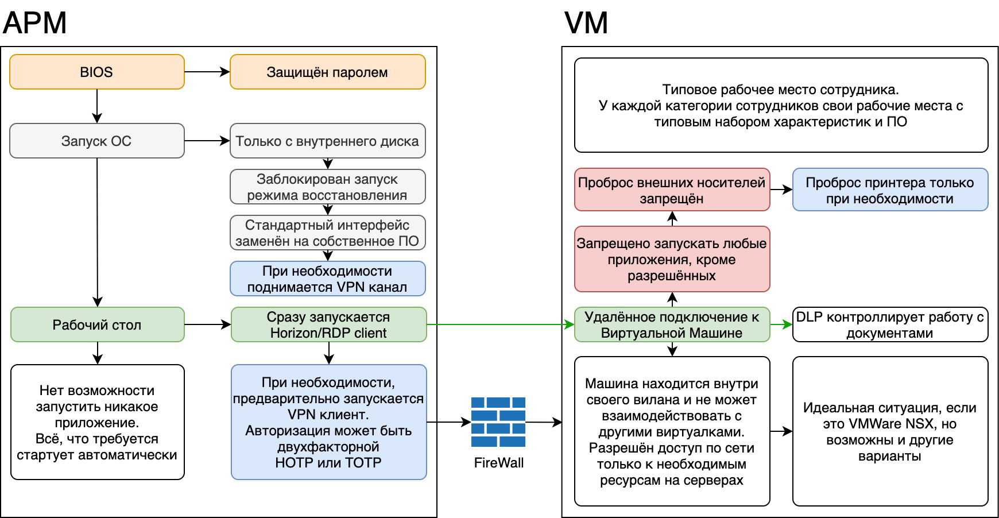

[[_TOC_]]

***
# Введение в модуль

> СМИБ - система менеджмента информационной безопасности

Два основных пути построения СМИБ:
1. построение через инвентаризацию активов, оценку рисков и дальнейшее внедрение организационных и технических мер защиты информации
    - выстраивание зрелой системы менеджмента
    - оптимизация расходов
    - фокусирование на наиболее критичных рисках ИБ
2. через внедрение разнообразных средств защиты информации без проведения предварительной оценки рисков ИБ
    - завышенными затратами на внедрение
    - отсутствием акцента на наиболее серьезных рисках ИБ

# Термины и определения. Погружение в создание СМИБ

Опираться в объяснении принципов функционирования СУИБ мы будем на международные стандарты серии ISO 27000.

## Стандарты из ISO 27000

- [ISO/IEC 27000:2018 – Обзор стандарта, словарь](https://docs.cntd.ru/document/1200179675)
- [ISO/IEC 27001:2022 – СУИБ / СМИБ требования](https://pqm-online.com/assets/files/pubs/translations/std/iso-mek-27001-2022.pdf)
- [ISO/IEC 27002:2022 – СУИБ / СМИБ](https://studylib.net/doc/25916653/iso-iec-27002-2022-information-security--cybersecurity-an...)
- [ISO/IEC 27005:2022 – Управление рисками](https://cdn.standards.iteh.ai/samples/80585/7bca93ac16fd426a9bc717cadc9284d9/ISO-IEC-27005-2022.pdf)
- [ISO/IEC 27017:2015 – Безопасность облаков](https://docs.cntd.ru/document/1200179614)
- [ISO/IEC 27018:2019 – Защита личной информации в облаке](https://docs.cntd.ru/document/573116016)
- [ISO/IEC 27034 – Безопасная разработка ПО](https://docs.cntd.ru/document/1200112883)
- [ISO/IEC 27701:2019 – Защита персональных данных (GDPR)](https://cdn.standards.iteh.ai/samples/71670/8a8bcac5d3614f63bf02ab5d6cc0c07c/ISO-IEC-27701-2019.pdf)

## СМИБ

> включает в себя политику, процедуры, руководящие принципы и связанные с ними ресурсы и мероприятия, коллективно управляемые организацией в целях защиты её информационных активов.
>
> основывается на оценке рисков и уровнях принятия рисков организацией

### Основные принципы внедрения СМИБ

- понимание необходимости использования СМИБ;
- назначение ответственности за обеспечение ИБ;
- обеспечение баланса между обязательствами руководства и потребностями заинтересованных сторон;
- повышение социальной значимости;
- оценивание рисков, чтобы применять необходимые меры обеспечения ИБ для достижения допустимых уровней рисков;
- обеспечение безопасности неотъемлемых элементов информационных сетей и систем;
- активное предупреждение и выявление инцидентов ИБ;
- применение комплексного подхода к менеджменту ИБ;
- регулярное переоценивание уровня ИБ и внесение соответствующих изменений.

### Значение СМИБ защиты информационных активов в организации

- повысить гарантии того, что её информационные активы в достаточной мере и на постоянной основе защищены от угроз ИБ;
- поддерживать структурированную и всестороннюю систему идентификации и оценки угроз ИБ, выбора и применения соответствующих мер обеспечения ИБ, измерения и улучшения их эффективности;
- непрерывно улучшать среду средств управления;
- обеспечивать соответствие нормативным и регулятивным требованиям.

### Шаги по разработке, мониторингу, поддержке и улучшению своей СМИБ

1. определение информационных активов и связанных с ними требований ИБ в соответствии с ISO 27001;
1. оценка рисков ИБ (см. 4.5.3) и их обработка (см. 4.5.4);
1. выбор и внедрение соответствующих мер обеспечения ИБ в отношении неприемлемых рисков (см. 4.5.5);
1. мониторинг, поддержка и повышение эффективности мер обеспечения информационной безопасности, связанных с информационными активами организации (см. 4.5.6).

### Факторы формулирования требований ИБ

- идентифицированные информационные активы и их ценность;
- потребности бизнеса в обработке, обмене и хранении информации;
- юридические, нормативные и договорные требования.

### Оценка риска должна включать в себя

- систематический подход к оценке величины рисков (анализ рисков);
- процесс сравнения оцениваемых рисков с критериями риска (оценка рисков).

***
# Контекст деятельности организации

## Понимание организации и её контекста

Организация должна определить внешние и внутренние аспекты, которые имеют отношение к её цели и влияют на её способность к достижению ожидаемых результатов от системы менеджмента информационной безопасности.

## Понимание потребностей и ожиданий заинтересованных сторон

Организация должна определить:

- заинтересованные стороны, которые имеют отношение к системе менеджмента информационной безопасности
- требования этих заинтересованных сторон, имеющих отношение к информационной безопасности

## Определение области применения СМИБ

- внешние и внутренние аспекты, упомянутые в п.4.1 стандарта;
- требования, указанные в п.4.2 стандарта;
- интерфейсы и зависимости между деятельностью, выполняемой организацией, и деятельностью, которую выполняют другие организации.

Область применения должна быть доступна в виде документированной информации.

## Система менеджмента информационной безопасности

### Пример контекста организации.

#### 1. Анализ Организации.

1. Миссия: делать так, чтобы XXX.
1. Цель: производство.
1. Бизнес: лёгкая промышленность (производство чайников, оптовая торговля, научные исследования и разработки).
1. Назначение: разработка, регистрация, производство, маркетинг и реклама, оптовая продажа чайников.
1. Ценность:
    - изменение жизни людей к лучшему;
    - XXX
1. Структура: функциональная.
1. Диаграмма: установлена в XXX.
1. Стратегия: устанавливается приказом по организации «XXX», определяющим основные направления деятельности Организации на предстоящий период. Актуальная на момент разработки настоящего Стандарта версия: XXX.
1. Составляющей стратегии Организации является XXX.

#### 2. Характеристики Организации
2.1. Определяются характеристики (контекст) Организации, значимые с точки зрения её целей и влияющие на способность СМИБ достигать ожидаемых результатов.

##### 2.2. Внешние характеристики
- *Культурная область*: наличие публично известного бренда и признания (наград);
- *Социальная область*: лояльность профильного научного сообщества Организации;
- *Политическая область*: позиция стратегического инвестиционного проекта XXX;
- *Правовая область*: юрисдикция Российской Федерации;
- *Регулирующая область*: действуют российские и международные требования к производству чайников;
- *Финансовая область*: наличие больших кредитных обязательств;
- *Экономическая область*:
    - наличие на рынке конкурентных продуктов;
    - частые факты недобросовестного поведения компаниями конкурентами, дистрибьюторами, заказчиками продукции на местах;
- *Технологическая область*:
    - наличие собственного поставщика сырья;
    - высокотехнологичный аспект компании и новое дорогостоящее оборудование;
    - зависимость от внешних поставщиков ИТ и телекоммуникационных услуг;
- *Рыночная область*: большие объёмы экспорта продукции за рубеж (XXX);
- *Международный уровень*:
    - наличие договорных обязательств с международными компаниями по контрактному производству;
    - договорных обязательств с иностранными дистрибьюторами по продажам;
    - планируемое расширение географии препаратов, XXX; 
- *Региональный уровень*:
    - наличие XXX представителей во всех регионах страны;
    - работа как через крупных дистрибьюторов в масштабах страны, так и через региональных дистрибьюторов.

##### 2.3. Внутренние характеристики Организации

###### Капитал

- наличие собственного производства;
- здания XXX в собственности;

###### Время

- масштабное строительство новых XXX;
- планируемое значительное увеличение количества сотрудников;

###### Люди

наличие высококвалифицированного научного персонала;

###### Информационные системы

- наличие ERP и CRM-систем;
- смешанная ИТ инфраструктура на базе ОС Windows и Linux;

###### Культура организации

XXX компания;

###### Принятые стандарты, руководства и модели

взятые обязательства по обеспечению высокого уровня качества, охраны труда, экологии;

###### Форма и содержание контрактных отношений

- продажа через дистрибьюторов;
- контрактное производство;

#### 3. Перечень ограничений, влияющих на Организацию.

##### Ресурсные ограничения

- дороговизна средств защиты информации, не позволяющая использовать дорогостоящие средства защиты информации в полном объеме;
- отсутствие XXX;
##### Политические ограничения

- российская юрисдикция требует исполнения законодательства Российской Федерации о персональных данных, коммерческой тайне, критических информационных инфраструктурах и АСУ ТП;
- компьютеризация большинства процессов требует обеспечения их информационной безопасности и юридической значимости электронных операций;

##### Стратегические ограничения

- международное сотрудничество в рамках контрактного производства требует исполнения соглашений о конфиденциальности, обеспечения безопасного обмена, исполнения требований международных стандартов в части ИБ;
- строительство новых производственных и офисных зданий и мощностей требует развития и масштабирования ИТ и ИБ инфраструктуры;
- расширение списка контрагентов, в том числе иностранных, требует унифицированного подхода к обеспечению ИБ при взаимодействии с ними;
- разработка новых чайников требует обеспечения конфиденциальности и непрерывности научной деятельности;

##### Территориальные ограничения

раздельное расположение XXX, XXX и филиалов требует обеспечения бесперебойной и защищенной связи, возможности удалённого контроля и администрирования компонентов ИБ;

##### Структурные ограничения

функциональная структура требует учета специфики работы каждого структурного подразделения для эффективного встраивания процессов ИБ в рабочие процессы;

##### Функциональные ограничения

- круглосуточное производство требует постоянной доступности информационных ресурсов, связанных с АСУ ТП;
- работа XXX представителей в различных часовых поясах требует постоянной доступности эксплуатируемых в их работе информационных сервисов;
- важность близости к конечному покупателю продукции и поддержание репутации бренда требуют высокой доступности и защищённости интернет сайтов Организации;

##### Ограничения, касающиеся персонала

- наличие большого числа подрядных организаций, осуществляющих свою работу удалённо, требует безопасности и контроля процессов удалённого доступа;
- научная деятельность требует высокой квалификации и низкой текучести кадров, необходимо выявление нелояльности персонала на ранних стадиях;
- невозможность обеспечения ИБ исключительно техническими мерами требует программ повышения осведомленности персонала в вопросах ИБ;

##### Ограничения, связанные с методами

наличие внедрённой системы менеджмента качества обуславливает использование её документальной платформы для построения СМИБ;

##### Ограничения культурного свойства

- большое число XXX требует аккуратного и постепенного внедрения мер ИБ, ограничивающих доступные ранее возможности и свободы;
- низкий уровень готовности персонала исполнять требования ИБ в силу отсутствия примера и опыта требует постепенного внедрения мер безопасности.

***
# Разработка стратегии ИБ

> ## Сертификация CISSP (Certified Information Systems Security Professional)
>
> это независимая и объективная мера профессионального опыта и знаний в профессии специалиста по информационной безопасности. Если вы собираетесь построить карьеру в информационной безопасности и имеете, по крайней мере, три года опыта работы в качестве специалиста по информационной безопасности, то получение диплома CISSP должно быть вашей следующей профессиональной целью.

## Внутренний аудит и кибербезопасность

### Внутреннему аудит для руководству

- Независимую и объективную уверенность в управлении, рисках и средствах контроля, относящихся к кибербезопасности
- Это включает оценку общей эффективности действий, выполняемых первой и второй линиями защиты (управление и информационная безопасность соответственно) в области управления рисками кибербезопасности и смягчения их последствий.

### Основные области внутреннего аудита должны включать

- взаимосвязь между кибербезопасностью, конфиденциальностью и операционными рисками
- определение приоритетов ответных мер и контрольных мероприятий
- проведение аудитов для снижения рисков кибербезопасности и конфиденциальности по всей организации.

## Шесть рекомендаций для CISO

### 1. Киберриск и риск конфиденциальности — это корпоративный риск.

Технология теперь внедрена в каждый бизнес.

Включите планирование и экспертные знания в области кибербезопасности во все процессы планирования корпоративных рисков, чтобы понять вероятность, источник и шаги по предотвращению или уменьшению вреда от потенциального нарушения.

### 2. Киберриски и риски конфиденциальности требуют экспертной точки зрения

- экспертов по кибербезопасности присоединиться к правлению
- обсуждения кибербезопасности регулярна в повестки дня на заседаниях правления
- Создайте технологический комитет

### 3. Управление киберрисками и рисками конфиденциальности начинается с политики и осведомлённости

Создайте и продвигайте культуру предотвращения киберинцидентов, уделяя особое внимание защите частной жизни, надлежащей технологической гигиене и осведомлённости о рисках во всей организации.

### 4. Киберриски и риски конфиденциальности имеют юридические последствия

Будьте в курсе любых законодательных изменений и судебных дел, касающихся конфиденциальности, кибербезопасности, руководящих принципов отчетности и последствий для предприятий, которые столкнулись с кибератакой.

### 5. Киберриски и атаки на конфиденциальность постоянно развиваются

Сосредоточьтесь на основных принципах и стремитесь к совершенству в своей программе повышения зрелости в области кибербезопасности, постоянно отслеживая новые методы взлома, инциденты и риски, особенно те, которые происходят внутри вашей организации.

### 6. Кибербезопасность и конфиденциальность.

Знайте, какие киберриски и риски конфиденциальности вы хотите избежать, какие необходимо смягчить и какие вы готовы принять или передать через страхование вместе со стратегией для каждой отрасли или сектора.

## Шесть шагов для обеспечения безопасности бизнеса

- Установите эффективные политики и процедуры: приведите свою организацию в соответствие с определённым перечнем применимых законов, нормативных актов, нормативных требований и договорных обязательств в области безопасности, конфиденциальности и защиты данных. Создайте для организации всеобъемлющий список лучших практик в области кибербезопасности и конфиденциальности.
- Создайте (и протестируйте) план реагирования на инциденты: убедитесь, что все понимают, как идентифицировать нарушение, кому сообщать об известном или предполагаемом нарушении, как локализовать нарушение и что делать после него.
- Проводите оценку угроз зрелости: периодически определяйте и просматривайте свой перечень средств контроля (например, политики, технологии), чтобы определить, подходят ли они и эффективны ли для вашего профиля корпоративных рисков.
- Просмотрите свою технологическую инфраструктуру: оценивайте свою систему защиты, используя пентест, чтобы определить, защитят ли они от взлома.
- Тестирование ваших систем на проникновение: активно ищите уязвимости в ваших технологических системах, чтобы понять эффективность вашего киберконтроля и потенциальный ущерб от взлома.
- Управляйте своими сторонними поставщиками: поймите, как любые независимые организации защищают ваши данные, вашу ответственность и как они будут защищать вас в случае взлома их систем.

## Ключевые вопросы, которые должен задать внутренний аудит

- Кто имеет доступ к наиболее ценной информации организации?
- На какие активы с наибольшей вероятностью будут нацелены преступники?
- Каковы финансовые последствия кибератаки или нарушения конфиденциальности? Например, какие системы окажут наиболее значительное воздействие на организацию, если они будут скомпрометированы или какие данные в случае кражи могут привести к финансовому или конкурентному преимуществу, юридическим последствиям и/или ущербу репутации?
- Готово ли руководство своевременно отреагировать в случае возникновения инцидента в области кибербезопасности?
- Осведомлено ли высшее руководство или правление о рисках, связанных с кибербезопасностью?
- Существуют ли, поняты ли и соблюдаются ли политики и процедуры кибербезопасности?
- Проводило ли руководство количественную оценку рисков?

## Выгоды комплексного подхода к внутреннему аудиту

Ключевыми преимуществами комплексного подхода, сосредоточенного на областях наибольшего риска и наибольшей ценности организации, являются снижение риска, меньшая нагрузка на ограниченные ресурсы организации и чёткое представление о том, как обеспечивается гарантия с помощью различных линий защиты (как внутренних, так и внешних поставщиков гарантий) в рамках организации. При этом служба внутреннего аудита укрепляет свою репутацию надёжного консультанта высшего руководства, предоставляющего анализ и аналитическую информацию, необходимые для минимизации рисков и более эффективного использования ресурсов.

***
# Внутренний аудит предприятия. Введение

## Задачи внутреннего аудита ИБ

- получение объективной оценки регламентов и другой нормативной документации,
- получение объективной оценки текущего состояния инфраструктуры,
- определение потенциальных угроз и слабых мест,
- подготовка рекомендаций по повышению уровня зрелости информационной системы.

## Результат внутреннего аудита ИБ

- оценка реальной ситуации с информационной безопасностью в компании,
- подготовка рекомендаций по улучшению ситуации.

## Документы проверяемые в ходе аудита

## Документы ИБ

- положение о информационной безопасности,
- организационную структуру подразделений ИБ,
- перечень защищаемой информации,
- внутренние регламенты,
- документацию на инфраструктуру.

## Инные документы при их наличии

1. Организационную структуру подразделений ИБ.
1. Политику ИБ.
1. Корпоративную методику по управлению рисками.
1. Перечень защищаемой информации.
1. Положение об архитектурном комитете.
1. Проект нормативного документа «Правила удалённой работы», а также описание алгоритма выбора способа удалённого доступа в зависимости от определенных условий.
1. Инструкцию по использованию паролей.
1. Положение о допустимом использовании информационных ресурсов и сервисов.
1. Правила по соблюдению норм ИБ при использовании информационных ресурсов и сервисов пользователями с привилегированными учётными записями (администраторами).
1. Правила по соблюдению норм ИБ пользователями информационных ресурсов и сервисов.
1. Нормативный документ, определяющий порядок запроса, согласования и предоставления доступа к информации (информационным системам).
1. Нормативный документ, определяющий требования к порядку организации и выполнению резервного копирования информации.
1. Положение по управлению инфраструктурными уязвимостями. Регламент по управлению инфраструктурными уязвимостями.
1. Нормативный документ, определяющий порядок создания новых продуктов.
1. Регламент управления инцидентами ИБ и пример инструкции (playbook) по обработке определённого типа инцидентов ИБ.
1. Документацию, относящуюся к выполнению законодательства по защите персональных данных.
1. Перечень показателей, применяемых для оценки деятельности ИБ, пример отчёта.
1. План(ы) для проведённых аудитов в дочерних ЮЛ за последний год.
1. Пример отчёта о внутреннем аудите.
1. Пример отчёта по результатам анализа исходного кода.
1. Шаблон трудового договора и соглашения о конфиденциальности с работником.
1. Шаблон соглашения о конфиденциальности с третьими лицами. Шаблон договора с организациями, осуществляющими заказную разработку ПО.
1. Перечень требований по ИБ для новых ИС.
1. Политику непрерывности бизнеса.
1. Методику проведения BIA (Business Impact Analysis) и определения показателей восстановления. Стратегию непрерывности и восстановления деятельности.
1. Шаблоны планов обеспечения непрерывности и восстановления деятельности (BCP — Business Continuity Plan, DRP – Disaster Recovery Planning).
1. Проекты положений о Ситуационном центре и Комитете по непрерывности бизнеса.
1. Документ, определяющий категории нештатных ситуаций.

## Аудит ИБ

> это системный процесс получения объективных качественных и количественных оценок о текущем состоянии информационной безопасности автоматизированной системы в соответствии с определёнными критериями и показателями безопасности.

Независимая проверка ИБ осуществлятся специалистами, не работающими в рассматриваемой области деятельности, например службой внутреннего аудита, независимым менеджером или сторонней организацией, специализирующейся на таких проверках.

Специалисты, привлекаемые к таким проверкам, должны обладать соответствующими навыками и опытом.

### Обязательные компоненты аудита ИБ

- регламент проведения внутреннего аудита
- реестр наличия нужных документов
- инструментальный анализ
- проверка на уязвимости
- анализ угроз
- выработка рекомендаций

***

# Проведение внутреннего аудита предприятия. Сбор информации. Интервью

## Действия по сбору информации в рамках аудита ИБ

1. Составить список подразделений.
1. Составить список вопросов каждому подразделению.
1. Провести интервью с представителями каждого подразделения, используя для основы список вопросов.
1. Зафиксировать всю полученную информацию.

## Вопросы к подразделениям в рамках аудита ИБ

### Подразделению, отвечающему за мониторинг событий и инцидентов ИБ

- источники получения информации об инцидентах ИБ;
- классификация инцидентов ИБ;
- порядок обработки инцидентов ИБ, порядок взаимодействия с другими структурными подразделениями и сторонними организациями;
- документирование результатов расследования, планирования среднесрочных и долгосрочных мероприятий по результатам анализа причин инцидентов ИБ;
- инструкции по обработке типовых инцидентов ИБ.

### Пдразделению, отвечающему за разработку ПО

- Структурное(ые) подразделение(ия) ИТ, к функциям которого(ых) отнесена(ы) разработка, тестирование, управление релизами прикладного ПО ИС, автоматизирующей критичный для бизнеса процесс;
- Управление требованиями при разработке ПО.
- Разработка ПО: организация репозитория, контроль версий ПО, контроль доступа, резервное копирование.
- Организация сред разработки и тестовых сред: наборы данных, порядок переноса кода между средами.
- Организация тестирования и приемки ПО, учёта дефектов.
- Управление релизами.
- Управление жизненным циклом срочных исправлений дефектов ПО, в том числе исправлений дефектов ПО, касающихся безопасности.

### Подразделению, отвечающему за физическую и противопожарную защиту

- пропускной режим и система контроля и управления доступом (СКУД), в том числе доступ посетителей и подрядчиков, выдача пропусков;
- контроль доступа в помещения ограниченного доступа: серверные, кроссовые, архивы;
- охранная сигнализация, пульт охраны;
- видеонаблюдение;
- противопожарная безопасность;
- контроль вноса и выноса оборудования и материальных ценностей.

### Вопросы по аудиту локальной сети

#### Топология сети

- описание серверов и всех предоставляемых на них сервисов,
- описание шлюзов и правил маршрутизации пакетов,
- список открытых портов с описанием,
- описание управляющей сети.

#### Виртуальные сети (Vlans)

- описание демилитаризованных зон (DMZ), и виртуальных сетей (VLANs),
- принципы разделения на сети и предоставляемые там сервисы,
- правила маршрутизации между вланами,
- правила доступа в сеть интернет,
- правила доступа из сети интернет.

#### Wi-Fi

- количество беспроводных точек;
- способы защиты;
- тип шифрования;
- DMZ (англ. Demilitarized Zone, «демилитаризованная зона») — сегмент сети, содержащий общедоступные сервисы и отделяющий их от частных;
- возможность доступа в локальную сеть;
- гостевой Wi-Fi для доступа в интернет

#### Сетевое оборудование

- где установлено;
- кто имеет физический доступ;
- кто имеет удалённый доступ;
- кто конфигурирует;
- принципы управления;
- регламент обновления прошивок;
- наличие резервных копий конфигураций;
- кабельный журнал;
- система обнаружения нового оборудования;
- система защиты (блокировка не подключённых портов, port security, другое);
- СКС — скрытая проводка, расстояние до силовых кабелей

## Аудит серверной инфраструктуры

### Физика

- регламент выдачи доступа к оборудованию;
- регламент предотвращения несанкционированного доступа;
- регламент обновления прошивок/операционной системы;
- регламент обслуживания серверов;
- мониторинг;
- параметры мониторинга — какая именно информация собирается.

### Виртуализация

- регламент выдачи доступа,
- регламент обновления ПО,
- документация на систему,
- наличие антивируса,
- правила выделения VLAN,
- возможность смены IP-адреса внутри виртуальной машины,
- права доступа к виртуальной машине.

### Автоматизированное рабочее место (АРМ) пользователей

- загрузка с внешних носителей,
- получение прав локального администратора,
- использование пиратского ПО,
- аудит действий пользователей,
- контроль за установкой ПО,
- регулярная проверка на уязвимости,
- регулярная проверка на вирусы,
- наличие антивируса,
- развёрнуты ли средства мониторинга,
- настроен ли режим белых списков,
- есть ли права администратора у пользователей.

#### Схема примера документации по аудиту АРМ

### Система контроля и мониторинга

- система автоматического сканирования сетевых устройств/сервисов на уязвимости (Nessus, MaxPatrol, OpenVAS и др.);
- система мониторинга сетевого оборудования (Zabbix, Nagios и др.);
- SIEM — система сбора и корреляции событий безопасности;
- NGFW/IDS/IPS — решения по фильтрации вредоносного трафика;
- DLP — система по защите от утечек информации;
- какую информацию собирает система;
- кто имеет доступ к системе;
- кто конфигурирует систему;
- кто определяет правила конфигурирования.

### Общие вопросы к системам контроля и мониторинга

- какая информация собирается;
- что является инцидентом;
- каковы параметры инцидента;
- кто их определяет;
- каким образом происходит оповещение об инциденте (Email, Telegram, звонок, sms);
- кому приходит уведомление об инциденте;
- как происходит эскалация инцидента.

### Политики безопасности

- список групповых политик с описанием;
- список групп пользователей с правами доступа;
- правила выхода в интернет;
- правила доступа к сервисам из локальной сети;
- правила доступа к сервисам из сети интернет;
- правила доступа к внутренней сети из сети интернет (использование VPN или удалённого доступа);
- регламент предоставления доступа к сервисам;
- регламент предоставления доступа к оборудованию;
- регламент предоставления доступа к портам на коммутаторе.

### Работа с пользователями

- структура Active Directory (служба каталогов);
- структура OU (Organizational Unit — субконтейнер Active Directory, в который можно помещать пользователей,
- группы, компьютеры и другие объекты AD);
- структура групп доступа;
- порядок создания/удаления/изменения учетных записей и прав доступа;
- управление технологическими (сервисными) учётными записями;
- состав групп доменных и энтерпрайз-администраторов;
- основные групповые политики (включая парольную политику);
- регламент действий при увольнении сотрудника

### Система резервного копирования

- как регулярно делается,
- хранится ли на отдельном оборудовании,
- хранится ли в отдельном помещении,
- проверка целостности,
- защита от доступа пользователей,
- отказоустойчивое хранилище,
- глубина хранения.

## План работ по проведению внутреннего аудита

### Определить

- сроки проведения аудита,
- область действия аудита,
- критерии аудита,
- методы проведения аудита.

### Изучить

- документацию,
- регламенты.

### Провести

- интервью с сотрудниками,
- осмотр помещений и рабочих мест,
- инструментальный анализ.

### Составить отчёт

Составить отчет

***

# Проведение внутреннего аудита предприятия. Анализ собранной информации

## Основные принципы анализа

### Принцип 1. Всегда уточняйте детали

Например, ориентируйтесь на регламент получения доступа, узнавайте, кто настраивает, обновляет или выдаёт доступ, когда произошло последнее обновление и т.д.

### Принцип 2. Систематизируйте всю информацию

Выберите удобный для себя способ записи информации и конспектируйте её.

### Принцип 3. Делайте наброски схем, даже если пока нет полной информации

### Принцип 4. Оценивайте поведение специалистов во время интервью

При сборе информации оцените, насколько специалисты готовы идти на сотрудничество. Если вы видите, что они нервничают, не идут на диалог и не предоставляют информацию — это повод начать внутреннее расследование.

#### Возможные причины подозрительного поведения

- специалист не уверен в собственных силах,
- боится за своё место,
- точно знает, что есть недостатки и нарушения,
- сам не знает, что и как устроено.

## При анализе слабых мест в системе защиты учитывайте

- количество сотрудников компании,
- количество стационарных компьютеров,
- количество портативных компьютеров (ноутбуков),
- количество используемых серверов,
- количество офисов у компании,
- разделяет ли компания офисное пространство с другими организациями,
- есть ли ответственный за информационную безопасность компании,
- есть ли система управления рисками.

## Укажите основные риски для компании

Проанализируйте, в какой мере повлияет нарушение безопасности систем на способность компании вести дела.

## При проверке инфраструктуры ответьте на следующие вопросы

- Существует ли схема сети компании?
- Развёрнуты ли элементы управления физической безопасностью?
- Существует ли возможность беспроводного подключения к внутренней сети компании?
- Какой тип безопасности используется для беспроводной сети?
- Какие веб-службы предоставляются сайтом компании?
- Используются ли в компании идентичные компоненты серверной инфраструктуры для поддержки как внешних, так и внутренних сервисов?
- Используется ли виртуальная инфраструктура?
- Существует ли документация?
- Какая система виртуализации используется?
- Какое аппаратное обеспечение используется для виртуализации?
- Где физически размещено оборудование: свой ЦОД, своя серверная, ЦОД сторонней компании?
- Кто выполняет конфигурирование системы виртуализации: штатные специалисты компании, сторонние специалисты?
- Какие службы развернуты в виртуальной инфраструктуре?
- Используется ли сегментация сети?
- Существует ли план сегментов и управления выделением адресов в сегментах?
- Внешние клиенты подключаются к отдельному сегменту сети?
- Группируются ли компьютеры/серверы в сегменты сети?
- Исходя из каких признаков компьютеры объединяются в сегменты: схожие роли, предоставление только необходимых пользователям услуг, физическое расположение?
- Используется ли в компании нейтральная зона сети — демилитаризованная зона (DMZ)?
- Есть ли в компании межсетевые экраны (firewall) для защиты серверов?
- Установлено ли на рабочих станциях компании программное обеспечение ранних версий (которое уже не поддерживается разработчиком или поставщиком)?
- Какое программное обеспечение используется?
- Установлено ли на серверах компании программное обеспечение ранних версий (которое уже не поддерживается разработчиком или поставщиком)?
- Какое программное обеспечение используется?
- Используются ли в компании на границах сети межсетевые экраны или иные элементы управления доступом на сетевом уровне защиты?
- Какое оборудование или программное обеспечение используется?

## Cлабые места с точки зрения системы мониторинга и защиты: Вопросы

- Используется ли система мониторинга работоспособности критических сервисов?
- Какая система мониторинга используется?
- Используется ли система обнаружения вторжений (IDS)?
- Какая система используется?
- Кто выполняет конфигурирование системы: штатные специалисты компании, сторонние специалисты?
- Используется ли система предотвращения вторжений (IPS)?
- Какая система используется?
- Кто выполняет конфигурирование системы: штатные специалисты компании, сторонние специалисты?
- Реализованы ли в среде антивирусные решения (почта, шлюзы доступа, серверы, рабочие станции)?
- Какие решения используются?
- Имеют ли поставщики/партнёры доступ к внутренней инфраструктуре?
- Разрешено ли сотрудникам компании подключаться к внутренней корпоративной сети из недоверенных сред?
- Доступны ли основные бизнес-приложения компании через интернет-соединение?
- Зависит ли работа клиентов от доступа к ресурсам корпоративной сети компании?
- Используется ли технология VPN для обеспечения безопасного подключения удалённых пользователей к корпоративным ресурсам?
- Используется ли многофакторная проверка подлинности учётных данных?
- Для административного и пользовательского доступа используются разные учётные записи?
- Хранит ли компания конфиденциальные данные клиентов?
- Хранит ли компания персональные данные клиентов?
- Хранит ли компания конфиденциальные данные сотрудников?
- Хранит ли компания персональные данные сотрудников?
- Ограничивает ли компания доступ пользователей к данным в зависимости от их ролей в компании?
- Существует ли система резервного копирования?
- Каким образом осуществляется резервное копирование?
- На какие носители осуществляется резервное копирование?
- Где физически размещена система резервного копирования?
- Кто имеет доступ к резервным копиям?
- Разрешена ли в компании обработка конфиденциальных данных за пределами корпоративной сети?
- Разрешено ли разработчикам компании вести разработку или тестирование систем удалённо, или в каких-либо незащищенных местах?
- Разрешено ли сотрудникам компании загружать конфиденциальные или корпоративные данные на свои рабочие станции?
- Разрешено ли сотрудникам компании развёртывать личные службы во внутренней корпоративной сети?
- Ограничивается ли компания в выборе технологий только теми, которые изучены существующим IT-персоналом?
- Разрешено ли в компания использовать новые службы или приложения до выполнения оценки их безопасности?

## Вопросов о существовании регламентов

- Регламент проведения резервного копирования критических данных;
- Регламент проверки целостности резервных копий;
- Регламент ведения журналов действий административных учётных записей;
- Регламент просмотра журналов действий администраторов;
- Регламент установки обновлений и исправлений программного обеспечения;
- Регламент установки обновлений и исправлений аппаратного обеспечения;
- Регламент формальных процедур реагирования на нарушения безопасности;
- Регламент контроля за соблюдением политики обновления учётных данных;
- Регламент контроля за неактивными учётными записями;
- Регламент изменения учётных данных привилегированных учётных записей;
- Регламент действий с учётной записью после увольнения сотрудников
- Регламент изменения учётных данных привилегированных пользователей после увольнения сотрудников, имевших к ним доступ;
- Регламент предоставления доступа к ресурсам и данным;
- Регламент доступа к персональным данным.

## Вектора атаки

Кроме рассмотренных ранее элементов инфраструктуры, мы рекомендуем обратить внимание на следующие моменты:

1. Всё, что предоставляет сервисы в сеть интернет.
1. Удалённый доступ из сети интернет.
1. Всё, что касается возможности выхода в интернет.
1. Все сервисы, отвечающие за обработку критически важной информации.
1. Все сервисы, пользователи и устройства имеющие доступ в несколько подсетей.
1. Беспроводные сети.

