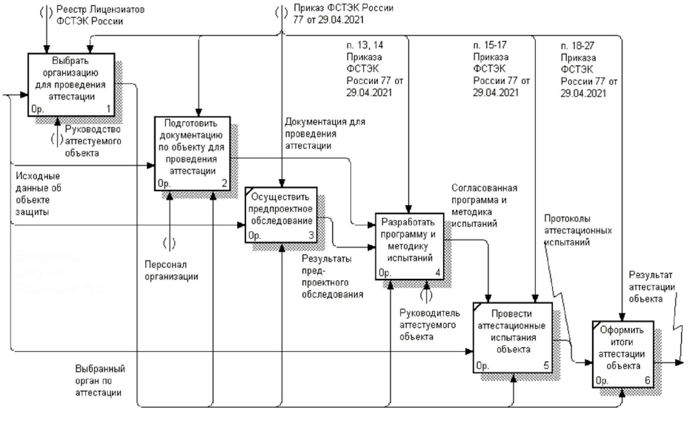

# 1. Безопасность ПД: обзор законодательства РФ

## Определения из 149-ФЗ

**Защита информации, доступ к которой ограничен федеральным законодательством,  является обязательной.**

### Обладатель информации

лицо, самостоятельно создавшее информацию либо получившее на основании закона или договора право разрешать или ограничивать доступ к информации, определяемой по каким-либо признакам.

### Доступ к информации

возможность получения информации и ее использования.

### Конфиденциальность информации

обязательное для выполнения лицом, получившим доступ к определенной информации, требование не передавать такую информацию третьим лицам без согласия ее обладателя.

### Оператор информационной системы

гражданин или юридическое лицо, осуществляющие деятельность по эксплуатации информационной системы, в том числе по обработке информации, содержащейся в ее базах данных.

**Защита информации, доступ к которой ограничен федеральным законодательством,  является обязательной.**

### Биометрические данные

> к биометрическим данным относятся сведения, которые характеризуют физиологические и биологические особенности человека, на основании которых можно установить его личность (например, отпечатки пальцев)

- С 1 сентября 2022 г. вступил в силу запрет оператора отказывать гражданам в оказании услуг, в случае если они не желают предоставлять биометрию и это не является обязательным требованием.

## 152-ФЗ

### Определения

#### Персональные данные (ПДн)

любая информация, относящаяся прямо или косвенно к определенному или определяемому физическому лицу (субъекту ПДн).

#### ПД, разрешенные субъектом ПД для распространения

ПД, доступ неограниченного круга лиц к которым предоставлен субъектом ПД путем дачи согласия на обработку ПД, разрешенных субъектом ПД для распространения в порядке, предусмотренном настоящим Федеральным законом;

#### Оператор

государственный/муниципальный орган, юридическое/физическое лицо, самостоятельно или совместно с другими лицами организующие/осуществляющие обработку ПДн, а также определяющие цели обработки ПДн, состав ПДн, подлежащих обработке, действия (операции), совершаемые с персональными данными.

#### Обезличивание ПДн

действия, в результате которых становится невозможным без использования дополнительной информации определить принадлежность ПДн конкретному субъекту.

#### Информационная система ПДн (ИСПДн)

совокупность содержащихся в базах данных ПДн и обеспечивающих их обработку информационных технологий и технических средств.

#### Обработка ПД

любое действие (операция) или совокупность действий (операций), совершаемых с использованием средств автоматизации или без использования таких средств с персональными данными, включая сбор, запись, систематизацию, накопление, хранение, уточнение (обновление, изменение), извлечение, использование, передачу (распространение, предоставление, доступ), обезличивание, блокирование, удаление, уничтожение ПД.

#### Предоставление ПД

действия, направленные на раскрытие ПД определенному лицу или определенному кругу лиц.

### Статья 1. Сфера действия настоящего Федерального закона

Законом регулируются отношения, связанные с обработкой ПД, осуществляемой

- федеральными органами государственной власти
- органами государственной власти субъектов Российской Федерации
- иными государственными органами (далее - государственные органы)
- органами местного самоуправления
- иными муниципальными органами (далее - муниципальные органы)
- юридическими лицами
- физическими лицами

> то есть всеми, кто обрабатывает ПДн 

с использованием

- средств автоматизации
    - с заданным алгоритмом поиск ПД
    - сбора данных
    - досутпа данных
    - обработки данных
- информационно-телекоммуникационных сетях
- или без перечисленных

#### 1.1. Применяются к обработке ПД граждан Российской Федерации

- иностранными юридическими лицами
- иностранными физическими лицами

на основе договра и соглашения на обработку ПД

### Не распространяется на отношения

1. обработке ПД физическими лицами исключительно для личных и семейных нужд, если при этом не нарушаются права субъектов ПД;
1. организации хранения, комплектования, учета и использования содержащих персональные данные документов Архивного фонда Российской Федерации и других архивных документов в соответствии с законодательством об архивном деле в Российской Федерации;
1. обработке ПД, отнесенных к государственной тайне.

### Статья 4. На чем основано законодательство Российской Федерации в области ПД

1. Законодательство РФ в области ПДн основано на конституции РФ и международных договорах и состоит из ФЗ «О ПД» и других федеральных законов.
2. На основании федеральных законов государственные органы, Банк России, органы местного самоуправления в пределах своих полномочий могут принимать нормативные правовые акты по отдельным вопросам, касающимся обработки ПД.
3. При обработке ПД без использования средств автоматизации используется ПП РФ № 687 от 15.09.2008 с учетом положений ФЗ № 152.
4. Если международным договором установлены иные правила, чем в ФЗ, применяются правила международного договора.
5. Решения межгосударственных органов, принятые на основе международных договоров, если они противоречат положениям Конституции РФ, не подлежат выполнению на территории России

## Изменения в законодательстве о ПД с 1 сентября 2022 года

### 30.12.2020 № 519-ФЗ определил три важных принципа для согласия на обработку ПД:

- Молчание или бездействие **не** считаются согласием на обработку ПД.  
- Согласие на обработку ПД, разрешенных для распространения, оформляется отдельно.
- В согласии на обработку ПД, разрешенных для распространения, можно установить запреты на передачу данных неограниченному кругу лиц.

### Введение принципа экстерриториальности

Закон будет применяться к иностранных юридическим и физическим лицам, если обработка ПД (далее — ПД) осуществляется на основании договора с гражданином РФ или с его согласия.

### Сокращение сроков реагирования оператора на запросы

- предоставить субъекту ПД ```сведения, касающиеся обработки его ПД в течение 10 рабочих дней```. Может быть продленно на ```5 дней рабочих дней```, если оператор направит в адрес субъекта мотивированное уведомление, в котором укажет причины отсрочки.
- прекратить обработку ПД ```в течение 10 дней```
- по запросу Роскомнадзора оператор ПД должен предоставить необходимую информацию ```в течение 10 рабочих дней```. При мотивированном уведомлении такой ответ ```можно продлить на 5 дней```

### Обязанность сообщать об утечке ПД

- уведомить о случившемся Роскомнадзор ```в течение 24 часов```;
- провести внутреннее расследование и уведомить службу о его результатах ```в течение 72 часов```;
- представить сведения о лицах, действия которых стали причиной инцидента (при наличии).

### Усиление ответственности обработчика ПД

- Ответственность будет усилена по отношению к ```иностранным обработчикам```. Обработчик ПД
- обработчик ответственен не только перед оператором, который поручил ему обработку, но и перед субъектом ПД.

### Изменение требований к поручениям

#### обработчик данных обязан

- соблюдать принципы
- правила обработки
- конфиденциальность данных
- принимать необходимые меры
- направленные на обеспечение выполнения обязанностей
- предусмотренных законом.

#### оператор должен определить

- перечень ПД
- перечень действий (операций) с данными, которые будут совершаться обработчиком
- обязанность обработчика по соблюдению конфиденциальности
- обязанность по запросу оператора в течение срока действия поручения предоставлять документы и информацию, подтверждающие принятие мер и соблюдение обязанности по обеспечению безопасности ПД при их обработке.
- обязанность обработчика уведомлять оператора об утечках ПД

### Новое в уведомлении Роскомнадзора об обработке ПД

Прежде чем приступить к обработке ПД, оператор должен уведомить Роскомнадзор о своем намерении

#### Анкета

[https://pd.rkn.gov.ru/operators-registry/notification/form/](https://pd.rkn.gov.ru/operators-registry/notification/form/)

#### Когда уведомление Роскомнадзора не требуется

- ПД, включенные в государственные информационные системы ПД, созданные в целях защиты безопасности государства и общественного порядка;
- ситуацию, когда оператор осуществляет деятельность по обработке данных исключительно без использования средств автоматизации.

### Новые требования к согласию на обработку ПД

#### Хоррактер соглашения на обрабодку ПД должен быть

- конкретным
- информированным
- сознательным
- предметным
- однозначным

##### Предметное

означает, что прописанные в согласии действия с ПДн должны полностью соответствовать целям обработки

##### Однозначное

предполагает, что человек добровольно дает согласие на обработку данных, подтвердив это конкретными действиями

### Изменение требований к политике обработки ПД

#### Оператор должен в политике обработки ПД для каждой цели обработки указывать

- категории и перечень обрабатываемых ПД;
- категории субъектов, данные которых обрабатываются;
- способы, сроки их обработки и хранения;
- порядок уничтожения ПД при достижении целей их обработки.

#### Правила публикации политики ПД

Она должна быть не просто размещена на сайте, а опубликована на страницах сайта, где осуществляется сбор данных.

## Изменения в законодательстве о ПД с 1 марта 2023 года

### Уведомление для Роскомнадзора

уведомлять РКН об изменениях надо ```до 15 числа следующего месяца```

Оператор оформляет одно уведомление по всем изменениям, которые произошли за месяц. Информировать о каждой корректировке отдельно больше не нужно.

### Трансграничная передача данных

Теперь РКН будет рассматривать уведомления операторов и разрешать, ограничивать или запрещать трансграничную передачу ПД в другие страны (ст. 12 №152-ФЗ). Пока не пройдет 10 рабочих дней после отправки уведомления в Роскомнадзор, передавать ПД в страны, которые не обеспечивают их защиту, нельзя.

### Ведение реестра инцидентов

1 марта 2023 года — появление реестра учета инцидентов в области ПД. Этот реестр будет вести Роскомнадзор.

- на основании уведомлений Роскомнадзор будет вносить запись в реестр учета инцидентов в области ПД
- к инцидентам в области ПД относят неправомерную или случайную передачу информации, которая повлекла нарушение прав гражданина
- первичные и дополнительные уведомления направляют в РКН в бумажной или электронной форме

#### Первичное уведомление

Указывают информацию

- об инциденте
    - дата и время его выявления
    - характеристика и количество данных в скомпрометированной базе;
- о причинах, которые привели к нарушению
- о предварительной оценке вреда
- о принятых мерах по устранению последствий
- о лице, ответственном за взаимодействие с РКН.

#### Дополнительное уведомление

Указывают

- результаты внутреннего расследования и определяют виновных
- информация о виновных
    - ФИО физического лица или ИП, название юрлица
    - IP-адрес устройства
    - предполагаемое местонахождение виновных лиц и их устройств
- другую информацию по расследованию

Если оператор не предоставит дополнительное уведомление, РКН сам потребует результаты внутреннего расследования инцидента. Ответ на это требование нужно отправить ```в течение 1 рабочего дня```. 

Если Роскомнадзор самостоятельно выявит утечку базы персданных и принадлежность базы к конкретному оператору, организация получит требование о необходимости предоставить первичное и дополнительное уведомления. Их надо отправить в обычные сроки: первичное — ```в течение 24 часов```, дополнительное — ```в течение 72 часов```.

### Оценка вреда при обработке ПДн

Приказ Роскомнадзора №178 от 27.10.2022 [http://publication.pravo.gov.ru/document/0001202211290004](http://publication.pravo.gov.ru/document/0001202211290004)

#### три степени качества обрабатываемых данных

Если субъект может получить ущерб разной степени, установите самую высокую из возможных степеней.  Степень угроз оценивает комиссия, которую формирует оператор, или сотрудник, который отвечает за обработку персональных данных. Результат оценки и присвоенную степень вреда показывают в акте.

##### высокая

когда оператор обрабатывает сведения о несовершеннолетних или биометрические данные;

##### средняя

когда оператор предлагает товары, работы, услуги, напрямую контактируя с потребителем и используя базы другого лица;

##### низкая

когда оператор назначает ответственным за работу с персональными данными внештатного специалиста.  


### Уничтожение персональных данных

Если оператор обрабатывает информацию без использования средств автоматизации, документальным подтверждением станет акт об уничтожении персональных данных

C использованием средств автоматизации, подтверждением будут

- акт об уничтожении персданных
- выгрузка из журнала регистрации событий в информационной системе персональных данных

#### Информация об утечках и компьютерных инцидентах

будет попадать не только в Роскомнадзор, но и в ФСБ. Эти сведения отражаются в информационном ресурсе ГосСОПКА. Информирование ФСБ проводится через НКЦКИ — Национальный координационный центр по компьютерным инцидентам (Приказ ФСБ №77 от 13.02.2023). Обычные операторы отправляют уведомления в РКН, а операторы, взаимодействующие с НКЦКИ, подают сведения именно в координационный центр — в течение 24 часов после обнаружения утечки (пп. 4.8 п. 4 Порядка из Приказа ФСБ №366 от 24.07.2018).

#### Ограничили доступ к персональным данным владельцев недвижимости из выписки ЕГРН.

Если выписку из госреестра недвижимости заказывает постороннее лицо, в ней не будет ФИО и даты рождения правообладателя. Но владелец недвижимости может дать разрешение раскрывать такие сведения. Для этого нужно подать в Росреестр специальное заявление. Супругам правообладателей, арендаторам и арендодателям сведения о ФИО и дате рождения тоже предоставят по запросу.

#### Биометрические персональные данные из единой системы — чтобы контролировать проход на территорию

Разрешение действует и для предприятий торговли и сферы услуг, операторов связи, вузов и других организаций. Но работать с такими данными можно только в определенных целях.

#### Ведомство публикует Перечень мессенджеров, принадлежащих иностранным юридическим лицам и гражданам.

Функционал указанных приложений подпадает под запреты ч. 8 ст. 10 Федерального закона «Об информации, информационных технологиях и о защите информации». Критерии, согласно которым мессенджеры включены в Перечень, указаны в [приказе Роскомнадзора №22 от 21 февраля 2023 года](http://publication.pravo.gov.ru/document/0001202304070022).

## Поручение обработки ПДн

Изменения вводят новое понятие — лицо, осуществляющее обработку ПДн по поручению Оператора. Напомним, что аналогичная сущность представлена в европейских нормах (GDPR) в виде процессора или обработчика.

Лицо, осуществляющее обработку ПДн по поручению оператора, несет ответственность перед Оператором. Ответственность перед субъектом ПДн за действия лица, осуществляющего обработку ПДн по поручению оператора, несет сам Оператор.

### Поручение обработки ПДн должно содержать

- перечень ПДн;
- перечень действий (операций) с ПДн, которые будут совершаться лицом, осуществляющим обработку ПДн по поручению оператора;
- цели обработки ПДн;
- требования к защите обрабатываемых ПДн;
- требования об уведомлении Оператора о неправомерной обработке ПДн;
- обязанности лица, осуществляющего обработку ПДн по поручению оператора.

### Обязанности поручителя

- соблюдение конфиденциальности ПДн;
- обеспечение записи, систематизации, накопления, хранения, уточнения (обновления, изменения), извлечения ПДн граждан РФ в базах данных, находящихся на территории РФ;
- соблюдение требований Оператора, в том числе предоставление информации, подтверждающей принятие и соблюдение мер по защите ПДн;
- обеспечение безопасности ПДн при их обработке.

# 2. Безопасность персональных данных: инвентаризация процессов обработки персональных данных и определение требований к обработке

> **Инвентаризация информационных ресурсов**
>
> это выявление присутствия и осуществления обработки персональных  данных  во  всех эксплуатируемых организацией информационных системах и традиционных хранилищах данных.

## Основная цель инвентаризации

Сбор и анализ информации о местах хранения и обработки персональных данных, используемых информационных технологиях, допущенных к обработке персональных данных сотрудников.

## Схема проведения инвентаризации ИСПДн


## Инвентаризация персональных данных. Основные понятия. Состав комиссии

- Руководитель и сотрудники департамента (отдела), отвечающего за обеспечение информационной безопасности.
- Руководитель или сотрудники департамента (отдела) информационных технологий.
- Руководитель или сотрудники департаментов (отделов), где предположительно может вестись обработка персональных данных.
- Возглавляет комиссию руководитель департамента (отдела) информационной безопасности или, в случае отсутствия такой должности, руководитель департамента (отдела) информационных технологий.
- В приказе по организации необходимо определить полномочия комиссии.

## Обоснование необходимости обработки персональных данных

Как правило, обработка персональных данных сотрудников в любой организации ведётся в таких подразделениях как бухгалтерия и отдел кадров.

Персональные данные лиц, не являющихся сотрудниками организаций, могут обрабатываться в отделах, чья деятельность требует их обработки. 

Примеры обоснований:

- в коммерческих торговых организациях персональные данные клиентов могут обрабатываться с целью формирования скидок постоянным покупателям;
- в учреждениях здравоохранения персональные данные обрабатываются для ведения историй болезни пациентов;
- в учреждениях образования персональные данные учащихся обрабатываются для учета их успеваемости, оплаты обучения и т.п.;
- в кадровых (рекрутинговых) агентствах персональные данные обрабатываются с целью предоставления услуг по поиску работы;
- в земельном кадастре персональные данные граждан обрабатываются с целью ведения реестра собственников земельных участков. В этой организации персональные данные могут обрабатываться не только с применением средств автоматизации, но и на твердом носителе.

## Определение перечня защищаемых ресурсов

Для каждого выявленного массива персональных данных (ИСПДн) определяется полный перечень требуемых для обработки данных.

### Обработка персональных данных без применения информационных технологий:

- использовать Постановление Правительства Российской Федерации от 15.09.2008 г. № 687 «Об утверждении положения об особенностях обработки персональных данных, осуществляемой без использования средств автоматизации»;
- определить места и режим хранения и обработки документов. Должны быть составлены планы помещений, где ведется обработка персональных данных;
- указать места хранения документов с персональными данными;
- определить лиц, имеющих доступ к обрабатываемым персональным данным (нужен приказ);
- указать, к обработке каких сведений допущен сотрудник.
- указанные действия следует повторить для каждого массива обрабатываемой информации (информационной системы персональных данных).
- описать принимаемые на данный момент меры инженерно-технического характера по защите от несанкционированного физического доступа посторонних лиц и обеспечения противопожарной безопасности.

### Обработка персональных данных с применением информационных технологий

#### Доступ и ПО

- установить департаменты, сотрудников, имеющих доступ к обработке персональных данных (нужен приказ по организации);
- описать права доступа пользователей к обрабатываемой информации для разных категорий пользователей (если таковые настроены и имеются);
- в дальнейшем определить используемые для обработки персональных данных программные средства (применяемые информационные технологии).

#### Хранение и доставлка

- Уточнить перечень носителей информации с персональными данными и их места нахождения. Учитываются как стационарные носители (диски SSD и HDD), так и съемные накопители данных.
- Описать принимаемые на данный момент меры инженерно-технического характера по защите от несанкционированного физического доступа посторонних лиц и обеспечения противопожарной безопасности.
- Разработать схемы сетей с ИСПДн.

#### Модели ИС

- логическую модель информационной системы, обращая внимание на архитектуру информационной системы (является ли она локальной или распределённой).
- физическую модель информационной системы, обращая внимание на прохождение каналов связи в организации (является ли она локальной или распределённой).

Если компьютеров много и обработка персональных данных ведется целыми отделами, то можно одним объектом изобразить весь отдел.

##### Определение характера защищаемой сети

> **Распределённая сеть**
>
> идет передача данных по неконтролируемому каналу связи. Использование беспроводных сетей в большинстве случаев приведёт к тому, что сеть будет распределённой. Чтобы информативный сигнал не выходил за границу контролируемой зоны, нужно занимать достаточно много пространства.

> **Локальная сеть**
>
> передача данных идет только по контролируемой территории.

При наличии распределенной информационной системы, где ведется передача данных по неконтролируемому каналу связи, потребуется применение средств криптографической защиты информации.

### ПО для составления отчетов (примеры)

- Сканер-ВС
- Сканер-ВС Инспектор
- X-Spider
- Max Patrol
- Secret Net Studio
- Dallas Lock

## Меры организации защиты информации от несанкционированного физического проникновения и пожара

Меры по обеспечению безопасности персональных данных от несанкционированного физического доступа посторонних лиц и обеспечение противопожарной безопасности могут быть выполнены с учётом методических рекомендаций Росгвардии [Р 063-2017](https://meganorm.ru/Data2/1/4293733/4293733131.pdf) и [Р 078-2019](https://pravo.ppt.ru/metodicheskiye-rekomendatsii/218691) для класса А2

Требования обязательны, если защита объекта обеспечивается силами подразделений Росгвардии. Если охрану осуществляют ЧОО, то требования носят рекомендательный характер.

### Требования

- в методических рекомендациях Р 063-2017 в приложении 2 указаны требования к каналу передачи информации на ПЦО с объектов (квартир, МХИГ) охраняемых или передаваемых под централизованную охрану подразделениям вневедомственной охраны;
- минимально необходимый состав технических средств охраны (ТСО) указан в приложении 3 к методическим рекомендациям Р 063-2017;
- рекомендации к выбору охранных датчиков по их принципу действия указаны в приложении 6 к методическим рекомендациям Р 063-2017;
- рекомендации к строительным конструкциям зданий указаны в приложении 7 к методическим рекомендациям Р 063-2017;
- особенности построения систем охранной и пожарной сигнализации рассмотрены в методических рекомендациях Р 078-2019.

Для оборудования серверных помещений может быть использован [ГОСТ Р 59316-2021 Национальный Стандарт Российской Федерации. Слаботочные системы. Кабельные системы. Телекоммуникационные пространства и помещения. Аппаратная комната. Общие требования (https://docs.cntd.ru/document/1200180417)](https://docs.cntd.ru/document/1200180417).

## Требования к организации защиты информации, обрабатываемой средствами вычислительной техники

### Защита ИСПДн: Приказа ФСТЭК России от 18 февраля 2013 г. № 21

Для обеспечения защиты ИСПДн следует использовать группы базовых мер защиты от НСД из [Приказа ФСТЭК России от 18 февраля 2013 г. № 21 «Об утверждении состава и содержания организационных и технических мер по обеспечению безопасности персональных данных при их обработке в информационных системах персональных данных» (https://fstec.ru/dokumenty/vse-dokumenty/prikazy/prikaz-fstek-rossii-ot-18-fevralya-2013-g-n-21)](https://fstec.ru/dokumenty/vse-dokumenty/prikazy/prikaz-fstek-rossii-ot-18-fevralya-2013-g-n-21):

- идентификация и аутентификация субъектов доступа и объектов доступа;
- управление доступом субъектов доступа к объектам доступа;
- ограничение программной среды;
- защита машинных носителей информации, на которых хранятся и (или) обрабатываются;
- персональные данные (далее — машинные носители персональных данных);
- регистрация событий безопасности;
- антивирусная защита;
- обнаружение (предотвращение) вторжений;
- контроль (анализ) защищенности персональных данных;
- обеспечение целостности информационной системы и персональных данных;
- обеспечение доступности персональных данных;
- защита среды виртуализации;
- защита технических средств;
- защита информационной системы, ее средств, систем связи и передачи данных;
- выявление инцидентов (одного события или группы событий), которые могут привести к сбоям или нарушению функционирования информационной системы и (или) к возникновению угроз безопасности, персональных данных (далее - инциденты), и реагирование на них;
- управление конфигурацией информационной системы и системы защиты персональных данных;
- выполнение мер по физической (инженерно-технической) защите носителей ИСПДн и средств ее обрабатывающих (прим: добавлено автором курса) — учет устройств и охранных систем;
- выполнение мер организационной защиты.


## Инвентаризация. Суммарная информация

### Этапы

- устанавливается необходимость (обоснование) обработки (обсуждения) персональных данных на данном объекте информатизации;
- определяется перечень персональных данных, подлежащих защите;
- определяются конфигурация и топология автоматизированных систем и систем связи в целом и их отдельных компонент, физические, функциональные и технологические связи как внутри этих систем, так и с другими системами различного уровня и назначения;
- определяются технические средства и системы, используемые в защищаемой ИСПДн и системах связи, общесистемные и прикладные программные средства;
- уточняются носители персональных данных;
- определяются условия расположения объектов информатизации относительно границ КЗ;
- определяется степень участия персонала в обработке (обсуждении, передаче, хранении) информации, характер их взаимодействия между собой и со службой безопасности;
- определяются режимы обработки информации в ИСПДн в целом и в отдельных ее компонентах.

### Итоги инвентаризации являются исходными данными для определения

- требований к выполнению организационных мероприятий по защите персональных данных и организации их обработки;
- необходимости применения мер криптографической защиты информации;
- требований к выполнению инженерно-технических мероприятий по защите обрабатываемых и хранимых персональных данных;
- требований к выполнению мер программно-аппаратной защиты информации.

### Предпроектная стадия разделяется на две части:

- предварительное описание анализируемой информационной системы обработки персональных данных (ИСПДн);
- выбор возможных методов, средств и способов защиты информации в ИСПДн, исходя из полученной на предыдущем этапе информации.

### Дальнейшие этапы реализации

- определяются возможные методы и средства преодоления системы защиты ИСПДн применительно к конкретным условиям ее функционирования;
- определяются (уточняются) угрозы безопасности информации для каждой из имеющихся на объекте ИСПДн: строятся модели угроз (по методике ФСТЭК России) и вероятного нарушителя (по методике ФСБ России в случае применения СКЗИ);
- определяются уровни защищенности всех ИСПДн, обрабатываемых в организации;
- определяется общий перечень мероприятий по обеспечению защиты информации в ИСПДн;
- выбираются и обосновываются защитные меры и способ их реализации.

# 3. Безопасность персональных данных: построение модели угроз и модели нарушителя, определение мер защиты

## Построение модели угроз информационной безопасности ИСПДн. Основные документы

Модель угроз безопасности информации в ИСПДн разрабатывается с применением методического документа [«Методика оценки угроз безопасности информации», утвержденного ФСТЭК России 05 февраля 2021 года (https://fstec.ru/dokumenty/vse-dokumenty/spetsialnye-normativnye-dokumenty/metodicheskij-dokument-ot-5-fevralya-2021-g)](https://fstec.ru/dokumenty/vse-dokumenty/spetsialnye-normativnye-dokumenty/metodicheskij-dokument-ot-5-fevralya-2021-g) (далее – Методика ФСТЭК России, Методика).

Для построения модели угроз чаще всего используется банк данных угроз ФСТЭК России [https://bdu.fstec.ru/threat](https://bdu.fstec.ru/threat)

Для оценки актуальности угроз используются эксперты. Их выбор производится в соответствии с п. 2.7 методического документа «Методика оценки угроз безопасности информации»

Квалификационные требования к членам комиссии по информационной безопасности содержатся в [Постановлении Правительства № 79 от 3 февраля 2012 г. «О лицензировании деятельности по технической защите конфиденциальной информации» (https://fstec.ru/dokumenty/vse-dokumenty/postanovleniya/postanovlenie-pravitelstva-rossijskoj-federatsii-ot-3-fevralya-2012-g-n-79)](https://fstec.ru/dokumenty/vse-dokumenty/postanovleniya/postanovlenie-pravitelstva-rossijskoj-federatsii-ot-3-fevralya-2012-g-n-79).

## Схема проведения моделирования угроз. Этапы


### Первый этап

- Определяется возможный ущерб
- Анализируется документация на объект исследования, полученная на этапе предпроектного обследования и инвентаризации
- Определяются негативные последствия, которые могут наступить от реализации угроз безопасности информации

Заведомо нереализуемые угрозы в данной информационной системе из анализа сразу же исключаются

#### На основе анализа исходных данных определяются событие или группа событий которые можгут привести к:

- нарушению прав граждан;
- возникновению ущерба в области обеспечения безопасности государства и правопорядка, а также в социальной, экономической, финансовой, политической сферах деятельности государства (для государственных ИСПДн с большим числом записей о субъектах);
- возникновению финансовых, производственных, репутационных или иных рисков (видов ущерба) для обладателя информации, оператора.

#### Рассматривать в первую очередь возможный ущерб частному

- угроза жизни или здоровью;
- унижение достоинства личности;
- нарушение неприкосновенности частной жизни;
- нарушение личной, семейной тайны, утрата чести и доброго имени;
- нарушение тайны переписки, телефонных переговоров, иных сообщений;
- нарушение иных прав и свобод гражданина, закрепленных в Конституции Российской Федерации и федеральных законах;
- финансовый, иной материальный ущерб физическому лицу;
- нарушение конфиденциальности (утечка) персональных данных;
- «травля» гражданина в сети интернет;
- разглашение персональных данных граждан.

#### Dиды ущербов из-за нарушения конфиденциальности, целостности или доступности обрабатываемых персональных данных:

- нарушение законодательства Российской Федерации;
- недополучение ожидаемой (прогнозируемой) прибыли за счет утечки базы данных клиентов к конкурентам;
- необходимость дополнительных (незапланированных) затрат на выплаты штрафов;
- нарушение штатного режима функционирования автоматизированной системы управления и управляемого объекта и/или процесса;
- необходимость дополнительных (незапланированных) затрат на восстановление деятельности;
- дискредитация работников;
- утрата доверия работников, ухудшение морального климата в организации;
- снижение престижа организации.

### Второй этап

- Определяются возможные объекты воздействия угроз безопасности информации
- Совокупность объектов воздействия и их интерфейсов определяет границы оценки угроз безопасности информации и разработки модели угроз безопасности информации.

#### Исходные данные для определения возможных объектов воздействия

- перечень угроз безопасности информации, содержащейся в банке данных угроз безопасности информации ФСТЭК России (bdu.fstec.ru) за исключением угроз, заведомо нереализуемых для данного объекта;
- документация на защищаемые сети и системы (составе и архитектура, о группы пользователей, их полномочий и тип доступа, внешних и внутренних интерфейсах). Для получения этих сведений проводились предварительные работы – инвентаризация;
- договоры, соглашения или иные документы, содержащие условия использования информационно-телекоммуникационной инфраструктуры ЦОД или облачной инфраструктуры поставщика услуг (в случае функционирования систем и сетей на базе информационно-телекоммуникационной инфраструктуры ЦОД или облачной инфраструктуры);
- негативные последствия (ущерб) от реализации (возникновения) угроз безопасности информации, определенные в соответствии с настоящей Методикой на предыдущем этапе.

*Эти данные могут быть дополнены другими документами*

#### Возможные объекты воздействия угроз безопасности информации

- информация (данные), содержащаяся в системах и сетях (в том числе защищаемая информация, персональные данные, информация о конфигурации систем и сетей, данные телеметрии, сведения о событиях безопасности и др.);
- программно-аппаратные средства обработки и хранения информации (в том числе АРМ, серверы, включая промышленные, средства отображения информации, программируемые логические контроллеры, производственное, технологическое оборудование);
- программные средства (в том числе системное и прикладное ПО, включая серверы приложений, веб-приложений, системы управления базами данных, системы виртуализации);
- машинные носители информации, содержащие защищаемую авторизационную информацию;
- телекоммуникационное оборудование (в том числе программное обеспечение);
- все типы средств защиты информации;
- привилегированные и непривилегированные пользователи систем и сетей, а также интерфейсы взаимодействия с ними;
- обеспечивающие системы (вспомогательные технические средства и системы).

*В той или иной степени объектами воздействия могут являются все элементы ИСПДн, а также персонал, обслуживающий данную ИСПДн*

### Третий этап

#### Основные виды воздействий на объекты защищаемой системы, приводящих к ущербу

- утечка (перехват) конфиденциальной информации или отдельных данных (нарушение конфиденциальности);
- несанкционированный доступ к компонентам, защищаемой информации, системным, конфигурационным, иным служебным данным;
- отказ в обслуживании компонентов (нарушение доступности);
- несанкционированная модификация, подмена, искажение защищаемой информации, системных, конфигурационных, иных служебных данных (нарушение целостности);
- несанкционированное использование вычислительных ресурсов систем и сетей в интересах решения несвойственных им задач, изменение режима работы оборудования;
- нарушение функционирования (работоспособности) программно-аппаратных средств обработки, передачи и хранения информации;
- физическое уничтожение или , кража СВТ, носителей информации.

### Четвертый этап

- определяются источники угроз безопасности информации

#### Cведения для определения возможных актуальных нарушителей

- возможного ущерба от реализации угроз безопасности информации;
- негативных последствий от реализации угроз безопасности информации, определенные в соответствии с настоящей Методикой;
- потенциальных объектов воздействия угроз безопасности информации;
- видов воздействия на объекты, определенных в соответствии с настоящей Методикой.

На основе анализа определяются виды нарушителей, актуальных для систем и сетей.

*приложении 6 к настоящей Методике ФСТЭК*

#### Классификация нарушителей

#### По уровню

- базовые возможности по реализации угроз безопасности информации (Н1);
- базовые повышенные возможности по реализации угроз безопасности информации (Н2);
- средние возможности по реализации угроз безопасности информации (Н3);
- высокие возможности по реализации угроз безопасности информации (Н4).

#### По статусу

- внутренними (реализуют угрозы преднамеренно или непреднамеренно)
- внешними (реализуют угрозы только преднамеренно)

*приложении 8 Методики ФСТЭК России*

### Пятый этап

- производится оценка способов реализации (возникновения) угроз безопасности информации

#### Возможных способы реализации (возникновения) угроз безопасности информации

1. физический доступ к содержимому системного блока (инвазивные атаки);
1. использование ошибок администрирования;
1. использование штатных утилит операционной системы для обхода настроек безопасности;
1. различные способы внедрения вредоносного программного обеспечения;
1. угрозы, связанные с работой в глобальной сети Интернет (фишинг, фарминг, спам);
1. различные типы сетевых атак (извне и изнутри) защищаемой сети;
1. несанкционированная установка программного обеспечения;
1. несанкционированное изменение аппаратного обеспечения;
1. компрометация авторизационных данных;
1. отключение или изменение настроек систем обеспечения информационной безопасности;
1. ошибочные действия в ходе создания и эксплуатации систем и сетей, в том числе при установке, настройке программных и программно-аппаратных средств;

#### Способы реализации (возникновения) угроз безопасности информации, характерные для нарушителей с различным потенциалом

1. перехват (измерение) побочных электромагнитных излучений и наводок (других физических полей) для доступа к конфиденциальной информации, содержащейся в аппаратных средствах аутентификации;
1. нарушение безопасности при поставках программных, программно-аппаратных средств и (или) услуг по установке, настройке, испытаниям, пусконаладочным работам (в том числе администрированию, обслуживанию);
1. использование недекларированных возможностей программного обеспечения и (или) программно-аппаратных средств;
1. формирование и использование скрытых каналов (по времени, по памяти) для передачи конфиденциальных данных;
1. использование уязвимостей кода (программного обеспечения), уязвимостей архитектуры и конфигурации систем и сетей, а также организационных и многофакторных уязвимостей;

#### Интерфейсы объектов воздействия (способы подключения или воздействия на объект атаки)

- внешние сетевые интерфейсы, обеспечивающие взаимодействие с сетью «Интернет», смежными (взаимодействующими) системами или сетями (проводные, беспроводные, веб-интерфейсы, интерфейсы удаленного доступа и др.);
- внутренние сетевые интерфейсы, обеспечивающие взаимодействие (в том числе через промежуточные компоненты) с компонентами систем и сетей, имеющими внешние сетевые интерфейсы (проводные, беспроводные);
- интерфейсы для пользователей (проводные, беспроводные, веб-интерфейсы, интерфейсы удаленного доступа и др.);
- интерфейсы для использования съемных машинных носителей информации и периферийного оборудования;
- интерфейсы для установки, настройки, испытаний, пусконаладочных работ (в том числе администрирования, управления, обслуживания) обеспечения функционирования компонентов систем и сетей;
- возможность доступа к поставляемым или находящимся на обслуживании, ремонте в сторонних организациях компонентам систем и сетей.

### Шестой этап

- определяются возможные для систем и сетей угрозы безопасности информации
- определяются сценариев реализации угроз безопасности

Угроза безопасности информации возможна, если имеются:
- нарушитель или иной источник угрозы
- объект, на который осуществляются воздействия (интерфейс, с помощью которого осуществляется взаимодействие)
- способы реализации угрозы безопасности информации, а реализация угрозы может привести к негативным последствиям

> **УБИ**
>
>  = нарушитель, объекты воздействия, способы реализации угроз, негативные последствия.

#### Сценарии реализации угроз

Актуальность возможных угроз безопасности информации определяется наличием сценариев их реализации.

> тактика + техника реализации угроз

> **Тактика** определяет то, что делаем

> **Техника** как выполняем действия

Определение сценариев предусматривает установление:
- последовательности возможных тактик
- соответствующих им техник
- доступности интерфейсов для использования в реализации угроз безопасности информации

При наличии хотя бы одного сценария угрозы безопасности информации такая угроза признается актуальной для системы и сети и включается в модель угроз безопасности систем и сетей для обоснования выбора организационных и технических мер по защите информации (обеспечению безопасности), а также выбора средств защиты информации.

## Определение уровня защищенности ИСПДн

[Постановления Правительства России № 1119 от 01 ноября 2012 года (https://base.garant.ru/70252506/)](https://base.garant.ru/70252506/)

### Параметры уровня защищенности ИСПДн

#### Уровень актуальных угроз (определяется на основе частной модели угроз)

1. актуальны угрозы, связанные с НДВ (недекларированными возможностями) в системном ПО;

2. актуальны угрозы, связанные с НДВ в прикладном ПО;

3. актуальны угрозы, не связанные с наличием недокументированных возможностей в используемом системном и прикладном программном обеспечении.
На практике подавляющее число компаний-операторов ПДн рассматривают только угрозы 3-го типа, поскольку используемые технологии распространены, а возможности — задокументированы

#### Категория обрабатываемых персональных данных (предварительно определяется в процессе инвентаризации)

1. специальные ПДн — касающиеся расовой, национальной принадлежности, политических взглядов, религиозных или философских убеждений, состояния здоровья, интимной жизни;

2. биометрические ПДн — характеризуют физиологические и биологические особенности человека, на основании которых можно установить его личность и которые используются оператором для установления личности субъекта;

3. общедоступные ПДн — полученные только из общедоступных источников, созданных в соответствии со статьей 8 Федерального закона № 152-ФЗ;

4. иные ПДн — не относящиеся к первым трем категориям.

#### Количество записей субъектов ПДн в ИСПДн (предварительно устанавливается в процессе инвентаризации).

#### Тип обрабатываемых данных (персональные данные сотрудников организации или лиц, не работающих в ней), определяется в процессе инвентаризации.

# 4. Безопасность персональных данных: обзор технических средств защиты информации

## Средств защиты информации, используемых для защиты персональных данных

- средства обеспечения сетевой безопасности,
- средства защиты от несанкционированного доступа,
- модули доверенной загрузки,
- средства антивирусной защиты информации,
- средства аудита защищенности ИСПДн,
- средства защиты систем виртуализации,
- средства анализа событий в защищаемой ИСПДн.

## Требования из законодательства по защите ПДн

| Группы обязательных защитных мероприятий | Используемый тип средств защиты |
| :--------------------------------------- | :------------------------------ |
| Идентификация и аутентификация субъектов доступа и объектов доступа | АМДЗ, ПМДЗ, СЗИ от НСД, встроенные механизмы ОС и СУБД, DLP |
| Управление доступом субъектов доступа к объектам доступа | АМДЗ, ПМДЗ, СЗИ от НСД, встроенные механизмы ОС и СУБД, DLP |
| Ограничение программной среды | СЗИ от НСД, встроенные механизмы ОС |
| Защита машинных носителей информации | СЗИ от НСД, возможно с помощью САВЗ |
| Регистрация событий безопасности | Регистрация событий безопасности |
| Антивирусная защита | САВЗ, компонент САВЗ в составе СЗИ от НСД  |
| Обнаружение (предотвращение) вторжений | СОВ, компонент СОВ в составе САВЗ или СЗИ от НСД |
| Контроль (анализ) защищенности информации | Сканеры уязвимостей |
| Обеспечение целостности информационной системы и информации | СЗИ от НСД, встроенные механизмы ОС и СУБД, САВЗ (целостность ПО обеспечивает только СЗИ от НСД!!!) |
| Обеспечение доступности информации | СЗИ от НСД, САВЗ, Средства резервного копирования |
| Защита среды виртуализации | Системы защиты сред виртуализации, САВЗ |
| Защита технических средств | Инженерно-технические системы, организационные меры |
| Защита информационной системы, ее средств, систем связи и передачи данных | СКЗИ, МЭ, СОВ, САВЗ (Для распределенных систем УЗ4-УЗ1 необходимы СКЗИ и средства защиты для них) |
| Выявление инцидентов ИБ в ИСПДн и реагирование на них | СЗИ от НСД, МЭ, СОВ, САВЗ, SIEM организационные меры |
| Управление конфигурацией ИСПДн и системой защиты персональных данных. | Консоли управления СЗИ от НСД, МЭ, СОВ, DLP, СКЗИ и других типов средств защиты информации |

## Основные типы средств обеспечения сетевой безопасности


Требования по применению средств сетевой безопасности указаны в [Приказе ФСТЭК России № 21](https://fstec.ru/dokumenty/vse-dokumenty/prikazy/prikaz-fstek-rossii-ot-18-fevralya-2013-g-n-21)

### Межсетевые экраны (МЭ, Firewall)

> это программный или программно-аппаратный элемент  компьютерной сети, осуществляющий контроль и фильтрацию проходящего через него  сетевого трафика в соответствии с заданными правилами.

#### Группа базовых мер XIII. Защита информационной системы, её средств, систем связи и  передачи данных (3ИС)

#### ЗИС.10

Подтверждение происхождения источника информации, получаемой в процессе  определения сетевых адресов по сетевым именам или определения сетевых имен по сетевым  адресам.

#### ЗИС.11

Обеспечение подлинности сетевых соединений (сеансов взаимодействия), в том числе для защиты от подмены сетевых устройств и сервисов.

#### ЗИС.16

Выявление, анализ и блокирование в информационной системе скрытых каналов передачи  информации в обход реализованных мер или внутри разрешенных сетевых протоколов.

#### ЗИС.17

Разбиение информационной системы на сегменты (сегментирование информационной  системы) и обеспечение защиты периметров сегментов информационной системы.

### Системы обнаружения вторжений (СОВ, IDS)

> это программное или аппаратное средство,  предназначенное для выявления попыток неавторизованного доступа в компьютерную  систему или сеть либо несанкционированного управления ими в основном через Интернет.

#### Группа базовых мер VII. Обнаружение вторжений (СОВ):  

СОВ.1. Обнаружение вторжений (СОВ).
СОВ.2. Обновление базы решающих правил.

### Системы предупреждения вторжений (СПВ, IPS)

это изделия, которые в дополнение к  функционалу СОВ могут блокировать такого рода попытки несанкционированного доступа.

#### Группа базовых мер XIII. Защита информационной системы, ее средств, систем связи и передачи данных (3ИС)

**ЗИС 3.** Обеспечение защиты персональных данных от раскрытия, модификации и навязывания  (ввода ложной информации) при ее передаче (подготовке к передаче) по каналам связи, имеющим  выход за пределы контролируемой зоны, в том числе беспроводным каналам связи.

#### Группа базовых мер II. Управление доступом субъектов доступа к объектам доступа (УПД)

**УПД.13** Реализация защищенного удаленного доступа субъектов доступа к объектам доступа через  внешние информационно-телекоммуникационные сети

### Криптошлюзы и криптокоммутаторы

это аппаратно-программный комплексы криптографической защиты трафика данных, голоса или видео на основе шифрования пакетов (по протоколам IPsec AH и/или IPsec ESP) при установлении сетевых соединений с  помощью средств криптографической защиты информации (СКЗИ). Должны удовлетворять требованиями ФСБ России и обеспечивать базовую функциональность современных VPN-устройств.

## Основные типы средств обеспечения локальной защиты от угроз информационной безопасности

### Средства защиты от несанкционированного доступа (СЗИ от НСД)

программные,  технические или программно-технические средства, предназначенные для  предотвращения или существенного затруднения несанкционированного доступа к  информации.

### Средства доверенной загрузки

это программные и программно-технические  средства, используемые в целях обеспечения защиты информации и реализующие  функции по предотвращению несанкционированного доступа к программным и (или)  техническим ресурсам средств вычислительной техники на этапе его загрузки.

Также в обязательном порядке нужно использовать средства антивирусной защиты. Кроме того необходимо использовать среды защиты виртуализации, средства анализа защищенности и DLP-системы.

# 5. Безопасность персональных данных: подтверждение соответствия требованиям законодательства

В данном уроке мы разберём алгоритм подтверждения требованиям законодательства в области защиты персональных данных.

Проведение аттестации:
- информационных систем, в которых не ведется обработка сведений, относящихся к государственной тайне
- ИСПДн вне зависимости от формы собственности организации-оператора ИСПДн
- ГИС и КИИ

регулируется [Приказом ФСТЭК № 77 от 29.04.2021 «Порядок организации и проведения работ по аттестации объектов информатизации на соответствие требованиям о защите информации ограниченного доступа, не составляющей государственную тайну»](https://fstec.ru/dokumenty/vse-dokumenty/prikazy/prikaz-fstek-rossii-ot-29-aprelya-2021-g-n-77)

Аттестация объекта информатизации:
- проводится на этапе его создания или развития (модернизации)
- предусматривает проведение комплекса организационных и технических мероприятий и работ (аттестационных испытаний)
- в результате подтверждается соответствие объекта информатизации требованиям по защите информации в условиях его эксплуатации

> для проведения аттестации привлекается организация, имеющая лицензию ФСТЭК на проведение соответствующих работ. Если будут использоваться криптосредства, то организация-подрядчик должна иметь соответствующие лицензии ФСБ на проведение работ по эксплуатации и внедрению криптосредств.

## Алгоритм проведения аттестации



## Аттестация ИСПДн

### Условия самостоятельного выполнения работ

#### Требования по подготовке к аттестации

Необходимо наличие:

1. средств контроля эффективности защиты информации от НСД, используемых для аттестации информационных систем (в том числе и ИСПДн), а также контрольно-измерительного, производственного и испытательного оборудования (для аттестации защищаемых помещений);
1. нормативных правовых актов и методических документов ФСТЭК России по вопросам технической защиты конфиденциальной информации, разработанных и утвержденных ФСТЭК России в соответствии с подпунктом 4 пункта 8 Положения о Федеральной службе по техническому и экспортному контролю, утвержденного Указом Президента Российской Федерации от 16 августа 2004 г. № 1085 (Собрание законодательства Российской Федерации, 2004, № 34, ст. 3541; 2020, № 35, ст. 5554), национальных стандартов в области технической защиты информации. официально присланных в печатном виде;
1. персонала, обладающего соответствующими знаниями и квалификацией в области технической защиты конфиденциальной информации и аттестации объектов информатизации.

### Документы для проведения аттестации объектов информатизации

Для проведения работ по аттестации владелец объекта информатизации представляет в орган по аттестации следующие документы или их копии

1. технический паспорт на объект информатизации по форме согласно приложениям № 1, 2 из Приказа ФСТЭК № 77 от 29.04.2021;
1. акт классификации информационной системы (ИСПДн, ГИС) по форме согласно приложению № 3 к настоящему Приказу. Если имеем дело с КИИ, то еще нужен акт категорирования значимого объекта критической информационной инфраструктуры Российской Федерации;
1. модель угроз безопасности информации (следует разработать в соответствии с Методикой оценки угроз безопасности информации», утвержденного ФСТЭК России 05 февраля 2021 года);
1. техническое задание на создание (развитие, модернизацию) объекта информатизации и (или) частное техническое задание на создание (развитие, модернизацию) системы защиты информации объекта информатизации (для объекта информатизации, входящего в состав объекта капитального строительства, задание на проектирование (реконструкцию) объекта капитального строительства) (в случае их разработки в ходе создания объекта информатизации);
1. проектную документацию на систему защиты информации объекта информатизации (в случае ее разработки в ходе создания объекта информатизации);
1. эксплуатационную документацию на систему защиты информации объекта информатизации и применяемые средства защиты информации;
1. организационно-распорядительные документы по защите информации владельца объекта информатизации, регламентирующие защиту информации в ходе эксплуатации объекта информатизации, в том числе документы по:
	- плану мероприятий по защите информации на объекте информатизации;
	- порядку оценки угроз безопасности информации;
	- порядку управлению (администрированию) системой защиты информации;
	- управлению конфигурацией объекта информатизации;
	- реагированию на инциденты безопасности;
	- информированию и обучению персонала, инструктажу персонала;
	- контролю за обеспечением уровня защищенности информации (далее – документы по защите информации владельца объекта информатизации);
	- журналированию и учету носителей информации, СКЗИ, смены паролей, доступа к защищаемые помещения и т.п.
1. документы, содержащие результаты анализа уязвимостей объекта информатизации и приемочных испытаний системы защиты информации объекта информатизации (в случае проведения анализа и испытаний в ходе создания объекта информатизации)

> чтобы выйти на аттестацию, необходимо выполнение цикла подготовительных работ.

## Разработка программы аттестационных испытаний

На основе анализа документов, предусмотренных приказом ФСТЭК № 77, и предварительного ознакомления с объектом информатизации в условиях его эксплуатации орган по аттестации разрабатывает программу и методики аттестационных испытаний.

### Рзделы аттестационных испытаний:

- общие положения;
- программа аттестационных испытаний объекта информатизации;
- методики аттестационных испытаний объекта информатизации.

#### Общие положения

- наименование и краткое описание архитектуры объекта информатизации, класс защищенности информационной (автоматизированной) системы, категорию значимого объекта;
- фамилии, имена, отчества (при наличии), должности экспертов органа по аттестации, назначенных для проведения аттестации объекта информатизации;
- наименование и реквизиты документов ФСТЭК России, устанавливающих требования по защите информации, на соответствие которым проводится аттестация объекта информатизации;
- угрозы безопасности информации, актуальные для объекта информатизации, или сведения о модели угроз безопасности информации в случае ее разработки в соответствии с требованиями по защите информации.

#### Программа аттестационных испытаний

1. перечень работ по аттестации объекта информатизации, в том числе:
    1. работы по обследованию объекта информатизации в условиях его эксплуатации;
    1. работы по проведению аттестационных испытаний в соответствии с разрабатываемыми методиками испытаний;
    1. работы по оформлению результатов аттестационных испытаний;
1. общий срок проведения аттестации объекта информатизации и сроки выполнения каждой работы по аттестации объекта информатизации. Общий срок работ, связанных с проведением аттестации и оформлением документов, не может быть более чем 4 месяца.
1. фамилию и инициалы эксперта органа по аттестации, ответственного за проведение каждой работы.

#### Методики аттестационных испытаний

> это детализация работ, проводимых при аттестации

- для каждого аттестационного испытания порядок, условия, исходные данные и методы испытаний, применяемые при проведении испытаний средства контроля эффективности защиты информации от несанкционированного доступа;
- для каждого аттестационного испытания при необходимости указываются также контрольно-измерительное и испытательное оборудование.

> 1. Программа и методики аттестационных испытаний объекта информатизации (ИСПДн, ГИС, КИИ) согласовываются органом по аттестации с владельцем объекта информатизации и утверждаются руководителем органа по аттестации до начала аттестационных испытаний.
> 1. В ходе аттестационных испытаний объекта информатизации орган по аттестации может вносить изменения в программу и методики аттестационных испытаний объекта информатизации по согласованию с владельцем объекта информатизации.

## Состав аттестационных испытаний и работ

### Крупные блоки мероприятий и работ

1. Оценка соответствия документации заказчика.
1. Проверка условий эксплуатации защитных подсистем. В том числе должно быть проверено наличие персонала, администрирующего систему защиты информации и их квалификация.
1. Проверка предпринятых организационных мер по обеспечению защиты ИСПДн и всех ее компонентов.
1. Проверка предпринятых технических мер по обеспечению защиты ИСПДн и всех ее компонентов.
1. В случае, если ведется голосовая обработка защищаемой информации или имеются актуальные угрозы, связанные с такими каналам утечки информации, как акустический, виброакустический, ПЭМИН и т.п. должны быть проверены меры защиты от утечки по ТКУИ (техническим каналам утечки информации). Необходимость выполнения данного пункта при обеспечении защиты ИСПДн встречается достаточно редко

### Оценка соответствия документации включает в себя проверку

- технического паспорта объекта информатизации (ИСПДн, ГИС, КИИ);
- акта классификации информационной системы (ИСПДн, КИИ) (акта категорирования значимого объекта (для КИИ));
- состава и содержания эксплуатационной документации на СЗ ИСПДн (ГИС, КИИ);
- документов по защите информации владельца объекта информатизации;
- модели угроз безопасности информации;
- технического задания на создание (развитие, модернизацию) объекта информатизации;
- организационно-распорядительной документации по защите информации ИСПДн.

### Аттестационные испытания включают следующие мероприятия и работы

- оценка соответствия принятых на аттестуемом объекте организационных мер требованиям по защите информации и их достаточности для защиты от актуальных для объекта информатизации угроз безопасности информации;
- оценка соответствия принятых на аттестуемом объекте технических мер по защите информации от несанкционированного доступа (воздействия на информацию) требованиям по защите информации и их достаточности для защиты от актуальных для объекта информатизации угроз безопасности информации;
- оценку эффективности защиты (защищенности) информации от утечки по техническим каналам (только для защищаемых помещений, где ведется обработка акустической информации) — то есть соответствуют ли представленные заказчиком документы тому, что есть на самом деле;

## При проведении аттестационных испытаний органом по аттестации проводятся

- при проведении мероприятий и работ, предусмотренных подпунктами «а» – «з» пункта 15 приказа ФСТЭК № 77 от 29.04.2021 – оценка соответствия системы защиты информации объекта информатизации требованиям по защите информации на основе анализа экспертами органа по аттестации документов, предусмотренных пунктом 15 настоящего Порядка;
при проведении работ, предусмотренных подпунктом «и» пункта 15 приказа ФСТЭК № 77 от 29.04.2021 – испытания системы защиты информации путем осуществления тестирования ее функций безопасности, анализ уязвимостей с использованием средств контроля эффективности защиты информации от несанкционированного доступа, а также испытания системы защиты информации путем осуществления попыток НСД в обход системы защиты информации с использованием средств тестирования;<br>
```Примечание: первые два пункта представляют собой полный цикл работ по аттестации.```
- при проведении работ, предусмотренных подпунктом «к» пункта 15 приказа ФСТЭК № 77 от 29.04.2021, – оценка показателей эффективности защиты информации с применением контрольно-измерительного и испытательного оборудования. В этом пункте проверяется защищенность акустического канала утечки и защита от ПЭМИН. Применяется в основном для защиты конфиденциальной информации. Для аттестации ИСПДн обычно не используется. Также редко используется для ГИС и КИИ.

## Структура заключения по итогам аттестационных испытаний и работ

По результатам аттестационных испытаний орган по аттестации оформляет заключение по результатам аттестационных испытаний ИСПДн, состоящее из следующих сведений:
1. наименование объекта информатизации и его назначение, состав программно-технических, программных средств и средств защиты информации;
1. класс защищенности ИСПДн (ГИС или категория значимости значимого объекта ИСПДн);
1. фамилии, имена, отчества (при наличии), должности экспертов органа по аттестации, проводивших аттестацию ИСПДн объекта информатизации;
1. дату утверждения программы и методик аттестационных испытаний ИСПДн;
1. срок проведения аттестационных испытаний ИСПДн;
1. наименования и реквизиты документов ФСТЭК России, устанавливающих требования по защите информации, на соответствие которым проводилась аттестация объекта информатизации;
1. результаты испытаний, предусмотренных пунктом 15 Приказа ФСТЭК России, с описанием состава проведенных работ и испытаний в соответствии с программой и методикой испытаний, указанием сроков выполнения каждого испытания и экспертов органа по аттестации, ответственных за проведение каждого испытания, используемых экспертами при испытаниях средств, а также заключение о соответствии (несоответствии) требованиям по защите информации по каждой проведенной работе и испытанию;
1. рекомендации по устранению несоответствий системы защиты информации объекта информатизации требованиям по защите информации (далее – недостатки) в случае их выявления при проведении аттестационных испытаний;
1. вывод о возможности или невозможности выдачи аттестата соответствия или о необходимости доработки системы защиты информации объекта информатизации.

> Форма оформления приведена в приложении 4 к Приказу ФСТЭК России № 77 от 29.04.2021

## Протоколы аттестационных испытаний ИСПДн

Если проводились испытания, предусмотренные подпунктами «и» и «к» пункта 15 Приказа ФСТЭК № 77 от 29.04.2021, органом по аттестации вместе с заключением по результатам испытаний оформляются протоколы аттестационных испытаний ИСПДн

Протоколы содержат:

1. наименование испытания в соответствии с программой и методикой испытаний;
1. дату утверждения программы и методик аттестационных испытаний объекта информатизации;
1. дату и место проведения аттестационных испытаний;
1. критерии выполнения требований по защите информации, по которым проводились испытания;
1. условия и исходные данные для проведения испытаний;
1. применяемые при проведении испытаний средства контроля эффективности защиты информации от несанкционированного доступа, а также контрольно-измерительное и испытательное оборудование;
1. описание порядка испытаний по оценке критериев выполнения требований по защите информации;
1. результаты испытаний по каждому оцениваемому критерию выполнения требований по защите информации

Протоколы подписываются экспертами органа по аттестации, проводившими аттестационные испытания объекта информатизации

## Результат аттестации

### Аттестат соответствия

Выдается на весь срок эксплуатации объекта информатизации. Владелец аттестованного объекта (Оператор ИСПДн) обеспечивает поддержку его безопасности в соответствии с аттестатом соответствия. Оператор ИСПДн должен реализовывать требования по защите информации в ходе эксплуатации аттестованного объекта информатизации и проводить периодический контроль уровня защиты информации на аттестованном объекте (в ИСПДн).

### Результаты контроля эффективности

Оформляются протоколами и отражаются в техническом паспорте на объект информатизации.

### Протоколы контроля эффективности работы системы защиты информации

на аттестованном объекте информатизации проводятся не реже одного раза в два года. Результаты представляются владельцем объекта информатизации в ФСТЭК России (территориальный орган ФСТЭК России).

Непредставление протоколов контроля защиты информации в ФСТЭК России (территориальный орган ФСТЭК России) является основанием для приостановления действия аттестата соответствия в соответствии с пунктами 34-37 Приказа ФСТЭК № 77 от 29.04.2021.

### Декларирование соответствия. Только для негосударственных организаций

Декларирование соответствия возможно только для частных организаций, то есть для негосударственных информационных систем, где обрабатываются персональные данные.

Декларирование осуществляется в том числе на основе положений Федерального Закона № 184 «О техническом регулировании».

## Некоторые базовые понятия

### Декларирование соответствия

это форма подтверждения соответствия продукции требованиям технических регламентов.

### Декларация о соответствии

документ, удостоверяющий соответствие выпускаемой в обращение продукции требованиям технических регламентов.

### Оценка соответствия

прямое или косвенное определение соблюдения требований, предъявляемых к объекту.

### Подтверждение соответствия

документальное удостоверение соответствия продукции или иных объектов, процессов производства, эксплуатации, хранения, перевозки, реализации и утилизации, выполнения работ или оказания услуг требованиям технических регламентов, положениям стандартов или условиям договоров.

### Форма подтверждения соответствия

определенный порядок документального удостоверения соответствия продукции или иных объектов, процессов производства, эксплуатации, хранения, перевозки, реализации и утилизации, выполнения работ или оказания услуг требованиям технических регламентов, положениям стандартов или условиям договоров.

### Декларирование соответствия

это подтверждение соответствия характеристик информационной системы персональных данных предъявляемым к ней требованиям, установленным законодательством, руководящими и нормативно-методическими документами ФСТЭК и ФСБ.

# 6. Безопасность персональных данных: проверки регуляторов

## Федеральное законодательство, определяющее порядок проведения проверок регуляторами

- [Федеральный Закон № 152-ФЗ «О персональных данных» от 27 июля 2006 в действующей редакции](https://www.consultant.ru/document/cons_doc_LAW_61801/).
- Кодекс Российской Федерации об административных правонарушениях в действующей редакции.
- [Федеральный закон № 294-ФЗ «О защите прав юридических лиц и индивидуальных предпринимателей при осуществлении государственного контроля (надзора) и муниципального контроля»]((https://www.consultant.ru/document/cons_doc_LAW_83079/)) от 26.12.2008 (в ред. от 11.06.2021). (Комментарий: До 31 декабря 2024 года включительно данный документ применяется в соответствии с особенностями, установленными статьей 26.3. Об осуществлении проверок в 2021 году см. Постановление Правительства РФ от 30.11.2020 N 1969.) 
- [Федеральный закон № 248-ФЗ «О государственном контроле (надзоре) и муниципальном контроле в Российской Федерации»](https://www.consultant.ru/document/cons_doc_LAW_358750/) от 31.07.2020 (ред. от 06.12.2021).
- [Федеральный закон № 184-ФЗ «О техническом регулировании»](https://www.consultant.ru/document/cons_doc_LAW_40241/) от 27 декабря 2002 года в действующей редакции.
- Уголовный кодекс Российской Федерации от 13 июня 1996 г. N 63-ФЗ (УК РФ) (с изм. и доп.).
- Другие нормативно-правовые акты в области защиты персональных данных: [https://imoib.ru/training-zpdn/documents/npa](https://imoib.ru/training-zpdn/documents/npa) (коллекция документов).

## Приказы и постановления

- [Постановление Правительства России № 1046 от 29 июня 2021 «О Федеральном государственном контроле (надзоре) за обработкой Персональных данных»](http://publication.pravo.gov.ru/Document/View/0001202106300055).
- [Постановление Правительства России № 1119 от 01 ноября 2012 «Об утверждении требований к защите персональных данных при их обработке в информационных системах персональных данных»](https://base.garant.ru/70252506/).
- Федеральная служба по надзору в сфере связи, информационных технологий и массовых коммуникаций. [Приказ от 24 февраля 2021 г. № 18 «Об утверждении требований к содержанию согласия на обработку персональных данных, разрешенных субъектом персональных данных для распространения»](https://54.rkn.gov.ru/protection/acts/p35934/).
- [Типовой регламент «Проведения в пределах полномочий мероприятий по контролю (надзору) за выполнением требований, установленных Правительством Российской Федерации, к обеспечению безопасности персональных данных при их обработке в информационных системах персональных данных»](https://rulaws.ru/acts/Tipovoy-reglament-provedeniya-v-predelah-polnomochiy-meropriyatiy-po-kontrolyu/). Утвержден Руководством 8 Центра ФСБ России № 149/7/2/6­1173 от 08.08.2009.
- [Приказ ФСТЭК России № 21 «Об утверждении состава и содержания организационных и технических мер по обеспечению безопасности персональных данных при их обработке в информационных системах персональных данных»](https://fstec.ru/dokumenty/vse-dokumenty/prikazy/prikaz-fstek-rossii-ot-18-fevralya-2013-g-n-21). Утвержден 18 февраля 2013 г.

## Проверки

### Плановые контрольные (надзорные) мероприятия

а исключением плановых контрольных (надзорных) мероприятий без взаимодействия, проводятся на основании плана проведения плановых контрольных (надзорных) мероприятий на очередной календарный год, согласованного с органами прокуратуры.

План проверок Роскомнадзора можно посмотреть на официальном сайте: [https://rkn.gov.ru/plan-and-reports/](https://rkn.gov.ru/plan-and-reports/).

Реестр операторов ИСПДн: [http://pd.rkn.gov.ru/operators-registry/operators-list/](http://pd.rkn.gov.ru/operators-registry/operators-list/).

### Внеплановые контрольные (надзорные) мероприятия

Организация проведения внеплановых контрольных (надзорных) мероприятий, осуществляется в соответствии с положениями статьи 66 Федерального закона «О государственном контроле (надзоре) и муниципальном контроле в Российской Федерации».

Список мероприятий:
- инспекционный визит,  
- документарная проверка, 
- выездная проверка.

#### Инспекционный визит

проводится по месту нахождения (осуществления деятельности) объекта контроля (его филиалов, представительств, обособленных структурных подразделений).

В ходе инспекционного визита могут совершаться следующие контрольные (надзорные) действия:
- осмотр;
- опрос;
- получение письменных объяснений;
- истребование документов, которые в соответствии с обязательными требованиями должны находиться в месте нахождения (осуществления деятельности) контролируемого лица (его филиалов, представительств, обособленных структурных подразделений) либо объекта контроля.

#### Документарная проверка

В ходе документарной проверки могут совершаться следующие контрольные (надзорные) действия:
- получение письменных объяснений;
- истребование документов.

Срок проведения документарной проверки не может превышать 10 рабочих дней.

Документарная проверка проводится в порядке, изложенном в статьей 72 Федерального закона «О государственном контроле (надзоре) и муниципальном контроле в Российской Федерации».

Если достоверность сведений, предоставленных в распоряжении контролирующего органа, вызывает обоснованные сомнения либо эти сведения не позволяют оценить исполнение контролируемым лицом обязательных требований, контролирующий орган (территориальный орган) направляет в адрес контролируемого лица требование представить иные необходимые для рассмотрения в ходе документарной проверки документы.

#### Выездная проверка

В ходе выездной проверки могут совершаться следующие контрольные (надзорные) действия:
- осмотр,
- опрос;
- получение письменных объяснений,
- истребование документов,
- инструментальное обследование,
- экспертиза.
- Срок проведения выездной проверки не может превышать 10 рабочих дней.

Выездная проверка проводится в порядке, предусмотренном статьей 73 ФЗ «О государственном контроле (надзоре) и муниципальном контроле в Российской Федерации». О проведении выездной проверки контролируемое лицо уведомляется в порядке, предусмотренном статьей 21 данного закона, направлением копии приказа о проведении выездной проверки не позднее чем за 24 часа до ее начала.

#### Результаты контрольного (надзорного) мероприятия

По окончании проведения контрольного (надзорного) мероприятия составляется акт контрольного (надзорного) мероприятия.

Оформление акта производится на месте проведения контрольного (надзорного) мероприятия в день окончания проведения такого мероприятия.

При наличии обстоятельств, связанных с большим объемом проверяемых и анализируемых документов, сложностью технологических процессов обработки персональных данных, оформление и вручение акта производятся не позднее 5 рабочих дней со дня окончания контрольного (надзорного) мероприятия.

К акту прилагаются протоколы контрольных (надзорных) действий, предписание об устранении выявленных нарушений (Комментарий: если таковые обнаружены), материальные носители персональных данных и иные связанные с результатами контрольных (надзорных) мероприятий оригиналы документов или их копии.

#### Профилактические мероприятия

- информирование. Осуществляется с помощью интернет-портала, в средствах массовой информации. С помощью информирования можно получить большой объем полезной информации;
- обобщение правоприменительной практики. Осуществляется в виде доклада 1 раз в год. Возможны промежуточные доклады поквартально;
- объявление предостережения. В случае наличия сведений о возможных правонарушениях при отсутствии данных об ущербе;
- консультирование. По телефону. Во время личного приема;
- профилактический визит. Проводится в отношении лиц с высоким и значительным риском. А также в отношении тех, кто только приступает к деятельности по обработке персональных данных.

## Критерии отнесения объектов контроля к определенной категории риска

| Категория риска | Группа тяжести | Группа вероятности | Периодичность проверок | Виды проверок |
| :-------------- | :------------: | :----------------: | :--------------------- | :------------ |
| Высокий риск | A | 1 | 1 раз в 2 года | Инспекционный визит или выездная проверка |
|  | Б | 1 |  |  |
| Значительный риск | А | 2 | 1 раз в 3 года | Инспекционный визит или выездная проверка или документарная  проверка |
|  | А | 3 |  |  |
|  | Б | 2 |  |  |
|  | В | 1 |  |  |
|  | В | 2 |  |  |
| Средний риск | А | 4 | 1 раз в 4 года | Инспекционный визит или выездная проверка или документарная  проверка |
|  | Б | 3 |  |  |
|  | В | 3 |  |  |
|  | Г | 1 |  |  |
|  | Г | 2 |  |  |
| Умеренный риск | Б | 4 | 1 раз в 6 лет | Выездная проверка или документарная  проверка |
|  | В | 4 |  |  |
|  | Г | 3 |  |  |
| Низкий риск | Г | 4 |  | Плановые проверки не проводятся |

### Группы тяжести потенциально негативных последствий

Тяжесть потенциально возможных негативных последствий разделяется на группы А, Б, В и Г.

Зависят от таких показателей, как:
- категория персональных данных;
- трансграничная передача персональных данных;
- количество записей обрабатываемых персональных данных;
- сбор персональных данных, в том числе в сети интернет, осуществляемый с использованием различных баз данных;
- обезличенная передача персональных данных третьим лицам;
- обработка персональных данных в целях, отличных от заявленных целей обработки персональных данных на этапе их сбора;
- обработка персональных данных несовершеннолетних граждан;
- обработка персональных данных без предоставления в Роскомнадзор уведомлений;
- обработка персональных данных, полученных из общедоступных источников.

### Вероятность нарушений

Оценивается по шкале из четырех показателей 1, 2, 3, 4

Зависит от таких параметров, как:
- Наличие нарушений статьи 13.11 КоАП России по различным ее пунктам. Обнаруженные ранее нарушения влияют увеличивают частоту проверок;
- Наличие принятых к исполнению судебных решений по поводу нарушений правил обработки персональных данных за последние три года;
- Наличие предписаний об устранении нарушений или предупреждений о недопущений нарушений за последние два года.

> Чем выше числовое значение показателя, тем менее вероятно нарушение. Через определенное время (более трех лет) при отсутствии нарушений показатель вероятности нарушения будет снижаться для организаций, которые ранее их совершали.
>
> ПОСЛЕ 3 ЛЕТ БЕЗ НАРУШЕНИЯ ВЕРОЯТНОСТЬ ЭТОГО НАРУШЕНИЯ ПОНИЗИТЬСЯ, А ПОКАЗАТЕЛЬ ПОВЫСИТСЯ

## Обжалование решений Роскомнадзора

Подробно процесс обжалования рассмотрен в [разделе VI. Обжалование решений контролирующего органа, действий (бездействия) его должностных лиц Постановления Правительства России № 1046 от 29 июня 2021](https://www.consultant.ru/document/cons_doc_LAW_388756/63f02ae2592ae3c4de58e0cd88e1e77fb5cb4958/).

Жалоба на решение территориального органа Роскомнадзора рассматривается руководителем (заместителем руководителя) данного территориального органа Роскомнадзора либо контролирующим органом.

Она может быть подана в течение 30 календарных дней со дня, когда контролируемое лицо узнало или должно было узнать о нарушении своих прав. Если речь идет о предписании, то его следует обжаловать в течение 10 суток. Срок подачи жалобы может быть продлен, если по уважительным причинам ее было невозможно подать (например, болезнь).

# 7. Безопасность критической информационной инфраструктуры. Категорирование объектов КИИ. Особенности оценки рисков

Основным законом в области обеспечения безопасности КИИ является [187-ФЗ «О безопасности критической информационной инфраструктуры»](https://www.consultant.ru/document/cons_doc_LAW_220885/).

> **Критическая информационная инфраструктура (КИИ)**
>
> представляет собой систему, состоящую из компьютерных сетей, программного обеспечения, информационных ресурсов и технических средств, необходимых для обработки, хранения, передачи и защиты информации, критически важной для государства, общества и экономики.

Федеральный закон №187 устанавливает основные положения и требования для операторов, предотвращая и минимизируя угрозы информационной безопасности и обеспечивая стабильное функционирование систем, критически важных для развития государства.

В первую очередь Федеральный закон №187 **определяет полномочия и ответственность организаций, которые являются операторами КИИ**.

Они обязаны
- разрабатывать и реализовывать меры по
    - защите информации
    - предотвращению и реагированию на угрозы
    - восстановлению работоспособности систем в случае их нарушения
- проводить анализ рисков
- разрабатывать соответствующие планы защиты и предотвращения инцидентов

Закон устанавливает **требования к техническим и программным средствам**, используемым в КИИ.

Это включает в себя
- обязательную сертификацию и аккредитацию данных средств
- проведение регулярных аудитов и проверок их безопасности

## 187-ФЗ: основные понятия

### Безопасность критической информационной инфраструктуры

Оно охватывает совокупность событий, действий и мероприятий, направленных на обеспечение непрерывной работы и защиты критической информационной инфраструктуры от угроз и рисков, связанных с информационной безопасностью.

### Cубъект критической информационной инфраструктуры (СКИИ)

К нему относятся юридические и физические лица, которые осуществляют эксплуатацию и обеспечение безопасности критической информационной инфраструктуры. Для них устанавливаются особые требования и обязанности.

### Инцидент в области информационной безопасности

Под ним понимается событие, связанное с источником угрозы, которое может привести к нарушению безопасности критической информационной инфраструктуры.

## Ответственность по непа=равомерному взаимодействию с КИИ

[УК РФ Статья 274.1. Неправомерное воздействие на критическую информационную инфраструктуру Российской Федерации (введена Федеральным законом от 26.07.2017 N 194-ФЗ)](https://www.consultant.ru/document/cons_doc_LAW_10699/34672bc8c82c4b6f4b7c8cd4e77a9f414fed6cb1/)

## Категорирование объектов КИИ

Согласно Постановлению Правительства РФ от 08.02.2018 №127, субъект КИИ должен сформировать перечень объектов КИИ, провести категорирование и отправить результаты отраслевому регулятору и ФСТЭК России. 

### Этапы

#### Этап 1. Обследование

1. Специалисты выезжают на площадку и собирают все необходимые для категорирования данные об объекте КИИ.
1. Готовится Отчет об обследовании, содержащий:
    - подробное описанием объекта КИИ
    - результаты анализа выполнения мер защиты информации
    - рекомендации по устранению выявленных недостатков. 

#### Этап 2. Моделирование угроз и категорирование

1. В соответствии с требованиями документов ФСТЭК России проводится моделирование угроз безопасности информации
1. В соответствии с требованиями Постановления Правительства РФ от 08.02.2018 №127, проводится категорирование объекта КИИ. 
1. Готовятся:
    - модель угроз и модель нарушителя безопасности информации
    - акт категорирования значимого объекта КИИ
    - форма сведений для подачи отраслевому регулятору и в ФСТЭК России. 

#### Этап 3. Определение требований к системе безопасности

Разрабатывается Техническое задание на создание (модернизацию) системы безопасности значимого объекта КИИ. Документ учитывает требования приказов ФСТЭК России №235 и №239 и разрабатывается в соответствии с учетом ГОСТ 34.602, ГОСТ Р 51583 и ГОСТ Р 51624. 

#### Этап 4. Разработка технической документации

Разрабатывается
- технический проект
- рабочая документация
- эксплуатационная документация
- инструкции и регламенты эксплуатации технических средств обеспечения информационной безопасности

Проводиться выбор технических средств, описывается архитектура решений и принципы функционирования средств защиты информации.

#### Этап 5. Разработка организационно распорядительной документации

Проводиться разработка процессных документов:
- политик
- регламентов
- положений
- инструкций для обеспечения.

При разработке учитывается перечень необходимых организационных мер, необходимых для реализации требований ФЗ №187-ФЗ и подзаконных актов. 

#### Этап 6. Поставка, внедрение и сопровождение средств защиты информации

- Проводиться внедрение средств защиты информации
- учитываются требования регулятора в части реализации мер защиты информации, рекомендации производителей и лучших практик по информационной безопасности.

# 8. Безопасность КИИ: этапы реализации требований 187-ФЗ

## Структурно алгоритм состоит из следующих этапов: 

- составление перечня ИС (информационных систем), АСУ (автоматизированных систем управления), ИТС (информационно-телекоммуникационных сетей) 
- организации с определением сферы их функционирования; 
- категорирование объектов КИИ; 
- разработка мероприятий по взаимодействию с ФСБ России;
- создание системы безопасности значимых объектов КИИ. 

## Этап 1. Составление перечня ИС, АСУ, ИТС организации с определением сферы их функционирования

87-ФЗ, ст. 2, п. 7, 8

### Необходимы действия

Составить перечень ИС, АСУ, ИТС организации с определением сферы функционирования каждой ИС, АСУ, ИТ

#### Срок проведения

До начала категорирования объектов КИИ

#### Результат

- Сводный перечень ИС, АСУ, ИТС организации с информацией о сфере деятельности для каждой ИС, АСУ, ИТС
- Вывод о необходимости (или отсутствии необходимости) выполнения требований закона № 187-ФЗ (в первом случае может быть задокументирован актом (приказом, распоряжением) о приведении системы безопасности организации в соответствие с требованиями закона № 187-ФЗ)

#### Кто проводит (организует)

- Руководство, подразделение ИБ, подразделение ИТ, специалисты-технологи

## Этап 2. Категорирование объектов КИИ (до 01.09.2020)

### 2.1. Создание комиссии по категорированию объектов КИИ

ПП № 127, п. 11

#### Что делать

Разработать и утвердить приказ (распоряжение) о создании комиссии по категорированию объектов КИИ

#### Результаты

Распоряжение о создании комиссии по категорированию объектов КИИ

#### Кто проводит (организует)

- Руководитель организации

#### Cостав комиссии включает:

- руководитель (или уполномоченное руководителем лицо);
- работники — специалисты в области осуществляемых видов деятельности;
- работники — специалисты в области информационных технологий;
- работники — специалисты по эксплуатации основного технологического (производственного) оборудования;
- работники — специалисты в области промышленной безопасности;
- работники — специалисты по обеспечению информационной безопасности;
- работники — специалисты по защите государственной тайны (в случае обработки на объекте КИИ информации, составляющей государственную тайну);
- работники структурного подразделения по гражданской обороне и защите от чрезвычайных ситуаций.

В том числе могжет включать:

- представители госорганов или организаций в установленной сфере деятельности
- работники других подразделений, в том числе финансово-экономического подразделения
- дополнительные комиссии в филиалах, если имеются

### 2.2. Определение перечня процессов деятельности организации и выявление критических процессов

ПП № 127, п. 14 (а, б)

#### Что делать

- Определить управленческие, технологические, производственные, финансово- экономические и (или) иные процессы в рамках выполнения функций (полномочий) или осуществления видов деятельности организации
- Выявить критические процессы деятельности организации

#### Результаты

Перечень критических процессов организации

#### Кто проводит (организует)

- Комиссия по категорированию объектов КИИ

#### Перечень критических процессов организации должен содержать

- наименование процесса;
- тип процесса (управленческий, технологический, производственный и т. п.);
- указание на сферу деятельности, которую поддерживает процесс.

### 2.3. Разработка перечня объектов КИИ, подлежащих категорированию

ПП № 127, п. 5 (г), п. 14 (в, г), п. 15

#### Что делать

- Определить объекты КИИ (ИС, АС, ИТС), которые обрабатывают информацию, необходимую для обеспечения выполнения критических процессов, и (или) осуществляют управление, контроль или мониторинг критических процессов
- Разработать перечень объектов КИИ, подлежащих категорированию
- Согласовать перечень объектов КИИ, подлежащих категорированию, с отраслевым регулятором
- Утвердить перечень объектов КИИ, подлежащих категорированию, у руководителя организации
- В течение десяти рабочих дней после утверждения перечня объектов КИИ, подлежащих категорированию, направить перечень во ФСТЭК России

#### Сроки

До 01.09.2019

#### Результаты

Перечень объектов КИИ, подлежащих категорированию (определению категории значимости)

#### Кто проводит (организует)

- Комиссия по категорированию объектов КИИ

#### Перечень объектов КИИ, подлежащих категорированию, должен содержать следующую информацию

- наименование субъекта КИИ;
- наименование объекта КИИ;
- указание на сферу (область) деятельности, в которой функционирует объект;
- адрес размещения объекта КИИ;
- ориентировочный срок категорирования.

### 2.4. Определение угроз безопасности для объектов КИИ

ПП № 127, п. 14 (г, д)

#### Что делать

- Проанализировать возможные действия нарушителей в отношении объектов КИИ, а также иных источников угроз безопасности информации
- Провести анализ угроз безопасности информации, которые могут привести к возникновению компьютерных инцидентов на объектах КИИ

#### Результаты

Перечень угроз безопасности информации и уязвимостей для каждого объекта КИИ

#### Кто проводит (организует)

- Комиссия по категорированию объектов КИИ

### 2.5. Определение категории значимости для объектов КИИ

ПП № 127, п. 14 (е, ж)

#### Что делать

- В соответствии с перечнем показателей критериев значимости (ПП № 127) для каждого объекта КИИ определить возможное значение по каждому показателю
- Присвоить каждому из объектов КИИ одну из категорий значимости либо принять решение об отсутствии необходимости присвоения им одной из категорий значимости
- Оформить акты категорирования объектов КИИ

#### Результаты

Акт категорирования объекта КИИ (для каждого объекта КИИ)

#### Кто проводит (организует)

- Комиссия по категорированию объектов КИИ

### 2.6. Подготовка сведений о категорировании объектов КИИ

ПП № 127, п. 17, приказ ФСТЭК России № 236

#### Что делать

Подготовить и направить во ФСТЭК России сведения о результатах присвоения объекту КИИ одной из категорий значимости либо об отсутствии необходимости присвоения ему одной из таких категорий

#### Сроки

В течение 10 рабочих дней после утверждения акта категорирования объекта КИИ

#### Результаты

Сведения о результатах присвоения объекту КИИ одной из категорий значимости либо об отсутствии необходимости присвоения ему одной из таких категорий (отдельно для каждого объекта КИИ)

#### Кто проводит (организует)

- Комиссия по категорированию объектов КИИ

## Этап 3. Разработка мероприятий по взаимодействию с ФСБ России

### 3.1. Разработка регламента информирования ФСБ России

187-ФЗ (ст. 9, ч. 2, п. 1), приказ ФСБ России № 367

#### Что делать

Разработать и утвердить руководителем организации регламент информирования ФСБ России (НКЦКИ) о компьютерных инцидентах

#### Сроки

С момента определения организации как субъекта КИИ

#### Результаты

- Регламент информирования ФСБ России (НКЦКИ) о компьютерных инцидентах
- Перечень информации о компьютерных инцидентах, связанных с функционированием объектов КИИ
- Приказ (распоряжение) об утверждении регламента информирования ФСБ России (НКЦКИ) о компьютерных инцидентах

#### Кто проводит (организует)

- Подразделение (ответственный) ИБ организации, лицензиат (ТЗКИ) ФСТЭК России 2

### 3.2. Организация взаимодействия с ФСБ России (НКЦКИ)

- Приказ ФСБ России № 367
- приказ ФСБ России № 368

#### Что делать

- В случае подключения к технической инфраструктуре НКЦКИ направить в НКЦКИ по адресу gov-cert@gov-cert.ru запрос о необходимости организации технической возможности незамедлительного информирования об инцидентах в соответствии с ч. 2 ст. 9 закона № 187-ФЗ
- Подключиться к технической инфраструктуре НКЦКИ в соответствии с установленным порядком

#### Кто проводит (организует)

- Подразделение (ответственный) ИБ организации, субъекты (центры) ГосСОПКА (при необходимости)

### 3.3. Разработка плана реагирования на компьютерные инциденты и принятия мер по ликвидации последствий компьютерных атак

Приказ ФСБ России №282, п. 6, 7, 8, 9

#### Что делать

- Разработать план реагирования на компьютерные инциденты и принятия мер по ликвидации последствий компьютерных атак самостоятельно или совместно с НКЦКИ
- Направить План на согласование в ФСБ России и в Банк России

#### Сроки

Не позднее 90 календарных дней после включения объекта КИИ в реестр значимых объектов КИИ

#### Результаты

План реагирования на компьютерные инциденты и принятия мер по ликвидации последствий компьютерных атак

#### Кто проводит (организует)

- Подразделение (ответственный) ИБ организации

#### План реагирования должен содержать

- технические характеристики и состав значимых объектов КИИ;
- события (условия), при наступлении которых начинается реализация предусмотренных Планом мероприятий;
- мероприятия, проводимые в ходе реагирования на инциденты и принятия мер по ликвидации последствий атак, а также время на их реализацию;
- описание состава подразделений и должностных лиц субъекта КИИ, ответственных за проведение мероприятий.

При неообходимости включаются:
- условия привлечения ФСБ России к проведению мероприятий,
- порядок проведения мероприятий в отношении значимых объектов КИИ совместно с ФСБ России.

## Этап 4. Создание системы безопасности значимых объектов КИИ

### 4.1. Разработка и утверждение руководителем организации приказа (распоряжения) о создании системы безопасности значимых объектов КИИ

187-ФЗ (ст. 10, ч. 1), приказ ФСТЭК России № 235 (раздел II, п. 8, 9, 10)

#### Что делать

Разработать и утвердить приказ (распоряжение) о создании системы безопасности значимых объектов КИИ

#### Результаты

Приказ (распоряжение) о создании системы безопасности значимых объектов КИИ

#### Кто проводит (организует)

- Руководитель организации, подразделение (ответственный) ИБ организации

#### В приказе (распоряжении) должны быть указаны по меньшей мере

- цели создания СБЗОКИИ;
- структурные подразделения (работники), ответственные за обеспечение безопасности значимых объектов КИИ, и их функции по обеспечению
- безопасности значимых объектов КИИ;
- сроки создания СБЗОКИИ;
- ответственные за создание СБЗОКИИ;
- лицо, осуществляющее контроль за созданием СБЗОКИИ.

### 4.2. Установление требований к обеспечению безопасности значимых объектов КИИ

### 4.2.1. Разработка технического задания на создание СБЗОКИИ

Приказ ФСТЭК России № 239, раздел II, п. 10

#### Что делать

- Определить базовый набор мер по обеспечению безопасности значимого объекта на основе установленной категории значимости значимого объекта
- Адаптировать базовый набор мер по обеспечению безопасности значимого объекта в соответствии с угрозами безопасности информации, применяемыми информационными технологиями и особенностями функционирования значимого объекта
- Разработать компенсирующие меры, обеспечивающие блокирование (нейтрализацию) угроз безопасности информации с необходимым уровнем защищенности значимого объекта (при необходимости)
- Разработать техническое задание на создание СБЗОКИИ

#### Результаты

Техническое задание на создание СБЗОКИИ

#### Кто проводит (организует)

- Подразделение (ответственный) ИБ организации, лицензиат (ТЗКИ) ФСТЭК России

#### В техническом задании на создание СБЗОКИИ должны быть описаны

- цель и задачи обеспечения безопасности значимого объекта или системы безопасности значимого объекта;
- категория значимости значимого объекта;
- перечень нормативных правовых актов, методических документов и национальных стандартов, которым должен соответствовать значимый объект;
- перечень типов объектов защиты значимого объекта;
- организационные и технические меры, применяемые для обеспечения безопасности значимого объекта;
- стадии (этапы работ) создания системы безопасности значимого объекта;
- требования к применяемым программным и программно-аппаратным средствам, в том числе средствам защиты информации;
- требования к защите средств и систем, обеспечивающих функционирование значимого объекта (обеспечивающей инфраструктуре);
- требования к информационному взаимодействию значимого объекта с иными объектами КИИ, а также иными ИС, АСУ или ИТС.

### 4.3. Разработка организационных и технических мер по обеспечению безопасности значимого объекта КИИ

#### 4.3.1. Анализ угроз безопасности информации и разработка модели угроз безопасности информации или ее уточнение при ее наличии

Приказ ФСТЭК России № 239, раздел II, п. 11.1, приказ ФСТЭК России № 235, п. 25

##### Что делать

- Выявить источники угроз безопасности информации и оценить возможности (потенциал) внешних и внутренних нарушителей
- Проанализировать возможные уязвимости значимого объекта и его программных, программно-аппаратных средств
- Определить возможные способы (сценарии) реализации (возникновения) угроз безопасности информации
- Оценить возможные последствия от реализации (возникновения) угроз безопасности информации

##### Результаты

Модель угроз безопасности информации значимого объекта КИИ (для каждого объекта КИИ или для нескольких объектов в случае одинаковых целей их создания и архитектуры)

##### Кто проводит (организует)

Подразделение (ответственный) ИБ организации, лицензиат (ТЗКИ) ФСТЭК России

##### Примечание

Модель угроз безопасности информации должна содержать:
- краткое описание архитектуры значимого объекта;
- характеристику источников угроз безопасности информации, в том числе модель нарушителя;
- описание всех угроз безопасности информации, актуальных для значимого объекта.

Описание каждой угрозы безопасности информации должно включать указания:
- на источник угрозы безопасности информации;
- уязвимости (ошибки), которые могут быть использованы для реализации (способствовать возникновению) угрозы безопасности информации;
- возможные способы (сценарии) реализации угрозы безопасности информации;
- возможные последствия от реализации угрозы безопасности информации.

#### 4.3.2. Проектирование системы безопасности значимого объекта КИИ

Приказ ФСТЭК России № 239, раздел II, п. 11.3, приказ ФСТЭК России № 235, п. 25

##### Что делать

- Разработать документацию технического проекта
- Макетировать СБЗОКИИ (при необходимости)

##### Результаты

Документация технического проекта

##### Кто проводит (организует)

Подразделение (ответственный) ИБ организации, лицензиат (ТЗКИ) ФСТЭК России

##### Состав технического проекта

- ведомость технического проекта;
- пояснительная записка к техническому проекту;
- схема структурная комплекса технических средств;
- описание комплекса технических средств;
- описание программного обеспечения;
- схема функциональной структуры;
- схема организационной структуры;
- описание организационной структуры;
- план расположения;
- сметы на создание системы.

#### 4.3.3. Разработка рабочей (эксплуатационной) документации на СБЗОКИИ

Приказ ФСТЭК России № 239, раздел II, п. 11.3

##### Что делать

Разработать рабочую (эксплуатационную) документацию

##### Результаты

Комплект рабочей (эксплуатационной) документации

##### Кто проводит (организует)

Подразделение (ответственный) ИБ организации, лицензиат (ТЗКИ) ФСТЭК России

##### Рабочая (эксплуатационная) документация на значимый объект должна содержать

- описание архитектуры системы безопасности значимого объекта;
- описание параметров и порядка настройки программных и программно-аппаратных средств, в том числе средств защиты информации;
- правила эксплуатации программных и программно- аппаратных средств, в том числе средств защиты информации (правила безопасной эксплуатации).

### 4.4. Внедрение организационных и технических мер по обеспечению безопасности значимого объекта КИИ и ввод СБЗОКИИ в действие

Приказ ФСТЭК России № 239, раздел II, п. 12

#### 4.4.1. Установка и настройка средств защиты информации, настройка программных и программно-аппаратных средств

Приказ ФСТЭК России № 239, раздел II, п. 12.1

##### Что делать

- Закупить программные и технические средства для СБЗОКИИ
- Поставить программные и технические средства для СБЗОКИИ на объекты КИИ
- Установить и настроить программные и программно-технические средства
- Результаты
- Товарные накладные
- Акты передачи прав на ПО
- Акты проведения монтажных и пуско-наладочных работ (акты установки-настройки средств защиты)

##### Сроки

Рекомендовано до 01.09.2019

##### Кто проводит (организует)

Подразделение (ответственный) ИБ организации, лицензиат (ТЗКИ) ФСТЭК России

#### 4.4.2. Разработка организационно-распорядительных документов о правилах и процедурах обеспечения безопасности значимого объекта КИИ  Внедрение организационных мер по обеспечению безопасности значимого объекта КИИ

Приказ ФСТЭК России № 239, раздел II, п. 12.3

##### Что делать

Разработать и утвердить приказ (распоряжение) о внедрении организационных мер по обеспечению безопасности значимого объекта КИИ в организации Результаты
- Приказ (распоряжение) о внедрении организационных мер по обеспечению безопасности значимого объекта КИИ в организации
- Комплект ОРД ЗОКИИ (в части ИБ) — приложение к приказу (распоряжению)

##### Кто проводит (организует)

Подразделение (ответственный) ИБ организации

##### Приказ (распоряжение) о внедрении организационных мер по обеспечению безопасности значимого объекта КИИ в организации должен содержать

- имя и должность лица (лиц), назначенного администратором безопасности значимого объекта КИИ;
- имя и должность лица, на которое возлагается контроль за выполнением приказа (распоряжения);
- комплект вводимой в действие ОРД ЗОКИИ в части ИБ (в приложении).

#### 4.4.4. Предварительные испытания значимого объекта КИИ и его системы безопасности

Приказ ФСТЭК России № 239, раздел II, п. 12.4

##### Что делать

Провести предварительные испытания в соответствии с программой и методикой предварительных испытаний Результаты
- Программа и методика предварительных испытаний
- Приказ (распоряжение) о проведении предварительных испытаний СБЗОКИИ
- Протокол проведения предварительных испытаний СБЗОКИИ
- Акт приемки СБЗОКИИ в опытную эксплуатацию
##### Кто проводит (организует)

Подразделение (ответственный) ИБ организации, лицензиат (ТЗКИ) ФСТЭК России

#### 4.4.5. Опытная эксплуатация СБЗОКИИ в составе значимого объекта КИИ

Приказ ФСТЭК России № 239, раздел II, п. 12.5

##### Что делать

Проверить функционирование системы безопасности значимого объекта, в том числе реализованных организационных и технических мер, а также знаний и умений пользователей и администраторов, необходимых для эксплуатации значимого объекта и его системы безопасности Результаты
- Программа и методика опытной эксплуатации
- Журнал опытной эксплуатации

##### Кто проводит (организует)

Подразделение (ответственный) ИБ организации, лицензиат (ТЗКИ) ФСТЭК России

#### 4.4.6. Анализ уязвимостей значимого объекта КИИ и принятие мер по их устранению

Приказ ФСТЭК России № 239, раздел II, п. 12.6

##### Что делать

- Провести анализ уязвимостей значимого объекта
- Оформить результаты анализа уязвимостей значимого объекта

##### Результаты

Протокол проведения анализа уязвимостей значимого объекта КИИ

##### Кто проводит (организует)

Подразделение (ответственный) ИБ организации, лицензиат (ТЗКИ) ФСТЭК России

##### Примечание

По результатам анализа уязвимостей должно быть подтверждено, что в значимом объекте отсутствуют по крайней мере уязвимости, содержащиеся в банке данных угроз безопасности информации ФСТЭК России.

#### 4.4.7. Приемочные испытания значимого объекта КИИ и его системы безопасности

Приказ ФСТЭК России № 239, раздел II, п. 12.7

##### Что делать

Провести приемочные испытания значимого объекта КИИ и его системы безопасности Результаты
- Программа и методика приемочных испытаний
- Приказ (распоряжение) организации о проведении приемочных испытаний СБЗОКИИ
- Протокол проведения приемочных испытаний СБЗОКИИ
- Акт приемки СБЗОКИИ в эксплуатацию

##### Кто проводит (организует)

Подразделение (ответственный) ИБ организации, лицензиат (ТЗКИ) ФСТЭК России

#### 4.4.8. Аттестация значимого объекта КИИ

Приказ ФСТЭК России № 239, раздел II, п. 12.7

##### Что делать

- Разработать программу и методику аттестационных испытаний
- Провести комплексные испытания значимого объекта КИИ в реальных условиях эксплуатации
- Оформить результаты аттестационных испытаний
- Результаты
- Приказ (распоряжение) о внедрении организационных мер по обеспечению безопасности значимого объекта КИИ в организации
- Комплект ОРД ЗОКИИ (в части ИБ) — приложение к приказу (распоряжению)

##### Кто проводит (организует)

Лицензиат (ТЗКИ) ФСТЭК России с аттестатом аккредитации

##### Аттестация ЗОКИИ проводится обязательно, если
- ЗОКИИ является ГИС,
- ЗОКИИ обрабатывает гостайну.

По решению руководителя организации оценка соответствия ОКИИ требованиям по ЗИ может быть проведена в форме аттестации

## Этап 5. Обеспечение безопасности значимого объекта КИИ в ходе его эксплуатации

Приказ ФСТЭК России № 239, раздел II, п. 13

### Что делать

- Актуализировать модель угроз безопасности
- Актуализировать документацию технического проекта
- Актуализировать организационно-распорядительную документацию
- Выполнять требования политик, инструкции, регламенты по управлению и эксплуатации СБЗОКИИ

### Сроки

В течение всего срока эксплуатации ЗОКИИ

### Кто проводит (организует)

Подразделение (ответственный) ИБ организации, лицензиат (ТЗКИ) ФСТЭК России

## Этап 6. Обеспечение безопасности значимого объекта КИИ при выводе его из эксплуатации

Приказ ФСТЭК России № 239, раздел II, п. 14

### Что делать

- Архивировать информацию, содержащуюся в значимом объекте
- Уничтожить данные, остаточную информацию с машинных носителей информации и (или) машинные носители
- Уничтожить данные об архитектуре и конфигурации значимого объекта
- Заархивировать или уничтожить эксплуатационную документацию на значимый объект и его систему безопасности и организационно-распорядительные документы по безопасности значимого объекта

### Результаты

- Акты уничтожения информации с машинных носителей
- Акты уничтожения носителей информации
- Акты архивирования (уничтожения) документации на ЗОКИИ

### Кто проводит (организует)

Подразделение (ответственный) ИБ организации

# Защита коммерческой тайны: обзор 98-ФЗ

[Федеральный закон № 98-ФЗ «О коммерческой тайне»](https://www.consultant.ru/document/cons_doc_LAW_48699/) определяет, что под коммерческой тайной понимается информация, которая имеет практическую ценность для предприятия и является конфиденциальной. Она может быть представлена в виде технических, организационных или коммерческих данных.

Основными характеристиками коммерческой тайны:
- уникальность
- ограниченный доступ к ней
- значимость для бизнеса

Согласно законодательству, коммерческая тайна представляет собой информацию, имеющую действительную или потенциальную коммерческую ценность, обладателем которой является юридическое или физическое лицо. Данная информация должна быть охраняема и подлежать обязательной конфиденциальности.

Условия применения коммерческой тайны:
- конфиденциальность
- реальная или потенциальная коммерческая ценность

> **доступ к ИКТ**
>
>  предполагает ознакомление определённых лиц с информацией по согласию обладателя ИКТ и с соблюдением конфиденциальности;

> **разглашение ИКТ**
>
> происходит, когда третьи лица получают доступ к информации без согласия обладателя или при нарушении условий договора.

# Защита коммерческой тайны: ввод режима коммерческой тайны

## Меры для правильной организации защиты коммерческой тайны

1. все носители информации, содержащие коммерческую тайну, должны быть помечены специальным грифом «Коммерческая тайна». Это поможет идентифицировать документы, которые требуют особой осторожности.
1. важно разрешить доступ к коммерческой тайне только авторизованным сотрудникам. Для этого следует заключать с сотрудниками соглашение о конфиденциальности в рамках трудового договора. Такие соглашения помогут осознать сотрудникам свою ответственность за сохранение коммерческой тайны.
1. при нарушении конфиденциальности сотрудники должны нести юридическую ответственность вплоть до увольнения и материального возмещения ущерба, нанесённого компании.
1. при обращении в суд для взыскания убытков необходимо доказать наличие режима коммерческой тайны. В противном случае суды могут отклонять иски о компенсации ущерба.

## Для защиты конфиденциальности при работе с партнёрами

- Необходимо включить в договор раздел, посвящённый соблюдению конфиденциальности. В этом разделе следует ясно указать характер передаваемой информации, её объем и сроки передачи
- Определить права и обязанности сторон по использованию данной информации.
- Заключить дополнительные соглашения, которые будут подробнее регулировать вопросы конфиденциальности

## Чем отличаются коммерческая тайна и NDA

> **NDA**
>
> является юридическим документом, заключающимся между двумя или более сторонами и обязывающим их сохранять конфиденциальность информации, которая будет раскрыта в ходе выполнения определенных соглашений или сотрудничества

Коммерческая тайна относится к информации, которая имеет коммерческую ценность для предприятия и является секретной

Важно отметить, что NDA является инструментом защиты конфиденциальной информации и может относиться к информации, которая является коммерческой тайной. Однако не вся коммерческая тайна требует NDA, и существуют и другие способы защиты коммерческой тайны, такие как патенты, авторские права, законодательные меры и т.д.