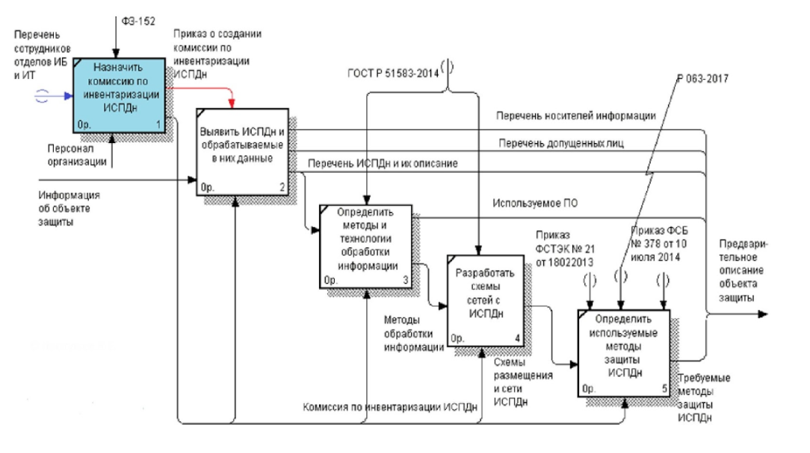
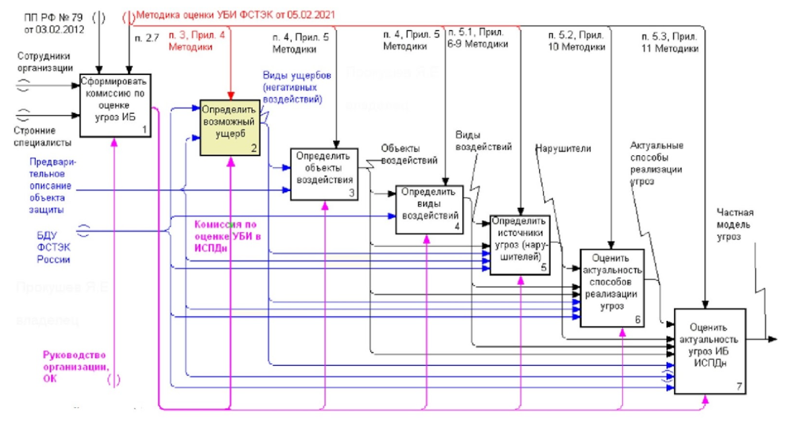

# 1. Безопасность ПД: обзор законодательства РФ

## Определения из 149-ФЗ

**Защита информации, доступ к которой ограничен федеральным законодательством,  является обязательной.**

### Обладатель информации

лицо, самостоятельно создавшее информацию либо получившее на основании закона или договора право разрешать или ограничивать доступ к информации, определяемой по каким-либо признакам.

### Доступ к информации

возможность получения информации и ее использования.

### Конфиденциальность информации

обязательное для выполнения лицом, получившим доступ к определенной информации, требование не передавать такую информацию третьим лицам без согласия ее обладателя.

### Оператор информационной системы

гражданин или юридическое лицо, осуществляющие деятельность по эксплуатации информационной системы, в том числе по обработке информации, содержащейся в ее базах данных.

**Защита информации, доступ к которой ограничен федеральным законодательством,  является обязательной.**

### Биометрические данные

> к биометрическим данным относятся сведения, которые характеризуют физиологические и биологические особенности человека, на основании которых можно установить его личность (например, отпечатки пальцев)

- С 1 сентября 2022 г. вступил в силу запрет оператора отказывать гражданам в оказании услуг, в случае если они не желают предоставлять биометрию и это не является обязательным требованием.

## 152-ФЗ

### Определения

#### Персональные данные (ПДн)

любая информация, относящаяся прямо или косвенно к определенному или определяемому физическому лицу (субъекту ПДн).

#### ПД, разрешенные субъектом ПД для распространения

ПД, доступ неограниченного круга лиц к которым предоставлен субъектом ПД путем дачи согласия на обработку ПД, разрешенных субъектом ПД для распространения в порядке, предусмотренном настоящим Федеральным законом;

#### Оператор

государственный/муниципальный орган, юридическое/физическое лицо, самостоятельно или совместно с другими лицами организующие/осуществляющие обработку ПДн, а также определяющие цели обработки ПДн, состав ПДн, подлежащих обработке, действия (операции), совершаемые с персональными данными.

#### Обезличивание ПДн

действия, в результате которых становится невозможным без использования дополнительной информации определить принадлежность ПДн конкретному субъекту.

#### Информационная система ПДн (ИСПДн)

совокупность содержащихся в базах данных ПДн и обеспечивающих их обработку информационных технологий и технических средств.

#### Обработка ПД

любое действие (операция) или совокупность действий (операций), совершаемых с использованием средств автоматизации или без использования таких средств с персональными данными, включая сбор, запись, систематизацию, накопление, хранение, уточнение (обновление, изменение), извлечение, использование, передачу (распространение, предоставление, доступ), обезличивание, блокирование, удаление, уничтожение ПД.

#### Предоставление ПД

действия, направленные на раскрытие ПД определенному лицу или определенному кругу лиц.

### Статья 1. Сфера действия настоящего Федерального закона

Законом регулируются отношения, связанные с обработкой ПД, осуществляемой

- федеральными органами государственной власти
- органами государственной власти субъектов Российской Федерации
- иными государственными органами (далее - государственные органы)
- органами местного самоуправления
- иными муниципальными органами (далее - муниципальные органы)
- юридическими лицами
- физическими лицами

> то есть всеми, кто обрабатывает ПДн 

с использованием

- средств автоматизации
    - с заданным алгоритмом поиск ПД
    - сбора данных
    - досутпа данных
    - обработки данных
- информационно-телекоммуникационных сетях
- или без перечисленных

#### 1.1. Применяются к обработке ПД граждан Российской Федерации

- иностранными юридическими лицами
- иностранными физическими лицами

на основе договра и соглашения на обработку ПД

### Не распространяется на отношения

1. обработке ПД физическими лицами исключительно для личных и семейных нужд, если при этом не нарушаются права субъектов ПД;
1. организации хранения, комплектования, учета и использования содержащих персональные данные документов Архивного фонда Российской Федерации и других архивных документов в соответствии с законодательством об архивном деле в Российской Федерации;
1. обработке ПД, отнесенных к государственной тайне.

### Статья 4. На чем основано законодательство Российской Федерации в области ПД

1. Законодательство РФ в области ПДн основано на конституции РФ и международных договорах и состоит из ФЗ «О ПД» и других федеральных законов.
2. На основании федеральных законов государственные органы, Банк России, органы местного самоуправления в пределах своих полномочий могут принимать нормативные правовые акты по отдельным вопросам, касающимся обработки ПД.
3. При обработке ПД без использования средств автоматизации используется ПП РФ № 687 от 15.09.2008 с учетом положений ФЗ № 152.
4. Если международным договором установлены иные правила, чем в ФЗ, применяются правила международного договора.
5. Решения межгосударственных органов, принятые на основе международных договоров, если они противоречат положениям Конституции РФ, не подлежат выполнению на территории России

## Изменения в законодательстве о ПД с 1 сентября 2022 года

### 30.12.2020 № 519-ФЗ определил три важных принципа для согласия на обработку ПД:

- Молчание или бездействие **не** считаются согласием на обработку ПД.  
- Согласие на обработку ПД, разрешенных для распространения, оформляется отдельно.
- В согласии на обработку ПД, разрешенных для распространения, можно установить запреты на передачу данных неограниченному кругу лиц.

### Введение принципа экстерриториальности

Закон будет применяться к иностранных юридическим и физическим лицам, если обработка ПД (далее — ПД) осуществляется на основании договора с гражданином РФ или с его согласия.

### Сокращение сроков реагирования оператора на запросы

- предоставить субъекту ПД ```сведения, касающиеся обработки его ПД в течение 10 рабочих дней```. Может быть продленно на ```5 дней рабочих дней```, если оператор направит в адрес субъекта мотивированное уведомление, в котором укажет причины отсрочки.
- прекратить обработку ПД ```в течение 10 дней```
- по запросу Роскомнадзора оператор ПД должен предоставить необходимую информацию ```в течение 10 рабочих дней```. При мотивированном уведомлении такой ответ ```можно продлить на 5 дней```

### Обязанность сообщать об утечке ПД

- уведомить о случившемся Роскомнадзор ```в течение 24 часов```;
- провести внутреннее расследование и уведомить службу о его результатах ```в течение 72 часов```;
- представить сведения о лицах, действия которых стали причиной инцидента (при наличии).

### Усиление ответственности обработчика ПД

- Ответственность будет усилена по отношению к ```иностранным обработчикам```. Обработчик ПД
- обработчик ответственен не только перед оператором, который поручил ему обработку, но и перед субъектом ПД.

### Изменение требований к поручениям

#### обработчик данных обязан

- соблюдать принципы
- правила обработки
- конфиденциальность данных
- принимать необходимые меры
- направленные на обеспечение выполнения обязанностей
- предусмотренных законом.

#### оператор должен определить

- перечень ПД
- перечень действий (операций) с данными, которые будут совершаться обработчиком
- обязанность обработчика по соблюдению конфиденциальности
- обязанность по запросу оператора в течение срока действия поручения предоставлять документы и информацию, подтверждающие принятие мер и соблюдение обязанности по обеспечению безопасности ПД при их обработке.
- обязанность обработчика уведомлять оператора об утечках ПД

### Новое в уведомлении Роскомнадзора об обработке ПД

Прежде чем приступить к обработке ПД, оператор должен уведомить Роскомнадзор о своем намерении

#### Анкета

[https://pd.rkn.gov.ru/operators-registry/notification/form/](https://pd.rkn.gov.ru/operators-registry/notification/form/)

#### Когда уведомление Роскомнадзора не требуется

- ПД, включенные в государственные информационные системы ПД, созданные в целях защиты безопасности государства и общественного порядка;
- ситуацию, когда оператор осуществляет деятельность по обработке данных исключительно без использования средств автоматизации.

### Новые требования к согласию на обработку ПД

#### Хоррактер соглашения на обрабодку ПД должен быть

- конкретным
- информированным
- сознательным
- предметным
- однозначным

##### Предметное

означает, что прописанные в согласии действия с ПДн должны полностью соответствовать целям обработки

##### Однозначное

предполагает, что человек добровольно дает согласие на обработку данных, подтвердив это конкретными действиями

### Изменение требований к политике обработки ПД

#### Оператор должен в политике обработки ПД для каждой цели обработки указывать

- категории и перечень обрабатываемых ПД;
- категории субъектов, данные которых обрабатываются;
- способы, сроки их обработки и хранения;
- порядок уничтожения ПД при достижении целей их обработки.

#### Правила публикации политики ПД

Она должна быть не просто размещена на сайте, а опубликована на страницах сайта, где осуществляется сбор данных.

## Изменения в законодательстве о ПД с 1 марта 2023 года

### Уведомление для Роскомнадзора

уведомлять РКН об изменениях надо ```до 15 числа следующего месяца```

Оператор оформляет одно уведомление по всем изменениям, которые произошли за месяц. Информировать о каждой корректировке отдельно больше не нужно.

### Трансграничная передача данных

Теперь РКН будет рассматривать уведомления операторов и разрешать, ограничивать или запрещать трансграничную передачу ПД в другие страны (ст. 12 №152-ФЗ). Пока не пройдет 10 рабочих дней после отправки уведомления в Роскомнадзор, передавать ПД в страны, которые не обеспечивают их защиту, нельзя.

### Ведение реестра инцидентов

1 марта 2023 года — появление реестра учета инцидентов в области ПД. Этот реестр будет вести Роскомнадзор.

- на основании уведомлений Роскомнадзор будет вносить запись в реестр учета инцидентов в области ПД
- к инцидентам в области ПД относят неправомерную или случайную передачу информации, которая повлекла нарушение прав гражданина
- первичные и дополнительные уведомления направляют в РКН в бумажной или электронной форме

#### Первичное уведомление

Указывают информацию

- об инциденте
    - дата и время его выявления
    - характеристика и количество данных в скомпрометированной базе;
- о причинах, которые привели к нарушению
- о предварительной оценке вреда
- о принятых мерах по устранению последствий
- о лице, ответственном за взаимодействие с РКН.

#### Дополнительное уведомление

Указывают

- результаты внутреннего расследования и определяют виновных
- информация о виновных
    - ФИО физического лица или ИП, название юрлица
    - IP-адрес устройства
    - предполагаемое местонахождение виновных лиц и их устройств
- другую информацию по расследованию

Если оператор не предоставит дополнительное уведомление, РКН сам потребует результаты внутреннего расследования инцидента. Ответ на это требование нужно отправить ```в течение 1 рабочего дня```. 

Если Роскомнадзор самостоятельно выявит утечку базы персданных и принадлежность базы к конкретному оператору, организация получит требование о необходимости предоставить первичное и дополнительное уведомления. Их надо отправить в обычные сроки: первичное — ```в течение 24 часов```, дополнительное — ```в течение 72 часов```.

### Оценка вреда при обработке ПДн

Приказ Роскомнадзора №178 от 27.10.2022 [http://publication.pravo.gov.ru/document/0001202211290004](http://publication.pravo.gov.ru/document/0001202211290004)

#### три степени качества обрабатываемых данных

Если субъект может получить ущерб разной степени, установите самую высокую из возможных степеней.  Степень угроз оценивает комиссия, которую формирует оператор, или сотрудник, который отвечает за обработку персональных данных. Результат оценки и присвоенную степень вреда показывают в акте.

##### высокая

когда оператор обрабатывает сведения о несовершеннолетних или биометрические данные;

##### средняя

когда оператор предлагает товары, работы, услуги, напрямую контактируя с потребителем и используя базы другого лица;

##### низкая

когда оператор назначает ответственным за работу с персональными данными внештатного специалиста.  


### Уничтожение персональных данных

Если оператор обрабатывает информацию без использования средств автоматизации, документальным подтверждением станет акт об уничтожении персональных данных

C использованием средств автоматизации, подтверждением будут

- акт об уничтожении персданных
- выгрузка из журнала регистрации событий в информационной системе персональных данных

#### Информация об утечках и компьютерных инцидентах

будет попадать не только в Роскомнадзор, но и в ФСБ. Эти сведения отражаются в информационном ресурсе ГосСОПКА. Информирование ФСБ проводится через НКЦКИ — Национальный координационный центр по компьютерным инцидентам (Приказ ФСБ №77 от 13.02.2023). Обычные операторы отправляют уведомления в РКН, а операторы, взаимодействующие с НКЦКИ, подают сведения именно в координационный центр — в течение 24 часов после обнаружения утечки (пп. 4.8 п. 4 Порядка из Приказа ФСБ №366 от 24.07.2018).

#### Ограничили доступ к персональным данным владельцев недвижимости из выписки ЕГРН.

Если выписку из госреестра недвижимости заказывает постороннее лицо, в ней не будет ФИО и даты рождения правообладателя. Но владелец недвижимости может дать разрешение раскрывать такие сведения. Для этого нужно подать в Росреестр специальное заявление. Супругам правообладателей, арендаторам и арендодателям сведения о ФИО и дате рождения тоже предоставят по запросу.

#### Биометрические персональные данные из единой системы — чтобы контролировать проход на территорию

Разрешение действует и для предприятий торговли и сферы услуг, операторов связи, вузов и других организаций. Но работать с такими данными можно только в определенных целях.

#### Ведомство публикует Перечень мессенджеров, принадлежащих иностранным юридическим лицам и гражданам.

Функционал указанных приложений подпадает под запреты ч. 8 ст. 10 Федерального закона «Об информации, информационных технологиях и о защите информации». Критерии, согласно которым мессенджеры включены в Перечень, указаны в [приказе Роскомнадзора №22 от 21 февраля 2023 года](http://publication.pravo.gov.ru/document/0001202304070022).

## Поручение обработки ПДн

Изменения вводят новое понятие — лицо, осуществляющее обработку ПДн по поручению Оператора. Напомним, что аналогичная сущность представлена в европейских нормах (GDPR) в виде процессора или обработчика.

Лицо, осуществляющее обработку ПДн по поручению оператора, несет ответственность перед Оператором. Ответственность перед субъектом ПДн за действия лица, осуществляющего обработку ПДн по поручению оператора, несет сам Оператор.

### Поручение обработки ПДн должно содержать

- перечень ПДн;
- перечень действий (операций) с ПДн, которые будут совершаться лицом, осуществляющим обработку ПДн по поручению оператора;
- цели обработки ПДн;
- требования к защите обрабатываемых ПДн;
- требования об уведомлении Оператора о неправомерной обработке ПДн;
- обязанности лица, осуществляющего обработку ПДн по поручению оператора.

### Обязанности поручителя

- соблюдение конфиденциальности ПДн;
- обеспечение записи, систематизации, накопления, хранения, уточнения (обновления, изменения), извлечения ПДн граждан РФ в базах данных, находящихся на территории РФ;
- соблюдение требований Оператора, в том числе предоставление информации, подтверждающей принятие и соблюдение мер по защите ПДн;
- обеспечение безопасности ПДн при их обработке.

# 2. Безопасность персональных данных: инвентаризация процессов обработки персональных данных и определение требований к обработке

> **Инвентаризация информационных ресурсов**
>
> это выявление присутствия и осуществления обработки персональных  данных  во  всех эксплуатируемых организацией информационных системах и традиционных хранилищах данных.

## Основная цель инвентаризации

Сбор и анализ информации о местах хранения и обработки персональных данных, используемых информационных технологиях, допущенных к обработке персональных данных сотрудников.

## Схема проведения инвентаризации ИСПДн



## Инвентаризация персональных данных. Основные понятия. Состав комиссии

- Руководитель и сотрудники департамента (отдела), отвечающего за обеспечение информационной безопасности.
- Руководитель или сотрудники департамента (отдела) информационных технологий.
- Руководитель или сотрудники департаментов (отделов), где предположительно может вестись обработка персональных данных.
- Возглавляет комиссию руководитель департамента (отдела) информационной безопасности или, в случае отсутствия такой должности, руководитель департамента (отдела) информационных технологий.
- В приказе по организации необходимо определить полномочия комиссии.

## Обоснование необходимости обработки персональных данных

Как правило, обработка персональных данных сотрудников в любой организации ведётся в таких подразделениях как бухгалтерия и отдел кадров.

Персональные данные лиц, не являющихся сотрудниками организаций, могут обрабатываться в отделах, чья деятельность требует их обработки. 

Примеры обоснований:

- в коммерческих торговых организациях персональные данные клиентов могут обрабатываться с целью формирования скидок постоянным покупателям;
- в учреждениях здравоохранения персональные данные обрабатываются для ведения историй болезни пациентов;
- в учреждениях образования персональные данные учащихся обрабатываются для учета их успеваемости, оплаты обучения и т.п.;
- в кадровых (рекрутинговых) агентствах персональные данные обрабатываются с целью предоставления услуг по поиску работы;
- в земельном кадастре персональные данные граждан обрабатываются с целью ведения реестра собственников земельных участков. В этой организации персональные данные могут обрабатываться не только с применением средств автоматизации, но и на твердом носителе.

## Определение перечня защищаемых ресурсов

Для каждого выявленного массива персональных данных (ИСПДн) определяется полный перечень требуемых для обработки данных.

### Обработка персональных данных без применения информационных технологий:

- использовать Постановление Правительства Российской Федерации от 15.09.2008 г. № 687 «Об утверждении положения об особенностях обработки персональных данных, осуществляемой без использования средств автоматизации»;
- определить места и режим хранения и обработки документов. Должны быть составлены планы помещений, где ведется обработка персональных данных;
- указать места хранения документов с персональными данными;
- определить лиц, имеющих доступ к обрабатываемым персональным данным (нужен приказ);
- указать, к обработке каких сведений допущен сотрудник.
- указанные действия следует повторить для каждого массива обрабатываемой информации (информационной системы персональных данных).
- описать принимаемые на данный момент меры инженерно-технического характера по защите от несанкционированного физического доступа посторонних лиц и обеспечения противопожарной безопасности.

### Обработка персональных данных с применением информационных технологий

#### Доступ и ПО

- установить департаменты, сотрудников, имеющих доступ к обработке персональных данных (нужен приказ по организации);
- описать права доступа пользователей к обрабатываемой информации для разных категорий пользователей (если таковые настроены и имеются);
- в дальнейшем определить используемые для обработки персональных данных программные средства (применяемые информационные технологии).

#### Хранение и доставлка

- Уточнить перечень носителей информации с персональными данными и их места нахождения. Учитываются как стационарные носители (диски SSD и HDD), так и съемные накопители данных.
- Описать принимаемые на данный момент меры инженерно-технического характера по защите от несанкционированного физического доступа посторонних лиц и обеспечения противопожарной безопасности.
- Разработать схемы сетей с ИСПДн.

#### Модели ИС

- логическую модель информационной системы, обращая внимание на архитектуру информационной системы (является ли она локальной или распределённой).
- физическую модель информационной системы, обращая внимание на прохождение каналов связи в организации (является ли она локальной или распределённой).

Если компьютеров много и обработка персональных данных ведется целыми отделами, то можно одним объектом изобразить весь отдел.

##### Определение характера защищаемой сети

> **Распределённая сеть**
>
> идет передача данных по неконтролируемому каналу связи. Использование беспроводных сетей в большинстве случаев приведёт к тому, что сеть будет распределённой. Чтобы информативный сигнал не выходил за границу контролируемой зоны, нужно занимать достаточно много пространства.

> **Локальная сеть**
>
> передача данных идет только по контролируемой территории.

При наличии распределенной информационной системы, где ведется передача данных по неконтролируемому каналу связи, потребуется применение средств криптографической защиты информации.

### ПО для составления отчетов (примеры)

- Сканер-ВС
- Сканер-ВС Инспектор
- X-Spider
- Max Patrol
- Secret Net Studio
- Dallas Lock

## Меры организации защиты информации от несанкционированного физического проникновения и пожара

Меры по обеспечению безопасности персональных данных от несанкционированного физического доступа посторонних лиц и обеспечение противопожарной безопасности могут быть выполнены с учётом методических рекомендаций Росгвардии [Р 063-2017](https://meganorm.ru/Data2/1/4293733/4293733131.pdf) и [Р 078-2019](https://pravo.ppt.ru/metodicheskiye-rekomendatsii/218691) для класса А2

Требования обязательны, если защита объекта обеспечивается силами подразделений Росгвардии. Если охрану осуществляют ЧОО, то требования носят рекомендательный характер.

### Требования

- в методических рекомендациях Р 063-2017 в приложении 2 указаны требования к каналу передачи информации на ПЦО с объектов (квартир, МХИГ) охраняемых или передаваемых под централизованную охрану подразделениям вневедомственной охраны;
- минимально необходимый состав технических средств охраны (ТСО) указан в приложении 3 к методическим рекомендациям Р 063-2017;
- рекомендации к выбору охранных датчиков по их принципу действия указаны в приложении 6 к методическим рекомендациям Р 063-2017;
- рекомендации к строительным конструкциям зданий указаны в приложении 7 к методическим рекомендациям Р 063-2017;
- особенности построения систем охранной и пожарной сигнализации рассмотрены в методических рекомендациях Р 078-2019.

Для оборудования серверных помещений может быть использован [ГОСТ Р 59316-2021 Национальный Стандарт Российской Федерации. Слаботочные системы. Кабельные системы. Телекоммуникационные пространства и помещения. Аппаратная комната. Общие требования (https://docs.cntd.ru/document/1200180417)](https://docs.cntd.ru/document/1200180417).

## Требования к организации защиты информации, обрабатываемой средствами вычислительной техники

### Защита ИСПДн: Приказа ФСТЭК России от 18 февраля 2013 г. № 21

Для обеспечения защиты ИСПДн следует использовать группы базовых мер защиты от НСД из [Приказа ФСТЭК России от 18 февраля 2013 г. № 21 «Об утверждении состава и содержания организационных и технических мер по обеспечению безопасности персональных данных при их обработке в информационных системах персональных данных» (https://fstec.ru/dokumenty/vse-dokumenty/prikazy/prikaz-fstek-rossii-ot-18-fevralya-2013-g-n-21)](https://fstec.ru/dokumenty/vse-dokumenty/prikazy/prikaz-fstek-rossii-ot-18-fevralya-2013-g-n-21):

- идентификация и аутентификация субъектов доступа и объектов доступа;
- управление доступом субъектов доступа к объектам доступа;
- ограничение программной среды;
- защита машинных носителей информации, на которых хранятся и (или) обрабатываются;
- персональные данные (далее — машинные носители персональных данных);
- регистрация событий безопасности;
- антивирусная защита;
- обнаружение (предотвращение) вторжений;
- контроль (анализ) защищенности персональных данных;
- обеспечение целостности информационной системы и персональных данных;
- обеспечение доступности персональных данных;
- защита среды виртуализации;
- защита технических средств;
- защита информационной системы, ее средств, систем связи и передачи данных;
- выявление инцидентов (одного события или группы событий), которые могут привести к сбоям или нарушению функционирования информационной системы и (или) к возникновению угроз безопасности, персональных данных (далее - инциденты), и реагирование на них;
- управление конфигурацией информационной системы и системы защиты персональных данных;
- выполнение мер по физической (инженерно-технической) защите носителей ИСПДн и средств ее обрабатывающих (прим: добавлено автором курса) — учет устройств и охранных систем;
- выполнение мер организационной защиты.


## Инвентаризация. Суммарная информация

### Этапы

- устанавливается необходимость (обоснование) обработки (обсуждения) персональных данных на данном объекте информатизации;
- определяется перечень персональных данных, подлежащих защите;
- определяются конфигурация и топология автоматизированных систем и систем связи в целом и их отдельных компонент, физические, функциональные и технологические связи как внутри этих систем, так и с другими системами различного уровня и назначения;
- определяются технические средства и системы, используемые в защищаемой ИСПДн и системах связи, общесистемные и прикладные программные средства;
- уточняются носители персональных данных;
- определяются условия расположения объектов информатизации относительно границ КЗ;
- определяется степень участия персонала в обработке (обсуждении, передаче, хранении) информации, характер их взаимодействия между собой и со службой безопасности;
- определяются режимы обработки информации в ИСПДн в целом и в отдельных ее компонентах.

### Итоги инвентаризации являются исходными данными для определения

- требований к выполнению организационных мероприятий по защите персональных данных и организации их обработки;
- необходимости применения мер криптографической защиты информации;
- требований к выполнению инженерно-технических мероприятий по защите обрабатываемых и хранимых персональных данных;
- требований к выполнению мер программно-аппаратной защиты информации.

### Предпроектная стадия разделяется на две части:

- предварительное описание анализируемой информационной системы обработки персональных данных (ИСПДн);
- выбор возможных методов, средств и способов защиты информации в ИСПДн, исходя из полученной на предыдущем этапе информации.

### Дальнейшие этапы реализации

- определяются возможные методы и средства преодоления системы защиты ИСПДн применительно к конкретным условиям ее функционирования;
- определяются (уточняются) угрозы безопасности информации для каждой из имеющихся на объекте ИСПДн: строятся модели угроз (по методике ФСТЭК России) и вероятного нарушителя (по методике ФСБ России в случае применения СКЗИ);
- определяются уровни защищенности всех ИСПДн, обрабатываемых в организации;
- определяется общий перечень мероприятий по обеспечению защиты информации в ИСПДн;
- выбираются и обосновываются защитные меры и способ их реализации.

# 3. Безопасность персональных данных: построение модели угроз и модели нарушителя, определение мер защиты

## Построение модели угроз информационной безопасности ИСПДн. Основные документы

Модель угроз безопасности информации в ИСПДн разрабатывается с применением методического документа [«Методика оценки угроз безопасности информации», утвержденного ФСТЭК России 05 февраля 2021 года (https://fstec.ru/dokumenty/vse-dokumenty/spetsialnye-normativnye-dokumenty/metodicheskij-dokument-ot-5-fevralya-2021-g)](https://fstec.ru/dokumenty/vse-dokumenty/spetsialnye-normativnye-dokumenty/metodicheskij-dokument-ot-5-fevralya-2021-g) (далее – Методика ФСТЭК России, Методика).

Для построения модели угроз чаще всего используется банк данных угроз ФСТЭК России [https://bdu.fstec.ru/threat](https://bdu.fstec.ru/threat)

Для оценки актуальности угроз используются эксперты. Их выбор производится в соответствии с п. 2.7 методического документа «Методика оценки угроз безопасности информации»

Квалификационные требования к членам комиссии по информационной безопасности содержатся в [Постановлении Правительства № 79 от 3 февраля 2012 г. «О лицензировании деятельности по технической защите конфиденциальной информации» (https://fstec.ru/dokumenty/vse-dokumenty/postanovleniya/postanovlenie-pravitelstva-rossijskoj-federatsii-ot-3-fevralya-2012-g-n-79)](https://fstec.ru/dokumenty/vse-dokumenty/postanovleniya/postanovlenie-pravitelstva-rossijskoj-federatsii-ot-3-fevralya-2012-g-n-79).

## Схема проведения моделирования угроз. Этапы



### Первый этап

- Определяется возможный ущерб
- Анализируется документация на объект исследования, полученная на этапе предпроектного обследования и инвентаризации
- Определяются негативные последствия, которые могут наступить от реализации угроз безопасности информации

Заведомо нереализуемые угрозы в данной информационной системе из анализа сразу же исключаются

#### На основе анализа исходных данных определяются событие или группа событий которые можгут привести к:

- нарушению прав граждан;
- возникновению ущерба в области обеспечения безопасности государства и правопорядка, а также в социальной, экономической, финансовой, политической сферах деятельности государства (для государственных ИСПДн с большим числом записей о субъектах);
- возникновению финансовых, производственных, репутационных или иных рисков (видов ущерба) для обладателя информации, оператора.

#### Рассматривать в первую очередь возможный ущерб частному

- угроза жизни или здоровью;
- унижение достоинства личности;
- нарушение неприкосновенности частной жизни;
- нарушение личной, семейной тайны, утрата чести и доброго имени;
- нарушение тайны переписки, телефонных переговоров, иных сообщений;
- нарушение иных прав и свобод гражданина, закрепленных в Конституции Российской Федерации и федеральных законах;
- финансовый, иной материальный ущерб физическому лицу;
- нарушение конфиденциальности (утечка) персональных данных;
- «травля» гражданина в сети интернет;
- разглашение персональных данных граждан.

#### Dиды ущербов из-за нарушения конфиденциальности, целостности или доступности обрабатываемых персональных данных:

- нарушение законодательства Российской Федерации;
- недополучение ожидаемой (прогнозируемой) прибыли за счет утечки базы данных клиентов к конкурентам;
- необходимость дополнительных (незапланированных) затрат на выплаты штрафов;
- нарушение штатного режима функционирования автоматизированной системы управления и управляемого объекта и/или процесса;
- необходимость дополнительных (незапланированных) затрат на восстановление деятельности;
- дискредитация работников;
- утрата доверия работников, ухудшение морального климата в организации;
- снижение престижа организации.

### Второй этап

- Определяются возможные объекты воздействия угроз безопасности информации
- Совокупность объектов воздействия и их интерфейсов определяет границы оценки угроз безопасности информации и разработки модели угроз безопасности информации.

#### Исходные данные для определения возможных объектов воздействия

- перечень угроз безопасности информации, содержащейся в банке данных угроз безопасности информации ФСТЭК России (bdu.fstec.ru) за исключением угроз, заведомо нереализуемых для данного объекта;
- документация на защищаемые сети и системы (составе и архитектура, о группы пользователей, их полномочий и тип доступа, внешних и внутренних интерфейсах). Для получения этих сведений проводились предварительные работы – инвентаризация;
- договоры, соглашения или иные документы, содержащие условия использования информационно-телекоммуникационной инфраструктуры ЦОД или облачной инфраструктуры поставщика услуг (в случае функционирования систем и сетей на базе информационно-телекоммуникационной инфраструктуры ЦОД или облачной инфраструктуры);
- негативные последствия (ущерб) от реализации (возникновения) угроз безопасности информации, определенные в соответствии с настоящей Методикой на предыдущем этапе.

*Эти данные могут быть дополнены другими документами*

#### Возможные объекты воздействия угроз безопасности информации

- информация (данные), содержащаяся в системах и сетях (в том числе защищаемая информация, персональные данные, информация о конфигурации систем и сетей, данные телеметрии, сведения о событиях безопасности и др.);
- программно-аппаратные средства обработки и хранения информации (в том числе АРМ, серверы, включая промышленные, средства отображения информации, программируемые логические контроллеры, производственное, технологическое оборудование);
- программные средства (в том числе системное и прикладное ПО, включая серверы приложений, веб-приложений, системы управления базами данных, системы виртуализации);
- машинные носители информации, содержащие защищаемую авторизационную информацию;
- телекоммуникационное оборудование (в том числе программное обеспечение);
- все типы средств защиты информации;
- привилегированные и непривилегированные пользователи систем и сетей, а также интерфейсы взаимодействия с ними;
- обеспечивающие системы (вспомогательные технические средства и системы).

*В той или иной степени объектами воздействия могут являются все элементы ИСПДн, а также персонал, обслуживающий данную ИСПДн*

### Третий этап

#### Основные виды воздействий на объекты защищаемой системы, приводящих к ущербу

- утечка (перехват) конфиденциальной информации или отдельных данных (нарушение конфиденциальности);
- несанкционированный доступ к компонентам, защищаемой информации, системным, конфигурационным, иным служебным данным;
- отказ в обслуживании компонентов (нарушение доступности);
- несанкционированная модификация, подмена, искажение защищаемой информации, системных, конфигурационных, иных служебных данных (нарушение целостности);
- несанкционированное использование вычислительных ресурсов систем и сетей в интересах решения несвойственных им задач, изменение режима работы оборудования;
- нарушение функционирования (работоспособности) программно-аппаратных средств обработки, передачи и хранения информации;
- физическое уничтожение или , кража СВТ, носителей информации.

### Четвертый этап

- определяются источники угроз безопасности информации

#### Cведения для определения возможных актуальных нарушителей

- возможного ущерба от реализации угроз безопасности информации;
- негативных последствий от реализации угроз безопасности информации, определенные в соответствии с настоящей Методикой;
- потенциальных объектов воздействия угроз безопасности информации;
- видов воздействия на объекты, определенных в соответствии с настоящей Методикой.

На основе анализа определяются виды нарушителей, актуальных для систем и сетей.

*приложении 6 к настоящей Методике ФСТЭК*

#### Классификация нарушителей

#### По уровню

- базовые возможности по реализации угроз безопасности информации (Н1);
- базовые повышенные возможности по реализации угроз безопасности информации (Н2);
- средние возможности по реализации угроз безопасности информации (Н3);
- высокие возможности по реализации угроз безопасности информации (Н4).

#### По статусу

- внутренними (реализуют угрозы преднамеренно или непреднамеренно)
- внешними (реализуют угрозы только преднамеренно)

*приложении 8 Методики ФСТЭК России*

### Пятый этап

- производится оценка способов реализации (возникновения) угроз безопасности информации

#### Возможных способы реализации (возникновения) угроз безопасности информации

1. физический доступ к содержимому системного блока (инвазивные атаки);
1. использование ошибок администрирования;
1. использование штатных утилит операционной системы для обхода настроек безопасности;
1. различные способы внедрения вредоносного программного обеспечения;
1. угрозы, связанные с работой в глобальной сети Интернет (фишинг, фарминг, спам);
1. различные типы сетевых атак (извне и изнутри) защищаемой сети;
1. несанкционированная установка программного обеспечения;
1. несанкционированное изменение аппаратного обеспечения;
1. компрометация авторизационных данных;
1. отключение или изменение настроек систем обеспечения информационной безопасности;
1. ошибочные действия в ходе создания и эксплуатации систем и сетей, в том числе при установке, настройке программных и программно-аппаратных средств;

#### Способы реализации (возникновения) угроз безопасности информации, характерные для нарушителей с различным потенциалом

1. перехват (измерение) побочных электромагнитных излучений и наводок (других физических полей) для доступа к конфиденциальной информации, содержащейся в аппаратных средствах аутентификации;
1. нарушение безопасности при поставках программных, программно-аппаратных средств и (или) услуг по установке, настройке, испытаниям, пусконаладочным работам (в том числе администрированию, обслуживанию);
1. использование недекларированных возможностей программного обеспечения и (или) программно-аппаратных средств;
1. формирование и использование скрытых каналов (по времени, по памяти) для передачи конфиденциальных данных;
1. использование уязвимостей кода (программного обеспечения), уязвимостей архитектуры и конфигурации систем и сетей, а также организационных и многофакторных уязвимостей;

#### Интерфейсы объектов воздействия (способы подключения или воздействия на объект атаки)

- внешние сетевые интерфейсы, обеспечивающие взаимодействие с сетью «Интернет», смежными (взаимодействующими) системами или сетями (проводные, беспроводные, веб-интерфейсы, интерфейсы удаленного доступа и др.);
- внутренние сетевые интерфейсы, обеспечивающие взаимодействие (в том числе через промежуточные компоненты) с компонентами систем и сетей, имеющими внешние сетевые интерфейсы (проводные, беспроводные);
- интерфейсы для пользователей (проводные, беспроводные, веб-интерфейсы, интерфейсы удаленного доступа и др.);
- интерфейсы для использования съемных машинных носителей информации и периферийного оборудования;
- интерфейсы для установки, настройки, испытаний, пусконаладочных работ (в том числе администрирования, управления, обслуживания) обеспечения функционирования компонентов систем и сетей;
- возможность доступа к поставляемым или находящимся на обслуживании, ремонте в сторонних организациях компонентам систем и сетей.

### Шестой этап

- определяются возможные для систем и сетей угрозы безопасности информации
- определяются сценариев реализации угроз безопасности

Угроза безопасности информации возможна, если имеются:
- нарушитель или иной источник угрозы
- объект, на который осуществляются воздействия (интерфейс, с помощью которого осуществляется взаимодействие)
- способы реализации угрозы безопасности информации, а реализация угрозы может привести к негативным последствиям

> **УБИ**
>
>  = нарушитель, объекты воздействия, способы реализации угроз, негативные последствия.

#### Сценарии реализации угроз

Актуальность возможных угроз безопасности информации определяется наличием сценариев их реализации.

> тактика + техника реализации угроз

> **Тактика** определяет то, что делаем

> **Техника** как выполняем действия

Определение сценариев предусматривает установление:
- последовательности возможных тактик
- соответствующих им техник
- доступности интерфейсов для использования в реализации угроз безопасности информации

При наличии хотя бы одного сценария угрозы безопасности информации такая угроза признается актуальной для системы и сети и включается в модель угроз безопасности систем и сетей для обоснования выбора организационных и технических мер по защите информации (обеспечению безопасности), а также выбора средств защиты информации.

## Определение уровня защищенности ИСПДн

[Постановления Правительства России № 1119 от 01 ноября 2012 года (https://base.garant.ru/70252506/)](https://base.garant.ru/70252506/)

### Параметры уровня защищенности ИСПДн

#### Уровень актуальных угроз (определяется на основе частной модели угроз)

1. актуальны угрозы, связанные с НДВ (недекларированными возможностями) в системном ПО;

2. актуальны угрозы, связанные с НДВ в прикладном ПО;

3. актуальны угрозы, не связанные с наличием недокументированных возможностей в используемом системном и прикладном программном обеспечении.
На практике подавляющее число компаний-операторов ПДн рассматривают только угрозы 3-го типа, поскольку используемые технологии распространены, а возможности — задокументированы

#### Категория обрабатываемых персональных данных (предварительно определяется в процессе инвентаризации)

1. специальные ПДн — касающиеся расовой, национальной принадлежности, политических взглядов, религиозных или философских убеждений, состояния здоровья, интимной жизни;

2. биометрические ПДн — характеризуют физиологические и биологические особенности человека, на основании которых можно установить его личность и которые используются оператором для установления личности субъекта;

3. общедоступные ПДн — полученные только из общедоступных источников, созданных в соответствии со статьей 8 Федерального закона № 152-ФЗ;

4. иные ПДн — не относящиеся к первым трем категориям.

#### Количество записей субъектов ПДн в ИСПДн (предварительно устанавливается в процессе инвентаризации).

#### Тип обрабатываемых данных (персональные данные сотрудников организации или лиц, не работающих в ней), определяется в процессе инвентаризации.

# 4. Безопасность персональных данных: обзор технических средств защиты информации

## Средств защиты информации, используемых для защиты персональных данных

- средства обеспечения сетевой безопасности,
- средства защиты от несанкционированного доступа,
- модули доверенной загрузки,
- средства антивирусной защиты информации,
- средства аудита защищенности ИСПДн,
- средства защиты систем виртуализации,
- средства анализа событий в защищаемой ИСПДн.

## Требования из законодательства по защите ПДн

| Группы обязательных защитных мероприятий | Используемый тип средств защиты |
| :--------------------------------------- | :------------------------------ |
| Идентификация и аутентификация субъектов доступа и объектов доступа | АМДЗ, ПМДЗ, СЗИ от НСД, встроенные механизмы ОС и СУБД, DLP |
| Управление доступом субъектов доступа к объектам доступа | АМДЗ, ПМДЗ, СЗИ от НСД, встроенные механизмы ОС и СУБД, DLP |
| Ограничение программной среды | СЗИ от НСД, встроенные механизмы ОС |
| Защита машинных носителей информации | СЗИ от НСД, возможно с помощью САВЗ |
| Регистрация событий безопасности | Регистрация событий безопасности |
| Антивирусная защита | САВЗ, компонент САВЗ в составе СЗИ от НСД  |
| Обнаружение (предотвращение) вторжений | СОВ, компонент СОВ в составе САВЗ или СЗИ от НСД |
| Контроль (анализ) защищенности информации | Сканеры уязвимостей |
| Обеспечение целостности информационной системы и информации | СЗИ от НСД, встроенные механизмы ОС и СУБД, САВЗ (целостность ПО обеспечивает только СЗИ от НСД!!!) |
| Обеспечение доступности информации | СЗИ от НСД, САВЗ, Средства резервного копирования |
| Защита среды виртуализации | Системы защиты сред виртуализации, САВЗ |
| Защита технических средств | Инженерно-технические системы, организационные меры |
| Защита информационной системы, ее средств, систем связи и передачи данных | СКЗИ, МЭ, СОВ, САВЗ (Для распределенных систем УЗ4-УЗ1 необходимы СКЗИ и средства защиты для них) |
| Выявление инцидентов ИБ в ИСПДн и реагирование на них | СЗИ от НСД, МЭ, СОВ, САВЗ, SIEM организационные меры |
| Управление конфигурацией ИСПДн и системой защиты персональных данных. | Консоли управления СЗИ от НСД, МЭ, СОВ, DLP, СКЗИ и других типов средств защиты информации |

## Основные типы средств обеспечения сетевой безопасности


Требования по применению средств сетевой безопасности указаны в [Приказе ФСТЭК России № 21](https://fstec.ru/dokumenty/vse-dokumenty/prikazy/prikaz-fstek-rossii-ot-18-fevralya-2013-g-n-21)

### Межсетевые экраны (МЭ, Firewall)

> это программный или программно-аппаратный элемент  компьютерной сети, осуществляющий контроль и фильтрацию проходящего через него  сетевого трафика в соответствии с заданными правилами.

#### Группа базовых мер XIII. Защита информационной системы, её средств, систем связи и  передачи данных (3ИС)

#### ЗИС.10

Подтверждение происхождения источника информации, получаемой в процессе  определения сетевых адресов по сетевым именам или определения сетевых имен по сетевым  адресам.

#### ЗИС.11

Обеспечение подлинности сетевых соединений (сеансов взаимодействия), в том числе для защиты от подмены сетевых устройств и сервисов.

#### ЗИС.16

Выявление, анализ и блокирование в информационной системе скрытых каналов передачи  информации в обход реализованных мер или внутри разрешенных сетевых протоколов.

#### ЗИС.17

Разбиение информационной системы на сегменты (сегментирование информационной  системы) и обеспечение защиты периметров сегментов информационной системы.

### Системы обнаружения вторжений (СОВ, IDS)

> это программное или аппаратное средство,  предназначенное для выявления попыток неавторизованного доступа в компьютерную  систему или сеть либо несанкционированного управления ими в основном через Интернет.

#### Группа базовых мер VII. Обнаружение вторжений (СОВ):  

СОВ.1. Обнаружение вторжений (СОВ).
СОВ.2. Обновление базы решающих правил.

### Системы предупреждения вторжений (СПВ, IPS)

это изделия, которые в дополнение к  функционалу СОВ могут блокировать такого рода попытки несанкционированного доступа.

#### Группа базовых мер XIII. Защита информационной системы, ее средств, систем связи и передачи данных (3ИС)

**ЗИС 3.** Обеспечение защиты персональных данных от раскрытия, модификации и навязывания  (ввода ложной информации) при ее передаче (подготовке к передаче) по каналам связи, имеющим  выход за пределы контролируемой зоны, в том числе беспроводным каналам связи.

#### Группа базовых мер II. Управление доступом субъектов доступа к объектам доступа (УПД)

**УПД.13** Реализация защищенного удаленного доступа субъектов доступа к объектам доступа через  внешние информационно-телекоммуникационные сети

### Криптошлюзы и криптокоммутаторы

это аппаратно-программный комплексы криптографической защиты трафика данных, голоса или видео на основе шифрования пакетов (по протоколам IPsec AH и/или IPsec ESP) при установлении сетевых соединений с  помощью средств криптографической защиты информации (СКЗИ). Должны удовлетворять требованиями ФСБ России и обеспечивать базовую функциональность современных VPN-устройств.

## Основные типы средств обеспечения локальной защиты от угроз информационной безопасности

### Средства защиты от несанкционированного доступа (СЗИ от НСД)

программные,  технические или программно-технические средства, предназначенные для  предотвращения или существенного затруднения несанкционированного доступа к  информации.

### Средства доверенной загрузки

это программные и программно-технические  средства, используемые в целях обеспечения защиты информации и реализующие  функции по предотвращению несанкционированного доступа к программным и (или)  техническим ресурсам средств вычислительной техники на этапе его загрузки.

Также в обязательном порядке нужно использовать средства антивирусной защиты. Кроме того необходимо использовать среды защиты виртуализации, средства анализа защищенности и DLP-системы.

# Безопасность персональных данных: подтверждение соответствия требованиям законодательства

В данном уроке мы разберём алгоритм подтверждения требованиям законодательства в области защиты персональных данных.