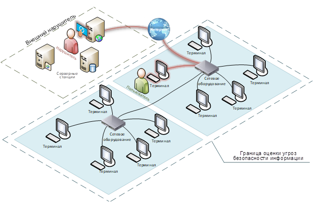

# 1. Введение

## Содержание курса

В первом модуле вы узнаете:
- что такое тестирование на проникновение,
- каковы основные этапы тестирования на проникновение,
- методологию проведения пентеста,
- модели нарушителя и модели взаимодействия с SOC,
- нормативную базу,
- как работать с отчетом о проведении тестирования.

Второй модуль посвящен:
- пассивной фазе пентеста и сбору информации из открытых источников,
- активной фазе пентеста и проведению сканирований,
- поиску информации об уязвимостях.

Третий модуль посвящен:
- методам поиска уязвимостей,
- основам применения эксплойтов,
- использованию Metasploit Framework,
- погружению в инструмент поиска и эксплуатации SQL-инъекций — sqlmap.

## Основные термины

> **Уязвимость** это недостаток в системе или приложении, который может быть использован злоумышленником для получения несанкционированного доступа к информации, ее модификации или уничтожения. Уязвимости могут быть вызваны ошибками в программном коде, ошибками в конфигурации системы, или другими факторами

> **Эксплуатация** это процесс использования уязвимости злоумышленником для получения несанкционированного доступа к системе или приложению. Эксплуатация может быть выполнена вручную или с помощью автоматизированного инструментария.

> **Критичность уязвимости** это оценка степени опасности, которую представляет уязвимость

> **Атака** попытка несанкционированного вторжения или нарушения безопасности системы с целью получения конфиденциальной информации, повреждения данных или нарушения работы системы

> **Сканер** это инструмент, используемый для обнаружения уязвимостей в системе или сети. Сканеры могут проводить различные виды сканирования, включая сканирование на уязвимости и сетевое сканирование

> **Инъекция** это вид атаки, при которой злоумышленник вводит вредоносные данные или код в систему через входные поля или другие механизмы ввода данных, например, sql-инъекция

> **Эксплойт** это программный код или последовательность команд, использующие уязвимости в программном обеспечении или системе для выполнения несанкционированных действий, таких как получение доступа, выполнение кода или нарушение работы системы

> **Эксплойт (SOC — Security Operations Center)** это центр мониторинга и реагирования на инциденты информационной безопасности. Он представляет собой структурное подразделение организации, ответственное за постоянный мониторинг IT-системы, сбор и анализ данных с различных объектов инфраструктуры, а также за предотвращение и обнаружение киберинцидентов

# 2. Определение пентеста

## Что такое тестирование на проникновение

> **Тестирование на проникновение, или пентест**, представляет собой методику оценки безопасности путем моделирования атак злоумышленников. Основная цель пентеста — выявить уязвимости, которые могут быть использованы для компрометации системы, и предложить меры по их устранению.

- Пентест включает умышленные атаки, чтобы обнаружить уязвимости в самих системах (продуктах) компании и недостатки в защите (если она есть)
- может включать как автоматизированные сканирования, так и ручное тестирование

### Для чего нужно тестирование на проникновение

Основные задачи пентеста включают:
- **Выявление уязвимостей** пентест помогает обнаружить слабые места в системе, которые могут быть использованы злоумышленниками для атак.
- **Оценка уровня защищенности** проводя пентест, организации могут проверить, насколько эффективно их системы защищены от возможных угроз.
- **Рекомендации по улучшению безопасности** по результатам тестирования составляется отчет с рекомендациями по устранению выявленных уязвимостей и усилению мер безопасности.

### Почему важен пентест, а не только сканирование на уязвимости

- Сканирование на уязвимости, как правило, автоматизировано и направлено на обнаружение известных уязвимостей в системах
- Пентест, в отличие от сканирования, включает в себя моделирование реальных атак, что позволяет не только обнаружить уязвимости, но и понять, как они могут быть использованы злоумышленниками

## Чем тестирование на проникновение отличается от анализа защищенности

> **Анализ защищенности** представляет собой процесс всесторонней оценки информационной системы с целью выявления всех возможных уязвимостей. Анализ защищенности обычно проводится с использованием автоматизированных инструментов и охватывает широкий спектр компонентов, таких как приложения, сервисы и сетевые сегменты.

### Отличие пентеста от анализа защищенности

- Пентест направлен на моделирование реальных атак с целью проверки глубины проникновения злоумышленника в систему
    - включает в себя не только обнаружение уязвимостей, но и попытки их эксплуатации для получения доступа к системам и данным
    - позволяет оценить, как именно злоумышленник может использовать выявленные уязвимости для компрометации системы
    - фокусируется на глубоком исследовании и эксплуатации уязвимостей, чтобы понять их реальные последствия для безопасности организации.
- Анализ защищенности предоставляет широкую картину текущего состояния безопасности системы, выявляя множество потенциальных уязвимостей

| Критерий | Пентест | Анализ защищенности |
| :--- | :--- | :--- |
| Цель | Выявление уязвимостей через имитацию реальной атаки | Общая оценка уровня безопасности системы или отдельного продукта |
| Методы | Активные атаки, использование инструментов для тестирования | Оценка рисков и слабых мест, контроль за методами защиты |
| Область применения | Применяется для оценки конкретных систем или приложений | Широкая область применения, включая процедуры, процессы и политику безопасности |
| Глубина анализа | Фокус на глубине проникновения, поиск самого легкого пути для взлома | Акцент на ширине выявленных уязвимостей, поиск максимального количества слабых мест |
| Результаты | Отчет с уязвимостями и рекомендациями по их устранению | Доклад с выявленными рисками и рекомендациями по улучшению |
| Частота проведения | Периодически, чаще всего ежегодно | Регулярно, обычно раз в несколько месяцев |
| Подход | Имитация действий реального злоумышленника | Всесторонний анализ систем безопасности |
| Продолжительность | Обычно короче, с четкими временными рамками | Может быть более длительным процессом |

## Основные этапы тестирования на проникновение

- 5 этапов пентеста: планирование, сканирование, атака, анализ, отчетность [ais-security.de](https://www.ais-security.de/pentesting.html) 
- 6 этапов пентеста: подготовка, разведка, поиск уязвимостей, эксплуатация, постэсплуатация, отчетность [securitymetrics.com](https://www.securitymetrics.com/blog/6-steps-penetration-test) 

### Планирование

определяются
- цели (иначе говоря, scope или «скоуп» — набор приложений, доменов, IP-адресов или сетей)
- задачи тестирования
- его объем и методология

может включать в себя сбор некоторой информации о целевой системе (основной этап сбора информации происходит на следующем этапе)

на этапе планирования происходит
- определение масштаба задачи;
- приоритетов и целей, которые должны быть достигнуты в ходе тестирования;
- определение и выбор систем и приложений, которые будут тестироваться;
- определение типов тестов, которые будут применяться.

### Разведка и сканирование

пентестеры занимаются сбором информации о целевой системе
- пассивный ([OSINT](https://habr.com/ru/articles/769690/))
- активный

#### OSINT

включает в себя сбор информации из открытых источников
- публичные базы данных
- социальные сети
- интернет-ресурсы
- без прямого взаимодействия с системой

могут использоваться инструменты для поиска информации о доменных именах, IP-адресах и почтовых серверах, связанных с компанией.

#### Активная разведка

- предполагает прямое взаимодействие с системой, например, через сканирование портов и служб для выявления точек входа
- подразумевает непосредственное взаимодействие с системами заказчика
- допустимо исключительно после получения явного и документированного согласия заказчика

### Эксплуатация уязвимостей

Эксплуатация может включать использование эксплойтов, атаки на слабые пароли или уязвимости в бизнес-логике

**Цель этого этапа**: понять, какие данные или системы могут быть скомпрометированы в случае реальной атаки

> Этап эксплуатации уязвимостей позволяет не только подтвердить наличие уязвимостей, но и оценить их воздействие на систему. Это помогает организациям понять, какие именно уязвимости представляют наибольшую угрозу и требуют немедленного устранения.
 
### Постэксплуатация

> этап тестирования, который следует за успешным получением доступа к системе

пентестеры сосредотачиваются на
- закреплении своего присутствия
- повышении привилегий
- поиске дополнительной информации и сокрытии своей активности, чтобы оставаться незамеченными.

Основные виды активности на этом этапе

- **Закрепление доступа (persistence)**
    - подразумевает создание условий для длительного присутствия в системе
	- Пентестеры могут использовать программные закладки или встроенные средства системы для сохранения доступа
	    - могут установить бэкдоры, которые позволят им повторно войти в систему без использования стандартных механизмов аутентификации.
- **Повышение привилегий (privilege escalation)**
    - необходимо для получения доступа к более критичным ресурсам или функциям
    - Могут использоваться эксплойты для перехода от обычного пользователя к администратору.
- **Поиск информации (information gathering)**
    - подразумевает поиск дополнительной информации (например, паролей) которая может быть использована для дальнейшего развития атаки
    - Может включать в себя анализ файловой системы, журналов событий и баз данных.
- **Скрытие активности (evasion)**
    - чтобы оставаться незамеченными, хакеры могут предпринимать меры по сокрытию своей активности
        - изменение лог-файлов
        - использование шифрования для сокрытия передаваемых данных
        - изменение системных сервисов и т.д.

### Анализ и отчетность

- проводится анализ всех собранных данных
- составляется отчет
    - описание обнаруженных уязвимостей
    - методы их эксплуатации
    - рекомендации по устранению

Все обнаруженные уязвимости оцениваются по уровню риска, который они представляют для организации

# 3. Методология проведения пентеста

## Постановка задачи и методы тестирования

### Постановка целей тестирования

Цели должны быть четко сформулированы и измеримы, чтобы после проведения пентеста можно было оценить, достигнуты ли они. Правильная постановка целей помогает сосредоточиться на конкретных аспектах безопасности, которые требуют внимания, и выбрать соответствующие методы тестирования

Зачем это нужно:

- **Определение приоритетов** позволяет сосредоточиться на наиболее критичных системах, которые требуют первоочередного внимания.
- **Эффективное использование ресурсов** помогает распределить ресурсы и время команды пентестеров наиболее рационально.
- **Оценка результатов** четко сформулированные цели позволяют более точно оценить результаты тестирования и определить, какие меры необходимо принять для улучшения безопасности.

### Методы тестирования

классифицировать по уровню знаний, которыми располагают пентестеры о целевой системе

- **Тестирование методом черного ящика**
	- пентестеры не имеют никакой предварительной информации о системе
    - моделирует ситуацию, когда злоумышленник атакует систему без внутреннего знания о ее структуре
    - позволяет выявить уязвимости, которые могут быть использованы внешними злоумышленниками.
- **Тестирование методом белого ящика**
	- пентестеры имеют полный доступ к информации о системе, включая исходный код, архитектуру и конфигурации
    - позволяет провести более глубокий анализ и выявить уязвимости, которые могут быть незаметны при тестировании методом черного ящика
    - часто используется для внутренней оценки безопасности и проверки соответствия стандартам.
- **Тестирование методом серого ящика**
	- пентестеры имеют ограниченную информацию о системе, что позволяет им моделировать атаки, которые могут быть выполнены инсайдерами или злоумышленниками с некоторым уровнем доступа
    - балансирует между глубиной анализа и реалистичностью сценариев атак.

#### дополнительное согласование

необходимо учитывать возможность возникновения деструктивных последствий, таких как отказ в обслуживании систем или нарушение их работы
- В таких случаях обязательным является **<ins>дополнительное согласование</ins>** с заказчиком, чтобы избежать непреднамеренного ущерба и обеспечить безопасность тестирования.

 Зачем нужны дополнительные согласования

- **Предотвращение отказа в обслуживании**
	- некоторые уязвимости, при их эксплуатации, могут привести к временной или постоянной недоступности систем
    - Дополнительное согласование позволяет заранее обсудить и минимизировать такие риски.
- **Избежание деструктивных действий**
	- эксплуатация уязвимостей может привести к изменению данных или конфигурации системы
    - Важно согласовать, какие действия допустимы, а какие могут нанести ущерб
    - особенно актуально для критических систем и важных бизнес-процессов, где любые изменения могут привести к серьезным последствиям

## Модели нарушителя

Модель нарушителя представляет собой абстрактное описание потенциального злоумышленника
- включает в себя различные аспекты, такие как
    - численность
    - оснащенность
    - подготовленность
    - осведомленность нарушителя
- помогает определить, какие угрозы наиболее вероятны и как система может быть атакована

### Основные модели нарушителя

#### Внешний нарушитель

> злоумышленник, который атакует систему извне, не имея доступа к внутренним ресурсам и не обладая какими-либо знаниями о системах заказчика.

часто используют
- известные уязвимости (CVE)
- уязвимости бизнес-логики
- фишинговые атаки для получения доступа

**Пентестер**
- начинают с нуля, без предварительной информации о системе
- пытаются проникнуть в сеть компании через публичные интерфейсы, такие как веб-сайты или VPN
- помогает выявить уязвимости, которые могут быть использованы хакерами для удаленного доступа.

#### Внутренний нарушитель

проверяется, какой максимальный вред может принести хакер, имеющий привилегии обычного сотрудника.

Внутренние нарушители могут
- злоупотребить своим доступом для получения конфиденциальной информации или нарушения работы системы
- Например, недовольный сотрудник может использовать свои привилегии для копирования и передачи конфиденциальных данных конкурентам.

**Пентестер**
- получают доступ к внутренним ресурсам, как если бы они были сотрудниками компании
- используют этот доступ для поиска уязвимостей, которые могут быть использованы для расширения их привилегий или доступа к конфиденциальной информации
- позволяет оценить, насколько эффективно компания защищена от угроз изнутри (например, изнутри VPN).

#### Инсайдер с повышенными привилегиями

частный случай модели внутреннего нарушителя

проверяется, какой максимальный вред может принести администратор или другой сотрудник с высокими привилегиями доступа, который может злоупотребить своими полномочиями.

**Пентестер**
- получают привилегии администратора или любого другого сотрудника с такими привилегиями, которые характерны его рабочим обязанностям
- проверяют, какие действия они могут предпринять для компрометации системы
- позволяет оценить, насколько эффективно компания управляет привилегированным доступом и защищает свои критические ресурсы.

## Взаимодействие с SOC

Варианты участия SOC в процессе пентеста:
- **Неосведомленность SOC о пентесте**
	- в некоторых случаях SOC может не быть уведомленным о предстоящем тестировании
    - позволяет оценить, насколько эффективно SOC может обнаружить и отреагировать на атаки, имитирующие реальные угрозы
    - SOC работает в обычном режиме, наблюдая за всеми аномальными активностями и реагируя на них в соответствии с установленными процедурами.
- **Осведомленность SOC о пентесте**
	- В другом случае SOC может быть заранее уведомлен о проведении пентеста
    - позволяет центру мониторинга наблюдать за действиями пентестеров и оценивать качество и полноту своих алертов
    - SOC может использовать эту информацию для улучшения своих процессов обнаружения и реагирования.

> **Алерт в контексте SOC (Security Operations Center)** это уведомление о наступлении определенного события или серии событий, которое сигнализирует о возможной угрозе безопасности. Алерты генерируются системами мониторинга и обнаружения вторжений, чтобы предупредить аналитиков SOC о подозрительной активности, требующей их внимания и анализа

Взаимодействие SOC с пентестерами

- **Наблюдение и оценка**
	- SOC может просто наблюдать за действиями пентестеров
        - анализируя их активность
        - проверяя, насколько эффективно существующие механизмы обнаружения и реагирования справляются с выявлением подозрительных действий
    - позволяет SOC оценить свою эффективность и выявить точки роста.
- **Противодействие**
	- Противодействие может включать
        - блокировку учетных записей, которые пентестеры пытаются использовать
        - отключение уязвимых систем и т.д.
    - позволяет оценить, насколько быстро и эффективно SOC может реагировать на реальные угрозы, а также понять, чего не хватает для эффективного противодействия.
- **Инвалидация векторов атак**
	- При согласовании между заказчиком и исполнителем, вектор атаки может считаться невалидным, если SOC успешно задетектировал нелегитимную активность
    - позволяет определить, какие механизмы обнаружения работают эффективно, а какие требуют доработки.

## Нормативная база

В России взлом и несанкционированный доступ к информационным системам регулируются Уголовным кодексом РФ
- [статья 272 УК РФ](https://www.consultant.ru/document/cons_doc_LAW_10699/5c337673c261a026c476d578035ce68a0ae86da0/) предусматривает ответственность за неправомерный доступ к компьютерной информации
- любые действия, направленные на несанкционированное проникновение в системы, могут быть квалифицированы как преступление.

### Соглашение о проведении пентеста

Перед началом тестирования на проникновение между заказчиком и исполнителем подписывается соглашение, в котором четко оговариваются цели, объем и условия проведения пентеста

в отдельных случаях заказчиком может быть написано авторизационное письмо, цель которого та же — подтвердить свои намерения о проведении пентеста и легитимизировать действия исполнителя.

## Работа с отчетами об тестировании на проникновение

 Что включает в себя работа с отчетами

- **Резюме для руководства (Executive summary)**
	- краткое изложение целей тестирования, основных результатов, написанное на понятном для руководства языке без излишней технической терминологии.
- **Описание границ проекта**
	- описание адресов/сетей и приложений, которые были подвергнуты анализу.
- **Подробное описание уязвимостей**
	- включает информацию о каждой уязвимости, методах ее эксплуатации и потенциальных последствиях
    - указать, какие активы были затронуты и как уязвимости могут быть использованы злоумышленниками.
- **Оценка уязвимостей**
	- каждая выявленная уязвимость оценивается по уровню риска, который она представляет для организации
    - помогает приоритизировать действия по устранению уязвимостей и сосредоточиться на наиболее критичных из них.
- **Модель злоумышленника**
	- описание моделей злоумышленника, которые использовались при проведении пентеста.
- **Сценарии компрометации** описание выявленных сценариев компрометации системы
    - помогает понять, какие действия может предпринять злоумышленник после получения доступа и какие последствия это может иметь для организации
    - Обычно сценарии компрометации складываются из цепочки эксплуатации различных уязвимостей.
- **Рекомендации по устранению**
	- конкретные шаги, которые необходимо предпринять для устранения выявленных уязвимостей и улучшения общей безопасности системы
    - рекомендации должны быть конкретными и выполнимыми.

### Пример обезличенного отчета о проведении пентеста

1. Введение:
    - Цели и задачи тестирования
    - Объем и границы тестирования
    - Даты проведения и участвующие стороны
1. Используемая методология:
    - Описание подходов (черный, белый, серый ящик)
    - Используемые инструменты и техники
    - Модель злоумышленника
1. Общее заключение о состоянии защищенности:
    - Общая оценка безопасности системы
    - Резюме для руководства
1. Детальное описание работ и обнаруженные уязвимости:
    - Подробное описание каждой уязвимости
    - Уровень риска (низкий, средний, высокий)
    - Потенциальные последствия эксплуатации
    - Рекомендации по устранению
1. Сценарии компрометации:
    - Описание возможных действий злоумышленника при успешной эксплуатации уязвимостей
    - Влияние на бизнес-процессы и данные
1. Приложения:
    - Логи тестирования, скриншоты, дополнительные материалы.

С примерами обезличенных отчетов можно ознакомиться тут:
- отчет [Positive Technologies](https://drive.google.com/file/d/1PwGQsBqhlzI9_dG_cH6j23pQ0bhfPShD/view?usp=drive_link),
- [второй отчет](https://www.pentest-hub.com/PDF/EXAMPLE-Penetration_Testing_Report_v.1.0.pdf) (на английском языке),
- [третий отчет](https://super.underdefense.com/hubfs/%5BAnonymized%5D%20Internal%20Pentest%20Report%202023.pdf) (на английском языке).

# Список литературы

- «The Web Application Hacker's Handbook: Finding and Exploiting Security Flaws», Dafydd Stuttard and Marcus Pinto — подробное руководство по методам обнаружения и эксплуатации уязвимостей в веб-приложениях, включая новейшие технологии и техники атак
- «Penetration Testing: A Hands-On Introduction to Hacking», Georgia Weidman — практическое введение в этичный хакинг, охватывающее основные инструменты и методы тестирования на проникновение, включая взлом паролей, тестирование веб-приложений и использование Metasploit
- «The Hacker Playbook 3: Practical Guide To Penetration Testing», Peter Kim — практическое руководство по современным методам пентестинга, включая социальную инженерию, физические атаки и автоматизацию атак
- [«OWASP Testing Guide»](https://owasp.org/www-project-web-security-testing-guide/) — бесплатный онлайн-ресурс, предоставляющий комплексное руководство по тестированию безопасности веб-приложений и веб-сервисов
- «Metasploit: The Penetration Tester's Guide», David Kennedy et al. — подробное руководство по использованию фреймворка Metasploit для проведения тестирования на проникновение

