# 1. Введение в UML

> **UML или Unified Modeling Language** — это не просто набор схем и символов, это целый язык, который помогает разработчикам и аналитикам визуализировать, специфицировать, конструировать и документировать архитектуру программных систем.

## Основные концепции UML

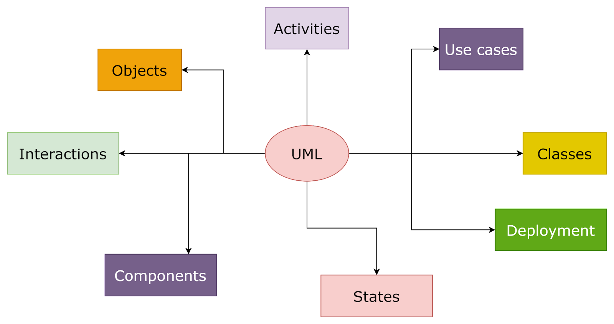

В основе UML лежат такие понятия как классы, объекты, отношения и многие другие

## Зачем нужен UML?

- UML помогает вам и вашей команде видеть одну и ту же картину
- Он обеспечивает ясность и единообразие в понимании архитектуры системы
- UML — это мост между идеей и её реализацией, между аналитиками, разработчиками и клиентами.

## Виды диаграмм UML

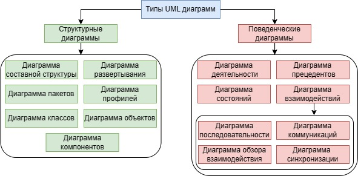

Есть диаграммы, которые помогают визуализировать структуру системы, например, **диаграммы классов** и **объектов**.

Другие фокусируются на поведении, как **диаграммы последовательностей** и **активностей**.

# 2. Основные элементы UML: обзор диаграмм и элементов UML

> **Элементы UML** — это строительные блоки для создания UML-диаграмм. К ним относятся классы, объекты, интерфейсы, компоненты, использование и многие другие. Каждый элемент имеет свои уникальные свойства и способы использования, которые мы рассмотрим подробнее в модуле.

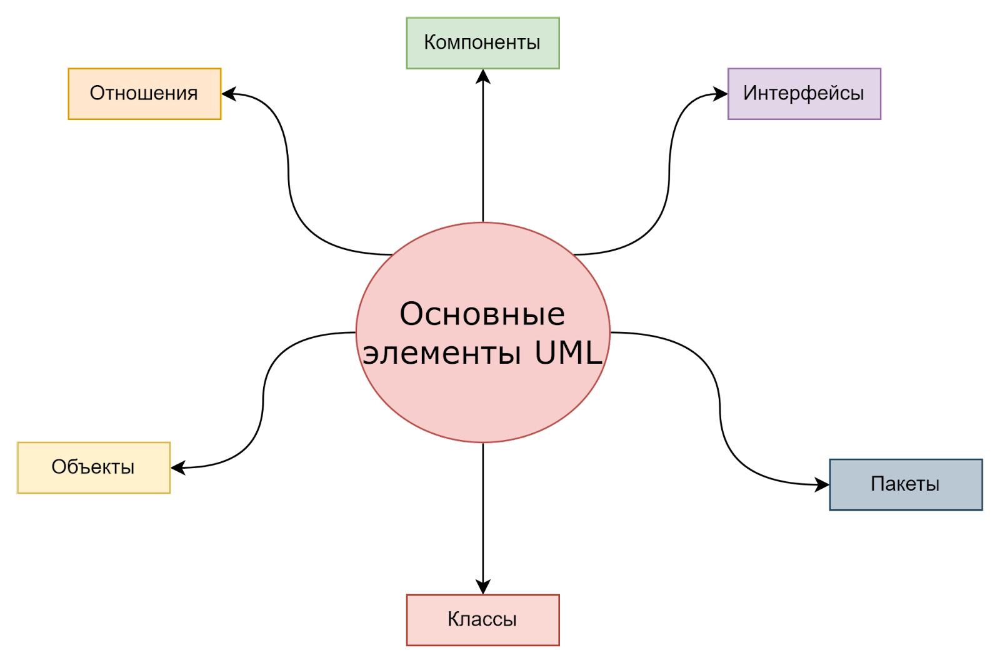

## Диаграммы классов

> **Диаграммы классов** — одни из самых распространенных в UML. Они показывают структуру системы, включая классы, их атрибуты, методы и отношения между классами. Эти диаграммы являются основой для понимания структуры программного обеспечения.

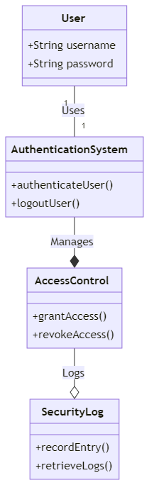

На этой диаграмме представлены следующие классы:

- **User**: содержит атрибуты пользователя, такие как имя пользователя и пароль.
- **AuthenticationSystem**: отвечает за аутентификацию пользователя и выход из системы.
- **AccessControl**: управляет доступом, предоставляя или отзывая доступ.
- **SecurityLog**: записывает и хранит журналы безопасности.

## Диаграммы объектов

> Диаграммы объектов тесно связаны с диаграммами классов, но вместо классов они фокусируются на экземплярах классов — объектах. Они полезны для понимания отношений между различными объектами в системе и их состояниями.

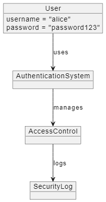

На этой диаграмме представлены объекты:

- **User**: с атрибутами username = "alice" и password = "password123".
- **AuthenticationSystem**: система аутентификации, используемая пользователем.
- **AccessControl**: система контроля доступа, управляемая системой аутентификации.
- **SecurityLog**: журнал безопасности, в который записываются события системы контроля доступа.

## Диаграммы последовательностей

> Диаграммы последовательностей показывают, как объекты взаимодействуют друг с другом в течение времени. Они идеально подходят для моделирования конкретных сценариев функционирования системы и помогают понять порядок процессов и событий.

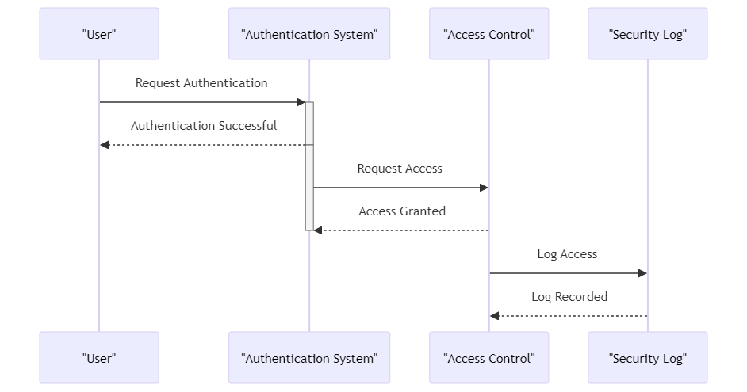 

На этой диаграмме изображены следующие взаимодействия:

- **Пользователь (User)** запрашивает аутентификацию у системы аутентификации (Authentication System).
- **Система аутентификации** подтверждает успешную аутентификацию и запрашивает доступ у системы контроля доступа (Access Control).
- **Система контроля доступа** предоставляет доступ и записывает событие в журнал безопасности (Security Log).

## Диаграммы случаев использования

> Эти диаграммы описывают функциональность системы с точки зрения конечного пользователя. Они помогают определить, какие действия пользователь может выполнять с помощью системы, и как система должна реагировать на эти действия.

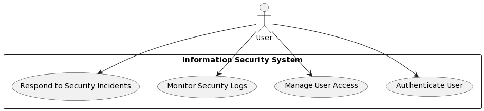 

На диаграмме мы показываем, что наш пользователь может:

- просматривать логи,
- управлять доступом,
- осуществлять аутентификацию,
- отвечать службе безопасности.

## Диаграммы активностей

> Диаграммы активностей используются для моделирования рабочих процессов и процедур. Они показывают поток управления от одной активности к другой, включая ветвления, параллельное выполнение и слияние процессов.

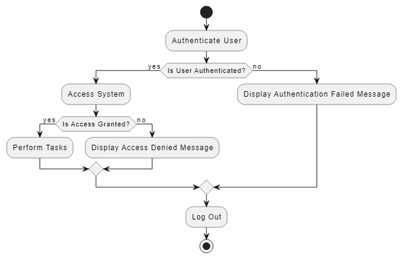 

На этой диаграмме изображены следующие шаги:

- Аутентификация пользователя.
- Проверка, успешно ли пользователь аутентифицирован.
- Если аутентификация успешна, пользователь получает доступ к системе и выполняет задачи.
- Если доступ не предоставлен, отображается сообщение об отказе в доступе.
- Если аутентификация не удалась, отображается сообщение об ошибке аутентификации.
- Пользователь выходит из системы.

## Диаграммы состояний

> Диаграммы состояний полезны для моделирования поведения объектов в ответ на различные события. Они показывают различные состояния объекта и переходы между этими состояниями.

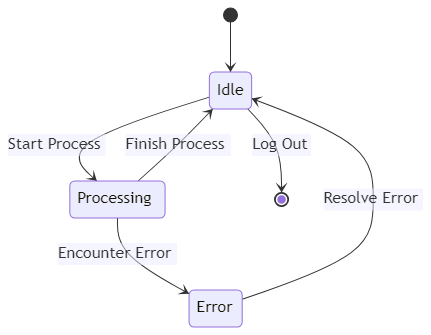

## Общие описания схем

| Тип диаграммы    | Описание    | Применение    |
|---------------- | --------------- | --------------- |
| **Диаграмма классов**    |  Показывает структуру системы с классами, их атрибутами и взаимосвязями.   |  Используется для моделирования структуры системы, включая структуру базы данных.   |
|  **Диаграмма объектов**   |  Подобна диаграмме классов, но фокусируется на экземплярах классов.   |  Используется для представления конкретных экземпляров и их взаимосвязей.   |
|  **Диаграмма последовательностей**  | Показывает взаимодействие объектов во времени.   | Используется для детализации взаимодействий между объектами для определенного сценария.   |
| **Диаграмма случаев использования**   | Отображает функциональность системы с точки зрения внешних акторов.   |  Используется для определения функций и взаимодействий между системой и пользователями.  |
| **Диаграмма активностей**   | Показывает поток управления или поток данных.   |  Используется для моделирования рабочих процессов или операций внутри системы.  |
|  **Диаграмма состояний**  | Отображает изменения состояния объекта в ответ на события.   |  Используется для моделирования поведения объектов в ответ на внешние и внутренние события.  |

# 3. Диаграмма случаев использования (Use Cases)

Играют центральную роль в процессе разработки программного обеспечения, особенно в начальных стадиях анализа и проектирования систем. Они предоставляют уникальный взгляд на систему, акцентируя внимание на взаимодействии между пользователями (или «акторами») и системой, чтобы выполнить определённые цели.

состоит из двух очень простых элементов — это актёр и вариант использования.

- **Актёр** — это пользователь.
- **Вариант использования** — это функция системы.

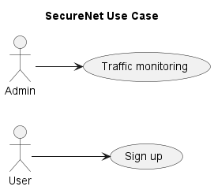

## Польза

- **Понимание потребностей пользователя**: диаграммы использования помогают разработчикам и аналитикам понять, что именно пользователи ожидают от системы. Это ключевой шаг в определении функциональных требований к системе.
- **Визуализация функциональности**: эти диаграммы визуально представляют различные функции системы и то, как пользователи будут с ними взаимодействовать. Это помогает убедиться, что все основные потребности пользователя учтены.
- **Упрощение коммуникации**: диаграммы использования служат мостом между техническими и нетехническими участниками проекта. Они представляют сложные процессы в понятной и доступной форме, что облегчает обсуждение и согласование требований.
- **Определение границ системы**: эти диаграммы помогают определить границы системы, показывая, какие функции будут реализованы внутри системы, а какие — вне её.
- **Основа для создания других диаграмм**: диаграммы использования часто служат отправной точкой для создания более детальных диаграмм, таких как диаграммы классов, диаграммы последовательности и других, которые вместе обеспечивают полное понимание системы.
- **Помощь в планировании тестирования**: они также могут служить основой для разработки тестовых сценариев, обеспечивая то, что все ключевые сценарии использования будут тщательно протестированы.

## Элементы

### Наследование

системный администратор будет иметь право делать всё то же, что и обычный пользователь, при этом стрелка будет указывать на родительский класс

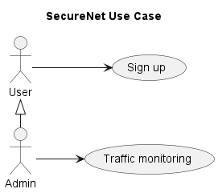

### включение и расширение

Мы можем наделить некой опцией вариант использования. У нашего администратора есть use-case «Traffic Monitoring», и при этом данный вариант использования может включать в себя «подсценарий», например анализ уязвимостей.

#### Расширение

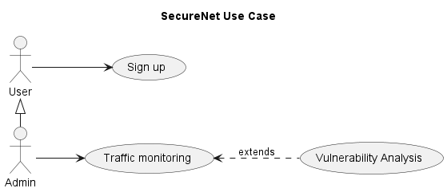

То есть системный администратор теперь при мониторинге сетевого трафика также может провести анализ уязвимостей — это необязательный сценарий, а опциональный, возможный.

При этом стрелка указывает от расширяющего use-case к расширенному, и над ней написано extends — это и называется расширением.

#### Включение

включение — это обязательный сценарий, который случится в рамках другого.

Например, если мы добавим пользователю use-case регистрации, то такой сценарий должен обязательно включать в себя сценарий заполнения анкеты

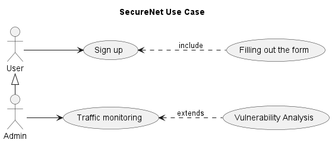

# 4. Диаграмма классов (Classes Diagram)

> это структурные диаграммы в UML, которые используются для представления статического вида системы. Они показывают систему с точки зрения классов и отношений между ними. Эти диаграммы являются критически важными для понимания и проектирования структуры объектно-ориентированных систем.

- помогают понять, как устроена система, какие классы в ней есть, и как они взаимодействуют
- служат отличным средством для документирования системы
- помогают на этапах планирования и проектирования для определения необходимых классов и их отношений

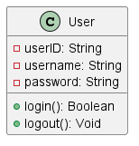

## Обозначение уровня доступности

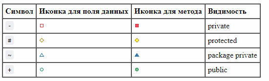

## Наследование

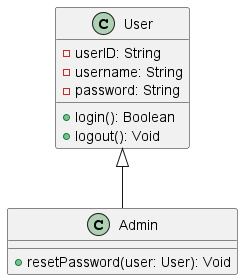 

## Связи

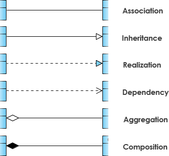 

Могут быть:
- один к одному (one to one)
- один к многим (one to many)
- многие к многим (many to many)

### Ассоциация

> структурная связь, которая представляет отношения между объектами различных классов. Эта связь указывает, что объекты одного класса каким-то образом связаны с объектами другого класса. Ассоциации могут быть однонаправленными или двунаправленными и могут включать в себя такие характеристики как множественность (количество связей между объектами) и роли (описание природы связи).

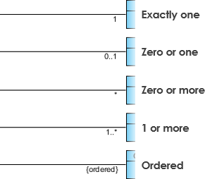

#### Пример

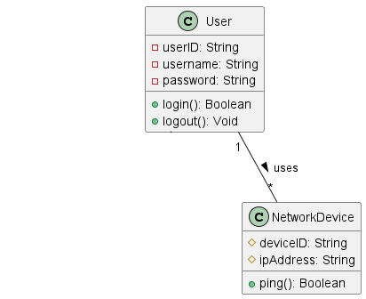

### Агрегация

> (на диаграмме представляется незакрашенной ромбовидной стрелкой) — это специальный вид ассоциации, который представляет отношение «часть-целое» между совокупностью (целым) и её компонентами (частями). При этом в агрегации компоненты могут существовать независимо от совокупности.

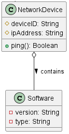

NetworkDevice будет агрегировать Software. Это означает, что Software. может существовать независимо от NetworkDevice. И в то же время в системе может не быть ни одно Software

### Композиция

> (на диаграмме представляетсяа закрашенной ромбовидной стрелкой) — это более строгий вид агрегации. В композиции, если совокупность (целое) уничтожается, то и её компоненты также уничтожаются. Это указывает на более сильную зависимость между частями и целым.

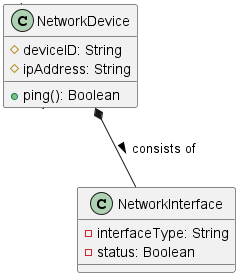

NetworkDevice состоит из одного или нескольких объектов NetworkInterface. Это композиция, так как **NetworkInterface не могут существовать отдельно от NetworkDevice**. Если сетевое устройство выходит из строя или уничтожается, его сетевые интерфейсы также перестают существовать

### Зависимость (использование)

> является отношением между двумя элементами, при котором изменение одного элемента (независимого) может повлиять на другой элемент (зависимый). Это отношение обозначается пунктирной стрелкой.

В контексте зависимости «использование» означает, что один класс (зависимый) использует или зависит от другого класса (независимого) в определённой части своей функциональности. Например, класс может использовать методы другого класса.

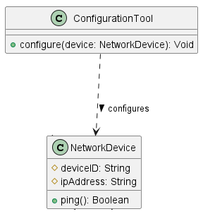

- ConfigurationTool зависит от класса NetworkDevice. Это означает, что для выполнения своих функций по конфигурированию сетевых устройств ConfigurationTool использует объекты класса NetworkDevice
- изменения в классе NetworkDevice могут повлиять на функциональность ConfigurationTool

## Пример

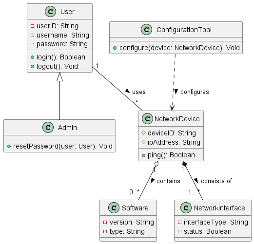

- **Ясность структуры**: мы чётко определили основные классы, такие как User, Admin, NetworkDevice, Software, NetworkInterface и ConfigurationTool, каждый из которых имеет свои уникальные атрибуты и методы.
- **Визуализация отношений**: мы наглядно представили отношения между классами, включая наследование (Admin расширяет User), ассоциацию (User использует NetworkDevice), агрегацию (NetworkDevice содержит Software) и композицию (NetworkDevice состоит из NetworkInterface).
- **Понимание ролей и взаимодействий**: диаграмма помогает понять, как различные компоненты системы взаимодействуют друг с другом, что критически важно для эффективного проектирования и реализации функционала.

# 5. Диаграмма состояний (State Diagram)

> Диаграмма состояний, также известная как диаграмма состояний-переходов, — это графическое изображение состояний, в которых может находиться объект, а также переходов между этими состояниями.

> Состояние — это конкретное условие или ситуация, в которой находится объект в определённый момент времени.

- помогают понять, как объект или система реагирует на различные внешние воздействия или события в разное время
- подходят для моделирования жизненного цикла объекта, показывая, как объект меняет свое состояние в ответ на внешние и внутренние события
- облегчают коммуникацию между разработчиками, аналитиками и другими заинтересованными сторонами
- помогают выявлять непредвиденные состояния или нежелательное поведение в системе

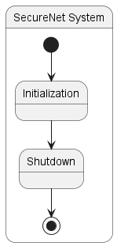

-  - начальное состояние (Start State)
- Состояния
    - Initialization — система находится в начальной фазе запуска.
    - Shutdown — процесс выключения системы.
-  - конечное состояние (End State)

## Вложенные состояния

Состояния могут включать внутренние состояния

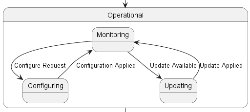

## Пример

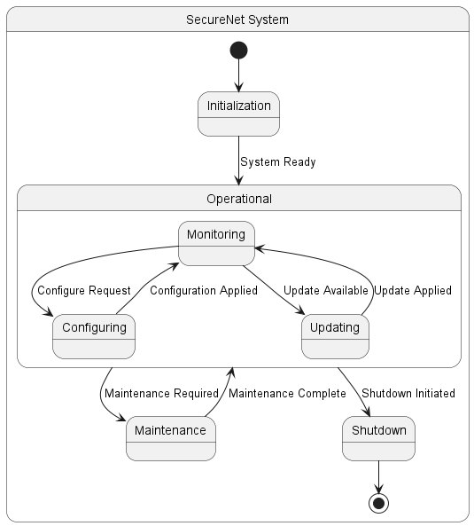

# 6. Диаграмма активности (Activity Diagram)

> графическое представление рабочих процессов и операций в системе. Она иллюстрирует поток управления и данных от одной активности к другой, показывая, как различные компоненты системы взаимодействуют в процессе выполнения задач.

- играют ключевую роль в моделировании поведенческих аспектов системы
- представляют собой графические изображения рабочих процессов и операций
- полезны для понимания и анализа сложных последовательностей действий и взаимодействий внутри системы

## Компоненты

### Узлы Активности

Представляют собой отдельные шаги или операции в процессе.

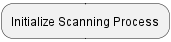 

### Решения и Ветвления

Указывают на места, где процесс может следовать разными путями в зависимости от определенных условий.

#### Условие

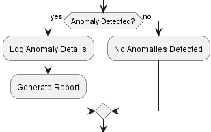 

#### Цикл

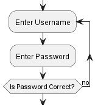 

### Слияния

Объединяют различные ветви процесса обратно в один поток.

### Параллельное Выполнение

Показывает операции, которые могут выполняться одновременно.

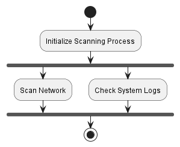 

### Символы Старта и Конца

Отмечают начало и завершение процесса.

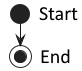

# 7. Диаграмма последовательности (Sequence Diagram)

> являются одним из основных инструментов для визуализации взаимодействий между объектами в рамках определённого бизнес-процесса или в контексте выполнения сценария. Эти диаграммы фокусируются на порядке и условиях обмена сообщениями между различными участниками (объектами) системы.

## Компоненты

- **Объекты** Представлены прямоугольниками с именами объектов и их классами.
- **Линии жизни** Вертикальные линии, исходящие из объектов, показывающие, как долго объект участвует в процессе.
- **Сообщения** Горизонтальные стрелки между линиями жизни, обозначающие обмен информацией между объектами.
- **Активационные бары** Горизонтальные прямоугольники на линиях жизни, показывающие периоды активности объекта.

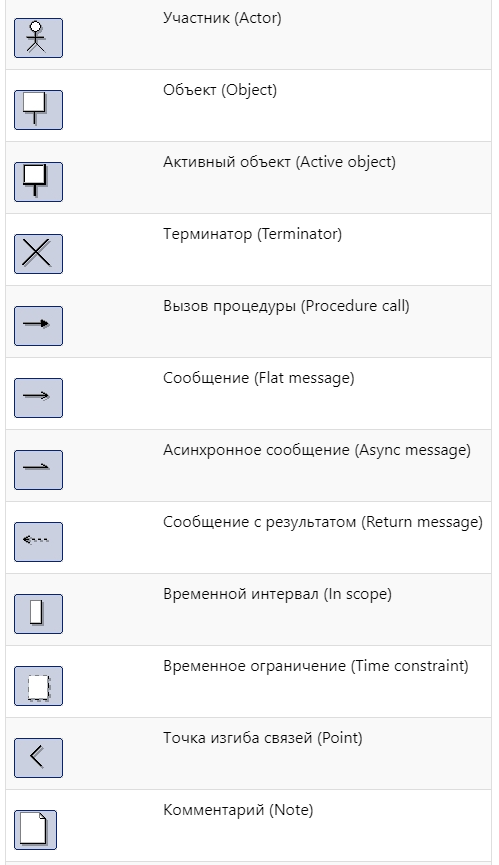

## Пример

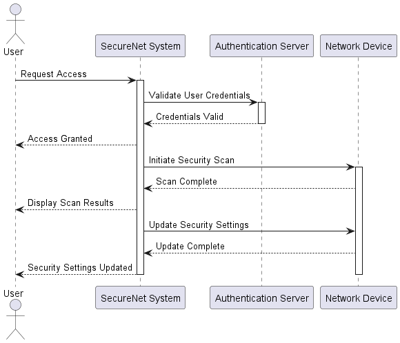 

