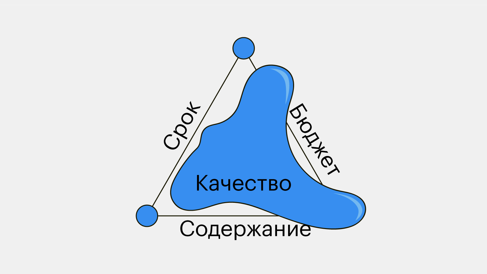
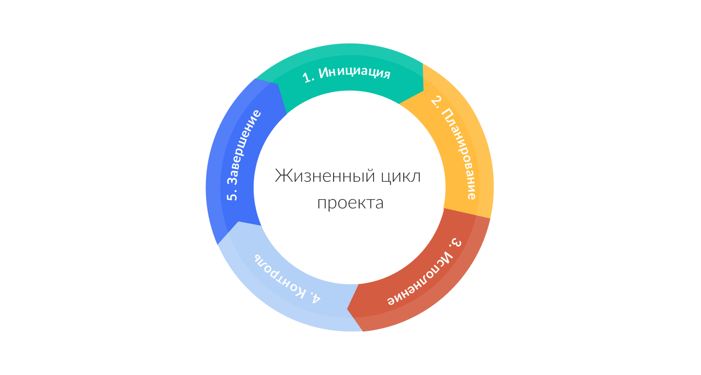
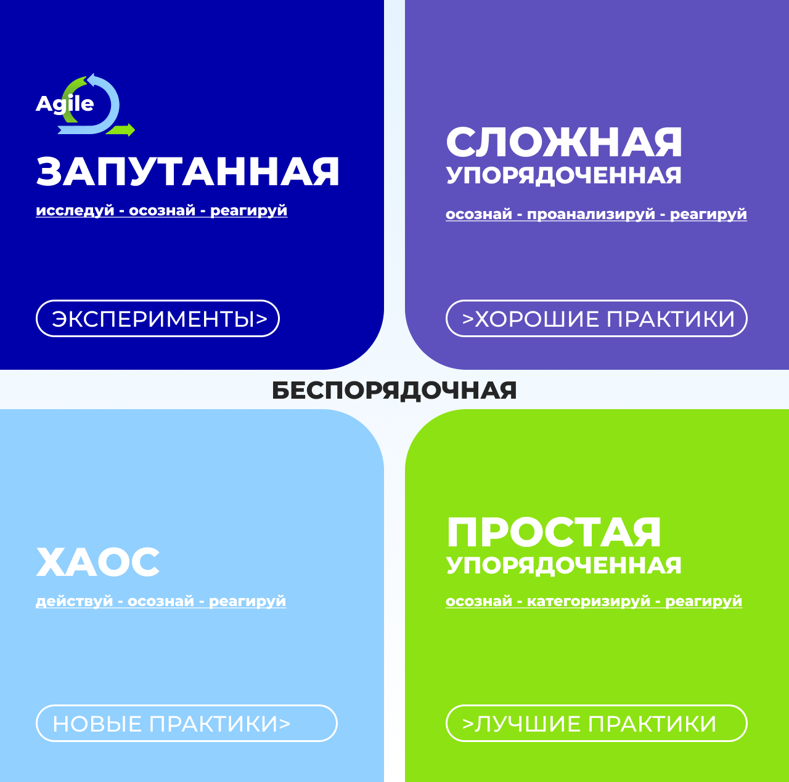
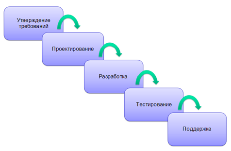
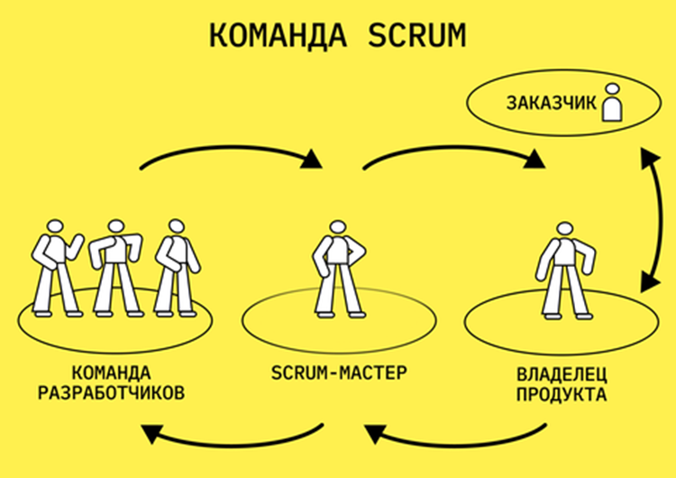
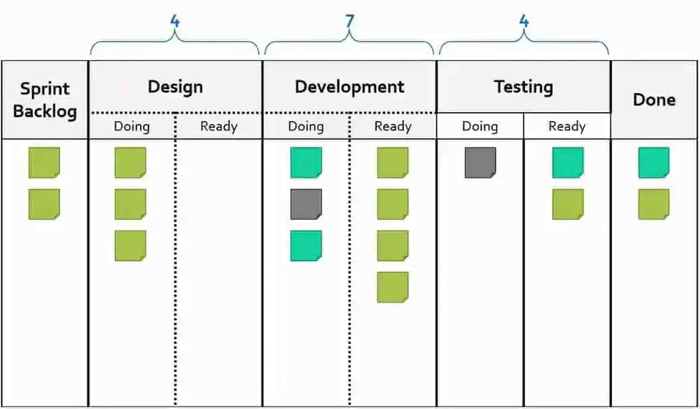

# 1. Виды проектов

## Процессный и проектный подход к управлению

> **Процессный подход** - это метод управления, который фокусируется на понимании и оптимизации процессов для достижения поставленных целей. Вместо того чтобы рассматривать работу как набор отдельных задач, процессный подход рассматривает каждую задачу как часть более широкой цепочки процессов, которые взаимосвязаны и влияют друг на друга.

Основное внимание уделяется оптимизации и улучшению этих процессов для достижения более эффективных результатов, которые в принципе уже есть и вполне понятны.

> **Проектный подход** - это метод управления, который фокусируется на планировании, выполнении и завершении конкретных проектов с четко определенными целями, сроками и ресурсами. Этот подход позволяет организовать работу таким образом, чтобы достичь заданных результатов в рамках ограничений времени, бюджета и качества.

Есть шесть основных критериев, по которым можно различить проектный и процессный подход:
1. определение целей и задач;
1. время;
1. гибкость;
1. управление рисками;
1. участники;
1. измерение успеха.

### Цели и задачи

#### В проектном подходе

- Главная цель - завершить его вовремя, в рамках бюджета и с заданным результатом
    - определяет качество проекта
- есть задачи - все, что нужно выполнить, чтобы проект был успешным
    - Каждая задача уникальна и направлена на достижение этой цели
- напрямую связаны с такими сущностями
    - срок
    - бюджет
    - содержание
    - объединены в проектный треугольник, или треугольник проектного управления

#### В процессном подходе

- цель — постоянное улучшение процессов и повышение их эффективности
- Задачи часто стандартизированы инструкциями или регламентами и регулярно повторяются

### Время

**Проектный подход**
- всегда ограничен по времени: у проекта есть начало и конец
- Успех таких проектов часто оценивается по тому, удалось ли уложиться в отведенное время

**Процессный подход**
- процессы непрерывны и не имеют четко определенных границ, так что и изменения в них происходят постоянно

### Гибкость

существуют методологии, которые позволяют управлять проектами с учетом изменений и адаптироваться к новым условиям

### Управление рисками

**В проектном подходе**
- сосредоточено на уникальных рисках, связанных с конкретным проектом
- Из-за высокой неопределенности риски могут появляться в процессе работы

**В процессном подходе**
- риски рассматриваются как часть всей системы
- акцент делается на их систематическое управление и снижение
- связаны с нарушением работы процесса
- определяются на начальном этапе и практически не меняются со временем

### Участники

**В проектном подходе**
- команды создаются временно для выполнения конкретного проекта
- состав меняется от одного проекта к другому

**В процессном подходе**
- как правило, постоянные
- занимаются поддержанием и улучшением процесса

### Измерение успеха

**В проектном подходе**
- определяется по завершению проекта
    - чтобы цели и задачи были достигнуты
    - сроки и бюджет соблюдены

**В процессном подходе**
- измеряется через эффективность и стабильность процессов
- насколько хорошо и бесперебойно они работают в долгосрочной перспективе

## Законодательство РФ в сфере проектного управления

Основные акты, которые следует знать
1. [Гражданский кодекс РФ](https://www.consultant.ru/document/cons_doc_LAW_5142/). Основной правовой акт, регулирующий гражданские правоотношения, включая контрактные отношения в рамках проектного управления. Он определяет общие принципы заключения и исполнения договоров, что важно для управления проектами.
1. [Федеральный закон «О контрактной системе в сфере закупок товаров, работ, услуг для обеспечения государственных и муниципальных нужд» (44-ФЗ)](https://www.consultant.ru/document/cons_doc_LAW_144624/) Регулирует порядок закупок для государственных нужд, включая проектирование и выполнение работ. Он определяет правила и процедуры, которые должны соблюдаться при организации и проведении тендеров и контрактов.
1. [Федеральный закон «Об инвестиционной деятельности в Российской Федерации, осуществляемой в форме капитальных вложений» (39-ФЗ)](https://www.consultant.ru/document/cons_doc_LAW_22142/) Регулирует инвестиционные проекты от планирования и финансирования до реализации.
1. Стандарты и методологии.
В России также разработаны различные стандарты и методологии в области проектного управления. Например, [ГОСТ Р 54869-2011 «Управление проектами. Требования»](https://www.isopm.ru/download/gost-54869.pdf), который устанавливает требования к управлению проектами, а также [Система менеджмента проектной деятельности и ГОСТ Р 58184-2018](https://docs.cntd.ru/document/1200159995).

# 2. Этапы проектного цикла

1. **Инициация.** Определение направления проекта на основе обратной связи пользователей и анализа рыночных тенденций, а также определение сроков, бюджета и необходимых ресурсов.
1. **Планирование.** Создание детального плана обновления, в котором изложены все необходимые шаги и стратегии.
1. **Реализация.** Выполнение плана обновления, включающее в себя непосредственную работу над улучшением и расширением функциональности приложения.
1. **Мониторинг и контроль.** Постоянное наблюдение за ходом проекта, обеспечение соблюдения запланированных сроков и бюджета, а также оперативное решение любых возникающих проблем.
1. **Завершение.** Официальное завершение проекта обновления, ознакомление пользователей и заказчика с результатами.

Проектный цикл представляет собой последовательность этапов, через которые проходит проект от его инициации до завершения. Каждый этап имеет свои цели, задачи и, конечно же, результаты

## Инициация

> определяется необходимость проекта. Она может быть продиктована разными факторами — от идеи улучшения чего-либо до регуляторных норм.

проводится анализ целесообразности и формируется первоначальная концепция в виде идеи

несколько мероприятий:
1. **определение проблемы или возможностей**
    - Руководителю проекта или исполнителю важно начать с анализа ситуации
        - какую проблему нужно решить
        - какую новую возможность можно использовать
    - собираются данные, которые помогут проанализировать текущее состояние дел
1. **формирование команды проекта**
    - выбор участников команды, включая проектного менеджера (руководителя проекта), специалистов и заинтересованных сторон
    - назначать *конкретных людей* на этапе планирования не обязательно
1. **определение целей и задач проекта**
    - четко определить цели проекта и задачи для их достижения
    - Цели могут быть количественными или качественными
    - установить критерии успеха
1. **оценка сроков, работ и стоимости**
    - сложно определить точные цифры, но зато можно определить рамки, за которые точно нельзя выходить
1. **идентификация заинтересованных сторон**
    - составить список всех возможных заинтересованных сторон
        - внутренние заинтересованные стороны
        - внешние заинтересованные стороны
    - провести их анализ
        - оценку их влияния на проект и влияния проекта на них
        - определение уровня их интереса
        - можно классифицировать заинтересованных сторон
            - по уровню влияния
            - интереса
    - разработать стратегию взаимодействия с каждой группой
1. **составление устава проекта**
    - > официальный документ, который фиксирует основные цели, задачи и рамки проекта, служа основой для его реализации
    - содержит:
        - Подробное описание проекта и его целей.
        - Определение задач и требований, которые необходимо выполнить.
        - Информацию о заинтересованных сторонах и их ролях.
        - Первоначальный бюджет и сроки проекта.
        - Оценку потенциальных рисков и подход к их управлению.
1. **Согласование и утверждение с заказчиком проекта или его спонсором**
    - предоставление исчерпывающей информации для ключевых лиц, принимающих решение, получение обратной связи и формирование управленческого решения

## Планирование

1. **создание иерархической структуры работ**
    - разбить проект на более мелкие понятные части и декомпозировать задачи
    - позволит лучше понять объем работы и распределить задачи между участниками команды
1. **оценку ресурсов**
    - определяется, какие именно ресурсы понадобятся для выполнения проекта
        - могут быть роли, оборудование или материалы
1. **оценку времени и сроков выполнения задач**
    - сколько времени потребуется для каждой задачи с учетом квалификации команды
    - устанавливают сроки для всего проекта
1. **Определение критериев успеха для каждого вида работ**
    - как оценивать успех работы в целом и отдельных задач
    - нужны метрики и показатели, которые помогут следить за выполнением

## Исполнение (реализация)

Этот этап — самый важный, потому что именно здесь выполняются все задачи, запланированные для достижения целей проекта. Другими словами, начинается основная работа.

1. **Запуск проекта**
    - может быть стартовая встреча, где команда обсуждает цели, задачи и роли каждого участника
1. **Выполнение задач**
    - команда приступает к выполнению задач, описанных в плане проекта
    - Все работы должны соответствовать установленным срокам, стандартам качества и сопровождающим документам
    - могут появляться новые требования или изменяться условия
        - иметь четкий механизм управления изменениями
    - Коммуникация здесь особенно важна
    - Работа с документацией
        - помогает фиксировать все изменения, решения и промежуточные результаты
        - делает процесс прозрачным для всех участников и позволяет избежать потери информации

## Мониторинг (контроль)

контролируется
- выполнение задач
- прогресс проекта и соответствие установленным планам
- все ли идет по графику
- укладывается ли проект в бюджет и соблюдаются ли требования к качеству

1. **Отслеживание прогресса**
    - регулярная проверка выполнения задач проекта, где фактические результаты сравниваются с запланированными
1. **Анализ отклонений**
    - выявляются отклонения, важно разобраться в их причинах
    - команда может собраться на встречу и обсудить, почему некоторые задачи задерживаются
1. **Управление рисками**
    - следить за ранее выявленными рисками и выявлять новые, которые могут повлиять на выполнение проекта
1. **Коммуникация с заинтересованными сторонами**
    - Эффективное взаимодействие с заинтересованными сторонами позволяет держать всех в курсе текущего статуса проекта и любых изменений
1. **Контроль качества**
    - следить за качеством выполняемых задач и соответствием установленным стандартам
    - может включать регулярные проверки и тестирование

## Завершение

1. **оценку результатов выполненной работы**
    - команда анализирует, насколько достигнутые результаты соответствуют изначально поставленным
        - целям и задачам
        - сроки
        - бюджет
        - содержание проекта
1. **документирование достигнутых результатов**
    - зафиксировать все достижения, проблемы и извлеченные уроки
    - Итоговый отчет должен включать:
        - успешные кейсы;
        - области для улучшения;
        - рекомендации — например, возможность начать новый проект для решения дополнительных задач.
1. **передачу проекта заинтересованным сторонам**
    - все результаты проекта переданы заказчикам, пользователям и другим заинтересованным сторонам
1. **Закрытие контрактов и финансовых вопросов**
    - завершить все финансовые и юридические аспекты проекта, включая закрытие контрактов с поставщиками и подрядчиками
    - проверку всех финансовых расчетов, завершение платежей и подписание необходимых документов

# 3. Качество проекта

> **Качественные характеристики проекта** - это ключевые критерии и показатели, которые позволяют оценить его успешность. Они помогают понять, насколько проект соответствует заявленным целям, выполняет свои функции и удовлетворяет потребности пользователей

Сюда относятся:
- качество продукта;
- удовлетворенность заинтересованных сторон;
- соответствие требованиям;
- эффективность процессов;
- гибкость и адаптивность;
- устойчивость проекта.

### Качество продукта

показывает, насколько продукт отвечает требованиям и ожиданиям пользователей. Хороший продукт работает без сбоев, безопасен и удобен в использовании.

### Удовлетворенность заинтересованных сторон

> насколько заказчики, пользователи, команда проекта довольны результатами. Уровень удовлетворенности может зависеть от того, насколько хорошо проект соответствует их ожиданиям

может касаться не только самой разработки, но и получения оперативной информации о ходе проекта, возможности обсуждать и вносить какие-либо изменения в ходе реализации, согласовав с командой исполнителя

### Соответствие требованиям

> насколько проект соответствует установленным требованиям и стандартам, включая как функциональные, так и нефункциональные требования

### Эффективность процессов

> насколько рационально используются ресурсы (время и бюджет) в ходе выполнения проекта

Оптимизация процессов позволяет минимизировать затраты и сократить сроки реализации, что в итоге приводит к повышению общей эффективности проекта.

### Гибкость и адаптивность

> Отражает способность проекта адаптироваться к изменениям во внешней среде или требованиям заинтересованных сторон

Гибкость позволяет команде быстро реагировать на новые вызовы и возможности

### Устойчивость проекта

Если проект сталкивается с неожиданными задержками из-за нехватки ресурсов, — трудовых или компетентных, — устойчивый проект может адаптироваться и найти альтернативные решения, чтобы минимизировать влияние на конечный результат

## Как определить качественные характеристики проекта

### анализа требований заинтересованных сторон

Для решения данной задачи есть инструмент проведения интервьюирование и анкетирования.

> **Интервьюирование** - это один из наиболее эффективных способов сбора информации о потребностях. В ходе интервью можно задавать вопросы, чтобы участники ответили на них максимально точно. Так вы определите ожидания всех заинтересованных сторон.

> **Анкетирование** - еще один метод сбора информации, который позволяет охватить более широкую аудиторию.

Обсуждения с заинтересованными сторонами помогают обмениваться идеями и решать вопросы. Это могут быть формальные встречи с протоколами или неформальные дискуссии

- важно зафиксировать все требования

### Разработка и классификация критериев качества

Такие критерии помогут определить, достигнуты ли желаемые результаты и насколько успешно выполнены задачи.

Они должны быть:
- понятными;
- измеримыми;
- связанными с целями проекта.

Для разработки критериев сначала нужно четко определить показатели, по которым будет оцениваться проект.

Критерии качества можно разделить на несколько категорий:
- функциональные требования;
- нефункциональные требования;
- эксплуатационные требования.

#### Функциональные требования

- что именно должен делать продукт, и определяют функции, которые должны быть реализованы
- При разработке критериев качества важно четко определить, какие функции являются критически важными для пользователей.

#### Нефункциональные требования

Раскрывают то, как должна система работать, а не что она должна выполнять, и включают:
- производительность;
- безопасность;
- надежность;
- удобство использования.

Например, приложение должно загружаться за две секунды, защищать данные, подходить под правила и работать на любых устройствах.

#### Эксплуатационные требования

Касаются условий, в которых ПО будет использоваться. Это требования к информационной среде или даже обычной среде, в которой будет работать продукт, такие как операционные системы, браузеры или оборудование. Эти требования могут включать в себя ряд требований к обучению пользователей и технической поддержке.

# 4. Методологии ведения проектов

## Cynefin

> **Cynefin** - инструмент, помогающий увидеть, в какой ситуации сейчас находится глобальная задача и как лучше принимать решения в разных ситуациях.

Модель Cynefin помогает лучше понимать, в каких условиях вы находитесь, и как лучше всего действовать в каждой ситуации. Она подчеркивает, что разные ситуации требуют разных подходов, и помогает принимать более обоснованные решения.

Необходимо переходить из более сложной ситуации в более простую, то есть уходить от неопределенности, насколько это возможно.

### Простая ситуация

- Сюда относятся простые и понятные кейсы, где связь между причиной и следствием ясна
- надо действовать по принципу «воспринимай — категоризируй — реагируй».
- если у вас есть рецепт, вы точно знаете, что нужно сделать, чтобы приготовить блюдо, так что следуете установленным процессам, лучшим практикам да и просто инструкциям.

### Сложная ситуация

- связь между причиной и следствием не всегда очевидна, но ее можно выяснить с помощью анализа и какой-либо экспертизы
- работает принцип «осознай — проанализируй — реагируй».
- если у вас есть техническая проблема, нужно обратиться за помощью к специалисту
- используем лучшие практики.

### Запутанные ситуации

- связи между причиной и следствием могут быть непредсказуемыми
- действовать по принципу «исследуй — воспринимай — реагируй».
- используем уже не лучшие практики, а возникающие практики и эксперименты.

### Хаос

- нет ясной связи между причиной и следствием, и они требуют немедленного реагирования
- Подходит на случаи кризиса или аварии, когда нужно быстро принимать решения, чтобы предотвратить ухудшение ситуации
- работать по принципу «действуй — воспринимай — реагируй»
- вместо опоры на уже существующие практики самостоятельно формировать новые.

### Беспорядочная ситуация

- неясно, как действовать, и четкой информации тоже нет
    - нет готовых решений
    - Определение причинно-следственных связей и их направления тут невозможно из-за высокой степени неопределенности, которая находится в центре всей модели.
- Для смещения отсюда в другую категорию необходимо проанализировать, какие данные вы уже имеете, а какой информации еще не хватает
    - Только определив это, вы сможете сделать следующий шаг и перейти из неопределенности в более определенное состояние.

## нормативные документы и стандарты

1. **PMBOK (Project Management Body of Knowledge)**
    - свод знаний по управлению проектами, разработанный Институтом управления проектами (PMI)
    - описывает основные процессы, области знаний и лучшие практики в управлении проектами
    - Данный свод постоянно актуализируется, сейчас есть уже [седьмое издание](https://pmjournal.ru/articles/biznes-stati/kratkoe-soderzhanie-pmbok-7/).
1. **[PRINCE2 (PRojects IN Controlled Environments)](https://www.prince2.com/eur/what-is-prince2)**
    - Разработана в Великобритании и основана на подходах к [менеджменту](https://ru.wikipedia.org/wiki/%D0%9C%D0%B5%D0%BD%D0%B5%D0%B4%D0%B6%D0%BC%D0%B5%D0%BD%D1%82), контролированию и организации проектов.
1. **[ISO 21500](https://docs.cntd.ru/document/1200118020)**
    - Стандарт с рекомендациями, основными понятиями, практиками и характеристиками процессов проектного менеджмента.
1. **[Agile Manifesto](https://agilemanifesto.org/iso/ru/manifesto.html)**
    - Свод правил и принципов, который лег в основу методологии Agile.

## Популярные методологии ведения проектов

1. **Agile** - гибкий подход, который, как вы уже знаете, помогает быстро адаптироваться к изменениям и активно взаимодействовать с заказчиком. Часто применяется в разработке на заказ.
1. **Scrum** - это часть Agile, где работа делится на небольшие этапы (итерации) для удобного контроля.
1. **Waterfall** - последовательная модель работы, где каждый этап завершается перед началом следующего. Например, при строительстве дома сначала делают фундамент, а уже потом начинают возводить стены.
1. **Kanban** - метод для управления задачами, где процессы показывают на доске для наглядности. Часто используется вместе со Scrum.
1. **PRINCE2** - метод, который стандартизирует и формализует управление проектами.

# 5. Стандарты Waterfall, Agile, Scrum и Kanban

## Waterfall

> последовательная модель разработки, которая предполагает прохождение проекта через серию фаз, каждая из которых завершается до начала следующей

### Этапы Waterfall

1. **Требования (Requirements)** - определение проектных требований.
1. **Проектирование (Design)** - разработка детального плана проекта.
1. **Реализация (Implementation)** - непосредственно программирование или выполнение действий на основе созданного плана.
1. **Тестирование (Testing)** - выявление ошибок в разработке.
1. **Развертывание (Deployment)** - установка и настройка готового программного обеспечения в рабочей среде.
1. **Поддержка (Maintenance)** - обеспечение функционирования программного обеспечения.

### Pros & Cons

| Pros | Cons |
| -------------- | --------------- |
| в его простоте и понятности: модель легко объяснить и использовать | отсутствия гибкости сложно вносить изменения на поздних стадиях |
| удобство планирования и управления ресурсами благодаря четкой структуре | Длительность процесса тоже может быть проблемой, так как следующий этап начинается только после завершения предыдущего |
| Контроль над проектом обеспечивается строгим следованием этапам, а подробная документация на каждом шаге упрощает работу| ошибки и недочеты часто выявляются только ближе к концу проекта, что увеличивает риски |

## Agile

Суть Agile заключается в наличии кроссфункциональной независимой команды, коротких циклах поставок (промежуточных результатах, которые можно использовать), а также в экспериментах и уточнении требований прямо в процессе работы. Методология Agile представляет собой подход к управлению проектами, основанный на гибкости, адаптивности и взаимодействии с заказчиком.

[Ознакомиться с Agile-манифестом](https://agilemanifesto.org/iso/ru/manifesto.html)

### Когда подходит

1. **Культура**
    - требует открытости, доверия, сотрудничества и готовности к изменениям
    - Если доминируют жесткая иерархия и контроль, это может затруднить применение гибких методологий.
1. **Команда**
    - должны быть небольшими, чтобы эффективно взаимодействовать, но достаточными, чтобы иметь все необходимые компетенции для выполнения задач
    - Команда периодически взаимодействует с представителями заказчика, которые могут быстро предоставить обратную связь по функциональности продукта
1. **Проекты**
    - подходит для проектов, где меняются требования и важно быстро реагировать на изменения
    - > **Инкрементная поставка** - методика, которая подразумевает регулярную и поэтапную доставку функциональности или продукта
        - позволяет регулярно предоставлять рабочие версии ПО и получать обратную связь

### Инструменты Agile

- **Итерации, или спринты (Sprints)** короткие периоды работы, обычно две-четыре недели, в течение которых команда создает рабочую версию продукта или его части.
- **Сборы или встречи (Meetings)**  это регулярные встречи команды, которые помогают организовать работу и отслеживать прогресс.
На них проводится планирование спринта: команда определяет задачи и цели на предстоящий спринт.
- **Канбан (Kanban)**  это метод визуализации процессов, чтобы улучшить производительность и снизить время выполнения задач.
Данный инструмент вы разберете более подробно в конце этого урока.
- **User Stories, или пользовательские истории**  это краткие описания требований от заказчика, сформулированные с точки зрения конечного пользователя. Вместо того чтобы писать технические требования или технические задания, команда собирает и формулирует User Stories.
- **Ретроспективы (в рамках встреч)**  это регулярные обзоры процесса и практик команды, которые выявляют, что работает хорошо, а что можно улучшить.

### Pros & Cons

| Pros | Cons |
| -------------- | --------------- |
| Гибкость быстро адаптироваться к изменениям в требованиях заказчика. Методология позволяет быстро доставлять функционирующий продукт, а не ждать завершения всего проекта | может создавать неопределенность на ранних этапах проекта, особенно если заказчик не может четко определить свои требования или часто их меняет |
| постоянно проводится тестирование и собирается обратная связь | Если в команде есть недостаток опыта или плохая коммуникация, это может негативно сказаться на проекте |
| помогает тесному взаимодействию с заказчиком | В большой компании, где несколько команд работают над разными частями одного проекта, возникает сложность в синхронизации действий |
| Команда работает в сотрудничестве, проводит регулярные встречи и обсуждает успехи или проблемы | Если обратная связь от заказчика отсутствует или поступает слишком редко, это может затруднить процесс разработки |
|  | есть риск переусложнения процесса, особенно если команда пытается следовать всем практикам и инструментам без необходимости |

## Scrum

> фреймворк гибкой методологии управления проектами, который чаще всего используется в разработке программного обеспечения. Он строится на итеративном и поэтапном подходе.

У Scrum-подхода есть пять ключевых ценностей, которые помогают создавать сильные команды и эффективно управлять проектами

[ознакомиться с ценностями Scrum](https://habr.com/ru/articles/828306/)

1. **Открытость**  прозрачность в работе и готовность делиться информацией внутри команды.
1. **Уважение**  основа эффективной работы, когда члены команды ценят друг друга.
1. **Смелость**  готовность принимать сложные решения и действовать, несмотря на трудности.
1. **Фокус**  сосредоточенность на текущих задачах и целях.
1. **Командная работа**  общая приверженность членов команды общим целям и задачам.

### Команда Scrum

Исходя из ценностей вы уже поняли, что в большей степени именно команда, люди и их soft skills — особенно важный фактор в работе по Scrum. Обратимся к составу команды — он показан на рисунке ниже.

- **Product Owner (владелец продукта)**  это человек, который определяет и расставляет приоритеты требований к продукту, работая с бэклогом задач. Он связывает команду разработки с заказчиками и отвечает за то, чтобы продукт соответствовал их ожиданиям.
- **Scrum Master**  это человек, который следит за соблюдением принципов Scrum, помогает команде работать эффективно и устраняет препятствия. Его роль заключается в фасилитации процессов, а не в постановке задач, поэтому не путайте с руководителем проекта.
- **Команда разработки**  это группа специалистов, которые занимаются созданием продукта или выполнением проекта. Они участвуют в планировании, реализации задач и их тестировании.

### Инструменты Scrum

- **Бэклог продукта** это список функций и задач, которые необходимо реализовать в проекте. Этот список поддерживает и приоритизирует владелец продукта, учитывая потребности пользователей и цели проекта.
- **Бэклог спринта** это список задач, которые команда разработки выбрала для выполнения в текущем спринте
    - формируется из задач бэклога продукта, которые команда считает возможным и важным завершить за спринт.
- **Story point** условная единица, которая используется для оценки размера задачи
    - применяются относительные оценки.
        - команда сначала выбирает задачу, которая предпоследняя по длительности (почти самая короткая)
        - Эта задача принимается за один story point, так как ее размер позволяет избежать искажений при оценке более крупных задач
        - для остальных задач определяется, во сколько раз они сложнее или больше базовой задачи, и им присваиваются соответствующие оценки.
    - помогает учесть не только объем работы, но и контекст, в котором задачи выполняются.
- **Доска задач**  это инструмент для визуализации и управления задачами, который помогает отслеживать прогресс работы.
    - Часто используется Канбан-доска, которая может быть физической (например, стикеры на доске) или цифровой (в таких инструментах, как Trello).

## Kanban

- помогает визуализировать задачи, ограничивать количество задач в работе и постоянно улучшать процесс выполнения.
- Главной целью Kanban было повышение эффективности и устранение потерь в производственных процессах.

### Принципы Kanban

- **Визуализация работы** в Kanban все задачи представлены в виде карточек на доске. 
- **Ограничение WIP (Work In Progress)** установка лимитов на количество задач, которые могут находиться в работе одновременно
    - помогает избежать перегрузки команды и поддерживать баланс на всех этапах процесса.
- **Управление потоком** отслеживание того, как задачи перемещаются через этапы работы, и поиск способов улучшения этого движения.
    - Команда анализирует, где возникают узкие места, например, на каком этапе задачи задерживаются дольше всего
    - определяет, как можно оптимизировать процесс, чтобы работа шла быстрее и эффективнее.
- Также необходимо постоянное улучшение, которое подразумевает регулярный анализ и поиск возможностей для оптимизации процессов.

## Как выбрать нужную методологию для проекта

если вы понимаете, что требования могут меняться, подойдет гибкая методология. Если это какие-то жесткие требования, которые понятны изначально, и все их лучше прописать в самом начале, — лучше использовать методологию Waterfall.

формирование гибридных методологий: это когда весь проект может идти, например, по Waterfall, когда его этапы последовательные и понятен результат, а сама разработка и подзадачи внутри этапа — по гибкой методологии.

