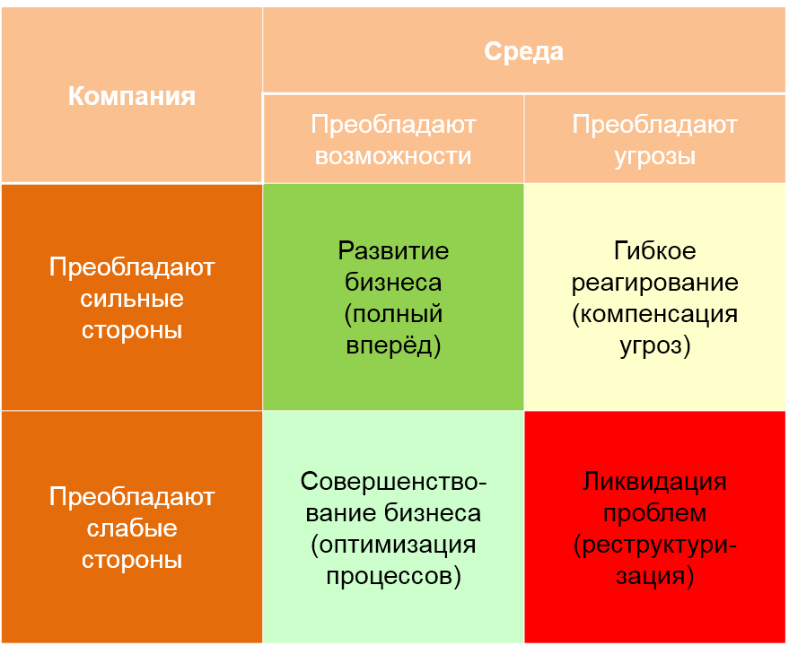

# 1. Введение в бюджетирование

## SWOT - анализ

> позволяет оценить сильные и слабые стороны компании, а также выявить внешние возможности и угрозы

1. необходимо понять, какие есть сильные и слабые стороны, возможности и угрозы
    - **Сильные стороны** это внутренние преимущества компании: опытные сотрудники, уникальные технологии или известный бренд.
    - **Слабые стороны** это внутренние недостатки, которые требуют улучшения: нехватка опыта, ограниченные ресурсы или слабый маркетинг.
    - **Возможности** это внешние факторы, которые способствуют росту: выход на новые рынки, внедрение новых технологий или изменения в потребительских предпочтениях.
    - **Угрозы** это внешние факторы, которые могут навредить: конкуренция, экономический кризис или изменения в законодательстве.
1. необходимо провести ранжирование факторов
    - помогает понять, какие аспекты преобладают в компании
2. Для каждого свойства определяются веса, на основе которых формируется итоговая картина — сильные стороны компании, потенциальные риски и области для роста.

## бюджетирование

> процесс планирования, организации и контроля финансовых ресурсов организации, предприятия, центра финансовой ответственности, проекта или отдельного человека с целью достижения поставленных целей. В рамках этого процесса составляется основной бюджет на год или другой период, а также корректирующие бюджеты, которые могут быть разработаны в процессе реализации стратегии или проекта, с учетом изменений в условиях или результатах деятельности.

### 1. Бюджет доходов и расходов (PL — Profit and Loss)

> является основным инструментом финансового планирования, который помогает управлять финансовыми ресурсами организации

- план, в котором подробно расписаны ожидаемые доходы и расходы на определенный период времени
- этот бюджет был запланирован на все время проекта до его завершения

#### 1.1 Доходы

> важно отличать понятие дохода от поступления денег. Доход — это та сумма, с которой платится налог (например, НДС). Поступление денег — это фактический перевод средств, который мы рассмотрим далее.

##### Операционные доходы

> доходы, полученные от основной деятельности компании. Как правило, это продажи товаров или услуг

В контексте проекта можно выделить несколько источников таких доходов
1. **Продажи (выручка от продаж товаров или услуг)**
    - может быть реализация какого-либо внедрения или продажа соответствующего оборудования
2. **Доходы от аренды**
    - Например, если в нем работает высококвалифицированный специалист, занятость которого составляет лишь 50% - такой специалист может быть «сдан» на аутстаффинг другой компании

##### Неоперационные доходы

> доходы, не связанные напрямую с основной деятельностью.

- проценты по инвестициям,
- дивиденды,
- продажа активов.

#### 1.2 Расходы

##### Операционные расходы

> затраты, связанные с основной деятельностью компании. Их также называют прямыми расходами, в отличие от косвенных расходов, которые включают все остальные затраты.

**1. Себестоимость проданных товаров или услуг (прямые затраты)**

Это основная статья расходов в проекте. Например, в проекте по информационной безопасности могут быть следующие расходы:

- **Заработная плата сотрудников** специалисты по информационной безопасности, аналитики, системные администраторы, менеджеры проектов.
- **Обучение и сертификация** курсы повышения квалификации и сертификационные экзамены (например, CISSP, CEH).
- **Лицензии и программное обеспечение** антивирусы, платформы для мониторинга безопасности.
- **Аппаратное обеспечение** серверы для хранения данных безопасности, сетевое оборудование (например, фаерволы).

**2. Административные расходы (косвенные затраты)**

Это расходы, которые не связаны напрямую с выполнением проекта, но влияют на его стоимость. Например:

- Зарплата административного персонала.
- Аренда офисных помещений

подробнее о косвенных затратах вы можете прочитать по [ссылке](https://delfinco.ru/blog/45-vybor-bazy-raspredeleniya-kosvennykh-zatrat)

База распределения таких расходов зависит от политики организации и может корректироваться по мере необходимости. Важно точно учитывать эти расходы для расчета чистой прибыли, которую принесет проект.

**3. Маркетинговые и рекламные расходы**

Эти расходы не всегда напрямую связаны с проектом, но почти всегда — с продуктом. Например, если продукт-оунер поехал на форум, посвященный продукту, эти расходы можно включить в маркетинговые, так как они помогают развивать продукт.

**4. Расходы на исследования и разработки (R&D)**

Такие расходы могут быть включены в проект, особенно если проект связан с развитием нового продукта или технологий.

##### Неоперационные расходы

> те затраты, которые не связаны с основной деятельностью компании, но могут быть учтены в косвенных расходах

- проценты по кредитам,
- амортизация,
- убытки от продажи активов,
- внереализационные расходы.

Эти расходы не имеют прямого отношения к проектной деятельности, но их стоит упомянуть, так как они могут влиять на финансовые результаты организации.

### Бюджет движения денежных средств, Cash flow

> **Бюджет движения денежных средств (БДДС)** документ, который показывает ожидаемые поступления и расходы денежных средств компании за определенный период времени. Он помогает наглядно планировать денежные потоки, оценивать сальдо (разницу между поступившими и уходящими средствами) за период, а также контролировать движение денежных средств.

- **Сальдо** отражает текущее состояние денежных средств на счетах компании и показывает, сколько денег доступно для использования на конец отчетного периода
- БДДС позволяет определять возможный дефицит денежных средств и принимать решения для его устранения
- особенно важно для отслеживания кассовых разрывов

Для стартапа, работающего с одним проектом, понимание кассовых разрывов и их отсутствие помогает правильно сформировать план реализации, чтобы избежать финансовых проблем.

#### Отличие бюджета доходов и расходов от бюджета движения денежных средств

- Бюджет доходов и расходов (БДР) покажет доход от проекта в будущем на определенную дату
- Бюджет движения денежных средств (БДДС) показывет отдельные поступления и расходы в течении проекта

### Прибыль и рентабельность проекта

#### Прибыль

> разница между доходами и расходами за определенный период.

Обычно мы рассматриваем прибыль за год для компаний, а для проекта — на протяжении всей его длительности.

Прибыль можно разделить на несколько типов, в зависимости от того, какие расходы и доходы учитываются.

##### 1. Брутто-прибыль (валовая прибыль)

> разница между <ins>общими доходами и себестоимостью проданных товаров или услуг</ins>. Она показывает, сколько денег остается после покрытия основных затрат на производство и продажу.

В контексте проекта валовая прибыль рассчитывается как разница между доходами от проекта и его основными затратами, то есть затратами, которые напрямую влияют на его реализацию.

##### 2. Нетто-прибыль (чистая прибыль)

> брутто-прибыль за вычетом всех <ins>операционных и неоперационных расходов, включая налоги</ins>. Это конечный финансовый результат работы проекта или компании, который отражает прибыль после всех вычетов.

#### Другие виды прибыли

- **Операционная прибыль** прибыль от основной деятельности компании, за вычетом операционных расходов. Этот показатель показывает, насколько эффективно компания работает в своем основном бизнесе.
- **Прибыль до уплаты налогов (EBT)** прибыль до вычета налогов. Этот показатель используется для оценки финансового состояния компании без учета налоговых обязательств.
- **Прибыль на акцию (EPS)** показывает, какую долю чистой прибыли получает каждый акционер. Рассчитывается как отношение чистой прибыли к общему числу акций.
- **Прибыль от инвестиций** доход от вложений в другие компании, ценные бумаги, недвижимость и другие активы.
- **Прибыль от продажи активов** доход, полученный от продажи недвижимости, оборудования, патентов и других активов.
- **Финансовая прибыль** доход, полученный от финансовых операций, таких как кредитование, лизинг и другие финансовые услуги.

Более подробно с видами прибыли вы можете ознакомится в [открытых источниках](https://noboring-finance.ru/gazeta/pribyl-normalnaya).

### Рентабельность

> показатель, который определяет, какой <ins>процент от выручки составляет чистая прибыль</ins>. Проще говоря, рентабельность показывает, сколько из каждого рубля дохода остается в виде прибыли после вычета всех расходов.

Рентабельность для каждого проекта уникальна и зависит от множества факторов: 
- от стратегического положения компании
- от условий рынка
- от уровня конкуренции и так далее.

рентабельность может меняться в зависимости от стратегии компании:
- *Стратегия роста* при стратегии роста компания может установить более высокую рентабельность по проектам, например, 30–50%, чтобы ускорить развитие и расширение.
- *Стратегия стабилизации* при стратегии стабилизации рентабельность может быть ниже (например, 10–15%), так как часть средств может быть направлена на оптимизацию, улучшение внутренних процессов и снижение рисков.

## Значение бюджетирования в рамках проекта

играет критически важную роль в управлении проектами по многим причинам:
- **Планирование ресурсов** помогает определить, какие ресурсы (финансовые, человеческие, материальные) нужны для выполнения проекта и как их лучше всего распределить.
- **Контроль затрат**
    - позволяет следить за фактическими расходами в реальном времени в ходе выполнения проекта и сравнивать их с запланированными
    - Если расходы превышают бюджет, можно быстро выявить причины и принять меры и шаги для их исправления.
- **Принятие обоснованных решений**
    - помогает решить, стоит ли продолжать проект, если возникают неожиданные расходы или изменения условий
    - Четкое понимание бюджета позволяет команде проекта и руководителям разных уровней в проекте принимать более взвешенные решения на всех этапах.
- **Управление рисками**
    - помогает выявить возможные финансовые риски и разработать стратегии их минимизации
    - В процессе бюджетирования можно заложить резервные средства для непредвиденных расходов, что повысит устойчивость проекта к рискам.
- **Обоснование инвестиций**
    - Хорошо составленный бюджет может служить основанием для получения финансирования проекта от инвесторов или руководства.
    - позволяет оценить ожидаемую доходность проекта и его финансовую целесообразность
- **Коммуникация с заинтересованными сторонами**
    - дает ясное представление о финансовых аспектах проекта для всех заинтересованных сторон, включая руководителей, инвесторов и членов команды.
    - позволяет предоставлять регулярные отчеты о ходе проекта и его финансовых показателях, что способствует доверию со стороны заинтересованных сторон.

## Основные понятия урока

> **Бюджет доходов и расходов** это план, в котором подробно расписаны ожидаемые доходы и расходы на определенный период времени.

> **Бюджет движения денежных средств** показывает ожидаемые поступления и расходы денежных средств компании за определенный период времени.

> **Прибыль** это разница между доходами и расходами за определенный период.

> **Бюджет проекта** это финансовый план, который определяет все ожидаемые затраты и доходы, связанные с реализацией конкретного проекта. Он служит основой для управления финансами и ресурсами на протяжении всего жизненного цикла проекта.

## 2. Из чего состоит стоимость проекта

Прямые затраты включают
1. **Заработную плату** оплату труда сотрудников, непосредственно работающих над проектом, включая разработчиков, менеджеров и других специалистов.
1. **Материалы и оборудование** расходы на закупку необходимых материалов и оборудования для выполнения проекта.
1. **Подрядные услуги** оплату услуг внешних подрядчиков или консультантов, участвующих в проекте.

### Заработная плата

<table class="table-with-borders">
  <tbody><tr>
    <td><b>№</b>
    </td>
    <td><b>Наименование работ</b>
    </td>
    <td><strong>Стоимость
          часа</strong>
    </td>
    <td><strong>Количество часов,
          ч</strong>
    </td>
    <td><strong>Стоимость,
          руб.</strong>
    </td>
  </tr>
  <tr>
    <td rowspan="2">
      
1

    </td>
    <td>Разработка Устава проекта, Плана управления проектом.
        
      Работа РП
    </td>
    <td>5000,00
    </td>
    <td>10
    </td>
    <td>50 000,00
    </td>
  </tr>
  <tr>
    <td>Разработка Устава проекта, Плана управления проектом.
        
      Работа Администратора проекта
    </td>
    <td>2000,00
    </td>
    <td>10
    </td>
    <td>20 000,00
    </td>
  </tr>
  <tr>
    <td>
      
2

    </td>
    <td>Разработка технических заданий на доработку системы «ХХХ: маркировка»
        
      Работа аналитика
    </td>
    <td>3000,00
    </td>
    <td>10
    </td>
    <td>30 000,00
    </td>
  </tr>
  <tr>
    <td>
      
3

    </td>
    <td>Разработка технических заданий на реализацию интеграции с учетной системой «1С:Бухгалтерия предприятия
      3.0»
        
      Работа аналитика
    </td>
    <td>3000,00
    </td>
    <td>10
    </td>
    <td>30 000,00
    </td>
  </tr>
  <tr>
    <td>
      
4

    </td>
    <td>Разработка технических заданий на обмен данными с ПО оборудования
        
      Работа аналитика
    </td>
    <td>3000,00
    </td>
    <td>10
    </td>
    <td>30 000,00
    </td>
  </tr>
  <tr>
    <td rowspan="2">
      
5

    </td>
    <td>Разработка программной архитектуры маркировки продукции
        
      Работа Технического архитектора
    </td>
    <td>5000,00
    </td>
    <td>10
    </td>
    <td>50 000,00
    </td>
  </tr>
  <tr>
    <td>Разработка программной архитектуры маркировки продукции
        
      Работа аналитика
    </td>
    <td>3000,00
    </td>
    <td>10
    </td>
    <td>30 000,00
    </td>
  </tr>
  <tr>
    <td rowspan="3">
      
6

    </td>
    <td>Разработка по техническим заданиям по доработке системы
        
      Работа разработчика
    </td>
    <td>3000,00
    </td>
    <td>20
    </td>
    <td>60 000,00
    </td>
  </tr>
  <tr>
    <td>Разработка по техническим заданиям по доработке системы
        
      Работа аналитика
    </td>
    <td>3000,00
    </td>
    <td>10
    </td>
    <td>30 000,00
    </td>
  </tr>
  <tr>
    <td>Разработка по техническим заданиям по доработке системы
        
      Работа тестировщика
    </td>
    <td>2000,00
    </td>
    <td>10
    </td>
    <td>20 000,00
    </td>
  </tr>
  <tr>
    <td rowspan="3">
      
7

    </td>
    <td>Реализация обмена с учетной системой «1С:Бухгалтерия предприятия 3.0»
        
      Работа разработчика
    </td>
    <td>3000,00
    </td>
    <td>20
    </td>
    <td>60 000,00
    </td>
  </tr>
  <tr>
    <td>Реализация обмена с учетной системой «1С:Бухгалтерия предприятия 3.0»
        
      Работа аналитика
    </td>
    <td>3000,00
    </td>
    <td>10
    </td>
    <td>30 000,00
    </td>
  </tr>
  <tr>
    <td>Реализация обмена с учетной системой «1С:Бухгалтерия предприятия 3.0»
    </td>
    <td>2000,00
    </td>
    <td>10
    </td>
    <td>20 000,00
    </td>
  </tr>
  <tr>
    <td rowspan="3">
      
8

    </td>
    <td>Разработка обмена данными с ПО оборудования
        
      Работа разработчика
    </td>
    <td>3000,00
    </td>
    <td>20
    </td>
    <td>60 000,00
    </td>
  </tr>
  <tr>
    <td>Разработка обмена данными с ПО оборудования
        
      Работа аналитика
    </td>
    <td>3000,00
    </td>
    <td>10
    </td>
    <td>30 000,00
    </td>
  </tr>
  <tr>
    <td>Разработка обмена данными с ПО оборудования
        
      Работа тестировщика
    </td>
    <td>2000,00
    </td>
    <td>10
    </td>
    <td>20 000,00
    </td>
  </tr>
  <tr>
    <td rowspan="3">
      
9

    </td>
    <td>Адаптация обмена данными с ГИС в части отправки отчетов о нанесении, вводе в оборот
        
      Работа разработчика
    </td>
    <td>3000,00
    </td>
    <td>20
    </td>
    <td>60 000,00
    </td>
  </tr>
  <tr>
    <td>Адаптация обмена данными с ГИС в части отправки отчетов о нанесении, вводе в оборот
        
      Работа аналитика
    </td>
    <td>3000,00
    </td>
    <td>10
    </td>
    <td>30 000,00
    </td>
  </tr>
  <tr>
    <td>Адаптация обмена данными с ГИС в части отправки отчетов о нанесении, вводе в оборот
        
      Работа тестировщика
    </td>
    <td>2000,00
    </td>
    <td>10
    </td>
    <td>20 000,00
    </td>
  </tr>
  <tr>
    <td>
      
10

    </td>
    <td>Настройка и подключение оборудования на производственные линии
        
      Работа подрядчика, поставляющего оборудование
    </td>
    <td>3 000,00
    </td>
    <td>40
    </td>
    <td>120 000,00
    </td>
  </tr>
  <tr>
    <td>
      
11

    </td>
    <td>Моделирование и демонстрация контрольного пример по 2-м номенклатурам на 2-х производственных линиях
        
      Работа аналитика
    </td>
    <td>3000,00
    </td>
    <td>20
    </td>
    <td>60 000,00
    </td>
  </tr>
  <tr>
    <td>
      
12

    </td>
    <td>Консультация 1 (одного) администратора по настройке параметров системы.
        
      Работа аналитика
    </td>
    <td>3000,00
    </td>
    <td>2
    </td>
    <td>6 000,00
    </td>
  </tr>
  <tr>
    <td>
      
13

    </td>
    <td>Консультация 4 (четырех) мастеров цеха, 2 (двух) операторов ИС по использованию функционала.
        
      Работа аналитика
    </td>
    <td>3000,00
    </td>
    <td>3
    </td>
    <td>9 000,00
    </td>
  </tr>
  <tr>
    <td>
      
14

    </td>
    <td>Написание инструкций для пользователей и администраторов по работе с «ХХХ: маркировка»
        
      Работа аналитика
    </td>
    <td>3000,00
    </td>
    <td>4
    </td>
    <td>12 000,00
    </td>
  </tr>
</tbody></table>

1. **Пункт 1** - разработка устава проекта и плана управления проектом
    - Эти работы выполняет руководитель проекта и администратор
    - В количество часов включено также согласование документов с заказчиком
1. **Пункты 2, 3 и 4** - включают работу аналитика по разработке технических заданий
    - входят следующие задачи:
        - изучение регламентирующей документации
        - интервьюирование ключевых пользователей
        - изучение программных компонентов и API оборудования
1. **Пункт 5** - работа технического архитектора по разработке архитектуры
    - Архитектура должна учитывать все нюансы, которые были определены на предыдущих этапах работы аналитика
    - проводится работа аналитика по описанию программной архитектуры и ее фиксации
1. **Пункты 6, 7 и 8**
    - охватывают работу разработчиков по написанию кода и адаптации программного продукта
1. **Пункт 9** связан с особенностями проекта, так как не все параметры можно точно описать в техническом задании
1. **Пункт 10** включает работы подрядной организации
1. **Пункт 11** опытная промышленная эксплуатация, которая позволяет проверить работоспособность программы и всего программно-аппаратного комплекса на выделенной части объема
1. **Пункты 12 и 13** - консультации администраторов и пользователей системы
1. **Пункт 14** - написание инструкции, которая остается за аналитиком

# 3. Формирование стоимости проекта по ИБ

В сфере информационной безопасности существует множество типов проектов, каждый из которых имеет свои цели и решает конкретные задачи.

1. **Аудит информационной безопасности** это оценка текущего состояния безопасности информации в организации. Это выявление уязвимостей, проверку соблюдения стандартов и регламентов (например, ISO 27001) и разработку рекомендаций по улучшению.
1. **Пенетрационное тестирование (Pentest) представляет собой имитацию атаки на систему для выявления уязвимостей. Позволяет обнаружить и оценить уязвимости, проверить эффективность существующих мер защиты и предложить рекомендации по их устранению.
1. **Внедрение систем управления информационной безопасностью (СУИБ)** включает создание и поддержку комплексной системы защиты информации. Это включает разработку политики безопасности, внедрение процедур и технологий защиты, а также обучение сотрудников.
1. **Разработка политики информационной безопасности** подразумевает установление правил и процедур для защиты информации. Включает определение требований к безопасности и создание руководящих принципов и инструкций для работников.
1. **Мониторинг и реагирование на инциденты безопасности** оперативное обнаружение и реагирование на инциденты. Это внедрение систем мониторинга (например, SIEM), разработку планов реагирования и проведение тренировок.
1. **Управление рисками информационной безопасности** включает идентификацию, оценку и минимизацию рисков. Проведение анализа рисков, разработку и внедрение мер по их снижению, а также регулярный пересмотр рисков.
1. **Внедрение технических средств защиты** касается установки и настройки программных и аппаратных средств защиты. Включает внедрение межсетевых экранов, систем предотвращения вторжений (IPS), антивирусных программ, средств шифрования и других технологий.
1. **Обучение и повышение осведомленности сотрудников** направлено на повышение уровня знаний и навыков персонала в области информационной безопасности. Это включает проведение тренингов и семинаров, создание обучающих материалов и тестирование знаний сотрудников.
1. **Оценка соответствия нормативным требованиям** обеспечивает соблюдение законов и регламентов в области информационной безопасности. Включает проверку соответствия требованиям (например, GDPR, HIPAA), подготовку к сертификации и разработку мер для устранения несоответствий.
1. **Защита данных и управление конфиденциальностью** направлена на обеспечение конфиденциальности, целостности и доступности данных. Включает внедрение технологий шифрования, управление доступом и разработку политики защиты данных.

У специалистов по информационной безопасности есть два основных направления работы:
1. **Первое** — это собственные нужды
    - проект составляет сам специалист, обосновывая и согласовывая затраты с заинтересованными сторонами
    - В таких случаях смета часто является ориентировочной и служит отправной точкой для дальнейших переговоров, например, при выходе на тендеры.
1. **Второе направление** — специалист по ИБ играет роль согласующей стороны
    - специалист по ИБ отвечает за оценку стоимости всех мероприятий по обеспечению информационной безопасности, чтобы гарантировать соответствие законодательным требованиям
    - В результате бизнес может принять решение отказаться от расширения, если затраты на ИБ окажутся слишком высокими.

# 4. Формирование команды проекта

## Команда проекта

> группа людей, работающих над достижением конкретной цели. Каждый из членов команды имеет свои навыки и опыт, которые необходимы для успешной реализации задач проекта. Но если говорить другими словами проект может выполняться и одним человеком. Состав и размер команды не влияет на подход по которому ведется работа, например, если выбран проектный подход.

### 1. Руководитель проекта (Project Manager)

- ответственен за планирование, выполнение и завершение проекта
- управляет всем процессом
- следит за тем, чтобы проект завершился в срок, в рамках бюджета и с соблюдением всех требований
- принимает решения на протяжении всего проекта
- взаимодействует с заказчиком
- управляет командой, отслеживает выполнение задач и контролирует качество.

### 2. Бизнес-аналитик (Business Analyst)

- анализирует бизнес-процессы
- выявляет потребности и предлагает решения для повышения эффективности и результативности организации
- помогает связывать бизнес с IT, показывая, как технологии могут поддерживать бизнес-цели
- Задачи
    - правильно описать процессы и логические связи между действиями
    - определить входящие и выходящие данные, чтобы избежать ошибок и неточностей.

примеры проектов:
- **Разработка нового программного обеспечения**
    - сбор и анализ требований от пользователей и заинтересованных сторон
    - Определение функциональности и возможностей, которые должны быть реализованы в продукте.
    - Создание документации по требованиям и спецификациям
    - Участие в тестировании и обеспечении качества, чтобы убедиться, что продукт соответствует требованиям.
- **Оптимизация бизнес-процессов в компании**
    - проведение анализа текущих бизнес-процессов и выявление узких мест
	- Разработка предложений по оптимизации и автоматизации процессов
	- Составление документации для новых процессов и их внедрение
	- Оценка результатов изменений и их влияние на общую эффективность бизнеса.

### 3. Системный аналитик (Systems Analyst)

- анализирует, проектирует и внедряет информационные системы
- помогает понять, как бизнес-потребности можно удовлетворить с помощью технических решений
- Задача
    - связать бизнес-потребности с техническими решениями
    - описать их в виде технической документации, схем и моделей

примеры проектов:
- **Разработка корпоративной информационной системы**
    - определение требований к системе, включая функциональные и нефункциональные аспекты
	- Проектирование архитектуры системы и взаимодействия между модулями
	- Составление технической документации и участие в тестировании системы.
- **Внедрение системы управления данными**
    - анализ текущих процессов работы с данными и выявление потребностей
	- Определение требований к системе, включая безопасность и доступность данных
	- Проектирование архитектуры системы и методов интеграции с другими системами
	- Участие в тестировании и подготовка документации для пользователей.

### 4. Front-end разработчик (Front-End Developer)

- отвечает за создание интерфейса, с которым взаимодействует пользователь
- задача — сделать интерфейс удобным и понятным для пользователей.

### 5. Back-end разработчик (Back-End Developer)

- занимается серверной частью приложения, создавая логику и архитектуру, которая работает «за кадром»
- чтобы данные правильно обрабатывались, а система работала корректно.

### 6. Тестировщик, или специалист по качеству, QA инженер

- отвечает за проверку продукта на наличие ошибок, дефектов и несоответствий требованиям
- задача — убедиться, что продукт работает как надо, и предоставить отчет с выявленными проблемами.

### 7. Дизайнер в IT

- отвечает за внешний вид и удобство использования продукта
- создает привлекательный и функциональный интерфейс, чтобы взаимодействие с продуктом было интуитивно понятным.

### 8. Архитектор в IT

- разрабатывает стратегию и архитектуру информационных систем, включая как программное обеспечение, так и инфраструктуру
- задача — обеспечить масштабируемость и надежность системы.

### Другие специализированые члены команды

- **Специалист по безопасности информации (Information Security Specialist)**
    - необходимы глубокие знания в области информационной безопасности, стандартов и нормативных требований (например, ISO 27001, GDPR)
    - опыт работы с инструментами для оценки уязвимостей и анализа рисков
    - В обязанности входит
        - оценка текущего состояния безопасности и выявление уязвимостей
        - разработка и внедрение политик безопасности
- **Аналитик по безопасности (Security Analyst)**
    - опыт работы с SIEM-системами и инструментами для анализа журналов
    - знания в области мониторинга сетевой безопасности и реагирования на инциденты
    - Занимается анализом инцидентов безопасности и мониторинга систем
    - Готовит отчеты по инцидентам и рекомендациям по их устранению.
- **Специалист по тестированию на проникновение (Penetration Tester)**
    - опыт проведения тестов на проникновение и использования соответствующих инструментов (например, Metasploit, Burp Suite)
    - знания о методах эксплуатации уязвимостей
    - Обязанности
        - проведение тестов на проникновение для выявления уязвимостей
        - подготовка отчетов с рекомендациями по устранению уязвимостей.
- **Специалист по защите данных (Data Protection Officer, DPO)**
    - необходимо понимание в области защиты данных и соблюдения нормативных требований (например, GDPR, HIPAA)
    - опыт в разработке и внедрении политик защиты данных.
    - обеспечивает соответствия требованиям законодательства по защите данных
    - консультирует по вопросам защиты данных и управления рисками.
- **Инженер по безопасности (Security Engineer)**
    - опыт настройки и управления системами безопасности (межсетевые экраны, системы предотвращения вторжений и т.д.)
    - знания в области шифрования и управления доступом.
    - задачи
        - внедрение и настройка технологий безопасности
        - поддержка и обновление систем безопасности.
- **Специалист по обучению и повышению осведомленности (Security Awareness Trainer)**
    - опыт разработки и проведения обучающих программ по безопасности и знания в области социальной инженерии и методов защиты информации
    - занимается проведением тренингов и семинаров по информационной безопасности для сотрудников и разработкой обучающих материалов и руководств.
- **Системный администратор (System Administrator)**
    - опыт работы с серверными и сетевыми системами
    - знания в области управления пользователями и правами доступа.
    - обязанности
        - поддержка и администрирование систем и сетей
        - реализация мер по обеспечению безопасности на уровне операционных систем и приложений.

# 5. Управление командой мотивация коммуникация

## 1.1. Комплектование команды в существующем коллективе

- необходимо провести оценку компетенций текущих сотрудников
    1. определяются задачи
    1. определяются компетенции
- может быть проведена как самостоятельно и с привлечением технических лидеров

Один из способов оценки — это анализ выполненных задач за определенный период

## 1.2. Подбор новых сотрудников

1. ключевым этапом является изучение резюме кандидатов
    - обратить внимание не только на опыт работы, но и на сопроводительные письма
1. проводится собеседование
    - узнать мотивацию кандидата
    - оценить его способность решать задачи

## 2. Индивидуальные планы развития

> инструмент для определения целей и задач сотрудника, направленных на его профессиональный и личностный рост в компании

## 3. Коммуникация

[подборка книг на эту тематику](https://www.hr-director.ru/article/68124-7-knig-o-tom-kak-vystraivat-effektivnuyu-kommunikatsiyu-s-sotrudnikami)

### Частота встреч

- Ежедневные встречи, как в Scrum, необходимы для отслеживания результатов за день и планирования дальнейших шагов
- Общие командные встречи лучше проводить еженедельно
- Ежемесячные или ежеквартальные встречи могут быть полезны для стратегического планирования и подведения итогов
- Индивидуальные встречи раз в две недели помогут отслеживать личные цели, проблемы и достижения каждого сотрудника, а также дать время для обратной связи и профессионального развития

### Ключевые элементы эффективной коммуникации

1. **Прозрачность** Каждый член команды должен понимать цели проекта, свои задачи и ожидания
1. **Каналы коммуникации** Используйте электронную почту, мессенджеры, видеоконференции и личные встречи в зависимости от ситуации
1. **Активное слушание и обратная связь** Важно, чтобы каждый мог высказаться и быть услышанным
1. **Запись ключевых моментов** Ведение записей поможет всем вернуться к важным решениям и обсуждениям
1. **Мотивация и удовлетворенность** Регулярные опросы удовлетворенности помогут выявить настроения в команде и улучшить работу
1. **Признание достижений** Публичное признание или материальные награды за успехи могут существенно повысить мотивацию
1. **Баланс работы и личной жизни** Важно следить за тем, чтобы сотрудники не выгорали

## 4. Нематериальная мотивация

варьируется в зависимости от индивидуальных потребностей сотрудников и включает несколько ключевых аспектов:
- признание
- свободный график
- профессиональный рост
- психологический комфорт работы в команде.

## 5. Выстраивание гармоничной работы в команде

- Основной задачей руководителя является выстраивание хорошего взаимодействия внутри команды
    - сосредоточиться на сильных сторонах каждого участника коллектива
    - Минусы лучше обходить, не ставя сотрудника в ситуацию, где его слабые стороны будут ярко проявляться

