# 1. Расчет экономической эффективности инвестиционных проектов

## Навыки для взаимодействия с заказчиком

Для руководителя проекта особенно важны soft skills:
- Умение четко и ясно выражать свои мысли как устно, так и письменно.
- Активное слушание и адаптация стиля общения в зависимости от аудитории.
- Способность учитывать потребности и ожидания заказчика, что помогает выстраивать доверительные отношения.
- Гибкость и способность быстро реагировать на изменения в требованиях.
- Навыки анализа информации и принятия обоснованных решений.
- Стрессоустойчивость и умение сохранять продуктивность в сложных ситуациях.
- Готовность воспринимать критику и использовать её для улучшения работы.

Эффективное взаимодействие требует использования различных коммуникационных каналов:
- **Электронная почта** - для формальных уведомлений и отчетов.
Мессенджеры для оперативного общения.
- **Видеоконференции (Zoom, Microsoft Teams, Google Meet, отечественные платформы)** - для проведения встреч и обсуждений.
- **Личные встречи** - для обсуждения ключевых вопросов и принятия решений. Именно личное присутствие важно для многих людей в выстраивании доверительных отношений.

## Какие бывают коммуникационные барьеры

**Недостаток общения или недопонимание** - могут привести к ошибкам и конфликтам
- устанавливать регулярные коммуникационные сессии
- использовать четкие и понятные форматы отчетов
- практиковать активное слушание заказчика.

**Несоответствие ожиданий заказчика и реальных возможностей проекта**
- четко определять и согласовывать ожидания на начальных этапах
- регулярно обновлять информацию о статусе проекта
- открыто обсуждать возможные риски и ограничения

**Изменение требований на поздних стадиях проекта** - может вызвать задержки и перерасход бюджета
- внедрять процесс управления изменениями, включая оценку их влияния на проект и согласование с заказчиком

## Основные документы

> **Договор** — ключевой документ, имеющий юридическую силу. Если проект выполняется для внутреннего заказчика, вместо договора может использоваться внутренний приказ. Неправильное составление договора может привести к финансовым и репутационным потерям, поэтому важно тщательно прорабатывать его содержание. Особое внимание следует уделять условиям приемки работ, где прописаны ожидаемые результаты на каждом этапе

документы, соответствующие определенным требованиям, или готовая к эксплуатации система с заданными параметрами.

> **Спецификация** - приложение к договору, в котором указаны услуги, товары и их стоимость.

> **Техническое задание (ТЗ)** - детальное описание требований и задач. Может быть включено в договор как приложение.

> **План-график проекта** - график выполнения задач и распределения ресурсов. Может быть приложением к договору.

В зависимости от структуры проекта эти три документа могут быть объединены в один.

> **Отчеты о статусе проекта** - регулярные обновления о ходе работ. Форма документа может быть закреплена в договоре.

> **Протоколы встреч** - фиксация обсуждений и принятых решений. Также могут быть включены в договор.

## Инструменты для управления проектом

- **Jira, Trello, TFS, Битрикс** - управление задачами и трекинг прогресса.
- **Microsoft Project, Asana, 1С Конфигурации** - планирование и контроль сроков.
- **Confluence, Wiki** - ведение документации и совместная работа.

# 3. Риск менеджмент

## Основные мероприятия в риск менеджменте

### 1. Идентификация рисков

> процесс определения потенциальных рисков, которые могут возникнуть в ходе реализации проекта
> - финансовые, операционные, технологические, юридические, экологические и другие риски

Для их идентификации могут быть использованы следующие методы:
- **Анализ проектной документации** исследование ТЗ, планов и других документов для выявления возможных рисков.
- **Мозговые штурмы** совместная работа команды проекта для выявления рисков.
- **Интервью с экспертами** консультации с опытными специалистами и заинтересованными сторонами.

примеры наиболее распространённых рисков при внедрении автоматизированных информационных систем:
- Длительный процесс согласования документов и предоставления информации.
- Отсутствие инициативы или неисполнение действий со стороны заказчика и/или исполнителя, предусмотренных договором и другими проектными документами.
- Часть работ по проекту выполняется заказчиком.
- Сотрудники заказчика перегружены и не могут выделить достаточно времени.
- Отсутствие IT-инфраструктуры в автоматизируемых отделах заказчика.
- Несоответствие бизнес-процессов заказчика бизнес-процессам, предусмотренным в автоматизированной системе.
- Несвоевременное поступление оплаты работ, нарушение сроков платежей.
- Неполнота или недостоверность предоставленных данных.
- Появление дополнительных требований к внедряемым модулям системы.
- Отсутствие единой методологии для автоматизируемых участков (понимание процессов «as is» и «to be»).
- Нарушение коммуникации между проектной командой исполнителя и заказчиком, потеря информации в ходе внедрения проекта.

### 2. Оценка рисков

> оценить риски по двум ключевым критериям: вероятность и критичность для проекта

Оценка рисков может быть проведена следующим образом:
- **В начале проекта**
    - команда заказчика и исполнителя совместно определяет, какие риски могут возникнуть
    - оценивает их по пятибалльной шкале, где 5 — наивысшая оценка для вероятности и критичности
- **если проект является специфичным**
    - в процесс оценки могут быть вовлечены квалифицированные эксперты для оценки рисков
- **Другой метод оценки**
    - анализ других подобных проектов и их результатов

Примеры вероятности и критичности рисков:
- очень высокая,
- высокая,
- средняя,
- низкая,
- очень низкая.

Таким образом, эти методы и подходы помогают не только выявлять риски, но и адекватно оценивать их влияние на проект.

<table>
      <tbody>
        <tr>
          <td><b>№</b>
          </td>
          <td><b>Риск</b>
          </td>
          <td><b>Вероятность</b>
          </td>
          <td><b>Критичность
                (Последствия)</b>
          </td>
        </tr>
        <tr>
          <td>
            
1

          </td>
          <td>Длительный процесс согласования документов и предоставления информации.
          </td>
          <td>Средняя (3)
          </td>
          <td>
            Очень высокая (5)
          </td>
        </tr>
        <tr>
          <td>
            
2

          </td>
          <td>Отсутствие инициативы или неисполнение действий со стороны Заказчика и/или Исполнителя, предусмотренных
            Договором и иными проектными документами.
          </td>
          <td>Средняя (3)
          </td>
          <td>
            Очень высокая (5)
          </td>
        </tr>
        <tr>
          <td>
            
3

          </td>
          <td>Часть работ по проекту выполняет Заказчик.
          </td>
          <td>Средняя (3)
          </td>
          <td>Высокая (4)
          </td>
        </tr>
        <tr>
          <td>
            
4

          </td>
          <td>Сотрудники заказчика слишком заняты и не могут выделять достаточно времени.
          </td>
          <td>Высокая (4)
          </td>
          <td>
            Очень высокая (5)
          </td>
        </tr>
        <tr>
          <td>
            
5

          </td>
          <td>Отсутствие IT-инфраструктуры в автоматизируемых отделах Заказчика.
          </td>
          <td>Средняя (3)
          </td>
          <td>Высокая (4)
          </td>
        </tr>
        <tr>
          <td>
            
6

          </td>
          <td>Несоответствие бизнес-процессов Заказчика бизнес-процессам предусмотренных в АС.
          </td>
          <td>Средняя (3)
          </td>
          <td>Высокая (4)
          </td>
        </tr>
        <tr>
          <td>
            
7

          </td>
          <td>Несвоевременное поступление оплаты работ. Нарушение сроков платежей по договору.
          </td>
          <td>Низкая (2)
          </td>
          <td>Средняя (3)
          </td>
        </tr>
        <tr>
          <td>
            
8

          </td>
          <td>Неполнота, недостоверность предоставленных данных.
          </td>
          <td>Низкая (2)
          </td>
          <td>Высокая (4)
          </td>
        </tr>
        <tr>
          <td>
            
9

          </td>
          <td>Появление дополнительных требований к внедряемым модулям системы.
          </td>
          <td>Низкая (2)
          </td>
          <td>Низкая (2)
          </td>
        </tr>
        <tr>
          <td>
            
10

          </td>
          <td>Отсутствие единой методологии для автоматизируемых участков (понимания собственных процессов «as is» и «to
            be»).
          </td>
          <td>Низкая (2)
          </td>
          <td>Средняя (3)
          </td>
        </tr>
        <tr>
          <td>
            
11

          </td>
          <td>Нарушение коммуникации проектной команды Исполнителя и Заказчика, потеря информации в ходе внедрения
            проекта.
          </td>
          <td>Средняя (3)
          </td>
          <td>Средняя (3)
          </td>
        </tr>
      </tbody>
    </table>

#### матрица рисков

> наглядный пример того, какие риски находятся в какой зоне

Исходя из пятибалльной шкалы, которую мы привели выше, можно дать каждому риску собственный вес и, перемножив вероятность на критичность, определить, в какой зоне находится риск

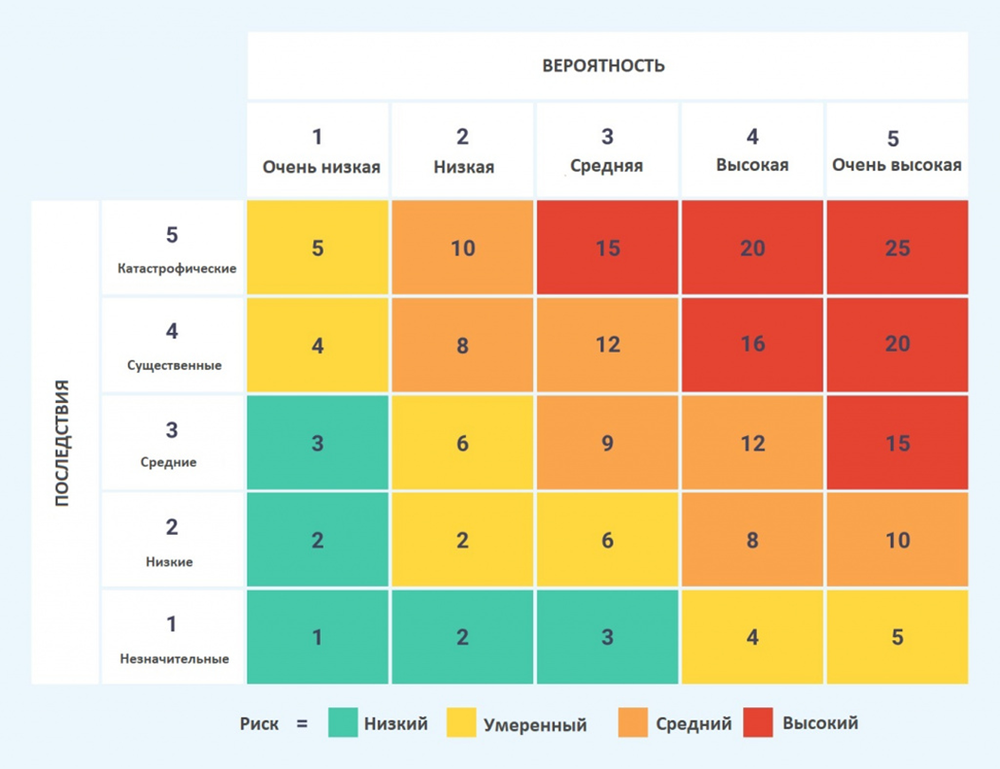

- риски 1, 2 и 4 находятся в <ins>красной зоне</ins>, что указывает на их высокую критичность и вероятность
- Риски 8, 3, 5, 6 и 11 попадают в <ins>оранжевую зону</ins>, что означает их среднюю степень угрозы
- Риски 7, 10 и 9 расположены в <ins>желтой зоне</ins>, что говорит о низкой критичности и вероятности.

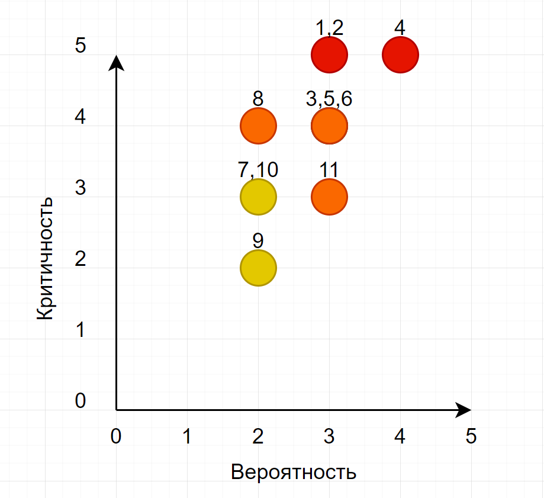 

Основная задача заключается в принятии правильной стратегии реагирования на риски с целью переместить их в зеленую или желтую зоны или полностью исключить их из матрицы рисков. То есть необходимо начать активное управление этими рисками, чтобы снизить их воздействие на проект и повысить вероятность его успешной реализации.

## Управление рисками

> процесс разработки стратегий для минимизации негативного влияния рисков на проект

Основные стратегии:
1. **Избежание риска (Avoidance)** - изменение плана или подхода, чтобы избежать риска. Полное устранение риска путем изменения планов или подходов к выполнению проекта.
1. **Передача риска (Transference)** - передача ответственности за управление риском третьей стороне. Передача ответственности за управление риском третьей стороне
1. **Принятие риска (Acceptance)** - признание риска и готовность справляться с его последствиями без попыток избежать или уменьшить его. Признание риска и готовность справляться с его последствиями без попыток избежать или уменьшить его.
1. **Снижение риска (Mitigation)** - принятие мер для уменьшения вероятности или последствий риска. Принятие мер для уменьшения вероятности наступления риска или снижения его воздействия. <ins>Эта стратегия является основной в управлении рисками</ins>.

# 4. Документация проекта, Артефакты

## Ключевые документы проекта

### Устав проекта

> является важнейшим документом в управлении проектами
> - формализует намерение начать проект
> - определяет его основные параметры
> - служит официальным соглашением между заказчиком и исполнителем

**Устав IT проекта** - официальный документ
- инициирует проект
- определяет его основные цели и ключевые параметры
- назначает руководителя проекта
- описывает правила реализации проекта

#### Основные цели Устава

1. **Формальное одобрение проекта** Устав служит официальным подтверждением того, что проект получил согласие на начало и будет реализован.
1. **Определение основных целей и задач** В нем прописаны основные цели проекта, которые должны быть достигнуты, а также задачи, которые необходимо решить для этого.
1. **Назначение руководителя проекта и его полномочий** Устав проекту придает формальность, назначая ответственного за его выполнение, а также определяет его полномочия и ответственность.
1. **Описание ключевых заинтересованных сторон** Устав проекта включает информацию о всех сторонах, вовлеченных в проект — как заказчиках, так и исполнителях, а также о тех, кто оказывает влияние на реализацию проекта.
1. **Установление основных ресурсов и сроков** В нем фиксируются основные ресурсы, которые будут задействованы в проекте, а также ключевые этапы и сроки, в которые должны быть выполнены работы.

#### Пример структуры устава проекта

1. **Введение**
    1. *Основания для разработки документа* основанием может служить договор, подписанный между компанией исполнителем и компанией Заказчика
    1. *Назначение документа* документально зафиксировать Устав проекта, который
        - Формально авторизует проект;
        - Наделяет Руководителя проекта со стороны Заказчика и со стороны Исполнителя полномочиями использования ресурсов для выполнения работ по проекту;
        - Определяет цели, задачи и результаты проекта;
        - Определяет границы проекта и предварительные параметры проекта;
        - Содержит описание организационной структуры управления проектом;
        - Фиксирует начальные исходные данные, в том числе допущения и ограничения, с учетом которых планируется проект.
    1. *Сокращения и определения применяемые в проекте и в документах*
    1. *Ссылки на используемые источники или хранилища файлов или документов.*
    1. *Порядок внесения изменений в Устав проекта* Настоящий документ может быть пересмотрен и при необходимости изменен в случае наступления следующих условий (но не ограничиваясь ими):
        - Изменение целей проекта.
        - Существенное изменение границ проекта и параметров проекта. Существенным будет считаться изменение, которое может повлечь за собой изменения в бюджете и/или сроках проекта более чем на 20% от утвержденных.
        - Изменение спонсора проекта, руководителя проекта, состава Управляющего совета со стороны Заказчика и/или Исполнителя.
    1. *Контроль исполнения*
1. **Краткое резюме проекта** в данном пункте описывается верхнеуровневые цели проекта и основные роли
    - Краткое описание проекта
    - Код проекта
    - Спонсор проекта со стороны Заказчика
    - Куратор проекта со стороны Исполнителя
    - Руководитель проекта со стороны Заказчика
    - Руководитель проекта со стороны Исполнителя
    - Основная цель проекта
1. **Цели проекта**
1. **Объекты автоматизации**
1. **Задачи проекта**
1. **Содержание проекта**
    1. *Бизнес-цели проекта*
        - Повышение достоверности учета готовой продукции.
        - Улучшение качества бизнес-процессов.
        - Автоматизация учета производства, продаж и складского учета готовой продукции.
        - Формирование отчетности по движению кодов маркировки в системе.
    1. *Выходная продукция* Наименование и описание конечного продукта
    1. *Бизнес-требования* Перечень и приоритеты требований
1. **Заинтересованные стороны**
    - Спонсор проекта со стороны Заказчика
    - Куратор проекта со стороны Исполнителя
    - Руководитель проекта со стороны Заказчика
    - Руководитель проекта со стороны Исполнителя
1. **Параметры проекта**
    1. *Оценки по стоимости*
    1. *Оценки по срокам*
1. **Допущения и ограничения**
    1. *Допущения проекта* предположения о том, какова будет окружающая среда проекта, на основе которых проект планируется
    1. *Ограничения проекта* факторы, которые ограничивают наши возможности по реализации проекта
    1. *Границы проекта*
        - Работы, выполняемые Исполнителем
        - Работы, выполняемые Заказчиком
1. **Коммуникации проекта**
    1. *Коммуникации* Средства и порядок осуществления коммуникаций
    1. *Версии документов*
        - правила изменения версии документа
        - правила нумерации версий
    1. *Согласование документов* регламент и порядок согласования документов
1. **Риски**
    - Перечень рисков и их описания
    - Вероятность
    - Критичность
    - Возможные последствия
    - Действия предотвращения
    - Действия при наступлении
1. **Организационная структура проекта**
    1. *Организационная структура* Общая структура и иеархия участников проекта
    1. *Выделение ресурсов на проект* роли сотрудников Исполнителя и Заказчика, которые выделены на проект, их усредненная загрузка на проекте
1. **Лист согласований** содержит ФИО, должность, дату и подпись согласующего. Это необходимо для фиксации документа и тех правил, которые в нем обозначены

### План управления проектом

> описывается более детально, как будет реализовываться проект и как будет управляться его выполнение с двух сторон

- может быть представлен отдельно, также возможно объединение его с Уставом проекта

#### Структура плана управления проектом

1. **Введение**
    1. *Назначение документа* Настоящий документ содержит План управления проектом... код проекта: КОД ПРОЕКТА. В нем зафиксированы регламенты, на основании которых будет осуществляться управление проектом, а также определены ответственные лица за конкретные области управления проектом.
    1. *Сокращения и определения, применяемые в проекте и в документах*
    1. *Ссылки на используемые источники или хранилища файлов или документов*
    1. *Порядок внесения изменений в План управления проектом*
    1. *Контроль исполнения*
1. **Организационная структура проекта** перечисляются органы проекта и их основные функции\задачи
    1. *Управляющий совет*
        1. *Спонсор, Куратор проекта*
        1. *Руководители проекта*
            - со стороны Заказчика
            - со стороны Исполнителя
        1. *Руководитель рабочей группы*
        1. *Руководитель РГ программистов*
        1. *Менеджеры проекта* от Исполнителя и Заказчика
    1. *Проектная команда*
        1. *Ключевые пользователи*
        1. *Конечные пользователи*
        1. *Консультанты*
        1. *Группа Программисты* программисты, администраторы, тестировщики и т.п.
1. **Этапы и жизненный цикл проекта** перечень этапов жизненного цикла, краткое описаине
    1. *Подробное описаине каждого этапа по пунктам*
1. **Управленческие процессы**
    1. *План управления расписанием*
        1. *Перечень контрольных*
            - перечень ключевых контрольных событий по проекту
            - Любое отклонение по срокам прохождения данных контрольных событий автоматически приводит к инициации изменений.
        1. *Составление плана-графика работ* утсановление ответсвенных и исполнителей сосавления плана-графика
        1. *Основания изменения плана-графика*
            - Форс-мажор;
            - Изменение объемов и сроков проекта
        1. *Порядок внесения изменений плана-графика*
        1. *Контроль расписания проекта*
    1. *План управления стоимостью*
        1. *Составление плана управления стоимостью*
        1. *Основания изменения стоимостной оценки*
        1. *Порядок изменения стоимостной оценки*
    1. *План управления изменениями*
        1. *Полномочия команды проекта*
        1. *Порядок управления изменениями*
    1. *План управления обеспечением проекта персоналом*
    1. *План управления коммуникациями*
        1. *Совещания по проекту*
        1. *Подготовка и проведение совещаний*
        1. *Процедура запросов*
        1. *Отчетность по проекту*
        1. *Методы коммуникации в проекте*
    1. *План управления рисками*
        1. *Идентификация рисков*
        1. *Анализ рисков*
            - Качественный анализ рисков производится по следующим параметрам:
                - Степень воздействия на проект;
                - Вероятность овеществления.
            - Степень воздействия рисков на проект определяется по трем составляющим:
                - Воздействие на сроки.
                - Воздействие на стоимость.
                - Воздействие на содержание.
            - Для каждой составляющей определяется вес воздействия: низкий, высокий, средний
            - Вероятность возникновения риска оценивается по трем составляющим: низкая, высокая, средняя
            - Действия по классификации рисков
        1. *Мониторинг и управление рисками*
1. **Приложения**
    1. *Сотрудники Заказчика, выделенные на проект.*
    1. *Сотрудники Исполнителя, выделенные на проект*
    1. *Формы документов*
        - Запрос на изменение в проекте
        - Протокол совещания
        - Отчет участника проекта
        - Отчет о ходе выполнения работ по проекту
        - Форма регистрации риска
        - Протокол ввода в опытную/ промышленную эксплуатацию
        - Журнал эксплуатации
        - Запрос предоставления информации в проекте
        - Запрос согласования
        - Техническое задание
1. **Лист согласований**

# 5. Введение в моделирование бизнес процессов, нотации моделирования бизнес-процессов

> **Бизнес-менеджмент процессов (BPM — business process management)** это системный подход, направленный на повышение эффективности работы предприятия. BPM является ключевым элементом менеджмента, который помогает повысить продуктивность, сократить расходы и улучшить качество продукции и услуг.

> **Нотация моделирования бизнес-процессов** это набор стандартов и символов, используемых для визуального представления и описания бизнес-процессов.

почему нотации моделирования необходимы
- **Упрощение сложных концепций** помогают представить сложные процессы в простых и понятных схемах
- **Улучшение коммуникации** помогает избежать недоразумений, так как все участники проекта видят одинаковые схемы и понимают процесс одинаково
- **Разработка моделей как основа документации**
    - помогают создать ясное представление о требованиях и бизнес-процессах, которые потом используются на всех этапах проекта
    - такие модели являются фиксированными документами и служат основой для согласования функционала системы
- **Анализ и оптимизация процессов**
    - помогает выявить слабые места в процессах и улучшить их
    - С помощью схем можно наглядно показать, как работают процессы в текущем состоянии ("As Is") и как они должны работать в будущем ("To Be")
    - помогает выявить дублирующие действия и лишние шаги, что может быть полезно для анализа и оптимизации
- **Поддержка разработки и тестирования**
    - могут быть основой для создания прототипов системы, что позволяет быстрее получить обратную связь от пользователей
    - Нотации помогают определить, какие части системы нужно протестировать, обеспечивая более качественное тестирование.
    - схемы "To Be" (как должна выглядеть система после изменений) могут помочь тестировщикам проверить, насколько правильно реализован новый функционал.
- **Адаптация к изменениям** Модели легко изменяются, что позволяет оперативно реагировать на новые требования или изменения в проекте

## Основные нотации

### Data Flow Diagrams, DFD

> **Диаграммы потоков данных (Data Flow Diagrams, DFD)** используются для визуального отображения потоков данных внутри системы. Они показывают, как информация передается между различными процессами, хранилищами данных и внешними сущностями.

- помогает понять, как данные движутся в системе
- позволяет выявить проблемы и улучшить процессы обработки данных

Элементы DFD:
- **Процессы** овалы или круги, представляющие функции или действия.
- **Потоки данных** стрелки, показывающие направление передачи информации.
- **Хранилища данных** прямоугольники с открытым верхом, которые представляют хранилища информации.
- **Внешние сущности** прямоугольники, которые обозначают внешние системы или пользователей, взаимодействующих с системой.

Пример элементов DFD диаграммы 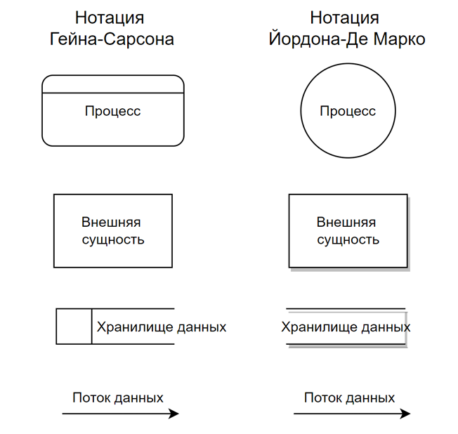

Пример элементов DFD диаграммы 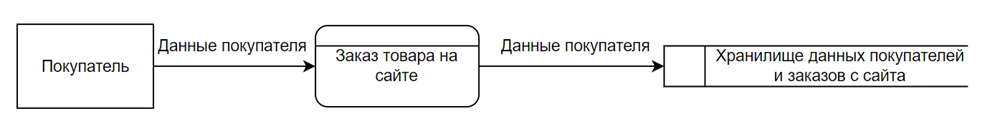

Пример DFD диаграммы 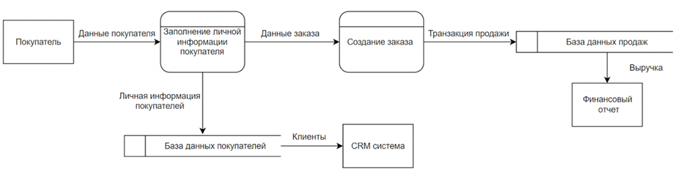 

### IDEF (Integrated DEFinition)

> набор инструментов для графического моделирования, анализа и описания бизнес-процессов

- ориентирован на детальное описание самих процессов

Наиболее популярными являются:
- **IDEF0** используется для функционального моделирования, показывая, какие процессы выполняются, какие ресурсы для этого требуются, и как процессы взаимодействуют друг с другом.
- **IDEF3** применяется для проектирования последовательности событий, что особенно полезно, когда необходимо детально исследовать ресурсы и возможности, которые могут быть задействованы. IDEF3 лучше всего работает, когда процессы содержат множество взаимосвязанных функций и требуют более глубокого представления.

Примеры применения:
- Проектирование системы управления производством.
- Анализ и оптимизация логистических функций.

#### Элементы IDEF диаграммы

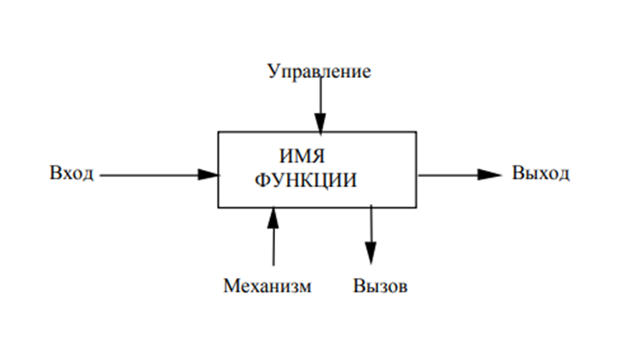

- **Управление (Control)** это условия или ограничения, которые влияют на выполнение функции. Управление определяет правила, политики и процедуры, которые должны соблюдаться в процессе. Например, в процессе обработки заказа управление может включать правила ценообразования или требования к качеству.
- **Вход (Input)** это ресурсы, данные или материалы, которые необходимы для выполнения функции. Входы представляют собой все, что нужно для начала процесса. Например, в процессе производства детали входами могут быть сырье, спецификации и заказы клиентов.
- **Выход (Output)** это результаты или продукты, которые создаются в результате выполнения функции. Выходы представляют собой конечный результат процесса, который может быть передан дальше в цепочку создания ценности. Например, в процессе обработки заказа выходом будет подтверждение заказа или готовый продукт.
- **Механизм (Mechanism)** это ресурсы, инструменты или технологии, которые используются для выполнения функции. Механизмы могут включать людей, оборудование, программное обеспечение и другие средства, помогающие осуществлять процесс. Например, в процессе производства механизмами могут быть станки, рабочие или автоматизированные системы.
- **Вызов (Enabler)** это элементы, которые активируют или запускают процесс, но не являются входами или выходами. Вызов может быть внешним событием или триггером, который инициирует выполнение функции. Например, вызовом в процессе обработки заказа может быть поступление нового заказа от клиента.
- **Функция** это конкретное действие, задача или бизнес-процесс. Например, производство товара.

#### Пример IDEF диаграммы

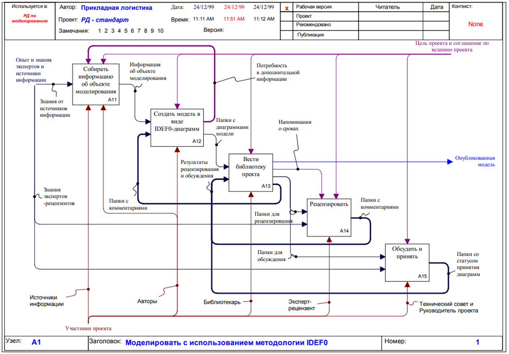 

### Business Process Model and Notation (BPMN/BPMN 2.0)

> инструмент для определения бизнес-процессов в графических схемах. Он используется для стандартизации и обеспечения ясности, когда необходима единая нотация, понятная широкому кругу специалистов, или когда процессы включают сложные логические ветвления, циклы и исключения.

Основные элементы BPMN/BPMN 2.0:
- **События** круги, представляющие начало, конец или промежуточные события в рабочем процессе.
- **Действия (активности)** прямоугольники с закругленными углами, которые показывают задачи или подпроцессы.
- **Потоки управления** линии, показывающие последовательность выполнения задач.
- **Гейты** ромбовидные элементы, которые представляют собой точки принятия решений.
- **Пулы и дорожки** прямоугольники, представляющие организационные единицы или роли, участвующие в процессе (например, менеджер по продажам и менеджер по закупкам).

Пример BPMN диаграммы 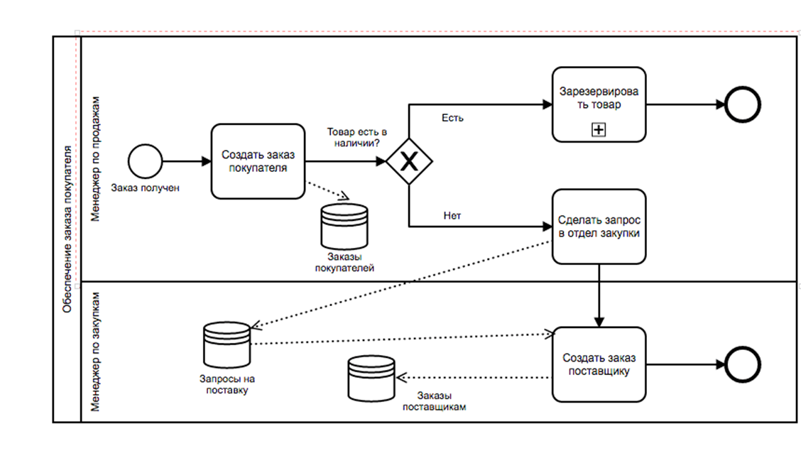

### Unified Modeling Language (UML)

> стандартный язык моделирования программного обеспечения, который также используется для моделирования бизнес-процессов. UML включает несколько типов диаграмм, которые полезны для моделирования бизнес-процессов.

#### Диаграмма классов

показывает структуру системы, отображая различные объекты и классы. Чаще всего она используется для демонстрации иерархии классов в программе. Например, диаграмма классов, описывающая классы и связи между ними в коде интернет-магазина, используется в объектно-ориентированном программировании. Она также применяется при создании модели предметной области в системе.

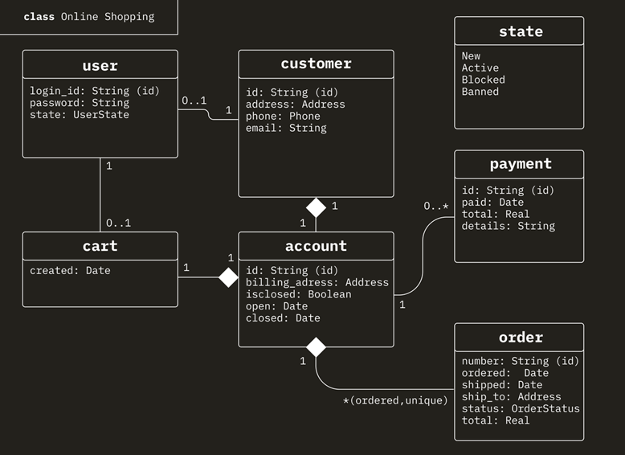 

#### Диаграмма компонентов

отображает компоненты ПО и их связи. Например, на диаграмме компонентов интернет-магазина можно показать, как микросервисы взаимодействуют друг с другом. Это используется при проектировании архитектуры системы, когда каждый компонент преобразуется в микросервис.

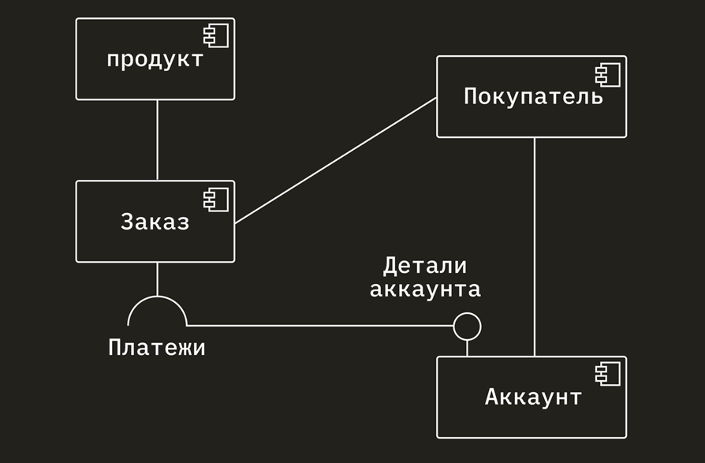 

#### Диаграмма объектов

показывает, как компоненты системы выглядят в определённый момент времени. Она моделирует объекты системы и связи между ними, а также их текущие значения. В отличие от диаграммы классов, которая описывает структуру системы, диаграмма объектов регистрирует текущие состояния элементов.

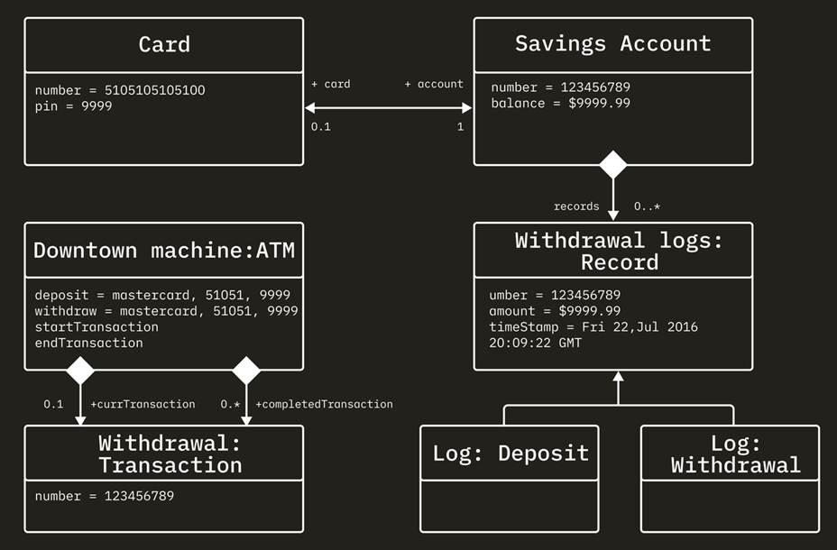 

#### Диаграмма сценариев использования

отображает пользователей или «агентов», взаимодействующих с системой. Эта диаграмма используется для определения функций программного обеспечения и связей между сценариями использования. Например, схема онлайн-покупок может показывать, какие сценарии существуют и кто в них участвует, определяя действия для каждой роли.

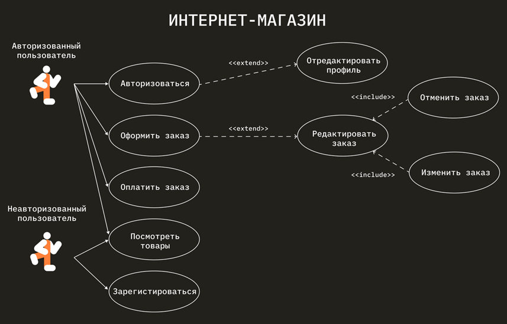

#### Диаграмма последовательностей

отображает действия во времени, часто называемая сценарием. События выстроены одно за другим, и такая диаграмма часто используется для графического сопровождения сценариев использования. Она помогает визуализировать границы перехода между системами, где происходят взаимодействия, например, через API или другие сервисы.

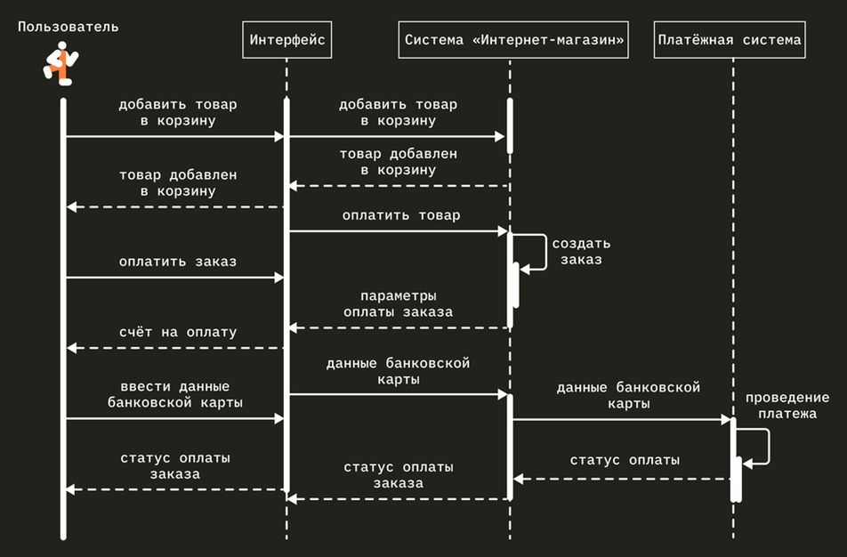

## Какими инструментами можно пользоваться для моделирования

- **Для создания BPMN схем**
    - Bizagi Modeler,
    - Camunda Modeler,
    - Microsoft Visio,
    - Lucidchart,
    - Draw.io,
    - storm bpmn.
- **Для построение UML диаграмм:**
    - Staruml,
    - Enterprise Architect,
    - Lucidchart,
    - Draw.io,
    - plantUML.
- **Для нотации IDEF:**
    - AllFusion Process Modeller,
    - Enterprise Architect,
    - Lucidchart,
    - Microsoft Visio,
    - Draw.io.
