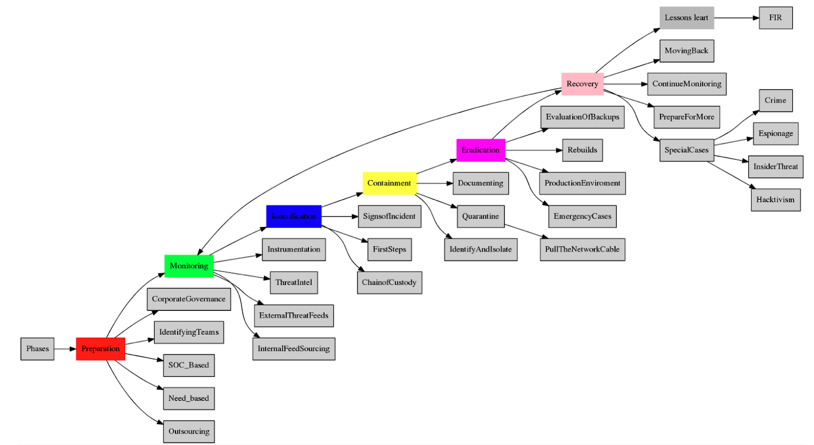
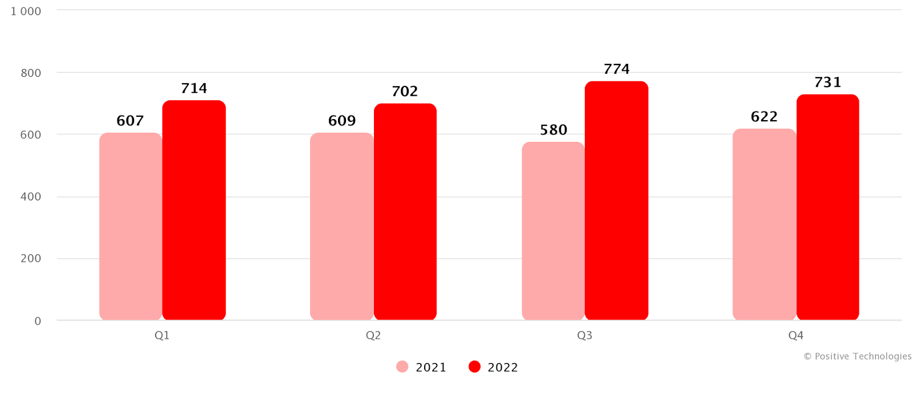
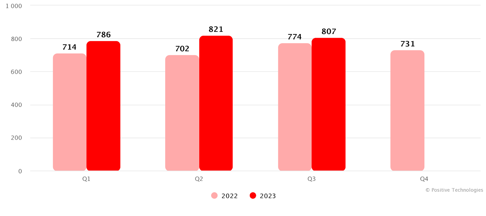
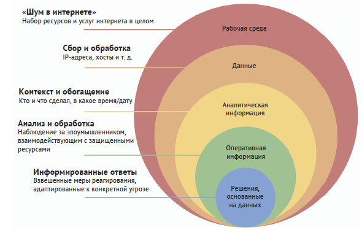
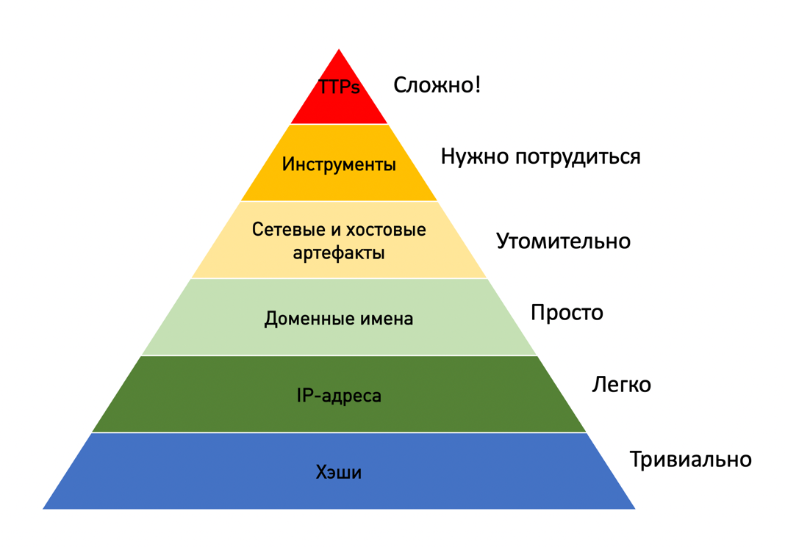
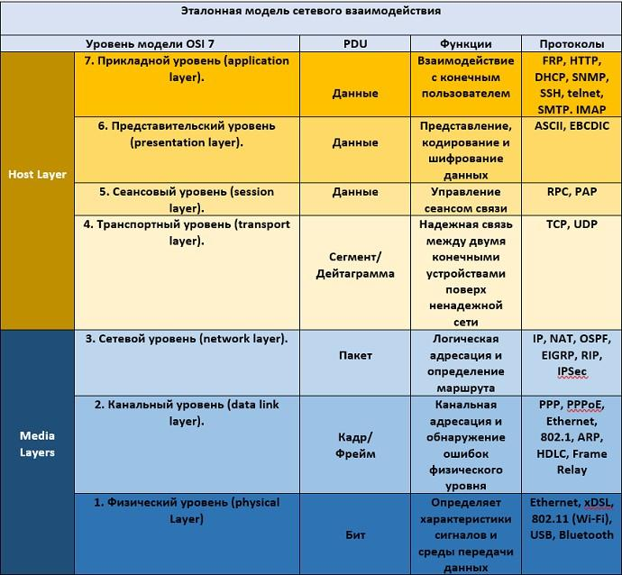
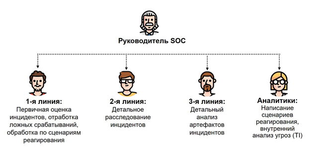

# 1. Проблема информационной безопасности

## Что такое информационная безопасность (ИБ)

> это комплекс мер, которые нужны, чтобы защитить от утечки или взлома программы, компьютерные системы и данные. Еще так называют отрасль, которая занимается этими мерами.

Информационная безопасность — это скорее философия, чем точная наука

важно проработать практический подход, учитывающий самые разные аспекты: планомерно повышать осведомленность сотрудников и пользователей, обеспечивать безопасность техническими методами, проводить тестирование выработанного подхода и искать уязвимые места.

## Актуальность проблемы ИБ

методы злоумышленников постоянно совершенствуются, и в целом технологии меняются, — появляется новое ПО, новые уязвимости, новые утилиты со стороны злоумышленников.

# 2. Ценность информации, информационная безопасность, главные аспекты безопасности информации, инцидент и событие в ИБ

## Состояния и свойства информации

Информация может находиться в трех состояниях:

- **хранение** на рабочих станциях сотрудников, на выделенных серверах инфраструктуры компании, на облачных хранилищах, в бэкапах, базах данных и пр.;
- **обработка** создание, удаление, изменение содержимого, архивирование, кодирование, хеширование, шифрование, расшифрование и пр.;
- **передача** внутри корпоративной сети, между корпоративной сетью и другими сетями, в интернете и пр..

Из одного состояния информация может переходить в другое

Безопасность информации раскрывают три основных аспекта (принципа или свойства), которыми с точки зрения информационной безопасности обладает информация: конфиденциальность, доступность и целостность

### Конфиденциальность

> это свойство информации быть недоступной и закрытой для неавторизованного индивидуума, логического объекта или процесса (стандарт ГОСТ Р ИСО/МЭК 13335-1-2006).

- должно обеспечиваться разграничение доступа таким образом, чтобы доступ к информации могли получить только те пользователи, которым он разрешен.
- Нарушением конфиденциальности считается получение нелегитимным лицом доступа к информации с ограниченным доступом
- Конфиденциальность должна обеспечиваться на всем цикле взаимодействия с информацией

### Доступность

> это свойство объекта находиться в состоянии готовности и используемости по запросу авторизованного логического объекта (стандарт ГОСТ Р ИСО/МЭК 13335-1-2006).

- получить гарантированный, своевременный и беспрепятственный доступ к информации (услуге) в информационной системе должны только пользователи, имеющие на это право

### Целостность

> это свойство сохранения правильности и полноты активов (стандарт ГОСТ Р ИСО/МЭК 13335-1-2006). А также целостность — это состояние информации, при котором отсутствует любое ее изменение либо изменение осуществляется только преднамеренно субъектами, имеющими на него право (стандарт ГОСТ Р 50922-2006).

- в процессе хранения и передачи она сохраняет изначальный вид, структуру и содержание.
- Ее модификация допускается только для разрешенного круга лиц при условии, что они делают это надлежащим образом
- Разрешенный круг лиц определяется владельцем информации. Сохранение целостности важно всегда

## Нарушение безопасность информации

> **Событие информационной безопасности**
>
> это определенное состояние системы, сервиса или сети, указывающее на вероятное нарушение политики ИБ или сбой мер защиты или на некую ранее неизвестную ситуацию, которая может иметь отношение к ИБ (стандарт ISO 27000:2016).

> **Инцидент информационной безопасности (information security incident)**
>
> это любое непредвиденное или нежелательное событие, которое может нарушить деятельность или информационную безопасность.

Инциденты информационной безопасности (стандарт ГОСТ Р ИСО/МЭК 13335-1-2006):

утрата услуг, оборудования или устройств;
- системные сбои или перегрузки;
- ошибки пользователей;
- несоблюдение политик или рекомендаций;
- нарушение физических мер защиты;
- неконтролируемые изменения систем;
- сбои программного обеспечения и отказы технических средств;
- нарушение правил доступа.

Когда мы еще только подозреваем, что в инфраструктуре компании что-то произошло и какая-то угроза может быть актуальна для нас, — это не инцидент, а событие информационной безопасности.

## Работа над инцидентами

Но обычно принято выделять следующий цикл работ по инцидентам:
- подготовка (preparation); 
- мониторинг (monitoring); 
- выявление (identification); 
- локализация (containment); 
- устранение последствий (eradication); 
- восстановление работоспособности (recovery); 
- извлеченные уроки (lessons learned) — опционально.

# 3. Угрозы информационной безопасности

## Определение и виды угроз ИБ

> **Угроза (threat)**
>
> это потенциальная причина инцидента, который может нанести ущерб системе или организации (стандарт ГОСТ Р ИСО/МЭК 13335-1-2006).

Угрозами могут быть:
- фрод или мошеннические действия (к этому типу угроз относятся фишинг, различные схемы финансового мошенничества);
- утечки (случайные или умышленные утечки ценных данных). В случае умышленных утечек основной причиной обычно становятся действия сотрудников, имеющих доступ к данным в силу своей должности, а также утечки из-за кражи носителей, в результате взлома и т. п.;
- несанкционированный доступ (что, кстати, иногда может вытекать из предыдущего пункта, а также примером могут служить различные мисконфигурации систем контроля доступа).

## Профиль и жизненный цикл угрозы

> **Ландшафт угроз (англ. threat landscape)**
>
> это совокупность выявленных и потенциальных киберугроз для определенной отрасли, группы пользователей, конкретного периода времени и так далее.

### Cтатические и динамические характеристиками

Статические:
- наименование угрозы;
- общее описание угрозы;
- источник угрозы;
- вид угрозы;
- способ реализации угрозы;
- объект защиты (вид активов, на которые направлена угроза);
- последствия осуществления угрозы;
- уязвимости (наличие определенных мисконфигураций в приложении, старые версии ПО, неверное разграничение доступа и т. п.).

### Жизненный цикл реализации угроз

процессы:
- зарождение угрозы;
- развитие;
- проникновение в систему;
- проникновение к критичной информации;
- инициализация;
- результат;
- восстановление.

## Статистика угроз ИБ

Отчеты Positive Technologies:
- [Отчет 1](https://www.ptsecurity.com/ru-ru/research/analytics/cybersecurity-threatscape-2022/#id9)
- [Отчет 2](https://www.ptsecurity.com/ru-ru/research/analytics/cybersecurity-threatscape-2023-q3/#id1)

Количество атак в 2021 и 2022 годах (по кварталам). [Источник](https://www.ptsecurity.com/ru-ru/research/analytics/cybersecurity-threatscape-2022/#id9) 

Общее количество инцидентов в 2022 году увеличилось на 20,8%.

Количество атак в 2022 и 2023 годах (по кварталам). [Источник](https://www.ptsecurity.com/ru-ru/research/analytics/cybersecurity-threatscape-2023-q3/#id1)  

статистика анализировалась в 4-м квартале 2023 года по предыдущим трем кварталам. «74% успешных атак имели целенаправленный характер»

## Подходы к обнаружению угроз: TI и TH

Сочетание TI и TH — это процессы выявления методов злоумышленника и определения того, насколько они опасны для защищаемой сети. По их результатам генерируются профили и шаблоны, позволяющие определить, когда кто-то пытается использовать эти потенциально возможные методы, и принимаются решения, основанные на данных.

Для обнаружения угроз в компаниях используются различные инструменты и СЗИ (средства защиты информации):
- СКУД;
- средства обнаружения компьютерных атак на конечных устройствах (EDR, например, Kaspersky EDR, BI.ZONE EDR, EDR от Check Point, FireEye Endpoint Security, Elastic EDR и др.);
- межсетевые экраны нового поколения (NGFW);
- системы анализа сетевого трафика, в том числе нового поколения (NTA/NDR, например, Kaspersky Anti-Targeted Attack, PT NAD и др.);
- приманки для хакеров (Honeypot);
- антивирусное программное обеспечение (АВПО, например, Kaspersky Anti-Virus, ESET и др.);
- DLP;
- системы мониторинга событий безопасности (SIEM, например, KUMA, MaxPatrol SIEM, ELK, Splunk, ArcSight и др.);
- средства поведенческого анализа («песочницы», например, PT Sandbox, Kaspersky Sandbox, JoeSandbox, общедоступная песочница Any.run и др.).

закономерность с точки зрения задачи мониторинга: данные о работе этих инструментов (конечно, не все, а только полезные с точки зрения ИБ), журналы событий собираются в систему мониторинга событий безопасности.

### Аналитическое отслеживание киберугроз (TI)

> процессы сбора, анализа и обработки информации для преобразования ее сначала в аналитическую, а затем оперативную информацию, а также сопровождение активностей по выявлению действий, которые не могут быть обнаружены автоматически.

- направлено на поиск действий злоумышленников, которые не могут быть обнаружены с помощью традиционных средств защиты на основе сигнатур
- профилирование и обнаружение характерных признаков с использованием конечных точек и сетевой активности
- Детектировать злоумышленника по поведенческим характеристикам, по совокупности некоторых особенностей его действий, техник или данных, используемых в атаке

### Threat Hunting (TH)

> проактивный поиск угроз, которые могли обойти автоматизированные системы обнаружения, поиск возможных слабых мест в защите.

- подразумевается, что в организации еще нет сигналов (от правил корреляции в SIEM-системе, от каких-то еще используемых средств защиты), которые позволяют обнаружить вторжение
- злоумышленники используют ранее не известные инструменты и методы
- ожидаемый результат — не только данные об актуальных угрозах, но и совершенствование автоматизированных систем обнаружения

#### Индикатор компрометации (IOC, Indicators of Compromise)

> это информация или данные, которые могут указывать на наличие или компрометацию компьютерной системы или сети.

- представляют из себя емкие данные (например, конкретный вредоносный ip-адрес), с помощью которых поиск угроз становится
    - удобным, быстрым, эффективным
- могут показывать
    - факт компрометации системы
    - наличие несанкционированного доступа к защищаемой информации
    - взлома
    - наличие вредоносных программ — таких как вирусы, трояны или шпионское программное обеспечение

часто включают в себя
- аномальную активность
- необычный сетевой трафик
- необычные файлы или программы
- другие аномалии, которые могут быть связаны с компрометацией системы

используются для
- обнаружения и реагирования на кибератаки и взломы
- предотвращения повторных инцидентов

#### Оперативный конвейер (Intelligence Pipeline)

> Выявление угроз основано на превращении собранных данных сперва в аналитическую, а затем в оперативную информацию

Идея оперативного конвейера состоит в том, что оперативная информация создается специалистами, а не поступает в готовом виде со стороны.

для обработки данных, проходящих через конвейер, применяют несколько проверенных аналитических моделей. Их используют, чтобы понять, в какую часть инфраструктуры компании проник противник, куда он будет двигаться дальше и как распределит приоритеты и ресурсы (в основном время) при выявлении угроз

### Сравнение

| Threat Intelligence Аналитика угроз по ландшафту   | Threat Hunting Охота на угрозы, проактивный поиск    |
|--------------- | --------------- |
| Выделенное направление в обеспечении кибербезопасности |	Один из процессов SOC или, в некоторых случаях, целого отдела |
| Связка людей, процессов и технологий | Связка людей, процессов и технологий |
| Поиск ведется в различных открытых и закрытых источниках | Поиск ведется в самой инфраструктуре компании (строятся и подтверждаются гипотезы) |
| Как направление ТІ обладает чертами «продолжительного» процесса | Также обладает чертами «продолжительного» процесса |
| Является инструментом поддержки принятия решений | Является инструментом реагирования и усиления контроля |
| Позволяет действовать проактивно | Позволяет действовать проактивно, но более быстро и усиленно |

## Пирамида боли в ИБ (PoP)

При обнаружении угрозы важно мешать злоумышленнику, не давать ему продвигаться глубоко, даже если на каком-то этапе он уже пролез в сеть компании. Полезно также наблюдать, как он реагирует на защитные контрмеры, какие факторы вызывают у него стресс и какие из них он способен преодолеть.

## Виды и особенности атак

### OSINT (Open Source Intelligence)

> метод сбора и анализа информации, доступной в открытых источниках с целью получения конкретных сведений о целевой организации или лице.

Атаки с использованием метода OSINT могут включать поиск информации о
- компании
- ее сотрудниках
- инфраструктуре
- технических решениях

для последующего использования в целевых атаках.

Пример использования одной известной осинтерской утилиты [dnsdumpster](https://dnsdumpster.com/) на тестовом домене exampledomain.com, то есть сбора из открытых источников и представления в удобном для анализа виде информации о «жертве», а именно поддоменов, информации об IP-адресах.

### Атаки на веб-приложения

популярный вариант атак на уязвимости веб-приложений, когда злоумышленники используют
- SQL-инъекции
- межсайтовый скриптинг (XSS)
- межсайтовую подделку запроса (CSRF)
- другие методы.

**Цель**
- получить несанкционированный доступ к данным или системам
- осуществить вредоносные действия или украсть конфиденциальную информацию.

Методы защиты от атак чаще всего сводятся к
- построению процессов безопасной разработки
- организации процесса закрытия уязвимостей
- организация также аудиты и багбаунти-программы.

### Сетевые атаки

> попытки незаконного доступа к компьютерным сетям, системам или устройствам с целью нарушить их работу, получить несанкционированный доступ к данным, украсть информацию. Можно сказать, что атакой является злоупотребление сетевыми технологиями в своих интересах.

Сетевые атаки могут включать в себя:

1. **атаки на сетевой уровень модели OSI**
    1. ICMP flood (DDoS – отказ в обслуживании)
    1. ICMP-туннелирование
    1. P spoofing
1. **атаки на транспортный уровень модели OSI**
    1. SYN/UDP/RST flood (DDoS)
1. **атаки на прикладной уровень модели OSI**
    1. HTTP flood (DDoS)
    1. DNS-туннелирование
    1. отравление DNS кэша
    1. пассивный DNS и др.
1. **атаки типа MITM**
    1. MAC-spoofing
    1. ARP-spoofing
    1. сниффинг
1. **другие атаки типа DDoS** (на разных уровнях модели OSI, общая схема атак этого типа рассмотрена далее).

 

Для защиты от таких атак специалистами используются различные средства:
- межсетевые экраны (брандмауэры)
- WAF
- средства анализа трафика
- фильтры
- сетевые мониторы
- системы обнаружения и предотвращения вторжений (IDS/IPS)
- anti-DDoS-решения
- интранеты и др.

#### Атаки на конечных устройствах (на базе Windows, Linux и macOS)

> атаки, при которых злоумышленники могут использовать уязвимости операционных систем или приложений, установленных на конечных устройствах, чтобы получить несанкционированный доступ, украсть информацию или запустить вредоносные программы.

**Защита**
- регулярные обновления программного обеспечения
- установку антивирусного программного обеспечения
- контроль прав доступа
- использование надежных паролей
- мониторинг и правильное хранение учетных данных.

#### Атаки на домен

> атаки, при которых злоумышленники через домен хотят получить несанкционированный доступ к системам или украсть конфиденциальные данные.

Распространенным примером являются атаки на аутентификацию в домене, когда злоумышленники пытаются подобрать или взломать пароли для получения доступа к системе (например, атаки на NTLM или Kerberos: Pass-the-Hash, Golden Ticket Kerberos, Kerberoasting). Здесь мониторинг инфраструктуры также полезен.

#### Социальная инженерия

> разновидность атаки, метод манипуляции людьми с целью получения доступа к конфиденциальной информации или системам

Злоумышленники могут использовать обман, угрозы или лесть, чтобы убедить предоставить им доступ или информацию, которую нельзя раскрывать. Обычно злоумышленники давят на эмоции — например, жадность или любопытство.

#### Инсайдерские атаки

> атаки, осуществляемые лицами, имеющими легальный доступ к системам или информации внутри организации.

Злоумышленники могут использовать свои привилегии или знание внутренних процессов, чтобы провести атаку и получить доступ к конфиденциальной информации или системам.

Это могут быть атаки, обоснованные реализацией убеждений или получением финансовой выгоды.

#### Целевые атаки APT (Advanced Persistent Threat)

> сложные и длительные атаки, проводимые высококвалифицированными и целенаправленными группами злоумышленников (APT-группировками).

Целью таких атак может быть получение конфиденциальной информации, разрушение инфраструктуры компании, шпионаж или выражение политической позиции.

Злоумышленники, проводящие целевые атаки APT, обычно используют сочетание различных технических и социальных методов для достижения своих целей и обладают значительными финансовыми ресурсами и техническими возможностями.

# 4. Структура ИБ в компаниях

## Направления ИБ

### Инфраструктурная безопасность

Этот отдел IT-компании отвечает за защиту и обеспечение безопасности основной инфраструктуры компании, включая сети (задачи, связанные с доступами в компании), серверы (конфигурирование), базы данных и другие ресурсы.

Они разрабатывают и реализуют технические меры безопасности, СЗИ, такие как брандмауэры, системы обнаружения и предотвращения вторжений, средства аутентификации пользователей, системы мониторинга и т. п.

### Безопасность контейнеров/облачных технологий

отвечает за защиту и обеспечение безопасности контейнерных сред, таких как Docker и Kubernetes. Они разрабатывают и реализуют политики безопасности для контейнеров, а также проводят их аудит на предмет уязвимостей и нарушений безопасности в плане конфигурации и слабых политик.

### Blue Team, или Security Operations Center (SOC)

отвечает за мониторинг и обнаружение инцидентов безопасности.

Они отслеживают события и потенциальные угрозы, а также предпринимают меры по их предотвращению и реагированию.

Blue Team занимается
- построением инфраструктуры SOC
- конфигурированием вспомогательных решений
- сбором журналов событий (инженеры и возможно дополнительная помощь со стороны админов)
- анализом журналов событий
- управлением уязвимостями
- проведением расследований инцидентов и помощью в восстановлении работоспособности систем после расследования инцидентов
- разработка и реализация планов реагирования на инциденты, написание пошаговых плейбуков для младших линий реагирования (L1)
- работа с отчетами по итогам аудита безопасности, анализа защищенности, пентеста

Схема структуры SOC 

### Red Team

- занимается этическим взломом и тестированием на проникновение (пентестом) систем компании
- имитируют атаки на IT-компанию, чтобы идентифицировать слабые места в системах и процессах безопасности

Результаты их работы помогают улучшить защиту компании и предотвратить реальные атаки.

### Управление уязвимостями

отвечает за 
- обнаружение
- классификацию
- устранение уязвимостей в системах IT-компании

Они проводят сканирование и анализ уязвимостей, разрабатывают планы реагирования и сотрудничают с другими отделами для устранения слабых мест. Часто в своей работе внедряют средства автоматизации.

### Политики и процедуры, методологи

разрабатывает и поддерживает политики безопасности и процедуры IT-компании. Они определяют требования безопасности, разрабатывают правила и руководства, а также обучают сотрудников компании соблюдению этих политик.

### Обучение и осведомленность пользователей / Security Awareness / Киберкультура

отвечает за обучение сотрудников компании основам безопасности информации.

проводят тренинги, обучающие курсы и кампании осведомленности, чтобы сотрудники были информированы о наиболее актуальных угрозах и способах защиты.

С ними обычно другие отделы взаимодействуют при желании поделиться экспертизой, рассказать о поучительном кейсе из своей практики.

### Bug bounty

Отдельная команда в некоторых компаниях, которая занимается программами. С ней отдел мониторинга может взаимодействовать, например, работая с критичными отчетами об уязвимостях как с инцидентами или же делая ретроспективный анализ уязвимостей и создавая под это новый контент в SIEM-системе. Эта активность напоминает работу с Red Team, но на другой стороне от аналитика находятся уже не сотрудники компании, а внешние специалисты ИБ.

## Функции и взаимодействие отделов

Сотрудничество и взаимодействие между ними позволяет компании эффективно защищать свои информационные ресурсы и минимизировать риски для безопасности. В компаниях поменьше некоторые структурные элементы отсутствуют — например, может не быть Red Team и отдела SOC, или компания может пользоваться услугами внешнего SOC на аутсорсе.

