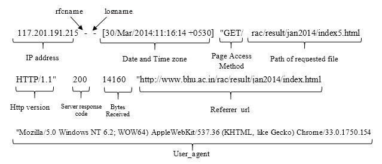

# 1. Методы анализа информационной безопасности

## Классификация методов анализа ИБ

Все эти методы направлены на обеспечение надежной защиты информации и поддержание высокого уровня информационной безопасности в организации.

> **Мониторинг**
>
> постоянное наблюдение за системой различными способами для выявления подозрительной активности.

- Здесь мы говорим именно о наблюдении за событиями ИБ, которые потенциально могут стать инцидентами ИБ

> **Сканирование**
>
> использование специальных программ для поиска уязвимостей, мисконфигураций в сети компании (сетевых сканеров, сканеров приложений и т. п).

> **Анализ кода**
>
> изучение исходного кода на предмет ошибок и уязвимостей, которые могут привести к реализации нежелательных событий безопасности.

> **Реверс-инжиниринг**
>
> разбор работы устройства или программного обеспечения для определения его функциональных характеристик, внутренней архитектуры и механизмов работы (модулей, функций, алгоритмов).

- На практике этот метод часто используется для проверки безопасности стороннего ПО с целью понять, как работает ПО, полученное в ходе расследования инцидента, и как его работа могла повлиять на ресурсы компании/клиента.

> **Анализ доступов**
>
> выяснение, какие доступы к ресурсам компании могут существовать, а какие - нет.

- рассмотрение по следующим критериям:
    - откуда и куда выдаются доступы
    - какие разрешенные действия появляются у сотрудников (например, чтение, запись, исполнение и пр.)
    - и пр.

# 2. Операционные системы. Механизмы мониторинга в Windows и Unix. Журналирование

## Виды операционных систем

> **Операционная система**
>
> это комплекс программ, предназначенных для управления ресурсами компьютера и организации взаимодействия с пользователем.

Операционные системы можно разделить на несколько основных видов:

1. Десктопные ОС
    - рассчитаны на персональные компьютеры и ноутбуки;
    - предназначены для использования конечными пользователями и обеспечивают интерфейс для запуска прикладных программ;
    - примеры: Microsoft Windows, macOS (ранее Mac OS X), Linux (различные дистрибутивы).
1. Серверные ОС
    - предназначены для установки на серверах и обеспечивают функциональность, необходимую для управления сетевыми ресурсами, хранения данных, обеспечения безопасности и управления сетевой инфраструктурой;
    - примеры: Windows Server, Ubuntu Server, CentOS, Red Hat Enterprise Linux.
1. Мобильные ОС
    - разработаны специально для мобильных устройств, смартфонов и планшетов;
    - обладают оптимизированным пользовательским интерфейсом и функциями, связанными с мобильными приложениями;
    - примеры: Android, iOS (Apple), HarmonyOS (Huawei), KaiOS и др.

## Мониторинг в Windows

Защитнике Windows (он же Microsoft Defender) - антивирусном решении, включенном во все версии Windows и предназначенном для защиты

По умолчанию файлы журналов событий используют расширение EVT и находятся в папке `%SystemRoot%\System32\winevt\Logs`. Например, Security-лог пишется в файл `C:\Windows\System32\winevt\Logs\Security.evtx`.

> **EventID** — это численное значение, которое емко говорит о типе события. Пример справочника по кодам событий можно найти [здесь](https://www.ultimatewindowssecurity.com/securitylog/encyclopedia/default.aspx?i=j).

### Виды журналов

#### 1. Security Log (журнал безопасности)

- содержит записи о событиях, для которых настроен аудит в локальных или глобальных групповых политиках безопасности
- События включают допустимые и недопустимые попытки входа в систему
- также содержит события, связанные с использованием ресурсов: например, с созданием, открытием или удалением файлов.

Эти логи - одни из самых важных с точки зрения мониторинга.

#### 2. Setup Log (журнал настройки)

- собирает события, зарегистрированные ОС и ее компонентами в процессе установки
- Файлы журнала установки Windows находятся в разных местах на жестком диске в зависимости от этапа установки
- Подробнее почитать об этом можно в [документации](https://learn.microsoft.com/ru-ru/troubleshoot/windows-client/deployment/windows-setup-log-file-locations).

#### 3. Application Log (журнал приложений)

- содержит информацию об ошибках, возникающих при работе приложений: например, Microsoft SQL Server.

#### 4. System Log (системный журнал)

 регистрирует события, связанные с ОС и ее компонентами: например, ошибки при запуске службы или при загрузке.

#### 5. PowerShell Log (журнал PowerShell)

- содержит информацию о событиях, связанных с использованием конкретно Windows PowerShell.

поддерживает настройку двух категорий ведения журнала:
- **ведение журнала модулей PowerShell** — запись событий выполнения конвейера для членов указанных модулей;
- **ведение журнала блоков скриптов** — запись обработки команд, блоков скриптов, функций и скриптов, вызываемых интерактивным способом или с помощью автоматизации.

#### 6. Sysmon Log (журнал Sysmon)

- протоколирует активность системы и приложений, использование различных, в том числе непроверенных программ.

#### 7. Forwarded Events (пересланные события)

- включает события, отправленные с других серверов при настройке пересылки событий.

#### 8. Менее универсальные логи

- специфичные для DNS-сервера или контроллера домена

### Sysinternals Process Monitor (Sysmon)

позволяет отслеживать взаимодействие между процессами и файлами на уровне ядра системы. Логи Sysmon подробно отражают запуск процессов

Сотставляющие события и коды Sysmon: [https://www.ultimatewindowssecurity.com/securitylog/encyclopedia/default.aspx?i=j](https://www.ultimatewindowssecurity.com/securitylog/encyclopedia/default.aspx?i=j)

Типы событий Sysmon<br>

Коды Security-событий<br>

> **Правило корреляции**
>
> текстовое представление условий, которые позволяют решить задачу выявления инцидентов ИБ путем распознавания определенных последовательностей обрабатываемых событий ИБ и выполнения определенных действий после распознавания.

#### журнал Sysmon

 

Основные поля лога Sysmon:
- ID процесса (в десятичной форме, а не hex);
- ID родительского процесса;
- командная строка процесса;
- аргументы процесса;
- командная строка родительского процесса;
- аргументы родительского процесса;
- хэш образа файла;
- имена образов файла.

### журнал событий приложений, журнал безопасности и журнал системы

- содержат информацию о
    - запуске и завершении программ
    - ошибках пользователей
    - изменениях в настройках системы
    - другие
- «Просмотр событий» (Event Viewer) - программа просмотра и управления журналами событий в Windows
    - Видеодемонстрация использования есть на [официальном сайте Microsoft](https://learn.microsoft.com/en-us/shows/inside/event-viewer)

## Мониторинг в Unix

базируются на трех основных аспектах:
- идентификации и аутентификации пользователя;
- разграничении прав доступа к файловой системе;
- аудите (регистрации событий).

Защита ОС семейства Unix основана на реализации дискреционной модели доступа, которая разделяет доступ пользователей к файловой системе на категории:
- доступ для владельца (u);
- доступ для группы (g);
- доступ для остальных пользователей (o).

### лог-файлы

Логи в Unix-системах хранятся в директории /var/log/.

основные типоы лог-файлов:
1. **Системные логи (syslog, messages)**<br>содержат информацию о работе операционной системы, ошибках ядра и управлении аппаратным оборудованием.
1. **Аутентификационные логи (auth.log)**<br>отслеживают попытки входа в систему и ошибки аутентификации.
1. **Логи аудита (audit.log)**<br>используются для аудита безопасности системы, записи действий пользователей и изменений в системе.
1. **Логи приложений (mail.log, exim/mainlog)**<br>создаются приложениями и сервисами и содержат информацию об их работе.
1. **Логи ядра (kern.log)**<br>содержат информацию о работе самого ядра ОС.

Ни одно из названных событий не может произойти без использования системных вызовов ядра.

### подсистема аудита

> **Подсистема аудита Linux (audit daemon, сокращенно auditd)**
>
> это инструмент, интегрированный в ядро Linux с версии 2.6 и предназначенный для мониторинга и аудита системных событий безопасности. Подсистема собирает информацию о действиях пользователей, изменениях в файловой системе, сетевых подключениях и других событиях, обеспечивая дополнительную защиту.

Для просмотра и анализа лог-файлов используются следующие инструменты и команды:

- **cat и less** - просмотр содержимого лог-файлов;
- **tail** - просмотр последних записей лог-файла в реальном времени;
- **grep** - поиск конкретных строк в лог-файлах (удобно использовать в комбинации с командами для просмотра);
- **journalctl** - просмотр журнала системных событий в системах с systemd;
- **ausearch** - поиск по аудит-логам;
- **dmesg** - вывод сообщений ядра Linux.

# 3. Журналы веб-приложений. Системы контейнеризации

> **Веб-приложение**
>
> это программное решение, предназначенное для предоставления доступа к информации и услугам через интернет.

## Архитектура и балансировка веб-приложений

Клиент-серверная архитектура


HTTP запрос:


HTTP ответ


### Балансировщик

Работает это в общих чертах следующим образом:
- балансировщик нагрузки получает запрос, направляет его на один из группы серверов для распределения нагрузки;
- сервер получает запрос, обрабатывает его (например, совершает обращение в базу) и возвращает ответ клиенту также через балансировщик нагрузки.


Одним из самых популярных решений по балансировке нагрузки в компаниях остается использование балансировщиков типа Nginx, Apache и других подобных решений

Способы построения архитктуры web-сервисов: [https://www.digitalocean.com/community/tutorials/5-ru](https://www.digitalocean.com/community/tutorials/5-ru)

### Логи nginx

находятся в директории /var/log/nginx

два типа логов:

1. **Access-логи (access.log)** - содержат информацию обо всех ресурсах, к которым обращается клиент, включая IP-адрес клиента, информацию о запросе, статусе ответа и другие данные;
1. **Error-логи (error.log)** - предназначены для регистрации ошибок и проблем, которые возникают в процессе работы сервера.

#### access.log

access-логи имеют следующую структуру:



Обобщая вышесказанное, в access-логе мы видим подробную информацию о запросе к серверу и ответе на него.

#### error.log

Увровни лога
- **emerg:** Emergency messages when your system may be unstable.
- **alert:** Alert messages of serious issues.
- **crit:** Critical issues that need to be taken care of immediately.
- **error:** An error has occured. Something went wrong while processing a page.
- **warn:** A warning messages that you should look into it.
- **notice:** A simple log notice that you can ignore.
- **info:** Just an information messages that you might want to know.
- **debug:** Debugging information used to pinpoint the location of error.

Пример:

```
2024/01/21 10:52:20 [error] 16619#16619: *2851 open() "/usr/share/nginx/html/restore.php" failed (2: No such file or directory), client: 82.151.200.94, server: _, request: "GET /restore.php HTTP/1.1", host: "158.160.142.167"
```

десь пишется:
- **место ошибки:** *2851 open()
- **суть ошибки:** "/usr/share/nginx/html/restore.php" failed (2: No such file or directory)
- **запрос, с которым обращались к серверу:** request: "GET /restore.php HTTP/1.1", host: "158.160.142.167" )
- **время возникновения этого события:** 2024/01/21 10:52:20

## Контейнеризация

> **Контейнеризация**
>
> это способ упаковки приложения и всех его зависимостей в один образ, который запускается в изолированной среде, не влияющей на основную операционную систему.

Суть контейнеризации и ее удобство состоят в том, что контейнер абстрагирует приложение от ОС хоста, то есть является автономным, легко переносимым и способным работать на любой платформе.

При контейнеризации среда может запускаться прямо из ядра основной ОС, не виртуализируя оборудование

Схема сходств и различий существующих подходов к развертыванию приложений<br>

### Kubernetes

> **Kubernetes (K8s)**
>
> это программная платформа для автоматического управления контейнеризованными приложениями. Она предлагает базовые механизмы для их развертывания, масштабирования и поддержки. Система имеет открытый исходный код и быстро растущую экосистему.

В контейнерах принято выделять два типа логов:

1. **автоматические логи** - логи запросов к контейнерам;
1. **пользовательские логи** - логи, которые пользовательский код записывает в стандартный поток вывода (stdout) и стандартный поток вывода ошибок (stderr).

#### Audit Policy

> механизм, который позволяет контролировать и отлаживать работу контейнеров.

предоставляет возможность настроить
- правила аудита, определяющие, какие события должны быть записаны
- какие данные должны быть включены в логи

Уровни аудита:
1. **None** - не фиксировать события, соответствующие этому правилу;
1. **Metadata** - вносить метаданные событий в журнал регистрации, опуская сведения о теле запроса с телом ответа;
1. **Request** - регистрировать метаданные событий и тело запроса;
1. **RequestResponse** - заносить в файл отчета тело запроса с телом ответа, включая метаданные событий.

Методы настройки:
- передать файл в командной строке с правилами через флаг --audit-policy-file;
- использовать конфигурацию Audit Policy в самом контейнере, если это Pod.

Пример настройки: [https://kubernetes.io/docs/tasks/debug/debug-cluster/audit/](https://kubernetes.io/docs/tasks/debug/debug-cluster/audit/)

Подробнее о логировании в K8s: [https://kubernetes.io/ru/docs/concepts/cluster-administration/logging/](https://kubernetes.io/ru/docs/concepts/cluster-administration/logging/)

# 4. Log management. Таймлайны

## Определение и задачи Log management

> **Log management**
>
> это процесс сбора, хранения, обработки и анализа логов (журналов работы) различных систем и приложений с целью выявления и устранения проблем, а также обеспечения безопасности и соответствия заявленным требованиям (например, требованиям регуляторов).

### Основные задачи Log management

#### 1. Сбор и хранение логов и информации о событиях, происходящих в системе, для последующего анализа.

Логи также необходимо ротировать, то есть удалять при достижении определенных условий

В K8s делается через:

```
--audit-policy-file=/etc/kubernetes/audit/policy.yaml
--audit-log-path=/etc/kubernetes/audit/audit.log
--audit-log-maxsize=500
--audit-log-maxbackup=3
```

#### 2. Обработка и анализ логов

анализ собранных данных, выявление закономерностей и предоставление информации о безопасности и других важных показателях системы.
- **парсинг логов**<br>анализ информативности логов, необходимости наличия каких-либо полей лога или возможности обойтись без них и пр.
- **обогащение**<br>дополнение потока логов от одного источника какими-либо другими данными

#### 3. Централизация логов

Log management объединяет логи от разных источников, что позволяет получить полную картину работы системы.

существуют такие решения, как rsyslog для Linux, технология WEC (Windows Event Collector) на Windows, SIEM-системы и легковесные агенты.

#### 4. Улучшение качества обслуживания (QoS)

Log management помогает оптимизировать работу системы, улучшать QoS и сокращать время на устранение проблем.

#### 5. Соответствие требованиям регуляторов

Log management обеспечивает соответствие требованиям регуляторов, таким как PCI DSS, HIPAA и другим, благодаря хранению и предоставлению информации о действиях пользователей и системных событиях.

## Использование дашбордов для визуализации логов

Пример визуализации логов в виде дашбордов:

Dashboard для логов Nginx в Kibana+Elasticsearch: [https://serveradmin.ru/dashboard-dlya-logov-nginx-v-kibana-elasticsearch/](https://serveradmin.ru/dashboard-dlya-logov-nginx-v-kibana-elasticsearch/)

## Использование таймлайна в аналитике логов

Его суть его в том, что важные события самого инцидента и процесса реагирования (опционально) указаны в хронологическом порядке.

Обычно его используют для восстановления четкой хронологии действий при инциденте или его подозрении, чтобы ни одно действие не затерялось, все было на виду и можно было оценить, что было сделано эффективно, на каких этапах были совершены ошибки, что в принципе повлияло на конечный исход.

Пример фрагмента таймлайна

| Метка времени   | Событие    |
|--------------- | --------------- |
| 2023-10-30 10:45   | Сотрудница получила по электронной почте письмо с вредоносным вложением «Изменения_ЗП.pdf.exe»   |
| 2023-10-30 10:47   | Сотрудница запустила на своем компьютере вложение   |
| 2023-10-30 10:48   | Ничего не поняв, сотрудница отправила файл в рабочий чат из 12 сотрудников   |

если инцидент представляет особый интерес, по итогам реагирования многие аналитики пишут postmortem.

> **Postmortem**
>
> отчет в свободной форме, содержащий информацию о том, что в инциденте прошло хорошо, что пошло не так и как не допустить таких ситуаций в будущем.

В postmortem можно в числе прочего поместить таймлайн, а также детали произошедшего, скриншоты, доказательства и индикаторы компрометации.

# Источники

- [https://developer.mozilla.org/ru/docs/Web/HTTP](https://developer.mozilla.org/ru/docs/Web/HTTP)
- [https://www.ultimatewindowssecurity.com/securitylog/encyclopedia/default.aspx?i=j](https://www.ultimatewindowssecurity.com/securitylog/encyclopedia/default.aspx?i=j)
- [https://learn.microsoft.com/ru-ru/troubleshoot/windows-client/deployment/windows-setup-log-file-locations](https://learn.microsoft.com/ru-ru/troubleshoot/windows-client/deployment/windows-setup-log-file-locations)
- [https://lectureskpd.readthedocs.io/kpd/3.http.html](https://lectureskpd.readthedocs.io/kpd/3.http.html)
- [https://cloud.vk.com/blog/chto-takoe-kontejnerizacija-prilozhenij](https://cloud.vk.com/blog/chto-takoe-kontejnerizacija-prilozhenij)
- [https://kubernetes.io/docs/tasks/debug/debug-cluster/audit/](https://kubernetes.io/docs/tasks/debug/debug-cluster/audit/)
- [https://bestcode.su/devops/logi-v-kubernetes/](https://bestcode.su/devops/logi-v-kubernetes/)
- [https://kubernetes.io/ru/docs/concepts/cluster-administration/logging/](https://kubernetes.io/ru/docs/concepts/cluster-administration/logging/)
- [https://habr.com/ru/articles/495698/](https://habr.com/ru/articles/495698/)
- [https://www.digitalocean.com/community/tutorials/5-ru](https://www.digitalocean.com/community/tutorials/5-ru)
- [https://learn.microsoft.com/en-us/shows/inside/event-viewer](https://learn.microsoft.com/en-us/shows/inside/event-viewer)
- [https://www.ibm.com/topics/containerization](https://www.ibm.com/topics/containerization)
- [https://blog.skillfactory.ru/glossary/kubernetes/](https://blog.skillfactory.ru/glossary/kubernetes/)
- [https://docs.splunk.com/Documentation/Splunk/6.5.2/SearchReference/Iplocation](https://docs.splunk.com/Documentation/Splunk/6.5.2/SearchReference/Iplocation)


