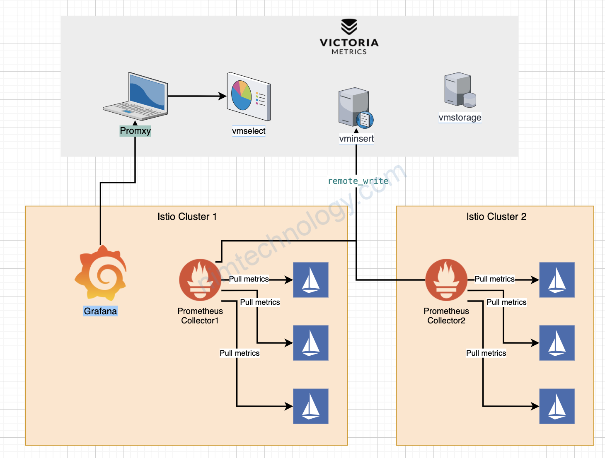

# 1. Введение в мониторинг

## Определение мониторинга

> **Мониторинг информационных систем**
>
> это процесс постоянного контроля и анализа работы информационных систем компании с целью обнаружения и устранения проблем, предотвращения сбоев и обеспечения информационной безопасности.

позволяет
- своевременно реагировать на изменения в работе системы
- оптимизировать ее производительность
- повышать эффективность работы компании

## Задачи мониторинга

1. **Сбор и анализ статистики о работе системы для принятия обоснованных решений** непосредственно сбор различных данных о работе системы для решения конкретных задач.
1. **Контроль и анализ работы оборудования, ПО, сетевых устройств, сетевых подключений** на основе заранее определенного перечня данных специалисты выясняют, корректно ли работают устройства.
1. **Выявление и предотвращение возможных сбоев и проблем в работе системы** написание правил для детектирования потенциальных и уже существующих неполадок в системе на основе собираемых метрик.
1. **Определение и устранение узких мест, оптимизация производительности системы** обнаружение проблемных зон в ходе аналитики производительности на основе данных, собранных при мониторинге, и, как итог, улучшение общей производительности системы.
1. **Обеспечение безопасности данных и защиты от внешних угроз** обнаружение в ходе мониторинга факторов, говорящих об угрозах или слабостях системы и совершенствование средств защиты.
1. **Своевременное обнаружение и устранение проблем, которые могут привести к простоям и потерям для компании,** с помощью выявления и предотвращения возможных сбоев в работе системы (пункт 3) происходит своевременная реакция, в результате чего не допускается долгий простой частей системы, которые имеют влияние на бизнес-выгоду (прибыль).

## Инструменты мониторинга

Обычно мониторинг реализуется с помощью систем сбора метрик, отображения метрик и алертов — трех взаимосвязанных компонентов, которые обеспечивают сбор, анализ и визуализацию данных о производительности и состоянии системы.

1. Система сбора метрик собирает данные о различных аспектах работы системы — использовании ресурсов, времени выполнения запросов, ошибок и предупреждений.
1. Система отображения метрик преобразует собранные данные в наглядные графики и диаграммы, которые позволяют пользователям быстро оценить состояние системы и выявить возможные проблемы.
1. Система алертов автоматически отправляет уведомления пользователям или администраторам системы при достижении определенных пороговых значений метрик или при возникновении аномалий. Это позволяет оперативно реагировать на возникающие проблемы и предотвращать их развитие.

### Метрики

Самой важной и основательной является система сбора метрик, поскольку этот этап связан с получением данных, а именно на данных все основывается — без них специалистам будет нечего анализировать и мониторить.

> **Метрики в мониторинге**
>
> это ключевые показатели, которые отражают состояние и производительность системы, приложения или компонента. Они предоставляют информацию о том, как система работает, какие ресурсы использует и как реагирует на различные события. Метрики помогают выявлять проблемы, отслеживать изменения и определять оптимальные настройки системы.

Они используются для анализа и оптимизации работы системы, а также для определения необходимости принятия мер по устранению проблем или улучшению производительности.

Типы метрик:
1. **Загрузка процессора** показывает, насколько активно процессор используется в данный момент.
1. **Объем свободной оперативной памяти** отражает количество доступной оперативной памяти для работы системы.
1. **Количество запросов к базе данных** указывает на активность работы с базой данных и производительность приложения.
1. **Качественные характеристики запросов к сервису или к базе данных (например, по содержанию)** может указывать на возможную атаку.
1. **Время отклика** характеризует скорость выполнения запросов к системе или приложению.
1. **Сетевая активность** отражает обмен данными с внешними ресурсами (например, интернет) и пропускную способность сети.

### Трассировка

для обнаружения и разбора неполадок в системе

> **Трассировка**
>
> это информация о пути выполнения запроса в распределенной системе. Она показывает, как запрос проходит через различные узлы системы и сколько времени занимает его обработка.

ПО: JaegerUI

### дашборды

> **Дашборды мониторинга**
>
> это интерактивные представления, которые отображают ключевые показатели и метрики работы системы в реальном времени. Они позволяют быстро анализировать информацию и своевременно выявлять проблемы и тенденции.

#### Элементы

1. **Графики и диаграммы**
    - чаще всего отображают текущую производительность и некоторые данные о работе системы.
    - Это может быть количество запущенных хостов на круговой диаграмме компании, продажи, прибыль, количество заказов и т. д.
1. **Таблицы**
	- содержат данные о системах, которые удобно изображать в табличном представлении.
    - Самый простой пример — логи и ошибки.
1. **Интерактивные элементы**
	- позволяют выбирать определенные параметры для анализа данных.
    - Например, это могут быть кнопки и фильтры.
1. **Уведомления и предупреждения**
	- сообщают о возникновении проблем или нештатных ситуациях.
    - Также они нередко транслируются в мессенджеры, которые всегда под рукой, чтобы уменьшить время реакции.
1. **Инструменты аналитики**
	- прогнозируют будущие результаты и планируют действия на основе прогнозов.
    - Например, графики трендов и прогнозирования.
1. **Информационные панели**
	- отображают новости, события и другую информацию, полезную для принятия решений.

#### три типа дашбордов

1. **операционные дашборды отображают изменения данных в бизнесе и позволяют увидеть** например, как менялась посещаемость сайта и что на нее влияло;
1. **аналитические дашборды помогают исследовать тенденции и делать выводы** например, зафиксировать отклонения показателей и отследить причины для конкретного продукта или сервиса компании по многим показателям;
1. **стратегические дашборды позволяют составить представление о ситуации в целом или об отдельных показателях, а также помогают следить за ситуациями в динамике** например, дашборд о лояльности персонала в информационной безопасности или об использовании сотрудниками определенного ПО.

# 2. Виды мониторинга. Автоматизация процесса мониторинга

Есть следующие виды мониторинга:

1. **мониторинг сервиса** - например, доступность сервиса извне/доступность внутри контура компании, down/up;
1. **мониторинг сервера** - остаток свободного места на жестком диске (HDD), потребляемая память (RAM), показатель нагрузки на сервер (CPU), показатель средней нагрузки на сервер (Load average);
1. **мониторинг других кастомных сущностей** - например, количество пользователей, совершивших определенное действие;
1. **мониторинг всего остального** - того, что в данный момент важнее для компании.

## Реализации мониторинга

### Простой скрипт

- подходит для несложных задач мониторинга
- Весь функционал мониторинга прописывается в коде скрипта

### SNMP

> **Мониторинг Simple Network Management Protocol**
>
> это процесс сбора, упорядочивания и отправки данных между сетевыми устройствами, подключенными через IP.

- SNMP работает путем отправки блоков данных на сетевое оборудование, которое отвечает на них
- основана на модели «клиент-сервер»
    - серверы (менеджеры) собирают и обрабатывают информацию об устройствах в сети
- Используются порты 161/udp и 162/udp: менеджер (SNMP-сервер) обращаёЖется к агентам по 161, агенты для отправки данных обращаются по 162 порту менеджера.

### Nagios

> система мониторинга ИТ-инфраструктуры «из коробки», которая несложно конфигурируется через конфигурационные файлы.

- использует плагины для сбора данных и оповещения о различных событиях — таких как доступность и реакция стандартных сервисов (FTP, SSH, HTTP и DNS)
- имеет клиент-серверную архитектуру и использует порты по умолчанию: HTTP (80 и 443), SNMP (161 и 162), SSH (22)
- Агенты могут использовать дополнительные динамически назначаемые порты в диапазоне от 1024 до 1034
- Nagios посылает сигнал через планировщик процессов для запуска плагинов
- плагины собирают данные и отправляют их обратно в планировщик
- на уровне сервера отправляются уведомления администраторам, а также обновляется графический интерфейс Nagios

### Zabbix

> система с открытым исходным кодом мониторинга служб и состояний компьютерной сети, которая использует центральный сервер и агенты для сбора данных о производительности, доступности и состоянии сетевых сервисов

- состоит из нескольких программных компонентов:
    - сервер
	- база данных
	- веб-интерфейс
	- прокси и агенты
- есть категорирование по критичности (info, critical и т. д.)

Zabbix использует следующие порты:
- 10051/tcp — порт для получения данных от активных агентов;
- 10050/tcp — порт для опроса клиентов и получения данных;
- 10052/tcp — порт для отправки данных на сервер;
- 10053/tcp — порт для отправки уведомлений на сервер.

### Prometheus

> легковесная система мониторинга с открытым исходным кодом для сбора, агрегации и анализа данных мониторинга

- использует Grafana для визуализации
- имеет легковесную архитектуру, что делает его подходящим для мониторинга больших распределенных систем

Сбор метрик:
- используется Node Exporter — небольшое приложение, собирающее метрики операционной системы и предоставляющее к ним доступ по HTTP
- Prometheus собирает данные с экземпляров Node Exporter ([https://github.com/prometheus/node_exporter](https://github.com/prometheus/node_exporter)) на хостах под мониторингом, обращаясь по адресам типа "http://` <server_address>:9100/metrics" и забирая нужные метрики
- программы настраиваются с помощью файлов с расширением yml
- Для хранения метрик без потерь совместно с ним используются внешние базы
- используется Victoria Metrics, чтобы прореживать и долго легковесно хранить собранные метрики

### Thanos

> проект с открытым исходным кодом, разработанный компанией Improbable для бесшовной трансформации существующих кластеров Prometheus в единую систему мониторинга с неограниченным хранилищем исторических данных

- создан для решения проблем, связанных с масштабированием и хранением петабайтов исторических данных.

Thanos предоставляет следующие возможности:
- глобальный запрос данных с нескольких экземпляров Prometheus;
- хранение исторических данных в объектном хранилище с возможностью простого резервного копирования;
- автоматическое агрегирование данных с разрешением в 5 минут и 1 час для эффективного использования ресурсов;
- интеграция с экземплярами Prometheus для хранения правил записи и алертинга.

Таким образом, Thanos позволяет улучшить мониторинг, упростить управление и снизить затраты на хранение данных.

 

### ELK

> **Elasticsearch, Logstash, Kibana**
>
> это стек инструментов для мониторинга и анализа ИТ-инфраструктуры и больших данных.

этот стек чаще всего в работе используется для ИБ-мониторинга в качестве SIEM-системы

состоит из трех компонентов:
1. **Elasticsearch (ES)** - масштабируемая утилита для полнотекстового поиска и аналитики;
1. **Logstash** - средство сбора и преобразования данных;
1. **Kibana** - визуальный инструмент для взаимодействия с данными.

используется для
- сбора, хранения и анализа логов
- агрегации, фильтрации и поиска информации
- автоматизации обработки данных
- представления данных
- алертинга

Архитектура ELK включает:
1. **Elasticsearch** ядро системы, сочетающее функции базы данных, поискового и аналитического движка (по умолчанию слушает локальный порт 9200).
1. **Logstash** конвейер обработки данных, который получает данные из разных источников, выполняет первичное преобразование и отправляет их в Elasticsearch (по умолчанию слушает порт 5044, но на практике под его функции обычно резервируется множество других произвольных портов).
1. **Kibana** инструмент для визуализации данных и администрирования базы данных (по умолчанию слушает порт 5601).
Плагины, которые позволяют собирать и передавать логи в ELK: Auditbeat, Filebeat, Metricbeat и др. Формально они не входят в стек, но практически всегда используются в реальной практике.

Для сбора метрик в данном случае используется легковесный агент Metricbeat
- устанавливается на хост
- собирает метрики в соответствии с конфигурационным файлом
- отправляет их в Logstash или сразу в изначальном виде отсылает их на хранение в ElasticSearch.

# 3. Оценка рисков информационной безопасности

# Источники

- [https://habr.com/ru/articles/709204/](https://habr.com/ru/articles/709204/)
- [https://habr.com/ru/companies/ruvds/articles/723588/](https://habr.com/ru/companies/ruvds/articles/723588/)
- [https://efsol.ru/promo/devops-monitoring.html](https://efsol.ru/promo/devops-monitoring.html)
- [https://cloud.vk.com/blog/zabbix-universalnaya-sistema-monitoringa](https://cloud.vk.com/blog/zabbix-universalnaya-sistema-monitoringa)
- [https://xakep.ru/2015/09/25/prometheus-monitoring/](https://xakep.ru/2015/09/25/prometheus-monitoring/)
- [https://www.elastic.co/elastic-stack](https://www.elastic.co/elastic-stack)
- [https://samag.ru/archive/article/3575](https://samag.ru/archive/article/3575)
- [https://habr.com/ru/articles/515722/](https://habr.com/ru/articles/515722/)
- [https://www.wikiquality.ru/protsedura-upravleniya-riskami-bazovyie-ponyatiya-identifikatsiya-i-otsenka-riskov/](https://www.wikiquality.ru/protsedura-upravleniya-riskami-bazovyie-ponyatiya-identifikatsiya-i-otsenka-riskov/)
- [https://opk.spb.ru/files/ГОСТ%20Р%20ИСО-МЭК%2027001-2006.pdf](https://opk.spb.ru/files/ГОСТ%20Р%20ИСО-МЭК%2027001-2006.pdf)

