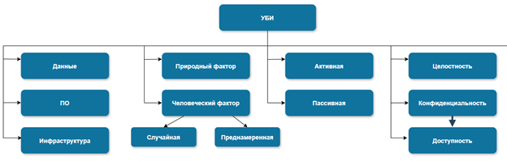
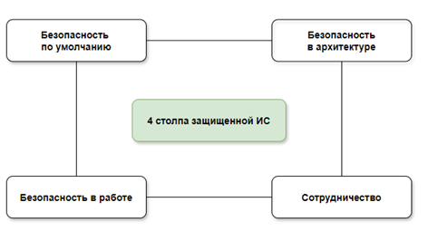
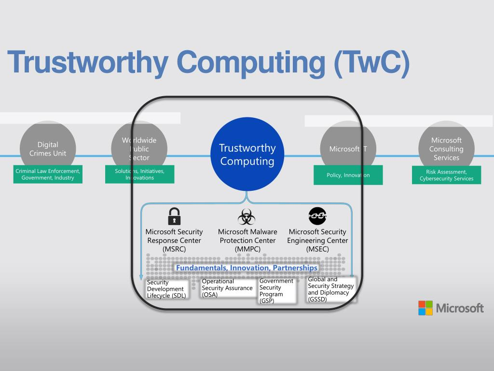
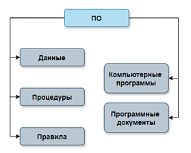
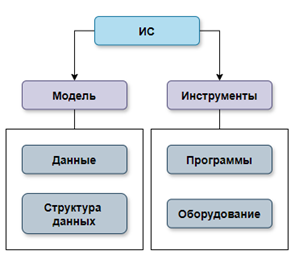
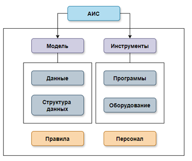
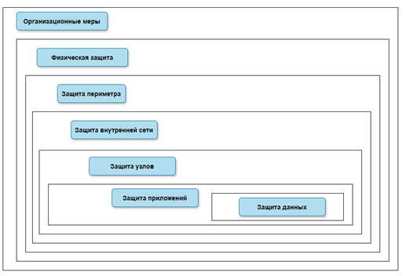
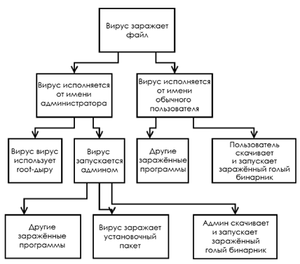

# 1. Основные понятия в области построения защищенных информационных систем

## Понятия в области защиты информационных систем

стандарт [ГОСТ Р 56939-2016 «Защита информации. Разработка безопасного программного обеспечения»](https://gostassistent.ru/doc/beb6fe87-cdbc-4ce1-8c1b-6d3f6f88e434)

> **Защищенная ИС**
>
> это система, разработка компонентов в которой велась в соответствии с определением выше, а в самой системе соблюдаются меры защиты, направленные на сохранение целостности, конфиденциальности и доступности информации.

> **Угроза безопасности информации**
>
> это совокупность условий и факторов, создающих потенциальную или реально существующую опасность нарушения безопасности информации.

> **Атака**
>
> это конкретная попытка реализации угрозы. Угрозу старается реализовать злоумышленник.

### Общая структура угроз безопасности информации (УБИ)

**пять обязательных классов**
- по цели воздействия (данные, ПО, инфраструктура);
- по фактору возникновения (природный, человеческий);
- по степени воздействия (активные, пассивные);
- по последствиям реализации (целостность, конфиденциальность, доступность);
- по условиям воздействия (случайные, преднамеренные).

**ранжирование угроз в зависимости от масштаба цели**
- на государство;
- на юридическое лицо;
- на физическое лицо.

### Основные негативные последствия:

- раскрытие или компрометацию конфиденциальной информации;
- несанкционированное использование ресурсов;
- сбой компонента или всей системы;
- отказ в обслуживании;
- уничтожение данных.

## 4 положения (столпа) о защищенной ИС

понятие защищенной информационной системы у Microsoft

> Модель Microsoft строится на отношении к защищенности, как к психологии. А само понятие защищенности основывается на знаниях и ощущениях человека: чем привычнее нам какое-то состояние, тем комфортнее мы себя в нем чувствуем.

### Безопасность в архитектуре

> при формировании системы ее проектирование и создание рассматриваются со стороны безопасности уже изначально, на первом этапе.

Это возможно благодаря следующим принципам:
- созданию защищенной архитектуры;
- стремлению к снижению количества уязвимостей в существующем коде;
- совершенствованию и внедрению новых функций обеспечения безопасности.
- В компании Microsoft построены модели угроз для каждого продукта.

### Безопасность по умолчанию

- Microsoft изначально создает системы легкими в эксплуатации
- готовы пожертвовать функциональностью в пользу минимизации рисков проникновения в систему с базовыми настройками
- Ставятся только минимально необходимые компоненты
- задаются минимально необходимые привилегии
- неиспользуемые функции отключаются

### Безопасность в работе

> означает непрерывную проверку на работоспособность и устойчивость инфраструктуры

Человек должен понимать, с чем он работает и как именно это работает
- проводят харденинг инфраструктуры
- внедряют СЗИ и набирают специалистов для мониторинга, обнаружения и отражения атак
- выстраивают единый процесс управления информационной безопасностью в организации

 

### Сотрудничество

> **Trustworthy Computing (TwC)** - Внимание уделяется и обучению сотрудников компании

- Тренинги
- стажировки
- повышение осведомленности о разных направлениях в информационных технологиях
- совместные проекты с партнерами
- внимание уделяется маркетинговым проектам, публикации материалов и обратной связи от пользователей

### Стандарты для разработки ИС

перечень стандартов, которые помогут определить основные требования к любой информационной системе:
- Разработку любых программных продуктов регулирует стандарт [ГОСТ Р ИСО/МЭК 90003-2014](https://files.stroyinf.ru/Data2/1/4293766/4293766625.pdf)
- [ГОСТ Р 56939-2016](https://gostassistent.ru/doc/beb6fe87-cdbc-4ce1-8c1b-6d3f6f88e434) — основополагающий документ при разработке защищенных ИС.
- Если вы планируете самостоятельно разрабатывать подсистему защиты информации для вашего интернет-магазина, то пригодятся [Требования по безопасности информации](https://fstec.ru/dokumenty/vse-dokumenty/spetsialnye-normativnye-dokumenty/trebovaniya-po-bezopasnosti-informatsii-utverzhdeny-prikazom-fstek-rossii-ot-2-iyunya-2020-g-n-76). Они устанавливают уровни доверия к средствам технической защиты информации и средствам обеспечения безопасности информационных технологий от ФСТЭК.
- Платежные процессы в электронной коммерции подчиняются стандарту PCI DSS (Payment Card Industry Data Security Standard). Он посвящен безопасности данных платежных карт и вляется основным для платежных агрегаторов и процессинговых центров
- Общий регламент по защите данных GDPR (General Data Protection Regulation) потребуется вам, если планируются продажи не только в России. Он касается обработки персональных данных в ЕС, в том числе и IP-адресов

# 2. Современные тенденции в разработке ПО

## Продукты ИТ-компаний

> **Исходный код**
>
> это компьютерная программа в текстовом виде на каком-либо языке программирования (согласно [ГОСТ Р 54593-2011. Информационные технологии. Свободное программное обеспечение. Общие положения](https://sysadminmosaic.ru/_media/gost_rf/54593-2011.pdf)).

Мы можем считать компьютерную программу набором команд и инструкций для исполнения.

Компьютерная программа не существует сама по себе, а является частью системы обработки информации.

> **Программный комплекс**
>
> это программа, состоящая из двух или более компонентов и (или) комплексов, выполняющих взаимосвязанные функции, и применяемая самостоятельно или в составе другого комплекса (согласно [ГОСТ 19.101-77. Единая система программной документации (ЕСПД). Виды программ и программных документов](https://gostassistent.ru/doc/db1c0f2f-4f2c-45d7-abd8-b278627686c7)).

> **Компьютерная система обработки информации, или программное обеспечение**
>
> это совокупность программ системы обработки информации и программных документов, необходимых для эксплуатации этих программ (согласно [ГОСТ 19781-90. Обеспечение систем обработки информации программное](https://cosced.ru/wp-content/uploads/2020/10/%D0%93%D0%9E%D0%A1%D0%A2-19.781-90-%D0%A2%D0%B5%D1%80%D0%BC%D0%B8%D0%BD%D1%8B-%D0%B8-%D0%BE%D0%BF%D1%80%D0%B5%D0%B4%D0%B5%D0%BB%D0%B5%D0%BD%D0%B8%D1%8F.pdf)).

Структура программного обеспечения выглядит следующим образом 

> **Программное средство**
>
> это ПО и связанные с ним документы, созданные, модифицированные или сгруппированные для удовлетворения требованиям контракта (согласно [ГОСТ Р 51904-2002. Программное обеспечение встроенных систем. Общие требования к разработке и документированию](https://files.stroyinf.ru/Data2/1/4294817/4294817035.pdf)).

Если мы отдаем ПС кому-то в использование, то получаем программный продукт.

**информационная система** — отражает модель какой-то части реальности и содержит в себе дополнительные инструменты для управления и редактирования этой модели.

> **Информационная система**
>
> это система, предназначенная для хранения, поиска и обработки информации, и соответствующие организационные ресурсы (человеческие, технические, финансовые и т. д.), которые обеспечивают и распространяют информацию (согласно [ISO/IEC 2382:2015. Information technology — Vocabulary](https://webstore.iec.ch/publication/22380#:~:text=ISO%2FIEC%202382%3A2015%20This%20standard%20of,concepts%20relevant%20to%20this%20field)).

Структура информационной системы 

**автоматизированные информационные системы (АИС)**

- Основное отличие в том, что к цифровым объектам тут добавляется персонал, который обслуживает эту АИС и взаимодействует с ней при помощи правил.

Структура АИС 

## Особенности и тренды в разработке информационных систем

Глобально большинство ИТ-компаний, занимающихся разработкой, сейчас руководствуются рядом принципов:
- Использование фреймворков и готовых компонентов
- Стремление к автоматизации на всех этапах разработки На этапе разработки часть базовых функций берут на себя фреймворки. На этапе тестирования внедряются автотесты, а в микросервисной архитектуре используют оркестраторы.
- «Гибкая» разработка (SCRUM/AGILE) и декларативная разработка
- «Прибитый гвоздями» стек технологий на крупных проектах

С 2022 года в России также сформировались собственные тренды:
- Сложность с облачной инфраструктурой от иностранных вендоров (Microsoft, Google, Amazon) и переход на отечественные решения.
- Использование ИИ-ассистентов в разработке и обучении (ChatGPT, Github Copilot).
- Микросервисная архитектура.
- Ориентация на информационную безопасность.

## Фреймворки разработки

При разработке используются разные виды фреймворков. Рассмотрим некоторые из них.
- Фронтенд-фреймворки
- Бэкенд-фреймворки
- Кроссплатформенные фреймворки
    - Адаптируют исходный код под разные операционные системы

### Agile

> **SCRUM**
>
> это методология управления, тесно связанная с философией Agile в разработке. Ее любят и крупные проекты, и стартапы.

Со стороны безопасности тут появляются два вопроса:
1. Какие новые угрозы несет гибкая разработка?
1. Можем ли мы использовать подходы Agile для обеспечения комплексной безопасности?

**DevSecOps** тоже относится к примеру использования Agile.

В данном случае безопасности уделяется внимание на каждой итерации, при этом сами меры ограничиваются только необходимыми именно на этом этапе. Инструменты, которые используются, встраиваются в цикл управления и работают с ним синхронно, а не блокируют его до устранения всех замечаний.

Если мы посмотрим на [Agile Manifesto](https://agilemanifesto.org/), — документ, описывающий философию гибкой разработки, — то увидим основные постулаты:
- Люди и взаимодействие важнее процессов и инструментов.
- Работающий продукт важнее исчерпывающей документации.
- Сотрудничество с заказчиком важнее согласования условий контракта.
- Готовность к изменениям важнее следования первоначальному плану.

Важны следующие правила:
1. Предложенные средства защиты должны не мешать процессу разработки, быть удобными в использовании.
1. Анализ на уязвимости должен проходить в формате экспресс-службы.

Кибербезопасность в Agile базируется на:
- мотивации людей к соблюдению правил кибербезопасности;
- защищенности «в моменте» (следовательно, отходе требований регуляторов на второй план);
- отказе от регламентов в пользу общения;
- готовности к быстрой смене защитной тактики.

# 3. Defense In-Depth, или эшелонированная защита

## Модель многоуровневой защиты

В модели многоуровневой защиты уровни, на которых будут выстраиваться рубежи, четко не определены

1. **организационные меры**
    - входят
        - политика безопасности
		- процедуры и регламенты
		- повышение осведомленности
        - обучение сотрудников
    - Регламенты и стандарты
    - защиту здесь можно считать базовой
1. **Физическая защита**
    - механизмы ограничения физического доступа к ресурсам системы
        - пропускная система на входе (СКУД)
		- видеонаблюдение
		- сигнализация
		- замки на дверях
1. **Защита периметра**
    - межсетевой экран
    - стоит задача определить точки доступа в защищаемую сеть из внешнего периметра
    - IDS/IPS
    - VipNet IDS + TIAS
    - большую долю ложноположительных срабатываний и обширное количество генерируемых логов
1. **Защита внутренней сети** ДМЗ, сегментацию сети, настраивать протокол IPSec и др. МСЭ используются и здесь, и даже могут ставиться на хосты сотрудников.
1. **Защита узлов**
    - опционально можете делить узлы на сервера и рабочие станции с учетом функциональности
    - обеспечить защиту от атак на отдельные узлы
    - встроенные средства защиты операционных систем:
        - файервол
		- отключение неиспользующихся или потенциально опасных служб
		- политика обновлений
		- механизмы аутентификации
    - используйте здесь антивирусную защиту
1. **Защита приложений**
    - защиту от атак, направленных на конкретные приложения — базы данных, почту, веб-приложения
1. **Защита данных**
    - меры по защите от несанкционированного доступа к обрабатываемой и хранящейся в системе информации

Для каждого уровня строится своя модель нарушителя, выбираются контрмеры и СЗИ.

Для каких систем меры по обеспечению эшелонированной защиты особенно важны? В России такими системами будут:
- **информационные системы персональных данных (ИСПДН)**  все системы, внутри которых хранятся и обрабатываются персональные данные;
- **государственные информационные системы (ГИС)**  системы, предназначенные для выполнения функции органа власти (например, система электронных дневников региона, муниципальные порталы, система обработки обращений граждан и др.);
- **автоматизированные системы управления техническим процессом (АСУТП)**  системы, работающие на реальных производственных процессах и ими управляющие, включающие в себя микроконтроллеры и специальные графические интерфейсы управления (SCADA);
- **критические информационные инфраструктуры (КИИ).**

## Пример обеспечения многоуровневой защиты

посмотрим, как с ней работают СЗИ на примере Anti-DDoS

плюсы многоуровневого подхода.
1. это распределение нагрузки между эшелонами. На каждом этапе поток событий сокращается, из-за чего ускоряется следующий этап.
2. такой подход позволяет защитить от излишнего потребления ресурсов, необходимых для работы приложений. Следовательно, необходимые для обслуживания мощности можно снизить или распределить на более критичные узлы.
3. защита происходит практически незаметно для пользователей — работать с приложениями удобно из-за отсутствия простоев систем.

# 4. Модель угроз для разработчиков

на безопасность информации могут влиять и другие факторы:
- ошибки на этапе проектирования;
- специальное внедрение уязвимостей на этапе разработки;
- ошибки в настройке и конфигурации;
- сбои в работе из-за паразитных излучений;
- природные факторы и пр.

> **Моделирование угроз информационной безопасности**
>
> систематический подход к выявлению и оценке угроз с целью минимизации соответствующих рисков и потенциального негативного воздействия на достижение целей компании, ее финансовые результаты и репутацию.

Конечным результатом моделирования должна стать модель угроз. Она содержит перечень актуальных (значимых) для защищаемого объекта угроз безопасности информации.

## Процедура моделирования угроз

Для тех, кто хочет подробнее изучить вопрос моделирования данных с «бумажной» стороны, будет полезной данная статья. [https://habr.com/ru/articles/351326/](https://habr.com/ru/articles/351326/)

6 этапов:
1. Идентификация активов и перечисление защищаемых компонентов.
1. Описание инфраструктуры. Определение текущей организации и существующих мер защиты.
1. Декомпозиция приложения. Описание свойств защищаемого объекта и реализуемых с его помощью бизнес-процессов.
1. Идентификация угроз. Подбор максимально большого перечня угроз, которые хотя бы теоретически могут воздействовать на защищаемый объект. Это сложная задача для человеческой памяти, поэтому обычно здесь используют классификаторы.
1. Документирование угроз.
1. Ранжирование угроз. Процесс фильтрации, как правило, выполняется в несколько итераций, на каждой из которых отбрасываются угрозы по тому или иному признаку — например, по наличию возможностей (ресурсов) у нарушителя или признаку незначительности риска.

После прохождения всех этапов у нас будет четкий ответ на вопросы:
- что защищаем?
- от чего защищаем?
- какой ущерб может быть нанесен?

Есть множество других, часто более удобных, понятных и полезных разработчику методологий. Например, вы можете использовать:
- модель STRIDE от Microsoft, а вместе с ней — инструмент Threat Modeling Tool [https://learn.microsoft.com/en-us/azure/security/develop/threat-modeling-tool](https://learn.microsoft.com/en-us/azure/security/develop/threat-modeling-tool)
- модель OWASP и инструмент Threat Dragon Tool [https://owasp.org/www-project-threat-dragon/](https://owasp.org/www-project-threat-dragon/)
- Threagile — Agile Threat Modeling Toolkit [https://threagile.io/#:~:text=Threagile%20is%20the%20open-source%20toolkit,potential%20risks%20and%20mitigation%20advice](https://threagile.io/#:~:text=Threagile%20is%20the%20open-source%20toolkit,potential%20risks%20and%20mitigation%20advice)
- матрицу угроз Mitre ATT&CK [https://attack.mitre.org/](https://attack.mitre.org/)

## Методика STRIDE для моделирования угроз

Аббревиатура STRIDE расшифровывается как:
- **(S)poofing of user identity (подмена идентификатора пользователя)** злоумышленник выдает себя за легитимного пользователя и выполняет от его имени вредоносные действия. Например, украв посредством фишинга его аутентификационные данные.
- **(T)ampering (вмешательство)** злоумышленник может организовывать подделку запроса (заголовки, куки и так далее)
- **(R)epudiation (отказ)** при недостаточном аудите действий пользователя злоумышленник может избежать части транзакций.
- **(I)nformation disclosure (разглашение данных)** дает возможность злоумышленнику украсть конфиденциальную информацию (персональные данные, токены доступа, секреты и пр.).
- **Denial of Service (отказ в обслуживании)** обозначают сбой в работе систем и выполнение действий с правами суперпользователя.
- **Elevation of privilege (повышение привилегий)** обозначают сбой в работе систем и выполнение действий с правами суперпользователя.

позволяет разработчику сосредоточиться на технических угрозах. С большой долей вероятности вы не сможете защитить систему от APT-группировок и целенаправленных атак, но можете попытаться закрыть угрозы, связанные с конкретными техническими нарушениями.

В базовой версии моделирование угрозы для разработчика может выглядеть в виде дерева:

