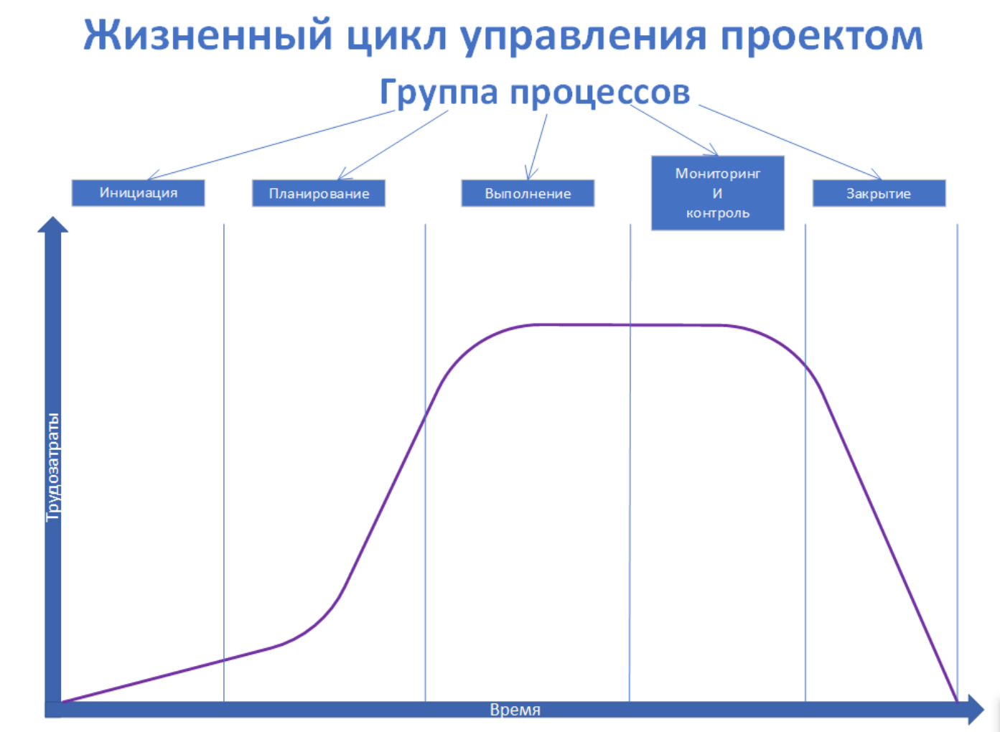

# 1 Информационные системы

Согласно 149-ФЗ «Об информации, информационных технологиях и о защите информации» от 27.07.2006

> **Информационная система**
>
> совокупность содержащейся в базах данных информации и обеспечивающих ее обработку информационных технологий и технических средств.

Более полное определение

> **Информационная система**
>
> это совокупность взаимосвязанных элементов, включающая в себя аппаратное и программное обеспечение, базы данных, процессы обработки информации и людей, которая предназначена для сбора, хранения, обработки, передачи и использования информации в рамках определенных целей и задач организации или системы. Это также включает в себя методы, процедуры и правила, используемые для работы с данными и обеспечения безопасности.

## Виды информационных систем

Иформационные системы могут одновременно принадлежать нескольким видам

### 149-ФЗ выделяет три вида информационных систем

- **Государственные информационные системы** федеральные информационные системы и региональные информационные системы, созданные на основании федеральных законов, законов субъектов Российской Федерации, на основании правовых актов государственных органов.
- **Муниципальные информационные системы** созданные на основании решения органа местного самоуправления.
- Иные информационные системы.

### ФСТЭК имеет собственную классификацию

- **Информационная система общего пользования**
- **ИСПДн** информационная система персональных данных
- **ГИС** государственная информационная система
- **АСУ ТП** автоматизированная система управления производственными и технологическими процессами на критически важных объектах, потенциально опасных объектах, а также объектах, представляющих повышенную опасность для жизни и здоровья людей и для окружающей природной среды

### ККИ

> **Объекты КИИ (объект критической информационной инфраструктуры)**
> 
> это информационные системы, информационно-телекоммуникационные сети, автоматизированные системы управления субъектов критической информационной инфраструктуры, то есть важных систем здравоохранения, промышленности, банковской сферы, государственных систем, а также систем обслуживания населения.

Ещё со времен КГБ подразделения, отвечающие за защиту информации в федеральных органах власти, обычно связаны с цифрой **8**:
- 8-й центр ФСБ России отвечает за деятельность по регулированию криптографии;
- 8-е управление ФСТЭК России координирует деятельность по защите информации объектов КИИ;
- 8-е управление Генштаба Вооруженных сил России обеспечивает защиту государственной тайны вооруженных сил;
- образованное в 2022 году 8-е управление ФСИН (Федеральной службы исполнения наказаний) занимается защитой информации ведомства.

### Виды без привязки к регуляторам

- **Операционные системы** Они отвечают за управление ресурсами компьютера, такими как процессор, память и устройства ввода-вывода.
- **Прикладные программы** Это программы, которые пользователи используют для выполнения конкретных задач, таких как текстовые редакторы, электронные таблицы и базы данных.
- **Системы управления базами данных (СУБД)** Они используются для управления и организации данных в базах данных.
- **Сетевые системы** Они нужны для соединения компьютеров и других устройств в сети.
- **Веб-приложения** Представляют собой интерактивные приложения, доступные через интернет.
- **Мобильные приложения** Это приложения, которые можно использовать на смартфонах и других мобильных устройствах.
- **Искусственный интеллект и машинное обучение** Эти технологии используются для создания систем, которые могут учиться и принимать решения на основе данных.

## Защита информационных систем

### CIA или триада безопасности

- **Конфиденциальность (Confidentiality)** защита информации от несанкционированного доступа.
- **Целостность (Integrity)** защита информации от изменения и удаления.
- **Доступность (Availability)** возможность получить доступ к информации в нужное время и с требуемым качеством.

## Баланс Защита <-> Удобство

- **В сторону удобства**
    - пользователи будут счастливы
    - Система без каких-либо паролей сразу будет показывать весь необходимый набор информации в удобном формате
    - по щелчку передавать данные и обрабатывать их
    - Информация будет доступна всем в мире публично и в полном объеме.
- **В сторону безопасности**
    - информация показана не будет, так как для её расшифровки нужно собрать комиссию с личными ключами в количестве 10 штук
    - пользователь получит её только в личном присутствии после подачи документов.

Определить наиболее удачный баланс — искусство, которому мы с вами попробуем научиться.

## Документация по безопасности

### Подробная документация поможет

- ответить на вопросы: «что», «как», «почему» и «зачем»;
- обнаружить и исправить ранее пропущенные ошибки в системе;
- систематизировать имеющиеся представления об информационной системе.

### Компоненты документации

- **Люди** сотрудники, которые обрабатывают информацию и принимают решения на основе этой информации.
- **Программное обеспечение** программы и приложения, которые помогают обрабатывать, хранить и анализировать данные.
- **Оборудование** компьютеры, серверы, сетевые устройства и другое оборудование, необходимое для работы системы.
- **Данные** информация, которая хранится в системе. Может быть в виде текстовых файлов, баз данных, изображений, видео и других форматов.
- **Коммуникации** средства связи, необходимые для обмена информацией между компонентами системы. Это может быть интернет, телефонные линии, беспроводные сети.

# 2. Методологии проектирования информационных систем

## Проект и его составляющие

> **Проект**
>
> это временное предприятие, направленное на создание уникального продукта, услуги или результата. Такое описание нам дает PMBOK, созданный PMI.

### Ограниченное время

У проекта всегда есть начало и конец, которые определяют его длительность

Мы говорим, что проект закончен, когда:
- Все цели проекта достигнуты, не могут быть достигнуты или принято решение их не достигать.
- Средства исчерпаны или ресурсы больше недоступны. К примеру, если в проект перестали инвестировать.
- В проекте больше нет необходимости. Допустим, мы разрабатывали приложение, но появились новые технологии, которые решают проблему без него.
- Есть законное обоснование закрыть проект. Например, если мы делали для госоргана проект, который потерял актуальность из-за нового закона.

### Ограниченные ресурсы

Для реализации проекта необходимы средства.

Ресурсы — это:

- команда разработки ПО (координаторы проекта, разработчики, тестировщики, бизнес аналитики и др.);
- техника (ПК, ноутбуки, периферийные устройства);
- программное обеспечение (JIRA, Confluence, Miro);
- мебель и иные статьи расходов.
- Важно заранее рассчитать, какие ресурсы потребуются. Если в процессе реализации проекта обнаружится их нехватка, это может привести к худшим результатам или даже закрытию проекта.

### Уникальность

У проекта должен быть уникальный продукт, услуга или результат.

#### Принцип MACD

| Буква    | Какое действие обозначает    | Пояснения    |
| :------: | :----------: | :--------------- |
| M     | move      | Перемещаем элементы системы из одного места в другое.  |
| A     | add       | Например, добавляем новый раздел на сайт или модернизируем мультимедийную систему автомобиля, включая туда навигационную систему. То есть мы что-то добавляем к уже существующей системе. |
| C     | create    | Например, создаем новое приложение.   |
| D     | delete    | Например, удаляем из ПО старую функцию, чтобы можно было вместо неё сделать что-то более современное.   |

### Проектный треугольник

Время, ресурсы и содержание проекта образуют проектный треугольник

- Все элементы проектного треугольника связаны между собой.
- Изменеие одного параметра влияет на изменение остальных двух
- Можно зафиксировать одно из ограничений, например, время. В этом случае нам придется повышать стоимость работ, так как для выполнения увеличенного объема понадобится больше ресурсов.

### Проектная деятельность

> Проектной деятельностью называют работу по реализации проекта.

Примеры:

- разработка MVP нового продукта,
- внедрение новой фичи,
- внесение изменений в структуру базы данных,
- перенос раздела сайта с одного места на другое,
- удаление из приложения какого-либо устаревшего инструмента.

**Не** является проектной деятельностью операционная деятельность компании:
- налаживание бизнес-процессовобучение сотрудников этим процессам
- обеспечение организационной структуры
- получение прибыли

### Цель проекта

У проекта всегда должна быть чётко определена цель

#### SMART

- **SMA** Цель нужно выбрать максимально конкретную и реалистичную, задать ей параметры, по которым мы будем оценивать её достижение
- **R** цель, направленная на значимый результат, — это как раз цель проекта
- **T** важно для первичной оценки проекта, составления графика, декомпозиции крупных задач на более мелкие

### Жизненный цикл проекта

> это то, что мы будем создавать, в какой последовательности, и как разобьем это на этапы

Жизненный цикл проекта описывается фазами и этапами

### Жизненный цикл управления проектом

> это группы процессов управления проектом, через которые вы проходите при создании и выполнении проекта

Пример для "Подготовка ТЗ"

1. **Инициализация** Запускаем начало подготовки ТЗ.
1. **Планирование** Назначаем дату начала подготовки и лицо, ответственное за результаты подготовки ТЗ. Решаем, как мы будем создавать ТЗ, какие материалы необходимы и в какой последовательности мы будем его писать.
1. **Выполнение** Контролируем процесс написания ТЗ.
1. **Мониторин** и контроль. Проверяем, что ТЗ написано и содержит всё необходимое.
1. **Закрытие** Собираем артефакты процесса, утверждаем ТЗ с заказчиком и передаём на следующий этап разработки дизайна, где этот документ будет входной информацией.

# 3. Практика взаимодействия с регуляторами

Основные требования безопасности задаются федеральными законами, постановлениями правительства и указами президента.

Примеры нормативных актов:

1. [Федеральный закон от 27.07.2006 N 149-ФЗ «Об информации, информационных технологиях и о защите информации»](http://www.consultant.ru/document/cons_doc_LAW_61798/)
1. [Постановление Правительства РФ от 01.11.2012 N 1119 «Об утверждении требований к защите персональных данных при их обработке в информационных системах персональных данных»](http://www.consultant.ru/cons/cgi/online.cgi?req=doc&base=LAW&n=137356)
1. [Указ Президента РФ от 01.05.2022 N 250 «О дополнительных мерах по обеспечению информационной безопасности Российской Федерации»](http://www.consultant.ru/document/cons_doc_LAW_416198/)

Деятельность по надзору и управлению информационной безопасностью распределена между отраслевыми регуляторами. 

- ФСТЭК России (Федеральная служба по техническому и экспортному контролю);
- ФСБ России (Федеральная служба безопасности);
- Минкомсвязь (Министерство цифрового развития, связи и массовых коммуникаций, Минцифры);
- Роскомнадзор (Федеральная служба по надзору в сфере связи, информационных технологий и массовых коммуникаций);
- Банк России;
- другие регуляторы более узкой специализации.

## ФСТЭК России

> **Федеральная служба по техническому и экспортному контролю (ФСТЭК)** занимается регулированием информационной безопасности, не связанной с криптографией и государственной тайной.

### Основные задачи ФСТЭК:

1. **Лицензирование средств защиты информации (СЗИ)** Сюда входит лицензирование СЗИ и присваивание им уровня защиты. Это гарантирует, что СЗИ соответствуют требованиям безопасности и эффективно защищают информацию.
1. **Аттестация информационных систем (АИС)** В основе аттестации — соответствие требованиям безопасности. Это позволяет определить уровень безопасности информационной системы и принять меры по улучшению её защиты.
1. **Контроль за использованием СЗИ** ФСТЭК контролирует использование СЗИ и соблюдение требований их применения. Сюда входят контроль за использованием СЗИ в государственных учреждениях и контроль за использованием защищённых каналов связи.
1. **Разработка требований к защите информации** а также разработка требований к СЗИ и АИС. Это позволяет определить стандарты безопасности и обеспечить их соблюдение при разработке и использовании информационных систем.
1. **Контроль за экспортом СЗИ и информационных технологий** Сюда входят контроль за экспортом информационных систем и программного обеспечения, содержащего криптографические средства защиты информации.
1. **Борьба с киберпреступностью** ФСТЭК проводит мероприятия по выявлению и предотвращению кибератак, а также занимается разработкой новых методов защиты информации.

- ФСТЭК проверяет организации на соответствия требованиям, которые предъявляет
- Часть задач по надзору и контролю за объектами КИИ была возложена на 8-е управление ФСТЭК России

### Наиболее значимые документы, определяющие требования ФСТЭК по защите информации

1. **О защите информации в информационных системах персональных данных (ИСПДн)** [Приказ ФСТЭК России от 18 февраля 2013 г. N 21 «Об утверждении состава и содержания организационных и технических мер по обеспечению безопасности персональных данных при их обработке в информационных системах персональных данных»](https://fstec.ru/dokumenty/vse-dokumenty/prikazy/prikaz-fstek-rossii-ot-18-fevralya-2013-g-n-21)
1. **О защите государственных информационных систем (ГИС)** [Приказ ФСТЭК России от 11 февраля 2013 г. N 17 «Об утверждении требований о защите информации, не составляющей государственную тайну, содержащейся в государственных информационных системах»](https://fstec.ru/dokumenty/vse-dokumenty/prikazy/prikaz-fstek-rossii-ot-11-fevralya-2013-g-n-17)
О защите предприятий, производства и технологических процессов: [Приказ ФСТЭК России от 14 марта 2014 г. N 31 «Об утверждении требований к обеспечению защиты информации в автоматизированных системах управления производственными и технологическими процессами на критически важных объектах, потенциально опасных объектах, а также объектах, представляющих повышенную опасность для жизни и здоровья людей и для окружающей природной среды»](https://fstec.ru/dokumenty/vse-dokumenty/prikazy/prikaz-fstek-rossii-ot-14-marta-2014-g-n-31)

### Лицензирование

- Деятельность по технической защите информации является лицензируемой
- То есть нужно получить лицензию ФСТЭК на техническую защиту конфиденциальной информации
- Фактически даже для простой услуги по установке антивируса необходима лицензия

Обычно для получения лицензии ФСТЭК на техническую защиту информации нужно:

1. Подготовить выделенное помещение с высоким уровнем физической безопасности: прочные двери и решётки на окнах, сигнализация и охрана, сейф.
1. Иметь не менее трёх сотрудников со стажем более 3 лет в области технической защиты конфиденциальной информации и дипломом об образовании по информационной безопасности. Диплом должен предполагать не менее 360 прослушанных часов по специализации.
1. Собрать комплект контрольно-измерительного оборудования для лаборатории. Если в реальной деятельности организация не использует специальное оборудование, можно приобрести, например, поверенный мультиметр.
1. сформировать комплект документов, регламентирующих процессы обеспечения безопасности в организации.

Подробнее о получении лицензии можно узнать в [Постановлении Правительства РФ от 03.02.2012 № 79](http://pravo.gov.ru/proxy/ips/?docbody=&nd=102108475)

### Сертификация средств защиты

ФСТЭК сертифицирует:

- межсетевые экраны;
- антивирусы;
- средства защиты информации от несанкционированного доступа;
- электронные замки;
- другие средства защиты.

Актуальный реестр сертифицированных средств защиты можно найти на [официальном сайте службы](https://reestr.fstec.ru/reg3)

### Мониторинг

ФСТЭК занимается постоянным мониторингом угроз и уязвимостей безопасности в программах и оборудовании. Актуальные данные заносятся в базу данных угроз и размещаются на [портале](https://bdu.fstec.ru/) и в [телеграм-канале](https://t.me/bdufstecru).

## ФСБ России

- наиболее закрытый регулятор из тех, с кем приходится взаимодействовать большинству организаций в российском правовом поле
- Многие документы по информационной безопасности содержат очень краткие формулировки, допускающие различное трактование
- В общедоступных документах ощущается лёгкая недосказанность.
- Конкретных требований в документах ФСБ по лицензированию нет
- ФСБ уходит от контроля конкретных требований к постоянному мониторингу инцидентов ИБ

### Лицензирование

ФСБ лицензирует деятельность организаций по работе с криптографией и по защите государственной тайны

#### Криптография

Линезируемой деятельностью является 
- разработка
- встраивание
- установка и распространение средств криптографической защиты информации
- а также защита каналов связи с помощью таких средств

Требования к соискателям
- подготовить и аттестовать автоматизированное рабочее место (АРМ) для работы;
- трудоустроить в штат не менее двух сотрудников со стажем по лицензируемым видам деятельности от 3 лет и подходящих по требованиям к образованию;
- подготовить комплект документов, регламентирующих работу с криптографией в организации.

Реестр компаний-лицензиатов ФСБ доступен на [сайте ведомства](http://clsz.fsb.ru/files/download/licenzii_H_291123.docx)

### Сертификация средств криптографической защиты

- ФСБ реестр таких сертификатов не публичный
- Вендоры сами размещают сертификаты на свои продукты на сайте в цензурированном виде или предоставляют по запросу

## Роскомнадзор

- занимается цензурой нежелательного контента в СМИ
- регулированием защиты персональных данных

## Минцифры

- активно участвует в разработке нормативных актов по информационной безопасности, а также занимается аккредитацией удостоверяющих центров
- Аккредитация позволяет выпускать электронные подписи, имеющие юридическую значимость

## Банк России

Защита информации в этом случае направлена на защиту банковской тайны — то есть сведений о клиентах финансовых организаций, включая счета и объёмы денежных средств на них, персональных данных клиентов и другой информации, характеризующей клиента.

Банк России требует, чтобы его уведомляли об инцидентах, произошедших в финансовых организациях. Срок предоставления уведомления — не более суток.

## Регуляторы финансовых организаций

### PCI Council

> **Payment Card Industry Security Standards Council** — Совет по стандартам безопасности индустрии платёжных карт. Совет предъявляет высокие требования к обеспечению безопасности банковских платёжных карт

Основной стандарт совета [ PCI DSS ](https://docs-prv.pcisecuritystandards.org/PCI%20DSS/Standard/PCI_DSS_v3-2-1_RU.pdf) (Payment Card Industry Data Security Standard) подробно определяет требования к общему процессу безопасности платёжных карт.

Стандарт распространяется не только на финансовые организации, но и на все торговые компании, принимающие карты для оплаты.

#### PCI DSS сосредоточен вокруг данных банковских карт

- номера карты,
- CVV/CVC,
- даты выпуска карты,
- данных магнитной полосы или чипа,
- ПИН-данных,
- сервисных кодов.

#### PCI DSS: требования

в зависимости от степени вовлечённости в процесс обработки данных банковских карт и количества транзакций

- ежегодное тестирование на проникновение;
- ежегодная оценка корректности сегментации;
- ежегодное обучение сотрудников и разработчиков;
- ежеквартальное внешнее и внутреннее сканирование на уязвимости;
- изолирование сегментов, содержащие карточные данные;
- обработка логов;
- разграничение доступа;
- защита от вредоносного кода.

#### Подтверждение соответствия PCI DSS

##### Малые предприятия

> До 1 000 000 транзацкий в год

Соответствие стандарту и фактическую безопасность карточных данных подтверждают самооценкой

Для самооценки достаточно заполнить специальную анкету SAQ (Self-Assessment Questionnaire). Например, организации, не совершающие миллиона операций, но хранящие данные карточек, заполняют лист [ SAQ D ](https://docs-prv.pcisecuritystandards.org/SAQ%20(Assessment)/SAQ/PCI-DSS-v4-0-SAQ-D-Merchant-r1.pdf). Его подписывает руководитель, затем лист предъявляют банку-эквайеру.

##### Крупные организации

> 1 000 000 и более транзакций в год

Соответствие стандарту и фактическую безопасность карточных данных внешним аудитом и регулярным пентестом

должны проходить полноценную проверку внешним аудитором QSA (Qualified Security Assessor). По итогу аудита организация получает аттестат соответствия AOC (Attestation of Compliance) и полный отчет ROC (Report on Compliance).

AOC — публичный аттестат, который содержит общую информацию о соответствии PCI DSS и может находиться на сайте компании. Но чаще вместо AOC на сайте размещается сертификат неустановленного образца, выдаваемый QSA-аудитором.

### SWIFT

У SWIFT свой стандарт требований по безопасности передаваемой и хранимой информации по международным платежам — [ SWIFT Customer Security Controls Framework ](https://www.swift.com/myswift/customer-security-programme-csp/security-controls). Во многом требования схожи с PCI DSS, ISO 27001 и ГОСТ 57580.1.

С самим стандартом можно ознакомиться на [ странице документации Swift ](https://www2.swift.com/knowledgecentre/publications/cscf_dd/50.0). Есть в том числе и [ переведенные на русский язык версии ](https://www2.swift.com/knowledgecentre/rest/v1/publications/cscf_dd/50.0/cscf_v2024_translated.zip?logDownload=true).

В [ приложении Е ](https://www2.swift.com/knowledgecentre/rest/v1/publications/cscf_dd/50.0/CSCF_v2023_20221021.pdf) к стандарту защиты приведена удобная таблица соответствия между стандартами Swift, ISO 27001 и PCI DSS. Также можно найти на русском языке в [ архиве с переведенной документацией ](https://www2.swift.com/knowledgecentre/rest/v1/publications/cscf_dd/50.0/cscf_v2023_Translated.zip). Начиная с версии 2024 года приложение по соотношение с отраслевыми стандартами вынесено в отдельный документ, недоступный публично.

## МВД России

- занимается расследованием уже совершённых преступлений
- За расследования преступлений в сфере информационных технологий в МВД России отвечает управление «К»

## Требования регуляторов

(ФСТЭК) Для обеспечения защиты информации, содержащейся в информационной системе, проводятся следующие мероприятия:

- формирование требований к защите информации, содержащейся в информационной системе;
- разработка системы защиты информации информационной системы;
- внедрение системы защиты информации информационной системы;
- аттестация информационной системы по требованиям защиты информации и ввод ее в действие;
- обеспечение защиты информации в ходе эксплуатации аттестованной информационной системы;
- обеспечение защиты информации при выводе из эксплуатации аттестованной информационной системы или после принятия решения об окончании обработки информации.

### ГОСТ по формированию требований к защите информации

- ГОСТ Р 51583 «Защита информации. Порядок создания автоматизированных систем в защищенном исполнении. Общие положения».
- ГОСТ Р 51624 «Защита информации. Автоматизированные системы в защищенном исполнении. Общие требования».

ГОСТ помогает:

- принять решения о необходимости защиты информации, содержащейся в информационной системе;
- классифицировать информационные системы по требованиям защиты информации;
- определить угрозы безопасности информации, возникновение которых может привести к нарушению безопасности информации в информационной системе, а также разработать на их основе модели угроз безопасности информации;
- определить требования к системе защиты информации информационной системы.

# 4. Модель угроз

Разработка модели угроз должна основываться на документах ФСТЭК:

- [«Базовая модель угроз безопасности персональных данных при их обработке в информационных системах персональных данных», Федеральная служба по техническому и экспортному контролю, 2008 год](https://fstec.ru/dokumenty/vse-dokumenty/spetsialnye-normativnye-dokumenty/bazovaya-model-ot-15-fevralya-2008-g)
- [«Методика определения актуальных угроз безопасности персональных данных при их обработке в информационных системах персональных данных», Федеральная служба по техническому и экспортному контролю, 2008 год](https://fstec.ru/dokumenty/vse-dokumenty/spetsialnye-normativnye-dokumenty/metodika-ot-14-fevralya-2008-g)
- [«Методика моделирования угроз безопасности информации», Федеральная служба по техническому и экспортному контролю, 2022 год. (ПРОЕКТ)](https://fstec.ru/dokumenty/vse-dokumenty/proekty/proekt-metodicheskogo-dokumenta)
- [«Методика оценки угроз безопасности информации», Федеральная служба по техническому и экспортному контролю, 2021 год.](https://fstec.ru/dokumenty/vse-dokumenty/spetsialnye-normativnye-dokumenty/metodicheskij-dokument-ot-5-fevralya-2021-g)

В качестве исходных данных ФСТЭК предлагает использовать [ банк данных угроз безопасности информации ](http://bdu.fstec.ru/), а также иные источники, содержащие сведения об уязвимостях и угрозах безопасности информации.

Что нужно определить и учесть согласно 17 и 31 приказам:

- структурно-функциональные характеристики нашей системы;
- физические, логические, функциональные и технологические взаимосвязи между сегментами информационной системы, с иными информационными системами и информационно-телекоммуникационными сетями;
- режимы обработки информации в информационной системе и в ее отдельных сегментах;
- иные характеристики информационной системы, применяемые информационные технологии и особенности ее функционирования.

Модель угроз безопасности:
- информации должна содержать описание информационной системы
- структурно-функциональных характеристик
- также описание угроз безопасности информации
    - описание возможностей нарушителей (модель нарушителя)
    - возможных уязвимостей информационной системы
    - способов реализации угроз безопасности информации
    - последствий от нарушения свойств безопасности информации.

В модели угроз мы:

1. Описываем возможные тактики и техники, о которых говорили в прошлом юните. Из их совокупностей мы и создаём жизненный цикл атаки или сценарии атаки в терминологии ФСТЭК России.
1. Составляем список актуальных угроз безопасности информации. Сам перечень угроз доступен на сайте ФСТЭК.
1. Определяем для каждой угрозы:
    - есть ли соответствующий объект воздействия в информационной системе,
    - есть ли сценарий реализации угрозы.
    - Если оба эти условия выполнены, то угроза считается актуальной.

На сайте ФСТЭК есть [ удобный и информативный перечень угроз ](https://bdu.fstec.ru/threat-section), с которым проще работать и подбирать средства защиты.

# 5. Проектирование информационной системы с учетом угроз

## Порядок создания информационных систем.

ГОСТ Р 59793-2021 описывает этапы создания информационных систем.

| Стадии   | Этапы работ    |
| :--------------- | :--------------- |
|  1. Формирование требований к системе  | 1.1. Обследование объекта и обоснование необходимости создания системы. 1.2. Формирование требований пользователя к системе. 1.3. Оформление отчета о выполненной работе.   |
| 2. Разработка концепции системы   |  2.1. Изучение объекта. 2.2. Проведение необходимых научно-исследовательских работ. 2.3. Разработка вариантов концепции системы и выбор варианта концепции системы, удовлетворяющего требованиям пользователя. 2.4. Оценка рисков проекта. 2.5. Оформление отчета о выполненной работе.  |
| 3. Техническое задание   | 3.1. Разработка и утверждение технического задания на создание системы.   |
| 4. Эскизный проект   | 4.1. Разработка предварительных проектных решений по системе и ее частям. 4.2. Разработка документации на систему и ее части.   |
| 5. Технический проект   |  5.1. Разработка проектных решений по системе и ее частям.<r>5.2. Разработка документации на систему и ее части.<r>5.3. Разработка и оформление документации на поставку изделий для комплектования системы и технических требований на их разработку.<r>5.4. Разработка заданий на проектирование в смежных частях проекта объекта автоматизации.  |
| 6. Рабочая документация   | 6.1. Разработка рабочей документации на систему и ее части. 6.2. Разработка или адаптация отдельных видов обеспечения.   |
| 7. Ввод в действие   | 7.1. Подготовка объекта автоматизации к вводу АС в действие. 7.2. Подготовка персонала. 7.3. Комплектация системы поставляемыми изделиями: программными и техническими средствами, программно-техническими комплексами, информационными изделиями. 7.4. Строительно-монтажные работы. 7.5. Пусконаладочные работы. 7.6. Проведение предварительных испытаний. 7.7. Проведение опытной эксплуатации. 7.8. Проведение приемочных испытаний.   |
| 8. Сопровождение системы   |  8.1. Выполнение работ в соответствии с гарантийными обязательствами. 8.2. Послегарантийное обслуживание.  |

### Общие шаги проектирования информационной системы

1. **Формирование требований** Определяем, какие функции должна выполнять система, какие задачи она будет решать, какие данные ей предстоит обрабатывать.
1. **Разработка концепции системы** Разрабатываем общую структура системы, определяем основные компоненты и их взаимодействие.
1. **Выбор технологий** На основе разработанной архитектуры выбираем технологии и инструменты для реализации системы.
1. **Проектирование системы** Разрабатываем детальные спецификации компонентов системы, проектируем и моделируем их.
1. **Разработка системы** Пишем код. тестируем и занимаемся отладкой разработанных компонентов.
1. **Внедрение системы** Устанавливаем и настраиваем систему на сервере, обучаем пользователей, обеспечиваем поддержку и сопровождение системы.

## ИБ в разработке ПО по методу SDLC

> **SDLC (Software Development Life Cycle)**
>
> жизненный цикл разработки программного обеспечения. Важной частью SDLC является безопасная разработка. Она включает в себя ряд методов и процессов, направленных на обеспечение безопасности приложения, которые подразумевают внедрение безопасности на каждом этапе разработки приложения.

Типовой SDLC состоит из 7 основных этапов:

1. Анализ требований.
1. Формирование требований.
1. Проектирование и дизайн.
1. Разработка.
1. Тестирование.
1. Развёртывание.
1. Подержка\Обслуживание

### Этапы с участием ИБ

3. **Проектирование и дизайн** На этом этапе становится понятным функционал, используемые технологии, схема взаимодействия элементов и внешний вид проекта. Специалисты по безопасности могут заранее учесть проект и скорректировать конкретные технологии и их реализацию. Формируются требования к схеме аутентификации пользователей, состав данных, алгоритмы хэширования и шифрования.

5. **Тестирование** На этом этапе нужно провести статический анализ кода, протестировать приложение «руками» на наличие уязвимостей или незапланированного функционала. Это нужно для того, чтобы проверить правильность реализации всех предъявленных требований,

6. **Развёртывание** Нужно убедиться, что на раскатку (развёртывание) отправляется именно финальная проверенная версия приложения. После раскатки приложение ещё раз проверяют на боевой системе, чтобы выявить уязвимости.

- Эти и другие проверки на этапах разработки могут выполняться параллельно с другими командами, не увеличивая сроки релиза версий
- Более правильным решением с точки зрения безопасности будет выделить отдельные этапы для команды ИБ.

## Требования к защите информационных систем

Чтобы защитить информацию в системе, нужно реализовать и проконтролировать требования о защите информации:

- к процессу хранения, передачи и обработки защищаемой в системе информации;
- к системе защиты информации;
- к взаимодействию системы с другими АС;
- к условиям функционирования системы;
- к содержанию работ по созданию (модернизации) системы на различных стадиях и этапах ее создания (модернизации);
- к организациям (должностным лицам), участвующим в создании (модернизации) и эксплуатации системы;
- к документации на систему;
- к системе в целом.

### ГОСТ Р 51583-2014 ПОРЯДОК СОЗДАНИЯ АВТОМАТИЗИРОВАННЫХ СИСТЕМ В ЗАЩИЩЕННОМ ИСПОЛНЕНИИ

[Текст: https://docs.cntd.ru/document/1200108858](https://docs.cntd.ru/document/1200108858)

- Требует использовать сертифицированные средства защиты информации
- и средства защиты, специально разработанных для системы
- Это касается в основном систем, создаваемых для нужд государства.

#### Формирование требований к системе

- анализ данных о назначении, функциях, условиях функционирования создаваемой (модернизируемой) и характере обрабатываемой информации;
- определение перечня информации, подлежащей защите;
- определение актуальных угроз безопасности информации, связанных с несанкционированным доступом к защищаемой информации, с утечкой информации по техническим каналам и с несанкционированным воздействием на информацию;
- разработку модели угроз безопасности информации применительно к конкретным вариантам функционирования системы;
- оценку степени участия персонала в обработке (обсуждении, передаче, хранении) защищаемой в системе информации;
- определение требуемого класса (уровня) защищенности системы от несанкционированного доступа;
- выбор целесообразных (исходя из экономических, научно-технических, временных и других ограничений, а также технологии обработки информации) способов защиты информации и контроля состояния защиты информации в системе;
- обоснование архитектуры и конфигурации системы защиты информации системы и ее отдельных составных частей, физических, функциональных и технологических связей как внутри системы, так и с другими взаимодействующими системами;
- выбор технических средств, которые могут быть использованы при разработке системы защиты информации системы.

#### Разработка концепции системы

- определение путей и оценку возможности реализации требований, предъявляемых к системе защиты информации создаваемой системы;
- обоснование необходимости привлечения организаций, имеющих необходимые лицензии, для создания системы защиты создаваемой системы;
- оценку материальных, трудовых и финансовых затрат на разработку и внедрение системы защиты создаваемой системы;
- анализ возможных уязвимостей и обоснование актуальных угроз безопасности информации и перечня мероприятий по их блокированию (нейтрализации);
- уточнение требований к архитектуре и конфигурации системы защиты системы;
- уточнение оценки материальных, трудовых и финансовых затрат на создание системы защиты создаваемой системы.

## Выводы

- Существуют ГОСТы, посвященные этапам создания систем и создания защищенных систем
- Они помогают сориентироваться в этапах и ничего не забыть
- ГОСТы не всегда обязательны

### Международных методологий, которые учитывают угрозы при проектировании информационных систем

- **Стандарт ISO/IEC 27005:2011** определяет процессы управления рисками, связанными с информационной безопасностью. Он включает в себя оценку рисков, определение мер противодействия и мониторинг эффективности принятых мер.
- **COBIT 5** обновленная версия стандарта COBIT, которая включает в себя процесс управления рисками. COBIT 5 предлагает набор инструментов и методов для оценки и управления рисками, связанными с информационными системами.
- **NIST SP 800-30** руководство по оценке рисков информационной безопасности, разработанное Национальным институтом стандартов и технологий США (NIST). Оно включает в себя методы и инструменты для анализа рисков и принятия решений о мерах противодействия.
- **OWASP Risk Rating Methodology (RSM)** методология оценки рисков, разработанная Open Web Application Security Project (OWASP). RSM помогает организациям определить наиболее важные угрозы и принять меры для их устранения.
- **Microsoft Threat Modeling Tool** инструмент для моделирования угроз, разработанный Microsoft. Он помогает определить потенциальные угрозы и уязвимости в информационных системах, а также предлагает рекомендации по их устранению.

