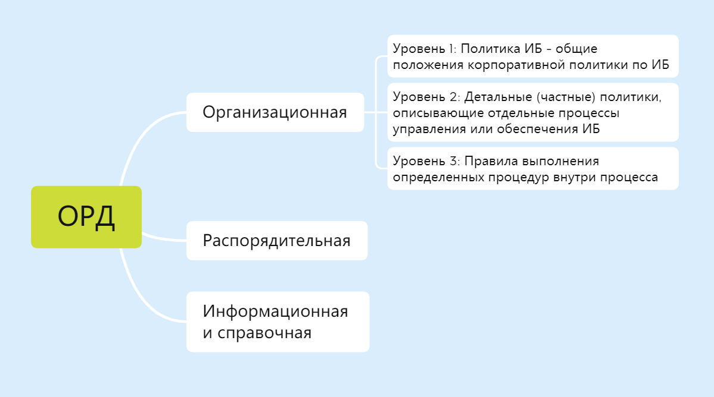
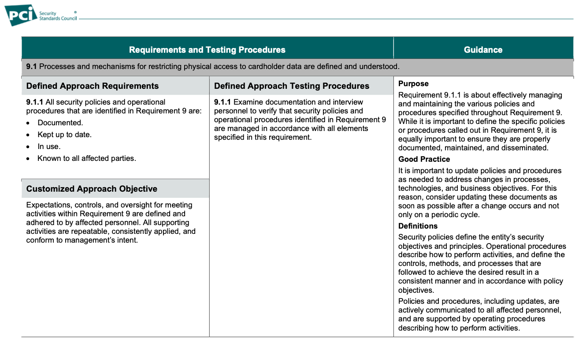

# 1. Иерархия внутренних документов

Информация защищается организационными и техническими мерами. Обычно они направлены на следующие свойства:

- **Конфиденциальность** исключение возможности неправомерного доступа, копирования, предоставления или распространения информации.
- **Целостность** защита от неправомерного уничтожения или модификации информации.
- **Доступность** возможность получить доступ к информации в нужное время и с требуемым качеством.

Все процессы, в том числе процессы защиты информации, нужно документировать. Это поможет предотвратить хаос и наладить процессы так, чтобы они работали, как того требует закон или топ-менеджер организации.

> **Организационно-распорядительный документ**
>
> это вид письменного документа, в котором фиксируют решения административных и организационных вопросов, а также вопросов управления, взаимодействия, обеспечения и регулирования органов власти, предприятий, организаций и должностных лиц.

На объём необходимой документации влияют:

- размер инфраструктуры организации,
- сложности существующих процессов и их взаимодействия,
- квалификация персонала.

## Классификация ОРД

Документацию можно классифицировать так:

- организационная,
- распорядительная,
- информационно-справочная.

## Структура ОРД

### Уровень 1

Политика информационной безопасности — документ, содержащий общие положения корпоративной политики по информационной безопасности.

### Уровень 2

Документы, которые определяют
- принципы
- правила
- требования 

применительно к конкретным областям информационной безопасности — детальные (частные) политики.

Такими документами могут быть:

- положения об управлении рисками информационной безопасности,
- положения о пропускном и внутриобъектовом режиме,
- положения о ролях и управлении доступом,
- регламенты антивирусной защиты,
- регламенты резервного копирования и восстановления данных,
- положения о коммерческой тайне,
- положения о криптографической защите информации,
- политика в отношении обработки персональных данных,
- другие документы.

Так же <ins>фиксируют разделение полномочий:</ins> разрабатывают положения о подразделениях организации, где описывают, кто и за какую часть процесса отвечает.

### Уровень 3

Документы, содержащие **правила выполнения определённых процессов**. Примерами таких документов могут быть:

- процедуры предоставления доступа к информационной системе,
- стандарты конфигурации сервера,
- руководства по использованию конкретного программного обеспечения,
- должностные инструкции персонала,
- правила для работников по обеспечению информационной безопасности.

#### Распорядительные документы

> В них всегда закрепляют решения руководства, которые обязательны к выполнению.

- С их помощью разрешают управленческие вопросы.
- Они направлены на подразделения или работников. В них могут указать, например, что ответственность несёт отдел информационной безопасности или начальник отдела информационной безопасности.
- С их помощью возникают административные отношения: права, обязанности и ответственность.

Примеры:
- назначение ответсвенных
- назначение администраторов
- распоряжение о введении в действие какого-либо регламента

#### Информационная и справочная документация

> В этих документах фиксируют сведения о ситуации в конкретный момент времени.

Это могут быть: объяснительные записки, акты, перечни

### Управление документами

Управление ОРД можно осуществлять с использованием **принципа Деминга-Шухарта – PDCA**

#### Шаги PDCA

1. **Планирование (Plan)** установление целей и процессов, необходимых для их достижения, планирования работ и распределения ресурсов.
1. **Выполнение (Do)** выполнение запланированных работ.
1. **Проверка (Check)** контроль выполненных работ, выявление несоответствий и причин их возникновения. На этом этапе активно используются информационно-справочные документы.
1. **Воздействие (Act)** устранение несоответствий.

Повторение этого цикла с определённой периодичностью поможет вам поддерживать ОРД в актуальном состоянии и иметь актуальные организационные меры защиты.

# 2. Структура документов

Структура организационных, распорядительных и информационных документов определяется по [ГОСТу Р 7.0.97-2016](https://www.consultant.ru/document/cons_doc_LAW_216461/).

### Структура организационного документа

первое, с чего необходимо начинать создание документа. Начинайте с описания базовой структуры:

- разбейте документ на мелкие составляющие,
- оформите заголовки разделов.

#### Пример возможного содержания по разделам

- **Термины и сокращения**  Здесь приводится перечень определений понятий, терминов, сокращений, которые используются в документе.
- **Основные положения**  Здесь описывают назначение документа и область его применения.
- **Основание для разработки**  Например, ссылки на законы, стандарты и внутренние документы.
- **Порядок и сроки пересмотра документа**

#### В тексте документа должны быть детально описаны

1. Предмет регулирования документа: как процесс будет реализован на практике.
1. Права, обязанности и ответственность подразделений, работников, исполнителей.

#### Дополнительные выжные элементы

- **титульный лист**, для которого нужно подобрать реквизиты
- **название организации с юридическим адресом**
- **гриф утверждения** — специальная отметка, подтверждающая статус официального документа
- **название документа**
- **место издания**, например, г. Москва
- **год издания**
- **лист согласования** с подписями ключевых сотрудников по направлению
- **лист содержания**, который можно сформировать автоматически в текстовом редакторе на основании структуры вашего документа
- **приложения**, которые могут отсутствовать или быть представлены в виде следующих объектов:
	- правила, которые необходимо периодически изменять
	- справочники
	- схемы или графики
	- объёмные таблицы
	- описания алгоритмов.

### Структура распорядительного документа

на примере приказа

может включать в себя следующие реквизиты:

- **название организации** с указанием юридического адреса
- **название документа** («ПРИКАЗ»)
- **дата подписания**
- **порядковый номер приказа**
- **место издания приказа**, например, г. Москва
- **заголовок перед текстом**, например, «О назначении ответственного за обработку персональных данных»
- **текст приказа**
- **подпись руководителя**
- **место согласования** — как правило, согласовывают руководители подразделений, чьи работники будут исполнителями приказа
- **ФИО** и **номер телефона исполнителя**

Текст приказа состоит из двух частей:

- **Констатирующая** описывает цели и причины издания, включает отсылки к законодательству или локальным документам.
- **Распорядительная**  излагает действия, указывает ответственных лиц и сроки исполнения.

### Структура информационно-справочного документа

необходимо предусмотреть следующее:

- кому пишется
- от кого
- непосредственно текст
- ФИО, подпись
- дата

#### Акты

> **Акт** — это документ, который составляется комиссией и подтверждает факты и события.

Форма акта может включать в себя следующие реквизиты:

- **гриф утверждения** — должность, ФИО утверждающего, дата утверждения
- **название организации**
- **название документа**, например, «Акт об уничтожении носителей персональных данных»
- **первая часть**, в которой указывается, на основании какого документа или устного распоряжения проводилась работа, результаты которой отражены в акте
- **состав комиссии** — должности, ФИО председателя и членов комиссии
- **вторая часть** — цели, задачи проведённой работы, её результаты
- **подписи** председателя и членов комиссии с указанием даты подписания

# 3. Разработка основных внутренних документов по ИБ

Разработка основных политик и инструкций
- [ 149-ФЗ ](https://www.consultant.ru/document/cons_doc_LAW_61798/)
- [187-ФЗ](https://www.consultant.ru/document/cons_doc_LAW_220885/)
- [152-ФЗ](https://www.consultant.ru/document/cons_doc_LAW_61801/)
- [98-ФЗ](https://www.consultant.ru/document/cons_doc_LAW_48699/)
- [ПП-1119](http://pravo.gov.ru/proxy/ips/?docbody=&nd=102160483)
- [ПП-17 ФСТЭК](https://fstec.ru/dokumenty/vse-dokumenty/prikazy/prikaz-fstek-rossii-ot-11-fevralya-2013-g-n-17)
- [ПП-21 ФСТЭК](https://fstec.ru/dokumenty/vse-dokumenty/prikazy/prikaz-fstek-rossii-ot-18-fevralya-2013-g-n-21)
- приказы ФСБ [378](https://base.garant.ru/70727118/) и [66](https://base.garant.ru/187947/)
- SWIFT
- PCI DSS
- ISO/IEC 2700.

## Доступ к информационным ресурсам

- нужен, чтобы избежать хаоса
- Задача специалистов по ИБ — построить рабочий процесс по управлению доступом к информации.

### Назначение документа

Пример: «Настоящий документ описывает порядок предоставления доступа к информационным ресурсам (в том числе порядок создания учётных записей), порядок изменения и отзыва прав доступа к информационным ресурсам».

### Область применения

Пример: «Требования данного документа распространяются на все подразделения и всех работников организации».

### Нормативные ссылки

Здесь вы можете указать
- нормативные правовые акты
- международные и национальные стандарты
- внутренний верхнеуровневый документ

### Термины и сокращения

Примеры были приведены ранее, при разработке политики информационной безопасности.

### Описание процесса управления доступом к информационным ресурсам

Здесь начинается самое интересное. «Описание процесса» может содержать в себе следующие подразделы:

- Общие положения
- Выделение пользовательских ролей
- Создание учётной записи пользователя
- Предоставление или изменение прав доступа к информационным ресурсам
- Отзыв прав доступа
- Прекращение доступа пользователей
- Контроль прав доступа

### Хранение, внесение изменений и рассылка

В разделе указываются требования к хранению документа, процедуре его пересмотра, доведению положений документа до заинтересованных лиц.

### Приложение 1. Перечень ролей

В приложении вы можете перечислить возможные роли и специфические особенности в отношении какого-либо информационного ресурса или информационной системы

## Регламент антивирусной защиты

### Общие разделы

- назначение
- область применения
- нормативные ссылки
- термины и сокращения
- хранение
- внесение изменений и рассылка

### Общие положения

Антивирусная защита организации обеспечивается с использованием системы антивирусной защиты на базе программного обеспечения … (указываете используемое).

Устанавливаются следующие правила антивирусной защиты:

- система антивирусной защиты должна быть активна постоянно;
- должна реализовываться периодическая установка обновлений антивирусного программного обеспечения и сигнатур антивирусных баз;
- отключение или прекращение обновления средств антивирусной защиты не допускается;
- администрирование системы антивирусной защиты осуществляют только работники отдела информационных технологий;
- должна производиться периодическая проверка всех программ и файлов данных рабочих станций и серверов на наличие вредоносного программного обеспечения;
- обязательному антивирусному контролю подлежат информация на съёмных носителях и устанавливаемое (изменяемое) программное обеспечение;
- журналы работы средств антивирусной защиты должны сохраняться и просматриваться работниками отдела информационных технологий.

### Функции и ответственность работников

1. Определение ролей в рамках антивирусной защиты (напр. Системный администратор и Администратор безопасности)
1. Определение отвественности участников Антивирусной Защиты

### Поддержание работоспособности системы антивирусной защиты

1. Перечень работ
1. Определение периодичности работ
1. Порядок резервирование антивирусных систем
1. Назначение ответственных

### Порядок внесения изменений в конфигурацию системы антивирусной защиты

1. Порядок внесения изменений в аппаратно-программную платформу системы
1. Порядок внесения изменений в правила антивирусной защиты

### Порядок действий по нейтрализации вирусных заражений

1. Порядок автоматического обнаружения и нейтрализации угроз
1. признаки вирусной активности
1. Порядок оповощения при обнаружении заражения
1. Порядок дейтсвий по нейтрализации
1. Проверка на отсутсвие выявленной угрозы
1. Назначение ответственных

### Порядок действий по ликвидации последствий вирусного заражения

1. Порядок выявления и документирования выявленных нарущений

# 4. Разработка модели угроз

Определять актуальные угрозы безопасности информации приходится у различных объектов, среди которых:
- информационные системы персональных данных (ИСПДн),
- государственные информационные системы (ГИС),
- автоматизированные системы управления техническими процессами (АСУ ТП),
- объекты критической информационной инфраструктуры (КИИ),
- информационные системы финансовых учреждений.

Основным документом при разработке модели угроз является [ «Методика оценки угроз безопасности информации», Федеральная служба по техническому и экспортному контролю, 2021 год ](https://fstec.ru/dokumenty/vse-dokumenty/spetsialnye-normativnye-dokumenty/metodicheskij-dokument-ot-5-fevralya-2021-g) (далее — методика).

- Методика предполагает возможность использовать иные документы: отраслевые, ведомственные, корпоративные
- Единственное требование — чтобы они соответствовали данной методике.
- Методика в явном виде переиспользует лучшие международные практики, как, например ATT&CK MITRE

> **Угроза безопасности информации**
>
> совокупность условий и факторов, создающих потенциальную или реально существующую опасность нарушения безопасности информации.

> **Уязвимость**
>
> недостаток (слабость) программного (программно-технического) средства или системы и сети в целом, который(ая) может быть использован(а) для реализации угроз безопасности информации.

## Этапы оценки безопасности информации

1. Определение негативных последствий. 1.1. Формирование экспертной группы. 1.2. Анализ исходных данных. 1.3. Определение негативных последствий, которые могут наступить от реализации (возникновения) угроз безопасности информации.
2. Определение объектов воздействий. 2.1. Анализ исходных данных. 2.2. Инвентаризация систем и сетей. 2.3. Определение возможных объектов воздействия угроз безопасности информации.
3. Оценка возможности реализации угроз и их актуальности. 3.1. Определение источников угроз безопасности информации и оценка возможностей нарушителей по реализации угроз безопасности информации. 3.2. Оценка способов реализации (возникновения) угроз безопасности информации. 3.3. Оценка сценариев реализации угроз безопасности информации в системах и сетях.

### Этап 1

Итак, предположим, что экспертная группа сформирована.

1. **Первым делом анализируются исходные данные**
	- инфраструктура,
	- обрабатываемые данные,
	- взаимодействия со смежными системами,
	- функциональная схема,
	- расположение технических средств ИСПДн (адрес),
	- используемые средства защиты и их сертификация.
1. **определяются актуальности угроз** В основе — сценарий реализации угроз, который включает тактики и техники, используемые злоумышленником.
1. **Определить граници моделирования угроз** разделить инфраструктуру на объекты защиты с привязкой к процессам. Для этих объектов будет выполнено моделирование угроз и построение систем защиты информации.

На первом этапе должны помочь:
- проведённая оценка ущерба (рисков) от нарушения основных критических процессов,
- экспертная оценка,
- информация, получаемая от подразделений, использующих информационную систему.

Угроза безопасности считается актуальной, если:
1. Имеется хотя бы один сценарий её реализации.
1. Её реализация приведёт негативным последствиям для обладателя информации (оператора) или государства.

В обязательном порядке определяются:
- Информационные ресурсы, обеспечивающие выполнение критических процессов: непосредственно информация, программно-аппаратные средства, средства защиты информации.
- Основные виды неправомерного доступа к каждому из ресурсов.

### Этап 2

1. **проводят**
	- анализ наличия потенциальных уязвимостей в информационной системе
	- выявляют их типы
	- определяют наличие недекларированных возможностей и необходимость доступа к системе для реализации каждой из угроз безопасности. Основным методом выявления потенциальных уязвимостей в информационной системе на этапе её эксплуатации является проведение <ins>тестирования на проникновение</ins>
2. **определение нарушителей безопасности и оценка их возможностей** 

<ins>Модель нарушителя</ins> представляет собой описательную модель потенциальных нарушителей, классифицируемую по их опыту, знаниям, возможностям использования ресурсов, мотивации и способам осуществления угроз.

На основе доступа в контролируемую зону, нарушители подразделяются на внешних и внутренних.
- Внешние нарушители не имеют доступа к системе и реализуют угрозы из внешних сетей связи общего пользования или сетей международного информационного обмена.
- Внутренние нарушители имеют доступ в инфраструктуру и могут реализовывать угрозы внутри самой системы.

Нарушители могут быть различных видов
- обладающие базовыми
- повышенными
- средними или высокими возможностями.

### Этап 3

В заключении осуществляется анализ возможных тактик и техник реализации угроз.

Для определения возможных сценариев атак методика предлагает использовать приведённые в ней тактики и техники, а также дополнительную информацию из Базы данных угроз Федеральной службы по техническому и экспортному контролю (БДУ ФСТЭК) или других баз данных компьютерных атак, например, ATT&CK MITRE.

## Типовая структура документа

0. Термины и сокращения
1. Общие положения. 1.1. Назначение и область действия документа. 1.2. Источники разработки.
1. Описание систем и сетей и их характеристика как объектов защиты. 2.1. Общее описание ИС. 2.2. Состав и архитектура ИС. 2.3. Взаимодействие ИС с внешними системами. 2.4. Пользователи ИС.
1. Возможные негативные последствия от реализации (возникновения) угроз безопасности информации.
1. Возможные объекты воздействия угроз безопасности информации.
1. Источники угроз безопасности информации.
1. Способы реализации (возникновения) угроз безопасности информации.
1. Определение актуальности использования СКЗИ для обеспечения безопасности конфиденциальной информации и необходимого класса СКЗИ.
1. Актуальные угрозы безопасности информации.
1. Приложения
	- Приложение А (обязательное). Перечень исключённых из базового перечня угроз безопасности информации.
	- Приложение Б (обязательное). Перечень возможных угроз безопасности информации.
	- Приложение В (обязательное). Перечень основных тактик и соответствующих им типовых техник, используемых для построения сценариев реализации угроз безопасности информации.
	- Приложение Г (обязательное). Возможные сценарии реализации угроз безопасности информации.

> **Модель угроз безопасности информации** должна содержать описание информационной системы и её структурно-функциональных характеристик, а также описание угроз безопасности информации, включающее описание возможностей нарушителей (модель нарушителя), возможных уязвимостей информационной системы, способов реализации угроз безопасности информации и последствий от нарушения свойств безопасности информации.

Модели угроз должен быть назначен соответствующий гриф доступа
- для государственных структур «для служебного пользования»
- для коммерческих — «коммерческая тайна».

# 5. Оформление компенсирующих мер

Иногда возникают ситуации, когда указанную в документах регулятора меру применить очень трудно или несоизмеримо дорого. Такую ситуацию великолепно иллюстрирует [ 21 приказ ФСТЭК ](https://fstec.ru/dokumenty/vse-dokumenty/prikazy/prikaz-fstek-rossii-ot-18-fevralya-2013-g-n-21) в отношении защиты персональных данных.

> При невозможности технической реализации отдельных выбранных мер по обеспечению безопасности персональных данных, а также с учётом экономической целесообразности на этапах адаптации базового набора мер и (или) уточнения адаптированного базового набора мер могут разрабатываться иные (компенсирующие) меры, направленные на нейтрализацию актуальных угроз безопасности персональных данных.

Похожие пункты есть и в других приказах ФСТЭК. Они позволяют применять компенсирующие меры при соответствующем обосновании, но экономическую целесообразность они при этом не учитывают.

Все компенсирующие меры необходимо правильно выбрать и обосновать.

## Выбор компенсирующих мер

Как подобрать компенсационные меры:

- Определить исходные риски из модели угроз.
- Описать сценарии реализации рисков в зависимости от контекста: компонентов инфраструктуры, типа нарушителя и прочее.
- Рассчитать возможный ущерб от реализации угроз.
- Рассчитать расходы на приведение системы в соответствие с требованиями.
- Если ущерб значительно ниже расходов — определить компенсирующие меры, направленные на снижение исходного риска.

Такими мерами могут быть:

- максимальное ограничение доступа к компоненту,
- расширенное логирование,
- контроль сетевого трафика,
- дополнительные периодические сканирования,
- тестирования на проникновения.

## Оформление компенсирующих мер

Чтобы использовать компенсирующие меры или отказаться от выполнения какого-либо требования регулятора, необходимо оформить обоснование такого решения.

Обоснование должно включать:

- причины исключения меры защиты;
- сопоставление исключаемой меры с угрозой защиты информации, которую мы нейтрализуем или блокируем;
- подробное описание компенсирующей меры;
- сравнительный анализ компенсирующей и исключаемой мер защиты информации;
- аргументированный вывод об обеспечении компенсирующей мерой адекватной нейтрализации или блокирования угрозы защиты информации.

 

Так для каждого выполняемого по индивидуальному подходу требования необходимо:

- провести тестирование каждой компенсирующей меры на эффективность;
- провести анализ рисков в соответствии с изначальным требованием;
- документировано подтвердить реализацию компенсирующей меры;
- собрать для аудитора доказательства эффективности компенсирующей меры.
- Аналогичный комплект будут ожидать и российские регуляторы.

# 6. Разработка внутренней технической документации

- стремитесь к единообразию
- в качестве основы для оформления документов часто используется [ ГОСТ Р 7.0.97-2016 ](https://protect.gost.ru/document.aspx?control=7&id=205885).

Стандарты предписывают оформлять техническую документацию согласно требованиям ЕСКД (ГОСТ 2) «Единая система конструкторской документации». Требования к оформлению технических документов установлены в [ГОСТе 2.105–2019](https://protect.gost.ru/default.aspx/document1.aspx?control=31&baseC=6&page=0&month=9&year=-1&search=&id=237857).

[ ГОСТ Р 59795–2021 ](https://protect.gost.ru/default.aspx/document1.aspx?control=31&baseC=6&page=1&month=12&year=2021&search=&id=241757) (строки 4-26 в Таблице 4) для оформления технической документации отсылает к ГОСТу 2.105 и [ ГОСТу 2.106 ](https://protect.gost.ru/document1.aspx?control=31&id=243960). Эти нормативные документы устанавливают правила для оформления текстовых документов и чертежей.

ребования включают:

- установку рамки по границам листа,
- размещение надписи внизу рамки в соответствии с ГОСТом 2.104,
- присвоение документу кода в соответствии с [ ГОСТом 34.201–2020 ](https://protect.gost.ru/document1.aspx?control=31&id=241756).

## Наиболее важные элементы, которые сделают документ удобнее

### Оглавление

Чёткая структура позволяет быстро перейти к нужному разделу, экономит время в критической ситуации. Также структура позволяет поделить важные смысловые блоки и улучшить запоминаемость материала.

### Нумерация страниц

В дополнение к оглавлению позволяет упростить работу с документом. ЕСКД требует для большинства документов использовать рамку, в которой указывается нумерация страниц. Для большинства организаций работа с рамкой избыточна, но номера страниц при этом стоит оставить. Нумерация обычно указывается в колонтитулах в нижней или верхней части страницы.

### Титульный лист, наименование, утверждение и дата

Эти элементы на первой странице помогут быстро понять, какой документ перед вами. Это касается и электронного, и бумажного вариантов документа.

### Контроль версий документа

Практичное дополнение — таблица с указанием текущей и предыдущих версий документа. Полезно добавить изменения, которые были внесены в каждой версии.

### Оформление заголовков

Заголовки печатают полужирным шрифтом с прописной буквы и дополняют номером, который показывает место в структуре и уровень заголовка.

### Оформление текста

Текст организационных документов пишут сдержанно, без разговорных оборотов и профессионального сленга.

> Ещё один важный нюанс связан со шрифтами. Полюбившиеся Times New Roman и Arial с недавних пор использовать нельзя. В п.3.3 ГОСТ Р 7.0.97-2016 по этому поводу указано: «Для создания документов необходимо использовать свободно распространяемые бесплатные шрифты».

### Назначение и область применения

В разделе описывается, зачем создан документ и каковы рамки его применения. Этот раздел кажется ненужным, но он поможет читателю понять суть документа, а также в каких случаях он применим.

### Порядок пересмотра документа

Описывается, как часто и при каких условиях пересматривается документ. Зачастую регуляторы просят пересматривать все документы не реже одного раза в год. Это не означает, что документ при этом должен меняться.

### Оформление рисунков

- В документе все графические материалы, такие как чертежи, схемы, диаграммы и рисунки, должны быть обозначены словом «Рисунок». Нумерация сквозная, последовательная.
- Рисунки добавляются сразу после текста, в котором они впервые упомянуты, или на следующей странице
- При этом номер рисунка не должен находиться на отдельной строке или странице
- Ссылка на рисунок должна быть размещена в конце предложения
- В некоторых ситуациях целесообразно вынести рисунок в отдельное приложение.

### Оформление таблиц

Таблицы в документе нумеруют арабскими цифрами. Нумерация сквозная, включает приложения. На все таблицы должны быть ссылки в тексте. Для ссылки используют слово «таблица» и указание её номера.

Таблицы добавляют сразу после текста, в котором они впервые упомянуты, или на следующей странице. Иногда целесообразно размещать таблицы в отдельных приложениях.

### Оформление приложений

Приложения размещают после основного текста документа. Каждое новое приложение начинается с новой страницы. Приложения нумеруют арабскими цифрами в порядке их упоминания в тексте и располагаются в порядке возрастания номеров.

Простой текст
Другой тенденцией в сфере разработки документов по информационной безопасности является стремление к их простоте, доступности и понятности для читателя. В первую очередь это касается инструкций.

- Документ переписывают максимально простым языком
- Все сложные термины объясняются
- каждая формулировка оттачивается так, чтобы она стала понятной любому работнику.
- Дополнительно делается памятка с наиболее важными моментами документов.

