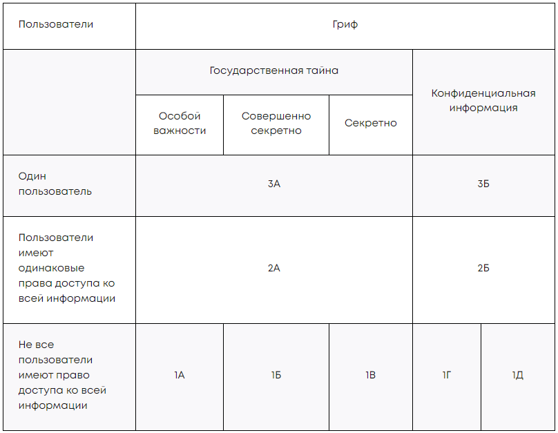

# 1. Разработка технического задания

[ГОСТ 34.602-2020 Информационные технологии. КОМПЛЕКС СТАНДАРТОВ НА АВТОМАТИЗИРОВАННЫЕ СИСТЕМЫ.Техническое задание на создание автоматизированной системы](https://docs.cntd.ru/document/1200181804)

[Стандарты ЕСКД](https://www.swrit.ru/gost-eskd.html)

Техническое задание определяет требования, порядок работ и процедуру приёмки.

Иногда техническое задание может измениться. В этом случае оформляют дополнение, которое становится частью технического задания.

## Разделы ТЗ

### Разделы ТЗ по ГОСТ

1. Общие сведения.
1. Цели и назначение создания системы.
1. Характеристика объектов автоматизации.
1. Требования к системе: функциональные, технические и организационные требования, требования к надёжности, безопасности, защите информации.
1. Состав и содержание работ по созданию системы: этапы разработки, сроки выполнения, ответственные лица.
1. Порядок разработки системы.
1. Порядок контроля и приёмки системы: критерии оценки, порядок тестирования, виды испытаний.
1. Требования к составу и содержанию работ по подготовке объекта автоматизации к вводу системы в действие.
1. Требования к документированию.
1. Источники разработки.

#### 1. Общие сведения

- полное и сокращённое наименование системы,
- наименования организаций заказчика и разработчика,
- плановые сроки начала и окончания работ,
- порядок оплаты и финансирования,
- перечень документов, на основании которых создаётся система: договор, нормативно-правовые акты, законы или технические задания ранее разрабатывавшейся системы.

#### 2. Определение назначения и цели

- Назначение определяет основную цель проекта, например, реализацию системы информационной безопасности в организации
- Цель уточняет, что именно должно быть достигнуто
- В качестве цели прописывают значения технических, технологических, производственно-экономических или других показателей, которые должны быть достигнуты в результате создания системы
- Также указывают критерии оценки достижения цели.

#### 3. Характеристика объекта автоматизации

Приводится информация о
- системах
- объектах
- процессах

на которые оказывает влияние проект по обеспечению информационной безопасности.

Эти данные необходимы для полного представления о масштабах работы и для обеспечения достаточного контекста для выполнения работ.

#### 4. Требования к системе

- описываются функциональные и нефункциональные требования
- требования необходимо прописывать максимально подробно
- если исполнитель услуг не определён, можно также описать требования к компании-разработчику системы:
    - наличие необходимых лицензий
    - наличие сотрудников с соответствующим опытом
    - оборудование

##### Функциональные требования

определяют, как должна работать система безопасности и какие функции она должна выполнять

Каждое требование должно быть чётким, измеримым и проверяемым

требования могут охватывать 
- процессы аутентификации и авторизации пользователей
- контроль доступа к информации
- обнаружение и предотвращение атак
- резервное копирование данных
- и т.п.

##### Нефункциональные требования

ограничения и критерии системы безопасности, которые не могут быть описаны в функциональных требованиях

Примеры параметров влюченные в нефункциональные требования
- Производительность, например, максимальное время отклика.
- Надёжность, например, максимальное время отклика.
- Масштабируемость.
- Устойчивость к атакам.

#### 5. Состав и содержание работ

оформляют с учётом [ГОСТа 34.601-90 «Автоматизированные системы. Стадии создания»](https://docs.cntd.ru/document/1200006921)

#### 6. Порядок разработки системы

- порядок организации разработки АС;
- перечень документов и исходных данных для разработки АС;
- перечень документов, предъявляемых по окончании соответствующих этапов работ;
- порядок проведения экспертизы технической документации;
- перечень макетов (при необходимости), порядок их разработки, изготовления, испытаний, необходимость разработки на них документации, программы и методик испытаний;
- порядок разработки, согласования и утверждения плана совместных работ по разработке АС;
- порядок разработки, согласования и утверждения программы работ по стандартизации;
- требования к гарантийным обязательствам разработчика;
- порядок проведения технико-экономической оценки разработки АС;
- порядок разработки, согласования и утверждения программы метрологического обеспечения, программы обеспечения надежности, программы эргономического обеспечения.


#### 7. Порядок контроля и приёмки системы

- позволит определить готовность системы к эксплуатации
- указывают, как будет контролироваться, что система соответствует установленным требованиям
- регламентируют процедуру приёмки системы после её разработки, включая условия и критерии успешной приёмки
- если имеются, указываются требования к приемной комиссии

#### 8. Требования к составу и содержанию работ по подготовке объекта автоматизации к вводу системы в действие

- Дальнейшие работы по вводу в эксплуатацию
- может включать создание необходимых условий, организационные мероприятия, обучение персонала.

#### 9. Требования к документированию

- какую документацию нужно создать в рамках проекта
- какие отчёты должны быть предоставлены
- Рекомендуется включить требования к составу, формату, содержанию и срокам представления документов и отчётов
- определяется необходимость предоставления отчётов о ходе выполнения проекта, результатам тестирования системы безопасности и других важных событиях

#### 10. Источники разработки

- перечень документов, на базе которых разрабатывалось техническое задание
- Эти документы разработчик системы также должен учитывать.

### Общие требования:

- Страницы технического задания нумеруют в верхнем колонтитуле посередине.
- На титульном листе и последней странице должны быть подписи заказчика и иных заинтересованных лиц, например, руководителя организации, руководителей подразделений, принимавших участие в составлении технического задания, сотрудников юридического подразделения.
- Если есть гриф секретности, конфиденциальности или другие отметки, то они указываются на титульном листе.

# 2. Аттестация информационной системы

- Аттестация ИС представляет собой комплекс мероприятий, в рамках которых оценивается уровень защищённости информации, обрабатываемой в системе.
- Пройденная аттестация подтверждает, что система соответствует требованиям информационной безопасности, установленным законодательством и стандартами Российской Федерации

    Аттестация обязательна для государственных информационных систем, а также для объектов КИИ. В иных случаях она может проводиться по желанию.

    Аттестат подтверждается выполнение в информационной системе необходимых мер защиты.

Порядок аттестации и классы защиты информационных (автоматизированных) систем производится в соответствии с документом [ «Руководящий документ. Автоматизированные системы. Защита от несанкционированного доступа к информации. Классификация автоматизированных систем и требования по защите информации» ](https://fstec.ru/dokumenty/vse-dokumenty/spetsialnye-normativnye-dokumenty/rukovodyashchij-dokument-ot-30-marta-1992-g-3), утверждённый Гостехкомиссией 30 марта 1992 года.

Аттестация проводится специализированными компаниями, обладающими Лицензией ФСТЭК на деятельность по технической защите конфиденциальной информации. Процедура подробно описана в [ Приказе ФСТЭК № 77 от 29.04.2021 ](https://fstec.ru/dokumenty/vse-dokumenty/prikazy/prikaz-fstek-rossii-ot-29-aprelya-2021-g-n-77), который содержит порядок организации и проведения работ по аттестации объектов информатизации на соответствие требованиям о защите информации ограниченного доступа.
- без грифа ДСП и позволяет выпускать бессрочные аттестаты
- лицензиаты ФСТЭК несут ответственность за каждый выданный ими аттестат

## Классы защищенности



Самый низкий класс защищенности - ```3Б```, самый высокий - ```1A```

От класса защищённости системы зависит и объём документов, необходимый для проведения аттестации. Чем выше класс защищённости, тем более строгие требования предъявляются к системе и используемым средствам защиты информации.

## Документы для проведения аттестации

- технический паспорт на объект информатизации;
- акт классификации информационной системы;
- модель угроз безопасности информации;
- техническое задание на создание, развитие, модернизацию объекта информатизации;
- проектную документацию на систему защиты информации объекта информатизации (при наличии);
- эксплуатационную документацию на систему защиты информации объекта информатизации и применяемые средства защиты информации;
- внутренние организационно-распорядительные документы, регламентирующие защиту информации в ходе эксплуатации объекта информатизации;
- документы, содержащие результаты анализа уязвимостей объекта информатизации и приёмочных испытаний системы защиты информации объекта информатизации (при наличии).

Для информационных систем, имеющих гриф государственной тайны необходимо отправлять в ФСТЭК и в организацию комплект документов на информационную систему.

Для систем, не содержащих государственную тайну, комплект меньше и отправка в ФСТЭК не требуется.

- Если нет возможности собственными силами настроить систему в соответствии с требованиями, привлекается организации имеющие лицензию ФСТЭК на техническую защиту конфиденциальной информации
- Если для защиты применяются средства криптографической защиты, то организация, оказывающая услуги по настройке, должна иметь и соответствующую лицензию ФСБ.

## Ответственность за аттестацию

несёт не только орган, который выдаёт документ, но и организация, которая его получает

В случае нарушений ФСТЭК может приостановить аттестат на срок не больше ```90``` календарных дней или прекратить его действие.

Это происходит, если организация:

- не предоставила материалы об устранении недостатков;
- не предоставила протоколы контроля уровня защищённости информации на аттестованном объекте информатизации;
- не предоставила материалы, подтверждающие проведение аттестации объекта информатизации для измененной архитектуры системы защиты информации;
- заявила о прекращении действия аттестата соответствия.

## Аттестация типового сегмента

Отдельно необходимо отметить возможность аттестовать типовые сегменты для дальнейшего масштабирования.

> Так, например, если в большой сети предполагается наличие большого количества близких по конфигурации автоматизированных рабочих мест (далее АРМ), то можно аттестовать только один АРМ. На остальные аттестат также будет применяться. Такая возможность описана в ГОСТ РО 0043-003-2012, ссылку на который привести в уроке нет возможности из-за присвоенного документу грифа. Для ГИС возможность прописана прямо в п.17.3 уже известного вам [17 приказа ФСТЭК](https://fstec.ru/dokumenty/vse-dokumenty/prikazy/prikaz-fstek-rossii-ot-11-fevralya-2013-g-n-17).

Аттестат на типовой сегмент распространяется:
- если для указанных сегментов установлены
    - одинаковые
        - классы защищённости
        - угрозы безопасности информации
    - реализованы одинаковые проектные решения по информационной системе и её системе защиты информаци.

Условия и порядок применения такого аттестата необходимо описать в программе и методиках аттестационных испытаний, заключении и аттестате соответствия.

# Дополнительные материалы

1. [«Требования ГОСТ на автоматизированные системы в ИБ-проектах. Что изменилось и как это применять?».](https://habr.com/ru/companies/angarasecurity/articles/671882/)
1. [Регулярно обновляемый «Справочник законодательства РФ в области информационной безопасности».](https://habr.com/ru/articles/432466/)
1. [«Подводные камни при работе с исполнителем во время аттестации объекта информатизации».](https://habr.com/ru/companies/cloud4y/articles/768640/)
1. [«Руководящий документ. Автоматизированные системы. Защита от несанкционированного доступа к информации. Классификация автоматизированных систем и требования по защите информации», утверждённый Гостехкомиссией 30 марта 1992 года.](https://fstec.ru/dokumenty/vse-dokumenty/spetsialnye-normativnye-dokumenty/rukovodyashchij-dokument-ot-30-marta-1992-g-3)
1. [Приказ ФСТЭК № 77 «Об утверждении порядка организации и проведения работ по аттестации объектов информатизации на соответствие требованиям о защите информации ограниченного доступа, не составляющей государственную тайну» от 29.04.2021.](https://fstec.ru/dokumenty/vse-dokumenty/prikazy/prikaz-fstek-rossii-ot-29-aprelya-2021-g-n-77)
1. [Приказ ФСТЭК № 17 «Об утверждении требований о защите информации, не составляющей государственную тайну, содержащейся в государственных информационных системах» от 11.02.2013.](https://fstec.ru/dokumenty/vse-dokumenty/prikazy/prikaz-fstek-rossii-ot-11-fevralya-2013-g-n-17)
1. [ГОСТ 34.601-90 »Информационная технология. Комплекс стандартов на автоматизированные системы. Автоматизированные системы. Стадии создания».](https://protect.gost.ru/document.aspx?control=7&id=137550)
1. [ГОСТ 34.602-2020 «Информационная технология. Комплекс стандартов на автоматизированные системы. Техническое задание на создание автоматизированной системы».](https://protect.gost.ru/document1.aspx?control=31&id=241754)
1. [ГОСТ Р 2.105-2019 «Единая система конструкторской документации. Общие требования к текстовым документам».](https://protect.gost.ru/default.aspx/document1.aspx?control=31&id=237857)

