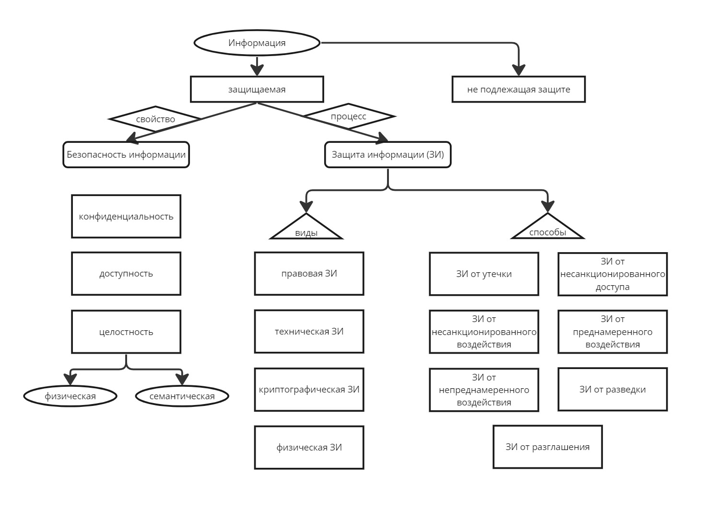

# 1. Основные понятия дисциплины

## Актуальность построения АС

Потребность в построении защищенных автоматизированных систем возникла из-за резкого увеличения числа угроз безопасности информации

[Банк данных угроз безопасности информации](https://bdu.fstec.ru/threat?ajax=threats&size=100) - список из 222 угроз безопасности информации<br>разделены по последствиям
- нарушение конфиденциальности;
- нарушение целостности;
- нарушение доступности.

> Сам ФСТЭК описывает назначение Банка так:
> 
> Целью создания и ведения настоящего Банка данных угроз безопасности информации является повышение информированности заинтересованных лиц о существующих угрозах безопасности информации в информационных (автоматизированных) системах.

Есть много причин резкого увеличения угроз:
- высокая плотность концентрации информации, подлежащей защите, в автоматизированных системах;
- использование иностранных программных продуктов;
- использование информационных технологий с открытым взаимодействием автоматизированных систем;
- сложность информационных технологий в современных АС;
- подключение АС к локальным и глобальным сетям (возможность удаленного подключения к АС).

## Терминология дисциплины

### определение защиты информации

согласно ст. [16 Федерального закона от 27.07.2006 N 149-ФЗ (ред. от 12.12.2023) «Об информации, информационных технологиях и о защите информации»](https://www.consultant.ru/document/cons_doc_LAW_61798/0e9ec16b786dcbdaaa7f44abfc4a15e601d5be22/)
1. Защита информации представляет собой принятие правовых, организационных и технических мер, направленных на:
    1) обеспечение защиты информации от неправомерного доступа, уничтожения, модифицирования, блокирования, копирования, предоставления, распространения, а также от иных неправомерных действий в отношении такой информации;
    2) соблюдение конфиденциальности информации ограниченного доступа;
    3) реализацию права на доступ к информации.

### автоматизированные системамы

[ГОСТ Р 59853-2021 «Информационные технологии. Комплекс стандартов на автоматизированные системы. Автоматизированные системы. Термины и определения»](https://protect.gost.ru/document1.aspx?control=31&id=242079)

#### Автоматизированный процесс (АП)

это процесс, осуществляемый при совместном участии человека и средств автоматизации. Проще говоря, это любой процесс, который помогает человеку упростить какое-либо действие с использованием средств автоматизации, что поможет увеличить эффективность, скорость, продуктивность этого действия.

#### Комплекс средств автоматизации автоматизированной системы (КСА АС)

это совокупность всех компонентов АС за исключением персонала. Проще говоря, это физические и технические средства, программное обеспечение, различные инструменты — то есть все, с чем человек работает при автоматизированном процессе.

#### Автоматизированная система (АС)

это система, состоящая из комплекса средств автоматизации, который реализует информационную технологию выполнения установленных функций, и персонала, обеспечивающего его функционирование.

Автоматизированная система включает в себя АП, КСА АС и человека.

## Компоненты АС

[Руководящий документ ФСТЭК «Классификация автоматизированных систем и требования по защите информации»](https://fstec.ru/dokumenty/vse-dokumenty/spetsialnye-normativnye-dokumenty/rukovodyashchij-dokument-ot-30-marta-1992-g-3) - автоматизированная система всегда состоит из:
- средств вычислительной техники;
- обслуживающего персонала;
- пользователей с их прикладными задачами.

> **Автоматизированное рабочее место (АРМ)**
>
> это программно-технический комплекс автоматизированной системы, предназначенный для автоматизации деятельности определенной категории пользователей или определенного вида деятельности.

### Документация на автоматизированную систему

это комплект взаимосвязанных документов, полностью определяющих технические требования к АС, проектные и организационные решения по созданию и функционированию АС.

> К документации на АС подходят все возможные документы, которые прямо указывают на автоматизированную систему или процесс, который в ней функционирует.

### схема основных терминов по защите информации

согласно [ГОСТу Р 50922-2006](https://gostassistent.ru/doc/cee759a7-8572-413e-a511-7bf1138f9ede?utm_referrer=https%3A%2F%2Fyandex.ru%2F)



> **Защищенная АС**
>
> это частный случай АС, а именно АС, предназначенная для обработки защищаемой информации с требуемым уровнем ее защиты.

# 2. Классификация автоматизированных систем

Защищенные автоматизированные системы классифицируется согласно документу [ФСТЭК «Руководящий документ. Автоматизированные системы. Защита от несанкционированного доступа к информации. Классификация автоматизированных систем и требования по защите информации»](https://fstec.ru/dokumenty/vse-dokumenty/spetsialnye-normativnye-dokumenty/rukovodyashchij-dokument-ot-30-marta-1992-g-3). Он утвержден решением председателя Государственной технической комиссии при Президенте Российской Федерации от 30 марта 1992 г. (далее — РДГТК).

## Классы защищенности АС

Всего существует 9 классов защищенности АС от несанкционированного доступа (далее — НСД).

<table style="width: 800px; word-break: keep-all;" id="table1">
      <tbody><tr>
        <td>
          <p style="margin-bottom: 0 !important;"><b>Класс защищенности АС</b></p>
        </td>
        <td>
          <p style="margin-bottom: 0 !important;"><b>Количество пользователей в АС</b></p>
        </td>
        <td>
          <p style="margin-bottom: 0 !important;"><b>Права доступа</b></p>
        </td>
        <td>
          <p style="margin-bottom: 0 !important;"><b>Конфиденциальность сведений</b></p>
        </td>
      </tr>
      <tr>
        <td>3А
        </td>
        <td>Однопользовательская
        </td>
        <td rowspan="2">Один пользователь имеет доступ ко всей информации АС
        </td>
        <td>Секретные сведения (далее — С)<br>совершенно-секретные сведения (далее — СС)<br>сведения особой важности (далее — ОВ)
        </td>
      </tr>
      <tr>
        <td>3Б
        </td>
        <td>Однопользовательская
        </td>
        <td>Служебная тайна<br>открытая информация
        </td>
      </tr>
      <tr>
        <td>2А
        </td>
        <td>Многопользовательская
        </td>
        <td rowspan="2">Одинаковые права доступа (полномочия) ко всей информации АС
        </td>
        <td>С, СС, ОВ
        </td>
      </tr>
      <tr>
        <td>2Б
        </td>
        <td>Многопользовательская
        </td>
        <td>Служебная тайна, открытая информация
        </td>
      </tr>
      <tr>
        <td>1А
        </td>
        <td>Многопользовательская
        </td>
        <td rowspan="5">Разные права доступа (полномочия)
        </td>
        <td>ОВ
        </td>
      </tr>
      <tr>
        <td>1Б
        </td>
        <td>Многопользовательская
        </td>
        <td>СС
        </td>
      </tr>
      <tr>
        <td>1В
        </td>
        <td>Многопользовательская
        </td>
        <td>С
        </td>
      </tr>
      <tr>
        <td>1Г
        </td>
        <td>Многопользовательская
        </td>
        <td>Служебная тайна (ДСП)
        </td>
      </tr>
      <tr>
        <td>1Д
        </td>
        <td>Многопользовательская
        </td>
        <td>Открытая информация
        </td>
      </tr>
    </tbody></table>

цифра в классе защищенности определяет количество пользователей в АС, а также права доступа:
- 3 — однопользовательские системы, в которых пользователь имеет доступ ко всей информации АС;
- 2 — многопользовательские системы, но также с одинаковыми правами и доступом ко всей информации АС;
- 1 — многопользовательские системы с различными правами доступа.

Буква определяет уровень конфиденциальности сведений
- А — самый высокий уровень
- Д — самый низкий.

**признаки для классификации по ГОСТ**

К числу определяющих признаков, по которым производится группировка АС в различные классы, относятся:
- наличие в АС информации различного уровня конфиденциальности (персональные данные, служебная тайна, государственная тайна: С, СС, ОВ и другая информация, подлежащая защите);
- уровень полномочий субъектов доступа АС на доступ к конфиденциальной информации (администратор, пользователь, сетевой инженер и т. п.);
- режим обработки данных в АС — коллективный или индивидуальный (один пользователь или много пользователей).

**Для проведения классификации защищаемой автоматизированной системы необходимы следующие исходные данные**
- Перечень ресурсов, подлежащих защите и уровень их конфиденциальности.
- Перечень лиц, имеющих доступ к автоматизированной системе и уровень их полномочий.
- Режимы обработки данных в АС.
- Таблица соответствия уровня доступа (полномочий) лиц и защищаемых ресурсов.

Каждому классу соответствуют подсистемы и требования, указанные в [руководящем документе ФСТЭК](https://fstec.ru/dokumenty/vse-dokumenty/spetsialnye-normativnye-dokumenty/rukovodyashchij-dokument-ot-30-marta-1992-g-3).

### сертифицированные средства вычислительной техники (СВТ)

> это совокупность программных и технических элементов систем обработки данных, способных функционировать самостоятельно или в составе других систем.

Средства вычислительной техники — по сути, то же самое, что и АРМ в АС, но без привязки к автоматизированной системе.

Показатели защищенности от несанкционированного доступа к информации» на классы защищенности АС не ниже (по группам) 3А, 2А, 1А, 1Б, 1В и использовать сертифицированные СВТ:
- не ниже 4 класса — для класса защищенности АС 1В;
- не ниже 3 класса — для класса защищенности АС 1Б;
- не ниже 2 класса — для класса защищенности АС 1А.

Классификация СВТ по уровню защищенности от несанкционированного доступа на основании [документа ФСТЭК «Руководящий документ. Средства вычислительной техники. Защита от несанкционированного доступа к информации. Показатели защищенности от несанкционированного доступа к информации»](https://fstec.ru/dokumenty/vse-dokumenty/spetsialnye-normativnye-dokumenty/rukovodyashchij-dokument-ot-30-marta-1992-g-2).

Он определяет 7 классов защищенности СВТ от НСД (самый защищенный — 1 класс, самый низко защищенный — 7), причем эти классы разделяются на 4 группы.

#### Группы СВТ

<table>
      <tbody><tr>
        <td>
          <p style="margin-bottom: 0 !important;"><b>Группа</b></p>
        </td>
        <td>
          <p style="margin-bottom: 0 !important;"><b>Чем характеризуется</b></p>
        </td>
        <td>
          <p style="margin-bottom: 0 !important;"><b>Классы защищенности</b></p>
        </td>
      </tr>
      <tr>
        <td>1
        </td>
        <td>-
        </td>
        <td>7
        </td>
      </tr>
      <tr>
        <td>2
        </td>
        <td>Дискреционная защита
        </td>
        <td>6 и 5
        </td>
      </tr>
      <tr>
        <td>3
        </td>
        <td>Мандатная защита
        </td>
        <td>4, 3, 2
        </td>
      </tr>
      <tr>
        <td>4
        </td>
        <td>Верифицированная защита
        </td>
        <td>1
        </td>
      </tr>
    </tbody></table>

### Классы защищенности, составляющих государственную тайну

<table style="width: 800px; word-break: keep-all;">
      <tbody><tr>
        <td>
          <p style="margin-bottom: 0 !important;"><b>Класс защищенности АС</b></p>
        </td>
        <td>
          <p style="margin-bottom: 0 !important;"><b>Класс защищенности СВТ от НСД</b></p>
        </td>
        <td>
          <p style="margin-bottom: 0 !important;"><b>Конфиденциальность сведений</b></p>
        </td>
      </tr>
      <tr>
        <td>3А
        </td>
        <td>2
        </td>
        <td>Гриф «Особая важность»
        </td>
      </tr>
      <tr>
        <td>3А
        </td>
        <td>3
        </td>
        <td>Гриф «Совершенно секретно»
        </td>
      </tr>
      <tr>
        <td>3А
        </td>
        <td>4
        </td>
        <td>Гриф «Секретно»
        </td>
      </tr>
      <tr>
        <td>3Б
        </td>
        <td>5-7
        </td>
        <td>Служебная тайна, персональные данные, банковская тайна, другая конфиденциальная информация
        </td>
      </tr>
      <tr>
        <td>2А
        </td>
        <td>2
        </td>
        <td>Гриф «Особая важность»
        </td>
      </tr>
      <tr>
        <td>2А
        </td>
        <td>3
        </td>
        <td>Гриф «Совершенно секретно»
        </td>
      </tr>
      <tr>
        <td>2А
        </td>
        <td>4
        </td>
        <td>Гриф «Секретно»
        </td>
      </tr>
      <tr>
        <td>2Б
        </td>
        <td>5-7
        </td>
        <td>Служебная тайна, персональные данные, банковская тайна, другая конфиденциальная информация
        </td>
      </tr>
      <tr>
        <td>1А
        </td>
        <td>2
        </td>
        <td>Гриф «Особая важность»
        </td>
      </tr>
      <tr>
        <td>1Б
        </td>
        <td>3
        </td>
        <td>Гриф «Совершенно секретно»
        </td>
      </tr>
      <tr>
        <td>1В
        </td>
        <td>4
        </td>
        <td>Гриф «Секретно»
        </td>
      </tr>
      <tr>
        <td>1Г
        </td>
        <td>5
        </td>
        <td>Служебная тайна, персональные данные, банковская тайна, другая конфиденциальная информация
        </td>
      </tr>
      <tr>
        <td>1Д
        </td>
        <td>6-7
        </td>
        <td>открытая информация
        </td>
      </tr>
    </tbody></table>

## Классификация ИС персональных данных

классификация Информационных систем персональных данных согласно [Приказу ФСТЭК России, ФСБ России, Мининформсвязи России от 13 февраля 2008 года №55/86/20 «Об утверждении порядка проведения классификации информационных систем персональных данных»](http://special.minsvyaz.donland.ru/Default.aspx?PageId=109705)

### Исходными данными для проведения классификации ИС ПДн

#### 1. Категория обрабатываемых ПДн – Х<sub>пд<sub>

- **категория 1**<br>касающиеся расовой, национальной принадлежности, политических взглядов, религиозных и философских убеждений, состояния здоровья, интимной жизни;
- **категория 2**<br>позволяющие идентифицировать субъекта персональных данных и получить о нем дополнительную информацию (за исключением категории 1);
- **категория 3**<br>позволяющие идентифицировать субъекта персональных данных;
- **категория 4**<br>обезличенные и (или) общедоступные персональные данные.

#### 2. Объем обрабатываемых ПДн (по количеству субъектов) – Х<sub>нпд</sub>

- более 100 000 субъектов (либо в пределах субъекта РФ или РФ в целом);
- от 1000 до 100 000 субъектов (либо субъектов, работающих в отрасли экономики РФ, в органе государственной власти, проживающих в пределах муниципального образования);
- менее 1000 (либо в пределах одной организации).

#### 3. Характеристики безопасности персональных данных, заданные оператором:

- типовые ИС (обеспечение исключительно конфиденциальности ПДн);
- специальные ИС (касаются здоровья субъекта, либо могут порождать юридические последствия в отношении субъекта или иным образом затрагивать его права и законные интересы).

#### 4. Структура ИС:

- автономные (АРМ);
- локальная вычислительная сеть АРМов без удаленного доступа (локальные ИС);
- сеть из локальных сетей и АРМов с использованием технологии удаленного доступа (распределенные ИС).

#### 5. Наличие подключения к сетям общего пользования (например, «Интернет»):

- имеющие подключение;
- не имеющие подключение.

#### 6. Режим обработки ПДн:

- однопользовательские;
- многопользовательские.

#### 7. Режим ограничения прав доступа пользователей:

- без ограничения прав;
- с разграничением прав.

#### 8. Местонахождение технических средств ИС:

- в пределах РФ;
- частично или полностью за пределами РФ.

### Порядок выбора класса защищенности

<table>
      <tbody><tr>
        <td>
          <p style="margin-bottom: 0 !important;"><b>Х<sub>пд</sub> Х<sub>нпд</sub></b></p>
        </td>
        <td>
          <p style="margin-bottom: 0 !important;"><b>3</b></p>
        </td>
        <td>
          <p style="margin-bottom: 0 !important;"><b>2</b></p>
        </td>
        <td>
          <p style="margin-bottom: 0 !important;"><b>1</b></p>
        </td>
      </tr>
      <tr>
        <td>
          Категория 4
        </td>
        <td>
          К4
        </td>
        <td>
          К4
        </td>
        <td>
          К4
        </td>
      </tr>
      <tr>
        <td>
          Категория 3
        </td>
        <td>
          К3
        </td>
        <td>
          К3
        </td>
        <td>
          К2
        </td>
      </tr>
      <tr>
        <td>
          Категория 2
        </td>
        <td>
          К3
        </td>
        <td>
          К2
        </td>
        <td>
          К1
        </td>
      </tr>
      <tr>
        <td>
          Категория 1
        </td>
        <td>
          К1
        </td>
        <td>
          К1
        </td>
        <td>
          К1
        </td>
      </tr>
    </tbody></table>

### Классы защищенности ИС ПДн в соответствии с последствиями для субъектов ПДн

<table>
      <tbody><tr>
        <td>
          <p style="margin-bottom: 0 !important;"><b>Класс</b></p>
        </td>
        <td>
          <p style="margin-bottom: 0 !important;"><b>Последствия для субъектов ПДн при нарушении безопасности
              персональных данных</b></p>
        </td>
      </tr>
      <tr>
        <td>1 (К1)
        </td>
        <td>Значительные негативные
        </td>
      </tr>
      <tr>
        <td>2 (К2)
        </td>
        <td>Негативные
        </td>
      </tr>
      <tr>
        <td>3 (К3)
        </td>
        <td>Незначительные негативные
        </td>
      </tr>
      <tr>
        <td>4 (К4)
        </td>
        <td>Не приведет к негативным последствиям
        </td>
      </tr>
    </tbody></table>

### государственным информационным системам

[Приложении № 1 приказа ФСТЭК от 11 февраля 2013 г. N 17 «Об утверждении требований о защите информации, не составляющей государственную тайну, содержащейся в государственных информационных системах»](https://fstec.ru/dokumenty/vse-dokumenty/prikazy/prikaz-fstek-rossii-ot-11-fevralya-2013-g-n-17)

Класс защищенности информационной системы (первый класс К1, второй класс К2, третий класс К3) определяется в зависимости от уровня значимости информации (УЗ), обрабатываемой в этой информационной системе, и масштаба информационной системы (федеральный, региональный, объектовый).

Можем заметить, что К4 для ГИС уже не определяется — это связано с тем, что нарушение безопасности информации однозначно несет негативные последствия или может повлечь угрозу появления негативных последствий.

## Уровни значимости информации

вводится пунктом 2 [Приказа ФСТЭК 2013 года № 17](https://fstec.ru/dokumenty/vse-dokumenty/prikazy/prikaz-fstek-rossii-ot-11-fevralya-2013-g-n-17)

> Уровень значимости информации определяется степенью возможного ущерба для обладателя информации (заказчика) и/или оператора от нарушения конфиденциальности (неправомерные доступ, копирование, предоставление или распространение), целостности (неправомерные уничтожение или модифицирование) или доступности (неправомерное блокирование) информации.

Уровень значимости информации определяется по формуле:

```
УЗ = [(конфиденциальность, степень ущерба) (целостность, степень ущерба) (доступность, степень ущерба)]
```

где степень возможного ущерба определяется обладателем информации (заказчиком) и/или оператором самостоятельно экспертным или иными методами.

### степень ущерба с последствиями при нарушении безопасности информации

<table>
      <tbody><tr>
        <td>
          <p style="margin-bottom: 0 !important;"><b>Степень ущерба</b></p>
        </td>
        <td>
          <p style="margin-bottom: 0 !important;"><b>Последствия в социальной, политической, международной,
              экономической, финансовой или иных областях
              деятельности при нарушении одного из свойств безопасности информации (К, Ц, Д)</b></p>
        </td>
      </tr>
      <tr>
        <td>Высокая
        </td>
        <td>Существенные негативные
          <br><br>
          И (или) информационная система, и (или) оператор (обладатель информации) не могут выполнять возложенные на
          них
          функции.
        </td>
      </tr>
      <tr>
        <td>Средняя
        </td>
        <td>Умеренные негативные
          <br><br>
          И (или) информационная система, и (или) оператор (обладатель информации) не могут выполнять возложенные на
          них
          функции.
        </td>
      </tr>
      <tr>
        <td>Низкая
        </td>
        <td>Незначительные негативные
          <br><br>
          И (или) информационная система, и (или) оператор (обладатель информации) могут выполнять возложенные на них
          функции с недостаточной эффективностью, или выполнение функций возможно только с привлечением дополнительных
          сил и средств.
        </td>
      </tr>
    </tbody></table>

### уровни значимости информации

| Степень ущерба, хотя бы для одного из свойств безопасности информации (Целостности, Конфиденциальности, Доступности) | Уровень значимости |
| -------------- | --------------- |
| Высокая | УЗ 1 |
| Средняя | УЗ 2 |
| Низкая | УЗ 3 |

### масштаб информационной системы

| Масштаб ИС | Функционирует на территории  |
| -------------- | --------------- |
| Федеральный | Российской Федерации (в пределах федерального округа) и имеет сегменты в субъектах Российской Федерации, муниципальных образованиях и (или) организациях. |
| Региональный | Субъекта Российской Федерации и имеет сегменты в одном или нескольких муниципальных образованиях и (или) подведомственных и иных организациях. |
| Объектовый | Объектов одного федерального органа государственной власти, органа государственной власти субъекта Российской Федерации, муниципального образования и (или) организации и не имеет сегментов в территориальных органах, представительствах, филиалах, подведомственных и иных организациях. |

## Определение классов защищенности ИС

Класс защищенности ИС определяется масштабом информационной системы и уровнем значимости информации, обрабатываемой в ней

<table>
      <tbody><tr>
        <td rowspan="2">
          <p style="margin-bottom: 0 !important;"><b>Уровень значимости информации</b></p>
        </td>
        <td colspan="3">
          <p style="margin-bottom: 0 !important;"><b>Масштаб информационной системы</b></p>
        </td>
      </tr>
      <tr>
        <td>Федеральный
        </td>
        <td>Региональный
        </td>
        <td>Объектовый
        </td>
      </tr>
      <tr>
        <td>УЗ 1
        </td>
        <td>К1
        </td>
        <td>К1
        </td>
        <td>К1
        </td>
      </tr>
      <tr>
        <td>УЗ 2
        </td>
        <td>К1
        </td>
        <td>К2
        </td>
        <td>К2
        </td>
      </tr>
      <tr>
        <td>УЗ 3
        </td>
        <td>К2
        </td>
        <td>К3
        </td>
        <td>К3
        </td>
      </tr>
    </tbody></table>

Для ИС ПДн приказом [ФСТЭК от 18 февраля 2013 г. № 21 «Об утверждении состава и содержания организационных и технических мер по обеспечению безопасности персональных данных при их обработке в информационных системах персональных данных»](https://fstec.ru/dokumenty/vse-dokumenty/prikazy/prikaz-fstek-rossii-ot-18-fevralya-2013-g-n-21) п. 12 определяет 4 уровня защищенности персональных данных, что коррелирует с Приказом ФСТЭК России, ФСБ России, Мининформсвязи России от 13 февраля 2008 года №55/86/20

- **1 уровень**<br>применяются средства защиты информации не ниже 4 класса и 4 уровня доверия, а также средства вычислительной техники не ниже 5 класса.
- **2 уровень**<br>применяются средства защиты информации не ниже 5 класса и 5 уровня доверия, а также средства вычислительной техники не ниже 5 класса.
- **3 уровень**<br>применяются средства защиты информации 6 класса и 6 уровня доверия, а также средства вычислительной техники не ниже 5 класса.
- **4 уровень**<br>применяются средства защиты информации 6 класса и 6 уровня доверия, а также средства вычислительной техники не ниже 6 класса.

Классы средств вычислительной техники от НСД уже рассматривались выше — они применимы и здесь.

## Уровни доверия к СЗИ

> это уровни, характеризующие безопасность применения средств для обработки и защиты информации, содержащей сведения, составляющие государственную тайну, иной информации ограниченного доступа, а также для обеспечения безопасности значимых объектов критической информационной инфраструктуры Российской Федерации.

Классификация уровней доверия к средствам защиты информации, в соответствии с «Требованиями по безопасности информации, устанавливающие уровни доверия к средствам технической защиты информации и средствам обеспечения безопасности информационных технологий», утвержденными [приказом ФСТЭК России от 2 июня 2020 г. N 76](https://fstec.ru/dokumenty/vse-dokumenty/spetsialnye-normativnye-dokumenty/trebovaniya-po-bezopasnosti-informatsii-utverzhdeny-prikazom-fstek-rossii-ot-2-iyunya-2020-g-n-76)
- Всего Приказ определяет 6 уровней доверия (самый низкий уровень – шестой, самый высокий – первый).

согласно [Информационному сообщению «Об утверждении требований по безопасности информации, устанавливающих уровни доверия к средствам технической защиты информации и средствам обеспечения безопасности информационных технологий» от 15 октября 2020 г. N 240/24/4268](https://fstec.ru/dokumenty/vse-dokumenty/informatsionnye-i-analiticheskie-materialy/informatsionnoe-soobshchenie-fstek-rossii-ot-15-oktyabrya-2020-g-n-240-24-4268), которое дополняет Приказ ФСТЭК № 76 2020 г.

<table>
      <tbody><tr>
        <td>
          <p style="margin-bottom: 0 !important;"><b>Уровень доверия</b></p>
        </td>
        <td>
          <p style="margin-bottom: 0 !important;"><b>Объекты КИИ</b></p>
        </td>
        <td>
          <p style="margin-bottom: 0 !important;"><b>ГИС</b></p>
        </td>
        <td>
          <p style="margin-bottom: 0 !important;"><b>АСУ</b></p>
        </td>
        <td>
          <p style="margin-bottom: 0 !important;"><b>ИС ПДн</b></p>
        </td>
      </tr>
      <tr>
        <td>6
        </td>
        <td>3 категория
        </td>
        <td>3 класс защищенности
        </td>
        <td>3 класс защищенности
        </td>
        <td>3 и 4 уровня защищенности персональных данных
        </td>
      </tr>
      <tr>
        <td>5
        </td>
        <td>2 категория
        </td>
        <td>2 класс защищенности
        </td>
        <td>2 класс защищенности
        </td>
        <td>2 уровень защищенности персональных данных
        </td>
      </tr>
      <tr>
        <td>4
        </td>
        <td>1 категория
        </td>
        <td>1 класс защищенности
        </td>
        <td>1 класс защищенности
        </td>
        <td>1 уровень защищенности персональных данных
        </td>
      </tr>
      <tr>
        <td>3
        </td>
        <td colspan="4">Применяются в информационных (автоматизированных) системах, в которых обрабатывается информация,
          содержащая сведения, составляющие государственную тайну не выше «С»
        </td>
      </tr>
      <tr>
        <td>2
        </td>
        <td colspan="4">Применяются в информационных (автоматизированных) системах, в которых обрабатывается информация,
          содержащая сведения, составляющие государственную тайну не выше «СС»
        </td>
      </tr>
      <tr>
        <td>1
        </td>
        <td colspan="4">Применяются в информационных (автоматизированных) системах, в которых обрабатывается информация,
          содержащая сведения, составляющие государственную тайну уровня «ОВ»
        </td>
      </tr>
    </tbody></table>

## Классификация межсетевых экранов

При необходимости использовать межсетевой экран будем руководствоваться [Информационным сообщением ФСТЭК «Об утверждении Требований к межсетевым экранам»](https://fstec.ru/dokumenty/vse-dokumenty/informatsionnye-i-analiticheskie-materialy/informatsionnoe-soobshchenie-fstek-rossii-ot-28-aprelya-2016-g-n-240-24-1986) от 28 апреля 2016 г. № 240/24/1986.

### 5 типов межсетевых экранов (МСЭ)

<table>
      <tbody><tr>
        <td>
          <p style="margin-bottom: 0 !important;"><b>Тип МСЭ</b></p>
        </td>
        <td>
          <p style="margin-bottom: 0 !important;"><b>На какой границе ИС используется</b></p>
        </td>
        <td>
          <p style="margin-bottom: 0 !important;"><b>Какого исполнения могут быть</b></p>
        </td>
        <td>
          <p style="margin-bottom: 0 !important;"><b>Особенности обеспечения</b></p>
        </td>
      </tr>
      <tr>
        <td><strong>Тип «А»</strong>
          <br><br>
          Уровня сети
        </td>
        <td>На физической границе (периметре) или между физическими границами разных сегментов
        </td>
        <td>Только программно-техническое исполнение
        </td>
        <td>
        </td>
      </tr>
      <tr>
        <td><strong>Тип «Б»</strong>
          <br><br>
          Уровня логических границ сети
        </td>
        <td>На логической границе (периметре) или между логическими границами сегментов
        </td>
        <td>Программное или программно-техническое исполнение
        </td>
        <td>
        </td>
      </tr>
      <tr>
        <td><strong>Тип «В»</strong>
          <br><br>
          Уровня узла
        </td>
        <td>на узле (хосте)
        </td>
        <td>Только программное исполнение
        </td>
        <td>Устанавливаются на мобильных или стационарных технических средствах конкретного узла
        </td>
      </tr>
      <tr>
        <td><strong>Тип «Г»</strong>
          <br><br>
          Уровня веб-сервера
        </td>
        <td>На сервере, обслуживающем сайты, веб-службы и веб-приложения или на физической границе сегмента таких
          серверов
        </td>
        <td>Программное или программно-техническое исполнение
        </td>
        <td>Должны обеспечивать контроль и фильтрацию информационных потоков по протоколу передачи гипертекста,
          проходящих
          к веб-серверу и от веб-сервера
        </td>
      </tr>
      <tr>
        <td><strong>Тип «Д»</strong>
          <br><br>
          Уровня промышленной сети
        </td>
        <td>В автоматизированной системе управления технологическими или производственными процессами
        </td>
        <td>Программное или программно-техническое исполнение
        </td>
        <td>Должны обеспечивать контроль и фильтрацию промышленных протоколов передачи данных (Modbus, Profibus, CAN,
          HART, Industrial Ethernet и (или) иные протоколы)
        </td>
      </tr>
    </tbody></table>

### 6 классов защищенности

<table>
      <tbody><tr>
        <td>
          <p style="margin-bottom: 0 !important;"><b>Класс защиты МСЭ</b></p>
        </td>
        <td>
          <p style="margin-bottom: 0 !important;"><b>Объекты КИИ</b></p>
        </td>
        <td>
          <p style="margin-bottom: 0 !important;"><b>ГИС</b></p>
        </td>
        <td>
          <p style="margin-bottom: 0 !important;"><b>АСУ</b></p>
        </td>
        <td>
          <p style="margin-bottom: 0 !important;"><b>ИС ПДн</b></p>
        </td>
      </tr>
      <tr>
        <td>6
        </td>
        <td>3 категория
        </td>
        <td>3 и 4 класс защищенности
        </td>
        <td>3 класс защищенности
        </td>
        <td>3 и 4 уровня защищенности персональных данных
        </td>
      </tr>
      <tr>
        <td>5
        </td>
        <td>2 категория
        </td>
        <td>2 класс защищенности
        </td>
        <td>2 класс защищенности
        </td>
        <td>2 уровень защищенности персональных данных
        </td>
      </tr>
      <tr>
        <td>4
        </td>
        <td>1 категория
        </td>
        <td>1 класс защищенности
        </td>
        <td>1 класс защищенности
        </td>
        <td>1 уровень защищенности персональных данных
        </td>
      </tr>
      <tr>
        <td>3
        </td>
        <td colspan="4">Применяются в информационных (автоматизированных) системах, в которых обрабатывается информация,
          содержащая сведения, составляющие государственную тайну не выше «С»
        </td>
      </tr>
      <tr>
        <td>2
        </td>
        <td colspan="4">Применяются в информационных (автоматизированных) системах, в которых обрабатывается информация,
          содержащая сведения, составляющие государственную тайну не выше «СС»
        </td>
      </tr>
      <tr>
        <td>1
        </td>
        <td colspan="4">Применяются в информационных (автоматизированных) системах, в которых обрабатывается информация,
          содержащая сведения, составляющие государственную тайну уровня «ОВ»
        </td>
      </tr>
    </tbody></table>

Межсетевым экранам 4 класса защиты также необходимо использовать в информационных системах общего пользования 2 класса.

# 3. Процесс создания АС

> **Процесс создания автоматизированной системы**
>
> это совокупность работ от формирования исходных требований к системе до ввода ее в действие.

Согласно [п. 3.1 ГОСТ Р 59793—2021 «Информационные технологии. Комплекс стандартов на автоматизированные системы. Автоматизированные системы. Стадии создания»](https://protect.gost.ru/document1.aspx?control=31&id=241692), главному стандарту, который диктует последовательный путь создания АС в соответствии с необходимыми требованиями:

> Процесс создания АС представляет собой совокупность упорядоченных во времени, взаимосвязанных, объединенных в стадии и этапы работ, выполнение которых необходимо и достаточно для создания АС, соответствующей заданным требованиям.

## Стадии создания АС

В ГОСТ Р 59793—2021 приведена следующая таблица.

<table>
      <tbody><tr>
        <td>
          <p style="margin-bottom: 0 !important;"><b>Стадии</b></p>
        </td>
        <td>
          <p style="margin-bottom: 0 !important;"><b>Этапы работ</b></p>
        </td>
      </tr>
      <tr>
        <td>1 Формирование требований к АС
        </td>
        <td>
          1.1 Обследование объекта и обоснование необходимости создания АС
          <br><br>
          1.2 Формирование требований пользователя к АС
          <br><br>
          1.3 Оформление отчета о выполненной работе
        </td>
      </tr>
      <tr>
        <td>2 Разработка концепции АС
        </td>
        <td>
          2.1 Изучение объекта
          <br><br>
          2.2 Проведение необходимых научно-исследовательских работ
          <br><br>
          2.3 Разработка вариантов концепции АС и выбор варианта концепции АС, удовлетворяющего требованиям
          пользователя
          <br><br>
          2.4 Оценка рисков проекта
          <br><br>
          2.5 Оформление отчета о выполненной работе
        </td>
      </tr>
      <tr>
        <td>3 Техническое задание
        </td>
        <td>
          3.1 Разработка и утверждение технического задания на создание АС
        </td>
      </tr>
      <tr>
        <td>4 Эскизный проект
        </td>
        <td>
          4.1 Разработка предварительных проектных решений по АС и ее частям
          <br><br>
          4.2 Разработка документации на АС и ее части
        </td>
      </tr>
      <tr>
        <td>5 Технический проект
        </td>
        <td>
          5.1 Разработка проектных решений по АС и ее частям
          <br><br>
          5.2 Разработка документации на АС и ее части
          <br><br>
          5.3 Разработка и оформление документации на поставку изделий для комплектования АС и (или) технических
          требований (технических заданий) на их разработку
          <br><br>
          5.4 Разработка заданий на проектирование в смежных частях проекта объекта автоматизации
        </td>
      </tr>
      <tr>
        <td>6 Рабочая документация
        </td>
        <td>
          6.1 Разработка рабочей документации на АС и ее части
          <br><br>
          6.2 Разработка или адаптация отдельных видов обеспечения АС
        </td>
      </tr>
      <tr>
        <td>7 Ввод в действие
        </td>
        <td>
          7.2 Подготовка персонала
          <br><br>
          7.3 Комплектация АС поставляемыми изделиями (программными и техническими средствами, программно-техническими
          комплексами, информационными изделиями)
          <br><br>
          7.4 Строительно-монтажные работы
          <br><br>
          7.5 Пусконаладочные работы
          <br><br>
          7.6 Проведение предварительных испытаний
          <br><br>
          7.7 Проведение опытной эксплуатации
          <br><br>
          7.8 Проведение приемочных испытаний
        </td>
      </tr>
      <tr>
        <td>8 Сопровождение АС
        </td>
        <td>
          8.1 Выполнение работ в соответствии с гарантийными обязательствами
          <br><br>
          8.2 Послегарантийное обслуживание
        </td>
      </tr>
    </tbody></table>

### Упрощенная схема распределения стадий

<table>
      <tbody><tr>
        <td>
          <p style="margin-bottom: 0 !important;"><b>Стадии по ГОСТу</b></p>
        </td>
        <td>
          <p style="margin-bottom: 0 !important;"><b>Стадии на практике</b></p>
        </td>
        <td>
          <p style="margin-bottom: 0 !important;"><b>Содержание мероприятий со стороны заказчика</b></p>
        </td>
        <td>
          <p style="margin-bottom: 0 !important;"><b>Содержание мероприятий со стороны исполнителя</b></p>
        </td>
      </tr>
      <tr>
        <td>1 Формирование требований к АС
        </td>
        <td>Подготовительная стадия
        </td>
        <td>Определение требований, необходимого перечня действий и функций пользователя.
        </td>
        <td>Получение требований от заказчика.
        </td>
      </tr>
      <tr>
        <td>2 Разработка концепции АС
        </td>
        <td>Обследование
        </td>
        <td>Предоставление доступа и информации для создания АС.
        </td>
        <td>Обследование имеющихся у заказчика СВТ, регулирующей документации, организационных и технических мер,
          средств,
          уже используемых заказчиком. Определение угроз безопасности информации. Подготовка отчета об обследовании и
          модели угроз ИБ.
        </td>
      </tr>
      <tr>
        <td>3 Техническое задание
        </td>
        <td>Техническое задание
        </td>
        <td colspan="2">Совместная работа по разработке и утверждению ТЗ на создание АС.
        </td>
      </tr>
      <tr>
        <td>4 Эскизный проект
        </td>
        <td rowspan="3">Технорабочий проект (соединили в соответствии с п. 4.2. ГОСТ Р 59793—2021).
        </td>
        <td rowspan="3" colspan="2">Совместная работа по разработке и утверждению необходимой на этих этапах
          документации
          согласно ГОСТу Р 59795—2021, а также ГОСТу Р 59793—2021.
          <p>
        </p></td>
      </tr>
      <tr>
        <td>5 Технический проект
        </td>
      </tr>
      <tr>
        <td>6 Рабочая документация
        </td>
      </tr>
      <tr>
        <td>7 Ввод в действие
        </td>
        <td>Ввод в действие
        </td>
        <td>Прием АС, выделение персонала, которые будут пользователями АС для обучения, участие в испытаниях, введение
          в
          эксплуатацию.
        </td>
        <td>Поставка средств АС, пусконаладочные работы, подготовка пользователей заказчика, испытания системы,
          аттестация
          АС по требованиям безопасности информации, введение в эксплуатацию.
        </td>
      </tr>
      <tr>
        <td rowspan="2">8 Сопровождение АС
        </td>
        <td rowspan="2">Сопровождение
        </td>
        <td>Эксплуатация АС по назначению, при необходимости направления заявок, в том числе рекламационных.
        </td>
        <td>Гарантийное и послегарантийное обслуживание. Работы при необходимости и заявках заказчика.
        </td>
      </tr>
      <tr>
        <td colspan="2">Эта стадия продолжается до вывода АС из эксплуатации.
        </td>
      </tr>
    </tbody></table>

### ГОСТ Р 51583—2014

[ГОСТ Р 51583—2014 «Защита информации. Порядок создания автоматизированных систем в защищенном исполнении. Общие положения»](https://allgosts.ru/35/020/gost_r_51583-2014)

> **Система защиты информации автоматизированной системы**
>
> это совокупность организационных мероприятий, технических, программных и программно-технических средств защиты информации и средств контроля эффективности защиты информации.

- необходимость защиты определяется законодательством.
- система защиты информации является неотъемлемой составной частью автоматизированной системы в защищенном исполнении

## Формирование требований к ЗИ АСЗИ

Создание системы ЗИ АСЗИ обеспечивается:
- формированием требований к системе ЗИ АСЗИ;
- разработкой (проектирование) системы ЗИ АСЗИ;
- внедрением системы ЗИ АСЗИ;
- аттестацией АСЗИ на соответствие требованиям безопасности информации и ввод ее в действие;
- сопровождением системы ЗИ в ходе эксплуатации АСЗИ.

Требования, которые формируются заказчиком, следующие.
1. Требования по предотвращению:
1. утечки информации по техническим каналам;
1. несанкционированного доступа к информации;
1. несанкционированного воздействия;
1. непреднамеренного воздействия.
1. Требования по криптографической защите
1. Требования по антивирусной защите
1. Требования по обнаружению вторжений (атак)
1. Требования по обеспечению устойчивости и непрерывности функционирования АСЗИ и др.

На следующих стадиях создания АСЗИ, которые определяются [ГОСТом Р 59793–2021](https://allgosts.ru/35/240/gost_r_59793-2021), происходит формирование требований к системе ЗИ АСЗИ:
- формирование требований к АС;
- разработка концепции АС;
- техническое задание.

### Работы на стадиях разработки и их этапах

#### 1 Формирование требований к АС

##### 1.1 Обследование объекта и обоснование необходимости создания АС

- Анализ данных о назначении, функциях, условиях функционирования создаваемой (модернизируемой) АСЗИ и характере обрабатываемой информации;
- Определение перечня информации, подлежащей защите;
- Определение актуальных угроз безопасности информации, связанных с НСД к защищаемой информации, с утечкой информации по техническим каналам и с несанкционированным воздействием на информацию;
- Разработка модели угроз безопасности информации применительно к конкретным вариантам функционирования АСЗИ;
- Оценка (технико-экономической и т. п.) целесообразности создания АС в защищенном исполнении.

###### 1.2 Формирование требований пользователя к АС

1. Подготовка исходных данных для формирования требований в части системы ЗИ к создаваемой (модернизируемой) АСЗИ (исходя из ее предназначения и условий использования), включая:
    - Определение порядка обработки информации в АСЗИ в целом и в отдельных компонентах;
    - Оценку степени участия персонала в обработке (обсуждении, передаче, хранении) защищаемой в АСЗИ информации;
    - Определение требуемого класса (уровня) защищенности АСЗИ от НСД;
    - Выбор целесообразных (исходя из экономических, научно-технических, временных и других ограничений, а также технологии обработки информации) способов ЗИ и контроля состояния ЗИ в АСЗИ;
    - Обоснование архитектуры и конфигурации системы ЗИ АСЗИ и ее отдельных составных частей, физических, функциональных и технологических связей как внутри АСЗИ, так и с другими взаимодействующими системами;
    - Выбор ТС, которые могут быть использованы при разработке системы ЗИ АСЗИ;
    - Оценку возможности создания АСЗИ, исходя из ресурсных ограничений.
1. Формирование требований к системе ЗИ создаваемой (модернизируемой) АСЗИ в части требований о защите информации.

###### 1.3 Оформление отчета о выполненной работе

- Систематизация результатов, полученных на предыдущих этапах;
- Формирование разделов отчета о выполненных работах на данной стадии в части создания системы ЗИ для создаваемой (модернизируемой) АСЗИ;
- Оформление заявки на разработку системы ЗИ (ТЗ или дополнения к ТЗ) или другого заменяющего ее документа с аналогичным содержанием (в случае разработки отдельного ТЗ на систему ЗИ АСЗИ).

##### 2 Разработка концепции АС

###### 2.1 Изучение объекта

- Определение путей и оценка возможности реализации требований, предъявляемых к системе ЗИ создаваемой (модернизируемой) АСЗИ;
- Обоснование необходимости привлечения организаций, имеющих необходимые лицензии, для создания системы ЗИ создаваемой (модернизируемой) АСЗИ;
- Оценка ориентировочных сроков создания системы ЗИ АСЗИ;
- Оценка материальных, трудовых и финансовых затрат на разработку и внедрение системы ЗИ создаваемой (модернизируемой) АСЗИ;
- Обоснование целесообразности проведения НИР (составной части НИР), определение основных вопросов, подлежащих исследованию в интересах создания системы ЗИ создаваемой (модернизируемой) АСЗИ;
- Разработка ТТЗ на НИР (при необходимости).

###### 2.2 Проведение необходимых научно-исследовательских работ

- Анализ требований к назначению, структуре и конфигурации создаваемой (модернизируемой) АСЗИ;
- Уточнение режимов обработки информации в АСЗИ в целом и в отдельных компонентах;
- Анализ возможных уязвимостей и обоснование актуальных угроз безопасности информации и перечня мероприятий по их блокированию (нейтрализации);
- Уточнение требований о ЗИ в АСЗИ;
- Уточнение требований к архитектуре и конфигурации системы ЗИ АСЗИ;
- Уточнение требований к составу и характеристикам основных и вспомогательных ПС и ТС, которые могут быть использованы при разработке системы ЗИ АСЗИ, режимам их работы;
- Обоснование перечня сертифицированных средств ЗИ, использование которых возможно в составе системы ЗИ создаваемой (модернизируемой) АСЗИ;
- Уточнение оценки материальных, трудовых и финансовых затрат на создание системы ЗИ создаваемой (модернизируемой) АСЗИ;
- Оформление и утверждение отчета о НИР.

###### 2.3 Разработка вариантов концепции АС и выбор варианта концепции АС, удовлетворяющего требованиям пользователя

- Разработка альтернативных вариантов концепции создаваемой системы ЗИ и планов их реализации;
- Оценка необходимых ресурсов на реализацию каждого варианта и обеспечение функционирования системы ЗИ;

###### 2.4 Оценка рисков проекта

- Оценка эффектов, преимуществ и недостатков от реализации каждого варианта;
- Выбор варианта концепции системы ЗИ АСЗИ.

###### 2.5 Оформление отчета о выполненной работе

Разработка самостоятельного отчета о работах, выполненных на стадии «Разработка концепции АС» в части системы ЗИ, или раздела в основном отчете о работах, выполненных в интересах создания (модернизации) АСЗИ в целом.

##### 3 Техническое задание

###### 3.1 Разработка и утверждение технического задания на создание АС

Разработка, оформление, согласование и утверждение ТЗ на АСЗИ в целом и, при необходимости, ТЗ на систему ЗИ.


