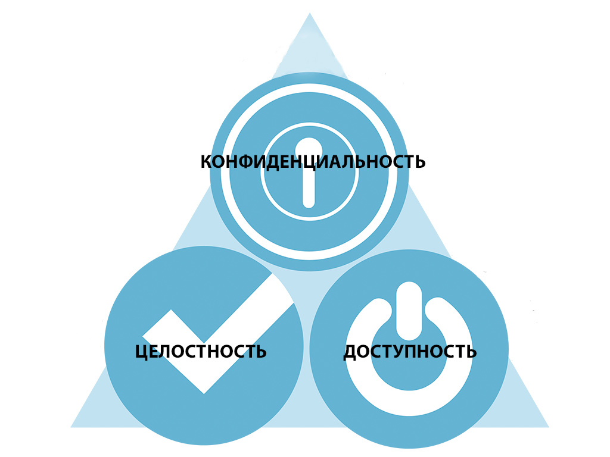

# 1. Основные термины и определения в области технической защиты информации

## Общие термины

### Система защиты информации (СЗИ)

совокупность органов и (или) исполнителей, используемой ими техники защиты информации, а также объектов защиты информации, организованная и функционирующая по правилам и нормам, установленным соответствующими документами в области защиты информации.

### Информационная безопасность (ИБ)

область, которая занимается защитой информации от угроз, разработкой мер безопасности и обеспечением конфиденциальности, целостности и доступности данных

Кибербезопасность — область информационной безопасности, которая специализируется на защите компьютерных систем, сетей и данных от киберугроз.

### Угроза (Threat)

событие или действие, которое может навредить системе или данным.

### Уязвимость (Vulnerability)

слабое место, которые могут быть использованы злоумышленниками для нарушения безопасности.

### Атака (Attack)

злонамеренное действие или попытка использования уязвимости для нанесения ущерба информационной системе или данным.

### Взлом (Hacking)

проникновение в компьютерную систему или сеть для получения доступа или выполнения вредоносных действий.

### Инцидент безопасности (Security Incident)

нарушение безопасности, которое требует реагирования.

### Реагирование (Incident Response)

процесс реагирования на инциденты безопасности, действия по ограничению ущерба и восстановлению после инцидента.

### Аутентификация (Authentication)

процесс проверки подлинности пользователя

### Авторизация (Authorization)

установление прав и разрешений для пользователей или систем на доступ к определенным ресурсам или функциям.

### Модель OSI

модель, посредством которой различные сетевые устройства могут взаимодействовать друг с другом. Модель определяет различные уровни взаимодействия систем.

## Атаки

### Вредоносное программное обеспечение (ВПО)

универсальный термин для обозначения любого типа вредоносного программного обеспечения, предназначенного для нанесения вреда или эксплуатации программируемого устройства, службы или сети.

### Фишинг (Phishing)

мошенническая попытка обмануть пользователей с целью получения конфиденциальной информации.

### Вирус (Virus)

малварь, который прикрепляется к исполняемым файлам и распространяется, инфицируя другие файлы.

### Троянский конь (Trojan Horse)

малварь, который скрывается под видом полезной программы, но при этом выполняет вредоносные действия, как только запущен.

### DoS-атака (Distributed Denial of Service Attack, DoS, DDos)

атака, при которой злоумышленники перегружают сетевой ресурс или веб-сервер, что приводит к временной недоступности для легитимных пользователей.

### «Человек посередине» (Man-in-the-Middle Threat, MITM)

тип атаки, при которой злоумышленник перехватывает и манипулирует коммуникацией между двумя сторонами.

### Спуфинг

техника, при помощи которой злоумышленник скрывает или подменяет свою личность, чтобы создать ложное впечатление или обмануть других пользователей, системы или устройства.

### Снифинг

процесс перехвата и анализа сетевого трафика, передаваемого по сети, с целью получения информации о передаваемых данных. Эта техника может использоваться как для добросовестных целей, так и для злонамеренных.

### Кей-логгер (клавиатурный шпион или регистратор нажатий клавиш)

программа или устройство, которое записывает и отслеживает нажатия клавиш на клавиатуре компьютера или мобильного устройства. Основная цель кейлоггера - захватывать введенный текст, включая пароли, сообщения, почту и другую конфиденциальную информацию пользователя.

### Мониторинг линий GSM

процесс слежения и анализа мобильных сотовых сетей с целью получения информации о сотовых устройствах и их активности.

### Ботнет

сеть компьютеров или других устройств, которые были заражены вредоносным программным обеспечением (ботами), и эти устройства могут быть удаленно управляемыми злоумышленниками, обычно без ведома владельцев устройств.

### Атака перенаправления трафика

вид кибератаки, в которой злоумышленник изменяет нормальный путь передачи сетевого трафика, направляя его через свой контролируемый узел или инфраструктуру.

## Средства защиты

### Брандмауэр (Firewall, Next-Generation Firewall, FW, NGFW)

система безопасности, которая контролирует и фильтрует сетевой трафик, разрешая или блокируя его на основе установленных правил.

### PAM

система для аутентификации для управления процессом аутентификации и авторизации.

### Многофакторная аутентификация (Multi-Factor Authentication, MFA, 2FA, мульти/многофакторка)

метод аутентификации, который требует от пользователя предоставить два или более способа подтверждения своей личности для доступа к системе или учетной записи.

### Open Source (Опен сорс)

подход к распространению программного обеспечения, при котором исходный код программы доступен для общественности, и люди могут свободно просматривать, использовать, изменять и распространять этот код.

### WAF (Web Application Firewall)

система безопасности, предназначенная для защиты веб-приложений от различных видов атак, таких как инъекции SQL, кросс-сайтовый скриптинг (XSS) и другие. WAF анализирует входящий и исходящий трафик веб-приложения и блокирует потенциально опасные запросы или атаки.

### Цифровая подпись

метод электронной аутентификации и проверки целостности электронных документов, сообщений или данных. Она аналогична традиционной подписи в бумажных документах, но использует криптографические методы для обеспечения безопасности и подлинности электронных файлов.

### DKIM (DomainKeys Identified Mail)

технология проверки электронной почты, с помощью которой можно вычислить поддельные письма. DKIM добавляет в письмо цифровую подпись. Благодаря ей почтовые могут проверить, что сообщение отправлено именно с указанного домена.

### IPS

система предотвращения вторжений, которая используется для защиты компьютерных сетей и систем от несанкционированных атак и вторжений.

### IDS

система обнаружения вторжений, используемая для мониторинга сетевой активности и обнаружения аномалий или подозрительных событий в компьютерных сетях и системах.

## Сеть

### IEEE (I triple E

«Ай трипл и») — мировая организация, состоящая из инженеров, ученых и профессионалов, работающих в области электротехники, электроники, информационных технологий и связи. IEEE является одной из крупнейших профессиональных ассоциаций, занимающихся стандартизацией, образованием, научными исследованиями и развитием в области технических наук.

### ARP

сетевой протокол, используемый в компьютерных сетях для сопоставления IP-адресов с физическими MAC-адресами сетевых устройств.

### MAC

часть сетевого адреса, которая определяет уникальную идентификацию сетевого интерфейса в компьютерных сетях. MAC-адрес также известен как физический адрес или аппаратный адрес и присваивается каждому сетевому устройству, чтобы обеспечить его уникальность в сети.

### FTPS (FTP Secure)

стандартный протокол для передачи файлов и управления файлами между компьютерами в компьютерных сетях.

### SFTP (SSH File Transfer Protocol)

протокол передачи файлов прикладного уровня, работающий поверх безопасного канала (SSH). Предназначен для копирования и выполнения других операций с файлами поверх надёжного и безопасного соединения.

### NAT

технология, используемая в компьютерных сетях для перевода сетевых адресов из одного диапазона в другой.

### SOCKS (Socket Secure)

сетевой протокол, предназначенный для маршрутизации сетевого трафика между клиентом и сервером через промежуточный сервер, который называется SOCKS-сервером.

### SMTP

стандартный протокол, используемый для отправки электронной почты через сети.

### POP3

протокол электронной почты, используемый для получения электронных сообщений с почтового сервера на клиентский компьютер или устройство.

### IMAP

протокол электронной почты, используемый для получения и управления электронными сообщениями с почтового сервера на клиентском устройстве, таком как компьютер или мобильное устройство.

### PPTP (Point-to-Point Tunneling Protocol)

протокол для создания VPN-сетей, который был разработан для создания зашифрованных туннелей между удаленными клиентами и серверами.

### IPsec (Internet Protocol Security)

набор протоколов и технологий для обеспечения безопасности и защиты сетевого трафика в сетях на основе протокола IP. IPsec предоставляет методы шифрования и аутентификации, которые используются для защиты конфиденциальности и целостности данных, а также для аутентификации и управления доступом в компьютерных сетях.

### L2TP (Layer 2 Tunneling Protocol)

комбинированный протокол, который включает в себя элементы из двух других протоколов: L2F (Layer 2 Forwarding) и PPTP (Point-to-Point Tunneling Protocol).

### OpenVPN

открытое программное обеспечение, предоставляющее возможность создания VPN с использованием различных методов шифрования и аутентификации.

### SSTP (Secure Socket Tunneling Protocol)

SSTP был разработан Microsoft и является частью их технологии VPN для операционных систем Windows.

### WireGuard

коммуникационный протокол и бесплатное программное обеспечение с открытым исходным кодом, который реализует зашифрованные виртуальные частные сети (VPN). Он был разработан для простого использования технологии VPN, высокой производительности и низкой поверхности атаки. WireGuard нацелен на лучшую производительность и большую мощность, чем IPsec и OpenVPN, два других распространенных протокола туннелирования. Протокол WireGuard передаёт трафик по протоколу UDP.

## Средства защиты разны специалистов


### DevSecOps и AppSec специалисты

работают с различными сканерами по поиску уязвимостей, чтобы уменьшить их количество в финальном продукте, и WAF, который используется для защиты веб-приложений от нападений.

### Специалисты, которые занимаются защитой от утечек

используют DLP и PAM-системы, чтобы контролировать информационные потоки пользователей.

### Те, кто занимается сетевой безопасностью

используют множество различных инструментов, например IDS/IPS, NGFW, NTA и так далее, чтобы не допустить атаки и заражение ВПО через сеть.
 
# 2. Цели и задачи технической защиты информации в системах и сетях

## Определение цели

Постановка цели начинается с анализа проблемы. Анализ напрямую влияет на планирование, так как он является неотъемлемой частью всех его возможных мероприятий.

**Цель** — это постановка вопроса, на который надо получить ответ. Она должна быть конкретной и доступной. Цель определяет предполагаемый результат работы.

### Что может выступать в качестве цели

- Разработка методов решения проблемы.
- Поиск причинно-следственных связей между явлениями.
- Выявление закономерностей в протекании процессов.
- Изучение характеристик какого-либо явления.

### По имеющимся вводным мы имеем две цели

- Поиск причинно-следственных связей между явлениями.
- Возможно, что нагрузка на серверах и новый странный трафик как-то связаны.
- Разработка методов решения проблемы.
- Вам точно известно, что никаких новых систем не появлялось, и шифрованный трафик с вами никак не связан.

## Задачи и их составление

| **Задачи**
|
| алгоритм достижения цели. Что касается задач технической защиты информации в системах и сетях, то каждая из них в совокупности с другими должна привести к достижению ожидаемого результата.

При создании или изменении защищенной инфраструктуры следует четко сформулировать, какие цели и задачи будет решать та или иная СЗИ. К основным свойствам защищаемой информации относятся:

1. Конфиденциальность — это свойство информации, при котором доступ к ней осуществляют только те, у кого есть на это право.
1. Целостность — это признак того, что данные не были изменены при выполнении любой операции над ними, будь то передача, хранение или представление.
1. Доступность — это свойство информации, означающее вашу уверенность в том, что вы найдете данные там, где вы их оставили.



| **Главная цель технической защиты информации в системах и сетях** — это защита перечисленных выше характеристик защищаемой информации от внешних и внутренних угроз.

| **Задачей информационной безопасности** является реализация мер для сохранения свойств информации — защита ее конфиденциальности, сохранение целостности, обеспечение доступности, а также противодействие нарушителям информационной безопасности.

## Цели и задачи, которые решает ИБ на примерах

### 1. Контроль доступа

```В компании, в которой вы работаете, есть почтовый сервер, обслуживаемый подрядчиком. У работников подрядчика есть права администратора. Уже были ситуации, когда их действия приводили к поломке почты (нарушение доступности информации), и вы переживаете, что у работников подрядной организации есть доступ к почтовым ящикам ваших сотрудников (нарушение конфиденциальности информации).```

#### Задача

Обеспечить контроль работы подрядчиков с сервером.

#### Решение

Можно использовать систему контроля действий привилегированных пользователей — Privileged Access Management (PAM) для предоставления доступа администраторам подрядчика к серверу. Такие системы позволяют записывать действия пользователя, а также блокировать действия пользователя (например, команду rm -rf).

### 2. Аутентификация пользователей.

```Внешний аудит показал, что множество пользователей ввели свои учетные данные, перейдя по ссылкам из фишингового письма. Вы уже провели обучение пользователей по вопросам информационной безопасности, но многие пользователи все равно продолжают совершать подобные действия из-за невнимательности.```

#### Задача

Повысить безопасность инфраструктуры и усложнить процесс аутентификации для злоумышленника.

#### Решение

Для решения таких задач используют системы многофакторной аутентификации. Самый простой вариант — ввести дополнительную проверку личности пользователя. Вариантов решений достаточно много: от физических токенов (флешки, ключи как от домофона) до Open Source-решений (ПО с открытым исходным кодом), которые присылают пользователю одноразовый код.

### 3. Шифрование данных.

```У организации появился филиал. У вас общая информационная инфраструктура: 1C, почтовый сервер, файловый сервер и т.д.```

#### Задача

Обеспечить передачу информации между филиалами по шифрованному каналу передачи информации.

#### Решение

Для создания зашифрованных каналов передачи данных используется технология VPN. Такой вид передачи информации помогает защититься от атаки «Человек посередине» (тип атаки, при которой злоумышленник перехватывает и манипулирует коммуникацией между двумя сторонами).

### 4. Сетевая безопасность.

```У многих организаций есть сервисы, которые доступны из интернета: веб-сайт, почта, различные порталы с информацией, видеоконференцсвязь и т.д. Также и самим пользователям необходим доступ: как ко внутренним ресурсам, так и в интернет.```

#### Задача

Обеспечить безопасность работы пользователей и защиту ресурсов, которые доступны из сети интернет.

#### Решение

Для решения таких задач используются различные шлюзы безопасности:

- Для защиты веб-ресурсов — Web Application Firewall;
- Для защиты Видеоконференцсвязи — Proxy;
- Для разграничения доступа к интернету и ресурсам внутри сети — NGFW;
- и другие.

# 3. Виды каналов утечки информации

## Информационные каналы утечки

### Компьютерные сети

Несанкционированный доступ к сети или слабые меры безопасности могут привести к утечке данных через интернет. Для кражи данных из сети используются программы-шпионы, кей-логгеры, сканеры накопителей и пр. Злоумышленники могут попытаться взломать или обойти сетевые барьеры, чтобы получить доступ к данным. Один из методов перехвата данных, передаваемых по сети — атаки MITM (Man-in-the-Middle).

### Электронная почта

Утечка информации может произойти через небезопасную электронную почту или несанкционированный доступ к почтовому ящику. Сотрудники могут случайно или намеренно пересылать конфиденциальные документы или информацию на почту сторонних лиц. Если злоумышленники получают доступ к учетным данным сотрудника, они могут войти в его почтовый ящик и прочитать или переслать конфиденциальные сообщения. Также могут использоваться фишинговые атаки, чтобы выманивать у сотрудников их учетные данные или убеждать их отправить конфиденциальные данные на фейковые адреса электронной почты.

### Облачное хранилище данных

Несанкционированный доступ к облачным хранилищам данных или некорректные настройки доступа могут повлечь за собой утечку данных. Некорректная конфигурация облачных хранилищ также может привести к открытому доступу к данным. При выборе облачного поставщика услуг уделяйте внимание его мерам безопасности и репутации.

### Файловые системы

Если у сотрудников есть доступ к всем файлам и папкам, которые выходят за их рабочие необходимости, это может стать причиной утечки информации. Отсутствие шифрования данных и мониторинга активности пользователей позволит злоумышленникам проще украсть данные и не оставить следов.

### Мобильные устройства

Утрата или кража мобильных устройств может привести к утечке данных, если они не защищены. Избегайте подключения к неизвестным и ненадежным открытым Wi-Fi сетям. Используйте виртуальные частные сети (VPN) для шифрования интернет-соединения. Убедитесь, что данные в мобильных приложениях и хранилищах защищены шифрованием. Используйте сложные пароли и активируйте многофакторную аутентификацию (MFA) для доступа к приложениям. Проверяйте разрешения, которые запрашивают приложения, и ограничивайте доступ к личной информации, если это необходимо. Обновляйте приложения регулярно, чтобы исправить известные уязвимости.

### Физические носители информации

Механизмов возникновения утечек посредствам физических носителей информации несколько. Чаще всего данные попадают в третьи руки после потери или кражи флешки, внешнего жесткого диска или другого накопителя. Часто носители информации бывают источниками заражения компьютеров вредоносными программами, либо шифровальщиками данных, делающими доступ к ним невозможным.

### Голосовая связь

Злоумышленники, как правило, используют 2 способа перехвата информации: прослушивание разговоров и акустический контроль помещения через телефонный аппарат. Также утечка может произойти и через мобильные телефоны. Для несанкционированного доступа к важным данным используют мониторинг линий GSM или вредоносное программное обеспечение, устанавливаемое на телефон жертвы.

### Печатные документы

Еще один канал утечки информации — несанкционированный доступ к бумажным документам или их копирование:
- Ограничьте доступ к печатным документам
- Разработайте политику печати, которая определяет, какие документы могут быть напечатаны, и кто имеет на это право
- Используйте систему учета печати, чтобы отслеживать, кто, что и когда печатает
- Регулярно очищайте память и жесткие диски сетевых принтеров, чтобы предотвратить доступ к распечатанным документам
- Ограничьте доступ к физическим принтерам, чтобы независимые сторонние лица не могли получить к ним доступ
- Уделяйте внимание физической безопасности принтеров и мест, где они установлены, чтобы предотвратить доступ к распечатанным документам
- Правильно утилизируйте конфиденциальные документы, используя методы уничтожения, такие как шредеры

## Уровни OSI и угрозы

### L7. Прикладной уровень (Application Layer)

Здесь работают приложения и сервисы, которые используют сеть для обмена данными. К данному уровню относятся такие протоколы как

HTTP/HTTPS (Hypertext Transfer Protocol):

Если веб-сервер уязвим для атак, злоумышленники могут попытаться получить доступ к защищенным данным, используя различные эксплойты и методы, которые они вписывают в запрос, например SQL/XSS-инъекции.

Подобные атаки помогают отразить Web Application Firewall (WAF), который умеет анализировать содержание запросов и распознавать вредоносные сигнатуры.

#### SMTP (Simple Mail Transfer Protocol):

Злоумышленники могут подделывать адрес отправителя, чтобы создать ложное электронное письмо, которое не вызовет подозрений. Это может быть использовано для фишинговых атак и распространения вредоносных вложений.

Чтобы защититься от подобных атак, можно использовать множество методов. Например, использовать анти-спам решение, почтовый Sandbox, который проверяет содержимое письма на наличие вредоносного ПО, а также настроить DKIM (DomainKeys Identified Mail).

#### FTP (File Transfer Protocol):

Злоумышленники могут использовать программы для перехвата сетевого трафика и получения доступа к данным, передаваемым через FTP. Для защиты от этого следует использовать шифрование данных, например, с помощью FTPS (FTP Secure) или SFTP (SSH File Transfer Protocol).

#### DNS (Domain Name System):

DNS Cache Poisoning — атака, при которой злоумышленник отправляет ложные DNS-записи в кэш DNS-сервера, чтобы перенаправить запросы к фальшивым веб-сайтам или сервисам. Это может привести к перехвату данных и фишингу.

Чтобы защититься от подобных атак, нужно использовать СЗИ, которые мониторят трафик, такие как IPS и NGFW. Также необходимо настроить DNSSEC — это расширение, которое позволяет установить цифровую подпись для DNS-записи.

### L6. Представительный уровень (Presentation Layer)

Этот уровень отвечает за преобразование данных в формат, который может быть понятен всем устройствам в сети. Это включает в себя сжатие, шифрование и кодирование данных.

#### SSL/TLS (Secure Sockets Layer/Transport Layer Security):

Эта атака используется для шифрования и дешифрования данных во время безопасной передачи через интернет с помощью защищенных HTTPS-соединений.

Злоумышленники могут попытаться взломать или расшифровать данные, передаваемые по SSL/TLS, если используются слабые шифры. Для защиты следует использовать сильные шифры и обновлять SSL/TLS-версии при появлении уязвимостей.

Основные рекомендации по защите от такого типа атак — это автоматическое обновление версий протоколов, запрет на использование уязвимых версий SSL/TLS и мониторинг трафика, а также обнаружение аномалий (использование IPS и/или NGFW).

### L5. Сеансовый уровень (Session)

Этот уровень устанавливает и управляет сеансами связи между компьютерами. Например, он контролирует, когда начинается и заканчивается сеанс обмена данными.

#### NetBIOS (Network Basic Input/Output System)

управляет установлением и завершением сеансов связи между устройствами в сети.

Session Hijacking — перехват активных сеансов для несанкционированного доступа.

Защитой от такой атаки является ограничение времени жизни сессии и использование СЗИ для создания сессий, таких как PAM-системы. Для того, чтобы блокировать попытки перехвата сессии, можно использовать шифрованные каналы (VPN) и контролировать сетевой трафик с помощью NGFW и IPS.

### L4. Транспортный уровень (Transport)

Здесь контролируется надежность передачи данных и их разделение на порции для более эффективной передачи.

#### TCP (Transmission Control Protocol)

обеспечивает надежную и упорядоченную доставку данных между устройствами.

#### UDP (User Datagram Protocol)

обеспечивает более быструю, но менее надежную доставку данных.

Синтаксические атаки (Syntax Attacks) — манипуляция данными внутри транспортных протоколов. Это так называемые «аномалии» внутри трафика, при которых вредоносная нагрузка помещается внутрь пакетов, в свободное место, если оно есть. Это могут быть вредоносные команды или части кода, которые будут обрабатываться на конечном узле.

Такую вредоносную нагрузку помогают обнаружить системы обнаружения и предотвращения вторжения с помощью синтаксического и эвристического анализа, а также с помощью сравнения содержания трафика с базами данных зловредного кода.

### L3. Сетевой уровень (Network)

Этот уровень определяет маршрутизацию данных между разными сетями. Он управляет процессом достижения данных своего назначения.

#### IP (Internet Protocol)

определяет адресацию и маршрутизацию данных в Интернете.

#### ICMP (Internet Control Message Protocol)

используется для отправки сообщений об ошибках и запросов.

#### IP Spoofing

это атака, при которой злоумышленник подделывает свой IP-адрес, чтобы выглядеть как легитимный отправитель пакетов.

Помочь справиться с такой атакой поможет фильтрация на уровне сетевых устройств (Routers и Firewalls). Настройте фильтрацию на своих маршрутизаторах и брандмауэрах, чтобы блокировать пакеты с поддельными и недействительными исходными IP-адресами. Используйте протоколы аутентификации, такие как BGP (Border Gateway Protocol) MD5, чтобы защитить маршрутные таблицы от подмены.

### L2. Канальный уровень (Data Link)

Здесь контролируется передача данных между устройствами в пределах одной сети. Устанавливается логическое соединение и проверяется целостность данных.

#### Протоколы Wi-Fi (IEEE 802.11)

управляют доступом к беспроводной сети и проверяют целостность передаваемых данных.

#### ARP Poisoning

это атака, при которой злоумышленник отправляет ложные ARP-ответы с целью связать свой собственный MAC-адрес с IP-адресом жертвы. Это может привести к перехвату или перенаправлению сетевого трафика и использоваться для различных видов атак.

NGFW и некоторые сетевые устройства поддерживают функцию защиты ARP. Включите ее, чтобы предотвратить изменение ARP-таблиц на уровне коммутатора. Также создайте статические ARP-записи на ваших сетевых устройствах, чтобы зафиксировать соответствия между IP- и MAC-адресами.

#### MAC Flooding

это атака, при которой злоумышленник пытается переполнить (или «засыпать») таблицу MAC-адресов коммутатора большим количеством поддельных MAC-адресов. Это может вызвать отказ в обслуживании (DoS) или даже позволить атакующему перехватывать сетевой трафик.

Для защиты от атаки MAC flooding можно применить следующие методы:

Использование Port Security: многие коммутаторы поддерживают функцию Port Security. Это позволяет ограничивать количество MAC-адресов, разрешенных на каждом порту.

DHCP Snooping — это метод, который позволяет коммутатору отслеживать и проверять DHCP-запросы и ответы.
Использование Dynamic ARP Inspection (DAI): DAI проверяет и фильтрует ARP-пакеты, которые проходят через коммутатор. Он позволяет брандмауэру проверить правильность соответствия между IP-адресами и MAC-адресами в ARP-запросах и ответах.

### L1. Физический уровень (Physical)

Этот уровень отвечает за физическое соединение компьютеров и передачу битов данных по кабелям, волокнам или беспроводным средствам.

#### Ethernet (IEEE 802.3)

определяет физические характеристики кабельных сетей, таких как Ethernet-кабели.

Примером атаки на физические кабели и среду может быть отсоединение кабеля или физическое повреждение линий связи.

#### Сниффинг сетевого трафика

это процесс перехвата и анализа сетевых пакетов, передаваемых по сети. Злоумышленники могут использовать сниферы для перехвата конфиденциальной информации, такой как пароли, данные сеансов и другие чувствительные данные.

Защититься помогут брандмауэры и системы обнаружения и предотвращения вторжений (IDS/IPS), которые могут обнаруживать подозрительный снифинг и блокировать его. Также рекомендуется разделять сеть на сегменты с помощью виртуальных локальных сетей (ВЛС) или физических сегментов. Это ограничит возможность снифинга трафика, так как злоумышленник должен будет находиться внутри конкретного сегмента.
