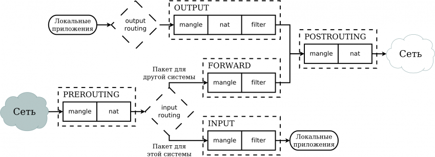
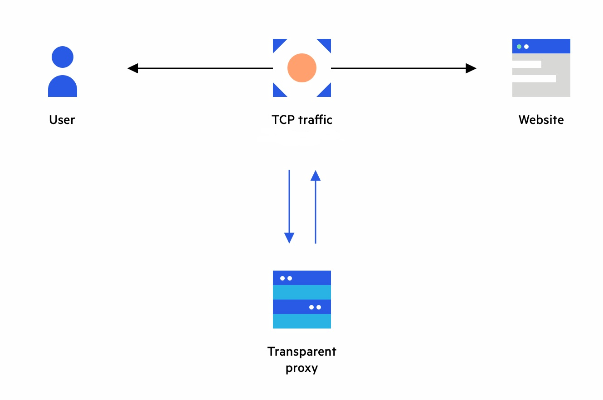
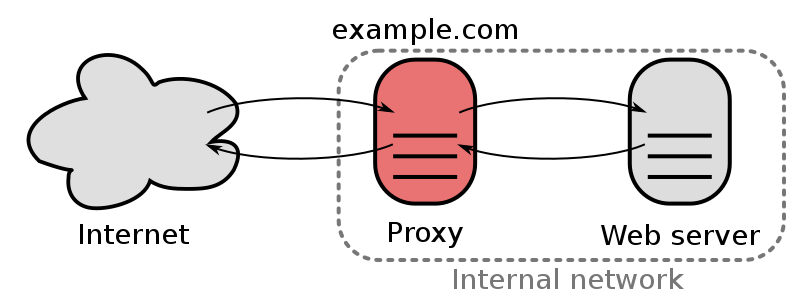

# 1. Межсетевые экраны

> **Межсетевой экран (МЭ/Firewall/FW/Брандмауэр)**
>
> это сетевое устройство или программное обеспечение, предназначенное для контроля и фильтрации сетевого трафика между различными сетями или сегментами сети. Он нужен для защиты внутренней информационной среды или ее отдельных частей от внешних сетевых угроз, и наоборот, блокирует от прохождения отдельных пакетов в сеть Интернет.

## Основные функции

- **Фильтрация пакетов данных** он может анализировать каждый сетевой пакет, проходящий через него, и решать, разрешать ли его проход или блокировать.
- **Контроль доступа** межсетевой экран может определять, какие устройства или пользователи имеют право доступа к ресурсам внутри сети.
- **Ограничение приложений** он может контролировать, какие сетевые приложения могут быть использованы, блокируя определенные протоколы и порты.
- **Защита от внешних угроз** межсетевой экран может обнаруживать и предотвращать атаки, такие как атаки типа DDoS (распределенного отказа в обслуживании) или попытки вторжения.
- **Создание виртуальных частных сетей (VPN)** он позволяет установить защищенное соединение между удаленными сетями или устройствами через интернет

## Поколения сетевых экранов

### Первое поколение (статические)

> Static Packet Filtering Firewalls - работают на основе правил, которые анализируют заголовки пакетов данных. 

Определяют пускать или блокировать трафик на основе
- IP-адресов
- портов
- протоколов

Не способны анализировать содержание пакетов, что делает их уязвимыми для некоторых атак, таких как атаки на уровне прикладных протоколов.

#### Основные характеристики:

- принимают решения, на основе статических правил, которые анализируют заголовки сетевых пакетов. Правила могут включать IP-адреса отправителей и получателей, порты и протоколы.
- Они не отслеживают состояние сетевых соединений. Это означает, что они не могут отличить легитимный ответ на запрос от несанкционированного доступа.
- Эти брандмауэры могут проводить только базовый анализ сетевых пакетов и не сканируют содержание данных внутри пакетов.
- Простота и быстродействие

### Второе поколене (межсетевые экраны с состоянием)

> Stateful Packet Filtering Firewalls

Способны отслеживать состояние сетевых соединений, что позволяет им понимать
- когда соединение начинается
- завершается
- какой тип трафика внутри него разрешен.

Такие МЭ способны проводить анализ сетевого трафика и могут предотвращать атаки **на уровне прикладных протоколов**

#### Основные отличия второго поколения межсетевых экранов:

- Межсетевые экраны второго поколения способны отслеживать состояние сетевых соединений. Они знают, когда соединение начинается, какие пакеты относятся к этому соединению, и когда соединение завершается.
- МЭ могут анализировать не только заголовки пакетов, но и содержание пакетов. Они способны различать различные приложения и службы, используя порты и протоколы, и применять более точные правила фильтрации.
- Второе поколение межсетевых экранов может анализировать трафик на уровне прикладных протоколов.
- Снижение ложных срабатываний благодаря более тщательному анализу трафика и пониманию контекста сетевых соединений.

### Третье поколения (межсетевые экраны с глубокой проверкой пакетов)

> Deep Packet Inspection Firewalls

Они анализируют содержание пакетов данных, включая данные на уровне прикладных протоколов

#### Основные отличиями третьего поколения от второго:

- Глубокая проверка пакетов - способность проводить глубокий анализ содержания сетевых пакетов, анализ данных на уровне прикладных протоколов.
- МЭ третьего поколения могут распознавать приложения и службы, работающие внутри сети, даже если они используют непривычные порты и протоколы.
- Третье поколение межсетевых экранов может фильтровать контент на основе ключевых слов, фраз и шаблонов.
- МЭ экраны могут интегрироваться с системами обнаружения вторжений (IDS) и системами предотвращения вторжений (IPS), для более эффективной защиты сети.
- Межсетевые экраны третьего поколения способны обнаруживать и предотвращать атаки на уровне прикладных протоколов.
- МЭ предоставляют возможности логирования и аналитики для отслеживания сетевой активности и инцидентов безопасности.

## IP Tables

### 5 типов стандартных цепочек, встроенных в систему

1. **PREROUTING** для изначальной обработки входящих пакетов.
1. **INPUT** для входящих пакетов адресованных непосредственно локальному процессу (клиенту или серверу).
1. **FORWARD** для входящих пакетов перенаправленных на выход.
1. **OUTPUT** для пакетов генерируемых локальными процессами.
1. **POSTROUTING** для окончательной обработки исходящих пакетов.

### Цепочки организованы в 4 таблицы

1. **raw** просматривается до передачи пакета системе определения состояний.
1. **mangle** содержит правила модификации (обычно заголовка) IP‐пакетов.
1. **nat** просматривает только пакеты, создающие новое соединение (согласно системе определения состояний).
1. **filter** основная таблица, используется по умолчанию если название таблицы не указано. Содержит цепочки INPUT, FORWARD, и OUTPUT.

### netfilter

каждый пакет проходящий через механизм определения состояний, может иметь одно из четырёх возможных состояний:

1. **NEW** пакет открывает новый сеанс.
1. **ESTABLISHED** пакет является частью уже существующего сеанса.
1. **RELATED** пакет открывает новый сеанс, связанный с уже открытым сеансом.
1. **INVALID** все прочие пакеты.

### прохождения таблиц и цепочек

# 2. Прокси-серверы

> **Прокси-сервер (proxy server)**
>
> это промежуточный сервер, который расположен между клиентским устройством и сервером, к которому клиент пытается получить доступ. Прокси-сервер пересылает запросы и ответы между клиентом и целевым сервером, выполняя различные функции на этом пути.

## Функции прокси серверов

- Фильтрация веб-трафика, для блокировки доступа к определенным сайтам или категориям контента.
- Кэширование данных, для ускорения доступа к веб-сайтам.
- Фильтрация трафика и блокировка вредоносных запросов или атак, например DDoS-атак. Они могут также обнаруживать вирусы и ВПО и блокировать их распространение.
- Ведет запись информации о трафике, что позволяет администраторам сети отслеживать активность пользователей, а также анализировать трафик для целей безопасности и управления сетью.
- Возможность распределять сетевой трафик между несколькими серверами, что улучшает производительность и обеспечивает отказоустойчивость.
- Контроль доступа к ресурсам в зависимости от различных параметров, таких как IP-адрес, пользовательские учетные записи, время суток и многие другие.
- Возможность перенаправлять трафик с одного источника на другой, что полезно для работы IDS/IPS и DLP систем.

Прокси-серверы позволяют организациям управлять доступом к ресурсам и обеспечивать безопасность в сети, благодаря чему они широко используются для контроля и фильтрации трафика.

## Типы proxy

### 1. HTTP/HTTPS-прокси

Этот тип прокси-сервера предназначен для обработки HTTP/HTTPS-запросов. Он используется для фильтрации веб-трафика, блокировки доступа к веб-сайтам и контроля доступа.

### 2. SOCKS-прокси

Протокол SOCKS (Socket Secure) является более универсальным, чем HTTP и HTTPS, и может использоваться для множества приложений, включая прокси-серверы для игр, торрент-клиентов и других программ. SOCKS-прокси работает на уровне TCP/IP и позволяет пересылать трафик, не ограничиваясь только HTTP.

### 3. FTP-прокси

Этот тип прокси-сервера специализируется на обработке FTP-запросов для передачи файлов.

### 4. SMTP-прокси

SMTP-прокси используется для обработки электронных писем и почтовых серверов. Он может выполнять функции фильтрации спама, антивирусной проверки и контроля доступа к почтовым ресурсам.

### 5. POP3/IMAP-прокси

Эти прокси-серверы обрабатывают POP3 (Post Office Protocol) и IMAP (Internet Message Access Protocol) запросы, используемые для получения электронной почты с почтовых серверов.

### 6. Transparent Proxy

Прозрачные прокси-серверы незаметны для клиентов, так как они автоматически перенаправляют трафик через себя без необходимости настройки на стороне клиента.

### 7. Reverse Proxy

Этот тип прокси-сервера находится между внешними клиентами и внутренними серверами. Он используется для балансировки нагрузки, улучшения производительности и обеспечения безопасности, скрывая внутреннюю сетевую инфраструктуру от внешних клиентов.

## Недостатки proxy

- Если прокси-сервер выходит из строя или становится недоступным, это может привести к проблемам с доступом к ресурсам и сервисам
- Иногда прокси-серверы могут замедлить скорость доступа к ресурсам из-за дополнительной обработки трафика.
- Настройка и управление прокси-серверами может быть сложной задачей, особенно для неподготовленных пользователей.
- Некоторые прокси-серверы могут быть настроены только для работы с определенными протоколами, что может создать ограничения при использовании некоторых приложений и сервисов.

# 3. Управление аутентификацией и авторизацией

> **Аутентификация**
>
> это процесс проверки личности пользователя перед предоставлением доступа.

Это может включать в себя запрос у пользователя личной информации: логин и пароль, сканирование биометрических данных или владение специальными устройствами (например, смарт-картами). Этот этап помогает системе удостоверить, что пользователь действительно тот, за кого себя выдает.

> **Авторизация**
>
> это процесс управления доступом пользователя к ресурсам и функциям после успешной аутентификации.

Здесь определяются права и привилегии пользователя на основе его идентификации и роли. Авторизация позволяет устанавливать, какие действия и ресурсы доступны пользователю. Эти решения основаны на политиках безопасности и могут учитывать различные параметры, такие как время суток, IP-адреса и другие условия.

## Многофакторная аутентификация (MFA)

> метод аутентификации, который требует от пользователя предоставить несколько видов подтверждения личности для получения доступа к системе, приложению или ресурсам.

### Определяет

#### Что вы знаете?

Это что-то, что пользователь знает, например, пароль, PIN-код, ответ на секретный вопрос.

#### Что вы имеете?

Это что-то, что пользователь имеет в физическом обладании, например, смарт-карта, USB-ключ, мобильное устройство, которое может генерировать одноразовые пароли.
#### Что вы есть?

Это что-то, что связано с биометрическими данными пользователя, такими как отпечаток пальца, распознавание лица, сенсорный отпечаток и другие биометрические параметры.

### Ключевые преимущества

1. MFA обеспечивает более надежную защиту, чем одиночная аутентификация, так как она требует несколько видов подтверждения и уменьшает вероятность несанкционированного доступа.
1. Даже в случае, если пароль будет скомпрометирован, MFA добавляет дополнительный уровень безопасности, не позволяя злоумышленникам получить доступ к учетной записи без дополнительного подтверждения.
1. Множество факторов MFA усложняет задачу злоумышленникам, делая атаки фишинга и перехвата паролей менее эффективными.

## Основные шаги и рекомендации для настройки правил и политик доступа

1.  Определите, какие цели вы пытаетесь достичь через управление доступом.
1.  Определите роли и группы пользователей в вашей системе. Назначьте пользователям соответствующие роли, которые определяют их права и привилегии.
1.  Создайте правила доступа, которые определяют, какие ресурсы и функции доступны для каждой роли или группы пользователей.
1.  Включите аудит и мониторинг ваших политик доступа. Это позволит вам отслеживать действия пользователей, а также обнаруживать и реагировать на угрозы.
1.  Правила и политики доступа должны быть регулярно обновляемыми и подвергаться тестированию на предмет эффективности и безопасности.
1.  Обучите пользователей политикам доступа, их ролях и ответственности.

## Принцип минимальных привилегий

> **Principle of Least Privilege, POLP**
>
> это это принцип, по которому пользователь или система должны иметь только те привилегии и доступ, которые необходимы для выполнения своих задач, и не более. Принцип минимальных привилегий ограничивает доступ к ресурсам и функциям на уровне, необходимом для выполнения конкретной задачи. Это помогает уменьшить риски и защитить систему от потенциальных угроз.

Принципы применения минимальных привилегий:

- Пользователь или система должны получать только те привилегии, которые необходимы для выполнения своих обязанностей или задач.
- По мере возможности каждый пользователь должен иметь минимальные привилегии, чтобы выполнить свою работу. Например, обычный пользователь не должен иметь административных прав.
- Права доступа могут быть предоставлены на ограниченное время.

# 4. Прозрачные шлюзы и VPN

## Прозрачные шлюзы

> это сетевые устройства и компоненты, которые занимаются фильтрацией трафика, контролем доступа, оптимизацией производительности и мониторингом без изменения конфигурации клиентских устройств.

### Основные функции прозрачных шлюзов

- Прозрачные шлюзы позволяют фильтровать сетевой трафик, блокировать доступ к определенным веб-сайтам или типам контента.
- Они управляют доступом к сетевым ресурсам и службам, позволяя определить, какие пользователи или устройства имеют доступ к каким ресурсам.
- Прозрачные шлюзы могут улучшать производительность сети, кэшируя данные, сжимая трафик и балансируя нагрузку между серверами.
- Они предоставляют средства для мониторинга сетевого трафика, его анализа и создания журналов для целей безопасности и анализа.

### Примеры прозрачных шлюзов

- Прозрачные прокси-серверы: фильтруют веб-трафик и позволяют блокировать доступ к вредоносным сайтам.
- Прозрачные МЭ: обеспечивают контроль доступа на уровне сетевых пакетов без изменения настроек клиентских устройств.
- Прозрачные системы фильтрации URL: фильтруют доступ к веб-сайтам на основе URL-адресов.
- Прозрачные системы балансировки нагрузки: распределяют сетевой трафик между серверами для обеспечения высокой доступности.
- Прозрачные системы кэширования: кэшируют данные для ускорения доступа к ресурсам.
- Прозрачные системы мониторинга трафика: могут мониторить сетевой трафик, анализировать его и создавать журналы для целей безопасности и анализа. Примерами могут быть системы мониторинга трафика, такие как Wireshark или системы SIEM (Security Information and Event Management).

## Виртуальная частная сеть (VPN)

> это это технология, которая создает безопасное и зашифрованное соединение между вашим устройством (например, компьютером, смартфоном или планшетом) и интернетом. Это соединение проходит через серверы, управляемые VPN-поставщиком, которые помогают скрыть ваш IP-адрес и шифруют вашу передачу данных.

- VPN шифрует ваше интернет-соединение, защищая данные от несанкционированного доступа
- для обеспечения безопасного удаленного доступа к своим корпоративным сетям сотрудникам
- соединения разрозненных сетей через интернет

### Наиболее распространенные протоколы VPN

####  PPTP (Point-to-Point Tunneling Protocol)

+ PPTP является одним из наиболее простых и старых протоколов VPN.
+ Быстрый и хорошо подходит для потоковой передачи данных.
+ Не рекомендуется для использования в целях конфиденциальности и безопасности, так как у него есть известные уязвимости.

####  IPsec (Internet Protocol Security)

+ Обеспечивает аутентификацию участников в сети.
+ IPsec предоставляет шифрование данных для защиты конфиденциальности информации в транзите.
+ Участники соединения могут удостовериться, что данные не были подвергнуты изменениям в процессе передачи, так как IPSec обеспечивает контроль целостности данных.
+ Поддерживает различные методы аутентификации.
+ Широко распространен и поддерживается на множестве платформ и устройств.
+ Не рекомендуется для использования в целях конфиденциальности и безопасности, так как у него есть известные уязвимости.

####  IKEv2 (Internet Key Exchange Version 2)

+ Обеспечивает высокую производительность и быструю установку соединения.
+ Может эффективно работать в сетях с низкой стабильностью, таких как мобильные сети.
+ Обеспечивает высокий уровень безопасности данных за счет поддержки динамического пересогласования и обновления ключей шифрования во время соединения.
+ Поддержка мобильных устройств.

####  L2TP/IPsec (Layer 2 Tunneling Protocol with IPsec)

+ L2TP/IPsec комбинирует преимущества L2TP и IPsec, обеспечивая более высокий уровень безопасности.
+ Работает на большинстве операционных систем и устройств, что делает его универсальным.

####  OpenVPN

+ OpenVPN — это open-source протокол с открытой документацией. Он позволяет настраивать множество параметров и поддерживает разные методы шифрования.
+ Считается одним из самых безопасных протоколов VPN.
+ Обеспечивает хорошую производительность.
####  SSTP (Secure Socket Tunneling Protocol)

+ SSTP использует SSL/TLS для шифрования данных, что обеспечивает высокий уровень безопасности.
+ SSTP интегрирован в операционную систему Windows, что делает его легким в использовании на Windows-устройствах.

####  IKEv2/IPsec (Internet Key Exchange Version 2 with IPsec)

+ IKEv2 обеспечивает быстрое переключение между Wi-Fi и мобильными данными, что делает его идеальным для мобильных устройств.
+ Использует IPsec для шифрования данных и обеспечения безопасности.

####  WireGuard

+ Обеспечивает хорошую скорость и производительность.
+ Предоставляет аутентификацию, шифрование и контроль целостности данных.
+ Поддерживается на разных операционных системах.
+ Предоставляет модульную архитектуру, что позволяет добавлять функциональность и дорабатывать его под разные сценарии использования.

# 5. Сетевые атаки и реакция на инциденты

## Сетевые атаки

> это это злонамеренные действия и попытки нарушения безопасности компьютерных сетей, систем и данных.Понимание основ сетевых атак и методов их предотвращения является ключевым аспектом современной информационной безопасности.

### Примеры сетевых атак

- DDoS-атаки (Distributed Denial of Service);
- MITM;
- перенаправление трафика;
- сниффинг;
- спуфинг.

#### Внедрение в систему (Hacking)

это попытки получить несанкционированный доступ к компьютерным системам путем взлома или использования уязвимостей в системе без знания владельца системы.

#### Сканирование портов (Port Scanning)

это предварительная процедура, используемая злоумышленниками для определения уязвимых узлов, которые можно успешно атаковать. Этот также позволяет обнаружить машины, серверы и периферийные устройства, существующие в конкретной сети.

#### Инъекции (Injection)

это атаки, направленные на внедрение вредоносных SQL-запросов в базы данных, вредоносного кода или управляющих команд, чтобы извлечь или изменить данные.

#### Zero-Day Exploits

это атаки, использующие уязвимости, о которых разработчики еще не знают и которые не имеют патчей или исправлений. Эти атаки обычно представляют серьезную угрозу.

## Защита от сетевых 

> задача, которая требует комплексного подхода. Понимание современных угроз, разработка эффективных мер безопасности и обучение сотрудников — это ключевые составляющие успешной защиты информационных активов и данных.

### Важные аспекты введения в защиту от сетевых а

#### Цели сетевых атак.

Атаки могут быть направлены на различные цели. Разработка стратегии защиты требует определения конкретных угроз и целей.

#### Развитие угроз.

Злоумышленники постоянно разрабатывают новые методы атак. Защита от сетевых атак должна быть способной адаптироваться к изменяющимся угрозам и тенденциям.

#### Многоуровневая стратегия.

Эффективная защита включает в себя многоуровневую стратегию, которая охватывает технические средства, процедуры и политики безопасности, а также обучение сотрудников.

#### Постоянное обучение и мониторинг.

Осведомленные и обученные сотрудники играют ключевую роль в защите от сетевых атак.

#### Непрерывность процесса.

Защита от сетевых атак требует постоянного обновления и улучшения. Это включает в себя обновление программного обеспечения, мониторинг сетевой активности и аудиты для обнаружения уязвимостей.

### Разработка плана реакции на сетевые атаки

1. Назначьте ответственных сотрудников для составления и управления командой реагирования на инциденты безопасности.
1. Определите все активы и ресурсы, которые могут быть подвержены риску. Это сервера, базы данных, приложения и данные.
1. Оцените потенциальные угрозы и риски для оценки важности инцидента. Это позволит определить приоритет инцидента и необходимые ресурсы для реагирования.
1. Создайте документированные процедуры для реагирования на различные типы сетевых инцидентов.
1. Проводите обучение для членов команды реагирования и других сотрудников, чтобы убедиться, что они понимают процедуры и могут быстро реагировать на инциденты.
1. Определите критерии, при срабатывании которых инцидент считается критическим и требует немедленного реагирования.
1. Установите системы мониторинга безопасности, которые способны обнаруживать аномалии и подозрительную активность в сети.
1. Определите, как и кому будет производиться уведомление в случае инцидента.
1. Разработайте процедуры сбора и анализа доказательств, чтобы установить источник инцидента и предоставить необходимую информацию для юридического преследования, если это необходимо.
1. Следуйте процедурам реагирования и восстановления, устраняйте уязвимости и восстанавливайте нормальное функционирование системы.
1. Детально документируйте информацию об инциденте и действиях, предпринятых во время реагирования.
