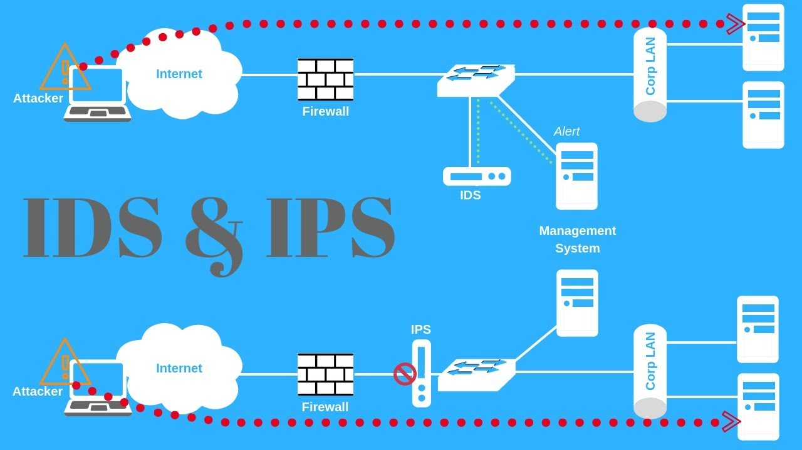
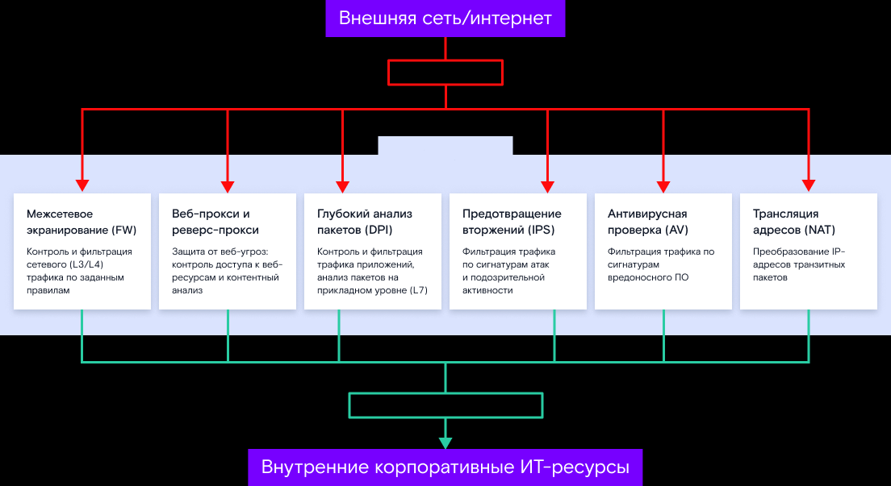

# 01. Введение в NGFW и IPS/IDS

## NGFW

> **NGFW (Next-Generation Firewall)**
>
> это брандмауэр нового поколения, представляющий собой эволюцию классических брандмауэров. Он объединяет в себе традиционные функции фаервола с продвинутыми возможностями, такими как глубокая инспекция трафика, системы предотвращения вторжений (IPS), фильтрация приложений и контента, и многие другие функции для обеспечения безопасности сети

### Основные функции

#### 1. Глубокая инспекция трафика (DPI)

Проводит анализ пакетов данных на прикладном уровне, что позволяет обнаруживать и предотвращать более сложные угрозы, включая атаки на приложения

**Пример: защита от атаки UDP Flood**

- В основе этой атаки лежит протокол UDP, который не требует установки сессии и отправки какого-либо ответа
- В случайном порядке атакуются порты удаленного узла и посылается огромное количество пакетов данных
- Атакуемый узел начинает проверять, используется ли порт, на который приходит пакет, каким-либо приложением

$\implies$ машина не справляется с задачей и перестает отвечать на запросы

**DPI** позволяет ```отбрасывать неактуального набора протоколов``` с возможностью ```ограничения пропускной полосы```

- <ins>Пример WEB-сервер</ins>: требуются протоколы ```HTTP\HTTPS```, DPI пропускает только их, остальные отбрасываются

#### 2. Системы предотвращения вторжений (IPS)

Обнаруживают и блокируют вредоносные активности в режиме реального времени

**Атаки и угрозы, определяемые IPS**

- DoS-атаки
- Криптомайнеры
- Повышение привилегий
- Сетевые сканеры
- Фишинг
- Сетевые черви
- Эксплойты
- И другое ВПО распространяющейся с помощью компьютерных сетей

#### 3. Прокси и антивирус

Подсистема прокси позволяет контролировать и фильтровать доступ к определенным приложениям и содержимому, что повышает безопасность сети. А Антивирус не дает пользователям скачать и заразить узел, расположенный за NGFW.

#### 4. Идентификация пользователей

NGFW способны идентифицировать пользователей в сети, что позволяет создавать более точные правила доступа и анализировать их активность.

#### 5. Мониторинг и отчетность

NGFW обычно имеют удобные средства управления и отчетности, которые облегчают администраторам мониторинг и анализ сетевой активности.

#### 6. Интеграция с другими системами безопасности

NGFW часто интегрируются с другими системами безопасности, чтобы обеспечить комплексную защиту.

#### 7. Управление политиками безопасности

NGFW предоставляет средства для создания и управления сложными политиками безопасности, адаптированными к конкретным потребностям организации.

#### 8. Повышенная производительность

NGFW спроектированы с учетом нагрузок на сеть, что позволяет им работать в высоконагруженных сетях без замедления производительности.

#### 9. Сокращение поверхности атаки

Путем комбинирования нескольких функций защиты в одном устройстве NGFW снижает поверхность атаки и упрощает обслуживание.

### Сравнение FW и NGFW

| Функция | FW  | NGFW |
| :------ | :-: | :--: |
| Идентификация трафика | - | - |
| Глубокая инспекция | - | + |
| Фильтрация приложений и контента | На основе адресации и портов | FW + на основе конкретных приложений и контента |
| Система предотвращения вторжений | - | + |
| Управление пользователями | - | Позволяет определять и управлять пользователями и группами |

## IDS and IPS



> **IDS (система обнаружения вторжений)**
>
> это программное или аппаратное оборудование, которое предназначено для мониторинга сетевого трафика или системных активностей с целью выявления попыток атак. IDS анализирует данные и пытается выявить аномалии или сигналы, характерные для вторжений или атак.

> **IPS (система предотвращения вторжений)**
>
> это технология или устройство, которое, в отличие от IDS (системы обнаружения вторжений), не только обнаруживает потенциальные вторжения и атаки, но также предпринимает активные шаги для предотвращения этих атак. IPS анализирует сетевой трафик или системные активности и может блокировать или отвергать нежелательные запросы или попытки доступа, чтобы защитить сеть или систему от потенциальных угроз.

Помогают в обеспечении безопасности информационных ресурсов путем активного противодействия вторжениям и атакам

### ключевых принципов для обнаружения и предотвращения атак

1. IPS постоянно мониторит сетевой трафик, анализируя пакеты данных, проходящих через сетевое устройство.
1. IPS анализирует трафик на предмет аномалий, таких как подозрительные попытки вторжения, несанкционированный доступ или необычные сетевые активности.
1. IPS использует сигнатуры, которые представляют из себя заранее известные шаблоны и признаки, характерные для известных атак. Если трафик соответствует этим сигнатурам, IPS срабатывает и блокирует атаку.
1. Некоторые IPS используют методы обнаружения атак нулевого дня, которые позволяют выявлять не только атаки, описанные в сигнатурах, но и новые и неизвестные.
1. Если IPS обнаруживает подозрительную активность или атаку, он может автоматически принимать меры по блокированию трафика или оповещать администратора о произошедшем инциденте.
1. IPS также может предоставлять проактивные меры по предотвращению атак, такие как отключение уязвимых служб или установка временных блокировок для атакующих IP-адресов.
1. IPS часто интегрируется с другими системами безопасности, такими как брандмауэры и системы мониторинга событий (SIEM), чтобы обеспечивать комплексную защиту.
1. IPS постоянно обновляет свои базы данных сигнатур, чтобы быть актуальным в контре новых угроз.

# 02. Архитектура и функции NGFW



## Набор функций

### 1. Межсетевой экран

Он предполагает как управление сетевым трафиком в соответствии с политикой доступа компании и скрытие внутренней сетевой инфраструктуры с помощью трансляции адресов (NAT), так и организацию защищенного подключения к корпоративной сети по VPN, например, с помощью TLS.

### 2. Аутентификация пользователей

Прежде чем предоставить доступ к тем или иным сервисам инфраструктуры, NGFW проводит самостоятельную аутентификацию пользователей. Например, для систем доступа к веб-приложениям достаточно использовать обычные SSL-сертификаты, но уже для удаленного администрирования или RDP-подключения система может потребовать и двухфакторную аутентификацию или аппаратные идентификаторы.

### 3. Системы обнаружения/предотвращения вторжений (IPS/IDS)

Это системы, которые позволяют в случае обнаружения признаков вторжения злоумышленников в инфраструктуру менять правила фильтрации/блокировки сетевого трафика. Признаки компрометации (вторжения) (IoC) инфраструктуры, как правило, поставляются информационными TI-сервисами или поставщиками системы.

### 4. Антивирус/песочница

Используется потоковый антивирус, который собирает передаваемый внутренним пользователям поток в файлы, и уже к ним применяются сигнатуры вредоносных программ, подготовленные антивирусными компаниями. Однако со временем антивирусные компании разработали песочницы (Sandbox) — это специальные виртуальные машины, в которых элементы потока анализируются на подозрительную активность.

### 5. Предотвращение утечек (DLP)

Система контроля утечек данных должна эффективно работать на сетевом уровне — предотвращать передачу важных данных вовне корпоративной сети. Однако для этого подобная система должна быть развернута в самом предприятии — NGFW выступает только в виде исполнительного устройства, которое блокирует неразрешенную передачу данных через себя.

### 6. URL-фильтрация/WAF

Выявление и блокировка потенциально опасных ссылок выполняет функции антиспама, антифишинга, антивируса. Кроме того, входящий поток веб-запросов к корпоративным веб-приложениям также нужно фильтровать от вредоносных включений и эксплойтов различных уязвимостей.

### 7. Deep Packet Inspection (DPI)

Технология проверки сетевых пакетов по их содержимому с целью регулирования и фильтрации трафика, а также накопления статистических данных. В отличие от MЭ, Deep Packet Inspection анализирует не только заголовки пакетов, но и полезную нагрузку, начиная со второго уровня модели OSI.

# 03. Настройка и управление NGFW

## Глубокая инспекция SSL-трафика (SSL DPI (Deep Packet Inspection) или SSL inspection)

> Это процесс анализа и мониторинга шифрованного сетевого трафика, который проходит через защищенное SSL/TLS соединение. Этот процесс позволяет администраторам сетей и систем безопасности проверять содержимое зашифрованного трафика, чтобы выявить потенциальные угрозы и защитить сеть от вредоносных атак

1.  **Расшифровка SSL/TLS**<br> Процесс начинается с расшифровки SSL-защиты, чтобы получить доступ к данным, передаваемым через зашифрованное соединение. Это может потребовать использования сертификата SSL, которому доверяют клиентские устройства.
1.  **Анализ содержания**<br>Размеченный трафик затем подвергается глубокому анализу, чтобы идентифицировать признаки вредоносной активности, такие как вирусы, трояны, вредоносные ссылки и другие потенциальные угрозы.
1.  **Угрозы и аналитика**<br>Глубокая инспекция SSL-трафика помогает обнаруживать и предотвращать атаки, такие как MITM-атаки, вредоносные вложения в электронных письмах, утечку данных и другие угрозы.
1.  **Шифрование**<br>Размеченный трафик может быть снова зашифрован перед его отправкой на конечное устройство, чтобы сохранить конфиденциальность данных.

при использовании глубокой инспекции SSL-трафика важно учитывать законодательные требования и руководящие принципы.

## Threat intelligence (TI)

> информация об актуальных угрозах и группировках киберпреступников, которая позволяет организациям изучить цели, тактику и инструменты злоумышленников и выстроить эффективную стратегию защиты от атак. Компании могут сами собирать данные о киберугрозах или заказывать информацию у сторонних поставщиков

### Основные группы:

-  **Тактические**<br>техническая информация, например индикаторы компрометации.
-  **Операционные**<br>описание техник и процедур, которыми пользуются злоумышленники, а также их возможностей и преследуемых ими целей.
-  **Стратегические**<br>данные о рисках, связанных с конкретными угрозами.

Threat intelligence предоставляют в виде потоков сырых данных об угрозах или аналитических отчетов с выводами и рекомендациями

### Этапы работы с Threat intelligence

1.  **Планирование**<br>постановка задачи для программы или специалистов.
1.  **Сбор и обработка данных**<br>сбор информации об актуальных угрозах, а также очистка от дублирующих данных и приведение собранной информации к единому формату. Обработка необходима для оперативного поиска и извлечения конкретных данных.
1.  **Анализ**<br>изучение полученных данных, в том числе подозрительных файлов и программ, формирование гипотез и рекомендаций. На этапе анализа также выявляются недочеты методик сбора и обработки данных.
1.  **Распространение**<br>передача threat intelligence заинтересованным лицам, например специалистам внутри компании, если она собирала данные для себя, или клиентам, если организация выполняла заказ третьих лиц.
1.  **Обратная связь**<br>получение и учет реакции сотрудников или клиентов организации на предоставленную информацию.

## SIEM (Security information and event management)

> Система управления информационной безопасностью и событиями безопасности (SIEM) — это решение, позволяющее организациям обнаруживать, анализировать и устранять угрозы безопасности раньше, чем они нанесут ущерб бизнес-операциям.

используется для автоматизации работы с данными, которые генерирует NGFW

### Примеры типичных событий, которые SIEM может фиксировать с помощью NGFW

1.  **Блокирование или разрешение сетевого трафика**<br> SIEM может регистрировать каждый случай, когда NGFW блокирует или разрешает сетевой трафик на основе правил безопасности, политик доступа и других параметров.
1.  **Атаки и инциденты безопасности**<br> SIEM может анализировать логи NGFW, чтобы выявлять подозрительную активность, такую как попытки вторжения, атаки DDoS, попытки переполнения брандмауэра (firewall flooding) и другие аномальные события.
1.  **Вирусы и вредоносное ПО**<br> SIEM может фиксировать попытки загрузки вредоносных файлов через сеть с использованием NGFW и предпринимать действия в зависимости от настроек.
1.  **Инциденты безопасности приложений**<br> SIEM может отслеживать использование приложений через NGFW и выявлять несанкционированные или рискованные приложения.
1.  **Анализ трафика**<br> SIEM может анализировать сетевой трафик, проходящий через NGFW, для выявления аномалий и атак, а также для мониторинга соответствия политикам безопасности.

# 05. Технические аспекты IPS/IDS

## Категоризация IPS/IDS

### По месту установки

- **Network Intrusion Detection System (NIDS)**<br>После установки на сетевое оборудование система начинает глубоко анализировать трафик всех сетевых устройств, проверяя каждый пакет с канального уровня до уровня приложений. Сетевые системы обнаружения вторжений способны распознать не только внешнюю, но и внутреннюю угрозу. Чем больше объем трафика, тем более высокие требования предъявляются к CPU и RAM.
- **Host-based Intrusion Detection System (HIDS)**<br>Ставятся на один хост внутри сети, анализируют и защищают только его трафик. HIDS делает снимок текущей версии хоста и сравнивает его со сделанной ранее, обнаруживая возможные угрозы. Установка такого решения рекомендована для критически важных хостов, в конфигурации которых изменений практически не бывает.
- **Perimeter Intrusion Detection Systems (PIDS)**<br>Не обеспечивает защиту всей сети, уведомляя лишь о возможных нарушениях границы сети. Располагается на периметровых NGFW.
- **Virtual Machine-based Intrusion Detection Systems (VMIDS)**<br>Решение построено на базе технологий виртуализации и позволяет отказаться от развертывания системы обнаружения на отдельном устройстве.
- **Application Protocol-based Intrusion Detection System (APIDS)**<br>Система обеспечивает контроль пакетов, которые передаются по протоколу прикладного уровня. Такие IDS работают вместе с WAF.
- **Hybrid Intrusion Detection System (HyIDS)**<br>Это гибридное решение, сочетающее свойства двух или более типов решений, перечисленных выше.

### По принципу действия

#### Пассивный IDS (Passive IDS)

- Пассивный IDS работает в режиме <ins>наблюдения и анализа сетевого трафика</ins>, но <ins>не вмешивается в передачу данных</ins>.
- Он мониторит сетевой трафик, копируя пакеты или журналы событий с сетевых устройств.
- Анализ происходит после того, как данные уже прошли через сеть. Если обнаруживается подозрительная активность, IDS генерирует предупреждения или события для уведомления администраторов.
- Пассивный IDS более аналитический и не <ins>имеет возможности блокировать сетевой трафик.</ins>

#### Инлайн IDS (Inline IDS)

- Инлайн IDS также мониторит сетевой трафик, но в отличие от пассивного IDS он активно <ins>вмешивается в передачу данных</ins>.
- Он может прерывать сетевой трафик и блокировать потенциально вредоносные пакеты в реальном времени.
- Это делает инлайн IDS более активным и способным непосредственно противодействовать угрозам, блокируя их до того, как они достигнут целевой системы.
- Инлайн IDS требует более аккуратной конфигурации и управления, так как его вмешательство <ins>может повлиять на нормальную работу сети</ins>.

### По процессу анализа

#### Сигнатурные IDS

- работают по схожему с антивирусным программным обеспечением принципу
- анализируют сигнатуры и сопоставляют их с базой
- <span style="color: red">если база недоступна, сеть становится уязвимой</span>
- <span style="color: red">если атака новая и ее сигнатура неизвестна, есть риск того, что угроза не будет обнаружена</span> 
- способны отслеживать шаблоны или состояния.
    - `Шаблоны` — это те сигнатуры, которые хранятся в постоянно обновляемой базе
    - `Состояния` — это любые действия внутри системы.
<br><br>
- отслеживают не действия, а состояние системы
- Начальное состояние системы — нормальная работа, отсутствие атаки
- После успешной атаки - скомпрометированное состояние

#### IDS, основанные на аномалиях

- схожа с отслеживанием состояний, только имеет больший охват
- используют машинное обучение
- рекомендуется в течение первых нескольких месяцев полностью отключить сигналы тревоги, чтобы система обучалась. После тестового периода она готова к работе

Система анализирует работу сети в текущий момент, сравнивает с аналогичным периодом и выявляет аномалии

Категории аномалий:

- **статистические**
    - выявляются, когда система IDS составляет профиль штатной активности
    - сравнивает его с текущим профилем
    - если параметры не соответсвуют профилю - сигнал тревоги
- **аномалии протоколов**
    - IDS-система анализирует
        - коммуникационные протоколы
        - их связи с пользователями и приложениями
    - составляет профили
- **аномалии трафика**
    - Технологии IDS анализируют сетевой трафик и заблаговременно предотвращают атаки
    - например DDoS


## IDPS

- IPS сообщает об угрозе, а также предпринимает самостоятельные действия

> IDPS (Intrusion Detection and Prevention Systems) - объединение IPS и IDS

- выявляют атаки и принимают запрограммированные действия: Pass, Alert, Drop, Reject
- допускают некоторый процент ложных отрицательных (false negative) и ложных положительных (false positive) реакций
- позволяют задать пороговые значения для реакций
- умеют отправлять письма ответственному лицу в случае угрозы
- вместе с каждым правилом прописывается и дальнейшее действие
    - Например логгирование

# 06. Архитектура и компоненты IPS/IDS

## IPS методы предотвращения атак

### Блокировка сетевых соединений.

IPS может непосредственно блокировать сетевые соединения, которые считает атакующими или подозрительными. Это может быть достигнуто путем отключения соединения, сброса пакетов или даже изменения настроек брандмауэра.

### Удаление вредоносных пакетов.

IPS может обнаруживать и удалять вредоносные пакеты из сетевого трафика перед их достижением целевой системы.

### Отключение уязвимых сервисов.

IPS может автоматически отключать или блокировать доступ к уязвимым службам и портам, чтобы предотвратить эксплойты.

### Снижение приоритета трафика.

IPS может устанавливать низший приоритет для трафика, проявляющего признаки подозрительной активности. Это может уменьшить его влияние на нормальный сетевой трафик.

### Изменение конфигурации сети.

IPS может изменять конфигурацию сети, например, перенастраивая правила маршрутизации, чтобы изолировать потенциально опасные сегменты сети.

### Подавление повторяющихся атак.

IPS может автоматически определять и подавлять повторяющиеся атаки, чтобы предотвратить повторные попытки нарушителей.

# 07. Политики и настройка IPS/IDS (Suricata)

> **Suricata**
>
> высокопроизводительная система обнаружения, предотвращения вторжений и мониторинга сетевого безопасности с открытым исходным кодом
> - анализ трафика в реальном времени
> - обнаружение атак и аномалий
> - предоставляет детальные данные о сетевой активности

«из коробки» работает в **безопасном** режиме, никакие сетевые пакеты не отбрасываются, она только предупреждает о возможных угрозах

## Начало работы

1. установить набор правил (поставляется Emerging Threats Open):

```
sudo suricata-update
```

2. Обновляем источники правил

```
sudo suricata-update update-sources
```

3. При необходимости можно включить доступные бесплатные источники:

```
sudo suricata-update enable-source ptresearch/attackdetection
sudo suricata-update enable-source oisf/trafficid
sudo suricata-update enable-source sslbl/ssl-fp-blacklist
```

4. После этого необходимо еще раз обновить правила

## Режим работы NFQ

NFQ IPS режим работает следующим образом:

1. Пакет попадает в `iptables`
1. Правило `iptables` направляет его в очередь `NFQUEUE`.
1. Из очереди `NFQUEUE` пакеты могут обрабатываться на уровне пользователя, что и делает Suricata.
1. Suricata прогоняет пакеты по настроенным правилам (`rules`) и в зависимости от них может вынести один из трех вердиктов:
    - `NF_ACCEPT`
    - `NF_DROP`
    - `NF_REPEAT`.
1. Пакеты, попадающие в `NF_REPEAT`, могут быть промаркированы в системе и направлены обратно в начало текущей таблицы `iptables`, что дает огромный потенциал для влияния на дальнейшую судьбу пакетов с помощью правил `iptable`.

## Первоначальное правило iptables

```
iptables -t mangle -I PREROUTING -p tcp -m tcp --dport 80 -m mark ! --mark 0x1/0x1 -j NFQUEUE --queue-num 0
```

## Конфигурация Suricata

Основной конфигурациооный файл: `/etc/suricata/suricata.yaml`

### Suricata в режиме IPS

```YAML
nfq:
mode: repeat
```

### Настройка маски для обработанных пакетов:

```YAML
repeat-mark: 1
repeat-mask: 1
default-rule-path: /etc/suricata
rule-files:
    - test.rules
```

### Правила

Создадим правило, которое реагирует на текст TEST

Для этого необходимо создать файл `/etc/suricata/test.rules` и записать в него

```
# Действие Протокол Источник Порт -> Назначение Порт

drop tcp any any -> any any (content: "TEST"; msg: "TEST was drop!";)

```

#### 1. Действие

- `alert` — создать оповещение;
- `pass` — остановить дальнейшую проверку пакета;
- `drop` — отбросить пакет и сгенерировать оповещение;
- `reject` — отправить ошибку недоступности RST/ICMP отправителю соответствующего пакета;
- `ignoresrc` — то же самое, что и reject;
- `ignoredst` — отправить пакет ошибок RST/ICMP получателю соответствующего пакета;
- `ignoreboth` — отправить пакеты ошибок RST/ICMP обеим сторонам соединения.

#### 2. Протокол

- tcp (for tcp-traffic),
- udp,
- icmp,
- ip (ip stands for ‘all’ or ‘any’).
- Существует также несколько протоколов 7 уровня, из которых вы можете выбрать.М

#### 3. Источник и пункт назначения

IP-адреса (поддерживаются как IPv4, так и IPv6) и диапазоны IP-адресов

#### 4. Порты (источник и пункт назначения)

Трафик приходит и уходит через порты

#### 5. Направление.

```
source -> destination
source <> destination (в обе стороны)
```

#### 6. Параметры правила

- Остальная часть правила состоит из опций
- Они заключаются в круглые скобки и разделяются точкой с запятой
- Параметры могут иметь настройки (например, msg), которые задаются ключевым словом параметра, за которым следует двоеточие и параметры.

Общий формат параметров:

```
Без настроке:
<keyword>;

С настройками:
<keyword>: <settings>;
```

Список ключевых слов: [https://docs.suricata.io/en/suricata-6.0.0/rules/meta.html](https://docs.suricata.io/en/suricata-6.0.0/rules/meta.html)

## 08. Реакция на инциденты и анализ

> **Аномальное поведение в сети**
> 
> сетевая активность или события, которые не соответствуют нормальным и ожидаемым образцам работы сети. Такие аномалии могут быть признаками сетевых проблем, ошибок, технических сбоев или попыток нарушителей внедриться в сеть или осуществить атаку.

### Классификация аномальных событий

#### Технические аномалии:

- **Сетевые сбои**<br>например, отказ устройства, утеря пакетов данных или обрыв сетевого соединения.
- **Проблемы с производительностью**<br>внезапный рост нагрузки на сеть или замедление передачи данных.
- **Ошибки в настройках**<br>например, некорректные настройки маршрутизаторов или коммутаторов.

#### Аномалии безопасности:

- **Неудачные попытки входа**<br>множественные неудачные попытки аутентификации на сетевых устройствах или серверах.
- **Сканирование портов**<br>попытки нарушителей сканировать порты и службы для выявления уязвимостей.
- **Атаки на сетевой уровень**<br>аномалии, связанные с атаками на сетевые протоколы, такие как ARP-атаки или флуд.

#### Аномалии производительности:

- **Необычный трафик**<br>внезапное увеличение или снижение объема сетевого трафика.
- **Пакеты с аномальными размерами**<br>например пакеты, размер которых существенно отличается от нормы.
- **Изменения в паттернах трафика**<br>изменение в образце обмена данными, что может указывать на аномалии в работе приложений или сервисов.

#### Поведенческие аномалии:

- **Изменение паттернов активности пользователей**<br>например, если пользователь начинает выполнять необычные действия или попытки доступа к ресурсам, к которым ранее доступа не имел.
- **Подозрительные активности пользователей**<br>поведение пользователей, которое может указывать на попытки несанкционированного доступа или нарушения политики безопасности.

Поведенческие аномалии в сети относятся к необычному или отклоняющемуся от нормы поведению пользователей, устройств или приложений в сети

## Основные шаги по реагированию на инциденты, выявленные IPS

1. **Оценка приоритета инцидента**<br>важно определить приоритет инцидента на основе его серьезности, потенциальных последствий и значимости для организации.
1. **Изоляция уязвимостей**<br>если IPS обнаруживает уязвимости в системе, они должны быть немедленно изолированы, чтобы предотвратить дальнейшие атаки и распространение угрозы.
1. **Анализ атаки**<br>определите, какая атака или аномалия была обнаружена IPS, и определите, какие ресурсы или системы были затронуты.
1. **Сбор информации**<br>соберите информацию об инциденте, такую как логи событий, данные сенсоров и другие доказательства.
1. **Восстановление**<br>примите меры по восстановлению нормального функционирования системы или сети после инцидента. Это может включать восстановление данных, патчинг уязвимостей и восстановление сервисов.
1. **Усиление безопасности**<br>примите меры по усилению безопасности, чтобы предотвратить будущие атаки, включая обновление политик безопасности, настройку брандмауэров и усиление аутентификации.
1. **Уведомление о нарушении**<br>если инцидент имеет последствия, уведомите соответствующие стороны.
1. **Документация инцидента**<br>важно документировать все этапы реагирования на инцидент, включая обнаружение, анализ, меры по восстановлению и последующие шаги. Это может потребоваться для последующего аудита.
1. **Мониторинг**<br>продолжайте мониторить систему и сеть, чтобы обеспечить безопасность и обнаруживать новые инциденты

- Реагирование на инциденты IPS/IDS требует быстрого и эффективного действия, чтобы минимизировать потенциальный ущерб
- Эффективное реагирование включает в себя совместное взаимодействие между ИТ-службами, безопасностными командами и управленческими структурами для обеспечения координации и решения проблемы.

