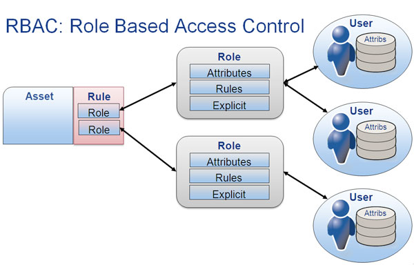
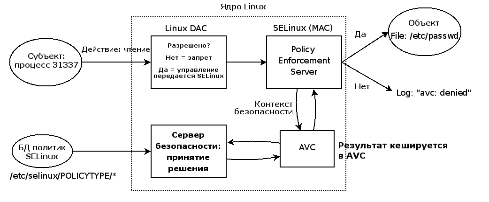
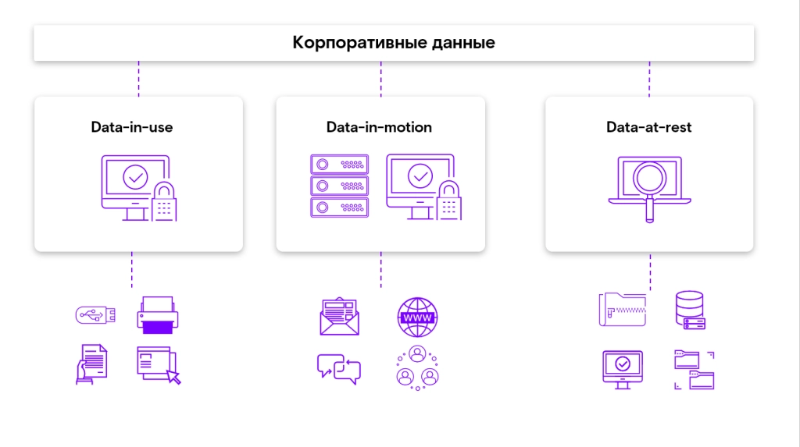
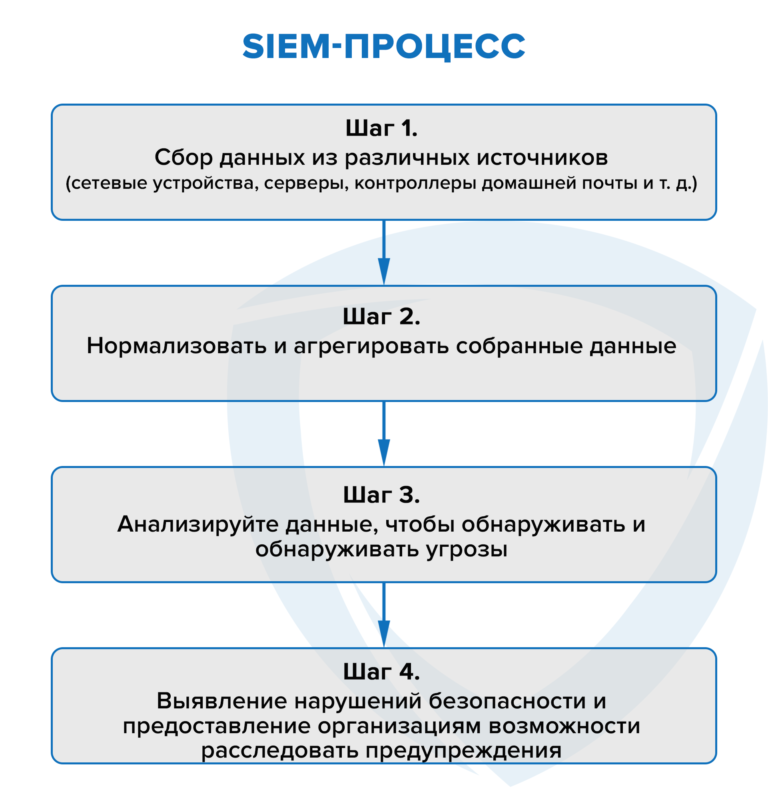
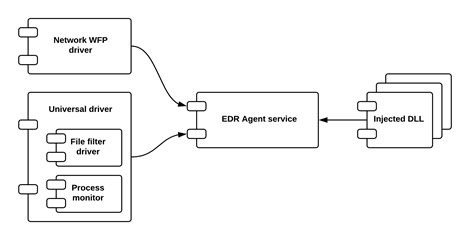

# 1. Введение в системы контроля привилегированных пользователей

> **Привилегированный пользователь**
>
> это пользователь, обладающий расширенными правами доступа и привилегиями в информационной системе или сети. Эти права могут включать возможность изменять системные настройки, управлять пользователями и ролями, иметь доступ к защищенным данным, а также выполнять другие действия, которые недоступны другим пользователям.

> **Системы контроля привилегированных пользователей**
> 
> представляют собой набор методов, политик и технологий, направленных на управление доступом к привилегированным учетным записям ИС и контроля учетных записей сотрудников IT-подразделений, системных администраторов, сотрудников аутсорсинговых организаций, занимающихся администрированием инфраструктуры компании, управления аутентификацией и авторизацией указанных сотрудников, аудита выполняемых действий, контроля доступа и записи их сессий.

Инные названия системы контроля прив поль

- Privileged User Management (PUM)
- Privileged Identity Management (PIM)
- Privileged Access Management (PAM)
- Privileged Password Management (PPM)
- Privileged Account Security (PAS)

## Основные компоненты систем контроля

1. Централизованное управление учетными записями с расширенными возможностями;
1. Аудит действий привилегированных сотрудников;
1. Управление настройками парольной защиты;
1. Контроль доступа сотрудников к административным ресурсам, управление процессом аутентификации и авторизации;
1. Запись сессии, запущенной из-под УЗ из списка привилегированных.

## Примеры рисков недостаточного контроля привилегий

### 1. Несанкционированный доступ:

Привилегированный пользователь может получить доступ к данным, системам или ресурсам, к которым он не должен иметь доступа. Это может привести к утечке конфиденциальной информации.

### 1. Изменение системных настроек

Привилегированный пользователь может несанкционированно изменять системные параметры, что, вероятно, приведет к нарушению нормального функционирования ИС, а также вызовет потерю данных.

### 2. Угроза целостности данных

Недостаточный контроль привилегий может привести к возможности внесения изменений в критические данные, что может оказать влияние на целостность и достоверность информации.

### 3. Неавторизованная модификация программ

Привилегированный доступ позволяет модифицировать программное обеспечение, что может привести к внедрению вредоносных функций или нарушению работоспособности приложений.

# 2. Методы контроля привилегий

> **Принцип наименьших привилегий (Principle of Least Privilege, PoLP)**
> 
> это принцип безопасности, который утверждает, <ins>что любой субъект в системе должен иметь только те привилегии, которые необходимы для выполнения его работы, и ничего сверх этого</ins>.
>
> Это принцип основан на идее, что у каждого пользователя должен быть доступ только к тем ресурсам, которые необходимы для выполнения требуемых обязанностей.

## Основные аспекты принципа наименьших привилегий

### Минимизация рисков

- Цель принципа наименьших привилегий — минимизировать потенциальные риски, связанные с возможностью неправомерного использования привилегий
- Чем меньше прав у субъекта, тем меньше возможностей для злоумышленника провести атаку или злоупотребить доступом.

### Принцип полномочий «не больше»

- Пользователи и процессы должны иметь только те права, которые абсолютно необходимы для выполнения их задач
- Если у субъекта есть лишние привилегии, это может создать дополнительные уязвимости и риски.

### Ограничение доступа

- Принцип наименьших привилегий подразумевает строгий контроль доступа к ресурсам и функциональности системы
- Это включает в себя ограничение доступа к файлам, сетевым ресурсам, командам и т.д.

### Отмена привилегий после выполнения задач

- Когда задача завершена, привилегии, предоставленные для ее выполнения, должны быть аннулированы
- Это означает, что у пользователя или процесса должны быть минимальные права вне завершенной задачи.

### Противостояние привилегиям по умолчанию

- Системы и приложения должны следовать принципу наименьших привилегий по умолчанию, предоставляя минимальные права до тех пор, пока пользователь или процесс не докажет, что ему требуются дополнительные привилегии.

### Привилегии на основе ролей

- Принцип наименьших привилегий часто реализуется вместе с ролевыми моделями управления доступом
- Пользователи получают только те роли и привилегии, которые необходимы для выполнения их задач.

## Ролевые модели

- предоставляют эффективный метод управления доступом, позволяя назначать права пользователей на основе их функциональных обязанностей в организации
- помогают
    - снизить сложность управления доступом
    - улучшить безопасность
    - обеспечить соответствие нормативным требованиям

> **Управление доступом**
> 
> это основной механизм обеспечения безопасности, который позволяет настраивать для соответствующих пользователей разрешения на доступ к определенным приложениям, данным и ресурсам на определенных условиях.

### Самые популярные модели

#### 1. Role-Based Access Control (RBAC).

- Пользователям присваиваются роли в соответствии с их функциональными обязанностями
- Права доступа предоставляются на основе принадлежности к роли

#### 2. Role-Based Constraint Model (RBCM).

- Добавляет ограничения к правам доступа на основе ролей
- Ограничения могут включать в себя
    - временные рамки
    - области доступа
    - условия и другие факторы, что делает систему более гибкой и адаптивной.

Например, если добавить к ролевой модели RBAC в права Администратора возможность ограничивать права на создание объектов ИС для Пользователей по определенным каталогам, модель уже будет считаться RBCM.

#### 3. Role-Based Model with Separation of Duties (RBAC-SoD).

- служит для предотвращения конфликтов интересов путем разделения определенных обязанностей между разными ролями.

Например, если пользователи создают совместно текстовый документ, пользователь А не может вносить изменения в текст, который создал пользователь Б.

#### 4. Role-Based Model with Auditing (RBAC-A).

- включает в себя возможность отслеживания и аудита действий пользователей на основе их ролей
- Это обеспечивает прозрачность и возможность анализа деятельности пользователей.

Например, если пользователи создают совместно текстовый документ, пользователь А может вносить изменения в текст, который создал пользователь Б, но это фиксируется в журнале изменений.

#### 5. Dynamic Role-Based Model.

- роли могут назначаться и изменяться динамически, в зависимости от действий пользователя или контекста среды
- Это позволяет более гибко управлять доступом в изменяющихся сценариях.

#### 6. Context-Aware Role-Based Model.

- учитывает контекстные факторы, такие как местоположение, время, устройство и др., при определении прав доступа пользователей на основе их ролей.

#### 7. Attribute-Based Access Control (ABAC).

- Это модель управления доступом, в которой решения о предоставлении доступа основаны на атрибутах субъектов, объектов и среды
- В ABAC разрешения формулируются с использованием условий, основанных на атрибутах.

##### Принципы ABAC включают:

- **Атрибуты Субъектов.** Это свойства или характеристики пользователя, такие как должность, роль, группа, местоположение и другие.
- **Атрибуты Объектов.** Это характеристики ресурсов, к которым запрашивается доступ, например, уровень конфиденциальности, тип данных и т.д.
- **Атрибуты Среды.** Это параметры окружающей среды, такие как время, местоположение, тип устройства и т. д.
- **Политики Доступа.** Это правила, определяющие, кто, что, когда и где может делать в системе. Политики составляются на основе атрибутов субъектов, объектов и среды.

## Не ролевые методы управления доступом

### 1. Mandatory Access Control (MAC).

- В MAC политики доступа определяются системным администратором и обязательны для всех пользователей
- Это обычно используется в сферах, где требуется высокий уровень безопасности, например, в военных или государственных системах.

### 2. Discretionary Access Control (DAC).

- В DAC владелец ресурса имеет контроль над тем, кто может получить доступ к его ресурсу и какие привилегии он имеет
- Это более гибкий метод, чем MAC, но может быть менее строгим в отношении безопасности.

### 3. Rule-Based Access Control.

- В этом методе правила определяют, какие действия разрешены или запрещены в зависимости от определенных условий
- Это позволяет устанавливать более сложные правила доступа.

### 4. Adaptive Access Control.

- Этот метод управления доступом адаптируется в реальном времени в зависимости от действий пользователя, контекста и рисков
- Например, если поведение пользователя необычно, система может изменять уровень доступа.

### 5. Policy-Based Access Control (PBAC).

- В PBAC политики доступа формулируются в виде правил и условий, обычно на основе бизнес-правил и требований
- Это позволяет легко изменять политики в соответствии с бизнес-потребностями.

# 3. Практические аспекты реализации контроля привилегий

## LDAP

> **LDAP (Lightweight Directory Access Protocol)**
>
> облегченный протокол доступа к каталогам, открытый стандартизованный протокол, применяемый для работы с различным реализациям служб каталогов, который может использоваться для управления пользователями, группами и привилегиями.

- представляет информацию в форме древовидной структуры, где каждый элемент идентифицируется уникальным `Distinguished Name (DN)`
- DN представляет собой уникальный путь к элементу в дереве
- Данные в LDAP организованы с использованием объектных классов и атрибутов
    - Объектные классы определяют тип объекта (например, пользователь, группа)
    - атрибуты содержат собственно информацию.

## В Linux

### 1. SELinux (Security-Enhanced Linux)

> система принудительного контроля доступа, реализованная на уровне ядра Linux и предоставляющая реализацию обязательного управления доступом (MAC) для усиления безопасности.

Основные режимы работы:

- **Enforcing (режим по-умолчанию)** При выборе этого режима все действия, которые каким-то образом нарушают текущую политику безопасности, будут блокироваться, а попытка нарушения будет зафиксирована в журнале.

- **Permissive** в случае использования этого режима, информация о всех действиях, которые нарушают текущую политику безопасности, будут зафиксированы в журнале, но сами действия не будут заблокированы.

- **Disabled** полное отключение системы принудительного контроля доступа.

### 2. AppArmor

- является реализацией системы Mandatory Access Control (MAC), основанной на архитектуре Linux Security Modules (LSM)
- Модель безопасности заключается в <ins>привязке атрибутов контроля доступа не к пользователям, а к программам</ins>
- обеспечивает изоляцию с помощью профилей, загружаемых в ядро, как правило, при загрузке
- уже имеет
    - набор стандартных профилей
    - инструменты статического анализа
    - инструменты, основанные на обучении и позволяющие ускорить и упростить построение новых профилей.

Режимы работы

- **Enforce** в этом режиме ядро гарантирует соблюдение правил, записанных в файле профиля. Нарушения не допускаются, и соответствующая запись попадает в логи.
- **Complain** в этом режиме AppArmor лишь регистрирует нарушения, не блокируя при этом сами действия.

### 3. Sudo

> **Substitute User and do**
>
> программа для системного администрирования UNIX-систем, позволяющая делегировать те или иные привилегированные ресурсы пользователям с ведением протокола работы.

Основная идея — дать пользователям как можно меньше прав, при этом достаточных для решения поставленных задач.

### 4. Chown и Chmod

**Сhange owner**

> UNIX-утилита, изменяющая владельца и/или группу для указанных файлов

- В качестве имени владельца или группы берется первый аргумент, не являющийся опцией
- Если задано только имя пользователя, то данный пользователь становится владельцем каждого из указанных файлов, а группа этих файлов не изменяется
- Если за именем пользователя через двоеточие следует имя группы, без пробелов между ними, то изменяется также и группа файла.

**Change mode**

> команда для изменения прав доступа к файлам и каталогам

- Права записываются одной строкой сразу для трех типов пользователей:
    - владельца файла
    - других пользователей, входящих в группу владельца
    - всех прочих пользователей
- В числовом виде файлу или каталогу устанавливаются абсолютные права, в то же время в символьном виде можно установить отдельные права для разных типов пользователей.

## В системах Windows (Microsoft Active Directory (AD))

> **Active Directory (AD)**
>
> служба каталогов корпорации Microsoft для операционных систем семейства Windows. Используется для управления и контроля доступа в среде Windows. Позволяет настраивать групповые политики, ролевой доступ и другие параметры безопасности. Создавалась как LDAP-совместимая служба каталогов.

### Основные структурные элементы

- **Домен** группа объектов, основная административная единица AD. Для каждого домена настраиваются правила доступа к нему и политики взаимодействия с другими доменами.
- **Структурное подразделение** необязательный наименьший возможный контейнер, в который при желании можно сгруппировать объекты домена. Могут использоваться, чтобы определить групповые политики и административный доступ для небольшой совокупности ресурсов в пределах одного домена;
- **Дерево доменов** коллекция доменов, сгруппированных в иерархическую структуру и имеющих связанное пространство имен;
- **Лес** контейнер высшего уровня, включающий в себя все домены каждого конкретного экземпляра AD.

в иерархии Active Directory должен быть как минимум один лес, одно дерево и один домен

### PAM (системы контроля привилегированных пользователей)

- используется для защиты ривилегированных пользователей
- обеспечивают контроль и мониторинг деятельности привилегированных пользователей в информационной системе

#### Механизмы защиты

- Проведение идентификации, аутентификации и авторизации пользователей, располагающих привилегированными правами.
- Мониторинг, выявление случаев аномальной активности привилегированных пользователей, обнаружение действий, представляющих потенциальную угрозу информационной безопасности.
- Сбор статистики, ведение журналов по действиям административных аккаунтов.
- Создание единого защищенного хранилища с учетными записями пользователей и управление им.
- Обеспечение централизованного и единого входа в информационную систему с использованием механизмов многофакторной аутентификации.
- Соблюдение парольной политики, включая смену по расписанию, а также подстановку учетных данных и безопасное их хранение в защищенном хранилище.
- Снижение рисков несанкционированного доступа путем адаптивного понижения уровня прав пользователей до минимально достаточного.
- Пресечение попыток бесконтрольного использования таких учетных записей как admin, root.

#### Аудит действий пользователей

1. **Мониторинг входа и выхода** Отслеживание входа и выхода из системы привилегированных пользователей. Регистрация времени входа, IP-адресов и других данных для идентификации сеансов.
1. **Регистраци** действий.Запись всех выполняемых привилегированными пользователями действий. Это включает в себя запуск команд, изменение конфигураций, доступ к файлам и другие операции.
1. **Обнаружени** аномалий.Отслеживание аномалий для выявления необычного или подозрительного поведения привилегированных пользователей.
1. **Мониторинг файловы** систем.Отслеживание доступа привилегированных пользователей к файлам и каталогам. Регистрация попыток чтения, записи и изменения файлов.
1. **Сессионны** мониторинг.Регистрация сессий привилегированных пользователей, включая временные интервалы и активности в рамках сессии.
1. **Контрол** привилегий.Отслеживание изменений в привилегиях привилегированных пользователей. Регистрация действий, связанных с повышением или понижением уровней доступа.

### Политики управления доступом

> Политика управления доступом представляет собой документ, который определяет правила и процессы, связанные с предоставлением, изменением и прекращением доступа к информационным ресурсам в организации.

**Цель политики управления доступом** — обеспечить безопасность и конфиденциальность данных, предотвращать несанкционированный доступ и соблюдать требования соответствующих законов и регуляций.

Политика должна учитывать следующие пункты:

1. **Бизнес-требования** Понимание бизнес-требований и бизнес-процессов. Определение критических ресурсов, информации и данных. Необходимо определить, какие ресурсы необходимо защитить, и какие данные считаются конфиденциальными. Политика должна отвечать на вопросы:
    - Какие данные и ресурсы критичны для бизнеса?
    - Какие роли и функции требуют доступа к этим данным?
    - Идентификация ресурсов и данных.
1. **Классификация пользователей и ролей** Классификация пользователей на основе их ролей и функций в организации. Определение различных уровней доступа для различных ролей.
1. **Определение прав доступа** Определение конкретных прав доступа, связанных с каждой ролью. Политика должна отвечать на вопрос: какие действия и операции разрешены для каждой роли?
1. **Управление привилегиями** Разработка стратегии управления привилегиями. Необходимо определить, какие пользователи могут повышать свои привилегии, и как это будет контролироваться.
1. **Учет обязанностей** Учет обязанностей, привязанных к конкретным должностям. Некоторые роли могут быть связаны с определенными обязанностями и требовать специфических прав доступа.
1. **Управление жизненным циклом** Разработка процедур управления жизненным циклом ролей и доступа с учетом того, какие меры предпринимаются при изменении ролей, переходе сотрудников или завершении их деятельности в организации.
1. **Аудит и мониторинг** Определение механизмов аудита и мониторинга для отслеживания активности пользователей, особенно с привилегированным доступом.
1. **Интеграция с ИТ** инфраструктурой.Интеграция политик управления доступом с другими системами, такими как LDAP, PAM, IAM и т.д.
1. **Тестирование и ревизия** Проведение тестирования политик и ролей для обнаружения слабых мест и несоответствий. Регулярная ревизия и обновление политик.
1. **Соблюдение законодательства** Убеждение, что разработанные политики соответствуют законодательным требованиям и нормативам в области безопасности информации.

# 4. Доверенная загрузка

> **Доверенная загрузка (Trusted Boot)**
> 
> это механизм безопасности, предназначенный для обеспечения целостности и доверия к загрузочному процессу операционной системы и других компонентов системы. Он помогает предотвратить возможные атаки, такие как внедрение вредоносного программного обеспечения на этапе загрузки системы.

## Основные принципы доверенной загрузки

1. **Загрузка с надежной платформы** Процесс начинается с надежной платформы, которая обеспечивает корневое доверие для измерений. Это означает, что загрузчик и другие критические компоненты проверяются и измеряются на этапе загрузки.
1. **Измерение и хранение хешей** Измеренные значения (хеши) компонентов загрузочного процесса сохраняются в безопасном хранилище, обеспечивая возможность дальнейшей проверки их целостности.
1. **Подпись и проверка цифровой подписи** Ключевые компоненты загрузочного процесса могут быть подписаны цифровой подписью, и их подлинность может быть проверена на этапе загрузки. Это обеспечивает дополнительный уровень доверия к компонентам.
1. **Цепь доверия** Процесс создания цепи доверия гарантирует, что каждый последующий компонент, загружаемый в систему, проверяется и доверен в пределах установленной цепи. Это создает уровень доверия от надежной платформы до конечной операционной системы.
1. **Платформенная проверка** Возможность системы предоставлять свою конфигурацию, целостность и состояние сторонним службам. Это может использоваться для проверки безопасности системы и соблюдения политик безопасности.
1. **Защита от атак и восстановление** В случае обнаружения атаки или недопустимого изменения, механизмы доверенной загрузки могут предусматривать процессы восстановления для возвращения системы в безопасное состояние.

## Самые распространенные виды доверенной загрузки

1. **Trusted Platform Module (TPM)** TPM — это аппаратный модуль, встроенный в некоторые компьютеры и устройства, который предоставляет базовые функции для доверенной загрузки. Он может хранить ключи, проверять цифровые подписи и предоставлять множество криптографических функций для обеспечения безопасности загрузки.
1. **UEFI Secure Boot** Secure Boot является частью стандарта UEFI (Unified Extensible Firmware Interface) и представляет собой механизм проверки цифровых подписей загрузочных компонентов. Он гарантирует, что только подписанные и проверенные компоненты могут быть загружены в систему.
1. **Measured Boot** Измеренная загрузка предполагает создание и хранение хешей (измерений) каждого загружаемого компонента в цепи загрузки. Эти измерения сохраняются в TPM или другом безопасном хранилище, и их можно использовать для проверки целостности системы.
1. **Remote Attestation** Дистанционная аттестация (Remote Attestation) позволяет системе предоставлять аттестацию своего состояния сторонним службам. Это может быть использовано для подтверждения целостности системы перед ее подключением к сети или другим сервисам.
1. **Intel TXT (Trusted Execution Technology)** Технология Trusted Execution от Intel предоставляет аппаратные механизмы для создания «безопасного контейнера» (trusted execution environment) в процессоре. Он обеспечивает изоляцию и доверие к выполнению определенных задач.
1. **AMD Secure Technology** Аналогично Intel TXT, AMD Secure Technology обеспечивает аппаратные механизмы для создания безопасного окружения выполнения на уровне процессора.
1. **Boot Guard** Boot Guard — это технология, разработанная Intel, которая защищает загрузчик и ключевые компоненты загрузки от модификаций на уровне платформы.

Эти технологии могут использоваться как самостоятельно, так и в комбинации, чтобы создать комплексную систему доверенной загрузки.

## Аудит целостности

> процесс проверки и подтверждения, что данные, системы или процессы сохраняют свою целостность и не подверглись несанкционированным изменениям.

Целостность данных означает, что информация не была изменена или повреждена таким образом, чтобы изменить ее смысл или достоверность.

### Шаги по аудиту целостности

1. **Установление базовой линии** Определение нормального состояния системы, данных или процессов, чтобы иметь базовую линию для сравнения с последующими аудитами.
1. **Мониторинг изменений** Регистрация изменений в системе, файлах или базах данных.
1. **Использование хешей** Расчет хеш-сумм для ключевых файлов или системных компонентов и сравнение их с предварительно сохраненными значениями, чтобы обнаружить изменения.
1. **Методы электронной подписи** Применение методов электронной подписи для проверки подлинности данных и обеспечения их неприкосновенности.
1. **Централизованный контроль доступа** Управление доступом к системным ресурсам и файлам, чтобы предотвратить несанкционированные изменения.
1. **Периодические аудиты** Проведение периодических аудитов целостности, включая как ручные проверки, так и автоматизированные процессы.
1. **Мониторинг событий** Регистрация событий, связанных с изменениями в данных или системе, и анализ этих данных для выявления несоответствий.
1. **Обеспечение конфиденциальности логов** Обеспечение того, чтобы логи аудита целостности были защищены от несанкционированного доступа и модификаций.
1. **Автоматизированный мониторинг** Использование автоматизированных средств мониторинга для быстрого обнаружения изменений и аномалий.
1. **Процедура восстановления** Разработка процедуры восстановления после обнаружения нарушений целостности для быстрого восстановления данных и системы в нормальное состояние.

# 5. DLP

> **DLP (Data Loss Prevention)**
>
> специализированное программное обеспечение, предназначенное для защиты компании от утечек информации. Эта аббревиатура на английском расшифровывается как Data Loss Prevention (предотвращение потери данных) или Data Leakage Prevention (предотвращение утечки данных).

DLP при помощи специальных алгоритмов фильтруют потоки информации и коммуникации в корпоративных сетях, контролируют перемещение данных

Обнаруживают и предотвращают несанкционированные действия с кофеденцильными данными
- **Использование (Data-in-use)**
    - это данные, к которым пользователи активно обращаются, обрабатывают и обновляют их
    - DLP предотвращает утечку данных благодаря функции мониторинга действий на рабочих станциях (например, съемные USB-носители, буфер обмена, приложения) и анализа поведения пользователей.
- **Передачу (Data-in-motion)**
    - это информация, которая перемещается из одной точки в другую
    - DLP предотвращает утечку данных через сетевые коммуникации.
    - При этом типе мониторинга делается акцент на идентификации данных, их источнике и назначении и последующем контроле потока информации в соответствии с политикой безопасности.
- **Хранение (Data-at-rest)**
    - это данные, которые не перемещаются между устройствами или сетями
    - DLP обнаруживает конфиденциальный контент в данных, хранящихся на корпоративных ИТ-ресурсах и устраняет нарушения политики хранения данных.

После того как данные перехвачены, они отправляются на
- полнотекстовый поиск
- контентный анализ (анализ содержимого)
- контекстный анализ (основанный на контексте операции — например, отправитель, получатель, используемый канал)

для обеспечения соблюдения политик использования и обработки данных, принятых в организации

## Технологии для обеспечения оперативного перехвата конфиденциальной информации, профилактики инцидентов безопасности и контроля конфиденциальных данных

### Контроль идентификаторов

> технология, позволяющая распознавать в тексте сообщений специальные идентификаторы в виде последовательности цифр или букв, однозначно определяющей данные, интересные с точки зрения информационной безопасности, в частности с точки зрения контроля утечек информации и работы с персональными данными

осуществляет:

- *Выявление финансовых данных* банковских реквизитов, ИНН налогоплательщика, номеров пластиковых карт и т. д.
- *Выявление персональных данных* паспортных данных, СНИЛС.
- *Выявление документов, создаваемых по шаблону* договоров, регламентов и т. д.
- *Выявление слов и фраз определенной тематики*

### Цифровые отпечатки

> технология позволяет сравнивать текстовые, графические и табличные данные с эталонными документами, что дает возможность находить как полностью, так и частично скопированные документы

выявляет:

- Текстовые документы (планы, уставы, приказы, типовые договоры, тендерные документы и т. д.).
- Табличные данные (базы клиентов, персональные данные и т. д.).
- Графические документы (сканы, фотографии, чертежи и т. д.).
- Шаблонные элементы ГОСТ и документов внутреннего стандарта.
- Печать-гриф («конфиденциально», «копия», «ДСП», и т. д.).

### Графические шаблоны

> технология, позволяющая распознавать конфиденциальные сведения в графических форматах с учетом их деформации (растяжение, поворот, наложение на другие объекты), а также при полном отсутствии текста

выявляет:

- печати организации,
- изображения паспортов с персональными данными,
- платежные карты.

### Поведенческий анализ

> технология, основанная на машинном обучении, благодаря чему стало возможно получать сведения о зарождающихся угрозах через анализ собранной информации о поведенческой динамике пользователей, их связях и выявленных аномалиях.

Детальный анализ показателей поведения может выявить негативные тенденции, что позволяет офицеру безопасности работать с рисками утечек конфиденциальных данных превентивно, вовремя принимая соответствующие меры.

### Файловый краулер

> технология, благодаря которой становится возможно проводить проверку узлов корпоративной сети и составлять ее наглядную карту, после чего контролировать ресурсы сети

Это позволяет находить конфиденциальную информацию в корпоративных и облачных хранилищах, электронной почте и других ресурсах.

## Почему используются DLP-системы

1. Компания работает с конфиденциальной информацией, в ней происходят утечки данных.
1. Не все потери данных являются результатом внешних злонамеренных атак. Случайное раскрытие или неправильное обращение с конфиденциальными данными внутренними сотрудниками трудно обнаружить, если кто-то использует свой законный доступ к данным в неблаговидных целях.
1. DLP-система может блокировать передачу конфиденциальных данных на накопители USB и другие съемные носители, а также дает возможность применять политики, обеспечивающие защиту данных в каждом конкретном случае.
1. Отсутствует представление о том, куда передаются и где хранятся конфиденциальные данные. Имея полное представление о том, где хранятся данные, что с ними происходит, ваша организация может установить соответствующие политики для их защиты и принимать решения с учетом приоритизации рисков в отношении активов, которые необходимо защищать.
1. Сложно обнаружить признаки корпоративного мошенничества в массе коммуникационного трафика.

# 6. WAF

> **WAF (Web Application Firewall)**
>
> межсетевой экран для веб-приложений. Это инструмент для фильтрации трафика, работающий на прикладном уровне и защищающий веб-приложения методом анализа трафика HTTP/HTTPS и семантики XML/SOAP.

 

- действует межсетевой экран как прокси-сервер, но ввиду возможности изучать HTTPS-трафик методом проверки сертификата конкретного сервера, WAF рассчитан на выполнение дополнительных операций: балансировку нагрузки на сервер, терминацию трафика SSL и т.д.
- работает на прикладном уровне
- работает с потоком данных

## три основных подхода к обеспечению безопасности

- **Белый список** файрвол формирует список безопасных моделей поведения, а остальные блокирует.
- **Черный список** файрвол блокирует трафик на основе актуальных сигнатур против известных видов атак, а остальной пропускает.
- **Гибридный** файрвол ориентируется на список как разрешенных, так и запрещенных моделей.

## Самые популярные атаки направленные на веб-сервисы

1. **SQL-инъекции** один из самых распространенных типов атак на сайты и программы, работающие с базами данных. Его суть заключается во внедрении произвольного SQL-кода в запрос, что может дать атакующему доступ к просмотру и редактированию базы.
1. **XSS (межсайтовый скриптинг)** также весьма распространенный тип атаки. Его суть заключается во внедрении атакующим вредоносного кода. С его помощью злоумышленник может получить доступ к личным данным пользователя. Вообще, почти все, что может JavaScript, станет для него доступно.
1. **LFI (Local File Inclusion)** позволяет злоумышленнику выполнить локальный файл на сервере. С его помощью удаленный пользователь может получить доступ к произвольным файлам на сервере, в том числе содержащих конфиденциальную информацию.
1. **RFI (Remote File Inclusion)** позволяет злоумышленнику выполнить удаленный файл на сервере. RFI возникает, когда входящие данные в коде сайта не проходят должную проверку.
1. **RCE (Remote Code Execution)** является максимальной угрозой класса A1 по классификации OWASP. При использовании RCE атакующий удаленно выполняет код на взламываемом компьютере, сервере и т.п.
1. **PHP-инъекции** один из способов взлома сайтов, работающих на PHP, он заключается в выполнении стороннего кода на сервере. При успешном проведении подобной атаки злоумышленник сможет выполнить любые PHP-команды.
1. **Автоматизированные действия** это подбор значений для различных полей, прокликивание различных ссылок и кнопок, автозаполнение форм (например, автоматическая покупка лимитированных товаров).
1. **Боты** выполняют поиск и сканирование уязвимостей веб-приложений, извлечение данных и т.п. Боты создают примерно 20% «плохого» трафика в интернете.
1. **Brute-force** подбор пароля и идентификатора пользовательской сессии, различные попытки DoS-атаки.

Этот список неполный, WAF работает с более широким спектром типов атак

## WAF по типу деплоймента

### Программные

Такие WAF представляют собой дополнительный софт и встраиваются в уже существующую инфраструктуру, расширяя ее возможности. Программные файрволы могут оказаться лучшим решением для небольших компаний, но их сложно масштабировать при расширении компании или сайта, и их скорость обработки информации ниже, чем у аппаратных.

### Аппаратные

Это специальные физические устройства, которые устанавливаются локально, и выполняют роль сетевого шлюза между интернетом и сервером компании. Они более надежны, чем программные, но сложнее настраиваются и дороже стоят. Также оборудование имеет свойство устаревать и выходить из строя.

### Облачные

Сегодня популярность набирают облачные решения, поскольку они имеют ряд преимуществ:

- провайдер сам отвечает за настройку и обновление ПО;
- в случае проблемы с одной виртуальной машиной сервер не будет простаивать, поскольку трафик перенаправляется на другую;
- файрвол эффективнее использует машинное обучение и работает со всеми типами уязвимостей за счет данных по всем клиентам провайдера;
- как правило, облачный провайдер предоставляет клиентам широкую техническую поддержку.

# 7. SIEM

> **SIEM (Security information and event management, «управление событиями и информацией о безопасности»)**
>
> класс программных продуктов, предназначенных для сбора и анализа информации о событиях безопасности.

SIEM — это фактически объединение классов SEM (Security Event Management, «управление событиями безопасности») и SIM (Security Information Management, «управление информацией о безопасности»)

- SEM: используются для мониторинга событий безопасности в реальном времени
- SEM: отвечают за долгосрочное хранение и анализ данных с различных объектов инфраструктуры организации

**Основные задачи SIEM**

1. В реальном времени отслеживать сигналы тревоги, поступающие от сетевых устройств и приложений.
1. Обрабатывать полученные данные и находить взаимосвязи между ними.
1. Выявлять отклонения от нормального поведения контролируемых систем.
1. Оповещать операторов об обнаруженных инцидентах

При помощи SIEM ИБ-специалисты могут выявить кибератаки и нарушения политик безопасности на ранних стадиях и минимизировать ущерб от них

Решения SIEM могут собирать данные о событиях безопасности четырьмя способами:
- с помощью специальных приложений (этот метод используется чаще всего)
- напрямую из файлов с логами
- напрямую с сетевых устройств
- с помощью протоколов потоковой передачи данных, например
    - SNMP
    - Netflow
    - IPFIX

В качестве источников информации для SIEM-решений могут выступать:

- антивирусные программы;
- системы авторизации и аутентификации;
- межсетевые экраны, брандмауэры;
- журналы сетевого оборудования, серверов и рабочих станций;
- контроллеры домена;
- системы обнаружения и предотвращения вторжений (IDS/IPS);
- системы предотвращения утечки информации (DLP);
- решения для контроля активов и инвентаризации.

## Функции SIEM-систем

### 1. Агрегация данных

Вся информация о работе сетевых устройств, серверов, датчиков от систем безопасности, различных приложений поступает в журналы данных. SIEM-системы управляют такими журналами и помогают сотрудникам отдела информационной безопасности находить наиболее критичные события в инфраструктуре.

### 2. Корреляция

SIEM-системы производят поиск общих значений и атрибутов и связывают между собой поступающие события. Таким образом, данные из разных источников, поступающие от устройств и сервисов, приводятся к единому виду для дальнейшего анализа.

### 3. Оповещение

После того как система произвела анализ схожих между собой событий, она оповещает администратора безопасности о существующих проблемах в инфраструктуре. Способы оповещения могут быть различными, включая вывод тревог на панель мониторинга SIEM-системы и оповещение по электронной почте. Панели мониторинга или информационные панели представляют информацию о событиях в виде диаграмм и графиков. Возможность визуализации позволяет определить отклонения в поведении, которые отличаются от типичного поведения различных систем.

### 4. Совместимость

SIEM-системы внедряются в существующую в компании инфраструктуру и позволяют автоматически собирать информацию о событиях, формировать отчеты для собранных данных и применять их с целью управления безопасностью и проведения аудита.

### 5. Хранение событий

Системы заключают в себе хранилища информации, в которых хранятся события безопасности. Эти события могут сортироваться по времени, что позволяет производить экспертизы и расследование инцидентов.

### 6. Экспертный анализ

SIEM-системы позволяют производить поиск по сохраненным событиям информационной безопасности, что также дает возможность проводить расследование инцидентов сетевой безопасности.

## SIEM-Процесс

# 8. EDR

> **Endpoint Detection & Response (EDR)**
>
> класс решений для обнаружения и изучения вредоносной активности на конечных точках: подключенных к сети рабочих станциях, серверах, устройствах Интернета вещей и так далее. В отличие от антивирусов, задача которых — бороться с типовыми и массовыми угрозами, EDR-решения ориентированы на выявление целевых атак и сложных угроз. При этом EDR-решения не могут полностью заменить антивирусы, поскольку эти две технологии решают разные задачи.

система класса Endpoint Detection & Response состоит из агентов, устанавливаемых на конечные точки, и серверной части
- **Агент**: ведет мониторинг запущенных процессов, действий пользователя и сетевых коммуникаций и передает информацию на локальный сервер или в облако
- **Серверный компонент**: анализирует полученные данные при помощи технологий машинного обучения, сопоставляет их с базами индикаторов компрометации (IoC) и другой доступной информацией о сложных угрозах

## Большинство современных EDR-решений могут

- собирать данные с конечных точек в режиме реального времени;
- записывать и хранить информацию о действиях пользователей, сетевой активности и запущенных программах для последующего изучения и исследования;
- выявлять и классифицировать подозрительную активность, а также уведомлять службы безопасности о ней;
- Предпринимать шаги по блокировке атаки — изолировать подозрительные файлы, останавливать вредоносные процессы, разрывать сетевые соединения;
- интегрироваться с защитными решениями для конечных точек, SIEM-системами и другими средствами защиты.

## Модули EDR на примере на примере EDR фирмы Comodo Cybersecurity (Open EDR)

1. **Core Library** базовый фреймворк, который содержит основные функции и является ядром системы;
1. **EDR Agent service** собственно само приложение EDR;
1. **Process Monitor** DLL-библиотека, которая внедряется в различные процессы для перехвата вызовов API и инструментарий для работы с ней;
1. **File filter driver** мини-фильтр файловой системы, который перехватывает запросы ввода-вывода файловой системы, отслеживает доступ к реестру, обеспечивает защиту компонентов и настроек EDR и т.д.;
1. **Network monitor** компонент мониторинга сетевой активности.

Гибкие настройки позволяют отфильтровать ложные тревоги и отрегулировать систему для конкретной специфики сети в организации, а ядро системы «закапывается» на очень глубокий уровень, используя для этого «хакерские технологии», такие как Rootkit.

Помимо сигнатурного и эвристического анализа, EDR непрерывно сканирует систему на предмет IoC (Indicator of Compromise — индикатор компрометации) и IoA (Indicators of Attack — индикатор атаки)

# 9. Threat Intelligence

> **Threat intelligence (данные о киберугрозах)**
>
> это информация об актуальных угрозах и группировках киберпреступников, которая позволяет организациям изучить цели, тактику и инструменты злоумышленников и выстроить эффективную стратегию защиты от атак. Компании могут сами собирать данные о киберугрозах или заказывать информацию у сторонних поставщиков.

## Основные группы

1. **Тактические** техническая информация, например индикаторы компрометации.
1. **Операционные** описание техник и процедур, которыми пользуются злоумышленники, а также их возможностей и преследуемых ими целей.
1. **Стратегические** данные о рисках, связанных с конкретными угрозами.

## Этапы работы с Threat Intelligence

1. **Сбор и обработка данных** сбор информации об актуальных угрозах, а также очистка от дублирующих данных и приведение собранной информации к единому формату. Обработка необходима для оперативного поиска и извлечения конкретных данных.
1. **Анализ** изучение полученных данных, в том числе подозрительных файлов и программ, формирование гипотез и рекомендаций. На этапе анализа также выявляются недочеты методик сбора и обработки данных.
1. **Распространение** передача Threat intelligence заинтересованным лицам, например специалистам внутри компании, если она собирала данные для себя, или клиентам, если организация выполняла заказ третьих лиц.
1. **Обратная связь** получение и учет реакции сотрудников или клиентов организации на предоставленную информацию.

