# 2. Основные физические принципы передачи информации по радиоканалу

- В теории связи часто понятие <ins>информация</ins> определяется как сведения о предметах, событиях и явлениях, передаваемые от отправителя к получателю с помощью сигналов
- Для хранения или передачи по каналу связи информация преобразуется в <ins>сообщение</ins> — совокупность знаков или символов, которые отражают ее содержание.

> **Сигнал)** физический процесс, отображающий (несущий) передаваемое сообщение.

Различают четыре вида сигналов:
- **непрерывный непрерывного времени (аналоговый);**
    - могут изменяться в произвольные моменты, принимая любые значения из непрерывного множества возможных значений.
- **непрерывный дискретного времени;**
    - может принимать произвольные значения, но изменяется только в определенные (дискретные) моменты времени
- **дискретный непрерывного времени;**
    - могут изменяться в произвольные моменты времени, но их величины принимают только конкретные разрешенные дискретные значения (уровни)
- **дискретный дискретного времени (цифровой).**
    - в дискретные моменты времени могут принимать только конкретные дискретные значения.

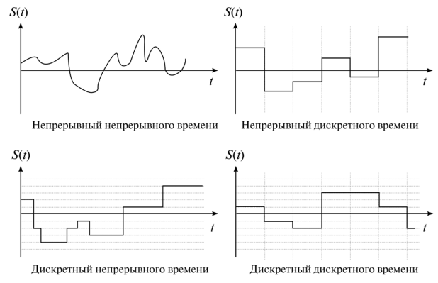

На практике в системах связи чаще используют аналоговые и цифровые сигналы.

> В форме цифровых сигналов, например, передаются двоичные символы текстовых сообщений. Любой аналоговый сигнал можно представить в цифровой форме для его передачи по каналам цифровой связи. Этот прием очень распространен в современной технике и называется аналого-цифровым преобразованием.

Преимущества систем связи, использующих <ins>цифровые сигналы</ins>
- **Устойчивость к помехам**
	- представляют информацию в виде дискретных значений (нулей и единиц), что делает их более устойчивыми к шумам и искажениям при передаче.
- **Сжатие данных**
	- легко сжимать, что позволяет экономить место при хранении и передаче.
- **Обработка информации**
	- легко обрабатывать с помощью компьютеров, что открывает широкие возможности для обработки данных, шифрования и других операций.
- **Стандартизация**
	- цифровая передача данных позволяет использовать единые стандарты, что упрощает совместимость различных устройств.

Факторы использования <ins>аналоговых</ins> систем передачи данных
- **Исторические причины и совместимость**
	- многие существующие системы связи построили на аналоговой основе
    - переход на полностью цифровые системы требует значительных финансовых затрат и может вызвать сбои в работе.
- **Простота и надежность**
	- аналоговые системы часто проще в реализации и обслуживании, особенно в небольших и маломощных устройствах
    - менее подвержены сбоям, вызванным электромагнитными помехами.
- **Качество звука и видео**
	- в некоторых приложениях, таких как высококачественная аудиозапись и аналоговое телевидение, аналоговые системы обеспечивают более естественное и приятное восприятие информации.
- **Специальные приложения**
	- существуют области, где аналоговые сигналы обладают уникальными преимуществами
    - в некоторых датчиках и измерительных приборах аналоговые сигналы более точно отражают физические величины.

В радиосвязи физической средой передачи сигналов на расстояние будет электромагнитное колебание (радиоволна), причем частота этих колебаний оказывает прямое влияние на величину этого расстояния. Радиосвязь на значительные расстояния осуществляется с помощью высокочастотных сигналов, которые получаются из низкочастотных путем их модуляции.

> **Модуляция** это процесс изменения одного или нескольких параметров высокочастотного несущего колебания по закону низкочастотного информационного сигнала. О том, как это происходит, и какие виды модуляции бывают, мы расскажем в следующих уроках.

| Диапазон частот | Наименование диапазона (сокращенное наименование) |
|--|--|
| 3–30 кГц | Очень низкие частоты (ОНЧ) |
| 30–300 кГц | Низкие частоты (НЧ) |
| 300–3000 кГц | Средние частоты (СЧ) |
| 3–30 МГц | Высокие частоты (ВЧ) |
| 30–300 МГц | Очень высокие частоты (ОВЧ) |
| 300–3000 МГц | Ультравысокие частоты (УВЧ) |
| 3–30 ГГц | Сверхвысокие частоты (СВЧ) |
| 30–300 ГГц | Крайне высокие частоты (КВЧ) |
| 300–3000 ГГц | Гипервысокие частоты (ГВЧ) |

- Чем ниже частота
    - тем лучше они могут огибать поверхность Земли и препятствия на своем пути
- чем выше частота радиоволны
    - тем более прямолинейно распространяются волны, но позволяют при этом использовать антенны меньших размеров
    - в меньшей степени отражаются от ионосферы, что дает возможность передавать их в космос

Длина антенны напрямую связана с длиной волны радиосигнала, который она излучает или принимает
- Чем длиннее волна, тем длиннее должна быть антенна для эффективной работы
- антенны обладают направленными свойствами, то есть способностью принимать и излучать сигналы преимущественно в определенном направлении
    - всенаправленных антенн
    - направленные антенны фокусируют энергию радиоволны в узком луче

# 3. Структура системы цифровой радиосвязи и функции ее основных элементов

## Передача и прием сообщений

Обобщенная структура системы цифровой радиосвязи 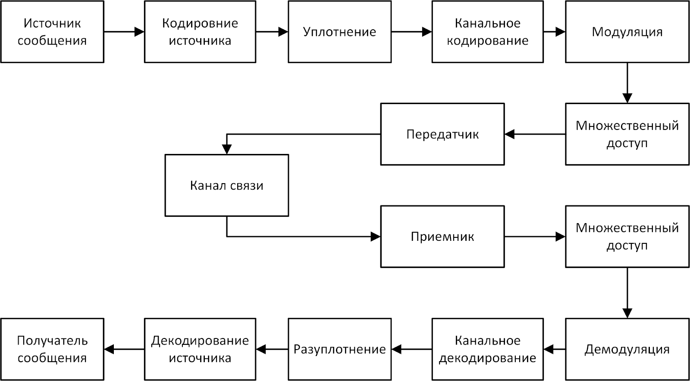

> - Верхняя часть этой схемы соответствует преобразованиям сигнала на пути от источника к передатчику, ее принято называть **передающей стороной** системы связи
> - нижняя сторона называется **приемной**.

> **источник сообщений** Это функциональный блок в виде устройства, которое преобразует информацию в сообщение требуемого вида или формата.

### Этапы передачи сообщений в системах цифровой связи

1. **источник** формирует сообщения в виде цифрового сигнала
    - если исходное сообщение было представлено в виде аналогового сигнала, например, от микрофона, то оно подвергается аналого-цифровому преобразованию и представляется в виде последовательности двоичных символов
1. выполняется **кодирование источника**
    - нужно, чтобы снизить избыточность передаваемого сообщения путем применения различных алгоритмов сжатия данных
    - задача <ins>кодера источника</ins> — это представление исходного сообщения с минимальным количеством двоичных символов, чтобы оптимизировать ресурс канала связи
    - > кодер источника позволяет более эффективно использовать ресурс канала связи, поэтому преобразования, которые в нем выполняются, часто называют эффективным кодированием.
1. **уплотнение (не обязательный)**
    - потоки сообщений от разных источников объединяются в один общий (групповой) поток для совместного использования ресурса канала связи
    - > Устройство, которое осуществляет это преобразование, называется **мультиплексором**
1. поступление на **кодер канала**
    - последовательность двоичных символов от кодера источника (или группы источников в случае применения уплотнения)
    - Цель канального кодирования — обеспечение надежной передачи сообщения по каналу связи, в котором неизбежно возникают помехи, шумы и различного рода искажения сигнала.
    - **«канальное кодирование»**
        - <ins>помехоустойчивое кодирование (FEC (Forward Error Correction))</ins>
            - в передаваемую двоичную последовательность по определенным правилам вносят избыточность, которая обеспечивает возможность исправления на приемной стороне некоторых ошибок, возникших в процессе передачи
            - называют избыточным или корректирующим
        - <ins>операции скремблирования и перемежения</ins>
            - *скремблирование*
                - выполняет скремблер
                - заключается в рандомизации двоичной последовательности, то есть придании ей свойств псевдослучайной последовательности
                - устранить в передаваемом сигнале длинные последовательности одинаковых символов и таким образом стабилизировать работу модулятора и демодулятора
            - *Перемежение*
                - заключается в перестановке по определенному правилу двоичных символов, чтобы обеспечить возможность исправлять серии ошибок
                - Правила перестановки выбирают разработчики систем связи в зависимости от применяемого помехоустойчивого кода и особенностей возникновения искажений в канале связи
1. Двоичная последовательность на выходе кодера канала поступает на **модулятор**
    - c выхода кодера канала
    - преобразует ее в аналоговый модулированный сигнал, подаваемый на передатчик напрямую или через процедуру множественного доступа
        - позволяет обеспечить совместную работу нескольких передатчиков в одном канале связи
        - тобы обеспечить одновременную работу большого количества мобильных телефонов, находящихся в зоне действия всего одной базовой станции
1. сигнал поступает в **передатчик** устройство, осуществляющее усиление и формирование радиосигнала, который излучается антенной
1. **Канал связи** в данном контексте — это физическая среда, которая используется для передачи сигнала от передатчика к приемнику, например, радиоволна.
    - сигнал подвергается воздействию шумов и помех, поэтому на вход приемника поступает, как правило, искаженный сигнал
1. **Приемник**
    - выполняются процедуры, обратные тем, что выполнялись на передающей стороне
    - реализует интерфейс с каналом связи и выполняет предварительную обработку аналогового модулированного сигнала
    - при необходимости, групповой сигнал от нескольких передатчиков обрабатывается в соответствии с применяемой технологией множественного доступа
1. **Демодулятор**
    - преобразует принятый сигнал в двоичную последовательность, в которой с определенной вероятностью присутствуют ошибки
1. **канальный декодер**
    - олное или частичное исправление ошибок благодаря корректирующей способности помехоустойчивого кода
1. **разуплотнение**
    - операции обратные уплотнению
1. **декодирование источника**
    - восстанавливается исходное сообщение, которое способен корректно воспринимать его получатель

# 4. Основы построения систем многоканальной цифровой радиосвязи

> **пропускная способность (ресурс канала)** определяется как максимально возможная скорость передачи информации, измеряемая в бит/с

> **многоканальные системы передачи** в них обеспечивается одновременная работа множества передающих и приемных устройств, а значит, ресурс канала связи должен делиться между ними

При построении многоканальных систем связи по сути осуществляется разбиение канала связи на несколько подканалов, каждый из которых выделяется определенному абоненту.
- **уплотнение**
    - ресурс канала распределяется путем прямого подключения источников к оборудованию, которое формирует групповой сигнал
- **множественный доступ**
    - редполагает объединение сигналов различных пользователей непосредственно перед их передачей в радиоканал

## Методы обеспечения многоканальной связи

### Уплотнение канала (мультиплексирование, TDM — Time Division Multiplexing)

- объединение нескольких битовых потоков от разных источников в один общий битовый поток с более высокой скоростью
- скорости объединяемых потоков суммируются
- Процесс передачи данных разделяется на временные интервалы (таймслоты) определенной длительности, в течение которых передается информация от одного источника

Схема работы мультиплексора 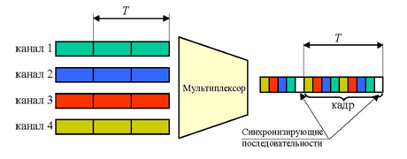

Для того чтобы <ins>демультиплексировать</ins> полученную последовательность, на приемной стороне <ins>необходимо восстановить соответствие временных интервалов каждому каналу</ins>.
- мультиплексор при формировании уплотненного потока вставляет в него с определенной периодичностью фиксированную битовую последовательность - **синхрослово**
    - вместе с группой временных интервалов, следующих за ней и содержащих равное количество интервалов из каждого входного потока, образует **кадр или фрейм**

### Множественный доступ

- распределение между абонентами частотного ресурса системы, то есть ограниченного участка диапазона частот, в котором работает система связи
- позволяет делить полосу частот системы связи между абонентами при отсутствии физического подключения между их передающими устройствами
- характерно для систем мобильной связи

#### Основные методы множественного доступа

- **с частотным разделением каналов (МДЧР, англ. FDMA (Frequency Division Multiple Access)) **
	- когда каждому каналу (абоненту) выделяется определенный участок полосы частот, занимаемый системой связи;
- **c временным разделением каналов (МДВР, англ. TDMA (Time Division Multiple Access)) **
	- когда каждому каналу (абоненту) выделяется вся полоса частот системы связи, но на определенный временной интервал (таймслот);
- **с кодовым разделением каналов (МДКР, англ. CDMA (Code Division Multiple Access)) **
	- разделение по кодам: каждый канал или абонент имеет свой уникальный код, наложение которого на групповой сигнал позволяет выделить информацию конкретного канала или абонента.

##### МДЧР (FDMA)

> разделение полной полосы частот радиоканала между различными группами несущих и ограничения частотной полосы передачи на каждой несущей выделенным поддиапазоном

- не нуждается в координации запросов пользователей в реальном времени
- можно использовать для передачи как аналоговых, так и цифровых сигналов
- Пример: FM-радиостанции
    - участок вещательного диапазона, распределен между радиостанциями на частотные каналы, и каждая из них работает на своей частоте, не создавая помех другим станциям.

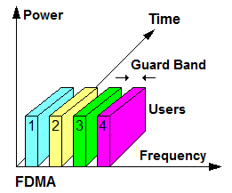 

##### МДВР (TDMA)

> формирование каналов осуществляется путем <ins>временного разделения всей выделенной полосы рабочих частот</ins> и мощности между различными абонентами

- Передачу сообщений в любое заданное время должен вести только один абонент системы связи
- используется кадровая структура группового сигнала (по аналогии с мультиплексированием)
    - требует синхронизации работы всех абонентов сети
- применяется в спутниковой связи

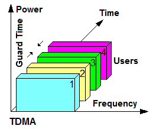

##### МДКР (CDMA)

> основан на одновременной передаче в одной полосе частот сигналов нескольких станций, модулированных информационными сигналами и кодовым сигналом, который, в общем случае, представляет собой псевдошумовую последовательность

- применяется в мобильных сетях связи третьего поколения
- На приемной стороне информация выделяется путем умножения принятого сигнала на копию псевдошумовой последовательности
- Надежное разделение достигается благодаря ортогональности кодовых сигналов отдельных станций
- каждому абоненту в системе назначается уникальный код, который используется для формирования сигнала

##### Комбинированные методы

**многочастотный** доступ с временным разделением (MF-TDMA, Multi-Frequency Time-Division Multiple Access)
- полоса частот делится на ряд частотных каналов, а для работы абонентов выделяется определенное частотно-временное окно.

### Поляризационное и пространственное разделение каналов

#### Поляризационное разделение (PDMA)

выделяют в отдельную группу, потому что они реализуются <ins>на уровне излучения антенной</ins>, а не на уровне формирования сигнала

> **Поляризация электромагнитной волны**
> - это колебание векторов напряженности электрического поля и напряженности магнитного поля в определенном направлении.
> - то, как колеблются электрическое и магнитное поля волны в определенном направлении

Представьте, что волна движется вперед, а ее поля «вибрируют» либо вверх-вниз, либо в стороны, или в любом другом фиксированном направлении. Это и называется поляризацией волны

- независима от других характеристик электромагнитной волны
- позволяет организовать множественный доступ с поляризационным разделением (polarization division multiple access, PDMA)
    - сигналы каждого пользователя имеют различные поляризационные состояния и используют один и тот же частотно-временной ресурс.

Схема множественного доступа с поляризационным разделением поддерживает два независимых канала данных с ортогональными состояниями поляризации
- в случае линейно поляризованной волны
    - вертикальная
    - горизонтальная
- в случае круговой поляризации
    - левая
    - правая

получил широкое распространение в спутниковых и радиорелейных линиях связи

#### пространственное разделение каналов

> достигается применением направленных антенн, каждая из которых осуществляет передачу в ограниченном пространственном секторе.

# 5. Классификация радиотелекоммуникационных систем

## по используемому механизму распространения радиоволн

- **Радиорелейная связь** 
    - > основана на увеличении дальности связи путем многократной ретрансляции сигнала между отдельными станциями
    - используется для связи на больших расстояниях, особенно там, где прокладка кабелей затруднительна или экономически нецелесообразна 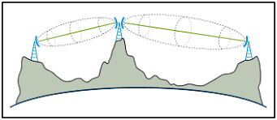  
- **Тропосферная связь**
    - > радиосвязь в ОВЧ−УВЧ диапазонах, которая осуществляется в условиях отсутствия прямой видимости путем использования эффекта изменения направления распространения радиоволн в тропосфере
    - используют в случаях, когда другие методы (например, спутниковая связь) могут быть нецелесообразны
    - позволяет обеспечивать передачу данных на расстояниях от нескольких десятков до сотен километров в зависимости от частоты и условий атмосферы 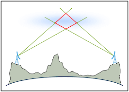  
- **Спутниковая связь**
    - >радиосвязь с использованием ретрансляторов сигналов, установленных на космических аппаратах.
- **Радионаправление**
    - > способ организации связи между двумя абонентами. Радиосеть — способ организации связи между тремя и более абонентами.

## По топологии сети

- **Точка — точка** Прямое соединение между двумя устройствами;
- **Точка — многоточка** Одна точка (например, базовая станция) соединяется с несколькими другими устройствами;
- **Каждый с каждым** Каждое устройство сети соединяется с любым другим устройством этой сети;
- **Сетка** Сеть организована в виде решетки, где устройства соединены между собой радиолиниями по различным маршрутам, образуя сетевые узлы;
- **Звезда** Все устройства подключены к центральному узлу (например, коммутатору или хабу), который управляет трафиком между ними.

## По методам формирования и передачи сообщений

- цифровые
- аналоговые

## По режиму передачи информации

- **симплексными**
	- передача информации возможна лишь в одном направлении
    - радиовещание — радиостанция передает аудиосигнал слушателям, но слушатели не могут передавать свои сообщения обратно;
- **полудуплексными**
	- передача информации в определенный момент времени возможна либо в прямом, либо в обратном направлении
    - связь с использованием радиостанций "Push-To-Talk"
        - один человек говорит в рацию, другой должен ждать, пока первый закончит передачу, прежде чем сможет ответить
        - Оба устройства могут и передавать, и принимать информацию, но они делают это поочередно;
- **дуплексными**
	- передача информации возможна одновременно в обоих направлениях.
    - привычный разговор по мобильному телефону, оба собеседника могут говорить одновременно.

## По методу доступа к частотному ресурсу

- с частотным разделением каналов;
- с временным разделением каналов;
- с кодовым разделением каналов;
- с пространственным разделением каналов;
- с поляризационным разделением каналов;
- с комбинированными способами разделения каналов.

## По ширине полосы рабочих частот

- **узкополосные**
    - считается система, в которой диапазон рабочих частот, на которых работает радиосеть, намного меньше центральной частоты этого диапазона
    - Иногда инженеры используют коэффициент 1/10, то есть если ширина диапазона рабочих частот составляет около 1/10 от частоты, на которой передается сигнал, то сигнал тоже считается узкополосным
    - используют для связи устройств с низкой скоростью передачи информации
- **широкополосные**
    - используют относительно большую полосу частот для передачи данных
    - позволяет передавать большие объемы информации одновременно, повышая скорость и емкость системы

## По виду передаваемых сообщений

- **телефонные**, например, радиотелефоны стандарта DECT, которые часто используют в офисах ;
- **телеграфные**, например, связь при помощи азбуки Морзе очень часто применяют сегодня, не смотря на ее примитивную технологию;
- **сети передачи данных**, или **мультисервисные**, такими являются все современные беспроводные сети.

## По размеру зоны обслуживания

- **персональные**
    - зона действия до 50 метров
    - Bluetooth, ZigBee;
- **локальные**
    - до сотен метров
    - WiFi;
- **региональные**
    - до сотен километров
    - сети мобильной связи;
- **глобальные**
    - сети спутниковой связи.

## По количеству зон обслуживания

- **однозоновые**
    - радиосеть, обслуживающая небольшую территорию, например, внутри одного здания или кампуса, где есть одна зона покрытия. Примером может быть локальная беспроводная сеть в офисе
- **многозоновые**
    - сотовая сеть, которая покрывает несколько географических зон (ячеек), каждая из которых имеет свою базовую станцию

## По локализации абонентов

- **подвижной связи**
    - мобильная сеть, где абоненты могут перемещаться в пределах зоны покрытия и оставаться на связи
- **фиксированной связи**
    - радиосеть, в которой абоненты привязаны к фиксированным точкам подключения

## По назначению связи

- общего пользования
- ведомственные (служебные, частные, корпоративные)

## По способу организации подвижной связи и предоставляемым услугам

- **Системы персонального радиовызова**
    - предназначены для передачи коротких сообщений абонентам, оснащенным специальными приемниками (пейджерами)
    - однонаправленные системы связи, где информация передается от центра к пользователю, но пользователь не может отправить ответное сообщение;
- **системы беспроводной телефонии**
    - вышеупомянутый стандарт DECT;
- **транкинговые системы**
    - профессиональные радиосистемы, используемые для организации связи в условиях, где нужно эффективное использование ограниченного радиочастотного ресурса
    - несколько пользователей (абонентов) совместно используют небольшое количество каналов, и каждый канал выделяется пользователю только на время сеанса связи
    - Примеры таких систем: TETRA, DMR, APCO25;
- **сети беспроводного доступа**
    - предоставляют возможность подключения к интернету или другим сетевым ресурсам без использования проводов
    - Wi-Fi-сети в домах, офисах, общественных местах и сети большего масштаба (например, WiMAX);
- **системы сотовой связи**

## системы автоматизированного сбора информации и управления по радиоканалам

> системы, которые автоматически собирают, передают и обрабатывают данные с удаленных объектов или устройств, используя радиосвязь

- применяют для мониторинга, управления и анализа различных процессов или объектов в реальном времени на расстоянии, без необходимости физического подключения
- позволяют собирать информацию с датчиков, устройств или контроллеров и передавать ее на сервер или приемную станцию для дальнейшей обработки

*Пример*: AIS (Automatic Identification System) — это автоматическая идентификационная система, используемая в морской навигации для обмена данными между судами и береговыми службами

# 6. Физический уровень радиотелекоммуникационных систем

> Физический уровень описывает способы передачи двоичных последовательностей (битовых потоков) через физическую среду передачи.

На физическом уровне определяются процессы преобразования битовых потоков в сигналы и характеристики этих сигналов (значения напряжений, частоты, длительности и т. д.)

Применительно к радиотелекоммуникационным системам протоколы физического уровня реализуют такие функции как:
- формирование модулированных сигналов,
- контроль качества передачи информации и исправление ошибок,
- оптимизация использования канала связи и распределение его ресурса между устройствами.

В создании и реализации протоколов физического уровня для радиотелекоммуникационных систем участвует ряд международных и национальных организаций:
- Международная организация по стандартизации (ISO),
- Ассоциация телекоммуникационной промышленности/Ассоциация электронной промышленности (TIA/EIA),
- Международный союз электросвязи (ITU),
- Американский национальный институт стандартизации (ANSI),
- Институт инженеров по электротехнике и электронике (IEEE),
- Европейский институт телекоммуникационных стандартов (ETSI).

## Помехоустойчивое кодирование

- задача обеспечения надежной передачи цифровой информации по каналам с шумами
- в решение этой задачи вносит теория помехоустойчивого кодирования
- разрабатываются методы защиты от ошибок, базирующиеся на применении **помехоустойчивых (корректирующих) кодов**.

Использование этих кодов позволяет получить **энергетический выигрыш кодирования**, который характеризует степень возможного снижения мощности передачи при кодировании
- можно использовать для улучшения параметров и характеристик многих важных свойств систем передачи данных
    - для уменьшения размеров антенн
    - увеличения дальности связи
	- повышения скорости передачи данных
	- снижения необходимой мощности передатчика

> **Помехоустойчивое кодирование** представляет собой метод обработки цифровых сигналов по определенным алгоритмам, которые учитывают характер появления ошибок в канале и позволяют при приеме вычислить местоположение ошибочных символов.

### виды помехоустойчивых кодов по принципам построения пространства кодовых комбинаций

#### блоковые коды

> символы кодируемого сообщения разбиваются на блоки фиксированной длины, после чего каждый из блоков преобразуется в блок большей длины путем добавления проверочных символов

Математически процедура преобразования для линейных блоковых кодов сводится к операции умножения вектора на порождающую матрицу, где строки являются линейно независимыми и формируются в зависимости от конкретного вида кода.

известны и используются коды
- Голея
- Хэмминга
- Адамара
- Боуза-Чоудхури-Хоквингема
- Рида-Соломона
- и др.

[статья о кодах](https://habr.com/ru/articles/111336/)

могут быть
- **систематическими** символы исходной последовательности после процедуры кодирования сохраняются в неизменном виде и передаются в канале связи совместно с избыточными символами
- **несистематические** полностью преобразуют информационную последовательность в кодовую

#### непрерывные (сверточные)

> кодируемая последовательность пропускается через сдвиговый регистр с конечным числом состояний, совокупностью отводов и функциональных генераторов, производящих соответствующее алгебраическое преобразование

Один из методов описания процедуры сверточного кодирования сводится к умножению вектора на матрицу
- вектор и матрица являются полубесконечными

> **Полубесконечная матрица ** это матрица, которая имеет конечное количество строк, но бесконечное количество столбцов, или, наоборот, бесконечное количество строк и конечное количество столбцов. Такая матрица встречается в некоторых задачах линейной алгебры, функционального анализа и теории операторов, где объектами исследования могут быть бесконечномерные вектора или операторы.

#### каскадные

> **Каскадное помехоустойчивое кодирование ** это метод комбинированного использования нескольких кодов для повышения помехоустойчивости при передаче данных. Этот метод улучшает вероятность успешной передачи данных за счет последовательного применения двух или более различных кодов, каждый из которых работает на своём уровне кодирования.

исходное сообщение сначала кодируется одним кодом (его называют **внешним кодом**), а затем полученный результат кодируется еще одним кодом (**внутренним**)
- При декодировании процесс идет в обратном порядке: сначала декодируется внутренний код, а затем внешний

### методы перемежения

- когда ошибки в принимаемой последовательности следуют подряд одна за другой
- обеспечивающие разбиение серии последовательных ошибок на ряд одиночных

пример перемежителя — блоковый (матричный) перемежитель
- кодируемая последовательность разбивается на блоки фиксированной длины и из них составляется матрица
- если кодируемая последовательность записывается в матрицу по строкам, то в канал связи передаются элементы, считываемые по столбцам, и наоборот

сверточное перемежение, которое выполняется по более сложной схеме, подробно описанной в [статье.](http://jre.cplire.ru/jre/jan19/13/text.pdf)

### процедура скремблирования

- Для каналов спутниковых линий связи в сочетании с помехоустойчивым кодированием
- В системах цифровой связи длинные последовательности одинаковых двоичных символов, таких как "0000..." или "1111...", могут вызвать потерю синхронизации между модемами в радиолинии
- делает передаваемую последовательность данных более "равновероятной", что облегчает процесс синхронизации

В частном случае скремблирование представляет собой сложение по модулю два (операция XOR) передаваемой двоичной последовательности с псевдослучайной последовательностью

> **Псевдослучайная двоичная последовательность ** это последовательность битов (0 и 1), которая выглядит как случайная, но на самом деле генерируется с использованием детерминированного алгоритма

## Модуляция

> **Модуляция**
> - это процесс изменения параметров несущего сигнала с целью передачи информации.
> - часто называется манипуляцией

> **Несущее колебание (несущий сигнал)** это высокочастотный сигнал, который используется для передачи низкочастотных сигналов в радиосистемах. Этот сигнал, по сути, не несет информации сам по себе, но служит «носителем» для модулирующего сигнала, на который накладывается передаваемая информация.

В зависимости от того, какой параметр несущего колебания изменяется в соответствии с модулирующим цифровым сигналом, различают:
- амплитудную,
- частотную,
- фазовую манипуляции.
-комбинированные методы модуляции
    - амплитудно-фазовые
    - квадратурные

### амплитудная модуляция (Amplitude Shift Keying — ASK)

> При таком способе передачи двоичных последовательностей значениям их элементов (0 или 1) соответствует два разных значения амплитуды несущего колебания

В частном случае нулевому значению передаваемой информации соответствует нулевое значение амплитуды сигнала

> Такой тип манипуляции в технической литературе называется OOK (On-Off Keying), и его часто применяют в системах дистанционного управления и автомобильных сигнализациях.

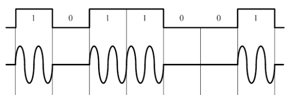

### частотная манипуляция (Frequency Shift Keying — FSK)

> значениям 0 и 1 передаваемых данных соответствует разная частота передаваемого несущего сигнала (двухпозиционной частотной манипуляции)

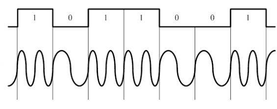

#### Многопозиционная манипуляция M-FSK

- формируется путем группировки бит в символы и введением взаимно-однозначного соответствия между множеством значений символа и множеством значений частоты модулированного колебания

#### манипуляция с минимальным сдвигом (MSK-minimum-shift keying)

> разновидность частотной модуляции, при которой обеспечивается непрерывность фазы сигнала при передаче

изменение фазы несущего колебания на интервале времени, равном длительности одного символа, всегда равно + 90° или -90° в зависимости от знаков символов модулирующего сигнала

- обладает высокой спектральной эффективностью
- позволяет передавать информацию с большей скоростью чем при обычной частотной манипуляции в одинаковой полосе частот

#### фазовая манипуляции (Phase Shift Keying — PSK)

> битовые потоки передаются изменением фазы несущего колебания.

- Например, значению 0 передаваемых данных соответствует фаза 0 градусов несущего колебания, а значению 1 соответствует фаза 180 градусов
- Такой вид модуляции получил название двоичной или двухпозиционной фазовой манипуляции (Binary PSK)

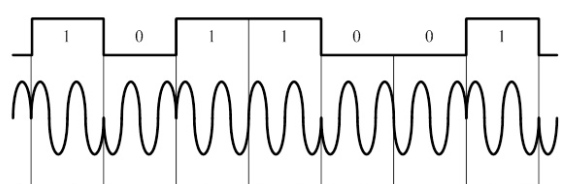

#### Четырехпозиционная (квадратурная) фазовуя манипуляция (QPSK, Quadrature Phase Shift Keying)

> Каждому из четырех возможных значений фазы модулированного сигнала соответствует два бита информации, следовательно, изменение модулирующего сигнала при QPSK-модуляции происходит в два раза реже, чем при BPSK-модуляции при одинаковой скорости передачи информации

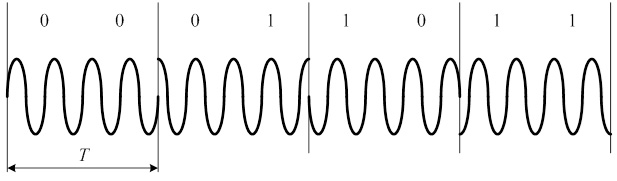

#### Многопозиционная фазовая модуляция (M-PSK)

> формируется путем группировки в символы и введением взаимно-однозначного соответствия между множеством значений символа и множеством значений сдвига фазы несущего колебания

Значения сдвига фазы из множества отличаются на одинаковую величину

#### комбинированные методы манипуляции

##### амплитудно-фазовый

> при передаче групп двоичных символов осуществляется одновременное изменение двух параметров несущего колебания — амплитуды и фазы

Сигнал, полученный в результате такой модуляции, обычно изображают в виде сигнального созвездия, на котором каждый передаваемый символ соответствует точке на фазовой плоскости

созвездие для шестнадцатипозиционной амплитудно-фазовой манипуляции (АФМ16) 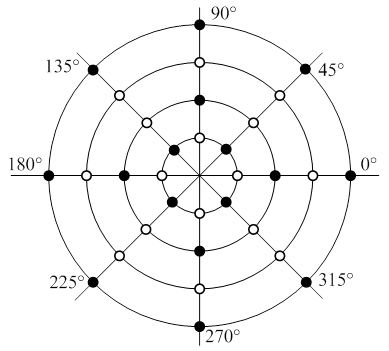

##### квадратурная амплитудная модуляция (Quadrature Amplitude Modulation — QAM)

частный случай реализации комбинированной амплитудно-фазовой манипуляции

> модулированный сигнал представляет собой сумму двух несущих колебаний одной частоты, но сдвинутых по фазе относительно друг друга на 90 градусов, каждое из которых промодулировано по амплитуде

Сигнальные созвездия QPSK и QAM 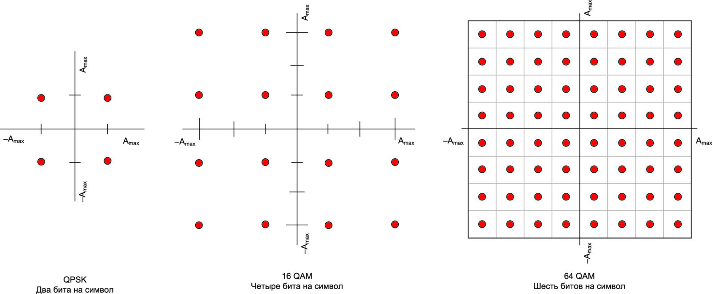

# 7. Основные угрозы безопасности радиотелекоммуникационных систем

## Атаки типа «человек посередине»

- возможность перехвата передаваемых данных
- применим к системам связи практически всех видов

для целей перехвата нарушители могут использовать программно-определяемый приемник Software Defined Radio (SDR) и свободно распространяемое программное обеспечение.

> **SDR-приемник** это устройство, позволяющее с помощью программного обеспечения обрабатывать любой принятый радиосигнал в соответствии с произвольным алгоритмом. Технологию SDR и ее возможности вы подробно изучите в четвертом модуле дисциплины.

Основной метод защиты от такого рода атак
- использование шифрования передаваемой информации
- использование сложных схем формирования сигнала

<ins>злоумышленник при ее реализации осуществляет передачу сигнала в канал связи со своего устройства, и соответственно, демаскирует свое присутствие в радиоэфире</ins>

можно использовать для создания копии любого из устройств передачи информации

## Атаки типа «отказ в обслуживании»

Злоумышленник может включить устройство, заполняющее всю полосу рабочих частот радиосистемы помехами и нелегальным трафиком

> **Блокирование (глушение) радиоканала** это деструктивное воздействие на радиоканал путем постановки мощной помехи в диапазоне его работы.

помеха в общем случае может создаваться в достаточно широком диапазоне частот, нарушая при этом нормальное функционирование сразу нескольких радиосетей

Широкополосные генераторы помех, которые могут заглушить сразу несколько сетей (например, Wi-Fi и GSM), бывают
- **Ручные или портативные**
	- имеют размеры телефона и сравнительно малую мощность, и из-за этого препятствуют передаче данных на расстоянии в 5–15 метров (при отсутствии преград). 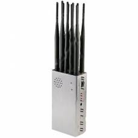
- **Стационарные**
	- на порядок мощнее и дороже
    - чем шире полоса частот и больше радиус глушения, тем более мощным должен быть генератор помех
    - мощные глушилки сильно греются, поэтому им необходимо дополнительное охлаждение
    - чем ниже частота глушения, тем большего размера должны быть антенны генератора помех
- **Самодельные**
	- маломощные генераторы помех, которые действуют на небольшом расстоянии
    - для увеличения покрытия глушения нужны дорогостоящие широкополосные усилители, а создание такого оборудования предполагает специализированные навыки.

