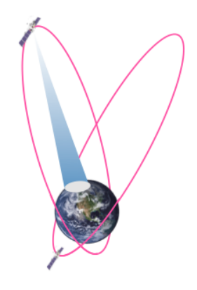

# 2. Основы спутниковой связи

## Принцип работы спутниковой связи

Основной принцип спутниковой связи в том, что сигнал передается от одной наземной станции к другой через спутник на орбите Земли. Спутник работает как «передатчик»: он принимает сигнал с одной станции, усиливает его и отправляет дальше на другую станцию. Иногда спутник перенаправляет сигнал не сразу на конечную станцию, а через другие спутники.

> Спутник, на котором установлены ретрансляторы и другое связное оборудование, называется **космической станцией связи**, а те две станции, которые связываются друг с другом посредством спутника, — наземными станциями спутниковой связи.

Космическая станция связи не только обеспечивает связь между наземными станциями, но и передает информацию между:
- различными космическими аппаратами;
- космическим аппаратом и наземной станцией (например, для связи международной космической станции и центра управления полетами).

> **Космическая радиосвязь** это радиосвязь, при которой используют космические станции связи.

> **Спутниковая связь** это связь между наземными станциями через космические станции.

> **Таким образом, спутниковая связь** это частный случай космической радиосвязи.

> **Наземная станция спутниковой связи** это радиостанция на Земле, которая связывается с другими наземными станциями через спутник. Иногда ее еще называют земной станцией, наземным или абонентским терминалом, абонентской станцией.

Для передачи сигналов между наземными и космическими станциями организуются три вида радиолиний:
- **линия «вверх» (uplink)** это космическая радиолиния, передающая сигнал в направлении от наземной станции к космической.
- **линия «вниз» (downlink)** это космическая радиолиния, передающая сигнал в направлении от космической станции к наземной;
- **межспутниковая радиолиния** это радиолиния между двумя космическими станциями.

## Службы спутниковой радиосвязи

- Спутниковая связь затрагивает определенную часть околоземного космического пространства, и оно общее для всех стран мира.
- должны соблюдаться международно принятые правила и стандарты
- регламентируется Международным союзом электросвязи (International Telecommunication Union, или ITU)

> **Служба спутниковой связи** это организационно-техническая структура на базе сети или совокупности сетей спутниковой радиосвязи. Она обслуживает пользователей для удовлетворения их потребностей в определенном наборе услуг связи.

в зависимости от типа и назначения наземных станций есть разные виды служб радиосвязи:
- **Фиксированная спутниковая служба (ФСС, fixed satellite service, или FSS)** это служба для связи между наземными станциями, расположенными в строго определенных местах, с помощью одного или нескольких спутников.
    - используется для доступа в интернет в удаленных районах и для связи в компаниях
    - применяются стационарные спутниковые модемы с антеннами больших размеров для высокоскоростного подключения
- **Подвижная спутниковая служба (ПСС, mobile satellite service, или MSS)** это служба радиосвязи между мобильными наземными станциями или между мобильными и стационарными станциями с помощью спутников.
    - Оборудование обычно компактное и может использоваться как переносное устройство или устанавливаться на кораблях и самолетах
- **Вещательная спутниковая служба (ВСС, broadcasting satellite service, или BSS)** служба радиосвязи, которая применяется для трансляции радио- и телевизионного сигнала.
    - передает сигнал напрямую на устройства пользователей
    - обеспечивает широкий охват территории вместе с высоким качеством передачи

## Преимущества и недостатки спутниковой связи

<ins style="color: green">Преимущества:</ins>
- **Широкий охват территории**
    - Зона покрытия может охватывать огромные территории, включая удаленные и труднодоступные регионы:
    пустыни
		- горные районы
		- океаны и полярные зоны
    - Это особенно актуально для стран с большим географическим размахом и для связи в океанах
- **Независимость от локальной наземной инфраструктуры**
    - Не требует прокладки кабелей или строительства инфраструктуры на земле
    - позволяет быстро развернуть связь после стихийных бедствий, когда наземная инфраструктура повреждена.
- **Надежность**
    - Современные технологии производства спутникового оборудования позволяют обеспечивать длительную работу космических станций и их поддержание на орбите
    - Спутниковый сегмент часто используется как резервный канал связи в корпоративных сетях на случай повреждения наземной инфраструктуры.
- **Высокая пропускная способность**
    - Спутниковые системы могут обеспечивать высокую пропускную способность канала связи для передачи большого объема данных, что позволяет удовлетворить потребности потребителей интернет-услуг и пользователей корпоративных сетей.

<ins style="color: red">Недостатки:</ins>
- **Задержка сигнала (латентность)**
    - Из-за огромного расстояния между Землей и спутником передача сигнала происходит с задержкой до 500 мс
    - Это может быть ощутимо во время телефонных звонков или видеоконференций и создавать дискомфорт при общении.
- **Подверженность влиянию атмосферных явлений**
    - Качество передачи сигнала по спутниковым радиолиниям может ухудшаться от дождя, снега или грозы.
- **Высокая стоимость запуска и обслуживания**
    - Развертывание спутниковых систем требуют значительных финансовых затрат на стадиях проектирования, запуска и эксплуатации.
    - Продолжительная эксплуатация любой спутниковой системы требует постоянного обновления состава спутникового сегмента:
        - отслужившие свой срок спутники выводятся из эксплуатации, и на замену запускаются новые.
- **Загрязнение космического пространства**
    - Чем больше космических аппаратов на орбите, тем больше накапливается космического мусора.

# 3. Классификация систем спутниковой связи

Есть несколько классификаций спутниковых систем связи:
- по видам предоставляемых услуг связи;
- по охватываемой территории обслуживания;
- по принадлежности;
- по типу орбиты.

## По охватываемой территории

Классификация спутниковых систем связи по охватываемой территории основывается на масштабах их зон покрытия

- **глобальные**
    - обеспечивают покрытие всей поверхности Земли или значительной ее части, включая океаны и полярные регионы
    - орбиты и количество спутников рассчитаны так, чтобы обеспечить постоянное покрытие на максимально большой территории.
    - Примеры:
        - сеть спутниковой телефонии [Iridium](https://sccs.intelgr.com/archive/2018-04/01-Makarenko.pdf)
        - многофункциональная система [Inmarsat](https://sccs.intelgr.com/archive/2018-04/04-Makarenko.pdf)
- **региональные**
    - охватывают только определенные регионы Земли
    - предназначены для связи на ограниченной территории
    - обслуживают территории конкретных стран или континентов без глобального покрытия
    - Пример:
        - на базе телекоммуникационного спутника [Ka-Sat](https://www.viasat.com/about/what-we-do/satellite-fleet/ka-sat/) обеспечивается связь и высокоскоростной доступ в интернет на территории Европы и небольшой части Ближнего Востока.

## По принадлежности

включает разделение по уровню и сфере управления, а также по целям, для которых они предназначены

- **международные**
    - создаются совместно несколькими странами и обеспечивают связь по всему миру
    - используются для навигации, связи и наблюдения за погодой
    - Пример:
        - [Intelsat](https://www.intelsat.com/) под управлением международной организации, обслуживающая территории глобального охвата.
- **национальные**
    - управляются правительством одной страны и служат для связи внутри этой страны
    - Обычно они обеспечивают связь на территории государства или в близлежащих регионах
    - Пример:
        - систему на базе спутников [«Экспресс-АМ» и «Экспресс-АТ»](https://www.iss-reshetnev.ru/projects/telecommunication?ysclid=m3oyfjkk3k739897030) для телекоммуникационных услуг и вещания на территории России
- **ведомственные (или корпоративные)**
    - создаются для нужд конкретных организаций
    - используются для служебной связи и передачи данных
    - Пример:
        - сеть оператора [«Газпром космические системы»](https://www.gazprom-spacesystems.ru/ru/services_and_solutions/sputnikovyy-resurs/) — она обеспечивает связь, телевещание и мониторинг земной поверхности.
- **коммерческие**
    - принадлежат частным компаниям и предоставляют платные услуги для широкой аудитории
    - редлагают телекоммуникации, мультимедиа, интернет и корпоративную связь
    - Пример:
        - система спутникового интернета [Starlink](https://www.starlink.com/) от SpaceX

## По типу орбиты

- геостационарные
- высокоэллиптические
- низкоорбитальные

### Системы связи на геостационарных орбитах

- располагаются на высоте примерно 36 000 км над экватором
- движутся вокруг Земли в направлении ее собственного осевого вращения с такой же угловой скоростью
- делают один оборот вокруг Земли за 24 часа
- спутник постоянно находится над одной точкой земной поверхности

<ins style="color: green">Преимущества:</ins>
- **Возможность охвата одним спутником наибольшей по площади территории**
    - способен охватить до одной трети поверхности Земли 
- **Возможность непрерывной связи в зоне покрытия**
    - Благодаря тому, что спутник остается неподвижным относительно земной поверхности, из-за взаимного перемещения космической и наземной станций
- **Высокий срок службы спутников на орбите**
    - Активный срок их существования современных геостационарных спутников на орбите составляет более 15 лет

<ins style="color: red">Недостатки:</ins>
- **Задержка сигнала**
    - Суммарно с учетом времени его обработки в наземном оборудовании она может достигать 500 мс, что неудобно при телефонных разговорах.
- **Плохое качество приема сигнала в приполярных районах земного шара**
    - на высоких широтах геостационарная орбита скрывается за горизонтом
    - не обеспечивают полностью глобальное обслуживание
- **высокая степень занятости геостационарной орбиты космическими аппаратами** 

### Системы связи на высокоэллиптических орбитах

- Орбиты, о которых пойдет речь в этом разделе, характеризуются эксцентриситетом (сжатостью с одной из сторон)
- вытянуты в одном направлении
- спутники могут длительное время находиться над определенной областью земной поверхности вблизи апогея (самой высокой точки орбиты)

Примеры:
- российские системы [«Молния» и «Тундра»](http://lib.tssonline.ru/articles2/sputnik/vozmozhnosti-predostavleniya-novyh-uslug-sputnikovoy-svyazi-na-territorii-rf--vklyuchaya-arkticheskuyu-zonu), которые раньше использовались для связи и телевещания в полярных регионах.

<ins style="color: green">Преимущества:</ins>
- позволяют стабильно передавать сигнал в полярные и северные регионы, куда не достают геостационарные спутники.

<ins style="color: red">Недостатки:</ins>
- необходимость использовать несколько спутников (минимум три) для постоянной связи, так как один спутник может обеспечивать устойчивый сигнал только несколько часов

### Низкоорбитальные системы спутниковой связи (LEO-системы)

> Низкоорбитальные системы используют спутники на высоте 500–2000 км с периодом обращения 1–3 часа и называются низкими круговыми орбитами (LEO).

- основная задача — обеспечить связь с низкой задержкой и стабильным сигналом
- подходит для интернета, навигации и передачи данных

- LEO-системы включают сотни или даже тысячи спутников
- вместе могут обеспечивать покрытие всей земной поверхности
- Один такой спутник обеспечивает обмен данными между пользовательскими терминалами
- Если наземная станция назначения находится вне зоны видимости, данные транслируются между космическими аппаратами по межспутниковым радиолиниям, пока не достигнут зоны, где сигнал может быть передан на земную станцию

- **У них малая задержка сигнала**
    - За счет небольшой высоты орбиты сигнал быстро достигает Земли, так что LEO-системы могут посоревноваться с наземными сетями в вопросах задержки.
- **Обеспечивают глобальное покрытие**
    - Формируют зону обслуживания с охватом всего земного шара вместе с труднодоступными и отдаленными регионами — океанами, пустынями и полярными широтами
    - В отличие от геостационарных систем, для этого потребуется не три, а гораздо больше спутников: например, в системе Iridium необходимо как минимум 66 спутников, но зато нет проблемы покрытия приполярных зон.
- **Они масштабируемые и гибкие**
    - Увеличение числа спутников в системе помогает повысить ее пропускную способность и улучшить покрытие в нужных регионах.

<ins style="color: red">Недостатки:</ins>
- **дорого создавать и обслуживать**
    - Для создания полноценной LEO-системы требуется запустить большое количество спутников, что требует значительных финансовых затрат
    - чем больше спутников будет в системе, тем выше их общая цена.
- **спутники нужно чаще менять**
    - Спутники на низких орбитах испытывают большее сопротивление от атмосферы, что сокращает срок их службы (в среднем до 5–7 лет) и требует частой замены.
- **чувствительны к погодным условиям**
    - Радиоволны Ku- и Ka-диапазонов (о них вы узнаете далее), применяемых в LEO-системах, подвержены затуханию из-за дождя и снега
    - снижает качество связи при плохих погодных условиях.

# 4. Инфраструктура систем спутниковой связи

Инфраструктура делится на две составляющие:
- **космический сегмент** это сами спутники на орбите и наземные станции управления, которые обеспечивают их работу на протяжении всего срока службы;
- **наземный сегмент** это наземные станции связи, оборудование для контроля, управления, связи, а также подключения к обычным телекоммуникационным сетям. Пользовательские терминалы связи тоже входят сюда.

> Набор спутников, которые входят в космическую систему, называется **орбитальной группировкой**.

**Задача орбитальной группировки** - обеспечить присутствие космических станций связи над обслуживаемыми территориями (зонами) в требуемые промежутки времени (в идеале — постоянно)

- какие факторы влияют на выбор орбитальной конфигурации, можно почитать [здесь](http://lib.tssonline.ru/articles2/sputnik/osobennosti-postroeniya-i-ekspluatatsii-orbitalnyh-gruppirovok-sistem-sputnikovoy-svyazi).

Наземные станции управления полетом спутников 
- контролируют всю орбитальную группировку
- координируют движение спутников
- отслеживают их техническое состояние
- принимают телеметрические данные от спутников
- могут корректировать параметры их орбитального движения и работы бортового оборудования

> **Телеметрические данные** это информация, которую спутник передает на Землю для мониторинга его технического состояния и условий окружающей среды. Это температурные показатели, данные о положении и ориентации и состоянии бортовых систем и пр.

Если наземных станций в составе системы несколько, то одна из них реализует функции центра управления полетами, а остальные принимают телеметрию и выполняют другие вспомогательные задачи.

Оператор космического сегмента должен:
- постоянно обеспечивать телеметрический контроль технических параметров всех узлов самого спутника (спутниковой платформы) и модуля полезной нагрузки (бортового связного оборудования — антенн, усилителей, ретрансляторов и пр.);
- поддерживать космические аппараты на заданной орбите, измерять их фактическое положение и корректировать орбиту при необходимости;
- проводить необходимые регламентные работы в бортовом оборудовании.

В состав наземного сегмента кроме совокупности пользовательских терминалов связи входят **наземные станции связи**. Они выполняют следующие функции.
- Передают и ретранслируют данные
- Контролируют и распределяют трафик
- Обеспечивают безопасность и шифруют данные

# 5. Передача сигналов по спутниковым радиолиниям

## Частотные диапазоны в радиосвязи

В таблице указаны основные диапазоны частот с их буквенными обозначениями, которые часто встречаются в технической литературе и помогут вам ориентироваться в параметрах спутниковых систем.

> Точное разбиение этих диапазонов частот в соответствии с таким буквенным обозначением в различных источниках разнится, но вам достаточно знать примерные границы этих диапазонов.

<table>
    <thead>
      <tr>
        <th>
              Буквенное обозначение
        </th>
        <th>
              Границы диапазона частот
        </th>
      </tr>
    </thead>
      <tbody>
      <tr>
        <td>
          
L

        </td>
        <td>
          
1–2 ГГц

        </td>
      </tr>
      <tr>
        <td>
          
S

        </td>
        <td>
          
2–4 ГГц

        </td>
      </tr>
      <tr>
        <td>
          
C

        </td>
        <td>
          
4–7 ГГц

        </td>
      </tr>
      <tr>
        <td>
          
X

        </td>
        <td>
          
7–10 ГГц

        </td>
      </tr>
      <tr>
        <td>
          
Ku

        </td>
        <td>
          
10–14 ГГц

        </td>
      </tr>
      <tr>
        <td>
          
Ka

        </td>
        <td>
          
20–30 ГГц

        </td>
      </tr>
    </tbody></table>

- **L-диапазон (1–2 ГГц)** 
    - популярен для приложений, где нужны слабонаправленные малогабаритные антенны (около 10 см) и широкие зоны покрытия.
    - Основные области применения
        - [радионавигационные системы](https://glonass-iac.ru/guide/gnss/) (GPS, ГЛОНАСС, Galileo, BeiDou) и мобильная спутниковая связь
        - системы Iridium, Inmarsat и [Thuraya](https://www.satcomdv.ru/informaciya_o_sistemah_sputnikovoj_sa/thuraya/thuraya/)
- **S-диапазон (2–4 ГГц)**
    - используется в спутниковом радиовещании и для передачи телеметрии со спутников на Землю.
    - система [Sirius XM](https://www.siriusxm.com/), которая передает аудиоконтент на пользовательские приемники
- **C-диапазон (4–7 ГГц)**
    - широко используется для телевещания, передачи данных и сетей связи со стационарными наземными станциями через геостационарные спутники
    - сильно загружен
    - Антенны обычно большие (от 2,5 метров), что неудобно для мобильных приложений
    - Примеры:
        - [Intelsat](https://www.intelsat.com/) и [SES](https://www.ses.com/ru) - предоставляют услуги связи и телевизионного вещания в международных масштабах
- **X-диапазон (частоты 7–10 ГГц)**
    - специализированный частотный диапазон для военных, правительственных и научных целей
    - находит применение в спутниковой связи, радиолокации и космических исследованиях
    - Примеры в коммерческих целях, — системы радиолокационного исследования Земли [TerraSAR-X и COSMO-SkyMed](https://www.vesvks.ru/vks/article/vozmozhnosti-kosmicheskih-sistem-radiolokacionnogo-16614)
- **Ku-диапазон (12–18 ГГц)**
    - используется для телевидения, интернета и корпоративной связи
    - возможны небольшие антенны (около 80 см), что делает его удобным для сетей viasat
    - спутниковые интернет-провайдеры [HughesNet](https://altegrosky.ru/platforma-hn/) и [Viasat](http://lib.tssonline.ru/articles2/Oborandteh/effektivnie-resheniya-viasat-dlya-shirokopolosnih-spytnikovih-setei) используют Ku-диапазон для доступа в отдаленных регионах Северной Америки
- **Ka-диапазон (20–30 ГГц)**
    - используется для построения сетей связи с высокоскоростным доступом в интернет
    - Благодаря большой емкости частот он позволяет создавать высокоскоростные интернет-каналы и подходит для корпоративных коммуникаций
    - система starlink

## Типы зон обслуживания

Существует несколько основных типов зон обслуживания:
- глобальная;
- региональная;
- локальная.

### Глобальная

- охватывает почти всю поверхность Земли за исключением полярных областей.
- может быть сформирована тремя и более геостационарными спутниками.

### Региональная

- обслуживает конкретный регион или континент
- Обычно это территории, которые имеют стабильный спрос на спутниковую связь, — Европа, Северная Америка или Азия
- могут быть сформированы с помощью узконаправленных антенн геостационарных спутников
- Очень часто на одном спутнике размещается несколько антенн, благодаря чему он может формировать и так называемый глобальный луч, и несколько региональных

### Локальная

- небольшая зона, охватывающая территорию маленькой страны и или даже определенные области внутри нее
- Размеры таких зон могут варьироваться от нескольких сотен до тысяч километров
- формируются узконаправленными антеннами спутников

- Зоны обслуживания в полярных регионах формируются спутниками на низких круговых орбитах
- Зона покрытия одного такого спутника — около 4500 км, при этом она перемещается по поверхности Земли совместно с его движением

### многозонное покрытие

- Чтобы оптимально использовать частотный ресурс, современные спутники создают многозонное покрытие с помощью многолучевых антенн
- антенны формируют узкие лучи и создают на Земле множество зон обслуживания, где повторно используется общий частотный ресурс
- позволяет осуществлять множественный доступ с пространственным разделением каналов

## Уязвимости спутниковых сетей и меры защиты

Широкая зона обслуживания спутниковых систем является безусловным их преимуществом и в то же время допускает нелегальное подключение злоумышленников на большой территории.

Злоумышленники часто используют два вида атак:
- подмену сигнала;
- постановку помехи.

### подмена сигнала

В данном случае злоумышленник формирует сигнал спутника, отправляя ложные данные вместо реальных.

Подмена сигнала GPS осуществляется не только злоумышленниками: часто средства формирования ложного сигнала используются и для защиты объектов — например, от беспилотных летательных аппаратов.

### атакa блокирования связи

путем постановки помехи. Эта атака может иметь как локальные последствия, так и нарушить связь в достаточно большой зоне.

### противодействия атакам

в корпоративных спутниковых сетях, системах VSAT и других используются криптографические средства защиты сетевого трафика

- **Шифрование передаваемых по каналу связи данных.** Реализуется с использованием фирменных алгоритмов и защищает сеть от перехвата сигналов.
- **Аутентификация пользователей и устройств.** Исключает несанкционированный доступ к сети для злоумышленника и неавторизованных устройств.
- **Изменение частоты передачи (frequency hopping).** Иногда помогает противодействовать атакам глушения радиоканала.
- **Мониторинг сети.** Позволяет оперативно выявлять и реагировать на инциденты безопасности типа попыток взлома или аномального поведения сетевого трафика.

# 6. Современные системы транкинговой связи

Часто в работе специалисту необходимо развернуть радиосвязь между сотрудниками в определенной локальной зоне. Простейшим вариантом будет использовать аналоговые радиостанции, которые позволяют обмениваться голосовыми сообщениями на выделенной частоте в радиусе нескольких сотен метров и более в зависимости от их мощности.

Развитием этого вида связи стало создание профессиональной мобильной радиосвязи (Professional Mobile Radio, или PMR). Иногда PMR расшифровывают еще как Private Mobile Radio, то есть «частная мобильная радиосвязь».

> **Профессиональная мобильная радиосвязь** это система радиосвязи для профессиональных целей в экстренных службах, транспортных компаниях, промышленных предприятиях, силовых ведомствах и других организациях. Она используется, когда необходимо обеспечить оперативный и защищенный обмен информацией между сотрудниками в ограниченном радиусе или в определенной зоне.

По способам использования частотного ресурса и масштабирования такие радиосети делятся на:
- конвенциональные;
- транкинговые.

## Конвенциональные системы

представляют собой простейший класс PMR
- за частотные каналы распределяются между группами абонентов так, чтобы каждая группа пользовалась своей частотой или своим набором частот
- распределение производится при создании сети и закрепляется на все время ее функционирования

- низкая пропускная способность, потому что частоты нужно делить между пользователями
- просты (достаточно договориться о частотах) и их можно быстро развернуть

Главный способ общения в таких сетях — это групповые голосовые звонки, где все участники разговаривают друг с другом одновременно, то есть «каждый со всеми».
- современные радиостанции могут настраиваться и для общения с конкретным человеком через личные вызовы

## транкинговые системы

каналы связи распределяются автоматически, когда пользователи их запрашивают
- используются базовые станции и ретрансляторы, которые соединяют каналы и дают доступ к обычной телефонной сети или другим внешним сетям

> **Базовая станция** это главный элемент сети, который автоматически распределяет частотные каналы между пользователями или группами пользователей, а также передает сигналы между радиостанциями. Она работает примерно так же, как базовые станции в сотовых сетях.

> **Ретранслятор** это устройство, которое принимает сигнал, усиливает его и отправляет дальше, увеличивая расстояние связи. Его также называют репитером или повторителем.

Зону обслуживания транкинговой сети можно легко расширять, соединяя несколько базовых станций в общую сеть
- Каждая станция обслуживает свою территорию, и их можно подключить друг к другу через радиоканал или внешнюю сеть
- управление сетью остается централизованным

преимущества транкинговых систем по отношению к конвенциональным заключаются
- более эффективно распределяют частоты между пользователями;
- могут подключаться к другим сетям — например, к обычной телефонной сети;
- с ними можно расширять покрытие, добавляя новые базовые станции.

Абонентское оборудование транкинговых систем включает в себя портативные и автомобильные радиостанции

Благодаря портативным и автомобильным радиостанциям вместе с базовыми станциями пользователь может:
- делать групповые вызовы (push-to-talk), где каждый может говорить и слушать;
- делать индивидуальные вызовы с конкретным абонентом;
- делать экстренные вызовы с высоким приоритетом;
- передавать текстовые сообщения как группе, так и отдельному человеку;
- передавать GPS-координаты пользователям или диспетчеру;
- передавать данные;
- иметь межзональный роуминг и постоянно оставаться на связи даже в движении;
- отслеживать местоположение и состояние оборудования.

## Стандарт TETRA

> **TETRA (Terrestrial Trunked Radio)** это стандарт профессиональной цифровой радиосвязи, созданный Европейским институтом телекоммуникационных стандартов (ETSI).

- обеспечивает безопасную и быструю передачу голоса и данных
- предназначен для использования различными экстренными службами, силовыми структурами и крупными организациями

> Диапазон рабочих частот сетей TETRA в европейских странах составляет от 380 до 470 МГц, а в странах Азии — от 800 до 870 МГц. Частотный ресурс системы связи делится на отдельные каналы шириной 25 кГц с таким же по значению шагом сетки частот. Между дуплексными каналами обеспечивается разнос частот в 10 МГц.

применяется множественный доступ с временным разделением, благодаря чему на одной частоте могут одновременно передаваться данные для четырех пользователей. Скорость передачи составляет 7,2 кбит/с для голосовой связи и 28,8 кбит/с — для передачи данных.

Радиостанции стандарта TETRA поддерживают два режима работы:
- **транкинговый (Trunking Mode Operation, или TMO)**, где происходит связь через базовые станции и ретрансляторы;
- **режим прямой связи (Direct Mode Operation, или DMO)**, где терминалы сообщаются напрямую без дополнительного оборудования.

Дальность радиосвязи, которая обеспечивается транкинговыми системами определяется мощностью передатчиков базовых станций и радиостанций пользователей.

поддерживает 
- избирательное прослушивание (диспетчер может незаметно прослушивать окружающую обстановку абонента)
- вызов по сокращенному номеру
- удержание вызова
- соединение при освобождении вызываемого
- отображение или скрытие номера вызывающего
- приоритетный доступ с отключением менее приоритетных абонентов
- уведомление занятого абонента о новом вызове
- переадресацию и ограничение входящих и исходящих вызовов

## Стандарт APCO25

> это стандарт цифровой радиосвязи для профессионального использования, разработанный Ассоциацией служб общественной безопасности APCO и другими организациями

- предусмотрено создание как систем конвенциональной и транкинговой связи
- Стандарт имеет открытые спецификации радиоинтерфейсов и ориентирован на нужды служб общественной безопасности

Сети связи стандарта APCO25 могут работать в нескольких диапазонах частот:
- 136–174 МГц (Very High Frequency, или VHF);
- 400–512 МГц и 746–869 МГц (Ultra High Frequency, или UHF).

Частотный ресурс системы распределяется на каналы шириной 12,5 кГц с таким же шагом
- Для организации многоканальной связи в данном стандарте используется множественный доступ с частотным разделением каналов между абонентами
- Скорость передачи данных составляет 
    - 4400 бит/с для речи
    - 9600 бит/с — для передачи данных

Оборудование стандарта APCO25 поддерживает возможность построения транкинговых сетей с использованием как цифровых, так и аналоговых каналов связи. Некоторые радиостанции могут обеспечивать передачу данных, а система связи поддерживает возможность подключения к внешним сетям через протоколы TCP/IP.

## Стандарт DMR

> открытый стандарт цифровой радиосвязи, разработанный Европейским институтом телекоммуникационных стандартов (ETSI), который обеспечивает качественную голосовую связь, передачу данных и совместимость между оборудованием различных производителей

Цифровая радиосвязь стандарта DMR используется как коммерческими пользователями, так и различными силовыми структурами и экстренными службами.

в двух диапазонах частот:
- 136–174 МГц (VHF);
- 403–470 МГц (UHF).

Распределение частотных каналов производится, так же как и в стандарте APCO25, с шагом 12,5 кГц. 
- При этом в каждом частотном канале используется временное разделение с двумя таймслотами, поэтому два абонента могут одновременно работать в ней на одной частоте.

Стандарт DMR предусматривает три уровня построения сетей связи:
- **Tier I (конвенциональные системы на нелицензируемых частотах).**
	- Используется для небольших любительских или коммерческих систем с малой мощностью (до 0,5 Вт)
    - обеспечивая связь на небольших расстояниях — например, внутри зданий.
- **Tier II (конвенциональные системы на лицензируемых частотах).**
	- Применяется в профессиональных системах на частотах 66–960 МГц
    - Подходит для голосовой связи и передачи данных на большие расстояния, востребован в транспорте, бизнесе и службах с территориально разбросанными подразделениями.
- **Tier III (транкинговые системы).**
	- Подходит для крупных систем, где каналы связи динамически распределяются между пользователями
    - Используется в транспорте, энергетике и службах общественной безопасности, требующих высокой емкости и автоматизации.

# 7. Способы защиты информации в системах транкинговой связи

Основные способы защиты
- шифрование данных
- проверка пользователей (аутентификация)

## Транкинговая система стандарта TETRA

- аутентификацию
    - проверке подлинности абонента при его подключении к сети, для чего используется уникальный идентификатор терминала
- шифрование
    - специальных алгоритмов шифрования TEA (TETRA Encryption Algorithm, или TEA) и использовании статического ключа
- управление ключевой информацией
    - включает в себя генерацию и распределение статических ключей для шифрования трафика, а также ключей пользователей, применяющих [сквозное шифрование](https://www.etsi.org/deliver/etsi_es/202100_202199/202109/01.01.01_60/es_202109v010101p.pdf) и ввод ключевой информации по радиоинтерфейсу.
- состоянием терминалов
    - дает администратору сети возможность разрешать или запрещать связь между авторизованными терминалами. Например, запрет можно установить, если терминал сломан, используется незаконно или нарушает правила работы в сети

три уровня безопасности передаваемой информации:
- **открытый (без шифрования)** используется в сетях связи, в которых не требуется защита передаваемых данных от прослушивания;
- **с шифрованием, предусмотренным стандартом TETRA,** используется во многих системах связи, в которых должна обеспечиваться защита передаваемых данных от прослушивания (например, сети крупных предприятий);
- **высокий с использованием сквозного шифрования между абонентскими терминалами (End to End Encryption, или E2EE)** применяется в сетях, к которым предъявляются повышенные требования по защите информации (например, сети связи силовых структур).

## В сетях стандарта APCO25

обеспечивается конфиденциальность связи, основанная на шифровании трафика, аутентификации абонентов и системе управления ключевой информацией.

шифрование трафика работает так: 
1. сообщение или звук преобразуется в цифровой вид и попадает в устройство шифрования
1. данные шифруются с помощью специального алгоритма и секретного ключа, превращаясь в зашифрованный блок
1. блок передается по радио
1. На другой стороне с помощью такого же алгоритма и ключа блок расшифровывается, и сообщение восстанавливается.

Самые популярные алгоритмы шифрования трафика в сетях APCO25:
- AES с длиной ключа 256 бит;
- DES с длиной ключа 64 бита;
- ADP (модифицированный алгоритм RC4) с длиной ключа 40 бит.

Аутентификация проверяет подлинность сообщений и пользователей
- сохраняется секретность адресатов: скрываются идентификаторы отправителя и получателя
- с зашифрованным сообщением передается его идентификатор, а само сообщение дополняется аутентификационным кодом (MAC), который генерируется с помощью криптографических алгоритмов на основе ключа шифрования.

## В стандарте DMR

используются механизмы защиты, основанные на шифровании и аутентификации пользователей

поддерживает несколько типов шифрования для защиты голосовых вызовов и передаваемых данных от перехвата:
- **базовое (basic privacy);**
    - происходит по фирменным алгоритмам, разработанным определенными производителями (Motorola, Hytera, Kenwood и пр.)
    - заключается в выполнении скремблирования передаваемых открытых данных при помощи ключа
    - не относится к криптографическим и может быть взломана
- **усиленное (enhanced privacy).**
    - применение алгоритмов шифрования ARC4 и AES
    - использование алгоритма ARC4 с длиной ключа 40 бит предусмотрено стандартом и может использоваться различными производителями для взаимной совместимости (интероперабельности) оборудования
        - не считается стойким к известным атакам и не рекомендуется для использования в защищенных сетях
    - AES с длиной ключа 128 и 256 бит.

Управление ключевой информацией осуществляется администратором сети и заключается в генерации, хранении, вводе, распределении и удалении криптографических ключей на радиостанциях в сети. Ввод ключей в абонентское оборудование производится индивидуально с помощью специальной аппаратуры [КMF](https://www.motorolasolutions.com/en_us/products/p25-products/security/kmf.html#tabproductinfo) (Key Management Facility).

предусмотрен специальный режим распространения ключей по радиоканалу OTAR (Over-the-air-rekeying), который позволяет массово обновлять ключевую информацию «по воздуху». Информация о ключах, пересылаемых по радиоканалу, также защищается шифрованием.

# Источники

- https://sccs.intelgr.com/archive/2018-04/04-Makarenko.pdf
- https://sccs.intelgr.com/archive/2018-04/01-Makarenko.pdf
- https://glonass-iac.ru/guide/gnss/
- https://www.gazpromcosmos.ru/vsat/
- http://lib.tssonline.ru/articles2/sputnik/vozmozhnosti-predostavleniya-novyh-uslug-sputnikovoy-svyazi-na-territorii-rf--vklyuchaya-arkticheskuyu-zonu
- https://sccs.intelgr.com/archive/2018-04/01-Makarenko.pdf
- https://spacenews.com/spacex-submits-paperwork-for-30000-more-starlink-satellites/
- http://lib.tssonline.ru/articles2/sputnik/osobennosti-postroeniya-i-ekspluatatsii-orbitalnyh-gruppirovok-sistem-sputnikovoy-svyazi
- https://www.satcomdv.ru/informaciya_o_sistemah_sputnikovoj_sa/thuraya/thuraya/
- https://www.ses.com/ru
- https://www.vesvks.ru/vks/article/vozmozhnosti-kosmicheskih-sistem-radiolokacionnogo-16614
- https://altegrosky.ru/platforma-hn/
- http://lib.tssonline.ru/articles2/Oborandteh/effektivnie-resheniya-viasat-dlya-shirokopolosnih-spytnikovih-setei
- https://www.itsec.ru/news/viasat-potverdili-fakt-kiberataki-na-evropeyskih-klientov
- https://www.motorola.com/ru/
- https://www.hytera.com/ru/home.html
- https://unicom.ru/Info/TRUNK/DESCS/mpt1327.htm
- https://habr.com/ru/companies/bastion/articles/786414/
- https://www.intelsat.com/
- https://www.gazprom-spacesystems.ru/ru/services_and_solutions/sputnikovyy-resurs/
- https://wiki.rusmonitor.ru/NXDN
- https://www.etsi.org/deliver/etsi_es/202100_202199/202109/01.01.01_60/es_202109v010101p.pdf
- https://www.kenwood.com/usa/com/
- https://www.motorolasolutions.com/en_us/products/p25-products/security/kmf.html#tabproductinfo
- https://www.viasat.com/about/what-we-do/satellite-fleet/ka-sat/
