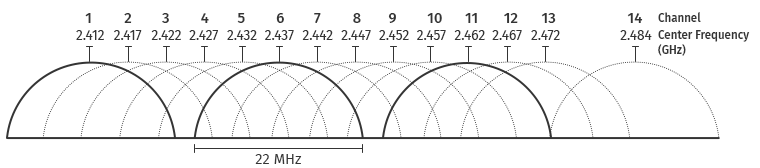
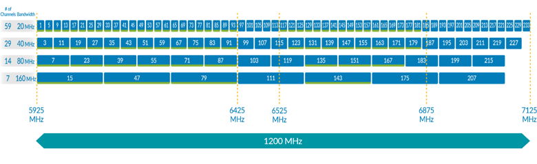

# 2. Беспроводные сети стандарта 802.11 (Wi-Fi)

Стандарты беспроводной связи разрабатывает и публикует институт IEEE. Для технологии Wi-Fi создано семейство стандартов 802.11, которое описывает, как передаются данные, работает безопасность и другие особенности беспроводных сетей.

сводная информация о версиях стандартов 802.11, характеризующих физический уровень беспроводных сетей

<table>
<thead>
<tr>
<th>Датавыпуска</th>
<th>Стандарт</th>
<th>Диапазон частот</th>
<th>Ширина полосы</th>
<th>Скорость передачи данных</th>
</tr>
</thead>
<tbody>
<tr>
<td>1997</td>
<td>802.11</td>
<td>2.4 ГГц</td>
<td>20 МГц</td>
<td>2 Мбит/с</td>
</tr>
<tr>
<td>1999</td>
<td>802.11b</td>
<td>2.4 ГГц</td>
<td>20 МГц</td>
<td>11 Мбит/с</td>
</tr>
<tr>
<td>1999</td>
<td>802.11a</td>
<td>5 ГГц</td>
<td>20 МГц</td>
<td>54 Мбит/с</td>
</tr>
<tr>
<td>2003</td>
<td>802.11g</td>
<td>2.4 ГГц</td>
<td>20 МГц</td>
<td>54 Мбит/с</td>
</tr>
<tr>
<td>2009</td>
<td>802.11n</td>
<td>2.4 ГГц; 5 ГГц</td>
<td>20; 40 МГц</td>
<td>600 Мбит/с</td>
</tr>
<tr>
<td>2013</td>
<td>802.11ac</td>
<td>5 ГГц</td>
<td>20; 40; 80;160 МГц</td>
<td>6.9 Гбит/с</td>
</tr>
<tr>
<td>2019</td>
<td>802.11ax</td>
<td>2.4 ГГц; 5 ГГц; 6 ГГц</td>
<td>20; 40; 80;160 МГц</td>
<td>9.6 Гбит/с</td>
</tr>
<tr>
<td>2024</td>
<td>802.11be</td>
<td>2.4 ГГц; 5 ГГц; 6 ГГц</td>
<td>до 320 МГц</td>
<td>46 Гбит/с</td>
</tr>
</tbody>
</table>

## WiFi Частоты

### Частота 2.4ГГц

- диапазон разделен на 14 частично пересекающихся каналов шириной 22 МГц
- Из 14 каналов в диапазоне 2,4 ГГц только три не перекрываются
- в одной локации стабильно могут работать только три точки доступа

### Частота 5ГГц

- использовать до 25 неперекрывающихся каналов
- одновременно работать до 25 точкам доступа без взаимных помех
- при превышении этого количества каналы начинают влиять друг на друга, что снижает качество соединения.

 

## Стандарт 801.11

- в 1997 году была опубликована спецификация 802.11.
- использовал радиочастотный диапазон 2,4 ГГц,
    - доступен всем и не требует лицензии
- Максимальная скорость передачи данных составляла 2 Мбит/с
    - чаще использовалась скорость 1 Мбит/с

## Стандарт 801.11b

- В 1999 году появился обновленный стандарт Wi-Fi в двух версиях: 802.11b и 802.11a.
- работал на частоте 2,4 ГГц
- скорость передачи данных увеличилась до 11 Мбит/с
- В реальных условиях передача данных шла со скоростью 5–6 Мбит/с
- чувствителен к помехам от других устройств на частоте 2,4 ГГц
    - снижало скорость или временно разрывало соединение
    - использовался ненадежный протокол WEP

## Стандарт 801.11a

- использованию частоты 5 ГГц
    - была менее подвержена помехам
    - уменьшило радиус действия сети
    - всего 20–25 метров
- низкую надежность протокола защиты сети WEP

## Стандарт 801.11g

- В 2003 году
- скорость до 54 Мбит/с
    - фактическая скорость 25–30 Мбит/с
- на частоте 2,4 ГГц
- поддержка протокола безопасности WPA (Wi-Fi Protected Access)

## Стандарт 801.11n

- В 2009 году
- Максимальная теоретическая скорость достигала 600 Мбит/с
    - на практике — 100–300 Мбит/с
- использованию улучшенных методов модуляции и кодирования
- MIMO (Multiple-input and Multiple-output) - позволяет объединять до четырех независимых каналов, что увеличивает общую скорость передачи данных и улучшает производительность сети.
- поддержка двух частотных диапазонов: 2,4 ГГц и 5 ГГц
    - настроить роутер для работы в одном из них или сразу в обоих
- Диапазон 2,4 ГГц
    - большую дальность
    - совместимость с оборудованием предыдущих стандартов
    - позволял использовать каналы шириной 20 или 40 МГц - увеличения скорости передачи данных
- В диапазоне 5 ГГц
    - использовать до 25 неперекрывающихся каналов
    - одновременно работать до 25 точкам доступа без взаимных помех

## Стандарт 801.11ac

- В 2013 году
- только в диапазоне 5 ГГц
- Ширина частотных каналов расширилась до 80 и 160 МГц
- технология MIMO позволяла объединять до восьми каналов в одном соединении
- Теоретически стандарт поддерживал скорость до 7 Гбит/с
    - обычно достигали 300–800 Мбит/с
- технология MU-MIMO (Multi-User MIMO) - точка доступа могла одновременно обслуживать несколько устройств без снижения скорости передачи данных
    - обеспечивает возможность создания индивидуального соединения с каждым подключенным устройством, даже если их несколько
    - позволяет точке доступа обслуживать их одновременно без потери скорости

## Стандарт 801.11ax

- известный как Wi-Fi 6
- появился в 2019 году
- в 2021 году его обновили, добавив расширенный диапазон частот — эту версию назвали Wi-Fi 6E
- Максимальная ширина частотного канала — 160 МГц
- достигать скорости до 9,6 Гбит/с
- совместима с устройствами старых стандартов, так как работает в диапазонах 2,4 и 5 ГГц
- Wi-Fi 6E диапазон частот расширился до 7,125 ГГц
    - позволяет выделять до семи каналов шириной 160 МГц

- поддерживающим развертывание сетей Wi-Fi в трех различных диапазонах частот

## Стандарт 801.11be

- известный как Wi-Fi 7
- В январе 2024
- в трех частотных диапазонах: 2,4, 5 и 6 ГГц
- Максимальная ширина канала увеличена до 320 МГц
- использование многопозиционных методов модуляции позволяет достигать скорости до 46 Гбит/с
- поддерживает объединение до 16 частотных каналов в одном подключении, обеспечивая сверхвысокую производительность сети
- технология MLO (Multi-Link Operation) - оптимизирует использование частотного ресурса
    - позволяет устройствам одновременно обмениваться данными в нескольких частотных диапазонах
    - значительно увеличивает общую скорость передачи информации
    - помогает динамически адаптировать соединение, выбирая наиболее свободный диапазон в зависимости от уровня помех

# 3. Механизмы безопасности сетей стандарта 802.11

С самого начала разработки стандартов 802.11 в них были внедрены меры для защиты беспроводных сетей. Это включало:
- аутентификацию пользователей;
    - проверка, чтобы в сеть подключались только те, кому разрешено. Для этого используются логин, адрес устройства и пароль
- контроль целостности и подлинности пакетов;
    - защищает информацию в сети от подмены
- шифрование передаваемых данных.
    - обеспечивает их конфиденциальность даже в случаях, если данные будут перехвачены злоумышленником
    - криптографических алгоритмов — RC4 или AES (Advanced Encryption Standard)

## Протокол WEP (Wired Equivalent Privacy)

- появился вместе с первой версией стандарта 802.11
- оказался крайне ненадежным из-за использования алгоритма шифрования RC4 (Rivest Cipher 4) со статическим ключом

поддерживает два типа аутентификации устройств.
- **Open System** Этот способ создает открытую сеть, к которой может подключиться любое устройство. Ключи WEP используются только для шифрования данных, но не для проверки подключающихся устройств.
- **Shared Key** Здесь точка доступа и устройство должны иметь одинаковый сетевой ключ.

Процесс аутентификации проходит так:
1. Устройство отправляет запрос на подключение.
1. Точка доступа отвечает коротким сообщением.
1. Устройство шифрует это сообщение своим ключом и отправляет обратно.
1. Точка доступа проверяет ключ, расшифровывая сообщение и сравнивая его с исходным.

**Процесс шифрования данных**

- Формирование ключевого потока происходит с применением ключа длиной 40 или 104 бит
- К ключу вариативно добавляется 24-битный вектор инициализации (Initialization Vector, или IV)
- при отправке каждого пакета формируется новый вектор инициализации

- к пользовательскому ключу добавляется вектор инициализации, увеличивая его длину до 64 или 128 бит

<ins style="color: red">Главный недостаток</ins>:
- использование алгоритма CRC-32 для проверки целостности пакетов
    - не криптографический: он просто вычисляет 32-разрядную контрольную сумму при отправке данных и проверяет ее при получении
    - как правила расчета контрольной суммы известны, злоумышленник может создать поддельный пакет, который сеть примет как настоящий
- Уязвимость связана с повторением вектора инициализации, что позволяет провести brute-force-атаку
    - Злоумышленник может записывать пакеты с одинаковым вектором инициализации, которые передаются в сети
    - перебирает возможные варианты статической части ключа, чтобы взломать защиту и получить доступ к сети
- если в сети есть устройства, которые не поддерживают 128-битные ключи, они будут создавать уязвимость, даже если остальные устройства используют более надежное шифрование

Чтобы повысить защиту при использовании WEP, рекомендуется:
- Устанавливать максимально длинный ключ.
- Включать обязательную аутентификацию пользователей.

## Протокол WPA (Wi-Fi Protected Access)

- В 2003 году

Усовершенствованный метод аутентификации допускает два варианта реализации этой процедуры.
- **WPA-PSK (Pre-Shared Key)** Этот метод предусматривает создание администратором сети общего пароля (ключа безопасности), значение которого должно быть известно всем легитимным участникам сети.
- **WPA-Enterprise** Этот способ позволяет настраивать доступ к сети индивидуально для каждого пользователя — например, путем назначения им уникальных идентификаторов и персональных паролей. Такой подход позволяет более гибко управлять доступом к сети, но требует развертывания и поддержания в сети сервера аутентификации (например, RADIUS).

Для контроля целостности пакетов и проверки подлинности отправителей в WPA используется алгоритм **MIC (Message Integrity Check)**

Криптографическая защита данных усилена благодаря протоколу **TKIP (Temporal Key Integrity Protocol)**

**Процедура шифрования данных**

После аутентификации пользователя в процессе «рукопожатия» создается временный ключ шифрования TK (Temporal Key)
- Этот ключ смешивается с адресом устройства в двух этапах, затем объединяется с вектором инициализации и используется для шифрования данных.
- Каждое устройство в сети получает свой уникальный ключ
    - если злоумышленник получит ключ одного пользователя, он сможет расшифровать только его данные

<ins style="color: red">Уязвимости</ins>:
- Протокол WPA имеет уязвимости. Одна из них связана с реакцией сети на ложные фреймы: если алгоритм MIC обнаруживает измененный пакет, точка доступа блокирует все соединения на 60 секунд. Злоумышленник может воспользоваться этой особенностью, отправляя ложные фреймы, чтобы намеренно отключить сеть.
- Криптографическая защита, несмотря на использование ключей увеличенной длины, оказалась неустойчива к brute-force-атакам.
- Еще одна уязвимость WPA связана с технологией WPS (Wi-Fi Protected Setup)
    - озволяет подключаться к роутеру без пароля, если есть физический доступ к устройству
    - Включенный WPS позволяет вычислить пин-код путем перебора значений

## Протокол WPA 2

- выпущенный в 2004 году
- описан в стандарте [IEEE 802.11i](https://ieee802.org/16/liaison/docs/80211-05_0123r1.pdf), и с 2006 года все производители оборудования должны были обеспечивать его поддержку для прохождения сертификации своих Wi-Fi-устройств
- используется протокол CCMP (Counter Mode with Cipher Block Chaining Message Authentication Code Protocol)
    - защищает сеть от подмены пакетов злоумышленником.
- Для шифрования трафика применяется алгоритм AES (Advanced Encryption Standard) с длиной ключа 128 бит

> **Фрейм деаутентификации** - это специальный пакет, в котором содержится запрос на отключение от сети.

<ins style="color: red">Уязвимости</ins>:
- связана с алгоритмом четырехэтапного «рукопожатия», используемого при аутентификации
    - Злоумышленник может перехватить пакеты рукопожатия и использовать их для подбора пароля к сети
    - атака с переустановкой ключа (KRACK — Key Reinstallation Attack)
    - Во время атаки
        - злоумышленник перехватывает третий пакет рукопожатия и отправляет его клиенту повторно
        - вызывает переустановку ключа и обнуление счетчика пакетов, который отвечает за создание ключевого потока
        - В результате следующие пакеты шифруются тем же ключевым потоком, что и предыдущие. Это позволяет злоумышленнику собрать достаточно данных для подбора ключа.
- незащищенность процедуры отключения клиента от сети
    - клиентское устройство посылает точке доступа от своего адреса фрейм деаутентификации
    - точка доступа не проверяет подлинность этого фрейма и прекращает обслуживание клиентского устройства
    - при осуществлении атаки деаутентификации
        - злоумышленник формирует ложные кадры деаутентификации клиентов сети и отправляет их точке доступа
        - приводит к временному или полному отключению клиентов и блокирует нормальную работу сети
        - атака может быть использована как предварительный шаг для осуществления других атак

## Протокол WPA 3

ощутимые улучшения.
- **Индивидуальное шифрование данных** При подключении нового устройства к публичной сети используется метод, исключающий общий пароль. Подключение возможно через QR-коды или NFC-метки благодаря новому протоколу DPP (Device Provisioning Protocol). Для шифрования применяется алгоритм GCMP-256 вместо AES с 128-битным ключом.
- **Защищенный метод аутентификации** Протокол SAE (Simultaneous Authentication of Equals) устраняет риск атак с переустановкой ключа и перехватов данных для подбора пароля.
- **Усиленная защита от подбора пароля** Ограничено количество попыток ввода пароля до одной за сеанс. Каждая попытка требует взаимодействия с сетью, что делает невозможными brute-force-атаки с использованием перехваченных пакетов.

Между тем, сегодня протокол WPA 3 считается наиболее надежным для применения как в домашних, так и корпоративных сетях.

## Итоги

основные рекомендации по настройке и использованию беспроводных сетей
- Настройте маршрутизатор так, чтобы сигнал не выходил за пределы контролируемой зоны. Это заставит злоумышленника находиться близко и увеличит вероятность его обнаружения.
- Используйте WPA2 или WPA3 и не подключайте устройства с устаревшими стандартами безопасности. Отключите функцию WPS на маршрутизаторе.
- Настройте «белый список» MAC-адресов устройств, которым разрешен доступ к сети.
- Используйте сложные и устойчивые к подбору пароли. Избегайте словарных паролей, так как они легко взламываются.
- Создайте отдельные сети для сотрудников и гостей. Гостям предоставляйте только доступ в интернет, исключая доступ к корпоративным ресурсам.
- Регулярно проверяйте контролируемую зону на наличие несанкционированных точек доступа и отключайте их.
- Проводите обучение сотрудников по информационной безопасности, рассказывайте о причинах и последствиях инцидентов и вовлекайте их в обеспечение безопасности компании.

# 4. Сети IoT

> технология, которая объединяет устройства через сеть для обмена данными и выполнения задач без участия человека. Такие устройства с датчиками и микропроцессорами взаимодействуют друг с другом, создавая единую систему.

В сетях IoT в зависимости от предъявляемых к ним требований используются беспроводные технологии трех типов:
1. **Low Power Short Range Networks** сети малого радиуса действия, обеспечивающие низкое энергопотребление ее элементов.
    - ZigBee
	- [WirelessHart](https://kipia.info/publication/wireless-hart-pojaluy-edinstvennyiy-besprovodnoy-protokol-svyazi-udovletvoryayuschiy-trebovaniyam-ryinka-asutp/)
	- Wi-Fi
	- [6LoWPAN](https://sofiot.ru/blog/protokoly/chto-takoe-6lowpan/)
	- [Bluetooth low energy (BLE)](https://wireless-e.ru/standarty/bluetooth-smart/)
1. **Low Power Wide Area Networks** энергоэффективные сети большого радиуса действия.
    - [SigFox](https://www.rohde-schwarz.com/cac/solutions/wireless-communications-testing/iot-m2m-testing/sigfox/sigfox_234026.html?change_c=true)
	- [Symphony Link](https://www.mokosmart.com/ru/what-is-lpwan-low-power-wide-area-network/)
	- [Ingenu (RPMA)](https://cnx-software.ru/2016/11/21/pristalnyj-vzglyad-na-ingenu-rapn-alterna/)
	- [Weightless](https://habr.com/ru/companies/commandspot/articles/390825/#:~:text=%D0%BE%D0%B3%D1%80%D0%B0%D0%BD%D0%B8%D1%87%D0%B5%D0%BD%D0%BD%D0%B0%D1%8F%20%D0%BF%D0%BE%D0%BC%D0%B5%D1%85%D0%BE%D1%83%D1%81%D1%82%D0%BE%D0%B9%D1%87%D0%B8%D0%B2%D0%BE%D1%81%D1%82%D1%8C-,Wheitghless,-Weightless%20%E2%80%94%20%D0%B3%D1%80%D1%83%D0%BF%D0%BF%D0%B0%20%D0%BE%D1%82%D0%BA%D1%80%D1%8B%D1%82%D1%8B%D1%85)
    - LoRa
1. **Cellular Network** технологии, использующие радиоинтерфейсы сотовой связи.
    - задействуют инфраструктуру операторов мобильной связи
    - могут быть развернуты только в той местности, где есть сотовая сеть
    - [EC-GSM-IoT](https://wireless-e.ru/iot/3gpp/), работающий в сетях GSM
    - [NB-IoT](https://itechinfo.ru/content/%D0%BE%D0%B1%D0%B7%D0%BE%D1%80-%D1%82%D0%B5%D1%85%D0%BD%D0%BE%D0%BB%D0%BE%D0%B3%D0%B8%D0%B9-cellular-network) на базе LTE.

> Наиболее широкое применение получили технологии двух первых типов, которые работают в нелицензируемых общедоступных диапазонах частот – ISM.

**Диапазон ISM (Industrial, Scientific, Medical)**

представляет собой участки радиоспектра общего назначения, работа в которых не требует государственной регистрации передатчиков и получения лицензий на использование радиочастот

- в США это частоты 902–928 МГц
- в Европе — 868,7–869,2 МГц

На рисунке ниже представлена диаграмма сравнения некоторых беспроводных технологий по радиусу их действия и скорости передачи данных.

Характеристики наиболее популярных стандартов беспроводных радиоинтерфейсов приведены в таблице ниже

<table>
<thead>
<tr>
<th>Технология</th>
<th>Дальность</th>
<th>Скорость</th>
<th>Энергоэффективность</th>
<th>Применение</th>
</tr>
</thead>
<tbody>
<tr>
<td>Wi-Fi</td>
<td>300 м</td>
<td>до 9,6 Гбит/с</td>
<td>низкая</td>
<td>Умные дома, промышленность</td>
</tr>
<tr>
<td>BLE</td>
<td>100 м</td>
<td>До 2 Мбит/с</td>
<td>высокая</td>
<td>Носимые устройства, трекеры</td>
</tr>
<tr>
<td>ZigBee</td>
<td>100 м</td>
<td>До 250 Кбит/с</td>
<td>высокая</td>
<td>Умный дом, автоматизация зданий</td>
</tr>
<tr>
<td>Z-Wave</td>
<td>100 м</td>
<td>До 100 Кбит/с</td>
<td>высокая</td>
<td>Умный дом, системы безопасности</td>
</tr>
<tr>
<td>LoRaWAN</td>
<td>20 км</td>
<td>До 50 Кбит/с</td>
<td>очень высокая</td>
<td>Сельское хозяйство, мониторинг</td>
</tr>
<tr>
<td>NB-IoT</td>
<td>10 км</td>
<td>До 250 Кбит/с</td>
<td>высокая</td>
<td>Умные счетчики, инфраструктура</td>
</tr>
<tr>
<td>SigFox</td>
<td>50 км</td>
<td>До 100 бит/с</td>
<td>очень высокая</td>
<td>Мониторинг окружающей среды</td>
</tr>
<tr>
<td>5G</td>
<td>10 км</td>
<td>До 10 Гбит/с</td>
<td>средняя</td>
<td>Промышленность, транспорт</td>
</tr>
</tbody>
</table>

## ZigBee

> беспроводная технология с низкой скоростью передачи данных и низким энергопотреблением, предназначенная для работы на небольшом расстоянии

- используют для сбора данных от датчиков, управления устройствами и автоматизации
- поддерживает разные виды сетей и может автоматически передавать сообщения между узлами.
- работает на радиоволнах с частотой 868 МГц, 915 МГц и 2,4 ГГц
    - На частоте 2,4 ГГц данные передаются со скоростью до 250 кбит/с
    - каналы для передачи данных имеют ширину 5 МГц
- В реальной жизни скорость передачи обычно от 5 до 40 кбит/с
- В помещении ZigBee работает на расстоянии в десятки метров, а на улице сигнал может дойти до сотен метров

- основана на стандарте IEEE 802.15.4 и имеет свою спецификацию ZigBee
- поддерживает разные виды сетей: от простой связи «точка-точка» до сложных ячеистых сетей

**Основной вариант сети ZigBee**
- самоорганизующаяся ячеистая топология. Устройства могут связываться друг с другом напрямую или через промежуточные узлы
- обеспечивается автоматическим построением оптимальных маршрутов передачи данных
- есть координатор
    - управляет маршрутизаторами
    - прокладывает маршруты
    - автоматически перестраивает их при подключении или отключении устройств.

<ins style="color:green">Преимущества</ins>
- позволяет создавать сложные сети
- устройства могут передавать данные даже при временных перебоях связи
- легко настроить
- радиомодули потребляют мало энергии

<ins style="color:red">Недостатки</ins>
- работает на частотах, которые уже сильно загружены другими устройствами
- скорость передачи данных в реальности редко превышает 50 кбит/с
- Радиус действия небольшой
- устройства разных производителей могут быть несовместимы из-за отсутствия единого стандарта

### Безопасность

- обеспечивается шифрованием данных с помощью алгоритма AES-128
- роверяет целостность и подлинность пакетов по протоколу MIC

две модели безопасности:
- **централизованная**
    - Чаще используется <ins>централизованная модель с доверенным центром управления ключами</ins> (ZigBee Trust Center)
    - Доверенный центра выполняет следующие задачи:
        - формирует и хранит ключи доступа к сети;
        - использует хранящиеся ключи для настройки доступа подключающихся устройств;
        - управляет службой авторизации устройств сети.
- **распределенная**
    - не использует доверенные центры
    - новые устройства присоединяются к сети с использованием общего ключа (аналогично при аутентификации WPA-PSK)

Обе считаются надежными

Обнаруженные на текущий момент уязвимости радиоинтерфейсов ZigBee связаны с ошибками во внутреннем ПО устройств, которые были допущены их производителями

# 5. Технология связи LoRa

**LoRaWAN (Long Range Wide Area Networks)**

- разработан в 2015
- *главное преимущество* - может работать на расстоянии до 20 км
- обычно работают по принципу «звезда»: базовые станции получают данные от устройств и передают их на сервер

Базовые станции подключены к серверу через обычный интернет, а устройства связываются с базовыми станциями напрямую с помощью LoRa.

- Сигнал LoRa использует частоту 125 кГц
- передает данные со скоростью от 300 бит/с до 5 кбит/с
    - может изменяться автоматически благодаря технологии ADR (Adaptive Data Rate)
- работают в нелицензируемых диапазонах частот
- В России используются частоты 433 и 868 МГц при условии соблюдения ограничений по мощности передатчика (до 25 мВт)
- Чаще всего сети LoRaWAN развертываются в диапазоне 868 МГц.

На скорость передачи и дальность связи влияет параметр **SF (Spreading Factor)**: он расширяет сигнал и делает его более устойчивым к помехам, но снижает скорость передачи.

Зависимость скорости передачи данных и дальности связи от параметра SF приведена на таблице ниже.

<table>
<tbody>
<tr>
<th>SF в полосе 125 кГц</th>
<th>Скорость передачи данных</th>
<th>Дальность связи, км</th>
</tr>
<tr>
<td>7</td>
<td>5470 бит/с</td>
<td>2</td>
</tr>
<tr>
<td>8</td>
<td>3125 бит/с</td>
<td>4</td>
</tr>
<tr>
<td>9</td>
<td>1760 бит/с</td>
<td>6</td>
</tr>
<tr>
<td>10</td>
<td>980 бит/с</td>
<td>8</td>
</tr>
<tr>
<td>11</td>
<td>440 бит/с</td>
<td>11</td>
</tr>
<tr>
<td>12</td>
<td>290 бит/с</td>
<td>15</td>
</tr>
</tbody>
</table>

Сети LoRaWAN имеют гибкую архитектуру, которая упрощает их настройку и управление. Передача данных управляется центральным сервером LoRaWAN и серверами приложений.

- **Центральный сервер** передает данные между базовыми станциями и сервером приложений, а также следит за параметрами сети
- **Сервер приложений** расшифровывает данные и предоставляет доступ к ним только авторизованным пользователям.

## Безопасность

- встроена система безопасности, которая защищает данные и контролирует доступ устройств к сети с помощью шифрования AES-128

**два типа ключей**
- *Сетевой ключ (NwkSkey)* — проверяет, что данные целы и отправлены настоящим устройством.
- *Ключ приложения (AppSkey)* — шифрует пользовательские данные.

ключи создаются при подключении устройства к сети и хранятся в защищенной памяти радиомодуля
- Сетевой ключ передается на сетевой сервер
- ключ приложения — на сервер приложений

**два метода аутентификации и активации**
- *Активация по воздуху*
    1. Устройство отправляет запрос на подключение к сети
    2. Во время подключения сеть проверяет его данные (идентификация и авторизация). 
    3. Если все проходит успешно, устройству присваивается адрес и маркер, который используется для создания сессионных ключей
    4. Эти ключи не передаются напрямую, а рассчитываются на устройстве, что делает процесс безопасным.
- *Активация через персонализацию*
    1. Устройство заранее настраивается на работу с определенной сетью
        - при производстве в него записывают уникальные ключи (DevAddr, NwkSkey и AppSkey)
    2. После включения устройство сразу готово к работе.
    - Благодаря уникальным ключам для каждого устройства, компрометация одного из них не угрожает безопасности других.

## Итоги

Технология LoRa выделяется большой дальностью связи, низким энергопотреблением, хорошей масштабируемостью, устойчивостью к помехам и надежной защитой каналов передачи данных. Однако у нее есть и слабые стороны: низкая скорость передачи информации и зависимость от инфраструктуры оператора.

Несмотря на эти ограничения, LoRaWAN идеально подходит для приложений, где важны широкая зона покрытия, энергоэффективность и простота подключения. Ограничения скорости делают ее менее пригодной для задач с высокими требованиями к пропускной способности, но в сценариях IoT, где приоритет — надежная связь и экономия энергии, эта технология показывает себя с лучшей стороны.
