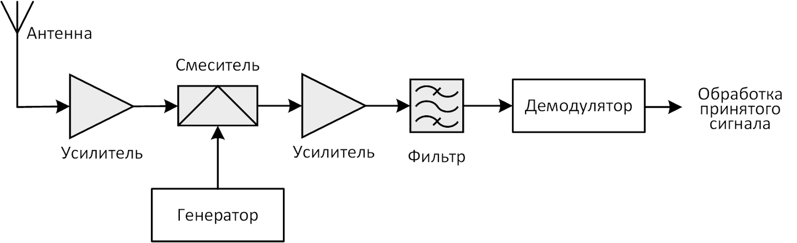
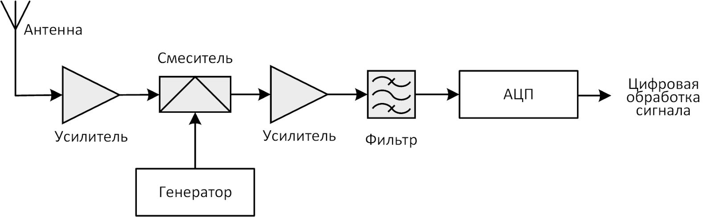
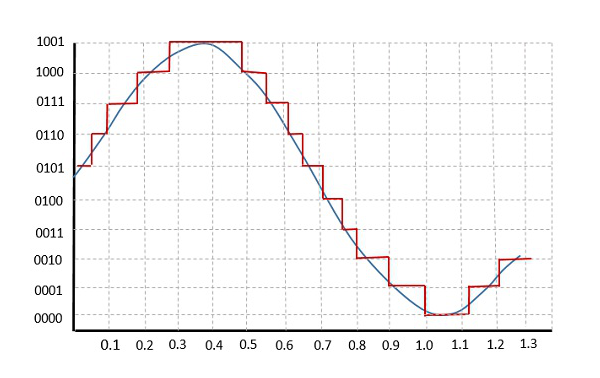

# 1. Введение

Обязательными элементами любой системы связи являются радиоприемное и радиопередающее устройства. Часто они выполняются как одно устройство и называются приемопередатчиком, или трансивером (сочетание слов «трансмиттер» и «ресивер»). Приемники и передатчики в разных системах связи могут сильно отличаться, потому что их делают под определенные сигналы или стандарты. Обычно сигнал обрабатывают с помощью устройств, то есть на аппаратном уровне.

Существует технология, позволяющая создавать более универсальные устройства связи, — технология программно определяемых радиосистем (Software Defined Radio, или SDR).

> **Программно определяемая радиосистема**<br>это радиосистема, в которой основная часть функций по обработке сигналов выполняется с помощью программного обеспечения, а не на аппаратном уровне.

Эта технология позволяет делать устройства, которые поддерживают разные стандарты связи. Это возможно, потому что обработка сигналов в таких устройствах выполняется программно, а не только с помощью аппаратных компонентов.

Программно определяемая радиосистема очень часто реализуется с применением обычного компьютера и подключенной к нему SDR-платформы

SDR-радиосистема может служить инструментом для формирования и обработки сигналов системах радиолокации, навигации, радиоуправления и радиомониторинга

Технология SDR оказалась применима во многих областях техники:
- исследованиях в области цифровой обработки сигналов
- моделировании и макетировании систем и средств радиолокации и радионавигации
- реализации многофункциональных приемопередающих устройств.

Также с помощью этой технологии возможны атаки типа «человек посередине». Чтобы защищаться от таких атак и выявлять слабые места в каналах связи, важно применять программно определяемое радио.

# 2. Введение в технологию SDR: базовые принципы, типовые архитектуры

Концепция SDR
- аппаратная часть трансивера используется только для перевода сигнала из высоких частот в низкие
- Все остальные функции, такие как обработка сигнала, выполняются программно после преобразования сигнала из аналогового в цифровой

Мы объясним, как работает технология SDR, сравнив ее с традиционным радиоприемником. В обычных радиоприемниках весь сигнал обрабатывается с помощью аппаратных устройств. На рисунке ниже показана простая схема такого приемника.



- Сигнал с антенны после предварительного усиления смешивается с сигналом опорного генератора (гетеродина)
- в результате его частота переносится в область низких частот
- где выполняется дополнительное усиление, фильтрация и демодуляция

- Опорный генератор выполняет здесь вспомогательную функцию по частотному преобразованию
- фильтрация обеспечивает выделение для дальнейшей обработки именно той полосы частот, в которой работает система связи.

[Подробнее об этих преобразованиях](https://digteh.ru/WLL/PrmSupGeter.php)

В таких приемниках используется аппаратный демодулятор для обработки частотно-модулированных сигналов. После этого сигнал проходит низкочастотную фильтрацию, а затем преобразуется в звук.

Радиоприемное устройство, построенное по технологии SDR, имеет схожую конфигурацию с предыдущей схемой — конкретно в той части, которая отвечает за настройку приемника на рабочую частоту и перенос принятого сигнала в область низких частот.



- После фильтрации сигнал преобразуется в цифровую форму с помощью аналого-цифрового преобразователя (АЦП)
- передается в программируемую систему обработки
- выполняются такие задачи
    - демодуляция
    - помехоустойчивая декодировка
    - разуплотнение. 

основные параметры аналого-цифрового преобразования (АЦП или ADC)

Для иллюстрации этих процедур на рисунке ниже синим цветом изображен вид произвольного аналогового сигнала, а красным — его цифровая форма. Как видно, цифровая копия сигнала повторяет кривую аналогового сигнала с определенной точностью, которая определяется размером шага его дискретизации.

 

> **Дискретизация по уровню (квантование)** — это процесс, при котором диапазон значений сигнала делится на уровни, каждому из которых присваивается номер в виде двоичного кода.

> **Дискретизация по времени (сэмплированием)** происходит, когда уровень сигнала измеряют через равные промежутки времени, которые называют периодом дискретизации. Измеренные значения (отсчеты или сэмплы) также записываются в виде двоичного кода.

Оба вида дискредитаций применяются вместе внутри АЦП.

Чем больше уровней квантования и чем чаще берутся сэмплы, тем точнее цифровая копия повторяет аналоговый сигнал. Частоты сэмплирования и дискретизации выбираются по [теореме Котельникова](https://hub.exponenta.ru/post/osnovy-tsos-teorema-kotelnikova-atsp-i-tsap484).

```
Согласно теореме Котельникова, чтобы точно восстановить аналоговый сигнал из цифровых отсчетов, частота дискретизации должна быть как минимум в два раза больше максимальной частоты сигнала.

То есть, например, чтобы оцифровать звуковой сигнал с максимальной частотой 22 кГц, необходимо брать его отсчеты с частотой 44 кГц.
```

- Частоту дискретизации часто измеряют в сэмплах в секунду
- Количество уровней квантования задается производителями АЦП и зависит от требуемой точности
- Количество уровней квантования определяет так называемый **[динамический диапазон сигнала](https://dernasherbrezon.com/posts/dynamic-range/)**, который представляет собой диапазон возможных значений уровня сигнала.

Большинство современных SDR-устройств работают по квадратурной схеме обработки сигнала (схема показана ниже). В этой схеме сигнал, переносимый в область низких частот, разделяется на две части:
- синфазную (In-phase);
- квадратурную (Quadrature).


Каждая из этих составляющих оцифровывается отдельно, и сэмплы передаются на дальнейшие этапы обработки парами (такие пары называют еще квадратурным отсчетами, или IQ-сэмплами). Дальнейшая обработка в этом случае заключается реализации в цифровой форме процедур:
- демодуляции;
- помехоустойчивого декодирования;
- деперемежения;
- разуплотнения и пр.

Делается это для упрощения дальнейших математических преобразований оцифрованных сигналов, детали которых вам не обязательно знать. Но важно понимать, что при оцифровке двух составляющих сигнала одновременно можно использовать частоту дискретизации, равную ширине полосы частот сигнала.

Обозначим основные характеристики SDR-платформ, чтобы вы понимали, как выбрать нужную под свои задачи
1. **диапазон рабочих частот радиомодуля**
    - зависит от конфигурации устройства
    - показывает, в каком частотном диапазоне можно принимать или передавать сигналы
    - чтобы использовать SDR для работы с определенной системой связи, диапазон частот устройства должен охватывать диапазон частот этой системы
1. **частота дискретизации АЦП или ЦАП**
    - При квадратурной обработке сигнала она определяет <ins>максимальную ширину полосы частот</ins>, которую устройство может обрабатывать
1. **архитектура**
    - простой и популярный вариант — прямое подключение аналого-цифрового преобразователя к компьютеру
        - вся обработка сигнала выполняется с помощью программного обеспечения
    - между компьютером и АЦП установлен программируемый аппаратный модуль, например, ПЛИС, микроконтроллер или цифровой сигнальный процессор
        - модули берут на себя часть обработки сигнала, уменьшая нагрузку на компьютер
        - подходит для автономных и портативных устройств, не требующих подключения к компьютеру
        - требует навыков разработки программ для этих модулей

# 3. Аппаратные платформы с архитектурой SDR


